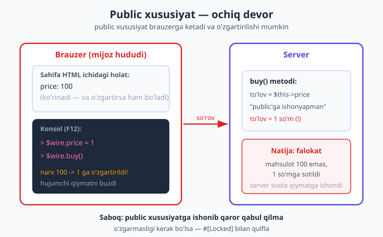
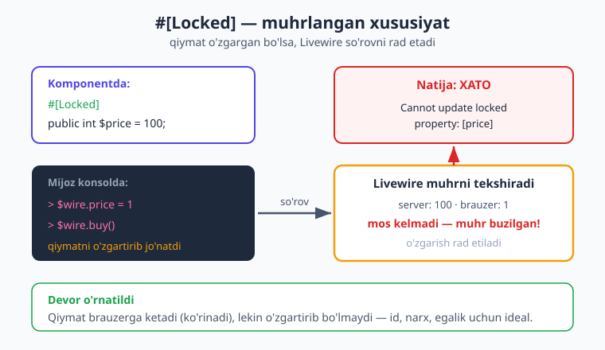
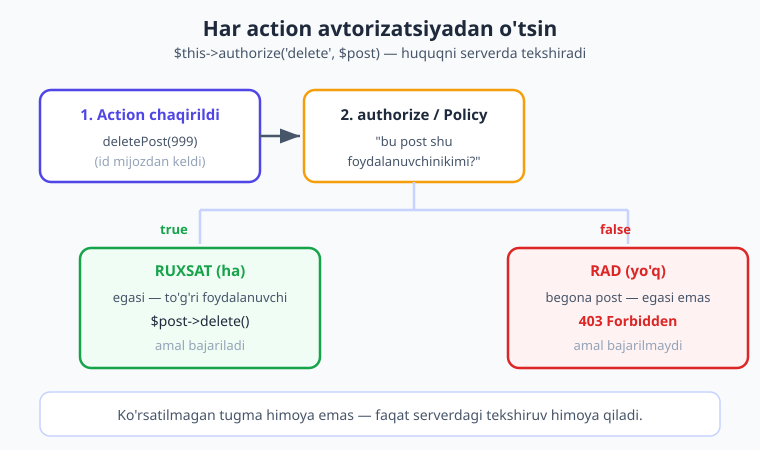

# 23 — Xavfsizlik

[⬅️ Oldingi: 22 — Alpine.js integratsiyasi](./22-alpine-js.md) · [🏠 Kitob boshi](./README.md) · [Keyingi: 24 — Testlash ➡️](./24-testing.md)

> **Bu bobda:** Livewire'ning eng muhim haqiqati bilan tanishamiz — **komponentingizdagi barcha `public` xususiyat va metod mijozga (brauzerga) ochiq.** Tajribali hujumchi brauzer konsolidan ulardan istalganini o'zgartirishi yoki chaqirishi mumkin. Biz uchta jiddiy, real hayotiy xavfni ko'rib chiqamiz: narxni o'zgartirib qo'yish, begona ma'lumotni o'chirish, ishonchsiz kiritmani ishlatish. Har biri uchun yechim bor: `#[Locked]`, avtorizatsiya, validatsiya, mass-assignment himoyasi. Oxirida `{!! !!}` orqali XSS, CSRF va to'liq xavfsizlik checklisti.

---

## Boshlash: bu bob nega eng muhimi

Avvalgi boblarda biz "ishlaydigan" kod yozdik — tugma bossa hisob oshadi, forma jo'natilsa ma'lumot saqlanadi. Ammo **ishlaydigan kod hali xavfsiz kod emas.** Internetda sizning ilovangizni faqat halol foydalanuvchilar emas, qiziquvchan va yomon niyatli odamlar ham ochadi. Ulardan ba'zilari brauzerning **Developer Tools** (F12) oynasini ochib, sizning kodingiz "ichida" nima borligini ko'radi va o'ynamoqchi bo'ladi.

Livewire bu jihatdan o'ziga xos. Oddiy server ilovasida (masalan, faqat Blade) ma'lumot serverdan brauzerga **bir tomonga** oqadi. Livewire'da esa komponentingiz holati (state) doimo ikki tomonga sayohat qiladi: serverdan brauzerga va orqaga. Demak, holatingizning bir nusxasi **doimo brauzerda turadi** — va brauzer — bu foydalanuvchining hududi, sizniki emas.

> **Hayotiy o'xshatish — oynasi ochiq uy.** Tasavvur qiling, do'kon qurdingiz. Tovarlar peshtaxtada, narxlar yorliqda. Lekin do'koningizning bir devori yo'q — butunlay ochiq, ko'chadan har kim ichkariga qo'l cho'zib, narx yorlig'ini almashtirib qo'yishi yoki javondan tovar olib chiqib ketishi mumkin. Siz "narxni 100 so'm" deb yozib qo'ygansiz, lekin mijoz qo'lini cho'zib yorliqni "1 so'm"ga almashtiradi — kassa esa shu yangi yorliqqa **ishonadi**. Mana shu — Livewire komponentining `public` qismi. U **ochiq devor**. Bu bobning butun mohiyati: qaysi narsani ochiq qoldirish mumkin, qaysi birini mustahkam devor bilan to'sish kerakligini o'rganish.

Texnik haqiqat juda sodda, lekin uni hech qachon unutmang:

!!! danger "Eng asosiy qoida"
    Komponentingizdagi **HAR BIR `public` xususiyat brauzerga yuboriladi** va foydalanuvchi tomonidan **o'zgartirilishi** mumkin. **HAR BIR `public` metodni** foydalanuvchi brauzer konsolidan **istalgan parametr bilan chaqirishi** mumkin. Ularning hech biri "yashirin" yoki "ishonchli" emas. Hech qachon `public` ma'lumotga ishonib qaror qabul qilmang — har doim tekshiring.



Keling, har bir xavfni alohida, real misol bilan ko'rib chiqamiz — va darhol yechimini ham beramiz.

---

## Holat brauzerda qanday ko'rinadi

Avval "ochiq devor"ni o'z ko'zimiz bilan ko'rib qo'yaylik. Quyidagi oddiy komponentni olaylik:

```php
{{-- resources/views/components/⚡product-card.blade.php --}}
<?php

use Livewire\Component;

new class extends Component
{
    public int $price = 100;     // narx — so'mda
    public int $quantity = 1;    // soni

    public function buy(): void
    {
        // to'lov logikasi: $this->price * $this->quantity
    }
};
?>

<div>
    <h2>Mahsulot — {{ $price }} so'm</h2>
    <input type="number" wire:model="quantity">
    <button wire:click="buy">Sotib olish</button>
</div>
```

Bu komponent ekranda chiroyli ko'rinadi: "Mahsulot — 100 so'm". Endi foydalanuvchi F12 bosib, brauzer konsolini ochsa, sahifaning HTML'ida (Livewire komponenti devorida) taxminan shunday narsani topadi:

```json
{
    "data": {
        "price": 100,
        "quantity": 1
    }
}
```

Mana, narx — ko'rinib turibdi. Bu shunchaki ko'rinmaydi — uni **o'zgartirsa ham bo'ladi.** Livewire har bir komponent uchun maxsus JavaScript "ko'prik" beradi (`$wire`). Hujumchi konsolda quyidagini yozadi:

```javascript
// hujumchi brauzer konsolida shuni yozadi:
$wire.price = 1
$wire.buy()       // endi server price=1 deb hisoblaydi!
```

Va eng yomoni — agar `buy()` metodingiz `$this->price` ga **ishonib** to'lov summasini hisoblasa, foydalanuvchi mahsulotni 100 so'm o'rniga **1 so'mga** sotib oladi. Server o'zgartirilgan qiymatni xohish bilan qabul qiladi, chunki siz unga "bu qiymat ishonchli" deb aytmagansiz.

!!! warning "Ehtiyot bo'ling"
    `wire:model="quantity"` — bu **kutilgan** o'zgarish: foydalanuvchi sonni o'zi tanlaydi, bu normal. Lekin `price` ga hech qaysi `wire:model` bog'lanmagan — siz uni "faqat ko'rsatish uchun" deb o'ylaysiz. Livewire esa farqni bilmaydi: ikkalasi ham `public`, demak ikkalasi ham **o'zgartirilishi mumkin.** "Hech qayerda input yo'q, demak o'zgarmaydi" degan o'y — eng keng tarqalgan va eng xavfli xato.

---

## Xavf 1 — public xususiyat o'zgartiriladi

Yuqoridagi `price` misoli birinchi xavfning aniq namunasi. Lekin bu faqat narx haqida emas. O'ylab ko'ring, qaysi xususiyatlar **hech qachon** foydalanuvchi tomonidan o'zgarmasligi kerak edi:

```php
public int $price = 100;       // narx — o'zgarsa, arzonga oladi
public int $userId = 5;        // kim ekanligi — o'zgarsa, boshqa hisobni boshqaradi
public bool $isAdmin = false;  // admin huquqi — true qilsa, hamma narsaga ruxsat
public int $orderId = 42;      // qaysi buyurtma — o'zgarsa, begona buyurtmani ko'radi
```

Bularning **har biri** halokatli. Eng xavflisi — `$isAdmin`:

```php
// XAVFLI KOD — hech qachon shunday qilmang!
public bool $isAdmin = false;

public function mount(): void
{
    $this->isAdmin = auth()->user()->is_admin;  // serverda to'g'ri o'rnatildi...
}

public function deleteEverything(): void
{
    if ($this->isAdmin) {        // ...lekin bu yerda public'ga ishonyapmiz!
        // hamma ma'lumotni o'chirish
    }
}
```

`mount()` da `isAdmin` to'g'ri o'rnatiladi — oddiy foydalanuvchida `false`. Lekin u brauzer konsolida `$wire.isAdmin = true` deb yozadi-da, `$wire.deleteEverything()` ni chaqiradi. Server `isAdmin` ning **yangi, soxta** qiymatiga ishonadi. Falokat.

> **Hayotiy o'xshatish — soxta nishon.** Aeroportda xizmatchi sizning ko'kragingizdagi nishonchaga qarab "VIP zona"ga kiritadi. Agar nishonchani uydan o'zingiz chop etib taqib olsangiz-chi? Xizmatchi har safar haqiqiy ro'yxatdan tekshirmasa, soxta nishon bilan ham kirib ketasiz. `public $isAdmin` — aynan o'zingiz chop etib taqsa bo'ladigan nishoncha.

---

## Yechim 1 — `#[Locked]` atributi

Livewire bu xavfga aniq yechim beradi: `#[Locked]` (qulflangan) atributi. Bu atribut bilan belgilangan xususiyatni Livewire serverga qaytib kelganda **tekshiradi**: agar brauzerdagi qiymat serverdagidan farq qilsa — ya'ni kimdir o'zgartirgan bo'lsa — Livewire so'rovni darhol **rad etadi va xato tashlaydi.**

```php
{{-- resources/views/components/⚡product-card.blade.php --}}
<?php

use Livewire\Component;
use Livewire\Attributes\Locked;   // atributni import qilamiz

new class extends Component
{
    #[Locked]                       // bu xususiyat endi qulflangan
    public int $price = 100;

    public int $quantity = 1;       // bu o'zgarishi mumkin — normal

    public function buy(): void
    {
        // endi $this->price ga ishonsak bo'ladi — u o'zgarmas
    }
};
?>

<div>
    <h2>Mahsulot — {{ $price }} so'm</h2>
    <input type="number" wire:model="quantity">
    <button wire:click="buy">Sotib olish</button>
</div>
```

Endi agar hujumchi konsolda `$wire.price = 1` deb yozib, `buy()` ni chaqirsa, Livewire so'rovni qabul qilmaydi va aynan shunday xato chiqaradi:

```text
Cannot update locked property: [price]
```

Bu xato Livewire'ning ichidan keladi — `CannotUpdateLockedPropertyException`. Server qulflangan xususiyat o'zgarganini sezdi va himoyaga o'tdi.



> **Hayotiy o'xshatish — muhrlangan konvert.** Pochtaga muhrlangan konvert berasiz. Pochtachi yo'lda uni ochib o'qishi mumkin, lekin **muhrni buzmasdan** ichidagini o'zgartira olmaydi. Qabul qiluvchi muhr buzilganini darhol ko'radi va xatni qabul qilmaydi. `#[Locked]` — aynan shunday muhr: qiymat brauzerga ketadi (ko'rinadi), lekin yashirin "muhr" bilan qaytadi; muhr mos kelmasa, Livewire xatni rad etadi.

!!! tip "Maslahat — qachon `#[Locked]` ishlatish kerak?"
    Quyidagilarni **doimo** qulflang, chunki ular foydalanuvchi tomonidan o'zgarmasligi kerak:

    - **Identifikatorlar** — `$userId`, `$postId`, `$orderId` (qaysi yozuv ekanligi).
    - **Narx va summalar** — `$price`, `$total` (pul bilan bog'liq hamma narsa).
    - **Egalik va huquq** — `$isAdmin`, `$ownerId`, `$role`.
    - **Serverda hisoblangan va o'zgarmasligi kerak bo'lgan** har qanday ichki qiymat.

!!! note "Eslatma — `#[Locked]` validatsiya o'rnini bosmaydi"
    `#[Locked]` faqat "bu qiymat **umuman** o'zgarmasin" degan holatlar uchun. Foydalanuvchi **atayin** o'zgartiradigan maydonlar uchun (`wire:model` bilan bog'langanlar) `#[Locked]` ishlatib bo'lmaydi — ularni o'rniga **validatsiya** bilan tekshirasiz ([10-bob](./10-validatsiya.md)).

---

## Xavf 2 — har public metod chaqirilishi mumkin

Xususiyatlar kabi, **metodlar ham ochiq.** Foydalanuvchi sizning tugmangizni bosishini kutadi deb o'ylaysiz, lekin u tugmani umuman bosmasdan, to'g'ridan-to'g'ri konsoldan metodni **istalgan parametr** bilan chaqirishi mumkin. Mana keng tarqalgan xavfli naqsh:

```php
{{-- XAVFLI KOD --}}
<?php

use Livewire\Component;
use App\Models\Post;

new class extends Component
{
    public function deletePost(int $id): void
    {
        // shunchaki id bo'yicha o'chiramiz — KIMNIKI ekanini tekshirmadik!
        Post::find($id)->delete();
    }
};
?>

<div>
    @foreach($this->posts as $post)
        <p>{{ $post->title }}</p>
        <button wire:click="deletePost({{ $post->id }})">O'chirish</button>
    @endforeach
</div>
```

Ekranda foydalanuvchi faqat **o'zining** postlari yonida "O'chirish" tugmasini ko'radi. Tabiiy ravishda siz "u faqat o'z postini o'chira oladi" deb o'ylaysiz. Lekin tugma — bu shunchaki `deletePost(5)` chaqiruvi. Hujumchi konsolda yozadi:

```javascript
// hujumchi istalgan id ni qo'yib chaqiradi:
$wire.deletePost(999)   // 999 — boshqa odamning posti!
```

Va sizning kodingiz `999`-postni **so'roqsiz o'chiradi**, garchi u foydalanuvchiga umuman tegishli bo'lmasa ham. Bu — **Insecure Direct Object Reference** (IDOR) deb ataladigan klassik zaiflik: id ni almashtirib, begona ob'yektga yetib borish.

!!! danger "Xavfsizlik"
    "Tugma faqat to'g'ri joyda ko'rsatiladi" degan himoya — **soxta himoya.** Foydalanuvchi tugmani ko'rmasa ham, metodni chaqira oladi. Ko'rinish (UI) hech qachon xavfsizlikni ta'minlamaydi. Xavfsizlik faqat **serverda, har bir action ichida** bo'lishi mumkin.

---

## Yechim 2 — har action'da avtorizatsiya

Yechim oddiy va qat'iy: **har bir `public` metod, agar u biror ob'yekt ustida amal bajarsa, avval "bu foydalanuvchining bunga huquqi bormi?" deb tekshirishi kerak.** Buni avtorizatsiya deyiladi. Eng toza usul — Laravel'ning **Policy** mexanizmidan foydalanish.

```php
{{-- TO'G'RI KOD --}}
<?php

use Livewire\Component;
use App\Models\Post;

new class extends Component
{
    public function deletePost(int $id): void
    {
        $post = Post::findOrFail($id);

        $this->authorize('delete', $post);   // huquqni tekshiramiz!

        $post->delete();
    }
};
?>
```

`$this->authorize('delete', $post)` qatori shunday ishlaydi: u `PostPolicy` ichidagi `delete()` metodini chaqiradi va "joriy foydalanuvchi **shu aniq** postni o'chira oladimi?" deb so'raydi. Agar javob "yo'q" bo'lsa, Livewire so'rovni to'xtatadi va **403 (Forbidden — taqiqlangan)** xatosini qaytaradi. O'chirish umuman bajarilmaydi.

`PostPolicy` ning o'zi taxminan shunday ko'rinadi (bu Laravel mavzusi, batafsil [Laravel kitobida](../laravel/README.md)):

```php
{{-- app/Policies/PostPolicy.php --}}
public function delete(User $user, Post $post): bool
{
    // faqat post egasi uni o'chira oladi
    return $user->id === $post->user_id;
}
```

Endi `$wire.deletePost(999)` chaqirilsa ham, `999`-post boshqa odamniki bo'lsa, Policy `false` qaytaradi, `authorize` 403 tashlaydi — o'chirish bo'lmaydi. Devor o'rnatildi.



`$this->authorize(...)` metodi Livewire komponentida tayyor mavjud — chunki Livewire'ning bazaviy `Component` klassi Laravel'ning `AuthorizesRequests` xususiyatini ishlatadi. Hech narsa import qilish shart emas.

### Tezkor muqobil — `abort_unless`

Agar to'liq Policy yozish ortiqcha tuyulsa (oddiy holatlar uchun), shu yerning o'zida tekshirib, taqiqlash mumkin:

```php
public function deletePost(int $id): void
{
    $post = Post::findOrFail($id);

    // egasi emasmi? — darhol 403 bilan to'xtat
    abort_unless($post->user_id === auth()->id(), 403);

    $post->delete();
}
```

`abort_unless($shart, 403)` shunday o'qiladi: "agar `$shart` rost bo'lmasa, 403 xatosi bilan to'xta." Ya'ni post egasi emas bo'lsa, kod shu yerda uziladi. Bu — tezkor, lekin loyiha o'sib borsa, takrorlanuvchi qoidalarni bir joyga yig'adigan **Policy** afzalroq.

!!! tip "Oltin qoida"
    Har bir o'chiruvchi, tahrirlovchi yoki maxfiy ma'lumot ko'rsatuvchi metod — **birinchi qatorida** avtorizatsiya tekshiruvi bo'lsin. "Avval ruxsatni so'ra, keyin amalni bajar." Bu odat sizni minglab xatolardan saqlaydi.

---

## Xavf 3 — ishonchsiz ma'lumot va validatsiya

Uchinchi xavf — eng ko'p uchraydigani. **Brauzerdan kelgan har qanday ma'lumot — ishonchsiz.** `wire:model` orqali bog'langan har bir maydon, metodga uzatilgan har bir parametr — bularning hammasi foydalanuvchi qo'lidan o'tgan va u istalgancha buzilgan bo'lishi mumkin.

> **Hayotiy o'xshatish — chegaradagi bojxona.** Chet eldan kelgan har bir yukni bojxona ochib tekshiradi — "ichida nima bor, ruxsat etilganmi?" Hech bir yuk "men toza" deganiga ishonib o'tkazilmaydi. Sizning komponentingizning chegarasi ham aynan shunday: brauzerdan kelgan har bir ma'lumot — chegaradan o'tayotgan yuk. Validatsiya — bu sizning bojxonangiz.

Demak, qoida oddiy: **brauzerdan kelgan ma'lumotni ishlatishdan oldin doimo validatsiya qiling** ([10-bob](./10-validatsiya.md) to'liq):

```php
<?php

use Livewire\Component;
use Livewire\Attributes\Validate;
use App\Models\Comment;

new class extends Component
{
    #[Validate('required|min:3|max:500')]
    public string $body = '';

    public function save(): void
    {
        $this->validate();           // qoidalardan o'tmasa, bu yerda to'xtaydi

        Comment::create([
            'body'    => $this->body,
            'user_id' => auth()->id(),   // user_id ni brauzerdan EMAS, serverdan olamiz!
        ]);
    }
};
?>
```

Diqqat qiling: `user_id` ni biz `auth()->id()` orqali **serverdan** oldik, foydalanuvchidan emas. Bu juda muhim odat — kim ekanligi haqidagi ma'lumotni hech qachon brauzerdan qabul qilmang, doim serverdagi autentifikatsiyadan oling.

!!! warning "Ehtiyot bo'ling — `wire:model.live` ham himoyalanmagan"
    `wire:model` real-vaqtli (`.live`) yoki kechiktirilgan (default) bo'lishidan qat'i nazar, qiymat baribir foydalanuvchidan keladi. "Real-vaqtli validatsiya bor" degani "xavfsiz" degani emas — `validate()` har doim **saqlashdan oldin**, serverda yana bir bor ishlashi shart.

---

## Mass-assignment xavfi

Validatsiya bilan bog'liq alohida tuzoq bor — **mass-assignment** (ommaviy biriktirish). Ko'pincha dasturchi vaqtni tejash uchun barcha xususiyatni bir yo'la modelga uzatadi:

```php
// XAVFLI — barcha public xususiyatni ko'r-ko'rona modelga uzatish
public function save(): void
{
    Post::create($this->all());   // $this->all() — BARCHA public xususiyat!
}
```

`$this->all()` komponentdagi **barcha** `public` xususiyatni massiv qilib qaytaradi. Muammo shundaki, agar hujumchi konsolda yangi, kutilmagan maydon "qo'shib qo'ysa" — masalan `$wire.set('is_published', true)` yoki `$wire.set('user_id', 1)` — bu qiymatlar ham to'g'ri modelga tushib ketadi. Foydalanuvchi o'ziga tegishli bo'lmagan ustunni "tashqaridan" to'ldirib qo'yadi.

Yechim — modelga faqat **aniq, ruxsat etilgan** maydonlarni uzatish:

```php
// TO'G'RI — faqat kerakli maydonlarni aniq ko'rsatamiz
public function save(): void
{
    $this->validate();

    Post::create([
        'title'   => $this->title,
        'content' => $this->content,
        'user_id' => auth()->id(),   // ichki maydonni serverdan
    ]);
}
```

Ikkinchi himoya qatlami — model darajasida `$fillable` (ruxsat etilgan ustunlar ro'yxati) belgilash:

```php
{{-- app/Models/Post.php --}}
protected $fillable = ['title', 'content'];   // faqat shu ikkitasi to'ldirilishi mumkin
```

`$fillable` da bo'lmagan ustun (masalan `is_admin` yoki `user_id`) mass-assignment orqali **hech qachon** to'ldirilmaydi, hatto kimdir uni uzatmoqchi bo'lsa ham.

!!! tip "Form Object — eng toza yechim"
    [11-bobda](./11-form-objects.md) o'rgangan **Form Object** mass-assignment'dan tabiiy himoyalangan: unda faqat siz e'lon qilgan maydonlar bo'ladi, "qo'shimcha" maydon qo'shib bo'lmaydi. `Post::create($this->form->pull())` xavfsizroq, chunki `$this->form` faqat sizning forma maydonlaringizdan iborat.

---

## Maxfiy ma'lumotni public qilmang

Tasavvur qiling, komponentingizda parol, API kalit yoki ichki token bilan ishlash kerak. Vasvasa katta — `public` xususiyatga solib qo'yish. Lekin biz allaqachon bilamiz: **har bir `public` xususiyat brauzerga yuboriladi.** Demak, parolni `public` qilsangiz, u brauzer HTML'ida ochiq ko'rinadi — bu falokat.

```php
// XAVFLI — maxfiy ma'lumot brauzerga ketadi!
public string $apiKey = 'sk_live_abc123...';   // konsolda ko'rinadi!
public string $userPassword;                    // brauzerga yuboriladi!
```

To'g'ri yondashuv — maxfiy ma'lumotni **`public` qilmaslik**. Bir necha variant bor:

```php
new class extends Component
{
    // 1) protected — brauzerga UMUMAN yuborilmaydi
    protected string $apiKey = '';

    public function boot(): void
    {
        $this->apiKey = config('services.api.key');   // serverda o'rnatamiz
    }

    // 2) computed — har safar qaytadan hisoblanadi, holatda saqlanmaydi
    #[\Livewire\Attributes\Computed]
    public function secretToken(): string
    {
        return auth()->user()->createToken('temp')->plainTextToken;
    }
};
```

`protected` xususiyat Livewire tomonidan **sinxronlanmaydi** — u faqat serverda yashaydi, brauzerga yuborilmaydi. `#[Computed]` ([15-bob](./15-computed-properties.md)) esa qiymatni har so'rovda qaytadan hisoblaydi va holat (snapshot) ichida saqlamaydi.

!!! danger "Xavfsizlik — API kalitlar"
    API kalit, maxfiy token, ulanish paroli, to'lov tizimi siri — bularning **hech biri** hech qachon `public` xususiyatda bo'lmasligi kerak. Ular faqat serverda (`config`, `.env`, `protected`) qolishi shart. Brauzerga yuborilgan sir — bu **oshkor bo'lgan sir.**

!!! note "Parol kiritmasi-chi?"
    Foydalanuvchi parol **kiritadigan** maydon (`wire:model="password"`) `public` bo'lishi kerak, chunki u brauzerdan keladi. Bu normal. Faqat parolni darhol validatsiya qilib, `Hash::make(...)` bilan saqlang va keyin xususiyatni `$this->reset('password')` bilan tozalang — toza matn ko'rinishida saqlanib qolmasin.

---

## ID o'rniga modelni qabul qilish

Yana bir foydali odat. Action'ga `id` (raqam) o'rniga **modelning o'zini** xususiyat sifatida qabul qilish, ko'pincha xavfsizroq va tozaroq bo'ladi. Solishtiring:

```php
// id bilan — har safar qo'lda topish va tekshirish kerak
public function deletePost(int $id): void
{
    $post = Post::findOrFail($id);
    $this->authorize('delete', $post);
    $post->delete();
}
```

Livewire `public` xususiyat sifatida Eloquent modelni qo'llab-quvvatlaydi ([05-bob](./05-properties-holat.md)). Modelni tip belgisi (type-hint) bilan e'lon qilsangiz, kod tozaroq bo'ladi:

```php
use App\Models\Post;

new class extends Component
{
    public Post $post;     // butun model — xususiyat sifatida

    public function delete(): void
    {
        $this->authorize('delete', $this->post);   // baribir avtorizatsiya!
        $this->post->delete();
    }
};
```

!!! warning "Diqqat — model bo'lsa ham avtorizatsiya SHART"
    `public Post $post` qulayroq, lekin u **o'zicha xavfsiz emas.** Livewire model holatini brauzerda **uning kaliti (id) orqali** saqlaydi va keyingi so'rovda shu id bo'yicha bazadan qayta yuklaydi. Demak, hujumchi yana o'sha id ni almashtirishga urinishi mumkin. Shuning uchun model qabul qilganda ham **doimo `$this->authorize(...)`** ni qo'ying. Model — bu qulaylik, avtorizatsiya o'rnini bosmaydi.

---

## CSRF — Livewire o'zi hal qiladi

Veb-xavfsizlikning yana bir klassik tahdidi — **CSRF** (Cross-Site Request Forgery, ya'ni "soxta so'rov"). Bunda yomon niyatli sayt sizning brauzeringizdan foydalanib, siz tizimga kirgan boshqa saytga sizning nomingizdan yashirin so'rov yuboradi.

Bu yerda yaxshi xabar: **Livewire CSRF himoyasini avtomatik ta'minlaydi.** Har bir Livewire so'rovi maxsus CSRF token bilan birga ketadi va server uni tekshiradi. Siz buning uchun **alohida hech narsa yozishingiz shart emas** — `@livewireScripts` (yoki standart layout) bu ishni o'zi bajaradi.

!!! note "Eslatma"
    CSRF — Livewire'da "qutidan tashqarida" (out of the box) ishlaydigan kam sonli xavfsizlik qatlamlaridan biri. Buni faqat bilib qo'ying; uni "buzmaslik" uchun standart layout va Livewire skriptlarini olib tashlamaslik kifoya.

---

## XSS — `{{ }}` xavfsiz, `{!! !!}` xavfli

Oxirgi, lekin juda muhim tahdid — **XSS** (Cross-Site Scripting). Bunda hujumchi sizning sahifangizga o'zining JavaScript kodini "kontent sifatida" tiqishtiradi, va u boshqa foydalanuvchilar brauzerida ishga tushadi (masalan, ularning cookie'sini o'g'irlash uchun).

Bu yerda Blade (va Livewire) sizni standart holatda **himoya qiladi** — agar to'g'ri sintaksisni ishlatsangiz:

```blade
{{-- XAVFSIZ — har doim shuni ishlating --}}
<p>{{ $comment }}</p>
```

Ikki jingalak qavs `{{ $comment }}` chiqarishdan oldin maxsus belgilarni (`<`, `>`, `"`) avtomatik **ekranlaydi** (escape qiladi). Agar foydalanuvchi izoh sifatida `<script>alert('buzdim')</script>` yozsa, brauzer uni kod sifatida **ishlatmaydi** — shunchaki matn sifatida ko'rsatadi. Bu — Blade'ning eng kuchli, doimiy himoyasi.

Endi xavfli birodariga qaraylik:

```blade
{{-- XAVFLI — foydalanuvchi matni bilan HECH QACHON ishlatmang! --}}
<p>{!! $comment !!}</p>
```

Undov belgili `{!! $comment !!}` matnni **ekranlamasdan**, xom HTML sifatida chiqaradi. Agar `$comment` ichida `<script>...</script>` bo'lsa — u **haqiqatan ishga tushadi.** Foydalanuvchi yozgan har qanday matnni `{!! !!}` bilan chiqarish — eshikni hujumchiga ochib qo'yish demakdir.

!!! danger "Xavfsizlik — `{!! !!}` qoidasi"
    `{!! !!}` ni **faqat** siz o'zingiz to'liq nazorat qiladigan, ishonchli HTML uchun ishlating (masalan, kodda yozilgan belgi yoki tozalangan markdown). **Foydalanuvchidan kelgan** matnni (izoh, sharh, profil, xabar) hech qachon `{!! !!}` bilan chiqarmang. Shubha bo'lsa — har doim `{{ }}` ishlating.

> **Hayotiy o'xshatish — pochta filtri.** `{{ }}` — bu pochtangizdagi spam filtri: har bir xat tekshiriladi, zararli qism zararsizlantiriladi. `{!! !!}` — filtrni butunlay o'chirib qo'yish: har qanday narsa (zararli skript ham) to'g'ridan-to'g'ri ichkariga kiradi. Filtrni faqat o'zingiz yuborgan, aniq xavfsiz xat uchun o'chirasiz — notanish odamning xati uchun hech qachon.

---

## Xavfsizlik checklisti

Komponentingizni "internetga chiqarishdan" oldin shu ro'yxatni bosib chiqing:

!!! example "Xavfsizlik checklisti"
    **Public xususiyatlar**

    - [ ] Foydalanuvchi o'zgartirmasligi kerak bo'lgan har bir xususiyat `#[Locked]` bilanmi? (id, narx, egalik, huquq)
    - [ ] Hech qaysi maxfiy ma'lumot (parol, API kalit, token) `public` emasmi? (`protected`/`computed` ishlatildimi?)
    - [ ] `$isAdmin` kabi huquq bayroqlari brauzerga ishonib o'rnatilmayaptimi?

    **Metodlar (action'lar)**

    - [ ] Har bir o'chiruvchi/tahrirlovchi metod **birinchi qatorida** `$this->authorize(...)` yoki `abort_unless(...)` bormi?
    - [ ] Metodga uzatilgan `id` ko'r-ko'rona ishlatilmayaptimi? (egalik tekshirildimi?)

    **Ma'lumot**

    - [ ] Brauzerdan kelgan har bir maydon saqlashdan oldin `validate()` dan o'tyaptimi?
    - [ ] `user_id` kabi ichki maydonlar **serverdan** (`auth()->id()`) olinyaptimi, brauzerdan emasmi?
    - [ ] `$this->all()` bilan ko'r-ko'rona mass-assignment yo'qmi? (`$fillable` yoki aniq maydonlar bormi?)

    **Ko'rsatish (Blade)**

    - [ ] Foydalanuvchi matni `{{ }}` bilan chiqarilyaptimi (`{!! !!}` emas)?
    - [ ] Standart layout va `@livewireScripts` joyidami (CSRF uchun)?

> **Oltin xulosa.** Livewire'da xavfsizlikning bitta jumlasini eslab qoling: **"Mijozdan kelgan hech narsaga ishonma — har doim serverda tekshir."** Public — bu ochiq devor; `#[Locked]`, avtorizatsiya, validatsiya — bu sizning devorlaringiz, qulflaringiz va bojxonangiz.

---

## Xulosa

- **Barcha `public` xususiyat va metod mijozga ochiq** — foydalanuvchi ularni brauzer konsolidan (`$wire`) o'zgartirishi yoki chaqirishi mumkin. Bu Livewire'ning tabiati, kamchiligi emas — siz bilib ish tutishingiz kerak.
- **`#[Locked]`** xususiyatni frontend o'zgartirishidan himoyalaydi. Buzilsa, Livewire `Cannot update locked property` xatosi bilan rad etadi. Id, narx, egalik, huquqni doimo qulflang.
- **Har bir action avtorizatsiyadan o'tsin** — `$this->authorize('delete', $post)` (Policy) yoki `abort_unless(...)`. Ko'rsatilmagan tugma himoya emas; faqat serverdagi tekshiruv himoya.
- **Brauzerdan kelgan har bir ma'lumot ishonchsiz** — har doim `validate()` qiling. `user_id` kabi ichki maydonlarni serverdan (`auth()->id()`) oling.
- **Mass-assignment'dan ehtiyot bo'ling** — `$this->all()` o'rniga aniq maydonlar yoki `$fillable`; eng tozasi — Form Object.
- **Maxfiy ma'lumotni hech qachon `public` qilmang** — parol, API kalit, token uchun `protected` yoki `#[Computed]` ishlating.
- **CSRF** — Livewire avtomatik hal qiladi. **XSS** — `{{ }}` xavfsiz (ekranlaydi), `{!! !!}` xavfli (foydalanuvchi matni bilan hech qachon ishlatmang).
- **Oltin qoida:** mijozga ishonma — serverda tekshir.

---

## Amaliy mashqlar

1. **Ochiq devorni ko'ring (oson).** `price` va `quantity` xususiyatli oddiy komponent yarating. Sahifani brauzerda oching, F12 bosib, sahifa HTML'ida Livewire holatini (snapshot) toping. `price` qiymatini ko'ra olasizmi? Endi konsolda `$wire.price` deb yozib, qiymatni o'qing. Bu — "ochiq devor"ni o'z ko'zingiz bilan ko'rish.

2. **`#[Locked]` ni sinab ko'ring (oson).** Yuqoridagi komponentdagi `price` ga `#[Locked]` qo'shing. Endi konsolda `$wire.price = 1` deb o'zgartirib, biror action chaqiring. Qanday xato chiqdi? Xato matnini yozib oling va nima uchun aynan shu xato kelganini tushuntiring.

3. **IDOR zaifligini toping va yoping (o'rta).** `deletePost($id)` metodli komponent yozing, lekin avtorizatsiyasiz. Ikki xil foydalanuvchi va ularning postlarini tasavvur qiling. Birinchi foydalanuvchi sifatida kirib, konsoldan ikkinchi foydalanuvchining post `id` si bilan `$wire.deletePost(...)` ni chaqirsangiz nima bo'ladi? Endi `$this->authorize('delete', $post)` qo'shib, xatti-harakat qanday o'zgarishini tushuntiring. (Policy yozishni [Laravel kitobidan](../laravel/README.md) eslang.)

4. **Maxfiy ma'lumotni yashiring (o'rta).** Komponentda API kalit bilan ishlash kerak bo'lsa, uni `public` qilib, brauzerda ko'rinib qolishini ko'rsating. Keyin uni `protected` ga o'tkazib, `boot()` da `config(...)` dan o'rnating. Ikki holatda brauzer holatida (snapshot) farqni taqqoslang.

5. **XSS hujumini to'xtating (qiyin).** Izoh qoldiruvchi mini-komponent yozing. Izohni avval `{!! $body !!}` bilan chiqaring va izoh maydoniga `<script>alert('xss')</script>` kiriting — nima bo'ladi? Endi uni `{{ $body }}` ga o'zgartiring va farqni tushuntiring. Qaysi holatda xavfsiz? Nega? (Eslatma: bunday sinovni faqat **o'z lokal loyihangizda** bajaring.)

---

[⬅️ Oldingi: 22 — Alpine.js integratsiyasi](./22-alpine-js.md) · [🏠 Kitob boshi](./README.md) · [Keyingi: 24 — Testlash ➡️](./24-testing.md)
