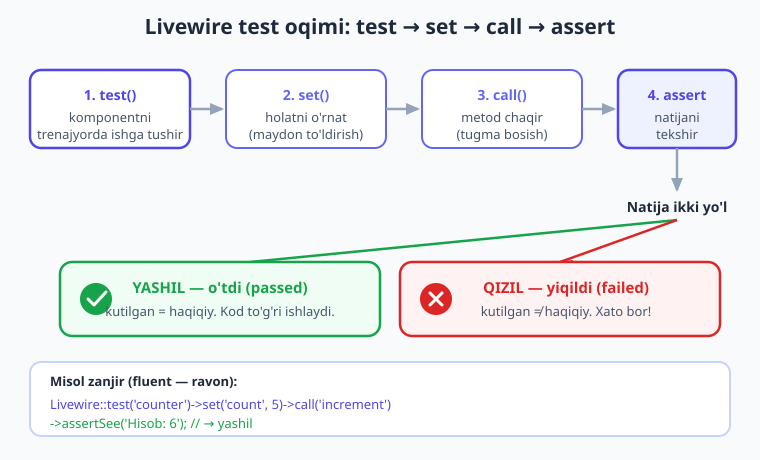
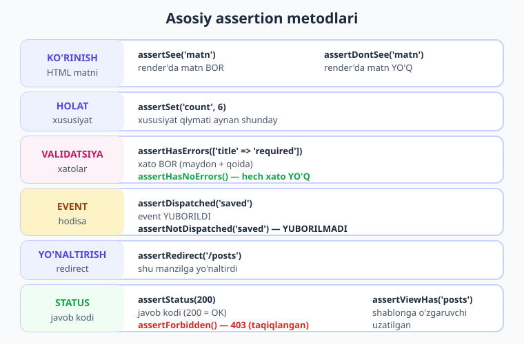
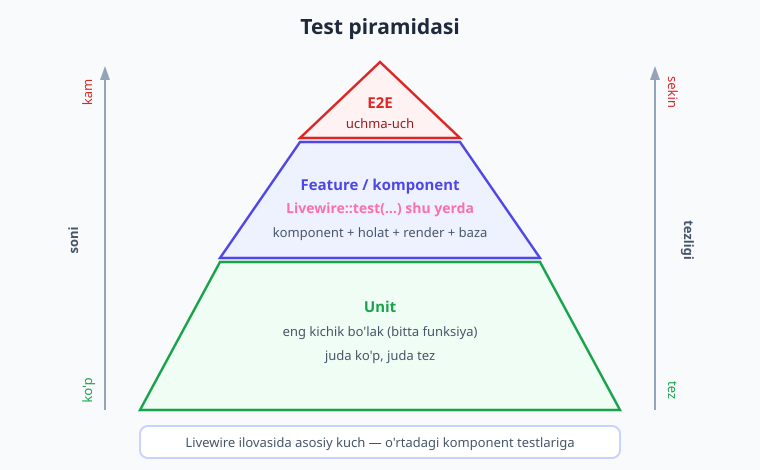

# 24 — Testlash (Testing)

[⬅️ Oldingi: 23 — Xavfsizlik](./23-xavfsizlik.md) · [🏠 Kitob boshi](./README.md) · [Keyingi: 25 — Performance va deploy ➡️](./25-performance-deploy.md)

> **Bu bobda:** komponentlaringizni qo'lda emas, **avtomatik** sinab ko'rishni o'rganamiz. Livewire'ning maxsus test API'si bilan komponentni "yashirin brauzer" ichida ishga tushiramiz: xususiyatlarini o'rnatamiz (`set`), metodlarini chaqiramiz (`call`) va natijani tasdiqlaymiz (`assertSee`, `assertSet`, `assertHasErrors`, `assertDispatched` va boshqalar). Counter, forma, validatsiya, event va avtorizatsiya testlarini yozamiz; Pest va PHPUnit sintaksislarini ko'ramiz; va nima uchun muhim mantiqni doim test bilan qo'riqlash kerakligini tushunamiz.

---

## Nega umuman test yozish kerak?

Tasavvur qiling, siz katta ilova yaratdingiz: 30 ta komponent, ularda forma, validatsiya, hisob-kitob, baza bilan ishlash. Bir kun kelib kichik bir o'zgartirish kiritasiz — masalan, validatsiya qoidasini yangilaysiz. Endi savol: bu o'zgartirish boshqa **30 ta** komponentdan birortasini buzdimi yoki yo'qmi?

Buni **qo'lda** tekshirish degani — brauzerni ochib, har bir sahifaga kirib, har bir tugmani bosib, har bir formani to'ldirib, ko'z bilan ko'rib chiqishdir. Bu:

- **charchatadi** — har safar o'nlab qadam;
- **vaqt yeydi** — har bir kichik o'zgartirishdan keyin yarim soat tekshiruv;
- **xato qoldiradi** — odam toliqadi, "bu joyni tekshirgandirman" deb o'tkazib yuboradi.

Aynan shu yerda **avtomatik test** yordam beradi. Test — bu kod parchasi bo'lib, u sizning komponentingizni o'zi ishga tushiradi, o'zi tugma "bosadi", o'zi forma "to'ldiradi" va natija **kutilgandek bo'lganini** o'zi tekshiradi. Siz bir marta yozasiz, keyin minglab marta bir buyruq bilan ishga tushirasiz.

> **Hayotiy o'xshatish — avtomatik nazoratchi.** Zavodni tasavvur qiling. Konveyerdan chiqayotgan har bir mahsulotni odam qo'lda tekshirsa — charchaydi, ba'zi nuqsonlarni o'tkazib yuboradi. Shuning uchun zavodlar **avtomatik nazoratchi** (sensor) o'rnatadi: u har bir mahsulotni bir xil aniqlik bilan, charchamasdan, 24 soat tekshiradi. Nuqsonli mahsulot chiqsa — darhol signal beradi. **Test ham aynan shunday avtomatik nazoratchi:** sizning kodingizni har safar bir xil aniqlik bilan tekshiradi va biror narsa buzilsa — darhol "qizil" signal beradi.

Testning eng katta foydasi — **regress himoyasi** ("regression" — eski, ishlab turgan narsaning yangi o'zgartirishdan keyin buzilishi). Yangi kod yozganingizda eski testlarni qayta ishga tushirasiz: agar hammasi yashil bo'lsa — siz hech narsani buzmaganingizga **ishonchingiz komil**. Bu ishonch — tez va qo'rqmasdan rivojlanishning kalitidir.

!!! note "Eslatma — test bu vaqt isrofi emas, sarmoya"
    Boshida "test yozishga vaqtim yo'q" tuyulishi mumkin. Lekin amalda aksincha: test bir marta yoziladi, keyin har bir o'zgartirishda sizni soatlab qo'lda tekshirishdan qutqaradi. Eng muhimi — yarim tunda "ilovam buzildi!" degan qo'ng'iroqdan saqlaydi.

---

## Livewire test API asoslari

Oddiy Laravel testida biz sahifani HTTP orqali ochamiz (`$this->get('/counter')`). Lekin Livewire komponenti — bu shunchaki sahifa emas: uning **holati** bor (xususiyatlar), **amallari** bor (metodlar), u **interaktiv**. Shuning uchun Livewire o'zining maxsus test yordamchisini beradi — **`Livewire::test(...)`**.

Avval uni import qilamiz:

```php
use Livewire\Livewire;
```

So'ng komponentni "yashirin" ishga tushiramiz. Komponentni ikki xil ko'rsatish mumkin — **klass bo'yicha** yoki **nom bo'yicha**:

```php
// klass bo'yicha (klass-komponentlar uchun)
Livewire::test(\App\Livewire\Counter::class);

// nom bo'yicha (SFC — single-file komponentlar uchun ham qulay)
Livewire::test('counter');
```

> **Hayotiy o'xshatish — uchuvchi trenajyori.** Haqiqiy samolyotni uchirib sinab ko'rish qimmat va xavfli. Shuning uchun uchuvchilar **trenajyor** (simulyator) ichida mashq qiladi: bu xuddi haqiqiy kabina, lekin yerda, xavfsiz. `Livewire::test(...)` — bu sizning komponentingiz uchun aynan shunday trenajyor: brauzer ochmasdan, server jonli ishlamasdan, komponent **xuddi haqiqatda ishlagandek** ishlaydi va siz har bir tugmasini bemalol sinab ko'rasiz.

`Livewire::test(...)` chaqirig'i **test obyektini** qaytaradi. Endi shu obyektda **zanjir** (chain) ko'rinishida amallarni ketma-ket bajaramiz: holatni o'rnatamiz, metod chaqiramiz, natijani tekshiramiz. Har bir metod yana o'sha obyektni qaytaradi — shuning uchun ularni `->` bilan uzluksiz ulayveramiz (buni **fluent interface** — "ravon interfeys" deyiladi).



---

## Asosiy zanjir: set → call → assert

Eng ko'p ishlatiladigan uchta amalni ko'raylik. Misol uchun [03-bobdagi](./03-birinchi-komponent.md) tanish `counter` komponentini olamiz:

```php
{{-- resources/views/components/⚡counter.blade.php --}}
<?php

use Livewire\Component;

new class extends Component
{
    public int $count = 0;

    public function increment(): void
    {
        $this->count++;
    }
};
?>

<div>
    <h1>Hisob: {{ $count }}</h1>
    <button wire:click="increment">+</button>
</div>
```

Endi bu komponent uchun test yozamiz. Uch amalni eslab qoling:

- **`->set('xususiyat', qiymat)`** — komponent xususiyatiga qiymat beradi (xuddi foydalanuvchi maydonni to'ldirgandek).
- **`->call('metod')`** — komponent metodini chaqiradi (xuddi foydalanuvchi tugmani bosgandek).
- **`->assertSee('matn')`** — render qilingan HTML'da shu matn **borligini** tasdiqlaydi.

```php
use Livewire\Livewire;

Livewire::test('counter')
    ->assertSee('Hisob: 0')      // boshlang'ich holatda 0 ko'rinadi
    ->call('increment')          // "+" tugmasini "bosamiz"
    ->assertSee('Hisob: 1')      // endi 1 ko'rinishi kerak
    ->set('count', 5)            // hisobni to'g'ridan-to'g'ri 5 ga o'rnatamiz
    ->call('increment')          // yana bir marta oshiramiz
    ->assertSee('Hisob: 6');     // 6 ko'rinishi kerak
```

Bu zanjirni o'qish — bu komponent bilan foydalanuvchining suhbatini o'qishdek: "sahifa ochildi, 0 ko'rindi → plyusni bosdim → 1 bo'ldi → hisobni 5 ga o'zgartirdim → yana bosdim → 6 bo'ldi". Test aynan shu ssenariyni avtomatik takrorlaydi.

> **Tasdiqlangan.** Bu test jonli **Laravel 12 + Livewire v4.3.1** loyihada **o'tdi** (3 ta test, 9 ta assertion). `Livewire::test('counter')->assertSee('Hisob: 0')->call('increment')->assertSee('Hisob: 1')->set('count', 5)->call('increment')->assertSee('Hisob: 6')` — yashil.

!!! tip "Maslahat — `set` va `call` ning farqini eslang"
    `set('count', 5)` — holatni **to'g'ridan-to'g'ri** o'zgartiradi (foydalanuvchi `wire:model` orqali maydon to'ldirgani kabi). `call('increment')` — **metodni ishga soladi** (foydalanuvchi `wire:click` tugmasini bosgani kabi). Ko'pincha avval `set` bilan kerakli holatni tayyorlab, keyin `call` bilan amalni ishga tushiramiz va `assert` bilan natijani tekshiramiz.

---

## Assertion'lar: nimani tekshirish mumkin?

**Assertion** ("tasdiqlash") — bu testning yuragi. U "men shunday bo'lishini kutaman" deydi; agar haqiqat boshqacha bo'lsa, test **yiqiladi** (qizil). Livewire juda boy assertion to'plamini beradi. Mana eng muhimlari:

| Assertion | Nimani tekshiradi |
|---|---|
| `assertSee('matn')` | Render qilingan HTML'da matn **bor** |
| `assertDontSee('matn')` | HTML'da matn **yo'q** |
| `assertSet('count', 6)` | Xususiyat qiymati **aynan** shunday |
| `assertHasErrors(['title' => 'required'])` | Validatsiya xatosi **bor** (maydon + qoida) |
| `assertHasNoErrors()` | Hech qanday validatsiya xatosi **yo'q** |
| `assertDispatched('saved')` | Shu nomli event **yuborilgan** |
| `assertNotDispatched('saved')` | Event **yuborilmagan** |
| `assertRedirect('/posts')` | Komponent shu manzilga **yo'naltirdi** |
| `assertStatus(200)` | Javob statusi shunday (`200` — OK, `403` — taqiqlangan) |
| `assertForbidden()` | Status `403` (taqiqlangan) |
| `assertViewHas('posts')` | Blade shablonga shu o'zgaruvchi **uzatilgan** |



Ularning ko'pini quyida amalda ishlatamiz. Hozircha asosiy g'oyani eslab qoling: **har bir assertion — bu bitta savol** ("hisob 6 mi? xato bormi? event yuborildimi?"), va test shu savollarning hammasiga "ha" javobini olganda yashil bo'ladi.

!!! note "Eslatma — `assertSet` va `assertSee` farqi"
    `assertSet('count', 6)` — komponentning **ichki holatini** (xususiyat qiymatini) tekshiradi. `assertSee('Hisob: 6')` — foydalanuvchi **ekranda ko'radigan HTML'ni** tekshiradi. Ko'pincha ikkalasini birga ishlatamiz: holat to'g'ri va u to'g'ri ko'rinyaptimi.

---

## Forma testi: saqlash va validatsiya

Endi haqiqiy loyihaga yaqinroq misol — **forma**. Quyidagi komponent post yaratadi: u sarlavha va matnni validatsiya qiladi, bazaga saqlaydi va event yuboradi (bu naqshlarni [09-formalar](./09-formalar.md), [10-validatsiya](./10-validatsiya.md) va [18-events](./18-events.md) boblarida ko'rgan edik):

```php
{{-- resources/views/components/⚡post-create.blade.php --}}
<?php

use App\Models\Post;
use Livewire\Component;
use Livewire\Attributes\Validate;

new class extends Component
{
    #[Validate('required|min:3')]
    public string $title = '';

    #[Validate('required')]
    public string $body = '';

    public function save(): void
    {
        $this->validate();

        $post = Post::create([
            'title' => $this->title,
            'body' => $this->body,
        ]);

        $this->dispatch('post-created', id: $post->id);

        $this->reset();
    }
};
?>

<div>
    <form wire:submit="save">
        <input type="text" wire:model="title" placeholder="Sarlavha">
        @error('title') <span>{{ $message }}</span> @enderror

        <textarea wire:model="body" placeholder="Matn"></textarea>
        @error('body') <span>{{ $message }}</span> @enderror

        <button type="submit">Saqlash</button>
    </form>
</div>
```

### "Baxtli yo'l": forma to'g'ri to'ldirilganda

Avval **muvaffaqiyatli holatni** ("happy path" — hammasi to'g'ri bo'lgan ssenariy) tekshiramiz: forma to'ldiriladi, saqlanadi, **xato bo'lmaydi**, ma'lumot **bazaga tushadi**:

```php
use Livewire\Livewire;
use Illuminate\Foundation\Testing\RefreshDatabase;

class PostCreateTest extends TestCase
{
    use RefreshDatabase;   // har test uchun toza baza

    public function test_post_is_saved(): void
    {
        Livewire::test('post-create')
            ->set('title', 'Mening birinchi postim')
            ->set('body', 'Bu post matni.')
            ->call('save')
            ->assertHasNoErrors();         // validatsiya o'tdi

        // ma'lumot rostdan bazaga tushdimi?
        $this->assertDatabaseHas('posts', [
            'title' => 'Mening birinchi postim',
        ]);
    }
}
```

Bu yerda ikki yangi narsa bor:

- **`use RefreshDatabase;`** — bu **trait** (tayyor xususiyatlar to'plami) har bir test boshlanishidan oldin **bazani toza holatga** keltiradi. Shunda bitta test ikkinchisiga ta'sir qilmaydi (testlar bir-biridan **mustaqil** bo'lishi shart). Testlarda odatda alohida, xotiradagi (in-memory) SQLite bazasi ishlatiladi — tez va xavfsiz.
- **`$this->assertDatabaseHas('posts', [...])`** — bu Laravel'ning (Livewire emas) assertion'i: posts jadvalida shunday yozuv **borligini** tekshiradi. Ya'ni "forma rostdan ham bazaga yozdimi?" degan savolga javob beradi.

### "Qora yo'l": forma bo'sh bo'lganda

Endi **xato holatini** tekshiramiz: forma bo'sh yuborilsa, validatsiya **xato berishi** va baza **bo'sh qolishi** kerak:

```php
public function test_empty_form_shows_errors(): void
{
    Livewire::test('post-create')
        ->set('title', '')
        ->set('body', '')
        ->call('save')
        ->assertHasErrors(['title' => 'required', 'body' => 'required']);

    $this->assertDatabaseCount('posts', 0);   // hech narsa saqlanmadi
}
```

`assertHasErrors(['title' => 'required'])` — `title` maydonida `required` qoidasi bo'yicha xato borligini tasdiqlaydi. Bu juda kuchli: nafaqat "xato bormi" balki "**qaysi maydonda**, **qaysi qoida** bo'yicha" ekanini ham tekshiradi. Qisqaroq variant — faqat maydon nomini berish: `assertHasErrors('title')`.

`min` qoidasini ham alohida tekshirsak bo'ladi:

```php
public function test_short_title_fails(): void
{
    Livewire::test('post-create')
        ->set('title', 'Hi')              // 3 belgidan kam
        ->set('body', 'matn')
        ->call('save')
        ->assertHasErrors(['title' => 'min']);   // min:3 qoidasi buzildi
}
```

> **Tasdiqlangan.** Yuqoridagi uchta forma testi (saqlash, bo'sh forma, qisqa sarlavha) jonli Livewire v4.3.1 loyihada **o'tdi**. `assertHasNoErrors`, `assertHasErrors(['title' => 'min'])`, `assertDispatched('post-created')`, `assertDatabaseHas`, `assertDatabaseCount` — barchasi yashil.

!!! tip "Maslahat — har doim ikki tomonni test qiling"
    Yaxshi formaning ikki yuzi bor: to'g'ri to'ldirilganda **ishlashi** va noto'g'ri to'ldirilganda **to'xtatishi**. Faqat "baxtli yo'l" ni test qilsangiz, validatsiyangiz buzilib qolsa ham sezmaysiz. Doim **ikkala** ssenariyni test qiling — bu testning eng katta qiymati.

---

## Event testi: yuborilganini tekshirish

[18-bobda](./18-events.md) ko'rganimizdek, event — bu komponentlar orasidagi "ko'rinmas" aloqa. Aynan ko'rinmas bo'lgani uchun uni test bilan qo'riqlash juda muhim. Yuqoridagi `post-create` komponenti saqlangach `post-created` eventini yuboradi — buni tekshiramiz:

```php
public function test_event_is_dispatched_after_save(): void
{
    Livewire::test('post-create')
        ->set('title', 'Yangi post')
        ->set('body', 'Matn')
        ->call('save')
        ->assertDispatched('post-created');   // event yuborildimi?
}
```

`assertDispatched('post-created')` — shu nomli event yuborilganini tasdiqlaydi. Parametrini ham tekshirish mumkin:

```php
->assertDispatched('post-created', id: 1);   // id parametri bilan yuborildimi
```

Aksincha, **yuborilmaganini** tekshirish ham foydali — masalan, validatsiya yiqilganda event **chiqmasligi** kerak:

```php
public function test_no_event_when_validation_fails(): void
{
    Livewire::test('post-create')
        ->set('title', '')               // bo'sh -> validatsiya yiqiladi
        ->call('save')
        ->assertHasErrors('title')
        ->assertNotDispatched('post-created');   // event CHIQMASLIGI kerak
}
```

Bu test juda qimmatli: u "forma noto'g'ri bo'lsa, ro'yxat bekorga yangilanmaydi" degan muhim mantiqni qo'riqlaydi.

---

## Avtorizatsiya testi: kim nima qila oladi?

[23-bobda](./23-xavfsizlik.md) bilib oldikki, har bir xavfli amalda **avtorizatsiya** (kim ruxsat etilgan) tekshirilishi shart. Testning eng muhim vazifalaridan biri — bu himoyaning **rostdan ishlayotganini** tasdiqlash.

Avval foydalanuvchi sifatida "kirib olamiz" — buning uchun Laravel'ning **`$this->actingAs($user)`** metodi xizmat qiladi. U "shu testning davomida men aynan shu foydalanuvchiman" deydi:

```php
use App\Models\User;
use Illuminate\Foundation\Testing\RefreshDatabase;
use Livewire\Livewire;

class SecretTest extends TestCase
{
    use RefreshDatabase;

    public function test_admin_can_run_action(): void
    {
        $admin = User::factory()->create();   // birinchi user -> id = 1

        $this->actingAs($admin);              // shu user sifatida kiramiz

        Livewire::test('secret')
            ->call('deleteEverything')
            ->assertStatus(200);              // ruxsat berildi (OK)
    }
}
```

Endi **boshqa** foydalanuvchi shu amalni chaqirsa, **403** (taqiqlangan) qaytishini tekshiramiz:

```php
public function test_other_user_is_forbidden(): void
{
    User::factory()->create();              // id = 1 (admin)
    $other = User::factory()->create();     // id = 2 (oddiy foydalanuvchi)

    $this->actingAs($other);                // oddiy user sifatida kiramiz

    Livewire::test('secret')
        ->call('deleteEverything')
        ->assertForbidden();                // 403 — taqiqlangan!
}
```

Bu yerda tekshirilayotgan komponent quyidagicha (faqat `id = 1` ruxsat etilgan):

```php
{{-- resources/views/components/⚡secret.blade.php --}}
<?php

use Livewire\Component;

new class extends Component
{
    public function deleteEverything(): void
    {
        abort_unless(auth()->id() === 1, 403);   // faqat admin
        // ... haqiqiy o'chirish mantig'i ...
    }
};
?>

<div>
    <button wire:click="deleteEverything">Hammasini o'chirish</button>
</div>
```

`assertForbidden()` — javob statusi **403** ekanini tekshiradi (`assertStatus(403)` ning qisqasi). Haqiqiy loyihada `abort_unless(...)` o'rniga ko'pincha **Policy** ishlatasiz: `$this->authorize('delete', $post)` — bu ham ruxsat bo'lmasa 403 beradi va test aynan shu tarzda uni ushlaydi.

> **Tasdiqlangan.** Avtorizatsiya testlari (admin → 200, boshqa foydalanuvchi → 403) jonli loyihada **o'tdi**. `actingAs`, `assertStatus(200)` va `assertForbidden()` — yashil.

!!! danger "Xavfsizlik — avtorizatsiyani DOIM test qiling"
    Xavfsizlik mantig'i — bu testning **eng muhim** mijozi. "Boshqa foydalanuvchi bu amalni qila olmasligi kerak" degan testni yozmasangiz, kelajakda kimdir kodni o'zgartirib himoyani tasodifan olib tashlasa — siz buni **hech qachon** sezmaysiz, faqat ma'lumot o'g'irlangach bilasiz. Har bir `authorize` chaqirig'i uchun "ruxsat berilgan" va "taqiqlangan" — ikki testni yozing.

---

## Pest va PHPUnit: ikki sintaksis

Test kodini yozishning ikki ommabop uslubi bor. **Mazmun bir xil** — faqat tashqi ko'rinishi farq qiladi.

### PHPUnit uslubi (klass va metodlar)

An'anaviy va eng keng tarqalgan uslub. Har test — bu `test_` bilan boshlanadigan metod, hammasi bir klass ichida:

```php
<?php

namespace Tests\Feature;

use Livewire\Livewire;
use Tests\TestCase;

class CounterTest extends TestCase
{
    public function test_it_increments(): void
    {
        Livewire::test('counter')
            ->call('increment')
            ->assertSet('count', 1);
    }
}
```

### Pest uslubi (qisqa va o'qishli)

**Pest** — bu PHPUnit ustiga qurilgan, juda qisqa va o'qishli zamonaviy test asbobi. Bu yerda klass yo'q — har test `it(...)` yoki `test(...)` funksiyasi:

```php
<?php

use Livewire\Livewire;

it('increments', function () {
    Livewire::test('counter')
        ->call('increment')
        ->assertSet('count', 1);
});
```

`it('increments', ...)` o'qilganda deyarli ingliz tilidagi jumlaga o'xshaydi: "it increments" ("u oshiradi"). Yangi Laravel loyihalari ko'pincha Pest bilan keladi.

!!! note "Eslatma — qaysi birini tanlash?"
    Ikkalasi ham bir xil ishlaydi va **bir xil** Livewire assertion'larini qo'llaydi — `Livewire::test(...)->set(...)->call(...)->assertSee(...)` zanjiri hech o'zgarmaydi. Loyihangizda qaysi biri o'rnatilgan bo'lsa — o'shani ishlating. Yangi loyiha boshlasangiz, ko'pchilik bugun **Pest** ni afzal ko'radi (qisqaroq, chiroyliroq). Bu kitobdagi misollar ikkala uslubda ham bemalol ishlaydi.

Testlarni ishga tushirish ikkalasida ham bir xil — terminalda:

```bash
php artisan test                          # barcha testlar
php artisan test --filter=CounterTest     # faqat bittasi
```

---

## To'liq misol: CRUD testlari

Endi hamma bilimni birlashtiramiz. [16-bobda](./16-toliq-crud.md) to'liq CRUD (Create-Read-Update-Delete) komponentini qurgan edik. Bunday komponentni qanday test qilamiz? **To'rt amalning to'rttasini ham** alohida sinaymiz. Mana CRUD test rejasi (PHPUnit uslubida):

```php
<?php

namespace Tests\Feature;

use App\Models\Post;
use Illuminate\Foundation\Testing\RefreshDatabase;
use Livewire\Livewire;
use Tests\TestCase;

class PostCrudTest extends TestCase
{
    use RefreshDatabase;

    // CREATE — yaratish
    public function test_can_create_post(): void
    {
        Livewire::test('post-manager')
            ->set('title', 'Yangi maqola')
            ->set('body', 'Maqola matni')
            ->call('save')
            ->assertHasNoErrors();

        $this->assertDatabaseHas('posts', ['title' => 'Yangi maqola']);
    }

    // VALIDATE — bo'sh forma to'xtatilishi
    public function test_create_requires_title(): void
    {
        Livewire::test('post-manager')
            ->set('title', '')
            ->call('save')
            ->assertHasErrors(['title' => 'required']);
    }

    // READ — ro'yxat ko'rinishi
    public function test_shows_existing_posts(): void
    {
        Post::create(['title' => 'Salom dunyo', 'body' => '...']);

        Livewire::test('post-manager')
            ->assertSee('Salom dunyo');
    }

    // UPDATE — tahrirlash
    public function test_can_update_post(): void
    {
        $post = Post::create(['title' => 'Eski', 'body' => '...']);

        Livewire::test('post-manager')
            ->call('edit', $post->id)            // tahrirga olish
            ->set('title', 'Yangilangan')
            ->call('save')
            ->assertHasNoErrors();

        $this->assertDatabaseHas('posts', [
            'id' => $post->id,
            'title' => 'Yangilangan',
        ]);
    }

    // DELETE — o'chirish
    public function test_can_delete_post(): void
    {
        $post = Post::create(['title' => 'O\'chiriladi', 'body' => '...']);

        Livewire::test('post-manager')
            ->call('delete', $post->id)
            ->assertDontSee('O\'chiriladi');     // ro'yxatdan yo'qoldi

        $this->assertDatabaseMissing('posts', ['id' => $post->id]);
    }
}
```

Diqqat qiling, har bir test:

1. **Tayyorlaydi** (arrange) — kerakli holatni yaratadi (masalan, bazaga post qo'shadi yoki maydonni to'ldiradi).
2. **Bajaradi** (act) — bitta amalni ishga tushiradi (`call('delete', $id)`).
3. **Tekshiradi** (assert) — natija kutilgandek bo'lganini tasdiqlaydi.

Bu **Arrange-Act-Assert** ("Tayyorla-Bajar-Tekshir") naqshi — barcha yaxshi testlarning skeleti. Har bir test **bitta** narsani tekshiradi: shunda yiqilganda nima buzilganini darrov bilasiz.

!!! tip "Maslahat — `call('edit', $id)` — bu parametrli metod chaqirig'i"
    `call('delete', $post->id)` — bu `delete($id)` metodini `$post->id` argumenti bilan chaqiradi. Bu xuddi Blade'dagi `wire:click="delete({{ $post->id }})"` ning test ekvivalenti. Bir nechta argument ham mumkin: `call('move', $id, 'arxiv')`.

---

## Test piramidasi: qancha va qaysi turdan?

Testlarning bir necha turi bor va ularning **nisbati** muhim. Buni **test piramidasi** bilan tasvirlaymiz:



- **Pastda (eng ko'p) — Unit testlar.** Eng kichik bo'lakni alohida sinaydi (masalan, bitta yordamchi funksiya: narxni hisoblash). Juda **tez**, juda **ko'p** yoziladi.
- **O'rtada (o'rtacha) — Feature / komponent testlari.** Bir necha qism birga ishlashini sinaydi. **`Livewire::test(...)` aynan shu darajada turadi** — u komponentni, uning holatini, render'ini, baza bilan aloqasini birga sinaydi. Bu Livewire ilovasi uchun **eng qimmatli** test turi.
- **Tepada (eng kam) — E2E (uchma-uch) testlar.** Butun ilovani haqiqiy brauzerda, foydalanuvchi ko'zi bilan sinaydi (masalan Laravel Dusk). Eng **realistik**, lekin eng **sekin** va eng **mo'rt** (tez buziladi). Shuning uchun ulardan **kam** yoziladi — faqat eng muhim ssenariylar uchun.

> **Hayotiy o'xshatish — uy qurilishini tekshirish.** Avval har bir **g'ishtni** alohida tekshirasiz (unit) — bu tez va arzon, shuning uchun hammasini tekshirasiz. Keyin **devorni** yig'ib mustahkamligini sinaysiz (feature/komponent). Va nihoyat, **butun uyga** kirib yashab ko'rasiz (E2E) — eng ishonchli, lekin uzoq va qimmat, shuning uchun bir-ikki marta. Pastdan tepaga: ko'pdan ozga, tezdan sekinga.

Xulosa: Livewire ilovangizda asosiy kuchingizni **`Livewire::test(...)` komponent testlariga** sarflang. Ular tez, ishonchli va sizning biznes mantig'ingizning katta qismini qamrab oladi.

---

## TDD: avval test, keyin kod

**TDD** (Test-Driven Development — "test boshqaradigan dasturlash") — bu maxsus uslub: avval **test** yoziladi, keyin uni o'tkazadigan **kod** yoziladi. Tartibi shunday:

1. **Qizil:** hali kod yo'q test yoz — u, albatta, yiqiladi (qizil).
2. **Yashil:** testni o'tkazadigan **eng oddiy** kodni yoz — test yashil bo'ldi.
3. **Yaxshila** (refactor): kodni tozalab, chiroyli qilib qayta yoz — test baribir yashil turaversin.

So'ng keyingi xususiyat uchun qaytadan: qizil → yashil → yaxshila.

> **Hayotiy o'xshatish — avval xarita, keyin yo'l.** TDD — bu "qayerga borishimni avval xaritaga belgilab, keyin yo'lga chiqish" kabi. Test — bu sizning xaritangiz: "kod oxirida nima qilishi kerak" ni aniq belgilaydi. Keyin shunchaki xaritaga ergashasiz. Bu adashishdan, ortiqcha kod yozishdan saqlaydi.

TDD majburiy emas — boshlovchi uchun avval kod yozib, keyin test qo'shish ham mutlaqo to'g'ri. Lekin TDD ning bir buyuk afzalligi bor: u sizni kod yozishdan **oldin** "bu komponent aniq nima qilishi kerak?" deb o'ylashga majbur qiladi. Bu ko'pincha yaxshiroq dizaynga olib keladi.

!!! tip "Maslahat — muhim mantiqni DOIM test bilan qo'riqlang"
    Hamma narsani test qilish shart emas (oddiy `{{ $title }}` ko'rsatishni test qilish ortiqcha). Lekin **muhim mantiq** — pul hisob-kitobi, avtorizatsiya, validatsiya, ma'lumotni o'zgartirish — **doim** test bilan qoplanishi kerak. Qoida sodda: "agar bu buzilsa, jiddiy muammo bo'ladimi?" — javob "ha" bo'lsa, test yozing. Bu testlar sizning ilovangizning eng qimmatli qismini har o'zgarishdan keyin sodiq qo'riqchidek himoya qiladi.

---

## Xulosa

- **Test — bu avtomatik nazoratchi.** Qo'lda tekshirish charchatadi va xato qoldiradi; test esa charchamasdan, bir xil aniqlik bilan kodingizni har safar sinaydi va **regress** (eski narsaning buzilishi) dan himoya qiladi.
- **Livewire test API:** `use Livewire\Livewire;` so'ng `Livewire::test(Counter::class)` yoki nom bilan `Livewire::test('counter')` — komponentni "trenajyorda" ishga tushiradi.
- **Asosiy zanjir:** `->set('xususiyat', qiymat)` (holat o'rnat), `->call('metod')` (amal ishga tushir), `->assertSee('matn')` (natija tekshir). Hammasini `->` bilan ravon ulaymiz.
- **Boy assertion to'plami:** `assertSee`/`assertDontSee`, `assertSet`, `assertHasErrors`/`assertHasNoErrors`, `assertDispatched`/`assertNotDispatched`, `assertRedirect`, `assertStatus`/`assertForbidden`, `assertViewHas`.
- **Forma testi:** ikki tomon — to'g'ri to'ldirilganda `assertHasNoErrors` + `assertDatabaseHas`; bo'sh bo'lganda `assertHasErrors([...])`. `use RefreshDatabase;` har test uchun toza baza beradi.
- **Event testi:** `assertDispatched('post-created')` (yuborildi), `assertNotDispatched(...)` (yuborilmadi — validatsiya yiqilganda event chiqmasligini qo'riqlaydi).
- **Avtorizatsiya testi:** `$this->actingAs($user)` bilan kirib, ruxsatlini `assertStatus(200)`, taqiqlanganni `assertForbidden()` (403) bilan tekshiring. Xavfsizlik mantig'ini **albatta** test qiling ([23-bob](./23-xavfsizlik.md)).
- **Pest yoki PHPUnit:** sintaksis farqi (`it('...', fn)` vs `test_metod()`), lekin Livewire zanjiri ikkalasida **bir xil**.
- **Test piramidasi:** ko'p unit, o'rtacha feature/komponent (Livewire shu yerda — eng qimmatli), kam E2E.
- **Muhim mantiqni doim test qiling:** pul, avtorizatsiya, validatsiya, ma'lumot o'zgarishi — "buzilsa jiddiy bo'ladimi?" javobi "ha" bo'lsa — test yozing.

## Amaliy mashqlar

1. **Counter testi (oson).** `counter` komponenti uchun test yozing: boshlang'ich `assertSee('Hisob: 0')`, keyin `call('increment')` ikki marta va `assertSet('count', 2)`. So'ng `set('count', 10)->call('decrement')->assertSee('Hisob: 9')`. Testni `php artisan test --filter=...` bilan ishga tushirib, yashil bo'lishini ko'ring. *Yo'naltirish:* `Livewire::test('counter')` dan boshlang.

2. **Forma validatsiyasi (oson–o'rta).** [10-bobdagi](./10-validatsiya.md) yoki o'zingiz yaratgan forma komponenti uchun ikki test yozing: (a) to'g'ri to'ldirilganda `assertHasNoErrors()`; (b) bo'sh yuborilganda `assertHasErrors(['title' => 'required'])`. *Yo'naltirish:* `use RefreshDatabase;` ni unutmang, agar saqlash bazaga yozsa.

3. **Event tekshiruvi (o'rta).** [18-bobdagi](./18-events.md) `task-created` eventini yuboradigan formani test qiling: `set('title', '...')->call('save')->assertDispatched('task-created')`. Keyin **teskari** holatni qo'shing: bo'sh forma yuborilganda `assertNotDispatched('task-created')` ekanini tekshiring. *Yo'naltirish:* validatsiya yiqilsa event chiqmasligi kerak.

4. **CRUD to'liq qamrov (o'rta–qiyin).** [16-bobdagi](./16-toliq-crud.md) CRUD komponentingiz uchun to'rt test yozing: create (`assertDatabaseHas`), read (`assertSee` mavjud yozuv), update (`call('edit', $id)` → `set` → `save` → `assertDatabaseHas` yangilangan qiymat), delete (`call('delete', $id)` → `assertDatabaseMissing`). Har biri **bitta** amalni tekshirsin. *Yo'naltirish:* Arrange-Act-Assert tartibiga rioya qiling.

5. **Avtorizatsiya himoyasi (qiyin — fikrlash uchun).** Avtorizatsiya qiladigan komponent yozing (masalan, faqat post **egasi** uni o'chira oladi). Ikki test yozing: egasi `actingAs` bilan `call('delete', $id)` qila olsin (`assertStatus(200)` yoki `assertHasNoErrors`); **boshqa** foydalanuvchi esa `assertForbidden()` olsin. Keyin o'ylab ko'ring: agar kelajakda kimdir `authorize` qatorini xatoga o'chirib qo'ysa, qaysi test buni **darhol** ushlaydi? Bu nima uchun ko'z bilan tekshirishdan ishonchliroq? (Maslahat: avtorizatsiya testi bo'limini va [23-bobni](./23-xavfsizlik.md) qayta o'qing.)

---

[⬅️ Oldingi: 23 — Xavfsizlik](./23-xavfsizlik.md) · [🏠 Kitob boshi](./README.md) · [Keyingi: 25 — Performance va deploy ➡️](./25-performance-deploy.md)
