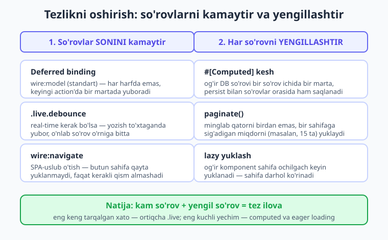
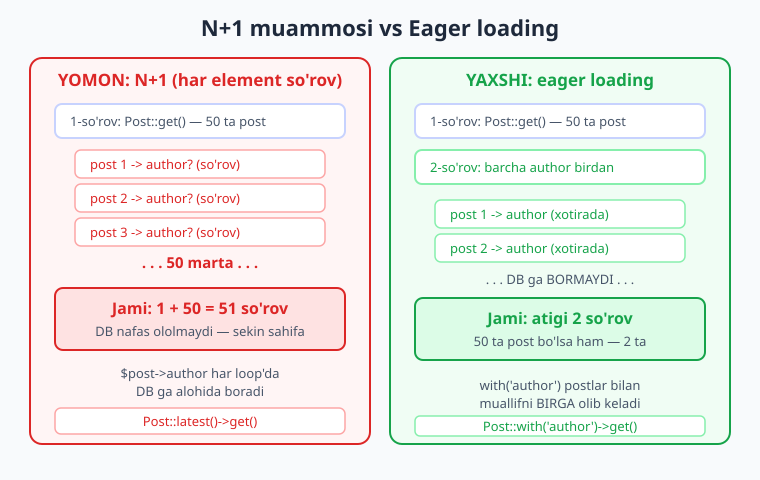
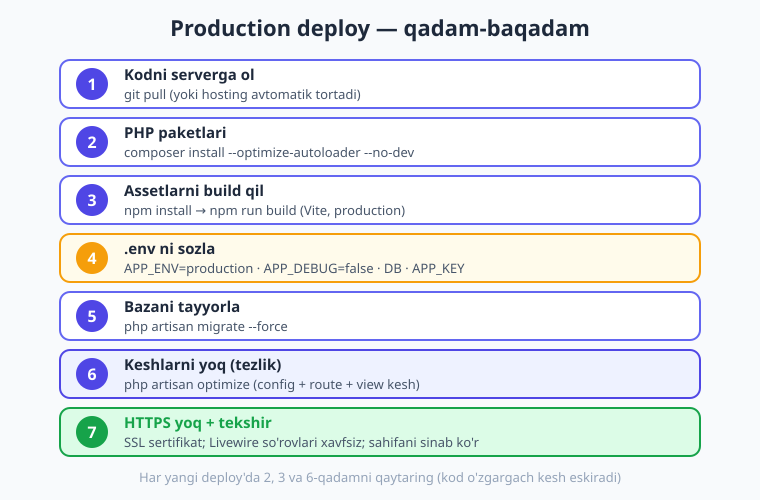

# 25 — Tezlik (performance) va deploy

[⬅️ Oldingi: 24 — Testlash](./24-testing.md) · [🏠 Kitob boshi](./README.md) · [Keyingi: 26 — Kapston loyiha ➡️](./26-kapston-loyiha.md)

> **Bu bobda:** ilovangizni **tez** va **professional** qiladigan ikki katta mavzuni o'rganamiz. Avval **tezlik** (performance): nega Livewire ba'zan sekinlashadi va uni qanday tezlashtirish kerak — `.live` ni kamaytirish, computed bilan keshlash, `render()` ni yengillatish, pagination, N+1 muammosi, lazy va `wire:navigate`. Keyin **deploy**: tayyor ilovani internetga, real serverga qadam-baqadam chiqarish — assetlarni build qilish, `.env` sozlash, Laravel keshlarini yoqish (`config:cache`, `route:cache`, `view:cache`, `optimize`). Oxirida ikki amaliy "checklist" — birini tezlik, ikkinchisini deploy uchun.

---

## Nega tezlik haqida o'ylash kerak?

Tasavvur qiling: ofitsiant har safar mijoz biror narsa so'raganda — non so'rasa ham, tuz so'rasa ham — **oshxonaga yugurib boradi va qaytadi**. Bitta-ikkita mijoz bo'lsa, sezilmaydi. Lekin zal to'la odam bo'lsa, ofitsiant butun kun yugurish bilan o'tadi, mijozlar esa kutib charchaydi.

Livewire ham xuddi shunday ishlaydi. **Har bir Livewire amali (action) — serverga yuborilgan so'rov.** Tugma bossangiz, maydonga yozsangiz, ro'yxatni saralasangiz — brauzer serverga so'rov yuboradi, server javob qaytaradi, sahifa yangilanadi. Bu — Livewire'ning eng kuchli tomoni (sahifa qayta yuklanmaydi), lekin ayni paytda eng nozik joyi ham.

Demak tezlikning ikki oltin qoidasi shu:

1. **So'rovlar sonini kamaytiring** — serverga kerak bo'lmaganda bormang.
2. **Har bir so'rovni yengillashtiring** — server tez javob bersin (og'ir ish qilmasin).

> **Hayotiy o'xshatish.** Aqlli ofitsiant ikki narsani qiladi: (1) bir borishda **bir nechta** buyurtmani oladi (ortiqcha yugurmaydi) va (2) oshxona buyurtmani **tez** tayyorlaydi (mijoz uzoq kutmaydi). Tez Livewire ilovasi ham aynan shu — kam so'rov, yengil so'rov.

Quyidagi diagramma tezlikni oshiruvchi asosiy strategiyalarni bir joyda ko'rsatadi:



Endi har bir strategiyani alohida ko'rib chiqamiz.

---

## 1. `.live` ni kam ishlating — eng keng tarqalgan xato

Bu — Livewire'da eng tez-tez uchraydigan tezlik xatosi. Shuning uchun birinchi o'rinda turibdi.

6-bobda ([Data binding](./06-data-binding.md)) ko'rgan edik: `wire:model.live="search"` deganingizda, foydalanuvchi maydonga **har bitta harf yozganda** serverga so'rov ketadi. "Salom" so'zini yozsa — besh harf, **besh so'rov**. Endi tasavvur qiling, qidiruv maydoniga uzun jumla yozayotgan foydalanuvchi: o'nlab so'rov serverga yog'iladi. Server ham, tarmoq ham bo'g'iladi.

```blade
{{-- YOMON: har bosishda serverga so'rov ketadi --}}
<input type="text" wire:model.live="search">
```

Livewire 4 da `wire:model` standart holatda **deferred** (kechiktirilgan): maydonga yozganingizda darhol serverga bormaydi, qiymat keyingi action (masalan, tugma bosish) paytida bir martada yuboriladi. Bu — to'g'ri va tez standart.

```blade
{{-- YAXSHI: standart deferred — serverga faqat keyingi action'da boradi --}}
<input type="text" wire:model="title">
<button wire:click="save">Saqlash</button>
```

Agar sizga **haqiqatan** real-time kerak bo'lsa (masalan, yozayotganda darhol qidiruv natijasi chiqsin), `.live` ni ishlating, lekin uni **`.debounce`** bilan yumshating. `.debounce` — "foydalanuvchi yozishni to'xtatguncha kutib tur, keyin yubor" degani.

```blade
{{-- YAXSHIROQ: real-time kerak, lekin debounce bilan so'rovlar kamaytirilgan --}}
<input type="text" wire:model.live.debounce.500ms="search">
```

Bu yerda `500ms` — foydalanuvchi **yarim soniya** tugma bosmasa, shundagina so'rov ketadi. "Salom" ni tez yozib bo'lgach, beshta emas, **bitta** so'rov ketadi. Farq juda katta.

!!! warning "Ehtiyot bo'ling"
    Ko'pchilik boshlovchilar har bir maydonga odat tusida `.live` qo'shib qo'yadi. Bu — ilovani sekinlashtiradigan eng keng tarqalgan sabab. **Savol bering:** "Bu maydon o'zgarganda serverga DARHOL borish haqiqatan kerakmi?" Agar javob "yo'q" bo'lsa — `.live` ni olib tashlang. Kerak bo'lsa ham — `.debounce` qo'shing.

!!! info "Livewire 3 da qanday edi?"
    Livewire 3 da `wire:model` standart holatda **deferred** edi va `wire:model.live` real-time qilardi — bu Livewire 4 da ham xuddi shunday. Lekin v4 da `.blur` va `.change` modifikatorlari endi **client tomonidagi** sinxron vaqtini boshqaradi, server bilan bog'lash uchun ular bilan birga `.live` kerak: `wire:model.live.blur="title"`.

---

## 2. Computed property bilan keshlash

15-bobda ([Computed properties](./15-computed-properties.md)) keshni batafsil o'rgangandik — bu yerda uni **tezlik nuqtai nazaridan** eslab o'tamiz, chunki bu eng kuchli optimizatsiyalardan biri.

Muammo shunday: `render()` metodi **har bir yangilanishda** qaytadan ishlaydi. Agar siz og'ir DB so'rovini to'g'ridan-to'g'ri xususiyatga yoki Blade'ga qo'yib qo'ysangiz — u har safar takrorlanadi.

```php
{{-- resources/views/components/⚡statistika.blade.php --}}
<?php

use Livewire\Component;
use Livewire\Attributes\Computed;
use App\Models\Order;

new class extends Component
{
    // OG'IR so'rov — har murojaatda DB ga bormasligi uchun computed'ga qo'yamiz
    #[Computed]
    public function bugungiSavdo()
    {
        // bu og'ir hisob bitta so'rov ichida bir marta bajariladi va keshlanadi
        return Order::whereDate('created_at', today())->sum('total');
    }
};
?>

<div>
    {{-- bir necha joyda ishlatsak ham, DB ga FAQAT BIR marta boriladi --}}
    <h1>Bugungi savdo: {{ $this->bugungiSavdo }} so'm</h1>
    <p>O'rtacha: {{ $this->bugungiSavdo / 10 }} so'm</p>
</div>
```

`#[Computed]` natijani **bitta so'rov ichida** keshlaydi: Blade'da `$this->bugungiSavdo` ni necha marta yozsangiz ham, DB ga faqat bir marta boriladi.

Agar ma'lumot **kam o'zgaradigan** bo'lsa (masalan, kategoriyalar ro'yxati, valyuta kursi), uni so'rovlar **orasida ham** saqlash mumkin — `persist` bilan:

```php
// kategoriyalar kunda bir marta o'zgaradi — 1 soat keshlaymiz (so'rovlar orasida ham saqlanadi)
#[Computed(persist: true, seconds: 3600)]
public function kategoriyalar()
{
    return Category::all();
}
```

!!! tip "Maslahat"
    Qoida oddiy: **agar bir hisob bir nechta yangilanishda bir xil natija bersa va og'ir bo'lsa — uni computed'ga ko'chiring.** Doim o'zgarib turadigan, yengil narsalarni computed'ga solishning hojati yo'q.

---

## 3. `render()` ni yengil tuting

`render()` — komponentingizning "yuzi": u sahifaga nima chiqishini hal qiladi. Va u **har yangilanishda** ishlaydi. Shuning uchun `render()` ichida faqat **ko'rsatishga kerakli** ish bo'lishi kerak — og'ir biznes-mantiq, murakkab hisob, tashqi API chaqiruvi emas.

```php
// YOMON: render() ichida og'ir ish — har yangilanishda takrorlanadi
public function render()
{
    $hisobot = $this->murakkabHisobotniTayyorla();  // og'ir, sekin!
    return $this->view(['hisobot' => $hisobot]);
}
```

To'g'ri yondashuv: og'ir ishni computed'ga ko'chiring yoki uni **faqat kerak bo'lganda** (masalan, tugma bosilganda bir marta) bajaring, natijani xususiyatda saqlang.

```php
// YAXSHI: og'ir ish faqat tugma bosilganda BIR marta
public $hisobot = null;

public function hisobotniYarat()
{
    $this->hisobot = $this->murakkabHisobotniTayyorla();
}

public function render()
{
    return $this->view();  // yengil — faqat ko'rsatish
}
```

!!! note "Eslatma"
    SFC (single-file component) da `render()` ni odatda yozmaysiz ham — Blade qismi avtomatik shablon bo'ladi. Lekin agar `render()` ga ma'lumot uzatsangiz (`$this->view([...])`), o'sha kod ham har yangilanishda ishlaydi. Shuning uchun u yerda og'ir so'rovlardan saqlaning.

---

## 4. Pagination — minglab qatorni birdan yuklamang

14-bobda ([Pagination va qidiruv](./14-pagination-qidiruv.md)) o'rgangandik. Tezlik nuqtai nazaridan bu juda muhim, shuning uchun qaytaramiz.

Tasavvur qiling, ma'lumotlar bazasida **10 000 ta** post bor. Agar siz `Post::all()` desangiz — Livewire o'n mingta postni DB dan o'qiydi, xotiraga yuklaydi, HTML ga aylantiradi va brauzerga yuboradi. Bu — sahifani sekretlikning klassik sababi.

```php
// YOMON: barcha yozuvlarni birdan yuklash — minglab qator = sekin sahifa
public function render()
{
    return $this->view(['posts' => Post::all()]);
}
```

Yechim — `paginate()`: faqat bir **sahifaga** sig'adigan miqdorni (masalan, 15 ta) yuklash:

```php
{{-- resources/views/components/⚡post-royxat.blade.php --}}
<?php

use Livewire\Component;
use Livewire\WithPagination;
use App\Models\Post;

new class extends Component
{
    use WithPagination;   // pagination uchun shart

    public function render()
    {
        // har sahifada FAQAT 15 ta yozuv yuklanadi
        return $this->view(['posts' => Post::latest()->paginate(15)]);
    }
};
?>

<div>
    @foreach ($posts as $post)
        <p>{{ $post->title }}</p>
    @endforeach

    {{-- sahifa raqamlari (1, 2, 3, ...) --}}
    {{ $posts->links() }}
</div>
```

Endi DB dan har safar faqat 15 ta yozuv keladi — minglab emas. Sahifa darhol ochiladi.

---

## 5. N+1 muammosi — yashirin sekinlik

Bu — eng mashhur DB tezlik muammosi va ko'pchilik uni sezmaydi ham, chunki kod **ishlaydi** — shunchaki sekin ishlaydi.

> **Hayotiy o'xshatish.** Tasavvur qiling, 20 ta xat keldi va siz har bir xatning **kim**dan kelganini bilmoqchisiz. Ikki yo'l bor: (1) har bir xat uchun pochtaga alohida **yugurib borib** jo'natuvchini so'rab kelasiz — 20 marta yugurish; yoki (2) bir borishda **butun ro'yxatni** olib kelib, hammasini bir joyda ko'rasiz — bir marta yugurish. N+1 — aynan birinchi yo'l: ahmoqona ko'p yugurish.

Texnik tilda: postlar ro'yxatini chiqaryapsiz, va har bir post uchun uning **muallifini** ko'rsatyapsiz.

```php
// 1 ta so'rov: postlarni olish
$posts = Post::latest()->get();
```

```blade
@foreach ($posts as $post)
    {{-- har post uchun ALOHIDA so'rov: muallifni olish! --}}
    <p>{{ $post->title }} — {{ $post->author->name }}</p>
@endforeach
```

Agar 50 ta post bo'lsa: 1 ta so'rov postlarni oladi, keyin har post uchun muallif so'rovi — **50 ta qo'shimcha so'rov**. Jami **51 ta so'rov** (1 + N, shuning uchun "N+1"). DB nafas ololmay qoladi.

**Yechim — eager loading** (oldindan yuklash): `with()` orqali muallifni postlar bilan **birga** olib kelasiz.

```php
// 2 ta so'rov: postlar + barcha muallif birdan (har post uchun emas!)
$posts = Post::with('author')->latest()->get();
```

Endi nechta post bo'lishidan qat'i nazar — atigi **2 ta so'rov** (postlar uchun bittasi, ularning barcha muallifi uchun ikkinchisi). 50 ta post uchun 51 ta so'rov o'rniga 2 ta. Quyidagi diagramma farqni ko'rsatadi:



Eager loading — bu aslida **Eloquent** (Laravel ORM) imkoniyati, Livewire'ga xos emas. Uni chuqurroq o'rganish uchun Laravel kitobiga murojaat qiling: [Laravel kitobi](../laravel/README.md).

!!! tip "Maslahat"
    N+1 ni qanday topish mumkin? Laravel'da **Debugbar** yoki **Telescope** kabi vositalar har sahifada nechta DB so'rovi ketganini ko'rsatadi. Agar bitta sahifada o'nlab bir xil so'rov ko'rsangiz — bu deyarli har doim N+1. Yechim — `with()`.

---

## 6. Lazy loading — og'ir komponentni keyin yuklang

21-bobda ([Lazy, poll, navigate](./21-lazy-poll-navigate.md)) lazy loadingni o'rgangandik. Tezlik uchun u juda foydali.

Tasavvur qiling, sahifada og'ir "Statistika paneli" komponenti bor — u murakkab hisoblarni bajaradi va yuklanishi sekin. Agar u sahifa bilan **birga** yuklansa, butun sahifa o'sha panelni kutib turadi. Foydalanuvchi esa sahifani ko'rolmay qoladi.

**Lazy loading** — komponentni sahifa ochilgandan **keyin** alohida yuklaydi: avval sahifa darhol ko'rinadi (panel o'rnida "Yuklanmoqda..." chiqadi), keyin og'ir panel fonda yuklanib, joylashadi.

```blade
{{-- sahifa darhol ochiladi, statistika paneli fonda keyin yuklanadi --}}
<livewire:statistika-panel lazy />
```

Yoki komponentning o'zida `#[Lazy]` atributi bilan:

```php
<?php

use Livewire\Component;
use Livewire\Attributes\Lazy;

new
#[Lazy]   // bu komponent doim lazy yuklanadi (SFC da #[Lazy] "new" va "class" orasida turadi)
class extends Component
{
    public function placeholder()
    {
        // yuklanguncha ko'rinadigan vaqtinchalik markup
        return <<<'HTML'
        <div>Statistika yuklanmoqda...</div>
        HTML;
    }
};
?>

<div>
    {{-- og'ir statistika mazmuni --}}
</div>
```

`placeholder()` — komponent yuklanguncha ko'rinadigan "kutib turing" belgisi. Foydalanuvchi bo'sh joyga emas, chiroyli yuklanish belgisiga qaraydi.

---

## 7. `wire:navigate` — SPA tezligi

`wire:navigate` ham 21-bobda ([Lazy, poll, navigate](./21-lazy-poll-navigate.md)) ko'rilgan, lekin u tezlik uchun shu qadar muhimki, qayta eslatamiz.

Oddiy havola (`<a href="...">`) bosilganda brauzer **butun sahifani qaytadan yuklaydi**: CSS, JS, hamma narsa noldan. Bu — har gal yangi gazeta sotib olishga o'xshaydi, holbuki sizga faqat bitta sahifa kerak edi.

`wire:navigate` esa faqat **kerakli qismni** almashtiradi, CSS/JS bir joyda qoladi — natijada o'tish deyarli **bir zumda** bo'ladi (SPA — Single Page Application hissi):

```blade
{{-- oddiy: butun sahifa qayta yuklanadi (sekin) --}}
<a href="/posts">Postlar</a>

{{-- SPA-uslub: tez, faqat kerakli qism almashadi --}}
<a href="/posts" wire:navigate>Postlar</a>

{{-- bundan ham tez: sichqoncha tushganda oldindan yuklab qo'yadi --}}
<a href="/posts" wire:navigate.hover>Postlar</a>
```

`wire:navigate` bilan sahifa o'tganda biror element (masalan, audio pleer yoki yon menyu) **qayta yuklanmasligini** xohlasangiz — `@persist` ishlatasiz:

```blade
{{-- bu blok sahifa o'tganda saqlanib qoladi, qayta yuklanmaydi --}}
@persist('player')
    <audio src="..." controls></audio>
@endpersist
```

---

## 8. `wire:key` ni to'g'ri ishlatish

13-bobda ([Ro'yxatlar](./13-royxatlar.md)) `wire:key` ni o'rgangandik. Bu nafaqat to'g'rilik, balki **tezlik** masalasi ham.

Livewire ro'yxat o'zgarganda, qaysi element o'zgarganini, qaysisi qo'shilgani-o'chirilganini **`wire:key`** orqali taniydi. Agar key bo'lmasa yoki noto'g'ri bo'lsa, Livewire chalkashadi va kerak bo'lganidan **ko'proq** DOM ishini bajaradi — ba'zan butun ro'yxatni qaytadan chizadi.

```blade
{{-- TO'G'RI: har element noyob key bilan — Livewire aniq nimani o'zgartirishni biladi --}}
@foreach ($posts as $post)
    <div wire:key="post-{{ $post->id }}">
        {{ $post->title }}
    </div>
@endforeach
```

`wire:key` qiymati **noyob** va **barqaror** bo'lsin — odatda yozuvning `id` si. Loopdagi **indeks** (`$loop->index`) ni key qilmang: ro'yxat saralanganda indekslar siljiydi va Livewire yanglishadi.

!!! warning "Ehtiyot bo'ling"
    `wire:key` ni `{{ $loop->index }}` ga teng qilmang. Ro'yxat tartibi o'zgarganda (saralash, filtrlash) indekslar boshqacha joylashadi, Livewire elementlarni adashtirib chizadi. Doim barqaror noyob qiymat (`id`) ishlating.

---

## 9. Assetlarni build qilish (production)

Endi tezlikdan **deploy** ga o'tamiz. Birinchi qadam — frontend assetlarni (CSS va JS) production uchun tayyorlash.

Ishlab chiqish (development) paytida siz `npm run dev` ishlatasiz — bu Vite ni "kuzatuv" rejimida ishga tushiradi: kodni o'zgartirsangiz, brauzer darhol yangilanadi. Bu qulay, lekin **production uchun emas** — u optimizatsiya qilinmagan.

Production uchun assetlarni **bir marta build** qilasiz:

```bash
npm install        # paketlarni o'rnatish (serverda birinchi marta)
npm run build      # = vite build: CSS/JS ni siqib, optimizatsiya qilib tayyorlaydi
```

`npm run build` natijasi `public/build/` papkasiga tushadi — siqilgan, kichik, tez yuklanadigan fayllar. Blade layoutingiz ularni `@vite([...])` orqali avtomatik ulaydi.

Livewire'ning o'z JS va CSS fayllari esa layout ichida **to'g'ri joyda** turishi shart (2-bobda ([O'rnatish va muhit](./02-ornatish-muhit.md)) ko'rganmiz):

```blade
{{-- resources/views/layouts/app.blade.php --}}
<!DOCTYPE html>
<html>
<head>
    <meta charset="utf-8">
    @livewireStyles                  {{-- Livewire CSS — head ichida --}}
    @vite(['resources/css/app.css', 'resources/js/app.js'])
</head>
<body>
    {{ $slot }}

    @livewireScripts                 {{-- Livewire JS — body OXIRIDA --}}
</body>
</html>
```

!!! warning "Ehtiyot bo'ling"
    `@livewireScripts` ni **body oxirida** qo'ying, `@livewireStyles` ni **head ichida**. Noto'g'ri joyda tursa, Livewire ishlamasligi yoki sahifa "kalovlanishi" mumkin. (Livewire v4 da bu teglarni avtomatik joylashtirishi ham mumkin, lekin to'g'ri joyini bilib turish foydali.)

---

## 10. `.env` ni production uchun sozlash

Laravel ilovasining barcha maxfiy va muhit-bog'liq sozlamalari `.env` faylida turadi. Development va production uchun ular **boshqacha** bo'lishi shart.

Eng muhim ikki sozlama:

```bash
# .env (production serverda)

APP_ENV=production      # ishlab chiqarish muhiti (development emas)
APP_DEBUG=false         # XATOLAR DETALLARINI YASHIR — juda muhim!
```

!!! danger "Xavfsizlik"
    `APP_DEBUG=false` — production uchun **majburiy**. Agar `true` qoldirsangiz, xato yuz berganda Laravel butun stack trace, fayl yo'llari, hatto `.env` qiymatlarini **brauzerda ochiq ko'rsatadi**. Bu — hujumchiga ilovangiz ichini ko'rsatib qo'yish bilan teng. Production'da har doim `false`.

!!! danger "HTTPS shart"
    Livewire har bir amalda serverga so'rov yuboradi — bu so'rovlar ichida foydalanuvchi ma'lumotlari, sessiya tokenlari boradi. Production'da ilovangiz albatta **HTTPS** (`https://`) orqali ishlashi kerak. Aks holda bu so'rovlarni tarmoqda ushlab olish mumkin. Ko'p hosting (masalan, Cloudflare, Laravel Forge) bepul SSL beradi — uni yoqing.

---

## 11. Laravel keshlarini yoqish va optimizatsiya

Bu — deploy'ning eng samarali tezlik qadami. Laravel har so'rovda konfiguratsiya fayllarini o'qiydi, route'larni ro'yxatdan o'tkazadi, Blade shablonlarini kompilyatsiya qiladi. Production'da bularni **oldindan keshlab** qo'yish mumkin — keyin har so'rov tayyor keshdan o'qiydi va sezilarli tezlashadi.

```bash
# 1) Composer paketlarini production uchun optimallashtirib o'rnatish
composer install --optimize-autoloader --no-dev

# 2) Barcha keshlarni bir komanda bilan yoqish
php artisan optimize
```

`php artisan optimize` — bir o'zi config, route va boshqa keshlarni yaratadi. Agar alohida-alohida ishlatmoqchi bo'lsangiz:

```bash
php artisan config:cache    # konfiguratsiyani keshlash (tez o'qiladi)
php artisan route:cache     # route'larni keshlash (tez ro'yxatga olish)
php artisan view:cache      # Blade shablonlarini oldindan kompilyatsiya
```

Bu komandalar yuqorida ko'rsatilgan jonli Laravel 12 loyihada **mavjudligi tasdiqlangan** (`php artisan list` da chiqadi).

`composer install` flaglari:

- `--optimize-autoloader` — sinflarni tezroq topadigan optimallashtirilgan ro'yxat tuzadi.
- `--no-dev` — faqat test/development uchun kerakli paketlarni **o'rnatmaydi** (production'da ular kerak emas, ortiqcha joy egallaydi).

!!! warning "Ehtiyot bo'ling"
    Keshlar **kodingiz o'zgarganidan keyin eskirib qoladi.** Yangi versiya deploy qilganingizda keshni qaytadan yarating (yoki avval tozalang): `php artisan optimize:clear`, keyin `php artisan optimize`. Aks holda eski sozlama/route ishlatiladi va "nega o'zgarishlarim ko'rinmayapti?" degan chalkashlik chiqadi.

!!! note "Eslatma"
    `config:cache` yoqilgach, kodda `env('...')` to'g'ridan-to'g'ri ishlamaydi (kesh `.env` ni o'qimaydi). Shuning uchun Laravel'da `env()` ni faqat `config/*.php` fayllari ichida ishlating, kod ichida esa `config('...')` orqali murojaat qiling.

Quyidagi diagramma deploy qadamlarini tartib bilan ko'rsatadi:



---

## 12. Keng tarqalgan tezlik xatolari — checklist

Ilovangiz sekin ishlayotgan bo'lsa, avval shu ro'yxatdan o'ting. Bular — 90% sekinlik sabablari:

- [ ] **Ortiqcha `.live`** — har maydonda `.live` bormi? Kerakmasini olib tashlang yoki `.debounce` qo'shing.
- [ ] **`wire:key` yo'q yoki noto'g'ri** — har `@foreach` da noyob, barqaror `wire:key` bormi? Indeks emas, `id` ishlatilganmi?
- [ ] **N+1 so'rov** — ro'yxatda bog'langan model (`$post->author`) ishlatilsa, `with('author')` bilan eager loading bormi?
- [ ] **Og'ir `render()`** — `render()` yoki Blade ichida og'ir DB so'rovi / hisob bormi? Computed'ga ko'chiring.
- [ ] **Pagination yo'q** — uzun ro'yxat `all()` bilan to'la yuklanyaptimi? `paginate()` ga o'tkazing.
- [ ] **Katta obyekt public'da** — public xususiyatda katta massiv/Collection turibdimi? Har so'rovda u oldinga-orqaga yuboriladi (sekin). Computed yoki `#[Locked]` ni o'ylab ko'ring.
- [ ] **Og'ir komponent lazy emas** — sekin yuklanadigan panel sahifani ushlab turibdimi? `lazy` qo'shing.

---

## 13. Deploy checklist — qadam-baqadam

Ilovani birinchi marta serverga chiqarayotganingizda shu tartibni kuzating:

1. **Kodni serverga oling.** `git pull` (yoki hosting avtomatik oladi).
2. **PHP paketlarini o'rnating:** `composer install --optimize-autoloader --no-dev`.
3. **Frontend paketlarini o'rnating va build qiling:** `npm install` keyin `npm run build`.
4. **`.env` ni sozlang:** `APP_ENV=production`, `APP_DEBUG=false`, DB ulanishi, `APP_KEY` (bo'lmasa `php artisan key:generate`).
5. **Bazani tayyorlang:** `php artisan migrate --force` (production'da `--force` so'raydi).
6. **Keshlarni yoqing:** `php artisan optimize` (yoki `config:cache` + `route:cache` + `view:cache`).
7. **HTTPS ni yoqing** — SSL sertifikat (ko'p hosting bepul beradi).
8. **Tekshiring:** bir necha sahifani oching, Livewire amallari (tugma, forma) ishlayotganini ko'ring.

!!! tip "Maslahat"
    Har yangi deploy'da 1–3 va 6 qadamlarni qaytaring (kod o'zgargani uchun keshni yangilash shart). Ko'p jamoalar buni bitta **deploy skript** yoki **CI/CD** (avtomatik deploy) jarayoniga jamlaydi, shunda hech bir qadam unutilmaydi.

!!! question "Tekshirib ko'ring"
    Quyidagi savollarga javob bering: (1) Nega production'da `APP_DEBUG=false` bo'lishi shart? (2) `npm run dev` va `npm run build` orasidagi farq nima? (3) `php artisan optimize` qaysi uchta narsani keshlaydi va nega kod o'zgargach uni qaytarish kerak?

---

## Xulosa

- **Har Livewire amali — server so'rovi.** Tezlikning ikki qoidasi: so'rovlar sonini **kamaytiring**, har so'rovni **yengillashtiring**.
- **`.live` ni ehtiyot bilan ishlating.** Standart deferred — tez. Real-time kerak bo'lsa, `.live.debounce.500ms` bilan so'rovlarni kamaytiring. Bu — eng keng tarqalgan tezlik xatosi.
- **Og'ir so'rovni `#[Computed]` ga ko'chiring** — natija bir so'rov ichida keshlanadi. Kam o'zgaradigan ma'lumotga `persist`.
- **`render()` ni yengil tuting** — og'ir biznes-mantiqni u yerda qilmang, faqat ko'rsatishga keraklini.
- **Uzun ro'yxatga `paginate()`** — minglab qatorni birdan yuklamang.
- **N+1 muammosini `with()` (eager loading) bilan yeching** — har element uchun alohida so'rov o'rniga 1–2 so'rov.
- **`lazy`, `wire:navigate`, to'g'ri `wire:key`** — uchalasi ham seziladigan tezlik beradi.
- **Deploy = build + sozlash + kesh:** `npm run build`, `.env` (`APP_DEBUG=false`), `composer install --optimize-autoloader --no-dev`, `php artisan optimize`, va albatta **HTTPS**.

## Amaliy mashqlar

1. **Sekin sahifani tezlashtirish (oson).** Qidiruv maydoni `wire:model.live="search"` bilan bog'langan komponentni oling (yoki yarating). Maydonga tez yozib, har harfda so'rov ketishini brauzer "Network" panelida kuzating. Keyin uni `wire:model.live.debounce.500ms="search"` ga o'zgartiring va so'rovlar soni qanchalik kamayganini taqqoslang. *Yo'naltirish:* brauzer DevTools → Network bo'limi har so'rovni ko'rsatadi.

2. **N+1 ni topib tuzatish (oson–o'rta).** Postlar ro'yxatini chiqaradigan komponent yarating; har post yonida `{{ $post->author->name }}` ni ko'rsating (Post → Author bog'lanishi bilan). Sahifada nechta DB so'rovi ketganini Debugbar/Telescope bilan sanang. Keyin `Post::with('author')` ga o'zgartirib, so'rovlar soni 51 dan 2 ga tushganini ko'ring. *Yo'naltirish:* eager loading — Laravel xususiyati; Laravel kitobiga qarang.

3. **Og'ir hisobni keshlash (o'rta).** `render()` ichida `Order::sum('total')` kabi og'ir hisobni ataylab qo'ying va sahifada uni bir necha joyda chiqaring. Tugmani bir necha marta bosib, har bosishda hisob takrorlanishini sezing. Keyin uni `#[Computed]` metodga ko'chiring va `$this->...` orqali chaqiring — endi bir so'rov ichida faqat bir marta hisoblanishini tekshiring. *Yo'naltirish:* 15-bobni qayta ko'ring.

4. **Lazy panel (o'rta).** Sekin yuklanadigan "Statistika" komponenti yarating (`placeholder()` bilan "Yuklanmoqda..." chiqsin). Uni sahifaga avval oddiy, keyin `lazy` bilan qo'ying. Ikki holatda sahifa qachon ko'rinishini taqqoslang. *Yo'naltirish:* 21-bobdagi lazy qismini ishlating.

5. **Deploy checklist o'tish (qiyin — amaliy).** O'z ilovangizni (yoki test loyihani) bepul hosting (masalan, Laravel Cloud, Railway yoki oddiy VPS) ga deploy qilib ko'ring. 13-bo'limdagi 8 qadamning **har birini** ketma-ket bajaring va checklist sifatida belgilab boring. Deploy'dan so'ng `APP_DEBUG=false` ekanini, HTTPS ishlayotganini va bir Livewire amali (tugma bosish) to'g'ri ishlayotganini tekshiring. *Yo'naltirish:* har qadamni alohida tekshiring — bitta unutilgan qadam (masalan, `npm run build`) ilovani buzishi mumkin.

---

[⬅️ Oldingi: 24 — Testlash](./24-testing.md) · [🏠 Kitob boshi](./README.md) · [Keyingi: 26 — Kapston loyiha ➡️](./26-kapston-loyiha.md)
