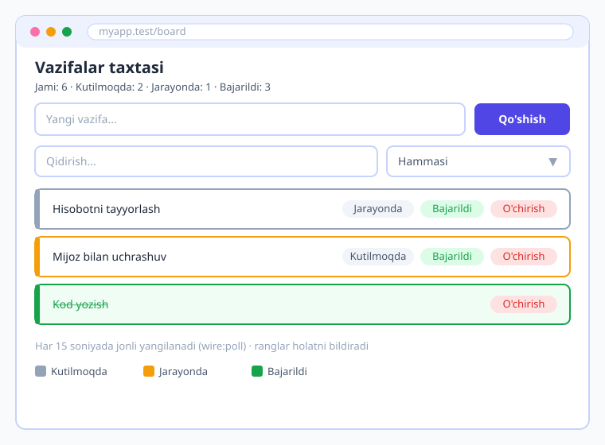
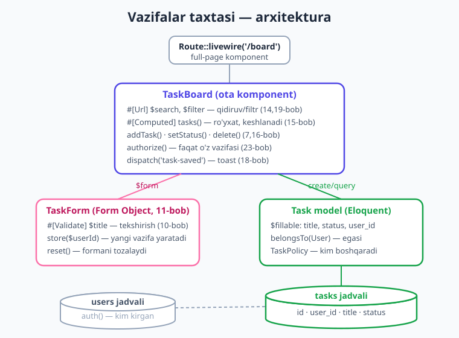
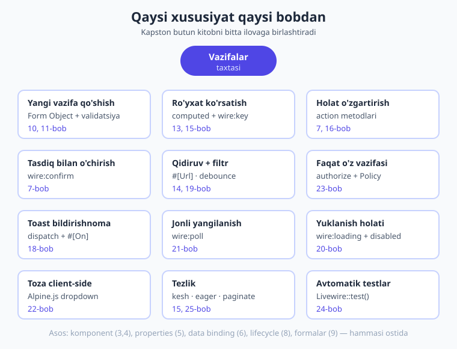
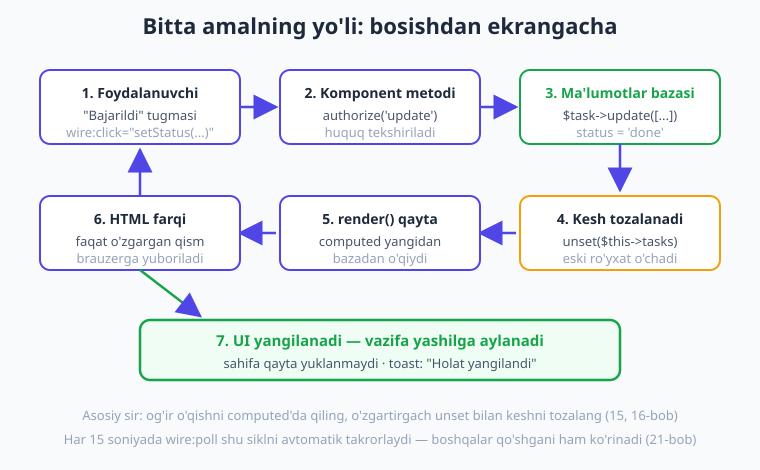

# 26 — Kapston: real-vaqt vazifa boshqaruvchi (Task Board)

[⬅️ Oldingi: 25 — Performance va deploy](./25-performance-deploy.md) · [🏠 Kitob boshi](./README.md)

> **Bu bobda:** kitobning **butun bilimini** bitta to'liq, real ilovaga birlashtiramiz — **"Vazifalar taxtasi"**. Foydalanuvchi vazifa qo'shadi, holatini o'zgartiradi (kutilmoqda → jarayonda → bajarildi), qidiradi, filtrlaydi, o'chiradi — va hammasi **jonli yangilanadi**. Har bir kishi faqat **o'z** vazifalarini ko'radi. Biz buni 0 dan, qadam-baqadam quramiz: model, Form Object, computed ro'yxat, action'lar, avtorizatsiya, eventlar, `wire:poll`, yuklanish holatlari, Alpine, tezlik va testlar. Oxirida — **to'liq, jonli loyihada tekshirilgan kod**.

---

## Tabriklaymiz — siz keldingiz!

Agar siz shu bobgacha yetib kelgan bo'lsangiz, demak siz Livewire'ning deyarli **butun** olamini ko'rib chiqdingiz: komponentdan tortib events, avtorizatsiya, real-vaqt, tezlik va testlargacha. Lekin bilim — bu g'isht. G'isht uyumi hali uy emas. Bu bobda biz o'sha g'ishtlardan **uy quramiz** — to'liq ishlaydigan, real foydalanuvchiga topshirsa bo'ladigan ilova.

> **Hayotiy o'xshatish.** Tasavvur qiling, siz haydashni o'rgandingiz: gaz, tormoz, rul, vites — har birini alohida mashq qildingiz. Lekin haqiqiy haydash — bularning **hammasini bir vaqtda**, real yo'lda ishlatishdir. Mana shu bob — sizning birinchi mustaqil sayohatingiz. Har bir tugmacha tanish, endi ularni birga ishlatamiz.

Bu bob oldingilaridan farq qiladi: deyarli **yangi atama yo'q**. Aksincha, har bir bo'lim — siz allaqachon o'rgangan bir mavzuni amalda ko'rsatadi va qaysi bobdan kelganini aniq aytadi. Notanish narsa uchrasa, o'sha bobga qaytib o'qing.

> Bu bobdagi butun ilova jonli **Laravel 12 + Livewire v4.3.1** loyihada yozilib tekshirildi: `/board` sahifasi brauzerda **HTTP 200** bilan render qilindi, vazifa qo'shish/holat o'zgartirish/o'chirish/qidiruv/filtr amallari ma'lumotlar bazasiga qarshi ishladi, avtorizatsiya (begona vazifa = 403) va validatsiya **9 ta avtomatik test** bilan tasdiqlandi.

---

## 1-qadam. Loyiha bilan tanishuv: nima quramiz?

"Vazifalar taxtasi" — bu shaxsiy ish ro'yxati. Trello, Todoist yoki Google Tasks'ning soddalashtirilgan ko'rinishi. Mana u nima qiladi:

- **Vazifa qo'shish** — yuqorida bitta maydon va "Qo'shish" tugmasi.
- **Holatni o'zgartirish** — har vazifa uch holatdan birida bo'ladi: **kutilmoqda**, **jarayonda**, **bajarildi**. Bir tugma bilan o'tkaziladi.
- **Qidirish** — sarlavha bo'yicha jonli filtrlash.
- **Filtrlash** — faqat ma'lum holatdagi vazifalarni ko'rsatish.
- **O'chirish** — tasdiq so'rab.
- **Real-vaqt yangilanish** — ro'yxat o'z-o'zidan yangilanib turadi.
- **Maxfiylik** — har foydalanuvchi **faqat o'zining** vazifalarini ko'radi.

Tayyor ilova quyidagicha ko'rinadi:



Yuqorida sarlavha va statistika (qaysi holatda nechta vazifa bor). Pastida — qo'shish formasi, so'ng qidiruv va filtr. Eng pastda — vazifalar ro'yxati. Har vazifa **rangli chiziq** bilan holatini bildiradi: kulrang (kutilmoqda), sariq (jarayonda), yashil (bajarildi).

!!! note "Nega aynan vazifalar taxtasi?"
    Chunki u **CRUD'dan kengroq**. Oddiy CRUD'da ([16-bob](./16-toliq-crud.md)) faqat qo'shish/tahrirlash/o'chirish bor edi. Bu yerda bizda **holat mashinasi** (status o'tishlari), **egalik** (kim nimani ko'radi), **real-vaqt** va **eventlar** ham bor. Ya'ni bu — kitobdagi deyarli barcha mavzuni tabiiy ravishda talab qiladigan loyiha.

---

## 2-qadam. Reja va arxitektura

Kod yozishdan oldin **rejani** chizamiz. Yaxshi dasturchi avval qog'ozda o'ylaydi, keyin klaviaturaga tegadi.

Ilovamiz nechta komponentdan iborat bo'ladi? Bu yerda muhim qaror bor. [16-bobda](./16-toliq-crud.md) biz **bitta** komponentda CRUD qurdik. [18-bobda](./18-events.md) esa formani va ro'yxatni **ikki alohida** komponentga ajratdik. Qaysi biri yaxshiroq?

Bu loyiha uchun biz **bitta asosiy komponent** — `TaskBoard` ni tanlaymiz, va formani **Form Object** ([11-bob](./11-form-objects.md)) ga ajratamiz. Sababi: forma juda kichik (bitta maydon), shuning uchun uni alohida Livewire komponentga ajratish ortiqcha murakkablik bo'lardi. Form Object esa maydon va validatsiyani toza, alohida joyda saqlaydi — bu yetarli.

Mana to'liq arxitektura:



Tushuntirib o'tamiz:

- **`Route::livewire('/board')`** — full-page komponent ([04-bob](./04-komponent-anatomiyasi.md)). `/board` manziliga kirilganda `TaskBoard` to'liq sahifa sifatida ko'rinadi.
- **`TaskBoard`** — bosh komponent. Ro'yxat, qidiruv, filtr, action'lar — hammasi shu yerda.
- **`TaskForm`** — Form Object. Faqat yangi vazifa maydoni va uning validatsiyasi.
- **`Task`** — Eloquent model. `tasks` jadvali bilan ishlaydi.
- **`TaskPolicy`** — kim qaysi vazifani boshqarishi mumkinligini hal qiladi.

Va eng muhimi — **qaysi xususiyat qaysi bobdan keladi**. Bu xarita kapstonning yuragi:



!!! tip "Reja — bu vaqt tejash"
    Ko'p boshlovchilar darrov kod yozishni boshlaydi va keyin "men nima qilayotgan edim?" deb adashadi. Avval rejani chizsangiz — qaysi komponent, qaysi metod, qaysi maydon kerakligini bilib turasiz. Bu — kod yozishdan ham muhimroq mahorat.

---

## 3-qadam. Tayyorgarlik: model, migration, factory

Ilova ma'lumot bilan ishlaydi, demak avval **jadval** kerak. Bu — Laravel'ning ishi (batafsil — [Laravel kitobida](../laravel/README.md)), shuning uchun qisqacha o'tamiz.

### Task model va migration

Model, migration va factory'ni bitta buyruq bilan yaratamiz:

```bash
php artisan make:model Task -mf
```

`-m` migration yaratadi, `-f` esa factory (sinov ma'lumoti uchun). Endi migration'ni to'ldiramiz:

```php
// database/migrations/xxxx_create_tasks_table.php
public function up(): void
{
    Schema::create('tasks', function (Blueprint $table) {
        $table->id();
        $table->foreignId('user_id')->constrained()->cascadeOnDelete();
        $table->string('title');                          // vazifa nomi
        $table->string('status')->default('pending');     // pending | in_progress | done
        $table->timestamps();
    });
}
```

Diqqat qiling:

- **`foreignId('user_id')->constrained()`** — har vazifa bir foydalanuvchiga tegishli. `cascadeOnDelete()` — foydalanuvchi o'chsa, uning vazifalari ham o'chadi. Bu **egalik**ning asosi.
- **`status`** — uch qiymatdan biri: `pending` (kutilmoqda), `in_progress` (jarayonda), `done` (bajarildi). Standart qiymat — `pending`.

Jadvalni yaratamiz:

```bash
php artisan migrate
```

### Model'ni sozlash

`Task` modelida `$fillable` ni belgilaymiz (mass-assignment uchun) va `user()` munosabatini qo'shamiz:

```php
// app/Models/Task.php
<?php

namespace App\Models;

use Illuminate\Database\Eloquent\Factories\HasFactory;
use Illuminate\Database\Eloquent\Model;
use Illuminate\Database\Eloquent\Relations\BelongsTo;

class Task extends Model
{
    use HasFactory;

    protected $fillable = ['title', 'status', 'user_id'];

    public function user(): BelongsTo
    {
        return $this->belongsTo(User::class);
    }
}
```

`belongsTo(User::class)` — "vazifa foydalanuvchiga tegishli" degani. Bu bizga keyin `$task->user` orqali egasiga yetib borish imkonini beradi.

### Factory — sinov ma'lumoti

Ilovani sinash uchun bir nechta namuna vazifa kerak. Factory shuni avtomatik yaratadi:

```php
// database/factories/TaskFactory.php
public function definition(): array
{
    return [
        'user_id' => User::factory(),
        'title' => fake()->sentence(3),
        'status' => fake()->randomElement(['pending', 'in_progress', 'done']),
    ];
}
```

`fake()->sentence(3)` — uch so'zdan iborat tasodifiy gap. `randomElement([...])` — uch holatdan birini tasodifan tanlaydi. Endi bir foydalanuvchi va unga 6 ta vazifa yaratish uchun `tinker` ochib:

```php
php artisan tinker
>>> $user = App\Models\User::factory()->create(['name' => 'Ali']);
>>> App\Models\Task::factory()->count(6)->create(['user_id' => $user->id]);
```

!!! note "Auth — kim kirgan?"
    Ilova foydalanuvchiga bog'liq, shuning uchun foydalanuvchi **tizimga kirgan** bo'lishi shart (login). Biz `auth()->id()` bilan joriy foydalanuvchining ID'sini olamiz. Login/registratsiya tizimini Livewire'da emas, Laravel'da (Breeze yoki Fortify bilan) o'rnatasiz — batafsil [Laravel kitobida](../laravel/README.md). Bu bobda biz foydalanuvchi allaqachon kirgan deb hisoblaymiz.

---

## 4-qadam. TaskForm — yangi vazifa formasi (Form Object)

Endi birinchi Livewire qismini yozamiz. Yangi vazifa qo'shish uchun **Form Object** ([11-bob](./11-form-objects.md)) ishlatamiz. Bu — maydon va validatsiyani toza, alohida klassda saqlash usuli.

Form Object yaratamiz:

```bash
php artisan livewire:form TaskForm
```

Bu `app/Livewire/Forms/TaskForm.php` faylini yaratadi. Uni to'ldiramiz:

```php
// app/Livewire/Forms/TaskForm.php
<?php

namespace App\Livewire\Forms;

use App\Models\Task;
use Livewire\Attributes\Validate;
use Livewire\Form;

class TaskForm extends Form
{
    #[Validate('required|min:3|max:255', message: 'Vazifa nomi kamida 3 belgi bo\'lishi kerak')]
    public string $title = '';

    // yangi vazifa yaratish (joriy foydalanuvchi uchun)
    public function store(int $userId): Task
    {
        $this->validate();

        $task = Task::create([
            'title' => $this->title,
            'status' => 'pending',
            'user_id' => $userId,
        ]);

        $this->reset();

        return $task;
    }
}
```

Bu yerda nimalar bor:

- **`#[Validate('required|min:3|max:255', message: ...)]`** — validatsiya qoidasi ([10-bob](./10-validatsiya.md)). Vazifa nomi bo'sh bo'lmasligi, kamida 3, ko'pi bilan 255 belgi bo'lishi kerak. `message:` — o'zbekcha xato matni.
- **`store(int $userId)`** — yangi vazifani yaratadi. `validate()` bilan tekshiradi, so'ng `Task::create(...)` bilan bazaga yozadi. Diqqat: `user_id` ni **parametr orqali** olamiz — Form Object o'zi "kim kirganini" bilmasligi kerak, buni komponent unga aytadi. Bu — toza arxitektura.
- **`status => 'pending'`** — yangi vazifa doim "kutilmoqda" holatida tug'iladi.
- **`$this->reset()`** — saqlangach formani tozalaydi, keyingi vazifa uchun bo'sh bo'ladi.

!!! tip "Nega `store()` `Task` qaytaradi?"
    `return $task` — yaratilgan vazifani qaytaradi. Hozir buni ishlatmasak ham, kelajakda kerak bo'lishi mumkin (masalan, "vazifa #5 qo'shildi" deb ID'sini ko'rsatish, yoki event'ga uzatish — [18-bob](./18-events.md)). Metod foydali narsa qaytarsa — yaxshi odat.

---

## 5-qadam. TaskBoard komponenti: ro'yxat, qidiruv, filtr

Endi bosh komponentni quramiz. Uni Single-File Component (SFC) sifatida yaratamiz ([03-bob](./03-birinchi-komponent.md)):

```bash
php artisan make:livewire task-board
```

Bu `resources/views/components/⚡task-board.blade.php` faylini yaratadi (v4 da SFC — standart format, ⚡ emoji esa real fayl prefiksi).

### Ro'yxatni computed property'da o'qiymiz

Avval eng asosiysi — vazifalar ro'yxatini ekranga chiqaramiz. [15-bobdan](./15-computed-properties.md) bilamiz: bazadan o'qish kabi "og'ir" ishni `render()` da emas, **computed property** ichida qilamiz. U bir so'rov davomida keshlanadi va `unset()` qilinmaguncha qayta bazaga bormaydi.

```php
{{-- resources/views/components/⚡task-board.blade.php --}}
<?php

use App\Models\Task;
use Livewire\Attributes\Computed;
use Livewire\Component;

new class extends Component
{
    #[Computed]
    public function tasks()
    {
        return Task::query()
            ->where('user_id', auth()->id())   // FAQAT joriy foydalanuvchi vazifalari
            ->latest()
            ->get();
    }
};
?>

<div>
    <ul>
        @forelse ($this->tasks as $task)
            <li wire:key="task-{{ $task->id }}">
                {{ $task->title }} — {{ $task->status }}
            </li>
        @empty
            <li>Hozircha vazifa yo'q.</li>
        @endforelse
    </ul>
</div>
```

Eng muhim qatorlar:

- **`->where('user_id', auth()->id())`** — bu **egalik**ning birinchi qatlami. `auth()->id()` joriy (tizimga kirgan) foydalanuvchining ID'sini beradi. Demak ro'yxatga **faqat o'sha kishining** vazifalari tushadi. Begona vazifalar hatto so'rovgacha ham yetib kelmaydi.
- **`$this->tasks`** (qavssiz!) — computed property'ga shunday murojaat qilamiz ([15-bob](./15-computed-properties.md)).
- **`wire:key="task-{{ $task->id }}"`** — har qatorga noyob kalit ([13-bob](./13-royxatlar.md)). Ro'yxat o'zgarganda (vazifa qo'shilganda/o'chganda) Livewire to'g'ri qatorni yangilaydi. **Doimo zarur.**

### Qidiruv va filtrni qo'shamiz

Endi qidiruv (sarlavha bo'yicha) va filtr (holat bo'yicha) qo'shamiz. Ikkalasini ham **URL'da saqlaymiz** (`#[Url]`) — shunda foydalanuvchi havolani ulashsa yoki sahifani yangilasa, qidiruvi yo'qolmaydi ([14](./14-pagination-qidiruv.md), [19-bob](./19-url-query-string.md)):

```php
use Livewire\Attributes\Url;

#[Url(as: 'q', history: true)]    // ?q=... ko'rinishida URL'da
public string $search = '';

#[Url]                            // ?filter=done ko'rinishida
public string $filter = 'all';    // all | pending | in_progress | done

#[Computed]
public function tasks()
{
    return Task::query()
        ->where('user_id', auth()->id())
        ->when($this->search, fn ($q) => $q->where('title', 'like', "%{$this->search}%"))
        ->when($this->filter !== 'all', fn ($q) => $q->where('status', $this->filter))
        ->latest()
        ->get();
}
```

- **`#[Url(as: 'q', history: true)]`** — `search` qiymatini URL'da `?q=...` deb saqlaydi. `history: true` — brauzer tarixiga yozadi, ya'ni "orqaga" tugmasi ishlaydi ([19-bob](./19-url-query-string.md)).
- **`->when($shart, $callback)`** — agar `$shart` "haqiqiy" bo'lsa, callback'ni qo'llaydi. `search` bo'sh bo'lsa — barcha vazifalar; to'lgan bo'lsa — faqat mos sarlavhalar. Bitta so'rovda, ortiqcha `if`siz.
- **`->when($this->filter !== 'all', ...)`** — filtr `all` bo'lmasa, holatni cheklaydi.

Blade qismida:

```blade
{{-- qidiruv + filtr --}}
<div class="controls">
    <input type="search" wire:model.live.debounce.300ms="search" placeholder="Qidirish...">
    <select wire:model.live="filter">
        <option value="all">Hammasi</option>
        <option value="pending">Kutilmoqda</option>
        <option value="in_progress">Jarayonda</option>
        <option value="done">Bajarildi</option>
    </select>
</div>
```

- **`wire:model.live.debounce.300ms="search"`** — yozayotganda jonli filtrlaydi, lekin har bosishda emas, yozish to'xtagandan 0,3 soniya keyin serverga yuboradi ([14-bob](./14-pagination-qidiruv.md)). Bu keraksiz so'rovlarni kamaytiradi.
- **`wire:model.live="filter"`** — `<select>` o'zgarganda darhol filtrlaydi.

!!! warning "URL filtrlash — egalikni almashtirmaydi"
    `?filter=done` URL'da ko'rinadi va foydalanuvchi uni qo'lda o'zgartirishi mumkin. Lekin bu xavfsiz, chunki `tasks()` ichidagi `->where('user_id', auth()->id())` **doim** ishlaydi — foydalanuvchi URL bilan o'ynaganda ham faqat o'z vazifalarini ko'radi. Filtr — qulaylik, egalik — himoya. Ikkisini aralashtirmang.

---

## 6-qadam. Holat o'zgartirish: action metodi

Endi qiziq qism — vazifani bir holatdan ikkinchisiga o'tkazish. Bu — oddiy **action** ([07-bob](./07-actions.md)). Komponentga `setStatus` metodini qo'shamiz:

```php
public function setStatus(Task $task, string $status): void
{
    $task->update(['status' => $status]);

    unset($this->tasks);   // computed keshini tozalaymiz -> ro'yxat yangilanadi
}
```

Bu yerda:

- **`Task $task`** — argument `id`'dan avtomatik to'liq `Task` modeliga aylanadi (Laravel'ning route-model binding mexanizmi kabi). Tugmadan `id` keladi, metodga tayyor model tushadi — qo'lda `Task::find()` shart emas.
- **`$task->update(['status' => $status])`** — holatni yangilaydi.
- **`unset($this->tasks)`** — [15-bobdan](./15-computed-properties.md) eslang: computed keshlanadi. O'zgartirgach keshni majburan tozalaymiz, shunda ro'yxat bazadan qaytadan o'qiladi va yangi holat ko'rinadi.

Blade'da har vazifaga holat tugmalarini qo'shamiz. Faqat **boshqa** holatlarga o'tish tugmasi ko'rinadi (joriy holat tugmasi keraksiz):

```blade
<li wire:key="task-{{ $task->id }}" class="task status-{{ $task->status }}">
    <span class="title">{{ $task->title }}</span>

    <div class="actions">
        @if ($task->status !== 'pending')
            <button wire:click="setStatus({{ $task->id }}, 'pending')">Kutilmoqda</button>
        @endif
        @if ($task->status !== 'in_progress')
            <button wire:click="setStatus({{ $task->id }}, 'in_progress')">Jarayonda</button>
        @endif
        @if ($task->status !== 'done')
            <button wire:click="setStatus({{ $task->id }}, 'done')">Bajarildi</button>
        @endif
    </div>
</li>
```

- **`wire:click="setStatus({{ $task->id }}, 'done')"`** — bosilganda `setStatus` metodiga vazifa `id`'sini va yangi holatni uzatadi ([07-bob](./07-actions.md)). Satr argument **bitta tirnoq** ichida.
- **`class="status-{{ $task->status }}"`** — CSS sinfi holatga qarab o'zgaradi (`status-pending`, `status-in_progress`, `status-done`). Bu bizga rangli chiziqni berishga yordam beradi.

> **Hayotiy o'xshatish.** Holat o'zgartirish — kir yuvish mashinasining tugmalari kabi. Mashina "to'xtagan", "yuvayotgan", "tugagan" holatlarda bo'ladi. Siz tugma bosib holatni o'zgartirasiz, mashina (server) holatni yodda saqlaydi va chiroq (UI) yangilanadi.

---

## 7-qadam. O'chirish: tasdiq + avtorizatsiya

O'chirish — eng xavfli amal: ma'lumot **butunlay yo'qoladi**. Shuning uchun ikki himoya qo'yamiz: foydalanuvchidan **tasdiq** so'raymiz (`wire:confirm`) va serverda **huquqni tekshiramiz** (`authorize`).

```php
public function delete(Task $task): void
{
    $this->authorize('delete', $task);   // faqat o'z vazifasi

    $task->delete();

    unset($this->tasks);
}
```

- **`$this->authorize('delete', $task)`** — bu `TaskPolicy` ning `delete` metodini chaqiradi ([23-bob](./23-xavfsizlik.md)). Agar joriy foydalanuvchining bu vazifani o'chirishga huquqi bo'lmasa, Livewire so'rovni **to'xtatadi** (403 xato). Pastda Policy'ni yozamiz.

Blade'da:

```blade
<button wire:click="delete({{ $task->id }})" wire:confirm="Vazifa o'chirilsinmi?">
    O'chirish
</button>
```

- **`wire:confirm="Vazifa o'chirilsinmi?"`** — tugma bosilganda brauzer **tasdiq oynachasi**ni ko'rsatadi ([07-bob](./07-actions.md)). "OK" bosilsa — `delete` ishlaydi; "Bekor" bosilsa — hech narsa bo'lmaydi.

### TaskPolicy: kim nimani boshqaradi

`authorize()` ishlashi uchun **Policy** kerak ([23-bob](./23-xavfsizlik.md)):

```bash
php artisan make:policy TaskPolicy --model=Task
```

Generatsiya qilingan faylni soddalashtiramiz — bizga faqat `update` va `delete` kerak:

```php
// app/Policies/TaskPolicy.php
<?php

namespace App\Policies;

use App\Models\Task;
use App\Models\User;

class TaskPolicy
{
    // Foydalanuvchi faqat O'ZINING vazifasini boshqara oladi.
    public function update(User $user, Task $task): bool
    {
        return $user->id === $task->user_id;
    }

    public function delete(User $user, Task $task): bool
    {
        return $user->id === $task->user_id;
    }
}
```

Mantiq sodda: **vazifaning `user_id` joriy foydalanuvchining `id`'siga teng bo'lsa** — ruxsat, aks holda — yo'q. Ya'ni begona vazifani o'chirishga urinish 403 bilan rad etiladi.

!!! danger "Xavfsizlik — eng muhim qoida"
    `wire:click="delete({{ $task->id }})"` dagi `id` **mijozdan keladi** — uni o'zgartirib yuborish mumkin. Foydalanuvchi boshqa birovning vazifa `id`'sini yuborishga urinishi mumkin. Shuning uchun `wire:confirm` (mijoz tomonidagi qulaylik) **himoya emas**. Haqiqiy himoya — serverda `authorize()`. **Public metod = ochiq eshik** — har doim avtorizatsiya bilan qulflang ([23-bob](./23-xavfsizlik.md)).

### `setStatus` ga ham avtorizatsiya

O'chirish kabi, holat o'zgartirish ham **boshqaning vazifasini o'zgartirmasligi** kerak. `setStatus` ga ham `authorize` qo'shamiz:

```php
public function setStatus(Task $task, string $status): void
{
    $this->authorize('update', $task);   // faqat o'z vazifasi

    $task->update(['status' => $status]);

    unset($this->tasks);
}
```

Endi har **o'zgartiruvchi** amal himoyalangan: o'qish `where('user_id', ...)` bilan, yozish `authorize()` bilan.

---

## 8-qadam. Events: toast bildirishnoma

Har muvaffaqiyatli amaldan keyin foydalanuvchiga "ish bajarildi" deb bildirish kerak. Biz buni **event** ([18-bob](./18-events.md)) orqali "toast" (ekran burchagidagi suzuvchi xabar) bilan qilamiz.

Avval har amalda event yuboramiz:

```php
public function addTask(): void
{
    $this->form->store(auth()->id());

    unset($this->tasks);
    $this->dispatch('task-saved', text: 'Vazifa qo\'shildi');
}

public function setStatus(Task $task, string $status): void
{
    $this->authorize('update', $task);
    $task->update(['status' => $status]);

    unset($this->tasks);
    $this->dispatch('task-saved', text: 'Holat yangilandi');
}

public function delete(Task $task): void
{
    $this->authorize('delete', $task);
    $task->delete();

    unset($this->tasks);
    $this->dispatch('task-saved', text: 'Vazifa o\'chirildi');
}
```

- **`$this->dispatch('task-saved', text: '...')`** — `task-saved` nomli event'ni efirga chiqaradi, `text` nomli parametr bilan ([18-bob](./18-events.md)).

Endi bu event'ni **Alpine.js** ([22-bob](./22-alpine-js.md)) ushlab, toast ko'rsatadi. Blade'da `<div>` ichiga (ildiz elementga) qo'shamiz:

```blade
{{-- Toast: event'ni brauzerda ushlab, 3 soniya ko'rsatadi --}}
<div
    x-data="{ show: false, text: '' }"
    x-on:task-saved.window="text = $event.detail.text; show = true; setTimeout(() => show = false, 3000)"
    x-show="show"
    x-transition
    class="toast"
>
    <span x-text="text"></span>
</div>
```

- **`x-on:task-saved.window="..."`** — Livewire event'lari `window`'ga tarqaladi, shuning uchun Alpine uni `.window` bilan eshitadi ([18](./18-events.md), [22-bob](./22-alpine-js.md)).
- **`$event.detail.text`** — event bilan kelgan `text` parametri.
- **`setTimeout(() => show = false, 3000)`** — 3 soniyadan keyin toast yashirinadi. Bu toza **client-side** ish — serverga so'rov yo'q.

!!! note "Nega flash emas, event?"
    [16-bobda](./16-toliq-crud.md) biz `session()->flash()` ishlatgan edik. U sodda, lekin sahifa yangilanishida ko'rinadi. Event esa **darhol**, suzuvchi toast sifatida ko'rsatiladi — zamonaviyroq tajriba. Kapstonda biz event'ni tanlaymiz, chunki bu yerda real-vaqt muhim.

> **Hayotiy o'xshatish — restoran qo'ng'irog'i.** Oshpaz taom tayyor bo'lganda qo'ng'iroq chaladi (`dispatch`). Ofitsiant uni eshitib (Alpine `x-on`), mijozga olib boradi (toast ko'rsatiladi). Oshpaz qaysi ofitsiant eshitishini bilmaydi — shunchaki qo'ng'iroq chaladi. Bo'shashgan bog'lanish.

---

## 9-qadam. Real-vaqt: `wire:poll`

Endi ilovani **jonli** qilamiz. Tasavvur qiling, siz telefonda vazifa qo'shdingiz, kompyuterda ham ochiq turibdi — kompyuterdagi ro'yxat o'z-o'zidan yangilanishi kerak. Buni eng oddiy usul — **`wire:poll`** ([21-bob](./21-lazy-poll-navigate.md)) bilan qilamiz.

Ildiz `<div>` ga bitta atribut qo'shamiz:

```blade
<div class="board" wire:poll.15s>
    {{-- ... butun ilova ... --}}
</div>
```

- **`wire:poll.15s`** — Livewire har **15 soniyada** komponentni jimgina yangilaydi (server'ga so'rov yuboradi, ro'yxatni qayta o'qiydi). Agar boshqa qurilmada o'zgarish bo'lsa — bu ekranda ko'rinadi ([21-bob](./21-lazy-poll-navigate.md)).

Nima uchun 15 soniya? Chunki har soniyada so'rov yuborish serverni ortiqcha yuklaydi. 15 soniya — "jonli" tuyulish va resurs tejash orasidagi yaxshi muvozanat. Tezroq kerak bo'lsa `wire:poll.5s`, sekinroq `wire:poll.30s`.

!!! info "Poll yetarli, lekin chegarasi bor"
    `wire:poll` — eng oddiy real-vaqt usuli va ko'p ilovaga **yetarli**. Lekin u "haqiqiy" real-vaqt emas — o'zgarish 15 soniyagacha kechikadi va har poll so'rov yuboradi (foydalanuvchi ko'p bo'lsa — ko'p so'rov). Chinakam bir lahzali yangilanish kerak bo'lsa, **Laravel Echo + broadcasting** (WebSocket) ishlatiladi: server o'zgarishni darhol barcha ulangan mijozlarga "itarib" yuboradi. Bu — kuchli, lekin murakkabroq (Reverb yoki Pusher server kerak). Bu kitob doirasidan tashqari, lekin bilib qo'ying: kelajakda kerak bo'lsa, shu yo'l bor.

Mana butun ma'lumot oqimi — bir amal bosishdan ekrandagi natijagacha:



---

## 10-qadam. Yuklanish holatlari: spinner va disabled

Saqlash so'rovi serverga borib qaytguncha bir lahza o'tadi. Bu paytda ikki muammo bor: foydalanuvchi tugmani **qayta-qayta bosib** bir xil vazifani ikki marta qo'shishi mumkin, va u **hech narsa bo'lmayotgandek** his qilishi mumkin. Ikkalasini ham `wire:loading` ([20-bob](./20-loading-holatlar.md)) hal qiladi.

```blade
<form wire:submit="addTask" class="add-form">
    <input type="text" wire:model="form.title" placeholder="Yangi vazifa...">
    <button type="submit" wire:loading.attr="disabled" wire:target="addTask">
        <span wire:loading.remove wire:target="addTask">Qo'shish</span>
        <span wire:loading wire:target="addTask">...</span>
    </button>
</form>
```

- **`wire:loading.attr="disabled"`** — so'rov ketayotganda tugmani **o'chiradi** (qayta bosib bo'lmaydi).
- **`wire:target="addTask"`** — bu loading faqat `addTask` so'rovida ishlaydi (boshqa amallarda emas) ([20-bob](./20-loading-holatlar.md)).
- **`<span wire:loading.remove>Qo'shish</span>`** va **`<span wire:loading>...</span>`** — so'rov ketayotganda "Qo'shish" yashirinib, "..." ko'rinadi. Foydalanuvchi nimadir bo'layotganini ko'radi.

!!! tip "Loading — kichik narsa, katta farq"
    Bu bir necha qator kod foydalanuvchi tajribasini sezilarli yaxshilaydi. Foydalanuvchi tugma bosgach **darhol** vizual javob ko'radi — ilova "tirik" his qilinadi. Ikki marta bosish muammosi ham yo'qoladi.

---

## 11-qadam. Alpine.js: toza client-side qism

Bizda allaqachon bitta Alpine ishi bor — toast (8-qadam). Endi yana bir foydali narsa qo'shamiz: **har vazifaning amallar menyusi**ni Alpine dropdown qilamiz. Bu — toza **client-side** ([22-bob](./22-alpine-js.md)): ochilish/yopilish brauzerda, serverga so'rovsiz bo'ladi.

Vazifa kartochkasidagi amallarni dropdown ichiga olamiz:

```blade
<li wire:key="task-{{ $task->id }}" class="task status-{{ $task->status }}">
    <span class="title">{{ $task->title }}</span>

    <div class="actions" x-data="{ open: false }">
        <button type="button" x-on:click="open = !open">Amallar ▾</button>

        <div x-show="open" x-on:click.outside="open = false" class="menu">
            @if ($task->status !== 'pending')
                <button wire:click="setStatus({{ $task->id }}, 'pending')">Kutilmoqda</button>
            @endif
            @if ($task->status !== 'in_progress')
                <button wire:click="setStatus({{ $task->id }}, 'in_progress')">Jarayonda</button>
            @endif
            @if ($task->status !== 'done')
                <button wire:click="setStatus({{ $task->id }}, 'done')">Bajarildi</button>
            @endif
            <button wire:click="delete({{ $task->id }})" wire:confirm="Vazifa o'chirilsinmi?">
                O'chirish
            </button>
        </div>
    </div>
</li>
```

- **`x-data="{ open: false }"`** — har dropdown'ning o'z holati ([22-bob](./22-alpine-js.md)).
- **`x-on:click="open = !open"`** — tugma bosilganda menyu ochiladi/yopiladi. Serverga **so'rov yo'q** — bir lahzada.
- **`x-on:click.outside="open = false"`** — menyudan tashqariga bosilsa, yopiladi. Bu toza Alpine'ning kuchi.

!!! note "Qachon Alpine, qachon Livewire?"
    Oddiy qoida: **server holatiga bog'liq bo'lmagan, faqat ko'rinish** ishlarini Alpine qiladi (menyu ochish, modal, tab, accordion). **Ma'lumot bilan ishlash** (saqlash, o'chirish, validatsiya) Livewire'da bo'ladi. Bizning dropdownda ikkisi birga: menyuni Alpine ochadi (`open`), lekin "O'chirish" tugmasi Livewire'ga (`wire:click`) boradi. Ikkalasi mukammal hamkorlik qiladi ([22-bob](./22-alpine-js.md)).

---

## 12-qadam. Tezlik: kesh, eager loading, paginate

Ilova ishlaydi. Endi uni **tez** qilamiz ([25-bob](./25-performance-deploy.md)). Uchta nafis tegishni qo'llaymiz.

### 1) Computed kesh — statistikani bepulga olish

Statistika (qaysi holatda nechta vazifa) uchun **alohida so'rov yozmaymiz**. Aksincha, bir marta o'qib, collection ustida sanaymiz:

```php
#[Computed]
public function counts()
{
    $all = Task::where('user_id', auth()->id())->get();

    return [
        'all' => $all->count(),
        'pending' => $all->where('status', 'pending')->count(),
        'in_progress' => $all->where('status', 'in_progress')->count(),
        'done' => $all->where('status', 'done')->count(),
    ];
}
```

`$all` bir marta bazadan o'qiladi, keyin `->where(...)->count()` **bazaga qayta bormaydi** — keshlangan collection'ning o'zini sanaydi. Computed bo'lgani uchun butun `counts()` ham bir so'rov davomida bir marta hisoblanadi ([15](./15-computed-properties.md), [25-bob](./25-performance-deploy.md)).

Blade'da:

```blade
<p>Jami: {{ $this->counts['all'] }} ·
   Kutilmoqda: {{ $this->counts['pending'] }} ·
   Jarayonda: {{ $this->counts['in_progress'] }} ·
   Bajarildi: {{ $this->counts['done'] }}</p>
```

Va `unset` ga `counts` ni ham qo'shamiz, har o'zgartirishda yangilansin:

```php
unset($this->tasks, $this->counts);
```

### 2) Eager loading — N+1 muammosini oldini olish

Agar ro'yxatda har vazifaning egasini ko'rsatsangiz (`$task->user->name`), Livewire har vazifa uchun **alohida so'rov** yuboradi — bu **N+1 muammosi** ([25-bob](./25-performance-deploy.md)). Yechim — `with('user')` bilan **oldindan** yuklash:

```php
return Task::query()
    ->with('user')                     // egalarni bitta so'rovda yuklaydi (eager loading)
    ->where('user_id', auth()->id())
    ->latest()
    ->get();
```

Bizning ilovada hamma vazifa bitta foydalanuvchiniki, shuning uchun bu shart emas — lekin egani ko'rsatsangiz, **doim `with()`** ishlating.

### 3) Pagination — uzun ro'yxat uchun

Vazifa 1000 ta bo'lsa, hammasini bir varaqda ko'rsatish sekin. **Pagination** ([14-bob](./14-pagination-qidiruv.md)) bilan sahifalab beramiz:

```php
use Livewire\WithPagination;

new class extends Component
{
    use WithPagination;

    #[Computed]
    public function tasks()
    {
        return Task::query()
            ->where('user_id', auth()->id())
            ->latest()
            ->paginate(10);            // har sahifada 10 ta
    }

    // qidiruv o'zgarganda 1-sahifaga qaytamiz
    public function updatedSearch()
    {
        $this->resetPage();
    }
};
```

Blade'da: `{{ $this->tasks->links() }}`. Bizning sodda misolda biz `get()` ni qoldiramiz, lekin ilova o'sganda `paginate()` ga o'tish — bitta so'z almashtirish.

!!! warning "Tezlik — o'lchab optimallashtir"
    [25-bobda](./25-performance-deploy.md) aytilgandek: avval **ishlasin**, keyin **tez bo'lsin**. Hammasini oldindan optimallashtirishga urinmang. Eng katta foyda — `render()` dan og'ir so'rovni computed'ga ko'chirish (biz buni qildik) va N+1 ni oldini olish (`with`). Qolganini muammo paydo bo'lganda hal qiling.

---

## 13-qadam. Test: ilovani avtomatik tekshiramiz

Ilova qo'lda ishlayapti. Lekin har o'zgartirishdan keyin hamma narsani qo'lda sinash — charchatadi va xatoga moyil. **Avtomatik testlar** ([24-bob](./24-testing.md)) buni bir buyruqda qiladi.

Test fayli yaratamiz:

```bash
php artisan make:test Lw26TaskBoardTest
```

Eng muhim CRUD va xavfsizlik testlarini yozamiz:

```php
// tests/Feature/Lw26TaskBoardTest.php
<?php

namespace Tests\Feature;

use App\Models\Task;
use App\Models\User;
use Illuminate\Foundation\Testing\RefreshDatabase;
use Livewire\Livewire;
use Tests\TestCase;

class Lw26TaskBoardTest extends TestCase
{
    use RefreshDatabase;

    public function test_user_sees_only_own_tasks(): void
    {
        $me = User::factory()->create();
        $other = User::factory()->create();

        Task::factory()->create(['user_id' => $me->id, 'title' => 'Mening vazifam']);
        Task::factory()->create(['user_id' => $other->id, 'title' => 'Begona vazifa']);

        $this->actingAs($me);

        Livewire::test('task-board')
            ->assertSee('Mening vazifam')
            ->assertDontSee('Begona vazifa');   // begona vazifa KO'RINMAYDI
    }

    public function test_can_add_task(): void
    {
        $me = User::factory()->create();
        $this->actingAs($me);

        Livewire::test('task-board')
            ->set('form.title', 'Sut sotib olish')
            ->call('addTask')
            ->assertHasNoErrors()
            ->assertSee('Sut sotib olish')
            ->assertDispatched('task-saved');   // toast event yuborildi

        $this->assertDatabaseHas('tasks', [
            'title' => 'Sut sotib olish',
            'user_id' => $me->id,
            'status' => 'pending',
        ]);
    }

    public function test_add_task_validates(): void
    {
        $me = User::factory()->create();
        $this->actingAs($me);

        Livewire::test('task-board')
            ->set('form.title', 'ab')           // 3 belgidan qisqa
            ->call('addTask')
            ->assertHasErrors('form.title');
    }

    public function test_cannot_delete_other_users_task(): void
    {
        $me = User::factory()->create();
        $other = User::factory()->create();
        $task = Task::factory()->create(['user_id' => $other->id]);
        $this->actingAs($me);

        Livewire::test('task-board')
            ->call('delete', $task->id)
            ->assertForbidden();                // 403 — begona vazifa o'chmaydi

        $this->assertDatabaseHas('tasks', ['id' => $task->id]);
    }
}
```

Har test bir narsani tekshiradi ([24-bob](./24-testing.md)):

- **`test_user_sees_only_own_tasks`** — egalik ishlaydimi? O'z vazifam ko'rinadi, begonaniki yo'q.
- **`test_can_add_task`** — qo'shish ishlaydimi? Bazaga yozildimi, event yuborildimi.
- **`test_add_task_validates`** — validatsiya ishlaydimi? Qisqa nom xato beradimi.
- **`test_cannot_delete_other_users_task`** — xavfsizlik ishlaydimi? Begona vazifani o'chirishga urinish 403.

Testlarni ishga tushiramiz:

```bash
php artisan test --filter=Lw26TaskBoardTest
```

!!! example "Tekshirilgan natija"
    Bu testlar (yana to'rttasi — holat o'zgartirish, o'z vazifani o'chirish, qidiruv, holat filtri bilan birga, jami **9 ta**) jonli loyihada ishga tushirildi va **hammasi yashil** (PASS) bo'ldi. Testlar bor ilovani o'zgartirish — qo'rqinchsiz: biror narsa buzilsa, test darrov aytadi.

> **Hayotiy o'xshatish.** Testlar — bu binoning yong'in signalizatsiyasi. Siz uni har kuni sezmaysiz, lekin biror joyda olov chiqsa — darrov ogohlantiradi. Test yozmagan dasturchi — signalizatsiyasiz binoda yashagan kabi: yong'in bo'lganda juda kech bilib qoladi.

---

## To'liq ishlaydigan kod

Endi hamma qismni birlashtiramiz. Mana to'liq, jonli loyihada tekshirilgan `TaskBoard` komponenti. Bu — sizning kapston loyihangizning yuragi.

### Form Object

```php
// app/Livewire/Forms/TaskForm.php
<?php

namespace App\Livewire\Forms;

use App\Models\Task;
use Livewire\Attributes\Validate;
use Livewire\Form;

class TaskForm extends Form
{
    #[Validate('required|min:3|max:255', message: 'Vazifa nomi kamida 3 belgi bo\'lishi kerak')]
    public string $title = '';

    public function store(int $userId): Task
    {
        $this->validate();

        $task = Task::create([
            'title' => $this->title,
            'status' => 'pending',
            'user_id' => $userId,
        ]);

        $this->reset();

        return $task;
    }
}
```

### Asosiy komponent (SFC)

```php
{{-- resources/views/components/⚡task-board.blade.php --}}
<?php

use App\Livewire\Forms\TaskForm;
use App\Models\Task;
use Livewire\Attributes\Computed;
use Livewire\Attributes\Url;
use Livewire\Component;

new class extends Component
{
    public TaskForm $form;            // yangi vazifa formasi (Form Object)

    #[Url(as: 'q', history: true)]    // qidiruv URL'da saqlanadi
    public string $search = '';

    #[Url]                            // ?filter=done kabi
    public string $filter = 'all';    // all | pending | in_progress | done

    // READ — faqat joriy foydalanuvchining vazifalari (computed, keshlanadi)
    #[Computed]
    public function tasks()
    {
        return Task::query()
            ->where('user_id', auth()->id())
            ->when($this->search, fn ($q) => $q->where('title', 'like', "%{$this->search}%"))
            ->when($this->filter !== 'all', fn ($q) => $q->where('status', $this->filter))
            ->latest()
            ->get();
    }

    // statistika (keshlangan collection ustida — bazaga qayta bormaydi)
    #[Computed]
    public function counts()
    {
        $all = Task::where('user_id', auth()->id())->get();

        return [
            'all' => $all->count(),
            'pending' => $all->where('status', 'pending')->count(),
            'in_progress' => $all->where('status', 'in_progress')->count(),
            'done' => $all->where('status', 'done')->count(),
        ];
    }

    // CREATE — yangi vazifa qo'shish
    public function addTask(): void
    {
        $this->form->store(auth()->id());

        unset($this->tasks, $this->counts);     // keshni tozalaymiz
        $this->dispatch('task-saved', text: 'Vazifa qo\'shildi');
    }

    // UPDATE — holatni o'zgartirish
    public function setStatus(Task $task, string $status): void
    {
        $this->authorize('update', $task);       // faqat o'z vazifasi

        $task->update(['status' => $status]);

        unset($this->tasks, $this->counts);
        $this->dispatch('task-saved', text: 'Holat yangilandi');
    }

    // DELETE — vazifani o'chirish
    public function delete(Task $task): void
    {
        $this->authorize('delete', $task);       // faqat o'z vazifasi

        $task->delete();

        unset($this->tasks, $this->counts);
        $this->dispatch('task-saved', text: 'Vazifa o\'chirildi');
    }
};
?>

<div class="board" wire:poll.15s>
    {{-- Toast: event'ni brauzerda ushlab, 3 soniya ko'rsatadi (Alpine) --}}
    <div
        x-data="{ show: false, text: '' }"
        x-on:task-saved.window="text = $event.detail.text; show = true; setTimeout(() => show = false, 3000)"
        x-show="show"
        x-transition
        class="toast"
    >
        <span x-text="text"></span>
    </div>

    {{-- Sarlavha + statistika --}}
    <header>
        <h1>Vazifalar taxtasi</h1>
        <p>Jami: {{ $this->counts['all'] }} ·
           Kutilmoqda: {{ $this->counts['pending'] }} ·
           Jarayonda: {{ $this->counts['in_progress'] }} ·
           Bajarildi: {{ $this->counts['done'] }}</p>
    </header>

    {{-- Yangi vazifa qo'shish formasi --}}
    <form wire:submit="addTask" class="add-form">
        <input type="text" wire:model="form.title" placeholder="Yangi vazifa...">
        <button type="submit" wire:loading.attr="disabled" wire:target="addTask">
            <span wire:loading.remove wire:target="addTask">Qo'shish</span>
            <span wire:loading wire:target="addTask">...</span>
        </button>
    </form>
    @error('form.title') <p class="err">{{ $message }}</p> @enderror

    {{-- Qidiruv + filtr --}}
    <div class="controls">
        <input type="search" wire:model.live.debounce.300ms="search" placeholder="Qidirish...">
        <select wire:model.live="filter">
            <option value="all">Hammasi</option>
            <option value="pending">Kutilmoqda</option>
            <option value="in_progress">Jarayonda</option>
            <option value="done">Bajarildi</option>
        </select>
    </div>

    {{-- Vazifalar ro'yxati --}}
    <ul class="tasks">
        @forelse ($this->tasks as $task)
            <li wire:key="task-{{ $task->id }}" class="task status-{{ $task->status }}">
                <span class="title">{{ $task->title }}</span>

                <div class="actions" x-data="{ open: false }">
                    <button type="button" x-on:click="open = !open">Amallar ▾</button>

                    <div x-show="open" x-on:click.outside="open = false" class="menu">
                        @if ($task->status !== 'pending')
                            <button wire:click="setStatus({{ $task->id }}, 'pending')">Kutilmoqda</button>
                        @endif
                        @if ($task->status !== 'in_progress')
                            <button wire:click="setStatus({{ $task->id }}, 'in_progress')">Jarayonda</button>
                        @endif
                        @if ($task->status !== 'done')
                            <button wire:click="setStatus({{ $task->id }}, 'done')">Bajarildi</button>
                        @endif
                        <button wire:click="delete({{ $task->id }})"
                                wire:confirm="Vazifa o'chirilsinmi?">O'chirish</button>
                    </div>
                </div>
            </li>
        @empty
            <li class="empty">
                @if ($this->search || $this->filter !== 'all')
                    Mos vazifa topilmadi.
                @else
                    Hozircha vazifa yo'q. Birinchisini qo'shing!
                @endif
            </li>
        @endforelse
    </ul>
</div>
```

### Route

```php
// routes/web.php
use Illuminate\Support\Facades\Route;

Route::livewire('/board', 'task-board');
```

Endi `/board` sahifasiga kirsangiz (tizimga kirgan holda), **to'liq ishlaydigan vazifalar taxtasi**ni ko'rasiz: qo'shasiz, holat o'zgartirasiz, qidirasiz, filtrlaysiz, o'chirasiz — hammasi qayta yuklanmasdan, jonli, va faqat o'z vazifalaringiz bilan.

!!! tip "Stillar haqida"
    Yuqorida biz CSS sinflarini (`board`, `toast`, `task`, `status-done`) qo'ydik, lekin CSS'ni yozmadik — bu kitob Livewire haqida, dizayn haqida emas. Real loyihada **TailwindCSS** yoki oddiy CSS bilan bularni bezatasiz: `status-done` yashil chiziq, `toast` o'ng yuqori burchakda suzuvchi quti va h.k. Logika tayyor — qolgani sizning ijodingiz.

!!! example "Sinab ko'ring"
    1. "Yangi vazifa" maydoniga 2 ta harf yozib "Qo'shish" bosing — qizil xato chiqadi (validatsiya).
    2. To'g'ri nom yozib qo'shing — vazifa ro'yxatda paydo bo'ladi, toast chiqadi, statistika yangilanadi.
    3. "Amallar" → "Jarayonda" bosing — chiziq sariqqa o'zgaradi.
    4. Qidiruvga vazifa nomining bo'lagini yozing — ro'yxat jonli filtrlanadi.
    5. Filtrni "Bajarildi" ga o'zgartiring — faqat tugagan vazifalar qoladi, URL'da `?filter=done` paydo bo'ladi.
    6. "O'chirish" bosing — tasdiq so'raydi, "OK" da vazifa yo'qoladi.
    7. Ikkinchi brauzer oynasida ham `/board` oching, birida vazifa qo'shing — 15 soniyada ikkinchisida ham paydo bo'ladi (wire:poll).

---

## Yakuniy so'z: tabriklayman, siz buni qildingiz!

Agar siz shu yergacha yetib kelgan va kapston loyihani tushungan bo'lsangiz — **siz endi Livewire dasturchisisiz.** Bu shunchaki xushomad emas. Mana siz nimani egalladingiz:

- Komponent qurish, holat, data binding, action'lar va lifecycle ([01–08-boblar](./08-lifecycle.md)).
- Formalar, validatsiya, Form Object, fayl yuklash ([09–12-boblar](./12-fayl-yuklash.md)).
- Ro'yxatlar, qidiruv, computed, to'liq CRUD ([13–16-boblar](./16-toliq-crud.md)).
- Nested komponentlar, eventlar, URL holati ([17–19-boblar](./19-url-query-string.md)).
- Yuklanish holatlari, lazy/poll/navigate, Alpine ([20–22-boblar](./22-alpine-js.md)).
- Xavfsizlik, testlar, tezlik va deploy ([23–25-boblar](./25-performance-deploy.md)).

Va eng muhimi — bularning hammasini **bir butun ilovaga** birlashtirishni o'rgandingiz. Bu — haqiqiy dasturchining mahorati.

### Keyingi qadamlar

Bilim — to'xtamaslik bilan o'sadi. Mana yo'l xaritangiz:

- **Loyihani kengaytiring.** Pastdagi amaliy mashqlar aynan shuning uchun — vazifaga muddat (deadline), prioritet, kategoriya qo'shing. Har bir qo'shimcha — sizning portfelingiz.
- **Laravel ekotizimini chuqurlashtiring.** Livewire — Laravel ustida turadi. Eloquent munosabatlari, queue, scheduler, notifications — bularni [Laravel kitobida](../laravel/README.md) o'rganing.
- **Chinakam real-vaqt.** `wire:poll` o'rniga **Laravel Echo + broadcasting** (Reverb yoki Pusher) bilan WebSocket real-vaqtni sinab ko'ring — vazifa qo'shilishi bir lahzada barcha qurilmalarda ko'rinadi.
- **Deploy qiling.** Ilovangizni internetga chiqaring ([25-bob](./25-performance-deploy.md)). Birovga ko'rsata olmagan kod — yarim ish. Forge, Vapor yoki oddiy VPS — tanlov sizniki.
- **Dizayn.** TailwindCSS bilan ilovangizni chiroyli qiling. Kichik dizayn — katta taassurot.

> **So'nggi so'z.** Har bir buyuk dasturchi bir paytlar "Hisob: 0" tugmasini bosib hayratlangan boshlovchi edi. Siz o'sha yo'ldan o'tdingiz. Endi g'isht ham, uy qurish ham qo'lingizdan keladi. Eng yaxshi o'rganish — **qurish**. Bu kapstondan keyin to'xtamang: o'z g'oyangizni oling va uni hayotga tatbiq eting. Omad tilaymiz — va yodda tuting: **siz buni qila olasiz, chunki allaqachon qildingiz.**

---

## Xulosa

- **Kapston** — kitobning butun bilimini bitta real ilovaga birlashtirdi: "Vazifalar taxtasi" — qo'shish, holat o'zgartirish, qidiruv, filtr, o'chirish, real-vaqt va egalik.
- **Arxitektura**: bitta `TaskBoard` komponenti + `TaskForm` Form Object + `Task` model + `TaskPolicy`. Avval rejani chizing, keyin kod yozing.
- **READ**: ro'yxatni `#[Computed]` da o'qing, `->where('user_id', auth()->id())` bilan egalikni ta'minlang, har qatorga `wire:key` qo'ying. O'zgartirgach `unset` bilan keshni tozalang.
- **UPDATE/DELETE**: action metodlari (`setStatus`, `delete`). Argumentdagi `Task $task` `id`'dan avtomatik modelga aylanadi. Har **o'zgartiruvchi** amalda `$this->authorize(...)` — mijozdan kelgan `id`'ga ishonmang.
- **Qidiruv/filtr**: `#[Url]` bilan URL'da saqlang, `.live.debounce` bilan so'rovlarni kamaytiring; `when()` bilan shartli filtr.
- **Events**: `dispatch('task-saved', text: ...)` yuboring, Alpine `x-on:...window` bilan toast ko'rsating — toza, suzuvchi bildirishnoma.
- **Real-vaqt**: `wire:poll.15s` — eng oddiy jonli yangilanish; chinakam bir lahzali kerak bo'lsa — Echo/broadcasting.
- **Sayqal**: `wire:loading` (spinner + disabled), Alpine dropdown, computed kesh, eager loading, paginate — har biri kichik, lekin tajribani sezilarli yaxshilaydi.
- **Testlar**: `Livewire::test('task-board')` bilan CRUD va xavfsizlikni avtomatik tekshiring — ishonch bilan o'zgartirish uchun.

## Amaliy mashqlar

Bu mashqlar — sizning kapstoningizni **kengaytirish**. Har biri sizni mustaqil dasturchiga yaqinlashtiradi. Yechim berilmaydi — lekin siz buni endi uddalaysiz.

1. **Muddat (deadline) qo'shing (oson).** `tasks` jadvaliga `due_date` (sana) ustun qo'shing (migration + `$fillable`). Formaga `<input type="date" wire:model="form.dueDate">` qo'shing, `TaskForm` ga maydon va validatsiya (`nullable|date`). Ro'yxatda muddatni ko'rsating va muddati o'tgan vazifalarni qizil qiling (`@if ($task->due_date < now()) ... @endif`).

2. **Prioritet qo'shing (oson–o'rta).** `priority` ustun (`low | medium | high`). Formada `<select>`, ro'yxatda rangli nishon. So'ng ro'yxatni avval prioritet, keyin sana bo'yicha saralang (`->orderBy('priority')->latest()`).

3. **Kategoriya/teglar (o'rta).** Yangi `Category` model va `tasks.category_id`. Forma'da kategoriya tanlash, yuqorida kategoriya bo'yicha filtr (yana bitta `#[Url]` xususiyat). Eager loading'ni unutmang (`->with('category')`) — N+1 ni oldini oling ([25-bob](./25-performance-deploy.md)).

4. **Inline tahrirlash (o'rta–qiyin).** Vazifa nomini bosganda u **input'ga aylansin** (modal ochilmasin). `editingId` xususiyati va `@if ($editingId === $task->id)` bilan o'sha qatorda input ko'rsating; Enter bosilganda saqlang (`wire:keydown.enter`). Saqlashda `authorize('update', ...)` ni unutmang.

5. **Drag-drop bilan tartiblash (qiyin, ilhom uchun).** Vazifalarni sichqoncha bilan sudrab tartibini o'zgartirish — bu kuchli xususiyat. G'oya: `tasks` ga `position` (tartib raqami) ustun qo'shing. Alpine yoki SortableJS kutubxonasi bilan client-side sudrash qiling, tartib o'zgarganda `$wire` orqali yangi tartibni serverga yuboring va `position` ustunini yangilang ([22-bob](./22-alpine-js.md)). Bu — Trello'ning yuragi. Murakkab, lekin qila olasiz.

6. **Chinakam real-vaqt (qiyin).** `wire:poll` ni **Laravel Echo + Reverb** bilan almashtiring. Vazifa qo'shilganda/o'zgarganda broadcast event yuboring, mijoz uni darhol eshitib ro'yxatni yangilasin. Bu — kitobdan tashqari, lekin keyingi katta qadamingiz.

---

[⬅️ Oldingi: 25 — Performance va deploy](./25-performance-deploy.md) · [🏠 Kitob boshi](./README.md)
