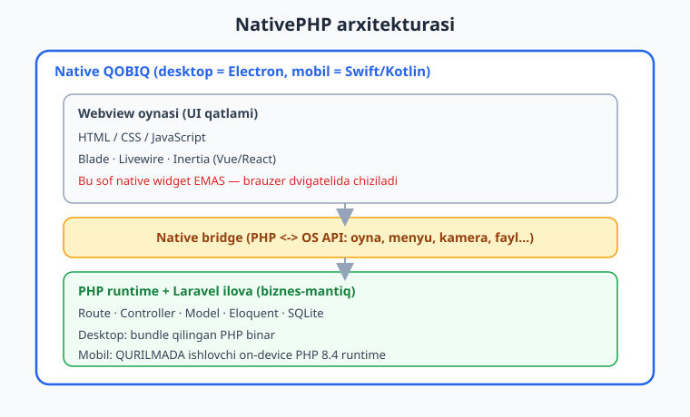
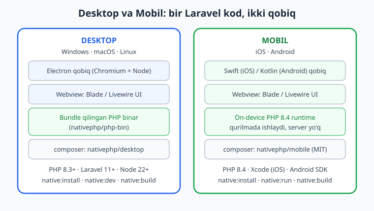
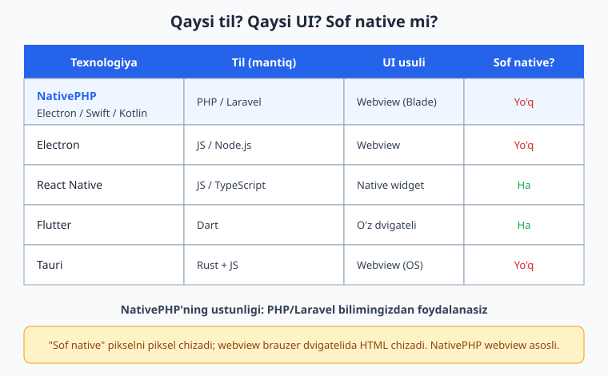

# 01 — NativePHP nima va falsafasi

[🏠 README](./README.md) · [Keyingi: 02 — Muhit, talablar va Laravel asos ➡️](./02-muhit-laravel-asos.md)

---

> **Bu bobda:** NativePHP'ning aniq nima ekanini, qanday ishlashini va falsafasini chuqur o'rganamiz. NativePHP — bu Laravel/PHP ilovangizni native **qobiq** ichida ishga tushiruvchi vosita: desktopda Electron qobiq, mobilda Swift (iOS) yoki Kotlin (Android) qobiq. UI qatlami webview ichidagi HTML/CSS/JS (Blade, Livewire, Inertia), biznes-mantiq esa PHP'da yoziladi. Desktopda PHP bundle qilingan binar sifatida, mobilda esa to'g'ridan **qurilmada ishlovchi** PHP runtime sifatida keladi. Arxitekturani (webview + native bridge + PHP runtime), uni Electron, React Native, Flutter va Tauri bilan solishtirishni, qachon kerak va qachon kerak emasligini, hamda tarixini (Marcel Pociot, Simon Hamp; desktop v2, mobil v3 2026-fevraldan MIT/bepul) ko'rib chiqamiz.
>
> **Halol eslatma:** NativePHP **sof native widget yaratmaydi** — u webview asosli. Ya'ni interfeys SwiftUI yoki Qt kabi piksel-darajadagi native widgetlar emas, balki brauzer dvigatelida chiziladigan HTML. Bu bobdagi Laravel/PHP kod bloklari haqiqiy muhitda tekshirildi (php -l, Laravel 13 boot, Eloquent + SQLite). Ammo GUI oyna ochilishi, qurilmada ishlash va build/packaging bloklari **illustrativ** — bu muhitda displey, Electron GUI, Xcode va Android SDK yo'q, shuning uchun ular ishga tushirilmagan, lekin kod va buyruqlar to'g'ri.

---

## NativePHP nima?

Tasavvur qiling: siz Laravel'ni yaxshi bilasiz. Route yozasiz, Controller, Model, Blade shablon, Eloquent so'rovlar — hammasi qo'lingizdan keladi. Endi xohlaysizki, shu bilim bilan **brauzer kerak bo'lmagan**, foydalanuvchi ikki marta bosib ochadigan haqiqiy **desktop ilova** yoki App Store / Google Play'ga joylanadigan **mobil ilova** quring. Odatda buning uchun yangi til (Swift, Kotlin, Dart, JavaScript) va yangi freymvork o'rganishingiz kerak edi. NativePHP shu to'siqni olib tashlaydi.

**NativePHP** — bu mavjud Laravel/PHP ilovangizni native **qobiq** (shell) ichiga joylab, ish stolida yoki telefonda mustaqil dastur sifatida ishga tushiruvchi freymvork. Asosiy g'oya juda sodda:

- **UI (interfeys) qatlami** = HTML / CSS / JavaScript — ya'ni siz allaqachon Blade, Livewire yoki Inertia bilan yozadigan narsangiz.
- **Mantiq (logic) qatlami** = PHP — Route, Controller, Model, Service, Eloquent — odatdagi Laravel kodingiz.
- **Qobiq** = OS bilan gaplashadigan native dastur: desktopda **Electron**, mobilda **Swift/Kotlin**.

Boshqacha aytganda, NativePHP veb-ilovani "o'rab", uni server va brauzersiz ishlaydigan mustaqil dasturga aylantiradi. Brauzer manzil qatori yo'q, `php artisan serve` yo'q — foydalanuvchi shunchaki dastur ikonkasini bosadi.



> Agar Laravel asoslarini yangilamoqchi bo'lsangiz: [Laravel qo'llanmasi](../laravel/README.md). PHP tili bo'yicha: [PHP qo'llanmasi](../php/README.md).

## Arxitektura: uchta qatlam

NativePHP ilovasi har doim uch qatlamdan iborat. Bu qatlamlarni tushunsangiz, kitobning qolgan qismi juda oson kechadi.

### 1-qatlam: Native qobiq

Bu — operatsion tizim "ko'radigan" dastur. U oyna ochadi, menyu yaratadi, tray ikonkasini chizadi, fayl dialoglarini ko'rsatadi.

- **Desktopda** bu qatlam **Electron** — Chromium (brauzer dvigateli) va Node.js'ni o'z ichiga olgan ish stoli ilova platformasi. VS Code, Slack, Discord ham Electron'da yozilgan.
- **Mobilda** bu qatlam **Swift** (iOS uchun) yoki **Kotlin** (Android uchun) bilan yozilgan native qobiq dastur.

### 2-qatlam: Webview (UI)

Qobiq ichida bitta yoki bir nechta **webview** bo'ladi — bu aslida ko'rinmas brauzer oynasi. U sizning Blade/Livewire interfeysingizni ko'rsatadi. Foydalanuvchi tugmani bosganda, bu odatdagi veb-so'rovga o'xshaydi — lekin tashqi serverga emas, **ilova ichidagi PHP'ga** boradi.

> **HALOL haqiqat:** Aynan shu joyda muhim nuqta bor. Webview — bu HTML chizadigan brauzer dvigateli. Ya'ni NativePHP'da interfeys **sof native widget EMAS**. SwiftUI tugmasi yoki Qt oynasi piksel darajasida OS tomonidan chiziladi; NativePHP'da esa siz HTML/CSS yozasiz va u brauzer dvigatelida render bo'ladi. Bu yaxshimi yoki yomonmi degan savol emas — bu shunchaki haqiqat, va siz buni bilishingiz kerak. Kattaroq bo'limda buni yana ochib beramiz.

### 3-qatlam: PHP runtime + Laravel ilova

Bu — sizning haqiqiy kodingiz: Route, Controller, Model, Eloquent. PHP qayerda ishlaydi?

- **Desktopda:** NativePHP ilovangiz bilan birga **PHP'ning bundle qilingan (qadoqlangan) binarini** jo'natadi. Foydalanuvchi kompyuterida PHP o'rnatilgan bo'lishi shart emas — binar ilova ichida keladi (bu `nativephp/php-bin` paketi orqali).
- **Mobilda:** PHP **qurilmaning o'zida** ishlaydi. Oldindan kompilyatsiya qilingan PHP 8.4 runtime Swift/Kotlin qobiq ichiga bundle qilinadi va kodingiz to'g'ridan-to'g'ri telefonda bajariladi. Hech qanday veb-server kerak emas, ilova **offline-first** ishlaydi.

Uch qatlam o'rtasida **native bridge** (ko'prik) turadi: PHP "oyna och", "bildirishnoma chiqar", "kamerani yoq" deganda, bu buyruq bridge orqali qobiqqa boradi va qobiq OS API'sini chaqiradi.

```text
Foydalanuvchi tugmani bosadi
        v
Webview (HTML/Blade)  --HTTP-ga o'xshash so'rov-->  PHP/Laravel
        ^                                              |
        |                                              v
        +------ Blade javobi (HTML) <----------  Controller mantiq
                                                       |
                                  Window::open(), Notification::show() ...
                                                       v
                                            Native bridge --> OS API
```

## "Sof native emas" degani nima — chuqurroq

Bu kitobning eng halol nuqtasi. NativePHP bilan ilova yozganda nimani **olasiz** va nimani **olmaysiz**?

**Olasiz:**

- Haqiqiy desktop/mobil ilova: ikonka, mustaqil oyna, OS menyusi, tizim bildirishnomalari, fayl dialoglari, tray, global tugmalar (desktop); kamera, biometrika, geolokatsiya (mobil).
- PHP/Laravel bilimingizdan to'liq foydalanish.
- Bitta kod bazasidan bir nechta platforma.

**Olmaysiz:**

- Piksel darajasida OS tomonidan chiziladigan **sof native widgetlar**. Tugmangiz aslida HTML `<button>`, OS tugmasi emas.
- SwiftUI/Jetpack Compose/Qt darajasidagi "tabiiy" his — interfeys webview ichida, ya'ni murakkab UI'da brauzer dvigateli cheklovlari bo'ladi.

Buni shunday tasavvur qiling: NativePHP — bu **veb-ilovani native paketga o'rovchi** vosita. Slack, Discord, VS Code, Notion, Spotify desktop ilovalari ham aynan shunday — ular Electron'da, webview ichida ishlaydi va millionlab odam ulardan kundalik foydalanadi. Demak bu "yomon" yondashuv emas; u juda ko'p holatlar uchun ajoyib. Lekin "men SwiftUI kabi sof native ilova yozyapman" deb o'ylash — chalg'ish bo'ladi.

> Diqqat: bu bobning qolgan qismida va keyingi boblarda biz vaqti-vaqti bilan "bu webview ichida ishlaydi" deb eslatib turamiz, chunki bu arxitekturaning eng muhim xususiyati.

## Birinchi misol: oyna ochish (illustrativ GUI, kod tekshirilgan)

Quyidagi kod desktop ilovada yangi oyna ochadi. E'tibor bering — bu **oddiy Laravel Controller**. Yagona yangilik: `Native\Desktop\Facades\Window` facade'i.

```php
<?php

namespace App\Http\Controllers;

use Native\Desktop\Facades\Window;
use Native\Desktop\Facades\Notification;

class SampleController extends Controller
{
    public function open()
    {
        Window::open('main')
            ->title('Mening NativePHP ilovam')
            ->width(900)
            ->height(700)
            ->route('dashboard');

        return response()->noContent();
    }

    public function notify()
    {
        Notification::title('Salom NativePHP')
            ->message('Bu Laravel ilovangizdan kelgan tizim bildirishnomasi.')
            ->show();

        return response()->noContent();
    }
}
```

`Window::open()` chaqirilganda, native bridge orqali Electron'ga "shu o'lcham va shu route bilan oyna och" degan buyruq boradi. `Notification::show()` esa OS'ning haqiqiy tizim bildirishnomasini chiqaradi (Laravel'ning ichki notification tizimidan farqli — bu OS UI bildirishnomasi).

> **Verifikatsiya halolligi:** Yuqoridagi kodning **sintaksisi va facade'lar mavjudligi** bu muhitda tekshirildi — `php -l` xatosiz o'tdi, `Native\Desktop\Facades\Window` va `Notification` klasslari `nativephp/desktop` paketida HAQIQATAN mavjud (`class_exists` = true), Laravel 13.15 boot bo'ldi va route ro'yxatdan o'tdi. Ammo **oynaning ochilishi** GUI talab qiladi (Electron + displey), shuning uchun u bu yerda ishga tushirilmadi — bu blok **illustrativ**. Haqiqiy muhitda `composer native:dev` (yoki to'g'ridan `php artisan native:run`) ishlaganda oyna ekranda ochiladi.
>
> **Buyruq haqida aniqlik:** `native:dev` — bu **Composer skripti** (`composer native:dev`), ARTISAN buyrug'i EMAS. Uni `php artisan native:dev` deb tersangiz xato beradi. Composer skripti ichki tarzda `php artisan native:run` (Electron'ning dev build'ini ochadi) va `npm run dev` (Vite) ni birga (concurrently) ishga tushiradi. Asosiy artisan buyruqlari esa: `native:install`, `native:run`, `native:migrate`, `native:build`.

`route('dashboard')` ichidagi `dashboard` — bu oddiy Laravel route nomi. Demak Blade/Livewire UI'ingiz o'zgarishsiz ishlaydi:

```php
// routes/web.php — bu sof Laravel, NativePHP'ga xos hech narsa yo'q
Route::get('/dashboard', function () {
    return view('dashboard', ['vaqt' => now()->format('H:i')]);
})->name('dashboard');
```

## Ma'lumotlar: SQLite va Eloquent (tekshirilgan)

NativePHP ilovalari odatda lokal **SQLite** bazasidan foydalanadi — ilova ichida, foydalanuvchi qurilmasida. Va bu sof Laravel Eloquent. Quyidagi mantiq bu muhitda haqiqatan ishlatib ko'rildi:

```php
<?php
// Illustrativ host-ilova mantig'i, lekin Eloquent qismi REAL tekshirildi.
use Illuminate\Database\Eloquent\Model;

class Note extends Model
{
    protected $table = 'notes';
    protected $guarded = [];
}

Note::create(['matn' => 'NativePHP qaydi']);
Note::create(['matn' => 'Ikkinchi qayd']);

echo Note::count();          // 2
echo Note::first()->matn;    // NativePHP qaydi
```

> **Verifikatsiya:** Ushbu Eloquent + SQLite mantig'i bu muhitda in-memory SQLite bilan haqiqatan ishlatildi va `Jami qaydlar: 2`, `Birinchi qayd: NativePHP qaydi` natijasini berdi. Demak NativePHP'ning host-ilova mantig'i — sizga allaqachon tanish bo'lgan Laravel. Aynan shu sabab NativePHP shunchalik qulay. SQL'ni eslatish kerak bo'lsa: [SQL qo'llanmasi](../sql/README.md).

## Desktop va Mobil: bir kod, ikki qobiq

NativePHP ikki mahsulotdan iborat: **desktop** va **mobil**. Ular bir falsafani baham ko'radi, lekin texnik jihatdan farq qiladi.



| Jihat | Desktop | Mobil |
| --- | --- | --- |
| Qobiq | Electron (Chromium + Node) | Swift (iOS) / Kotlin (Android) |
| PHP qayerda | Bundle qilingan binar (`nativephp/php-bin`) | Qurilmada (on-device PHP 8.4 runtime) |
| Composer paket | `nativephp/desktop` | `nativephp/mobile` |
| Platformalar | Windows 10+, macOS 12+, Linux | iOS, Android |
| UI | Webview (Blade/Livewire) | Webview (Blade/Livewire) |
| Litsenziya | Ochiq | MIT / bepul (v3, 2026-fevral) |

Ikkala holatda ham UI = webview, mantiq = PHP. Farq — qobiq va PHP'ning qayerda ishlashida.

## Boshqa freymvorklar bilan solishtirish

NativePHP'ni mashhur kross-platforma vositalari bilan taqqoslaylik. Bu sizga "qachon NativePHP, qachon boshqasi" degan savolga javob beradi.



- **Electron** — JavaScript/Node.js bilan desktop ilova. UI = webview. NativePHP desktop aslida Electron ustiga qurilgan; farq shundaki, siz JS o'rniga PHP/Laravel'da yozasiz. Agar siz PHP dasturchisi bo'lsangiz, NativePHP siz uchun Electron'ning "PHP versiyasi".
- **React Native** — JS/TypeScript bilan mobil. Bu yerda UI **sof native widget** (React komponentlari native komponentlarga aylanadi). NativePHP'dan farqli, React Native webview emas. Lekin tilni o'rganishingiz kerak.
- **Flutter** — Dart tilida, o'z render dvigateli (Skia) bilan piksellarni chizadi. Sof native his, lekin yangi til.
- **Tauri** — Rust + JS. UI sifatida OS'ning native webview'idan foydalanadi (Electron'dan yengilroq), lekin baribir webview. Mantiq Rust'da.

**Asosiy xulosa:** "Sof native" (React Native, Flutter) — interfeys OS tomonidan chiziladi, eng silliq his, lekin yangi til. "Webview asosli" (Electron, Tauri, **NativePHP**) — interfeys HTML, tezroq ishlab chiqish, mavjud veb-bilim. NativePHP'ning noyob ustunligi: **PHP/Laravel bilimingiz** to'g'ridan-to'g'ri ishlaydi.

## Qachon NativePHP kerak, qachon kerak emas

**Kerak (yaxshi tanlov):**

- Siz/jamoangiz PHP/Laravel'da kuchli, lekin Swift/Kotlin/JS'ga vaqt yo'q.
- Mavjud Laravel ilovangizni desktop/mobil paketga o'rashni xohlaysiz (masalan ichki admin vositasi, CRUD ilova, hisobotlar paneli).
- Veb-ilova his-tuyg'usi yetarli — murakkab, o'yin darajasidagi animatsiya yoki piksel-mukammal native UI shart emas.
- Lokal ma'lumot (SQLite), fayllar bilan ishlash, oddiy tizim integratsiyasi (bildirishnoma, tray, menyu) kerak.

**Kerak emas (boshqa vositani ko'ring):**

- Maksimal silliq, "tabiiy" native UI shart (masalan iOS dizayn ko'rsatmalariga 100% mos premium ilova) — React Native yoki SwiftUI yaxshiroq.
- Og'ir grafika, 3D, real-time o'yin, GPU-intensiv ishlov — webview cheklaydi.
- Juda kichik ilova hajmi muhim — Electron qobig'i (Chromium) o'nlab MB qo'shadi.
- Past darajadagi qurilma imkoniyatlariga chuqur kirish kerak, lekin mos plugin yo'q.

> Qoida: agar siz veb-ilova quryotgan bo'lsangiz va uni "ish stoliga / telefonga olib chiqmoqchi" bo'lsangiz — NativePHP a'lo. Agar siz "men avvalo telefon ilovasi quryapman va u eng silliq native his bersin" desangiz — sof native vositalarni o'ylab ko'ring.

## Tarix va litsenziya

NativePHP'ni **Marcel Pociot** (Beyond Code asoschisi, Laravel hamjamiyatining taniqli ishtirokchisi) va **Simon Hamp** boshlab berishgan. Loyiha PHP'ning brauzersiz, server-siz ishlash imkoniyatini Laravel dasturchilariga ochib berdi.

- **Desktop (v2)** — Electron asosida, `nativephp/desktop` paketi orqali. PHP'ni ilova bilan birga bundle qilib jo'natadi.
- **Mobil (v3)** — 2026-yil 1-fevralda chiqdi: **yadrosi (core) MIT litsenziyasiga** o'tdi va asosiy pluginlar (masalan Camera, Device, Network, File, Browser) bepul ishlatiladi. Avval butun mobil mahsulot pullik edi. v3'da arxitektura **plugin tizimiga** o'tdi: deyarli har bir native imkoniyat alohida plugin sifatida `composer require` orqali o'rnatiladi va `NativeServiceProvider`'da ro'yxatdan o'tkaziladi. Mobil runtime **PHP 8.4**'ni qurilmaga bundle qiladi.
  > **Litsenziya nyuansi (halol bo'lib):** "butunlay bepul" da'vosi biroz soddalashtirilgan. Yadro va asosiy pluginlar bepul/MIT, lekin **ba'zi premium pluginlar** (masalan Push Notifications/Firebase, Biometrics) va "NativePHP Ultra" obunasi (barcha pluginlarni jamlaydi) **pullik** bo'lishi mumkin. Aniq narx va qaysi plugin bepul/pullik ekanini har doim rasmiy [pricing va plugins sahifasidan](https://nativephp.com/docs/mobile/3/) tekshiring — bu narsalar tez o'zgaradi.

Rasmiy hujjat manbalari, har doimgidek, eng ishonchli yo'l:

- Desktop: `nativephp.com/docs/desktop/2/...`
- Mobil: `nativephp.com/docs/mobile/3/...`

> **Anti-hallucination eslatmasi (siz uchun ham foydali):** NativePHP nisbatan yangi va "niche" freymvork. Internetdagi (va AI'lar bergan) ko'p namunalarda eski yoki noto'g'ri facade nomlari uchraydi. Masalan, eski materiallar `Native\Laravel\Facades\Window` deb yozishi mumkin, lekin desktop paketida aniq namespace `Native\Desktop\Facades\Window`. Shubhalansangiz, doimo rasmiy docs'ni va `vendor/nativephp/...` ichidagi haqiqiy klass fayllarini tekshiring.

## Desktop facade'lari (rasmiy docs'dan)

Desktop'da OS bilan ishlash uchun facade'lar mavjud. Bu nomlar `nativephp/desktop` paketidagi haqiqiy klasslardan olingan (`Native\Desktop\Facades\` namespace ostida):

- `Window` — oyna ochish/yopish/o'lchamlash
- `Notification` — tizim bildirishnomalari
- `Menu` — ilova menyusi
- `MenuBar` — tray/menubar ilovasi
- `System` — tizim ma'lumotlari
- `Settings` — saqlanadigan sozlamalar
- `GlobalShortcut` — global tugma birikmalari
- (yana: `Dialog`/`Alert`, `Clipboard`, `Dock`, `Screen`, `Shell`, `ChildProcess` va boshqalar)

Mobilda esa facade'lar `Native\Mobile\Facades\` namespace ostida, masalan `Camera`, `Biometrics`, `Geolocation`, `SecureStorage`, `PushNotifications`, `Microphone`, `Scanner`, `Share`, `Dialog`, `Browser`, `Device`, `Network`, `System`. Bularning bir qismi bepul/MIT pluginlar (masalan `Camera`, `Network`, `File`), bir qismi esa premium/pullik bo'lishi mumkin (masalan `PushNotifications`, `Biometrics`) — yuqoridagi litsenziya eslatmasiga qarang. Aniq imzolar, plugin nomlari va litsenziya holati uchun rasmiy mobil docs'ni ko'ring — biz ularni keyingi boblarda batafsil tekshiramiz.

> Har bir facade'ning aniq metod imzosini ixtiro qilmaslik uchun: yozishdan oldin rasmiy docs sahifasini yoki paket ichidagi facade faylini oching. Bu kitobda biz aynan shunday qildik.

## Yaqin yo'l xaritasi

Keyingi boblarda:

- **02-bob:** Muhit va talablar (PHP, Laravel, Node versiyalari), `nativephp/desktop` o'rnatish, `native:install`.
- Keyin: oyna modeli, menyu, bildirishnoma, lokal SQLite, build/packaging, va mobil tomon (plugin tizimi, qurilma imkoniyatlari).

Hozircha eng muhimi — arxitekturani his qildingiz: **UI = webview (HTML), mantiq = PHP, qobiq = Electron/Swift/Kotlin, va bu sof native emas, lekin haqiqiy ilova.**

---

## Mashqlar

> Eslatma: NativePHP'ning katta qismini (GUI, qurilma, build) bu muhitda ishga tushirib bo'lmaydi. Shuning uchun mashqlarning ko'pi "kod yoz / arxitekturani tushuntir / to'g'ri nomni ayt" turida. Ataylab xato namunalar `# ❌` bilan belgilangan.

### Oson

1. **Uch qatlam.** NativePHP ilovasining uch qatlamini (qobiq, UI, mantiq) o'z so'zingiz bilan ayting va har biriga desktop'dagi konkret texnologiyani moslang.
2. **To'g'ri facade.** Quyidagilardan qaysi import to'g'ri, qaysi noto'g'ri? `Native\Laravel\Facades\Window` yoki `Native\Desktop\Facades\Window`? Nega?
3. **UI = webview.** Bir jumlada tushuntiring: NativePHP'da tugma bosilganda nima bo'ladi va u "sof native tugma" deb hisoblanadimi?
4. **Paket nomlari.** Desktop va mobil uchun mos `composer require` buyrug'ini yozing.
5. **Bildirishnoma kodi.** `Native\Desktop\Facades\Notification` yordamida sarlavhasi "Bajarildi" va matni "Fayl saqlandi" bo'lgan bildirishnoma chiqaradigan kod yozing.
6. **PHP qayerda?** Desktop va mobilda PHP qayerda va qanday ishlashini farqlab bering.

### O'rta

7. **Window kodi.** `dashboard` route'ini ochadigan, sarlavhasi "Hisobot", kengligi 1000, balandligi 800 bo'lgan oyna ochuvchi Controller metodini yozing.
8. **Taqqoslash jadvali.** NativePHP, Electron, React Native va Flutter'ni "til / UI usuli / sof native?" ustunlari bo'yicha jadvalga soling.
9. **Qachon kerak emas.** Uchta konkret loyiha g'oyasini sanab bering, ularda NativePHP yaxshi tanlov EMAS, va nega.
10. **Xatoni toping.** Quyidagi kodda nima xato (arxitektura nuqtai nazaridan)?

    ```php
    // ❌ Bu yondashuv NativePHP falsafasiga zid
    Route::get('/profil', function () {
        $svg = generateNativeSwiftUIButton(); // SwiftUI tugma yaratish
        return $svg;
    });
    ```
11. **Eloquent host-mantiq.** NativePHP desktop ilovasida `Task` modeli bilan lokal SQLite'ga vazifa qo'shadigan va sonini chiqaradigan qisqa kod yozing.
12. **Cross-platform fikr.** Bitta Laravel kod bazasidan ham desktop, ham mobil ilova chiqarish uchun nima o'zgarishi va nima o'zgarmasligi kerakligini tushuntiring.

### Qiyin

13. **Arxitektura diagrammasi (matnda).** Foydalanuvchi tugmani bosganidan to OS bildirishnomasi chiqquncha bo'lgan oqimni (webview -> PHP -> bridge -> OS) bosqichma-bosqich yozing.
14. **Qaror matritsasi.** Bir kompaniya ichki ombor boshqaruv ilovasi qurmoqchi (CRUD, hisobotlar, lokal baza, ba'zan offline). Jamoa Laravel'da kuchli. NativePHP'ni tanlash yoki tanlamaslikni asoslang, kamida 4 ta omilni ko'rib chiqing.
15. **Halollik tahlili.** "NativePHP bilan men SwiftUI darajasidagi native ilova yozaman" degan da'voni tanqidiy baholang: nimasi to'g'ri, nimasi noto'g'ri?
16. **Migratsiya rejasi.** Mavjud Laravel veb-ilovani NativePHP desktopga "o'rash" uchun yuqori darajadagi 5 bosqichli reja tuzing (kod yozmasdan, qadamlarni tavsiflang).

<details markdown="1">
<summary>Yechimlar</summary>

**1.** Uch qatlam:
- **Qobiq** — OS bilan gaplashadigan native dastur; desktopda **Electron** (Chromium + Node.js).
- **UI** — webview ichidagi **HTML/CSS/JS**, ya'ni Blade/Livewire/Inertia interfeysi.
- **Mantiq** — **PHP/Laravel** (Route, Controller, Model, Eloquent).

**2.** To'g'ri: `Native\Desktop\Facades\Window`. Noto'g'ri: `Native\Laravel\Facades\Window`. Sababi — `nativephp/desktop` paketida facade'lar `Native\Desktop\Facades\` namespace ostida joylashgan. Eski/internetdagi ba'zi namunalar `Native\Laravel\...` deb adashtiradi; doimo paket ichidagi haqiqiy klass faylini tekshirish kerak.

**3.** Tugma bosilganda webview ilova ichidagi PHP'ga veb-so'rovga o'xshash so'rov yuboradi; Laravel Controller javob qaytaradi (yoki Livewire holatni yangilaydi). Bu **sof native tugma EMAS** — u HTML `<button>`, webview (brauzer dvigateli) ichida chizilgan.

**4.**
```bash
# Desktop
composer require nativephp/desktop

# Mobil
composer require nativephp/mobile
```

**5.**
```php
use Native\Desktop\Facades\Notification;

Notification::title('Bajarildi')
    ->message('Fayl saqlandi')
    ->show();
```

**6.**
- **Desktop:** PHP **bundle qilingan binar** sifatida ilova bilan birga jo'natiladi (`nativephp/php-bin`). Foydalanuvchida PHP o'rnatilgan bo'lishi shart emas.
- **Mobil:** PHP **qurilmaning o'zida** ishlaydi — oldindan kompilyatsiya qilingan PHP 8.4 runtime Swift/Kotlin qobig'iga bundle qilinadi; veb-server kerak emas, offline-first.

**7.**
```php
use Native\Desktop\Facades\Window;

public function hisobot()
{
    Window::open('hisobot')
        ->title('Hisobot')
        ->width(1000)
        ->height(800)
        ->route('dashboard');

    return response()->noContent();
}
```
(Eslatma: oynaning haqiqiy ochilishi GUI talab qiladi — `composer native:dev` (Composer skripti; ichida `php artisan native:run` + `npm run dev`) ishlaganda ko'rinadi. Kod va facade to'g'ri.)

**8.**

| Texnologiya | Til (mantiq) | UI usuli | Sof native? |
| --- | --- | --- | --- |
| NativePHP | PHP/Laravel | Webview (Blade) | Yo'q |
| Electron | JS/Node.js | Webview | Yo'q |
| React Native | JS/TypeScript | Native widget | Ha |
| Flutter | Dart | O'z dvigateli (Skia) | Ha |

**9.** NativePHP yaxshi tanlov EMAS bo'lgan misollar:
- **Mobil o'yin** (real-time grafika, GPU) — webview cheklaydi, o'yin dvigateli (Unity/Godot) kerak.
- **Premium iOS ilova** 100% native his bilan — SwiftUI/React Native yaxshiroq, chunki webview "tabiiy" his bermaydi.
- **Juda yengil bo'lishi shart bo'lgan utilita** — Electron qobig'i o'nlab MB qo'shadi; Tauri yoki native yengilroq.

**10.** Xato: NativePHP'da PHP'da "SwiftUI tugma yaratish" mumkin emas — bu arxitekturaga zid. UI har doim HTML/CSS (webview) orqali keladi; native widget'lar PHP'dan to'g'ridan-to'g'ri yaratilmaydi. To'g'ri yondashuv — Blade view qaytarish:
```php
Route::get('/profil', fn () => view('profil'));
```

**11.**
```php
use Illuminate\Database\Eloquent\Model;

class Task extends Model
{
    protected $guarded = [];
}

Task::create(['nom' => 'Birinchi vazifa', 'bajarildi' => false]);
echo 'Jami vazifalar: ' . Task::count();
```
(Eloquent + lokal SQLite — bu sof Laravel host-mantig'i va NativePHP ilovasida shu tarzda ishlaydi.)

**12.** **O'zgarmaydi:** biznes-mantiq (Route, Controller, Model, Eloquent) va asosan UI (Blade/Livewire) bir xil qoladi. **O'zgaradi:** o'rnatiladigan paket (`nativephp/desktop` vs `nativephp/mobile`), qobiq (Electron vs Swift/Kotlin), PHP joylashuvi (bundled binar vs on-device runtime), va platforma-xos facade/pluginlar (desktopda `Window`/`Menu`, mobilda `Camera`/`Biometrics`). Mobilda `.env`'da `NATIVEPHP_APP_ID` kabi sozlamalar qo'shiladi.

**13.** Oqim:
1. Foydalanuvchi webview ichidagi HTML tugmasini bosadi.
2. Webview ilova ichidagi PHP'ga so'rov yuboradi (veb-so'rovga o'xshash, lekin tashqi serversiz).
3. Laravel route -> Controller mantig'i ishlaydi.
4. Controller `Notification::title(...)->message(...)->show()` chaqiradi.
5. Bu buyruq **native bridge** orqali qobiqqa (Electron/Swift/Kotlin) boradi.
6. Qobiq OS API'sini chaqiradi va tizim haqiqiy bildirishnoma chiqaradi.

**14.** Omillar:
- **Jamoa ko'nikmasi:** Laravel'da kuchli -> NativePHP plyus.
- **Talab darajasi:** CRUD + hisobot + lokal baza — webview yetarli, native his shart emas -> plyus.
- **Offline:** lokal SQLite + on-device/bundled PHP buni qoplaydi -> plyus.
- **UI murakkabligi:** og'ir grafika yo'q -> webview cheklovi muammo emas -> plyus.
Xulosa: bu holatda NativePHP **kuchli tanlov** — jamoa mavjud bilim bilan tez yetkazadi va talablar webview imkoniyatlari ichida.

**15.** Tahlil:
- **To'g'ri:** haqiqiy, mustaqil ilova chiqadi; OS imkoniyatlari (bildirishnoma, kamera, fayl) facade orqali ishlaydi; bitta kod bazasi.
- **Noto'g'ri:** "SwiftUI darajasidagi native" — yo'q. UI webview ichidagi HTML; SwiftUI piksellarni OS chizadi, NativePHP esa brauzer dvigatelida render qiladi. Murakkab UI/animatsiyada farq sezilarli bo'lishi mumkin. Demak da'vo "native ilova" qismida to'g'ri, "SwiftUI darajasida" qismida chalg'ituvchi.

**16.** Migratsiya rejasi (yuqori daraja):
1. Laravel ilovani brauzerda to'liq ishlashiga ishonch hosil qiling (chunki NativePHP shu kodni o'raydi).
2. Talablarni tekshiring (PHP 8.3+, Laravel 11+, Node 22+) va `composer require nativephp/desktop` o'rnating.
3. `php artisan native:install` ishga tushiring (service provider, `config/nativephp.php`, Electron bog'liqliklari).
4. Asosiy oynani sozlang: kirish route'ini `Window::open()->route(...)` orqali oching; navigatsiya/menyuni moslang.
5. Lokal ma'lumot (SQLite), fayl yo'llari va OS integratsiyasini (bildirishnoma, tray) qo'shing; so'ng `composer native:dev` (Composer skripti; ichida `php artisan native:run` + `npm run dev`) bilan sinab, `php artisan native:build` (artisan buyrug'i) bilan paketlang. (Ular GUI/packaging talab qiladi — rasmiy muhitda ishlaydi.)

</details>

---

[🏠 README](./README.md) · [Keyingi: 02 — Muhit, talablar va Laravel asos ➡️](./02-muhit-laravel-asos.md)
