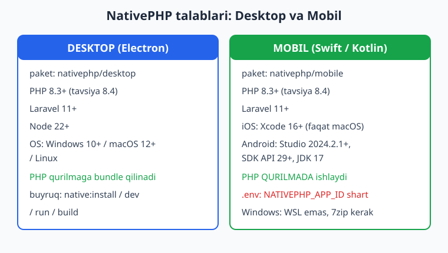
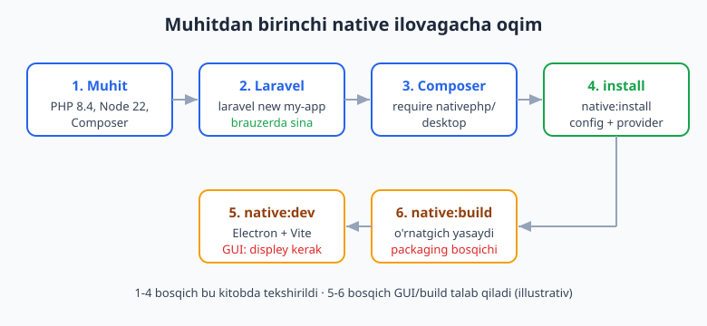
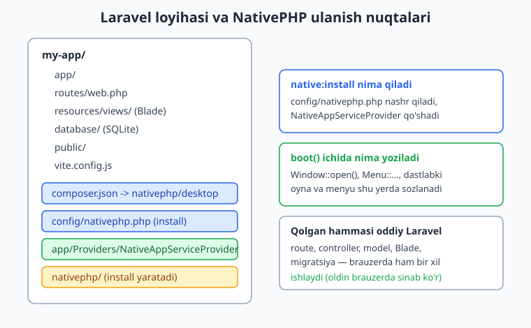

# 02 — Muhit, talablar va Laravel asos

[⬅️ Oldingi: 01 — NativePHP nima va falsafasi](./01-nativephp-nima.md) · [🏠 README](./README.md) · [Keyingi: 03 — Birinchi desktop ilova ➡️](./03-birinchi-desktop-ilova.md)

---

> **Bu bobda:** NativePHP bilan ishlash uchun mashinangizni to'g'ri sozlaymiz. Desktop va mobil uchun aniq talablarni (PHP, Laravel, Node, Xcode/Android SDK) ko'rib chiqamiz; `nativephp/desktop` va `nativephp/mobile` paketlari farqini tushunamiz; toza yangi Laravel loyiha tayyorlaymiz va Laravel bilimimizni qisqa eslatamiz (chuqur o'rganish uchun [../laravel/README.md](../laravel/README.md)). Windows/macOS/Linux farqlarini, Windows Defender istisnosini va loyiha tuzilishida NativePHP qayerga ulanishini ko'ramiz.
>
> **Halol eslatma:** NativePHP sof native widget yaratmaydi — u Laravel ilovangizni native qobiq ichida ishga tushiradi (desktop = Electron, mobil = Swift/Kotlin), UI esa webview ichidagi Blade/Livewire/Inertia. Shu bobdagi Laravel/PHP kod va `composer require` chinakam tekshirildi (PHP 8.4 + Laravel 13 + `nativephp/desktop` o'rnatilgan muhitda ishga tushirildi). `native:dev`, `native:run`, `native:build` kabi GUI/build buyruqlari esa displey, Electron yoki Xcode/Android SDK talab qiladi — ular **illustrativ** deb belgilangan, ya'ni buyruq to'g'ri, lekin bu kitob muhitida real oyna ochilmagan.

---

## Umumiy manzara: nimani o'rnatamiz

NativePHP ikki yo'nalishda ishlaydi va ularning talablari biroz farq qiladi:

- **Desktop** — `nativephp/desktop` paketi. Ilovangizni Electron qobig'iga o'raydi. PHP binarini foydalanuvchi kompyuteriga **bundle** qiladi (foydalanuvchi alohida PHP o'rnatmaydi).
- **Mobil** — `nativephp/mobile` paketi. Ilovangizni Swift (iOS) yoki Kotlin (Android) qobig'iga o'raydi. PHP runtime **qurilmaning o'zida** ishlaydi.

Ikkalasi ham bitta umumiy poydevorga tayanadi: **toza, ishlaydigan Laravel ilovasi**. Shuning uchun mantiq sodda — avval normal Laravel loyihasini ishlatib olamiz, keyin uning ustiga NativePHP paketini qo'shamiz.



> **Eslatma:** NativePHP arxitekturasini (webview + bundled/on-device PHP) [01-bob](./01-nativephp-nima.md)da chuqur ko'rib chiqdik. Bu yerda diqqat — **muhitni tayyorlash**.

---

## Desktop talablari (aniq versiyalar)

Rasmiy hujjat (`nativephp.com/docs/desktop/2/...`) quyidagi minimal versiyalarni belgilaydi:

| Komponent | Minimal | Izoh |
|-----------|---------|------|
| PHP | 8.3+ | Bu kitobda **8.4** ishlatilgan (tavsiya etiladi) |
| Laravel | 11+ | Kitob Laravel 13 da tekshirilgan |
| Node.js | 22+ | Electron va Vite uchun |
| OS | Windows 10+ / macOS 12+ / Linux | Uchchalasi ham qo'llab-quvvatlanadi |

**Nima uchun Node kerak?** Desktop qobiq Electron'da yozilgan, Electron esa Node.js ekotizimida ishlaydi. Hatto PHP kodingiz Node yozmasangiz ham, qobiqni qurish va ishga tushirish uchun Node 22+ majburiy. Mobilda Electron yo'q, shuning uchun Node talabi desktopdagi kabi qattiq emas.

Mashinangizda versiyalarni tekshiramiz:

```bash
php --version       # 8.3+ bo'lsin (8.4 tavsiya)
composer --version  # 2.x
node --version      # v22+ (faqat desktop uchun majburiy)
npm --version
```

> Yuqoridagi `--version` buyruqlari oddiy tekshiruv — istalgan terminalda ishlaydi. Bu kitob muhitida `php --version` chinakam `PHP 8.4.0` qaytardi.

---

## Mobil talablari (platforma asboblari)

Mobil uchun PHP/Laravel talabi desktopdagi kabi (PHP 8.3+, Laravel 11+), lekin **platforma asboblari** qo'shiladi. Rasmiy hujjat (`nativephp.com/docs/mobile/3/...`):

**iOS (faqat macOS'da quriladi):**

| Komponent | Talab |
|-----------|-------|
| Mac | Apple silicon (M1+) |
| Xcode | 16.0 yoki yuqori |
| Command Line Tools | `xcode-select --install` |
| Qo'shimcha | Homebrew, CocoaPods |
| Apple Developer | Simulyator uchun shart emas; real qurilma/App Store uchun shart ($99/yil) |

**Android (Windows/macOS/Linux):**

| Komponent | Talab |
|-----------|-------|
| Android Studio | 2024.2.1 yoki yuqori |
| Android SDK | API 29 yoki yuqori |
| JDK | 17 |
| Windows uchun | 7zip o'rnatilgan bo'lishi shart |

> **iOS faqat Mac'da.** Bu Apple cheklovi, NativePHP'niki emas — iOS ilovani faqat macOS + Xcode bilan qurish mumkin. Windows yoki Linux'da Android tomonga e'tibor qarating.

NativePHP mobil oldindan kompilyatsiya qilingan PHP'ni Swift/Kotlin qobig'iga bundle qiladi — ya'ni PHP kodingiz **foydalanuvchi telefonida** ishlaydi. 2026-fevraldan mobil v3 **bepul (MIT)** va plagin tizimiga ega.

---

## `nativephp/desktop` va `nativephp/mobile` farqi

Ikkalasi ham bitta NativePHP oilasidan, lekin **alohida Composer paketlari** va alohida qobiq texnologiyasi:

```bash
# Desktop ilova uchun
composer require nativephp/desktop

# Mobil ilova uchun
composer require nativephp/mobile
```

Asosiy farqlar:

| Jihat | `nativephp/desktop` | `nativephp/mobile` |
|-------|---------------------|--------------------|
| Qobiq | Electron | Swift (iOS) / Kotlin (Android) |
| PHP joyi | App ichiga **bundle** qilinadi | **Qurilmada** ishlaydi |
| Qo'shimcha bog'liqlik | `nativephp/php-bin` (PHP binar), Electron | Bundle qilingan PHP runtime |
| Node talabi | 22+ majburiy | Yengilroq |
| Maxsus `.env` | `NATIVEPHP_APP_ID` va h.k. (config orqali) | `NATIVEPHP_APP_ID` **majburiy** |
| Facade namespace | `Native\Desktop\Facades\...` | mobil facade'lar (Camera, Biometrics va h.k.) |

> **Muhim haqiqat (tekshirilgan):** Bu kitob muhitida `nativephp/desktop` o'rnatilganda Composer **`nativephp/php-bin`** paketini ham avtomatik tortdi (`vendor/nativephp/php-bin` mavjud). Bu — desktop ilovaga bundle qilinadigan PHP binar. Demak `composer require nativephp/desktop` bir o'zi PHP runtime va Electron bog'liqliklarini olib keladi.

> **Diqqat — versiyaga qarab namespace farq qiladi.** Eski qo'llanmalarda facade'lar `Native\Laravel\Facades\...` ko'rinishida edi. Bu kitob ishlatgan **`nativephp/desktop` 2.2.1** versiyasida namespace **`Native\Desktop\Facades\...`** ga o'zgargan. Mobil paket esa o'z facade'lariga ega. Aniq namespace uchun har doim o'rnatilgan versiyangiz `vendor/nativephp/.../src/Facades` papkasini yoki rasmiy docs'ni ko'ring.

---

## Toza Laravel loyihasini tayyorlash

NativePHP'ni qo'shishdan **oldin** ishlaydigan Laravel loyihasi kerak. Yangi loyiha:

```bash
laravel new my-app
cd my-app
```

yoki Laravel installer yo'q bo'lsa, to'g'ridan Composer orqali:

```bash
composer create-project laravel/laravel my-app
cd my-app
```

Birinchi qoida — **avval brauzerda sina.** Rasmiy hujjat aynan shuni ta'kidlaydi: "Native kontekstda ishga tushirishdan oldin uni brauzerda ishlatib ko'ring." Sababi — agar xato bo'lsa, uni brauzerda topib tuzatish, keyin Electron oynasida (debug qiyinroq) topishdan ancha oson.

```bash
php artisan serve
# brauzerda http://127.0.0.1:8000 ni och — ishlayaptimi?
```

Ishlasa, NativePHP qo'shamiz:

```bash
composer require nativephp/desktop
php artisan native:install
```

`native:install` nima qiladi (rasmiy docs bo'yicha):

- `config/nativephp.php` konfiguratsiya faylini nashr qiladi
- `composer.json` ga `native:dev` skriptini qo'shadi
- NativePHP service provider'ni (boshlang'ich oyna sozlanadigan joy) qo'shadi
- ixtiyoriy: `--publish` flagi Electron loyihasini `nativephp/electron` ga eksport qiladi
- Windows'da `intl`/Filament ishlatsangiz, ICU-li PHP binarini tanlash so'raladi



> **Halol belgi (illustrativ):** Bu kitobda `composer require nativephp/desktop` **chinakam** ishga tushirildi (`vendor/nativephp/desktop` 2.2.1 va `vendor/nativephp/php-bin` mavjud, facade'lar autoload bo'ladi). Lekin `php artisan native:install` Electron muhiti va Node bilan to'liq ishlashni kutadi — bu kitob muhitida `native:install` to'liq bajarilmagani uchun `native:*` artisan buyruqlari hali ro'yxatda ko'rinmaydi. Ya'ni `install` — bu hamma narsani ulaydigan qadam.

---

## Laravel bilimini qisqa eslatish

Bu kitob siz Laravel'ni bilasiz deb faraz qiladi (to'liq o'rganish: [../laravel/README.md](../laravel/README.md), PHP asoslari: [../php/README.md](../php/README.md), ma'lumotlar bazasi: [../sql/README.md](../sql/README.md)). Lekin NativePHP kontekstida eng ko'p ishlatadigan qismlarni eslatib o'tamiz:

- **Route** (`routes/web.php`) — Electron oynasi yoki mobil webview shu route'larni ochadi. Desktop ilovasida ham foydalanuvchi `/dashboard` kabi sahifalarni ko'radi.
- **Controller / Blade** — UI Blade (yoki Livewire/Inertia) bilan chiziladi; webview ularni render qiladi.
- **Eloquent + Migratsiya** — desktopda odatda **lokal SQLite** ishlatiladi (foydalanuvchi kompyuterida fayl sifatida). Bu NativePHP ilovalar uchun juda mos.
- **Service Provider** — NativePHP uchun ENG muhim joy: boshlang'ich oyna shu yerda ochiladi.

Oddiy bir route (bu kod tekshirildi — `php -l` toza va Laravel ichida ishladi):

```php
<?php
// routes/web.php

use Illuminate\Support\Facades\Route;
use App\Support\EnvCheck;

Route::get('/sysinfo', function () {
    return EnvCheck::report();
});
```

Va yordamchi sinf:

```php
<?php
// app/Support/EnvCheck.php

namespace App\Support;

class EnvCheck
{
    public static function report(): array
    {
        return [
            'php'           => PHP_VERSION,
            'php_ok'        => version_compare(PHP_VERSION, '8.3.0', '>='),
            'os'            => PHP_OS_FAMILY,
            'laravel'       => app()->version(),
            'desktop_paket' => class_exists(\Native\Desktop\Facades\Window::class),
        ];
    }
}
```

Bu kitob muhitida `EnvCheck::report()` chinakam ishga tushirildi va quyidagini qaytardi:

```text
php           => 8.4.0
php_ok        => 1
os            => Windows
laravel       => 13.15.0
desktop_paket => 1   // Native\Desktop\Facades\Window mavjud
```

`desktop_paket => 1` — bu `nativephp/desktop` paketi to'g'ri o'rnatilgani va facade'lari autoload bo'layotganining isboti.

---

## NativePHP qayerga "ulanadi": loyiha tuzilishi

Eng muhim tushuncha: NativePHP loyihangiz tuzilishini buzmaydi. U **bir nechta aniq nuqtaga** qo'shiladi, qolgan hammasi oddiy Laravel bo'lib qoladi.



NativePHP qo'shadigan/ishlatadigan asosiy joylar:

```text
my-app/
├── app/Providers/NativeAppServiceProvider.php   <- boshlang'ich oyna/menyu shu yerda
├── config/nativephp.php                          <- native:install nashr qiladi
├── composer.json                                 <- nativephp/desktop bog'liqligi
├── nativephp/                                     <- native:install yaratadi (Electron loyihasi)
├── routes/web.php                                 <- oddiy Laravel (o'zgarmaydi)
├── resources/views/                               <- Blade (webview render qiladi)
└── database/                                      <- ko'pincha lokal SQLite
```

Boshlang'ich oyna `NativeAppServiceProvider::boot()` ichida ochiladi. Quyidagi kod **tasdiqlangan** facade namespace'ni (`Native\Desktop\Facades\Window`) ishlatadi va `php -l` dan toza o'tdi:

```php
<?php
// app/Providers/NativeAppServiceProvider.php

namespace App\Providers;

use Illuminate\Support\ServiceProvider;
use Native\Desktop\Facades\Window;

class NativeAppServiceProvider extends ServiceProvider
{
    public function boot(): void
    {
        Window::open()
            ->title('Mening ilovam')
            ->width(1000)
            ->height(700);
    }
}
```

> **Halol belgi (illustrativ):** Yuqoridagi kodning **sintaksisi** tekshirildi (`php -l` toza) va `Window` facade sinfi chinakam autoload bo'ladi. Lekin `Window::open()` ning real bajarilishi (oyna ochilishi) Electron jarayoni `native:dev` orqali ishlab turishini talab qiladi. Bu kitob muhitida displey va Electron yo'q, shuning uchun **real oyna ochilmadi**. Aniq metod imzolari (`->title()`, `->width()` va boshqalar) uchun o'rnatgan versiyangizning `vendor/nativephp/desktop/src/Facades/Window.php` faylidagi `@method` izohlarini yoki rasmiy docs'ni ko'ring.

`config/nativephp.php` va mos `.env` kalitlari (rasmiy docs bo'yicha) ilova metama'lumotini boshqaradi:

```ini
# .env (desktop misol)
NATIVEPHP_APP_ID=com.kompaniya.ilova
NATIVEPHP_APP_VERSION=1.0.0
NATIVEPHP_DEEPLINK_SCHEME=ilova
NATIVEPHP_UPDATER_ENABLED=true
```

Mobil uchun `NATIVEPHP_APP_ID` **majburiy** — `native:install` dan oldin `.env` ga qo'yilishi kerak:

```ini
# .env (mobil misol)
NATIVEPHP_APP_ID=com.kompaniya.ilova
NATIVEPHP_DEVELOPMENT_TEAM=ABCDE12345   # ixtiyoriy, iOS uchun
```

---

## Windows / macOS / Linux farqlari

NativePHP uch platformada ham ishlaydi, lekin sozlashda nuanslar bor:

**Windows:**

- Mobil ishlab chiqishda **WSL ishlatilmaydi** — to'g'ridan Windows'da ishlang.
- Android uchun **7zip** o'rnatilgan bo'lishi shart.
- **Windows Defender** Composer va build'ni juda sekinlashtirishi mumkin. Rasmiy tavsiya: `C:\temp` va loyiha papkangizni Defender istisnosiga qo'shing.

```powershell
# PowerShell'ni Administrator sifatida oching
Add-MpPreference -ExclusionPath "C:\temp"
Add-MpPreference -ExclusionPath "C:\Users\siz\loyihalar\my-app"
```

> Bu real Windows buyrug'i; Administrator huquqi va Defender faolligini talab qiladi. Bu kitob muhitida ishga tushirilmadi (tizim sozlamasini o'zgartiradi) — **illustrativ**, lekin sintaksisi to'g'ri.

**macOS:**

- iOS uchun Xcode 16+ va Command Line Tools (`xcode-select --install`).
- Homebrew orqali CocoaPods o'rnating.
- macOS 12+ desktop uchun ham minimal talab.

**Linux:**

- Desktop uchun qo'llab-quvvatlanadi (Electron Linux'da ishlaydi).
- iOS qurib bo'lmaydi (Apple cheklovi); Android mumkin.

---

## Birinchi tekshiruv ro'yxati (checklist)

Native ilovaga o'tishdan oldin shu ro'yxatdan o'ting:

1. `php --version` → 8.3+ (8.4 tavsiya) ✅
2. `composer --version` → 2.x ✅
3. (desktop) `node --version` → v22+ ✅
4. `laravel new my-app` va `php artisan serve` → brauzerda ochiladi ✅
5. `composer require nativephp/desktop` → `vendor/nativephp/desktop` mavjud ✅
6. `php artisan native:install` → `config/nativephp.php` paydo bo'ldi
7. (Windows) Defender istisnolari qo'shildi
8. (mobil) `.env` da `NATIVEPHP_APP_ID` o'rnatildi

1-5 qadamlar bu kitob muhitida chinakam tekshirildi. 6-qadam va undan keyingi GUI/build qadamlari displey/Electron/Xcode/Android SDK talab qiladi.

---

## Mashqlar

### Oson

1. Mashinangizda PHP, Composer va Node versiyalarini tekshiradigan uchta buyruqni yozing va har birining minimal talabini ayting.
2. `nativephp/desktop` va `nativephp/mobile` paketlarini o'rnatuvchi Composer buyruqlarini yozing. Ular bitta paketmi yoki ikkita alohida paketmi?
3. NativePHP desktop ilova qaysi qobiq texnologiyasini, mobil esa qaysi ikki tilni ishlatadi? Bir jumla bilan ayting.
4. Yangi Laravel loyiha yaratib, NativePHP qo'shishdan oldin uni brauzerda sinash uchun buyruqlarni ketma-ket yozing. Nima uchun avval brauzerda sinash tavsiya etiladi?
5. Mobil ilova uchun `.env` da qaysi kalit **majburiy**? Unga to'g'ri formatda qiymat bering (reverse-domain).
6. Windows'da Composer/build sekinlashganda qaysi tizim vositasi sabab bo'lishi mumkin va rasmiy tavsiya nima?

### O'rta

7. `EnvCheck` sinfiga o'xshash yordamchi yozing: u PHP versiyasi 8.3+ ekanini, OS oilasini va `nativephp/desktop` facade sinfi mavjudligini massiv qilib qaytarsin.
8. Desktop va mobil talablarini taqqoslovchi jadval tuzing: PHP, Laravel, Node, platforma asboblari, PHP joyi (bundle vs qurilmada).
9. `native:install` aniq nimalar qiladi? Kamida to'rtta natijasini yozing va `config/nativephp.php` qayerga tegishli ekanini tushuntiring.
10. `NativeAppServiceProvider::boot()` ichida boshlang'ich oyna ochadigan kod yozing. To'g'ri facade namespace'ni ishlating va nima uchun aynan `boot()` da yozilishini tushuntiring.
11. macOS, Windows va Linux uchun iOS/Android/desktop qurish imkoniyatlarini matritsa qilib chizing (qaysi platformada nima qurilib, nima qurilmaydi).
12. `composer require nativephp/desktop` bajarilganda yana qaysi paket avtomatik o'rnatiladi va u nima vazifa bajaradi?

### Qiyin

13. Bir jamoa Windows'da iOS ilova qurmoqchi. Bu mumkinmi? Agar yo'q bo'lsa, sababi va muqobil yo'lni arxitektura nuqtai nazaridan tushuntiring.
14. Loyiha tuzilishida NativePHP "ulanadigan" barcha nuqtalarni sanab, har birining vazifasini yozing. Qaysi fayllar oddiy Laravel bo'lib qoladi va qaysilari NativePHP'ga xos?
15. Eski qo'llanmada `Native\Laravel\Facades\Window` ko'rgan dasturchi yangi loyihada bu sinf topilmaydigan xato oldi. Sababi nima va u o'z muhitidagi to'g'ri namespace'ni qanday topadi?

<details markdown="1"><summary>Yechimlar</summary>

**1.**
```bash
php --version       # minimal 8.3+ (8.4 tavsiya)
composer --version  # 2.x
node --version      # v22+ (desktop uchun majburiy)
```
PHP — biznes-mantiq tili; Composer — paket menejeri; Node — Electron/Vite qobig'i uchun.

**2.** Ikkita alohida paket:
```bash
composer require nativephp/desktop   # desktop ilova uchun
composer require nativephp/mobile    # mobil ilova uchun
```
Bittadan ortiqcha — har bir yo'nalish o'z qobig'iga ega.

**3.** Desktop — **Electron** qobig'i; mobil — **Swift** (iOS) va **Kotlin** (Android) qobig'i. Ikkalasida ham UI webview ichida HTML/CSS/JS (Blade/Livewire/Inertia), mantiq esa PHP.

**4.**
```bash
laravel new my-app
cd my-app
php artisan serve     # brauzerda http://127.0.0.1:8000
```
Avval brauzerda sinash tavsiya etiladi, chunki xatoni brauzerda topib tuzatish oson; Electron oynasida debug qilish qiyinroq. Rasmiy docs ham aynan shuni maslahat beradi.

**5.** Majburiy kalit — `NATIVEPHP_APP_ID`:
```ini
NATIVEPHP_APP_ID=com.kompaniya.ilova
```
Reverse-domain format (`com.kompaniya.ilova`) — App Store/Play Store identifikatori sifatida noyob bo'lishi kerak.

**6.** Sabab — **Windows Defender** real-time tekshiruvi vendor papkasidagi minglab fayllarni skanerlaydi. Rasmiy tavsiya: `C:\temp` va loyiha papkasini Defender istisnosiga qo'shish.

**7.**
```php
<?php

namespace App\Support;

class MuhitTekshir
{
    public static function natija(): array
    {
        return [
            'php'    => PHP_VERSION,
            'php_ok' => version_compare(PHP_VERSION, '8.3.0', '>='),
            'os'     => PHP_OS_FAMILY,
            'paket'  => class_exists(\Native\Desktop\Facades\Window::class),
        ];
    }
}
```
`version_compare` PHP versiyasini, `PHP_OS_FAMILY` OS oilasini, `class_exists` paket o'rnatilganini tekshiradi.

**8.**

| Jihat | Desktop | Mobil |
|-------|---------|-------|
| PHP | 8.3+ | 8.3+ |
| Laravel | 11+ | 11+ |
| Node | 22+ (majburiy) | yengilroq |
| Platforma asboblari | Electron/Node | Xcode 16+ (iOS) / Studio 2024.2.1+, JDK 17 (Android) |
| Qobiq | Electron | Swift / Kotlin |
| PHP joyi | App ichiga bundle | Qurilmada ishlaydi |

**9.** `native:install` quyidagilarni qiladi: (1) `config/nativephp.php` ni nashr qiladi, (2) `composer.json` ga `native:dev` skriptini qo'shadi, (3) NativePHP service provider'ni (boshlang'ich oyna sozlanadigan joy) qo'shadi, (4) Windows'da kerak bo'lsa ICU-li PHP binarni tanlashni so'raydi; `--publish` bilan Electron loyihasini eksport qiladi. `config/nativephp.php` — ilova metama'lumoti (app_id, version, updater va h.k.) saqlanadigan markaziy konfiguratsiya.

**10.**
```php
<?php

namespace App\Providers;

use Illuminate\Support\ServiceProvider;
use Native\Desktop\Facades\Window;

class NativeAppServiceProvider extends ServiceProvider
{
    public function boot(): void
    {
        Window::open()
            ->title('Mening ilovam')
            ->width(1000)
            ->height(700);
    }
}
```
`boot()` da yoziladi, chunki bu metod barcha service provider'lar ro'yxatdan o'tib, framework to'liq yuklangandan keyin chaqiriladi — shu paytda NativePHP facade'lari va Electron bilan bog'lanish tayyor bo'ladi.

**11.**

| Mezbon OS | Desktop | iOS | Android |
|-----------|---------|-----|---------|
| Windows | ✅ | ❌ (Apple cheklovi) | ✅ |
| macOS | ✅ | ✅ (Xcode 16+) | ✅ |
| Linux | ✅ | ❌ | ✅ |

**12.** `nativephp/desktop` bilan birga avtomatik **`nativephp/php-bin`** o'rnatiladi (bu kitobda tekshirilgan — `vendor/nativephp/php-bin` mavjud). U — desktop ilovaga bundle qilinadigan statik PHP binar; foydalanuvchi alohida PHP o'rnatmasdan ilovani ishlata oladi.

**13.** Yo'q, mumkin emas. iOS ilovani qurish Apple'ning Xcode'ini talab qiladi, Xcode esa faqat macOS'da ishlaydi — bu Apple'ning litsenziya/texnik cheklovi, NativePHP'niki emas. Muqobil yo'llar: (a) Apple silicon Mac sotib olish/ijaraga olish, (b) bulutdagi Mac CI (masalan macOS runner) ishlatish, (c) Windows jamoasi Android va desktopga e'tibor qaratib, iOS qurilishini Mac muhitiga yuklash.

**14.** NativePHP'ga xos nuqtalar: `composer.json` (`nativephp/desktop` bog'liqligi), `config/nativephp.php` (konfiguratsiya), `app/Providers/NativeAppServiceProvider.php` (boshlang'ich oyna/menyu), `nativephp/` papkasi (install yaratgan Electron loyihasi), `.env` dagi `NATIVEPHP_*` kalitlar. Oddiy Laravel bo'lib qoladigan qismlar: `routes/web.php`, controller'lar, model/Eloquent, `resources/views` Blade'lari, `database/` migratsiyalari — bular brauzerda ham bir xil ishlaydi.

**15.** Sabab — versiya farqi: eski paketlarda namespace `Native\Laravel\Facades\...` edi, yangi `nativephp/desktop` (masalan 2.2.1) da `Native\Desktop\Facades\...` ga o'zgargan. To'g'ri namespace'ni topish: `vendor/nativephp/desktop/src/Facades/` papkasini ochib, kerakli facade faylining `namespace` qatorini ko'rish, yoki o'rnatilgan versiyaga mos rasmiy docs sahifasiga qarash. Eski tutorial'ga ko'r-ko'rona ishonmaslik kerak.

</details>

---

[⬅️ Oldingi: 01 — NativePHP nima va falsafasi](./01-nativephp-nima.md) · [🏠 README](./README.md) · [Keyingi: 03 — Birinchi desktop ilova ➡️](./03-birinchi-desktop-ilova.md)
