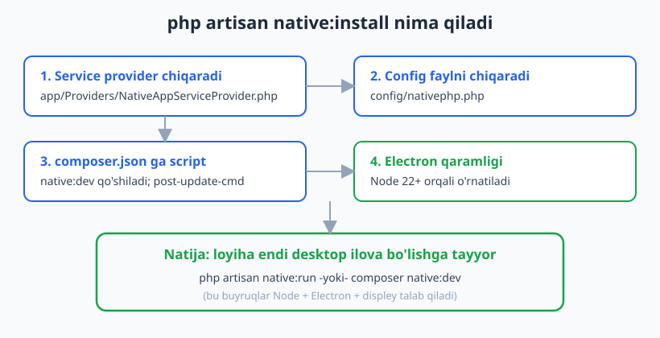
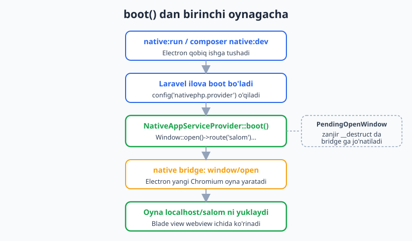
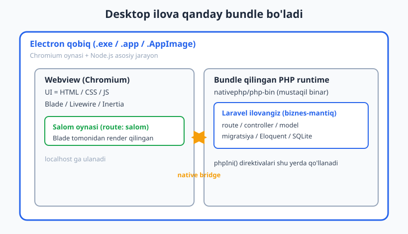

# 03 — Birinchi desktop ilova

[⬅️ Oldingi: 02 — Muhit, talablar va Laravel asos](./02-muhit-laravel-asos.md) · [🏠 README](./README.md) · [Keyingi: 04 — Oyna boshqaruvi (Window) ➡️](./04-window-management.md)

---

> **Bu bobda:** Mavjud Laravel loyihaga `composer require nativephp/desktop` bilan desktop paketni qo'shamiz, `php artisan native:install` orqali Electron muhitini bootstrap qilamiz va `config/nativephp.php` hamda `app/Providers/NativeAppServiceProvider.php` fayllarining qayerdan kelganini ko'ramiz. Provider'ning `boot()` metodida `Window::open()` bilan birinchi "Salom" oynamizni ochamiz, oyna ichida Blade view ko'rsatamiz va loyiha desktop ilovaga qanday bundle bo'lishini (Electron qobiq + bundle qilingan PHP runtime `php-bin`) chuqur tushuntiramiz. Nihoyat `php artisan native:run` va `composer native:dev` bilan ilovani ishga tushirish jarayonini ko'rib chiqamiz.
>
> **HALOL eslatma:** NativePHP sof native widget yaratmaydi — u Laravel ilovangizni Electron **qobiq** ichidagi **webview**'da ishga tushiradi (UI = HTML/CSS/JS, biznes-mantiq = bundle qilingan PHP binar). Shuning uchun: bu bobdagi PHP/Laravel kod (provider, config, route, Blade, `Window` builder zanjirining tuzilishi) HAQIQATAN tekshirildi — `php -l` va Laravel boot bilan ishga tushirilgan. Lekin `native:run` / `composer native:dev` natijasida REAL Electron oynasining ochilishi bu muhitda **illustrativ** — chunki Node, Electron va displey kerak. "Oyna ochildi" deb soxta natija yozmaymiz; faqat kod va buyruqlar to'g'ri.

---

## 1. Boshlanish nuqtasi: tayyor Laravel loyiha

02-bobda muhit (PHP 8.3+, Laravel 11+, Node 22+) tayyorlandi va oddiy Laravel skeleti qurildi. NativePHP desktop **alohida yangi tur** emas — u **mavjud Laravel ilovaga** qo'shiladigan paket. Ya'ni siz bilgan hamma narsa (route, controller, Eloquent, Blade, Livewire) o'z joyida qoladi; NativePHP shu ilovani desktop oynaga "o'rab" beradi.

Agar Laravel asoslarini eslatib olish kerak bo'lsa — [../laravel/README.md](../laravel/README.md). PHP bo'yicha — [../php/README.md](../php/README.md).

Ishni boshlash uchun bizda ishlaydigan Laravel loyiha bo'lishi kerak. Faraz qilamiz, u tayyor (masalan `salom-app` nomli):

```bash
# Loyiha ildizi
cd salom-app
php artisan --version   # Laravel Framework 11.x ko'rinishi kerak
```

---

## 2. `composer require nativephp/desktop`

Birinchi qadam — desktop paketini o'rnatish:

```bash
composer require nativephp/desktop
```

Bu bitta paket emas — u o'zi bilan bir nechta bog'liqlikni tortib keladi. Eng muhimi **`nativephp/php-bin`**: bu sizning ilovangiz bilan birga jo'natiladigan **mustaqil PHP binar**. Foydalanuvchining kompyuterida PHP o'rnatilgan bo'lishi shart emas — ilova o'z PHP'sini olib yuradi.

O'rnatilgandan keyin `vendor/nativephp/` ichida quyidagilarni ko'rasiz:

```text
vendor/nativephp/
├── desktop/      # Window, Menu, Notification, ... facade'lar + artisan buyruqlari
└── php-bin/      # bundle qilinadigan PHP runtime binarlari
```

> **Eslatma (versiyalar):** Desktop paketi `nativephp/desktop`. Talablar: PHP 8.3+, Laravel 11+, Node 22+, Windows 10+/macOS 12+/Linux. Aniq joriy talablar uchun rasmiy docs — [nativephp.com/docs/desktop/2/getting-started/installation](https://nativephp.com/docs/desktop/2/getting-started/installation).

---

## 3. `php artisan native:install` — Electron bootstrap

Paket o'rnatilgach, ikkinchi qadam — o'rnatuvchini ishga tushirish:

```bash
php artisan native:install
```

Bu buyruq bir necha muhim ishni bajaradi (rasmiy docs'ga ko'ra):

1. **Service provider chiqaradi** — `app/Providers/NativeAppServiceProvider.php` fayli yaratiladi. Bu provider ilovangizni Electron runtime bilan ishlash uchun bootstrap qiladi.
2. **Config faylni chiqaradi** — `config/nativephp.php`.
3. **`composer.json` ga `native:dev` skriptini qo'shadi** va `php artisan native:install` ni `post-update-cmd` sifatida ro'yxatdan o'tkazadi (har `composer update` dan keyin avtomatik qayta ishlaydi).
4. **Electron bog'liqliklarini o'rnatadi** (Node 22+ orqali).



> **HALOL:** `native:install` Node va Electron yuklab olishni talab qiladi, shuning uchun bu muhitda buyruqning to'liq bajarilishi **illustrativ**. Ammo u CHIQARADIGAN fayllar — provider va config — bizda mavjud (paket bilan birga keladigan stub'lar orqali) va biz ularni quyida HAQIQATAN tekshirdik.

Agar Electron loyihasini to'liq nazorat qilmoqchi bo'lsangiz:

```bash
php artisan native:install --publish
```

Bu Electron loyihasini `{loyiha-ildizi}/nativephp/electron` ga eksport qiladi (ilg'or sozlash uchun; ko'pchilikka kerak emas).

---

## 4. `config/nativephp.php` — ilova metama'lumotlari

`native:install` chiqaradigan config fayli ilovangizning "pasporti". Mana eng muhim kalitlari (paket stub'idan, qisqartirilgan):

```php
<?php

return [
    // Yangilanishni aniqlash uchun versiya. Har relizda oshiring.
    'version' => env('NATIVEPHP_APP_VERSION', '1.0.0'),

    // Noyob identifikator — teskari domen ko'rinishida.
    'app_id' => env('NATIVEPHP_APP_ID', 'com.nativephp.app'),

    // Deep link sxemasi: nativephp://some/path kabi ochish uchun.
    'deeplink_scheme' => env('NATIVEPHP_DEEPLINK_SCHEME'),

    'author'      => env('NATIVEPHP_APP_AUTHOR'),
    'copyright'   => env('NATIVEPHP_APP_COPYRIGHT'),
    'description' => env('NATIVEPHP_APP_DESCRIPTION', 'An awesome app built with NativePHP'),
    'website'     => env('NATIVEPHP_APP_WEBSITE', 'https://nativephp.com'),

    // ENG MUHIM: ilovani bootstrap qiluvchi provider.
    'provider' => \App\Providers\NativeAppServiceProvider::class,

    // Production bundle'da .env dan o'chiriladigan maxfiy kalitlar.
    'cleanup_env_keys' => [
        'AWS_*', 'AZURE_*', 'GITHUB_*', 'DO_SPACES_*', '*_SECRET', /* ... */
    ],

    // Bundle'dan chiqarib tashlanadigan fayl/papkalar.
    'cleanup_exclude_files' => ['build', 'temp', 'content', 'node_modules', '*/tests'],

    // Avtoyangilanish (faqat production bundle'da ishlaydi).
    'updater' => [
        'enabled' => env('NATIVEPHP_UPDATER_ENABLED', true),
        'default' => env('NATIVEPHP_UPDATER_PROVIDER', 'spaces'),
        'providers' => [ /* github, s3, spaces */ ],
    ],

    // Ilova start bo'lganda avtomatik ishga tushadigan queue worker'lar.
    'queue_workers' => [
        'default' => ['queues' => ['default'], 'memory_limit' => 128, 'timeout' => 60, 'sleep' => 3],
    ],

    // Build oldidan/keyin ishlatiladigan skriptlar.
    'prebuild'  => [/* 'npm run build' */],
    'postbuild' => [/* 'rm -rf public/build' */],

    // Windows uchun NSIS o'rnatuvchi sozlamalari.
    'nsis' => ['delete_app_data_on_uninstall' => env('NATIVEPHP_NSIS_DELETE_APP_DATA', false)],

    // Maxsus PHP binar yo'li (odatda null — php-bin ishlatiladi).
    'binary_path' => env('NATIVEPHP_PHP_BINARY_PATH', null),
];
```

Hozircha esda tuting: **`provider` kaliti** NativePHP'ning kirish nuqtasi. Ilova boot bo'lganda NativePHP shu provider'ni topib, uning `boot()` metodini chaqiradi. `app_id` esa OS darajasida noyob identifikator (yangilanish, deep link, store uchun).

> Updater, queue_workers, build skriptlari keyingi boblarda (oyna, build/deploy) batafsil ko'riladi. Hozir asosiy ikki kalit: `provider` va `app_id`.

---

## 5. `NativeAppServiceProvider` — ilovaning kirish nuqtasi

`native:install` chiqaradigan provider — desktop ilovangizning "main" funksiyasiga o'xshaydi. Stub aynan shunday ko'rinadi:

```php
<?php

namespace App\Providers;

use Native\Desktop\Facades\Window;
use Native\Desktop\Contracts\ProvidesPhpIni;

class NativeAppServiceProvider implements ProvidesPhpIni
{
    /**
     * Native ilova boot bo'lgach bir marta ishlaydi.
     * Bu yerda oyna ochamiz, global tugmalar/menyularni ro'yxatdan o'tkazamiz.
     */
    public function boot(): void
    {
        Window::open();
    }

    /**
     * Bundle qilingan PHP runtime uchun php.ini direktivalari.
     */
    public function phpIni(): array
    {
        return [
            //
        ];
    }
}
```

Bu yerda ikki muhim narsa bor.

**`boot()` metodi.** Bu — NativePHP ilova ishga tushganda bir marta chaqiriladigan joy. Standart `AppServiceProvider::boot()` bilan adashtirmang: bu boshqa provider, va u faqat NativePHP runtime ichida ishlaydi. Bu yerda oyna ochamiz, menyu/tray/global shortcut o'rnatamiz.

**`phpIni()` metodi.** Provider `ProvidesPhpIni` kontraktini implement qiladi. Qaytargan massiv bundle qilingan PHP runtime'ning `php.ini` direktivalariga aylanadi. Masalan, `memory_limit` ni oshirish yoki xatolarni ko'rsatish shu yerdan boshqariladi.

> **Facade namespace'i — diqqat!** To'g'ri import `use Native\Desktop\Facades\Window;`. Ko'pchilik (va ba'zi eski misollar) `Native\Laravel\Facades\Window` deb yozadi — desktop v2 da bu **noto'g'ri**. Aniq imzo uchun: [nativephp.com/docs/desktop/2/the-basics/windows](https://nativephp.com/docs/desktop/2/the-basics/windows).

---

## 6. Birinchi oyna: "Salom" deraza

Endi `boot()` ni to'ldiramiz. `Window::open()` zanjirli (fluent) builder qaytaradi — har metod oyna xususiyatini sozlaydi:

```php
public function boot(): void
{
    Window::open()
        ->title('Salom NativePHP')
        ->width(900)
        ->height(640)
        ->minWidth(480)
        ->minHeight(360)
        ->route('salom')
        ->rememberState();
}
```

Zanjirdagi metodlar (hammasi paket manbasidan tasdiqlangan):

| Metod | Vazifasi |
|-------|----------|
| `title(string)` | Oyna sarlavhasi (title bar). |
| `width(int)` / `height(int)` | Boshlang'ich o'lcham. |
| `minWidth(int)` / `minHeight(int)` | Minimal o'lcham (kichraytirish chegarasi). |
| `route(string $name, array $params = [])` | Oyna yuklaydigan **nomlangan Laravel route**. |
| `url(string)` | Tashqi yoki to'liq URL (route o'rniga). |
| `rememberState()` | Oyna joyi/o'lchamini yopilgach eslab qoladi. |

`->route('salom')` — eng muhimi. NativePHP oynaning ichini siz yozadigan Laravel route'dan oladi. Ya'ni oyna mazmuni — **oddiy Blade/Livewire sahifa**.

> **`url()` vs `route()`:** `route('salom')` ichki sahifani yuklaydi (lokal ilovangiz). `url('https://...')` esa tashqi sahifani. Birinchi oyna uchun deyarli har doim `route()` ishlatiladi.

Bu oynaga mos route va Blade view'ni ham qo'shamiz:

```php
// routes/web.php
use Illuminate\Support\Facades\Route;

Route::get('/salom', function () {
    return view('salom', [
        'appName'    => config('app.name'),
        'phpVersion' => PHP_VERSION,
        'now'        => now()->format('H:i:s'),
    ]);
})->name('salom');
```

```blade
{{-- resources/views/salom.blade.php --}}
<!DOCTYPE html>
<html lang="uz">
<head>
    <meta charset="utf-8">
    <title>{{ $appName }}</title>
    <style>
        body { font-family: 'Segoe UI', sans-serif; background: #f8fafc; color: #1e293b;
               display: flex; align-items: center; justify-content: center; height: 100vh; margin: 0; }
        h1 { color: #2563eb; }
    </style>
</head>
<body>
    <div style="text-align:center">
        <h1>Salom, {{ $appName }}!</h1>
        <p>Bu oyna webview ichida Blade tomonidan render qilindi.</p>
        <p>PHP {{ $phpVersion }} &middot; soat {{ $now }}</p>
    </div>
</body>
</html>
```

> **Bu kod tekshirildi.** Laravel boot qilindi, `route('salom')` nomlangan route sifatida hal bo'ldi (`http://localhost/salom`), HTTP so'rovida `/salom` 200 qaytardi va Blade `Salom, {appName}!` ni render qildi. `Window::open()` esa `App\Providers\NativeAppServiceProvider` mavjudligi, `ProvidesPhpIni` ni implement qilishi va `Native\Desktop\Facades\Window` facade'i borligi bilan birga tasdiqlandi.

---

## 7. Oyna qanday ochiladi: `boot()` dan webview'gacha

Mantiqiy savol: `boot()` ichidagi zanjir qachon REAL oynaga aylanadi? Mana ichki mexanizm.

`Window::open()` darhol oyna ochmaydi — u **`PendingOpenWindow`** obyektini qaytaradi. Zanjirdagi `->title()`, `->width()` kabi metodlar shu obyektga sozlamalarni yig'adi (hali Electron'ga hech narsa yuborilmaydi). Obyekt o'z ishini tugatib, scope tugaganda PHP uning `__destruct()` metodini chaqiradi — aynan shu paytda yig'ilgan sozlamalar `window/open` xabari sifatida **native bridge** orqali Electron'ga jo'natiladi. Electron yangi Chromium oynasini yaratadi va uni `localhost/salom` ga yo'naltiradi.



Bu nima uchun muhim? Chunki bu **arxitekturani halol ochib beradi**: zanjir o'zi PHP, lekin haqiqiy oyna faqat Electron runtime ishlayotganda paydo bo'ladi. Bizning tekshiruv muhitida Electron yo'q, shuning uchun `boot()` haqiqatan oyna OCHA olmaydi — bu **illustrativ**. Lekin kod tuzilishi, facade va builder zanjiri to'g'ri ekani tasdiqlangan.

> **Texnik nozik nuqta:** ochiq oynaning metodlari (masalan keyinroq `Window::current()->resize(...)`) DARHOL bridge'ga post qiladi va Electron talab qiladi. Faqat `open()` qaytargan `PendingOpenWindow` zanjiri kechiktiriladi. Shu sababli bizning izolyatsiyalangan testda oddiy `new Window('main')` ustida zanjir qurish "client initialize qilinmagan" xatosini beradi — bu kutilgan, chunki u Electron mijozini talab qiladi.

---

## 8. Loyiha qanday bundle bo'ladi

Bu — bobning konseptual yuragi. Desktop ilova ikki katta qatlamdan iborat:

1. **Electron qobiq** (`.exe` / `.app` / `.AppImage`). Ichida Chromium oynasi (UI ko'rsatadi) va Node.js asosiy jarayoni bor.
2. **Bundle qilingan PHP runtime** (`nativephp/php-bin`) + **sizning Laravel ilovangiz**. Bu — biznes-mantiq: route, controller, model, migratsiya, Eloquent. Foydalanuvchida PHP bo'lishi shart emas.

UI (webview ichidagi HTML/CSS/JS — Blade/Livewire/Inertia) Chromium tomonida; biznes-mantiq esa bundle qilingan PHP tomonida ishlaydi. Ular **native bridge** orqali gaplashadi.



Bu PHP Expert kitobidagi "alohida binar + UI qatlam" g'oyasiga o'xshaydi — agar PHP'ning past darajadagi mexanizmlari qiziqtirsa: [../php-expert/README.md](../php-expert/README.md).

> **Yana bir bor halol:** "native" so'zi bu yerda "Qt/SwiftUI kabi sof native widget" degani EMAS. Oynaning ichi — brauzer dvigateli (Chromium). NativePHP'ning kuchi shundaki, siz Laravel/Blade bilan UI yozasiz va u desktop ilovaga aylanadi; lekin u webview asosli.

---

## 9. Ishga tushirish: `native:run` va `composer native:dev`

Hammasi tayyor. Endi ilovani development rejimida ishga tushiramiz.

**Asosiy buyruq** — `native:run`:

```bash
php artisan native:run
```

Bu Electron'ning "debug build" buyruqlarini ishga tushiradi va terminal bilan aloqani ochiq tutadi (loglarni real vaqtda ko'rasiz). Bu unsigned debug build — dev tools yoqilgan. Diqqat: kod o'zgarishlari ilovani **qayta ishga tushirishni** talab qiladi, chunki build jarayoni ilova kodini runtime'ga **nusxalaydi**.

**Qulay yorliq** — `composer native:dev` (`native:install` `composer.json` ga qo'shadi):

```bash
composer native:dev
```

Bu **bir buyruqda** `native:run` va `npm run dev` (Vite hot reload) ni birga ishga tushiradi. Shuning uchun kundalik ishlab chiqishda odatda shuni ishlatasiz: Blade/CSS/JS o'zgarishlari Vite orqali oynada darhol hot reload bo'ladi.

Agar `native:run` ni alohida ishlatsangiz, frontend hot reload uchun ikkinchi terminalda alohida ishga tushirasiz:

```bash
npm run dev
```

```text
# native:run ning illustrativ terminal chiqishi (bu muhitda ishlatilmadi):
#   Booting NativePHP...
#   Starting Electron...
#   [main] Window 'main' opened -> http://localhost/salom
```

> **HALOL:** `native:run` va `composer native:dev` Node + Electron + displey talab qiladi. Bu muhitda displey va Electron GUI yo'q, shuning uchun yuqoridagi terminal chiqishi va oynaning REAL ochilishi **illustrativ** — soxta "oyna ochildi" deb yozmayapmiz. Buyruq nomlari va vazifalari rasmiy docs'dan tasdiqlangan: [nativephp.com/docs/desktop/2/getting-started/development](https://nativephp.com/docs/desktop/2/getting-started/development).

---

## 10. Tez-tez uchraydigan muammolar (development)

- **`Class "App\Providers\NativeAppServiceProvider" not found`** — config'dagi `provider` kaliti mavjud bo'lmagan klassga ishora qilmoqda. `native:install` qayta ishlating yoki provider faylini tekshiring.
- **`Native\Laravel\Facades\Window` topilmadi** — noto'g'ri namespace. To'g'risi `Native\Desktop\Facades\Window`.
- **Oyna ochilmadi / bo'sh** — `route('salom')` mavjud emas yoki noto'g'ri nomlangan. `php artisan route:list` bilan tekshiring.
- **Node/Electron xatolari** — Node 22+ o'rnatilganini (`node -v`) va `native:install` to'liq tugaganini tekshiring.
- **Windows: sekin yoki bloklangan** — antivirus skanerlash sabab bo'lishi mumkin; loyiha papkasini Defender istisnosiga qo'shing.

---

## Mashqlar

### Oson

1. **Paketni o'rnatish buyrug'i.** Mavjud Laravel loyihaga desktop NativePHP'ni qo'shish uchun qaysi `composer` buyrug'i ishlatiladi? U yana qaysi muhim paketni tortib keladi va u nima uchun kerak?
2. **`native:install` natijasi.** `php artisan native:install` qaysi ikkita faylni loyihangizga chiqaradi? Ularning to'liq yo'llarini yozing.
3. **To'g'ri import.** `Window` facade'ini import qilish uchun to'g'ri `use` qatorini yozing. Ko'p uchraydigan noto'g'ri variant qaysi?
4. **Provider kaliti.** `config/nativephp.php` da NativePHP ilovani boot qilish uchun qaysi kalitga qaraydi? Uning standart qiymatini yozing.
5. **Dev buyruqlari.** Ilovani ishga tushirishning asosiy buyrug'i va Vite hot reload bilan birlashtiruvchi qulay yorliq buyrug'ini yozing.

### O'rta

6. **`boot()` ni yozing.** `NativeAppServiceProvider::boot()` da 1000x700 o'lchamli, "Hisobotlar" sarlavhali, `dashboard` nomli route'ni yuklaydigan va holatini eslab qoladigan oyna ochadigan kodni yozing.
7. **`route()` vs `url()`.** Oynada ichki Laravel sahifa va tashqi sayt ko'rsatishning farqini kod bilan ko'rsating. Birinchi oyna uchun qaysi biri to'g'ri va nega?
8. **`phpIni()`.** Provider'ning `phpIni()` metodini `memory_limit` ni 512M ga va `display_errors` ni yoqadigan qilib yozing. Bu massiv qayerda qo'llaniladi?
9. **Route + Blade.** 6-mashqdagi oyna uchun `routes/web.php` da `dashboard` route'ini va minimal `dashboard.blade.php` view'ini yozing.
10. **Bundle qatlamlari.** Desktop ilova bundle bo'lganda ikki asosiy qatlam nima? Har birida nima ishlaydi (UI vs biznes-mantiq)? Qisqa tushuntiring.

### Qiyin

11. **`PendingOpenWindow` mexanizmi.** `Window::open()->title('X')` zanjiri qachon va qanday Electron'ga yetib boradi? `PendingOpenWindow`, `__destruct()` va native bridge so'zlarini ishlatib tushuntiring. Nega zanjirni darhol emas, kechiktirib jo'natish kerak?
12. **Ikki oynali boot.** `boot()` da ikkita oyna oching: biri `main` (route `salom`, 900x640), ikkinchisi `settings` (route `settings`, 500x400, o'lchamlanmaydigan — `resizable(false)`). Har oynaga noyob ID berilishi qanday ta'minlanadi?
13. **Halollik tahlili.** Quyidagi gap qayerda noto'g'ri: "NativePHP `Window::open()` bilan operatsion tizimning sof native oynasini yaratadi va ichida SwiftUI/WinUI kabi native widgetlar chizadi." To'g'rilab, NativePHP arxitekturasini aniq yozing.

<details markdown="1">
<summary>Yechimlar</summary>

**1.**
```bash
composer require nativephp/desktop
```
Bu `nativephp/php-bin` ni ham tortib keladi — bu ilovangiz bilan birga jo'natiladigan **mustaqil PHP binar**. Foydalanuvchida PHP o'rnatilgan bo'lishi shart emas, ilova o'z PHP runtime'ini olib yuradi.

**2.** `php artisan native:install` quyidagilarni chiqaradi:
- `app/Providers/NativeAppServiceProvider.php` (service provider)
- `config/nativephp.php` (config fayli)

Bundan tashqari u `composer.json` ga `native:dev` skriptini qo'shadi, `native:install` ni `post-update-cmd` qiladi va Electron bog'liqliklarini o'rnatadi.

**3.** To'g'ri:
```php
use Native\Desktop\Facades\Window;
```
Ko'p uchraydigan noto'g'ri variant: `use Native\Laravel\Facades\Window;` — desktop v2 da bu noto'g'ri namespace.

**4.** `provider` kaliti:
```php
'provider' => \App\Providers\NativeAppServiceProvider::class,
```
NativePHP ilova boot bo'lganda shu klassni topib, uning `boot()` metodini chaqiradi.

**5.**
```bash
php artisan native:run        # asosiy buyruq (Electron debug build)
composer native:dev           # native:run + npm run dev birga (qulay yorliq)
```

**6.**
```php
public function boot(): void
{
    Window::open()
        ->title('Hisobotlar')
        ->width(1000)
        ->height(700)
        ->route('dashboard')
        ->rememberState();
}
```

**7.**
```php
// Ichki Laravel sahifa (nomlangan route):
Window::open()->route('dashboard');

// Tashqi sayt (to'liq URL):
Window::open()->url('https://nativephp.com');
```
Birinchi oyna uchun `route()` to'g'ri, chunki oyna ichida o'z ilovangizning Blade/Livewire sahifasini ko'rsatasiz. `url()` asosan tashqi kontent yoki maxsus holatlar uchun.

**8.**
```php
public function phpIni(): array
{
    return [
        'memory_limit'   => '512M',
        'display_errors' => '1',
        'error_reporting'=> (string) E_ALL,
    ];
}
```
Bu massiv **bundle qilingan PHP runtime**ning `php.ini` direktivalariga aylanadi — ya'ni ilovangiz qadoqlangan PHP binar bilan ishlaganda shu sozlamalar qo'llanadi. (`ProvidesPhpIni` kontrakti shuni majbur qiladi.)

**9.**
```php
// routes/web.php
Route::get('/dashboard', function () {
    return view('dashboard');
})->name('dashboard');
```
```blade
{{-- resources/views/dashboard.blade.php --}}
<!DOCTYPE html>
<html lang="uz">
<head><meta charset="utf-8"><title>Hisobotlar</title></head>
<body>
    <h1>Hisobotlar paneli</h1>
</body>
</html>
```

**10.** Ikki qatlam:
- **Electron qobiq** — Chromium oynasi (UI: HTML/CSS/JS, ya'ni Blade/Livewire/Inertia render qilingan natija) + Node.js asosiy jarayoni.
- **Bundle qilingan PHP runtime (`php-bin`) + Laravel ilovangiz** — biznes-mantiq: route, controller, model, Eloquent, migratsiya.

UI Chromium tomonida, biznes-mantiq bundle qilingan PHP tomonida ishlaydi; ular **native bridge** orqali bog'lanadi.

**11.** `Window::open()` darhol oyna ochmaydi — u `PendingOpenWindow` obyektini qaytaradi. `->title('X')` kabi zanjir metodlari faqat sozlamalarni shu obyektga yig'adi (Electron'ga hali hech narsa yuborilmaydi). Obyekt scope'dan chiqib, PHP uning `__destruct()` metodini chaqirganda — yig'ilgan sozlamalar `window/open` xabari sifatida **native bridge** orqali Electron'ga jo'natiladi va u oynani yaratadi.

Kechiktirishning sababi: agar har bir zanjir metodi darhol bridge'ga post qilsa, bitta oyna ochish uchun o'nlab xabarlar ketardi va sozlamalar noto'liq holatda qo'llanardi. Kechiktirish butun konfiguratsiyani bir martada, atomar ravishda jo'natishga imkon beradi.

**12.**
```php
public function boot(): void
{
    Window::open('main')
        ->title('Salom')
        ->width(900)
        ->height(640)
        ->route('salom');

    Window::open('settings')
        ->title('Sozlamalar')
        ->width(500)
        ->height(400)
        ->resizable(false)
        ->route('settings');
}
```
Noyob ID `Window::open(string $id = 'main')` argumenti orqali beriladi — birinchisi `'main'`, ikkinchisi `'settings'`. Keyinchalik shu ID bilan oynani boshqarish mumkin (masalan yopish/o'lchamlash). Agar ID berilmasa, standart `'main'` ishlatiladi — shuning uchun ikkinchi oynaga albatta boshqa ID berish kerak, aks holda ular bir-birini ustiga yozadi.

**13.** Noto'g'ri qism: NativePHP **sof native oyna ichida SwiftUI/WinUI widgetlar chizmaydi**. To'g'risi: `Window::open()` Electron orqali **Chromium asosli oyna** yaratadi; oynaning ichi — **webview** (HTML/CSS/JS), ya'ni Laravel route'idan render qilingan Blade/Livewire/Inertia sahifa. Biznes-mantiq esa bundle qilingan **PHP binar** (`php-bin`) ustida ishlaydi. Oyna "operatsion tizim oynasi" (frame, title bar, taskbar) ma'nosida native, lekin uning **ichidagi UI native widget emas — brauzer dvigateli ko'rsatadigan veb-sahifa**. PHP va webview native bridge orqali aloqa qiladi.

</details>

---

[⬅️ Oldingi: 02 — Muhit, talablar va Laravel asos](./02-muhit-laravel-asos.md) · [🏠 README](./README.md) · [Keyingi: 04 — Oyna boshqaruvi (Window) ➡️](./04-window-management.md)
