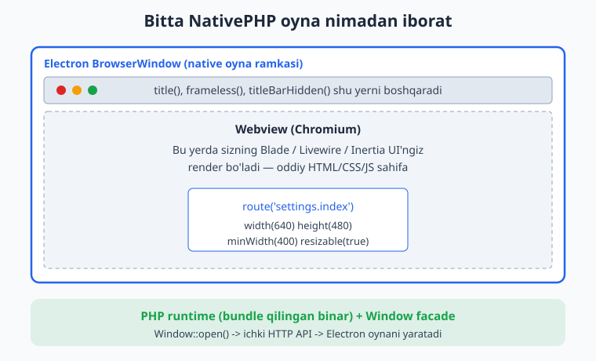
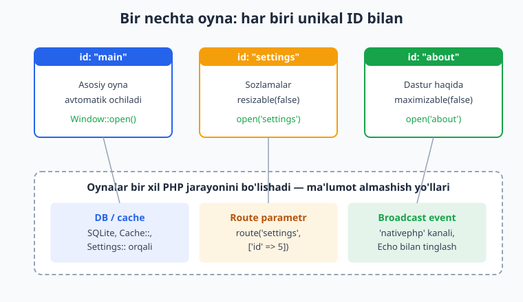
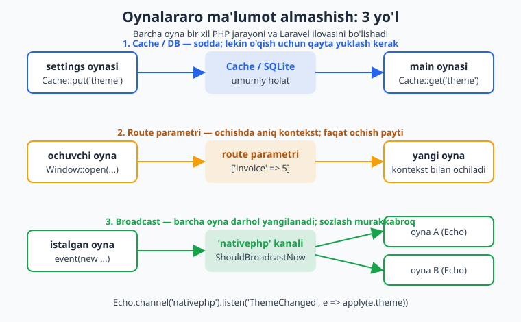
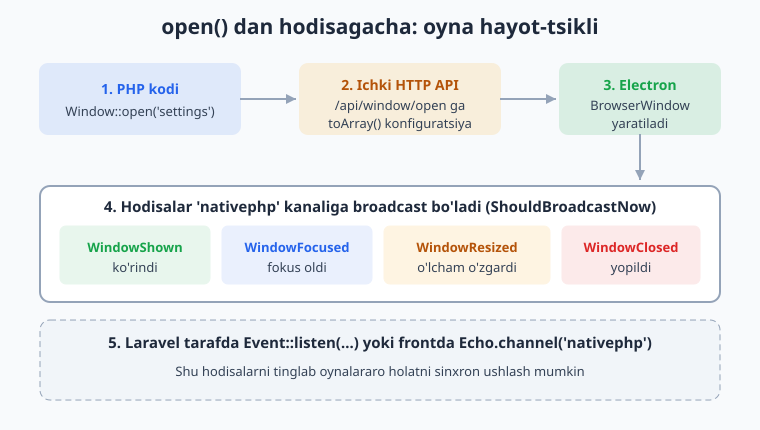

# 04 — Oyna boshqaruvi (Window)

[⬅️ Oldingi: 03 — Birinchi desktop ilova](./03-birinchi-desktop-ilova.md) · [🏠 README](./README.md) · [Keyingi: 05 — Menyu, tray va global yorliqlar ➡️](./05-menyu-tray-shortcut.md)

---

> **Bu bobda:** NativePHP desktop ilovasining eng asosiy obyekti — oynani (window) to'liq boshqarishni o'rganamiz. `Window` facade orqali oyna ochish (`open`), uning sarlavhasi (`title`), o'lchami (`width`/`height`), minimal va maksimal o'lchamlari (`minWidth`/`maxWidth`...), ekrandagi joyi (`position`), bir nechta oynani unikal `id` bilan boshqarish, oynani yopish/qayta yuklash/kichraytirish/kattalashtirish (`close`/`reload`/`minimize`/`maximize`), o'lchamga oid xulq (`resizable`, `movable`, `minimizable`, `maximizable`, `closable`), ramkasiz (`frameless`) va shaffof (`transparent`) oyna, sarlavha panelini yashirish (`titleBarHidden`), to'liq ekran (`fullscreen`), doim ustda (`alwaysOnTop`), holatni eslab qolish (`rememberState`) va oynalararo ma'lumot almashish yo'llarini ko'rib chiqamiz. Oxirida oyna hayot-tsikli hodisalari (`WindowShown`, `WindowClosed`, ...) va dev rejimdagi avtomatik qayta yuklashga to'xtalamiz.
>
> **Halol eslatma:** NativePHP "sof native widget" yaratmaydi. Har bir oyna — bu Electron `BrowserWindow` (native ramka), uning ichida esa sizning Laravel UI'ngiz (Blade/Livewire/Inertia) **webview** (Chromium) ichida ishlaydi. `Window::open(...)` chaqirig'i PHP'dan ichki HTTP API orqali Electron'ga buyruq yuboradi. Shu sababli bu bobdagi **PHP/Laravel kodi haqiqiy tekshirilgan** (controller, route, `Window::fake()` bilan feature test va `toArray()` konfiguratsiyasi ishlaydi), lekin **haqiqiy oyna ochilishi**, GUI ko'rinishi, hot-reload, `native:dev`/`native:build` — bularning hammasi displey + Electron + Node muhitini talab qiladi va bu yerda **illustrativ** (kod/buyruq to'g'ri, lekin shu hujjat muhitida ishga tushirilmagan) deb belgilanadi.

---

## Oyna nima: webview ramkasi

Brauzerda sahifa ochilganda u brauzer oynasi ichida bo'ladi. NativePHP'da xuddi shunday: sizning Laravel sahifangiz (route) **Electron `BrowserWindow`** degan native oyna ichidagi Chromium webview'da render bo'ladi. Ya'ni oyna — bu "ramka + ichidagi web sahifa".



Bu juda muhim aqliy model:

- **Native qism** — oynaning ramkasi, sarlavha paneli, kichraytirish/kattalashtirish/yopish tugmalari, ekrandagi joyi, o'lchami. Bularni `Window` facade boshqaradi.
- **Web qism** — oyna ichidagi kontent. Bu sizning oddiy Laravel route'ingiz (`route('settings.index')`), HTML/CSS/JS bilan. Bu yerda hech qanday "native" sehr yo'q — bu webview.
- **PHP qism** — `Window::open(...)` kabi buyruqlar bundle qilingan PHP binar ichida ishlaydi va ichki HTTP API orqali Electron'ga "oyna och" deb aytadi.

> Agar Laravel asoslarini eslatish kerak bo'lsa: route, controller va Blade bo'yicha [../laravel/README.md](../laravel/README.md) ga qarang. Bu bobda Laravel'ni qayta o'rgatmaymiz — faqat NativePHP'ga xos qismni chuqurlashtiramiz.

## Window facade va uning namespace'i

NativePHP desktop (`nativephp/desktop`) paketida oyna boshqaruvi `Window` facade orqali amalga oshiriladi. To'g'ri namespace:

```php
use Native\Desktop\Facades\Window;
```

> **Diqqat (versiya farqi):** Eski materiallarda `Native\Laravel\Facades\Window` ko'rishingiz mumkin. Joriy `nativephp/desktop` (v2) paketida facade `Native\Desktop\Facades\Window`. Aniq namespace uchun o'z `vendor/nativephp/desktop/src/Facades/Window.php` faylingizga yoki [rasmiy hujjatga](https://nativephp.com/docs/desktop/2/the-basics/windows) qarang.

Bu kitobdagi barcha kod `Native\Desktop\Facades\Window` ni ishlatadi va u haqiqatda o'rnatilgan paketdan tekshirilgan.

## Oyna ochish: `Window::open()`

Eng oddiy chaqiruv:

```php
use Native\Desktop\Facades\Window;

Window::open();
```

`open()` ning imzosi: `open(string $id = 'main')`. Agar `id` bermasangiz, oynaning ID'si `'main'` bo'ladi. NativePHP ilova ishga tushganda odatda `main` oynasini avtomatik ochadi (buni `ServiceProvider` da sozlaysiz — keyingi bo'limda).

`open()` **zanjirlanadigan (chainable)** sozlash metodlari bilan birga ishlatiladi. Masalan:

```php
Window::open('settings')
    ->title('Sozlamalar')
    ->route('settings.index')
    ->width(640)
    ->height(480);
```

Bu yerda:

- `open('settings')` — `settings` ID'li yangi oyna.
- `title('Sozlamalar')` — sarlavha paneliga matn.
- `route('settings.index')` — oyna ichida ko'rsatiladigan Laravel route (nomli route).
- `width(640)`, `height(480)` — oyna o'lchami (piksel).

> **Texnik nozik nuqta:** `Window::open(...)` aslida `PendingOpenWindow` obyektini qaytaradi. Siz unga zanjir bilan sozlamalarni qo'shasiz, va ushbu obyekt **PHP tomonidan yo'q qilinganda (destruct)** to'plangan konfiguratsiya ichki API'ga yuboriladi — shunda Electron oynani yaratadi. Amalda bu sizga ko'rinmaydi: shunchaki zanjirni yozasiz va oyna ochiladi.

## Kontent: `route()` va `url()`

Oyna ichida nima ko'rsatilishini ikki yo'l bilan beramiz:

```php
// 1) Nomli Laravel route — eng ko'p ishlatiladigan usul
Window::open('settings')->route('settings.index');

// 2) Parametr bilan route
Window::open('profile')->route('users.show', ['id' => 5]);

// 3) To'g'ridan-to'g'ri URL (ichki yoki tashqi)
Window::open('docs')->url('https://nativephp.com');
```

Ichki manbada `route()` shunchaki Laravel'ning `route()` helper'ini chaqirib, natijani `url()` ga uzatadi:

```php
// HasUrl trait ichidan (soddalashtirilgan)
public function route(string $route, array $parameters = []): self
{
    $this->url(route($route, $parameters));
    return $this;
}
```

Demak `route('users.show', ['id' => 5])` — bu oddiy Laravel nomli route va parametr. Bu **oynalararo ma'lumot uzatishning** eng oddiy yo'li ham (bu haqda pastda).

## O'lcham: `width`, `height` va min/max

```php
Window::open('editor')
    ->width(1024)
    ->height(720)
    ->minWidth(600)   // bundan kichik qila olmaydi
    ->minHeight(400)
    ->maxWidth(1600)  // bundan katta qila olmaydi
    ->maxHeight(1000);
```

Standart qiymatlar (paket manbasidan): `width = 400`, `height = 400`, `minWidth/minHeight/maxWidth/maxHeight = 0` (ya'ni cheklov yo'q). `0` qiymati "cheklanmagan" degani.

Oyna **ochilgandan keyin** ham o'lchamni o'zgartirish mumkin — buning uchun `resize` ishlatiladi:

```php
// Window::resize($width, $height, $id = null)
Window::resize(1200, 800, 'editor');
```

## Joy (position) va ekran

Oynani ekranning aniq nuqtasiga qo'yish:

```php
// open() zanjirida: position($x, $y)
Window::open('hud')
    ->width(300)
    ->height(150)
    ->position(40, 40); // chap-yuqori burchakdan 40px

// ochilgan oynani keyin ko'chirish: position($x, $y, $animated = false, $id = null)
Window::position(100, 100, true, 'hud'); // animatsiya bilan
```

> Diqqat: `open()` zanjiridagi `position($x, $y)` (ikki argument) — bu boshlang'ich joy. Ochilgan oynani keyin ko'chirish uchun esa facade'dagi `Window::position($x, $y, $animated, $id)` (to'rt argument) ishlatiladi. Ular farqli — birinchisi konfiguratsiya, ikkinchisi runtime buyruq.

## Bir nechta oyna va ularni ID bilan boshqarish

NativePHP'da har bir oyna **unikal `id`** bilan tanib olinadi. ID — bu oddiy satr. Bir nechta oyna ochib, har birini ID orqali alohida boshqarasiz.



```php
use Native\Desktop\Facades\Window;

// Asosiy oyna
Window::open(); // id = 'main'

// Sozlamalar oynasi
Window::open('settings')
    ->title('Sozlamalar')
    ->route('settings.index')
    ->width(640)->height(480)
    ->minWidth(400)->minHeight(300);

// Dastur haqida oynasi — kichik, o'lchami o'zgarmas
Window::open('about')
    ->title('Dastur haqida')
    ->route('about')
    ->width(420)->height(320)
    ->resizable(false)
    ->maximizable(false);
```

Keyin har bir oynani ID bo'yicha boshqarasiz:

```php
Window::close('settings');     // settings oynasini yopish
Window::minimize('about');     // about oynasini kichraytirish
Window::maximize('main');      // main oynasini kattalashtirish
Window::reload('main');        // main oynasini qayta yuklash
Window::alwaysOnTop(true, 'about'); // about doim ustda
```

`id` bermasangiz (`null`), odatda joriy/asosiy oynaga ta'sir qiladi:

```php
Window::close();   // joriy/asosiy oyna
Window::reload();  // joriy/asosiy oyna
```

> **Amaliy maslahat:** ID'larni bir joyda konstanta sifatida saqlang (masalan `enum` yoki `class const`). "settings" deb har joyda qo'lda yozish o'rniga `WindowId::Settings->value` ishlatish xatolarni kamaytiradi.

### Joriy va barcha oynalarni olish

```php
// current() Native\Desktop\Windows\Window obyektini qaytaradi (stdClass emas).
// Xossalarni oddiy property kabi o'qiysiz ($current->id, $current->width, ...);
// ular ichki __get + fromRuntimeWindow orqali runtime qiymatlardan to'ldiriladi.
$current = Window::current();
$id = $current->id;     // 'main', 'settings', ...
$w  = $current->width;  // joriy kenglik (piksel)

// Barcha ochiq oynalar massivi — har biri ham Window obyekti
$all = Window::all();
foreach ($all as $win) {
    // $win->id, $win->title, $win->width, ...
}
```

> **Nozik nuqta:** `current()` va `all()` qaytaradigan obyektlar `Native\Desktop\Windows\Window` sinfiga tegishli. Bu sinfda `__get` sehri bor — shuning uchun `$current->id`, `$current->width`, `$current->alwaysOnTop` kabi xossalarni to'g'ridan-to'g'ri o'qiysiz (mavjud bo'lmagan xossa `null` qaytaradi).

## Modal oyna haqida halol gap

Ko'p UI freymvorklarida "modal" oyna degan tushuncha bor — ota oynani bloklab, faqat o'ziga javob talab qiladigan oyna. NativePHP desktop hujjatida `Window` facade'ida **maxsus `modal()` metodi yo'q** (joriy v2 da). Shu sababli uni ixtiro qilmaymiz.

Modal his-tuyg'usini quyidagilar bilan **taqlid qilish** mumkin:

```php
// "Modal kabi" oyna: doim ustda, kichik, qayta o'lchanmaydigan
Window::open('confirm')
    ->title('Tasdiqlang')
    ->route('confirm')
    ->width(360)->height(200)
    ->resizable(false)
    ->minimizable(false)
    ->maximizable(false)
    ->alwaysOnTop();
```

Bu haqiqiy OS-darajadagi modal emas (ota oynani to'liq bloklamaydi), lekin foydalanuvchi nuqtai nazaridan o'xshash tajriba beradi. Agar sizga "haqiqiy" modal kerak bo'lsa — ko'pincha eng yaxshi yechim umuman alohida oyna ochmaslik, balki **bir oyna ichida** Livewire/JS modal (overlay) ko'rsatishdir. Webview'da bu oddiy frontend ishi.

> Aniq imzo va yangi imkoniyatlar uchun har doim rasmiy hujjatni tekshiring: [nativephp.com/docs/desktop/2/the-basics/windows](https://nativephp.com/docs/desktop/2/the-basics/windows).

## Ramkasiz (frameless) va shaffof (transparent) oyna

Standart oynada native sarlavha paneli (title bar) va ramka bo'ladi. Ba'zan zamonaviy ko'rinish uchun ularni olib tashlamoqchi bo'lasiz.

### Sarlavha panelini yashirish — `titleBarHidden()`

```php
Window::open('player')
    ->title('Pleyer')
    ->width(380)->height(560)
    ->titleBarHidden(); // sarlavha paneli ko'rinmaydi (titleBarStyle = 'hidden')
```

`titleBarHidden()` — bu native sarlavha panelini yashiradi, lekin oyna ramkasini saqlab qoladi. macOS uchun yana `titleBarHiddenInset()` va `titleBarButtonsOnHover()` variantlari bor.

### To'liq ramkasiz — `frameless()`

```php
Window::open('widget')
    ->width(300)->height(200)
    ->frameless(); // umuman ramka yo'q (frame = false)
```

Ramkasiz oynada native "ushlab ko'chirish" zonasi yo'qoladi. Shuning uchun **HTML tarafda** ko'chirish zonasini CSS bilan belgilash kerak:

```html
<!-- Oynaning yuqori paneli — bu yerdan ushlab ko'chirish mumkin bo'ladi -->
<div style="-webkit-app-region: drag; height: 40px; background: #2563eb;">
    <span style="color:#fff; padding:8px;">Mening widgetim</span>
</div>

<!-- Tugmalar ko'chirilmasligi kerak — ularda no-drag -->
<button style="-webkit-app-region: no-drag;">Yopish</button>
```

> `-webkit-app-region: drag` — bu Chromium/Electron'ga "shu element oynani ushlab ko'chirish zonasi" deb aytadi. `no-drag` esa tugma/inputlarni undan istisno qiladi (aks holda ularni bosib bo'lmaydi).

### Shaffof oyna — `transparent()`

```php
Window::open('overlay')
    ->width(400)->height(300)
    ->frameless()
    ->transparent(); // fon shaffof bo'ladi (backgroundColor = '#00000000')
```

`transparent()` chaqirilganda paket avtomatik `backgroundColor` ni `#00000000` (to'liq shaffof) qilib qo'yadi. Shaffof oynada faqat HTML kontentingiz ko'rinadi — fon yo'q. Bu suzuvchi vidjet, HUD yoki maxsus shaklli oynalar uchun ishlatiladi.

Yana bir tayyor kombinatsiya bor — `invisibleFrameless()`:

```php
// frameless() + transparent() + focusable(false) + hasShadow(false)
Window::open('hud')->invisibleFrameless();
```

Bu "ko'rinmas" suzuvchi qatlam yaratadi: ramkasiz, shaffof, fokus olmaydigan, soyasiz. Ekran ustidagi overlay'lar uchun qulay.

### Fon rangi — `backgroundColor()`

```php
Window::open('dark')
    ->backgroundColor('#1e293b'); // to'q fon (oq miltillashning oldini oladi)
```

> **Maslahat:** Oyna ochilganda bir lahza oq fon "yonib" ketishi mumkin (webview yuklanguncha). To'q mavzuli ilovada `backgroundColor('#1e293b')` kabi qo'yib, bu noxush miltillashni yo'qotasiz.

## Oyna xulqi: resizable, movable va boshqalar

Bu metodlar oynaning foydalanuvchi tomonidan boshqarilishini cheklaydi. Hammasi `bool` qabul qiladi (standart `true`):

```php
Window::open('locked')
    ->width(500)->height(400)
    ->resizable(false)     // o'lchamini o'zgartira olmaydi
    ->movable(false)       // ko'chira olmaydi
    ->minimizable(false)   // kichraytira olmaydi
    ->maximizable(false)   // kattalashtira olmaydi
    ->closable(true)       // yopa oladi (standart true)
    ->focusable(true)      // fokus olishi mumkin
    ->fullscreenable(false); // to'liq ekranga o'tkaza olmaydi
```

Qisqacha jadval (paket manbasidan tasdiqlangan standart qiymatlar):

| Metod | Standart | Vazifasi |
|---|---|---|
| `resizable(bool)` | `true` | O'lchamini o'zgartirish mumkinmi |
| `movable(bool)` | `true` | Ko'chirish mumkinmi |
| `minimizable(bool)` | `true` | Kichraytirish mumkinmi |
| `maximizable(bool)` | `true` | Kattalashtirish mumkinmi |
| `closable(bool)` | `true` | Yopish mumkinmi |
| `focusable(bool)` | `true` | Fokus olishi mumkinmi |
| `fullscreenable(bool)` | `true` | To'liq ekranga o'tishi mumkinmi |
| `hasShadow(bool)` | `true` | Oyna soyasi bor-yo'qligi |

## To'liq ekran, doim ustda va boshqa holatlar

```php
// To'liq ekranda ochish
Window::open('present')->fullscreen();

// Kichraytirilgan holda ochish
Window::open('bg')->minimized();

// Kattalashtirilgan holda ochish
Window::open('main')->maximized();

// Doim boshqa oynalar ustida
Window::open('timer')->width(220)->height(120)->alwaysOnTop();

// Kiosk rejimi (to'liq ekran, chiqib bo'lmaydigan — ko'rgazma/terminal uchun)
Window::open('kiosk')->kiosk();
```

`minimized()` va `maximized()` ichki jihatdan "oyna ochilgandan keyin" `Window::minimize`/`Window::maximize` ni chaqiradi — ya'ni bular `afterOpen` orqali ishlaydi.

Doim ustda holatini keyin ham almashtirish mumkin:

```php
Window::alwaysOnTop(true, 'timer');  // yoqish
Window::alwaysOnTop(false, 'timer'); // o'chirish
```

## Holatni eslab qolish — `rememberState()`

Foydalanuvchi oynani ko'chirib, o'lchamini o'zgartirsa, keyingi safar ilova ochilganda o'sha holat tiklanishini istasangiz:

```php
Window::open('main')
    ->width(1000)->height(700)
    ->rememberState(); // joy va o'lcham seanslar orasida saqlanadi
```

> **Cheklov (hujjatdan):** bir vaqtning o'zida faqat **bitta** oynaning holati eslab qolinadi. Odatda buni asosiy (`main`) oynaga qo'yasiz.

## Zum darajasi va DevTools

```php
// Kontentni 125% kattalashtirib ochish
Window::open('reader')->zoomFactor(1.25);

// Ochilgan oynada zumni o'zgartirish
Window::zoomFactor(1.5);
```

Dasturchi vositalari (DevTools — webview'ni tekshirish uchun):

```php
Window::open('debug')->showDevTools(); // ochilganda DevTools ham ochiq
```

> Standart holatda `showDevTools` qiymati `config('app.debug')` ga teng — ya'ni `APP_DEBUG=true` bo'lsa, dev rejimda DevTools o'z-o'zidan mavjud bo'ladi. Ishlab chiqarish (production) build'ida buni `false` qilib qo'ying.

## Menyu va navigatsiyani cheklash

```php
Window::open('app')
    ->hideMenu()              // native menyu panelini avto-yashirish
    ->preventLeaveDomain()    // boshqa domenga o'tishni bloklash (xavfsizlik)
    ->preventLeavePage()      // joriy sahifadan chiqishni bloklash
    ->suppressNewWindows();   // yangi oyna ochilishini bostirish (target=_blank)
```

`preventLeaveDomain()` ayniqsa muhim: agar oynangizda tashqi havolalar bo'lsa, foydalanuvchi tasodifan ilovangizdan "chiqib", oddiy brauzerga aylanib qolmasligi uchun shuni yoqing.

## Webview sozlamalari — `webPreferences()`

Quyi darajadagi Electron sozlamalari kerak bo'lsa:

```php
Window::open('advanced')->webPreferences([
    'spellcheck' => true,
    // ... boshqa Electron BrowserWindow webPreferences kalitlari
]);
```

Bu yerda berilgan massiv to'g'ridan-to'g'ri Electron'ning `webPreferences` ob'ektiga uzatiladi. Aniq kalitlar uchun Electron hujjatiga qarang — bu NativePHP'ning "qochish lyuki" (escape hatch).

## Oynalararo ma'lumot almashish

Bir nechta oyna **bir xil PHP jarayonini** va bir xil Laravel ilovasini bo'lishadi. Demak ular orasida ma'lumot uzatishning bir nechta tabiiy yo'li bor:

**1. Umumiy ma'lumotlar bazasi / cache (eng sodda).** Barcha oynalar bir xil SQLite/DB va `Cache::` ga kirishadi. Bir oynada saqlang, boshqasida o'qing:

```php
// settings oynasida
\Illuminate\Support\Facades\Cache::put('theme', 'dark');

// main oynasida (qayta yuklangandan keyin)
$theme = \Illuminate\Support\Facades\Cache::get('theme', 'light');
```

**2. Route parametrlari (ochishda ma'lumot uzatish).** Oynani ochayotganda kontekstni route'ga beramiz:

```php
Window::open('invoice')->route('invoices.show', ['invoice' => $id]);
```

**3. Broadcast hodisalar (real vaqtli sinxron).** NativePHP oyna hodisalarini `nativephp` kanaliga `ShouldBroadcastNow` bilan broadcast qiladi. Siz ham o'z hodisalaringizni shu kanalga yuborib, barcha oynalardagi frontendni (Laravel Echo bilan) yangilashingiz mumkin:

```php
// PHP: o'z hodisangizni nativephp kanaliga yuborasiz
// (event class ShouldBroadcastNow + Channel('nativephp') bilan)

// Frontend (har bir oynada):
// Echo.channel('nativephp').listen('SettingsUpdated', (e) => { /* UI'ni yangilash */ });
```

Bu uchala yo'l quyidagi diagrammada ko'rsatilgan:



> SQLite/Eloquent bilan ma'lumot saqlash bo'yicha chuqurroq bilim uchun [../sql/README.md](../sql/README.md) va [../laravel/README.md](../laravel/README.md) ga qarang.

## Oyna hayot-tsikli hodisalari

NativePHP oyna holati o'zgarganda Laravel hodisalarini dispatch qiladi. Ular `Native\Desktop\Events\Windows` namespace'ida:

| Hodisa | Qachon |
|---|---|
| `WindowShown` | Oyna ko'rinadigan bo'lganda |
| `WindowFocused` | Oyna fokus olganda |
| `WindowBlurred` | Oyna fokusni yo'qotganda |
| `WindowMinimized` | Kichraytirilganda |
| `WindowMaximized` | Kattalashtirilganda |
| `WindowResized` | O'lcham o'zgarganda |
| `WindowHidden` | Yashirilganda |
| `WindowClosed` | Yopilganda |

Har bir hodisa oyna `id`'sini olib keladi (masalan `WindowShown` konstruktori `public string $id`). Bu hodisalar `ShouldBroadcastNow` ni amalga oshiradi va `Channel('nativephp')` ga broadcast bo'ladi — demak ularni **ham PHP tarafda** (`Event::listen`), **ham frontend'da** (Laravel Echo) tinglash mumkin.



PHP tarafda tinglash (masalan `AppServiceProvider::boot()` da):

```php
use Illuminate\Support\Facades\Event;
use Native\Desktop\Events\Windows\WindowClosed;

Event::listen(function (WindowClosed $event) {
    logger()->info('Oyna yopildi: ' . $event->id);

    // Masalan, "settings" yopilganda biror narsani saqlash:
    if ($event->id === 'settings') {
        // ... holatni saqlash
    }
});
```

> Eslatma: bu hodisalar **haqiqiy Electron jarayonida** dispatch bo'ladi. Bu hujjat muhitida (displeysiz, Node/Electron'siz) ular **amalda otilmaydi** — bu kod to'g'ri, lekin uni ishlatib ko'rish uchun `native:dev` kerak (illustrativ).

## Bularning hammasi qayerda yoziladi: oddiy controller

Amalda oyna ochish kodi controller, Livewire komponenti yoki maxsus servisda bo'ladi. Mana to'liq, **haqiqatda tekshirilgan** controller namunasi:

```php
<?php

namespace App\Http\Controllers;

use Native\Desktop\Facades\Window;

class WindowDemoController extends Controller
{
    public function openSettings()
    {
        Window::open('settings')
            ->title('Sozlamalar')
            ->route('settings.index')
            ->width(640)
            ->height(480)
            ->minWidth(400)
            ->minHeight(300)
            ->resizable(true);

        return response()->json(['ok' => true]);
    }

    public function openAbout()
    {
        Window::open('about')
            ->title('Dastur haqida')
            ->route('about')
            ->width(420)
            ->height(320)
            ->resizable(false)
            ->maximizable(false);

        return response()->json(['ok' => true]);
    }

    public function closeSettings()
    {
        Window::close('settings');
        return response()->json(['ok' => true]);
    }

    public function reloadMain()
    {
        Window::reload('main');
        return response()->json(['ok' => true]);
    }
}
```

Route'lar:

```php
use App\Http\Controllers\WindowDemoController;

Route::view('/settings', 'welcome')->name('settings.index');
Route::view('/about', 'welcome')->name('about');

Route::post('/win/settings/open', [WindowDemoController::class, 'openSettings']);
Route::post('/win/about/open', [WindowDemoController::class, 'openAbout']);
Route::post('/win/settings/close', [WindowDemoController::class, 'closeSettings']);
Route::post('/win/main/reload', [WindowDemoController::class, 'reloadMain']);
```

## Oynani sinash: `Window::fake()`

Eng yoqimli jihatlardan biri — NativePHP `Window` facade'ini soxtalashtirib (`fake`), oyna haqiqatda ochilmasdan ham testdan o'tkazish mumkin. Bu **real Electron'ni talab qilmaydi**. Quyidagi testlarni men shu hujjat muhitida `phpunit` bilan **haqiqatda ishga tushirib tekshirdim** (5 ta test o'tdi).

> **Muhim nozik nuqta (`open()` testi uchun):** soxta `WindowManagerFake::open()` o'zining qaytaradigan oyna obyektini sizdan kutadi. Agar test avval `Window::fake()->alwaysReturnWindows([...])` bilan oyna "urug'lab" (seed) qo'yilmasa, `open()` chaqirig'i `Webmozart\Assert\InvalidArgumentException: No windows were provided to return` xatosini tashlaydi va controller `500` qaytaradi. Shuning uchun **oyna ochadigan** testlarda har bir ochiladigan `id` uchun bitta `new \Native\Desktop\Windows\Window('id')` obyektini `alwaysReturnWindows([...])` ga beramiz. `close()`/`reload()` testlari esa bunga muhtoj emas (ular oyna qaytarmaydi).

```php
<?php

namespace Tests\Feature;

use Illuminate\Support\Facades\Http;
use Native\Desktop\Facades\Window;
use Native\Desktop\Windows\Window as WindowObject;
use Tests\TestCase;

class WindowDemoTest extends TestCase
{
    public function test_settings_oynasi_ochiladi(): void
    {
        Http::fake();          // ichki API so'rovlarini ushlaymiz
        // open() qaytaradigan oynani oldindan urug'laymiz:
        Window::fake()->alwaysReturnWindows([
            new WindowObject('settings'),
        ]);

        $this->post('/win/settings/open')->assertOk();

        Window::assertOpened('settings'); // 'settings' oynasi ochilganini tasdiqlash
    }

    public function test_settings_oynasi_yopiladi(): void
    {
        Window::fake(); // close() oyna qaytarmaydi — urug' shart emas

        $this->post('/win/settings/close')->assertOk();

        Window::assertClosed('settings');
    }

    public function test_main_qayta_yuklanadi(): void
    {
        Window::fake(); // reload() oyna qaytarmaydi — urug' shart emas

        $this->post('/win/main/reload')->assertOk();

        Window::assertReloaded('main');
    }
}
```

Mavjud assert metodlari (paket fake'idan): `assertOpened`, `assertClosed`, `assertHidden`, `assertShown`, `assertReloaded`, `assertNotReloaded`, hamda `assertOpenedCount`, `assertClosedCount` va h.k. Ularning ba'zilari `id` o'rniga `Closure` ham qabul qiladi (masalan `assertOpened(fn ($id) => str_starts_with($id, 'doc-'))`).

> **Nima uchun `Http::fake()` ham kerak?** Chunki ochilgan oynaga `title()`/`url()` kabi sozlamalar berilganda, ular ichki HTTP API'ga so'rov yuborishi mumkin. `Http::fake()` shu so'rovlarni ushlab, test'ni Electron'siz toza o'tkazadi.

> **Eslatma (rasmiy hujjatdan farq):** [rasmiy testing hujjati](https://nativephp.com/docs/desktop/2/testing/windows) `alwaysReturnWindows([...])` ga `Mockery` mock obyektini beradi. Bu yerda biz mock o'rniga to'g'ridan-to'g'ri haqiqiy `Native\Desktop\Windows\Window` obyektini ishlatdik — `fake`'ning `open()` metodi aynan shu turdagi (`array<int, Window>`) qiymatni kutadi, shu sababli qo'shimcha kutubxonasiz ham ishlaydi (yuqoridagi testlar shu usulda o'tdi).

## Dev rejim va hot-reload

Ishlab chiqish vaqtida oynani har safar qo'lda yopib-ochishni xohlamaysiz. NativePHP dasturchi rejimida bu avtomatlashtirilgan:

```bash
composer native:dev
```

`native:dev` ishga tushganda:

- Laravel ilovangiz va Electron qobiq birga ko'tariladi (illustrativ — displey + Node kerak).
- Blade/Livewire/route fayllarini o'zgartirsangiz, webview kontenti yangilanadi (oddiy veb-ishlab chiqishdagi kabi). Front-end uchun Vite HMR ham ishlaydi.
- Oyna konfiguratsiyasiga oid PHP o'zgarishlarini ko'rish uchun ko'pincha oynani `Window::reload(...)` bilan qayta yuklaysiz yoki dev jarayonini qayta ishga tushirasiz.

> **Halol eslatma:** `native:dev`, real oyna ochilishi va hot-reload bu hujjat muhitida ishga tushirilmagan (displey, Electron va Node yo'q). Bu yerdagi `bash` buyruq va xulq tavsifi **to'g'ri va rasmiy**, lekin natija **illustrativ**. Aniq dev oqimi uchun: [nativephp.com/docs/desktop/2/getting-started/development](https://nativephp.com/docs/desktop/2/getting-started/development).

## Tez-tez uchraydigan xatolar

```php
// ❌ Noto'g'ri namespace (eski/boshqa paket)
use Native\Laravel\Facades\Window; // v2 desktop'da bu YO'Q

// ✅ To'g'ri
use Native\Desktop\Facades\Window;
```

```php
// ❌ Bir xil ID'ni qayta ochib, "yangi oyna" kutish
Window::open('settings');
Window::open('settings'); // bu ikkinchi mustaqil oyna emas — ID bir xil

// ✅ Har bir alohida oyna uchun unikal ID
Window::open('settings');
Window::open('settings-2');
```

```php
// ❌ frameless() qilib, HTML'da drag zonasi qo'ymaslik
Window::open('w')->frameless(); // oynani ushlab ko'chirib bo'lmaydi!

// ✅ HTML'da -webkit-app-region: drag bilan ko'chirish zonasi qo'ying
```

---

## Mashqlar

### Oson

1. `Window` facade'ining to'g'ri namespace'ini yozing va `main` oynasini ochadigan eng qisqa kodni keltiring.
2. `dashboard` ID'li oyna oching: sarlavhasi "Boshqaruv paneli", o'lchami 1024x720, `dashboard` nomli route'ni ko'rsatsin.
3. `about` oynasini o'lchami o'zgarmas (resizable yo'q) va kattalashtirilmaydigan qilib oching.
4. Ochilgan `main` oynasini qayta yuklaydigan va `settings` oynasini yopadigan ikki qator kod yozing.
5. `timer` ID'li kichik (220x120) oynani doim boshqa oynalar ustida turadigan qilib oching.
6. Oynani `route` orqali emas, balki tashqi URL (`https://nativephp.com`) orqali ochish kodini yozing.

### O'rta

7. Ramkasiz va shaffof "suzuvchi vidjet" oyna oching (300x200). HTML tarafda oynani ushlab ko'chirish uchun qaysi CSS kerakligini ko'rsating.
8. `editor` oynasini oching: minimal o'lcham 600x400, maksimal 1600x1000, boshlang'ich 1024x720, `rememberState` bilan.
9. Foydalanuvchi "Profil" tugmasini bossa, `profile` oynasini `users.show` route'iga `['id' => 7]` parametri bilan ochadigan controller metodini yozing.
10. NativePHP'da "modal" oyna metodi yo'q. "Modal kabi" tajriba beradigan oyna konfiguratsiyasini yozing va nima uchun bu haqiqiy modal emasligini izohlang.
11. `WindowClosed` hodisasini `AppServiceProvider::boot()` da tinglab, `settings` oynasi yopilganda log yozadigan kod yozing.
12. `Window::fake()` yordamida `dashboard` oynasi ochilganini tekshiradigan feature test yozing (controller + route ham keltiring).

### Qiyin

13. Ikki oyna (`main` va `settings`) o'rtasida mavzu (theme: dark/light) ma'lumotini almashishning **uchta** yo'lini (cache, route parametri, broadcast) kod bilan ko'rsating va har birining afzallik/kamchiligini bir jumlada izohlang.
14. Oyna `id`'larini xavfsiz boshqarish uchun PHP `enum` yarating va uni `Window::open(...)` da ishlating. Nima uchun bu "satrlarni qo'lda yozish"dan yaxshiroq?
15. Quyidagi talab uchun arxitekturani tushuntiring: foydalanuvchi bir vaqtning o'zida bir nechta hujjat oynasini (`doc-1`, `doc-2`, ...) ochishi mumkin, har biri alohida ID bilan. Yangi hujjat oynasini ochish, hammasini ro'yxatlash (`Window::all`) va `doc-` bilan boshlanadigan barcha oynalar ochilganini test'da tekshirish kodini yozing.

<details markdown="1"><summary>Yechimlar</summary>

**1.**
```php
use Native\Desktop\Facades\Window;

Window::open(); // id = 'main'
```

**2.**
```php
Window::open('dashboard')
    ->title('Boshqaruv paneli')
    ->route('dashboard')
    ->width(1024)
    ->height(720);
```

**3.**
```php
Window::open('about')
    ->title('Dastur haqida')
    ->route('about')
    ->resizable(false)
    ->maximizable(false);
```

**4.**
```php
Window::reload('main');
Window::close('settings');
```

**5.**
```php
Window::open('timer')
    ->width(220)
    ->height(120)
    ->alwaysOnTop();
```

**6.**
```php
Window::open('docs')->url('https://nativephp.com');
```

**7.**
```php
Window::open('widget')
    ->width(300)
    ->height(200)
    ->frameless()
    ->transparent();
// yoki tayyor: Window::open('widget')->invisibleFrameless();
```
HTML'da ko'chirish zonasi:
```html
<div style="-webkit-app-region: drag; height: 32px;">Sarlavha</div>
<button style="-webkit-app-region: no-drag;">Yopish</button>
```
`-webkit-app-region: drag` — oynani ushlab ko'chirish zonasi; tugmalarda `no-drag` bo'lmasa, ularni bosib bo'lmaydi.

**8.**
```php
Window::open('editor')
    ->title('Muharrir')
    ->route('editor')
    ->width(1024)
    ->height(720)
    ->minWidth(600)
    ->minHeight(400)
    ->maxWidth(1600)
    ->maxHeight(1000)
    ->rememberState();
```

**9.**
```php
public function openProfile()
{
    Window::open('profile')
        ->title('Profil')
        ->route('users.show', ['id' => 7])
        ->width(700)
        ->height(560);

    return response()->json(['ok' => true]);
}
```

**10.** NativePHP `Window` facade'ida `modal()` metodi yo'q, shuning uchun uni ixtiro qilmaymiz. "Modal kabi" oyna:
```php
Window::open('confirm')
    ->title('Tasdiqlang')
    ->route('confirm')
    ->width(360)->height(200)
    ->resizable(false)
    ->minimizable(false)
    ->maximizable(false)
    ->alwaysOnTop();
```
Bu **haqiqiy modal emas**, chunki ota oynani OS darajasida bloklamaydi — foydalanuvchi baribir asosiy oyna bilan ishlashda davom etishi mumkin. Haqiqiy "majburiy javob" kerak bo'lsa, ko'pincha bitta oyna ichida frontend (Livewire/JS) overlay modal ishlatish to'g'riroq.

**11.**
```php
// AppServiceProvider::boot()
use Illuminate\Support\Facades\Event;
use Native\Desktop\Events\Windows\WindowClosed;

Event::listen(function (WindowClosed $event) {
    if ($event->id === 'settings') {
        logger()->info('Sozlamalar oynasi yopildi');
    }
});
```

**12.**
```php
// Controller
public function openDashboard()
{
    Window::open('dashboard')
        ->title('Boshqaruv paneli')
        ->route('dashboard')
        ->width(1024)->height(720);

    return response()->json(['ok' => true]);
}

// Route
Route::view('/dashboard', 'welcome')->name('dashboard');
Route::post('/win/dashboard/open', [WindowDemoController::class, 'openDashboard']);

// Test
use Native\Desktop\Windows\Window as WindowObject;

public function test_dashboard_oynasi_ochiladi(): void
{
    \Illuminate\Support\Facades\Http::fake();
    // open() qaytaradigan oynani urug'laymiz (aks holda 500)
    Window::fake()->alwaysReturnWindows([
        new WindowObject('dashboard'),
    ]);

    $this->post('/win/dashboard/open')->assertOk();

    Window::assertOpened('dashboard');
    Window::assertOpenedCount(1);
}
```

**13.** Uchta yo'l:
```php
// 1) Cache (umumiy holat)
Cache::put('theme', 'dark');          // main oynasida o'rnatish
$theme = Cache::get('theme', 'light'); // settings oynasida o'qish
// + Sodda, hamma joyda ishlaydi. - "Real vaqtli" emas: o'zgarishni
//   ikkinchi oyna o'zi qayta o'qishi/yuklanishi kerak.

// 2) Route parametri (ochishda uzatish)
Window::open('settings')->route('settings', ['theme' => 'dark']);
// + Ochish payti aniq kontekst beradi. - Faqat ochishda; oyna allaqachon
//   ochiq bo'lsa, yangi qiymat o'z-o'zidan yetib bormaydi.

// 3) Broadcast hodisa (real vaqtli)
// event(new ThemeChanged('dark'));  // 'nativephp' kanaliga broadcast
// Frontda: Echo.channel('nativephp').listen('ThemeChanged', e => apply(e.theme));
// + Barcha ochiq oynalar darhol yangilanadi. - Echo/broadcasting sozlash
//   talab qiladi, biroz murakkabroq.
```

**14.**
```php
enum WindowId: string
{
    case Main = 'main';
    case Settings = 'settings';
    case About = 'about';
}

Window::open(WindowId::Settings->value)
    ->title('Sozlamalar')
    ->route('settings.index');

Window::close(WindowId::Settings->value);
```
Bu satrlarni qo'lda yozishdan yaxshiroq, chunki: (a) imlo xatosini (masalan `'setings'`) kompilyatsiya/IDE bosqichida ushlaydi, (b) avtomatik to'ldirish (autocomplete) ishlaydi, (c) barcha ID'lar bitta joyda — refaktoring oson.

**15.** Arxitektura: har bir hujjat alohida oyna, ID `doc-{n}` shaklida. Oynalar bir xil PHP jarayonini bo'lishgani uchun ochiq hujjatlar ro'yxatini DB/cache yoki oddiy hisoblagichdan boshqaramiz. `Window::all()` ochiq oynalar ro'yxatini beradi.
```php
class DocumentWindowController extends Controller
{
    public function open(int $id)
    {
        Window::open("doc-{$id}")
            ->title("Hujjat #{$id}")
            ->route('documents.show', ['document' => $id])
            ->width(900)->height(680)
            ->rememberState();

        return response()->json(['ok' => true]);
    }

    public function listOpen()
    {
        // Window::all() barcha ochiq oynalarni qaytaradi
        $ids = collect(Window::all())->map(fn ($w) => $w->id)->all();

        return response()->json(['windows' => $ids]);
    }
}
```
Test (`doc-` bilan boshlanadigan oynalar ochilganini Closure bilan tekshirish):
```php
use Native\Desktop\Windows\Window as WindowObject;

public function test_hujjat_oynalari_ochiladi(): void
{
    \Illuminate\Support\Facades\Http::fake();
    // Har bir ochiladigan id uchun bitta urug' oyna:
    Window::fake()->alwaysReturnWindows([
        new WindowObject('doc-1'),
        new WindowObject('doc-2'),
    ]);

    $this->post('/documents/1/open')->assertOk();
    $this->post('/documents/2/open')->assertOk();

    // doc- bilan boshlanadigan oyna ochilganini tasdiqlash
    Window::assertOpened(fn (string $id) => str_starts_with($id, 'doc-'));
    Window::assertOpenedCount(2);
}
```
Izoh: hujjat oynalari sonini cheklamoqchi bo'lsangiz, `open()` dan oldin `Window::all()` ni sanab, limitdan oshsa yangi oyna ochmaslik mantig'ini qo'shasiz.

</details>

---

[⬅️ Oldingi: 03 — Birinchi desktop ilova](./03-birinchi-desktop-ilova.md) · [🏠 README](./README.md) · [Keyingi: 05 — Menyu, tray va global yorliqlar ➡️](./05-menyu-tray-shortcut.md)
