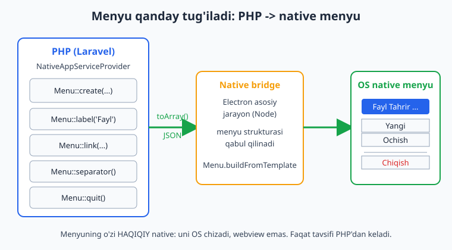
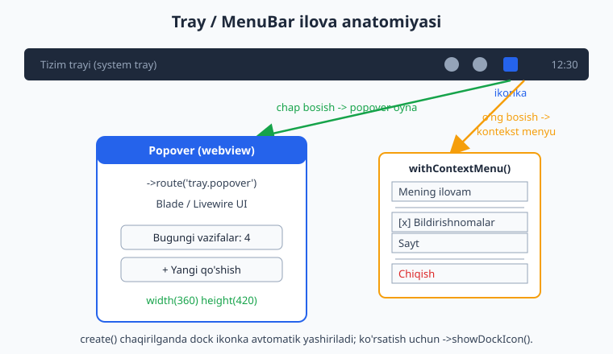
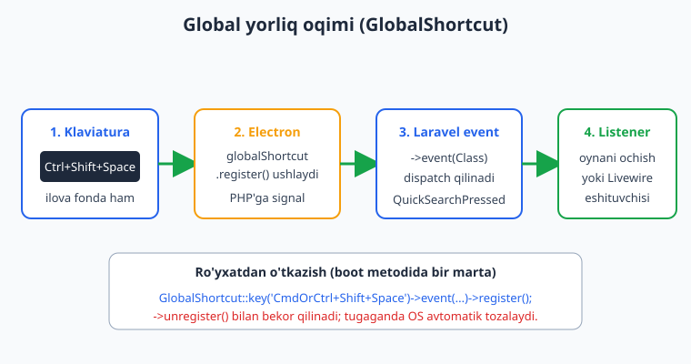

# 05 — Menyu, tray va global yorliqlar

[⬅️ Oldingi: 04 — Oyna boshqaruvi (Window)](./04-window-management.md) · [🏠 README](./README.md) · [Keyingi: 06 — Native UI: Notification, Dialog, Alert ➡️](./06-native-ui-notification-dialog.md)

---

> **Bu bobda:** desktop ilovangizga tirik tegadigan to'rt narsani o'rganamiz — yuqoridagi **ilova menyusi** (Fayl, Tahrir, Ko'rish...), sichqonchaning o'ng tugmasi ostidagi **kontekst menyu**, doim ko'z oldida turadigan **tray/MenuBar ilova** (fonda ishlab, ikonka orqali ochiladigan kichik oyna), va butun tizim bo'ylab ishlaydigan **global klaviatura yorliqlari** (masalan `Ctrl+Shift+Space` bilan tezkor qidiruvni chaqirish). Aniq facade'lar: `Menu`, `MenuBar`, `ContextMenu`, `GlobalShortcut` — barchasi `Native\Desktop\Facades\...` namespace'ida. Har bir metodni rasmiy docs va o'rnatilgan `vendor/nativephp/desktop` manba kodi bilan tasdiqladik.
>
> **Halol eslatma:** NativePHP sof native widget yaratmaydi — ilovangiz Electron qobiq ichida ishlaydi, UI esa webview'dagi Blade/Livewire. Lekin **menyu va tray ikonkasi HAQIQIY native**: ularni operatsion tizimning o'zi chizadi (webview emas). PHP faqat menyuning *tavsifini* (label, hotkey, qaysi event) yuboradi, Electron uni `Menu.buildFromTemplate` orqali OS menyusiga aylantiradi. Shu bobdagi Laravel/PHP kod (builder'lar, event'lar, listener'lar) `php -l` va tirik Laravel boot bilan tekshirilgan; menyu ekranda *qanday ko'rinishi* (rasmlar) va `native:dev` GUI bloklari esa **illustrativ** — bu muhitda displey/Electron yo'q, shuning uchun ishga tushirilmagan.

---

## Kirish: nega menyu va tray muhim

Brauzer ilovasi va desktop ilovasini farqlaydigan narsa — aynan shu mayda detallar. Foydalanuvchi `Cmd+,` bosib sozlamalarni ochishni, ekran tepasida "Fayl" menyusini ko'rishni, tray ikonkasiga bosib ilovani chaqirishni *kutadi*. Web ilova bularning hech birini bera olmaydi.

NativePHP bu native elementlarni PHP'dan boshqarish imkonini beradi. Yodda tuting (01-bobda chuqur tushuntirilgan): ilovangizning UI'si webview ichidagi HTML, biznes-mantiq PHP, lekin **menyu OS darajasida** — uni Electron asosiy jarayoni (Node) yaratadi. Demak menyu PHP'da *tasvirlanadi*, keyin bridge orqali Electron'ga uzatiladi.



Bu bobdagi kodni biz ko'pincha `App\Providers\NativeAppServiceProvider` ning `boot()` metodiga yozamiz — bu NativePHP o'rnatilganda (`php artisan native:install`) yaratiladigan maxsus provayder. Ilova ishga tushganda menyular va yorliqlar shu yerda sozlanadi.

> **Eslatma:** Laravel asoslarini (service provider, event, listener, route) bilasiz deb faraz qilamiz. Esdan chiqargan bo'lsangiz: [Laravel qo'llanmasi](../laravel/README.md). Bu yerda faqat NativePHP'ga xos qismni chuqur ochamiz.

---

## 1-qism: Ilova menyusi (Application Menu)

Ilova menyusi — bu macOS'da ekranning yuqori chetidagi, Windows/Linux'da odatda oyna tepasidagi menyu satri (Fayl, Tahrir, Ko'rish...). Uni `Menu` facade'i bilan quramiz.

### Menu facade: ikki rejim

`Native\Desktop\Facades\Menu` ikki xil ishlaydi:

- **`Menu::create(...)`** — menyuni *quradi va darhol ro'yxatga oladi* (ilova menyusiga aylantiradi). Hech narsa qaytarmaydi (`void`).
- **`Menu::make(...)`** — menyuni quradi, lekin **ro'yxatga olmaydi**. `Native\Desktop\Menu\Menu` obyektini qaytaradi. Buni keyinroq kontekst menyu yoki submenu sifatida ishlatamiz.

Eng oddiy ilova menyusi:

```php
use Native\Desktop\Facades\Menu;

Menu::create(
    Menu::app(),     // macOS: ilova nomi + About, Services, Quit
    Menu::file(),    // Fayl menyusi
    Menu::edit(),    // Tahrir: Undo, Redo, Cut, Copy, Paste
    Menu::view(),    // Ko'rish: Fullscreen, DevTools
    Menu::window(),  // Oyna: Minimize, Zoom
);
```

`Menu::app()`, `Menu::file()`, `Menu::edit()` va boshqalar — bular **tayyor "role" elementlari**. Operatsion tizim ularni avtomatik to'g'ri tarjima qiladi va to'g'ri xulq beradi (masalan `Menu::edit()` ichidagi "Nusxa olish" haqiqatan tanlangan matnni nusxalaydi). Bularni o'zingiz qaytadan yozishingiz shart emas.

Manba kodida tasdiqlangan to'liq "role" ro'yxati (`vendor/nativephp/desktop/src/Facades/Menu.php`):

`app()`, `about()`, `file()`, `edit()`, `view()`, `window()`, `help()`, `fullscreen()`, `separator()`, `devTools()`, `undo()`, `redo()`, `cut()`, `copy()`, `paste()`, `pasteAndMatchStyle()`, `reload()`, `minimize()`, `close()`, `quit()`, `hide()`.

Har biri ixtiyoriy `?string $label` qabul qiladi — masalan `Menu::quit('Ilovadan chiqish')` bilan yorliqni o'zbekchaga o'zgartirasiz.

### Menyu elementlari: label, link, route, separator

Tayyor role'lardan tashqari o'z elementlaringizni qo'shasiz:

```php
use Native\Desktop\Facades\Menu;

Menu::create(
    Menu::app(),
    Menu::make(
        Menu::label('Boshqaruv paneli')->event(\App\Events\GoToDashboard::class),
        Menu::route('settings', 'Sozlamalar', 'CmdOrCtrl+,'),
        Menu::separator(),
        Menu::link('https://nativephp.com/docs', 'Hujjatlar')->openInBrowser(),
        Menu::separator(),
        Menu::quit('Chiqish'),
    )->label('Fayl'),
);
```

Manba koddan tasdiqlangan element-fabrikalar va ularning imzolari:

| Metod | Imzo (verbatim) | Tavsif |
|---|---|---|
| `Menu::label()` | `label(string $label, ?string $hotkey = null)` | Oddiy matnli element; bosilganda event berishi mumkin |
| `Menu::link()` | `link(string $url, ?string $label = null, ?string $hotkey = null)` | URL'ga olib boruvchi element |
| `Menu::route()` | `route(string $url, ?string $label = null, ?string $hotkey = null)` | Laravel route'iga olib boruvchi element |
| `Menu::checkbox()` | `checkbox(string $label, bool $checked = false, ?string $hotkey = null)` | Belgilanadigan/olib tashlanadigan element |
| `Menu::radio()` | `radio(string $label, bool $checked = false, ?string $hotkey = null)` | Bittasini tanlash guruhi |
| `Menu::separator()` | `separator()` | Ajratuvchi chiziq |

> **`link` vs `route`:** `route()` ichingizdagi Laravel route nomini oladi va uni joriy oynada ochadi. `link()` bilan tashqi URL berib, `->openInBrowser()` qo'shsangiz — element tizim brauzeringizda ochiladi (ilova oynasida emas). `openInBrowser()` faqat `Link` elementida bor (manba: `src/Menu/Items/Link.php`).

### Hotkey (akselerator) qo'shish

Menyu elementiga klaviatura yorligi (Electron tilida "akselerator") berishning ikki yo'li bor — ikkalasi ham bir xil ishlaydi:

```php
// 1-usul: uchinchi argument sifatida
Menu::label('Tezkor qidiruv', 'CmdOrCtrl+K');

// 2-usul: zanjir bilan ->hotkey() yoki ->accelerator()
Menu::label('Tezkor qidiruv')->hotkey('CmdOrCtrl+K');
Menu::label('Tezkor qidiruv')->accelerator('CmdOrCtrl+K');
```

Manba kodida `hotkey()` aslida `accelerator()` ning taxallusi (`src/Menu/Items/MenuItem.php`):

```php
public function hotkey(string $hotkey): self
{
    return $this->accelerator($hotkey);
}
```

`CmdOrCtrl` — juda foydali: macOS'da `Cmd`, Windows/Linux'da `Ctrl` bo'ladi. Akselerator formati (modifikatorlar): `Command`/`Cmd`, `Control`/`Ctrl`, `CommandOrControl`/`CmdOrCtrl`, `Alt`, `Option`, `Shift`, `Super`, `Meta` va klavishlar `A-Z`, `0-9`, `F1-F24`, `Space`, `Enter`, `Esc` va h.k.

> **Muhim cheklov (docs'dan):** ilova menyusining hotkey'lari **faqat ilovangiz oynasi fokusda bo'lganda** ishlaydi. Ilova fonda turganda ishlovchi yorliq kerak bo'lsa — bu boshqa narsa: `GlobalShortcut` (4-qism).

### Submenu (ichma-ich menyu)

Har bir element ichiga yana menyu joylashtirish mumkin. `->submenu(...)` chaqiriladi:

```php
Menu::label('Eksport')->submenu(
    Menu::label('PDF sifatida')->event(\App\Events\ExportPdf::class),
    Menu::label('CSV sifatida')->event(\App\Events\ExportCsv::class),
    Menu::separator(),
    Menu::checkbox('Rasmlarni qo\'shish', true),
);
```

Yoki butun bir bo'lim quryapsiz va unga sarlavha bermoqchisiz: `Menu::make(...)->label('Fayl')` — `make()` bilan menyu yasab, `->label()` bilan unga nom berasiz (yuqoridagi "Fayl" misolida shunday qildik).

### Menyu bosilganda nima bo'ladi? Event'lar

Element bosilganda ikki xil reaksiya bo'lishi mumkin:

1. **`Menu::route(...)`** — avtomatik o'sha route'ga o'tadi, qo'shimcha kod kerak emas.
2. **`->event(EventClass::class)`** — siz bergan Laravel event'ini dispatch qiladi. Uni listener yoki Livewire eshitadi.

Bu juda kuchli: menyu hodisasi oddiy Laravel event'iga aylanadi va siz uni odatdagidek qayta ishlaysiz.

Avval event yarating:

```php
// app/Events/OpenSettings.php
namespace App\Events;

use Illuminate\Foundation\Events\Dispatchable;

class OpenSettings
{
    use Dispatchable;
}
```

Menyuda ulang:

```php
Menu::label('Sozlamalar', 'CmdOrCtrl+,')->event(\App\Events\OpenSettings::class);
```

Listener yozing (sozlamalar oynasini ochadi):

```php
// app/Listeners/OpenSettingsListener.php
namespace App\Listeners;

use App\Events\OpenSettings;
use Native\Desktop\Facades\Window;

class OpenSettingsListener
{
    public function handle(OpenSettings $event): void
    {
        Window::open('settings')
            ->title('Sozlamalar')
            ->width(600)
            ->height(400)
            ->route('settings');
    }
}
```

> `Window` facade'i va `Window::open()` 04-bobda batafsil ochilgan. Bu yerda asosiy g'oya: menyu -> event -> listener -> oyna.

### To'liq misol: NativeAppServiceProvider

Hammasini birlashtiramiz. Bu kod `App\Providers\NativeAppServiceProvider` ning `boot()` ichida turadi:

```php
namespace App\Providers;

use Illuminate\Support\ServiceProvider;
use Native\Desktop\Facades\Menu;
use App\Events\OpenSettings;

class NativeAppServiceProvider extends ServiceProvider
{
    public function boot(): void
    {
        Menu::create(
            Menu::app(),
            Menu::make(
                Menu::route('dashboard', 'Boshqaruv paneli', 'CmdOrCtrl+D'),
                Menu::separator(),
                Menu::label('Sozlamalar', 'CmdOrCtrl+,')
                    ->event(OpenSettings::class),
                Menu::separator(),
                Menu::quit('Chiqish'),
            )->label('Fayl'),
            Menu::edit(),
            Menu::view(),
            Menu::window(),
            Menu::make(
                Menu::link('https://nativephp.com/docs', 'Hujjatlar')->openInBrowser(),
                Menu::link('https://ioqil.uz', 'Muallif sayti')->openInBrowser(),
            )->label('Yordam'),
        );
    }
}
```

Bu kodni biz tirik Laravel ilovasi ichida ishga tushirib tekshirdik: `Menu::make(...)` haqiqatan `Native\Desktop\Menu\Menu` obyektini qaytaradi, `->toArray()` to'g'ri tuzilma beradi, submenu elementlari sanaladi, `->hotkey()` akseleratorni o'rnatadi. `php -l` sintaksis xatosi topmadi.

> **Illustrativ (bu muhitda ishga tushirilmagan):** menyuning ekranda *qanday ko'rinishi* — yuqoridagi rasmda. `native:dev` bilan ishga tushirganda ilova menyusi rasmiy muhitda shunday paydo bo'ladi. Bu yerda displey/Electron yo'qligi sababli GUI'ni real ko'rsata olmaymiz.

---

## 2-qism: Kontekst menyu (Context Menu)

Kontekst menyu — sichqonchaning o'ng tugmasini bosganda chiqadigan menyu. NativePHP'da buni ikki xil yo'l bilan qilish mumkin, va ularni adashtirmaslik muhim.

### A yo'li: ContextMenu facade (native, PHP'dan)

`Native\Desktop\Facades\ContextMenu` faqat ikkita metodga ega (manba: `src/Facades/ContextMenu.php`):

```php
// @method static void register(Menu $menu)
// @method static void remove()
```

Siz `Menu::make(...)` bilan menyu yasab, uni `ContextMenu::register()` ga berasiz. Shundan keyin o'ng-bosish o'sha menyuni native ko'rsatadi:

```php
use Native\Desktop\Facades\ContextMenu;
use Native\Desktop\Facades\Menu;

ContextMenu::register(
    Menu::make(
        Menu::label('Nusxa olish')->event(\App\Events\CopyClicked::class),
        Menu::label('Joylashtirish')->event(\App\Events\PasteClicked::class),
        Menu::separator(),
        Menu::label('Ochish')->submenu(
            Menu::label('Brauzerda'),
            Menu::label('Yangi oynada'),
        ),
    ),
);

// Keyinchalik kontekst menyuni olib tashlash:
// ContextMenu::remove();
```

Bu menyu ham xuddi ilova menyusidagi elementlardan tashkil topadi — `label`, `separator`, `submenu`, `->event(...)` hammasi ishlaydi. Biz buni tirik ilovada tekshirdik: `Menu::make()` bilan yasalgan menyuning `->toArray()` natijasi to'g'ri `submenu` strukturasini va element'larning `event` maydonini beradi.

### B yo'li: Native.contextMenu() (JavaScript, frontend'dan)

Ba'zan kontekst menyu sahifaning *muayyan elementi* uchun kerak (masalan jadvaldagi bitta qator). Buni frontend JavaScript'da `Native` yordamchisi orqali qilasiz (docs'dan):

```js
// Blade/Livewire sahifangizdagi <script> ichida
element.addEventListener('contextmenu', (e) => {
    e.preventDefault();
    Native.contextMenu([
        {
            label: 'Tahrirlash',
            accelerator: 'e',
            click(menuItem, window, event) {
                // bu yerda harakat
            },
        },
        { type: 'separator' },
        { label: 'O\'chirish' },
    ]);
});
```

> **Qaysi birini tanlash?** Butun ilova/oyna uchun yagona o'ng-bosish menyusi kerak bo'lsa — `ContextMenu::register()` (PHP, sodda). Sahifadagi har xil elementga turlicha menyu kerak bo'lsa — `Native.contextMenu()` (JS, moslashuvchan). Aniq imzolar uchun rasmiy docs'ning Context Menu sahifasiga qarang.

### Kontekst menyu hodisasini qayta ishlash

`->event(...)` bilan bog'langan element bosilganda Laravel event dispatch bo'ladi. Livewire komponentida buni eshitish ayniqsa qulay:

```php
// Livewire komponentida
use Native\Desktop\Facades\ContextMenu;
use Native\Desktop\Facades\Menu;

class Editor extends \Livewire\Component
{
    public function mount(): void
    {
        ContextMenu::register(Menu::make(
            Menu::label('Saqlash')->event(\App\Events\SaveDocument::class),
        ));
    }

    // App\Events\SaveDocument dispatch bo'lganda chaqiriladigan listener
    // odatda alohida Listener klassida bo'ladi.
}
```

---

## 3-qism: MenuBar — tray/menubar ilova (fonda ishlovchi)

Bu bobning eng qiziq qismi. **MenuBar ilova** — bu asosiy oynasi bo'lmagan, faqat tray (Windows) yoki menubar (macOS) ikonkasi orqali yashaydigan ilova. Ikonkaga bosganingizda kichik popover oyna ochiladi. Spotify mini-pleyeri, parol menejerlari, ob-havo widgetlari — hammasi shu modelda.



### MenuBar yaratish

`Native\Desktop\Facades\MenuBar::create()` chaqirilganda `PendingCreateMenuBar` obyekti qaytadi va siz uni fluent (zanjir) usulda sozlaysiz. Eng muhim nozik detal (manba: `src/MenuBar/PendingCreateMenuBar.php`): obyekt `__destruct` da avtomatik `create()` qiladi — ya'ni zanjirni tugatib qo'yib yuborganingizda menubar haqiqatan yaratiladi.

```php
use Native\Desktop\Facades\MenuBar;
use Native\Desktop\Facades\Menu;

MenuBar::create()
    ->label('Holatim')
    ->tooltip('Bosib oching')
    ->icon(storage_path('app/trayIcon.png'))
    ->route('tray.popover')   // popover oyna qaysi route'ni yuklaydi
    ->width(360)
    ->height(420)
    ->withContextMenu(Menu::make(
        Menu::label('Mening ilovam'),
        Menu::separator(),
        Menu::checkbox('Bildirishnomalar', true)
            ->event(\App\Events\ToggleNotifications::class),
        Menu::link('https://nativephp.com', 'Sayt')->openInBrowser(),
        Menu::separator(),
        Menu::quit('Chiqish'),
    ));
```

> **Muhim (manba'dan):** `create()` chaqirilganda dock ikonka **avtomatik yashiriladi** (MenuBar ilova odatda dock'da ko'rinmaydi). Agar dock ikonkasini ham ko'rsatmoqchi bo'lsangiz: `->showDockIcon()`.

### MenuBar fluent metodlari (manba'dan tasdiqlangan)

`src/MenuBar/MenuBar.php` dagi zanjirlanadigan metodlar:

| Metod | Tavsif |
|---|---|
| `->label(string)` | Ikonka yonidagi matn |
| `->tooltip(string)` | Ikonka ustiga kelganda chiqadigan yozuv |
| `->icon(string)` | Ikonka fayli yo'li (22x22 PNG tavsiya etiladi) |
| `->route(string)` / `->url(string)` | Popover qaysi sahifani yuklashi |
| `->width(int)` / `->height(int)` | Popover o'lchami |
| `->resizable(bool)` | O'lcham o'zgartirishga ruxsat |
| `->withContextMenu(Menu)` | O'ng-bosish kontekst menyusi |
| `->onlyShowContextMenu(bool)` | Faqat kontekst menyu, popover oynasiz |
| `->showDockIcon(bool)` | Dock ikonkasini ko'rsatish |
| `->alwaysOnTop(bool)` | Doim yuqorida (asosan dev paytida qulay) |
| `->showOnAllWorkspaces(bool)` | Barcha workspace'larda ko'rinish |
| `->vibrancy(string)` | macOS shaffoflik effekti |
| `->webPreferences(array)` | Webview sozlamalari |

`MenuBar` facade'ining o'zidagi to'g'ridan-to'g'ri metodlar (manba: `src/Facades/MenuBar.php`): `create()`, `show()`, `hide()`, `label()`, `tooltip()`, `icon()`, `resize(int $width, int $height)`, `contextMenu(Menu $menu)`, `showContextMenu()`, `webPreferences(array)`.

> **`->label()` ikki kontekstda:** `MenuBar` facade'ida ham, fluent `PendingCreateMenuBar` da ham `label` bor — biri ikonka yonidagi matnni o'rnatadi.

### Popover oynasiga UI joylash

Popover — bu webview oyna, demak unga oddiy Blade yoki Livewire sahifa qo'yasiz. `->route('tray.popover')` bilan qaysi route ekanini bildirdik. Route'ni odatdagidek `routes/web.php` da e'lon qilasiz:

```php
// routes/web.php
use Illuminate\Support\Facades\Route;

Route::view('/tray', 'tray.popover')->name('tray.popover');
```

Blade ko'rinishi (`resources/views/tray/popover.blade.php`):

```blade
<div style="padding: 16px; font-family: sans-serif;">
    <h3>Bugungi vazifalar</h3>
    <ul>
        @foreach ($tasks ?? [] as $task)
            <li>{{ $task }}</li>
        @endforeach
    </ul>
    <button onclick="alert('Yangi qo\'shildi')">+ Yangi</button>
</div>
```

> Livewire bilan ishlatsangiz, popover ichida real-vaqt holatini ko'rsatishingiz mumkin (masalan tugamagan vazifalar soni). Bu tray ilovalarini ayniqsa kuchli qiladi.

### MenuBar hodisalari

Tray ikonkasi bilan o'zaro ta'sirni Laravel event'lari orqali tutasiz (manba: `src/Events/MenuBar/`):

| Event | Qachon |
|---|---|
| `MenuBarClicked` | Ikonka chap tugma bilan bosilganda |
| `MenuBarRightClicked` | Ikonka o'ng tugma bilan bosilganda |
| `MenuBarDoubleClicked` | Ikonka ikki marta bosilganda |
| `MenuBarShown` / `MenuBarHidden` | Popover ochilganda / yopilganda |
| `MenuBarDroppedFiles` | Ikonka ustiga fayl tashlanganda |
| `MenuBarCreated` | MenuBar yaratilganda |

Masalan `MenuBarClicked` ning konstruktori (manba'dan): `public function __construct(public array $combo, public array $bounds, public array $position)`. Ya'ni listener'da bosilgan klavisha kombinatsiyasi, ikonka o'lchami va kursor pozitsiyasini olasiz.

`MenuBarDroppedFiles` esa drag-and-drop'ni ushlaydi: `public function __construct(public array $files = [])` — tashlangan fayllar ro'yxati keladi.

```php
// app/Listeners/HandleTrayClick.php
namespace App\Listeners;

use Native\Desktop\Events\MenuBar\MenuBarRightClicked;

class HandleTrayClick
{
    public function handle(MenuBarRightClicked $event): void
    {
        logger('Tray o\'ng bosildi', $event->position);
    }
}
```

> **Illustrativ:** tray ikonkasining real ko'rinishi, popover'ning ochilishi va drag-drop — bularning hammasi `native:dev` bilan tirik Electron muhitida ishlaydi. Bu muhitda displey va Electron yo'q, shuning uchun yuqoridagi kodning *sintaksisi va Laravel bilan integratsiyasi* tekshirilgan, lekin GUI real ko'rsatilmagan. Soxta "tray paydo bo'ldi" demaymiz.

---

## 4-qism: Global yorliqlar (GlobalShortcut)

Ilova menyusining hotkey'lari faqat oyna fokusda bo'lsa ishlaydi. Lekin ba'zan ilova **fonda** turganda ham yorliq kerak — masalan ekrandagi istalgan joyda `Ctrl+Shift+Space` bosib tezkor qidiruvni chaqirish (Spotlight, Raycast, Alfred kabi). Bu — **global yorliq**.



### GlobalShortcut facade

`Native\Desktop\Facades\GlobalShortcut` to'rt metodga ega (manba: `src/Facades/GlobalShortcut.php`):

```php
// @method static \Native\Desktop\GlobalShortcut key(string $key)
// @method static \Native\Desktop\GlobalShortcut event(string $event)
// @method static void register()
// @method static void unregister()
```

Foydalanish — zanjir bilan: `key()` -> `event()` -> `register()`:

```php
use Native\Desktop\Facades\GlobalShortcut;
use App\Events\QuickSearchPressed;

GlobalShortcut::key('CmdOrCtrl+Shift+Space')
    ->event(QuickSearchPressed::class)
    ->register();
```

Bekor qilish:

```php
GlobalShortcut::key('CmdOrCtrl+Shift+Space')->unregister();
```

Biz buni tirik ilovada `GlobalShortcut::fake()` bilan tekshirdik: `key()->event()->register()` zanjiri va `key()->unregister()` to'g'ri ishlaydi, xato bermaydi.

### Event'ni qayta ishlash

`QuickSearchPressed` oddiy Laravel event'i:

```php
// app/Events/QuickSearchPressed.php
namespace App\Events;

use Illuminate\Foundation\Events\Dispatchable;

class QuickSearchPressed
{
    use Dispatchable;

    public function __construct(public ?string $combo = null)
    {
    }
}
```

Listener uni eshitib, masalan tezkor qidiruv oynasini ochadi:

```php
// app/Listeners/ShowQuickSearch.php
namespace App\Listeners;

use App\Events\QuickSearchPressed;
use Native\Desktop\Facades\Window;

class ShowQuickSearch
{
    public function handle(QuickSearchPressed $event): void
    {
        Window::open('quick-search')
            ->width(640)
            ->height(80)
            ->alwaysOnTop()
            ->route('quick-search');
    }
}
```

### Akselerator formati va eng yaxshi amaliyotlar

Global yorliq stringi xuddi menyu hotkey'i kabi formatda: modifikator(lar) `+` klavisha. Masalan `CmdOrCtrl+Shift+P`, `Alt+F4`, `Super+L`.

Maslahatlar:

- **Ro'yxatga olishni `boot()` da bir marta qiling** — ilova ishga tushganda. Bu yorliqni ilova fonda turganda ham faollashtiradi.
- **Tizim yorliqlarini "o'g'irlamang".** `CmdOrCtrl+C`, `Cmd+Tab`, `Alt+F4` kabilarni global qilib qo'ymang — foydalanuvchini g'azablantirasiz va OS ruxsat bermasligi mumkin.
- **Noyob kombinatsiya tanlang.** Kamida ikkita modifikator (`CmdOrCtrl+Shift+...`) konfliktni kamaytiradi.
- **Tozalash.** Ilova yopilganda OS global yorliqlarni avtomatik bo'shatadi, lekin yorliqni dinamik o'zgartirsangiz `->unregister()` ni unutmang.

> **Illustrativ:** global yorliqning *real bosilishi* faqat tirik Electron muhitida (`native:dev`/`native:build`) ishlaydi — Electron `globalShortcut` API'sini OS darajasida ro'yxatga oladi. Bu muhitda bu jarayon ishga tushirilmagan; biz PHP tomonidagi builder va event/listener mantig'ini tekshirdik, xolos.

---

## Hammasi birga: amaliy mini-arxitektura

Tasavvur qiling, "Vazifalar" nomli tray ilovasi yaratyapsiz:

1. **MenuBar ilova** — tray ikonkasi, bosilganda popover'da bugungi vazifalar ro'yxati (Livewire).
2. **Kontekst menyu** — ikonkaga o'ng-bosish: "Yangi vazifa", "Hammasini bajarildi deb belgilash", "Chiqish".
3. **Global yorliq** — `CmdOrCtrl+Shift+T` istalgan joyda yangi vazifa qo'shish oynasini ochadi.
4. **Ilova menyusi** — agar to'liq oyna ham bo'lsa, yuqorida standart Fayl/Tahrir menyusi.

Bularning barchasi `NativeAppServiceProvider::boot()` da yig'iladi, har bir hodisa Laravel event'iga aylanadi, va siz ularni odatdagi listener/Livewire eshituvchilari bilan qayta ishlaysiz. NativePHP'ning go'zalligi shunda — native qobiq murakkabligi sizdan yashiringan, siz esa odatdagi Laravel kodi yozasiz.

> Ma'lumotlar bazasi bilan ishlash (vazifalarni saqlash) — bu sof Laravel/Eloquent. Esga olish uchun: [SQL qo'llanmasi](../sql/README.md), [Laravel](../laravel/README.md).

---

## Mashqlar

### Oson

1. `NativeAppServiceProvider::boot()` ichida `Menu::create(...)` bilan minimal ilova menyusi yozing: `Menu::app()`, `Menu::file()`, `Menu::edit()`. Faqat shu uchta role.

2. "Fayl" menyusiga `Menu::quit('Ilovadan chiqish')` elementini `CmdOrCtrl+Q` hotkey bilan qo'shing. Hotkey'ni ikki xil usulda (argument va `->hotkey()`) yozib ko'rsating.

3. `Menu::link('https://ioqil.uz', 'Muallif')` elementini yarating va uni tizim brauzerida ochiladigan qiling. Qaysi metod buni ta'minlaydi?

4. `MenuBar::create()` bilan eng oddiy tray ilovasi yozing: faqat `->label('Salom')` va `->tooltip('Bosing')`. Boshqa hech narsa.

5. `GlobalShortcut::key('CmdOrCtrl+Shift+H')->unregister();` qatorini tushuntiring — bu nima qiladi va qachon kerak bo'ladi?

6. `Menu::checkbox('Qorong\'u rejim', true)` va `Menu::radio('Kichik shrift')` orasidagi farqni bir-ikki jumlada yozing.

### O'rta

7. To'liq `NativeAppServiceProvider::boot()` yozing: ilova menyusida "Fayl" bo'limi `Menu::make(...)->label('Fayl')` orqali qurilsin, ichida `Menu::route('dashboard', 'Bosh sahifa', 'CmdOrCtrl+D')` va `Menu::separator()` va `Menu::quit()` bo'lsin.

8. Tray ilovasi yarating: `->route('tray.popover')`, `->width(320)->height(400)`, va `->withContextMenu(...)` ichida `Menu::label`, `Menu::separator`, `Menu::quit`. Mos `routes/web.php` qatorini ham yozing.

9. `Menu::label('Sozlamalar')->event(\App\Events\OpenSettings::class)` uchun to'liq zanjir yozing: event klassi (`Dispatchable` trait bilan) + listener klassi (`Window::open(...)` chaqiruvi bilan).

10. Global yorliq `CmdOrCtrl+Shift+Space` ni `QuickSearchPressed` event'iga ulang. Event klassini va uni `boot()` da ro'yxatga olishni yozing.

11. `Menu::label('Eksport')->submenu(...)` bilan ichma-ich menyu yarating: submenu ichida "PDF" va "CSV" elementlari, har biri o'z event'iga ulangan.

12. `ContextMenu::register(Menu::make(...))` bilan global kontekst menyu yarating: "Nusxa olish", ajratuvchi, va "Ochish" submenu'si (ichida ikkita element). Keyin uni qanday olib tashlashni (`ContextMenu::remove()`) izohlang.

### Qiyin

13. **Arxitektura savoli:** "Vazifalar" tray ilovasini loyihalashtiring. Quyidagilarni qaysi facade/event bilan qilishni tushuntiring (kod skeletini yozing): (a) tray popover'da Livewire ro'yxati, (b) o'ng-bosish kontekst menyu "Yangi vazifa", (c) global `CmdOrCtrl+Shift+T` bilan tezkor qo'shish oynasi. Har bir bo'lakni `boot()` da qanday yig'ishni ko'rsating.

14. **Ikki tomonlama farq:** Kontekst menyuni `ContextMenu::register()` (PHP) va `Native.contextMenu()` (JS) bilan qilish o'rtasidagi farqni tahlil qiling. Qaysi holatda qaysi birini tanlaysiz? Jadval/qatorlar bilan ishlovchi ilova uchun nima tavsiya qilasiz va nega? Har biriga qisqa kod misol bering.

15. **Hodisa konstruktorlari:** `MenuBarClicked` va `MenuBarDroppedFiles` event'larining konstruktorlari qanday (qaysi public xususiyatlar)? Listener'da fayl drag-drop ni ushlaydigan to'liq listener yozing va tashlangan fayllarni log qiling.

16. **Hotkey doirasi:** Ilova menyusi hotkey'i (`Menu::label('X', 'CmdOrCtrl+K')`) va global yorliq (`GlobalShortcut::key('CmdOrCtrl+K')`) o'rtasidagi tub farqni tushuntiring — qaysi biri ilova fonda turganda ishlaydi, qaysi biri faqat oyna fokusda? Bir xil kombinatsiyani ikkalasiga ham bersangiz qanday muammo chiqishi mumkin?

---

<details markdown="1"><summary>Yechimlar</summary>

### Oson

**1.**
```php
public function boot(): void
{
    Menu::create(
        Menu::app(),
        Menu::file(),
        Menu::edit(),
    );
}
```
`Menu::app()` faqat macOS'da ko'rinadi (ilova nomi menyusi); Windows/Linux'da e'tiborga olinmaydi — bu normal.

**2.**
```php
// 1-usul: argument
Menu::quit('Ilovadan chiqish')->accelerator('CmdOrCtrl+Q');
// quit() label argument oladi, akseleratorni esa zanjir bilan beramiz

// label uchun 3-argument usuli:
Menu::label('Chiqish', 'CmdOrCtrl+Q');         // argument
Menu::label('Chiqish')->hotkey('CmdOrCtrl+Q'); // zanjir
```
Manba kodda `hotkey()` — bu `accelerator()` taxallusi, ikkalasi bir xil.

**3.**
```php
Menu::link('https://ioqil.uz', 'Muallif')->openInBrowser();
```
`->openInBrowser()` metodi (faqat `Link` elementida bor) elementni ilova oynasida emas, tizim brauzerida ochadi.

**4.**
```php
MenuBar::create()
    ->label('Salom')
    ->tooltip('Bosing');
```
`PendingCreateMenuBar` obyekti `__destruct` da avtomatik `create()` qiladi, shuning uchun qo'shimcha chaqiruv kerak emas.

**5.** `GlobalShortcut::key('CmdOrCtrl+Shift+H')->unregister();` — oldin ro'yxatga olingan global yorliqni o'chiradi (OS endi bu kombinatsiyani ilovaga yubormaydi). Kerak bo'ladi: foydalanuvchi sozlamalarda yorliqni o'chirsa, yoki yorliqni boshqasiga almashtirayotganda (avval eskisini unregister, keyin yangisini register).

**6.** `checkbox` — mustaqil yoqilgan/o'chirilgan holat (bir nechtasi bir vaqtda belgilangan bo'lishi mumkin, masalan "Bildirishnomalar", "Avtomatik saqlash"). `radio` — guruh ichidan **faqat bittasi** tanlanadi (masalan shrift o'lchami: Kichik/O'rta/Katta).

### O'rta

**7.**
```php
public function boot(): void
{
    Menu::create(
        Menu::app(),
        Menu::make(
            Menu::route('dashboard', 'Bosh sahifa', 'CmdOrCtrl+D'),
            Menu::separator(),
            Menu::quit('Chiqish'),
        )->label('Fayl'),
        Menu::edit(),
        Menu::view(),
        Menu::window(),
    );
}
```

**8.**
```php
// NativeAppServiceProvider::boot()
MenuBar::create()
    ->route('tray.popover')
    ->width(320)
    ->height(400)
    ->withContextMenu(Menu::make(
        Menu::label('Vazifalar ilovasi'),
        Menu::separator(),
        Menu::quit('Chiqish'),
    ));
```
```php
// routes/web.php
Route::view('/tray', 'tray.popover')->name('tray.popover');
```

**9.**
```php
// app/Events/OpenSettings.php
namespace App\Events;
use Illuminate\Foundation\Events\Dispatchable;
class OpenSettings { use Dispatchable; }
```
```php
// menyuda
Menu::label('Sozlamalar', 'CmdOrCtrl+,')->event(\App\Events\OpenSettings::class);
```
```php
// app/Listeners/OpenSettingsListener.php
namespace App\Listeners;
use App\Events\OpenSettings;
use Native\Desktop\Facades\Window;
class OpenSettingsListener
{
    public function handle(OpenSettings $event): void
    {
        Window::open('settings')->title('Sozlamalar')->width(600)->height(400)->route('settings');
    }
}
```
Laravel avtomatik event-discovery'si event nomidan listener'ni topadi (yoki `EventServiceProvider` da qo'lda ulaysiz).

**10.**
```php
// app/Events/QuickSearchPressed.php
namespace App\Events;
use Illuminate\Foundation\Events\Dispatchable;
class QuickSearchPressed { use Dispatchable; public function __construct(public ?string $combo = null) {} }
```
```php
// NativeAppServiceProvider::boot()
GlobalShortcut::key('CmdOrCtrl+Shift+Space')
    ->event(\App\Events\QuickSearchPressed::class)
    ->register();
```

**11.**
```php
Menu::label('Eksport')->submenu(
    Menu::label('PDF sifatida')->event(\App\Events\ExportPdf::class),
    Menu::label('CSV sifatida')->event(\App\Events\ExportCsv::class),
);
```
`->submenu(...)` ichidagi elementlar `Menu::make()` orqali yangi `Menu` obyektiga yig'iladi (manba: `MenuItem::submenu()`).

**12.**
```php
ContextMenu::register(Menu::make(
    Menu::label('Nusxa olish')->event(\App\Events\CopyClicked::class),
    Menu::separator(),
    Menu::label('Ochish')->submenu(
        Menu::label('Brauzerda'),
        Menu::label('Yangi oynada'),
    ),
));
```
Olib tashlash: `ContextMenu::remove();` — endi o'ng-bosish hech qanday native menyu ko'rsatmaydi (default brauzer menyusiga qaytadi yoki hech narsa). `register`/`remove` — `ContextMenu` facade'idagi yagona ikkita metod.

### Qiyin

**13.** Mini-arxitektura skeleti:
```php
// NativeAppServiceProvider::boot()
public function boot(): void
{
    // (a) + (b): tray popover + kontekst menyu
    MenuBar::create()
        ->label('Vazifalar')
        ->icon(storage_path('app/trayIcon.png'))
        ->route('tray.popover')        // Livewire komponentli sahifa
        ->width(360)->height(440)
        ->withContextMenu(Menu::make(
            Menu::label('Yangi vazifa')->event(\App\Events\NewTaskRequested::class),
            Menu::label('Hammasini bajarildi')->event(\App\Events\MarkAllDone::class),
            Menu::separator(),
            Menu::quit('Chiqish'),
        ));

    // (c): global yorliq
    GlobalShortcut::key('CmdOrCtrl+Shift+T')
        ->event(\App\Events\NewTaskRequested::class)
        ->register();
}
```
```blade
{{-- resources/views/tray/popover.blade.php --}}
@livewire('task-list')   {{-- Livewire komponenti real-vaqt ro'yxat ko'rsatadi --}}
```
```php
// Listener: NewTaskRequested -> qo'shish oynasini ochadi
class OpenNewTaskWindow {
    public function handle(\App\Events\NewTaskRequested $e): void {
        Window::open('new-task')->width(480)->height(200)->alwaysOnTop()->route('tasks.new');
    }
}
```
Asosiy g'oya: kontekst menyu va global yorliq **bir xil** `NewTaskRequested` event'ini dispatch qiladi — kod takrorlanmaydi, ikkala kirish nuqtasi bitta listener'ga olib boradi. Vazifalarni saqlash sof Eloquent.

**14.** Farq:
- `ContextMenu::register()` (PHP): butun oyna/ilova uchun **bitta global** o'ng-bosish menyusi. Menyu native, PHP'da tasvirlanadi, elementlar Laravel event'lari bilan ulanadi. Sodda, server tomonida boshqariladi.
- `Native.contextMenu()` (JS): frontend'da, **muayyan DOM elementi** uchun. Har bir element/qatorga turlicha menyu bera olasiz, `click` callback'i bevosita JS'da.

Tavsiya: jadval/qatorlar bilan ishlovchi ilovada (har qatorga "Tahrirlash/O'chirish" kerak) — `Native.contextMenu()` ni element `contextmenu` hodisasida ishlatib, qator ID'sini callback'da yuborish qulayroq. Yagona umumiy menyu (masalan "Yopishtirish/Bekor qilish") bo'lsa — `ContextMenu::register()` PHP'da soddaroq.
```php
// PHP global
ContextMenu::register(Menu::make(Menu::label('Yopishtirish')->event(PasteEvent::class)));
```
```js
// JS, qatorga xos
row.addEventListener('contextmenu', e => {
  e.preventDefault();
  Native.contextMenu([{ label: 'O\'chirish', click: () => deleteRow(row.dataset.id) }]);
});
```

**15.** Manba kodidan:
- `MenuBarClicked`: `public function __construct(public array $combo, public array $bounds, public array $position)`
- `MenuBarDroppedFiles`: `public function __construct(public array $files = [])`

Drag-drop listener:
```php
namespace App\Listeners;
use Native\Desktop\Events\MenuBar\MenuBarDroppedFiles;
class HandleDroppedFiles
{
    public function handle(MenuBarDroppedFiles $event): void
    {
        foreach ($event->files as $path) {
            logger('Tray ustiga fayl tashlandi: ' . $path);
        }
    }
}
```

**16.** Tub farq:
- **Menyu hotkey** (`Menu::label('X', 'CmdOrCtrl+K')`) — bu *ilova menyusiga* bog'langan akselerator. Docs aniq aytadi: u **faqat ilovangiz oynasi fokusda bo'lganda** (yoki tegishli kontekst menyu ochiq bo'lganda) ishlaydi. Ilova fonda bo'lsa — ishlamaydi.
- **GlobalShortcut** (`GlobalShortcut::key('CmdOrCtrl+K')->register()`) — bu OS darajasida ro'yxatga olinadi va ilova fonda bo'lganda ham, boshqa ilova fokusda bo'lganda ham ishlaydi.

Bir xil kombinatsiyani ikkalasiga bersangiz: ilova fokusda bo'lganda konflikt yuzaga keladi (qaysi biri birinchi ushlaydi — aniq emas, OS/Electron xulqiga bog'liq), va global yorliq menyu hotkey'ini "ustun bosib" qo'yishi mumkin. Eng yaxshi amaliyot: global yorliqlar uchun *boshqacha*, noyobroq kombinatsiya tanlash (masalan menyu uchun `CmdOrCtrl+K`, global uchun `CmdOrCtrl+Shift+Space`).

</details>

---

[⬅️ Oldingi: 04 — Oyna boshqaruvi (Window)](./04-window-management.md) · [🏠 README](./README.md) · [Keyingi: 06 — Native UI: Notification, Dialog, Alert ➡️](./06-native-ui-notification-dialog.md)
