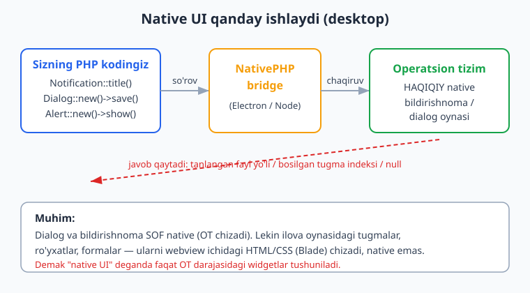
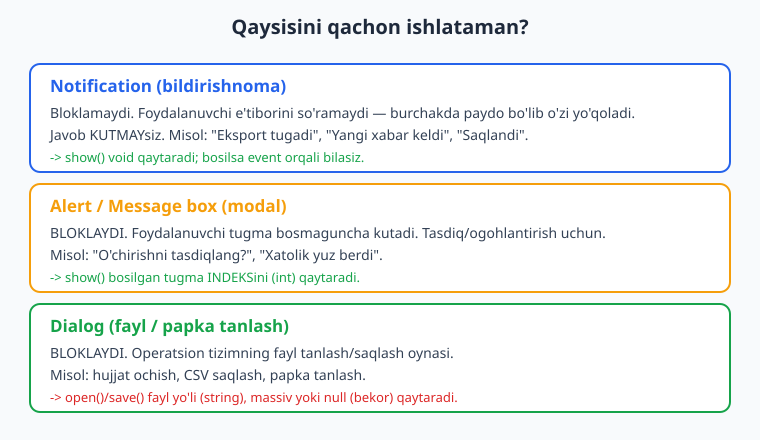
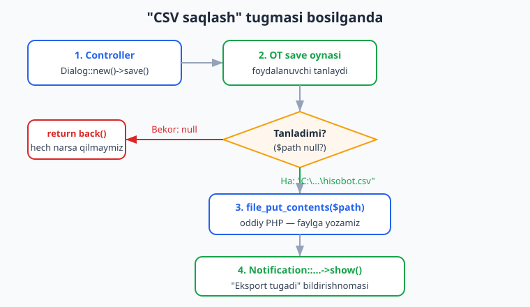

# 06 — Native UI: Notification, Dialog, Alert

[⬅️ Oldingi: 05 — Menyu, tray va global yorliqlar](./05-menyu-tray-shortcut.md) · [🏠 README](./README.md) · [Keyingi: 07 — System, fayllar va ChildProcess ➡️](./07-system-childprocess-fayl.md)

---

> **Bu bobda:** Endi ilovamiz operatsion tizim bilan "native" tilda gaplashishni o'rganadi. Tizim **bildirishnomalari** (`Notification`) — ekran burchagida chiqadigan, ilovani bloklamaydigan xabarlar. **Dialog** (`Dialog`) — operatsion tizimning HAQIQIY fayl ochish/saqlash va papka tanlash oynasi. **Alert / message box** (`Alert`) — foydalanuvchini to'xtatib, "Ha/Yo'q" so'raydigan modal oyna. Bularning ustiga **Clipboard** (nusxa/joylash), **dock badge** (macOS dock ustidagi raqam) va **dock bounce** ni ko'rib chiqamiz.
>
> Muhim halollik: NativePHP sof native widget chizmaydi. Ilovangizning oddiy interfeysi (tugmalar, formalar) — bu webview ichidagi HTML/CSS (Blade/Livewire). Lekin bu bobdagi narsalar — bildirishnoma, fayl dialogi, message box, clipboard, dock — bular HAQIQATAN operatsion tizimning o'zi chizadigan native elementlar. NativePHP ularni Electron (Node) "bridge" orqali chaqiradi. Bobdagi PHP/Laravel kod (controller, listener, facade chaqiruvlarining sintaksisi va class resolutsiyasi) `nativephp/desktop` o'rnatilgan haqiqiy Laravel ilovada **tekshirilgan**. Lekin oynaning ekranda **chizilishi** (bildirishnoma chiqishi, dialog ochilishi) faqat `native:dev`/`native:run` bilan Electron qobig'i ishlaganda ko'rinadi — bu muhitda displey/Electron yo'q, shuning uchun "oyna ochildi" deb yozmaymiz; bunday bloklarni **illustrativ** deb belgilaymiz.

---

## Native UI nima va nima emas

01-bobdan eslang: desktop NativePHP ilovasi — bu Electron **qobig'i** ichida ishlaydigan Laravel ilovasi. Interfeys webview (xromiy oyna) ichida HTML sifatida ko'rsatiladi, biznes-mantiq esa bundle qilingan PHP binarda bajariladi.

Demak "native UI" iborasini ikki xil tushunish kerak:

- **Webview UI** — ilova oynangizning ichidagi hamma narsa: tugmalar, jadvallar, formalar. Bularni siz Blade/Livewire/Inertia bilan HTML/CSS qilib chizasiz. Bu **native emas** — bu brauzer ichidagi sahifa.
- **Native UI elementlari** — operatsion tizimning o'zi chizadigan, sizning oynangizdan tashqaridagi narsalar: tizim bildirishnomasi, fayl tanlash oynasi, message box, dock/taskbar belgisi, clipboard. **Mana shular** haqiqiy native. Ana shu bobda biz aynan shularni boshqaramiz.

Quyidagi diagramma oqimni ko'rsatadi: PHP kodingiz facade chaqiradi -> NativePHP bridge (Electron/Node) operatsion tizimga buyruq beradi -> OT haqiqiy widgetni chizadi -> javob (fayl yo'li yoki bosilgan tugma) PHP'ga qaytadi.



Va eng asosiy savol — qaysi elementni qachon ishlatish kerak:



> **Versiya eslatmasi.** Bu bob NativePHP Desktop **v2** (joriy) ga mos. Joriy versiyada paket `nativephp/desktop`, facade'lar `Native\Desktop\...` namespace'ida. Internetda ko'p eski misollar `Native\Laravel\...` ni ko'rsatadi — bu eski yadro paketi. Yangi loyihangizda `Native\Desktop\...` ni ishlating. Aniq imzolar uchun har doim rasmiy docs'ni tekshiring: [nativephp.com/docs/desktop/2/the-basics/notifications](https://nativephp.com/docs/desktop/2/the-basics/notifications).

---

## Notification — tizim bildirishnomalari

Bildirishnoma — ilovani **bloklamaydigan** xabar. Ekran burchagida (Windows'da Action Center, macOS'da Notification Center) paydo bo'ladi, bir necha soniyada o'zi yo'qoladi. Foydalanuvchidan javob kutmaysiz — shunchaki "xabar berasiz".

Eng oddiy ko'rinishi:

```php
use Native\Desktop\Facades\Notification;

Notification::title('Salom, NativePHP!')
    ->message('Bu sizning Laravel ilovangizdan kelgan xabar.')
    ->show();
```

`title()` — sarlavha (qalin), `message()` — matn tanasi, `show()` esa bildirishnomani aslida ko'rsatadi. `show()` ni chaqirmasangiz, hech narsa chiqmaydi — bu eng ko'p uchraydigan boshlovchi xatosi.

> **Illustrativ.** Yuqoridagi kodning sintaksisi va `Notification` facade'ining mavjudligi tekshirilgan (pastdagi "Tekshirish" bo'limiga qarang). Lekin bildirishnomaning ekran burchagida **chizilishi** faqat `native:dev` ishlaganda ko'rinadi. Bu muhitda Electron/displey yo'q, shuning uchun "bildirishnoma chiqdi" deb da'vo qilmaymiz.

### Mavjud metodlar

`nativephp/desktop` paketidagi `Notification` facade quyidagi fluent metodlarni beradi (hammasi `Native\Desktop\Notification` class'idan, docblock'da tasdiqlangan):

| Metod | Vazifa |
|-------|--------|
| `title(string)` | Sarlavha |
| `message(string)` | Matn tanasi |
| `reference(string)` | O'zingiz beradigan ID — keyin click event'ida shu bildirishnomani taniysiz |
| `event(string)` | Bosilganda yuboriladigan event class nomi |
| `sound(string)` | Tovush |
| `silent(bool)` | Tovushsiz qilish |
| `hasReply(string)` | Javob maydoni (faqat macOS), ixtiyoriy placeholder bilan |
| `addAction(string)` | Tugma qo'shish (faqat macOS), bir necha marta chaqirsa bo'ladi |
| `show()` | Ko'rsatadi (`void` qaytaradi) |

> **Halol eslatma.** `hasReply()` va `addAction()` — bu macOS'ga xos imkoniyatlar. Windows va Linux'da ular jim o'tkazib yuboriladi. Platformaga bog'liq narsalarda har doim docs'ni tekshiring.

### Bildirishnoma bosilganda — event'lar

Bildirishnoma "olovga otib qo'yiladi" (fire-and-forget), lekin foydalanuvchi uni bosgan/yopgan/javob bergan paytni bilmoqchi bo'lsangiz, NativePHP event chiqaradi. Event class'lari `Native\Desktop\Events\Notifications\` namespace'ida:

- `NotificationClicked` — bosildi. Property'lari: `$reference`, `$event`.
- `NotificationClosed` — yopildi. Property'lari: `$reference`, `$event`.
- `NotificationReply` — javob yozildi (macOS). Property'lari: `$reference`, `$reply`, `$event`.
- `NotificationActionClicked` — action tugmasi bosildi. Property'lari: `$reference`, `$index`, `$event`.

`reference()` orqali har bir bildirishnomaga noyob ID beramiz, keyin event'da o'sha ID bo'yicha qaysi bildirishnoma ekanini bilamiz:

```php
use Native\Desktop\Facades\Notification;

Notification::title('Yangi buyurtma')
    ->message('#1024 buyurtma keldi.')
    ->reference('order-1024')   // bu ID event'da qaytadi
    ->show();
```

Endi listener yozamiz (oddiy Laravel event listener, NativePHP'ga xos hech narsa yo'q — faqat event class'i NativePHP'niki):

```php
namespace App\Listeners;

use Native\Desktop\Events\Notifications\NotificationClicked;
use Native\Desktop\Events\Notifications\NotificationReply;

class NotificationListener
{
    public function handleClicked(NotificationClicked $event): void
    {
        // $event->reference -> 'order-1024'
        logger()->info('Bildirishnoma bosildi', ['reference' => $event->reference]);
    }

    public function handleReply(NotificationReply $event): void
    {
        // macOS reply maydoni; $event->reply -> foydalanuvchi yozgan matn
        logger()->info('Javob keldi', [
            'reference' => $event->reference,
            'reply' => $event->reply,
        ]);
    }
}
```

Listener'ni Laravel'ning odatiy usuli bilan ro'yxatdan o'tkazasiz (masalan `AppServiceProvider::boot()` da yoki `EventServiceProvider` orqali). Bu listener fayli haqiqiy ilovaga yuklanib, type-hint'lari NativePHP class'lariga to'g'ri bog'lanishi tekshirilgan.

> **Cross-link.** Event/listener mexanikasi — bu sof Laravel. Agar event'lar yodingizdan chiqqan bo'lsa, [Laravel kitobiga](../laravel/README.md) qayting; bu yerda faqat NativePHP'niki bo'lgan event class'larini ishlatdik.

---

## Dialog — fayl ochish, saqlash, papka tanlash

`Dialog` — operatsion tizimning HAQIQIY fayl tanlash oynasi. Foydalanuvchi tugma bossa, OT'ning tanish "Open"/"Save" oynasi chiqadi. Bu oyna ilovani **bloklaydi** (foydalanuvchi tanlamaguncha yoki bekor qilmaguncha kod kutadi), va natijada **fayl yo'li** (yoki bekor qilinsa `null`) qaytaradi.

Diqqat: `Dialog` — facade emas, balki to'g'ridan ishlatiladigan class. Shuning uchun `use Native\Desktop\Dialog;` (ichida `Facades` yo'q) va `Dialog::new()` bilan boshlanadi.

### Fayl ochish (open)

```php
use Native\Desktop\Dialog;

$path = Dialog::new()
    ->title('Faylni tanlang')
    ->open();

// $path -> tanlangan fayl yo'li (string) yoki bekor qilinsa null
```

### Fayl saqlash (save)

```php
$path = Dialog::new()
    ->title('Hisobotni saqlash')
    ->defaultPath('hisobot.csv')
    ->button('Saqlash')
    ->save();
```

`save()` — bu fayl yozish dialogi: foydalanuvchi qaerga va qanday nom bilan saqlashni tanlaydi. U faylni **o'zi yozmaydi** — shunchaki yo'lni qaytaradi, yozishni siz oddiy PHP bilan qilasiz.

### Papka tanlash (folders)

```php
$dir = Dialog::new()
    ->title('Papkani tanlang')
    ->folders()    // endi fayl emas, papka tanlanadi
    ->open();
```

### Sozlash metodlari

`Native\Desktop\Dialog` class'ining barcha metodlari (manbada tasdiqlangan):

| Metod | Vazifa |
|-------|--------|
| `title(string)` | Dialog sarlavhasi |
| `defaultPath(string)` | Boshlang'ich papka/fayl nomi |
| `button(string)` | Tasdiq tugmasi yozuvi |
| `filter(string $nom, array $kengaytmalar)` | Fayl turlarini cheklash |
| `multiple()` | Bir nechta fayl tanlashga ruxsat |
| `withHiddenFiles()` | Yashirin fayllarni ham ko'rsatish |
| `dontResolveSymlinks()` | Symlink'larni ochmaslik |
| `files()` | Fayl rejimi (standart) |
| `folders()` | Papka rejimi |
| `asSheet(?string $windowId)` | Oynaga biriktirilgan sheet sifatida (macOS) |
| `properties(array)` | Quyi darajadagi Electron property'lari |
| `open()` | Ochish dialogi; string, massiv yoki null qaytaradi |
| `save()` | Saqlash dialogi; string yoki null qaytaradi |

### Filtr va bir nechta fayl

`filter()` bilan faqat ma'lum turdagi fayllarni ko'rsatasiz. `multiple()` bilan bir nechta tanlanadi — bunda `open()` **massiv** qaytaradi:

```php
$paths = Dialog::new()
    ->title('Rasmlarni tanlang')
    ->filter('Rasmlar', ['png', 'jpg', 'jpeg', 'webp'])
    ->multiple()
    ->open();

// $paths -> ['C:\...\a.png', 'C:\...\b.jpg', ...] yoki bekor bo'lsa bo'sh natija
```

> **Eng muhim odat: `null` ni tekshiring.** Dialog'lar bloklaydi, va foydalanuvchi **har doim** "Bekor" bosishi mumkin. Bunda `open()`/`save()` `null` qaytaradi. Hech qachon `null` ni fayl yo'li deb hisoblamang — aks holda `file_put_contents(null, ...)` kabi xatoga uchraysiz. Quyidagi diagramma aynan shu shoxlanishni ko'rsatadi.



---

## Alert — message box va tasdiq oynasi

`Alert` — bu modal **message box**. Bildirishnomadan farqi: u ilovani **to'xtatadi** va foydalanuvchi tugma bosmaguncha kutadi. "O'chirishni tasdiqlaysizmi?" yoki "Xatolik yuz berdi" kabi holatlar uchun.

Eng oddiy ko'rinishi (e'tibor bering: matn `show()` ga argument sifatida beriladi):

```php
use Native\Desktop\Facades\Alert;

Alert::new()->show('Bu oddiy ogohlantirish.');
```

### Tasdiq oynasi (Ha/Yo'q) va qaytgan qiymat

`buttons()` bilan tugmalar qatorini berasiz, `show()` esa **bosilgan tugma indeksini** (0 dan boshlanadi) qaytaradi:

```php
$choice = Alert::new()
    ->type('warning')
    ->title('O\'chirishni tasdiqlang')
    ->detail('Bu amalni qaytarib bo\'lmaydi.')
    ->buttons(['Bekor', 'O\'chirish'])
    ->defaultId(0)   // Enter bosilsa: indeks 0 ("Bekor")
    ->cancelId(0)    // Esc bosilsa: indeks 0
    ->show('Haqiqatan ham o\'chirmoqchimisiz?');

if ($choice === 1) {
    // "O'chirish" tanlandi
}
```

| Metod | Vazifa |
|-------|--------|
| `new()` | Yangi alert builder |
| `type(string)` | Ikonka turi: `none`, `info`, `warning`, `error`, `question` |
| `title(string)` | Sarlavha |
| `detail(string)` | Qo'shimcha kichik matn |
| `buttons(array)` | Tugmalar; `show()` bosilganini indeks bilan qaytaradi |
| `defaultId(int)` | Standart (Enter) tugma indeksi |
| `cancelId(int)` | Bekor (Esc) tugma indeksi |
| `show(string)` | Asosiy xabar bilan ko'rsatadi; `int` indeks qaytaradi |
| `error(string $title, string $message)` | Tez xatolik oynasi; `bool` qaytaradi |

### Xatolik oynasi

`error()` — bitta qatorda xatolik ko'rsatishning qisqa yo'li:

```php
Alert::new()->error('Saqlash muvaffaqiyatsiz', 'Diskda joy yetarli emas.');
```

> **Notification yoki Alert?** Agar foydalanuvchini to'xtatishingiz **shart bo'lmasa** ("Saqlandi") — `Notification` ishlating, u bezovta qilmaydi. Agar javob/tasdiq **kerak bo'lsa** ("Rostdan o'chirilsinmi?") — `Alert`. Modal oynalarni keraksiz ishlatish foydalanuvchini charchatadi.

---

## Clipboard — nusxalash va joylash

`Clipboard` facade — tizim buferi (nusxa/joylash) bilan ishlaydi. Argument **bersangiz** — yozadi; argument **bermasangiz** — o'qiydi.

```php
use Native\Desktop\Facades\Clipboard;

// Yozish
Clipboard::text('Nusxalanadigan matn');
Clipboard::html('<b>Qalin matn</b>');
Clipboard::image('C:/yo\'l/rasm.png');   // fayl YO'LINI beradi (raw data emas)

// O'qish (argumentsiz)
$matn = Clipboard::text();
$html = Clipboard::html();

// Tozalash
Clipboard::clear();
```

| Metod | Yozish | O'qish |
|-------|--------|--------|
| `text($text = null)` | `Clipboard::text('...')` | `Clipboard::text()` |
| `html($html = null)` | `Clipboard::html('...')` | `Clipboard::html()` |
| `image($image = null)` | `Clipboard::image('yo\'l.png')` | `Clipboard::image()` |
| `clear()` | — bufferni tozalaydi | — |

> **Diqqat:** `image()` ga yozganda **fayl yo'lini** berasiz, xom rasm baytlarini emas — NativePHP serializatsiyani o'zi qiladi.

Amaliy misol — token yaratib, darrov clipboard'ga qo'yish va bildirishnoma berish:

```php
use Native\Desktop\Facades\Clipboard;
use Native\Desktop\Facades\Notification;

$token = 'np_live_' . bin2hex(random_bytes(8));
Clipboard::text($token);

Notification::title('Nusxalandi')
    ->message('Token clipboard\'ga ko\'chirildi.')
    ->show();
```

---

## Dock va badge — diqqat tortish

macOS'da dock'dagi (Windows'da taskbar'dagi) ilova ikonkasiga e'tibor tortish mumkin: ustiga raqam ("badge") qo'yish yoki ikonkani "sakratish" (bounce).

### Badge raqami — `App::badgeCount()`

`App` facade orqali ikonka ustiga o'qilmagan elementlar sonini ko'rsatasiz:

```php
use Native\Desktop\Facades\App;

App::badgeCount(5);             // ikonkada "5" chiqadi
App::badgeCount(0);             // belgini olib tashlaydi
$count = App::badgeCount();     // joriy qiymatni o'qiydi
```

> **Platforma haqiqati.** `badgeCount()` macOS'da dock ikonkasida, Linux'da esa faqat Unity launcher'da ishlaydi. Windows'da bu metod ta'sir qilmaydi — Windows badge'ni boshqa yo'l bilan boshqaradi. Platformaga bog'liq xulq-atvor uchun docs'ni tekshiring.

`App` facade'ning yana bir nechta foydali metodi:

```php
App::focus();          // ilovani oldinga chiqaradi (active qiladi)
$ver = App::version(); // config/nativephp.php dagi versiyani qaytaradi
```

### Dock bounce va badge matni — `Dock` facade (macOS)

macOS dock uchun alohida `Dock` facade bor:

```php
use Native\Desktop\Facades\Dock;

Dock::bounce();                       // ikonkani sakratish (informational)
Dock::bounce('critical');             // to'xtamay sakratish (foydalanuvchi e'tibor bermaguncha)
Dock::cancelBounce();                 // sakrashni to'xtatish
Dock::badge('Yangi');                 // dock ikonkasi ustiga MATN belgisi
Dock::hide();                         // dock'dan yashirish
Dock::show();                         // qaytarib ko'rsatish
Dock::icon('C:/yo\'l/ikonka.png');    // dock ikonkasini almashtirish
```

`Dock` facade'ning metodlari (manba docblock'da): `bounce(string $type = 'informational')`, `cancelBounce()`, `badge(?string $type = null)`, `hide()`, `show()`, `icon(string)`, `menu(Menu)`.

> **Halol eslatma.** Dock — bu macOS tushunchasi. `Dock` metodlari macOS'dan tashqarida ta'sirsiz. Badge raqami uchun esa cross-platform niyatda `App::badgeCount()` qulayroq. Real ko'rinish faqat macOS'da `native:dev` bilan ko'rinadi (bu muhitda emas).

---

## To'liq amaliy misol: CSV eksport controlleri

Endi hammasini birlashtiramiz. "Hisobotni eksport qilish" tugmasi: save dialogi -> faylga yozish -> bildirishnoma. Va xavfli "o'chirish" amali: alert tasdiq -> bildirishnoma.

```php
namespace App\Http\Controllers;

use Illuminate\Http\RedirectResponse;
use Native\Desktop\Dialog;
use Native\Desktop\Facades\Notification;
use Native\Desktop\Facades\Alert;

class ExportController extends Controller
{
    public function export(): RedirectResponse
    {
        $path = Dialog::new()
            ->title('Hisobotni saqlash')
            ->defaultPath('hisobot.csv')
            ->button('Saqlash')
            ->filter('CSV fayllar', ['csv'])
            ->save();

        // Foydalanuvchi "Bekor" bossa, dialog null qaytaradi.
        if ($path === null) {
            return back();
        }

        file_put_contents($path, "id,nom,narx\n1,Olma,12000\n2,Anor,18000\n");

        Notification::title('Eksport tugadi')
            ->message('Hisobot saqlandi: ' . basename($path))
            ->show();

        return back();
    }

    public function destroy(int $id): RedirectResponse
    {
        $choice = Alert::new()
            ->type('warning')
            ->title('O\'chirishni tasdiqlang')
            ->detail('Bu amalni qaytarib bo\'lmaydi.')
            ->buttons(['Bekor', 'O\'chirish'])
            ->defaultId(0)
            ->cancelId(0)
            ->show('Haqiqatan ham o\'chirmoqchimisiz?');

        if ($choice === 1) {
            // ... modelni o'chirish ...
            Notification::title('O\'chirildi')
                ->message("#{$id} yozuv o'chirildi.")
                ->show();
        }

        return back();
    }
}
```

Bu controller haqiqiy `nativephp/desktop` o'rnatilgan Laravel ilovaga yuklanib, `php -l` bilan lintdan o'tib, barcha NativePHP type-hint'lari va facade chaqiruvlari class resolutsiyasidan o'tgan (pastdagi bo'limga qarang). Routelar oddiy Laravel:

```php
use App\Http\Controllers\ExportController;

Route::post('/export', [ExportController::class, 'export'])->name('export');
Route::delete('/items/{id}', [ExportController::class, 'destroy'])->name('items.destroy');
```

> **Webview tomoni.** Yuqoridagi route'ni ishga tushiruvchi tugma — bu webview ichidagi oddiy HTML form yoki Livewire tugmasi (native emas). Tugma bosilganda PHP controller'i ishga tushadi, u esa native dialog/notification/alert ni chaqiradi. Webview UI va native UI farqini doimo yodda tuting.

---

## Halol: nimani tekshirib bo'lmaydi

Bu bobdagi PHP/Laravel kod **tekshirilgan**: facade'lar va class'lar haqiqatan mavjud, ularning metodlari haqiqiy, fluent zanjir quriladi, controller va listener ilovaga yuklanadi. Buni qanday qilganimni pastda ko'rasiz.

Lekin quyidagilar **faqat Electron qobig'i ishlaganda** (`native:dev`/`native:run`) ko'rinadi va bu muhitda **tekshirilmagan** (illustrativ):

- Bildirishnomaning ekran burchagida chizilishi.
- Fayl/papka dialogining ochilib, foydalanuvchidan yo'l olishi.
- Alert/message box oynasining bloklab chiqishi.
- Dock badge/bounce'ning macOS dock'da ko'rinishi.
- Clipboard'ning haqiqiy tizim buferiga ta'siri.

Bularning hammasi NativePHP **bridge** (Node/Electron) orqali operatsion tizim bilan gaplashishni talab qiladi. Displey, Electron va native:dev jarayonisiz ular bajarilmaydi — shuning uchun ularni "shunday ko'rinadi (illustrativ)" deb halol belgiladik, hech qaerda "oyna chindan ochildi" deb yozmadik.

---

## Mashqlar

### Oson

1. **Birinchi bildirishnoma.** `Notification` facade'idan foydalanib, sarlavhasi "Xush kelibsiz" va matni "Ilova ishga tushdi" bo'lgan bildirishnoma chiqaruvchi kod yozing. To'g'ri `use` qatorini ham yozing.

2. **`show()` ni unutish.** Quyidagi kod nega hech narsa ko'rsatmaydi? Tuzating.
   ```php
   Notification::title('Eslatma')->message('Yig\'ilish 15:00 da');
   ```

3. **Alert vs Notification.** Quyidagi ikki holatning har biriga qaysi elementni (Notification yoki Alert) tanlaysiz va nega: (a) "Profil rasmi yangilandi"; (b) "Hisobni butunlay o'chirmoqchimisiz?".

4. **Oddiy save dialogi.** `Dialog` bilan `.txt` fayl saqlash dialogini ochib, qaytgan yo'lni tekshiruvchi kod yozing. To'g'ri `use` qatorini yozing (e'tibor: `Dialog` facade emas).

5. **Clipboard yozish/o'qish.** Clipboard'ga "12345" matnini yozib, keyin o'qib `$x` o'zgaruvchiga oluvchi ikki qator kod yozing.

6. **Badge.** macOS dock ikonkasida o'qilmagan 3 ta xabarni ko'rsatadigan, keyin hammasi o'qilganda belgini olib tashlaydigan kod yozing.

### O'rta

7. **Bekorni to'g'ri ishlash.** Save dialogidan kelgan yo'lni faylga yozadigan controller metodi yozing, lekin foydalanuvchi "Bekor" bosgan holatni xavfsiz boshqaring (`null` tekshiruvi bilan).

8. **Tasdiq oynasi indeksi.** `Alert` bilan ['Saqlash', 'Saqlamaslik', 'Bekor'] tugmalari bo'lgan oyna yozing. "Saqlamaslik" bosilsa qanday qiymat qaytadi? Kodda shu shartni yozing.

9. **Filtr bilan rasm tanlash.** Faqat `png`/`jpg`/`jpeg` rasmlardan **bir nechtasini** tanlash dialogini yozing. Qaytgan natija qanday turda bo'ladi va siz uni qanday qayta ishlaysiz?

10. **Bosilgan bildirishnomani tanish.** Uchta har xil bildirishnoma yuborilsa, foydalanuvchi qaysinisini bosganini bilish uchun qaysi metod va event kerak? Listener bilan misol yozing.

11. **Error oynasi.** Fayl yozishda `try/catch` bilan xatoni tutib, foydalanuvchiga `Alert::new()->error(...)` orqali ko'rsatadigan kod yozing.

12. **Dock bounce qachon?** `Dock::bounce()` va `Dock::bounce('critical')` farqini tushuntiring. Qaysi holatda `critical` ishlatasiz?

### Qiyin

13. **Eksport oqimini to'liq loyihalang.** "PDF eksport" tugmasi bosilganda: (1) save dialogi, (2) faylga yozish, (3) muvaffaqiyatda notification, (4) xatoda alert error. To'liq controller metodini yozing va har bir bosqichda native/webview farqini izohlang.

14. **Cross-platform badge strategiyasi.** Sizning ilovangiz Windows, macOS va Linux'da ishlashi kerak. O'qilmagan xabarlar sonini ko'rsatish uchun qaysi API'ni ishlatasiz va platformaga bog'liqligini qanday boshqarasiz? Arxitektura yondashuvini tushuntiring (kod + izoh).

15. **Native UI'ni servisga ajratish.** Controller ichida to'g'ridan `Notification::`/`Alert::`/`Dialog::` chaqirish o'rniga, ularni alohida service class'ga (masalan `DesktopNotifier`) o'rashning afzalliklarini ayting va shunday service'ning skeletini yozing. Testlashda bu nega yordam beradi?

<details markdown="1"><summary>Yechimlar</summary>

**1.**
```php
use Native\Desktop\Facades\Notification;

Notification::title('Xush kelibsiz')
    ->message('Ilova ishga tushdi')
    ->show();
```

**2.** `show()` chaqirilmagan — fluent zanjir faqat builder'ni sozlaydi, lekin ko'rsatmaydi. Tuzatish:
```php
Notification::title('Eslatma')->message('Yig\'ilish 15:00 da')->show();
```
`show()` — bu zanjirning "yuborish" tugmasi. Usiz hech narsa chiqmaydi.

**3.**
- (a) "Profil rasmi yangilandi" -> **Notification**. Bu shunchaki xabar, foydalanuvchini to'xtatish shart emas, javob ham kutilmaydi.
- (b) "Hisobni o'chirmoqchimisiz?" -> **Alert** (tasdiq). Bu xavfli, qaytarib bo'lmaydigan amal — foydalanuvchini to'xtatib, aniq tasdiq olish kerak.

**4.**
```php
use Native\Desktop\Dialog;   // diqqat: Facades yo'q, Dialog to'g'ridan class

$path = Dialog::new()
    ->title('Matnni saqlash')
    ->defaultPath('eslatma.txt')
    ->filter('Matn fayllari', ['txt'])
    ->save();

if ($path !== null) {
    // $path bilan ishlash mumkin
}
```

**5.**
```php
use Native\Desktop\Facades\Clipboard;

Clipboard::text('12345');   // yozish
$x = Clipboard::text();     // o'qish (argumentsiz)
```

**6.**
```php
use Native\Desktop\Facades\App;

App::badgeCount(3);   // dock'da "3"
// ... hamma xabar o'qilgach:
App::badgeCount(0);   // belgini olib tashlaydi
```

**7.**
```php
public function save(): \Illuminate\Http\RedirectResponse
{
    $path = \Native\Desktop\Dialog::new()
        ->title('Saqlash')
        ->defaultPath('data.txt')
        ->save();

    if ($path === null) {       // foydalanuvchi bekor qildi
        return back();          // hech narsa qilmaymiz
    }

    file_put_contents($path, 'Saqlanadigan ma\'lumot');

    \Native\Desktop\Facades\Notification::title('Saqlandi')
        ->message(basename($path))
        ->show();

    return back();
}
```
Asosiy nuqta: `null` ni eng birinchi tekshirib, faylga yozishdan oldin to'xtaymiz.

**8.** Tugmalar 0-indeksli: 'Saqlash'=0, 'Saqlamaslik'=1, 'Bekor'=2. "Saqlamaslik" bosilsa `1` qaytadi.
```php
$choice = \Native\Desktop\Facades\Alert::new()
    ->title('O\'zgarishlar saqlansinmi?')
    ->buttons(['Saqlash', 'Saqlamaslik', 'Bekor'])
    ->defaultId(0)
    ->cancelId(2)
    ->show('Hujjatda saqlanmagan o\'zgarishlar bor.');

if ($choice === 0) {
    // saqlash
} elseif ($choice === 1) {
    // saqlamasdan davom etish
} else {
    // bekor — hech narsa qilmaymiz
}
```

**9.** `multiple()` bilan `open()` **massiv** qaytaradi (bitta tanlansa ham massivga normallashtirish xavfsiz):
```php
$paths = \Native\Desktop\Dialog::new()
    ->title('Rasmlarni tanlang')
    ->filter('Rasmlar', ['png', 'jpg', 'jpeg'])
    ->multiple()
    ->open();

$paths = is_array($paths) ? $paths : (array) ($paths ?? []);

foreach ($paths as $p) {
    // har bir rasm yo'li bilan ishlash
}
```
`?? []` bilan bekor (null) holatini ham bo'sh massivga aylantiramiz.

**10.** `reference()` bilan har biriga ID beramiz, `NotificationClicked` event'ida `$event->reference` orqali taniymiz.
```php
use Native\Desktop\Facades\Notification;

Notification::title('A')->message('Birinchi')->reference('a')->show();
Notification::title('B')->message('Ikkinchi')->reference('b')->show();
Notification::title('C')->message('Uchinchi')->reference('c')->show();
```
Listener:
```php
namespace App\Listeners;

use Native\Desktop\Events\Notifications\NotificationClicked;

class WhichOneClicked
{
    public function handle(NotificationClicked $event): void
    {
        match ($event->reference) {
            'a' => logger('A bosildi'),
            'b' => logger('B bosildi'),
            'c' => logger('C bosildi'),
            default => null,
        };
    }
}
```

**11.**
```php
use Native\Desktop\Facades\Alert;

try {
    file_put_contents($path, $data);
} catch (\Throwable $e) {
    Alert::new()->error('Saqlash muvaffaqiyatsiz', $e->getMessage());
}
```
`error()` `bool` qaytaradi va modal xatolik oynasini ko'rsatadi.

**12.**
- `Dock::bounce()` (standart `informational`) — ikonka bir-ikki marta sakraydi va to'xtaydi. Oddiy "qarang-a" signali.
- `Dock::bounce('critical')` — foydalanuvchi ilovani faollashtirmaguncha **to'xtovsiz** sakraydi. Faqat haqiqatan muhim, e'tibor talab qiladigan holatlarda (masalan kutilmagan xatolik, darhol javob kerak bo'lgan so'rov). Keraksiz `critical` foydalanuvchini bezovta qiladi — kamdan-kam ishlating. `Dock::cancelBounce()` bilan to'xtatish mumkin.

**13.**
```php
namespace App\Http\Controllers;

use Illuminate\Http\RedirectResponse;
use Native\Desktop\Dialog;                       // dialog class
use Native\Desktop\Facades\Notification;
use Native\Desktop\Facades\Alert;

class PdfExportController extends Controller
{
    public function export(): RedirectResponse
    {
        // (1) NATIVE: OT'ning save dialogi (ilovani bloklaydi)
        $path = Dialog::new()
            ->title('PDF saqlash')
            ->defaultPath('hisobot.pdf')
            ->filter('PDF', ['pdf'])
            ->save();

        if ($path === null) {        // bekor qilindi
            return back();
        }

        try {
            // (2) Oddiy PHP/Laravel: PDF generatsiya va faylga yozish
            $bytes = $this->buildPdf();   // o'zingizning PDF logikangiz
            file_put_contents($path, $bytes);
        } catch (\Throwable $e) {
            // (4) NATIVE: xatoda modal error oynasi
            Alert::new()->error('Eksport xatosi', $e->getMessage());
            return back();
        }

        // (3) NATIVE: muvaffaqiyatda bloklamaydigan bildirishnoma
        Notification::title('PDF tayyor')
            ->message('Saqlandi: ' . basename($path))
            ->show();

        return back();
    }

    private function buildPdf(): string
    {
        return '%PDF-1.4 ...';   // namuna
    }
}
```
Izoh: tugma (webview HTML) -> controller (PHP) -> dialog/notification/alert (native, bridge orqali). Fayl yozish — sof PHP, native emas.

**14.** Eng ishonchli cross-platform yo'l — `App::badgeCount()` ni ishlatib, lekin platformaga bog'liqligini bitta joyda kapsulalash. `badgeCount()` macOS dock va Linux Unity'da ishlaydi; Windows'da ta'sirsiz, shuning uchun Windows uchun alohida yo'l (masalan taskbar overlay yoki shunchaki oyna sarlavhasida son) rejalashtiriladi. Yondashuv: yagona "unread count" service, ichida platforma tekshiruvi.
```php
namespace App\Services;

use Native\Desktop\Facades\App;

class BadgeManager
{
    public function setUnread(int $count): void
    {
        // macOS/Linux uchun universal
        App::badgeCount($count);

        // Windows uchun: bu yerda kerak bo'lsa alternativ
        // (oyna sarlavhasi yoki overlay) — platformaga bog'liq kodni
        // faqat shu service ichida saqlaymiz, qolgan kod toza qoladi.
    }
}
```
Asosiy g'oya: platformaga bog'liq xulqni bitta klassda yashirish (abstraktsiya), shunda controllerlar `BadgeManager` bilan ishlaydi va platforma tafsilotini bilmaydi. Aniq Windows xulqi uchun rasmiy docs'ni tekshiring.

**15.** Service'ga o'rashning afzalliklari:
- **Testlash:** controller'da to'g'ridan facade chaqirilsa, uni unit testda almashtirish qiyin (native bridge yo'q). Service interfeysi bo'lsa, testda soxta (mock/fake) implementatsiya berib, "qanday xabar yuborilishi kerakligini" tekshirasiz — haqiqiy native chaqiruvsiz.
- **Markazlashtirish:** notification matnlari, badge mantig'i bitta joyda.
- **Platforma farqlari:** macOS/Windows farqlari service ichida yashiriladi.

Skelet:
```php
namespace App\Services;

interface DesktopNotifier
{
    public function success(string $title, string $message): void;
    public function confirm(string $message, array $buttons): int;
}

// Haqiqiy (native) implementatsiya
class NativePhpNotifier implements DesktopNotifier
{
    public function success(string $title, string $message): void
    {
        \Native\Desktop\Facades\Notification::title($title)
            ->message($message)
            ->show();
    }

    public function confirm(string $message, array $buttons): int
    {
        return \Native\Desktop\Facades\Alert::new()
            ->buttons($buttons)
            ->show($message);
    }
}

// Testlar uchun soxta implementatsiya
class FakeNotifier implements DesktopNotifier
{
    public array $sent = [];

    public function success(string $title, string $message): void
    {
        $this->sent[] = compact('title', 'message');
    }

    public function confirm(string $message, array $buttons): int
    {
        return 0;   // testda "birinchi tugma bosildi" deb qaytaramiz
    }
}
```
Controller endi `DesktopNotifier` ni constructor orqali oladi (dependency injection), testda esa `FakeNotifier` bog'lanadi — native bridge'siz to'liq testlash mumkin. Bu Laravel'ning container va DI'sidan foydalanadi (qarang: [Laravel kitobi](../laravel/README.md)).

</details>

---

[⬅️ Oldingi: 05 — Menyu, tray va global yorliqlar](./05-menyu-tray-shortcut.md) · [🏠 README](./README.md) · [Keyingi: 07 — System, fayllar va ChildProcess ➡️](./07-system-childprocess-fayl.md)
