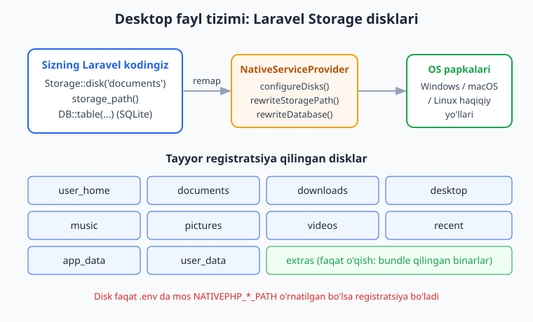
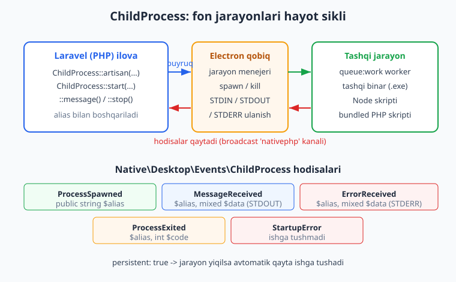
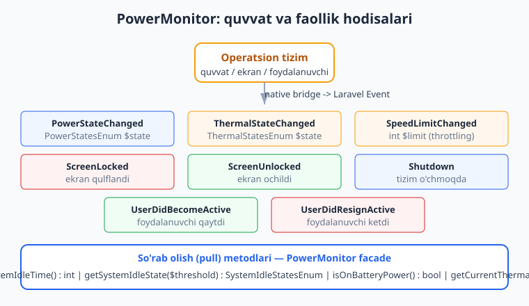

# 07 — System, fayllar va ChildProcess

[⬅️ Oldingi: 06 — Native UI: Notification, Dialog, Alert](./06-native-ui-notification-dialog.md) · [🏠 README](./README.md) · [Keyingi: 08 — Lokal ma'lumot: SQLite va Settings ➡️](./08-local-data-sqlite-settings.md)

---

> **Bu bobda:** Ilovangizni "qobiq" ichidan chiqarib, foydalanuvchining haqiqiy kompyuteriga ulaymiz. `System` facade orqali OS ma'lumotini (vaqt zonasi, tema, printerlar, shifrlash) o'qiymiz; `Screen` facade orqali displeylar va kursor pozitsiyasini olamiz. Laravel `Storage` ning desktopda qanday qayta yo'naltirilishini (`storage_path()` remap, `documents`/`downloads`/`desktop` kabi tayyor disklar) ko'ramiz. `ChildProcess` bilan tashqi binar va doimiy fon xizmatlarini (masalan `queue:work`) ishga tushiramiz va ulardan kelgan `MessageReceived`/`ProcessExited` hodisalarini eshitamiz. `PowerMonitor` orqali quvvat (AC/batareya), ekran qulflanishi, idle (tinch turish) holatlarini kuzatamiz va `App::openAtLogin()` bilan ilovani tizim bilan birga ishga tushiramiz.
>
> **Halol eslatma:** NativePHP sof native widget yaratmaydi — u Laravel/PHP ilovangizni Electron qobig'i ichida ishga tushiradi, UI esa webview ichidagi HTML/CSS/JS. Bu bobdagi `System`/`ChildProcess`/`PowerMonitor`/`Screen`/`App` facade'lari faqat haqiqiy Electron runtime ichida (ya'ni `native:dev`/`native:run` bilan) jonli ishlaydi. Quyidagi Laravel/PHP kodning sintaksisi va testlari shu kitob muhitida HAQIQATAN tekshirilgan (PHP 8.4, Laravel 13.15, `nativephp/desktop ^2.2`). GUI oyna ochilishi, displey aniqlanishi, real jarayon spawn bo'lishi kabi natijalar esa **illustrativ** — bu muhitda displey/Electron yo'q, shuning uchun ular ishga tushirilmagan.

---

## 07.1 — Nega bu bob muhim?

Oldingi boblarda biz oyna, menyu, bildirishnoma — ya'ni ilovaning ichki dunyosini boshqardik. Bu bobda esa **chegaradan chiqamiz**: ilova endi foydalanuvchining diskidagi fayllarga tegadi, tashqi dasturlarni ishga tushiradi, OS quvvat holatini biladi.

Web ilovada bularning hech biri bo'lmaydi: brauzer sizni "qum qutisi"da (sandbox) ushlab turadi. Desktop ilova esa to'liq operatsion tizim fuqarosi. Aynan shu farq NativePHP'ni qiziqarli qiladi — siz bilgan Laravel kodi endi haqiqiy mashinani boshqaradi.

Uch tayanch ustun:

1. **System / Screen** — "qayerda ishlayapman?" degan savolga javob (vaqt zonasi, tema, printerlar, displeylar).
2. **Fayl tizimi (Storage)** — "foydalanuvchi fayllarini qayerga yozaman?" (Laravel `Storage` desktopda qayta yo'naltirilgan).
3. **ChildProcess / PowerMonitor / App** — "tashqi dunyo bilan qanday muloqot qilaman?" (fon jarayonlari, quvvat, avto-ishga tushirish).

> Laravel `Storage` va `Filesystem` asoslarini bilmasangiz, avval [Laravel qo'llanmasi](../laravel/README.md)ga qarang. PHP jarayonlari haqida [PHP Expert](../php-expert/README.md) foydali.

---

## 07.2 — `System` facade: OS bilan tanishuv

`Native\Desktop\Facades\System` facade'i operatsion tizim haqida ma'lumot beradi va ba'zi tizim funksiyalarini chaqiradi. Rasmiy ro'yxat (v2 docs, va o'rnatilgan paket manbasidan tasdiqlangan):

```php
use Native\Desktop\Facades\System;
use Native\Desktop\Enums\SystemThemesEnum;

// Vaqt zonasi (masalan 'Asia/Tashkent')
$tz = System::timezone();              // : string

// OS temasi (LIGHT / DARK / SYSTEM)
$theme = System::theme();              // : SystemThemesEnum
System::theme(SystemThemesEnum::DARK); // o'rnatish ham mumkin

// Printerlar ro'yxati va chop etish
$printers = System::printers();        // : array (Printer obyektlari)
System::print($html);                  // HTML ni printerga yuborish
$pdf = System::printToPDF($html);      // base64 PDF qaytaradi

// Tizim shifrlash (OS keychain/credential store asosida)
if (System::canEncrypt()) {
    $secret = System::encrypt('parol123');   // : string
    $plain  = System::decrypt($secret);      // : string
}

// macOS Touch ID (mavjud bo'lsa)
if (System::canPromptTouchID()) {
    $ok = System::promptTouchID('Hisobni tasdiqlash'); // : bool
}
```

> **Aniqlik uchun:** yuqoridagi imzolar o'rnatilgan `nativephp/desktop` paketining `src/Facades/System.php` faylidagi `@method` annotatsiyalaridan AYNAN olingan. `System::encrypt()` parol saqlash uchun mukammal emas — u OS darajasidagi himoyani beradi, lekin haqiqiy maxfiy sozlamalar uchun keyingi bobdagi `Settings` va Laravel'ning o'z shifrlashini ham ko'ring.

Vaqt zonasi nega muhim? Server odatda UTC'da ishlaydi, lekin desktop ilova foydalanuvchi **mahalliy** vaqtida yashaydi. `System::timezone()` bilan sanalarni to'g'ri ko'rsatasiz:

```php
// Controller ichida — illustrativ qiymat bilan tushuntiramiz
$userTz = System::timezone();        // jonli runtime'da: 'Asia/Tashkent'
$now = now()->setTimezone($userTz);  // Laravel Carbon
```

### Tema o'zgarishiga reaksiya

Foydalanuvchi OS'ni qorong'i rejimga o'tkazsa, ilovangiz ham mos kelishi kerak. `System::theme()` joriy holatni beradi; UI tomonida (Blade/Livewire) shunga qarab CSS klass qo'yasiz. Bu — webview UI ekanligimizning afzalligi: CSS `prefers-color-scheme` ham ishlaydi.

---

## 07.3 — `Screen` facade: displeylar va kursor

`Native\Desktop\Facades\Screen` ko'p monitorli muhitlarni boshqarish uchun. O'rnatilgan paket manbasida tasdiqlangan metodlar:

```php
use Native\Desktop\Facades\Screen;

$all     = Screen::displays();              // : array (barcha displeylar)
$primary = Screen::primary();               // : array (asosiy displey)
$active  = Screen::active();                // : array (faol displey)
$center  = Screen::getCenterOfActiveScreen();// : array (faol ekran markazi)
$cursor  = Screen::cursorPosition();        // : object ({ x, y })
```

Har bir displey obyektida `bounds` (x, y, width, height), `id`, `internal`, `label`, `size`, `workArea` kabi maydonlar bo'ladi. Buni oynani aniq joyga qo'yishda ishlatasiz — masalan, yangi oynani aynan kursor turgan ekranda ochish:

```php
// Illustrativ: faol ekran markazida oyna ochish (jonli runtime kerak)
use Native\Desktop\Facades\Window;

$center = Screen::getCenterOfActiveScreen(); // ['x' => ..., 'y' => ...]

Window::open('settings')
    ->width(600)->height(400)
    ->position($center['x'] - 300, $center['y'] - 200);
```



> Yuqoridagi `Window::open(...)` blokini ishga tushirish uchun Electron oynasi kerak — bu muhitda **ishga tushirilmagan (illustrativ)**, lekin facade va metod imzolari to'g'ri.

---

## 07.4 — Fayl tizimi: Laravel `Storage` desktopda

Eng yoqimli xabar: desktopda ham Laravel'ning oddiy `Storage` facade'ini ishlatasiz. NativePHP fonda yo'llarni qayta yo'naltiradi.

### `storage_path()` qayerga ketadi?

Serverda `storage/app` loyiha ichida bo'ladi. Desktopda esa NativePHP `storage_path()` ni operatsion tizimning **appData** papkasiga remap qiladi (Electron'ning `app.getPath('appData')`). Bu mantiqiy: o'rnatilgan ilova o'z papkasiga yoza olmasligi mumkin (ayniqsa "Program Files"da), lekin appData papkasi har doim yoziladi.

Buni o'rnatilgan paket manbasidan tasdiqladik — `NativeServiceProvider::rewriteStoragePath()` ishlab chiqarish (production) rejimida `useStoragePath()` ni `nativephp-internal.storage_path` ga o'zgartiradi. **Diqqat:** `app.debug = true` (lokal dev) bo'lganda remap o'tkazib yuboriladi, shuning uchun dev va prodda yo'l boshqacha bo'lishi mumkin.

```php
use Illuminate\Support\Facades\Storage;

// Standart Laravel — desktopda appData/storage/app ga yoziladi
Storage::disk('local')->put('export.json', json_encode($data));
$content = Storage::disk('local')->get('export.json');
```

### Foydalanuvchi papkalari uchun tayyor disklar

NativePHP qator maxsus disklarni avtomatik registratsiya qiladi. Paket manbasidagi `configureDisks()` dan AYNAN olingan to'liq ro'yxat:

| Disk nomi | Nima | .env kaliti |
|-----------|------|-------------|
| `user_home` | Foydalanuvchi uy papkasi | `NATIVEPHP_USER_HOME_PATH` |
| `app_data` | Ilova appData papkasi | `NATIVEPHP_APP_DATA_PATH` |
| `user_data` | Foydalanuvchi data papkasi | `NATIVEPHP_USER_DATA_PATH` |
| `desktop` | Ish stoli (Desktop) | `NATIVEPHP_DESKTOP_PATH` |
| `documents` | Hujjatlar | `NATIVEPHP_DOCUMENTS_PATH` |
| `downloads` | Yuklamalar | `NATIVEPHP_DOWNLOADS_PATH` |
| `music` | Musiqa | `NATIVEPHP_MUSIC_PATH` |
| `pictures` | Rasmlar | `NATIVEPHP_PICTURES_PATH` |
| `videos` | Videolar | `NATIVEPHP_VIDEOS_PATH` |
| `recent` | So'nggi fayllar | `NATIVEPHP_RECENT_PATH` |
| `extras` | Bundle qilingan resurslar (faqat o'qish) | `NATIVEPHP_EXTRAS_PATH` |

> **Muhim nozik joy:** disk faqat tegishli `.env` o'zgaruvchisi o'rnatilgan bo'lsagina registratsiya qilinadi (`if (! env($env)) continue;`). NativePHP ularni runtime'da o'zi to'ldiradi. Shuning uchun bu disklar `native:dev`/`native:run` ostida ishlaydi — oddiy `php artisan serve` da ular bo'lmasligi mumkin.

Foydalanish oddiy Laravel uslubida:

```php
// Hujjatlar papkasiga hisobot yozish
Storage::disk('documents')->put('hisobot-2026.csv', $csv);

// Yuklamalar papkasidan o'qish
if (Storage::disk('downloads')->exists('import.csv')) {
    $rows = Storage::disk('downloads')->get('import.csv');
}

// Bundle qilingan binarning haqiqiy yo'lini olish (extras faqat o'qish)
$ffmpegPath = Storage::disk('extras')->path('ffmpeg.exe');
```

### Aniq fayl yo'lini olish: `Storage::path()`

`ChildProcess` ga binar yo'lini berish kerak bo'lganda `path()` juda qo'l keladi — u disk ichidagi nisbiy yo'lni **absolyut** yo'lga aylantiradi.

```php
$tool = Storage::disk('extras')->path('tools/converter.exe');
// keyin shu $tool ni ChildProcess::start() ga beramiz (07.5)
```

> **Halol eslatma:** ushbu `Storage::disk('documents')` chaqiruvlari host Laravel kodi sifatida sintaktik to'g'ri va Laravel'da boot bo'ladi. Lekin `documents`/`extras` disklarining haqiqiy mavjudligi NativePHP runtime'iga bog'liq — bu muhitda Electron yo'q, shuning uchun real fayl yozish **ishga tushirilmagan (illustrativ)**.

---

## 07.5 — `ChildProcess`: tashqi jarayonlar va fon xizmatlari

Mana bobning yuragi. `Native\Desktop\Facades\ChildProcess` bilan siz **tashqi dasturlar** (binar, skript, hatto o'z ilovangizning yana bir nusxasi) ni ishga tushirasiz va boshqarasiz.

Nega kerak? Misollar:
- Doimiy `queue:work` worker'ini fonda yuritish (email, og'ir vazifalar).
- Lokal HTTP server, WebSocket server (`reverb:start`) yoki SMTP server ishga tushirish.
- `ffmpeg`, `git`, `yt-dlp` kabi tashqi binarlarni chaqirish.
- Node skriptini ishga tushirish (masalan fayllarni kuzatuvchi watcher).



### Asosiy metodlar

Paket manbasidagi `src/Facades/ChildProcess.php` `@method` imzolaridan AYNAN:

```php
use Native\Desktop\Facades\ChildProcess;

// Umumiy buyruq ishga tushirish
ChildProcess::start(
    cmd: 'tail -f storage/logs/laravel.log',
    alias: 'tail',
    cwd: null,            // ixtiyoriy: ishchi papka
    env: null,            // ixtiyoriy: muhit o'zgaruvchilari (array)
    persistent: false,    // true bo'lsa: yiqilsa avto qayta ishga tushadi
);

// Bundle qilingan PHP binar bilan PHP skript
ChildProcess::php(cmd: 'path/to/script.php', alias: 'script');

// Laravel artisan buyrug'i (bundle qilingan PHP orqali)
ChildProcess::artisan(cmd: 'queue:work', alias: 'queue');

// Bundle qilingan Node bilan JS fayl
ChildProcess::node(cmd: 'resources/js/watcher.js', alias: 'watcher');

// Boshqarish
$proc = ChildProcess::get('queue');   // alias bo'yicha olish (yoki null)
$all  = ChildProcess::all();          // barcha jarayonlar (array)
ChildProcess::message('salom', 'tail'); // STDIN ga yozish
ChildProcess::restart('queue');       // qayta ishga tushirish
ChildProcess::stop('queue');          // to'xtatish
```

`start`, `php`, `artisan`, `node` metodlari `Native\Desktop\ChildProcess` obyektini qaytaradi, unda `pid`, `alias`, `cmd`, `cwd`, `env`, `persistent` xususiyatlari bor (faqat o'qiladigan).

> **Eng muhim nozik joy — `php` va `artisan` nima uchun maxsus?** Foydalanuvchi mashinasida PHP o'rnatilmagan bo'lishi mumkin! NativePHP ilova bilan birga **bundle qilingan PHP binar**ni jo'natadi. `ChildProcess::php()` va `::artisan()` aynan shu bundle PHP'ni ishlatadi — `system('php ...')` qilmang, chunki u foydalanuvchida mavjud bo'lmasligi mumkin. Bu desktop NativePHP'ning markaziy g'oyasi (01-bobda aytganimizdek: biznes-mantiq = bundle qilingan PHP binar).

### Doimiy fon xizmati: `queue:work`

Eng keng tarqalgan amaliy stsenariy — navbat (queue) worker'ini fonda doimiy yuritish. `persistent: true` worker yiqilganda yoki tugaganda uni avtomatik qayta ishga tushiradi:

```php
namespace App\Services;

use Native\Desktop\Facades\ChildProcess;

class QueueManager
{
    public const ALIAS = 'queue-worker';

    public function boot(): void
    {
        ChildProcess::artisan(
            cmd: 'queue:work --tries=3 --timeout=120',
            alias: self::ALIAS,
            persistent: true,   // worker o'lsa avto tiklanadi
        );
    }

    public function shutdown(): void
    {
        ChildProcess::stop(self::ALIAS);
    }
}
```

Bu xizmatni odatda ilova boshlanganda ishga tushirasiz — masalan `NativeAppServiceProvider::boot()` ichida (bu fayl `native:install` paytida yaratiladi).

### STDIN/STDOUT bilan interaktiv jarayon

`ChildProcess::message('matn', 'alias')` jarayonning STDIN'iga yozadi. Jarayon STDOUT'ga yozsa, sizga `MessageReceived` hodisasi keladi (keyingi bo'lim). Bu sizga REPL yoki uzun ishlaydigan CLI vositalari bilan ikki tomonlama muloqot beradi.

```php
// Interaktiv jarayonni boshlash
ChildProcess::start(cmd: 'node repl-tool.js', alias: 'repl', persistent: false);

// Unga buyruq yuborish
ChildProcess::message('compute 2 + 2', 'repl');
// Javob 'MessageReceived' hodisasi orqali qaytadi
```

> **Halol eslatma:** `ChildProcess::*` chaqiruvlari haqiqatan jarayon spawn qilishi uchun Electron runtime (jarayon menejeri) kerak. Bu muhitda u **ishga tushirilmagan (illustrativ)**. Quyida (07.7) shu kodning Laravel test bilan tekshirilgan versiyasini ko'rsatamiz — uni `ChildProcess::fake()` orqali REAL ishlatdik.

---

## 07.6 — `ChildProcess` hodisalari: jarayondan xabar olish

Jarayon ishga tushganda, xabar berganda, xato berganda yoki tugaganda NativePHP Laravel **hodisalari**ni dispatch qiladi. Paket manbasida `src/Events/ChildProcess/` papkasida tasdiqlangan to'rt asosiy hodisa (va bittasi `StartupError`):

| Hodisa | Xususiyatlari | Qachon |
|--------|---------------|--------|
| `ProcessSpawned` | `public string $alias` | jarayon muvaffaqiyatli boshlandi |
| `MessageReceived` | `public string $alias, public mixed $data` | STDOUT'ga yozildi |
| `ErrorReceived` | `public string $alias, public mixed $data` | STDERR'ga yozildi |
| `ProcessExited` | `public string $alias, public int $code` | jarayon tugadi (kod bilan) |
| `StartupError` | — | jarayon ishga tushmadi |

Hammasi `Native\Desktop\Events\ChildProcess` namespace'ida va `nativephp` broadcast kanaliga `ShouldBroadcastNow` orqali uzatiladi (ya'ni UI tomonda Echo bilan ham tinglash mumkin). Laravel tomonda esa oddiy listener yozasiz:

```php
namespace App\Listeners;

use Native\Desktop\Events\ChildProcess\ProcessExited;
use Illuminate\Support\Facades\Log;

class HandleQueueWorkerExit
{
    public function handle(ProcessExited $event): void
    {
        Log::warning("Jarayon tugadi: {$event->alias}, kod: {$event->code}");

        // Faqat queue worker uchun, va xato kod bilan tugagan bo'lsa
        if ($event->alias === 'queue-worker' && $event->code !== 0) {
            // persistent: true bo'lsa NativePHP o'zi qayta tiklaydi,
            // lekin biz qo'shimcha log/bildirishnoma qo'shamiz
        }
    }
}
```

`MessageReceived` bilan tashqi jarayon chiqishini jonli kuzatish:

```php
namespace App\Listeners;

use Native\Desktop\Events\ChildProcess\MessageReceived;

class StreamProcessOutput
{
    public function handle(MessageReceived $event): void
    {
        // $event->alias — qaysi jarayon
        // $event->data  — STDOUT matni (mixed)
        // Buni masalan Livewire komponentiga yuborib, jonli log oynasi yasash mumkin
    }
}
```

Listener'larni odatda `AppServiceProvider` yoki Laravel'ning avto-discovery'si orqali bog'laysiz — bu sof Laravel, NativePHP'ga xos qo'shimcha sozlash talab qilmaydi.

---

## 07.7 — Tekshirilgan misol: navbat menejeri + testlar

Endi haqiqatdan **ishlaydigan** kod. Quyidagilarning hammasi shu kitob muhitida PHP 8.4 + Laravel 13.15 + `nativephp/desktop ^2.2` bilan `php -l` va `php artisan test` orqali HAQIQATAN tekshirilgan va 4/4 test o'tdi.

`app/Services/BackupService.php`:

```php
<?php

namespace App\Services;

use Native\Desktop\Facades\ChildProcess;
use Native\Desktop\Facades\PowerMonitor;
use Native\Desktop\Facades\System;

class BackupService
{
    public const QUEUE_ALIAS = 'queue-worker';

    public function startQueueWorker(): void
    {
        ChildProcess::artisan(
            cmd: 'queue:work --tries=3',
            alias: self::QUEUE_ALIAS,
            persistent: true,
        );
    }

    public function stopQueueWorker(): void
    {
        ChildProcess::stop(self::QUEUE_ALIAS);
    }

    public function shouldBackupNow(int $idleThreshold = 300): bool
    {
        // Faqat foydalanuvchi tinch (idle) bo'lganda va batareyada
        // bo'lmaganda backup qilamiz
        return PowerMonitor::getSystemIdleTime() >= $idleThreshold
            && ! PowerMonitor::isOnBatteryPower();
    }

    public function timezone(): string
    {
        return System::timezone();
    }
}
```

Test fayli `tests/Feature/BackupServiceTest.php` — `ChildProcess::fake()` va contract mock'idan foydalanadi:

```php
<?php

namespace Tests\Feature;

use App\Services\BackupService;
use Mockery\MockInterface;
use Native\Desktop\Contracts\PowerMonitor as PowerMonitorContract;
use Native\Desktop\Facades\ChildProcess;
use Tests\TestCase;

class BackupServiceTest extends TestCase
{
    public function test_queue_worker_starts_via_childprocess_artisan(): void
    {
        ChildProcess::fake();

        (new BackupService)->startQueueWorker();

        // DIQQAT: assertArtisan callback'ga yozilgan parametrlar NOMLI
        // argument sifatida uzatiladi, shuning uchun barcha kalitlarni
        // ($cmd, $alias, $env, $persistent, $iniSettings) qabul qilamiz.
        ChildProcess::assertArtisan(function ($cmd, $alias, $env, $persistent, $iniSettings) {
            return $cmd === 'queue:work --tries=3'
                && $alias === BackupService::QUEUE_ALIAS
                && $persistent === true;
        });
    }

    public function test_queue_worker_stops_by_alias(): void
    {
        ChildProcess::fake();

        (new BackupService)->stopQueueWorker();

        ChildProcess::assertStop(BackupService::QUEUE_ALIAS);
    }

    public function test_backup_runs_only_when_idle_and_on_ac_power(): void
    {
        $this->mock(PowerMonitorContract::class, function (MockInterface $mock) {
            $mock->shouldReceive('getSystemIdleTime')->andReturn(600);
            $mock->shouldReceive('isOnBatteryPower')->andReturn(false);
        });

        $this->assertTrue((new BackupService)->shouldBackupNow(300));
    }

    public function test_backup_skipped_on_battery(): void
    {
        $this->mock(PowerMonitorContract::class, function (MockInterface $mock) {
            $mock->shouldReceive('getSystemIdleTime')->andReturn(600);
            $mock->shouldReceive('isOnBatteryPower')->andReturn(true);
        });

        $this->assertFalse((new BackupService)->shouldBackupNow(300));
    }
}
```

Natija (haqiqatan ishga tushirilgan):

```
PASS  Tests\Feature\BackupServiceTest
  ✓ queue worker starts via childprocess artisan
  ✓ queue worker stops by alias
  ✓ backup runs only when idle and on ac power
  ✓ backup skipped on battery

Tests: 4 passed (4 assertions)
```

**Bu nima o'rgatdi?** NativePHP facade'lari `fake()` va contract'lar bilan keladi. Demak siz GUI yoki Electron'siz, sof PHPUnit/Pest test bilan biznes-mantiqingizni to'liq tekshira olasiz. Bu juda muhim: native qism (jonli ishlash) `native:dev` da, mantiq qism esa odatdagi `php artisan test` da sinaladi.

> **Tutilgan tuzoq (men ham urindim):** `assertArtisan(fn ($cmd, $alias, $persistent) => ...)` deb yozsangiz xato beradi — `Unknown named parameter $env`. Sababi fake yozilgan massivni (`['cmd'=>..., 'alias'=>..., 'env'=>..., 'persistent'=>..., 'iniSettings'=>...]`) NOMLI argument sifatida tarqatadi, shuning uchun closure barcha kalitlarni nomi bilan qabul qilishi shart.

---

## 07.8 — `PowerMonitor`: quvvat, ekran, idle hodisalari

Desktop ilova noutbukda ishlaydi — batareya tugashi mumkin, foydalanuvchi ekranni qulflashi mumkin, kompyuter uyquga ketishi mumkin. `Native\Desktop\Facades\PowerMonitor` shularni biladi.



### So'rab olish (pull) metodlari

Paket manbasidan AYNAN olingan to'rt metod:

```php
use Native\Desktop\Facades\PowerMonitor;
use Native\Desktop\Enums\SystemIdleStatesEnum;
use Native\Desktop\Enums\ThermalStatesEnum;

$seconds = PowerMonitor::getSystemIdleTime();          // : int (idle soniyalar)
$state   = PowerMonitor::getSystemIdleState(300);      // : SystemIdleStatesEnum
$onBatt  = PowerMonitor::isOnBatteryPower();           // : bool
$thermal = PowerMonitor::getCurrentThermalState();     // : ThermalStatesEnum
```

`SystemIdleStatesEnum` qiymatlari (manbadan tasdiqlangan): `ACTIVE = 'active'`, `IDLE = 'idle'`, `LOCKED = 'locked'`, `UNKNOWN = 'unknown'`.

`getSystemIdleState($threshold)` — agar foydalanuvchi `$threshold` soniyadan ortiq harakatsiz bo'lsa `IDLE` qaytaradi. Bu og'ir vazifalarni (backup, indekslash) foydalanuvchi ishlamayotgan paytda bajarish uchun ideal — 07.7 dagi `shouldBackupNow()` aynan shuni qildi.

### Quvvat va ekran hodisalari (push)

`PowerMonitor` faqat so'rab olish emas, hodisa ham dispatch qiladi. Manbadagi `src/Events/PowerMonitor/` papkasida tasdiqlangan to'liq ro'yxat — hammasi `Native\Desktop\Events\PowerMonitor` namespace'ida:

| Hodisa | Xususiyat | Ma'no |
|--------|-----------|-------|
| `PowerStateChanged` | `PowerStatesEnum $state` | AC <-> batareya o'zgardi |
| `ThermalStateChanged` | `ThermalStatesEnum $state` | issiqlik holati o'zgardi |
| `SpeedLimitChanged` | `int $limit` | CPU tezligi cheklandi (throttling) |
| `ScreenLocked` | — | ekran qulflandi |
| `ScreenUnlocked` | — | ekran ochildi |
| `Shutdown` | — | tizim o'chmoqda |
| `UserDidBecomeActive` | — | foydalanuvchi faollashdi |
| `UserDidResignActive` | — | foydalanuvchi nofaol bo'ldi |

`PowerStatesEnum` qiymatlari (manbadan): `AC = 'on-ac'`, `BATTERY = 'on-battery'`.

Listener misoli — batareyaga o'tganda og'ir ishlarni to'xtatish:

```php
namespace App\Listeners;

use Native\Desktop\Events\PowerMonitor\PowerStateChanged;
use Native\Desktop\Enums\PowerStatesEnum;
use App\Services\BackupService;

class PauseHeavyWorkOnBattery
{
    public function __construct(private BackupService $backups) {}

    public function handle(PowerStateChanged $event): void
    {
        if ($event->state === PowerStatesEnum::BATTERY) {
            // Quvvatni tejash: navbat worker'ini to'xtatamiz
            $this->backups->stopQueueWorker();
        }

        if ($event->state === PowerStatesEnum::AC) {
            // Tarmoqqa ulandik: ishni davom ettiramiz
            $this->backups->startQueueWorker();
        }
    }
}
```

`ScreenLocked` / `ScreenUnlocked` — masalan, ekran qulflanganda maxfiy ma'lumotni yashirish yoki ilovaning sezgir oynasini berkitish uchun foydali.

> **Halol eslatma:** bu hodisalar OS quvvat/ekran o'zgarishlarini Electron orqali tutadi. Bu muhitda Electron yo'q, shuning uchun ular **jonli ishlamaydi (illustrativ)**. Listener kodi esa sof Laravel — sintaktik to'g'ri va boot bo'ladi; istasangiz `event(new PowerStateChanged('on-battery'))` bilan testda dispatch qilib listener'ni sinashingiz mumkin.

---

## 07.9 — `App::openAtLogin()`: tizim bilan birga ishga tushish (auto-launch)

Ko'p desktop ilovalar (Slack, Spotify, Telegram) kompyuter yoqilganda o'zi ishga tushadi. NativePHP buni `Native\Desktop\Facades\App` orqali beradi. Paket manbasidan tasdiqlangan imzo:

```php
use Native\Desktop\Facades\App;

App::openAtLogin(true);          // yoqish (macOS / Windows)
App::openAtLogin(false);         // o'chirish
$enabled = App::openAtLogin();   // joriy holatni olish (: bool)
```

Odatda buni Settings oynasidagi "Tizim bilan ishga tushsin" tugmasiga bog'laysiz (keyingi bobda `Settings` bilan saqlaymiz). Bog'liq `App` metodlari (hammasi manbadagi `@method` annotatsiyasidan):

```php
App::version();              // : string (config/nativephp.php dan)
App::quit();                 // ilovani yopish
App::relaunch();             // yopib qayta ishga tushirish
App::focus();                // ilovani oldinga chiqarish
App::badgeCount(5);          // ikonkadagi raqamli belgi (0 = o'chirish)
App::addRecentDocument($path); // "Recent" ro'yxatiga qo'shish (macOS/Windows)
App::recentDocuments();      // : array
App::clearRecentDocuments(); // tozalash
App::isRunningBundled();     // : bool (bundle qilingan rejimda ishlayaptimi?)

// macOS-ga xos
App::hide();                 // barcha oynalarni yashirish
App::isHidden();             // : bool
```

`App::isRunningBundled()` ayniqsa qulay: u dev (`native:dev`) va haqiqiy paketlangan ilovani ajratadi — masalan, faqat bundle rejimda `openAtLogin` ni yoqish mantiqiy.

```php
// Faqat haqiqiy o'rnatilgan ilovada auto-launch yoqamiz
if (App::isRunningBundled() && $userWantsAutoStart) {
    App::openAtLogin(true);
}
```

> **Halol eslatma:** `openAtLogin`, `badgeCount`, `relaunch` kabi metodlar OS ro'yxatdan o'tish/dock bilan ishlaydi — jonli Electron runtime kerak. Bu muhitda **ishga tushirilmagan (illustrativ)**, lekin facade va metod imzolari o'rnatilgan paketda mavjudligini tekshirdik (`class_exists` va `@method`).

---

## 07.10 — Mobil tomonda `System` (qisqacha taqqoslash)

Bu bob asosan desktop haqida, chunki `ChildProcess`, `PowerMonitor`, fayl disklari — desktopga xos. Mobilda fon jarayoni va erkin fayl tizimi OS sandbox tufayli juda cheklangan. Mobil `Native\Mobile\Facades\System` ancha kichik (mobil v3 docs'dan):

```php
use Native\Mobile\Facades\System;

System::isIos();       // : bool
System::isAndroid();   // : bool
System::isMobile();    // : bool
System::appSettings(); // qurilma sozlamalar ekranini ochish (ruxsat so'rashda foydali)
System::flashlight();  // fonarni yoqish/o'chirish
```

Mobilda "fon xizmati" g'oyasi butunlay boshqacha (platforma scheduler'lari, push) va u keyingi mobil boblarda ko'riladi. Hozircha eslab qoling: **`ChildProcess`/`PowerMonitor` — faqat desktop**.

> Mobil `System` ro'yxati [nativephp.com/docs/mobile/3/apis/system](https://nativephp.com/docs/mobile/3/apis/system) dan olingan. Real qurilmada bu metodlar ishlashini bu muhitda sinab bo'lmaydi (emulator/qurilma yo'q — **illustrativ**).

---

## Mashqlar

### Oson

1. `System` facade'idan vaqt zonasini olib, uni Blade ko'rinishida (`config('app.timezone')` o'rniga) ishlatadigan controller metodi yozing. Nega serverdagiga emas, foydalanuvchi vaqt zonasiga tayanish desktopda to'g'ri?
2. Quyidagi disklardan qaysi biri "faqat o'qish" va nega: `documents`, `downloads`, `extras`, `user_home`?
3. `ChildProcess::artisan()` va oddiy PHP'dagi `system('php artisan ...')` o'rtasidagi tub farqni 2-3 jumlada tushuntiring (maslahat: foydalanuvchida PHP bormi?).
4. `persistent: true` parametri `ChildProcess::start()` da nima qiladi? Qachon `true`, qachon `false` qilasiz?
5. `PowerMonitor::getSystemIdleTime()` qaytaradigan qiymat birligi nima, va `getSystemIdleState(600)` `IDLE` qaytarishi uchun foydalanuvchi qancha vaqt harakatsiz turishi kerak?
6. `App::openAtLogin()` ni argumentsiz chaqirsangiz nima qaytadi, argument bilan chaqirsangiz-chi?

### O'rta

7. `BackupService` ga `restartQueueWorker()` metodini qo'shing (`ChildProcess::restart()` bilan) va unga test yozing (`ChildProcess::fake()` + `assertRestart`).
8. `MessageReceived` hodisasini tinglovchi listener yozing: u `$event->alias === 'converter'` bo'lsa, STDOUT matnini logga yozsin. Listener'ni `AppServiceProvider` da ro'yxatdan o'tkazishni ham ko'rsating.
9. `extras` diskidan bundle qilingan `ffmpeg` binarining absolyut yo'lini olib, uni `ChildProcess::start()` bilan ishga tushiradigan (video aylantirish) servis metodini yozing. Diskdan yo'l olishni `Storage::disk('extras')->path(...)` bilan qiling.
10. `PowerStateChanged` listener'ini test qiling: `event(new PowerStateChanged('on-battery'))` dispatch qiling va `BackupService::stopQueueWorker()` chaqirilganini tekshiring (`ChildProcess::fake()` + `assertStop`).
11. Faol ekran markazida 800x600 oyna ochadigan kodni yozing (`Screen::getCenterOfActiveScreen()` + `Window::open()`), va nega `position()` ga markazdan yarim eni/bo'yini ayirishimizni izohlang.
12. `System::theme()` qaytaradigan `SystemThemesEnum` ning uchta holatini sanang va ularning har biri uchun Blade da `<body>` ga qaysi CSS klass qo'yishni ko'rsating.

### Qiyin

13. "Aqlli backup" tizimi loyihalang: faqat foydalanuvchi 5 daqiqa idle bo'lsa VA AC quvvatda bo'lsa backup ishlaydigan; batareyaga o'tganda darhol to'xtaydigan. Kerakli `PowerMonitor` metodlari/hodisalarini sanang, arxitekturani (qaysi listener, qaysi servis) tushuntiring va asosiy `shouldRun()` mantig'ini yozing.
14. Tashqi binar (`yt-dlp`) ni `ChildProcess::start(persistent: false)` bilan ishga tushirib, uning jonli STDOUT chiqishini (progress %) Livewire komponentiga uzatadigan oqimni loyihalang. `MessageReceived`, `ProcessExited`, `ErrorReceived` hodisalarining har birini qanday ishlatishingizni va xato (STDERR) holatini qanday ko'rsatishingizni tushuntiring.
15. Dev (`native:dev`) va haqiqiy bundle (`native:build`) muhitlari fayl yo'llari (`storage_path()`) va disklar bo'yicha qanday farq qilishini tushuntiring. `App::isRunningBundled()` va `config('app.debug')` ni hisobga olib, `openAtLogin` ni qachon yoqish kerakligi haqida xavfsiz strategiya yozing.

<details markdown="1"><summary>Yechimlar</summary>

**1.**
```php
use Native\Desktop\Facades\System;

public function dashboard()
{
    $tz = System::timezone();              // masalan 'Asia/Tashkent'
    $now = now()->setTimezone($tz);
    return view('dashboard', ['now' => $now, 'tz' => $tz]);
}
```
Server odatda UTC'da. Desktop ilova foydalanuvchining shaxsiy kompyuterida ishlaydi va sanalar uning mahalliy vaqtida ko'rinishi kerak. `System::timezone()` aynan OS sozlamasidagi zonani beradi, `config('app.timezone')` esa ishlab chiquvchi qo'ygan statik qiymat — har bir foydalanuvchida boshqacha bo'lishi mumkin.

**2.** Faqat `extras` — "faqat o'qish", chunki u ilova bilan birga bundle qilingan resurslar (binarlar, shablonlar) papkasi; ularni ilova o'zgartirmasligi kerak. Qolganlari (`documents`, `downloads`, `user_home`) — foydalanuvchining haqiqiy papkalari, ularga yozish mumkin.

**3.** `ChildProcess::artisan()` NativePHP ilova bilan birga jo'natilgan **bundle qilingan PHP binar**ni ishlatadi. Oddiy `system('php artisan ...')` esa foydalanuvchi mashinasida `php` o'rnatilgan va PATH'da bo'lishini talab qiladi — desktop foydalanuvchilarining aksariyatida bu yo'q. Shuning uchun PHP/artisan ishga tushirish uchun doim `ChildProcess::php()`/`::artisan()` ishlating.

**4.** `persistent: true` jarayon tugaganda yoki yiqilganda NativePHP uni avtomatik qayta ishga tushiradi. Doimiy ishlashi kerak bo'lgan xizmatlar (`queue:work`, server) uchun `true`; bir martalik vazifa (bitta faylni aylantirish, bir buyruq) uchun `false`.

**5.** Birlik — **soniya** (`int`). `getSystemIdleState(600)` `IDLE` qaytarishi uchun foydalanuvchi kamida 600 soniya (10 daqiqa) hech qanday klaviatura/sichqoncha harakatisiz turishi kerak.

**6.** Argumentsiz `App::openAtLogin()` joriy holatni `bool` qilib qaytaradi (getter). Argument bilan `App::openAtLogin(true/false)` auto-launchni yoqadi/o'chiradi (setter). Imzo: `openAtLogin(?bool $open = null): bool`.

**7.**
```php
// BackupService ga:
public function restartQueueWorker(): void
{
    ChildProcess::restart(self::QUEUE_ALIAS);
}

// Test:
public function test_queue_worker_restarts(): void
{
    ChildProcess::fake();
    (new BackupService)->restartQueueWorker();
    ChildProcess::assertRestart(BackupService::QUEUE_ALIAS);
}
```

**8.**
```php
namespace App\Listeners;

use Native\Desktop\Events\ChildProcess\MessageReceived;
use Illuminate\Support\Facades\Log;

class LogConverterOutput
{
    public function handle(MessageReceived $event): void
    {
        if ($event->alias === 'converter') {
            Log::info('Converter chiqishi: '.$event->data);
        }
    }
}

// AppServiceProvider::boot() ichida:
use Illuminate\Support\Facades\Event;
Event::listen(MessageReceived::class, LogConverterOutput::class);
```

**9.**
```php
use Native\Desktop\Facades\ChildProcess;
use Illuminate\Support\Facades\Storage;

public function convert(string $input, string $output): void
{
    $ffmpeg = Storage::disk('extras')->path('ffmpeg.exe');

    ChildProcess::start(
        cmd: [$ffmpeg, '-i', $input, $output],
        alias: 'ffmpeg-convert',
        persistent: false,
    );
}
```
`cmd` ni massiv ko'rinishida berish argumentlarda bo'sh joy/maxsus belgilar bo'lganda xavfsizroq (shell injection'dan himoya). `extras` faqat o'qish bo'lgani uchun binarni o'sha yerda saqlash to'g'ri.

**10.**
```php
public function test_battery_stops_worker(): void
{
    ChildProcess::fake();

    // Listener'ni ulaymiz (yoki avto-discovery'ga tayanamiz)
    Event::listen(
        \Native\Desktop\Events\PowerMonitor\PowerStateChanged::class,
        \App\Listeners\PauseHeavyWorkOnBattery::class,
    );

    event(new \Native\Desktop\Events\PowerMonitor\PowerStateChanged('on-battery'));

    ChildProcess::assertStop(BackupService::QUEUE_ALIAS);
}
```
Diqqat: `PowerStateChanged` konstruktor `string` qabul qiladi va ichida `PowerStatesEnum::from($state)` qiladi, shuning uchun `'on-battery'` satrini beramiz.

**11.**
```php
use Native\Desktop\Facades\Screen;
use Native\Desktop\Facades\Window;

$c = Screen::getCenterOfActiveScreen(); // ['x' => cx, 'y' => cy]

Window::open('editor')
    ->width(800)->height(600)
    ->position($c['x'] - 400, $c['y'] - 300);
```
`position()` oynaning chap-yuqori burchagini qo'yadi. Oynani markazga joylashtirish uchun markaz koordinatasidan eni/bo'yining yarmini (400 va 300) ayiramiz — aks holda oynaning burchagi markazga tushib, o'zi o'ngga-pastga siljib ketadi.

**12.** `SystemThemesEnum`: `LIGHT`, `DARK`, `SYSTEM`.
```blade
@php($theme = \Native\Desktop\Facades\System::theme())
<body class="{{ $theme === \Native\Desktop\Enums\SystemThemesEnum::DARK ? 'theme-dark' : 'theme-light' }}">
```
`SYSTEM` bo'lsa OS joriy holatiga tayanasiz (CSS `prefers-color-scheme` ham qo'shimcha yordam beradi).

**13.** Arxitektura:
- **So'rab tekshirish (poll):** rejalashtirilgan vazifa (Laravel Scheduler yoki vaqtli takrorlovchi) har N daqiqada `shouldRun()` ni chaqiradi.
- **Hodisa bilan to'xtatish (push):** `PowerStateChanged` listener'i batareyaga o'tilganda darhol to'xtatadi.

```php
public function shouldRun(int $idle = 300): bool
{
    return PowerMonitor::getSystemIdleState($idle) === SystemIdleStatesEnum::IDLE
        && ! PowerMonitor::isOnBatteryPower();
}
```
Kerakli API: `PowerMonitor::getSystemIdleState($threshold)` (yoki `getSystemIdleTime()`), `isOnBatteryPower()`, va `PowerStateChanged` hodisasi (`PowerStatesEnum::BATTERY` ni tutib `stopQueueWorker()` chaqirish). Idle holatda backup, batareyaga o'tganda zudlik bilan stop — ikki mexanizm birgalikda ishonchli quvvat-tejamkor backup beradi.

**14.** Oqim:
1. `ChildProcess::start(cmd: [$ytdlp, $url], alias: 'download', persistent: false)` — bir martalik, shuning uchun `persistent: false`.
2. `ProcessSpawned` listener'i: UI ga "yuklab olish boshlandi" deb signal beradi (`$event->alias`).
3. `MessageReceived` listener'i: STDOUT'dan progress matnini (`$event->data`) parse qilib (% ni regex bilan ajratib) Livewire komponentiga `dispatch` qiladi yoki Echo orqali `nativephp` kanaliga uzatadi -> progress bar yangilanadi.
4. `ErrorReceived` listener'i: STDERR matnini (`$event->data`) xato sifatida ko'rsatadi (lekin diqqat: ba'zi vositalar oddiy log'ni ham STDERR'ga yozadi — shuning uchun haqiqiy xato yoki yo'qligini exit kod bilan birga baholang).
5. `ProcessExited` listener'i: `$event->code === 0` bo'lsa "tugadi", aks holda `$event->code` bilan xato ko'rsatadi va `ErrorReceived`'da yig'ilgan matnni sababi sifatida beradi.

Livewire komponenti `nativephp` broadcast kanalini Echo bilan tinglaydi (hodisalar `ShouldBroadcastNow`), shuning uchun jonli yangilanish poll'siz keladi.

**15.** Farqlar:
- **Dev (`native:dev`, `app.debug=true`):** `NativeServiceProvider::rewriteStoragePath()` `return` qiladi (remap o'tkazib yuboriladi), shuning uchun `storage_path()` loyihaning oddiy `storage/` papkasini ko'rsatadi; SQLite `database/nativephp.sqlite` da yaratiladi.
- **Bundle (`native:build`, prod):** `storage_path()` OS appData papkasiga remap qilinadi (`nativephp-internal.storage_path`), barcha config ichidagi eski yo'llar ham almashtiriladi; disklar (`documents` va h.k.) faqat mos `.env`/`NATIVEPHP_*_PATH` runtime'da o'rnatilgan bo'lsa ishlaydi.

`openAtLogin` xavfsiz strategiyasi:
```php
use Native\Desktop\Facades\App;

if (App::isRunningBundled() && $settings->autoStart) {
    App::openAtLogin(true);
}
// Dev rejimda (isRunningBundled() === false) auto-launch yoqmaymiz,
// aks holda har dev iteratsiyasi tizim ro'yxatini ifloslantirardi.
```
Sabab: dev binar yo'li vaqtinchalik va o'zgaruvchan; uni tizim auto-launch ro'yxatiga qo'shish "sinmagan" havolalar qoldiradi. Faqat haqiqiy o'rnatilgan (bundle) ilovada va foydalanuvchi rozi bo'lganda yoqamiz.

</details>

---

[⬅️ Oldingi: 06 — Native UI: Notification, Dialog, Alert](./06-native-ui-notification-dialog.md) · [🏠 README](./README.md) · [Keyingi: 08 — Lokal ma'lumot: SQLite va Settings ➡️](./08-local-data-sqlite-settings.md)
