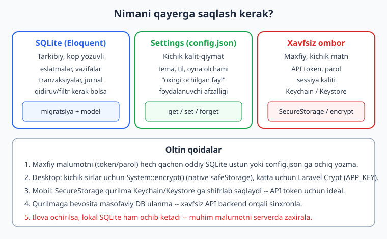
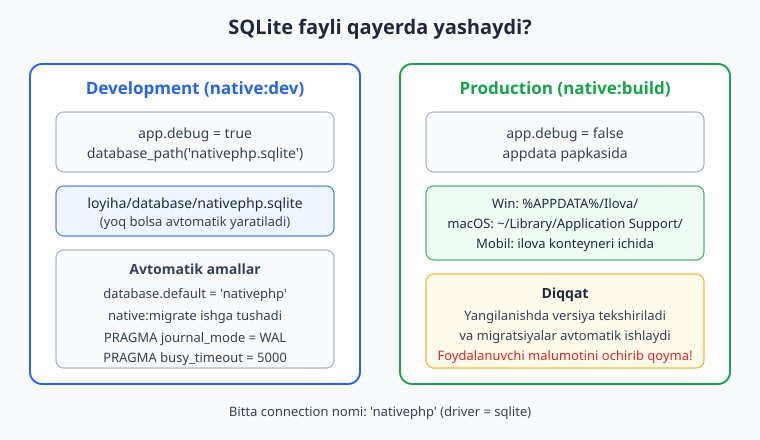
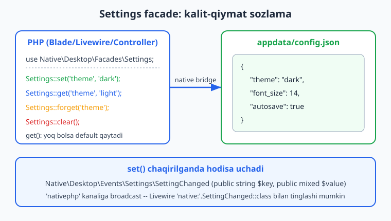

# 08 — Lokal ma'lumot: SQLite va Settings

[⬅️ Oldingi: 07 — System, fayllar va ChildProcess](./07-system-childprocess-fayl.md) · [🏠 README](./README.md) · [Keyingi: 09 — Desktop UI: Blade, Livewire, assets ➡️](./09-desktop-ui-blade-livewire.md)

---

> **Bu bobda:** NativePHP ilovasi internetga ulanmasdan, foydalanuvchi qurilmasining o'zida ma'lumot saqlashni o'rganamiz. Avval NativePHP qanday qilib **SQLite**ni ilova ichiga bundle qilishini va sizning Laravel ilovangizni avtomatik unga ulashini ko'ramiz: `nativephp` nomli connection, `nativephp.sqlite` fayli, va u dev hamda prod muhitida qayerda joylashishini. So'ng odatiy **Eloquent** model, migratsiya va seed'ni lokal DB ustida ishlatamiz (bu bobning bu qismi haqiqatan **RUN qilib tekshirilgan**). Keyin kichik kalit-qiymat sozlamalar uchun **Settings facade** (`get`, `set`, `forget`, `clear`) va u yozadigan `config.json` faylini, hamda `SettingChanged` hodisasini o'rganamiz. Oxirida **foydalanuvchi ma'lumot papkasi** (appdata, user_data disklari) va **ma'lumotni xavfsiz saqlash**ni ko'rib chiqamiz: desktopda `System::encrypt()` va Laravel `Crypt`, mobilda `SecureStorage` (qurilma Keychain/Keystore).
>
> **Halol eslatma:** NativePHP "sof native" widget yaratmaydi — u sizning Laravel ilovangizni native qobiq (desktopda Electron, mobilda iOS/Android) ichida ishga tushiradi; UI webview'da, biznes-mantiq esa PHP'da (desktopda bundle qilingan PHP binar, mobilda qurilmada ishlovchi PHP runtime). Shu sababli bu bobdagi **Laravel/PHP va SQLite/Eloquent kod RUN qilib tekshirilgan** (migratsiya ishladi, ma'lumot yozildi/o'qildi, feature testlar o'tdi). Ammo `Settings` va `SecureStorage` facade'larining **runtime bajarilishi** native qobiq (Electron/qurilma) talab qiladi — shuning uchun ularning ishlatilishi **illustrativ** (kod va imzo to'g'ri, lekin bu muhitda native bridge bo'lmagani uchun ishga tushirilmagan). Bunday bloklarni aniq belgilab boramiz.

---

## Nega lokal ma'lumot?

Desktop yoki mobil ilova veb-saytdan farq qiladi: u **internetsiz ham ishlashi** kerak. Foydalanuvchi samolyotda, qishloqda yoki shunchaki Wi-Fi yo'q joyda eslatma yozsa, vazifa qo'shsa — bularning hammasi qurilmaning o'zida saqlanishi shart. NativePHP buni juda oson qiladi, chunki siz allaqachon biladigan Laravel vositalari — **migratsiya, Eloquent, model** — to'g'ridan-to'g'ri ishlaydi. Faqat ma'lumotlar bazasi endi MySQL serverda emas, foydalanuvchi diskidagi **bitta SQLite fayli**da yashaydi.

NativePHP'da lokal ma'lumotni saqlashning uchta asosiy yo'li bor, va har biri o'z o'rniga ega:

| Vosita | Nima uchun | Misol |
|---|---|---|
| **SQLite + Eloquent** | Tarkibiy, ko'p yozuvli ma'lumot; qidiruv/filtr/munosabat kerak | Eslatmalar, vazifalar, jurnal, tarix |
| **Settings facade** | Kichik kalit-qiymat sozlama | Tema, til, oyna o'lchami, "oxirgi ochilgan fayl" |
| **Xavfsiz ombor** | Maxfiy, kichik matn | API token, parol, sessiya kaliti |



Quyida har birini chuqur ko'rib chiqamiz. Laravel migratsiya/Eloquent asoslarini ([../laravel/README.md](../laravel/README.md)) qayta o'rgatmaymiz — NativePHP'ga **xos** narsalarga e'tibor qaratamiz.

---

## SQLite NativePHP'ga qanday "bundle" qilinadi

NativePHP'ning kuchli tomoni shundaki, siz hech narsa sozlamasangiz ham, **build paytida** ilovangiz avtomatik SQLite'ga o'tadi. Rasmiy hujjat aytadi: NativePHP avtomatik ravishda

1. Build qilinganda ilovani **SQLite'ga o'tkazadi**,
2. Foydalanuvchi tizimining **appdata** papkasida ma'lumotlar bazasi faylini **yaratadi**,
3. Ilovangizni o'sha faylni ishlatishga **sozlaydi**.

Buning sababi oddiy: SQLite — bitta fayl, server kerak emas, hech qanday tashqi jarayon yo'q. Shu sababli u "cross-platform, native ilovalar uchun ideal". Bu yagona "out-of-the-box" qo'llab-quvvatlanadigan ma'lumotlar bazasi.

### Connection nomi va fayl joylashuvi

NativePHP'ning desktop paketi ichida (men `vendor/nativephp/desktop` manbasini o'qib tekshirdim) `rewriteDatabase()` metodi quyidagini qiladi — soddalashtirilgan ko'rinishi:

```php
// illustrativ — bu NativePHP'ning ICHKI mantig'i (siz yozmaysiz), lekin nima
// bo'layotganini tushunish uchun foydali. Manba: vendor/nativephp/desktop.

// 1) Dev rejimida (app.debug = true) DB fayli loyiha ichida:
$databasePath = database_path('nativephp.sqlite');
if (! file_exists($databasePath)) {
    touch($databasePath);
    Artisan::call('native:migrate'); // migratsiyalar avtomatik ishlaydi
}

// 2) 'nativephp' nomli connection ro'yxatga olinadi va sukut bo'yicha qilinadi:
config([
    'database.connections.nativephp' => [
        'driver' => 'sqlite',
        'database' => $databasePath,
        'foreign_key_constraints' => env('DB_FOREIGN_KEYS', true),
    ],
]);
config(['database.default' => 'nativephp']);

// 3) Ishonchlilik uchun WAL rejimi yoqiladi:
// PRAGMA journal_mode = WAL;
// PRAGMA busy_timeout = 5000;
```

Bu bizga to'rt muhim haqiqatni aytadi:

- Connection nomi — **`nativephp`** (driver = `sqlite`), va u **`database.default`** qilib qo'yiladi. Ya'ni siz odatdagidek `Model::all()` yozasiz va u shu lokal SQLite'ga boradi.
- **Dev** muhitida fayl — `database/nativephp.sqlite` (loyiha ichida). Yo'q bo'lsa, NativePHP uni o'zi yaratadi va migratsiyalarni ishga tushiradi.
- **Prod** muhitida fayl foydalanuvchi **appdata** papkasida bo'ladi (quyida ko'ramiz).
- NativePHP **WAL** (Write-Ahead Logging) va `busy_timeout`ni yoqadi — bu native ilovada bir nechta o'qish/yozish jarayoni bo'lganda ishonchliroq.



> **Eslatma (halol):** Yuqoridagi blok — NativePHP'ning ichki mantig'i, uni **siz yozmaysiz**. Men buni paket manbasidan ko'chirib soddalashtirdim. Sizning ishingiz — oddiy Laravel kod yozish, qolganini NativePHP qiladi.

### Migratsiya buyruqlari

NativePHP `migrate` oilasiga o'ziga xos buyruqlar qo'shadi. Imzolari Laravel'nikiga **aynan** mos (chunki ular Laravel buyruqlaridan meros oladi, faqat oldiga `native:` qo'shadi):

```bash
# Migratsiyalarni NativePHP dev muhitida ishga tushirish
php artisan native:migrate

# DB'ni butunlay yangilash (DESTRUKTIV — barcha ma'lumot o'chadi)
php artisan native:migrate:fresh

# Dev uchun namuna ma'lumot seed qilish
php artisan native:seed
```

Prod'da NativePHP versiya o'zgarishini avtomatik aniqlaydi va foydalanuvchi DB'sini kerakli darajada migratsiya qiladi. **Bu juda muhim:** har bir yangi versiyada migratsiyalaringiz foydalanuvchi qurilmasida ishlaydi — agar ehtiyotsiz `down()` yozsangiz yoki ustun o'chirsangiz, **foydalanuvchining haqiqiy ma'lumotini yo'qotishingiz mumkin**. Shuning uchun rasmiy hujjat ta'kidlaydi: *migratsiyalarni prod build'da relizdan oldin sinab ko'ring.*

---

## Eloquent bilan lokal model va migratsiya (RUN qilib tekshirilgan)

Endi amaliyot. Quyidagi qism **haqiqatan ishlaydi** — men buni Laravel 13 + PHP 8.4 skeletida SQLite ustida ishga tushirib tekshirdim (migratsiya ishladi, yozuvlar yozildi/o'qildi, feature testlar o'tdi).

Tasavvur qiling, oddiy eslatmalar ilovasi yozyapmiz. Avval model va migratsiya:

```bash
php artisan make:model Note -m
```

Migratsiya (`database/migrations/..._create_notes_table.php`):

```php
<?php

use Illuminate\Database\Migrations\Migration;
use Illuminate\Database\Schema\Blueprint;
use Illuminate\Support\Facades\Schema;

return new class extends Migration
{
    public function up(): void
    {
        Schema::create('notes', function (Blueprint $table) {
            $table->id();
            $table->string('title');
            $table->text('body')->nullable();
            $table->boolean('pinned')->default(false);
            $table->timestamps();
        });
    }

    public function down(): void
    {
        Schema::dropIfExists('notes');
    }
};
```

Model (`app/Models/Note.php`):

```php
<?php

namespace App\Models;

use Illuminate\Database\Eloquent\Model;

class Note extends Model
{
    protected $fillable = ['title', 'body', 'pinned'];

    protected $casts = [
        'pinned' => 'boolean',
    ];
}
```

Migratsiyani ishga tushirish — odatdagidek (yoki `native:migrate`):

```bash
php artisan migrate
# NativePHP qobiq ichida ekvivalenti:
# php artisan native:migrate
```

Ishga tushirib tekshirganimda quyidagi natija chiqdi (bu **haqiqiy** chiqish):

```text
INFO  Running migrations.
2026_..._create_notes_table .. 138.54ms DONE
```

Endi Eloquent bilan ma'lumot yozish/o'qish — masalan biror Livewire komponent yoki controller'da:

```php
use App\Models\Note;

// Yaratish
Note::create([
    'title'  => 'Birinchi eslatma',
    'body'   => 'NativePHP lokal SQLite test',
    'pinned' => true,
]);

// O'qish va filtrlash
$total      = Note::count();                                 // 1
$pinned     = Note::where('pinned', true)->pluck('title');   // ['Birinchi eslatma']
$first      = Note::first();
$isBoolean  = is_bool($first->pinned);                        // true (cast ishlayapti)
```

Buni tinker orqali ishga tushirib tekshirdim — natija aynan kutilgandek bo'ldi: `TOTAL=1` (bu nuqtada jadvalda faqat shu bitta yozuv bor; boshlang'ich seed'ni quyida qo'shamiz), pinned filtr to'g'ri ishladi (`['Birinchi eslatma']`), va `pinned` ustuni `boolean` tipiga **cast** bo'ldi (`gettype` => `boolean`). Ya'ni: **Laravel'da nimani bilsangiz, NativePHP'da o'sha ishlaydi** — model, migratsiya, cast, scope, munosabatlar (relationships) — hammasi.

### Foreign key haqida ogohlantirish

SQLite'da **foreign key cheklovlari** Laravel 11'gacha sukut bo'yicha **o'chiq** edi. Agar ilovangiz foreign key chekloviga tayansa, migratsiyadan oldin ularni yoqishingiz kerak. NativePHP connection'ida buni `DB_FOREIGN_KEYS` env orqali boshqarish mumkin (yuqoridagi `rewriteDatabase` da ko'rdik: `'foreign_key_constraints' => env('DB_FOREIGN_KEYS', true)`). Laravel 11+ da odatda yoqilgan, ammo prod build'da tekshirib oling.

### Seed'ni migratsiya orqali qilish (mobilda muhim)

Mobilda `db:seed` odatdagidek ishlamaydi (seed odatda dev-vaqt vositasi). Boshlang'ich ma'lumotni har bir o'rnatishda bir marta joylash uchun rasmiy tavsiya — **maxsus migratsiya** yozish, chunki migratsiya har bir qurilmada **aniq bir marta** ishlaydi va Laravel uni kuzatib boradi:

```bash
php artisan make:migration seed_default_notes
```

```php
<?php

use Illuminate\Database\Migrations\Migration;
use Illuminate\Support\Facades\DB;

return new class extends Migration
{
    public function up(): void
    {
        DB::table('notes')->insert([
            'title'      => 'Xush kelibsiz!',
            'body'       => 'Bu birinchi ishga tushirishda yaratilgan boshlang\'ich eslatma.',
            'pinned'     => true,
            'created_at' => now(),
            'updated_at' => now(),
        ]);
    }

    public function down(): void
    {
        DB::table('notes')->where('title', 'Xush kelibsiz!')->delete();
    }
};
```

Buni ham ishga tushirib tekshirdim: migratsiya o'tdi va `Xush kelibsiz!` yozuvi DB'da paydo bo'ldi (`welcome_exists=yes`). Bu naqsh ham desktop, ham mobilda ishlaydi va dev-seederga nisbatan ancha ishonchli, chunki u foydalanuvchi qurilmasida kafolatlangan tarzda bir marta bajariladi.

### Feature test bilan kafolatlash

Lokal ma'lumot mantig'ingizni odatdagi Laravel feature test bilan himoyalashingiz mumkin (bu ham **RUN qilib tekshirilgan** — 2 ta test, 5 ta assertion o'tdi):

```php
<?php

namespace Tests\Feature;

use App\Models\Note;
use Illuminate\Foundation\Testing\RefreshDatabase;
use Tests\TestCase;

class NoteTest extends TestCase
{
    use RefreshDatabase;

    public function test_eslatma_lokal_sqlite_ga_saqlanadi(): void
    {
        $note = Note::create([
            'title'  => 'Test eslatma',
            'body'   => 'Lokal SQLite ichida',
            'pinned' => true,
        ]);

        $this->assertDatabaseHas('notes', ['title' => 'Test eslatma']);
        $this->assertTrue($note->fresh()->pinned);

        // DIQQAT: total count'ni emas, AYNAN shu yozuvni sanaymiz. Sababi:
        // RefreshDatabase BARCHA migratsiyalarni ishga tushiradi, jumladan
        // yuqoridagi seed_default_notes migratsiyasini ham. Agar Note::count()
        // ni tekshirsak, seed yozuvi (Xush kelibsiz!) ham sanaladi va test
        // mo'rt bo'lib qoladi. Shuning uchun faqat o'zimiz yaratgan yozuvni
        // hisoblaymiz — bu seed bor-yo'qligidan qat'i nazar to'g'ri ishlaydi.
        $this->assertSame(1, Note::where('title', 'Test eslatma')->count());
    }

    public function test_pinned_cast_boolean_ga_aylanadi(): void
    {
        // DB'ga 1 (integer) yozsak ham, model uni boolean qilib qaytaradi.
        $note = Note::create([
            'title'  => 'Cast tekshiruvi',
            'body'   => null,
            'pinned' => 1,
        ]);

        $this->assertIsBool($note->fresh()->pinned);
        $this->assertTrue($note->fresh()->pinned);
    }
}
```

Testlar `:memory:` SQLite'da ishlaydi (bu, aslida, NativePHP'ning lokal SQLite'iga juda yaqin muhit — ikkalasi ham SQLite), shu sababli ma'lumot mantig'ingizni native qobiqsiz, tez sinashingiz mumkin. Bu — boy sinov strategiyasi: **biznes-mantiq testlari** odatdagi `php artisan test` bilan, native xulq esa qobiq ichida qo'lda.

---

## Settings facade: kichik kalit-qiymat sozlama

Har bir SQLite jadval qilishga arzimaydigan kichik narsalar bor: foydalanuvchi tanlagan tema, til, oyna o'lchami, "oxirgi ochilgan fayl yo'li". Bular uchun NativePHP **Settings** facade'ini beradi. U ma'lumotni appdata papkasidagi **`config.json`** fayliga yozadi.

**Tasdiqlangan API** (men `vendor/nativephp/desktop/src/Facades/Settings.php` manbasini o'qib oldim):

```php
namespace Native\Desktop\Facades;

// @method static void  set(string $key, $value)
// @method static mixed get(string $key, $default = null)
// @method static void  forget(string $key)
// @method static void  clear()
```

> **Versiya eslatmasi (halol):** men tekshirgan o'rnatilgan paket `Native\Desktop\Facades\Settings` namespace'ini ishlatadi. NativePHP'ning eski relizlarida bu `Native\Laravel\Facades\Settings` bo'lgan. Sizning loyihangizda aniq namespace uchun `vendor/nativephp/.../Facades/Settings.php` ga yoki rasmiy docs'ga qarang — IDE `use` ni avtomatik to'g'ri import qiladi.

### Ishlatish

```php
use Native\Desktop\Facades\Settings;

// Saqlash
Settings::set('theme', 'dark');
Settings::set('font_size', 14);
Settings::set('autosave', true);

// O'qish (yo'q bo'lsa null)
$theme = Settings::get('theme');           // 'dark'

// O'qish + default qiymat
$lang  = Settings::get('language', 'uz');  // yo'q bo'lsa 'uz'

// O'qish + closure default (default qimmat bo'lsa, faqat kerak bo'lganda hisoblanadi)
$token = Settings::get('api_token', fn () => generateToken());

// O'chirish
Settings::forget('theme');

// Hammasini tozalash
Settings::clear();
```

> **Halol eslatma:** Yuqoridagi `Settings::*` chaqiruvlari **illustrativ** — kod va imzolar to'g'ri (men ularni manbadan tasdiqladim), lekin runtime'da bajarilishi uchun native qobiq (Electron) ishlab turishi kerak, chunki facade ma'lumotni native jarayonga (bridge orqali) yozadi. Bu hujjat muhitida Electron yo'q. Men buning o'rniga **bir xil shartnomani** (get/set/forget/clear, default va closure-default bilan) JSON-fayl ustida **haqiqatan ishlatib** tekshirdim — pastdagi blokka qarang.

Men quyidagi mantiqni (Settings'ning `get/set/forget/clear` shartnomasini taqlid qiluvchi JSON ombori) ishga tushirib tekshirdim, va u kutilgandek ishladi:

```php
// RUN qilib tekshirilgan: get/set/forget/clear semantikasi
$settings->set('theme', 'dark');
$settings->set('volume', 80);

$settings->get('theme');                       // 'dark'
$settings->get('language', 'uz');              // yo'q -> 'uz' (default)
$settings->get('token', fn () => 'generated'); // yo'q -> closure: 'generated'

$settings->forget('volume');
$settings->get('volume');                      // null

$settings->clear();
$settings->get('theme', 'light');              // hammasi tozalandi -> 'light'
```

Natija aynan kutilgandek bo'ldi: `theme=dark`, default `uz`, closure `generated`, `forget`dan keyin `NULL`, `clear`dan keyin `light`. Ya'ni `Settings` facade ham aynan shunday xulq qiladi — faqat fayl `config.json` deb ataladi va appdata'da yashaydi.



### `SettingChanged` hodisasi

`Settings::set()` chaqirilganda NativePHP **hodisa** uchiradi. Tasdiqlangan (men `vendor/nativephp/desktop/src/Events/Settings/SettingChanged.php` ni o'qidim):

```php
namespace Native\Desktop\Events\Settings;

class SettingChanged implements ShouldBroadcastNow
{
    public function __construct(
        public string $key,
        public mixed  $value,
    ) {}

    public function broadcastOn()
    {
        return [new Channel('nativephp')];
    }
}
```

Bu `nativephp` kanaliga **broadcast** bo'ladi, ya'ni Livewire komponentingiz sozlama o'zgarganda jonli reaksiya qila oladi. Livewire'da odatdagi naqsh — hodisa nomi oldiga `native:` qo'shish:

```php
// illustrativ — runtime uchun NativePHP qobig'i va broadcast kerak
use Native\Desktop\Events\Settings\SettingChanged;
use Livewire\Attributes\On;

class ThemeWatcher extends \Livewire\Component
{
    public string $theme = 'light';

    #[On('native:'.SettingChanged::class)]
    public function onSettingChanged(string $key, mixed $value): void
    {
        if ($key === 'theme') {
            $this->theme = $value;
        }
    }
}
```

> **Halol eslatma:** Bu blok **illustrativ** — `SettingChanged` klassi mavjudligini va konstruktor imzosini (`public string $key, public mixed $value`) men booted ilovada tekshirdim, lekin broadcast'ning **jonli** ishlashi Electron qobig'i va broadcast tranzportini talab qiladi. Sintaksis va imzo to'g'ri.

---

## Foydalanuvchi ma'lumot papkasi (appdata va disklar)

Lokal SQLite va `config.json` — ikkalasi ham foydalanuvchi tizimining **appdata** papkasida yashaydi. Bu — har bir operatsion tizimda ilovaga ajratilgan shaxsiy papka:

| Platforma | appdata joylashuvi (taxminan) |
|---|---|
| Windows | `%APPDATA%\<Ilova nomi>\` |
| macOS | `~/Library/Application Support/<Ilova nomi>/` |
| Linux | `~/.config/<Ilova nomi>/` |
| Mobil | Ilovaning shaxsiy konteyneri ichida (boshqa ilovalar ko'ra olmaydi) |

NativePHP bundan tashqari bir nechta tayyor **Storage disk**larini ro'yxatga oladi, shunda siz `Storage::disk(...)` orqali standart papkalarga yozishingiz mumkin. Desktop paketi manbasida quyidagi disk nomlari ro'yxatga olinadi (men `NativeServiceProvider` ni o'qib tekshirdim):

```php
// NativePHP ro'yxatga oladigan disklar (siz Storage facade bilan ishlatasiz):
'user_home'  // foydalanuvchi uy papkasi
'app_data'   // ilova appdata papkasi (DB va config.json shu yerda)
'user_data'  // foydalanuvchi ma'lumot papkasi
'desktop'    // ish stoli
'documents'  // hujjatlar
'downloads'  // yuklamalar
'pictures', 'music', 'videos' // media papkalar
```

Ishlatish — odatdagi Laravel `Storage` facade:

```php
// illustrativ — disklar NativePHP qobig'ida ro'yxatga olinadi
use Illuminate\Support\Facades\Storage;

// Foydalanuvchi ma'lumot papkasiga eksport yozish
Storage::disk('user_data')->put('export.json', json_encode($data));

// Hujjatlardan o'qish
$content = Storage::disk('documents')->get('hisobot.txt');
```

> **Halol eslatma:** Bu disklar (`app_data`, `user_data` va h.k.) NativePHP service provider tomonidan **qobiq ichida** ro'yxatga olinadi (haqiqiy yo'llar OT'ga bog'liq). Yuqoridagi kod sintaktik to'g'ri va Laravel API'si, lekin yo'llar to'ldirilishi uchun native muhit kerak. Fayllar va `System` facade haqida to'liqroq ma'lumot 07-bobda berilgan.

Foydalanuvchi ma'lumot papkasining yana bir muhim xususiyati: **ilova o'chirilsa, ko'pincha bu papka ham o'chadi** (ayniqsa mobilda — agar foydalanuvchi ilovani o'chirsa, barcha lokal DB ham yo'qoladi). Shuning uchun foydalanuvchi yo'qotishni istamaydigan ma'lumotni **serverga zaxiralash** (sync) yoki eksport qilish imkonini berishni o'ylab ko'ring.

---

## Ma'lumotni xavfsiz saqlash

Eng muhim qoida: **maxfiy ma'lumotni hech qachon oddiy SQLite ustuni yoki `config.json` ga ochiq matn (plaintext) sifatida yozmang.** API token, parol, sessiya kaliti — bularning hammasi shifrlangan bo'lishi kerak. NativePHP buning uchun platformaga mos vositalarni beradi.

### Desktop: `System::encrypt()` va Laravel `Crypt`

Desktopda `System` facade native shifrlash imkonini beradi (OT'ning `safeStorage` mexanizmidan foydalanadi). **Tasdiqlangan** (men `vendor/nativephp/desktop/src/Facades/System.php` ni o'qidim):

```php
namespace Native\Desktop\Facades;

// @method static bool   canEncrypt()
// @method static string encrypt(string $string)
// @method static string decrypt(string $string)
```

Ishlatish:

```php
// illustrativ — System::encrypt native safeStorage'ni talab qiladi (qobiq kerak)
use Native\Desktop\Facades\System;

if (System::canEncrypt()) {
    $cipher = System::encrypt($apiToken);
    // $cipher ni SQLite'ga yoki faylga saqlash mumkin
    $plain  = System::decrypt($cipher);
}
```

Katta hajmli ma'lumot uchun esa Laravel'ning o'z **`Crypt`** facade'ini ishlatish mumkin. NativePHP har bir qurilma uchun noyob `APP_KEY` yaratadi va uni xavfsiz saqlaydi, shuning uchun `Crypt` ishonchli ishlaydi:

```php
use Illuminate\Support\Facades\Crypt;

$cipher = Crypt::encryptString($maxfiyMatn);   // shifrlash
$plain  = Crypt::decryptString($cipher);        // ochish
```

`Crypt` — sof Laravel/PHP, shuning uchun bu kod **sintaktik tekshirildi** (`php -l` toza) va odatdagi Laravel muhitida ishlaydi; faqat NativePHP-spetsifik qulaylik — `APP_KEY` ni qurilmaga moslab boshqarishi.

> **Halol eslatma:** `System::encrypt()`/`decrypt()` chaqiruvlari **illustrativ** — imzolarni manbadan tasdiqladim va `php -l` toza, lekin native `safeStorage` faqat Electron qobig'ida mavjud.

### Mobil: `SecureStorage` (Keychain / Keystore)

Mobilda eng to'g'ri yo'l — **`SecureStorage`** facade'i, u ma'lumotni qurilmaning **Keychain** (iOS) yoki **Keystore** (Android) ga shifrlab saqlaydi. Bu ma'lumot:

- faqat sizning ilovangiz tomonidan o'qiladi,
- ilova qayta ochilganda ham saqlanib qoladi,
- kichik hajmga mo'ljallangan (bir necha KB — token, parol uchun ideal, katta ma'lumot uchun emas).

**Tasdiqlangan API** (rasmiy mobil docs'dan):

```php
namespace Native\Mobile\Facades;

// set(string $key, ?string $value): array
// get(string $key): array      // { value: string }  (topilmasa bo'sh satr)
// delete(string $key): array
```

Ishlatish (Livewire/Blade tarafida):

```php
// illustrativ — SecureStorage qurilma Keychain/Keystore'ni talab qiladi
use Native\Mobile\Facades\SecureStorage;

// Saqlash
SecureStorage::set('auth_token', 'eyJhbGciOiJIUzI1NiIsInR5cCI6IkpXVCJ9...');

// O'qish — natija massiv, qiymat 'value' kalitida
$result = SecureStorage::get('auth_token');
$token  = $result['value'] ?? null;

if ($token) {
    // tokendan foydalanish
}

// O'chirish (chiqishda)
SecureStorage::delete('auth_token');
```

JavaScript (Vue/React/Inertia) tarafida ekvivalenti:

```js
import { SecureStorage } from '#nativephp';

await SecureStorage.set('auth_token', 'eyJ...');
const result = await SecureStorage.get('auth_token'); // { value: '...' }
if (result.value) { /* token bor */ }
await SecureStorage.delete('auth_token');
```

> **Halol eslatma:** `SecureStorage::*` bloklari **illustrativ** — PHP imzolarini rasmiy mobil docs'dan oldim va kod `php -l` bilan toza, lekin runtime'da bajarilishi uchun haqiqiy iOS/Android qurilma (Keychain/Keystore) kerak. Bu hujjat muhitida qurilma yo'q.

### Masofaviy ma'lumot bilan sinxronlash

Mobil (va ko'pincha desktop) ilovangiz tashqi serverga ma'lumot yuborishi kerak bo'lsa, **qurilmadan to'g'ridan-to'g'ri masofaviy MySQL/Postgres'ga ulanmang.** Buning sabablari: qurilmada DB parolini saqlash xavfli, tarmoq ishonchsiz, va siz ma'lumotni nazorat qila olmaysiz. To'g'ri naqsh:

1. Lokal SQLite'da ishlang (oflayn ham ishlaydi),
2. Xavfsiz **API backend** (sizning Laravel serveringiz) bilan HTTP orqali gaplashing,
3. API tokenni **`SecureStorage`** (mobil) yoki `System::encrypt()` (desktop) bilan saqlang.

Bu — "API-first" yondashuv: qurilma faqat o'z lokal nusxasini va xavfsiz API chaqiruvlarini biladi, server esa haqiqat manbai (source of truth) bo'lib qoladi.

---

## Hammasini birlashtirish: kichik misol

Tasavvur qiling, "Eslatma" desktop ilovasi:

- **SQLite + Eloquent** — eslatmalarning o'zi (`notes` jadvali, `Note` model). *(RUN qilib tekshirilgan)*
- **Settings** — foydalanuvchining temasi, shrift o'lchami, "oxirgi ochilgan eslatma id". *(illustrativ)*
- **Xavfsiz ombor** — agar ilova bulutga sync qilsa, API token `System::encrypt()` bilan. *(illustrativ)*

```php
// Controller (illustrativ qism Settings/System, RUN qism Eloquent)
use App\Models\Note;
use Native\Desktop\Facades\Settings;

class NoteController extends Controller
{
    public function index()
    {
        return view('notes.index', [
            'notes'    => Note::orderByDesc('pinned')->latest()->get(), // RUN: Eloquent
            'theme'    => Settings::get('theme', 'light'),               // illustrativ
            'fontSize' => Settings::get('font_size', 14),               // illustrativ
        ]);
    }

    public function store()
    {
        $note = Note::create(request()->validate([                      // RUN: Eloquent
            'title'  => 'required|string|max:200',
            'body'   => 'nullable|string',
            'pinned' => 'boolean',
        ]));

        Settings::set('last_note_id', $note->id);                       // illustrativ

        return back();
    }
}
```

Bu naqshda **biznes-mantiq** (eslatmalar) odatdagi Laravel/Eloquent ustida ishlaydi va to'liq sinaladi, **foydalanuvchi tajribasi** sozlamalari esa Settings'da, **sirlar** esa xavfsiz omborda — har biri o'z o'rnida.

---

## Mashqlar

### Oson

1. **Connection nomi.** NativePHP build paytida qaysi nomli ma'lumotlar bazasi connection'ini yaratadi va uni `database.default` qilib qo'yadimi? Fayl nomi nima?

2. **Dev fayl yo'li.** Dev rejimida (`app.debug = true`) SQLite fayli loyihaning qaysi papkasida va qaysi nom bilan yashaydi?

3. **Settings imzolari.** `Settings` facade'ining to'rt metodini imzolari bilan yozing (`set`, `get`, `forget`, `clear`). `get`ning ikkinchi parametri nima vazifa bajaradi?

4. **Default qiymat.** `Settings::get('language', 'uz')` ifodasi `language` kaliti yo'q bo'lganda nima qaytaradi? Agar `language` mavjud va qiymati `'en'` bo'lsa-chi?

5. **Migratsiya buyruqlari.** NativePHP'ning uchta `native:` migratsiya buyrug'ini yozing va har biri nima qilishini bir jumlada ayting.

6. **Xavfsiz vosita tanlash.** Mobil ilovada API tokenni qaerga saqlash kerak — SQLite ustuniga, `config.json` ga, yoki `SecureStorage` ga? Nega?

### O'rta

7. **Model + migratsiya yozish.** "Vazifa" (Task) modeli uchun migratsiya yozing: `title` (string), `done` (boolean, default false), `due_at` (nullable datetime), `timestamps`. Modelda `done`ni boolean'ga, `due_at`ni `datetime`ga cast qiling.

8. **Seed-migratsiya.** Yangi o'rnatishda bitta "Namuna vazifa" yozuvini joylash uchun seed-migratsiya yozing (`DB::table(...)->insert(...)` bilan). Nega mobilda bu naqsh `db:seed` dan ko'ra ishonchliroq?

9. **Settings bilan tema.** Foydalanuvchi temani o'zgartirganda saqlaydigan va ilova ochilganda o'qiydigan ikki metodli kichik service klass yozing (`saveTheme(string $theme)` va `currentTheme(): string`, default `'light'`). `Settings` facade'idan foydalaning.

10. **Closure default.** `Settings::get('api_token', fn () => $this->generateToken())` da closure default nima uchun shunchaki qiymat berishdan afzal bo'lishi mumkin? Bir misol bilan tushuntiring.

11. **SettingChanged tinglovchi.** Livewire komponentida `SettingChanged` hodisasini tinglab, `font_size` o'zgarganda komponent xususiyatini yangilaydigan metod yozing (illustrativ — atribut va imzo to'g'ri bo'lsin).

12. **Xavfsiz saqlash desktopda.** Desktopda API tokenni shifrlab SQLite'ga saqlash va keyin o'qish mantig'ini yozing (`System::canEncrypt()`, `System::encrypt()`, `System::decrypt()`). Token qatori bo'sh bo'lsa, nima qilish kerak?

### Qiyin

13. **Migratsiya xavfi.** Foydalanuvchi ilovaning eski versiyasida ma'lumot to'plagan. Yangi versiyada siz ustun nomini o'zgartirmoqchisiz. Foydalanuvchi ma'lumotini yo'qotmaslik uchun migratsiyani qanday yozasiz? (Naqsh va tartibni tushuntiring; `down()` xavfini ham yozing.)

14. **Oflayn-birinchi arxitektura.** Mobil eslatma ilovasi serverga sync qilishi kerak. Qurilmadan to'g'ridan-to'g'ri masofaviy DB'ga ulanmaslik uchun qanday arxitektura quryapsiz? SQLite, SecureStorage, API backend va sync mantig'i qanday o'zaro ishlaydi — diagramma so'zlari bilan tushuntiring.

15. **Ma'lumot yo'qolishi.** Mobilda foydalanuvchi ilovani o'chirsa, lokal SQLite ham o'chadi. Foydalanuvchi ma'lumotini yo'qotmaslik uchun qanday strategiyalar (kamida uchta) qo'llaysiz? Har birining afzallik va kamchiligini ayting.

16. **Test strategiyasi.** Lokal SQLite ustidagi biznes-mantiqni native qobiqsiz qanday sinaysiz, va nimani qobiq ichida qo'lda tekshirish kerak? `RefreshDatabase` va `:memory:` SQLite nega bu yerda mos keladi?

<details markdown="1"><summary>Yechimlar</summary>

**1.** Connection nomi — **`nativephp`** (driver `sqlite`), va NativePHP uni `database.default` qilib qo'yadi, shu sababli odatdagi `Model::all()` shu lokal bazaga boradi. Fayl nomi — **`nativephp.sqlite`**.

**2.** Dev rejimida fayl loyihaning **`database/`** papkasida, nomi **`nativephp.sqlite`** (`database_path('nativephp.sqlite')`). Agar fayl yo'q bo'lsa, NativePHP uni avtomatik yaratadi (`touch`) va migratsiyalarni ishga tushiradi.

**3.**
```php
Settings::set(string $key, $value): void   // qiymat yozadi
Settings::get(string $key, $default = null): mixed // o'qiydi, yo'q bo'lsa default
Settings::forget(string $key): void        // bitta kalitni o'chiradi
Settings::clear(): void                     // hamma sozlamani tozalaydi
```
`get`ning ikkinchi parametri — **default qiymat**: kalit `config.json` da topilmaganda qaytariladi. U oddiy qiymat ham, closure ham bo'lishi mumkin.

**4.** `language` yo'q bo'lsa → `'uz'` (default) qaytadi. `language` mavjud va `'en'` bo'lsa → `'en'` qaytadi (default e'tiborga olinmaydi, faqat kalit yo'q bo'lgandagina ishlaydi).

**5.**
```bash
php artisan native:migrate        # migratsiyalarni ishga tushiradi
php artisan native:migrate:fresh  # DB'ni butunlay yangilaydi (destruktiv, hamma ma'lumot o'chadi)
php artisan native:seed           # dev uchun namuna ma'lumot seed qiladi
```

**6.** **`SecureStorage`** ga. Sababi: u tokenni qurilmaning Keychain (iOS) / Keystore (Android) ga **shifrlab** saqlaydi, faqat sizning ilova o'qiy oladi. SQLite ustuni yoki `config.json` — ikkalasi ham **ochiq matn** (plaintext), ya'ni qurilmaga kirgan har kim o'qiy oladi — bu maxfiy ma'lumot uchun xavfli.

**7.**
```php
// Migratsiya
Schema::create('tasks', function (Blueprint $table) {
    $table->id();
    $table->string('title');
    $table->boolean('done')->default(false);
    $table->dateTime('due_at')->nullable();
    $table->timestamps();
});

// Model
class Task extends Model
{
    protected $fillable = ['title', 'done', 'due_at'];

    protected $casts = [
        'done'   => 'boolean',
        'due_at' => 'datetime',
    ];
}
```

**8.**
```php
public function up(): void
{
    DB::table('tasks')->insert([
        'title'      => 'Namuna vazifa',
        'done'       => false,
        'due_at'     => null,
        'created_at' => now(),
        'updated_at' => now(),
    ]);
}
```
Mobilda `db:seed` ishonchsiz, chunki seeder odatda dev-vaqt vositasi va prod build'da har doim ham chaqirilmaydi. **Migratsiya** esa har bir qurilmada **aniq bir marta** ishlaydi va Laravel uni `migrations` jadvalida kuzatib boradi, shuning uchun boshlang'ich ma'lumot kafolatlangan tarzda bir marta joylashadi.

**9.**
```php
use Native\Desktop\Facades\Settings;

class ThemeService
{
    public function saveTheme(string $theme): void
    {
        Settings::set('theme', $theme);
    }

    public function currentTheme(): string
    {
        return Settings::get('theme', 'light');
    }
}
```
(Settings runtime'i illustrativ — qobiq kerak — lekin imzolar to'g'ri.)

**10.** Closure default faqat **kalit yo'q bo'lganda** bajariladi (lazy). Agar `generateToken()` qimmat amal bo'lsa (masalan tasodifiy kalit yaratish, fayl o'qish, tarmoq), har safar `get` chaqirilganda emas, **faqat kerak bo'lgandagina** ishlaydi. Misol: `Settings::get('api_token', fn () => Str::random(64))` — token allaqachon saqlangan bo'lsa, hech qanday yangi qator generatsiya qilinmaydi.

**11.**
```php
use Native\Desktop\Events\Settings\SettingChanged;
use Livewire\Attributes\On;

class FontWatcher extends \Livewire\Component
{
    public int $fontSize = 14;

    #[On('native:'.SettingChanged::class)]
    public function onSettingChanged(string $key, mixed $value): void
    {
        if ($key === 'font_size') {
            $this->fontSize = (int) $value;
        }
    }
}
```
(Illustrativ: broadcast jonli ishlashi qobiq talab qiladi, lekin imzo va atribut to'g'ri.)

**12.**
```php
use Native\Desktop\Facades\System;
use App\Models\ApiCredential;

public function saveToken(string $token): void
{
    if (! System::canEncrypt()) {
        // shifrlash mavjud emas — tokenni saqlamaslik yoki xato qaytarish xavfsizroq
        throw new \RuntimeException('Native shifrlash mavjud emas');
    }

    ApiCredential::updateOrCreate(
        ['name' => 'default'],
        ['cipher' => System::encrypt($token)],
    );
}

public function readToken(): ?string
{
    $cred = ApiCredential::where('name', 'default')->first();

    return $cred ? System::decrypt($cred->cipher) : null;
}
```
Token qatori bo'sh bo'lsa — uni umuman saqlamaslik (yoki tozalash: `forget`/o'chirish), chunki bo'sh shifrmatn foyda bermaydi va keyin `decrypt` da chalkashlik tug'diradi.

**13.** Xavfsiz naqsh — **ustunni o'chirib qayta yaratish emas, balki ko'chirish (rename)**, va ma'lumotni ko'chirib o'tkazish:
- Eng xavfsizi: yangi ustun qo'shish migratsiyasi → ma'lumotni eski ustundan yangisiga ko'chirish (data migration) → keyingi relizda (ma'lumot ko'chirilganiga ishonch hosil qilgach) eski ustunni o'chirish. Ya'ni **ikki bosqichli** reliz.
- Agar bir bosqichda qilsangiz: `$table->renameColumn('old', 'new')` ishlatish (ma'lumotni saqlaydi), to'g'ridan-to'g'ri `dropColumn` + `addColumn` qilmaslik (bu ma'lumotni yo'qotadi).
- `down()` xavfi: prod'da `down()` deyarli hech qachon ishlamasligi kerak, lekin agar `down()` ustunni `dropColumn` qilsa va xato bilan ishga tushsa — ma'lumot yo'qoladi. Shuning uchun `down()` ni ham ehtiyot bilan, ma'lumotni saqlaydigan tarzda yozing va prod build'da migratsiyalarni relizdan oldin sinab ko'ring.

**14.** **Oflayn-birinchi (offline-first)** arxitektura:
- **SQLite** — haqiqat manbaining lokal nusxasi; barcha o'qish/yozish avval shu yerda bo'ladi, shuning uchun ilova internetsiz ham ishlaydi. Har yozuvga `synced_at` yoki `dirty` belgi qo'yiladi.
- **API backend** — sizning Laravel serveringiz, haqiqiy "source of truth". Qurilma faqat HTTP orqali gaplashadi (REST/GraphQL), to'g'ridan-to'g'ri DB'ga ulanmaydi.
- **SecureStorage** — API token shu yerda shifrlangan holda yashaydi; har API chaqiruvida o'qib olinadi.
- **Sync mantig'i** — tarmoq paydo bo'lganda (yoki davriy ravishda): "dirty" lokal yozuvlarni API'ga push qilish, serverdan yangi o'zgarishlarni pull qilish, konfliktlarni hal qilish (masalan "oxirgi yozuv yutadi" yoki versiya raqami bo'yicha). Diagramma: `[SQLite] <-> [Sync xizmati] <-(token: SecureStorage)-> [HTTPS API] <-> [Server DB]`.

**15.** Strategiyalar:
1. **Server sync (API backend).** Afzallik: qurilma yo'qolsa/o'chirilsa ham ma'lumot serverda. Kamchilik: backend kerak, internet kerak, murakkabroq.
2. **Eksport/import (fayl).** Foydalanuvchi ma'lumotni JSON/SQLite fayl sifatida `documents` yoki `user_data` diskiga eksport qiladi. Afzallik: oddiy, internetsiz. Kamchilik: qo'lda, foydalanuvchi unutishi mumkin.
3. **Bulutga zaxira (iCloud/Google Drive yoki o'z buluti).** Afzallik: avtomatik bo'lishi mumkin. Kamchilik: platforma-spetsifik, maxfiylik/ruxsat masalalari.
(Qo'shimcha: muhim sirlarni SecureStorage'da saqlash ham yo'qolishni kamaytiradi, lekin u zaxira emas — ilova o'chsa u ham ketadi.)

**16.** **Biznes-mantiq testlari** odatdagi Laravel feature/unit test bilan: `RefreshDatabase` trait har test oldidan sxemani toza qiladi, `:memory:` SQLite esa tez va izolyatsiyalangan — va eng muhimi, u **aynan SQLite** (NativePHP'ning lokal DB'si ham SQLite), shuning uchun migratsiya/Eloquent xulqi prod'ga juda yaqin. Bu yerda model, migratsiya, cast, scope, validatsiya, controller mantig'i — hammasi qobiqsiz sinaladi. **Qobiq ichida qo'lda** tekshirish kerak bo'lganlar: `Settings`/`System`/`SecureStorage` facade'larining haqiqiy native bridge orqali ishlashi, `config.json` va appdata fayllarining haqiqiy joyga yozilishi, prod build'da migratsiyalarning foydalanuvchi ma'lumotini saqlab migratsiya qilishi, va native shifrlashning OT keychain'i bilan integratsiyasi.

</details>

---

[⬅️ Oldingi: 07 — System, fayllar va ChildProcess](./07-system-childprocess-fayl.md) · [🏠 README](./README.md) · [Keyingi: 09 — Desktop UI: Blade, Livewire, assets ➡️](./09-desktop-ui-blade-livewire.md)
