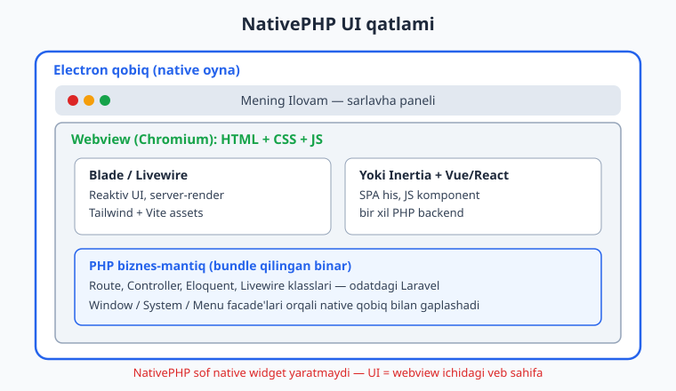
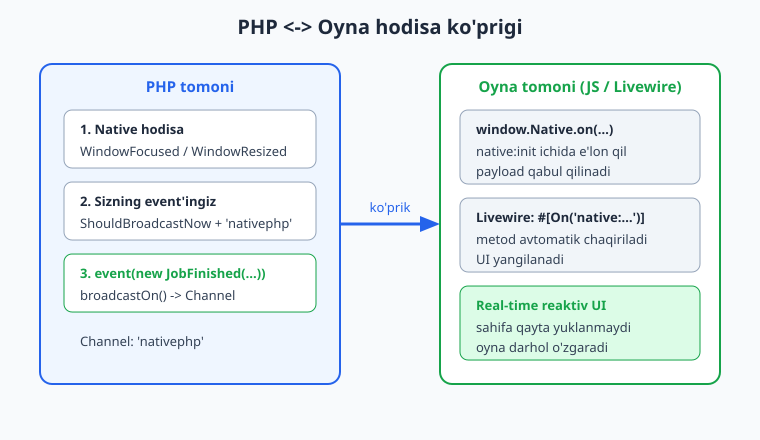
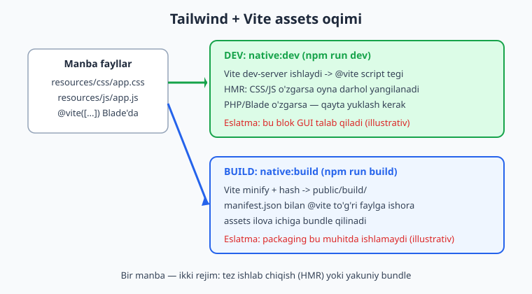

# 09 — Desktop UI: Blade, Livewire, assets

[⬅️ Oldingi: 08 — Lokal ma'lumot: SQLite va Settings](./08-local-data-sqlite-settings.md) · [🏠 README](./README.md) · [Keyingi: 10 — Mobil ilova asoslari ➡️](./10-mobil-asoslari.md)

---

> **Bu bobda:** NativePHP desktop ilovasining UI (foydalanuvchi interfeysi) qatlamini chuqur o'rganamiz. Ko'ramiz: NativePHP UI aslida nima — Electron oynasi ichidagi **webview** (Chromium) bo'lib, unda oddiy HTML/CSS/JS ishlaydi; UI'ni qanday qurish mumkin — **Blade**, **Livewire** (oyna ichida real-time reaktiv UI), yoki **Inertia + Vue/React** opsiyalari; **Tailwind** va **Vite** orqali assets boshqaruvi (dev rejimida HMR, build rejimida bundle); **dark mode** ni `System::theme()` bilan boshqarish; ilova "native his" beradigan dizayn (`-webkit-app-region`, frameless oyna, custom title bar); va eng muhimi — **PHP bilan oyna o'rtasidagi hodisa ko'prigi** (`window.Native.on(...)`, Livewire'ning `#[On('native:...')]` atributi, va `ShouldBroadcastNow` orqali `nativephp` kanaliga broadcast). Laravel asoslari (Blade, route, Livewire komponentlari) ma'lum deb faraz qilinadi — ../laravel/README.md ga qarang; biz NativePHP'ga xos qismlarga e'tibor beramiz.
>
> **Halol eslatma:** NativePHP sof native widget yaratmaydi. Sizning UI'ngiz — Electron oynasi ichidagi veb-sahifa. Bobdagi Laravel/PHP kod (Livewire komponent klassi, event klassi, route'lar, Blade'lar) **tekshirilgan** (`php -l`, Laravel 13 boot, NativePHP v2.2.1 facade/event klasslari autoload orqali topildi, Blade render qilindi). Lekin oyna ochilishi, HMR, build/packaging va native event'larning real ishlashi GUI/Electron/displey talab qiladi — bular **illustrativ** deb belgilangan (bu muhitda ishga tushirilmagan).

---

## 9.1 NativePHP UI nima — va nima emas

01-bobda aytganimizdek, NativePHP "sof native widget toolkit" (Qt yoki SwiftUI kabi) **emas**. Desktop'da u sizning Laravel ilovangizni **Electron** qobig'i ichida ishga tushiradi:

- **Tashqi qobiq** — native oyna (Windows/macOS/Linux'da operatsion tizim chizadigan haqiqiy oyna).
- **Ichki UI** — oyna ichidagi **webview** (Chromium dvigateli). Bu yerda sizning Blade/Livewire/Vue chiqargan **HTML + CSS + JS** ko'rsatiladi.
- **Biznes-mantiq** — **PHP** (production'da ilova ichiga bundle qilingan binar). Bu sizning odatdagi route'laringiz, controller'laringiz, Eloquent model'laringiz.

Ya'ni: UI'ni **veb-texnologiyalar** bilan yozasiz, lekin natija mustaqil desktop ilova bo'lib ko'rinadi. Buning katta afzalligi — Laravel bilimingiz to'liq ishlaydi. Kamchiligi — "piksel darajasida native" his (masalan, OS ning haqiqiy menyu animatsiyalari ichidagi har bir element) emas; siz buni CSS bilan taqlid qilasiz.



Rasmiy hujjatlardan aniq iqtibos:

> "NativePHP isn't prescriptive about how you develop your application." (nativephp.com/docs)

Ya'ni NativePHP sizga UI texnologiyasini majburlamaydi. Tanlov to'liq sizniki: Blade, Livewire, Inertia+Vue, Inertia+React, yoki sof HTML.

## 9.2 Eng oddiy UI — Blade view

NativePHP ilovasining "uy" sahifasi — bu shunchaki Laravel route'i qaytaradigan Blade view. Yangi NativePHP ilovasida `routes/web.php` da odatda shunday qator bo'ladi:

```php
use Illuminate\Support\Facades\Route;

Route::view('/', 'welcome')->name('home');
```

Oyna ochilganda NativePHP webview'ni shu `/` route'iga yo'naltiradi. Demak, oynada `welcome.blade.php` ko'rsatiladi. Bu oddiy Laravel — hech qanday sehr yo'q.

Asosiy layout (`resources/views/layouts/app.blade.php`) odatdagidek:

```blade
<!DOCTYPE html>
<html lang="uz" class="{{ $mavzu ?? '' }}">
<head>
    <meta charset="utf-8">
    <meta name="viewport" content="width=device-width, initial-scale=1">
    <title>Mening Ilovam</title>
    @vite(['resources/css/app.css', 'resources/js/app.js'])
</head>
<body class="bg-slate-50 text-slate-800">
    @yield('content')
</body>
</html>
```

`@vite(...)` — bu Laravel'ning standart Vite direktivasi. NativePHP'ga xos hech narsa yo'q; lekin u qanday ishlashi (dev vs build) muhim, buni 9.6 da ko'ramiz.

## 9.3 Livewire — oyna ichida real-time reaktiv UI

NativePHP bilan eng tabiiy his beradigan kombinatsiya — **Livewire**. Sababi: Livewire JavaScript yozmasdan reaktiv UI beradi, va u server (PHP) tomonida ishlaydi — bu esa NativePHP arxitekturasiga mukammal mos keladi, chunki PHP allaqachon shu yerda, ilova ichida.

Avval Livewire o'rnatamiz (NativePHP ilovasida xuddi oddiy Laravel'dagidek):

```bash
composer require livewire/livewire
php artisan make:livewire Counter
```

Bu `app/Livewire/Counter.php` va `resources/views/livewire/counter.blade.php` yaratadi. Komponent klassi:

```php
<?php

namespace App\Livewire;

use Livewire\Component;

class Counter extends Component
{
    public int $count = 0;

    public function increment(): void
    {
        $this->count++;
    }

    public function decrement(): void
    {
        $this->count--;
    }

    public function render()
    {
        return view('livewire.counter');
    }
}
```

View (`counter.blade.php`):

```blade
<div class="p-6 text-center">
    <h1 class="text-3xl font-bold mb-4">{{ $count }}</h1>

    <button wire:click="decrement"
            class="px-4 py-2 bg-slate-200 rounded">−</button>

    <button wire:click="increment"
            class="px-4 py-2 bg-blue-600 text-white rounded">+</button>
</div>
```

Foydalanuvchi `+` bosganda, Livewire fon ortida PHP'ga so'rov yuboradi, `count` o'zgaradi, va faqat o'zgargan HTML qaytadi — sahifa qayta yuklanmaydi. Oddiy veb-ilovada bu so'rov tarmoq orqali ketadi; **NativePHP'da esa PHP shu mashinada ishlaydi, shuning uchun javob bir zumda keladi** — bu desktop ilovaga juda mos "darhol reaktiv" his beradi.

Komponentni route'ga ulash:

```php
use App\Livewire\Counter;

Route::get('/hisoblagich', Counter::class)->name('hisoblagich');
```

> **Eslatma (illustrativ):** Yuqoridagi Livewire kodi sintaktik to'g'ri va odatdagi Laravel'da ishlaydi. Oyna ichida real ko'rinishi uchun `native:dev` (Electron + displey) kerak — bu bu muhitda ishga tushirilmadi.

## 9.4 PHP <-> oyna hodisa ko'prigi (eng muhim qism)

Endi NativePHP'ning eng kuchli, lekin chalg'ituvchi qismiga keldik: PHP tomoni (sizning ilovangiz) va oyna tomoni (webview) **bir-biriga hodisa yubora oladi**. Ikki yo'nalish bor.



### 9.4.1 Native hodisalar — oynadan PHP'ga

NativePHP oynaning holati o'zgarganda hodisa **dispatch** qiladi. Rasmiy docs'dan tasdiqlangan oyna hodisalari (namespace `Native\Desktop\Events\Windows\`):

| Hodisa klassi | Qachon |
|---|---|
| `WindowShown` | oyna foydalanuvchiga ko'rsatilganda |
| `WindowClosed` | oyna yopilganda |
| `WindowFocused` | oyna fokusga olinganda |
| `WindowBlurred` | oyna fokusni yo'qotganda |
| `WindowMinimized` | oyna kichraytirilganda |
| `WindowMaximized` | oyna kattalashtirilganda |
| `WindowResized` | oyna o'lchami o'zgargandan keyin |

Bularning hammasi `ShouldBroadcastNow` ni amalga oshiradi va `nativephp` kanaliga broadcast qiladi. Buni biz o'rnatilgan `nativephp/desktop` v2.2.1 vendor kodida tasdiqladik:

```php
// vendor/nativephp/desktop/src/Events/Windows/WindowFocused.php (haqiqiy manba)
class WindowFocused implements ShouldBroadcastNow
{
    use Dispatchable, InteractsWithSockets, SerializesModels;

    public function __construct(public string $id) {}

    public function broadcastOn()
    {
        return [ new Channel('nativephp') ];
    }
}
```

### 9.4.2 JavaScript'da tinglash — `window.Native.on(...)`

Webview'ga NativePHP `Native` nomli global obyekt **inject** qiladi. Lekin u darhol mavjud bo'lmasligi mumkin — shuning uchun tinglovchini `native:init` hodisasi ichida e'lon qilish kerak. Rasmiy docs'dan aynan iqtibos:

> "Make sure you declare the listener inside a `native:init` handler, otherwise there is a possibility the `Native` object is not injected."

```js
// resources/js/app.js
window.addEventListener('native:init', () => {
    Native.on('Native\\Desktop\\Events\\Windows\\WindowBlurred', (payload, event) => {
        document.body.classList.add('oyna-fokussiz');
    });

    Native.on('Native\\Desktop\\Events\\Windows\\WindowFocused', (payload, event) => {
        document.body.classList.remove('oyna-fokussiz');
    });
});
```

E'tibor bering: klass nomidagi `\` JS satrida `\\` deb yoziladi (escape).

### 9.4.3 Livewire'da tinglash — `#[On('native:...')]`

Agar Livewire ishlatsangiz, JS yozmasdan to'g'ridan-to'g'ri komponent metodida native hodisani tinglashingiz mumkin. Bu NativePHP'ning eng nafis xususiyatlaridan biri. Rasmiy docs namunasi (tekshirilgan, sintaksis to'g'ri):

```php
<?php

namespace App\Livewire;

use Livewire\Component;
use Livewire\Attributes\On;
use Native\Desktop\Events\Windows\WindowFocused;
use Native\Desktop\Events\Windows\WindowBlurred;

class AppSettings extends Component
{
    public bool $oynaFokusda = true;

    #[On('native:'.WindowFocused::class)]
    public function windowFocused(): void
    {
        $this->oynaFokusda = true;
    }

    #[On('native:'.WindowBlurred::class)]
    public function windowBlurred(): void
    {
        $this->oynaFokusda = false;
    }

    public function render()
    {
        return view('livewire.app-settings');
    }
}
```

`#[On('native:'.WindowFocused::class)]` — bu Livewire atributi `native:` prefiksi bilan to'liq klass nomini birlashtiradi. Oyna fokusga olinganda, NativePHP hodisani broadcast qiladi, Livewire uni tinglaydi va `windowFocused()` metodi avtomatik ishga tushadi — UI darhol yangilanadi. **Sahifa qayta yuklanmaydi.**

> **Halol eslatma:** Bu kod klassi tekshirilgan (`php -l` toza, NativePHP event klasslari autoload orqali topiladi). Lekin hodisaning **real otilishi** Electron oynasini (fokus/blur) talab qiladi — bu bu muhitda ishga tushirilmadi (illustrativ).

### 9.4.4 PHP'dan oynaga — o'zingizning broadcast event'ingiz

Teskari yo'nalish: PHP'da uzoq vazifa tugadi va oynaga "tugadi" demoqchisiz. Buning uchun **o'zingizning** event'ingizni `ShouldBroadcastNow` bilan yarating va `nativephp` kanaliga broadcast qiling. Docs'dan tasdiqlangan namuna:

```php
<?php

namespace App\Events;

use Illuminate\Broadcasting\Channel;
use Illuminate\Broadcasting\InteractsWithSockets;
use Illuminate\Contracts\Broadcasting\ShouldBroadcastNow;
use Illuminate\Foundation\Events\Dispatchable;
use Illuminate\Queue\SerializesModels;

class JobFinished implements ShouldBroadcastNow
{
    use Dispatchable, InteractsWithSockets, SerializesModels;

    public function __construct(
        public string $fayl,
        public int $qatorlar,
    ) {}

    public function broadcastOn(): array
    {
        return [ new Channel('nativephp') ];
    }
}
```

Otish — odatdagi Laravel:

```php
event(new \App\Events\JobFinished(fayl: 'hisobot.csv', qatorlar: 1240));
```

Oyna tomonida tinglash (Livewire):

```php
#[On('native:'.\App\Events\JobFinished::class)]
public function jobFinished(string $fayl, int $qatorlar): void
{
    $this->xabar = "{$fayl} tayyor: {$qatorlar} qator";
}
```

Yoki sof JS bilan:

```js
window.addEventListener('native:init', () => {
    Native.on('App\\Events\\JobFinished', (payload) => {
        console.log(payload.fayl, payload.qatorlar);
    });
});
```

Muhim nuqta: `ShouldBroadcast` (navbatga tushadi) emas, **`ShouldBroadcastNow`** ishlating — desktop ilovada darhol, sinxron tarzda yetkazib berilishi kerak.

## 9.5 Yangi oyna ochish va unga route biriktirish

UI ko'pincha bitta oyna emas — sozlamalar uchun alohida oyna, "haqida" oynasi va h.k. Yangi oyna ochish uchun `Window` facade ishlatiladi (namespace `Native\Desktop\Facades\Window`). O'rnatilgan vendor kodidan tasdiqlangan: `Window::open(string $id = 'main')` `PendingOpenWindow` qaytaradi va zanjirli (chainable) metodlarni qabul qiladi.

Tasdiqlangan zanjirli metodlar (vendor `HasUrl`, `HasDimensions` trait'laridan): `route(string $route, array $parameters = [])`, `url(string $url)`, `width()`, `height()`, `minWidth()`, `maxWidth()`, `minHeight()`, `maxHeight()`, `position()`, `title()`, `resizable()`, `rememberState()`, `frameless()`, `alwaysOnTop()` va boshqalar.

```php
use Native\Desktop\Facades\Window;

Window::open('settings')
    ->route('sozlamalar')   // route() nomi bo'yicha — Livewire route ham bo'lishi mumkin
    ->title('Sozlamalar')
    ->width(800)
    ->height(600)
    ->minWidth(600)
    ->resizable(true)
    ->rememberState();      // oyna o'lchami/joylashuvi eslab qolinadi
```

`route('sozlamalar')` — bu sizning `routes/web.php` dagi nomli route. Agar u Livewire komponentiga ulangan bo'lsa, yangi oyna o'sha Livewire komponentini ko'rsatadi. Docs iqtibosi: "you may use the `route()` method to specify the route name to open."

Boshqaruvchi route namunasi (tekshirilgan sintaksis):

```php
Route::get('/oyna/sozlamalar-och', function () {
    Window::open('settings')->route('sozlamalar')->width(800)->height(600);
    return response()->noContent();
})->name('oyna.sozlamalar');
```

> **Halol eslatma:** `Window::open(...)` ning **bajarilishi** Electron'ni talab qiladi (oyna faqat `native:dev`/`native:run` ostida ochiladi). Yuqoridagi PHP tekshirilgan (sintaksis toza, `Window` facade autoload orqali topiladi), lekin haqiqiy oyna bu muhitda ochilmadi — illustrativ.

## 9.6 Tailwind, Vite va assets

UI dizayni uchun amalda standart — **Tailwind CSS**. NativePHP'da u oddiy Laravel + Vite o'rnatuviga bog'lanadi; NativePHP'ga xos sozlama yo'q.

`resources/css/app.css`:

```css
@import "tailwindcss";
```

`resources/js/app.js` da Native tinglovchilaringiz (9.4.2). Layoutda `@vite([...])`.

### Dev vs Build — bu yerda NativePHP farqi bor



**Dev rejimi.** Rasmiy docs aynan shunday deydi:

> "If you're using Vite, hot reloading will just work inside your app as long as you've booted your Vite dev server and included the Vite script tag in your views."

Amalda: `composer native:dev` (yoki to'g'ridan `php artisan native:run`) ishlatasiz. Bu odatda `native:run` (Electron debug build) va `npm run dev` (Vite dev-server) ni birga ishga tushiradi. CSS/JS o'zgartirsangiz — oyna **HMR** (Hot Module Replacement) bilan darhol yangilanadi. Lekin PHP/Blade o'zgarsa, ilova qayta yuklanishi kerak (debug build kodni runtime'ga nusxalaydi).

```bash
# Dev rejimi (illustrativ — GUI/Electron + Node talab qiladi)
composer native:dev
```

**Build rejimi.** Production paketlash uchun assets bir marta kompilyatsiya qilinadi:

```bash
# Avval assets'ni build qiling, keyin ilovani paketlang (illustrativ)
npm run build
php artisan native:build
```

`npm run build` Vite orqali CSS/JS ni minify qiladi, hash beradi va `public/build/` ga `manifest.json` bilan yozadi. `@vite` direktivasi `manifest.json` ni o'qib, to'g'ri (hash'langan) faylga ishora qiladi. Keyin `native:build` shularni ilova bundle'iga qo'shadi.

> **Halol eslatma:** `native:dev`, HMR, `npm run build` natijasini oynada ko'rish va `native:build` paketlash — bularning hammasi Electron/Node/displey/packaging muhitini talab qiladi. Bu muhitda ishga tushirilmadi (illustrativ). `@vite` direktivasi va Blade kompilyatsiyasi esa Laravel boot ostida tekshirildi.

## 9.7 Dark mode (qorong'i rejim)

Ikki qatlamda ishlash kerak: (1) operatsion tizim mavzusini bilish/o'rnatish — PHP tomonida `System` facade orqali; (2) CSS — Tailwind'ning `dark:` variantlari orqali.

NativePHP `System::theme()` ni beradi (namespace `Native\Desktop\Facades\System`). O'rnatilgan vendor kodidan tasdiqlangan imzo:

```php
// @method static SystemThemesEnum theme(?SystemThemesEnum $theme = null)
```

Enum `Native\Desktop\Enums\SystemThemesEnum` (tasdiqlangan, 3 case): `SYSTEM = 'system'`, `LIGHT = 'light'`, `DARK = 'dark'`.

```php
use Native\Desktop\Facades\System;
use Native\Desktop\Enums\SystemThemesEnum;

// Joriy mavzuni o'qish
$mavzu = System::theme();          // SystemThemesEnum qaytaradi
$mavzuMatn = $mavzu->value;        // 'system' | 'light' | 'dark'

// Mavzu o'rnatish
System::theme(SystemThemesEnum::DARK);
System::theme(SystemThemesEnum::LIGHT);

// SYSTEM ga qaytarish override'ni olib tashlaydi (docs):
System::theme(SystemThemesEnum::SYSTEM);
```

> Docs iqtibosi: "Setting the theme to `SystemThemesEnum::SYSTEM` will remove the override and everything will be reset to the OS default."

Endi buni Livewire bilan UI'ga ulaymiz (bu komponent klassi tekshirilgan — `php -l` toza, `System`/`SystemThemesEnum` autoload orqali topildi):

```php
<?php

namespace App\Livewire;

use Livewire\Component;
use Native\Desktop\Facades\System;
use Native\Desktop\Enums\SystemThemesEnum;

class ThemeToggle extends Component
{
    public string $mavzu = 'system';

    public function mount(): void
    {
        $this->mavzu = System::theme()->value;
    }

    public function qorongi(): void
    {
        System::theme(SystemThemesEnum::DARK);
        $this->mavzu = 'dark';
    }

    public function yorug(): void
    {
        System::theme(SystemThemesEnum::LIGHT);
        $this->mavzu = 'light';
    }

    public function render()
    {
        return view('livewire.theme-toggle');
    }
}
```

Blade tomonida `<html>` ga `dark` klassini berasiz va Tailwind `dark:` variantlaridan foydalanasiz:

```blade
<html class="{{ $mavzu === 'dark' ? 'dark' : '' }}">
<body class="bg-slate-50 dark:bg-slate-900 text-slate-800 dark:text-slate-100">
    {{-- ... --}}
</body>
```

Biz bu Blade naqshini (dark conditional + interpolatsiya) Laravel 13 da render qilib tekshirdik — `class="dark"` to'g'ri chiqdi.

## 9.8 "Native his" uchun dizayn

UI veb bo'lsa ham, foydalanuvchi uni desktop ilova deb his qilishi kerak. Bir nechta amaliy texnika:

**1. Frameless oyna + maxsus title bar.** OS sarlavha panelini olib tashlab, o'zingiznikini chizishingiz mumkin. `Window` builder'ida tasdiqlangan metodlar: `frameless()`, `titleBarHidden()`, `titleBarHiddenInset()`, `trafficLightsHidden()` (macOS), `windowButtonVisibility()`.

```php
Window::open('main')
    ->route('home')
    ->titleBarHidden()      // OS title bar yashirin
    ->width(1100)->height(720);
```

**2. Sudrab ko'chirish hududi — `-webkit-app-region`.** Frameless oynani sudrab ko'chirish uchun CSS dan foydalanasiz. Bu Electron/Chromium xususiyati (NativePHP API emas, lekin webview'da ishlaydi):

```blade
<div class="h-10 flex items-center px-4 bg-slate-100"
     style="-webkit-app-region: drag;">
    <span class="font-semibold">Mening Ilovam</span>

    {{-- Tugmalar sudraladigan hududda bo'lsa, ularni no-drag qiling --}}
    <button style="-webkit-app-region: no-drag;" class="ml-auto">×</button>
</div>
```

**3. Matnni belgilanmaydigan qilish.** Desktop ilovalarda interfeys matni odatda belgilanmaydi (faqat kontent belgilanadi). Tailwind: `select-none` UI panellariga, `select-text` kontentga.

**4. OS shriftlari.** Native his uchun tizim shriftidan foydalaning:

```css
body { font-family: system-ui, -apple-system, "Segoe UI", sans-serif; }
```

**5. Reaktivlik tezligi.** NativePHP'da PHP lokal ishlagani uchun Livewire so'rovlari deyarli bir zumda. Buni asrab qoling — keraksiz `wire:loading` spinnerlar qo'ymang; ko'pincha ular ko'rinmaydi ham.

Biz tekshirgan Blade naqshda `-webkit-app-region: drag` va `select-none` muvaffaqiyatli render qilindi (CSS browser/webview ishi, lekin Blade kompilyatsiyasi toza).

## 9.9 Inertia + Vue/React opsiyasi

Agar jamoangiz Vue yoki React'ni afzal ko'rsa, **Inertia.js** orqali SPA his beradigan UI quryapsiz, lekin backend baribir bir xil PHP/Laravel. NativePHP buni qo'llab-quvvatlaydi — chunki u UI texnologiyasiga befarq (9.1).

```bash
# Odatdagi Laravel Inertia o'rnatuvi (NativePHP'ga xos qadam yo'q)
composer require inertiajs/inertia-laravel
npm install @inertiajs/vue3 vue
```

Route Inertia sahifasini qaytaradi:

```php
use Inertia\Inertia;

Route::get('/dashboard', function () {
    return Inertia::render('Dashboard', [
        'foydalanuvchi' => auth()->user(),
    ]);
})->name('dashboard');
```

Va `Window::open()->route('dashboard')` shu route'ni yangi oynada ko'rsatadi. Native event ko'prigi bu yerda ham ishlaydi — JS tomonida `window.Native.on(...)` (9.4.2) Vue/React komponentlaringizdan chaqiriladi.

**Qaysi birini tanlash?**

| Texnologiya | Qachon mos |
|---|---|
| **Blade** | oddiy, asosan statik UI; minimal interaktivlik |
| **Livewire** | reaktiv UI, PHP'da qolishni xohlaysiz, native event ko'prigini eng oson ishlatasiz |
| **Inertia + Vue/React** | murakkab front-end, jamoa JS'ni biladi, boy klient-tomon holati kerak |

NativePHP uchun **Livewire** ko'pincha eng tabiiy tanlov: PHP lokal ishlagani uchun "server-render reaktiv" desktop'da bir zumda his beradi, va `#[On('native:...')]` ko'prigi juda nafis.

## 9.10 Hammasini birga — kichik misol oqimi

Tasavvur qiling: "Fayl konvertor" ilovasi. Asosiy oynada fayl tanlanadi, PHP uni qayta ishlaydi, tugagach oyna real-time yangilanadi.

1. Asosiy oyna `/` route'ida Livewire `Converter` komponentini ko'rsatadi.
2. Foydalanuvchi tugma bosadi -> `wire:click="boshla"` -> PHP konvertatsiyani boshlaydi.
3. Tugaganda PHP `event(new JobFinished(...))` otadi (`ShouldBroadcastNow`, `nativephp` kanali).
4. Komponentdagi `#[On('native:'.JobFinished::class)]` metod ishga tushadi, `$xabar` yangilanadi.
5. Livewire UI'ni avtomatik yangilaydi — "hisobot.csv tayyor: 1240 qator".

Hamma narsa bir mashinada, bir zumda. Bu — NativePHP UI qatlamining mohiyati: **Laravel'ni bilasiz -> desktop UI quryapsiz**, faqat native ko'prik (`Window`, `System`, event'lar) qo'shilgan.

---

## Mashqlar

> Eslatma: ko'p mashqlar "kod yoz / arxitektura tushuntir" turida, chunki oyna ochilishi, HMR va native event'larning real ishlashi GUI/Electron talab qiladi (bu bobda halol belgilanganidek). Kod yechimlarini hech bo'lmaganda `php -l` bilan tekshiring.

### Oson

1. NativePHP desktop'da UI aslida nima ekanini 2-3 jumlada tushuntiring. "Sof native widget" iborasi nega noto'g'ri?
2. `Window::open()` qaysi facade'ga tegishli (to'liq namespace) va qaysi metod bilan oynaga nomli route biriktiriladi?
3. `routes/web.php` da `/haqida` route'ini yozing, u `welcome` o'rniga `haqida` Blade view'ini qaytarsin va nomi `haqida` bo'lsin.
4. Tailwind `dark:` variantidan foydalanib, fon och rejimda `bg-white`, qorong'i rejimda `bg-slate-900` bo'ladigan `<body>` klassini yozing.
5. `System::theme()` qaysi enum qaytaradi va uning uchta case'i qanday? To'liq namespace bilan yozing.
6. JavaScript'da native hodisani tinglashda tinglovchini nima uchun `native:init` ichida e'lon qilish kerak?

### O'rta

7. Livewire `Counter` komponenti yozing: `count` xossasi, `increment()` va `decrement()` metodlari. View'da `wire:click` bilan ikki tugma chizing.
8. Oyna fokusini kuzatuvchi Livewire komponent yozing: `WindowFocused` va `WindowBlurred` ni `#[On('native:...')]` bilan tinglab, `oynaFokusda` (bool) ni yangilasin. Kerakli `use` import'larini to'g'ri yozing.
9. `JobFinished` nomli broadcast event klassi yozing: `ShouldBroadcastNow`, ikkita konstruktor xossasi (`string $fayl`, `int $qatorlar`), `nativephp` kanaliga broadcast. Nega `ShouldBroadcast` emas, `ShouldBroadcastNow` ishlatiladi?
10. Frameless oyna uchun maxsus title bar Blade'ini yozing: sudraladigan hudud (`-webkit-app-region: drag`) va undagi yopish tugmasi (`no-drag`).
11. Dev rejim va build rejim o'rtasidagi farqni tushuntiring: qaysi buyruqlar ishlaydi, assets qanday yetkaziladi, va `@vite` har bir rejimda nima qiladi?
12. Blade, Livewire va Inertia+Vue dan qaysi birini NativePHP loyihasi uchun tanlaysiz va nega? Har biriga bittadan mos stsenariy bering.

### Qiyin

13. To'liq "mavzu almashtirgich" oqimini yozing: Livewire komponent (`System::theme()` o'qish/o'rnatish), uning Blade view'i, va `<html>` ning `dark` klassi mavzuga qarab o'zgarishi. `mount()` da joriy OS mavzusini o'qing.
14. "Fayl konvertor" arxitekturasini diagramma/matn bilan tasvirlang: foydalanuvchi tugma bosadi -> PHP ishlaydi -> tugaganda real-time UI yangilanadi. Qaysi event klassi, qaysi kanal, qaysi Livewire atributi ishtirok etadi? Ikki tomonlama ko'prikni aniq ko'rsating.
15. Ikki oynali ilova loyihalang: asosiy oyna va sozlamalar oynasi. Sozlamalar oynasini `Window::open()` bilan oching (kerakli o'lcham/sarlavha/route), va sozlama o'zgarganda asosiy oynaga broadcast event orqali xabar bering. Ikkala oyna ham `nativephp` kanalini tinglaydi — bu nima muammo tug'dirishi mumkin va qanday hal qilasiz?

---

<details markdown="1"><summary>Yechimlar</summary>

**1.** NativePHP desktop'da UI — Electron oynasi ichidagi **webview** (Chromium dvigateli), unda oddiy HTML/CSS/JS ishlaydi (Blade/Livewire/Inertia chiqargan). Biznes-mantiq esa PHP'da (ilova ichiga bundle qilingan binar). "Sof native widget" iborasi noto'g'ri, chunki NativePHP Qt/SwiftUI kabi operatsion tizim widget'larini chizmaydi — u veb-sahifani native qobiq ichida ko'rsatadi. "Native his" CSS bilan taqlid qilinadi, haqiqiy OS widget emas.

**2.** Facade: `Native\Desktop\Facades\Window`. Nomli route biriktirish: `->route('route-nomi')` metodi (masalan `Window::open()->route('sozlamalar')`).

**3.**
```php
Route::view('/haqida', 'haqida')->name('haqida');
// yoki:
Route::get('/haqida', fn () => view('haqida'))->name('haqida');
```

**4.**
```blade
<body class="bg-white dark:bg-slate-900">
```
(Buning ishlashi uchun `<html>` ga `dark` klassi qorong'i rejimda qo'shilishi kerak.)

**5.** Enum: `Native\Desktop\Enums\SystemThemesEnum`. Uchta case: `SystemThemesEnum::SYSTEM` ('system'), `SystemThemesEnum::LIGHT` ('light'), `SystemThemesEnum::DARK` ('dark').

**6.** Chunki webview yuklanganda `Native` global obyekti darhol inject qilinmagan bo'lishi mumkin. `native:init` hodisasi `Native` obyekti tayyor bo'lganini bildiradi; tinglovchini undan oldin e'lon qilsangiz, `Native` `undefined` bo'lib xato berishi mumkin.

**7.**
```php
<?php
namespace App\Livewire;
use Livewire\Component;

class Counter extends Component
{
    public int $count = 0;
    public function increment(): void { $this->count++; }
    public function decrement(): void { $this->count--; }
    public function render() { return view('livewire.counter'); }
}
```
```blade
<div class="p-6 text-center">
    <h1 class="text-3xl font-bold">{{ $count }}</h1>
    <button wire:click="decrement">−</button>
    <button wire:click="increment">+</button>
</div>
```

**8.**
```php
<?php
namespace App\Livewire;

use Livewire\Component;
use Livewire\Attributes\On;
use Native\Desktop\Events\Windows\WindowFocused;
use Native\Desktop\Events\Windows\WindowBlurred;

class OynaHolati extends Component
{
    public bool $oynaFokusda = true;

    #[On('native:'.WindowFocused::class)]
    public function fokuslandi(): void { $this->oynaFokusda = true; }

    #[On('native:'.WindowBlurred::class)]
    public function fokusYoqoldi(): void { $this->oynaFokusda = false; }

    public function render() { return view('livewire.oyna-holati'); }
}
```

**9.**
```php
<?php
namespace App\Events;

use Illuminate\Broadcasting\Channel;
use Illuminate\Broadcasting\InteractsWithSockets;
use Illuminate\Contracts\Broadcasting\ShouldBroadcastNow;
use Illuminate\Foundation\Events\Dispatchable;
use Illuminate\Queue\SerializesModels;

class JobFinished implements ShouldBroadcastNow
{
    use Dispatchable, InteractsWithSockets, SerializesModels;

    public function __construct(
        public string $fayl,
        public int $qatorlar,
    ) {}

    public function broadcastOn(): array
    {
        return [ new Channel('nativephp') ];
    }
}
```
`ShouldBroadcastNow` ishlatiladi, chunki desktop ilovada hodisa **darhol, sinxron** yetkazilishi kerak — `ShouldBroadcast` esa hodisani navbatga (queue) tushiradi, bu uchun ishlaydigan queue worker kerak bo'lardi va kechikish bo'lardi.

**10.**
```blade
<div class="h-10 flex items-center px-4 bg-slate-100 select-none"
     style="-webkit-app-region: drag;">
    <span class="font-semibold">Mening Ilovam</span>
    <button class="ml-auto px-2"
            style="-webkit-app-region: no-drag;"
            onclick="/* yopish mantig'i */">×</button>
</div>
```
Sudraladigan hududda tugma `no-drag` bo'lishi kerak, aks holda bosish o'rniga oyna sudraladi.

**11.**
- **Dev:** `composer native:dev` (yoki to'g'ridan `php artisan native:run`) — Electron debug build + `npm run dev` (Vite dev-server) ni birga ishga tushiradi. `@vite` Vite dev-server'ga ulanadigan script tegi chiqaradi; CSS/JS o'zgarsa HMR bilan oyna darhol yangilanadi. (PHP/Blade o'zgarsa qayta yuklash kerak.)
- **Build:** `npm run build` Vite orqali assets'ni minify+hash qiladi va `public/build/manifest.json` yaratadi; keyin `php artisan native:build` ilovani paketlaydi. `@vite` `manifest.json` ni o'qib, hash'langan yakuniy faylga ishora qiladi (dev-server'ga emas).

**12.**
- **Blade** — oddiy, asosan statik "Haqida" yoki yordam oynasi; deyarli interaktivlik yo'q.
- **Livewire** — reaktiv dashboard (real-time hisoblagich, jonli ro'yxat), PHP'da qolasiz, `#[On('native:...')]` ko'prigi eng oson.
- **Inertia + Vue/React** — murakkab klient holati bo'lgan ilova (masalan drag-drop kanban, boy editor), jamoa JS'ni yaxshi biladi.
NativePHP uchun ko'pincha Livewire eng tabiiy: PHP lokal -> reaktivlik bir zumda, native ko'prik nafis.

**13.**
```php
<?php
namespace App\Livewire;

use Livewire\Component;
use Native\Desktop\Facades\System;
use Native\Desktop\Enums\SystemThemesEnum;

class ThemeToggle extends Component
{
    public string $mavzu = 'system';

    public function mount(): void
    {
        $this->mavzu = System::theme()->value;
    }

    public function qorongi(): void
    {
        System::theme(SystemThemesEnum::DARK);
        $this->mavzu = 'dark';
    }

    public function yorug(): void
    {
        System::theme(SystemThemesEnum::LIGHT);
        $this->mavzu = 'light';
    }

    public function render() { return view('livewire.theme-toggle'); }
}
```
```blade
{{-- theme-toggle.blade.php --}}
<div>
    <button wire:click="yorug">Yorug'</button>
    <button wire:click="qorongi">Qorong'i</button>
    <p>Joriy: {{ $mavzu }}</p>
</div>
```
```blade
{{-- layout --}}
<html class="{{ $mavzu === 'dark' ? 'dark' : '' }}">
<body class="bg-white dark:bg-slate-900 text-slate-800 dark:text-slate-100">
    @livewire('theme-toggle')
</body>
```

**14.** Oqim:
1. Asosiy oyna `/` route'ida `Converter` Livewire komponentini ko'rsatadi.
2. Foydalanuvchi `wire:click="boshla"` bosadi -> PHP konvertatsiyani bajaradi.
3. Tugaganda PHP: `event(new \App\Events\JobFinished($fayl, $qatorlar));`
   - Event: `App\Events\JobFinished` (`ShouldBroadcastNow`).
   - Kanal: `Channel('nativephp')` (`broadcastOn()` da).
4. Komponentda: `#[On('native:'.JobFinished::class)] public function tugadi(string $fayl, int $qatorlar)` ishga tushadi.
5. Livewire UI'ni avtomatik yangilaydi.
Ikki tomonlama ko'prik: **oynadan PHP'ga** = `wire:click` (Livewire so'rovi); **PHP'dan oynaga** = `ShouldBroadcastNow` + `nativephp` kanali -> `#[On('native:...')]`.

**15.**
```php
// routes/web.php
Route::get('/', \App\Livewire\Asosiy::class)->name('home');
Route::get('/sozlamalar', \App\Livewire\Sozlamalar::class)->name('sozlamalar');

// Sozlamalar oynasini ochish (asosiy oynadagi metod ichida):
use Native\Desktop\Facades\Window;
Window::open('settings')
    ->route('sozlamalar')
    ->title('Sozlamalar')
    ->width(700)->height(500)
    ->minWidth(500);
```
Sozlama o'zgarganda broadcast:
```php
event(new \App\Events\SozlamaOzgardi(kalit: 'mavzu', qiymat: 'dark'));
// SozlamaOzgardi: ShouldBroadcastNow, broadcastOn() -> [new Channel('nativephp')]
```
**Muammo:** ikkala oyna ham `nativephp` kanalini tinglagani uchun, broadcast qilingan event **ikkala** oynaga ham yetadi — shu jumladan o'zgarishni boshlagan sozlamalar oynasiga ham (aks-sado). Bu cheksiz halqa yoki keraksiz UI yangilanishiga olib kelishi mumkin.
**Yechim:** event'ga manba/oyna identifikatorini (masalan `public string $manbaOyna`) qo'shing va har bir oyna tinglovchisida `if ($manbaOyna === $buOyna) return;` bilan o'zining event'ini e'tiborsiz qoldiring. Yoki faqat kerakli oyna reaksiya berishi uchun event ichida maqsadli oyna `id` sini belgilang va tinglovchida tekshiring. (NativePHP'da barcha oynalar bitta `nativephp` kanalini ulashadi, shuning uchun marshrutlashni siz event ma'lumotida amalga oshirasiz.)

</details>

---

[⬅️ Oldingi: 08 — Lokal ma'lumot: SQLite va Settings](./08-local-data-sqlite-settings.md) · [🏠 README](./README.md) · [Keyingi: 10 — Mobil ilova asoslari ➡️](./10-mobil-asoslari.md)
