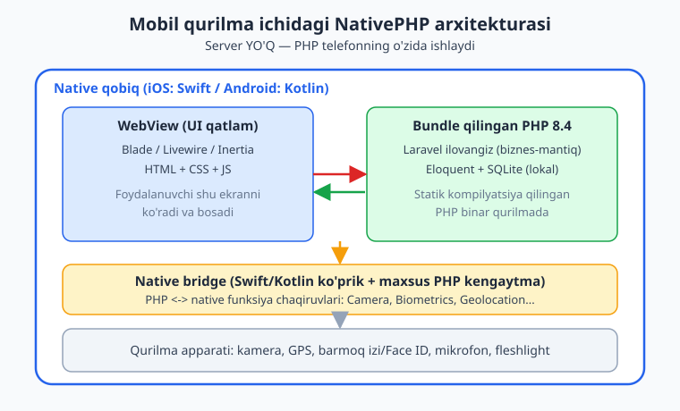
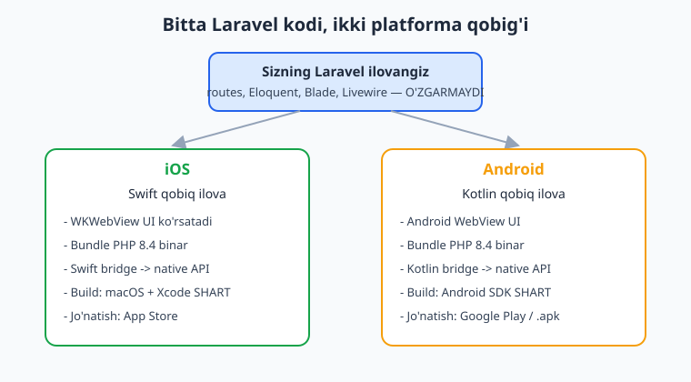
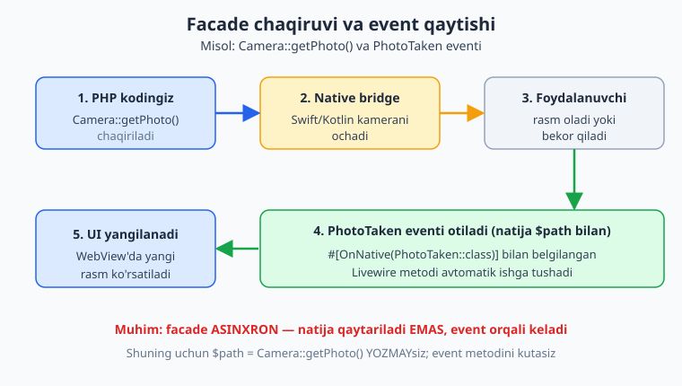

# 10 — Mobil ilova asoslari

[⬅️ Oldingi: 09 — Desktop UI: Blade, Livewire, assets](./09-desktop-ui-blade-livewire.md) · [🏠 README](./README.md) · [Keyingi: 11 — Mobil UI va navigatsiya ➡️](./11-mobil-ui-navigatsiya.md)

---

> **Bu bobda:** NativePHP'ning eng hayratlanarli qismiga — mobil ilovalarga o'tamiz. Bu yerda siz `nativephp/mobile` paketini, `NATIVEPHP_APP_ID` sozlamasini, `php artisan native:install` va `php artisan native:run` buyruqlarini o'rganasiz. Eng muhimi — **on-device PHP runtime** arxitekturasini tushunasiz: PHP server'da emas, balki **telefonning o'zida** ishlaydi. iOS uchun Swift qobiq, Android uchun Kotlin qobiq qanday farq qilishini, v3 plugin tizimini va facade'lar (Camera, Biometrics, Geolocation, Dialog, System) `OnNative` eventlari orqali qanday ishlashini ko'ramiz.
>
> **HALOL eslatma:** NativePHP "sof native widget" yaratmaydi — sizning Laravel ilovangizni native qobiq ichidagi **webview**'da ishga tushiradi (UI = HTML/CSS/JS = Blade/Livewire/Inertia; biznes-mantiq = qurilmada ishlovchi PHP). Bu bobdagi **Laravel/PHP kod sintaksisi tekshirilgan** (`php -l` + Laravel boot), lekin **emulator/qurilma/build bloklari illustrativ** — ularni ishga tushirish macOS+Xcode (iOS) yoki Android SDK (Android) va real qurilma talab qiladi, bu muhitda yo'q. Soxta "qurilmada ishladi" yozilmagan.

---

## Desktop'dan mobilga: nima o'zgaradi?

Oldingi boblarda biz `nativephp/desktop` bilan ishladik. U sizning Laravel ilovangizni **Electron** qobig'i ichida ishga tushirardi: PHP binar kompyuterda bundle qilinib, Chromium webview UI'ni ko'rsatardi.

Mobil ham xuddi shu falsafaga ega, lekin qobiq boshqacha:

| | Desktop (`nativephp/desktop`) | Mobil (`nativephp/mobile`) |
|---|---|---|
| Qobiq | Electron (Chromium + Node) | iOS: Swift / Android: Kotlin |
| UI qatlami | webview (Chromium) | platforma WebView'i (WKWebView / Android WebView) |
| PHP | kompyuterda bundle qilingan binar | **qurilmada** bundle qilingan PHP 8.4 binar |
| Bog'liqliklar | Node 22+, Electron | iOS: Xcode (macOS) / Android: Android SDK |
| Tarqatish | `.exe`, `.dmg`, `.AppImage` | App Store / Google Play / `.apk` |

Eng katta tushuncha shu: **biznes-mantiq qatlamingiz (route'lar, Eloquent, Blade, Livewire) deyarli o'zgarmaydi.** Siz yangi til o'rganmaysiz, SwiftUI yoki Jetpack Compose yozmaysiz. Siz allaqachon biladigan Laravel'ni yozasiz — NativePHP uni telefon ichida ishlatadi.

> Laravel asoslari bo'yicha eslatma kerak bo'lsa: [../laravel/README.md](../laravel/README.md). PHP sintaksisi uchun: [../php/README.md](../php/README.md).

## On-device PHP runtime — eng muhim tushuncha

An'anaviy mobil PHP yondashuvlari (masalan PWA yoki remote server) PHP'ni **uzoq server**da ishlatadi: telefon faqat HTTP so'rov yuboradi. NativePHP mobil esa boshqacha — **PHP'ning o'zi qurilmada ishlaydi.**

Rasmiy hujjatlarda aytilganidek (nativephp.com/docs/mobile/3): "NativePHP — bu o'z turidagi birinchi kutubxona bo'lib, to'liq PHP ilovalarni mobil qurilmalarda **native** ishga tushiradi — web server kerak emas."

Bu qanday ishlaydi? Uch qatlam:

1. **Oldindan kompilyatsiya qilingan PHP** (statik binar, PHP 8.4) sizning kodingiz bilan birga Swift/Kotlin qobiq ilovaga bundle qilinadi.
2. **Swift/Kotlin ko'priklari** (bridges) PHP muhitini boshqaradi va sizning PHP kodingizni to'g'ridan-to'g'ri ishga tushiradi.
3. **Maxsus PHP kengaytma** PHP ichiga kompilyatsiya qilinadi va native funksiyalarni (kamera, GPS, barmoq izi) PHP'ga ochib beradi.

UI esa native WebView'da ko'rsatiladi — sizning Blade/Livewire sahifalaringiz HTML sifatida render bo'ladi.



Nega bu muhim?

- **Internet kerak emas.** Ilova offline ishlaydi — PHP va SQLite qurilmaning o'zida.
- **Tezlik.** Server bilan tarmoq aloqasi yo'q; mantiq lokal bajariladi.
- **Maxfiylik.** Ma'lumotlar qurilmada qoladi (agar siz uzoq API'ga yubormasangiz).

> **HALOL:** Bu "PHP telefonda ishlaydi" iborasi to'liq haqiqat. Lekin UI baribir webview ichidagi HTML — sof native SwiftUI/Compose widget emas. Foydalanuvchi farqni sezmasligi mumkin, lekin arxitekturani bilish muhim.

## iOS (Swift qobiq) vs Android (Kotlin qobiq)

Sizning Laravel kod-bazangiz bitta. Lekin NativePHP uni ikki xil qobiqqa joylaydi:



- **iOS:** Swift bilan yozilgan qobiq ilova. UI `WKWebView`'da. Build qilish uchun **macOS + Xcode** shart. Jo'natish — App Store (Apple Developer hisobi kerak).
- **Android:** Kotlin bilan yozilgan qobiq ilova. UI Android WebView'da. Build uchun **Android SDK** kerak (Windows, macOS yoki Linux'da). Jo'natish — Google Play yoki to'g'ridan-to'g'ri `.apk`.

Native API'lar (kamera, biometrika) har platformada o'z tabiiy implementatsiyasiga ega, lekin sizga bir xil PHP facade ko'rinadi. Masalan `Biometrics::prompt()` iOS'da Face ID/Touch ID'ni, Android'da barmoq izi/yuz qulfini chaqiradi — kodingiz bir xil.

## O'rnatish: paket, APP_ID va native:install

NativePHP mobil — `composer` paketi. v3 (2026-fevraldan) MIT litsenziyasi ostida, plugin tizimi bilan keladi.

```bash
# Yangi Laravel loyiha ichida (NativePHP yangi loyihada o'rnatishni tavsiya qiladi)
composer require nativephp/mobile
```

Keyin `.env` faylida ilova identifikatorini belgilang. Bu **teskari-domen** (reverse-domain) ko'rinishida bo'ladi:

```bash
# .env
NATIVEPHP_APP_ID=com.kompaniya.ilova
NATIVEPHP_APP_VERSION="1.0.0"
NATIVEPHP_APP_VERSION_CODE="1"

# iOS uchun (App Store): Apple Developer "Team ID"
NATIVEPHP_DEVELOPMENT_TEAM=ABCDE12345
```

`NATIVEPHP_APP_ID` — bu ilovangizning butun dunyo bo'ylab noyob identifikatori (masalan `com.ioqil.kundalik`). U `com.` bilan boshlanadi, keyin kompaniya/domen va ilova nomi keladi. App Store/Google Play'da shu ID asosida ilova taniladi.

Endi o'rnatish buyrug'i:

```bash
php artisan native:install
```

Bu buyruq:

- `nativephp/` papkasini va `config/nativephp.php` faylini yaratadi.
- Sizdan ICU-yoqilgan PHP binar haqida so'rashi mumkin (agar `intl` kengaytma kerak bo'lsa — masalan Filament uchun).

> **Muhim:** `nativephp/` papkasini **vaqtinchalik** (ephemeral) deb hisoblang va `.gitignore`'ga qo'shing. U build artifaktlarini saqlaydi, manba kod emas.

`native:install` foydali bayroqlari (rasmiy `commands` sahifasidan):

- `--force` — qayta o'rnatish/ustiga yozish.
- `--fresh` — toza holatdan o'rnatish.
- `--with-icu` / `--without-icu` — ICU PHP binar tanlovi.
- `--skip-php` — PHP binarni yuklab olishni o'tkazib yuborish.

> **Windows eslatmasi:** WSL emas, to'g'ridan Windows'da ishlang. `C:\temp` papkasini va loyiha papkangizni Windows Defender istisnolariga qo'shing — bu Composer va build tezligini sezilarli oshiradi.

> **HALOL — illustrativ:** Bu bobdagi `composer require`, `native:install` va `native:run` buyruqlari **rasmiy va to'g'ri**, lekin ushbu muhitda **ishga tushirilmagan** (mobil build muhiti — Xcode/Android SDK + qurilma yo'q). Pastda men ko'rsatadigan terminal natijalari rasmiy hujjatlardagi kabi **illustrativ** misollardir, soxta "build muvaffaqiyatli" emas.

## Ilovani ishga tushirish: native:run

Emulator yoki real qurilmada ishga tushirish uchun:

```bash
php artisan native:run
```

Buyruq sizdan platforma (iOS/Android) va qurilma/emulatorni tanlashni so'raydi. To'g'ridan ko'rsatish ham mumkin (rasmiy `commands` sahifasi):

```bash
# Platforma va qurilma UDID'ini bevosita berish
php artisan native:run android

# Foydali bayroqlar:
#   --build=debug      debug build (default)
#   --watch            kod o'zgarganda qayta yuklash
#   --start-url=...    boshlang'ich URL
#   --no-tty           interaktiv bo'lmagan rejim
```

Boshqa foydali buyruqlar:

```bash
php artisan native:open        # iOS uchun Xcode / Android Studio loyihasini ochadi
php artisan native:tail        # qurilmadan (faqat Android) Laravel log oqimini ko'rsatadi
php artisan native:version     # NativePHP versiyasi
php artisan native:watch       # fayl o'zgarishlarini kuzatish
```

> **HALOL — illustrativ:** Quyidagi `native:run` natijasi **rasmiy hujjatlardagi kabi ko'rinish** (illustrativ). Bu muhitda emulator/qurilma yo'q, shuning uchun bu HAQIQATDA ishga tushirilmagan:

```text
# (illustrativ — bu muhitda ishga tushmagan)
$ php artisan native:run android
  Building app...
  Selecting device: Pixel_7_API_34 (emulator)
  Installing com.kompaniya.ilova...
  Launching...
```

## v3 plugin tizimi

NativePHP mobil v3 **plugin** asosida qurilgan. "Core" pluginlar (rasmiy ravishda qo'llab-quvvatlanadigan) quyidagilarni qamraydi: Camera, Biometrics, Geolocation, PushNotifications, Dialog, System va boshqalar. Siz o'z pluginlaringizni ham yarata olasiz.

Plugin buyruqlari (rasmiy `commands` sahifasi):

```bash
php artisan native:plugin:create     # yangi plugin yaratish
php artisan native:plugin:list       # o'rnatilgan pluginlar ro'yxati
php artisan native:plugin:register   # plugin ro'yxatga olish
php artisan native:plugin:validate   # plugin tekshirish
php artisan native:plugin:uninstall  # plugin o'chirish
```

Har bir native imkoniyat (kamera, GPS, ...) — bu plugin. Ko'pchilik plugin ishlashi uchun `config/nativephp.php`'da tegishli **ruxsat** (permission) yoqilishi kerak. Masalan kamera uchun `camera` ruxsati.

## Facade'lar va OnNative event modeli

Mana NativePHP mobilning eng muhim naqshi (pattern). Native imkoniyatlar **asinxron** — siz facade'ni chaqirasiz, lekin natija darhol qaytmaydi. Natija **event** orqali keladi.



Misol — kamera. Rasmiy hujjatlardagi `Native\Mobile\Facades\Camera` facade'i:

```php
use Native\Mobile\Facades\Camera;

Camera::getPhoto();   // kamerani ochadi — lekin rasmni QAYTARMAYDI
```

E'tibor bering: `$path = Camera::getPhoto()` **yozmaysiz**. Buning o'rniga, rasm olingach `PhotoTaken` eventi otiladi va siz uni `#[OnNative(...)]` atributi bilan tutasiz:

```php
use Native\Mobile\Attributes\OnNative;
use Native\Mobile\Events\Camera\PhotoTaken;

#[OnNative(PhotoTaken::class)]
public function onPhoto(string $path): void
{
    // $path — olingan rasm fayli yo'li
    $this->photoPath = $path;
}
```

Bu naqsh Livewire bilan juda yaxshi mos keladi: facade chaqiruvi -> native oyna -> event -> Livewire metodi -> UI yangilanadi.

### Tasdiqlangan facade'lar va metodlar

Quyidagilar nativephp.com/docs/mobile/3 hujjatlaridan **aniq olingan**. Aniq imzo va to'liq variantlar uchun har doim rasmiy docs'ni ko'ring.

**Camera** (`Native\Mobile\Facades\Camera`):

```php
Camera::getPhoto();                  // rasm olish -> PhotoTaken eventi ($path)
Camera::recordVideo(['maxDuration' => 30]); // video -> VideoRecorded ($path, $mimeType)
Camera::pickImages('images', true);  // galereyadan tanlash -> MediaSelected
// Diqqat: MediaSelected eventi Gallery papkasida —
//   Native\Mobile\Events\Gallery\MediaSelected (Camera emas, Gallery!)
```

**Biometrics** (`Native\Mobile\Facades\Biometrics`):

```php
Biometrics::prompt();                // Face ID / barmoq izi -> Biometric\Completed (bool $success)
```

**Geolocation** (`Native\Mobile\Facades\Geolocation`):

```php
Geolocation::getCurrentPosition();      // tarmoq orqali (tezroq, kamroq aniq)
Geolocation::getCurrentPosition(true);  // GPS (sekinroq, aniqroq)
Geolocation::checkPermissions();
Geolocation::requestPermissions();
// -> LocationReceived eventi: $success, $latitude, $longitude, $accuracy, $timestamp, $provider, $error
```

**Dialog** (`Native\Mobile\Facades\Dialog`):

```php
Dialog::toast('Saqlandi!', 'short');  // 'short' ~2s, 'long' ~4s
// Apostrofli matnlar uchun DOUBLE-quote (") ishlating — single-quote (')
// ichida literal apostrof string'ni erta tugatib, parse error beradi.
Dialog::alert('Tasdiq', "O'chirilsinmi?", ['Bekor', "O'chirish"])
    ->id('delete-confirm')
    ->show();
// -> Alert\ButtonPressed eventi: $index, $label, $id
```

**System** (`Native\Mobile\Facades\System`):

```php
System::isIos();        // bool
System::isAndroid();    // bool
System::isMobile();     // bool — iOS yoki Android
System::appSettings();  // qurilma sozlamalarida ilova sahifasini ochadi
System::flashlight();   // fleshlightni yoqadi/o'chiradi
```

> **HALOL:** Bu facade'lar **faqat qurilmada/emulatorda** ishlaydi — chunki native bridge va PHP runtime o'sha yerda. Bu muhitda (oddiy server, mobil runtime yo'q) ular ishga tushmaydi. Lekin yuqoridagi kod **sintaktik to'g'ri** (php -l bilan tekshirilgan) va imzolar rasmiy hujjatlardan olingan.

## To'liq misol: kamera + biometrika + lokatsiya Livewire komponenti

Mana barcha tushunchalarni birlashtirgan Livewire komponenti. Bu **PHP sintaksisi tekshirilgan** (php -l), lekin native qism faqat qurilmada ishlaydi (illustrativ).

```php
<?php

namespace App\Livewire;

use Livewire\Component;
use Native\Mobile\Facades\Camera;
use Native\Mobile\Facades\Biometrics;
use Native\Mobile\Facades\Geolocation;
use Native\Mobile\Facades\Dialog;
use Native\Mobile\Facades\System;
use Native\Mobile\Attributes\OnNative;
use Native\Mobile\Events\Camera\PhotoTaken;
use Native\Mobile\Events\Biometric\Completed;
use Native\Mobile\Events\Geolocation\LocationReceived;

class CameraComponent extends Component
{
    public ?string $photoPath = null;
    public ?float $latitude = null;
    public ?float $longitude = null;
    public bool $unlocked = false;

    public function takePhoto(): void
    {
        Camera::getPhoto();
    }

    #[OnNative(PhotoTaken::class)]
    public function onPhoto(string $path): void
    {
        $this->photoPath = $path;
    }

    public function authenticate(): void
    {
        Biometrics::prompt();
    }

    #[OnNative(Completed::class)]
    public function onBiometric(bool $success): void
    {
        $this->unlocked = $success;
    }

    public function locate(): void
    {
        Geolocation::getCurrentPosition(true);
    }

    #[OnNative(LocationReceived::class)]
    public function onLocation(
        bool $success,
        ?float $latitude = null,
        ?float $longitude = null,
    ): void {
        if ($success) {
            $this->latitude = $latitude;
            $this->longitude = $longitude;
        }
    }

    public function notify(): void
    {
        Dialog::toast('Saqlandi!', 'short');

        if (System::isAndroid()) {
            Dialog::alert('Salom', 'Android qurilmadasiz', ['OK'])->show();
        }
    }

    public function render()
    {
        return view('livewire.camera-component');
    }
}
```

Blade ko'rinishi (`resources/views/livewire/camera-component.blade.php`):

```blade
<div class="p-4 space-y-4">
    <button wire:click="takePhoto" class="btn">Rasm olish</button>
    <button wire:click="authenticate" class="btn">Qulfni ochish</button>
    <button wire:click="locate" class="btn">Lokatsiyani aniqlash</button>

    @if ($photoPath)
        <p>Rasm: {{ $photoPath }}</p>
    @endif

    @if ($unlocked)
        <p class="text-green-600">Tasdiqlandi!</p>
    @endif

    @if ($latitude)
        <p>Koordinata: {{ $latitude }}, {{ $longitude }}</p>
    @endif
</div>
```

> **HALOL:** Yuqoridagi PHP komponent `php -l` bilan tekshirilib, "No syntax errors detected" natijasini berdi. Lekin `Native\Mobile\*` sinflari faqat qurilmada/`nativephp/mobile` o'rnatilgan loyihada mavjud. Bu muhitda men sintaksisni tekshirdim, runtime'ni emas.

## Host-ilova: oddiy Laravel — har joyda bir xil

Eng yaxshi xabar: ilovangizning **biznes-mantiq qismi** oddiy Laravel. Quyidagi `Note` modeli, controller va route'lar desktop'da ham, mobilda ham, hatto oddiy web'da ham bir xil ishlaydi. Bu kod **Laravel boot bilan tekshirilgan** (model + validatsiya ishlaydi).

```php
// app/Models/Note.php
namespace App\Models;

use Illuminate\Database\Eloquent\Model;

class Note extends Model
{
    protected $fillable = ['title', 'body'];
}
```

```php
// app/Http/Controllers/NoteController.php
namespace App\Http\Controllers;

use App\Models\Note;
use Illuminate\Http\Request;

class NoteController extends Controller
{
    public function index()
    {
        $notes = Note::query()->latest()->get();

        return view('notes.index', ['notes' => $notes]);
    }

    public function store(Request $request)
    {
        $data = $request->validate([
            'title' => ['required', 'string', 'max:120'],
            'body' => ['nullable', 'string'],
        ]);

        Note::create($data);

        return redirect()->route('notes.index');
    }
}
```

```php
// routes/web.php
use App\Http\Controllers\NoteController;

Route::get('/notes', [NoteController::class, 'index'])->name('notes.index');
Route::post('/notes', [NoteController::class, 'store'])->name('notes.store');
```

Mobilda ma'lumotlar **lokal SQLite**'da (qurilmada) saqlanadi — Eloquent xuddi shu tarzda ishlaydi. SQL haqida chuqurroq: [../sql/README.md](../sql/README.md).

## Build va tarqatish (qisqacha — keyingi boblarda chuqur)

To'liq build/release boblari keyinroq, lekin asosiy buyruqlar:

```bash
php artisan native:package android   # platforma uchun paket (.apk/.aab yoki .ipa)
php artisan native:release <type>    # release tayyorlash
php artisan native:credentials       # imzolash sertifikatlari
```

> **HALOL — illustrativ:** Bu buyruqlar **macOS+Xcode (iOS)** yoki **Android SDK (Android)** talab qiladi va imzolash sertifikatlarini sozlashni so'raydi. Bu muhitda ularni ishga tushirib bo'lmaydi. Buyruq nomlari rasmiy hujjatlardan.

## Mashqlar

### Oson

1. `NATIVEPHP_APP_ID` qanday formatda bo'ladi? `Kundalik` nomli ilova uchun `ioqil.uz` domenidan foydalanib bitta to'g'ri APP_ID yozing.
2. Desktop va mobil NativePHP qobiqlari nimasi bilan farq qiladi? Jadval ko'rinishida 3 ta farqni yozing.
3. NativePHP mobil paketini o'rnatish va o'rnatuvchini ishga tushirish uchun ikkita buyruqni yozing.
4. `System` facade'ining uchta tekshiruv metodini (is...) yozing va har biri nima qaytarishini aytib bering.
5. Nima uchun `$path = Camera::getPhoto()` yozish noto'g'ri? Bir jumlada tushuntiring.
6. `php artisan native:run` qanday tanlovni so'raydi? Buyruqni Android uchun bevosita ko'rsatadigan variantini yozing.

### O'rta

7. Biometrik autentifikatsiya uchun to'liq oqim yozing: `prompt()` chaqiruvi va `#[OnNative(Completed::class)]` bilan belgilangan handler metod. Handler `bool $success` qabul qilsin.
8. Geolokatsiyani GPS rejimida olib, `LocationReceived` eventidan `$latitude` va `$longitude`'ni Livewire xususiyatlariga yozadigan komponent metodlarini yozing.
9. `Dialog::alert(...)` bilan "O'chirilsinmi?" tasdiq oynasi ko'rsatib, `ButtonPressed` eventida foydalanuvchi "O'chirish" tugmasini bosganini tekshiradigan kod yozing (`->id()` ishlating).
10. On-device PHP runtime arxitekturasining uch qatlamini (PHP binar, Swift/Kotlin bridge, PHP kengaytma) o'z so'zlaringiz bilan tushuntiring.
11. v3 plugin tizimida core pluginni ro'yxatdan o'tkazish, ro'yxatini ko'rish va o'chirish uchun uchta `native:plugin:*` buyrug'ini yozing.
12. Nima uchun bir xil Laravel kod-bazasi iOS va Android'da ishlay oladi? `Biometrics::prompt()` misolida tushuntiring.

### Qiyin

13. To'liq Livewire komponenti yozing: u rasm oladi (`Camera`), lokatsiyani aniqlaydi (`Geolocation`) va ularni `Note` modeliga lokal SQLite'ga saqlaydi. Event handlerlarni `OnNative` bilan belgilang. (Faqat PHP qismi; native runtime illustrativ.)
14. "NativePHP sof native widget yaratadi" degan da'voni rad eting. Arxitektura nuqtai nazaridan UI qaysi qatlamda ekanini va biznes-mantiq qaysi qatlamda ekanini batafsil tushuntiring.
15. Bir o'quvchi shikoyat qilmoqda: "Men `native:run` ni Windows'da iOS uchun ishga tushira olmadim." Nima uchun? To'g'ri javob bering va Android varianti Windows'da nega ishlashini ayting.

<details markdown="1"><summary>Yechimlar</summary>

**1.** Teskari-domen formati: `uz.ioqil.kundalik`. Domen `ioqil.uz` teskari yozilib (`uz.ioqil`), ilova nomi qo'shiladi. Yoki ko'p ishlatiladigan `com.` bilan: agar `.com` domeningiz bo'lsa `com.ioqil.kundalik`. Asosiysi — noyob, kichik harf, teskari-domen.

**2.** Farqlar:

| Jihat | Desktop | Mobil |
|---|---|---|
| Qobiq | Electron (Chromium+Node) | iOS Swift / Android Kotlin |
| Build talabi | Node 22+ | Xcode (macOS) / Android SDK |
| Tarqatish | .exe/.dmg/.AppImage | App Store / Google Play / .apk |

**3.**
```bash
composer require nativephp/mobile
php artisan native:install
```

**4.** `System::isIos()` — iOS'da `true`; `System::isAndroid()` — Android'da `true`; `System::isMobile()` — iOS yoki Android'da `true`. Hammasi `bool` qaytaradi.

**5.** Chunki native facade'lar **asinxron** — `getPhoto()` kamerani ochadi, lekin rasm darhol tayyor bo'lmaydi (foydalanuvchi rasm olishi kerak). Natija `PhotoTaken` eventi orqali keladi, qaytarish qiymati sifatida emas.

**6.**
```bash
php artisan native:run          # platforma + qurilma/emulatorni so'raydi
php artisan native:run android  # to'g'ridan Android
```

**7.**
```php
use Native\Mobile\Facades\Biometrics;
use Native\Mobile\Attributes\OnNative;
use Native\Mobile\Events\Biometric\Completed;

public function authenticate(): void
{
    Biometrics::prompt();
}

#[OnNative(Completed::class)]
public function onBiometric(bool $success): void
{
    $this->unlocked = $success;
}
```

**8.**
```php
use Native\Mobile\Facades\Geolocation;
use Native\Mobile\Attributes\OnNative;
use Native\Mobile\Events\Geolocation\LocationReceived;

public ?float $latitude = null;
public ?float $longitude = null;

public function locate(): void
{
    Geolocation::getCurrentPosition(true); // GPS rejimi
}

#[OnNative(LocationReceived::class)]
public function onLocation(bool $success, ?float $latitude = null, ?float $longitude = null): void
{
    if ($success) {
        $this->latitude = $latitude;
        $this->longitude = $longitude;
    }
}
```

**9.**
```php
use Native\Mobile\Facades\Dialog;
use Native\Mobile\Attributes\OnNative;
use Native\Mobile\Events\Alert\ButtonPressed;

public function confirmDelete(): void
{
    // Apostrofli string DOUBLE-quote bilan: "O'chirilsinmi?", "O'chirish"
    Dialog::alert('Tasdiq', "O'chirilsinmi?", ['Bekor', "O'chirish"])
        ->id('delete-confirm')
        ->show();
}

#[OnNative(ButtonPressed::class)]
public function onButton(int $index, string $label, ?string $id = null): void
{
    if ($id === 'delete-confirm' && $label === "O'chirish") {
        // o'chirish mantig'i
    }
}
```

**10.** Uch qatlam:
- **Bundle PHP binar:** statik kompilyatsiya qilingan PHP 8.4 kodingiz bilan birga qobiqqa joylanadi va qurilmada ishlaydi.
- **Swift/Kotlin bridge:** native qobiq PHP muhitini ishga tushiradi va boshqaradi; UI bilan PHP o'rtasida xabar uzatadi.
- **Maxsus PHP kengaytma:** PHP ichiga kompilyatsiya qilinib, native funksiyalarni (kamera, GPS) PHP facade'lariga ochib beradi.

**11.**
```bash
php artisan native:plugin:register
php artisan native:plugin:list
php artisan native:plugin:uninstall
```

**12.** Chunki siz facade orqali **mavhum interfeys**ga murojaat qilasiz (`Biometrics::prompt()`). NativePHP'ning Swift bridge'i iOS'da uni Face ID/Touch ID API'siga, Kotlin bridge'i esa Android'da barmoq izi/yuz qulfi API'siga ulaydi. PHP kodingiz platformani bilmaydi — qobiq tarjima qiladi.

**13.**
```php
<?php

namespace App\Livewire;

use Livewire\Component;
use App\Models\Note;
use Native\Mobile\Facades\Camera;
use Native\Mobile\Facades\Geolocation;
use Native\Mobile\Attributes\OnNative;
use Native\Mobile\Events\Camera\PhotoTaken;
use Native\Mobile\Events\Geolocation\LocationReceived;

class NoteCapture extends Component
{
    public ?string $photoPath = null;
    public ?float $latitude = null;
    public ?float $longitude = null;

    public function takePhoto(): void
    {
        Camera::getPhoto();
    }

    #[OnNative(PhotoTaken::class)]
    public function onPhoto(string $path): void
    {
        $this->photoPath = $path;
    }

    public function locate(): void
    {
        Geolocation::getCurrentPosition(true);
    }

    #[OnNative(LocationReceived::class)]
    public function onLocation(bool $success, ?float $latitude = null, ?float $longitude = null): void
    {
        if ($success) {
            $this->latitude = $latitude;
            $this->longitude = $longitude;
        }
    }

    public function save(): void
    {
        Note::create([
            'title' => 'Joydagi eslatma',
            'body' => "Rasm: {$this->photoPath}; Koord: {$this->latitude},{$this->longitude}",
        ]);
    }

    public function render()
    {
        return view('livewire.note-capture');
    }
}
```
`Note::create(...)` qurilmadagi lokal SQLite'ga yozadi. Native qism (Camera/Geolocation) faqat qurilmada ishlaydi (illustrativ), lekin `Note` saqlash mantig'i sof Laravel.

**14.** NativePHP **sof native widget yaratmaydi.** Arxitektura:
- **UI qatlam = webview** ichidagi HTML/CSS/JS — sizning Blade/Livewire/Inertia sahifalaringiz. Bu SwiftUI yoki Jetpack Compose widgetlari EMAS.
- **Biznes-mantiq qatlam = PHP**, qurilmada ishlovchi bundle PHP runtime (Laravel kodingiz).
- Faqat **native bridge** orqali ayrim qurilma imkoniyatlari (kamera, GPS) native kodga ulanadi.
Demak foydalanuvchi ko'radigan tugma yoki ro'yxat — HTML element, native UIButton/Button emas. "Sof native" da'vosi noto'g'ri.

**15.** iOS ilovasini build qilish **Xcode talab qiladi**, Xcode esa **faqat macOS**'da ishlaydi. Windows'da Xcode yo'q, shuning uchun `native:run ios` Windows'da ishlamaydi — bu Apple cheklovi, NativePHP'ning kamchiligi emas. Android esa **Android SDK** bilan ishlaydi, u Windows/macOS/Linux'da mavjud — shuning uchun `native:run android` Windows'da to'g'ri ishlaydi. Demak Windows foydalanuvchisi Android'ni mahalliy build qila oladi, iOS uchun esa macOS (yoki CI/CD'dagi macOS runner) kerak.

</details>

---

[⬅️ Oldingi: 09 — Desktop UI: Blade, Livewire, assets](./09-desktop-ui-blade-livewire.md) · [🏠 README](./README.md) · [Keyingi: 11 — Mobil UI va navigatsiya ➡️](./11-mobil-ui-navigatsiya.md)
