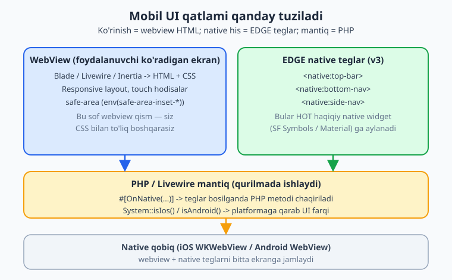
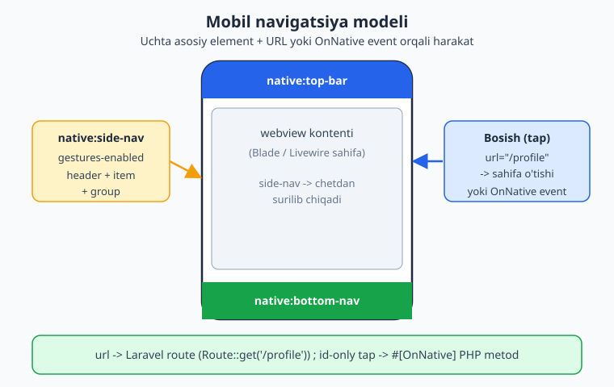
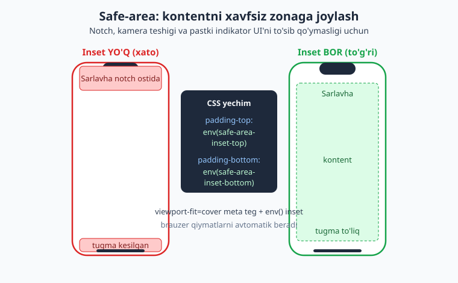

# 11 — Mobil UI va navigatsiya

[⬅️ Oldingi: 10 — Mobil ilova asoslari](./10-mobil-asoslari.md) · [🏠 README](./README.md) · [Keyingi: 12 — Qurilma imkoniyatlari I: Camera, Geo, Scanner ➡️](./12-qurilma-camera-geo-scanner.md)

---

> **Bu bobda:** Mobil ilovangizning ko'rinadigan qismini — UI va navigatsiyani — quramiz. NativePHP mobil UI'ning asosi **webview** ekanini chuqurroq tushunamiz: sahifalaringiz HTML/CSS bo'lib, native WebView (iOS `WKWebView`, Android WebView) ichida render bo'ladi. Responsive Blade/Livewire qanday yozilishini, telefon ekraniga mos **mobil navigatsiyani** (`<native:top-bar>`, `<native:bottom-nav>`, `<native:side-nav>` EDGE komponentlari), `icon` nomlari iOS'da **SF Symbols** va Android'da **Material Icons** ga qanday xaritalanishini ko'ramiz. So'ng webview ichidagi **touch hodisalar**, **safe-area** (notch va home-indikator), **native his** (ekran o'tishlari, tap feedback), **offline UI holati** va mobil dizayn tamoyillarini o'rganamiz. Native UI bosilganda PHP'ga qaytariladigan `#[OnNative]` event mexanizmini, hamda deep link orqali kelgan navigatsiyani Laravel route'lar bilan ulashni ko'rsatamiz.
>
> **HALOL eslatma:** NativePHP "sof native widget" yaratmaydi — Laravel ilovangizni native qobiq ichidagi **webview**'da ishga tushiradi. EDGE teglar (`<native:...>`) — v3'dagi qo'shimcha bo'lib, top-bar/bottom-nav kabi bir nechta **haqiqiy native** element beradi; qolgan ekran kontenti baribir webview HTML. Bu bobdagi **Laravel/PHP kod sintaksisi va mantig'i tekshirilgan** (`php -l`, assert bilan ishlatilgan, Laravel boot + Blade kompilyatsiya), lekin **emulator/qurilmadagi ko'rinish, ekran o'tishlari va native render bloklari illustrativ** — ularni ishga tushirish iOS uchun macOS+Xcode, Android uchun Android SDK va qurilma talab qiladi (bu muhitda yo'q). Soxta "qurilmada chiroyli ko'rindi" yozilmagan.

---

## Mobil UI'ning haqiqati: webview + bir necha native element

Oldingi bobda on-device PHP runtime'ni ko'rdik. Endi savol: foydalanuvchi nimani ko'radi?

Javob ikki qismdan iborat:

1. **Ko'rinishning katta qismi — webview HTML.** Sizning Blade/Livewire sahifalaringiz HTML+CSS+JS bo'lib, native WebView ichida render bo'ladi. Bu — desktop'dagi Chromium webview'ning telefon analogi. Demak, siz bilgan har bir CSS xususiyati, har bir Tailwind klassi, har bir Livewire komponenti shu yerda ishlaydi.
2. **EDGE native teglar (v3).** NativePHP v3 `<native:top-bar>`, `<native:bottom-nav>`, `<native:side-nav>` kabi **haqiqiy native UI** elementlarni qo'shdi. Bularni Blade ichida yozasiz, lekin ular webview'da emas — platformaning o'z native render tizimida chiziladi. iOS'da SF Symbols ikonkalar, Android'da Material Icons — foydalanuvchi platformasiga tabiiy ko'rinadi.



> **HALOL:** "EDGE native" degani — top-bar/bottom-nav kabi belgilangan to'plamdagi elementlar haqiqiy native. Bu butun ekraningiz SwiftUI/Compose bo'lib qoldi degani EMAS. Asosiy kontent baribir webview. EDGE'ning maqsadi — eng ko'p seziladigan "chrome" qismlarni (yuqori/pastki paneller) native qilib, ilovaga tabiiy his berish.

Laravel asoslari kerak bo'lsa: [../laravel/README.md](../laravel/README.md). Blade/Livewire chuqurroq kerak bo'lsa, oldingi desktop UI bobiga ham qarang: [09 — Desktop UI](./09-desktop-ui-blade-livewire.md).

## Responsive Blade/Livewire: telefon ekraniga moslash

Webview — kichik ekran. Desktop'da ishlagan layout telefonga to'g'ridan-to'g'ri ko'chmaydi. Mobil uchun **mobile-first** yondashuv kerak: avval kichik ekran uchun yozasiz, keyin kattaroq ekranlar uchun kengaytirasiz.

Eng birinchi — `viewport` meta teg. Mobil layout to'g'ri ishlashi uchun u shart:

```blade
{{-- resources/views/layouts/mobile.blade.php --}}
<!DOCTYPE html>
<html lang="uz">
<head>
    <meta charset="utf-8">
    {{-- viewport-fit=cover -> safe-area inset'lar ishlashi uchun (pastda batafsil) --}}
    <meta name="viewport" content="width=device-width, initial-scale=1, viewport-fit=cover">
    @vite(['resources/css/app.css', 'resources/js/app.js'])
</head>
<body class="bg-white text-slate-900">
    {{ $slot }}
</body>
</html>
```

Tailwind bilan responsive juda sodda — `sm:`, `md:` prefikslari ekran kengligiga qarab ishlaydi. Mobil-first'da prefikssiz klass kichik ekran uchun:

```blade
{{-- Kichik ekranda 1 ustun, kengroq ekranda 2 ustun --}}
<div class="grid grid-cols-1 sm:grid-cols-2 gap-3 p-4">
    @foreach($mahsulotlar as $m)
        <div class="rounded-xl border border-slate-200 p-4">
            <h3 class="text-lg font-semibold">{{ $m->nom }}</h3>
            <p class="text-slate-500">{{ $m->narx }} so'm</p>
        </div>
    @endforeach
</div>
```

Livewire mobil'da xuddi server'dagidek ishlaydi — farqi shundaki, "server" telefonning o'zida. Hodisalar (`wire:click`, `wire:model`) lokal PHP runtime'ga boradi, tarmoq kerak emas. Bu offline ishlashning kalitidir.

```php
<?php
// app/Livewire/Counter.php — oddiy Livewire komponent (mobil'da ham ishlaydi)

namespace App\Livewire;

use Livewire\Component;

class Counter extends Component
{
    public int $soni = 0;

    public function oshir(): void
    {
        $this->soni++;
    }

    public function render()
    {
        return view('livewire.counter');
    }
}
```

```blade
{{-- resources/views/livewire/counter.blade.php --}}
<div class="p-6 text-center">
    <p class="text-4xl font-bold">{{ $soni }}</p>
    {{-- min-h-[44px] -> barmoq uchun yetarli katta touch target (pastda) --}}
    <button wire:click="oshir" class="mt-4 min-h-[44px] px-6 rounded-lg bg-blue-600 text-white">
        Oshirish
    </button>
</div>
```

> **Eslatma:** Livewire komponent mantig'i [../laravel/README.md](../laravel/README.md) dagi bilan bir xil. Bu yerda yangi narsa yo'q — shuning uchun aynan shu kod desktop'da ham, mobil'da ham, oddiy web'da ham ishlaydi. NativePHP'ning kuchi shu: bitta kod-baza.

## Mobil navigatsiya: EDGE komponentlari

Mobil ilova navigatsiyasi desktop'dan farq qiladi. Telefonda uchta klassik patternga ega bo'lasiz:

- **Top bar** — yuqorida sarlavha + harakat tugmalari.
- **Bottom navigation** — pastda 3-5 ta asosiy bo'lim (Instagram, Telegram kabi).
- **Side navigation** (drawer) — chetdan surilib chiquvchi menyu.

NativePHP v3 bularni **EDGE native teglar** sifatida beradi. Quyidagi misollar — rasmiy hujjatlardan (`nativephp.com/docs/mobile/3/edge-components/...`) olingan aniq sintaksis.



### Top bar — `<native:top-bar>`

```blade
<native:top-bar title="Boshqaruv paneli" subtitle="Xush kelibsiz">
    <native:top-bar-action
        id="search"
        label="Qidiruv"
        icon="search"
        :url="route('search')"
    />
    <native:top-bar-action
        id="settings"
        icon="settings"
        label="Sozlamalar"
        url="/profile"
    />
</native:top-bar>
```

`<native:top-bar>` qabul qiladigan atributlar (rasmiy docs'dan):

- `title` — sarlavha (shart).
- `subtitle` — ixtiyoriy kichik sarlavha.
- `show-navigation-icon` — orqaga/menyu tugmasi (default `true`).
- `background-color`, `text-color` — hex rang.
- `elevation` — soya chuqurligi 0-24 (faqat Android).

Har bir `<native:top-bar-action>`:

- `id` — noyob identifikator.
- `icon` — ikonka nomi.
- `label` — ixtiyoriy (overflow menyu/accessibility uchun).
- `url` — bosilganda o'tiladigan URL (ixtiyoriy).

> Android dastlabki 3 ta harakatni ikonka qilib ko'rsatadi, ortig'i "overflow" menyuga yig'iladi; iOS 5 tadan ortig'ini yig'adi. Shuning uchun eng muhim harakatlarni birinchi qo'ying.

### Bottom navigation — `<native:bottom-nav>`

```blade
<native:bottom-nav label-visibility="labeled">
    <native:bottom-nav-item
        id="home"
        icon="home"
        label="Bosh"
        url="/home"
        :active="true"
    />
    <native:bottom-nav-item
        id="profile"
        icon="person"
        label="Profil"
        url="/profile"
        badge="3"
    />
</native:bottom-nav>
```

Idish (`<native:bottom-nav>`):

- `label-visibility` — `"labeled"`, `"selected"` yoki `"unlabeled"` (default `"labeled"`).
- `dark` — qorong'u rejimni majburlash (ixtiyoriy).

Element (`<native:bottom-nav-item>`):

- `id`, `icon`, `label`, `url` — shart.
- `active` — joriy bo'limni belgilash (boolean).
- `badge` — son/matn nishon (masalan o'qilmagan xabarlar).
- `news` — "yangi" nuqtasi (boolean).

> Bottom nav **5 tadan ortiq** element ko'tarmaydi — bu mobil dizayn qoidasi. Ko'proq bo'lim kerak bo'lsa, "Yana" tugmasi orqali side-nav'ga yo'naltiring.

### Side navigation (drawer) — `<native:side-nav>`

```blade
<native:side-nav gestures-enabled="true">
    <native:side-nav-header
        title="Mening ilovam"
        subtitle="oqil@example.uz"
        icon="person"
    />

    <native:side-nav-item id="home" label="Bosh" icon="home" url="/home" :active="true" />
    <native:side-nav-item id="orders" label="Buyurtmalar" icon="shopping_cart" url="/orders" badge="2" />

    <native:horizontal-divider />

    <native:side-nav-group heading="Hisob" :expanded="false">
        <native:side-nav-item id="profile" label="Profil" icon="person" url="/profile" />
        <native:side-nav-item id="settings" label="Sozlamalar" icon="settings" url="/settings" />
    </native:side-nav-group>
</native:side-nav>
```

- `<native:side-nav gestures-enabled="true">` — chetdan surib ochishga ruxsat.
- `<native:side-nav-header>` — sarlavha + subtitle + ikonka; `show-close-button` (Android'da default `true`).
- `<native:side-nav-item>` — `id`, `label`, `icon`, `url` shart; `active`, `badge` ixtiyoriy.
- `<native:side-nav-group heading=... :expanded=...>` — yig'iluvchi guruh.
- `<native:horizontal-divider />` — ajratuvchi chiziq.

> **HALOL tekshiruv:** Yuqoridagi EDGE teglar — Laravel Blade kompilyatori uchun **noma'lum namespace'li teglar**. Men aynan shu kabi Blade faylni (top-bar + bottom-nav `@foreach` bilan) Laravel probe'da kompilyatsiya qildim: `php blade.compiler->compileString(...)` xatosiz o'tdi, `native:` teglar literal markup sifatida saqlanadi (so'ng on-device runtime ularni native widget'ga aylantiradi). Demak sintaksis Laravel ilovangizni buzmaydi. Lekin **native render'ning o'zi** (haqiqiy panel chizilishi) faqat qurilmada ko'rinadi — bu muhitda emulator yo'q.

## Ikonkalar: bir nom, ikki platforma

EDGE'ning eng aqlli qismi — ikonka tizimi. Siz `icon="home"` deb yozasiz, NativePHP esa uni platformaga xaritalaydi:

- **iOS** → SF Symbols: `home` → `house.fill`, `settings` → `gearshape.fill`, `check` → `checkmark.circle.fill`.
- **Android** → Material Icons: ligature nomlar bilan, masalan `shopping_cart`, `qr_code_2`.

Agar to'g'ridan-to'g'ri platforma ikonkasini berishni xohlasangiz:

```blade
{{-- iOS SF Symbol (nuqta bilan) --}}
<native:bottom-nav-item id="car" icon="car.side.fill" label="Mashina" url="/car" />

{{-- Android Material Icon (pastki chiziq bilan) --}}
<native:bottom-nav-item id="qr" icon="qr_code_2" label="QR" url="/qr" />
```

Tizim to'rt bosqichli yechim strategiyasidan foydalanadi: avval to'g'ridan platforma ikonkasi, keyin qo'lda xaritalash, so'ng aqlli zaxira, oxirida default ikonka. Demak `icon="home"` deb yozsangiz, ikkala platformada ham mos ikonka chiqadi — alohida iflanmaysiz.

> **Maslahat:** Aniq SF Symbols nomlari uchun Apple'ning "SF Symbols" ilovasini, Material uchun fonts.google.com/icons'ni ko'ring. Umumiy nomlar (`home`, `search`, `person`, `settings`) ikkala platformada ham ishlaydi — odatda shularning o'zi yetadi.

## Native UI bosilganda PHP'ga qaytish: `#[OnNative]`

EDGE elementidagi `url` — sodda navigatsiya (Laravel route'ga o'tadi). Lekin ba'zan tap'ni **PHP mantig'i** bilan ushlamoqchisiz (masalan tab almashtirishda holatni yangilash, modal ochish). Buning uchun NativePHP'ning `#[OnNative]` atributi bor.

Rasmiy hujjatda (`nativephp.com/docs/mobile/3`) ko'rsatilgan mexanizm — Livewire metodiga `#[OnNative(...)]` atributini qo'shasiz, va native event kelganda u chaqiriladi:

```php
<?php
// app/Livewire/NavShell.php

namespace App\Livewire;

use Livewire\Component;
use Native\Mobile\Attributes\OnNative;
use Native\Mobile\Facades\System;

class NavShell extends Component
{
    public string $joriy = 'home';

    // Mahsulot rasmga olinganda kamera eventini ushlash (rasmiy misol)
    #[OnNative(\Native\Mobile\Events\Camera\PhotoTaken::class)]
    public function rasmKeldi(string $path): void
    {
        // $path — rasmga olingan fayl yo'li
    }

    // O'z custom eventingiz uchun (to'liq namespace string sifatida)
    #[OnNative('App\\Events\\TabTapped')]
    public function tabBosildi(string $id): void
    {
        $this->joriy = $id;
    }

    public function platformaUchun(): string
    {
        // System facade -> platformaga qarab UI farqi
        return System::isIos() ? 'ios-style' : 'android-style';
    }

    public function render()
    {
        return view('livewire.nav-shell');
    }
}
```

Muhim nuqtalar:

- Import: `use Native\Mobile\Attributes\OnNative;`.
- Eventlar **klass asosida** (string emas, balki klass nomi): masalan `Native\Mobile\Events\Camera\PhotoTaken::class`. Custom event uchun to'liq namespace'ni string sifatida bering.
- `Native\Mobile\Facades\System` facade'i platformani aniqlaydi: `System::isIos()`, `System::isAndroid()`, `System::isMobile()`. Bu UI'ni platformaga moslashda asqotadi (masalan iOS'da boshqa otstup/joylashuv, Android'da boshqa).

> **System facade (rasmiy docs'dan, aniq imzolar):** `isIos(): bool`, `isAndroid(): bool`, `isMobile(): bool`, `appSettings(): void` (qurilma sozlamalar ekranini ochadi), `flashlight(): void` (chiroqni yoqib/o'chiradi). Inertia/Vue/React uchun JS muqobil ham bor: `import { System } from '#nativephp'`.

> **HALOL — illustrativ:** Yuqoridagi `NavShell` klassi sintaksisini men `php -l` bilan tekshirdim (xato yo'q). Lekin `Native\Mobile\...` paketi bu muhitda **o'rnatilmagan** (mobil build muhiti yo'q), shuning uchun men tekshirgan faylda bu import'lar izohga olingan — kod **imzo jihatidan to'g'ri**, lekin facade'larning runtime bajarilishi faqat qurilmada bo'ladi. Aniq event klasslari ro'yxati uchun rasmiy docs'ni ko'ring; men faqat tasdiqlangan (`PhotoTaken`, `OnNative`, `System`) larni ishlatdim.

## Touch hodisalar: barmoq uchun ekran

Webview ichida sichqoncha emas, barmoq ishlaydi. Bir necha amaliy farq bor:

**1. Touch target o'lchami.** Barmoq sichqoncha kursoridan kattaroq. Apple va Google har ikkisi **kamida 44x44 px** (iOS) / **48x48 dp** (Android) tavsiya qiladi. Tugmalarni juda kichik qilmang:

```blade
{{-- Yetarli katta touch target --}}
<button class="min-h-[44px] min-w-[44px] px-4 rounded-lg bg-blue-600 text-white">
    Saqlash
</button>
```

**2. `:hover` ishlamaydi, `:active` ishlaydi.** Telefonda hover yo'q. Bosish feedback'i uchun `:active` yoki Tailwind `active:` ishlating:

```blade
<button class="bg-blue-600 active:bg-blue-700 transition-colors px-4 py-3 rounded-lg text-white">
    Bosing
</button>
```

**3. Tap-highlight va tanlash.** Mobil brauzer tap'da kulrang flesh ko'rsatadi va matn tanlanadi. Native his uchun ko'pincha buni o'chirasiz:

```css
/* resources/css/app.css */
* {
    -webkit-tap-highlight-color: transparent; /* kulrang flesh yo'q */
}
.no-select {
    -webkit-user-select: none; /* tugma matni tanlanmasin */
    user-select: none;
}
```

**4. Scroll inertiyasi.** iOS'da silliq "momentum" scroll uchun:

```css
.scroll-area {
    -webkit-overflow-scrolling: touch;
    overflow-y: auto;
}
```

> **Eslatma:** Murakkab gesture (swipe-to-delete, pinch-zoom) uchun JS kutubxonalari yoki `touchstart`/`touchmove`/`touchend` hodisalaridan foydalanasiz — bular oddiy webview JS, NativePHP'ga xos emas. Bu kod oddiy frontend bo'lgani uchun istalgan kutubxona (Hammer.js, Alpine) ishlaydi.

## Safe-area: notch va home-indikatorni hisobga olish

Zamonaviy telefonlarda ekranning yuqorisida **notch/kamera teshigi**, pastida **home-indikator** bor. Agar kontentingiz ekranning eng chetigacha cho'zilsa, sarlavha notch ostida yashirinishi yoki tugma home-indikator bilan kesilishi mumkin.



Yechim — CSS `env(safe-area-inset-*)`. Bu brauzer beradigan maxsus qiymatlar bo'lib, har bir tomondagi "xavfli" zonani aytadi. Ishlashi uchun avval `viewport` meta tegda `viewport-fit=cover` bo'lishi shart (yuqoridagi layout'da bor):

```css
/* resources/css/app.css */
.safe-top {
    padding-top: env(safe-area-inset-top);
}
.safe-bottom {
    padding-bottom: env(safe-area-inset-bottom);
}
/* Yoki hammasi birdaniga */
.safe-all {
    padding: env(safe-area-inset-top) env(safe-area-inset-right)
             env(safe-area-inset-bottom) env(safe-area-inset-left);
}
```

```blade
{{-- Notch ostida qolmaydigan sarlavha --}}
<header class="safe-top bg-white px-4 py-3 border-b border-slate-200">
    <h1 class="text-xl font-bold">Bosh sahifa</h1>
</header>

{{-- Pastki tugma home-indikator bilan kesilmaydi --}}
<footer class="safe-bottom fixed bottom-0 inset-x-0 bg-white p-4">
    <button class="w-full min-h-[44px] rounded-lg bg-blue-600 text-white">Davom etish</button>
</footer>
```

> **Muhim nuance:** Agar siz EDGE `<native:top-bar>` / `<native:bottom-nav>` ishlatsangiz, ular **native** bo'lgani uchun safe-area'ni o'zlari to'g'ri hisoblaydi — siz qo'lda `env()` qo'shmaysiz. `env(safe-area-inset-*)` asosan **webview kontentingizning** o'zi ekran chetiga tegsa kerak bo'ladi (masalan to'liq ekranli sahifa, custom header).

## Native his: ekran o'tishlari va silliqlik

Foydalanuvchi ilovani "native" deb his qilishi uchun bir necha kichik detal muhim:

**1. Tez va silliq o'tishlar.** Webview sahifa almashganda "oq miltillash" (flash) bo'lmasligi kerak. Livewire SPA-rejimi (`wire:navigate`) sahifani to'liq qayta yuklamasdan almashtiradi — bu native ilova hissini beradi:

```blade
{{-- wire:navigate -> sahifa to'liq reload bo'lmaydi, SPA kabi silliq --}}
<a href="/profile" wire:navigate class="text-blue-600">Profilga o'tish</a>
```

**2. CSS o'tishlari (transition).** Modal/panel ochilishida tabiiy animatsiya:

```css
.slide-up {
    transform: translateY(100%);
    transition: transform 0.25s ease-out;
}
.slide-up.open {
    transform: translateY(0);
}
```

**3. Tizim rangiga moslashish (dark mode).** Tailwind `dark:` variantlari `prefers-color-scheme` media query'ga ulanadi — qurilma qorong'u rejimda bo'lsa avtomatik moslashadi:

```blade
<div class="bg-white text-slate-900 dark:bg-slate-900 dark:text-slate-100">
    Tizim rejimiga moslashadi
</div>
```

PHP tomonda platformaga qarab farq kerak bo'lsa, yuqorida ko'rgan `System::isIos()` / `System::isAndroid()` ishlatiladi — masalan iOS'da boshqacha animatsiya egri chizig'i.

> **HALOL:** Bu animatsiya/o'tish kodlari — sof CSS/JS, qurilmada qanday ko'rinishi **illustrativ**. Men sintaksisni to'g'ri yozdim, lekin "silliq ko'rindi" deb tasdiqlay olmayman — buni faqat real qurilmada ko'rasiz.

## Offline UI holati

On-device PHP'ning eng kuchli tomoni — ilova internetsiz ham ishlaydi (PHP va SQLite qurilmada). Lekin baribir ba'zi amallar (uzoq API'ga yuborish, sinxronizatsiya) tarmoq talab qilishi mumkin. Yaxshi mobil UI offline holatni **ochiq ko'rsatadi** va amallarni navbatga oladi.

Quyidagi sof PHP klassi — offline holatni va navbatni boshqaradi. Bu **runnable** kod (men assert bilan ishlatib tekshirdim):

```php
<?php
// app/Support/OfflineState.php

class OfflineState
{
    private array $queue = [];

    public function __construct(private bool $online = true) {}

    public function setOnline(bool $v): void
    {
        $this->online = $v;
    }

    // Banner matni: online bo'lsa null, aks holda ogohlantirish
    public function banner(): ?string
    {
        return $this->online ? null : 'Oflayn rejim — internet yo\'q';
    }

    // Online -> darhol yuborish; offline -> navbatga
    public function submit(string $payload): string
    {
        if ($this->online) {
            return 'sent';
        }
        $this->queue[] = $payload;
        return 'queued';
    }

    public function pendingCount(): int
    {
        return count($this->queue);
    }

    public function flush(): array
    {
        $sent = $this->queue;
        $this->queue = [];
        return $sent;
    }
}
```

Blade'da banner shunday ko'rinadi:

```blade
@if($holat->banner())
    <div class="bg-amber-500 text-white text-center text-sm py-2 safe-top">
        {{ $holat->banner() }}
        @if($holat->pendingCount() > 0)
            ({{ $holat->pendingCount() }} ta amal navbatda)
        @endif
    </div>
@endif
```

Tarmoq holatini aniqlash uchun ikki yo'l: (1) webview tomonda JS `navigator.onLine` va `online`/`offline` hodisalari; (2) NativePHP'ning `Network` plugini (rasmiy docs'da `mobile/3/apis/network`) — aniq imzolar uchun rasmiy docs'ni ko'ring. Logikani yuqoridagi `OfflineState` kabi sof PHP'da saqlash testlash va ishonchlilik uchun yaxshi.

> **HALOL tekshiruv:** `OfflineState` klassini men `php -l` (sintaksis) va `php -d zend.assertions=1 OfflineState.php` (assert'lar) bilan ishlatdim — natija: `OfflineState OK`. Yuborish/navbatga olish/flush mantig'i to'g'ri ishlaydi. Bu kod NativePHP'ga bog'liq emas, shuning uchun har joyda ishlaydi.

## Deep link orqali navigatsiya

Mobil ilova tashqaridan ham ochilishi mumkin — masalan brauzerdagi havola yoki push xabar `myapp://product/42` ni ochib, ilovani to'g'ridan mahsulot sahifasiga olib boradi. Bu **deep link**.

Rasmiy docs'da (`nativephp.com/docs/mobile/3/concepts/deep-links`) deep link `.env` orqali sozlanadi:

```bash
# .env
# Custom URL sxema: myapp://...
NATIVEPHP_DEEPLINK_SCHEME=myapp

# Yoki Universal/App Link (HTTPS domen)
NATIVEPHP_DEEPLINK_HOST=example.net
```

Kelgan deep link sizning **oddiy Laravel route'laringizga** tushadi. Ya'ni `myapp://product/42` → `/product/42` route'iga boradi. Demak siz alohida hech narsa yozmaysiz — mavjud route'lar ishlaydi:

```php
<?php
// routes/web.php (mobil ilova route'lari)

use Illuminate\Support\Facades\Route;

Route::get('/home', fn () => view('mobile.home'))->name('home');
Route::get('/search', fn () => view('mobile.search'))->name('search');
Route::get('/profile', fn () => view('mobile.profile'))->name('profile');

// Deep link: myapp://product/42  ->  bu route
Route::get('/product/{id}', function (int $id) {
    return view('mobile.product', ['id' => $id]);
})->whereNumber('id')->name('product');
```

> **HALOL tekshiruv:** Men aynan shu route faylni Laravel probe'ga yukladim va boot qildim — barcha route'lar (`home`, `search`, `profile`, `product/{id}`) muvaffaqiyatli ro'yxatdan o'tdi. Demak deep link tushadigan route mantig'i to'g'ri. Lekin deep link'ni qurilmada **haqiqiy ochish** (sxema ro'yxatdan o'tishi, OS havolani ilovaga yo'naltirishi) faqat o'rnatilgan ilovada bo'ladi — bu illustrativ.

> Universal/App Link uchun serveringizda `.well-known/apple-app-site-association` (iOS) va `.well-known/assetlinks.json` (Android) fayllarini joylashtirasiz; NativePHP qolgan texnik sozlashni avtomatik bajaradi.

## Mobil dizayn tamoyillari (qisqa xulosa)

- **Bitta ekran — bitta asosiy maqsad.** Telefonda joy kam. Har sahifada bitta ustuvor amalni ajratib turing.
- **Bosh navigatsiya 5 tadan ko'p bo'lmasin.** Bottom-nav 3-5 element; ortig'i side-nav'ga.
- **Touch target ≥ 44px.** Barmoq aniq emas — kichik tugma jahl chiqaradi.
- **Safe-area'ni hurmat qiling.** Notch/indikator ostiga muhim narsa qo'ymang.
- **Holatni ko'rsating.** Yuklanish, offline, xato — foydalanuvchi nima bo'layotganini bilsin.
- **Platformaga moslang.** iOS va Android odatlari farq qiladi (orqaga tugmasi, ikonkalar). `System::isIos()` shu uchun bor.
- **Tez bo'l.** `wire:navigate`, kichik rasmlar, lazy-load. Webview tez bo'lsa, ilova native his beradi.

> Dizayn — keng mavzu. Frontend/CSS chuqurroq kerak bo'lsa, oldingi UI boblariga va Laravel/Livewire hujjatlariga qarang. Bu yerda diqqat — NativePHP'ga xos mobil jihatlar (EDGE, safe-area, `OnNative`, deep link).

## Mashqlar

### Oson

1. **Viewport meta.** Mobil layout'da `viewport` meta tegga qaysi atribut safe-area inset'lar ishlashi uchun shart? Yozing va nima uchun kerakligini tushuntiring.
2. **Bottom-nav.** 3 ta bo'limli (`home`, `search`, `profile`) `<native:bottom-nav>` yozing; `home` aktiv bo'lsin, `search`'da `badge="5"` bo'lsin.
3. **Touch target.** Quyidagi tugma nega mobil uchun yomon va qanday tuzatasiz? `<button class="text-xs p-1">OK</button>`
4. **Ikonka xaritalash.** `icon="home"` iOS va Android'da qaysi ikonkaga aylanadi? To'g'ridan-to'g'ri SF Symbol berishni xohlasangiz qanday yozasiz?
5. **System facade.** `Native\Mobile\Facades\System` ning to'rt metodini nomlang va har biri nima qiladi.
6. **Top-bar action.** `<native:top-bar>` ichida "Sozlamalar" harakatini yozing — `id`, `icon`, `label` va `/settings` URL bilan.

### O'rta

7. **Responsive grid.** Mobile-first Tailwind grid yozing: kichik ekranda 1 ustun, `sm`'da 2, `md`'da 3 ustun. Blade `@foreach` bilan mahsulotlar ro'yxatini ko'rsating.
8. **Safe-area header+footer.** Fixed yuqori header (`.safe-top`) va fixed pastki footer (`.safe-bottom`) yozing, ikkisi ham notch/home-indikatorni hisobga olsin. Kerakli CSS'ni ham bering.
9. **OnNative tab.** Livewire komponent yozing: `joriy` xususiyati bor, `#[OnNative('App\\Events\\TabTapped')]` metod tab `id`'sini qabul qilib `joriy`'ni yangilasin. Import qatorini ham yozing.
10. **Offline banner.** `OfflineState` klassidan foydalanib, Blade'da: online bo'lsa banner yo'q, offline bo'lsa amber banner + navbatdagi amallar soni ko'rsatilsin.
11. **Side-nav guruh.** `<native:side-nav>` yozing: header (ism + email), 2 ta tekis item, va "Hisob" deb nomlangan yig'ilgan (`:expanded="false"`) guruh ichida 2 ta item.
12. **Platforma farqi.** Livewire metodida `System::isIos()` orqali iOS'da `'rounded-t-2xl'`, Android'da `'rounded-t-lg'` klassini qaytaruvchi metod yozing.

### Qiyin

13. **Deep link arxitekturasi.** `myapp://order/99` deep link ilovani buyurtma sahifasiga olib borishi kerak. (a) `.env` ga nima yozasiz? (b) Qaysi route shu deep link'ni ushlaydi? (c) Bu jarayonda NativePHP qaysi qismni, Laravel qaysi qismni bajaradi — chizib tushuntiring.
14. **Offline-first oqim.** Foydalanuvchi offline'da forma yuboradi. Quyidagilarni tasvirlang: (a) UI qanday feedback beradi, (b) ma'lumot qayerda saqlanadi, (c) online bo'lganda sinxron qanday ishga tushadi. `OfflineState` mantig'idan foydalaning va offline navbatni SQLite bilan qanday davomiy (persistent) qilishni tushuntiring.
15. **EDGE vs webview qaror.** Sizda chat ilovasi bor: yuqorida sarlavha+orqaga, pastda 4 bo'lim, markazda xabarlar ro'yxati. Qaysi qismni EDGE native, qaysini webview HTML qilasiz va nega? Har bir tanlov uchun sabab yozing.

## Yechimlar

<details markdown="1">
<summary>Yechimlar</summary>

**1.** `viewport-fit=cover`. To'liq teg: `<meta name="viewport" content="width=device-width, initial-scale=1, viewport-fit=cover">`. `viewport-fit=cover` webview kontentining ekranning **butun** maydonini (notch zonasi ham) egallashiga ruxsat beradi; shundan keyingina `env(safe-area-inset-*)` qiymatlari brauzer tomonidan nol bo'lmagan qiymat bilan to'ldiriladi. Usiz inset'lar 0 bo'lib qoladi.

**2.**
```blade
<native:bottom-nav label-visibility="labeled">
    <native:bottom-nav-item id="home" icon="home" label="Bosh" url="/home" :active="true" />
    <native:bottom-nav-item id="search" icon="search" label="Qidiruv" url="/search" badge="5" />
    <native:bottom-nav-item id="profile" icon="person" label="Profil" url="/profile" />
</native:bottom-nav>
```

**3.** Yomon, chunki: `text-xs p-1` — touch target juda kichik (~20px), barmoq bilan aniq bosish qiyin. Tuzatish — kamida 44px balandlik va kengroq padding:
```blade
<button class="min-h-[44px] min-w-[44px] px-4 text-base rounded-lg bg-blue-600 text-white">OK</button>
```

**4.** iOS'da `home` → `house.fill` (SF Symbol), Android'da Material `home`. To'g'ridan SF Symbol berish (nuqta bilan):
```blade
<native:bottom-nav-item id="home" icon="house.fill" label="Bosh" url="/home" />
```
Android Material to'g'ridan (pastki chiziq bilan), masalan `icon="qr_code_2"`.

**5.** (rasmiy docs'dan)
- `isIos(): bool` — iOS'da ishlasa `true`.
- `isAndroid(): bool` — Android'da ishlasa `true`.
- `isMobile(): bool` — ikkisidan birida ishlasa `true`.
- `appSettings(): void` — qurilmaning shu ilova uchun sozlamalar ekranini ochadi.
- (qo'shimcha: `flashlight(): void` — chiroqni yoqib/o'chiradi.)

**6.**
```blade
<native:top-bar title="Boshqaruv">
    <native:top-bar-action id="settings" icon="settings" label="Sozlamalar" url="/settings" />
</native:top-bar>
```

**7.**
```blade
<div class="grid grid-cols-1 sm:grid-cols-2 md:grid-cols-3 gap-3 p-4">
    @foreach($mahsulotlar as $m)
        <div class="rounded-xl border border-slate-200 p-4">
            <h3 class="text-lg font-semibold">{{ $m->nom }}</h3>
            <p class="text-slate-500">{{ $m->narx }} so'm</p>
        </div>
    @endforeach
</div>
```
Mobile-first: prefikssiz `grid-cols-1` kichik ekran uchun (default), `sm:`/`md:` kattaroq ekranlar uchun kengaytiradi.

**8.**
```css
/* app.css */
.safe-top { padding-top: env(safe-area-inset-top); }
.safe-bottom { padding-bottom: env(safe-area-inset-bottom); }
```
```blade
<header class="safe-top fixed top-0 inset-x-0 bg-white px-4 py-3 border-b border-slate-200">
    <h1 class="text-xl font-bold">Sahifa</h1>
</header>

<footer class="safe-bottom fixed bottom-0 inset-x-0 bg-white p-4">
    <button class="w-full min-h-[44px] rounded-lg bg-blue-600 text-white">Davom etish</button>
</footer>
```
`viewport-fit=cover` meta teg bo'lishi shart (1-mashq).

**9.**
```php
<?php

namespace App\Livewire;

use Livewire\Component;
use Native\Mobile\Attributes\OnNative;

class TabBoshqaruvchi extends Component
{
    public string $joriy = 'home';

    #[OnNative('App\\Events\\TabTapped')]
    public function tabBosildi(string $id): void
    {
        $this->joriy = $id;
    }

    public function render()
    {
        return view('livewire.tab-boshqaruvchi');
    }
}
```

**10.**
```blade
@if($holat->banner())
    <div class="safe-top bg-amber-500 text-white text-center text-sm py-2">
        {{ $holat->banner() }}
        @if($holat->pendingCount() > 0)
            <span class="font-semibold">({{ $holat->pendingCount() }} ta amal navbatda)</span>
        @endif
    </div>
@endif
```
Online bo'lganda `banner()` `null` qaytaradi, shuning uchun `@if` bloki ko'rinmaydi.

**11.**
```blade
<native:side-nav gestures-enabled="true">
    <native:side-nav-header title="Oqil Imomnazarov" subtitle="oqil@example.uz" icon="person" />

    <native:side-nav-item id="home" label="Bosh" icon="home" url="/home" :active="true" />
    <native:side-nav-item id="orders" label="Buyurtmalar" icon="shopping_cart" url="/orders" />

    <native:horizontal-divider />

    <native:side-nav-group heading="Hisob" :expanded="false">
        <native:side-nav-item id="profile" label="Profil" icon="person" url="/profile" />
        <native:side-nav-item id="settings" label="Sozlamalar" icon="settings" url="/settings" />
    </native:side-nav-group>
</native:side-nav>
```

**12.**
```php
use Native\Mobile\Facades\System;

public function panelKlassi(): string
{
    return System::isIos() ? 'rounded-t-2xl' : 'rounded-t-lg';
}
```

**13.**
(a) `.env`:
```bash
NATIVEPHP_DEEPLINK_SCHEME=myapp
```
(b) Route:
```php
Route::get('/order/{id}', fn (int $id) => view('mobile.order', ['id' => $id]))
    ->whereNumber('id')->name('order');
```
`myapp://order/99` → `/order/99` route'iga tushadi.
(c) Mas'uliyat taqsimoti:
- **Operatsion tizim + NativePHP native qobiq:** `myapp://` sxemasini ro'yxatdan o'tkazadi, tashqi havolani tutib, ilovani ochadi va URL yo'lini (`/order/99`) webview/PHP runtime'ga uzatadi. Bu qism PHP emas — Swift/Kotlin qobiq va OS.
- **Laravel (qurilmadagi PHP):** Kelgan `/order/99` ni oddiy HTTP so'rovdek qabul qiladi, route'ni topadi, controller/closure ishga tushadi, Blade view qaytaradi. Siz uchun bu — odatiy Laravel route'i; deep link ekanini bilishingiz shart emas.

**14.**
(a) **UI feedback:** Forma yuborilganda darhol amber banner ("Oflayn rejim") ko'rinadi va "1 ta amal navbatda" hisoblagichi ortadi; tugma "Yuborildi (navbatda)" ga o'zgaradi — foydalanuvchi yo'qotilmaganini biladi.
(b) **Saqlash joyi:** `OfflineState::submit()` offline'da `queue` massiviga qo'shadi (`return 'queued'`). Lekin xotiradagi massiv ilova yopilsa yo'qoladi — shuning uchun **SQLite** jadvalida saqlash kerak (qurilmadagi lokal DB). Masalan `outbox` jadvali: har bir kutilayotgan amal bitta qator.
(c) **Sinxron:** Tarmoq qaytganda (`navigator.onLine` true bo'ladi yoki `Network` plugin event beradi), `setOnline(true)` chaqiriladi, so'ng `flush()` navbatdagilarni qaytaradi va ularni uzoq API'ga yuboriladi; muvaffaqiyatli yuborilganlar `outbox`'dan o'chiriladi. SQLite bilan davomiylik: massiv o'rniga `OfflineState`'ni Eloquent model (`Outbox::create(...)`, `Outbox::all()`, `->delete()`) bilan qoplaysiz — ilova qayta ochilsa ham navbat saqlanadi.

**15.** Mantiqiy taqsimot:
- **EDGE native — top bar (sarlavha + orqaga):** Eng ko'p "native his" beradigan joy. Orqaga tugmasi, sarlavha — foydalanuvchi har platformada tabiiy kutadigan element. `<native:top-bar title="Suhbat" :url=...>` SF Symbols/Material orqali platformaga moslashadi.
- **EDGE native — bottom nav (4 bo'lim):** Asosiy navigatsiya — native bottom-nav badge'lar (o'qilmagan xabar) va platforma uslubini bepul beradi. `<native:bottom-nav>` 4 element (5 dan kam — qoidaga mos).
- **Webview HTML — xabarlar ro'yxati (markaz):** Bu yer doimo o'zgaruvchan, murakkab layout (xabar pufakchalari, rasm, vaqt, reaksiyalar). Buni Blade/Livewire'da yozish ancha moslashuvchan va `wire:navigate`/Livewire bilan real-vaqt yangilanadi. Native widget'ga aylantirish ortiqcha cheklov bo'lardi.
Umumiy sabab: **chrome** (panel/navigatsiya) → native, chunki tabiiy his va platforma odatlari muhim; **kontent** → webview, chunki moslashuvchanlik va Livewire kuchi kerak.

</details>

---

[⬅️ Oldingi: 10 — Mobil ilova asoslari](./10-mobil-asoslari.md) · [🏠 README](./README.md) · [Keyingi: 12 — Qurilma imkoniyatlari I: Camera, Geo, Scanner ➡️](./12-qurilma-camera-geo-scanner.md)
