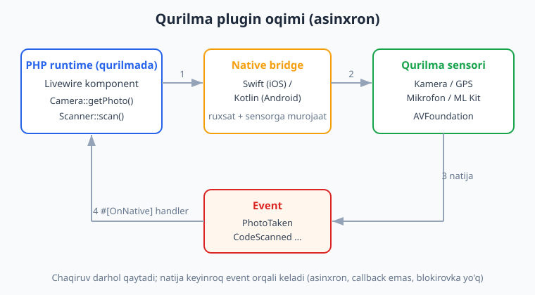
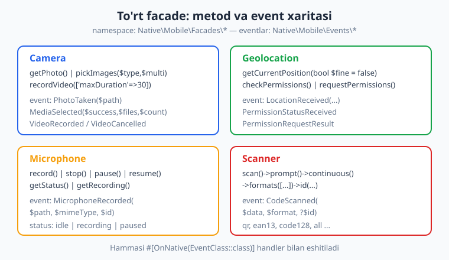
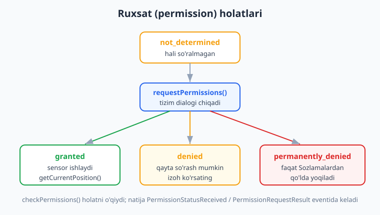

# 12 — Qurilma imkoniyatlari I: Camera, Geo, Scanner

[⬅️ Oldingi: 11 — Mobil UI va navigatsiya](./11-mobil-ui-navigatsiya.md) · [🏠 README](./README.md) · [Keyingi: 13 — Qurilma imkoniyatlari II: Biometrics, SecureStorage, Push ➡️](./13-qurilma-biometrics-securestorage-push.md)

---

> **Bu bobda:** Mobil ilovani "jonli" qiladigan eng yoqimli qism — **qurilma sensorlari**. Telefonning kamerasi, GPS'i, mikrofoni va QR/barcode skaneri bilan ishlaymiz. To'rtta facade'ni o'rganamiz: `Camera` (rasm olish, video, galereya), `Geolocation` (GPS koordinatalari), `Microphone` (audio yozish), `Scanner` (QR/barcode). Eng muhimi — bularning **asinxron model**ini tushunasiz: PHP'da `Camera::getPhoto()` deysiz, u darhol qaytadi, natija esa keyinroq **event** (`PhotoTaken`) orqali keladi. Buni Livewire'da `#[OnNative]` atributi bilan ushlaymiz. Yana **ruxsatlar** (permissions) — `not_determined`, `granted`, `denied`, `permanently_denied` holatlari va `config/nativephp.php` hamda `Info.plist`/`AndroidManifest.xml` sozlamalari.
>
> **HALOL eslatma:** NativePHP "sof native widget" yaratmaydi — Laravel ilovangizni native qobiq (iOS: Swift, Android: Kotlin) ichidagi **WebView**'da ishga tushiradi; biznes-mantiq esa **qurilmada ishlovchi PHP runtime**'da bajariladi. Facade chaqirig'i native bridge orqali sensorga boradi va natija event bilan qaytadi. Bu bobdagi **Laravel/PHP kod sintaksisi tekshirilgan** (`php -l` + Laravel 13 boot + SQLite migratsiya/Eloquent), lekin **kamera/GPS/mikrofon/skaner REAL ishlashi illustrativ** — ular real qurilma + sensor + `nativephp/mobile` o'rnatilgan build talab qiladi, bu muhitda yo'q. Soxta "kamera ochildi / koordinata olindi" yozilmagan. Har bir facade nomi, metod imzosi va event nomi rasmiy docs'dan (nativephp.com/docs/mobile/3) aynan olingan.

---

## Asinxron model: chaqiruv bir joyda, natija boshqa joyda

Bu bobning eng muhim g'oyasi shu. Boshqa boblardagi `Window` yoki `Dialog` facade'lardan farqli, qurilma sensorlari **darhol qiymat qaytarmaydi**. Sababi sodda: kamera oynasi ochilib, foydalanuvchi rasmga olishi sekundlar oladi; GPS o'qishni kutadi; foydalanuvchi ruxsat dialogiga javob beradi. PHP funksiyasi shuncha vaqt "muzlab" turolmaydi.

Shuning uchun NativePHP **callback emas, event** modelidan foydalanadi:

1. Siz `Camera::getPhoto()` deysiz — bu native qobiqqa "rasm ol" buyrug'ini yuboradi va **darhol qaytadi**.
2. Native qobiq (Swift/Kotlin) kamerani ochadi, ruxsat so'raydi, rasmga oladi.
3. Tayyor bo'lgach, qobiq qurilmadagi PHP runtime'ga `PhotoTaken` **eventini** yuboradi (`$path` bilan).
4. Sizning Livewire komponentingizdagi `#[OnNative(PhotoTaken::class)]` bilan belgilangan metod ishga tushadi.



Bu desktop'dagi `Native::on(...)` yoki Livewire eventlariga o'xshaydi (Laravel eventlari haqida ../laravel/README.md). NativePHP'da eventlar **`Native\Mobile\Events\*`** namespace'ida joylashadi va Livewire'da maxsus atribut bilan eshitiladi.

### `#[OnNative]` atributi — eventni ushlash

NativePHP mobil eventlar — oddiy Laravel Event klasslari. Livewire komponentida metodga `#[OnNative(EventKlass::class)]` atributini qo'yasiz, metod parametrlari event payload'iga mos kelishi kerak:

```php
use Native\Mobile\Attributes\OnNative;
use Native\Mobile\Events\Camera\PhotoTaken;

#[OnNative(PhotoTaken::class)]
public function handlePhoto(string $path): void
{
    // $path — qurilmadagi rasm fayli yo'li
}
```

> **Eslatma:** `OnNative` atributi `Native\Mobile\Attributes\OnNative` namespace'idan keladi, event klasslari esa `Native\Mobile\Events\<Kategoriya>\<Nom>` ko'rinishida. Aniq imzolar uchun har doim rasmiy docs (nativephp.com/docs/mobile/3) ni tekshiring — bu API niche va tez rivojlanmoqda.

To'rt facade va ularning metod/event xaritasi:



---

## Ruxsatlar (permissions): yarmi sizda, yarmi tizimda

Hech bir mobil OS sizning ilovangizga kamera yoki GPS'ga "shunchaki" kirishga ruxsat bermaydi. Ikki bosqich bor:

1. **E'lon qilish (declare):** ilova kamerani/GPS'ni umuman ishlatishini build'da e'lon qilasiz. iOS'da bu `Info.plist`'dagi "usage description" matni, Android'da `AndroidManifest.xml`'dagi permission yozuvi. NativePHP'da bularni `config/nativephp.php` va plugin sozlamalari orqali boshqarasiz.
2. **So'rash (request):** ish vaqtida foydalanuvchidan ruxsat so'raysiz (tizim dialogi chiqadi). Foydalanuvchi `granted` yoki `denied` deydi.



### Build'da e'lon qilish

NativePHP mobil pluginlari platforma sozlamalarini `android` va `ios` kalitlari ostida e'lon qiladi. Android ruxsatlari satr ro'yxati sifatida (build vaqtida `AndroidManifest.xml`'ga qo'shiladi), iOS esa "usage description" kalit-qiymat juftliklari sifatida (`Info.plist`'ga qo'shiladi):

```json
{
    "android": {
        "permissions": [
            "android.permission.CAMERA",
            "android.permission.RECORD_AUDIO",
            "android.permission.ACCESS_FINE_LOCATION"
        ]
    },
    "ios": {
        "info_plist": {
            "NSCameraUsageDescription": "Ilova rasm olish va QR skanerlash uchun kameradan foydalanadi",
            "NSMicrophoneUsageDescription": "Ilova ovozli eslatmalarni yozish uchun mikrofondan foydalanadi",
            "NSLocationWhenInUseUsageDescription": "Ilova yaqin atrofdagi do'konlarni topish uchun joylashuvingizdan foydalanadi"
        }
    }
}
```

> **MUHIM (iOS):** `NS*UsageDescription` matnini **bo'sh qoldirmang**. Apple, agar bu matn yo'q bo'lsa, ilovangizni App Store'da rad etadi yoki sensorga kirishda ilova darhol qulab tushadi. Matn aniq va halol bo'lsin — Apple sun'iy/aldovchi matnlarni ham rad etadi.

`config/nativephp.php`'da esa qaysi qobiliyatlar yoqilishini belgilaysiz — masalan kamera uchun `camera`, skaner uchun `scanner` ruxsati yoqilgan bo'lishi kerak. Skaner ostidagi kamera ruxsati avtomatik boshqariladi; foydalanuvchidan birinchi foydalanishda so'raladi.

> **HALOL:** Yuqoridagi JSON va config bloklari **build paytida** qo'llanadi. Bu muhitda `native:install` + Android SDK/Xcode yo'q, shuning uchun ularni **ishga tushirib bo'lmaydi** — bloklar illustrativ, lekin tuzilishi rasmiy docs (nativephp.com/docs/mobile/3/plugins/permissions-dependencies) bo'yicha to'g'ri.

---

## Camera — rasm olish, video, galereya

Facade: `Native\Mobile\Facades\Camera`.

Uchta asosiy metod:

| Metod | Vazifasi |
|---|---|
| `Camera::getPhoto()` | Kamerani ochib, bitta rasm oladi |
| `Camera::pickImages(string $type, bool $multiple)` | Galereyadan media tanlaydi |
| `Camera::recordVideo(array $options = [])` | Video yozadi |

`pickImages` parametrlari:
- `$type`: `'images'` yoki `'all'` (rasmiy docs aynan shu ikki qiymatni ko'rsatadi; aniq qo'llab-quvvatlanadigan turlar uchun rasmiy docs'ni ko'ring). Video alohida `recordVideo` metodi bilan yoziladi.
- `$multiple`: bitta yoki bir nechta fayl tanlash

Eventlar:
- **`PhotoTaken`** (`Native\Mobile\Events\Camera\PhotoTaken`) — payload: `string $path`
- **`MediaSelected`** (`Native\Mobile\Events\Gallery\MediaSelected` — **Camera emas, Gallery** namespace'ida!) — payload: `$success`, `$files`, `$count`
- **`VideoRecorded`** (`Native\Mobile\Events\Camera\VideoRecorded`) — payload: `string $path`, `string $mimeType` (default `'video/mp4'`), `?string $id`
- **`VideoCancelled`** — foydalanuvchi bekor qilganda

### To'liq Livewire misol

Quyidagi komponent rasm oladi va galereyadan tanlaydi, natijalarni `photos` jadvaliga saqlaydi:

```php
<?php

namespace App\Livewire;

use Livewire\Component;
use Native\Mobile\Facades\Camera;
use Native\Mobile\Attributes\OnNative;
use Native\Mobile\Events\Camera\PhotoTaken;
use Native\Mobile\Events\Gallery\MediaSelected; // Diqqat: MediaSelected Gallery namespace'ida, Camera emas
use App\Models\Photo;

class CameraCapture extends Component
{
    public array $photos = [];

    public function take(): void
    {
        // Kamera oynasini ochadi; natija PhotoTaken eventi orqali keladi.
        Camera::getPhoto();
    }

    public function pickFromGallery(): void
    {
        // 'images' turi, multiple = true
        Camera::pickImages('images', true);
    }

    #[OnNative(PhotoTaken::class)]
    public function onPhotoTaken(string $path): void
    {
        $photo = Photo::create([
            'path' => $path,
            'source' => 'camera',
        ]);

        $this->photos[] = $photo->only('id', 'path');
    }

    #[OnNative(MediaSelected::class)]
    public function onMediaSelected(bool $success, array $files = [], int $count = 0): void
    {
        if (! $success) {
            return;
        }

        foreach ($files as $file) {
            Photo::create(['path' => $file, 'source' => 'gallery']);
        }
    }

    public function render()
    {
        return view('livewire.camera-capture');
    }
}
```

Blade ko'rinishi (`resources/views/livewire/camera-capture.blade.php`):

```blade
<div class="p-4 space-y-4">
    <h2 class="text-xl font-bold">Rasmlar</h2>

    <div class="flex gap-3">
        <button wire:click="take" class="rounded bg-blue-600 px-4 py-2 text-white">
            Rasm olish
        </button>
        <button wire:click="pickFromGallery" class="rounded border px-4 py-2">
            Galereyadan
        </button>
    </div>

    <ul class="space-y-2">
        @foreach ($photos as $photo)
            <li class="text-sm text-slate-600">#{{ $photo['id'] }} — {{ $photo['path'] }}</li>
        @endforeach
    </ul>
</div>
```

> **`$path` bilan nima qilish kerak?** Bu — qurilmadagi mahalliy fayl yo'li. Uni Eloquent'da saqlashingiz (yuqoridagidek), ko'rsatishingiz yoki serverga yuklashingiz (`Http::attach(...)`) mumkin. Faylning o'zi qurilmada qoladi — siz faqat yo'lni boshqarasiz.

### Video yozish (fluent API)

`recordVideo` fluent (zanjirli) API ham qo'llab-quvvatlaydi:

```php
Camera::recordVideo(['maxDuration' => 30]);

// yoki zanjir bilan:
Camera::recordVideo()
    ->maxDuration(30)
    ->id('intro-video')
    ->start();
```

Natija `VideoRecorded` eventida (`$path`, `$mimeType` — default `'video/mp4'`, `?$id`) keladi; foydalanuvchi bekor qilsa — `VideoCancelled`.

---

## Geolocation — GPS koordinatalari

Facade: `Native\Mobile\Facades\Geolocation`.

| Metod | Vazifasi |
|---|---|
| `Geolocation::getCurrentPosition()` | Tarmoq (network) bo'yicha taxminiy joylashuv |
| `Geolocation::getCurrentPosition(true)` | GPS bilan **aniq** (fine accuracy) joylashuv |
| `Geolocation::checkPermissions()` | Joriy ruxsat holatini tekshiradi |
| `Geolocation::requestPermissions()` | Ruxsat so'rash dialogini ochadi |

Eventlar:
- **`LocationReceived`** — payload: `bool $success`, `float $latitude`, `float $longitude`, `float $accuracy` (metr), `int $timestamp` (Unix), `string $provider` (GPS/network), `string $error` (xato bo'lsa)
- **`PermissionStatusReceived`** — qiymatlar: `'granted'`, `'denied'`, `'not_determined'`
- **`PermissionRequestResult`** — `'permanently_denied'` qiymatini ham qaytarishi mumkin

> **`getCurrentPosition()` vs `getCurrentPosition(true)`:** Tarmoq rejimi tezroq va batareyani kam yeydi, lekin aniqligi past (yuzlab metr). GPS rejimi (`true`) aniqroq (metrlar), lekin sekinroq va batareyani ko'proq sarflaydi. Karta/navigatsiya uchun `true`, "shahringizni toping" uchun `false` ishlating.

### To'liq Livewire misol

```php
<?php

namespace App\Livewire;

use Livewire\Component;
use Native\Mobile\Facades\Geolocation;
use Native\Mobile\Attributes\OnNative;
use Native\Mobile\Events\Geolocation\LocationReceived;
use Native\Mobile\Events\Geolocation\PermissionRequestResult;

class LocationTracker extends Component
{
    public ?float $latitude = null;
    public ?float $longitude = null;
    public ?float $accuracy = null;
    public string $status = 'idle';
    public ?string $error = null;

    public function locate(): void
    {
        $this->status = 'locating';
        // true = aniq GPS rejimi (fine accuracy)
        Geolocation::getCurrentPosition(true);
    }

    public function askPermission(): void
    {
        Geolocation::requestPermissions();
    }

    #[OnNative(LocationReceived::class)]
    public function onLocation(
        bool $success,
        ?float $latitude = null,
        ?float $longitude = null,
        ?float $accuracy = null,
        ?int $timestamp = null,
        ?string $provider = null,
        ?string $error = null
    ): void {
        if (! $success) {
            $this->status = 'error';
            $this->error = $error;
            return;
        }

        $this->latitude = $latitude;
        $this->longitude = $longitude;
        $this->accuracy = $accuracy;
        $this->status = 'ok';
    }

    #[OnNative(PermissionRequestResult::class)]
    public function onPermission(string $status): void
    {
        if ($status === 'permanently_denied') {
            $this->error = 'Ruxsat butunlay rad etildi. Sozlamalardan yoqing.';
        }
    }

    public function render()
    {
        return view('livewire.location-tracker');
    }
}
```

> **`permanently_denied` — nozik holat.** Foydalanuvchi bir necha bor "rad etish" tugmasini bossa, OS endi dialog ko'rsatmaydi. Bu holatda `requestPermissions()` foydasiz — yagona yo'l foydalanuvchini **tizim Sozlamalariga** yo'naltirib, ruxsatni qo'lda yoqishini so'rash. Shuning uchun har doim halol izoh ko'rsating ("Joylashuvsiz xarita ishlamaydi") — bu rad etish ehtimolini kamaytiradi.

---

## Microphone — audio yozish

Facade: `Native\Mobile\Facades\Microphone`.

| Metod | Vazifasi |
|---|---|
| `Microphone::record()` | Yozishni boshlaydi (`PendingMicrophone` qaytaradi) |
| `Microphone::stop()` | Yozishni to'xtatadi |
| `Microphone::pause()` | Pauza |
| `Microphone::resume()` | Davom ettiradi |
| `Microphone::getStatus()` | Holat satri: `"idle"`, `"recording"` yoki `"paused"` |
| `Microphone::getRecording()` | Oxirgi yozuv fayli yo'li |

`record()` `PendingMicrophone` qaytaradi va fluent metodlarni qo'llaydi: `->id(string $id)`, `->event(string $eventClass)`, `->remember()`, `->start()` (bool qaytaradi).

Event:
- **`MicrophoneRecorded`** (`Native\Mobile\Events\Microphone\MicrophoneRecorded`) — payload: `string $path`, `string $mimeType` (default `'audio/m4a'`), `?string $id`

```php
use Native\Mobile\Facades\Microphone;
use Native\Mobile\Attributes\OnNative;
use Native\Mobile\Events\Microphone\MicrophoneRecorded;

public function startRecording(): void
{
    Microphone::record()
        ->id('note-recorder')
        ->start();
}

public function pauseRecording(): void  { Microphone::pause(); }
public function resumeRecording(): void { Microphone::resume(); }

public function stopRecording(): void
{
    Microphone::stop();
    $this->micStatus = Microphone::getStatus(); // "idle"
}

#[OnNative(MicrophoneRecorded::class)]
public function onRecorded(string $path, string $mimeType = 'audio/m4a', ?string $id = null): void
{
    $this->lastRecording = $path;
}
```

> **Fon (background) yozish:** ilova fonga o'tganda ham yozishda davom etishi uchun alohida sozlama (`microphone_background`) yoqilishi kerak. Buni faqat haqiqatan kerak bo'lsa yoqing — Apple/Google fon yozishni qattiq tekshiradi va asossiz bo'lsa rad etadi.

---

## Scanner — QR va barcode

Facade: `Native\Mobile\Facades\Scanner`. Bu eng "fluent" facade — `scan()` zanjir bilan sozlanadi.

| Metod | Vazifasi |
|---|---|
| `Scanner::scan()` | Skaner oynasini ochadi |
| `->prompt(string $prompt)` | Ekranda ko'rsatiladigan matn |
| `->continuous(bool $continuous = true)` | Bir nechta skanlash uchun ochiq qoladi (default: `false`) |
| `->formats(array $formats)` | Skanlanadigan formatlar (default: `['qr']`) |
| `->id(string $id)` | Skan sessiyasi identifikatori |

Qo'llab-quvvatlanadigan formatlar: `qr`, `ean13`, `ean8`, `code128`, `code39`, `upca`, `upce`, `all`.

Event:
- **`CodeScanned`** (`Native\Mobile\Events\Scanner\CodeScanned`) — payload: `string $data` (dekodlangan matn), `string $format`, `string|null $id`

> **Skaner kameradan foydalanadi.** Shuning uchun `config/nativephp.php`'da `scanner` ruxsati yoqilgan bo'lishi kerak; uning ostidagi kamera ruxsati avtomatik boshqariladi va birinchi foydalanishda so'raladi.

### To'liq misol: chipta tekshirgich

```php
<?php

namespace App\Livewire;

use Livewire\Component;
use Native\Mobile\Facades\Scanner;
use Native\Mobile\Attributes\OnNative;
use Native\Mobile\Events\Scanner\CodeScanned;
use App\Models\ScanResult;

class Recorder extends Component
{
    public ?string $lastScan = null;

    public function scanTicket(): void
    {
        Scanner::scan()
            ->prompt('QR kodni ramka ichiga joylang')
            ->formats(['qr', 'ean13'])
            ->id('ticket-scanner');
    }

    #[OnNative(CodeScanned::class)]
    public function onScanned(string $data, string $format, ?string $id = null): void
    {
        ScanResult::create([
            'data' => $data,
            'format' => $format,
        ]);

        $this->lastScan = $data;
    }

    public function render()
    {
        return view('livewire.recorder');
    }
}
```

`continuous(true)` rejimida skaner ochiq qoladi va `CodeScanned` har skanlangan kod uchun **takror-takror** ishlaydi — bu inventarizatsiya yoki ko'plab chiptalarni tezda o'qish uchun ideal.

---

## Birga: model, migratsiya va saqlash (RUN qilingan qism)

Yuqoridagi facade chaqiruvlari qurilmada ishlaydi, lekin **eventdan keyingi mantiq — sof Laravel** va uni bu muhitda to'liq tekshirsa bo'ladi. Modellar:

```php
// app/Models/Photo.php
class Photo extends Model
{
    protected $fillable = ['path', 'source'];
}

// app/Models/ScanResult.php
class ScanResult extends Model
{
    protected $fillable = ['data', 'format'];
}
```

Migratsiya:

```php
Schema::create('photos', function (Blueprint $table) {
    $table->id();
    $table->string('path');
    $table->string('source')->default('camera');
    $table->timestamps();
});

Schema::create('scan_results', function (Blueprint $table) {
    $table->id();
    $table->text('data');
    $table->string('format');
    $table->timestamps();
});
```

> **Tekshirildi:** Ushbu bobdagi `CameraCapture`, `LocationTracker`, `Recorder` komponentlari va ikkala model `php -l` (sintaksis) dan o'tdi; migratsiya SQLite'ga muvaffaqiyatli qo'llandi va Eloquent orqali `Photo::create(...)` / `ScanResult::create(...)` + `count()` ishladi (Laravel 13.15). Facade'lar **runtime'da** bu muhitda ishlamaydi, chunki `nativephp/mobile` + real qurilma yo'q — bu qism halol illustrativ.

### ❌ Keng tarqalgan xato: natijani darhol kutish

```php
// ❌ NOTO'G'RI — getPhoto() rasm yo'lini QAYTARMAYDI
public function take()
{
    $path = Camera::getPhoto();   // $path bu yerda null/void
    Photo::create(['path' => $path]); // bo'sh saqlanadi yoki xato
}
```

To'g'risi — natijani **eventda** kuting:

```php
// ✅ TO'G'RI
public function take(): void
{
    Camera::getPhoto(); // faqat boshlaydi
}

#[OnNative(PhotoTaken::class)]
public function onPhotoTaken(string $path): void
{
    Photo::create(['path' => $path]); // natija shu yerda
}
```

---

## Xulosa

- Qurilma sensorlari **asinxron**: facade chaqiruvi boshlaydi, natija **event** orqali keladi. Livewire'da `#[OnNative(EventClass::class)]` bilan ushlang.
- To'rt facade: `Camera` (`getPhoto`, `pickImages`, `recordVideo`), `Geolocation` (`getCurrentPosition`, `checkPermissions`, `requestPermissions`), `Microphone` (`record/stop/pause/resume/getStatus/getRecording`), `Scanner` (`scan()->prompt()->formats()->continuous()->id()`).
- Ruxsat ikki bosqichli: build'da **e'lon** (`Info.plist` / `AndroidManifest.xml` / `config/nativephp.php`) va ish vaqtida **so'rash**. `permanently_denied` holatida foydalanuvchini Sozlamalarga yo'naltiring.
- Hamma facade nomi, metod va event docs'dan aynan olingan — niche API, shuning uchun shubhada rasmiy docs (nativephp.com/docs/mobile/3) ni tekshiring.

Keyingi bobda qolgan qurilma imkoniyatlari — Biometrics (Face ID / barmoq izi), SecureStorage va Push bildirishnomalarni o'rganamiz.

---

## Mashqlar

### Oson

1. **Facade-namespace mosligi.** Quyidagi to'rt facade uchun to'liq `use` qatorlarini yozing: `Camera`, `Geolocation`, `Microphone`, `Scanner`. Qaysi umumiy namespace ostida turishini ayting.

2. **Event qaysi kategoriyada?** `PhotoTaken`, `LocationReceived`, `MicrophoneRecorded`, `CodeScanned` — har birining to'liq event namespace'ini yozing.

3. **`getPhoto` vs `pickImages`.** Foydalanuvchi (a) hozir rasm olishi va (b) galereyadan 3 ta rasm tanlashi kerak bo'lsa, qaysi metodni qaysi argumentlar bilan chaqirasiz? Ikki qatorli kod yozing.

4. **Skaner sozlash.** Faqat `ean13` va `code128` formatlarini, "Mahsulot shtrix-kodini skanerlang" matni bilan, uzluksiz rejimda ochadigan `Scanner::scan()` zanjirini yozing.

5. **Status o'qish.** Mikrofon yozayotganda foydalanuvchi ekranda nimani ko'rishi kerakligini hal qilish uchun `Microphone::getStatus()` qaytaradigan uchta mumkin qiymatni sanab bering va har biriga bitta UI matni taklif qiling.

6. **GPS aniqligi.** `getCurrentPosition()` va `getCurrentPosition(true)` farqini bir jumla bilan ayting va navigatsiya ilovasi qaysisini ishlatishi kerakligini asoslab bering.

### O'rta

7. **PhotoTaken handler.** Rasm olib, uni `Photo` modeliga `source = 'camera'` bilan saqlaydigan to'liq Livewire metod juftligini (`take()` + `#[OnNative]` handler) yozing. Faqat kod.

8. **Ruxsat holatlari mantig'i.** `checkPermissions()` natijasi `not_determined`, `denied` yoki `permanently_denied` bo'lganda har bir holat uchun ilovangiz nima qilishi kerakligini (qisqa harakat) tavsiflang.

9. **Bir nechta event bitta komponentda.** Bitta Livewire komponentda ham `PhotoTaken`, ham `MediaSelected` eventlarini ushlang. `MediaSelected` `$success` `false` bo'lsa hech narsa saqlamasin. Kod yozing.

10. **Skan natijasini saqlash.** `CodeScanned` eventidan kelgan `$data` va `$format`ni `ScanResult` modeliga yozadigan handler yozing va `data` ustuni nega `text()` (string emas) bo'lishini izohlang.

11. **`permanently_denied` UX.** Foydalanuvchi joylashuv ruxsatini butunlay rad etgan holatda ko'rsatiladigan halol, foydali xabar matnini o'zbekcha yozing va nima uchun `requestPermissions()` bu holatda yordam bermasligini tushuntiring.

12. **Build e'loni.** Kamera + mikrofon ishlatadigan ilova uchun `android.permissions` ro'yxati va `ios.info_plist`'dagi mos `NS*UsageDescription` kalitlarini JSON sifatida yozing.

### Qiyin

13. **Asinxron arxitekturani tushuntiring.** Nega `Camera::getPhoto()` rasm yo'lini darhol qaytara olmaydi? Native bridge + event modelini 4 bosqichda (PHP -> bridge -> sensor -> event) yozma tushuntiring va bu desktopdagi `Native::on()` ga qanday o'xshashligini ayting.

14. **Uzluksiz skaner inventarizatsiyasi.** `continuous(true)` rejimida ishlaydigan inventarizatsiya ekranini loyihalang: har skanlangan kodda mahsulotni topib (yoki yangi yaratib) sonini oshiradigan `#[OnNative(CodeScanned::class)]` handler yozing. Dublikat skanlardan qanday himoyalanasiz (masalan, oxirgi 2 soniyada bir xil kod)?

15. **Ovozli eslatma oqimi.** Mikrofon bilan ovozli eslatma yozadigan to'liq oqim (boshlash/pauza/davom/to'xtatish) komponentini yozing va `MicrophoneRecorded` `$path`ni `Note` modeliga `audio_path` sifatida saqlang. Yozish davomida foydalanuvchiga `getStatus()` asosida holatni qanday ko'rsatasiz?

<details markdown="1"><summary>Yechimlar</summary>

**1.**
```php
use Native\Mobile\Facades\Camera;
use Native\Mobile\Facades\Geolocation;
use Native\Mobile\Facades\Microphone;
use Native\Mobile\Facades\Scanner;
```
Hammasi `Native\Mobile\Facades\` umumiy namespace'i ostida.

**2.**
```php
use Native\Mobile\Events\Camera\PhotoTaken;
use Native\Mobile\Events\Geolocation\LocationReceived;
use Native\Mobile\Events\Microphone\MicrophoneRecorded;
use Native\Mobile\Events\Scanner\CodeScanned;
```
Umumiy ildiz: `Native\Mobile\Events\<Kategoriya>\<Nom>`.

**3.**
```php
Camera::getPhoto();                  // (a) hozir rasm olish
Camera::pickImages('images', true);  // (b) galereyadan, ko'p tanlash
```
`pickImages` aniq nechta tanlashni cheklamaydi — `true` ko'p tanlashni yoqadi; foydalanuvchi 3 ta tanlaydi, natija `MediaSelected` (`$files`, `$count`) da keladi.

**4.**
```php
Scanner::scan()
    ->prompt('Mahsulot shtrix-kodini skanerlang')
    ->formats(['ean13', 'code128'])
    ->continuous(true);
```

**5.** `Microphone::getStatus()` qiymatlari va UI:
- `"idle"` — "Yozishni boshlash" tugmasi faol.
- `"recording"` — qizil indikator + "Yozilmoqda... ⏸ Pauza / ⏹ To'xtatish".
- `"paused"` — "Pauzada — ▶ Davom ettirish".

**6.** `getCurrentPosition()` tarmoq orqali tez, lekin taxminiy (yuzlab metr); `getCurrentPosition(true)` GPS bilan aniq (metrlar), lekin sekinroq va batareya talab. Navigatsiya ilovasi `true` ishlatadi, chunki marshrut uchun metr darajasidagi aniqlik shart.

**7.**
```php
use Native\Mobile\Facades\Camera;
use Native\Mobile\Attributes\OnNative;
use Native\Mobile\Events\Camera\PhotoTaken;
use App\Models\Photo;

public function take(): void
{
    Camera::getPhoto();
}

#[OnNative(PhotoTaken::class)]
public function onPhotoTaken(string $path): void
{
    Photo::create(['path' => $path, 'source' => 'camera']);
}
```

**8.**
- `not_determined` — hali so'ralmagan: `requestPermissions()` chaqirib, tizim dialogini ko'rsatish.
- `denied` — rad etilgan, lekin qayta so'rash mumkin: avval halol izoh ("Bu nima uchun kerak") ko'rsatib, keyin yana `requestPermissions()`.
- `permanently_denied` — boshqa dialog chiqmaydi: foydalanuvchini tizim Sozlamalariga yo'naltirib, qo'lda yoqishini so'rash.

**9.**
```php
#[OnNative(PhotoTaken::class)]
public function onPhotoTaken(string $path): void
{
    Photo::create(['path' => $path, 'source' => 'camera']);
}

#[OnNative(MediaSelected::class)]
public function onMediaSelected(bool $success, array $files = [], int $count = 0): void
{
    if (! $success) {
        return; // foydalanuvchi bekor qildi yoki xato
    }

    foreach ($files as $file) {
        Photo::create(['path' => $file, 'source' => 'gallery']);
    }
}
```

**10.**
```php
#[OnNative(CodeScanned::class)]
public function onScanned(string $data, string $format, ?string $id = null): void
{
    ScanResult::create(['data' => $data, 'format' => $format]);
}
```
`data` `text()` bo'lishi kerak, chunki QR kodlar uzun URL yoki JSON saqlashi mumkin — `string` (VARCHAR 255) cheklovi ularni kesib qo'yishi mumkin; `text` esa uzun mazmun uchun xavfsiz.

**11.**
Xabar: "Joylashuv ruxsati o'chirilgan. Yaqin atrofdagi do'konlarni ko'rsatish uchun Sozlamalar > Ilovalar > [Ilova nomi] > Ruxsatlar bo'limidan Joylashuvni yoqing." `requestPermissions()` yordam bermaydi, chunki foydalanuvchi ilovaga "boshqa so'rama" deb belgilagan — OS endi ilova ichidan dialog ko'rsatishni butunlay bloklaydi, yagona yo'l — tizim Sozlamalaridan qo'lda yoqish.

**12.**
```json
{
    "android": {
        "permissions": [
            "android.permission.CAMERA",
            "android.permission.RECORD_AUDIO"
        ]
    },
    "ios": {
        "info_plist": {
            "NSCameraUsageDescription": "Ilova rasm olish uchun kameradan foydalanadi",
            "NSMicrophoneUsageDescription": "Ilova ovoz yozish uchun mikrofondan foydalanadi"
        }
    }
}
```

**13.** Rasm olish vaqt oladi (oyna ochiladi, foydalanuvchi tugma bosadi). Agar `getPhoto()` natijani kutib tursa, PHP runtime'i o'sha vaqt davomida bloklanardi va UI muzlardi. Shuning uchun:
1. **PHP** `Camera::getPhoto()` deydi — buyruq native qobiqqa yuboriladi, funksiya darhol qaytadi.
2. **Native bridge** (Swift/Kotlin) buyruqni qabul qiladi, ruxsatni tekshiradi/so'raydi.
3. **Sensor** (kamera) ochilib, rasmga olinadi va fayl saqlanadi.
4. Tayyor bo'lgach, qobiq qurilmadagi PHP'ga `PhotoTaken` **eventini** (`$path`) yuboradi; `#[OnNative]` handler ishga tushadi.

Bu desktopdagi `Native::on(...)` modeliga o'xshaydi — u yerda ham menyu bosilishi yoki global shortcut kabi hodisalar event sifatida keladi; faqat bu yerda manba — qurilma sensori.

**14.**
```php
use Native\Mobile\Facades\Scanner;
use Native\Mobile\Attributes\OnNative;
use Native\Mobile\Events\Scanner\CodeScanned;
use App\Models\Product;

public ?string $lastCode = null;
public int $lastScanAt = 0;

public function startInventory(): void
{
    Scanner::scan()
        ->prompt('Mahsulotlarni ketma-ket skanerlang')
        ->formats(['ean13', 'code128'])
        ->continuous(true)
        ->id('inventory');
}

#[OnNative(CodeScanned::class)]
public function onScanned(string $data, string $format, ?string $id = null): void
{
    // Dublikat himoyasi: oxirgi 2 soniyada bir xil kodni e'tiborsiz qoldirish
    $now = now()->timestamp;
    if ($data === $this->lastCode && ($now - $this->lastScanAt) < 2) {
        return;
    }
    $this->lastCode = $data;
    $this->lastScanAt = $now;

    $product = Product::firstOrCreate(
        ['barcode' => $data],
        ['name' => 'Nomsiz mahsulot', 'qty' => 0]
    );
    $product->increment('qty');
}
```
Dublikatdan himoya: skaner kameradagi kodni har kadrda qayta o'qishi mumkin, shuning uchun bir xil `$data` 2 soniya ichida takrorlansa, uni e'tiborsiz qoldiramiz. Muqobil yondashuv — har bir kod uchun "skanlandi" ovozli/vizual signal ko'rsatib, keyingi unikal kodgacha kutish.

**15.**
```php
use Native\Mobile\Facades\Microphone;
use Native\Mobile\Attributes\OnNative;
use Native\Mobile\Events\Microphone\MicrophoneRecorded;
use App\Models\Note;

public string $micStatus = 'idle';

public function start(): void   { Microphone::record()->id('note')->start(); $this->micStatus = 'recording'; }
public function pause(): void   { Microphone::pause();  $this->micStatus = Microphone::getStatus(); }
public function resume(): void  { Microphone::resume(); $this->micStatus = Microphone::getStatus(); }
public function stop(): void    { Microphone::stop();   $this->micStatus = Microphone::getStatus(); }

#[OnNative(MicrophoneRecorded::class)]
public function onRecorded(string $path, string $mimeType = 'audio/m4a', ?string $id = null): void
{
    Note::create(['audio_path' => $path]);
    $this->micStatus = 'idle';
}
```
Holatni ko'rsatish: `getStatus()` `"recording"` qaytarsa qizil indikator + pauza/to'xtatish tugmalari; `"paused"` bo'lsa "Pauzada — davom ettirish" tugmasi; `"idle"` bo'lsa faqat "Boshlash". Eng ishonchlisi — `start()`'dan keyin darhol `micStatus`'ni yangilash, chunki real holatni `getStatus()` qaytaradi.

</details>

---

[⬅️ Oldingi: 11 — Mobil UI va navigatsiya](./11-mobil-ui-navigatsiya.md) · [🏠 README](./README.md) · [Keyingi: 13 — Qurilma imkoniyatlari II: Biometrics, SecureStorage, Push ➡️](./13-qurilma-biometrics-securestorage-push.md)
