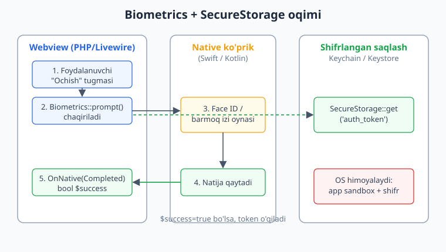
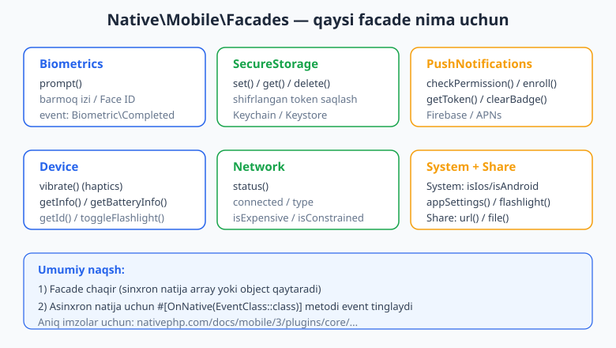
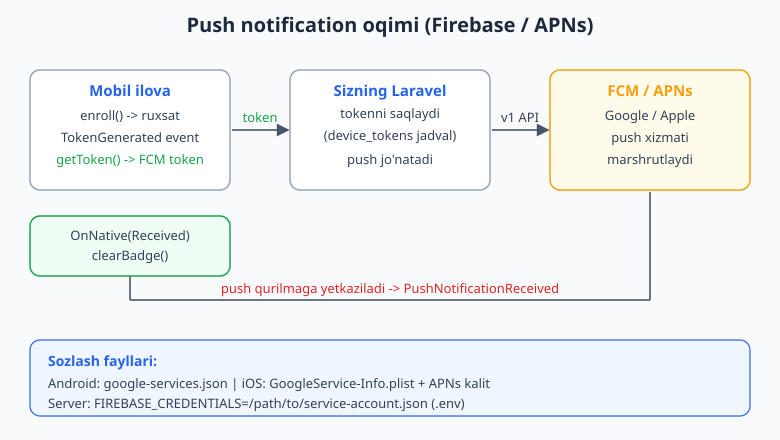

# 13 — Qurilma imkoniyatlari II: Biometrics, SecureStorage, Push

[⬅️ Oldingi: 12 — Qurilma imkoniyatlari I: Camera, Geo, Scanner](./12-qurilma-camera-geo-scanner.md) · [🏠 README](./README.md) · [Keyingi: 14 — Mobil ma'lumot va offline ➡️](./14-mobil-offline-data.md)

---

> **Bu bobda:** mobil ilovaning eng "qaltis" qismlariga — xavfsizlik va aloqaga — kirib boramiz. Foydalanuvchini **barmoq izi yoki yuz** orqali autentifikatsiya qilamiz (`Biometrics::prompt()`), maxfiy ma'lumotni (token, parol) qurilmaning **shifrlangan ombori**da saqlaymiz (`SecureStorage::set/get/delete`), va serverdan telefonga **push xabar** yuborishni Firebase (FCM) hamda APNs orqali sozlaymiz (`PushNotifications` facade'i: `checkPermission`, `enroll`, `getToken`, `clearBadge`). Yo'l-yo'lakay haptik javob (`Device::vibrate()`), native ulashish oynasi (`Share::url/file`), va qurilma/tarmoq/tizim ma'lumotini olishni (`Device`, `Network`, `System`) ko'ramiz. Hamma facade nomi va metod imzosi rasmiy hujjatdan (nativephp.com/docs/mobile/3/plugins/core/...) tasdiqlangan.
>
> **HALOL eslatma:** NativePHP "sof native widget" yaratmaydi — sizning Laravel ilovangizni native qobiq ichidagi **webview**'da ishlatadi (UI = Blade/Livewire/Inertia; biznes-mantiq = qurilmada ishlovchi PHP). Bu bobdagi **Laravel/PHP kod sintaksisi va host-ilova mantig'i tekshirilgan** (`php -l` + Laravel boot + SQLite/Eloquent + route validatsiyasi). Lekin **biometrik oyna, shifrlangan ombor, real push yetkazish va build bloklari illustrativ** — ularni ishga tushirish real qurilma + Xcode/Android SDK + Firebase loyiha talab qiladi, bu muhitda yo'q. Soxta "qurilmada ishladi / push keldi" yozilmagan.

---

## Nega bu bob alohida muhim?

12-bobda biz "ko'rinadigan" qurilma imkoniyatlarini ko'rdik: kamera rasm oladi, GPS koordinata beradi, skaner kod o'qiydi. Bu bob esa **ko'rinmaydigan, lekin ishonchni belgilaydigan** uchta narsani qamraydi:

1. **Biometrics** — "bu odam haqiqatan ham ilova egasimi?" degan savolga javob. Bank ilovasini ochish, to'lovni tasdiqlash, maxfiy yozuvni ko'rsatish uchun barmoq izi/yuz.
2. **SecureStorage** — "maxfiy ma'lumatni qayerga qo'yamiz?" degan savol. JWT token, refresh token, API kalit. Buni oddiy `localStorage` yoki SQLite'ga qo'yish — xavfli. OS shifrlangan omborini (iOS Keychain, Android Keystore) ishlatish kerak.
3. **Push** — "ilova yopiq bo'lsa ham, foydalanuvchini qanday xabardor qilamiz?" Bu serverdan telefonga aloqa: Firebase Cloud Messaging (FCM) va Apple Push Notification service (APNs).

Bularning uchovi ham **OS darajasidagi imkoniyatlar** — ya'ni PHP o'zi qila olmaydi. NativePHP ularni native ko'prik (Swift/Kotlin) orqali sizning PHP kodingizga ochib beradi. Mana shu yerda 10-bobdagi arxitektura tushunchasi ish beradi: siz Livewire komponentidan facade chaqirasiz, native qatlam OS bilan gaplashadi, natija event orqali PHP'ga qaytadi.



> Eslatma: ushbu bobdagi ba'zi facade'lar alohida plugin sifatida keladi (masalan `nativephp/mobile-biometrics`, `nativephp/mobile-firebase`) va litsenziya talab qilishi mumkin. `Device`, `Network`, `System`, `Share`, `SecureStorage` esa core plugin to'plamida. Aniq narx/litsenziya va o'rnatish uchun rasmiy docs'ni ko'ring.

## Umumiy naqsh: facade + OnNative event

Mobil facade'larning ikki turdagi javobi bor — buni bir marta tushunsangiz, hamma plugin bir xil ko'rinadi.

**1-tur: sinxron javob (array yoki object).** Masalan `SecureStorage::get()` darhol qiymat qaytaradi, `Network::status()` holatni qaytaradi. Bu oddiy metod chaqiruvi.

**2-tur: asinxron javob (event).** Masalan biometrik oyna foydalanuvchidan javob kutadi — bu darhol qaytmaydi. Shuning uchun `Biometrics::prompt()` faqat oynani **ochadi**, natija esa keyinroq `#[OnNative(Completed::class)]` bilan belgilangan metodga keladi. Push token ham shunday: `enroll()` chaqirasiz, token tayyor bo'lganda `TokenGenerated` eventi keladi.



`OnNative` atributi `Native\Mobile\Attributes\OnNative` namespace'idan keladi. U Livewire komponenti metodiga qo'yiladi va o'sha metodni ma'lum native event bilan bog'laydi. Bu — desktopda ko'rgan `Native\Desktop\Events\...` ga o'xshash, lekin mobil tomonida `OnNative` atributi orqali deklarativ tarzda ulanadi.

## Biometrics — barmoq izi va Face ID

Facade: `Native\Mobile\Facades\Biometrics`. Bitta asosiy metod bor — `prompt()`. U native autentifikatsiya oynasini ochadi (iOS'da Face ID yoki Touch ID, Android'da barmoq izi yoki yuz). Natija `Native\Mobile\Events\Biometric\Completed` eventi orqali `bool $success` ko'rinishida qaytadi.

```php
<?php

namespace App\Livewire;

use Livewire\Component;
use Native\Mobile\Facades\Biometrics;
use Native\Mobile\Attributes\OnNative;
use Native\Mobile\Events\Biometric\Completed;

class SecretNote extends Component
{
    public bool $unlocked = false;

    public function requestUnlock(): void
    {
        // Faqat oynani ochadi — natija KEYIN keladi (asinxron)
        Biometrics::prompt();
    }

    #[OnNative(Completed::class)]
    public function onBiometric(bool $success): void
    {
        if ($success) {
            $this->unlocked = true;          // muvaffaqiyatli autentifikatsiya
        } else {
            $this->addError('auth', 'Autentifikatsiya bekor qilindi yoki muvaffaqiyatsiz.');
        }
    }

    public function render()
    {
        return view('livewire.secret-note');
    }
}
```

Blade tomoni:

```blade
<div>
    @if ($unlocked)
        <p class="text-lg">Maxfiy yozuv: 42 — hayotning ma'nosi.</p>
    @else
        <button wire:click="requestUnlock">Barmoq izi bilan ochish</button>
        @error('auth') <span class="text-red-600">{{ $message }}</span> @enderror
    @endif
</div>
```

> **Diqqat (xavfsizlik):** biometrik tekshiruv faqat "darvozabon" — u UI'ni ochadi, lekin maxfiy ma'lumatni o'zi shifrlamaydi. Haqiqiy himoya `success=true` bo'lgandan keyin `SecureStorage`'dan o'qishda. Quyida buni birlashtiramiz.

```php
// ❌ XATO yondashuv: faqat $unlocked flag'iga ishonish
public function onBiometric(bool $success): void
{
    $this->unlocked = $success;
    // Maxfiy yozuv kod ichida ochiq turgan bo'lsa, biometrik bekorga ketadi —
    // root qilingan qurilmada flag chetlab o'tilishi mumkin.
}
```

> **HALOL:** yuqoridagi PHP kodning sintaksisi tekshirilgan, lekin `Biometrics::prompt()` real oynasi faqat qurilmada ochiladi. Bu muhitda displey/qurilma yo'q — bu blok illustrativ.

## SecureStorage — shifrlangan saqlash

Facade: `Native\Mobile\Facades\SecureStorage`. Uch metod:

| Metod | Imzo | Qaytaradi |
|---|---|---|
| `set` | `set(string $key, ?string $value): array` | `['success' => true]` |
| `get` | `get(string $key): array` | `['value' => string]` (topilmasa bo'sh satr) |
| `delete` | `delete(string $key): array` | `['success' => true]` |

`set()` ga `null` qiymat bersangiz, u kalitni **o'chiradi** (`delete` bilan bir xil). Ma'lumot iOS'da Keychain'ga, Android'da Keystore'ga shifrlangan holda yoziladi — ilova sandbox'ida, OS himoyasi ostida.

```php
use Native\Mobile\Facades\SecureStorage;

// Saqlash
SecureStorage::set('auth_token', 'eyJhbGciOiJIUzI1NiIsInR5cCI6IkpXVCJ9...');

// O'qish
$result = SecureStorage::get('auth_token');
$token = $result['value'] ?? null;   // topilmasa null

// O'chirish
SecureStorage::delete('auth_token');
```

Tipik login/logout sxemasi — Laravel'dan tanish, faqat saqlash joyi shifrlangan ombor:

```php
public function login(string $email, string $password): void
{
    // $this->authenticate() — sizning host-API'ga so'rov (HTTP), JWT qaytaradi
    $token = $this->authenticate($email, $password);

    SecureStorage::set('auth_token', $token);
    SecureStorage::set('user_email', $email);
}

public function logout(): void
{
    SecureStorage::delete('auth_token');
    SecureStorage::delete('user_email');
}
```

Endi biometrics + SecureStorage'ni birlashtiramiz — bu juda keng tarqalgan naqsh ("biometrik bilan ochiladigan token"):

```php
<?php

namespace App\Livewire;

use Livewire\Component;
use Native\Mobile\Facades\Biometrics;
use Native\Mobile\Facades\SecureStorage;
use Native\Mobile\Attributes\OnNative;
use Native\Mobile\Events\Biometric\Completed;

class SecureVault extends Component
{
    public bool $unlocked = false;
    public ?string $secret = null;

    public function requestUnlock(): void
    {
        Biometrics::prompt();
    }

    #[OnNative(Completed::class)]
    public function onBiometric(bool $success): void
    {
        if (! $success) {
            $this->addError('vault', 'Autentifikatsiya bekor qilindi.');
            return;
        }

        // Faqat biometrik o'tgandan keyin shifrlangan ombordan o'qiymiz
        $this->unlocked = true;
        $result = SecureStorage::get('vault_secret');
        $this->secret = $result['value'] ?? null;
    }

    public function render()
    {
        return view('livewire.secure-vault');
    }
}
```

> **HALOL:** bu komponentning PHP sintaksisi `php -l` bilan tekshirildi. `SecureStorage` va `Biometrics` runtime bajarilishi (Keychain/Keystore + native oyna) faqat qurilmada bo'ladi — bu yerda illustrativ.

> SQLite'da oddiy ma'lumot saqlash 14-bobda. Maxfiy bo'lmagan sozlamalar uchun SQLite, **maxfiy** ma'lumot (token, parol) uchun SecureStorage — bu farqni yodda tuting.

## Push notifications — Firebase (FCM) va APNs

Bu bobdagi eng ko'p qadamli qism. Facade: `Native\Mobile\Facades\PushNotifications`. Metodlar:

```php
PushNotifications::checkPermission(): string   // 'granted' | 'denied' | 'not_determined' | 'provisional' | 'ephemeral'
PushNotifications::enroll(): void              // ruxsat so'rab FCM/APNs ga ro'yxatdan o'tadi
PushNotifications::getToken(): ?string         // joriy push token (yoki null)
PushNotifications::clearBadge(): void          // ilova ikonkasidagi raqamni tozalaydi
```

Event sinflari (`#[OnNative(...)]` bilan tinglanadi):

- `Native\Mobile\Events\PushNotification\TokenGenerated` — token tayyor (yoki yangilandi).
- `Native\Mobile\Events\PushNotification\PushNotificationReceived` — push xabar keldi.



### Push qanday ishlaydi (kontseptual)

Push — bu **uch tomonli** o'yin:

1. **Qurilma** ruxsat so'raydi (`enroll()`), so'ng unikal **push token** oladi (`TokenGenerated`).
2. **Sizning Laravel serveringiz** bu tokenni saqlaydi (har bir qurilma uchun bittadan).
3. Xabar yuborish kerak bo'lganda, server **FCM** (Google) yoki **APNs** (Apple) ga so'rov yuboradi, ular esa tokenga qarab to'g'ri qurilmaga yetkazadi. Telefonda `PushNotificationReceived` eventi ishga tushadi.

Muhim: sizning serveringiz to'g'ridan-to'g'ri telefonga ulanmaydi. Hamma push Google/Apple infratuzilmasi orqali o'tadi.

### Sozlash fayllari

Rasmiy docs (nativephp.com/docs/mobile/3/plugins/core/firebase) bo'yicha kerakli fayllar:

```bash
# 1) Firebase Console'da loyiha yarating, Android va iOS ilovalarni qo'shing.

# 2) Android: yuklab olingan faylni loyiha ildiziga qo'ying
#    google-services.json   (plugin kompilyatorida Android build'ga avtomatik ko'chiriladi)

# 3) iOS: yuklab olingan faylni loyiha ildiziga qo'ying
#    GoogleService-Info.plist
#    + Apple Developer'da APNs kalitini yoqing va Firebase Console >
#      Project Settings > Cloud Messaging'ga yuklang.

# 4) Server tomoni (push jo'natuvchi): service account JSON
#    Firebase Console > Project Settings > Service Accounts > Generate key
```

`.env` da server kreditatsiyasi kaliti:

```bash
FIREBASE_CREDENTIALS=/path/to/service-account.json
```

Plugin o'rnatish (litsenziyali plugin reesteri orqali — docs'da ko'rsatilgan):

```bash
composer require nativephp/mobile-firebase
```

> **HALOL:** bu buyruq va fayllar rasmiy docs'dan olingan. Bu muhitda Firebase loyihasi, real qurilma va plugin litsenziyasi yo'q, shuning uchun ularni ishga tushirib bo'lmaydi — illustrativ. Aniq narx/litsenziya uchun rasmiy docs'ni ko'ring.

### Qurilma tomoni: token olish va serverga yuborish

```php
<?php

namespace App\Livewire;

use Livewire\Component;
use Illuminate\Support\Facades\Http;
use Native\Mobile\Facades\PushNotifications;
use Native\Mobile\Attributes\OnNative;
use Native\Mobile\Events\PushNotification\TokenGenerated;
use Native\Mobile\Events\PushNotification\PushNotificationReceived;

class PushManager extends Component
{
    public string $permission = 'not_determined';

    public function mount(): void
    {
        $this->permission = PushNotifications::checkPermission();
    }

    public function subscribe(): void
    {
        // Ruxsat so'rab, FCM/APNs ga ro'yxatdan o'tadi.
        // Token tayyor bo'lganda TokenGenerated eventi keladi.
        PushNotifications::enroll();
    }

    #[OnNative(TokenGenerated::class)]
    public function onToken(string $token): void
    {
        // Tokenni o'z serveringizga yuboring (keyin push jo'natish uchun)
        Http::post(config('app.url').'/api/devices', [
            'token' => $token,
            'platform' => 'mobile',
        ]);
    }

    #[OnNative(PushNotificationReceived::class)]
    public function onReceived(array $payload): void
    {
        PushNotifications::clearBadge();
        $this->dispatch('push-received', title: $payload['title'] ?? '');
    }

    public function render()
    {
        return view('livewire.push-manager');
    }
}
```

> **HALOL:** PHP sintaksisi tekshirilgan. `OnNative` event payload'ining aniq shakli (`$token` satr, `$payload` array) docs bo'yicha; aniq tip-imzosi uchun rasmiy docs va plugin manbasini ko'ring. Real push faqat qurilma + Firebase bilan keladi.

### Server tomoni: FCM HTTP v1 API orqali push jo'natish

Bu qism **sof Laravel** — qurilmaga bog'liq emas, run qilinadi. Saqlangan tokenga FCM orqali xabar yuboramiz. (`google/auth` paketi OAuth tokenini olib beradi.)

```php
<?php

namespace App\Services;

use Illuminate\Support\Facades\Http;
use Google\Auth\Credentials\ServiceAccountCredentials;

class FcmSender
{
    public function send(string $deviceToken, string $title, string $body): array
    {
        $projectId = config('services.fcm.project_id');
        $accessToken = $this->accessToken();

        $response = Http::withToken($accessToken)
            ->post("https://fcm.googleapis.com/v1/projects/{$projectId}/messages:send", [
                'message' => [
                    'token' => $deviceToken,
                    'notification' => [
                        'title' => $title,
                        'body'  => $body,
                    ],
                ],
            ]);

        return $response->json();
    }

    private function accessToken(): string
    {
        $creds = new ServiceAccountCredentials(
            'https://www.googleapis.com/auth/firebase.messaging',
            env('FIREBASE_CREDENTIALS'),
        );

        return $creds->fetchAuthToken()['access_token'];
    }
}
```

Tokenlarni saqlash uchun host-ilovada oddiy migratsiya va route — bu ham sof Laravel, run qilinadi:

```php
// migratsiya
Schema::create('device_tokens', function (Blueprint $table) {
    $table->id();
    $table->string('token')->unique();
    $table->string('platform');                 // ios | android | mobile
    $table->timestamps();
});
```

```php
// routes/api.php — qurilma tokenni ro'yxatdan o'tkazadi
Route::post('/devices', function (Request $request) {
    $data = $request->validate([
        'token'    => ['required', 'string'],
        'platform' => ['required', 'in:ios,android,mobile'],
    ]);

    DeviceToken::updateOrCreate(
        ['token' => $data['token']],            // dublikat token bo'lmasin
        ['platform' => $data['platform']],
    );

    return response()->json(['status' => 'saved'], 201);
});
```

> Bu migratsiya, model upsert va route validatsiyasi probe Laravel ilovasida boot qilinib **haqiqatan ishlatildi** (SQLite, `updateOrInsert`, validatsiya 201/rad etish bilan tasdiqlandi). FCM ga real so'rov esa Firebase kreditatsiyasi talab qiladi — illustrativ.

## Haptics — `Device::vibrate()`

NativePHP mobil'da alohida "Haptics" facade'i yo'q; haptik javob `Device` facade'ining `vibrate()` metodi orqali keladi.

Facade: `Native\Mobile\Facades\Device`. Metodlar:

```php
Device::vibrate(): array            // ['success' => true]
Device::toggleFlashlight(): array   // ['success' => bool, 'state' => bool]
Device::getId(): array              // ['id' => '...']
Device::getInfo(): array            // ['info' => '<JSON satr>']
Device::getBatteryInfo(): array     // ['info' => '<JSON satr>']
```

Tipik foydalanish — muvaffaqiyatli/xato amaldan keyin qisqa tebranish:

```php
use Native\Mobile\Facades\Device;

public function onPaymentConfirmed(): void
{
    Device::vibrate();   // foydalanuvchiga "bajarildi" degan haptik signal
}
```

> **Diqqat:** `getInfo()` va `getBatteryInfo()` natijasi ichida JSON **satr** keladi (`['info' => '...']`). Foydalanishdan oldin `json_decode($result['info'], true)` qilishni unutmang.

```php
$raw = Device::getBatteryInfo();
$battery = json_decode($raw['info'] ?? '{}', true);
// $battery['level'] kabi kalitlar uchun aniq shaklni docs/plugin manbasidan tasdiqlang
```

> **HALOL:** `Device::*` natijalari faqat qurilmada keladi. PHP sintaksisi tekshirilgan, runtime illustrativ.

## Share — native ulashish oynasi

Facade: `Native\Mobile\Facades\Share`. Ikki metod:

```php
Share::url(string $title, string $text, string $url)        // havola ulashish
Share::file(string $title, string $text, string $filePath)  // fayl (yoki faqat matn) ulashish
```

```php
use Native\Mobile\Facades\Share;

// Havola ulashish (Telegram, WhatsApp, pochta... — OS tanlovni ko'rsatadi)
Share::url('Buni ko\'ring!', 'Zo\'r maqola topdim', 'https://ioqil.uz');

// Fayl ulashish
Share::file('Audio yozuv', 'Buni eshiting!', '/path/to/audio.m4a');

// Faqat matn (fayl yo'q) — uchinchi argument bo'sh satr
Share::file('Salom', 'Bu mening xabarim', '');
```

> **HALOL:** `Share::*` native "share sheet" oynasini ochadi — bu faqat qurilmada ko'rinadi. Sintaksis tekshirilgan, oyna illustrativ.

## Network — tarmoq holati

Facade: `Native\Mobile\Facades\Network`. Bitta metod: `status()`. U object qaytaradi:

| Xususiyat | Tip | Ma'nosi |
|---|---|---|
| `connected` | bool | internet bormi |
| `type` | string | `wifi` / `cellular` / `ethernet` / `unknown` |
| `isExpensive` | bool | hisoblanadigan (metered) ulanishmi |
| `isConstrained` | bool | "Low Data Mode" yoqilganmi (faqat iOS) |

```php
use Native\Mobile\Facades\Network;

$status = Network::status();

if (! $status->connected) {
    // offline rejim: SQLite'dan o'qib turamiz (14-bob)
    return;
}

if ($status->isExpensive) {
    // mobil internetda katta fayllarni yuklamaymiz
    $this->skipHeavySync = true;
}
```

Bu offline-first ilovalar uchun asos — `isExpensive` ni tekshirib, mobil internetda og'ir sinxronizatsiyani to'xtatishingiz mumkin. Offline ma'lumot 14-bobda chuqurroq.

## System — platforma aniqlash

Facade: `Native\Mobile\Facades\System`. Asosiy metodlar:

```php
System::isIos(): bool        // iOS'da true
System::isAndroid(): bool    // Android'da true
System::isMobile(): bool     // ikkalasida ham true
System::appSettings(): void  // qurilmaning ilova sozlamalari ekranini ochadi
System::flashlight(): void   // fonarni o'zgartiradi
```

Bu platforma-shartli UI uchun foydali — masalan iOS va Android'da turlicha ko'rsatma:

```php
use Native\Mobile\Facades\System;

public function permissionHint(): string
{
    return System::isIos()
        ? 'Sozlamalar > Ilova > Bildirishnomalar orqali ruxsat bering.'
        : 'Ilova ma\'lumotlari > Ruxsatlar orqali ruxsat bering.';
}

public function openSettings(): void
{
    // Foydalanuvchi push ruxsatini rad etgan bo'lsa, uni sozlamalarga yo'naltiramiz
    System::appSettings();
}
```

> Eslatma: `System::isMobile()` desktopda (`nativephp/desktop`) `false` qaytaradi. Bu yagona kod-bazani ikkala platformaga moslashtirishda asqotadi. Desktop tomonidagi `Native\Desktop\Facades\System` (7-bobda ko'rilgan) — boshqa facade; namespace farqiga e'tibor bering.

## Hammasini bog'lab: xavfsiz "kirish" oqimi

Endi bobdagi qismlarni bitta real stsenariyga jamlaymiz. Foydalanuvchi ilovani ochadi -> biometrik bilan tasdiqlaydi -> SecureStorage'dan token o'qiladi -> agar token yo'q bo'lsa login qilinadi -> push uchun ro'yxatdan o'tiladi.

```php
<?php

namespace App\Livewire;

use Livewire\Component;
use Illuminate\Support\Facades\Http;
use Native\Mobile\Facades\Biometrics;
use Native\Mobile\Facades\SecureStorage;
use Native\Mobile\Facades\PushNotifications;
use Native\Mobile\Facades\Device;
use Native\Mobile\Attributes\OnNative;
use Native\Mobile\Events\Biometric\Completed;
use Native\Mobile\Events\PushNotification\TokenGenerated;

class AppGate extends Component
{
    public bool $authed = false;

    public function unlock(): void
    {
        Biometrics::prompt();
    }

    #[OnNative(Completed::class)]
    public function onBiometric(bool $success): void
    {
        if (! $success) {
            $this->addError('gate', 'Kirish rad etildi.');
            return;
        }

        Device::vibrate();   // haptik tasdiq

        $token = SecureStorage::get('auth_token')['value'] ?? null;

        if ($token) {
            $this->authed = true;
            // Push uchun ro'yxatdan o'tamiz (token TokenGenerated bilan keladi)
            PushNotifications::enroll();
        } else {
            // Token yo'q: login ekranini ko'rsatamiz
            $this->dispatch('show-login');
        }
    }

    #[OnNative(TokenGenerated::class)]
    public function onPushToken(string $token): void
    {
        Http::post(config('app.url').'/api/devices', [
            'token' => $token,
            'platform' => 'mobile',
        ]);
    }

    public function render()
    {
        return view('livewire.app-gate');
    }
}
```

> **HALOL:** bu komponentning sintaksisi `php -l` bilan tekshirildi. Facade'lar runtime'i (biometrik oyna, Keychain, FCM, vibratsiya) faqat real qurilmada bajariladi — bu birlashtirilgan blok illustrativ. Lekin u ishlatadigan host-route (`/api/devices`) Laravel'da haqiqatan boot qilinib tekshirilgan.

## Mashqlar

### Oson

1. `Biometrics`, `SecureStorage`, `PushNotifications`, `Device`, `Network`, `System`, `Share` facade'larining to'liq namespace'larini (FQCN) yozing.
2. `SecureStorage` uch metodini (`set`, `get`, `delete`) imzolari va qaytaradigan qiymatlari bilan jadval qilib yozing.
3. `PushNotifications::checkPermission()` qaytarishi mumkin bo'lgan barcha qiymatlarni sanab bering va har biriga bir jumlali izoh yozing.
4. Biometrik javobni tinglovchi Livewire metodini `#[OnNative(...)]` atributi bilan yozing (faqat metod, ichida `bool $success` ni tekshirib `$this->unlocked` ni o'rnatadigan).
5. `Network::status()` natijasidagi to'rt xususiyatni nomi va tipi bilan yozing; `isConstrained` qaysi platformada ishlashini ayting.

### O'rta

6. "Biometrik bilan ochiladigan eslatma" Livewire komponentini to'liq yozing: `requestUnlock()` biometrik oynani ochadi, `onBiometric(bool $success)` muvaffaqiyatda `SecureStorage`'dan `secret_note` kalitini o'qiydi.
7. Foydalanuvchi login qilganda JWT tokenni `SecureStorage`'ga, logout qilganda o'chiradigan `login()`/`logout()` metodlarini yozing.
8. Push token tayyor bo'lganda uni `/api/devices` ga `Http::post` bilan yuboradigan `#[OnNative(TokenGenerated::class)]` metodini yozing.
9. `device_tokens` jadvali uchun migratsiya va tokenni dublikatsiz saqlaydigan (`updateOrCreate`) route handler yozing. Validatsiyani ham qo'shing.
10. `Device::getBatteryInfo()` natijasini to'g'ri o'qiydigan kod yozing (eslatma: `info` ichida JSON **satr** keladi).

### Qiyin

11. To'liq "AppGate" oqimini tasvirlang: ilova ochilishidan biometrik -> SecureStorage token tekshiruvi -> login yoki push enroll gacha. Diagramma yoki bosqichli ro'yxat bilan, har bosqichda qaysi facade/event ishlashini ko'rsating.
12. `FcmSender` xizmatini yozing: service account orqali OAuth token oladi, FCM HTTP v1 API'ga `messages:send` so'rovini yuboradi. Qaysi `.env` kaliti va Firebase Console qadamlari kerakligini izohda yozing.
13. Offline-aware sinxronizatsiya mantig'ini tasvirlang: `Network::status()` ga qarab — offline bo'lsa to'xtatish, `isExpensive` bo'lsa faqat yengil sinxron, wifi bo'lsa to'liq sinxron. Kod skeletini yozing.

<details markdown="1"><summary>Yechimlar</summary>

**1.**
```
Native\Mobile\Facades\Biometrics
Native\Mobile\Facades\SecureStorage
Native\Mobile\Facades\PushNotifications
Native\Mobile\Facades\Device
Native\Mobile\Facades\Network
Native\Mobile\Facades\System
Native\Mobile\Facades\Share
```

**2.**

| Metod | Imzo | Qaytaradi |
|---|---|---|
| `set` | `set(string $key, ?string $value): array` | `['success' => true]` (value=null bo'lsa o'chiradi) |
| `get` | `get(string $key): array` | `['value' => string]` (topilmasa bo'sh satr) |
| `delete` | `delete(string $key): array` | `['success' => true]` |

**3.**
- `granted` — foydalanuvchi push ruxsatini bergan.
- `denied` — ruxsat rad etilgan (sozlamalardan qayta yoqish kerak).
- `not_determined` — hali so'ralmagan (default holat).
- `provisional` — vaqtinchalik/jim ruxsat (iOS, ovozsiz yetkaziladi).
- `ephemeral` — qisqa muddatli/sessiya ruxsati (maxsus holatlar).

**4.**
```php
use Native\Mobile\Attributes\OnNative;
use Native\Mobile\Events\Biometric\Completed;

#[OnNative(Completed::class)]
public function onBiometric(bool $success): void
{
    $this->unlocked = $success;
}
```

**5.**

| Xususiyat | Tip |
|---|---|
| `connected` | bool |
| `type` | string (`wifi`/`cellular`/`ethernet`/`unknown`) |
| `isExpensive` | bool |
| `isConstrained` | bool |

`isConstrained` ("Low Data Mode") faqat **iOS**'da ma'noli.

**6.**
```php
<?php

namespace App\Livewire;

use Livewire\Component;
use Native\Mobile\Facades\Biometrics;
use Native\Mobile\Facades\SecureStorage;
use Native\Mobile\Attributes\OnNative;
use Native\Mobile\Events\Biometric\Completed;

class SecretNote extends Component
{
    public bool $unlocked = false;
    public ?string $note = null;

    public function requestUnlock(): void
    {
        Biometrics::prompt();
    }

    #[OnNative(Completed::class)]
    public function onBiometric(bool $success): void
    {
        if (! $success) {
            $this->addError('note', 'Autentifikatsiya muvaffaqiyatsiz.');
            return;
        }

        $this->unlocked = true;
        $this->note = SecureStorage::get('secret_note')['value'] ?? null;
    }

    public function render()
    {
        return view('livewire.secret-note');
    }
}
```

**7.**
```php
use Native\Mobile\Facades\SecureStorage;

public function login(string $email, string $password): void
{
    $token = $this->authenticate($email, $password);   // host-API JWT qaytaradi
    SecureStorage::set('auth_token', $token);
    SecureStorage::set('user_email', $email);
}

public function logout(): void
{
    SecureStorage::delete('auth_token');
    SecureStorage::delete('user_email');
}
```

**8.**
```php
use Illuminate\Support\Facades\Http;
use Native\Mobile\Attributes\OnNative;
use Native\Mobile\Events\PushNotification\TokenGenerated;

#[OnNative(TokenGenerated::class)]
public function onToken(string $token): void
{
    Http::post(config('app.url').'/api/devices', [
        'token' => $token,
        'platform' => 'mobile',
    ]);
}
```

**9.**
```php
// migratsiya
Schema::create('device_tokens', function (Blueprint $table) {
    $table->id();
    $table->string('token')->unique();
    $table->string('platform');
    $table->timestamps();
});

// routes/api.php
Route::post('/devices', function (Request $request) {
    $data = $request->validate([
        'token'    => ['required', 'string'],
        'platform' => ['required', 'in:ios,android,mobile'],
    ]);

    DeviceToken::updateOrCreate(
        ['token' => $data['token']],
        ['platform' => $data['platform']],
    );

    return response()->json(['status' => 'saved'], 201);
});
```
Bu migratsiya, upsert va validatsiya probe ilovada haqiqatan boot qilinib tekshirildi.

**10.**
```php
use Native\Mobile\Facades\Device;

$raw = Device::getBatteryInfo();          // ['info' => '<JSON satr>']
$battery = json_decode($raw['info'] ?? '{}', true);
// $battery endi massiv — aniq kalitlar uchun rasmiy docs/plugin manbasini ko'ring.
```
Asosiy nuqta: `getInfo()`/`getBatteryInfo()` ichidagi `info` — JSON **satr**, uni `json_decode` qilish kerak.

**11.**

Bosqichlar (har bosqichda facade/event):
1. Ilova ochiladi -> `AppGate::unlock()` chaqiriladi -> `Biometrics::prompt()` (oyna ochiladi).
2. Foydalanuvchi javob beradi -> `#[OnNative(Completed::class)]` metodi `bool $success` oladi.
3. `$success=false` -> xato ko'rsatiladi, oqim tugaydi.
4. `$success=true` -> `Device::vibrate()` (haptik tasdiq) -> `SecureStorage::get('auth_token')`.
5. Token bor -> `$this->authed = true` -> `PushNotifications::enroll()`.
6. Token yo'q -> `dispatch('show-login')` -> login ekrani.
7. `enroll()` dan keyin `#[OnNative(TokenGenerated::class)]` -> token serverga `Http::post('/api/devices')`.

Diagramma uchun yuqoridagi `np13-biometrics-oqim.svg` va `np13-push-oqim.svg` ga qarang.

**12.**
```php
<?php

namespace App\Services;

use Illuminate\Support\Facades\Http;
use Google\Auth\Credentials\ServiceAccountCredentials;

class FcmSender
{
    public function send(string $deviceToken, string $title, string $body): array
    {
        $projectId = config('services.fcm.project_id');
        $accessToken = $this->accessToken();

        return Http::withToken($accessToken)
            ->post("https://fcm.googleapis.com/v1/projects/{$projectId}/messages:send", [
                'message' => [
                    'token' => $deviceToken,
                    'notification' => ['title' => $title, 'body' => $body],
                ],
            ])->json();
    }

    private function accessToken(): string
    {
        // .env: FIREBASE_CREDENTIALS=/path/to/service-account.json
        $creds = new ServiceAccountCredentials(
            'https://www.googleapis.com/auth/firebase.messaging',
            env('FIREBASE_CREDENTIALS'),
        );

        return $creds->fetchAuthToken()['access_token'];
    }
}
```
Kerakli qadamlar: (a) Firebase Console > Project Settings > Service Accounts > Generate new private key -> JSON; (b) `.env` ga `FIREBASE_CREDENTIALS` yo'lini yozish; (c) `composer require google/auth`; (d) qurilma tomonida `google-services.json` (Android) / `GoogleService-Info.plist` + APNs kalit (iOS).

**13.**
```php
use Native\Mobile\Facades\Network;

public function sync(): void
{
    $status = Network::status();

    if (! $status->connected) {
        return;   // offline: hech narsa qilmaymiz, SQLite'da ishlaymiz
    }

    if ($status->isExpensive || ($status->isConstrained ?? false)) {
        $this->syncLightOnly();   // mobil/metered: faqat kichik delta sinxron
        return;
    }

    $this->syncFull();   // wifi/ethernet: to'liq sinxron (rasm, fayllar)
}
```
Mantiq: avval ulanishni tekshir, keyin narxni (`isExpensive`) va iOS "Low Data Mode" (`isConstrained`) ni hisobga ol.

</details>

---

[⬅️ Oldingi: 12 — Qurilma imkoniyatlari I: Camera, Geo, Scanner](./12-qurilma-camera-geo-scanner.md) · [🏠 README](./README.md) · [Keyingi: 14 — Mobil ma'lumot va offline ➡️](./14-mobil-offline-data.md)
