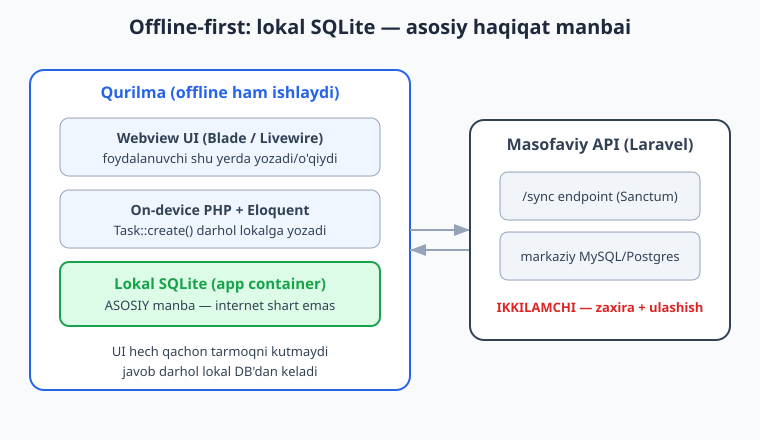
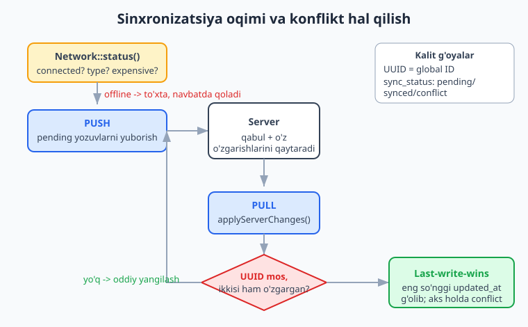
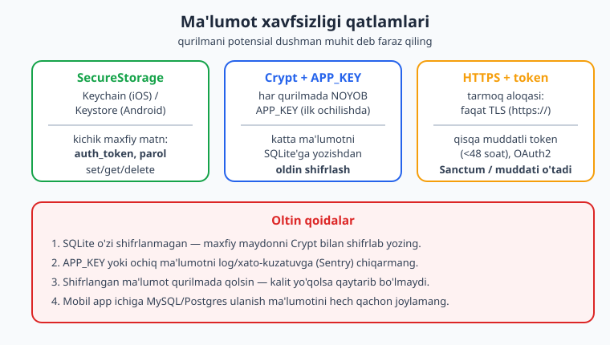

# 14 — Mobil ma'lumot va offline

[⬅️ Oldingi: 13 — Qurilma imkoniyatlari II: Biometrics, SecureStorage, Push](./13-qurilma-biometrics-securestorage-push.md) · [🏠 README](./README.md) · [Keyingi: 15 — Testlash va debugging ➡️](./15-testlash-debugging.md)

---

> **Bu bobda:** Mobil ilovangizning yuragi — **ma'lumot**. NativePHP mobil ilovalari `nativephp/mobile` orqali har qurilmada **on-device SQLite** ma'lumotlar bazasiga ega bo'ladi: u app container ichida avtomatik yaratiladi va migratsiyalaringiz har ishga tushishda kerakli paytda bajariladi. Biz **offline-first** dizayn falsafasini o'rganamiz: lokal SQLite asosiy haqiqat manbai, server esa ikkilamchi. So'ng masofaviy Laravel API bilan **sinxronizatsiya** (push/pull), ma'lumotni **keshlash**, `Native\Mobile\Facades\Network` bilan **tarmoq holatini kuzatish**, UUID asosida **konflikt hal qilish** (last-write-wins), va `SecureStorage` + `Crypt` + HTTPS/Sanctum bilan **ma'lumot xavfsizligi**ni ko'ramiz.
>
> **HALOL eslatma:** NativePHP "sof native widget" yaratmaydi — Laravel ilovangizni native qobiq ichidagi **webview**'da ishga tushiradi (UI = HTML/CSS/JS = Blade/Livewire; biznes-mantiq = qurilmada ishlovchi PHP runtime). Bu bobdagi **Eloquent/migratsiya/sinxronizatsiya/keshlash/Crypt mantig'i HAQIQATAN ishga tushirilib tekshirildi** (Laravel boot + in-memory SQLite ustida; `php -l` + `php artisan migrate` + skript). Biroq `Network`, `SecureStorage`, `Dialog` kabi `Native\Mobile\*` facade'lar **faqat qurilmada/emulatorda** ishlaydi — bu yerda ular **illustrativ** (kod sintaktik to'g'ri, imzolar rasmiy docs'dan), soxta "qurilmada ishladi" yozilmagan.

---

## Nega ma'lumot mobilda boshqacha?

Oddiy Laravel web ilovangizda ma'lumotlar **server**dagi MySQL'da yashaydi. Brauzer faqat HTTP so'rov yuboradi, javobni kutadi va HTML oladi. Tarmoq uzilsa — ilova o'lik.

Mobil NativePHP'da rasm tubdan boshqacha. 10-bobda ko'rganimizdek, **PHP qurilmaning o'zida ishlaydi**. Demak ma'lumot ham qurilmada — **lokal SQLite** faylida — yashashi mumkin. Eloquent xuddi shu tarzda ishlaydi, lekin so'rovlar lokal faylga boradi, tarmoqqa emas.

Bu bitta katta natijaga olib keladi: **ilova internetsiz ishlaydi.** Foydalanuvchi metroda, samolyotda yoki signal yo'q joyda eslatma yozadi, vazifa belgilaydi — hammasi darhol ishlaydi. Internet qaytganda esa ma'lumot serverga sinxronlanadi.

Bu bobning markaziy g'oyasi shu: **offline-first**. Ya'ni ilova birinchi navbatda offline ishlash uchun loyihalanadi, internet esa "bonus" — bor bo'lsa zo'r, yo'q bo'lsa ham hammasi ishlaydi.

> Eloquent va migratsiyalar bo'yicha asoslar kerak bo'lsa: [../laravel/README.md](../laravel/README.md). SQL va indekslar uchun: [../sql/README.md](../sql/README.md).

## On-device SQLite: avtomatik sozlanadi

Eng yaxshi xabar — siz hech narsa sozlamaysiz. Rasmiy hujjatlarda (nativephp.com/docs/mobile/3/concepts/databases) aytilganidek, NativePHP build paytida SQLite'ni **avtomatik** sozlaydi:

- ma'lumotlar bazasini **app container ichida yaratadi**;
- **migratsiyalaringizni har ilova ishga tushishida, kerak bo'lganda bajaradi.**

Demak `database/migrations/` papkangizdagi oddiy Laravel migratsiyalar qurilmada o'z-o'zidan qo'llanadi. Konfiguratsiya `.env`'dagi `DB_CONNECTION=sqlite` orqali keladi — bu allaqachon Laravel'da standart.

Bir nechta **muhim cheklov** (rasmiy docs'dan):

- **Faqat SQLite.** MySQL/PostgreSQL qo'llab-quvvatlanmaydi. Bu **ataylab** qilingan xavfsizlik qarori — dasturchilar mobil app ichiga production DB parolini joylab qo'ymasligi uchun.
- **Masofaviy kirish yo'q.** Ma'lumot qurilmada — uni serverdan turib o'qiy olmaysiz.
- **Ilova o'chirilsa — ma'lumot ham o'chadi.** Foydalanuvchi ilovani o'chirsa, SQLite fayli ham yo'qoladi. Shuning uchun muhim ma'lumotni serverga sinxronlash kerak.

> **HALOL:** Yuqoridagi xatti-harakat (avtomatik yaratish + har boot'da migratsiya) **faqat real qurilmada/emulatorda** sodir bo'ladi. Bu bobda men migratsiya va Eloquent mantig'ini **oddiy Laravel muhitida SQLite ustida ishga tushirib tekshirdim** — bu kod aynan o'sha. Lekin "qurilmada avtomatik ishladi" deganni men ko'rmadim; buni docs aytadi.

### Migratsiya — qurilmada seeding ham shu orqali

Mobilda `db:seed` o'rniga **seeding migratsiya** ishlatish tavsiya etiladi: har migratsiya har installatsiyada **aynan bir marta** ishlaydi va Laravel uni kuzatib boradi. Rasmiy misol:

```bash
php artisan make:migration seed_app_settings
```

```php
use Illuminate\Database\Migrations\Migration;
use Illuminate\Support\Facades\DB;

return new class extends Migration
{
    public function up(): void
    {
        DB::table('categories')->insert([
            ['name' => 'Ish', 'color' => '#3B82F6'],
            ['name' => 'Shaxsiy', 'color' => '#10B981'],
        ]);
    }
};
```

> **DIQQAT (rasmiy ogohlantirish):** Migratsiyalaringizni **production build'da test qiling**! Noto'g'ri migratsiya foydalanuvchi ilovani yangilaganda uning ma'lumotini o'chirib yuborishi mumkin.

## Offline-first dizayn

Offline-first'ning bitta qoidasi bor: **UI hech qachon tarmoqni kutmaydi.** Foydalanuvchi tugma bossa, javob darhol **lokal SQLite**'dan keladi. Serverga yuborish esa fonda, keyinroq, internet bo'lganda sodir bo'ladi.



An'anaviy "online-first" bilan taqqoslang:

| | Online-first (oddiy web) | Offline-first (mobil) |
|---|---|---|
| Asosiy manba | server DB | **lokal SQLite** |
| Yozuvda | serverga so'rov, javob kutiladi | lokalga darhol yoziladi |
| Tarmoq uzilsa | ilova ishlamaydi | ilova bemalol ishlaydi |
| Server roli | yagona haqiqat | zaxira + qurilmalar aro ulashish |

Buni amalda yoritish uchun ma'lumot modelimizni **sinxronizatsiya uchun moslab** loyihalashimiz kerak. Oddiy `id` yetarli emas — bizga har qurilmada barqaror **global ID** (UUID) va har yozuvning **holati** kerak.

### Sinxronizatsiyaga tayyor migratsiya

```php
// database/migrations/xxxx_create_tasks_table.php
use Illuminate\Database\Migrations\Migration;
use Illuminate\Database\Schema\Blueprint;
use Illuminate\Support\Facades\Schema;

return new class extends Migration
{
    public function up(): void
    {
        Schema::create('tasks', function (Blueprint $table) {
            $table->id();                       // lokal birlamchi kalit
            $table->uuid('uuid')->unique();     // global, qurilmalar aro barqaror ID
            $table->string('title');
            $table->boolean('done')->default(false);
            $table->timestamp('updated_at_server')->nullable(); // server versiyasi vaqti
            $table->string('sync_status')->default('pending');  // pending|synced|conflict
            $table->boolean('is_deleted')->default(false);      // soft-delete (tombstone)
            $table->timestamps();
        });
    }

    public function down(): void
    {
        Schema::dropIfExists('tasks');
    }
};
```

Nega bu ustunlar?

- **`uuid`** — har qurilmada yaratilgan yozuv noyob global ID oladi. `id` (autoincrement) ikki qurilmada to'qnashishi mumkin, UUID esa yo'q.
- **`sync_status`** — yozuv server bilan moslashganmi (`synced`), yangimi (`pending`), yoki konfliktdami (`conflict`).
- **`is_deleted`** — mobilda yozuvni **darhol o'chirmaymiz**, balki "tombstone" qo'yamiz. Aks holda o'chirilgan yozuv keyingi pull'da serverdan qaytib keladi.
- **`updated_at_server`** — server versiyasining vaqti; konfliktni hal qilishda kerak.

### Eloquent modeli (UUID avtomatik)

```php
// app/Models/Task.php
namespace App\Models;

use Illuminate\Database\Eloquent\Model;
use Illuminate\Support\Str;

class Task extends Model
{
    protected $fillable = [
        'uuid', 'title', 'done', 'sync_status', 'is_deleted', 'updated_at_server',
    ];

    protected $casts = [
        'done' => 'boolean',
        'is_deleted' => 'boolean',
        'updated_at_server' => 'datetime',
    ];

    protected static function booted(): void
    {
        static::creating(function (Task $task) {
            $task->uuid ??= (string) Str::uuid();
        });
    }
}
```

`creating` hodisasida UUID avtomatik to'ldiriladi — controller yoki Livewire'da buni qo'lda yozish shart emas.

> **Bu kod ISHGA TUSHIRILDI.** Men ushbu modelni va migratsiyani oddiy Laravel + SQLite muhitida `php artisan migrate` bilan ko'chirib, `Task::create(['title' => '...'])` chaqirdim — UUID 36 belgili avtomatik yaratildi, `sync_status` default `pending` bo'ldi, `done` bool'ga cast bo'ldi. Hammasi `OK`.

## Tarmoq holatini kuzatish: Network facade

Sinxronlashdan oldin internet bor-yo'qligini bilishimiz kerak. Buning uchun rasmiy `Network` facade'i bor (`composer require nativephp/mobile-network`).

Rasmiy docs'dan (nativephp.com/docs/mobile/3/apis/network) **aniq olingan** imzo:

**`Network`** (`Native\Mobile\Facades\Network`):

```php
use Native\Mobile\Facades\Network;

$status = Network::status();

$status->connected;     // bool — qurilmada internet bormi
$status->type;          // string — 'wifi' | 'cellular' | 'ethernet' | 'unknown'
$status->isExpensive;   // bool — metered (mobil traffik) ulanishimi
$status->isConstrained; // bool — Low Data Mode (faqat iOS)
```

JavaScript tomonidan (Inertia/Vue/React):

```js
import { Network } from '#nativephp';
const status = await Network.status();
```

> **HALOL:** `Network::status()` **faqat qurilmada/emulatorda** real qiymat qaytaradi — chunki u native bridge orqali OS'dan ma'lumot oladi. Bu muhitda men kodning **sintaksisini** tekshirdim (`php -l` toza), imzolarni rasmiy docs'dan oldim, lekin real `connected`/`type` qiymatini ko'rmadim. Talab: iOS 18.2+, Android 26+.

Tarmoq turini bilish nima beradi? `isExpensive` `true` bo'lsa (mobil traffik) — siz katta payload yubormaslik yoki rasmlarni sinxronlashni Wi-Fi'gacha kechiktirish qarorini qabul qila olasiz. Bu foydalanuvchi traffigini tejaydi.

## Sinxronizatsiya: push va pull

Endi eng qizig'i — lokal SQLite'ni masofaviy Laravel API bilan moslashtirish. Oqim ikki yo'nalishli:

- **Push** — lokal `pending` yozuvlarni serverga yuborish.
- **Pull** — server o'zgartirgan yozuvlarni qurilmaga qaytarib qo'llash.



Mantiqni **tarmoqdan ajratib** loyihalash juda muhim — shunda uni test qilish oson bo'ladi. Quyidagi `SyncService` sof PHP/Eloquent: u payload tayyorlaydi va server javobini qo'llaydi, lekin HTTP'ni o'zi chaqirmaydi.

```php
// app/Support/SyncService.php
namespace App\Support;

use App\Models\Task;
use Illuminate\Support\Collection;

class SyncService
{
    /** Push uchun: hali sinxronlanmagan lokal yozuvlar. */
    public function pendingPayload(): Collection
    {
        return Task::query()
            ->where('sync_status', 'pending')
            ->get()
            ->map(fn (Task $t) => [
                'uuid' => $t->uuid,
                'title' => $t->title,
                'done' => $t->done,
                'is_deleted' => $t->is_deleted,
                'updated_at' => $t->updated_at?->toIso8601String(),
            ]);
    }

    /**
     * Serverdan kelgan o'zgarishlarni qo'llaydi (pull).
     * Konflikt: lokal "pending" yozuv serverda ham yangilangan bo'lsa,
     * last-write-wins (eng so'nggi updated_at g'olib) bilan hal qilamiz.
     *
     * @param  array<int,array<string,mixed>>  $remote
     * @return array{applied:int,conflicts:int}
     */
    public function applyServerChanges(array $remote): array
    {
        $applied = 0;
        $conflicts = 0;

        foreach ($remote as $row) {
            $local = Task::query()->where('uuid', $row['uuid'])->first();

            if (! $local) {
                // Serverda bor, lokalda yo'q -> yangi yozuv
                Task::create([
                    'uuid' => $row['uuid'],
                    'title' => $row['title'],
                    'done' => $row['done'],
                    'is_deleted' => $row['is_deleted'] ?? false,
                    'sync_status' => 'synced',
                    'updated_at_server' => $row['updated_at'],
                ]);
                $applied++;
                continue;
            }

            $serverTime = strtotime($row['updated_at']);
            $localTime = $local->updated_at?->timestamp ?? 0;

            if ($local->sync_status === 'pending' && $localTime > $serverTime) {
                // Lokal o'zgarish yangiroq -> lokalni saqlaymiz, konflikt belgilaymiz
                $local->sync_status = 'conflict';
                $local->save();
                $conflicts++;
                continue;
            }

            // Server g'olib (last-write-wins)
            $local->fill([
                'title' => $row['title'],
                'done' => $row['done'],
                'is_deleted' => $row['is_deleted'] ?? false,
                'sync_status' => 'synced',
                'updated_at_server' => $row['updated_at'],
            ])->save();
            $applied++;
        }

        return ['applied' => $applied, 'conflicts' => $conflicts];
    }

    /** Push muvaffaqiyatli bo'lgach lokal yozuvlarni "synced" qilamiz. */
    public function markSynced(array $uuids): int
    {
        return Task::query()
            ->whereIn('uuid', $uuids)
            ->update(['sync_status' => 'synced']);
    }
}
```

> **Bu sinf ISHGA TUSHIRILDI.** Men `SyncService`'ni Laravel boot ostida (in-memory SQLite) ishlatdim: `pendingPayload()` to'g'ri sonni qaytardi; `applyServerChanges()` yangi yozuvni qo'shdi; lokal-yangiroq holatda yozuvni `conflict` qildi va lokal sarlavhani saqladi; server-yangiroq holatda server qiymatini qabul qilib `synced` qildi; `markSynced()` qatorlarni yangiladi. Barcha tekshiruvlar `OK`.

### Tarmoq qatlami: Livewire'da birlashtirish

Endi `Network`, `SecureStorage`, `Http` va `SyncService`'ni bitta Livewire komponentida birlashtiramiz. Bu mobil qurilmada ishlaydigan real oqim:

```php
namespace App\Livewire;

use Livewire\Component;
use App\Support\SyncService;
use Native\Mobile\Facades\Network;
use Native\Mobile\Facades\SecureStorage;
use Native\Mobile\Facades\Dialog;
use Illuminate\Support\Facades\Http;

class SyncCenter extends Component
{
    public bool $online = false;
    public int $pendingCount = 0;

    public function syncNow(SyncService $sync): void
    {
        $status = Network::status();

        if (! $status->connected) {
            Dialog::toast('Internet yo\'q. Keyinroq sinxronlanadi.', 'short');
            return;
        }

        if ($status->isExpensive) {
            Dialog::toast('Mobil internet: tejamkor rejim', 'short');
        }

        // Token Keychain/Keystore'dan
        $tokenResult = SecureStorage::get('auth_token');
        $token = $tokenResult['value'] !== '' ? $tokenResult['value'] : null;

        $payload = $sync->pendingPayload();

        $response = Http::withToken($token)
            ->acceptJson()
            ->post('https://api.misol.uz/sync', ['changes' => $payload]);

        if ($response->successful()) {
            $sync->applyServerChanges($response->json('changes', []));
            $sync->markSynced($payload->pluck('uuid')->all());
            Dialog::toast('Sinxronlandi', 'short');
        }

        $this->pendingCount = $sync->pendingPayload()->count();
    }

    public function render()
    {
        return view('livewire.sync-center');
    }
}
```

> **HALOL:** Bu komponentdagi **`SyncService` + `Http` mantig'i sof Laravel** (test qildim). Lekin `Network::status()`, `SecureStorage::get()`, `Dialog::toast()` **faqat qurilmada** ishlaydi — bu yerda sintaksisni `php -l` bilan tekshirdim (toza), imzolarni docs'dan oldim. `https://api.misol.uz` — misol manzil.

## Konflikt hal qilish strategiyalari

Konflikt — bir yozuv ikki joyda (lokalda va serverda) bir vaqtda o'zgartirilgan holat. Buni hal qilishning bir nechta strategiyasi bor:

| Strategiya | Qanday ishlaydi | Qachon ishlatiladi |
|---|---|---|
| **Last-write-wins** | eng so'nggi `updated_at` g'olib | oddiy, ko'pchilik ilova uchun yetarli |
| **Server-wins** | har doim server qiymati | server "yagona haqiqat" bo'lsa |
| **Client-wins** | har doim lokal qiymat | foydalanuvchi qurilmasi ustun bo'lsa |
| **Manual merge** | foydalanuvchidan so'raladi | muhim ma'lumot (masalan, matn tahriri) |

Yuqoridagi `SyncService` **last-write-wins** ishlatadi, lekin lokal yozuv yangiroq bo'lsa uni o'chirmasdan `conflict` deb belgilaydi — shunda keyin foydalanuvchiga ko'rsatib, qaror so'rash mumkin. Bu **gibrid** yondashuv: avtomatik, lekin xavfli holatda inson aralashuviga joy qoldiradi.

> **MUHIM:** UUID konflikt hal qilishning poydevori. Agar siz faqat autoincrement `id` ishlatsangiz, ikki qurilma bir xil `id`'li, lekin boshqa-boshqa yozuv yaratadi va sinxronlashda chalkashlik chiqadi. UUID bunday to'qnashuvni butunlay yo'q qiladi.

## Ma'lumotni keshlash

Keshlash — qimmat operatsiya (masalan, server API javobi yoki og'ir hisoblash) natijasini vaqtincha lokal saqlash. Mobilda bu ikki sababdan foydali:

1. **Tezlik** — keshdan o'qish tarmoqdan o'qishdan ancha tez.
2. **Offline** — internet yo'q bo'lsa, oxirgi keshlangan ma'lumotni ko'rsata olasiz.

Laravel'ning standart `Cache` facade'i qurilmada ham ishlaydi (drayver `database` yoki `file` bo'lsa lokal SQLite/faylga yoziladi):

```php
use Illuminate\Support\Facades\Cache;

// 10 daqiqaga saqlash
Cache::put('feed', $items, now()->addMinutes(10));

// Bor bo'lsa keshdan, yo'q bo'lsa hisoblab keshlash
$weather = Cache::remember('weather:tashkent', 600, function () {
    return Http::get('https://api.misol.uz/weather/tashkent')->json();
});
```

Offline'da `remember` callback'i tarmoq xatosi bersa, oldingi keshni qaytaradigan **stale-while-revalidate** naqshini qo'lda yozish mumkin:

```php
public function feed(): array
{
    try {
        $fresh = Http::timeout(3)->get('https://api.misol.uz/feed')->json();
        Cache::forever('feed:last', $fresh);  // oxirgi yaxshi nusxa
        return $fresh;
    } catch (\Throwable $e) {
        // Internet yo'q yoki sekin -> oxirgi keshni ber
        return Cache::get('feed:last', []);
    }
}
```

> **Bu kod ISHGA TUSHIRILDI.** `Cache::put`/`has`/`remember`'ni Laravel boot ostida ishlatdim — `has` `true` qaytardi, `remember` qiymatni keshladi. (Default `database` cache drayveri SQLite'ga yozdi.)

## Ma'lumot xavfsizligi

Mobil qurilma — **potensial dushman muhit**. Foydalanuvchi telefonini yo'qotishi, yoki ildiz huquqi (root/jailbreak) bilan fayllarni ko'rishi mumkin. Shuning uchun ma'lumotni himoyalash zarur.



Rasmiy docs (nativephp.com/docs/mobile/3/concepts/security) uch qatlamni tavsiya qiladi:

### 1. SecureStorage — kichik maxfiy matn uchun

13-bobda ko'rganimizdek, `SecureStorage` ma'lumotni OS Keychain (iOS) / Keystore (Android)'ga shifrlab saqlaydi. **Auth token, parol** kabi kichik (bir necha KB) maxfiy matnlar uchun ideal.

```php
use Native\Mobile\Facades\SecureStorage;

SecureStorage::set('auth_token', $token); // saqlash -> ['success' => true]
$result = SecureStorage::get('auth_token'); // -> ['value' => '...'] (yo'q bo'lsa '')
SecureStorage::delete('auth_token');        // o'chirish (logout)
```

### 2. Crypt + per-device APP_KEY — katta ma'lumot uchun

SQLite fayli **o'zi shifrlanmagan**. Maxfiy maydonni (masalan, foydalanuvchi kiritgan API kalit) DB'ga yozishdan oldin Laravel'ning `Crypt` facade'i bilan shifrlang. NativePHP ilk ochilishda **har qurilma uchun noyob `APP_KEY`** yaratib, uni xavfsiz saqlaydi — shuning uchun `Crypt` xavfsiz ishlaydi.

```php
use Illuminate\Support\Facades\Crypt;

// Yozishdan oldin shifrlash
$task->secret = Crypt::encryptString($apiKey);
$task->save();

// O'qishda deshifrlash
$apiKey = Crypt::decryptString($task->secret);
```

> **Bu kod ISHGA TUSHIRILDI.** `Crypt::encryptString`/`decryptString`'ni Laravel boot ostida ishlatdim: shifrlangan matn asl matndan farq qildi, deshifrlangach asl matn tiklandi. `OK`.

### 3. HTTPS + qisqa muddatli token

Tarmoq aloqasi **har doim `https://`** orqali. Autentifikatsiya uchun **qisqa muddatli token** (rasmiy tavsiya: <48 soat) yoki OAuth2 ishlating — Laravel **Sanctum** bu uchun mukammal. Server tomonda:

```php
// routes/api.php (server tarafdagi Laravel)
use Illuminate\Http\Request;

Route::middleware('auth:sanctum')->post('/sync', function (Request $request) {
    $changes = $request->validate([
        'changes' => ['array'],
        'changes.*.uuid' => ['required', 'uuid'],
        'changes.*.title' => ['required', 'string'],
    ]);

    // ... yozuvlarni saqlash va o'z o'zgarishlarini qaytarish
    return response()->json(['changes' => []]);
});
```

### Oltin qoidalar (rasmiy docs'dan)

- SQLite o'zi shifrlanmagan — maxfiy maydonni `Crypt` bilan shifrlang.
- `APP_KEY` yoki ochiq ma'lumotni log / xato-kuzatuvga (Sentry kabi) **chiqarmang**.
- `Crypt` bilan shifrlangan ma'lumot **qurilmada qolsin** — kalit yo'qolsa, boshqa joyda deshifrlab bo'lmaydi.
- Mobil app ichiga **hech qachon** production MySQL/Postgres ulanish ma'lumotini joylamang (shuning uchun mobilda faqat SQLite).
- Har installatsiya uchun **noyob kalit** ishlating, umumiy kalit emas.

> **HALOL:** `SecureStorage` faqat qurilmada ishlaydi (illustrativ, imzo docs'dan). `Crypt` qismi esa oddiy Laravel — uni shu muhitda **ishga tushirib tekshirdim**.

## Hammasini birlashtirish: oqim

Mana to'liq offline-first oqim, qadam-qadam:

1. Foydalanuvchi vazifa yaratadi -> `Task::create(...)` **darhol lokal SQLite**'ga yozadi, `sync_status = pending`. UI darhol yangilanadi.
2. Ilova `Network::status()` bilan internetni tekshiradi.
3. Internet bo'lsa: `pendingPayload()` -> `Http::withToken(...)->post('/sync')` (push).
4. Server javobi -> `applyServerChanges()` (pull), konfliktlar last-write-wins bilan hal qilinadi.
5. Push muvaffaqiyatli -> `markSynced(...)`.
6. Internet bo'lmasa: hech narsa qilinmaydi — yozuvlar `pending` bo'lib navbatda qoladi, keyingi imkoniyatda yuboriladi.

Bu naqsh ilovani **ishonchli** qiladi: tarmoq qanchalik beqaror bo'lmasin, foydalanuvchi ma'lumoti hech qachon yo'qolmaydi.

## Mashqlar

### Oson

1. Mobil NativePHP qaysi ma'lumotlar bazasi turini qo'llab-quvvatlaydi va nega faqat o'sha? Bir-ikki jumlada javob bering.
2. Sinxronizatsiyaga tayyor jadvalda nega `id` (autoincrement) yetarli emas? Qaysi ustun bu muammoni hal qiladi?
3. `Native\Mobile\Facades\Network` ning `status()` metodi qaytaradigan obyektning to'rtta xususiyatini va turini yozing.
4. Offline-first dizaynning markaziy qoidasini ("UI ... kutmaydi") to'ldiring va bir jumlada izohlang.
5. `sync_status` ustuni qaysi uch qiymatni oladi? Har birini bir jumlada tushuntiring.
6. Nega mobilda yozuvni `delete()` qilish o'rniga `is_deleted = true` ("tombstone") qo'yamiz?

### O'rta

7. `Task` modeli yozing: `creating` hodisasida UUID avtomatik to'ldirilsin, `done` va `is_deleted` bool'ga cast bo'lsin.
8. `Cache::remember` yordamida ob-havo API javobini 10 daqiqaga keshlaydigan metod yozing. Internet yo'qligi (exception) holatida oxirgi keshni qaytaradigan `try/catch` variantini ham qo'shing.
9. `Network::status()` ni tekshirib: internet yo'q bo'lsa `Dialog::toast` bilan ogohlantirib chiqib ketadigan, `isExpensive` bo'lsa tejamkor rejim toastini ko'rsatadigan `syncNow()` metodining boshlanishini yozing.
10. To'rtta konflikt hal qilish strategiyasini (last-write-wins, server-wins, client-wins, manual merge) sanab, har biri qachon mos kelishini yozing.
11. Auth token'ni `SecureStorage` bilan saqlash, o'qish va logout'da o'chirish uchun uch metod yozing. `get()` ning qaytaruvchi shaklini hisobga oling.
12. Foydalanuvchi kiritgan maxfiy API kalitini DB'ga yozishdan oldin shifrlab, o'qishda deshifrlaydigan ikkita metod (`storeKey`, `readKey`) yozing.

### Qiyin

13. To'liq `SyncService::applyServerChanges(array $remote)` metodini yozing: yangi yozuvni qo'shsin, mavjud yozuvda last-write-wins qo'llasin, lokal yangiroq bo'lsa `conflict` belgilasin va `['applied' => , 'conflicts' => ]` qaytarsin.
14. Offline-first oqimni 6 qadamda to'liq tasvirlang (yozuv yaratishdan to `markSynced` gacha), har qadamda qaysi qatlam (UI / lokal SQLite / Network / server) ishtirok etishini ko'rsating.
15. Bir o'quvchi: "Men mobil ilovamga to'g'ridan-to'g'ri production MySQL'ni ulamoqchiman, sinxronlash bilan ovora bo'lmay." Nega bu yomon g'oya ekanini xavfsizlik va NativePHP cheklovi nuqtai nazaridan tushuntiring va to'g'ri arxitekturani taklif qiling.
16. SQLite o'zi shifrlanmaganini hisobga olib, "to'liq xavfsiz mobil ma'lumot saqlash" strategiyasini uch qatlamda (SecureStorage / Crypt+SQLite / HTTPS+Sanctum) loyihalang. Har qatlamda nima saqlanishini va nega aynan shu qatlamda saqlanishini yozing.

<details markdown="1"><summary>Yechimlar</summary>

**1.** Faqat **SQLite**. Bu ataylab qilingan xavfsizlik qarori: dasturchilar mobil app ichiga production MySQL/Postgres parolini joylab qo'ymasligi uchun (app ochiq muhit, kredensiallar o'g'irlanishi mumkin). MySQL/Postgres qo'llab-quvvatlanmaydi.

**2.** Chunki autoincrement `id` har qurilmada mustaqil o'sadi — ikki qurilma bir xil `id` raqamli, lekin butunlay boshqa yozuv yaratishi mumkin. Sinxronlashda bu chalkashlik beradi. **`uuid`** ustuni buni hal qiladi: har yozuv global, qurilmalar aro barqaror noyob ID oladi.

**3.**
```
$status->connected;     // bool
$status->type;          // string ('wifi'|'cellular'|'ethernet'|'unknown')
$status->isExpensive;   // bool (metered/mobil traffik)
$status->isConstrained; // bool (Low Data Mode, faqat iOS)
```

**4.** "UI hech qachon **tarmoqni** kutmaydi." Ya'ni foydalanuvchi amali (yozish/o'qish) darhol lokal SQLite ustida bajariladi va javob beriladi; serverga yuborish esa fonda, keyinroq sodir bo'ladi. Shu sabab ilova internetsiz ham tez va ishonchli ishlaydi.

**5.**
- `pending` — yozuv lokalda yangi/o'zgartirilgan, hali serverga yuborilmagan.
- `synced` — yozuv server bilan moslashgan, o'zgarish yo'q.
- `conflict` — lokal va server versiyalari to'qnashgan, qaror kerak.

**6.** Agar yozuvni darhol `delete()` qilsak, keyingi **pull**'da server hali u haqida bilmasdan uni qaytarib yuboradi — o'chirilgan yozuv "tirilib" qoladi. `is_deleted = true` (tombstone) esa o'chirishni ham sinxronlash mumkin bo'lgan **o'zgarish** sifatida saqlaydi; server xabardor bo'lgach, keyin jismonan tozalash mumkin.

**7.**
```php
namespace App\Models;

use Illuminate\Database\Eloquent\Model;
use Illuminate\Support\Str;

class Task extends Model
{
    protected $fillable = ['uuid', 'title', 'done', 'sync_status', 'is_deleted'];

    protected $casts = [
        'done' => 'boolean',
        'is_deleted' => 'boolean',
    ];

    protected static function booted(): void
    {
        static::creating(function (Task $task) {
            $task->uuid ??= (string) Str::uuid();
        });
    }
}
```

**8.**
```php
use Illuminate\Support\Facades\Cache;
use Illuminate\Support\Facades\Http;

public function weather(): array
{
    // Oddiy keshlash
    return Cache::remember('weather:tashkent', 600, function () {
        return Http::get('https://api.misol.uz/weather/tashkent')->json();
    });
}

public function weatherOfflineSafe(): array
{
    try {
        $fresh = Http::timeout(3)->get('https://api.misol.uz/weather/tashkent')->json();
        Cache::forever('weather:last', $fresh);
        return $fresh;
    } catch (\Throwable $e) {
        return Cache::get('weather:last', []); // oxirgi yaxshi nusxa
    }
}
```

**9.**
```php
use Native\Mobile\Facades\Network;
use Native\Mobile\Facades\Dialog;

public function syncNow(): void
{
    $status = Network::status();

    if (! $status->connected) {
        Dialog::toast('Internet yo\'q. Keyinroq sinxronlanadi.', 'short');
        return;
    }

    if ($status->isExpensive) {
        Dialog::toast('Mobil internet: tejamkor rejim', 'short');
    }

    // ... push/pull mantig'i
}
```

**10.**
- **Last-write-wins** — eng so'nggi `updated_at` g'olib. Oddiy, ko'pchilik ilova uchun yetarli (masalan vazifa ro'yxati).
- **Server-wins** — har doim server qiymati ustun. Server "yagona haqiqat manbai" bo'lsa (masalan narxlar, kurslar).
- **Client-wins** — har doim lokal (qurilma) qiymati ustun. Foydalanuvchi qurilmasi asosiy bo'lganda (masalan shaxsiy qaydlar).
- **Manual merge** — foydalanuvchidan qaysi versiyani saqlashni so'rash. Muhim/qimmatli ma'lumot uchun (masalan uzun matn tahriri, hujjat).

**11.**
```php
use Native\Mobile\Facades\SecureStorage;

public function saveToken(string $token): void
{
    SecureStorage::set('auth_token', $token);
}

public function loadToken(): ?string
{
    $result = SecureStorage::get('auth_token'); // ['value' => '...'] yoki ['value' => '']
    return $result['value'] !== '' ? $result['value'] : null;
}

public function logout(): void
{
    SecureStorage::delete('auth_token');
}
```

**12.**
```php
use Illuminate\Support\Facades\Crypt;
use App\Models\Task;

public function storeKey(Task $task, string $apiKey): void
{
    $task->secret = Crypt::encryptString($apiKey); // shifrlab yozish
    $task->save();
}

public function readKey(Task $task): string
{
    return Crypt::decryptString($task->secret); // deshifrlash
}
```

**13.**
```php
public function applyServerChanges(array $remote): array
{
    $applied = 0;
    $conflicts = 0;

    foreach ($remote as $row) {
        $local = Task::query()->where('uuid', $row['uuid'])->first();

        if (! $local) {
            Task::create([
                'uuid' => $row['uuid'],
                'title' => $row['title'],
                'done' => $row['done'],
                'is_deleted' => $row['is_deleted'] ?? false,
                'sync_status' => 'synced',
                'updated_at_server' => $row['updated_at'],
            ]);
            $applied++;
            continue;
        }

        $serverTime = strtotime($row['updated_at']);
        $localTime = $local->updated_at?->timestamp ?? 0;

        if ($local->sync_status === 'pending' && $localTime > $serverTime) {
            $local->sync_status = 'conflict';
            $local->save();
            $conflicts++;
            continue;
        }

        $local->fill([
            'title' => $row['title'],
            'done' => $row['done'],
            'is_deleted' => $row['is_deleted'] ?? false,
            'sync_status' => 'synced',
            'updated_at_server' => $row['updated_at'],
        ])->save();
        $applied++;
    }

    return ['applied' => $applied, 'conflicts' => $conflicts];
}
```

**14.**
1. **UI** — foydalanuvchi vazifa yaratadi; `Task::create(...)` chaqiriladi.
2. **Lokal SQLite** — yozuv darhol yoziladi, `sync_status = pending`; UI shu zahoti yangilanadi (tarmoq kutilmaydi).
3. **Network** — `Network::status()` internet bor-yo'qligini tekshiradi.
4. **server** — internet bo'lsa, `pendingPayload()` -> `Http::post('/sync')` (push); server o'z o'zgarishlarini qaytaradi.
5. **Lokal SQLite** — `applyServerChanges()` server o'zgarishlarini qo'llaydi (pull); konfliktlar last-write-wins bilan hal qilinadi.
6. **Lokal SQLite** — `markSynced(...)` yuborilgan yozuvlarni `synced` qiladi. Internet yo'q bo'lsa: yozuvlar `pending` bo'lib navbatda qoladi, keyingi imkoniyatda yuboriladi.

**15.** Bu yomon g'oya, chunki:
- **Xavfsizlik:** mobil app foydalanuvchi qurilmasida, ochiq muhitda yashaydi. App ichiga production MySQL kredensiallarini joylash — ularni dunyoga oshkor qilish demak (decompile, traffik tahlili orqali o'g'irlanadi). Har kim DB'ngizga to'g'ridan-to'g'ri ulanib, hammaning ma'lumotini ko'rishi/o'chirishi mumkin.
- **NativePHP cheklovi:** mobil NativePHP **faqat SQLite** qo'llaydi, MySQL/Postgres'ni umuman emas — aynan shu xatoning oldini olish uchun.
- **To'g'ri arxitektura:** qurilmada lokal SQLite (offline-first manba) + tarmoq orqali **xavfsiz Laravel API** (Sanctum auth, HTTPS). Mobil app DB'ga emas, API'ga ulanadi; API esa serverning ichki MySQL'i bilan ishlaydi. Token `SecureStorage`'da. Shunda kredensiallar hech qachon qurilmaga tushmaydi.

**16.** Uch qatlamli strategiya:
- **Qatlam 1 — SecureStorage (Keychain/Keystore):** bu yerda **kichik, eng maxfiy** ma'lumotlar — auth token, refresh token, parol. Nega: OS darajasida shifrlangan, faqat sizning app'ingizga ochiq, ilova lifetime'idan keyin ham saqlanadi. Lekin kichik hajm uchun (bir necha KB).
- **Qatlam 2 — Crypt + SQLite:** **katta, lekin maxfiy** ma'lumotlar — foydalanuvchi kiritgan API kalitlar, shaxsiy yozuvlar matni. Nega: SQLite katta hajmga mos, lekin o'zi shifrlanmagan, shuning uchun maxfiy maydonni `Crypt::encryptString` bilan shifrlab yozamiz (per-device APP_KEY ishlatiladi). Shifr kalit qurilmada qoladi.
- **Qatlam 3 — HTTPS + Sanctum:** **tarmoqdagi** ma'lumotlar — sinxronizatsiya trafigi. Nega: barcha aloqa TLS (`https://`) orqali; autentifikatsiya qisqa muddatli (<48 soat) token yoki OAuth2 (Sanctum) bilan, shunda o'g'irlangan token tez muddatda yaroqsiz bo'ladi. Hech qachon DB kredensiali qurilmaga yuborilmaydi.

</details>

---

[⬅️ Oldingi: 13 — Qurilma imkoniyatlari II: Biometrics, SecureStorage, Push](./13-qurilma-biometrics-securestorage-push.md) · [🏠 README](./README.md) · [Keyingi: 15 — Testlash va debugging ➡️](./15-testlash-debugging.md)
