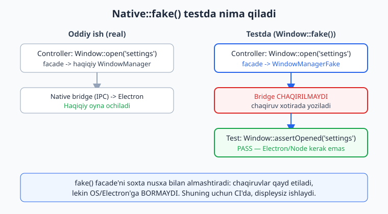
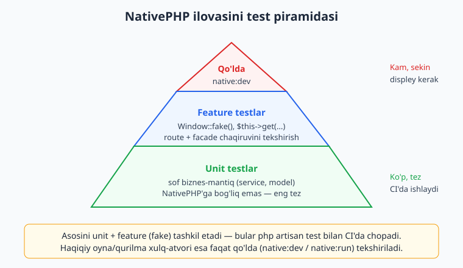
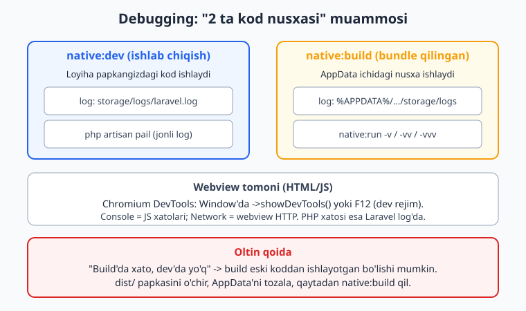

# 15 — Testlash va debugging

[⬅️ Oldingi: 14 — Mobil ma'lumot va offline](./14-mobil-offline-data.md) · [🏠 README](./README.md) · [Keyingi: 16 — Desktop build va packaging ➡️](./16-desktop-build-packaging.md)

---

> **Bu bobda:** NativePHP ilovasini qanday **test** qilish va **debug** qilishni o'rganamiz. Eng muhim savol: "agar `Window::open()` haqiqatda Electron oynasini ochsa, uni test ichida qanday tekshiraman — axir CI'da na displey, na Electron bor?". Javob — NativePHP **fake facade**'lari. Biz `Window::fake()`, `Shell::fake()`, `GlobalShortcut::fake()`, `PowerMonitor::fake()`, `ChildProcess::fake()`, `QueueWorker::fake()` larni va ularning aniq `assert*` metodlarini ko'ramiz (hammasi rasmiy docs va `vendor/nativephp/desktop` manbasidan tasdiqlangan). `fake()` mavjud bo'lmagan facade'lar (masalan `Settings`, `Notification`) uchun Laravel container'ni mock qilish usulini o'rganamiz. Keyin **unit** va **feature** testlar farqini, desktop **debugging** (Laravel loglar, `php artisan pail`, Chromium DevTools, `-v/-vv/-vvv`, "2 ta kod nusxasi" muammosi) va mobil debugging asoslarini, hamda **keng tarqalgan muammolar va yechimlar**ni ko'rib chiqamiz.
>
> **HALOL eslatma:** NativePHP "sof native widget" yaratmaydi — Laravel ilovangizni native qobiq (DESKTOP = Electron, MOBIL = Swift/Kotlin) ichidagi **webview**'da ishga tushiradi; UI = HTML/CSS/JS (Blade/Livewire/Inertia), biznes-mantiq = PHP (desktop'da bundle qilingan binar, mobil'da qurilmada ishlovchi runtime). Shu bobdagi **PHPUnit testlari haqiqatan ishga tushirildi va o'tdi** (`php artisan test` ekvivalenti bilan: 6 test, 11 assertion PASS) — bu testlar `Window/Shell/GlobalShortcut` fake'lari, unit service va Mockery container-swap'ni qamraydi. Lekin `native:dev`, `native:run`, `native:build`, real oyna/DevTools ochilishi, mobil emulator/qurilma bloklari **illustrativ** — ularni ishga tushirish displey + Electron/Node (desktop) yoki Xcode/Android SDK + qurilma (mobil) talab qiladi, bu muhitda yo'q. Soxta "oyna ochildi / qurilmada ishladi" yozilmagan.

---

## Nega NativePHP testlash boshqacha?

Tasavvur qiling, controller'ingizda shunday kod bor:

```php
use Native\Desktop\Facades\Window;

Window::open('settings');
```

Oddiy Laravel ilovasida `$this->get('/...')` deb test yozasiz. Lekin bu yerda muammo bor: `Window::open()` haqiqatda **Electron'ga IPC xabari yuboradi** va yangi OS oynasini ochishga urinadi. Test muhitida (CI server, `php artisan test`) na Electron jarayoni, na displey bor — kod ishlamay qoladi yoki muhit talab qiladi.

Yechim — Laravel'ning klassik `Mail::fake()`, `Queue::fake()` g'oyasi. NativePHP bir nechta facade uchun **`fake()`** metodini beradi: u haqiqiy facade'ni soxta nusxa (fake) bilan **almashtiradi**. Endi `Window::open()` chaqirilsa, hech qanday Electron'ga bormaydi — chaqiruv shunchaki **xotirada qayd etiladi**. Keyin siz `Window::assertOpened('settings')` deb "shu chaqiruv bo'ldimi?" deb tekshirasiz.



Bu juda muhim: fake bilan sizning **PHP-tomon mantig'ingiz** (qaysi route qaysi facade'ni qaysi argument bilan chaqiradi) to'liq test qilinadi — Electron, Node, displey kerak emas. Bu testlar CI'da bemalol chopadi.

> **Diqqat — fake nimani test QILMAYDI:** fake faqat "facade to'g'ri chaqirildimi?" degan savolga javob beradi. U haqiqiy oyna chizilishini, oyna o'lchamini, OS bildirishnomasi ko'rinishini tekshirmaydi. Bu xulq-atvor faqat **qo'lda** (`native:dev` orqali ilovani ochib) tekshiriladi.

---

## Test piramidasi: NativePHP kontekstida

Yaxshi NativePHP test strategiyasi quyidagicha taqsimlanadi:



1. **Unit testlar (asos, eng ko'p):** sof biznes-mantiq — `Service` klasslari, helper'lar, qiymat hisoblash. Bular NativePHP'ga umuman bog'liq emas, eng tez ishlaydi.
2. **Feature testlar (o'rta):** route -> controller -> facade chaqiruvi. Bu yerda `Window::fake()` va boshqa fake'lar ishlatiladi.
3. **Qo'lda tekshiruv (eng kam):** `composer native:dev` bilan ilovani ochib, haqiqiy oyna/menyu/bildirishnomalarni ko'z bilan tekshirish. Buni avtomatlashtirib bo'lmaydi (bu muhitda ham bajarilmadi — illustrativ).

Asosiy maslahat: mantiqning ko'p qismini facade chaqiruvlaridan **ajratib**, oddiy service klasslariga joylang. Shunda uni unit test bilan tez sinaysiz, controller esa faqat "service'ni chaqir va `Window::open()` qil" degan yupqa qatlamga aylanadi.

---

## Feature test: `Window::fake()`

Avvalo bir route yozamiz (host-ilova mantig'i):

```php
// routes/web.php
use Native\Desktop\Facades\Window;

Route::get('/open-settings', function () {
    Window::open('settings');

    return 'ochildi';
});
```

Endi feature test. Facade namespace'iga e'tibor bering — **`Native\Desktop\Facades\Window`** (desktop uchun; mobil'da `Native\Mobile\Facades\...`):

```php
<?php

namespace Tests\Feature;

use Native\Desktop\Facades\Window;
use Native\Desktop\Windows\Window as WindowInstance;
use PHPUnit\Framework\Attributes\Test;
use Tests\TestCase;

class NativeWindowTest extends TestCase
{
    #[Test]
    public function settings_oynasi_ochiladi(): void
    {
        Window::fake();

        // Window::open() qaytaradigan oyna obyektini fake ham qaytarishi kerak,
        // shuning uchun mock oynalarni oldindan beramiz:
        Window::alwaysReturnWindows([
            new WindowInstance('settings'),
        ]);

        $this->get('/open-settings')->assertOk();

        Window::assertOpened('settings');
        Window::assertOpenedCount(1);
    }
}
```

> **Nega `alwaysReturnWindows()` kerak?** `Window::open()` `Window`'dan meros oluvchi obyekt (aniqrog'i `PendingOpenWindow`) qaytaradi va shu sabab zanjir ishlaydi: `Window::open('x')->width(600)`. Fake ham biror obyekt qaytarishi shart. Agar mock bermasangiz, fake "No windows were provided to return" xatosini beradi. Bu bizning testimizda **haqiqatan yuzaga keldi** va `alwaysReturnWindows([...])` qo'shilgach test o'tdi.

`Window` facade'da mavjud (tasdiqlangan, `vendor/nativephp/desktop/src/Fakes/WindowManagerFake.php`) assertlar:

| Metod | Vazifasi |
|---|---|
| `Window::fake()` | facade'ni fake'ga almashtiradi |
| `Window::alwaysReturnWindows(array $windows)` | `open()` qaytaradigan mock oynalar |
| `assertOpened(null\|string\|Closure $id = null)` | oyna ochildimi |
| `assertClosed(null\|string\|Closure $id = null)` | oyna yopildimi |
| `assertHidden(null\|string\|Closure $id = null)` | oyna yashirildimi |
| `assertShown(null\|string\|Closure $id = null)` | oyna ko'rsatildimi |
| `assertReloaded(...)` / `assertNotReloaded(...)` | qayta yuklandimi / yuklanmadimi |
| `assertOpenedCount(int)` / `assertClosedCount(int)` | ochilgan / yopilgan oynalar soni |
| `assertHiddenCount(int)` / `assertShownCount(int)` | yashirilgan / ko'rsatilgan soni |

`Closure` qabul qiladigan variant — moslashuvchan tekshiruv uchun:

```php
Window::assertOpened(fn (string $id) => str_starts_with($id, 'doc-'));
```

---

## `Shell::fake()` — fayl/havola operatsiyalari

`Shell` facade'i fayl menejerini ochish, tashqi havolani brauzerda ochish kabi OS operatsiyalarini bajaradi. Test'da ularni haqiqatan ishga tushirib bo'lmaydi (brauzer ochilib ketadi). Shuning uchun `Shell::fake()`.

```php
// route
use Native\Desktop\Facades\Shell;

Route::get('/visit-site', function () {
    Shell::openExternal('https://nativephp.com');

    return 'tashqi';
});
```

```php
// test
#[Test]
public function tashqi_havola_ochiladi(): void
{
    Shell::fake();

    $this->get('/visit-site')->assertOk();

    Shell::assertOpenedExternal('https://nativephp.com');
}
```

`Shell` fake assertlari (tasdiqlangan, `ShellFake.php`):

| Metod | Tekshiradi |
|---|---|
| `assertOpenedExternal(string $url)` | URL tashqi brauzerda ochildimi |
| `assertOpenedFile(string $path)` | fayl OS bilan ochildimi |
| `assertShowInFolder(string $path)` | fayl papkada ko'rsatildimi |
| `assertTrashedFile(string $path)` | fayl savatga tashlandimi |

---

## `GlobalShortcut::fake()` — global tugmalar

Global shortcut (masalan `CmdOrCtrl+,` -> Sozlamalar) tizim darajasida ro'yxatdan o'tadi. `fake()` bilan ro'yxatga olishni tekshiramiz:

```php
// route
use Native\Desktop\Facades\GlobalShortcut;

Route::get('/register-shortcut', function () {
    GlobalShortcut::key('CmdOrCtrl+,')->register();

    return 'qayd etildi';
});
```

```php
// test
#[Test]
public function global_shortcut_qayd_etiladi(): void
{
    GlobalShortcut::fake();

    $this->get('/register-shortcut')->assertOk();

    GlobalShortcut::assertKey('CmdOrCtrl+,');
    GlobalShortcut::assertRegisteredCount(1);
}
```

`GlobalShortcut` fake assertlari (tasdiqlangan, `GlobalShortcutFake.php`):

| Metod | Tekshiradi |
|---|---|
| `assertKey(string\|Closure $key)` | shu tugma kombinatsiyasi qayd etildimi |
| `assertEvent(string\|Closure $event)` | shu event klassiga bog'landimi |
| `assertRegisteredCount(int $count)` | qayd etilganlar soni |
| `assertUnregisteredCount(int $count)` | bekor qilinganlar soni |

> **Eslatma:** `key()->event()->register()` — fluent (zanjir) API. `event()` ga Laravel event klassini berasiz; foydalanuvchi tugmani bosganda shu event dispatch qilinadi. `assertEvent(OpenPreferencesEvent::class)` bilan bog'lanishni tekshirasiz.

---

## Boshqa fake'lar: `PowerMonitor`, `ChildProcess`, `QueueWorker`

NativePHP **desktop**da `fake()` metodi mavjud facade'lar to'liq ro'yxati (`vendor/nativephp/desktop/src/Fakes/` papkasidan tasdiqlangan):

- `Window`
- `Shell`
- `GlobalShortcut`
- `PowerMonitor`
- `ChildProcess`
- `QueueWorker`

**`PowerMonitor`** (quvvat/batareya holati) assertlari:
`assertGetSystemIdleState(int|Closure)`, `assertGetSystemIdleStateCount(int)`, `assertGetSystemIdleTimeCount(int)`, `assertGetCurrentThermalStateCount(int)`, `assertIsOnBatteryPowerCount(int)`.

**`ChildProcess`** (fon jarayonlari) assertlari:
`assertGet(string|Closure $alias)`, `assertStarted(Closure)`, `assertPhp(Closure)`, `assertArtisan(Closure)`, `assertNode(Closure)`, `assertStop(string|Closure)`, `assertRestart(string|Closure)`, `assertMessage(Closure)`.

```php
use Native\Desktop\Facades\ChildProcess;

#[Test]
public function fon_ishchisiga_xabar_yuboriladi(): void
{
    ChildProcess::fake();

    $this->get('/start-worker');

    ChildProcess::assertGet('background-worker');
    ChildProcess::assertMessage(
        fn (string $message, ?string $alias) =>
            $message === '{"some-payload":"for-the-worker"}' && $alias === null
    );
}
```

**`QueueWorker`** assertlari: `assertUp(Closure)`, `assertDown(string|Closure)`.

> **Aniq imzolar uchun har doim rasmiy docs'ga qarang:** [nativephp.com/docs/desktop/2/testing/basics](https://nativephp.com/docs/desktop/2/testing/basics) va undagi sahifalar (Windows, Global Shortcut, Shell, Power Monitor, Child Process, Queue Worker). Bu kitobdagi ro'yxat o'rnatilgan `nativephp/desktop` manbasidan ko'chirilgan, lekin versiyaga qarab o'zgarishi mumkin.

---

## `fake()` BO'LMAGAN facade'larni qanday test qilish?

Bu juda muhim, lekin ko'pincha e'tibordan chetda qoladigan haqiqat: **hamma facade'da `fake()` yo'q.** Masalan `Settings`, `Notification`, `Menu`, `MenuBar`, `Dialog`, `System`, `Clipboard` da `fake()` metodi **mavjud emas** (buni `vendor/nativephp/desktop/src/Facades/` ni ko'rib tasdiqladik — faqat yuqoridagi 6 ta facade'da `public static function fake()` bor).

Unday holatda klassik Laravel usulidan foydalanamiz: **container'da konkret klassni mock bilan almashtiramiz.** NativePHP facade'ining "accessor"i — bog'langan konkret klass (masalan `Settings` -> `Native\Desktop\Settings`). Uni `$this->app->instance(...)` bilan o'z mock'imizga almashtiramiz:

```php
<?php

namespace Tests\Feature;

use Mockery;
use Native\Desktop\Facades\Settings;
use Native\Desktop\Settings as SettingsManager;
use PHPUnit\Framework\Attributes\Test;
use Tests\TestCase;

class SettingsMockTest extends TestCase
{
    #[Test]
    public function settings_get_mock_qilinadi(): void
    {
        // Settings facade'da fake() YO'Q, shuning uchun container'da
        // konkret klassni Mockery mock bilan almashtiramiz.
        $mock = Mockery::mock(SettingsManager::class);
        $mock->shouldReceive('get')
            ->with('tema', 'light')
            ->andReturn('dark');

        $this->app->instance(SettingsManager::class, $mock);

        $natija = Settings::get('tema', 'light');

        $this->assertSame('dark', $natija);
    }
}
```

Bu test **haqiqatan o'tdi** (1 test, 1 assertion PASS). Demak, qoidamiz:

- Facade'da `fake()` bormi? -> `Facade::fake()` + `Facade::assert*()` ishlat.
- `fake()` yo'qmi? -> `Mockery::mock(KonkretKlass::class)` + `$this->app->instance(KonkretKlass::class, $mock)`.

> **Maslahat:** konkret klass nomini topish uchun facade fayliga qarang — `getFacadeAccessor()` shu nomni qaytaradi. `Settings` da u `\Native\Desktop\Settings::class`.

---

## Unit testlar: mantiqni facade'dan ajrating

Eng barqaror va tez testlar — NativePHP'ga umuman tegmaydiganlari. Buning kaliti: biznes-mantiqni **service klassiga** joylash.

```php
// app/Services/Hisoblagich.php
namespace App\Services;

class Hisoblagich
{
    public function chegirma(float $narx, float $foiz): float
    {
        return round($narx - ($narx * $foiz / 100), 2);
    }
}
```

```php
// tests/Unit/HisoblagichTest.php
namespace Tests\Unit;

use App\Services\Hisoblagich;
use PHPUnit\Framework\Attributes\Test;
use PHPUnit\Framework\TestCase;

class HisoblagichTest extends TestCase
{
    #[Test]
    public function chegirmani_togri_hisoblaydi(): void
    {
        $hisob = new Hisoblagich();

        $this->assertSame(90.0, $hisob->chegirma(100, 10));
    }
}
```

Controller esa shunchaki: `$narx = $hisoblagich->chegirma(...); Notification::new()->title("Narx: $narx")->show();`. Mantiq unit test'da, facade chaqiruvi feature test'da — toza ajralish.

> Laravel test asoslarini (TestCase, RefreshDatabase, factory, `assertDatabaseHas`) takrorlamaymiz — ular ../laravel/README.md da. Bu yerda faqat **NativePHP'ga xos** qismni o'rgatdik. SQL/migratsiya tomonini sinash bo'yicha ../sql/README.md ga ham qarang.

---

## `php artisan test` va testlarni ishga tushirish

NativePHP ilovasi — oddiy Laravel ilova, shuning uchun testlar odatdagidek chopadi:

```bash
php artisan test
# yoki bevosita PHPUnit:
./vendor/bin/phpunit
# faqat bitta klass:
php artisan test --filter NativeWindowTest
```

Bu **`native:install` talab qilmaydi** — facade'lar `fake()` qilingach, Node/Electron umuman ishtirok etmaydi. (Bizning sinov muhitida `webmozart/assert` paketi yetishmasligi `Window::fake()` da xatoga olib keldi; u odatda `native:install` bilan keladi. Toza Laravel'da `composer require webmozart/assert` qilish kerak bo'lishi mumkin — bu transitiv bog'liqlik.)

CI uchun namuna (GitHub Actions, illustrativ — bu muhitda chopilmadi, lekin to'g'ri):

```yaml
# .github/workflows/test.yml
name: tests
on: [push, pull_request]
jobs:
  phpunit:
    runs-on: ubuntu-latest
    steps:
      - uses: actions/checkout@v4
      - uses: shivammathur/setup-php@v2
        with:
          php-version: '8.3'
      - run: composer install --no-interaction --prefer-dist
      - run: php artisan test
```

E'tibor bering: CI'da Electron/displey **yo'q**, va kerak emas — `fake()` tufayli testlar sof PHP'da chopadi.

---

## Desktop debugging

Endi ilova ishladi-yu, xato chiqdi. Qayerga qaraymiz?



### 1. Laravel loglar (PHP xatolari)

PHP-tomon xatolari — odatdagi Laravel log fayllarida.

- **`native:dev` (ishlab chiqish) rejimida:** loyiha papkangizdagi `storage/logs/laravel.log`.
- **`native:build` (bundle qilingan) rejimida:** loglar foydalanuvchi `AppData` ichida:
  - Windows: `%APPDATA%\{IlovaNomi}\storage\logs\`
  - macOS: `~/Library/Application Support/{IlovaNomi}/storage/logs/`
  - Linux: `$XDG_CONFIG_HOME` yoki `~/.config/{IlovaNomi}/storage/logs/`

Jonli log oqimini ko'rish uchun Laravel'ning `pail` paketi qulay:

```bash
php artisan pail
```

### 2. Chromium DevTools (HTML/JS xatolari)

UI webview ichida ishlagani uchun, brauzerdagidek DevTools mavjud. Oynani ochishda DevTools'ni yoqishingiz mumkin:

```php
use Native\Desktop\Facades\Window;

Window::open('main')
    ->showDevTools(); // dev rejimda DevTools bilan ochiladi
```

> `showDevTools()` — `Window` obyektidagi konfiguratsiya metodi (`@method` docblock va `Windows\Window` da ko'rdik). Aniq joriy imzo uchun rasmiy docs'ni tasdiqlang. DevTools'ning **Console** yorlig'i JS xatolarini, **Network** yorlig'i esa webview HTTP so'rovlarini ko'rsatadi. Lekin **PHP xatosi** Console'da emas — Laravel log'da bo'ladi.

### 3. Batafsil chiqish: `-v / -vv / -vvv`

`native:run` va `native:build` buyruqlariga batafsillik bayroqlarini bering:

```bash
php artisan native:run -vvv
```

Bu jarayon (Electron + PHP) bog'lanishi haqida ko'proq ma'lumot beradi. (Illustrativ — bu muhitda GUI yo'q.)

### 4. Bundle qilingan PHP versiyasini tekshirish

Ba'zan dev'dagi PHP versiyasi bundle qilingan PHP'dan farq qiladi va g'alati xatolar chiqadi. Bundle qilingan PHP'ni tekshiring (Windows, dev build, illustrativ yo'l):

```bash
C:\path\to\app\vendor\nativephp\electron\resources\js\resources\php\php.exe -v
```

---

## "2 ta kod nusxasi" — eng ko'p chalkashtiradigan muammo

Rasmiy docs'ning oltin qoidasi: **"har doim kamida 2 versiyadagi kodingiz ishlayotgan bo'lishi mumkin"** — nima qilayotganingizga qarab.

- `native:dev` -> **loyiha papkangizdagi** kod.
- `native:build` natijasi -> **AppData/bundle ichidagi** nusxa.

Demak, agar "build'da xato chiqyapti, lekin dev'da yo'q" desangiz, ehtimol build **eski koddan** ishlayapti. Yechim:

1. `dist/` papkasini o'chiring.
2. AppData'dagi ilova papkasini tozalang (yoki `php artisan native:migrate:fresh` bilan DB'ni yangilang).
3. Osilib qolgan jarayonlarni (Task Manager / Activity Monitor) majburan yoping.
4. Qaytadan `native:build` qiling.

---

## Mobil debugging (qisqacha)

Mobil tomonda (`nativephp/mobile`) ilova **qurilmaning o'zida** ishlovchi PHP runtime ustida ketadi. Debugging asoslari:

- **Dev rejimda versiyani DEBUG saqlang:** `.env` da `NATIVEPHP_APP_VERSION=DEBUG`. Bu native qobiq ichidagi Laravel ilovani har safar yangilab turadi (boot biroz sekinlashadi, lekin kod o'zgarishlari ko'rinadi).
- **Hot reload:** uchta parallel jarayon — `npm run dev`, `php artisan native:watch ios` (yoki `android`), va boshlang'ich `php artisan native:run --build=debug`. `config/nativephp.php` dagi `hot_reload.watch_paths` qaysi papkalar kuzatilishini belgilaydi.
- **UI'ni avval brauzerda sinang:** mobil-spetsifik bo'lmagan UI/mantiqni odatdagi brauzer + `php artisan test` bilan tekshiring; faqat native funksiyalar (Camera, Biometrics, ...) qurilma/emulator talab qiladi.
- **Platforma tekshiruvi runtime'da:**

```php
use Native\Mobile\Facades\System;

if (System::isIos()) {
    // iOS uchun mantiq
}
```

> Mobil facade namespace'i **`Native\Mobile\Facades\...`** (desktop'dan farqli). Mobil kamera/biometrik/geolokatsiya/push **REAL ishlashi** faqat qurilma/emulatorda tekshiriladi — bu bobda bu bloklar **illustrativ**. Mobil testlash uchun ham mantiqni service'larga ajratib, unit test bilan sinang.

---

## Keng tarqalgan muammolar va yechimlar

| Belgilar | Ehtimoliy sabab | Yechim |
|---|---|---|
| `Class "Webmozart\Assert\Assert" not found` test'da | `webmozart/assert` o'rnatilmagan | `composer require webmozart/assert` (yoki `native:install` qayta) |
| `Window::fake()` da "No windows were provided to return" | `open()` qaytaradigan mock berilmagan | `Window::alwaysReturnWindows([new WindowInstance('id')])` qo'shing |
| Test'da `Target [...Contract] is not instantiable` | facade fake qilinmagan, real bog'lanish yo'q | shu facade'ni `::fake()` qiling yoki container'da mock bering |
| "build'da xato, dev'da yo'q" | eski bundle ishlayapti | `dist/` o'chir, AppData tozala, qayta `native:build` |
| PHP xatosi DevTools Console'da ko'rinmaydi | PHP webview emas | Laravel log'ga (`storage/logs`) yoki `pail`'ga qarang |
| Facade'da `fake()` topilmadi | u facade'da `fake()` yo'q (masalan `Settings`, `Notification`) | Mockery + `$this->app->instance()` ishlat |
| Test mahalliy DB'ni ifloslantiryapti | `RefreshDatabase` yo'q yoki real DB ulangan | `use RefreshDatabase;` + `phpunit.xml` da test DB (SQLite `:memory:`) |
| Windows'da fayl bloklash/antivirus xatolari | Defender loyiha papkasini skanlayapti | loyiha papkasi va `C:/temp` ni Defender istisnosiga qo'shing |

---

## Mashqlar

### Oson

1. `Native\Desktop\Facades\Window` namespace'i nima uchun `Native\Laravel\...` emas? Desktop va mobil facade namespace'lari qanday farq qiladi? (Faqat tushuntiring.)
2. Quyidagi facade'lardan qaysilarida `fake()` metodi **bor**, qaysilarida **yo'q**: `Window`, `Settings`, `Shell`, `Notification`, `GlobalShortcut`, `Menu`? (Ro'yxat tuzing.)
3. `Window::fake()` ishlatilgan test'da `Window::open('dashboard')` chaqirilgach, ochilganini tekshiradigan ikkita assert yozing.
4. PHP xatosi va JS (webview) xatosi qayer log'da/asbobda ko'rinishini bir jumlada ayting.
5. `php artisan test` ishlashi uchun `native:install` shartmi? Nega? (Bir-ikki jumla.)
6. "2 ta kod nusxasi" iborasi nimani anglatadi va qaysi rejimlarga tegishli?

### O'rta

7. Bir route yozing: `/trash-temp` `Shell::trashFile(storage_path('temp.txt'))` chaqirsin. Keyin `Shell::fake()` bilan `assertTrashedFile(...)` ishlatuvchi feature test yozing.
8. `Settings` facade'i (unda `fake()` yo'q) `get('locale', 'uz')` ni `'en'` qaytarishini Mockery + `$this->app->instance()` bilan mock qilib, feature test yozing.
9. `GlobalShortcut::key('CmdOrCtrl+S')->event(\App\Events\SaveEvent::class)->register()` chaqiruvini test qilib, `assertKey`, `assertEvent`, `assertRegisteredCount` ni qo'llang.
10. Biznes-mantiqni service'ga ajratish printsipini misol bilan ko'rsating: "QQS hisoblovchi" service + unit test, va uni chaqiruvchi yupqa controller (faqat kod).
11. `Window::assertOpened()` ning `Closure` variantidan foydalanib, faqat `report-` prefiksli oynalar ochilganini tekshiruvchi assert yozing.
12. CI'da Electron yo'qligiga qaramay testlar nega ishlaydi — `fake()` mexanizmi orqali 3-4 jumlada tushuntiring.

### Qiyin

13. `ChildProcess::fake()` dan foydalanib, route fon ishchisiga `{"job":"export"}` xabarini yuborishini va `assertMessage(Closure)` bilan xabar hamda `$alias` ni tekshiruvchi to'liq feature test yozing.
14. Strategiya tuzing: 30 ekranli NativePHP desktop ilovada qaysi qismlarni unit, qaysilarini feature (fake), qaysilarini faqat qo'lda test qilasiz? Test piramidasi nuqtai nazaridan asoslang (matn).
15. `Notification` facade'da `fake()` yo'q. Loyihangizda bildirishnomalarni oson test qilinadigan qilish uchun qanday **abstraksiya qatlami** (o'z interfeysingiz + Laravel container bind) tuzasiz? Arxitekturani kod skeletlari bilan tushuntiring.

---

<details markdown="1"><summary>Yechimlar</summary>

**1.** NativePHP desktop paketi `nativephp/desktop` o'z facade'larini `Native\Desktop\Facades\` namespace'ida joylaydi (manba: `vendor/nativephp/desktop/src/Facades/`). Mobil paketi `nativephp/mobile` esa `Native\Mobile\Facades\` ishlatadi. Demak desktop kodi `use Native\Desktop\Facades\Window;`, mobil kodi `use Native\Mobile\Facades\System;` kabi import qiladi. Bir ilovada desktop+mobil aralashtirilmaydi — qaysi platforma uchun yozsangiz, shu namespace.

**2.** `fake()` **bor**: `Window`, `Shell`, `GlobalShortcut` (va ro'yxatda berilmagan `PowerMonitor`, `ChildProcess`, `QueueWorker`). `fake()` **yo'q**: `Settings`, `Notification`, `Menu`. Ya'ni desktop'da faqat 6 facade'da `public static function fake()` mavjud.

**3.**
```php
Window::fake();
Window::alwaysReturnWindows([new \Native\Desktop\Windows\Window('dashboard')]);
// ... oynani ochuvchi route'ga so'rov ...
Window::assertOpened('dashboard');
Window::assertOpenedCount(1);
```

**4.** PHP xatosi Laravel log'da (`storage/logs/laravel.log` yoki AppData'dagi nusxa; `php artisan pail` bilan jonli); JS/webview xatosi esa Chromium **DevTools -> Console** da.

**5.** Shart emas. Testlar `fake()` qilingach, facade soxta nusxaga almashtiriladi va Node/Electron umuman ishtirok etmaydi — bu sof PHP/PHPUnit kodi. (Faqat `webmozart/assert` kabi transitiv paketlar mavjud bo'lsin.)

**6.** Ilovangizning kamida ikki nusxasi bo'lishi mumkin: `native:dev` **loyiha papkasidagi** kodni, `native:build` esa **AppData/bundle ichidagi** nusxani ishlatadi. Shu sababli "build'da xato, dev'da yo'q" holatlar yuzaga keladi.

**7.**
```php
// route
use Native\Desktop\Facades\Shell;
Route::get('/trash-temp', function () {
    Shell::trashFile(storage_path('temp.txt'));
    return 'ok';
});

// test
#[Test]
public function vaqtinchalik_fayl_savatga_tashlanadi(): void
{
    Shell::fake();
    $this->get('/trash-temp')->assertOk();
    Shell::assertTrashedFile(storage_path('temp.txt'));
}
```

**8.**
```php
use Mockery;
use Native\Desktop\Facades\Settings;
use Native\Desktop\Settings as SettingsManager;

#[Test]
public function locale_mock_qilinadi(): void
{
    $mock = Mockery::mock(SettingsManager::class);
    $mock->shouldReceive('get')->with('locale', 'uz')->andReturn('en');
    $this->app->instance(SettingsManager::class, $mock);

    $this->assertSame('en', Settings::get('locale', 'uz'));
}
```

**9.**
```php
use Native\Desktop\Facades\GlobalShortcut;

#[Test]
public function saqlash_tugmasi_qayd_etiladi(): void
{
    GlobalShortcut::fake();

    // route: GlobalShortcut::key('CmdOrCtrl+S')->event(\App\Events\SaveEvent::class)->register();
    $this->get('/register-save')->assertOk();

    GlobalShortcut::assertKey('CmdOrCtrl+S');
    GlobalShortcut::assertEvent(\App\Events\SaveEvent::class);
    GlobalShortcut::assertRegisteredCount(1);
}
```

**10.**
```php
// app/Services/QqsHisoblagich.php
namespace App\Services;
class QqsHisoblagich
{
    public function bilanQqs(float $narx, float $stavka = 12): float
    {
        return round($narx + ($narx * $stavka / 100), 2);
    }
}

// tests/Unit/QqsHisoblagichTest.php
use App\Services\QqsHisoblagich;
$this->assertSame(112.0, (new QqsHisoblagich())->bilanQqs(100));

// controller (yupqa qatlam)
public function show(QqsHisoblagich $qqs)
{
    $narx = $qqs->bilanQqs(100);
    \Native\Desktop\Facades\Notification::new()->title("Narx: $narx")->show();
}
```
Mantiq unit test'da to'liq sinaladi; controller faqat service'ni chaqirib, natijani facade'ga uzatadi.

**11.**
```php
Window::assertOpened(fn (string $id) => str_starts_with($id, 'report-'));
```

**12.** `Window::fake()` chaqirilganda NativePHP haqiqiy `WindowManager` bog'lanishini container'da `WindowManagerFake` bilan **almashtiradi** (`static::swap(...)`). Endi `Window::open()` Electron'ga IPC yubormaydi — chaqiruv shunchaki fake ichida massivga yoziladi. `assert*` metodlari shu yozuvni tekshiradi. Natijada test sof PHP'da chopadi va displey/Electron/Node talab qilmaydi — shuning uchun CI'da bemalol ishlaydi.

**13.**
```php
// route
use Native\Desktop\Facades\ChildProcess;
Route::get('/export-job', function () {
    ChildProcess::get('exporter')?->message(json_encode(['job' => 'export']));
    return 'jo\'natildi';
});

// test
#[Test]
public function eksport_xabari_yuboriladi(): void
{
    ChildProcess::fake();
    $this->get('/export-job')->assertOk();

    ChildProcess::assertGet('exporter');
    ChildProcess::assertMessage(
        fn (string $message, ?string $alias) =>
            $message === json_encode(['job' => 'export'])
    );
}
```
(Aniq `message()`/`get()` imzolari uchun rasmiy ChildProcess docs'ini tasdiqlang; bu yerda fake assert nomlari tasdiqlangan.)

**14.** Taklif:
- **Unit (eng ko'p):** narx/QQS/chegirma hisoblash, validatsiya qoidalari, formatlovchi helper'lar, eksport ma'lumotini tayyorlash — barchasi service klasslarda, NativePHP'siz. 30 ekrandagi "fikrlash" mantig'ining 70-80% shu yerga tushishi kerak.
- **Feature (fake):** har ekrandagi "tugma -> facade chaqiruvi" yo'llari: `Window::open()`, `Shell::openExternal()`, `GlobalShortcut::register()`, fon ishchisiga xabar (`ChildProcess`). Route -> controller -> fake assert.
- **Faqat qo'lda:** oynaning real ko'rinishi/o'lchami, menyu joylashuvi, bildirishnoma OS'da chiqishi, DevTools, batareya/quvvat real holati. Bularni `native:dev` bilan ochib ko'z bilan tekshirasiz.
Asos: piramidaning pasti (unit) keng va tez; o'rtasi (feature/fake) CI'da chopadi; uchi (qo'lda) kam va sekin — faqat fake qamramaydigan vizual/native xulq uchun.

**15.** O'z interfeysingizni kiritib, controller'ni **NativePHP facade'idan ajrating**:
```php
// app/Contracts/Bildiruvchi.php
namespace App\Contracts;
interface Bildiruvchi
{
    public function yubor(string $title, string $body): void;
}

// app/Services/NativeBildiruvchi.php (real implementatsiya)
namespace App\Services;
use App\Contracts\Bildiruvchi;
use Native\Desktop\Facades\Notification;
class NativeBildiruvchi implements Bildiruvchi
{
    public function yubor(string $title, string $body): void
    {
        Notification::new()->title($title)->message($body)->show();
    }
}

// AppServiceProvider::register()
$this->app->bind(\App\Contracts\Bildiruvchi::class, \App\Services\NativeBildiruvchi::class);

// Controller endi facade'ga emas, INTERFEYSGA bog'lanadi:
public function store(\App\Contracts\Bildiruvchi $bildiruvchi)
{
    // ...
    $bildiruvchi->yubor('Saqlandi', 'Hujjat saqlandi.');
}
```
Test'da o'z interfeysingizni mock qilasiz (NativePHP'ga umuman tegmasdan):
```php
$mock = \Mockery::mock(\App\Contracts\Bildiruvchi::class);
$mock->shouldReceive('yubor')->once()->with('Saqlandi', 'Hujjat saqlandi.');
$this->app->instance(\App\Contracts\Bildiruvchi::class, $mock);
$this->post('/save')->assertOk();
```
Bu naqsh (Hexagonal/Ports-and-Adapters) `Notification` da `fake()` yo'qligini chetlab o'tadi va kodingizni NativePHP'dan past bog'liq qiladi.

</details>

---

[⬅️ Oldingi: 14 — Mobil ma'lumot va offline](./14-mobil-offline-data.md) · [🏠 README](./README.md) · [Keyingi: 16 — Desktop build va packaging ➡️](./16-desktop-build-packaging.md)
