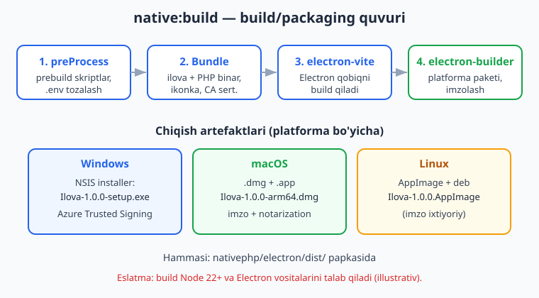
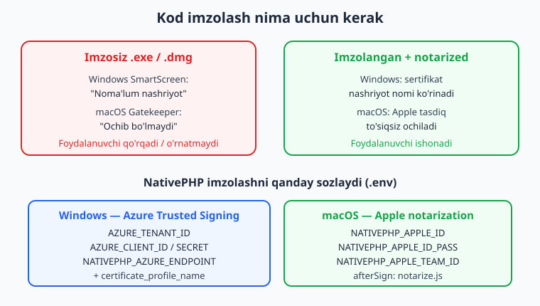
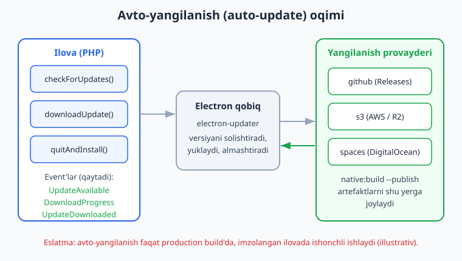

# 16 — Desktop build va packaging

[⬅️ Oldingi: 15 — Testlash va debugging](./15-testlash-debugging.md) · [🏠 README](./README.md) · [Keyingi: 17 — Mobil build va deploy (App Store, Play Store) ➡️](./17-mobil-build-deploy.md)

---

> **Bu bobda:** ilovangizni "mening kompyuterimda ishlaydi" holatidan "boshqalar yuklab o'rnatadigan mahsulot" holatiga o'tkazamiz. O'rganamiz: `php artisan native:build` buyrug'i va uning argumentlari (`os`, `arch`, `--publish`); platformaga xos chiqish formatlari (Windows `setup.exe` NSIS installer, macOS `.dmg`/`.app`, Linux `AppImage`/`deb`); kod imzolash (Windows uchun Azure Trusted Signing, macOS uchun Apple notarization); ikonka, metadata va versiya (`public/icon.png`, `config/nativephp.php`); avto-yangilanish (`AutoUpdater` facade va `github`/`s3`/`spaces` provayderlari); va tayyor ilovani tarqatish (distribution). Hamma facade, config kalit, .env o'zgaruvchi va artisan buyruq nomlari rasmiy docs va o'rnatilgan `vendor/nativephp/desktop` manba kodi bilan tasdiqlangan.
>
> **Halol eslatma:** NativePHP sof native widget yaratmaydi — ilovangiz Electron qobiq ichida ishlaydi (01-bob), UI esa webview'dagi Blade/Livewire. Build/packaging — bu Electron-ning `electron-vite` + `electron-builder` vositalarini PHP tomonidan boshqarish demak. Shu sababli build jarayoni **Node 22+ va Electron vositalarini** talab qiladi va bu kitob muhitida (displey/Node/Electron yo'q) ishga tushirilmaydi — build, imzolash va real installer bloklarini **illustrativ** deb belgilaymiz. Lekin bobdagi Laravel/PHP kod (`AutoUpdater` facade'idan foydalanuvchi controller, event listener) `php -l` bilan tekshirildi va o'rnatilgan paketga qarshi facade/event/metod nomlari reflection bilan tasdiqlandi (hech narsa to'qib chiqarilmagan).

---

## Kirish: build nima va nega bu boshqa bosqich

Hozirgacha biz ilovani `composer native:dev` bilan ishga tushirib turgan edik (03-bob). Bu — **development** rejimi: NativePHP sizning loyihangiz papkasidan to'g'ridan-to'g'ri o'qiydi, kodni o'zgartirsangiz darhol ko'rinadi, lekin bu sizning kompyuteringizga, sizning PHP'ngizga, sizning `vendor/` papkangizga bog'liq. Boshqa odamga bu ilovani bera olmaysiz.

**Build (packaging)** — bu butunlay boshqa bosqich. Maqsad: ilovangizni, PHP runtime'ini, barcha bog'liqliklarni va Electron qobiqni **bitta mustaqil paketga** yig'ish, shunda foydalanuvchi PHP ham, Composer ham, Node ham o'rnatmasdan, faqat `.exe`/`.dmg`/`.AppImage` faylni ochib ilovangizni ishlatadi.

Bu yerda bir muhim haqiqatni eslatib o'tamiz (01-bobda chuqur ko'rgan edik): desktop'da NativePHP **PHP binarini ilova ichiga bundle qiladi** (`nativephp/php-bin` paketi orqali). Ya'ni yakuniy paket ichida foydalanuvchining qurilmasida ishlovchi alohida PHP interpretatori bor — Electron qobiq webview UI'ni ko'rsatadi, PHP esa biznes-mantiqni bajaradi.



> **Talablar (rasmiy docs).** Build uchun: PHP 8.3+, Laravel 11+, **Node 22+**, va platforma vositalari. Windows 10+, macOS 12+, yoki Linux. Node kerakligi tasodif emas — `native:build` ichki holda `npm ci` ishga tushirib, keyin `electron-builder` chaqiradi.

---

## 1-qism: `native:build` buyrug'i

Asosiy buyruq:

```bash
php artisan native:build
```

O'rnatilgan paket manbasidan (`vendor/nativephp/desktop/.../Commands/BuildCommand.php`) buyruqning aniq imzosi quyidagicha:

```
native:build
    {os?}    : qaysi OS uchun (all, linux, mac, win)
    {arch?}  : protsessor arxitekturasi (x64, arm64)
    {--publish} : ilovani publish qilish (provayderga yuklash)
```

Ya'ni:

```bash
# Joriy platforma va arxitektura uchun (interaktiv tanlov so'raydi)
php artisan native:build

# Aniq platforma
php artisan native:build win
php artisan native:build mac
php artisan native:build linux

# Platforma + arxitektura
php artisan native:build win x64
php artisan native:build mac arm64

# Hamma platforma uchun (cross-compile imkoni bo'lsa)
php artisan native:build all
```

> **Cross-compilation cheklovi (rasmiy docs).** Buyruq bitta platformani bir vaqtda build qiladi. Ko'p hollarda **siz qaysi OS'da turgan bo'lsangiz, o'sha OS uchun build qilasiz**. macOS'ni faqat macOS'da imzolab build qilish mumkin (Apple vositalari kerak). Windows imzolash uchun Azure xizmati kerak. Linux'ni boshqa platformada build qilish ham har doim ishlamaydi. Real CI/CD'da odatda **har platforma uchun alohida runner** (GitHub Actions matrix) ishlatiladi.

`native:build` ichki bosqichlari (manba koddan):

1. **preProcess** — `config/nativephp.php` dagi `prebuild` skriptlarini ishga tushiradi (masalan `npm run build` — frontend asset'larni Vite bilan kompilyatsiya).
2. **Bundle / Copy** — ilovangizni, PHP binarini va CA sertifikatini build papkasiga ko'chiradi; `.env` faylini tozalaydi (`cleanup_env_keys`).
3. **Ikonkalarni o'rnatadi** — `public/icon.png` va boshqalarni Electron papkasiga ko'chiradi.
4. **electron-vite build** — Electron qobiq kodini kompilyatsiya qiladi.
5. **electron-builder** — platforma installer/paketini yasaydi va (sozlangan bo'lsa) imzolaydi.
6. **postProcess** — `postbuild` skriptlarini ishga tushiradi (tozalash va h.k.).

> **Halol (illustrativ).** Quyida `native:build win` ishga tushganda terminalda taxminan shunday ko'rinadi — bu **rasmiy muhitda shunday ko'rinadi (illustrativ)**, bu kitob muhitida Node/Electron yo'qligi sababli ishga tushirilmagan:
>
> ```text
> Updating Electron dependencies...
> Copying Bundle to build directory...
> Copying latest CA Certificate...
> Copying app icons...
> Building for win-x64
>   • electron-builder  version=26.x
>   • building target=nsis arch=x64
>   • building block map
> ```

---

## 2-qism: Chiqish formatlari (platforma bo'yicha)

NativePHP build uchun `electron-builder` ishlatadi. O'rnatilgan paketdagi `electron-builder.mjs` konfiguratsiyasi quyidagi formatlarni belgilaydi (manbadan aniq ko'chirilgan):

| Platforma | Format | Artefakt nomi (taxminiy) |
|-----------|--------|--------------------------|
| Windows | NSIS installer (`.exe`) | `Ilova-1.0.0-setup.exe` |
| macOS | `.dmg` (+ ichida `.app`) | `Ilova-1.0.0-arm64.dmg` |
| Linux | `AppImage` va `deb` | `Ilova-1.0.0.AppImage` |

Hamma artefaktlar build oxirida `nativephp/electron/dist/` papkasida paydo bo'ladi.

### Windows — NSIS installer

NativePHP Windows uchun **NSIS** o'rnatuvchisini yasaydi. `config/nativephp.php` da bitta NSIS sozlamasi mavjud:

```php
'nsis' => [
    // Ilova o'chirilganda (uninstall) foydalanuvchi ma'lumotlari ham o'chirilsinmi?
    'delete_app_data_on_uninstall' => env('NATIVEPHP_NSIS_DELETE_APP_DATA', false),
],
```

`electron-builder.mjs` da NSIS quyidagicha sozlangan (manbadan): ish stoli yorlig'i avtomatik yaratiladi (`createDesktopShortcut: 'always'`), o'rnatuvchi nomi `Ilova-${version}-setup.exe`.

### macOS — .dmg va notarization-ga tayyor .app

macOS uchun `.dmg` disk obrazi yasaladi (ichida `.app`). `electron-builder.mjs` da macOS uchun **entitlements** va kamera/mikrofon/papkalarga ruxsat tavsiflari oldindan kiritilgan:

```text
NSCameraUsageDescription, NSMicrophoneUsageDescription,
NSDocumentsFolderUsageDescription, NSDownloadsFolderUsageDescription
```

Bu — macOS foydalanuvchiga "ilova kameraga kirmoqchi" deb so'raganda ko'rsatiladigan matnlar. `afterSign: build/notarize.js` orqali imzolashdan keyin **notarization** (Apple tasdig'i) chaqiriladi (3-qismda).

### Linux — AppImage va deb

`electron-builder.mjs` dagi Linux maqsadlari aniq: `target: ['AppImage', 'deb']`. `AppImage` — bir faylli, o'rnatishsiz ishlovchi format (har qanday distributivda); `deb` — Debian/Ubuntu uchun paket. Kategoriya `Utility` deb belgilangan.

> **Eslatma.** Boshqa format kerak bo'lsa (masalan `rpm`, `snap`), bu `electron-builder` darajasidagi sozlama; aniq imkoniyatlar uchun [electron.build](https://www.electron.build) hujjatiga qarang. NativePHP standart sifatida `AppImage` + `deb` beradi.

---

## 3-qism: Kod imzolash (signing)

Imzolanmagan ilovani tarqatsangiz, operatsion tizimlar foydalanuvchini ogohlantiradi: Windows SmartScreen "noma'lum nashriyot" deydi, macOS Gatekeeper esa umuman ochishni bloklaydi. Bu — yuklab olishlarning yarmini yo'qotish degani. Shuning uchun jiddiy distributiv uchun **imzolash majburiy**.



### Windows — Azure Trusted Signing

NativePHP Windows imzolash uchun **Azure Trusted Signing** ni qo'llab-quvvatlaydi (eski EV sertifikat USB tokenlariga muqobil, bulutda). `BuildCommand` va `electron-builder.mjs` manbasidan aniq .env o'zgaruvchilari:

```dotenv
# Azure autentifikatsiya
AZURE_TENANT_ID=...
AZURE_CLIENT_ID=...
AZURE_CLIENT_SECRET=...

# NativePHP Azure sozlamalari
NATIVEPHP_AZURE_PUBLISHER_NAME="Sizning Kompaniya MChJ"
NATIVEPHP_AZURE_ENDPOINT=https://eus.codesigning.azure.net/
NATIVEPHP_AZURE_CODE_SIGNING_ACCOUNT_NAME=mening-akkauntim
NATIVEPHP_AZURE_CERTIFICATE_PROFILE_NAME=mening-profilim
```

`electron-builder.mjs` mantig'i: agar `endpoint`, `certificateProfileName` va `codeSigningAccountName` uchalovi ham mavjud bo'lsa, Windows build uchun `azureSignOptions` avtomatik qo'shiladi. Aks holda imzolash o'tkazib yuboriladi (imzosiz build).

### macOS — Apple notarization

macOS uchun ikki bosqich kerak: **imzolash** (Developer ID sertifikati bilan) va **notarization** (binarni Apple serveriga yuborib tasdiqlatish). NativePHP `.env` o'zgaruvchilari (manbadan):

```dotenv
NATIVEPHP_APPLE_ID=siz@example.com
NATIVEPHP_APPLE_ID_PASS=app-specific-parol
NATIVEPHP_APPLE_TEAM_ID=ABCDE12345
```

`NATIVEPHP_APPLE_ID_PASS` — bu sizning oddiy Apple parolingiz emas, balki [appleid.apple.com](https://appleid.apple.com) da yaratilgan **app-specific password**. `electron-builder.mjs` da `afterSign: 'build/notarize.js'` — imzolashdan so'ng `@electron/notarize` paketi orqali notarization avtomatik chaqiriladi.

> **Diqqat.** macOS imzolash/notarization faqat **macOS qurilmasida** ishlaydi (Apple vositalari kerak). Windows yoki Linux'da macOS uchun imzolab build qilib bo'lmaydi.

### Maxfiy ma'lumotlar paketga tushmaydi

Eng nozik nuqta: imzolash kalitlari `.env` da turadi, lekin ular **yakuniy paketga tushmasligi** kerak. NativePHP buni `cleanup_env_keys` orqali avtomatik hal qiladi (manbadan):

```php
'cleanup_env_keys' => [
    'AWS_*', 'AZURE_*', 'GITHUB_*', 'DO_SPACES_*', '*_SECRET',
    'NATIVEPHP_APPLE_ID', 'NATIVEPHP_APPLE_ID_PASS', 'NATIVEPHP_APPLE_TEAM_ID',
    'NATIVEPHP_AZURE_PUBLISHER_NAME', 'NATIVEPHP_AZURE_ENDPOINT',
    'NATIVEPHP_AZURE_CERTIFICATE_PROFILE_NAME', 'NATIVEPHP_AZURE_CODE_SIGNING_ACCOUNT_NAME',
    // ...
],
```

Bu kalitlar build vaqtida ishlatiladi, lekin tarqatiladigan `.env` dan olib tashlanadi. Demak `APP_KEY`, `AZURE_CLIENT_SECRET` kabi sirlar foydalanuvchining diskiga tushib qolmaydi.

---

## 4-qism: Ikonka, metadata va versiya

Ilovangizning yuzi — ikonka va metadata. Bularning hammasi `config/nativephp.php` va `.env` orqali sozlanadi.

### Ikonka — konventsiya orqali (config kaliti emas)

Bu muhim nuance: NativePHP'da ikonka uchun **alohida config kaliti yo'q**. O'rnatilgan paket manbasidagi `InstallsAppIcon` trait koddan aniq ko'rinadi — ikonkalar **`public/` papkasidan konventsiya bo'yicha** olinadi:

```text
public/icon.png    -> umumiy (Linux, fallback)
public/icon.ico    -> Windows
public/icon.icns   -> macOS
public/IconTemplate.png      -> macOS tray (monoxrom)
public/IconTemplate@2x.png   -> macOS tray (Retina)
```

`native:build` (yoki `native:install`) bu fayllarni avtomatik topib, Electron build papkasiga ko'chiradi. Demak siz qilishingiz kerak bo'lgan narsa — to'g'ri nomli fayllarni `public/` ga qo'yish.

> **Maslahat.** Bitta yuqori sifatli PNG (kamida 1024x1024) tayyorlab, undan `.ico` va `.icns` ni generatsiya qiling (masalan onlayn konverter yoki `electron-icon-builder` kabi vosita bilan). macOS tray ikonkasi (`IconTemplate.png`) **monoxrom** (faqat qora + shaffof) bo'lishi kerak — OS uni avtomatik moslaydi (05-bobdagi tray bilan bog'liq).

### Metadata va versiya — config/nativephp.php

```php
// config/nativephp.php (rasmiy konfiguratsiyadan)
return [
    'version'     => env('NATIVEPHP_APP_VERSION', '1.0.0'),
    'app_id'      => env('NATIVEPHP_APP_ID', 'com.nativephp.app'),
    'author'      => env('NATIVEPHP_APP_AUTHOR'),
    'copyright'   => env('NATIVEPHP_APP_COPYRIGHT'),
    'description' => env('NATIVEPHP_APP_DESCRIPTION', 'An awesome app built with NativePHP'),
    'website'     => env('NATIVEPHP_APP_WEBSITE', 'https://nativephp.com'),
    'deeplink_scheme' => env('NATIVEPHP_DEEPLINK_SCHEME'),
    // ...
];
```

`.env` orqali:

```dotenv
NATIVEPHP_APP_ID=uz.mening_kompaniya.hisobchi
NATIVEPHP_APP_VERSION=1.2.0
NATIVEPHP_APP_AUTHOR="Oqil Imomnazarov"
NATIVEPHP_APP_COPYRIGHT="© 2026 Mening Kompaniya"
NATIVEPHP_APP_WEBSITE=https://ioqil.uz
```

Ba'zi muhim kalitlar haqida:

- **`app_id`** — teskari domen formatidagi noyob identifikator (`uz.kompaniya.ilova`). Bu OS darajasida ilovangizni aniqlaydi va foydalanuvchi ma'lumotlari papkasi (`appdata`) nomini belgilaydi. **Buni keyinchalik o'zgartirmang** — aks holda yangilanish foydalanuvchining eski ma'lumotlarini "yo'qotgandek" ko'rinadi.
- **`version`** — bu avto-yangilanish uchun **eng muhim** maydon. Har yangi reliz chiqarishda uni oshirasiz (`1.0.0` -> `1.1.0`). Updater shu raqamni masofadagi versiya bilan solishtiradi.
- **`deeplink_scheme`** — ilovangizni boshqa ilovadan `myapp://yol` URL orqali ochish imkonini beradi (`electron-builder.mjs` da `protocols` ga aylanadi).

> **Ilova nomi.** Installer'da va `.app`/`productName` da ko'rinadigan nom — bu Laravel'ning oddiy `config('app.name')` qiymati (`.env` dagi `APP_NAME`). NativePHP uni build vaqtida `NATIVEPHP_APP_NAME` sifatida Electron'ga uzatadi. Demak ilova nomini `APP_NAME` orqali sozlaysiz.

---

## 5-qism: Avto-yangilanish (auto-update)

Desktop ilovaning eng kuchli tomoni — foydalanuvchiga qo'lda yangi versiya yuklatmasdan, ilovaning o'zi yangilanishi. NativePHP buni `electron-updater` ustiga qurilgan `AutoUpdater` facade orqali beradi.



### Facade va metodlari

O'rnatilgan paketdan tasdiqlangan (`Native\Desktop\Facades\AutoUpdater`):

```php
use Native\Desktop\Facades\AutoUpdater;

AutoUpdater::checkForUpdates();  // provayderdan yangi versiya bormi deb so'raydi
AutoUpdater::downloadUpdate();   // topilgan yangilanishni yuklab oladi
AutoUpdater::quitAndInstall();   // yuklangan yangilanishni o'rnatadi, ilovani qayta ishga tushiradi
```

> **Hujjat eslatmasi:** rasmiy v2 docs `checkForUpdates()` va `quitAndInstall()` ni hujjatlaydi; yangilanish topilganda yuklab olish odatda **avtomatik** boshlanadi. `downloadUpdate()` ni yuqorida aniqlik/to'liqlik uchun ko'rsatdik — aniq nazorat kerak bo'lsa rasmiy [updating hujjati](https://nativephp.com/docs/desktop/2/publishing/updating) bilan solishtiring.

Bu metodlarning hech biri darhol natija qaytarmaydi — ular Electron'ga so'rov yuboradi, **natija esa event'lar orqali keladi**. Tasdiqlangan event'lar (`Native\Desktop\Events\AutoUpdater\*`):

- `CheckingForUpdate` — tekshiruv boshlandi
- `UpdateAvailable` — yangi versiya topildi (xossalari: `$version`, `$files`, `$releaseDate`, `$releaseNotes`, ...)
- `UpdateNotAvailable` — siz eng yangi versiyadasiz
- `DownloadProgress` — yuklab olish foizi
- `UpdateDownloaded` — yuklab olish tugadi, o'rnatishga tayyor
- `UpdateCancelled`, `Error`

### Konfiguratsiya — provayderlar

`config/nativephp.php` dagi `updater` bo'limi (manbadan):

```php
'updater' => [
    'enabled' => env('NATIVEPHP_UPDATER_ENABLED', true),
    'default' => env('NATIVEPHP_UPDATER_PROVIDER', 'spaces'), // github | s3 | spaces
    'providers' => [
        'github' => [
            'driver' => 'github',
            'repo'   => env('GITHUB_REPO'),
            'owner'  => env('GITHUB_OWNER'),
            'token'  => env('GITHUB_TOKEN'),
            'private' => env('GITHUB_PRIVATE', false),
            'releaseType' => env('GITHUB_RELEASE_TYPE', 'draft'),
            // ...
        ],
        's3' => [
            'driver' => 's3',
            'key'    => env('AWS_ACCESS_KEY_ID'),
            'secret' => env('AWS_SECRET_ACCESS_KEY'),
            'region' => env('AWS_DEFAULT_REGION'),
            'bucket' => env('AWS_BUCKET'),
            'endpoint' => env('AWS_ENDPOINT'), // R2 / boshqa S3-mos xizmat uchun
        ],
        'spaces' => [
            'driver' => 'spaces',
            'key'    => env('DO_SPACES_KEY_ID'),
            'secret' => env('DO_SPACES_SECRET_ACCESS_KEY'),
            'name'   => env('DO_SPACES_NAME'),
            'region' => env('DO_SPACES_REGION'),
        ],
    ],
],
```

Uch provayder bor: **github** (GitHub Releases — eng oson, ochiq loyihalar uchun ideal), **s3** (AWS S3 yoki Cloudflare R2 kabi mos xizmat), **spaces** (DigitalOcean Spaces). `.env` da provayderni tanlaysiz:

```dotenv
NATIVEPHP_UPDATER_ENABLED=true
NATIVEPHP_UPDATER_PROVIDER=github
GITHUB_OWNER=ioqil
GITHUB_REPO=mening-ilovam
GITHUB_TOKEN=ghp_...
```

### Yangilanishni publish qilish

Yangi versiyani provayderga yuklash uchun `--publish` flagidan foydalanasiz:

```bash
# Versiyani oshiring (config/nativephp.php yoki .env), keyin:
php artisan native:build win --publish
```

Bu `electron-builder` ni `-p always` rejimida ishga tushiradi: artefaktlarni yasaydi va to'g'ridan-to'g'ri sozlangan provayderga (masalan GitHub Release'ga) yuklaydi. `electron-builder.mjs` da `publish` kaliti faqat `updaterEnabled` bo'lganda qo'shiladi.

### Amaliy misol — ishga tushganda yangilanishni tekshirish

Ilova ishga tushganda yangilanishni tekshirish va topilsa avtomatik yuklash. Avval controller (bu kod `php -l` bilan tekshirilgan, facade reflection bilan tasdiqlangan):

```php
<?php

namespace App\Http\Controllers;

use Illuminate\Http\JsonResponse;
use Native\Desktop\Facades\AutoUpdater;

class UpdateController extends Controller
{
    public function check(): JsonResponse
    {
        AutoUpdater::checkForUpdates();

        return response()->json(['status' => 'checking']);
    }

    public function install(): JsonResponse
    {
        AutoUpdater::quitAndInstall();

        return response()->json(['status' => 'installing']);
    }
}
```

Endi `UpdateAvailable` event'iga listener — yangilanish topilsa, avtomatik yuklab olishni boshlaymiz:

```php
<?php

namespace App\Listeners;

use Native\Desktop\Events\AutoUpdater\UpdateAvailable;
use Native\Desktop\Facades\AutoUpdater;

class UpdateAvailableListener
{
    public function handle(UpdateAvailable $event): void
    {
        logger()->info('Yangi versiya topildi: '.$event->version);

        AutoUpdater::downloadUpdate();
    }
}
```

Foydalanuvchiga yangilanishni Livewire bilan ko'rsatish (09-bobdagi UI uslubida) tabiiy davomi bo'ladi: `DownloadProgress` event'idan foizni olib progress-bar chizish, `UpdateDownloaded` kelganda "Qayta ishga tushiring" tugmasini ko'rsatish.

> **Halol (illustrativ).** Avto-yangilanish faqat **production build** da, va ko'p OS'da faqat **imzolangan** ilovada ishonchli ishlaydi. `native:dev` rejimida `checkForUpdates()` chaqirsangiz, hech narsa o'rnatilmaydi. Yuqoridagi PHP sintaksisi va facade/event nomlari tekshirilgan, lekin real yangilanish oqimini ko'rsatish uchun Electron + provayder + imzolangan reliz kerak.

---

## 6-qism: Distribution (tarqatish)

Build tayyor, ikonka chiroyli, imzo qo'yilgan. Endi foydalanuvchiga yetkazish kerak. Variantlar:

1. **GitHub Releases** — eng oson va bepul. `--publish` bilan to'g'ridan-to'g'ri reliz yaratiladi; avto-yangilanish ham shu yerdan ishlaydi. Ochiq yoki ichki vositalar uchun ideal.
2. **O'z saytingiz / CDN** — artefaktni `s3`/`spaces`/R2 ga yuklab, saytingizda "Yuklab olish" tugmasi. Avto-yangilanish ham shu provayder orqali.
3. **App Store / Microsoft Store** — qo'shimcha imzolash va sandbox talablari bor; bu NativePHP'dan tashqaridagi platforma jarayoni.

Tarqatishdan oldingi tekshiruv ro'yxati:

- [ ] `version` oshirilgan (oldingi relizdan katta).
- [ ] `app_id` o'zgarmagan (avvalgi versiyalar bilan bir xil).
- [ ] Ikonkalar (`public/icon.*`) joyida.
- [ ] Windows: Azure imzolash sozlangan; macOS: Apple ID + notarization.
- [ ] `.env` da `APP_ENV=production`, `APP_DEBUG=false`.
- [ ] Maxfiy kalitlar `cleanup_env_keys` ga tushadi (tekshiring).
- [ ] `prebuild` da `npm run build` (frontend asset'lar production rejimida).
- [ ] Har bir maqsad platformada **o'rnatib sinab ko'rilgan** (toza VM'da — PHP/Node o'rnatilmagan).

> **Maslahat: CI/CD.** Real loyihada build'ni qo'lda emas, GitHub Actions kabi tizimda avtomatlashtiring: har platforma uchun alohida runner (Windows, macOS, Ubuntu), imzolash kalitlari **repository secrets** da, teg (`v1.2.0`) qo'yilganda avtomatik `native:build <os> --publish`. Bu — kod imzolash kalitlarini kompyuteringizda saqlamaslik va uchala platformani bir tegda chiqarishning eng toza yo'li.

---

## Xulosa

- `php artisan native:build {os?} {arch?} {--publish}` — ilovani mustaqil paketga yig'adi. `os`: `win`/`mac`/`linux`/`all`; `arch`: `x64`/`arm64`.
- Formatlar: Windows `setup.exe` (NSIS), macOS `.dmg`/`.app`, Linux `AppImage`+`deb`. Hammasi `nativephp/electron/dist/` da.
- Imzolash: Windows uchun **Azure Trusted Signing** (`AZURE_*`, `NATIVEPHP_AZURE_*`), macOS uchun **Apple notarization** (`NATIVEPHP_APPLE_*`). Imzolash kalitlari `cleanup_env_keys` orqali paketdan olib tashlanadi.
- Ikonka — config emas, **konventsiya**: `public/icon.png|ico|icns`, `IconTemplate.png`. Metadata/versiya `config/nativephp.php` va `.env` da.
- Avto-yangilanish: `AutoUpdater` facade (`checkForUpdates`, `downloadUpdate`, `quitAndInstall`) + event'lar (`UpdateAvailable`, `DownloadProgress`, `UpdateDownloaded`) + `github`/`s3`/`spaces` provayderlari.
- Halol: build/imzolash/yangilanish bloklari Node/Electron/platforma vositalarini talab qiladi — bu kitobda **illustrativ**; PHP kod va API nomlari tekshirilgan.

Keyingi bobda mobil tomonga o'tamiz: [17 — Mobil build va deploy (App Store, Play Store)](./17-mobil-build-deploy.md).

---

## Mashqlar

### Oson

1. `native:build` buyrug'ining to'liq imzosini (argumentlar va flag) yozing va har bir argument nima uchun kerakligini bir jumlada tushuntiring.
2. Windows, macOS va Linux uchun NativePHP qaysi chiqish formatlarini yasashini sanab bering (har platforma uchun kamida bittadan).
3. Ilova ikonkasini qaysi papkaga va qanday nomlar bilan qo'yish kerak? Windows, macOS va umumiy (PNG) uchun fayl nomlarini yozing.
4. `config/nativephp.php` da `version` va `app_id` kalitlarining vazifasini farqlang: qaysi biri har relizda o'zgaradi, qaysi biri hech o'zgarmasligi kerak va nega?
5. `.env` da avto-yangilanishni yoqib, provayderni `github` qilib sozlovchi qatorlarni yozing (kamida `enabled`, `provider`, `owner`, `repo`, `token`).
6. `AutoUpdater` facade'ining uchta metodini va ularning vazifasini yozing.

### O'rta

7. Bir Laravel controller yozing: bitta metodida `AutoUpdater::checkForUpdates()` ni chaqirsin, JSON javob qaytarsin. To'g'ri `use` ifodasini va namespace'ni ko'rsating.
8. `UpdateDownloaded` event'iga listener yozing: log qiladi va keyin `AutoUpdater::quitAndInstall()` chaqiradi. To'g'ri event namespace'ini ishlating.
9. Nega imzolash kalitlari (`AZURE_CLIENT_SECRET`, `NATIVEPHP_APPLE_ID_PASS`) yakuniy paketga tushmasligi kerak? NativePHP buni qaysi config kaliti bilan hal qiladi? `cleanup_env_keys` ga moslab bitta yangi maxfiy kalitni qo'shishni ko'rsating.
10. `prebuild` va `postbuild` kalitlari nima uchun? `config/nativephp.php` da `prebuild` ga frontend asset'larni Vite bilan kompilyatsiya qiladigan misol yozing.
11. macOS uchun nega imzolashdan tashqari **notarization** ham kerak? Qaysi uchta `.env` o'zgaruvchisi buni sozlaydi va `NATIVEPHP_APPLE_ID_PASS` aslida qanday parol?
12. `native:build win --publish` va `native:build win` farqi nimada? Avto-yangilanish nuqtai nazaridan qaysi birini reliz chiqarishda ishlatasiz?

### Qiyin

13. Bir Livewire komponent arxitekturasini tasvirlang (kod skeleti bilan): u `checkForUpdates()` ni chaqiradi, `DownloadProgress` event'idan foizni olib progress-bar ko'rsatadi, `UpdateDownloaded` kelganda "Qayta ishga tushirish" tugmasini chiqaradi. Event'larni Livewire'ga qanday ulashni tushuntiring.
14. Uchala platforma (Windows, macOS, Linux) uchun bitta tegdan avtomatik imzolangan reliz chiqaradigan GitHub Actions CI/CD strategiyasini tushuntiring: nega har platforma alohida runner kerak, imzolash kalitlari qayerda saqlanadi, qaysi qadamda `native:build <os> --publish` chaqiriladi.
15. Foydalanuvchi `app_id` ni `com.eski.ilova` dan `com.yangi.ilova` ga o'zgartirib yangi versiya chiqardi. Foydalanuvchi tomonida nima yuz beradi va nega? Buni qanday to'g'ri hal qilish kerak edi?

<details markdown="1"><summary>Yechimlar</summary>

**1.** To'liq imzo: `native:build {os?} {arch?} {--publish}`.
- `os` (ixtiyoriy) — qaysi platforma uchun build: `win`, `mac`, `linux` yoki `all`. Berilmasa, NativePHP interaktiv so'raydi (yoki joriy platformani oladi).
- `arch` (ixtiyoriy) — protsessor arxitekturasi: `x64` yoki `arm64`. Apple Silicon va Intel Mac uchun, yoki ARM Windows/Linux uchun ajratish.
- `--publish` — build'ni shunchaki yasash o'rniga, sozlangan yangilanish provayderiga (GitHub/S3/Spaces) yuklash.

**2.**
- **Windows**: NSIS o'rnatuvchi (`.exe`, masalan `Ilova-1.0.0-setup.exe`).
- **macOS**: `.dmg` disk obrazi (ichida `.app`).
- **Linux**: `AppImage` (bir faylli, o'rnatishsiz) va `deb` (Debian/Ubuntu paketi).

**3.** `public/` papkasiga, konventsiya bo'yicha (alohida config kaliti yo'q):
- `public/icon.ico` — Windows
- `public/icon.icns` — macOS
- `public/icon.png` — umumiy / Linux / fallback
- `public/IconTemplate.png` va `public/IconTemplate@2x.png` — macOS tray (monoxrom)

`native:build` bu fayllarni avtomatik topib Electron build papkasiga ko'chiradi.

**4.**
- `version` — **har relizda o'zgaradi** (oshadi: `1.0.0` -> `1.1.0`). Avto-yangilanish shu raqamni masofadagi versiya bilan solishtirib "yangilanish kerakmi?" deb qaror qiladi.
- `app_id` — **hech o'zgarmasligi kerak**. Bu OS darajasidagi noyob identifikator; foydalanuvchi ma'lumotlari papkasi (`appdata`) shu nom asosida belgilanadi. O'zgartirsangiz, OS ilovani "yangi, boshqa ilova" deb biladi va eski sozlama/ma'lumotlar "yo'qoladi", avto-yangilanish ham uzilib qoladi.

**5.**
```dotenv
NATIVEPHP_UPDATER_ENABLED=true
NATIVEPHP_UPDATER_PROVIDER=github
GITHUB_OWNER=ioqil
GITHUB_REPO=mening-ilovam
GITHUB_TOKEN=ghp_xxxxxxxxxxxxxxxxxxxx
```

**6.**
- `AutoUpdater::checkForUpdates()` — provayderdan yangi versiya bor-yo'qligini so'raydi (natija event'lar orqali).
- `AutoUpdater::downloadUpdate()` — topilgan yangilanishni yuklab oladi.
- `AutoUpdater::quitAndInstall()` — yuklab olingan yangilanishni o'rnatadi va ilovani qayta ishga tushiradi.

**7.**
```php
<?php

namespace App\Http\Controllers;

use Illuminate\Http\JsonResponse;
use Native\Desktop\Facades\AutoUpdater;

class UpdateController extends Controller
{
    public function check(): JsonResponse
    {
        AutoUpdater::checkForUpdates();

        return response()->json(['status' => 'checking']);
    }
}
```
Muhim: facade `Native\Desktop\Facades\AutoUpdater` namespace'ida (bu nom o'rnatilgan paketga qarshi tasdiqlangan).

**8.**
```php
<?php

namespace App\Listeners;

use Native\Desktop\Events\AutoUpdater\UpdateDownloaded;
use Native\Desktop\Facades\AutoUpdater;

class UpdateDownloadedListener
{
    public function handle(UpdateDownloaded $event): void
    {
        logger()->info('Yangilanish yuklab olindi, o\'rnatishga tayyor.');

        AutoUpdater::quitAndInstall();
    }
}
```
Event namespace'i: `Native\Desktop\Events\AutoUpdater\UpdateDownloaded`.

**9.** Imzolash kalitlari — bu sirlar; agar yakuniy paketdagi `.env` ga tushib qolsa, ilovangizni yuklab olgan har kim ularni ko'rib, sizning nomingizdan kod imzolashi mumkin (kompaniya obro'siga zarar). NativePHP buni `cleanup_env_keys` kaliti bilan hal qiladi — build vaqtida bu kalitlar ishlatiladi, lekin tarqatiladigan `.env` dan olib tashlanadi (wildcard bilan, masalan `AZURE_*`, `*_SECRET`).

Yangi maxfiy kalit qo'shish:
```php
'cleanup_env_keys' => [
    'AWS_*', 'AZURE_*', 'GITHUB_*', 'DO_SPACES_*', '*_SECRET',
    // ...
    'MENING_API_TOKENIM', // yangi qo'shildi
],
```

**10.** `prebuild` — build boshlanishidan **oldin** ishlovchi skriptlar (asset kompilyatsiyasi, kesh, va h.k.); `postbuild` — build tugagandan **keyin** (tozalash). Frontend asset'larni production rejimida kompilyatsiya:
```php
'prebuild' => [
    'npm run build',
],
'postbuild' => [
    // 'rm -rf public/build',
],
```
Bu muhim, chunki development'da Vite dev-server ishlaydi; production build uchun asset'lar oldindan kompilyatsiya qilinishi shart.

**11.** macOS'da imzolash binarni "kim yasadi" degan savolga javob beradi, lekin Apple Gatekeeper'ni to'liq qoniqtirish uchun **notarization** ham kerak — bu binarni Apple serveriga yuborib, zararli kod yo'qligini tekshirtirish va "muhr" (ticket) olish jarayoni. Notarization bo'lmasa, macOS hali ham ogohlantiradi yoki bloklaydi. Sozlovchi o'zgaruvchilar:
```dotenv
NATIVEPHP_APPLE_ID=siz@example.com
NATIVEPHP_APPLE_ID_PASS=app-specific-parol
NATIVEPHP_APPLE_TEAM_ID=ABCDE12345
```
`NATIVEPHP_APPLE_ID_PASS` — oddiy Apple parol emas, balki appleid.apple.com da yaratilgan **app-specific password** (ilovaga maxsus parol). NativePHP `afterSign: build/notarize.js` orqali `@electron/notarize` ni avtomatik chaqiradi.

**12.**
- `native:build win` — `-p never` rejimida: faqat lokal artefakt yasaydi (`dist/` papkasida), hech qayerga yuklamaydi.
- `native:build win --publish` — `-p always` rejimida: yasaydi **va** sozlangan provayderga (masalan GitHub Release) yuklaydi.

Reliz chiqarishda **`--publish`** ni ishlatasiz — chunki avto-yangilanish provayderdagi fayllarni qidiradi. Yuklamagan bo'lsangiz, mavjud foydalanuvchilar yangilanishni hech qachon ko'rmaydi.

**13.** Livewire komponent skeleti:
```php
<?php

namespace App\Livewire;

use Livewire\Attributes\On;
use Livewire\Component;
use Native\Desktop\Facades\AutoUpdater;

class UpdateBanner extends Component
{
    public int $progress = 0;
    public bool $ready = false;
    public ?string $newVersion = null;

    public function checkNow(): void
    {
        AutoUpdater::checkForUpdates();
    }

    // NativePHP event'lari 'nativephp' kanaliga broadcast qilinadi (ShouldBroadcastNow).
    #[On('echo:nativephp,Native\\Desktop\\Events\\AutoUpdater\\UpdateAvailable')]
    public function onAvailable(array $payload): void
    {
        $this->newVersion = $payload['version'] ?? null;
        AutoUpdater::downloadUpdate();
    }

    #[On('echo:nativephp,Native\\Desktop\\Events\\AutoUpdater\\DownloadProgress')]
    public function onProgress(array $payload): void
    {
        $this->progress = (int) ($payload['percent'] ?? 0);
    }

    #[On('echo:nativephp,Native\\Desktop\\Events\\AutoUpdater\\UpdateDownloaded')]
    public function onDownloaded(): void
    {
        $this->ready = true; // endi "Qayta ishga tushirish" tugmasi ko'rinadi
    }

    public function restart(): void
    {
        AutoUpdater::quitAndInstall();
    }

    public function render()
    {
        return view('livewire.update-banner');
    }
}
```
Tushuntirish: NativePHP avto-yangilanish event'lari `ShouldBroadcastNow` ni amalga oshiradi va `nativephp` kanaliga broadcast qilinadi (bu `UpdateAvailable` event manbasidan ko'rinadi). Livewire `#[On('echo:...')]` atributi orqali shu kanalga tinglab, UI'ni real vaqtda yangilaydi. Aniq event payload kalitlari uchun rasmiy docs'ni ko'ring; bu yerdagi nomlar event klass xossalariga mos (`version`, `percent`).

**14.** Strategiya:
- **Nega alohida runner**: macOS'ni faqat macOS imzolab build qiladi (Apple vositalari/Xcode kerak); Windows imzolash Azure'ni chaqiradi; Linux uchun Ubuntu runner eng tabiiy. Bitta runnerda uchchalasini imzolab build qilib bo'lmaydi.
- **Workflow**: `on: push: tags: 'v*'` — `v1.2.0` kabi teg qo'yilganda ishga tushadi. `strategy.matrix.os: [windows-latest, macos-latest, ubuntu-latest]`.
- **Har bir job**: PHP + Node 22 o'rnatadi, `composer install`, `npm ci`, keyin platformaga mos `php artisan native:build <os> --publish`.
- **Imzolash kalitlari**: hech qachon repozitoriyga emas — **GitHub repository secrets** ga (`AZURE_CLIENT_SECRET`, `NATIVEPHP_APPLE_ID_PASS`, `GITHUB_TOKEN` va h.k.), workflow ularni `env:` orqali oladi.
- Natija: bitta `git tag v1.2.0 && git push --tags` uchala platforma uchun imzolangan reliz chiqaradi va avto-yangilanish provayderiga yuklaydi.

**15.** Nima bo'ladi: `app_id` — OS darajasidagi noyob identifikator. Uni o'zgartirgach, operatsion tizim `com.yangi.ilova` ni **butunlay yangi, alohida ilova** deb biladi. Natijada:
- Foydalanuvchi diskida ikki ilova bo'lib qoladi (eski o'chmaydi).
- Yangi ilova eski `appdata` papkasini ko'rmaydi — sozlamalar, mahalliy SQLite bazasi, login holati "yo'qolgandek" ko'rinadi.
- Avto-yangilanish uzilib qoladi: eski ilova `com.eski.ilova` ni qidiradi, yangisi boshqa identifikatorda.

To'g'ri yo'l: `app_id` ni loyiha boshida bir marta belgilab, **hech qachon o'zgartirmaslik**. Faqat `version` ni oshirish kerak edi. Agar identifikatorni majburan o'zgartirish zarur bo'lsa (juda kam holat), foydalanuvchi ma'lumotlarini ko'chiruvchi maxsus migratsiya mantig'i yozish va eski ilovaga "biz ko'chdik" deb xabar beruvchi oxirgi yangilanish chiqarish kerak.

</details>

---

[⬅️ Oldingi: 15 — Testlash va debugging](./15-testlash-debugging.md) · [🏠 README](./README.md) · [Keyingi: 17 — Mobil build va deploy (App Store, Play Store) ➡️](./17-mobil-build-deploy.md)
