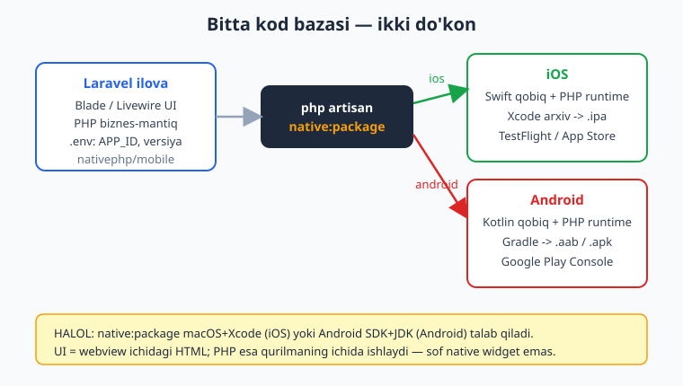
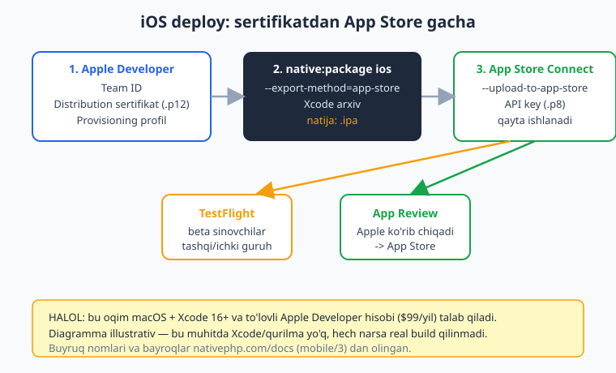
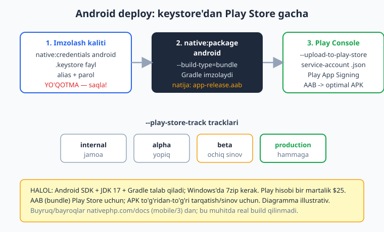

# 17 — Mobil build va deploy (App Store, Play Store)

[⬅️ Oldingi: 16 — Desktop build va packaging](./16-desktop-build-packaging.md) · [🏠 README](./README.md) · [Keyingi: 18 — Yakuniy kapston: cross-platform ilova ➡️](./18-kapston.md)

---

> **Bu bobda:** ilovangizni telefoningizda ko'rdingiz — endi uni **dunyoga** chiqaramiz. Apple App Store va Google Play Store'ga ilova joylash jarayonini boshidan oxirigacha o'rganamiz: iOS tomonida sertifikat, provisioning profil, Xcode arxiv, `.ipa`, TestFlight beta va App Review; Android tomonida imzolash kaliti (keystore), `.aab` bundle, Play App Signing va `internal -> alpha -> beta -> production` tracklari. NativePHP buni qanday soddalashtirishini ko'ramiz: `native:package`, `native:credentials`, `native:release` buyruqlari, `NATIVEPHP_APP_VERSION` va `NATIVEPHP_APP_VERSION_CODE` versiyalash, hamda `--no-tty` bilan CI/CD g'oyasi. Real Apple va Google qoidalarini (hisob narxi, review vaqti, semantik versiyalash) ham halol aytamiz.
>
> **HALOL eslatma:** NativePHP "sof native widget" yaratmaydi — sizning Laravel ilovangizni native qobiq ichidagi **webview**'da ishga tushiradi (iOS = Swift qobiq, Android = Kotlin qobiq; UI = HTML/CSS/JS = Blade/Livewire/Inertia; biznes-mantiq = qurilmaga bundle qilingan **PHP runtime**). Build va deploy'ning **butun jarayoni** macOS + Xcode 16+ (iOS) yoki Android SDK + JDK 17 (Android), hamda to'lovli developer hisoblar talab qiladi — bu narsalar bu yozish muhitida **yo'q**. Shu sababli bu bobdagi build/deploy buyruqlari **illustrativ** (buyruq nomlari, bayroqlar va bosqichlar `nativephp.com/docs` mobile/3 dan tasdiqlangan va to'g'ri, lekin bu yerda ishga tushirilmagan). Soxta "build muvaffaqiyatli / App Store'ga yuklandi" yozilmagan. Bobdagi sof **Laravel/PHP versiyalash mantig'i** esa `php -l` + Laravel boot bilan **tekshirilgan**.

---

## Nega bu bob boshqalardan farq qiladi?

Avvalgi boblarda biz kod yozdik, facade'lardan foydalandik, ilovani `native:run` bilan emulatorda ishga tushirishni o'rgandik. Bularning hammasi **sizning kompyuteringizda** bo'lardi. Bu bob esa boshqacha: bu yerda hakam — **siz emas**, balki **Apple va Google**. Ular o'z qoidalarini, sertifikatlarini, review jarayonini majburlaydi. NativePHP bu qoidalarni o'zgartirmaydi; u faqat **mexanik qismni** (build, imzolash, yuklash) qulay artisan buyruqlariga o'raydi.

Demak bu bobda ikki xil bilim aralashadi:

1. **NativePHP qismi** — `native:package`, `native:credentials`, `native:release` kabi buyruqlar va `.env` versiyalash kalitlari. Bularni biz aniq o'rganamiz.
2. **Platforma qismi** — Apple Developer Program, App Store Connect, Google Play Console qoidalari. Bular NativePHP'ga bog'liq emas; har qanday mobil ilova (native, Flutter, React Native) ularga bo'ysunadi. Biz ularning **mohiyatini** tushuntiramiz, lekin aniq UI tugmalari Apple/Google tomonidan o'zgarib turadi.



Diagrammadagi asosiy g'oya: **bitta** Laravel kod bazasi, **bitta** `native:package` buyrug'i — lekin platforma argumentiga (`ios` yoki `android`) qarab ikki butunlay boshqa artefakt chiqadi. iOS uchun Swift qobiq ichida `.ipa`, Android uchun Kotlin qobiq ichida `.aab`. Ikkalasida ham UI webview, mantiq esa qurilmaning ichida ishlovchi PHP.

---

## Kerakli muhit va hisoblar (halol haqiqat)

Build qilishdan oldin sizda quyidagilar bo'lishi **shart**. Bularsiz bironta buyruq ham natija bermaydi — shuning uchun avval ro'yxatni ko'ramiz.

**Umumiy (NativePHP mobile, rasmiy talablar):**

| Talab | Versiya |
|---|---|
| PHP | 8.3+ |
| Laravel | 11+ |
| Composer paket | `nativephp/mobile` |

**iOS uchun (faqat Mac'da):**

| Talab | Tafsilot |
|---|---|
| Mac | Apple silicon (M1+) |
| Xcode | 16.0 yoki keyingi |
| Qo'shimcha | Homebrew, CocoaPods, Xcode Command Line Tools |
| Hisob | **Apple Developer Program** — yiliga ~$99 |

**Android uchun (Windows/Mac/Linux):**

| Talab | Tafsilot |
|---|---|
| Android Studio | 2024.2.1 yoki keyingi |
| Android SDK | API 29+ (eng yangi: API 36) |
| JDK | 17 tavsiya etiladi |
| Windows'da | 7zip o'rnatilgan bo'lishi kerak |
| Hisob | **Google Play Console** — bir martalik ~$25 |

> **Diqqat (halol):** iOS build'ni **Windows'da qilib bo'lmaydi** — Apple'ning litsenziyasi va Xcode faqat macOS'da ishlaydi. Bu NativePHP cheklovi emas, balki Apple'ning qoidasi. Agar sizda Mac bo'lmasa, iOS build uchun macOS bulutli xizmati (masalan, GitHub Actions'ning `macos` runner'i) yoki Mac qarzga olish kerak. Android build esa Windows'da bemalol ishlaydi.

---

## Versiyalash: ikkita raqamni tushunish

Do'konga ilova yuklashdan oldin **versiyalash**ni tushunish shart, chunki har bir yuklamada ikkita raqam ishtirok etadi va ularni **adashtirsangiz** do'kon yuklamani rad etadi.

NativePHP buni ikkita `.env` kaliti orqali boshqaradi (rasmiy docs'dan tasdiqlangan):

```bash
# Ommaviy versiya — foydalanuvchi do'konda ko'radigan raqam (semantik)
NATIVEPHP_APP_VERSION=1.4.2

# Ichki build kodi — har yuklamada KO'PAYISHI shart, foydalanuvchiga ko'rinmaydi
NATIVEPHP_APP_VERSION_CODE=42
```

Bu ikkalasi nima uchun kerak?

- **`NATIVEPHP_APP_VERSION`** — bu **semantik versiya** (`MAJOR.MINOR.PATCH`, masalan `1.4.2`). Foydalanuvchi App Store yoki Play Store sahifasida aynan shuni ko'radi. Buni siz "marketing" raqami deb o'ylang.
  - iOS'da bu `CFBundleShortVersionString`ga moslanadi.
  - Android'da bu `versionName`ga moslanadi.
- **`NATIVEPHP_APP_VERSION_CODE`** — bu **monoton o'suvchi butun son**. Har safar do'konga yangi build yuklasangiz, bu raqam **avvalgisidan katta** bo'lishi shart, aks holda do'kon "bu build kodi allaqachon ishlatilgan" deb rad etadi.
  - iOS'da bu `CFBundleVersion`ga moslanadi.
  - Android'da bu `versionCode`ga moslanadi.

Eng ko'p uchraydigan xato: `VERSION`ni `1.4.2`dan `1.4.3`ga oshirib, `VERSION_CODE`ni unutish. Do'kon ommaviy versiyaga emas, **build kodiga** qaraydi.

### `native:release` — versiyani avtomatik oshirish

NativePHP versiyalashni qo'lda qilmaslik uchun maxsus buyruq beradi:

```bash
# PATCH oshiradi: 1.4.2 -> 1.4.3 (va build kodini avtomatik +1 qiladi)
php artisan native:release patch

# MINOR oshiradi: 1.4.3 -> 1.5.0
php artisan native:release minor

# MAJOR oshiradi: 1.5.0 -> 2.0.0
php artisan native:release major
```

Rasmiy docs aniq aytadi: *"running `native:release` automatically increments the build number and persists it back to your `.env`"* — ya'ni `native:release` `NATIVEPHP_APP_VERSION`ni semantik qoida bo'yicha oshiradi **va** `NATIVEPHP_APP_VERSION_CODE`ni avtomatik bittaga oshirib `.env`ga qaytarib yozadi. Build kodini qo'lda boshqarish shart emas.

> Semantik versiyalash ma'nosi: **PATCH** = bug tuzatish (orqaga mos), **MINOR** = yangi funksiya (orqaga mos), **MAJOR** = mos kelmaydigan o'zgarish. Batafsil PHP paketlari kontekstida ../php-expert/README.md va Composer versiyalashga qarang.

### Versiyalash mantig'ini PHP'da modellashtirish (tekshirilgan kod)

`native:release`ning ortidagi mantiqni tushunish uchun uni sof PHP'da yozib, ishini ko'rib chiqamiz. **Bu kod bu muhitda haqiqatan ishga tushirildi** — pastdagi natija real chiqish:

```php
<?php
// Semantik versiyani oshirish (native:release mantig'ining soddalashtirilgani)
function bumpVersion(string $current, string $type): string
{
    [$major, $minor, $patch] = array_map('intval', explode('.', $current));

    return match ($type) {
        'major' => ($major + 1) . '.0.0',
        'minor' => $major . '.' . ($minor + 1) . '.0',
        'patch' => $major . '.' . $minor . '.' . ($patch + 1),
        default => throw new InvalidArgumentException("Noma'lum tur: {$type}"),
    };
}

function nextVersionCode(int $current): int
{
    return $current + 1; // build kodi har doim +1
}

echo bumpVersion('1.2.3', 'patch') . PHP_EOL; // 1.2.4
echo bumpVersion('1.2.3', 'minor') . PHP_EOL; // 1.3.0
echo bumpVersion('1.2.3', 'major') . PHP_EOL; // 2.0.0
echo nextVersionCode(41) . PHP_EOL;           // 42
```

Chiqish (real ishga tushirildi):

```
1.2.4
1.3.0
2.0.0
42
```

### Joriy versiyani ko'rsatuvchi Artisan buyrug'i (tekshirilgan)

Amaliyotda siz CI loglarida yoki "Sozlamalar > Ilova haqida" sahifasida joriy versiyani ko'rsatmoqchi bo'lasiz. Bu oddiy Artisan buyrug'i `.env`dan o'qiydi. **Bu buyruq Laravel skeletida haqiqatan ishga tushirildi:**

```php
<?php

namespace App\Console\Commands;

use Illuminate\Console\Command;

class ShowAppVersion extends Command
{
    protected $signature = 'app:version-info';
    protected $description = 'Joriy ilova versiyasi va build kodini korsatadi';

    public function handle(): int
    {
        $version = env('NATIVEPHP_APP_VERSION', '0.0.0');
        $code    = (int) env('NATIVEPHP_APP_VERSION_CODE', 1);
        $appId   = env('NATIVEPHP_APP_ID', 'com.example.app');

        $this->info("App ID:       {$appId}");
        $this->info("Versiya:      {$version}");
        $this->info("Build kodi:   {$code}");

        return self::SUCCESS;
    }
}
```

`php artisan app:version-info` ishga tushganda chiqish (real, Laravel boot bilan):

```
App ID:       com.kompaniya.savdo
Versiya:      1.4.2
Build kodi:   42
```

> Bu yerda muhim nuqta: `NATIVEPHP_APP_VERSION` oddiy Laravel `.env` kaliti — uni boshqa har qanday `env()` kaliti kabi o'qiy olasiz. NativePHP versiyalashni "sehrli" qilmaydi, faqat to'g'ri joyga moslaydi.

---

## App ID — eng birinchi va o'zgarmas qaror

Build qilishdan oldin `.env`da ilovangizning **identifikatorini** belgilash shart:

```bash
NATIVEPHP_APP_ID=com.kompaniya.savdo
```

Bu reverse-DNS uslubidagi noyob nom (rasmiy docs'dan): u iOS'da **Bundle Identifier**, Android'da **Package Name**ga moslanadi.

> **Juda muhim ogohlantirish:** App ID'ni do'konga birinchi yuklamadan keyin **o'zgartirib bo'lmaydi**. Agar `com.kompaniya.savdo`ni `com.kompaniya.savdo2`ga o'zgartirsangiz, Apple/Google buni **butunlay yangi ilova** deb hisoblaydi — eski foydalanuvchilar, sharhlar, statistika yo'qoladi. Shuning uchun boshidanoq to'g'ri, real domeningizga asoslangan nom tanlang.

---

## iOS deploy: sertifikatdan App Store gacha

Endi iOS jarayonini batafsil ko'ramiz. Bu eng murakkab qism, chunki Apple kuchli xavfsizlik talab qiladi: har bir build **kriptografik imzolangan** bo'lishi va aniq qurilmalar/jamoaga **provisioning profil** bilan bog'langan bo'lishi kerak.



### 1-bosqich: Apple Developer'da nimalar kerak

App Store Connect'ga yuklash uchun sizda quyidagilar bo'lishi kerak (rasmiy NativePHP deploy docs'dan):

- **Team ID** — Apple Developer hisobingizning identifikatori.
- **Distribution sertifikat** — `.p12` yoki `.cer` fayl (ilovani imzolaydi).
- **Provisioning profil** — `.mobileprovision` fayl (qaysi App ID, qaysi sertifikat, qaysi jamoa).
- **App Store Connect API key** — `.p8` fayl, `Key ID` va `Issuer ID` bilan (avtomatik yuklash uchun).

### `native:credentials` — sertifikatlarni soddalashtirish

NativePHP imzolash hisoblarini boshqarishni soddalashtirish uchun maxsus buyruq beradi:

```bash
# iOS va/yoki Android uchun imzolash hisoblarini sozlash
php artisan native:credentials ios

# hammasini qaytadan boshlash kerak bo'lsa
php artisan native:credentials ios --reset
```

### 2-bosqich: `native:package ios` bilan build

Bu — markaziy buyruq. U Xcode'ni chaqirib, ilovani **arxivlaydi** va imzolangan `.ipa` faylini chiqaradi. To'liq forma (rasmiy docs'dan, App Store yuklamasi uchun):

```bash
php artisan native:package ios \
  --export-method=app-store \
  --api-key-path=/path/to/api-key.p8 \
  --api-key-id=ABC123DEF \
  --api-issuer-id=01234567-89ab-cdef-0123-456789abcdef \
  --certificate-path=/path/to/distribution.p12 \
  --certificate-password=certificatepassword \
  --provisioning-profile-path=/path/to/profile.mobileprovision \
  --team-id=ABC1234567
```

Bayroqlarni tushunamiz:

| Bayroq | Ma'nosi |
|---|---|
| `--export-method=app-store` | App Store uchun eksport (boshqalar: `ad-hoc`, `enterprise`, `development`) |
| `--api-key-path`, `--api-key-id`, `--api-issuer-id` | App Store Connect API key (avtomatik yuklash uchun) |
| `--certificate-path`, `--certificate-password` | Distribution sertifikat |
| `--provisioning-profile-path` | Provisioning profil |
| `--team-id` | Apple Team ID |

Sertifikat yo'llarini har safar yozmaslik uchun ularni `.env`ga ham qo'yish mumkin (rasmiy docs'dan):

```bash
APP_STORE_API_KEY_PATH=/path/to/api-key.p8
APP_STORE_API_KEY_ID=ABC123DEF
APP_STORE_API_ISSUER_ID=01234567-89ab-cdef-0123-456789abcdef
IOS_DISTRIBUTION_CERTIFICATE_PATH=/path/to/distribution.p12
IOS_DISTRIBUTION_CERTIFICATE_PASSWORD=secret
IOS_DISTRIBUTION_PROVISIONING_PROFILE_PATH=/path/to/profile.mobileprovision
IOS_TEAM_ID=ABC1234567
```

Foydali qo'shimcha bayroqlar (docs'dan):

- `--validate-profile` — provisioning profil entitlement'larini tekshiradi.
- `--validate-only` — `.ipa` yaratmasdan faqat tekshiradi (build qilishdan oldin sinash uchun ajoyib).
- `--clean-caches` — Xcode/Swift kesh'larini tozalaydi (g'alati xatolar bo'lganda).
- `--rebuild` — to'liq qayta build.

> **HALOL:** yuqoridagi buyruq bu muhitda **ishga tushirilmadi** — chunki u macOS, Xcode 16+ va real Apple sertifikatlarini talab qiladi, ular bu yerda yo'q. Buyruq nomi va bayroqlari `nativephp.com/docs` mobile/3 deployment sahifasidan **to'g'ri ko'chirilgan**. Mac'da bu jarayon bir necha daqiqa davom etadi va oxirida imzolangan `.ipa` chiqadi.

### 3-bosqich: App Store Connect'ga yuklash va TestFlight

`.ipa` tayyor bo'lgach, uni Apple'ga yuklash kerak. NativePHP buni `--upload-to-app-store` bayrog'i bilan avtomatlashtiradi:

```bash
php artisan native:package ios \
  --export-method=app-store \
  --upload-to-app-store
```

Bu bayroq App Store Connect API orqali avtomatik yuklaydi (shuning uchun yuqoridagi `.p8` API key kerak).

Yuklamadan keyin nima bo'ladi?

1. **Qayta ishlash (processing)** — Apple yuklamani bir necha daqiqa/soat qayta ishlaydi.
2. **TestFlight** — qayta ishlangach, build TestFlight'da paydo bo'ladi. TestFlight — Apple'ning **beta sinov** platformasi:
   - **Ichki sinovchilar** (jamoangiz, App Store Connect'da rol berilgan, review kerak emas).
   - **Tashqi sinovchilar** (ochiq guruh, 10000 kishigacha; birinchi build qisqa "Beta App Review"dan o'tadi).
3. **App Review'ga yuborish** — ishonchingiz komil bo'lgach, App Store Connect'da build'ni tanlab "Submit for Review" qilasiz. Apple ko'rib chiqadi (odatda 24-48 soat).
4. **App Store'da chiqish** — tasdiqlangach, ilova App Store'da jonli bo'ladi.

> **HALOL nozik nuqta:** **TestFlight uchun alohida NativePHP buyrug'i yo'q.** NativePHP'ning vazifasi `.ipa`ni yasab App Store Connect'ga yuklash bilan tugaydi. Undan keyingi TestFlight guruh boshqaruvi, beta sinovchilar taklifi va "Submit for Review" tugmasi — bularning hammasi **App Store Connect veb-saytida** (yoki Apple'ning ilovasida) qo'lda qilinadi. Bu NativePHP cheklovi emas; har qanday iOS ilova shu jarayondan o'tadi.

---

## Android deploy: keystore'dan Play Store gacha

Android jarayoni biroz soddaroq, lekin uning **o'ziga xos xatari** bor: imzolash kalitini (keystore) yo'qotsangiz, ilovangizni hech qachon yangilay olmaysiz.



### 1-bosqich: imzolash kaliti (keystore)

Android'da har bir release `.keystore` fayl bilan imzolanadi. NativePHP buni avtomatik yaratadi (rasmiy docs'dan):

```bash
# keystore yaratadi va .env'ga qo'shadi
php artisan native:credentials android
```

Bu buyruq keystore faylini yaratadi va kerakli kalitlarni `.env`ga avtomatik yozadi:

```bash
ANDROID_KEYSTORE_FILE=/path/to/my-app.keystore
ANDROID_KEYSTORE_PASSWORD=mykeystorepassword
ANDROID_KEY_ALIAS=my-app-key
ANDROID_KEY_PASSWORD=mykeypassword
```

> **ENG MUHIM OGOHLANTIRISH:** keystore faylini va parollarini **xavfsiz saqlang va zaxiralang**. Agar bu faylni yo'qotsangiz (yoki parolni unutsangiz), Google Play sizning ilovangizning **yangilanishini qabul qilmaydi** — chunki har bir yangilanish o'sha kalit bilan imzolangan bo'lishi shart. Bu holda yagona chora — yangi App ID bilan yangi ilova chiqarish (barcha foydalanuvchilarni yo'qotib). Keystore'ni `.git`ga **qo'shmang**; uni parol menejeri yoki maxfiy sirlar xizmatida saqlang.
>
> **Play App Signing** (Google'ning xizmati) bu xatarni kamaytiradi: siz "upload key" bilan imzolaysiz, Google esa o'z "app signing key"i bilan qayta imzolaydi. Bu tavsiya etiladi.

### 2-bosqich: `native:package android` bilan AAB build

Play Store'ga `.apk` emas, **`.aab`** (Android App Bundle) yuklanadi. AAB — bu Google'ga turli qurilmalar uchun optimallashtirilgan APK'larni o'zi yaratish imkonini beruvchi format. Build buyrug'i (rasmiy docs'dan):

```bash
php artisan native:package android \
  --build-type=bundle \
  --keystore=/path/to/my-app.keystore \
  --keystore-password=mykeystorepassword \
  --key-alias=my-app-key \
  --key-password=mykeypassword
```

Bayroqlar:

| Bayroq | Ma'nosi |
|---|---|
| `--build-type=bundle` | `.aab` chiqaradi (Play Store uchun). To'g'ridan-to'g'ri tarqatish uchun APK ham bo'ladi |
| `--keystore`, `--keystore-password` | Imzolash kaliti fayli va paroli |
| `--key-alias`, `--key-password` | Kalit alias'i va paroli |

Artefakt joylashuvi (rasmiy docs'dan):

```
# AAB (Play Store uchun):
nativephp/android/app/build/outputs/bundle/release/app-release.aab

# APK (to'g'ridan-to'g'ri o'rnatish/sinov uchun):
nativephp/android/app/build/outputs/apk/release/app-release.apk
```

Foydali qo'shimcha bayroqlar (docs'dan):

- `--jump-by=10` — build kodini bir emas, belgilangan miqdorda oshiradi.
- `--output=/path/to/dir` — artefaktni boshqa papkaga chiqaradi.
- `--skip-prepare` — inkremental build (tayyorlash bosqichini o'tkazib yuboradi).
- `--no-tty` — interaktiv bo'lmagan rejim (CI/CD uchun).

### 3-bosqich: Play Console'ga yuklash va tracklar

NativePHP AAB'ni to'g'ridan Play Console'ga yuklay oladi (rasmiy docs'dan):

```bash
php artisan native:package android \
  --build-type=bundle \
  --upload-to-play-store \
  --play-store-track=internal \
  --google-service-key=/path/to/service-account-key.json
```

Bu yerda `--google-service-key` — Play Console'da yaratilgan **service account** JSON kaliti (avtomatik yuklash huquqi beradi).

Play Store **tracklari** — bu ilovani bosqichma-bosqich chiqarish usuli (`--play-store-track`):

| Track | Kim ko'radi |
|---|---|
| `internal` | Jamoa (eng tez, ~bir necha daqiqa) |
| `alpha` | Yopiq sinov guruhi |
| `beta` | Ochiq sinov (xohlovchi har kim qo'shilishi mumkin) |
| `production` | Hamma — to'liq jonli chiqarish |

Odatdagi oqim: avval `internal`ga yuklab jamoa bilan sinaysiz -> keyin `beta`da kengroq sinov -> oxirida `production`. Birinchi `production` yuklama Google review'idan o'tadi (odatda bir necha soatdan bir necha kungacha).

> **HALOL:** yuqoridagi Android buyruqlari ham bu muhitda **ishga tushirilmadi** — chunki ular Android SDK, JDK 17, Gradle va (Windows'da) 7zip talab qiladi, ular bu yozish muhitida o'rnatilmagan. Buyruqlar va bayroqlar `nativephp.com/docs` mobile/3 deployment sahifasidan **to'g'ri ko'chirilgan**. To'liq sozlangan mashinada bu jarayon Gradle build'ini ishga tushiradi va `app-release.aab` chiqaradi.

---

## CI/CD g'oyasi: build'ni avtomatlashtirish

Har release uchun qo'lda buyruq yozish charchatadi va xatolarga olib keladi. Yetuk jamoalar build'ni **avtomatlashtiradi**: kod `main` shoxiga push qilinganda yoki teg (tag) qo'yilganda build o'z-o'zidan ishlaydi.

NativePHP buni `--no-tty` bayrog'i bilan qo'llab-quvvatlaydi. Rasmiy docs "Building in Non-Interactive Environments" bo'limida CI/CD pipeline'lar uchun `--no-tty` bayrog'ini tavsiya qiladi (interaktiv savol-javobsiz ishlaydi).

Quyida GitHub Actions g'oyasining illustrativ namunasi. **Bu YAML bu muhitda ishga tushirilmadi** — u faqat tuzilmani ko'rsatadi (sirlar `secrets`'dan olinadi, hech qachon kodga yozilmaydi):

```yaml
# .github/workflows/android-release.yml (ILLUSTRATIV — sxema)
name: Android Release
on:
  push:
    tags:
      - 'v*'            # masalan v1.4.3 teg qo'yilganda ishga tushadi
jobs:
  build-android:
    runs-on: ubuntu-latest
    steps:
      - uses: actions/checkout@v4
      - uses: shivammathur/setup-php@v2
        with:
          php-version: '8.3'
      - uses: actions/setup-java@v4
        with:
          distribution: temurin
          java-version: '17'      # JDK 17
      - name: Composer install
        run: composer install --no-dev --optimize-autoloader
      - name: Build AAB and upload to Play (internal)
        env:
          ANDROID_KEYSTORE_PASSWORD: ${{ secrets.KEYSTORE_PASSWORD }}
          ANDROID_KEY_PASSWORD: ${{ secrets.KEY_PASSWORD }}
        run: |
          php artisan native:package android \
            --build-type=bundle \
            --upload-to-play-store \
            --play-store-track=internal \
            --google-service-key=service-account.json \
            --no-tty
```

iOS uchun esa `runs-on: macos-latest` ishlatiladi (chunki Xcode faqat macOS'da bor) va sertifikatlar/profillar GitHub Secrets'da base64 ko'rinishida saqlanib, build vaqtida fayl sifatida tiklanadi.

> **HALOL:** bu YAML faqat **arxitektura g'oyasini** ko'rsatadi. Aniq qadamlar (sirlarni qanday yuklash, keystore'ni base64'dan tiklash) jamoangiz sozlamalariga bog'liq. NativePHP'ning bu yerdagi roli — `--no-tty` bilan interaktiv bo'lmagan rejimda ishlay olishi. CI/CD ning umumiy tamoyillari uchun Node.js kitobidagi tegishli boblar va ../php-expert/README.md ham foydali.

---

## To'liq release kontrolnomasi (checklist)

Quyida bitta releaseni boshidan oxirigacha jamlaymiz. Buni har chiqarishda takrorlang:

1. **Versiyani oshiring:** `php artisan native:release patch` (yoki `minor`/`major`). Bu `NATIVEPHP_APP_VERSION` va `NATIVEPHP_APP_VERSION_CODE`ni avtomatik yangilaydi.
2. **App ID to'g'riligini tekshiring:** `NATIVEPHP_APP_ID` o'zgarmagan (birinchi chiqarishdan keyin **hech qachon** o'zgartirmang).
3. **iOS build:** `php artisan native:package ios --export-method=app-store --upload-to-app-store` (Mac'da).
4. **Android build:** `php artisan native:package android --build-type=bundle --upload-to-play-store --play-store-track=internal`.
5. **iOS'da:** App Store Connect'da TestFlight'da sinab, so'ng "Submit for Review".
6. **Android'da:** Play Console'da `internal` -> `beta` -> `production`ga bosqichma-bosqich ko'taring.
7. **Release notes** yozing, skrinshotlar va ilova ikonkasini do'kon talablariga moslang.
8. **Review'ni kuting** va tasdiqlanganini tekshiring.

> Do'kon sahifasi materiallari (skrinshotlar, ilova ikonkasi, splash screen) NativePHP'da alohida sozlanadi — ikonka va splash screen sahifalariga rasmiy docs'da qarang. Bu bob esa build/imzolash/yuklashga e'tibor qaratdi.

---

## Mashqlar

> Eslatma: ko'p mashqlar **kod yozish** yoki **arxitektura tushuntirish** turida, chunki real build/deploy macOS/Xcode/Android SDK va developer hisoblarini talab qiladi (bu muhitda yo'q). Sof PHP/Laravel mantiqini esa o'zingiz `php -l` va `php artisan` bilan tekshira olasiz.

### Oson

1. `.env`da `NATIVEPHP_APP_ID`, `NATIVEPHP_APP_VERSION` va `NATIVEPHP_APP_VERSION_CODE` kalitlarini real bir ilova uchun yozing (masalan "Mening do'konim"). App ID reverse-DNS uslubida bo'lsin.
2. `NATIVEPHP_APP_VERSION` va `NATIVEPHP_APP_VERSION_CODE` orasidagi farqni 2-3 jumlada o'z so'zlaringiz bilan tushuntiring. Qaysi biri do'kon yuklamasini rad etishiga sabab bo'ladi va nega?
3. Quyidagi versiyalar uchun `native:release` qaysi buyrug'ini ishlatasiz: (a) `1.2.0` dan `1.2.1`ga, (b) `1.2.1` dan `1.3.0`ga, (c) `1.3.0` dan `2.0.0`ga?
4. iOS `.ipa` va Android `.aab` artefaktlari qanday farq qiladi? Qaysi biri qaysi do'konga yuklanadi?
5. iOS build'ni nega Windows'da qilib bo'lmasligini bir jumlada tushuntiring (NativePHP'ga emas, platformaga tegishli sabab).

### O'rta

6. `app:version-info` kabi Artisan buyrug'ini yozing, lekin u versiya **semantik formatda** (`X.Y.Z`) ekanligini ham tekshirsin; noto'g'ri bo'lsa xato qaytarsin. `php artisan` bilan ishga tushirib ko'ring.
7. `bumpVersion` funksiyasini yozing va unga `php -l` hamda bir nechta `assert()` bilan test yozing: `patch`, `minor`, `major` to'g'ri ishlashini va noma'lum tur uchun istisno tashlashini tekshiring.
8. `native:package ios` buyrug'ining barcha bayroqlarini jadval qilib yozing va har birining vazifasini tushuntiring. `--validate-only` nima uchun foydali?
9. Play Store'ning 4 tracki (`internal`, `alpha`, `beta`, `production`)ni izohlang va tipik chiqarish oqimini ketma-ketlikda yozing.
10. Keystore faylini yo'qotish nega Android ilova uchun "qaytarib bo'lmas falokat"ligini tushuntiring. Play App Signing bu xatarni qanday kamaytiradi?

### Qiyin

11. GitHub Actions uchun **iOS** release workflow'ining illustrativ YAML sxemasini yozing. `runs-on: macos-latest` ishlatilishini, sertifikat/profilni Secrets'dan tiklash g'oyasini va `--no-tty` bayrog'ini kiriting. (Ishga tushirilmaydi — faqat sxema.)
12. Semantik versiya satrini tahlil qiluvchi (`X.Y.Z` -> `[major, minor, patch]`) va ikkita versiyani **solishtiruvchi** PHP funksiya (`compareVersions($a, $b): int`) yozing: `-1`, `0`, yoki `1` qaytarsin. `assert()` testlar bilan tekshiring (`php -l` + run).
13. Bir jamoa "har push'da avtomatik production'ga chiqaramiz" deydi. Bu yondashuvning xatarlarini sanang va xavfsizroq alternativani (tracklar, qo'lda promotion, review) arxitektura sifatida taklif qiling.

<details markdown="1"><summary>Yechimlar</summary>

### 1-yechim

```bash
NATIVEPHP_APP_ID=uz.mening.dokonim
NATIVEPHP_APP_VERSION=1.0.0
NATIVEPHP_APP_VERSION_CODE=1
```

App ID reverse-DNS: agar domeningiz `dokonim.uz` bo'lsa, App ID `uz.dokonim.<ilova>` ko'rinishida bo'ladi. Bu noyob va o'zgarmas identifikator.

### 2-yechim

`NATIVEPHP_APP_VERSION` — foydalanuvchi do'konda ko'radigan ommaviy, semantik versiya (`1.4.2`). `NATIVEPHP_APP_VERSION_CODE` — foydalanuvchiga ko'rinmaydigan, har yuklamada **ko'payishi shart** bo'lgan ichki butun son. Do'kon ommaviy versiyaga emas, balki **build kodiga** (`VERSION_CODE`) qaraydi — agar uni oshirmasangiz, do'kon "bu build allaqachon mavjud" deb yuklamani **rad etadi**. Demak yuklamani rad ettiradigan asosiy sabab — build kodini oshirmaslik.

### 3-yechim

- (a) `1.2.0 -> 1.2.1`: `php artisan native:release patch`
- (b) `1.2.1 -> 1.3.0`: `php artisan native:release minor`
- (c) `1.3.0 -> 2.0.0`: `php artisan native:release major`

Har uchala holatda build kodi ham avtomatik +1 bo'ladi.

### 4-yechim

`.ipa` (iOS App Store Package) — iOS uchun imzolangan ilova paketi, **App Store Connect**'ga (Apple) yuklanadi. `.aab` (Android App Bundle) — Android uchun bundle, **Google Play Console**'ga yuklanadi va Google undan har qurilma uchun optimal APK'larni o'zi yaratadi. Demak: iOS = `.ipa` -> App Store; Android = `.aab` -> Play Store.

### 5-yechim

Xcode va iOS imzolash vositalari **faqat macOS'da** ishlaydi (Apple'ning litsenziya cheklovi). Bu NativePHP cheklovi emas — har qanday iOS ilova (Flutter, React Native, native) iOS build uchun Mac talab qiladi.

### 6-yechim

```php
<?php

namespace App\Console\Commands;

use Illuminate\Console\Command;

class CheckAppVersion extends Command
{
    protected $signature = 'app:check-version';
    protected $description = 'Versiya semantik formatda ekanligini tekshiradi';

    public function handle(): int
    {
        $version = (string) env('NATIVEPHP_APP_VERSION', '');

        if (! preg_match('/^\d+\.\d+\.\d+$/', $version)) {
            $this->error("Noto'g'ri versiya formati: '{$version}'. X.Y.Z bo'lishi kerak.");
            return self::FAILURE;
        }

        $this->info("Versiya to'g'ri: {$version}");
        return self::SUCCESS;
    }
}
```

`php artisan app:check-version` — agar `.env`da `NATIVEPHP_APP_VERSION=1.4.2` bo'lsa "Versiya to'g'ri" chiqadi; `1.4` bo'lsa xato qaytaradi (`FAILURE`, exit kodi 1).

### 7-yechim

```php
<?php

function bumpVersion(string $current, string $type): string
{
    [$major, $minor, $patch] = array_map('intval', explode('.', $current));

    return match ($type) {
        'major' => ($major + 1) . '.0.0',
        'minor' => $major . '.' . ($minor + 1) . '.0',
        'patch' => $major . '.' . $minor . '.' . ($patch + 1),
        default => throw new InvalidArgumentException("Noma'lum tur: {$type}"),
    };
}

assert(bumpVersion('1.2.3', 'patch') === '1.2.4');
assert(bumpVersion('1.2.3', 'minor') === '1.3.0');
assert(bumpVersion('1.2.3', 'major') === '2.0.0');

$threw = false;
try {
    bumpVersion('1.2.3', 'mega');
} catch (InvalidArgumentException $e) {
    $threw = true;
}
assert($threw === true);

echo "Barcha testlar o'tdi" . PHP_EOL;
```

`php -l fayl.php` sintaksisni tekshiradi; `php -d zend.assertions=1 -d assert.exception=1 fayl.php` esa testlarni ishga tushiradi va "Barcha testlar o'tdi" chiqaradi.

### 8-yechim

| Bayroq | Vazifa |
|---|---|
| `--export-method=app-store` | App Store uchun eksport rejimi |
| `--api-key-path` | App Store Connect API key (.p8) yo'li |
| `--api-key-id` | API key identifikatori |
| `--api-issuer-id` | API issuer identifikatori |
| `--certificate-path` | Distribution sertifikat (.p12) yo'li |
| `--certificate-password` | Sertifikat paroli |
| `--provisioning-profile-path` | Provisioning profil yo'li |
| `--team-id` | Apple Team ID |

`--validate-only` foydali, chunki u `.ipa`ni yaratmasdan **faqat tekshiradi** — sertifikat, profil va entitlement'lar to'g'ri sozlanganini bilib olasiz, uzoq build jarayonini boshlamasdan. Bu vaqtni tejaydi va xatolarni erta topadi.

### 9-yechim

- **`internal`** — jamoa ichida, eng tez tarqaladi (review kerak emas), eng dastlabki sinov.
- **`alpha`** — yopiq sinov guruhi (taklif qilingan foydalanuvchilar).
- **`beta`** — ochiq sinov; xohlovchi har kim qo'shilib, sinashi mumkin.
- **`production`** — to'liq jonli, hamma uchun.

Tipik oqim: `internal` (jamoa tekshiradi) -> `alpha`/`beta` (kengroq sinov, fikr-mulohaza) -> `production` (to'liq chiqarish). Har bosqichda muammo topilsa, oldingi trackka qaytarib tuzatish mumkin.

### 10-yechim

Android'da har bir ilova yangilanishi **o'sha bir xil keystore** bilan imzolanishi shart — Google buni ilovaning "kimligi" deb biladi. Keystore'ni (yoki parolni) yo'qotsangiz, yangi build'ni eski kalit bilan imzolay olmaysiz, demak Google yangilanishni rad etadi. Yagona chora — yangi App ID bilan **butunlay yangi ilova** chiqarish, bunda barcha foydalanuvchilar, sharhlar va statistika yo'qoladi. Shuning uchun bu "qaytarib bo'lmas falokat".

**Play App Signing** xatarni kamaytiradi: siz nisbatan kamroq tavakkalli "upload key" bilan imzolaysiz, Google esa o'zi xavfsiz saqlaydigan "app signing key" bilan ilovani **qayta imzolaydi**. Upload key yo'qolsa, Google'dan uni qayta tiklashni so'rash mumkin — chunki asl signing key Google'da saqlanadi.

### 11-yechim

```yaml
# .github/workflows/ios-release.yml (ILLUSTRATIV — sxema, ishga tushirilmaydi)
name: iOS Release
on:
  push:
    tags:
      - 'v*'
jobs:
  build-ios:
    runs-on: macos-latest        # Xcode faqat macOS'da bor
    steps:
      - uses: actions/checkout@v4
      - uses: shivammathur/setup-php@v2
        with:
          php-version: '8.3'
      - name: Sertifikat va profilni Secrets'dan tiklash
        env:
          CERT_B64: ${{ secrets.IOS_CERT_P12_BASE64 }}
          PROFILE_B64: ${{ secrets.IOS_PROFILE_BASE64 }}
          API_KEY_B64: ${{ secrets.APPSTORE_API_KEY_P8_BASE64 }}
        run: |
          echo "$CERT_B64"    | base64 --decode > distribution.p12
          echo "$PROFILE_B64" | base64 --decode > profile.mobileprovision
          echo "$API_KEY_B64" | base64 --decode > api-key.p8
      - name: Composer install
        run: composer install --no-dev --optimize-autoloader
      - name: Build .ipa va App Store Connect'ga yuklash
        env:
          CERT_PASS: ${{ secrets.IOS_CERT_PASSWORD }}
        run: |
          php artisan native:package ios \
            --export-method=app-store \
            --api-key-path=api-key.p8 \
            --api-key-id=${{ secrets.APPSTORE_API_KEY_ID }} \
            --api-issuer-id=${{ secrets.APPSTORE_API_ISSUER_ID }} \
            --certificate-path=distribution.p12 \
            --certificate-password="$CERT_PASS" \
            --provisioning-profile-path=profile.mobileprovision \
            --team-id=${{ secrets.IOS_TEAM_ID }} \
            --upload-to-app-store \
            --no-tty
```

Asosiy g'oyalar: (1) `macos-latest` runner ishlatildi, chunki iOS build uchun Xcode kerak; (2) sertifikat, profil va API key kabi maxfiy fayllar **Secrets**'da base64 ko'rinishida saqlanib, build vaqtida fayl sifatida tiklanadi (hech qachon kodga yozilmaydi); (3) `--no-tty` interaktiv bo'lmagan CI muhitida ishlashni ta'minlaydi.

### 12-yechim

```php
<?php

function parseVersion(string $v): array
{
    if (! preg_match('/^\d+\.\d+\.\d+$/', $v)) {
        throw new InvalidArgumentException("Noto'g'ri versiya: {$v}");
    }
    return array_map('intval', explode('.', $v));
}

function compareVersions(string $a, string $b): int
{
    [$am, $an, $ap] = parseVersion($a);
    [$bm, $bn, $bp] = parseVersion($b);

    return [$am, $an, $ap] <=> [$bm, $bn, $bp];
}

assert(compareVersions('1.2.3', '1.2.4') === -1);
assert(compareVersions('2.0.0', '1.9.9') === 1);
assert(compareVersions('1.2.3', '1.2.3') === 0);
assert(compareVersions('1.10.0', '1.9.0') === 1); // 10 > 9 (raqamli taqqoslash)

echo "Taqqoslash testlari o'tdi" . PHP_EOL;
```

Bu yerda PHP'ning "spaceship" operatori `<=>` massivlarni element-element solishtiradi, shuning uchun `[1,10,0] <=> [1,9,0]` to'g'ri `1` qaytaradi (matn taqqoslashda `"1.10" < "1.9"` bo'lib xato chiqardi — shuning uchun `intval` muhim).

### 13-yechim

"Har push'da avtomatik production'ga chiqarish" xatarlari:

- **Sinovsiz chiqarish** — har bir push to'g'ridan foydalanuvchilarga boradi; buzuq kod million foydalanuvchiga yetib boradi.
- **Review kechikishi** — Apple/Google review odatda soatlar/kunlar davom etadi, demak "har push" baribir kutadi; jarayon bashoratsiz bo'ladi.
- **Build kodi tartibsizligi** — tez-tez avtomatik chiqarish build kodlarini behuda sarflaydi va kuzatishni qiyinlashtiradi.
- **Orqaga qaytarish (rollback) qiyinligi** — do'konda "oldingi versiyaga qaytarish" oddiy emas; faqat yangi (kattaroq build kodli) yuklama bilan tuzatiladi.

**Xavfsizroq arxitektura:**

1. Push -> CI **avtomatik** `internal` trackka (Android) yoki TestFlight ichki guruhiga (iOS) yuklasin — sinov uchun.
2. QA/jamoa sinab, ma'qullagach **qo'lda promotion** — `internal` -> `beta` -> `production` (yoki TestFlight -> Submit for Review). Bu "human gate" buzuq buildni to'xtatadi.
3. **Teg (tag) asosida chiqarish** — faqat `v1.4.3` kabi teg qo'yilganda production pipeline ishlasin, har push'da emas.
4. **Bosqichli rollout (staged rollout)** — production'da ham avval 5%, keyin 50%, keyin 100% foydalanuvchiga (Play Console buni qo'llab-quvvatlaydi), muammo bo'lsa to'xtatib qolish uchun.

Bu yondashuv tezlik (avtomatik sinov build) va xavfsizlik (qo'lda production gate) muvozanatini ta'minlaydi.

</details>

---

[⬅️ Oldingi: 16 — Desktop build va packaging](./16-desktop-build-packaging.md) · [🏠 README](./README.md) · [Keyingi: 18 — Yakuniy kapston: cross-platform ilova ➡️](./18-kapston.md)
