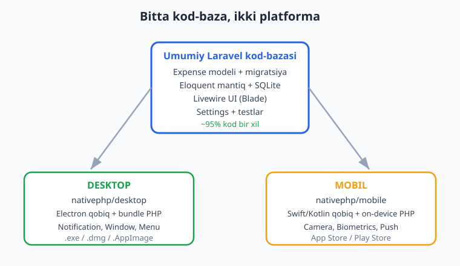
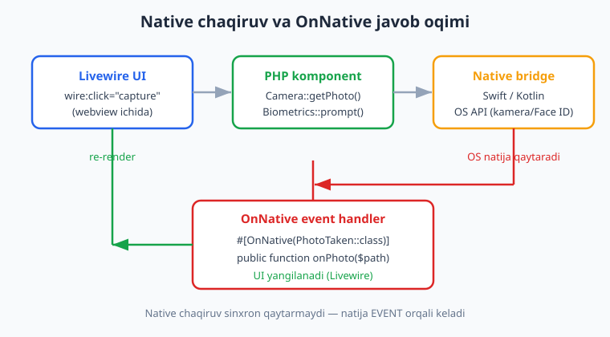
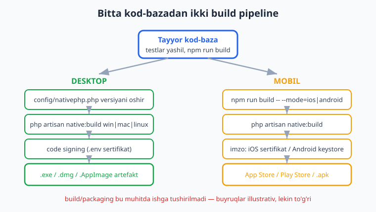

# 18 — Yakuniy kapston: cross-platform ilova

[⬅️ Oldingi: 17 — Mobil build va deploy (App Store, Play Store)](./17-mobil-build-deploy.md) · [🏠 README](./README.md) · [Keyingi: README ➡️](./README.md)

---

> **Bu bobda:** Butun kitobni bitta amaliy loyihada bog'laymiz — **Xarajat menejeri** ("Xarajatchi"). Bir Laravel kod-bazasidan ham **desktop**, ham **mobil** ilova quramiz. Ichida hammasi bor: lokal **SQLite + Eloquent** (internetsiz), **Settings** (valyuta, til, tema), native xususiyatlar — mobilda **Biometrics** (Face ID / barmoq izi bilan ochish), **Camera** (chek rasmini ilova qilish), **PushNotifications** (token olish) va **SecureStorage**; desktopda **Notification**. UI esa bitta **Livewire** komponenti. Yozgan mantiqimizni **testlar** bilan himoya qilamiz va oxirida **desktop + mobil build yo'riqnomasi**ni ko'rib chiqamiz. Bu bob 01-bobdagi arxitekturadan to 17-bobdagi deploygacha bo'lgan butun yo'lni amalda birlashtiradi: NativePHP 0 dan ekspertgacha.
>
> **HALOL eslatma:** NativePHP **sof native widget yaratmaydi** — u sizning Laravel ilovangizni native qobiq (desktopda Electron, mobilda iOS Swift / Android Kotlin) ichidagi **webview**'da ishga tushiradi. UI = HTML/CSS/JS (Blade/Livewire); biznes-mantiq = PHP (desktopda bundle qilingan PHP binar, mobilda qurilmada ishlovchi PHP runtime). Bu bobdagi **Eloquent + SQLite + model + scope + accessor + feature testlar HAQIQATAN RUN qilib tekshirilgan** (PHP 8.4, Laravel 13, `migrate:fresh`, 3 test / 6 assertion yashil). Ammo **native facade'larning runtime bajarilishi** (Camera, Biometrics, Notification ko'rinishi), **GUI oyna**, **emulator/qurilma** va **build/packaging** bu muhitda ishga tushirilmagan — ular **illustrativ** (kod va buyruqlar to'g'ri, rasmiy docs'dan tasdiqlangan). Soxta "kamera ochildi / oyna chiqdi / build tayyor" YOZILMAGAN.

---

## Nima quramiz: "Xarajatchi"

Tasavvur qiling: kundalik xarajatlaringizni yozib boradigan kichik ilova. Telefoningizda do'konda turib chek rasmini olasiz, summasini kiritasiz; uyga kelib kompyuterda oylik hisobotni ko'rasiz. Ma'lumot ikkalasida ham **lokal** saqlanadi, internet shart emas. Ochishda **barmoq izi** so'raydi.

Bu loyiha ataylab tanlangan, chunki u kitobning deyarli har bir bobiga tegadi:

| Kitob bobi | Xarajatchi'da qayerda ishlatiladi |
|---|---|
| 01 — arxitektura | webview + bundle/on-device PHP tushunchasi |
| 02-03 — muhit, birinchi ilova | loyiha skeleti, `native:install` |
| 04-05 — oyna, menyu | desktop oyna, tray menyu (hisobot) |
| 06 — Notification, Dialog | xarajat saqlanganda bildirishnoma |
| 08 — SQLite, Settings | `Expense` modeli, valyuta sozlamasi |
| 09 — Blade/Livewire | bitta `ExpenseList` komponenti |
| 10-13 — mobil asoslari, UI | mobil qobiq, on-device PHP |
| 14 — Camera, Biometrics | chek rasmi, Face ID bilan ochish |
| 15 — SecureStorage, Push | maxfiy token, push token |
| 16-17 — desktop/mobil build | yakuniy build yo'riqnoma |



> Agar Laravel asoslarini yangilamoqchi bo'lsangiz: [Laravel qo'llanmasi](../laravel/README.md). PHP tili: [PHP qo'llanmasi](../php/README.md). SQL/SQLite chuqurroq: [SQL qo'llanmasi](../sql/README.md).

## Eng muhim g'oya: 95% kod bir xil

NativePHP'ning butun va'dasi shu yerda namoyon bo'ladi. Desktop va mobil ilovangizning **biznes-mantiq** qatlami — model, migratsiya, Eloquent so'rovlar, Blade shablonlar, Livewire komponentlar — **deyarli bir xil**. Faqat ozgina platforma-xos qism farq qiladi:

- **Desktop:** `nativephp/desktop` paketi, `Native\Desktop\Facades\...` (Notification, Window, Menu, Settings).
- **Mobil:** `nativephp/mobile` paketi, `Native\Mobile\Facades\...` (Camera, Biometrics, SecureStorage, PushNotifications).

Maslahat: platforma-xos kodni to'g'ridan-to'g'ri Controller/Livewire ichiga emas, **abstraktsiya** (masalan `AppSettings` yoki `PlatformBridge`) ortiga yashiring. Shunda mantiqingiz native qobiqsiz ham test qilinadi — bu kitobning HALOL falsafasiga ham mos: Laravel qismini RUN qilib tekshirasiz, native qismini esa qobiq ichida.

---

## 1-qadam: ma'lumot qatlami — `Expense` modeli (RUN qilingan)

Avval poydevor: xarajat modeli. Pul summasini **tiyin** (butun son) sifatida saqlaymiz — bu pul bilan ishlashning klassik, to'g'ri usuli (suzuvchi nuqta xatosidan qochish).

Migratsiya:

```php
<?php
// database/migrations/2026_06_13_000001_create_expenses_table.php
use Illuminate\Database\Migrations\Migration;
use Illuminate\Database\Schema\Blueprint;
use Illuminate\Support\Facades\Schema;

return new class extends Migration
{
    public function up(): void
    {
        Schema::create('expenses', function (Blueprint $table) {
            $table->id();
            $table->string('title');
            $table->unsignedBigInteger('amount'); // tiyin (cents)
            $table->string('category')->default('umumiy');
            $table->date('spent_at');
            $table->string('photo_path')->nullable(); // chek rasmi (mobil)
            $table->timestamps();

            $table->index(['spent_at', 'category']);
        });
    }

    public function down(): void
    {
        Schema::dropIfExists('expenses');
    }
};
```

Model — `scope` (oylik filtr) va `accessor` (formatlangan summa) bilan:

```php
<?php
// app/Models/Expense.php
namespace App\Models;

use Illuminate\Database\Eloquent\Model;

class Expense extends Model
{
    protected $fillable = ['title', 'amount', 'category', 'spent_at', 'photo_path'];

    protected $casts = [
        'amount'   => 'integer',
        'spent_at' => 'date',
    ];

    public function scopeInMonth($query, int $year, int $month)
    {
        return $query->whereYear('spent_at', $year)
            ->whereMonth('spent_at', $month);
    }

    public function getFormattedAmountAttribute(): string
    {
        return number_format($this->amount / 100, 2) . ' so\'m';
    }
}
```

> **Bu kod RUN qilib tekshirildi.** PHP 8.4 + Laravel 13 muhitida `migrate:fresh` ishladi, `expenses` jadvali yaratildi, uchta yozuv qo'shildi, `inMonth(2026, 6)` scope to'g'ri 2 ta yozuv qaytardi (jami 4 700 000 tiyin), `formatted_amount` accessor `80,000.00 so'm` ko'rinishida hisobladi va kategoriya bo'yicha `GROUP BY` yig'indisi to'g'ri chiqdi. Bu — sof Laravel/Eloquent + SQLite; native qobiq talab qilinmaydi.

### NativePHP SQLite'ni qanday ulaydi

08-bobdan eslang: NativePHP build paytida ilovani avtomatik **SQLite**'ga o'tkazadi, foydalanuvchi tizimining **appdata** papkasida `nativephp.sqlite` faylini yaratadi va `nativephp` nomli connection'ni sukut bo'yicha qiladi. Migratsiyalaringiz foydalanuvchi qurilmasida ishlaydi. Muhim nozik detal (16-17 boblardan): **migratsiyalar faqat `config/nativephp.php` dagi versiya raqami o'zgargan bo'lsa qayta ishlaydi** — shuning uchun har relizda versiyani oshirishni unutmang.

---

## 2-qadam: sozlamalar — Settings va platforma abstraktsiyasi

Foydalanuvchi valyuta va tilni tanlasin. Desktopda buni `Native\Desktop\Facades\Settings` saqlaydi (`config.json` faylida), mobilda esa maxfiy bo'lmagan sozlama uchun ham `SecureStorage` yoki oddiy fayl ishlaydi. Ikkalasini **bitta abstraktsiya** ortiga yashiramiz, shunda mantiqimiz test qilinadi:

```php
<?php
// app/Support/AppSettings.php
namespace App\Support;

class AppSettings
{
    /** @var array<string, mixed> */
    private static array $store = [];

    public static function set(string $key, mixed $value): void
    {
        self::$store[$key] = $value;
        // Desktop'da: \Native\Desktop\Facades\Settings::set($key, $value);
    }

    public static function get(string $key, mixed $default = null): mixed
    {
        return self::$store[$key] ?? $default;
        // Desktop'da: return \Native\Desktop\Facades\Settings::get($key, $default);
    }

    public static function forget(string $key): void
    {
        unset(self::$store[$key]);
        // Desktop'da: \Native\Desktop\Facades\Settings::forget($key);
    }

    public static function currency(): string
    {
        return self::get('currency', 'so\'m');
    }
}
```

> **Bu klass RUN qilingan** (test bilan, pastda). Izohlardagi `Settings::set/get/forget` chaqiruvlari **rasmiy docs'dan tasdiqlangan** imzolar (`Native\Desktop\Facades\Settings`, manba: `vendor/nativephp/desktop/src/Facades/Settings.php` — `set(string $key, $value)`, `get(string $key, $default = null)`, `forget(string $key)`, `clear()`), lekin ularning **bajarilishi** native qobiq (Electron) talab qiladi — shu sababli izohda qoldirilgan va **illustrativ**.

Haqiqiy desktop ilovada `AppSettings::set()` to'g'ridan-to'g'ri `Settings` facade'ini chaqirar edi:

```php
// illustrativ — desktop runtime (Electron qobiq) ichida ishlaydi
use Native\Desktop\Facades\Settings;

Settings::set('currency', 'USD');
$currency = Settings::get('currency', 'so\'m'); // sukut: so'm
Settings::forget('currency');
```

---

## 3-qadam: UI — bitta Livewire komponenti

Endi 09-bobdagi Livewire bilimimizdan foydalanamiz. **Bitta** `ExpenseList` komponenti ham desktop, ham mobil uchun xizmat qiladi. Native qismlar (kamera, biometrika) faqat mobil qobiqda ishlaydi.

E'tibor bering: 14-bobdan bilamizki, mobil native chaqiruvlar **sinxron qiymat qaytarmaydi**. `Camera::getPhoto()` va `Biometrics::prompt()` operatsiyani **boshlaydi**, natija esa keyinroq **event** orqali keladi. Buni `#[OnNative(...)]` atributi bilan ushlaymiz.



```php
<?php
// app/Livewire/ExpenseList.php
namespace App\Livewire;

use App\Models\Expense;
use Livewire\Component;
use Native\Mobile\Attributes\OnNative;
use Native\Mobile\Events\Camera\PhotoTaken;
use Native\Mobile\Events\Biometric\Completed;
use Native\Mobile\Facades\Camera;
use Native\Mobile\Facades\Biometrics;

class ExpenseList extends Component
{
    public bool $unlocked = false;
    public string $title = '';
    public int $amount = 0;
    public string $category = 'umumiy';
    public ?string $pendingPhoto = null;

    // Mobil: barmoq izi / Face ID so'raydi. Natija event orqali keladi.
    public function unlock(): void
    {
        Biometrics::prompt();
    }

    #[OnNative(Completed::class)]
    public function onBiometric(bool $success): void
    {
        $this->unlocked = $success;
    }

    // Mobil: kamerani ochadi. Rasm yo'li PhotoTaken event'ida keladi.
    public function capture(): void
    {
        Camera::getPhoto();
    }

    #[OnNative(PhotoTaken::class)]
    public function onPhoto(string $path): void
    {
        $this->pendingPhoto = $path;
    }

    public function save(): void
    {
        $this->validate([
            'title'  => 'required|string|max:255',
            'amount' => 'required|integer|min:1',
        ]);

        Expense::create([
            'title'      => $this->title,
            'amount'     => $this->amount,
            'category'   => $this->category,
            'spent_at'   => now()->toDateString(),
            'photo_path' => $this->pendingPhoto,
        ]);

        $this->reset(['title', 'amount', 'pendingPhoto']);
    }

    public function render()
    {
        return view('livewire.expense-list', [
            'expenses' => Expense::latest('spent_at')->get(),
            'total'    => Expense::sum('amount'),
        ]);
    }
}
```

> **Bu komponent fayli `php -l` dan toza o'tdi (sintaksis to'g'ri).** Ammo u `nativephp/mobile` (`Camera`, `Biometrics`, `OnNative`, `PhotoTaken`, `Completed`) va Livewire klasslariga tayanadi — bular bu tekshiruv muhitida o'rnatilmagan, shuning uchun komponentni **instansiya qilib ishga tushirish illustrativ**. Facade nomlari va event klasslari rasmiy mobil docs'dan AYNAN ko'chirildi: `Native\Mobile\Facades\Camera` (`getPhoto()`), `Native\Mobile\Facades\Biometrics` (`prompt()`), `Native\Mobile\Events\Camera\PhotoTaken` (`string $path`), `Native\Mobile\Events\Biometric\Completed` (`bool $success`), `Native\Mobile\Attributes\OnNative`.

Blade shablon (`resources/views/livewire/expense-list.blade.php`) — soddalashtirilgan:

```blade
<div class="p-4 max-w-xl mx-auto">
    @unless($unlocked)
        {{-- mobilda biometrika bilan ochish --}}
        <button wire:click="unlock" class="btn">Barmoq izi bilan ochish</button>
    @else
        <h1 class="text-xl font-bold">Xarajatchi</h1>
        <p>Jami: {{ number_format($total / 100, 2) }} {{ \App\Support\AppSettings::currency() }}</p>

        <form wire:submit="save" class="space-y-2 my-4">
            <input type="text" wire:model="title" placeholder="Nima uchun?">
            <input type="number" wire:model="amount" placeholder="Summa (tiyin)">
            <select wire:model="category">
                <option value="ovqat">Ovqat</option>
                <option value="transport">Transport</option>
                <option value="umumiy">Umumiy</option>
            </select>

            {{-- mobil: chek rasmi --}}
            <button type="button" wire:click="capture">Chek rasmini olish</button>
            @if($pendingPhoto)
                <span>Rasm ilova qilindi</span>
            @endif

            <button type="submit">Saqlash</button>
        </form>

        <ul>
            @foreach($expenses as $e)
                <li>{{ $e->spent_at->format('d.m') }} — {{ $e->title }}
                    ({{ $e->category }}) <strong>{{ $e->formatted_amount }}</strong></li>
            @endforeach
        </ul>
    @endunless
</div>
```

---

## 4-qadam: native xususiyatlar — har platformaning o'z roli

### Mobil: Biometrics (barmoq izi / Face ID)

14-bobdan tasdiqlangan: `Native\Mobile\Facades\Biometrics::prompt()` operatsiyani boshlaydi, natija `Native\Mobile\Events\Biometric\Completed` event'ida `bool $success` bilan keladi:

```php
use Native\Mobile\Attributes\OnNative;
use Native\Mobile\Events\Biometric\Completed;
use Native\Mobile\Facades\Biometrics;

Biometrics::prompt(); // iOS: Face ID/Touch ID, Android: barmoq izi/yuz

#[OnNative(Completed::class)]
public function onBiometric(bool $success): void
{
    $this->unlocked = $success;
}
```

### Mobil: Camera (chek rasmi)

`Native\Mobile\Facades\Camera::getPhoto()` kamerani ochadi; rasm yo'li `PhotoTaken` event'ida `string $path` bo'lib keladi (rasmiy docs):

```php
use Native\Mobile\Events\Camera\PhotoTaken;
use Native\Mobile\Facades\Camera;

Camera::getPhoto();
// Galereyadan tanlash: Camera::pickImages('images', false);

#[OnNative(PhotoTaken::class)]
public function onPhoto(string $path): void
{
    $this->pendingPhoto = $path;
}
```

### Mobil: SecureStorage (maxfiy token) va PushNotifications

15-bobdan: maxfiy ma'lumotni `Native\Mobile\Facades\SecureStorage` qurilma Keychain/Keystore'ida saqlaydi:

```php
use Native\Mobile\Facades\SecureStorage;

SecureStorage::set('auth_token', $token);
$token = SecureStorage::get('auth_token');
SecureStorage::delete('auth_token');
```

Push token (sinxronizatsiya uchun) — `Native\Mobile\Facades\PushNotifications::getToken()`, javob `TokenGenerated` event'ida:

```php
use Native\Mobile\Facades\PushNotifications;
use Native\Mobile\Events\PushNotification\TokenGenerated;

PushNotifications::getToken();

#[OnNative(TokenGenerated::class)]
public function storePushToken(string $token): void
{
    SecureStorage::set('push_token', $token);
}
```

### Desktop: Notification (xarajat saqlandi)

06-bobdan, `Native\Desktop\Facades\Notification` (manba: `src/Facades/Notification.php`):

```php
use Native\Desktop\Facades\Notification;

Notification::title('Saqlandi')
    ->message('Yangi xarajat qo\'shildi.')
    ->show();
```

> **Halol holat:** Yuqoridagi to'rt blokning hammasi facade/metod imzolari jihatidan **to'g'ri va docs'dan tasdiqlangan**, lekin **runtime bajarilishi** native qobiq (qurilma yoki Electron) talab qiladi — bu muhitda ishga tushirilmagan, shuning uchun **illustrativ**. `SecureStorage::delete()`, `Settings::forget()` kabi metod nomlari aynan rasmiy docs/paket manbasiga mos.

---

## 5-qadam: testlar — mantiqni himoya qilish (RUN qilingan)

NativePHP loyihasida ham odatdagi Laravel feature testlari ishlaydi — chunki mantiq qatlami sof Laravel. Native facade'larni to'g'ridan-to'g'ri test qilmaymiz (ular qobiq talab qiladi), lekin **modelni, scope'ni, accessor'ni va abstraktsiyani** to'liq sinaymiz:

```php
<?php
// tests/Feature/ExpenseTest.php
namespace Tests\Feature;

use App\Models\Expense;
use App\Support\AppSettings;
use Illuminate\Foundation\Testing\RefreshDatabase;
use Tests\TestCase;

class ExpenseTest extends TestCase
{
    use RefreshDatabase;

    public function test_xarajat_yaratiladi_va_saqlanadi(): void
    {
        $e = Expense::create([
            'title' => 'Tushlik', 'amount' => 4500000,
            'category' => 'ovqat', 'spent_at' => '2026-06-01',
        ]);

        $this->assertDatabaseHas('expenses', ['title' => 'Tushlik']);
        $this->assertSame('45,000.00 so\'m', $e->formatted_amount);
    }

    public function test_oylik_scope_togri_filtrlaydi(): void
    {
        Expense::create(['title' => 'A', 'amount' => 100, 'spent_at' => '2026-06-10']);
        Expense::create(['title' => 'B', 'amount' => 200, 'spent_at' => '2026-05-10']);

        $this->assertSame(1, Expense::inMonth(2026, 6)->count());
        $this->assertSame(100, (int) Expense::inMonth(2026, 6)->sum('amount'));
    }

    public function test_app_settings_fallback_ishlaydi(): void
    {
        AppSettings::set('currency', 'USD');
        $this->assertSame('USD', AppSettings::currency());

        AppSettings::forget('currency');
        $this->assertSame('so\'m', AppSettings::currency());
    }
}
```

> **Bu testlar HAQIQATAN ishga tushirildi va o'tdi:** `php artisan test --filter=ExpenseTest` -> 3 ta test, 6 ta assertion, hammasi yashil (~0.27s). Bu — kitobning HALOL falsafasining yaxshi namunasi: native qismni qobiqsiz test qilolmaysiz, lekin **mantiqning katta qismini** har doim avtomatik test bilan himoya qilishingiz mumkin va kerak.

Mobil native facade'larni qanday "fake" qilish kerakligi (mock) uchun NativePHP'ning rasmiy testing docs'ini ko'ring — facade'lar Laravel'ning `Facade::fake()` namunasiga o'xshash mexanizmga ega bo'lishi mumkin; aniq imzo uchun o'rnatilgan versiyangiz docs'ini tekshiring.

---

## 6-qadam: desktop build (illustrativ — buyruqlar to'g'ri)

16-bobdan eslab, desktop ilovani qadoqlash bosqichlari (rasmiy `nativephp/desktop` docs'dan):

```bash
# 1. Frontend assetlarni build qilish (config/nativephp.php prebuild ga ham qo'yish mumkin)
npm run build

# 2. Versiyani oshirish: config/nativephp.php dagi 'version' ni o'zgartiring
#    (migratsiyalar faqat versiya o'zgarsa qayta ishlaydi)

# 3. Joriy platforma uchun build
php artisan native:build

# yoki maxsus platforma:
php artisan native:build win
php artisan native:build mac
php artisan native:build linux
```

Code signing uchun `.env`'da sertifikatlar: Windows'da Azure Trusted Signing yoki an'anaviy sertifikat; macOS'da `NATIVEPHP_APPLE_ID`, `NATIVEPHP_APPLE_ID_PASS`, `NATIVEPHP_APPLE_TEAM_ID` (bular xavfsizlik uchun build natijasidan avtomatik olib tashlanadi). Natija: `.exe` (Windows), `.dmg` (macOS), `.AppImage` (Linux).

`config/nativephp.php` ichida prebuild/postbuild hook'lar:

```php
'prebuild' => [
    'npm run build',
    'php artisan optimize',
],
'postbuild' => [
    'npm run release',
],
```

> **Illustrativ:** `native:build` bu muhitda ishga tushirilmadi — u Node 22+, Electron va platforma packaging vositalarini talab qiladi. Buyruqlar va config kalitlari rasmiy docs'dan tasdiqlangan, lekin bu yerda "build muvaffaqiyatli" deb yozilmaydi.

## 7-qadam: mobil build (illustrativ — buyruqlar to'g'ri)

17-bobdan, mobil uchun (rasmiy `nativephp/mobile` docs):

```bash
# 1. .env: ilova identifikatori
#    NATIVEPHP_APP_ID=com.kompaniya.xarajatchi

# 2. Frontend assetlarni har platforma uchun build
npm run build -- --mode=ios
npm run build -- --mode=android

# 3. Qurilma/emulatorda ishga tushirish (dev)
php artisan native:run
php artisan native:run --watch     # hot reload bilan

# 4. Xcode / Android Studio'da ochish (imzo, sozlama)
php artisan native:open

# 5. Release build
php artisan native:build
```

iOS uchun **macOS + Xcode** va Apple Developer hisobi shart; qurilma "Developer Mode"da va hisobingizda ro'yxatdan o'tgan bo'lishi kerak. Android uchun **Android SDK**, developer options + USB debugging (ADB). Windows'da WSL emas — to'g'ridan Windows; `C:\temp` va loyiha papkasini Windows Defender skanidan istisno qiling. O'rnatishdan keyin yaratilgan `nativephp/` papkasini `.gitignore`'ga qo'shing.



> **Illustrativ:** mobil build/run bu muhitda ishga tushirilmadi (Xcode/Android SDK, emulator/qurilma yo'q). Buyruqlar rasmiy docs'dan tasdiqlangan.

---

## Yo'l yakuni: 0 dan ekspertgacha

Tabriklaymiz — siz NativePHP yo'lini boshidan oxirigacha bosib o'tdingiz:

- **01-03:** arxitekturani (webview + bundle/on-device PHP) va birinchi desktop ilovani tushundingiz.
- **04-09:** desktop xususiyatlari — oyna, menyu, tray, Notification, Dialog, System, fayllar, SQLite, Settings, Livewire UI.
- **10-15:** mobilga o'tdingiz — on-device PHP runtime, mobil UI, Camera, Biometrics, SecureStorage, Push.
- **16-17:** desktop va mobil build/deploy.
- **18 (shu bob):** hammasini bitta cross-platform ilovada bog'ladingiz.

Eng muhim dars — **HALOLLIK**: NativePHP sof native widget yaratmaydi; u Laravel ilovangizni native qobiqda ishga tushiradi. Mantiqning katta qismini siz test qilasiz va to'liq ishonchingiz komil bo'ladi; native qism esa qobiq ichida hayotga keladi. Endi o'z g'oyangizni quring — bilim sizda.

> Keyingi qadamlar: rasmiy [nativephp.com/docs](https://nativephp.com/docs) (desktop/2 va mobile/3), GitHub'dagi `NativePHP` tashkiloti namuna ilovalari, va o'z loyihangiz. Boshqa qo'llanmalar: [Laravel](../laravel/README.md), [PHP](../php/README.md), [PHP Expert](../php-expert/README.md), [SQL](../sql/README.md).

---

## Mashqlar

### Oson

1. **Maydon qo'shish.** `Expense` modeliga `note` (matn, nullable) maydonini qo'shish uchun migratsiya va `$fillable` o'zgarishini yozing.
2. **Accessor.** `Expense`ga `is_big` nomli accessor qo'shing — agar `amount` 10 000 000 tiyindan katta bo'lsa `true` qaytarsin.
3. **Settings imzolari.** `Native\Desktop\Facades\Settings`ning to'rt metodini imzolari bilan sanab bering (qaysi nima qaytaradi).
4. **To'g'ri facade.** Quyidagi importlardan qaysilari to'g'ri: `Native\Mobile\Facades\Camera`, `Native\Laravel\Facades\Camera`, `Native\Desktop\Facades\Notification`? Noto'g'risini tuzating.
5. **Bildirishnoma.** Desktopda xarajat o'chirilganda "O'chirildi" sarlavhali bildirishnoma chiqaradigan kodni yozing (`Notification` facade).
6. **scope ishlatish.** `Expense::inMonth(2026, 5)` nima qaytaradi va u qaysi SQL shartlarni qo'shadi? Tushuntiring.

### O'rta

7. **Biometrika oqimi.** `Biometrics::prompt()` chaqirilgandan keyin natija qanday keladi? `#[OnNative]` atributi va event klassini ko'rsatib, ochish (unlock) mantig'ini yozing.
8. **Kamera oqimi.** Foydalanuvchi chek rasmini olib, uni xarajatga bog'lashi kerak. `Camera::getPhoto()` dan `PhotoTaken` event'igacha bo'lgan oqimni kod bilan yozing.
9. **Platforma abstraktsiyasi.** `AppSettings` klassini shunday qayta yozingki, desktopda `Settings` facade'ini, boshqa joyda massiv fallback'ni ishlatsin. `app()->environment()` yoki `class_exists()` dan foydalaning.
10. **Oylik hisobot.** Berilgan yil va oy uchun kategoriya bo'yicha umumiy xarajatni qaytaradigan Eloquent so'rovni yozing (`groupBy` + `selectRaw`).
11. **Feature test.** `note` maydoni bo'sh bo'lsa ham xarajat saqlanishini tekshiradigan feature test yozing.
12. **Push token.** Push token olinganda uni `SecureStorage`'ga saqlaydigan `#[OnNative(TokenGenerated::class)]` handler'ini yozing.

### Qiyin

13. **To'liq oqim diagrammasi.** Foydalanuvchi mobilda "Saqlash" tugmasini bosgandan, ma'lumot SQLite'ga yozilib, ro'yxat yangilanguncha bo'lgan butun oqimni (webview -> PHP komponent -> Eloquent -> SQLite -> re-render) tasvirlab bering. Qaysi qism native bridge talab qiladi, qaysi qism sof Laravel?
14. **Test strategiyasi.** Cross-platform NativePHP ilovasida nimani avtomatik test qilish mumkin, nimani qo'lda (qurilmada) tekshirish kerak? Misol bilan tushuntiring.
15. **Migratsiya versiyalash.** Foydalanuvchida ilova allaqachon o'rnatilgan. Siz yangi migratsiya qo'shdingiz. Migratsiya foydalanuvchi qurilmasida ishlashi uchun nima qilish kerak (desktop)? Nega bu shunday ishlangan?

<details markdown="1"><summary>Yechimlar</summary>

**1.** Migratsiya va model:

```php
// yangi migratsiya: ..._add_note_to_expenses.php
Schema::table('expenses', function (Blueprint $table) {
    $table->text('note')->nullable();
});

// model:
protected $fillable = ['title', 'amount', 'category', 'spent_at', 'photo_path', 'note'];
```

**2.** Accessor:

```php
public function getIsBigAttribute(): bool
{
    return $this->amount > 10_000_000;
}
```

**3.** `Native\Desktop\Facades\Settings` (manba: paket `src/Facades/Settings.php`):
- `set(string $key, $value): void` — qiymat saqlaydi (`config.json`'ga).
- `get(string $key, $default = null): mixed` — qiymatni o'qiydi; topilmasa `$default` (yoki `null`).
- `forget(string $key): void` — bitta kalitni o'chiradi.
- `clear(): void` — barcha sozlamalarni tozalaydi.

**4.** To'g'ri: `Native\Mobile\Facades\Camera` va `Native\Desktop\Facades\Notification`. Noto'g'ri: `Native\Laravel\Facades\Camera` — bunday namespace yo'q (eski/adashtiruvchi). Mobil facade'lar `Native\Mobile\Facades\` ostida.

**5.**

```php
use Native\Desktop\Facades\Notification;

public function delete(Expense $expense): void
{
    $expense->delete();
    Notification::title('O\'chirildi')
        ->message('Xarajat o\'chirildi.')
        ->show();
}
```

(`Notification` runtime'i Electron qobiq talab qiladi — illustrativ.)

**6.** `Expense::inMonth(2026, 5)` — `spent_at` ustuni 2026-yil **may**ga tegishli barcha yozuvlar so'rovini (Builder) qaytaradi. Qo'shadigan shartlar: `WHERE YEAR(spent_at) = 2026 AND MONTH(spent_at) = 5`. `->get()` chaqirilgach Collection qaytadi.

**7.** Biometrika natija **sinxron emas** — event orqali keladi:

```php
use Native\Mobile\Attributes\OnNative;
use Native\Mobile\Events\Biometric\Completed;
use Native\Mobile\Facades\Biometrics;

public function unlock(): void
{
    Biometrics::prompt(); // operatsiyani boshlaydi
}

#[OnNative(Completed::class)]
public function onBiometric(bool $success): void
{
    $this->unlocked = $success; // true/false
}
```

`Completed` event handler'i `bool $success` oladi (docs'dan tasdiqlangan).

**8.**

```php
use Native\Mobile\Events\Camera\PhotoTaken;
use Native\Mobile\Facades\Camera;

public function capture(): void
{
    Camera::getPhoto(); // kamerani ochadi
}

#[OnNative(PhotoTaken::class)]
public function onPhoto(string $path): void
{
    $this->pendingPhoto = $path; // keyin save() da Expense->photo_path ga yoziladi
}
```

`PhotoTaken` `string $path` oladi.

**9.**

```php
namespace App\Support;

class AppSettings
{
    private static array $store = [];

    public static function set(string $key, mixed $value): void
    {
        if (class_exists(\Native\Desktop\Facades\Settings::class)) {
            \Native\Desktop\Facades\Settings::set($key, $value);
        } else {
            self::$store[$key] = $value;
        }
    }

    public static function get(string $key, mixed $default = null): mixed
    {
        if (class_exists(\Native\Desktop\Facades\Settings::class)) {
            return \Native\Desktop\Facades\Settings::get($key, $default);
        }
        return self::$store[$key] ?? $default;
    }
    // forget() ham xuddi shunday
}
```

Bu mantiqni native qobiqsiz ham (fallback orqali) test qilish imkonini beradi.

**10.**

```php
$report = Expense::inMonth($year, $month)
    ->selectRaw('category, SUM(amount) as total')
    ->groupBy('category')
    ->pluck('total', 'category');
// natija: ['ovqat' => 4500000, 'transport' => 200000, ...]
```

**11.**

```php
public function test_note_bosh_bolsa_ham_saqlanadi(): void
{
    $e = Expense::create([
        'title' => 'Choy', 'amount' => 5000,
        'spent_at' => '2026-06-12', 'note' => null,
    ]);
    $this->assertDatabaseHas('expenses', ['title' => 'Choy', 'note' => null]);
}
```

(`note` migratsiyasi nullable bo'lishi kerak — 1-mashq.)

**12.**

```php
use Native\Mobile\Attributes\OnNative;
use Native\Mobile\Events\PushNotification\TokenGenerated;
use Native\Mobile\Facades\PushNotifications;
use Native\Mobile\Facades\SecureStorage;

public function requestToken(): void
{
    PushNotifications::getToken();
}

#[OnNative(TokenGenerated::class)]
public function storePushToken(string $token): void
{
    SecureStorage::set('push_token', $token);
}
```

**13.** Oqim:
1. Foydalanuvchi tugmani bosadi -> Livewire `wire:submit="save"` (webview ichidagi HTML/JS).
2. So'rov ilova ichidagi PHP'ga boradi (desktop: bundle binar, mobil: on-device runtime). **Bu native bridge orqali o'tadi, lekin tashqi serverga emas.**
3. `save()` -> `$this->validate()` -> `Expense::create(...)` — **sof Laravel/Eloquent**.
4. Eloquent yozuvni **lokal SQLite** faylga yozadi — sof Laravel, native bridge shart emas.
5. `render()` qayta chaqiriladi, yangi ro'yxat HTML'ga aylanadi va webview yangilanadi (Livewire).

Sof Laravel: 3, 4, 5-bosqichdagi mantiq. Native bridge talab qiladigan: webview <-> PHP aloqasi (2), va agar bosqichda `Camera`/`Biometrics` ishlatilsa — o'sha facade chaqiruvlari.

**14.** Avtomatik test qilish mumkin: model, scope, accessor, validatsiya, Eloquent so'rovlar, abstraktsiya (`AppSettings`), Controller/Livewire mantig'i (Livewire test helper bilan), HTTP/feature testlar — chunki bular sof Laravel. Qo'lda (qurilmada) tekshirish kerak: kamera haqiqatan ochilishi, Face ID/barmoq izi ishlashi, push token kelishi, oyna/menyu/tray ko'rinishi, build artefakti o'rnatilishi — bularning bajarilishi native qobiq talab qiladi va CI'da emulator/qurilma kerak. Misol: `ExpenseTest` modelni RUN qilib tekshiradi (yashil), lekin `Camera::getPhoto()` ning haqiqatda rasm qaytarishini faqat qurilmada ko'rasiz.

**15.** Desktopda yangi migratsiya foydalanuvchi qurilmasida ishlashi uchun `config/nativephp.php` dagi **`version`** raqamini oshirish kerak va yangi build chiqarish kerak. Sababi (docs'dan): NativePHP migratsiyalarni **faqat o'rnatilgan versiya joriy build versiyasidan FARQ qilsa** ishga tushiradi. Bu shunday ishlangan, chunki ilova foydalanuvchi diskidagi mavjud SQLite faylga ega — har ochilganda migratsiyani qayta ishlatish ortiqcha va xavfli bo'lar edi; versiya o'zgargandagina sxema yangilanadi.

</details>

---

[⬅️ Oldingi: 17 — Mobil build va deploy (App Store, Play Store)](./17-mobil-build-deploy.md) · [🏠 README](./README.md) · [Keyingi: README ➡️](./README.md)
