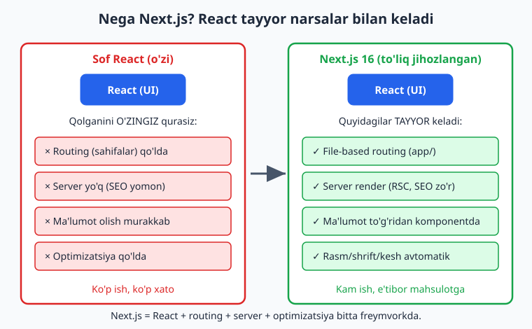
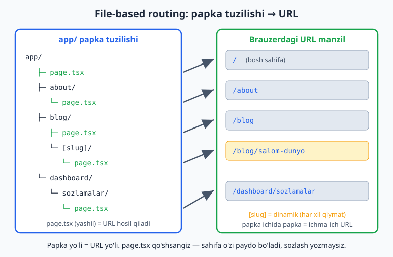
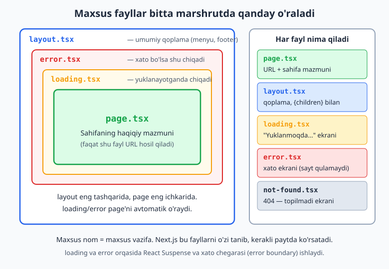
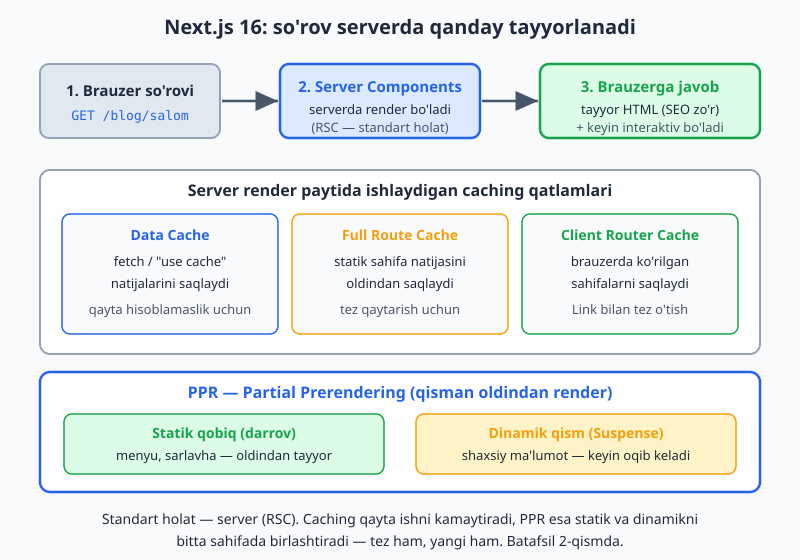

# Next.js — 0 dan Expert darajagacha (1-QISM)

📚 [README / Mundarija](./README.md) · [Keyingi: 2-qism — Server & Actions →](./Nextjs-0-dan-Expert-2-qism.md)

> **Kim uchun?** Bu qo'llanma hech qachon dasturlash qilmagan, JavaScript ham, React ham bilmaydigan odam uchun yozilgan. Hech narsani "bilasiz" deb taxmin qilmaymiz. Har bir tushunchani oddiy tildan, real hayotdan misollar bilan tushuntiramiz.
>
> **Versiya:** Next.js **16** (2026-yil holatiga ko'ra eng so'nggi LTS), React 19. Node.js **20.9+** kerak bo'ladi.

---

## 📚 To'liq kursning yo'l xaritasi

Bu — katta safarning birinchi qismi. Mana butun yo'l qanday ko'rinadi:

**1-QISM (shu hujjat) — Poydevor va birinchi qadamlar**
- 0-bob. Boshlashdan oldin: web, dasturlash, Next.js nima
- 1-bob. JavaScript asoslari
- 2-bob. React asoslari
- 3-bob. Next.js bilan birinchi qadamlar
- 4-bob. Routing (sahifalar tizimi)

**2-QISM — Server, ma'lumotlar va dinamik sahifalar**
- Server Components va Client Components
- Ma'lumot olish (data fetching)
- Server Actions (formalar, ma'lumot saqlash)
- Caching (keshlash) va `"use cache"`

**3-QISM — Haqiqiy ilovalar**
- API yo'naklari (Route Handlers)
- Ma'lumotlar bazasi (database) bilan ishlash
- Autentifikatsiya (login/register)
- Fayl yuklash, validatsiya, xatolarni boshqarish

**4-QISM — Expert daraja**
- Tezlikni optimallash (performance)
- Test yozish
- Deployment (internetga chiqarish)
- Monitoring, ilg'or patternlar, real loyiha

---

## ❓ Bu qo'llanmadan qanday foydalanish kerak

1. **Tartib bilan o'qing.** Boblar bir-birining ustiga quriladi. 1-bobni tushunmasdan 3-bobga o'tmang.
2. **O'qiganingizni yozib ko'ring.** Dasturlashni o'qib emas, **yozib** o'rganadilar. Har bir kod misolini o'z qo'lingiz bilan yozing.
3. **Masalalarni albatta yeching.** Har bobdan keyin 20+ masala bor. Ularni yechmasangiz, mavzu miyada qolmaydi. Eng kam — yarmini yeching.
4. **Shoshilmang.** Bir bobni 1–2 kunda hazm qilsangiz ham yetadi. Asosiysi — tushunish.

> **Maslahat:** Yonida daftar tuting. Tushunmagan so'zni yozib qo'ying, keyin qaytib qarang.

---
---

# 0-BOB. Boshlashdan oldin

Next.js'ga kirishdan oldin, "bu narsa umuman nima va nega kerak" degan savolga javob beraylik. Asos mustahkam bo'lsa, qolgani oson.

## 0.1. Internet va web qanday ishlaydi?

Tasavvur qiling, siz restoranda o'tiribsiz. 

- **Siz** — mijoz (customer).
- **Ofitsiant** — siz bilan gaplashadigan odam.
- **Oshxona** — taom tayyorlanadigan joy.

Siz menyuga qaraysiz, ofitsiantga "lag'mon" deysiz, ofitsiant buyurtmani oshxonaga olib boradi, oshxona taom tayyorlaydi, ofitsiant uni sizga olib keladi.

Internet ham xuddi shunday ishlaydi:

| Restoran | Internet |
|---|---|
| Siz (mijoz) | **Browser** (Chrome, Safari) — sahifani ko'rsatadigan dastur |
| Ofitsiant | **HTTP so'rovi (request)** — browser server bilan gaplashish usuli |
| Oshxona | **Server** — internetdagi kuchli kompyuter |
| Tayyorlangan taom | **Response (javob)** — server qaytaradigan ma'lumot (HTML sahifa, rasm, ma'lumot) |

**Jarayon:**
1. Siz brauzerga `google.com` deb yozasiz.
2. Brauzer Google serveriga **so'rov (request)** yuboradi: "Menga bosh sahifani ber".
3. Server javob (response) qaytaradi — bu HTML sahifa.
4. Brauzer o'sha HTMLni ekranda chiroyli qilib ko'rsatadi.

**Frontend va Backend** — bu ikki so'zni doim eshitasiz:
- **Frontend** = "old tomon" = foydalanuvchi **ko'radigan** qism. Tugmalar, ranglar, matnlar, animatsiyalar. Bu — brauzerda ishlaydi.
- **Backend** = "orqa tomon" = foydalanuvchi **ko'rmaydigan** qism. Ma'lumotlarni saqlash, parolni tekshirish, hisob-kitoblar. Bu — serverda ishlaydi.

> Restoranda: zal va menyu — frontend. Oshxona va omborxona — backend.

**Next.js'ning eng kuchli tomoni shundaki, u ham frontend, ham backendni bitta joyda yozish imkonini beradi.** Buni keyinroq ko'ramiz.

## 0.2. Dasturlash nima va kompyuter qanday "tushunadi"?

**Dasturlash** — bu kompyuterga **aniq buyruqlar** berish san'ati. Kompyuter juda tez, lekin juda "ahmoq" — u faqat aniq aytilgan narsani bajaradi. "Choy damla" desangiz tushunmaydi, lekin "suvni qaynat → choy sol → 5 daqiqa kut" desangiz bajaradi.

Webda 3 ta asosiy "til" bor. Ularni uyga o'xshatsak:

- **HTML** — uyning **skeleti** (devorlar, eshiklar, derazalar). Sahifada nima borligini belgilaydi: sarlavha, matn, rasm, tugma.
- **CSS** — uyning **bezagi** (rang, oboy, mebel). Sahifa qanday **ko'rinishini** belgilaydi.
- **JavaScript** — uyning **elektr va mexanikasi** (lampa yonadi, eshik ochiladi). Sahifani **harakatga keltiradi**: tugma bosilganda nimadir bo'lishi.

**React** — JavaScript ustiga qurilgan **vosita (kutubxona)**. U murakkab sahifalarni oson yasashga yordam beradi.

**Next.js** — React ustiga qurilgan **freymvork**. "Freymvork" — bu tayyor qoidalar va vositalar to'plami, ular bilan ish ancha tezlashadi.

Piramida shunday:

```
        Next.js      ← eng ustki qavat (siz o'rganmoqchi bo'lgan narsa)
          │
        React        ← buning ustiga qurilgan
          │
      JavaScript     ← buning ustiga qurilgan
          │
   HTML + CSS         ← eng ostki, asosiy qavat
```

Shuning uchun biz **pastdan yuqoriga** o'rganamiz: avval bir oz JavaScript, keyin React, keyin Next.js.

> **HTML va CSS haqida:** Ular nisbatan oson va Next.js'ni o'rganishda yo'l-yo'lakay o'rganib ketasiz. Bu qo'llanmada JavaScript'ga ko'proq e'tibor beramiz, chunki u qiyinroq va muhimroq.

## 0.3. Next.js nima va nega aynan u?

**Next.js** — bu zamonaviy veb-saytlar va veb-ilovalar yasash uchun eng mashhur freymvorklardan biri. Uni Vercel kompaniyasi yaratgan.

**Nega faqat React'ning o'zi yetmaydi?** Sof React bilan sayt yasaganda quyidagi muammolar chiqadi:
- Sahifadan sahifaga o'tish (routing) tizimini o'zingiz qurishingiz kerak.
- Sayt qidiruv tizimlarida (Google) yaxshi chiqmaydi (SEO muammosi).
- Serverdan ma'lumot olish murakkab.
- Tezlikni optimallash qiyin.

**Next.js bularning hammasini sizning o'rningizga hal qiladi:**
- ✅ **Routing tayyor** — papka yaratasiz, sahifa paydo bo'ladi (keyin ko'ramiz).
- ✅ **SEO yaxshi** — sahifalar serverda tayyorlanadi, Google ularni oson o'qiydi.
- ✅ **Tez** — rasm, shrift, kodni avtomatik optimallaydi.
- ✅ **Frontend + Backend bitta loyihada** — alohida server kerak emas.

**Kim ishlatadi?** Netflix, TikTok, Twitch, Nike, Notion va minglab kompaniyalar. Ish bozorida Next.js'ni biladiganlar juda qadrlanadi.

## 0.4. Kerakli vositalarni o'rnatish

Yozishni boshlashdan oldin kompyuteringizga 3 ta narsa o'rnatamiz.

### 1) Node.js (versiya 20.9 yoki yuqori)

**Node.js nima?** Odatda JavaScript faqat brauzerda ishlaydi. Node.js — JavaScript'ni brauzersiz, to'g'ridan-to'g'ri kompyuterda ishlatish imkonini beradigan dastur. Next.js ishlashi uchun shart.

**O'rnatish:**
1. [nodejs.org](https://nodejs.org) saytiga kiring.
2. **LTS** (Long Term Support — barqaror) versiyasini yuklab oling. Versiya 20.9 dan yuqori bo'lsin.
3. Yuklangan faylni ochib, "Next → Next → Install" qilib o'rnating.

**Tekshirish:** Terminal (pastda tushuntiramiz) ochib, quyidagini yozing:
```bash
node --version
```
Agar `v20.x.x` yoki `v22.x.x` chiqsa — hammasi joyida. Node.js bilan birga **npm** ham o'rnatiladi (bu — boshqalar yozgan tayyor kodlarni yuklab oladigan vosita).

### 2) VS Code (kod yozadigan dastur)

**Kod yozadigan dastur (muharrir)** kerak. Eng mashhuri — **Visual Studio Code (VS Code)**, bepul.

1. [code.visualstudio.com](https://code.visualstudio.com) dan yuklab oling.
2. O'rnating.
3. Foydali kengaytmalar (Extensions) o'rnatib oling (chap tomondagi kvadratchalar ikonkasi):
   - **ESLint** — xatolarni topadi.
   - **Prettier** — kodni chiroyli formatlaydi.
   - **Tailwind CSS IntelliSense** — keyinroq kerak bo'ladi.

### 3) Terminal (kompyuterga buyruq beradigan oyna)

**Terminal** — bu sichqonchasiz, faqat matn bilan kompyuterga buyruq beradigan oyna. Boshida qo'rqinchli ko'rinadi, lekin tez o'rganasiz.

- **VS Code ichida ochish:** Yuqori menyudan `Terminal → New Terminal`.

**Eng kerakli buyruqlar:**

| Buyruq | Nima qiladi |
|---|---|
| `pwd` | Hozir qaysi papkadaman? (joriy joylashuv) |
| `ls` | Shu papkada qanday fayllar bor? |
| `cd papka-nomi` | Papka ichiga kirish |
| `cd ..` | Bir qadam orqaga (chiqish) |
| `mkdir papka-nomi` | Yangi papka yaratish |
| `clear` | Oynani tozalash |

> **Eslatma:** Buyruqlarni hozir yodlash shart emas. Kerak bo'lganda qaytib qarang. Bir necha kunda o'zi yodlanib ketadi.

---

## ✍️ 0-BOB MASALALARI (tushunish savollari)

Bu bob nazariy bo'lgani uchun masalalar — fikrlash va o'rnatish bo'yicha. Javoblarni daftaringizga yozing.

1. O'z so'zlaringiz bilan tushuntiring: "browser", "server", "request", "response" nima?
2. Restoran misolida ofitsiant — bu nima edi? Oshxona-chi?
3. Frontend bilan backend o'rtasidagi farqni misol bilan ayting.
4. HTML, CSS, JavaScript — har biri uyning qaysi qismiga o'xshaydi?
5. React bilan Next.js o'rtasida qanday bog'liqlik bor? Qaysi biri "ustida" qurilgan?
6. Nega sof React yetmaydi va Next.js kerak bo'ladi? Kamida 2 ta sabab ayting.
7. Node.js nima va nega kerak?
8. npm nima ish qiladi?
9. Node.js'ni o'rnating va terminalda `node --version` natijasini yozib oling.
10. VS Code'ni o'rnating va undagi "Extensions" oynasini toping.
11. VS Code'da ESLint va Prettier kengaytmalarini o'rnating.
12. Terminalni VS Code ichida oching.
13. Terminalda `pwd` yozing — qanday natija chiqdi? Bu nimani anglatadi?
14. Terminalda `mkdir mening-birinchi-papkam` yozib, yangi papka yarating.
15. `cd mening-birinchi-papkam` bilan papka ichiga kiring, keyin `cd ..` bilan chiqing.
16. `ls` buyrug'i nima ko'rsatadi? Sinab ko'ring.
17. SEO nima degani? Nega Next.js bunda yaxshi?
18. "Freymvork" so'zining ma'nosini o'z so'zingiz bilan tushuntiring.
19. Internetda eng kamida 5 ta Next.js bilan qurilgan sayt nomini toping (internetdan qidiring).
20. Kompyuter nega "ahmoq" deyiladi? Choy damlash misolida tushuntiring.
21. `clear` buyrug'i nima qiladi?
22. Next.js'ni kim yaratgan?

---
---

# 1-BOB. JavaScript asoslari

JavaScript — bizning butun safarning poydevori. React va Next.js — bu JavaScript. Shuning uchun bu bobni puxta o'zlashtirish juda muhim. Shoshilmang.

> **Qayerda yozaman?** Tez sinash uchun: brauzeringizda `F12` tugmasini bosing → `Console` bo'limini oching → o'sha yerga JavaScript yozib, Enter bosing. Yoki [playcode.io](https://playcode.io) kabi onlayn muharrirdan foydalaning.

## 1.1. O'zgaruvchilar (Variables) — ma'lumot saqlash qutilari

**O'zgaruvchi** — bu nomlangan **quti**. Unga biror qiymat (son, matn) solib qo'yamiz, keyin nomi orqali ishlatamiz.

```javascript
let ism = "Oqil";
const tugilganYil = 1998;
```

- `let` — qiymati **keyin o'zgarishi** mumkin bo'lgan quti.
- `const` — qiymati **o'zgarmaydigan** quti (constant — doimiy).

```javascript
let yosh = 25;
yosh = 26;        // ✅ Mumkin, chunki "let"
console.log(yosh); // 26

const pi = 3.14;
pi = 3.15;        // ❌ XATO! "const"ni o'zgartirib bo'lmaydi
```

**`console.log(...)`** — bu eng ko'p ishlatadigan buyrug'ingiz. U qavs ichidagi narsani ekranga (konsolga) chiqaradi. Dasturchining "ko'zi" — kod nima qilayotganini ko'rish uchun.

> **Qoida:** Doim `const` ishlating. Faqat qiymat o'zgarishi kerak bo'lsa `let` ga o'ting. Bu kodni xavfsizroq qiladi.
>
> **`var` haqida:** Eski kodlarda `var` ko'rasiz. Uni ishlatmang — eskirgan va muammoli.

**Nomlash qoidalari:**
- Lotin harf bilan boshlanadi: `ism`, `userName`, `_temp`.
- Bo'sh joy yo'q. Ko'p so'zli nom uchun **camelCase**: `firstName`, `totalPrice`.
- Mazmunli nom bering: `x` emas, `userAge`.

## 1.2. Ma'lumot turlari (Data Types)

JavaScript'da bir necha xil ma'lumot bor:

```javascript
// 1. String (matn) — qo'shtirnoq yoki bittirnoq ichida
let ism = "Aziza";
let shahar = 'Toshkent';

// 2. Number (son) — butun yoki kasr
let yosh = 30;
let narx = 19.99;

// 3. Boolean (ha/yo'q) — faqat true yoki false
let tirikmi = true;
let uxlayaptimi = false;

// 4. null — "ataylab bo'sh" qiymat
let mukofot = null;

// 5. undefined — "hali qiymat berilmagan"
let sirli;
console.log(sirli); // undefined
```

**Turini bilish** uchun `typeof` ishlatamiz:
```javascript
console.log(typeof "salom"); // "string"
console.log(typeof 42);      // "number"
console.log(typeof true);    // "boolean"
```

## 1.3. String'lar bilan ishlash

Matnlarni birlashtirish (ulash):
```javascript
let ism = "Oqil";
let salom = "Salom, " + ism + "!"; // "Salom, Oqil!"
```

Lekin zamonaviy va qulay usul — **template literals** (orqaga egilgan tirnoq `` ` `` ichida, `${}` bilan):
```javascript
let ism = "Oqil";
let yosh = 25;
let xabar = `Mening ismim ${ism}, yoshim ${yosh}.`;
console.log(xabar); // "Mening ismim Oqil, yoshim 25."
```

> `` ` `` belgisi klaviaturada `Esc` tugmasi tagida (`1` chap tomonida) bo'ladi.

Foydali string metodlari:
```javascript
let matn = "Salom Dunyo";
console.log(matn.length);        // 11 (uzunligi)
console.log(matn.toUpperCase()); // "SALOM DUNYO"
console.log(matn.toLowerCase()); // "salom dunyo"
console.log(matn.includes("Dunyo")); // true (ichida bormi?)
console.log(matn.replace("Dunyo", "Olam")); // "Salom Olam"
```

## 1.4. Sonlar va matematik amallar

```javascript
let a = 10;
let b = 3;

console.log(a + b); // 13  (qo'shish)
console.log(a - b); // 7   (ayirish)
console.log(a * b); // 30  (ko'paytirish)
console.log(a / b); // 3.33... (bo'lish)
console.log(a % b); // 1   (qoldiq — 10 ni 3 ga bo'lgandagi qoldiq)
console.log(a ** 2); // 100 (daraja — 10 ning kvadrati)
```

`%` (qoldiq) juda foydali — masalan, sonning juft yoki toqligini tekshirishda:
```javascript
let son = 8;
console.log(son % 2); // 0 → juft son (qoldiq 0)
```

Qisqartirilgan amallar:
```javascript
let ball = 10;
ball += 5;  // ball = ball + 5 → 15
ball -= 3;  // 12
ball++;     // 13 (1 ga oshirish)
ball--;     // 12 (1 ga kamaytirish)
```

## 1.5. Boolean, taqqoslash va mantiq

**Taqqoslash** natijasi har doim `true` yoki `false`:
```javascript
console.log(5 > 3);   // true
console.log(5 < 3);   // false
console.log(5 >= 5);  // true (katta yoki teng)
console.log(5 === 5); // true (TENG)
console.log(5 === "5"); // false (son va matn teng emas!)
console.log(5 !== 3); // true (teng EMAS)
```

> **MUHIM:** Tenglikni tekshirishda doim **`===`** (uchta belgi) ishlating, `==` (ikkita) emas. `===` turni ham tekshiradi va xatolardan saqlaydi.

**Mantiqiy operatorlar:**
```javascript
let yosh = 20;

// && (VA) — ikkala shart ham true bo'lishi kerak
console.log(yosh > 18 && yosh < 65); // true

// || (YOKI) — kamida bittasi true bo'lsa yetadi
console.log(yosh < 18 || yosh > 65); // false

// ! (EMAS) — teskarisi
console.log(!true); // false
```

## 1.6. Shartlar (if / else) — qaror qabul qilish

Dastur har doim ham bir xil ishlamaydi — ba'zan u **qaror** qabul qilishi kerak.

```javascript
let yosh = 16;

if (yosh >= 18) {
  console.log("Siz voyaga yetgansiz");
} else {
  console.log("Siz hali balog'atga yetmagansiz");
}
// Natija: "Siz hali balog'atga yetmagansiz"
```

Ko'p variantli shart (`else if`):
```javascript
let ball = 75;

if (ball >= 90) {
  console.log("A'lo");
} else if (ball >= 70) {
  console.log("Yaxshi");
} else if (ball >= 50) {
  console.log("Qoniqarli");
} else {
  console.log("Qoniqarsiz");
}
// Natija: "Yaxshi"
```

**Ternar operator** — qisqa `if/else` (React'da juda ko'p ishlatiladi):
```javascript
let yosh = 20;
let holat = yosh >= 18 ? "kattalar" : "bolalar";
console.log(holat); // "kattalar"
// Sintaksis: shart ? (true bo'lsa) : (false bo'lsa)
```

## 1.7. Massivlar (Arrays) — ro'yxatlar

**Massiv** — bu **tartiblangan ro'yxat**. Bir nechta qiymatni bitta o'zgaruvchida saqlaydi.

```javascript
let mevalar = ["olma", "banan", "uzum"];
```

Elementga **indeks** orqali murojaat qilamiz. **Indeks 0 dan boshlanadi!**
```javascript
console.log(mevalar[0]); // "olma"  (birinchi)
console.log(mevalar[1]); // "banan" (ikkinchi)
console.log(mevalar[2]); // "uzum"  (uchinchi)
console.log(mevalar.length); // 3 (nechta element bor)
```

Foydali massiv metodlari:
```javascript
let sonlar = [1, 2, 3];

sonlar.push(4);      // oxiriga qo'shish → [1, 2, 3, 4]
sonlar.pop();        // oxirgisini olib tashlash → [1, 2, 3]
sonlar.unshift(0);   // boshiga qo'shish → [0, 1, 2, 3]
console.log(sonlar.includes(2)); // true (ichida bormi?)
console.log(sonlar.indexOf(2));  // 2 (qaysi indeksda?)
```

### Massivlar bilan ishlashning eng muhim 3 metodi

Bular React'da har kuni ishlatiladi. Yaxshi tushunib oling.

**`.map()` — har bir elementni o'zgartirib, YANGI massiv qaytaradi**
```javascript
let sonlar = [1, 2, 3];
let kvadratlar = sonlar.map(son => son * son);
console.log(kvadratlar); // [1, 4, 9]
// "Har bir sonni olib, kvadratga ko'tar va yangi ro'yxat tuz"
```

**`.filter()` — shartga mos elementlarni saralab, YANGI massiv qaytaradi**
```javascript
let sonlar = [1, 2, 3, 4, 5, 6];
let juftlar = sonlar.filter(son => son % 2 === 0);
console.log(juftlar); // [2, 4, 6]
// "Faqat juft sonlarni ajratib ol"
```

**`.find()` — shartga mos BIRINCHI elementni qaytaradi**
```javascript
let sonlar = [5, 12, 8, 20];
let birinchiKatta = sonlar.find(son => son > 10);
console.log(birinchiKatta); // 12
```

**`.reduce()` — barcha elementlarni bitta qiymatga "yig'adi"** (masalan, yig'indi):
```javascript
let sonlar = [10, 20, 30];
let yigindi = sonlar.reduce((jami, son) => jami + son, 0);
console.log(yigindi); // 60
```

## 1.8. Obyektlar (Objects) — bog'liq ma'lumotlar to'plami

Massiv — ro'yxat (`["olma", "banan"]`). **Obyekt** esa — bir narsaning **xususiyatlari** to'plami. Real hayotdagi "narsa"ni tasvirlaydi.

```javascript
let foydalanuvchi = {
  ism: "Oqil",
  yosh: 25,
  shahar: "Toshkent",
  faolmi: true
};
```

Har bir qism — **kalit: qiymat** (`key: value`) juftligi. Qiymatga **nuqta** orqali murojaat qilamiz:
```javascript
console.log(foydalanuvchi.ism);   // "Oqil"
console.log(foydalanuvchi.yosh);  // 25

foydalanuvchi.yosh = 26;          // o'zgartirish
foydalanuvchi.kasb = "Dasturchi"; // yangi xususiyat qo'shish
```

**Obyektlar massivi** — eng ko'p uchraydigan ma'lumot ko'rinishi (masalan, foydalanuvchilar ro'yxati):
```javascript
let foydalanuvchilar = [
  { id: 1, ism: "Ali", yosh: 20 },
  { id: 2, ism: "Vali", yosh: 25 },
  { id: 3, ism: "Guli", yosh: 30 }
];

// 25 dan katta yoshdagilarni topish:
let kattalar = foydalanuvchilar.filter(u => u.yosh > 22);
console.log(kattalar); // Vali va Guli

// Faqat ismlar ro'yxatini olish:
let ismlar = foydalanuvchilar.map(u => u.ism);
console.log(ismlar); // ["Ali", "Vali", "Guli"]
```

## 1.9. Funksiyalar (Functions) — qayta ishlatiladigan kod

**Funksiya** — bu biror vazifani bajaradigan **kod bo'lagi**, unga nom beriladi va kerak bo'lganda chaqiriladi. Bir marta yozasiz, ko'p marta ishlatasiz.

> Tasavvur qiling, "choy damlash" retsepti. Bir marta yozib qo'yasiz, keyin har gal "choy damla" deysiz.

```javascript
function salomBer(ism) {
  return `Salom, ${ism}!`;
}

console.log(salomBer("Oqil"));  // "Salom, Oqil!"
console.log(salomBer("Aziza")); // "Salom, Aziza!"
```

- `ism` — **parametr** (funksiyaga kiradigan ma'lumot).
- `return` — funksiya **qaytaradigan natija**.

Bir necha parametr:
```javascript
function qoshish(a, b) {
  return a + b;
}
console.log(qoshish(3, 5)); // 8
```

### Arrow funksiyalar (zamonaviy yozuv)

React'da ko'proq **arrow** (o'q) ko'rinishi ishlatiladi. Bu xuddi shu narsa, faqat qisqaroq:

```javascript
// Oddiy funksiya:
function qoshish(a, b) {
  return a + b;
}

// Arrow funksiya (aynan shu ish):
const qoshish = (a, b) => {
  return a + b;
};

// Agar faqat return bo'lsa, yanada qisqa:
const qoshish = (a, b) => a + b;

console.log(qoshish(2, 3)); // 5
```

> Yuqorida `.map()`, `.filter()` ichida ishlatgan `son => son * son` — bu ham arrow funksiya!

## 1.10. Destructuring va spread — qulay yozuvlar

React'da bularsiz yashab bo'lmaydi. Yaxshi tushunib oling.

**Destructuring (ajratib olish)** — obyekt yoki massivdan qiymatlarni tez ajratib olish:
```javascript
let foydalanuvchi = { ism: "Oqil", yosh: 25 };

// Eski usul:
let ism = foydalanuvchi.ism;
let yosh = foydalanuvchi.yosh;

// Destructuring (qisqa):
let { ism, yosh } = foydalanuvchi;
console.log(ism, yosh); // "Oqil" 25
```

Massiv uchun:
```javascript
let ranglar = ["qizil", "yashil", "ko'k"];
let [birinchi, ikkinchi] = ranglar;
console.log(birinchi); // "qizil"
```

**Spread (`...`)** — massiv/obyektni "yoyish", nusxa olish:
```javascript
// Massivlarni birlashtirish:
let a = [1, 2];
let b = [3, 4];
let hammasi = [...a, ...b]; // [1, 2, 3, 4]

// Obyektga nusxa olib, ustiga qo'shish:
let user = { ism: "Oqil", yosh: 25 };
let yangiUser = { ...user, shahar: "Toshkent" };
// { ism: "Oqil", yosh: 25, shahar: "Toshkent" }
```

> **Nega muhim?** React'da ma'lumotni o'zgartirganda, "eskisini buzmasdan nusxa olib o'zgartirish" qoida. Spread aynan shu uchun kerak.

## 1.11. Tsikllar (Loops) — takrorlash

Bir xil ishni ko'p marta qilish kerak bo'lsa:

```javascript
// for tsikli — 5 marta salom aytadi
for (let i = 1; i <= 5; i++) {
  console.log(`${i}-salom`);
}
// 1-salom, 2-salom, ... 5-salom
```

Massiv bo'ylab yurish (`for...of`):
```javascript
let mevalar = ["olma", "banan", "uzum"];
for (let meva of mevalar) {
  console.log(meva);
}
// olma, banan, uzum
```

> React'da ko'pincha tsikl o'rniga `.map()` ishlatamiz, lekin `for` ni bilish shart.

## 1.12. Maxsus operatorlar (React'da ko'p kerak)

**Optional chaining (`?.`)** — obyekt bor-yo'qligini tekshirib, xatosiz murojaat qilish:
```javascript
let user = { ism: "Oqil", manzil: { shahar: "Toshkent" } };
console.log(user?.manzil?.shahar); // "Toshkent"

let user2 = {};
console.log(user2?.manzil?.shahar); // undefined (xato BERMAYDI!)
// `?.` bo'lmasa, bu yerda dastur "qulab" tushardi
```

**Nullish operator (`??`)** — qiymat `null`/`undefined` bo'lsa, zaxira qiymat berish:
```javascript
let ism = null;
let natija = ism ?? "Mehmon";
console.log(natija); // "Mehmon"
```

**`&&` bilan qisqa ko'rsatish** (React'da elementni shartli ko'rsatishda):
```javascript
let xabarlarSoni = 5;
console.log(xabarlarSoni > 0 && "Sizda yangi xabar bor!");
// "Sizda yangi xabar bor!"
```

## 1.13. Asinxron kod — `async` / `await`

Ba'zi ishlar **vaqt oladi** — masalan, serverdan ma'lumot olish. Dastur javobni kutishi kerak, lekin shu paytda muzlab qolmasligi kerak. Buni **asinxron** kod hal qiladi.

> Restoran misolida: ofitsiantga buyurtma berdingiz va kutyapsiz. Lekin shu paytda telefon ko'rib, gaplashib o'tiraverasiz — "muzlab" qolmaysiz. Taom kelganda yeysiz.

```javascript
// Serverdan ma'lumot olish (eng keng tarqalgan misol):
async function malumotOl() {
  const javob = await fetch("https://api.example.com/users");
  const malumot = await javob.json();
  console.log(malumot);
}
```

- `async` — "bu funksiya ichida kutish bo'lishi mumkin" degani.
- `await` — "shu ishni kutib tur, tugagach davom et" degani.
- `fetch(...)` — internetdan ma'lumot olib keladigan funksiya.

Hozircha buni to'liq tushunmasangiz ham mayli — 2-qismda ma'lumot olishda chuqur ko'ramiz. Hozir shaklini tanib qo'ying.

## 1.14. Modullar — `import` / `export`

Katta loyihada kodni bir nechta faylga bo'lib yozamiz. Bir fayldagi kodni boshqasida ishlatish uchun **export/import**:

```javascript
// matematika.js fayli
export function qoshish(a, b) {
  return a + b;
}

// app.js fayli
import { qoshish } from "./matematika.js";
console.log(qoshish(2, 3)); // 5
```

- `export` — "bu kodni boshqa fayllar ishlatishi mumkin".
- `import` — "boshqa fayldan kod olib kelaman".

> React va Next.js'da har bir fayl yuqorida `import`lar bilan boshlanadi. Bu — odatiy holat.

---

## ✍️ 1-BOB MASALALARI (25 ta)

> Har bir masalani VS Code yoki brauzer konsolida yozib, natijasini `console.log` bilan tekshiring.

**Oson (1–9):**
1. `ism`, `familiya`, `yosh` o'zgaruvchilarini yarating va `console.log` bilan chiqaring.
2. Doira radiusi `r = 5`. Maydonini hisoblang (`pi * r * r`, `pi = 3.14`).
3. Template literal bilan shunday matn chiqaring: "Mening ismim X, men Y yoshdaman".
4. `"javascript"` so'zini katta harflarga aylantiring va uzunligini chiqaring.
5. 17 ning juft yoki toqligini `%` bilan aniqlang va `console.log` qiling.
6. `let narx = 100`. Unga 20% chegirma qo'llang va yangi narxni chiqaring.
7. 2 ta sonni taqqoslab, qaysi biri kattaligini `console.log` bilan ayting (`if/else`).
8. `5 === "5"` va `5 == "5"` natijalarini chiqaring. Farqini izohlang.
9. Ternar operator bilan: agar yosh 18 dan katta bo'lsa "Kattalar", aks holda "Bolalar" chiqaring.

**O'rta (10–18):**
10. `["dushanba", "seshanba", "chorshanba"]` massivi yarating. 2-elementni chiqaring.
11. Massivga `.push()` bilan "payshanba" qo'shing va `length`ni chiqaring.
12. `[1,2,3,4,5]` massivining har bir elementini 2 ga ko'paytiring (`.map()`).
13. `[10, 25, 3, 40, 7]` dan 20 dan katta sonlarni saralang (`.filter()`).
14. Shu massivdan birinchi 20 dan katta sonni toping (`.find()`).
15. `[100, 200, 300]` ning yig'indisini `.reduce()` bilan hisoblang.
16. Obyekt yarating: `{ ism, yosh, kasb }`. Keyin `kasb`ni o'zgartiring va `shahar` qo'shing.
17. 3 ta foydalanuvchi obyektidan iborat massiv yarating va `.map()` bilan faqat ismlarini ajrating.
18. Shu massivdan 25 yoshdan katta foydalanuvchilarni `.filter()` bilan ajrating.

**Funksiyalar va ilg'or (19–25):**
19. `kvadrat(n)` funksiyasini yozing — sonning kvadratini qaytarsin. `kvadrat(6)` ni sinang.
20. Shu funksiyani **arrow** ko'rinishida qayta yozing.
21. `engKatta(a, b, c)` funksiyasi — 3 sondan eng kattasini qaytarsin.
22. Obyektdan destructuring bilan `ism` va `yosh`ni ajratib oling.
23. 2 ta massivni spread (`...`) bilan birlashtiring.
24. Obyektga spread bilan nusxa olib, ustiga yangi maydon qo'shing (eskisini buzmasdan).
25. `for` tsikli bilan 1 dan 10 gacha sonlarni chiqaring, lekin faqat juftlarini (`if` + `%` bilan).

> **Qo'shimcha challenge:** `[5, -3, 0, 12, -8, 7]` massividan: (a) musbatlarni ajrating, (b) ularning yig'indisini toping, (c) har birini kvadratga ko'taring. Hammasini `.filter`, `.reduce`, `.map` bilan qiling.

---
---

# 2-BOB. React asoslari

Endi JavaScript poydevori bor. React — bu JavaScript yordamida **foydalanuvchi interfeysi** (tugmalar, formalar, ro'yxatlar) yasash vositasi. Next.js to'liq React ustiga qurilgan, shuning uchun bu bob — markaziy.

## 2.1. React nima va nega kerak?

Sof JavaScript bilan sahifani o'zgartirish ancha murakkab va chalkash bo'ladi. React buni **soddalashtiradi** va 2 ta katta g'oyani olib keladi:

1. **Component (komponent)** — sahifani qayta ishlatiladigan **bo'laklarga** bo'lish.
2. **State (holat)** — ma'lumot o'zgarganda, ekran **avtomatik** yangilanishi.

> Tasavvur qiling, Lego. Katta narsani kichik, bir xil bo'laklardan yig'asiz. React'da sahifa — Lego, komponentlar — bo'laklar.

## 2.2. Component (komponent) — qurilish g'ishti

**Komponent** — bu HTML qaytaradigan **funksiya**. Eng oddiy komponent:

```jsx
function Salom() {
  return <h1>Salom, Dunyo!</h1>;
}
```

**Muhim qoidalar:**
- Komponent nomi **katta harf** bilan boshlanadi: `Salom`, `UserCard` (oddiy funksiyalardan farqi shu).
- U **JSX** qaytaradi (pastda tushuntiramiz — HTMLga o'xshash narsa).
- Komponentni boshqa joyda HTML tegi kabi ishlatamiz: `<Salom />`.

```jsx
function Sahifa() {
  return (
    <div>
      <Salom />
      <Salom />
      <Salom />
    </div>
  );
}
// Ekranda 3 marta "Salom, Dunyo!" chiqadi
```

## 2.3. JSX — HTML ichida JavaScript

**JSX** — JavaScript ichiga HTML yozish imkonini beradigan maxsus sintaksis. Ko'rinishidan HTML, lekin aslida JavaScript.

```jsx
function Profil() {
  const ism = "Oqil";
  const yosh = 25;

  return (
    <div>
      <h1>{ism}</h1>
      <p>Yosh: {yosh}</p>
      <p>Keyingi yil: {yosh + 1}</p>
    </div>
  );
}
```

**JSX qoidalari (yodlang):**
1. **`{ }` ichida** JavaScript yoziladi: `{ism}`, `{yosh + 1}`, `{user.ism}`.
2. **Bitta "ota" element** qaytarish kerak. Bir nechta element bo'lsa, `<div>` yoki bo'sh teg `<>...</>` ichiga o'rang:
   ```jsx
   return (
     <>
       <h1>Sarlavha</h1>
       <p>Matn</p>
     </>
   );
   ```
3. **`class` o'rniga `className`**: `<div className="quti">`.
4. Teglar **yopilishi** shart: ``, `<br />` (o'z-o'zidan yopiluvchi).
5. CSS uslublari obyekt sifatida: `style={{ color: "red" }}` (ikki qavat qavs!).

## 2.4. Props — komponentga ma'lumot uzatish

**Props** (properties — xususiyatlar) — komponentga **tashqaridan** ma'lumot berish usuli. Funksiyaga argument bergandek.

> Choy retsepti misolida: "choy damla" funksiyasiga "qancha qand?" deb props berasiz. Bittasiga 2 qand, boshqasiga 0 qand.

```jsx
// Komponent props qabul qiladi:
function UserCard(props) {
  return (
    <div>
      <h2>{props.ism}</h2>
      <p>Yosh: {props.yosh}</p>
    </div>
  );
}

// Uni ishlatganda props beramiz:
function Sahifa() {
  return (
    <div>
      <UserCard ism="Ali" yosh={20} />
      <UserCard ism="Vali" yosh={25} />
    </div>
  );
}
```

**Destructuring bilan chiroyliroq** (ko'pincha shunday yoziladi):
```jsx
function UserCard({ ism, yosh }) {
  return (
    <div>
      <h2>{ism}</h2>
      <p>Yosh: {yosh}</p>
    </div>
  );
}
```

> **Muhim:** Props **faqat o'qish uchun**. Komponent o'ziga kelgan propsni o'zgartira olmaydi.

## 2.5. Ro'yxatlarni ko'rsatish (Lists) — `.map()` qaytib keldi!

Ma'lumotlar ro'yxatini ekranga chiqarish — eng ko'p uchraydigan vazifa. Bu yerda `.map()` ishga tushadi:

```jsx
function MevalarRoyxati() {
  const mevalar = ["Olma", "Banan", "Uzum"];

  return (
    <ul>
      {mevalar.map((meva) => (
        <li key={meva}>{meva}</li>
      ))}
    </ul>
  );
}
```

**`key` nima?** Har bir ro'yxat elementiga **noyob `key`** berish kerak. React shu orqali qaysi element o'zgarganini tezda topadi. Odatda `id` ishlatiladi:

```jsx
function UserList() {
  const users = [
    { id: 1, ism: "Ali" },
    { id: 2, ism: "Vali" },
    { id: 3, ism: "Guli" }
  ];

  return (
    <ul>
      {users.map((user) => (
        <li key={user.id}>{user.ism}</li>
      ))}
    </ul>
  );
}
```

> **Qoida:** `key` noyob bo'lishi kerak. Massiv indeksini (`map((u, i) => ... key={i})`) iloji boricha ishlatmang — `id` borligi yaxshiroq.

## 2.6. Shartli ko'rsatish (Conditional Rendering)

Ba'zan elementni **shartga qarab** ko'rsatamiz:

```jsx
function Salom({ kirganmi }) {
  return (
    <div>
      {kirganmi ? (
        <h1>Xush kelibsiz!</h1>
      ) : (
        <h1>Iltimos, tizimga kiring</h1>
      )}
    </div>
  );
}
```

**`&&` bilan "bor bo'lsa ko'rsat":**
```jsx
function Xabarlar({ son }) {
  return (
    <div>
      <h1>Bosh sahifa</h1>
      {son > 0 && <p>Sizda {son} ta yangi xabar bor</p>}
    </div>
  );
}
// son 0 bo'lsa, hech narsa ko'rsatilmaydi
```

## 2.7. State (holat) va `useState` — Reactning yuragi

Mana React'ning eng muhim qismi. **State** — bu komponentning vaqt o'tishi bilan **o'zgarib turadigan ma'lumoti**. State o'zgarganda — React ekranni **avtomatik qayta chizadi**.

> Misol: tugmani bosgan sayin oshib boradigan hisoblagich. "Necha marta bosildi" — bu state.

```jsx
import { useState } from "react";

function Hisoblagich() {
  const [son, setSon] = useState(0);

  return (
    <div>
      <p>Siz {son} marta bosdingiz</p>
      <button onClick={() => setSon(son + 1)}>
        Bosing
      </button>
    </div>
  );
}
```

**Buni qatorma-qator tushunamiz:**
- `import { useState } from "react";` — `useState`ni olib kelamiz.
- `const [son, setSon] = useState(0);` — bu eng muhim qator:
  - `son` — joriy qiymat (boshlang'ich `0`).
  - `setSon` — qiymatni **o'zgartiradigan** funksiya.
  - `useState(0)` — boshlang'ich qiymat `0`.
- `onClick={() => setSon(son + 1)}` — tugma bosilganda `son`ni 1 ga oshir.
- `setSon` chaqirilgach, React **avtomatik** ekranni yangilaydi.

> **OLTIN QOIDA:** State'ni hech qachon to'g'ridan-to'g'ri o'zgartirmang (`son = son + 1` ❌). Doim `setSon(...)` funksiyasidan foydalaning ✅. Aks holda React o'zgarishni "sezmaydi".

State faqat son emas — har qanday tur bo'lishi mumkin:
```jsx
const [ism, setIsm] = useState("");          // matn
const [tayyormi, setTayyormi] = useState(false); // boolean
const [royxat, setRoyxat] = useState([]);    // massiv
const [user, setUser] = useState({ ism: "", yosh: 0 }); // obyekt
```

## 2.8. Hodisalar (Events) — foydalanuvchi bilan muloqot

Tugma bosish, matn yozish kabi **hodisalarga** javob beramiz:

```jsx
function Tugmalar() {
  function salomBer() {
    alert("Salom!");
  }

  return (
    <div>
      {/* Usul 1: funksiya nomini berish */}
      <button onClick={salomBer}>Salom ayt</button>

      {/* Usul 2: to'g'ridan-to'g'ri arrow funksiya */}
      <button onClick={() => alert("Xayr!")}>Xayr ayt</button>
    </div>
  );
}
```

> **Diqqat:** `onClick={salomBer}` ✅ (qavssiz!), `onClick={salomBer()}` ❌ (qavs bilan — bu funksiyani darrov chaqirib yuboradi, xato).

Eng ko'p ishlatadigan hodisalar: `onClick` (bosish), `onChange` (o'zgarish), `onSubmit` (forma yuborish).

## 2.9. Formalar (Controlled Inputs)

React'da input maydonlarini state bilan **boshqaramiz**. Bu "controlled input" deyiladi:

```jsx
import { useState } from "react";

function IsmFormasi() {
  const [ism, setIsm] = useState("");

  return (
    <div>
      <input
        type="text"
        value={ism}
        onChange={(e) => setIsm(e.target.value)}
        placeholder="Ismingizni kiriting"
      />
      <p>Salom, {ism || "mehmon"}!</p>
    </div>
  );
}
```

**Tushuntirish:**
- `value={ism}` — input'ning qiymati state'ga bog'langan.
- `onChange={(e) => setIsm(e.target.value)}` — har bir harf yozilganda state yangilanadi.
- `e.target.value` — input'ga yozilgan joriy matn.

Foydalanuvchi har harf yozganda, state yangilanadi va ekran shu zahoti yangilanadi.

## 2.10. `useEffect` — "yon ta'sirlar" (side effects)

Ba'zan komponent ekranga chiqqanda biror ish bajarish kerak bo'ladi — masalan, serverdan ma'lumot olish yoki sarlavhani o'zgartirish. Buni `useEffect` bilan qilamiz.

```jsx
import { useState, useEffect } from "react";

function Soat() {
  const [vaqt, setVaqt] = useState(new Date());

  useEffect(() => {
    // Bu kod komponent ekranga chiqqach ishga tushadi
    const interval = setInterval(() => {
      setVaqt(new Date());
    }, 1000);

    // "Tozalash" — komponent yo'qolganda intervalni to'xtatadi
    return () => clearInterval(interval);
  }, []); // [] — faqat bir marta ishlasin

  return <p>Hozir: {vaqt.toLocaleTimeString()}</p>;
}
```

**`useEffect`ning oxiridagi `[]` (dependency array) muhim:**
- `[]` (bo'sh) — effekt faqat **bir marta**, komponent paydo bo'lganda ishlaydi.
- `[son]` — `son` o'zgarganda **har gal** qayta ishlaydi.
- (massiv yo'q) — har renderda ishlaydi (kamdan-kam kerak).

> **Eslatma:** Next.js'da ma'lumot olishni ko'pincha `useEffect`siz, to'g'ridan-to'g'ri Server Component'da qilamiz (2-qismda ko'ramiz). Lekin `useEffect`ni bilish baribir shart.

## 2.11. Komponentlarni birlashtirish (Composition)

Katta sahifa kichik komponentlardan yig'iladi. Bu — React falsafasi:

```jsx
function Header() {
  return <header><h1>Mening Saytim</h1></header>;
}

function Footer() {
  return <footer><p>© 2026</p></footer>;
}

function Asosiy() {
  return <main><p>Asosiy kontent shu yerda</p></main>;
}

// Hammasini birlashtiramiz:
function App() {
  return (
    <div>
      <Header />
      <Asosiy />
      <Footer />
    </div>
  );
}
```

**`children` prop** — komponent ichiga boshqa elementlarni "joylash":
```jsx
function Quti({ children }) {
  return <div className="quti">{children}</div>;
}

function Sahifa() {
  return (
    <Quti>
      <h2>Bu matn quti ichida</h2>
      <p>Bu ham</p>
    </Quti>
  );
}
```

`children` — `<Quti>` va `</Quti>` orasiga yozilgan hamma narsa.

---

## ✍️ 2-BOB MASALALARI (22 ta)

> Bularni sinash uchun [react.new](https://react.new) yoki onlayn React muharririda yozing. (3-bobdan keyin Next.js loyihasida ham sinaysiz.)

**Komponent va JSX (1–6):**
1. `Salom` komponentini yarating — `<h1>Salom!</h1>` qaytarsin.
2. `Footer` komponentini yarating — ichida sayt nomi va yil bo'lsin.
3. Bitta `App` ichida `Salom`ni 3 marta ishlatib chiqaring.
4. JSX ichida 2 ta sonni qo'shib, natijasini `<p>{...}</p>` da ko'rsating.
5. `<div>` ichiga `style={{ color: "blue" }}` qo'shib, matnni ko'k qiling.
6. Bir komponentda `<>...</>` (fragment) ishlatib, 3 ta elementni qaytaring.

**Props (7–11):**
7. `UserCard({ ism, yosh })` komponentini yarating va 3 xil user bilan chaqiring.
8. `Tugma({ matn })` komponenti — propsdan kelgan matnni tugmada ko'rsatsin.
9. `Salom({ ism })` — agar `ism` berilmasa "Mehmon" ko'rsatadigan qiling (`||` bilan).
10. `Narx({ qiymat })` komponenti — narxni `{qiymat} so'm` ko'rinishida chiqarsin.
11. `Avatar({ rasmUrl, ism })` — `` va ism ko'rsatadigan komponent yarating.

**Ro'yxatlar va shartlar (12–16):**
12. 5 ta shahar massivini `.map()` bilan `<ul><li>` ro'yxatda chiqaring (`key` bilan).
13. 4 ta user obyektidan iborat massivni `.map()` bilan kartochkalar qilib chiqaring.
14. Shu ro'yxatdan faqat 25 yoshdan kattalarni ko'rsating (`.filter()` + `.map()`).
15. `Salom({ kirganmi })` — `kirganmi` true bo'lsa "Xush kelibsiz", aks holda "Kiring" (ternar).
16. `Xabar({ son })` — son 0 dan katta bo'lsagina xabar ko'rsatadigan qiling (`&&`).

**State va hodisalar (17–22):**
17. Tugma bosilganda 1 ga oshadigan hisoblagich (`useState`) yarating.
18. Unga "Kamaytirish" tugmasini ham qo'shing (1 ga kamaytirsin).
19. "Reset" tugmasini qo'shing — hisobni 0 ga qaytarsin.
20. Input yarating: yozgan matningiz pastda jonli ko'rinib tursin (controlled input).
21. "Yashirish/Ko'rsatish" tugmasi — bosilganda matnni yashirsin/ko'rsatsin (boolean state).
22. `useEffect` bilan: komponent yuklanganda konsolga "Komponent yuklandi" yozsin (bir marta).

> **Qo'shimcha challenge:** Oddiy **vazifalar ro'yxati (To-Do)** yasang: input + "Qo'shish" tugmasi. Yozib "Qo'shish" bosilganda, vazifa pastdagi ro'yxatga qo'shilsin. (Maslahat: `useState([])` va `setRoyxat([...royxat, yangiVazifa])`.)

---
---

# 3-BOB. Next.js bilan birinchi qadamlar

Tabriklaymiz! JavaScript va React asoslari sizda bor. Endi asosiy maqsadimiz — **Next.js**ga o'tamiz. Bu bobda birinchi Next.js loyihangizni yaratasiz va uning tuzilishini tushunasiz.

## 3.1. Nega Next.js? (React'dan farqi)

Sof React bilan ishlaganda bir nechta narsani o'zingiz qurishingiz kerak edi. Next.js ularni **tayyor** beradi:

| Vazifa | Sof React | Next.js |
|---|---|---|
| Sahifalar (routing) | O'zingiz qurasiz | Papka yaratasiz — tayyor |
| Serverdan ma'lumot | Murakkab (`useEffect`+fetch) | To'g'ridan-to'g'ri komponentda |
| SEO (Google'da chiqish) | Yomon | Zo'r (server tayyorlaydi) |
| Rasm/shrift optimizatsiyasi | Qo'lda | Avtomatik |
| Backend (API) | Alohida server kerak | Bitta loyihada |

Bitta jumlada: **Next.js — bu "to'liq jihozlangan React".**

Quyidagi diagramma sof React bilan Next.js o'rtasidagi farqni — nimani o'zingiz qurishingiz va nima tayyor kelishini — yonma-yon ko'rsatadi:



## 3.2. Birinchi loyihani yaratish

Terminalni oching (VS Code ichida `Terminal → New Terminal`) va quyidagini yozing:

```bash
npx create-next-app@latest
```

`npx create-next-app` — bu Next.js loyihasini avtomatik yaratib beradigan vosita. U sizdan bir necha savol so'raydi. Yangi boshlovchi uchun tavsiya:

```
✔ What is your project named? … birinchi-app
✔ Would you like to use TypeScript? … Yes          ← Ha (xatolardan saqlaydi)
✔ Would you like to use ESLint? … Yes              ← Ha
✔ Would you like to use Tailwind CSS? … Yes        ← Ha (oson styling)
✔ Would you like your code inside a `src/` directory? … No  ← Yo'q (soddaroq)
✔ Would you like to use App Router? … Yes          ← HA! (zamonaviy usul)
✔ Would you like to use Turbopack? … Yes           ← Ha (tezroq)
```

> **TypeScript haqida:** Bu — JavaScript'ning "xatolarni oldindan ushlaydigan" versiyasi. Boshida `.tsx` fayllarda biroz qo'shimcha yozuv (`: string` kabi) ko'rasiz, lekin bu sizni katta xatolardan asraydi. Hozir qo'rqmang — sekin o'rganib ketasiz.

Tayyor bo'lgach, loyiha papkasiga kiring va ishga tushiring:
```bash
cd birinchi-app
npm run dev
```

Terminalda shunday yozuv chiqadi:
```
✓ Ready in 2s
○ Local: http://localhost:3000
```

Brauzeringizda **`http://localhost:3000`** manzilini oching. Next.js'ning xush kelibsiz sahifasini ko'rasiz! 🎉

> **`localhost:3000` nima?** `localhost` — bu sizning **o'z kompyuteringiz**. `3000` — port (eshik) raqami. Ya'ni sayt hozir faqat sizning kompyuteringizda ishlamoqda, internetda emas. Internetga chiqarish (deployment) — 4-qismda.

## 3.3. Loyiha tuzilishi (papkalar va fayllar)

VS Code'da loyihani oching (`File → Open Folder → birinchi-app`). Quyidagi muhim papka/fayllarni ko'rasiz:

```
birinchi-app/
├── app/                  ← ENG MUHIM papka. Barcha sahifalar shu yerda
│   ├── layout.tsx        ← Umumiy "qoplama" (har sahifada ko'rinadi)
│   ├── page.tsx          ← Bosh sahifa ("/" manzili)
│   └── globals.css       ← Butun saytga tegishli CSS
├── public/               ← Rasmlar, statik fayllar (logo, favicon)
├── node_modules/         ← Kutubxonalar (TEGMANG, avtomatik)
├── package.json          ← Loyiha sozlamalari, kutubxonalar ro'yxati
├── next.config.ts        ← Next.js sozlamalari
└── tsconfig.json         ← TypeScript sozlamalari
```

**Eng muhim 2 ta fayl:**

`app/page.tsx` — bu **bosh sahifa**. Brauzerda `/` ochilganda shu ko'rinadi.
`app/layout.tsx` — bu **umumiy qoplama**. Har bir sahifaning ustki/ostki qatlami (masalan, menyu, footer) shu yerda — barcha sahifalarda bir xil ko'rinadi.

## 3.4. Birinchi sahifani o'zgartirish

`app/page.tsx` faylini oching. Ichidagi hamma narsani o'chirib, quyidagini yozing:

```tsx
export default function Home() {
  return (
    <div>
      <h1>Salom, men Next.js o'rganyapman!</h1>
      <p>Bu mening birinchi sahifam.</p>
    </div>
  );
}
```

Faylni saqlang (`Ctrl+S` / `Cmd+S`). Brauzerga qaytsangiz — sahifa **avtomatik** yangilanganini ko'rasiz! Bu **Hot Reload** (issiq qayta yuklash) deyiladi — saqlaganingiz zahoti o'zgarish ko'rinadi.

> **`export default` nima?** Bu "bu faylning asosiy komponenti shu" degani. Next.js har bir `page.tsx`dan aynan shu `export default` qilingan komponentni oladi va ko'rsatadi.

Komponent — bu xuddi 2-bobdagi React komponenti. Next.js sahifalari — oddiy React komponentlari, xolos!

## 3.5. Layout (umumiy qoplama)

`app/layout.tsx` ni ochsangiz, taxminan shunday ko'rinadi:

```tsx
import "./globals.css";

export const metadata = {
  title: "Mening saytim",
  description: "Next.js bilan yasalgan",
};

export default function RootLayout({
  children,
}: {
  children: React.ReactNode;
}) {
  return (
    <html lang="uz">
      <body>{children}</body>
    </html>
  );
}
```

**Tushuntirish:**
- `{children}` — bu yerga **joriy sahifa** (`page.tsx`) joylashadi. Esingizdami, 2-bobdagi `children`? Aynan o'sha.
- `metadata` — sahifa sarlavhasi va tavsifi (brauzer tabida va Google'da ko'rinadi). SEO uchun muhim.
- Layout har bir sahifada **bir xil** bo'ladi. Masalan, menyu yoki footer'ni shu yerga qo'ysangiz, u barcha sahifalarda chiqadi.

**Misol:** Har sahifada chiqadigan oddiy menyu qo'shamiz:
```tsx
export default function RootLayout({ children }: { children: React.ReactNode }) {
  return (
    <html lang="uz">
      <body>
        <nav style={{ padding: "16px", background: "#eee" }}>
          <strong>Mening Saytim</strong>
        </nav>
        <main style={{ padding: "16px" }}>{children}</main>
        <footer style={{ padding: "16px", background: "#eee" }}>
          © 2026 Barcha huquqlar himoyalangan
        </footer>
      </body>
    </html>
  );
}
```

Endi qaysi sahifaga o'tsangiz ham, yuqorida menyu, pastda footer ko'rinadi.

## 3.6. Styling — sahifani chiroyli qilish

Next.js'da bir necha xil styling usuli bor. Boshlovchilar uchun eng oson — **Tailwind CSS** (loyiha yaratganda "Yes" degan edingiz).

**Tailwind nima?** Tayyor "klasslar" to'plami. CSS faylga o'tib yozish o'rniga, to'g'ridan-to'g'ri `className`da yozasiz:

```tsx
export default function Home() {
  return (
    <div className="p-8">
      <h1 className="text-3xl font-bold text-blue-600">
        Salom, Next.js!
      </h1>
      <p className="mt-4 text-gray-700">
        Bu Tailwind bilan stillangan sahifa.
      </p>
      <button className="mt-6 px-4 py-2 bg-blue-600 text-white rounded-lg hover:bg-blue-700">
        Tugma
      </button>
    </div>
  );
}
```

**Eng ko'p ishlatiladigan Tailwind klasslari:**

| Klass | Ma'nosi |
|---|---|
| `p-8` | ichki bo'sh joy (padding) |
| `m-4` | tashqi bo'sh joy (margin) |
| `mt-4` | faqat yuqoridan margin |
| `text-3xl` | matn kattaligi |
| `font-bold` | qalin matn |
| `text-blue-600` | matn rangi |
| `bg-blue-600` | fon rangi |
| `rounded-lg` | yumaloq burchaklar |
| `flex` | elementlarni yonma-yon joylash |
| `gap-4` | elementlar orasidagi masofa |
| `hover:bg-blue-700` | sichqoncha ustiga kelganda rang |

> Boshqa styling usullari ham bor (CSS Modules, oddiy CSS), lekin Tailwind boshlovchi uchun eng tez. Klasslarni yodlash shart emas — [tailwindcss.com/docs](https://tailwindcss.com/docs) dan qidirasiz, VS Code ham avtomatik takliflar beradi.

## 3.7. Rasmlar va shriftlar (Image, Font)

Next.js rasmlarni avtomatik optimallaydigan maxsus `<Image>` komponenti beradi:

```tsx
import Image from "next/image";

export default function Home() {
  return (
    <Image
      src="/logo.png"   // public papkasidan
      alt="Logotip"
      width={200}
      height={100}
    />
  );
}
```

- `src="/logo.png"` — `public/` papkasidagi `logo.png` fayli (oldiga `/public` yozilmaydi).
- `<Image>` rasmni avtomatik kichraytiradi, tez yuklaydi — sahifa tezroq ishlaydi.

> Hozircha rasm bilan ko'p shug'ullanmasangiz ham bo'ladi. Bunday imkoniyat borligini bilib qo'ying.

---

## ✍️ 3-BOB MASALALARI (22 ta)

> Bularni o'zingiz yaratgan `birinchi-app` loyihasida bajaring. `npm run dev` ishlab tursin, har o'zgarishni brauzerda ko'ring.

**Loyiha va tuzilish (1–6):**
1. `create-next-app` bilan yangi loyiha yarating (yuqoridagi sozlamalar bilan).
2. `npm run dev` bilan ishga tushiring va `localhost:3000`ni brauzerda oching.
3. Loyihada `app`, `public`, `package.json` qayerdaligini toping va ularning vazifasini yozing.
4. `package.json` faylini oching — `"dependencies"` ostida qanday paketlar bor?
5. Dev serverni to'xtating (terminalda `Ctrl+C`), keyin qayta ishga tushiring.
6. `app/page.tsx` qaysi manzilda (URL) ko'rinishini ayting va tekshiring.

**Sahifani o'zgartirish (7–12):**
7. `app/page.tsx`dagi hamma narsani o'chirib, o'zingizning sarlavha va matningizni yozing.
8. Sahifaga 3 ta paragraf qo'shing (o'zingiz haqingizda).
9. JSX ichida `{2026 - 1998}` kabi hisobni ko'rsating.
10. Sahifa ichida `const ism = "..."` o'zgaruvchi yaratib, `{ism}` bilan chiqaring.
11. Bir nechta element qaytarganda `<>...</>` (fragment) ishlating.
12. `<button>` qo'shing va `onClick={() => alert("Salom!")}` qiling. (Eslatma: bu interaktiv element — keyingi bobda "use client" haqida bilib olasiz; hozir ishlamasligi mumkin, sababini 2-qismda tushuntiramiz.)

**Layout (13–17):**
13. `app/layout.tsx`ni oching va `{children}` qayerdaligini toping.
14. Layoutga yuqori menyu (`<nav>`) qo'shing — sayt nomi chiqsin.
15. Layoutga footer qo'shing — yil va ismingiz chiqsin.
16. `metadata`dagi `title`ni o'zgartiring — brauzer tabida ko'ringanini tekshiring.
17. `<html lang="uz">` ekanini tekshiring va nega muhimligini izohlang.

**Styling (18–22):**
18. Sarlavhani Tailwind bilan katta va qalin qiling (`text-4xl font-bold`).
19. Matnga rang bering (`text-gray-600`) va `p-8` bilan bo'sh joy qo'shing.
20. Tugmaga Tailwind stillarini bering: ko'k fon, oq matn, yumaloq burchak.
21. Tugmaga `hover:` effekti qo'shing — ustiga kelganda rang o'zgarsin.
22. `flex gap-4` bilan 3 ta tugmani yonma-yon joylang.

> **Qo'shimcha challenge:** O'zingiz haqingizda oddiy **"Men haqimda" sahifasi** yasang: rasm (`<Image>` yoki oddiy emoji), ism, qisqa tavsif, va 2–3 ta tugma. Tailwind bilan chiroyli qiling. Layout'da menyu va footer bo'lsin.

---
---

# 4-BOB. Routing — sahifalar tizimi

Bu — Next.js'ning eng kuchli va sevimli xususiyatlaridan biri. Boshqa freymvorklarda sahifalar tizimini o'zingiz qurishingiz kerak. Next.js'da esa — **papka yaratasiz, sahifa paydo bo'ladi**. Buni **file-based routing** (fayl asosidagi yo'naltirish) deyiladi.

## 4.1. Asosiy qoida: papka = sahifa

Qoida juda oddiy:
- `app/` ichida **papka** yaratasiz.
- Uning ichiga **`page.tsx`** fayli qo'yasiz.
- Papka nomi — URL manzili bo'ladi.

**Misollar:**

| Fayl | URL manzil |
|---|---|
| `app/page.tsx` | `/` (bosh sahifa) |
| `app/about/page.tsx` | `/about` |
| `app/contact/page.tsx` | `/contact` |
| `app/blog/page.tsx` | `/blog` |

**Amalda sinaymiz.** `app/` ichida `about` papkasini yarating, ichiga `page.tsx` qo'ying:

```tsx
// app/about/page.tsx
export default function AboutPage() {
  return (
    <div className="p-8">
      <h1 className="text-2xl font-bold">Biz haqimizda</h1>
      <p>Bu — "Biz haqimizda" sahifasi.</p>
    </div>
  );
}
```

Brauzerda **`localhost:3000/about`**ni oching — yangi sahifa tayyor! Hech qanday sozlash yozmadingiz. Faqat papka va fayl yaratdingiz.

Mana shu g'oya — `app/` ichidagi papka tuzilishi qanday qilib URL manzillarga aylanishini umumiy ko'rinishda ko'rsatadigan diagramma (ichma-ich va dinamik holatlar ham bor):



## 4.2. Ichma-ich sahifalar (Nested Routes)

Papka ichida papka — URL ham ichma-ich bo'ladi:

| Fayl | URL |
|---|---|
| `app/blog/page.tsx` | `/blog` |
| `app/blog/yangiliklar/page.tsx` | `/blog/yangiliklar` |
| `app/dashboard/sozlamalar/page.tsx` | `/dashboard/sozlamalar` |

```tsx
// app/blog/yangiliklar/page.tsx
export default function YangiliklarPage() {
  return <h1>Yangiliklar</h1>;
}
// URL: /blog/yangiliklar
```

## 4.3. Sahifalar orasida o'tish — `<Link>`

Sahifadan sahifaga o'tish uchun oddiy `<a>` teg **ishlatilmaydi** (u sahifani to'liq qayta yuklaydi — sekin). Next.js maxsus `<Link>` beradi — u tez, sahifani qayta yuklamasdan o'tadi:

```tsx
import Link from "next/link";

export default function Home() {
  return (
    <nav className="flex gap-4 p-4">
      <Link href="/">Bosh sahifa</Link>
      <Link href="/about">Biz haqimizda</Link>
      <Link href="/blog">Blog</Link>
    </nav>
  );
}
```

- `import Link from "next/link";` — Link'ni olib kelamiz.
- `<Link href="/about">` — `href`ga manzilni yozamiz.
- Bosilganda sahifa **bir zumda** o'zgaradi (qayta yuklanmaydi).

> **Qoida:** Loyiha ichidagi sahifalar uchun doim `<Link>` ishlating. `<a>` ni faqat **tashqi** saytlarga (masalan `href="https://google.com"`) ishlating.

Bu menyuni `layout.tsx`ga qo'ysangiz, har sahifada ko'rinadi va saytni "navigatsiya qilsa bo'ladigan" qilib qo'yasiz.

## 4.4. Dinamik sahifalar (Dynamic Routes) — `[id]`

Tasavvur qiling, blogda 1000 ta maqola bor. Har biriga alohida papka yasab bo'lmaydi! Buning yechimi — **dinamik sahifa**. Papka nomini **kvadrat qavs** ichiga olamiz: `[id]`, `[slug]`.

```
app/
└── blog/
    └── [slug]/
        └── page.tsx
```

Bu bitta fayl quyidagi **barcha** manzillarni qamrab oladi:
- `/blog/birinchi-maqola`
- `/blog/nextjs-darslari`
- `/blog/istalgan-narsa`

URL'dagi qiymatni (`slug`) sahifa ichida **`params`** orqali olamiz.

> **⚠️ Next.js 16 MUHIM o'zgarishi:** `params` endi **asinxron** (Promise). Shuning uchun komponent `async` bo'lishi va `params`ni `await` qilish kerak. (Eski 14-versiyada bunday emas edi — eski darsliklarni ko'rsangiz adashmang.)

```tsx
// app/blog/[slug]/page.tsx
export default async function BlogPost({
  params,
}: {
  params: Promise<{ slug: string }>;
}) {
  const { slug } = await params; // ← 16-versiyada AVAIT shart!

  return (
    <div className="p-8">
      <h1 className="text-2xl font-bold">Maqola: {slug}</h1>
      <p>Siz "{slug}" maqolasini ochdingiz.</p>
    </div>
  );
}
```

Endi `/blog/salom-dunyo`ga kirsangiz, ekranda "Maqola: salom-dunyo" chiqadi. `/blog/test`ga kirsangiz — "Maqola: test". Bitta fayl, cheksiz sahifa!

**Real misol:** maqolalar ro'yxati va ularga link:
```tsx
// app/blog/page.tsx
import Link from "next/link";

export default function BlogList() {
  const maqolalar = ["nextjs-asoslari", "react-darslari", "javascript-tips"];

  return (
    <ul className="p-8">
      {maqolalar.map((slug) => (
        <li key={slug}>
          <Link href={`/blog/${slug}`} className="text-blue-600">
            {slug}
          </Link>
        </li>
      ))}
    </ul>
  );
}
```

Har bir link `[slug]` sahifasiga olib boradi.

## 4.5. Catch-all sahifalar — `[...slug]`

Ba'zan bir nechta darajali manzilni bitta fayl bilan ushlash kerak. Buni `[...slug]` (uch nuqta bilan) qiladi:

```
app/docs/[...slug]/page.tsx
```

Bu quyidagilarning **hammasini** ushlaydi:
- `/docs/a`
- `/docs/a/b`
- `/docs/a/b/c`

```tsx
export default async function DocsPage({
  params,
}: {
  params: Promise<{ slug: string[] }>;
}) {
  const { slug } = await params; // slug — endi MASSIV: ["a", "b", "c"]
  return <p>Yo'l: {slug.join(" / ")}</p>;
}
```

> Bu ko'pincha hujjatlar (documentation) saytlarida ishlatiladi. Hozir shaklini tanib qo'ying, kerak bo'lganda qaytasiz.

## 4.6. Maxsus fayllar: layout, loading, error, not-found

Next.js'da maxsus nomli fayllar bor — ular alohida vazifani bajaradi. Har bir papkaga qo'yish mumkin.

### `layout.tsx` — ichma-ich qoplama
Har bir papka o'z `layout.tsx`siga ega bo'lishi mumkin. Masalan, blog uchun alohida menyu:
```tsx
// app/blog/layout.tsx
export default function BlogLayout({ children }: { children: React.ReactNode }) {
  return (
    <div>
      <aside className="p-4 bg-gray-100">Blog menyu</aside>
      <div>{children}</div>
    </div>
  );
}
```
Bu faqat `/blog/...` sahifalarida ko'rinadi (asosiy layout ustiga qo'shiladi).

### `loading.tsx` — yuklanish ko'rsatkichi
Sahifa ma'lumot yuklayotganda avtomatik ko'rsatiladigan "Yuklanmoqda..." ekrani:
```tsx
// app/blog/loading.tsx
export default function Loading() {
  return <p className="p-8">⏳ Yuklanmoqda...</p>;
}
```
Next.js buni avtomatik ishlatadi (React'ning `Suspense` mexanizmi orqasida).

### `error.tsx` — xato ekrani
Sahifada xato yuz bersa, butun sayt "qulamaydi" — shu fayl ko'rsatiladi:
```tsx
"use client"; // error.tsx doim Client Component bo'ladi

export default function Error({ reset }: { reset: () => void }) {
  return (
    <div className="p-8">
      <h2>Nimadir xato ketdi 😕</h2>
      <button onClick={() => reset()} className="mt-4 px-4 py-2 bg-blue-600 text-white rounded">
        Qayta urinish
      </button>
    </div>
  );
}
```

### `not-found.tsx` — "sahifa topilmadi" (404)
Mavjud bo'lmagan manzilga kirilganda ko'rsatiladigan ekran:
```tsx
// app/not-found.tsx
import Link from "next/link";

export default function NotFound() {
  return (
    <div className="p-8 text-center">
      <h1 className="text-3xl font-bold">404 — Sahifa topilmadi</h1>
      <Link href="/" className="text-blue-600">Bosh sahifaga qaytish</Link>
    </div>
  );
}
```

**Maxsus fayllar xulosasi:**

| Fayl | Vazifasi |
|---|---|
| `page.tsx` | Sahifaning o'zi (URL hosil qiladi) |
| `layout.tsx` | Umumiy qoplama (menyu, footer) |
| `loading.tsx` | Yuklanish ekrani |
| `error.tsx` | Xato ekrani |
| `not-found.tsx` | 404 ekrani |

Quyidagi diagramma bu maxsus fayllar bitta marshrutda qanday joylashishini — `layout` eng tashqarida, `page` eng ichkarida, `loading` va `error` esa `page`ni avtomatik o'rashini — ko'rsatadi:



> **Next.js 16 eslatma:** bu sahifalar standart holatda **serverda** render bo'ladigan Server Component'lardir. `page.tsx` serverda tayyorlanadi, `loading.tsx` orqasida React **Suspense**, `error.tsx` orqasida esa **xato chegarasi (error boundary)** ishlaydi. Server va Client Components farqini 2-qismda batafsil ko'ramiz; quyidagi diagramma esa so'rov serverda umuman qanday tayyorlanishiga umumiy nazar tashlaydi:



## 4.7. Dasturiy navigatsiya — `useRouter`

Ba'zan tugma bosilganda kod ichida sahifaga o'tish kerak (masalan, login muvaffaqiyatli bo'lgach):

```tsx
"use client"; // interaktiv bo'lgani uchun

import { useRouter } from "next/navigation";

export default function LoginTugma() {
  const router = useRouter();

  function kirish() {
    // ... login tekshiruvi ...
    router.push("/dashboard"); // dashboard'ga o'tkazadi
  }

  return <button onClick={kirish}>Kirish</button>;
}
```

- `useRouter()` — navigatsiya vositasi.
- `router.push("/dashboard")` — boshqa sahifaga o'tkazadi.

> **`"use client"` nima?** Yuqorida bir necha bor ko'rdingiz. `useRouter`, `useState`, `onClick` kabi **interaktiv** narsalar ishlatadigan fayl yuqorisiga `"use client"` yozish kerak. Nega? Buni 2-qismda batafsil tushuntiramiz (Server vs Client Components). Hozir qoida sifatida eslab qoling: **interaktiv komponent → yuqorida `"use client"`**.

## 4.8. Route Groups — papka, lekin URL'ga ta'sir qilmaydi

Papkani **oddiy qavs** `(nom)` ichiga olsangiz, u URLda **ko'rinmaydi**. Bu fayllarni guruhlash uchun ishlatiladi:

```
app/
├── (marketing)/
│   ├── about/page.tsx      → /about  (marketing ko'rinmaydi!)
│   └── contact/page.tsx    → /contact
└── (shop)/
    └── products/page.tsx   → /products
```

`(marketing)` va `(shop)` — bu shunchaki fayllarni tartibga solish uchun. URL'da chiqmaydi. Masalan, har bir guruhga alohida `layout.tsx` berish uchun foydali.

---

## ✍️ 4-BOB MASALALARI (24 ta)

> Bularni `birinchi-app` loyihangizda bajaring. Har bir yangi sahifani brauzerda oching va tekshiring.

**Asosiy sahifalar (1–7):**
1. `app/about/page.tsx` yaratib, `/about` sahifasini hosil qiling.
2. `app/contact/page.tsx` yarating — aloqa ma'lumotlari bo'lsin.
3. `app/services/page.tsx` yarating — xizmatlar ro'yxati bo'lsin.
4. `app/blog/page.tsx` yarating — "Blog" sarlavhasi bo'lsin.
5. Ichma-ich: `app/blog/yangiliklar/page.tsx` yarating (`/blog/yangiliklar`).
6. `app/dashboard/page.tsx` va `app/dashboard/profil/page.tsx` yarating.
7. Har bir sahifaga Tailwind bilan oddiy stil bering.

**Navigatsiya — Link (8–13):**
8. `layout.tsx`ga `<Link>` lar bilan menyu qo'shing (Bosh sahifa, About, Blog, Contact).
9. Menyuni Tailwind bilan chiroyli qiling (`flex gap-4`, ranglar).
10. `<a>` va `<Link>` farqini sinab ko'ring: bittasi bilan o'tib, sahifa qayta yuklanishini kuzating.
11. Bosh sahifada barcha sahifalarga olib boruvchi linklar bo'lsin.
12. Tashqi sayt (masalan `https://nextjs.org`) uchun `<a target="_blank">` ishlating.
13. `/blog/yangiliklar`ga olib boradigan linkni `/blog` sahifasiga qo'ying.

**Dinamik sahifalar (14–19):**
14. `app/blog/[slug]/page.tsx` yarating va `params`dan `slug`ni chiqaring (Next.js 16 — `async` + `await`!).
15. `/blog/test`, `/blog/salom` manzillariga kirib, slug to'g'ri chiqishini tekshiring.
16. `app/blog/page.tsx`da 4 ta maqola slug'idan ro'yxat yasang va ularga `<Link>` bering.
17. Linklarni `href={`/blog/${slug}`}` ko'rinishida yozing.
18. `app/users/[id]/page.tsx` yarating — `id`ni ekranda ko'rsating (`User ID: 5` kabi).
19. `app/products/[category]/[id]/page.tsx` yarating — ham `category`, ham `id`ni chiqaring (ikkalasi ham `params`da).

**Maxsus fayllar (20–24):**
20. `app/not-found.tsx` yaratib, 404 sahifasini chiroyli qiling (bosh sahifaga link bilan).
21. Mavjud bo'lmagan manzilga (`/mavjudemas`) kirib, 404 ko'rinishini tekshiring.
22. `app/blog/loading.tsx` yarating — "Yuklanmoqda..." ko'rsatsin.
23. `app/blog/layout.tsx` yarating — blog sahifalariga alohida menyu/sarlavha qo'shing.
24. `"use client"` qo'shilgan komponent yarating: tugma bosilganda `useRouter` bilan `/about`ga o'tsin.

> **Qo'shimcha challenge:** Kichik **portfolio sayti** strukturasini quring:
> - Bosh sahifa (`/`) — qisqa tanishuv + menyu.
> - `/about` — to'liq ma'lumot.
> - `/projects` — loyihalar ro'yxati (massivdan `.map` bilan).
> - `/projects/[id]` — har bir loyihaning alohida sahifasi (dinamik).
> - `/contact` — aloqa.
> - Umumiy `layout.tsx`da menyu va footer.
> - Chiroyli `not-found.tsx`.
> Bu — haqiqiy sayt strukturasi! Tugatsangiz, 1-qismni to'liq o'zlashtirgan bo'lasiz.

---
---

# 🎯 1-QISM YAKUNI

Tabriklayman! Agar shu yergacha kelib, masalalarni yechgan bo'lsangiz, sizda allaqachon mustahkam poydevor bor:

✅ Web va dasturlash qanday ishlashini tushunasiz
✅ JavaScript'ning asosiy qismlarini bilasiz (o'zgaruvchi, funksiya, massiv, obyekt, `.map/.filter`, `async`)
✅ React komponentlari, props, state, hodisalarni yoza olasiz
✅ Next.js loyihasini yaratib, ishga tushira olasiz
✅ Sahifalar tizimini (routing), dinamik sahifalarni quryapsiz

Bu — Next.js dasturchisi bo'lishning **poydevori**. Hali "ma'lumot bilan ishlash" (eng qiziq qismi) oldinda.

## Keyingi qadam: 2-QISM nimani o'z ichiga oladi?

- **Server Components vs Client Components** — `"use client"` aslida nima va qachon ishlatiladi (1-qismda ko'p marta ko'rgan sirning javobi)
- **Ma'lumot olish (data fetching)** — serverdan real ma'lumotni to'g'ridan-to'g'ri sahifaga olib kelish
- **Server Actions** — forma yuborish, ma'lumotni serverga saqlash (login, ro'yxatdan o'tish)
- **Caching va `"use cache"`** — saytni tez qilish, Next.js 16'ning yangi keshlash modeli

> **Maslahat:** 2-qismga o'tishdan oldin, 1-qism masalalarining kamida 70%ini yeching va "portfolio" challenge'ini bajaring. Poydevor mustahkam bo'lsa, qolgani oson ketadi.

---

*Bu — "Next.js 0 dan Expert darajagacha" qo'llanmasining 1-qismi.*

---

📚 [README / Mundarija](./README.md) · [Keyingi: 2-qism — Server & Actions →](./Nextjs-0-dan-Expert-2-qism.md)
