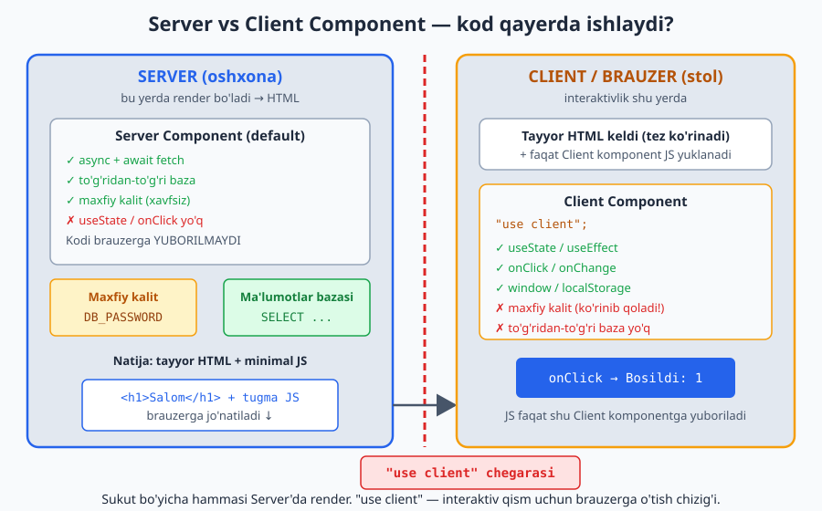
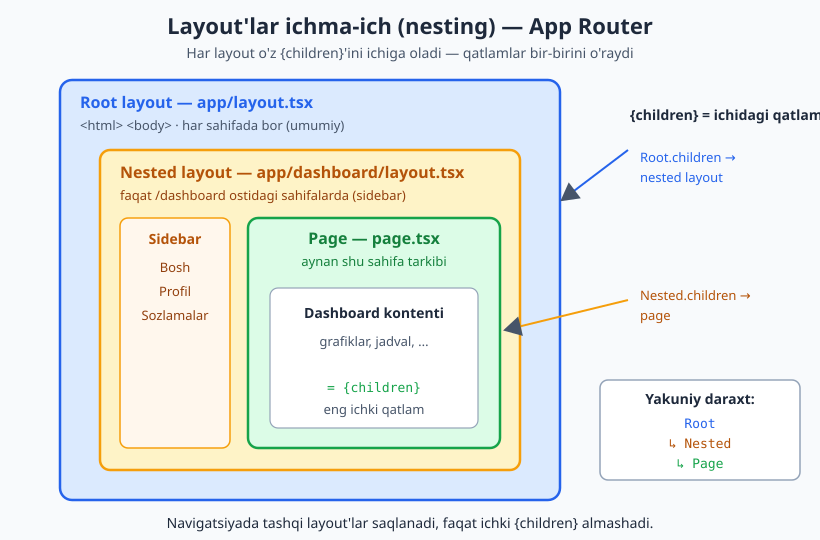
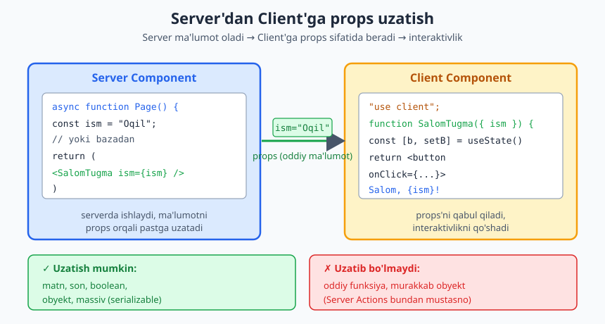
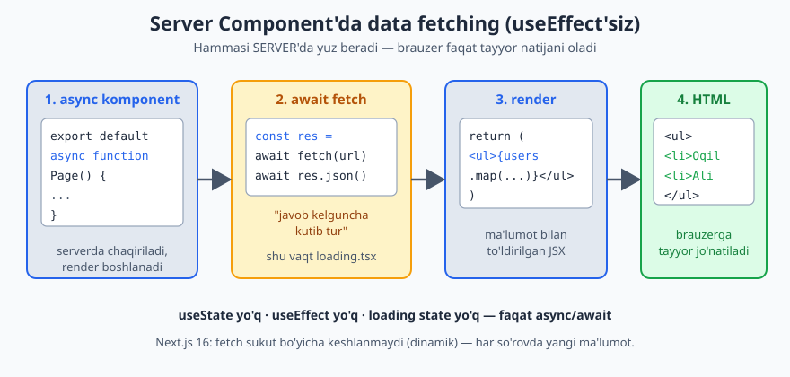

# Next.js — 0 dan Expert darajagacha (2-QISM)

📚 [README](./README.md) · [← 1-qism — Asoslar](./Nextjs-0-dan-Expert-1-qism.md) · [Keyingi: 3-qism — Full-stack →](./Nextjs-0-dan-Expert-3-qism.md)

> **Eslatma:** Bu — qo'llanmaning 2-qismi. 1-qismda JavaScript, React asoslari, Next.js loyihasi va routing'ni o'rgangan edingiz. Agar ularni hali ko'rmagan bo'lsangiz — avval 1-qismni tugating. Bu qism uning ustiga quriladi.
>
> **Versiya:** Next.js **16**, React 19. Node.js **20.9+**.

---

## 📚 Bu qismda nimalarni o'rganamiz

1-qism — "sahifa yasash" haqida edi. 2-qism — "**haqiqiy ilova yasash**" haqida. Ya'ni serverdan ma'lumot olish, formalar, ma'lumotni saqlash. Mana rejasi:

- **5-bob. Server Components va Client Components** — 1-qismdagi sirli `"use client"`ning javobi. Eng muhim mavzu.
- **6-bob. Ma'lumot olish (Data Fetching)** — serverdan real ma'lumotni sahifaga olib kelish.
- **7-bob. Server Actions** — formalar, ma'lumotni serverga saqlash (login, ro'yxatdan o'tish, qo'shish/o'chirish).
- **8-bob. Keshlash (Caching)** — saytni tez qilish, Next.js 16'ning yangi `"use cache"` modeli.

> **Maslahat:** Bu qism 1-qismdan biroz qiyinroq. Shoshilmang, kod misollarini o'zingiz yozib ko'ring va masalalarni yeching.

---
---

# 5-BOB. Server Components va Client Components

Bu — zamonaviy Next.js'ning eng muhim va eng ko'p chalkashtiradigan tushunchasi. 1-qismda bir necha bor `"use client"` yozgan edingiz, lekin "bu nima?" degan savol javobsiz qoldi. Mana endi to'liq ochamiz. Bu bobni puxta tushunsangiz, qolgani osonlashadi.

## 5.1. Muammo: kod qayerda ishlaydi?

Esingizdami, 1-qismda **frontend** (brauzerda ishlaydigan qism) va **backend** (serverda ishlaydigan qism) bor edi?

Klassik React'da **hamma kod brauzerda** ishlardi. Bu 2 ta muammo tug'dirardi:
1. **Sekin:** Brauzer avval bo'sh sahifa oladi, keyin JavaScript yuklaydi, keyin ishga tushiradi, keyin ma'lumot oladi. Foydalanuvchi kutib o'tiradi.
2. **Xavfsizlik:** Ma'lumotlar bazasi paroli, maxfiy kalitlar — bularni brauzerda ishlatib bo'lmaydi (har kim ko'rib oladi).

**Next.js yechimi:** kodning bir qismini **serverda**, bir qismini **brauzerda** ishlatish. Shu maqsadda 2 xil komponent bor:
- **Server Component** — serverda ishlaydi.
- **Client Component** — brauzerda ishlaydi.

## 5.2. Restoran analogiyasi (eng oson tushunish yo'li)

Restoranni eslang:

- **Oshxona (Server Component)** — taom shu yerda tayyorlanadi. Oshxonada xolodilnik (ma'lumotlar bazasi), maxfiy retseptlar (maxfiy kalitlar) bor. Mijoz oshxonani **ko'rmaydi**. Oshxona faqat **tayyor taomni** (HTML'ni) zalga jo'natadi.
- **Stol (Client Component)** — mijoz shu yerda **o'tiradi va ta'sir o'tkazadi**: tugma bosadi, qo'shimcha tuz so'raydi, likopchalarni suradi. Bu yerda interaktivlik bor.

**Asosiy g'oya:**
- Taom tayyorlash, xolodilnikka kirish — **oshxonada** (Server Component).
- Tugma bosish, animatsiya, foydalanuvchi bilan jonli muloqot — **stolda** (Client Component).

> Oshxonada tugma bosib bo'lmaydi (mijoz u yerda yo'q). Stolda esa taom pishirib bo'lmaydi (u yerda pechka yo'q). Har birining o'z vazifasi bor.

## 5.3. Server Component — sukut bo'yicha (default)

**Muhim:** Next.js'da har bir komponent **avtomatik ravishda Server Component** hisoblanadi. Hech narsa yozmasangiz — u serverda ishlaydi. 1-qismda yozgan barcha sahifalaringiz aslida Server Component edi!

**Server Component nima qila oladi:**
- ✅ `async` bo'lishi va `await` bilan to'g'ridan-to'g'ri ma'lumot olishi (6-bobda ko'ramiz)
- ✅ Ma'lumotlar bazasiga to'g'ridan-to'g'ri murojaat qilishi
- ✅ Maxfiy kalitlardan foydalanishi (brauzerga sizib chiqmaydi)
- ✅ Kichikroq sayt (uning kodi brauzerga **yuborilmaydi** — shuning uchun tez)

**Server Component nima qila OLMAYDI:**
- ❌ `useState`, `useEffect` kabi hook'lar ishlatish
- ❌ `onClick`, `onChange` kabi hodisalar
- ❌ Brauzer narsalari: `window`, `localStorage`
- ❌ Foydalanuvchi bilan jonli muloqot (interaktivlik)

```tsx
// app/page.tsx — bu SERVER COMPONENT (hech narsa yozmadik)
export default function Home() {
  return <h1>Bu serverda tayyorlangan sahifa</h1>;
}
```

## 5.4. Client Component — `"use client"` bilan

Agar komponentga **interaktivlik** kerak bo'lsa (tugma, forma, state), uni **Client Component** qilamiz. Buning uchun faylning **eng yuqorisiga** `"use client"` yozamiz.

```tsx
"use client"; // ← Bu qator faylning ENG BOSHIDA bo'lishi shart!

import { useState } from "react";

export default function Hisoblagich() {
  const [son, setSon] = useState(0);

  return (
    <button onClick={() => setSon(son + 1)}>
      Bosildi: {son}
    </button>
  );
}
```

**Mana endi 1-qismdagi sirning javobi:** `useState`, `onClick`, `useRouter` — bularning hammasi **interaktiv** narsalar. Ular faqat brauzerda (Client Component'da) ishlaydi. Shuning uchun ularni ishlatadigan har bir fayl yuqorisiga `"use client"` yozish kerak edi.

Quyidagi diagramma bu bobning eng muhim g'oyasini bir rasmda jamlaydi — kod qayerda ishlaydi va `"use client"` chegarasi nimani anglatadi:



**Client Component nima qila oladi:**
- ✅ `useState`, `useEffect` va boshqa hook'lar
- ✅ `onClick`, `onChange` hodisalar
- ✅ Brauzer narsalari: `window`, `localStorage`
- ✅ Foydalanuvchi bilan jonli muloqot

**Client Component nima qila OLMAYDI:**
- ❌ `async` komponent bo'lishi (to'g'ridan-to'g'ri `await` qilolmaydi)
- ❌ Ma'lumotlar bazasiga to'g'ridan-to'g'ri murojaat
- ❌ Maxfiy kalitlardan foydalanish (brauzerda ko'rinib qoladi!)

## 5.5. Qaysi birini qachon ishlatish kerak?

Oddiy qoida:

> **Sukut bo'yicha Server Component ishlating. Faqat interaktivlik kerak bo'lganda Client Component'ga o'ting.**

**Server Component (default) ishlating, agar:**
- Faqat ma'lumot ko'rsatyapsiz (matn, ro'yxat, kartochka)
- Serverdan/bazadan ma'lumot olyapsiz
- Maxfiy kalit ishlatyapsiz

**Client Component (`"use client"`) ishlating, agar:**
- Tugma, forma kabi interaktiv narsa bor
- `useState`, `useEffect` kerak
- Sichqoncha/klaviatura hodisalari kerak
- Brauzer xususiyatlari (`localStorage`, `window`) kerak

**Belgilar — qaysi xato chiqsa:**
- "`useState` only works in a Client Component" → faylga `"use client"` qo'shing.
- "async/await is not supported in Client Components" → `"use client"`ni olib tashlang yoki ma'lumot olishni boshqa joyga ko'chiring.

## 5.6. Eng muhim pattern: ikkalasini birga ishlatish

Real loyihada **ko'pchilik komponent Server, ozchilik Client** bo'ladi. Maslahat: **interaktiv qismni kichik alohida Client Component qiling**, qolgan hammasini Server qoldiring.

> Restoranda: butun restoran "oshxona" emas. Faqat kichik stollar — interaktiv. Qolgani — oshxona.

**Misol.** Mahsulot sahifasi: ma'lumot (Server) + "Savatga qo'shish" tugmasi (Client).

```tsx
// app/products/[id]/AddToCartButton.tsx — KICHIK Client Component
"use client";

import { useState } from "react";

export default function AddToCartButton() {
  const [qoshildi, setQoshildi] = useState(false);

  return (
    <button onClick={() => setQoshildi(true)}>
      {qoshildi ? "✓ Savatga qo'shildi" : "Savatga qo'shish"}
    </button>
  );
}
```

```tsx
// app/products/[id]/page.tsx — Server Component (default)
import AddToCartButton from "./AddToCartButton";

export default async function ProductPage({
  params,
}: {
  params: Promise<{ id: string }>;
}) {
  const { id } = await params; // Next.js 16 — async params

  return (
    <div className="p-8">
      <h1>Mahsulot #{id}</h1>
      <p>Bu mahsulot tavsifi (serverda tayyorlandi)</p>

      {/* Kichik interaktiv qismni shu yerga joylaymiz */}
      <AddToCartButton />
    </div>
  );
}
```

Bu yerda:
- Sahifaning o'zi — Server Component (ma'lumotni serverda tayyorlaydi, tez).
- Faqat tugma — Client Component (interaktiv).

> **Server Component, Client Component'ni ichiga olishi mumkin** (yuqoridagi kabi). Lekin teskarisi — Client Component ichida Server Component'ni `import` qilib bo'lmaydi. (Lekin Client Component, Server Component'ni `children` orqali qabul qila oladi — bu ilg'or mavzu, hozir kerak emas.)

Aynan shu `children` orqali ichma-ich joylashish App Router'da layout'larda ham ishlaydi: 1-qismda ko'rgan `layout.tsx`'lar bir-birini o'rab, eng ichkarisida `page.tsx` turadi. Quyidagi diagramma bu qatlamlarni ko'rsatadi:



## 5.7. Ma'lumotni Server'dan Client'ga uzatish — props orqali

Server Component'da ma'lumot olib, uni Client Component'ga **props** orqali berishingiz mumkin:

```tsx
// Server Component
export default async function Page() {
  const ism = "Oqil"; // (yoki bazadan olingan ma'lumot)
  return <SalomTugma ism={ism} />;
}
```

```tsx
// Client Component
"use client";
import { useState } from "react";

export default function SalomTugma({ ism }: { ism: string }) {
  const [bosildi, setBosildi] = useState(false);
  return (
    <button onClick={() => setBosildi(true)}>
      {bosildi ? `Salom, ${ism}!` : "Bosing"}
    </button>
  );
}
```

> **Qoida:** Server'dan Client'ga faqat **oddiy ma'lumot** (matn, son, obyekt, massiv) uzatish mumkin. Funksiya yoki murakkab narsalarni emas (Server Actions bundan mustasno — 7-bobda).

Mana shu props oqimi rasmda:



---

## ✍️ 5-BOB MASALALARI (20 ta)

> Bularni 1-qismda yaratgan loyihada yoki yangi loyihada bajaring.

**Tushunish savollari (1–7):**
1. O'z so'zlaringiz bilan: Server Component va Client Component farqi nima?
2. Restoran misolida oshxona — qaysi komponent? Stol-chi?
3. Next.js'da hech narsa yozmasangiz, komponent qaysi turda bo'ladi?
4. `"use client"` qayerga yoziladi va u nimani anglatadi?
5. Nega maxfiy kalitni Client Component'da ishlatib bo'lmaydi?
6. Server Component nega tezroq (brauzerga nima yuborilmaydi)?
7. Quyidagilarning qaysi biri Client Component talab qiladi: (a) matn ko'rsatish, (b) tugma bosish, (c) bazadan o'qish, (d) `useState`?

**Amaliy (8–16):**
8. Oddiy Server Component sahifa yarating — faqat matn ko'rsatsin (`"use client"`siz).
9. Hisoblagich Client Component yarating (`"use client"` + `useState` + tugma).
10. Client Component'ga "Kamaytirish" tugmasini qo'shing.
11. "Yashirish/Ko'rsatish" Client Component yarating (boolean state bilan).
12. Server Component sahifaga `const` o'zgaruvchi qo'shing va uni Client Component'ga props orqali bering.
13. Bir Server sahifaning ichida 1 ta Client tugma joylang (yuqoridagi pattern bo'yicha).
14. Client Component'da `useState` siz tugmaga `onClick={() => alert("Salom")}` qo'shing.
15. Server Component'ni `async` qiling va ichida `params`ni `await` qiling.
16. Input maydonli Client Component yarating — yozgan matn pastda ko'rinib tursin.

**Xatolarni tushunish (17–20):**
17. Server Component'ga `useState` qo'shib ko'ring. Qanday xato chiqdi? Uni tuzating.
18. Client Component'ni `async` qilib, ichida `await` ishlatib ko'ring. Xato chiqdimi?
19. `"use client"`ni faylning o'rtasiga yozing. Ishladimi? Nega?
20. Bir sahifada qaysi qism Server, qaysi qism Client bo'lishi kerakligini rejalashtiring: blog maqolasi (matn) + "Yoqdi" tugmasi (like).

> **Qo'shimcha challenge:** Mahsulot kartochkasi yasang: mahsulot nomi, narxi, tavsifi — Server Component'da. "Sevimlilarga qo'shish" (yurakcha) tugmasi — alohida Client Component. Tugma bosilganda yurakcha to'lsin (`useState`).

---
---

# 6-BOB. Ma'lumot olish (Data Fetching)

Endi eng qiziq qism boshlanadi: real ma'lumotni serverdan olib, sahifada ko'rsatish. Masalan, foydalanuvchilar ro'yxati, maqolalar, mahsulotlar.

## 6.1. Eski usul va yangi usul

Esingizdami, 1-qismda (2-bob) `useEffect` bilan ma'lumot olishni eslatib o'tgan edik? Klassik React'da shunday qilinardi:

```tsx
// ESKI USUL (klassik React) — chalkash va sekin
"use client";
import { useState, useEffect } from "react";

function UsersList() {
  const [users, setUsers] = useState([]);
  const [yuklanmoqda, setYuklanmoqda] = useState(true);

  useEffect(() => {
    fetch("https://jsonplaceholder.typicode.com/users")
      .then((res) => res.json())
      .then((data) => {
        setUsers(data);
        setYuklanmoqda(false);
      });
  }, []);

  if (yuklanmoqda) return <p>Yuklanmoqda...</p>;
  return <ul>{users.map((u) => <li key={u.id}>{u.name}</li>)}</ul>;
}
```

Ko'p kod, ko'p state, va sahifa avval bo'sh keladi, keyin ma'lumot to'ldiriladi (sekin, SEO yomon).

**Next.js'ning YANGI usuli** — Server Component'da to'g'ridan-to'g'ri `async`/`await`:

```tsx
// YANGI USUL (Next.js Server Component) — oddiy va tez
export default async function UsersList() {
  const res = await fetch("https://jsonplaceholder.typicode.com/users");
  const users = await res.json();

  return (
    <ul>
      {users.map((u: { id: number; name: string }) => (
        <li key={u.id}>{u.name}</li>
      ))}
    </ul>
  );
}
```

Farqni ko'ryapsizmi? **`useState` yo'q, `useEffect` yo'q, loading state yo'q.** Komponent oddiygina `async` bo'ladi va ma'lumotni `await` qiladi. Ma'lumot **serverda** olinadi, sahifa tayyor holatda brauzerga keladi — tez va SEO uchun zo'r.

Bu jarayonni bosqichma-bosqich ko'rsatadigan diagramma:



> **Bu mumkin, chunki Server Component serverda ishlaydi** (5-bobni eslang). Brauzerda `async` komponent bo'lmaydi, lekin serverda — bemalol.

## 6.2. `fetch` nima va `async/await` qanday ishlaydi

`fetch(url)` — internet/serverdan ma'lumot olib keladi. U **vaqt oladi**, shuning uchun `await` bilan kutamiz:

```tsx
const res = await fetch("https://api.example.com/data");
//          ↑ "javob kelguncha kutib tur"
const data = await res.json();
//           ↑ javobni o'qiladigan ma'lumotga aylantir
```

- `fetch(...)` — so'rov yuboradi, **javob (response)** qaytaradi.
- `res.json()` — javobni JavaScript obyekti/massiviga aylantiradi (bu ham vaqt oladi → `await`).

> **JSON nima?** Ma'lumot almashishning standart formati. Obyekt/massiv ko'rinishida: `{"name": "Oqil", "age": 25}`. Serverlar ma'lumotni shu ko'rinishda yuboradi.

**Mashq qilish uchun bepul API:** [jsonplaceholder.typicode.com](https://jsonplaceholder.typicode.com) — soxta foydalanuvchilar, maqolalar, izohlar beradi. Mashqlar uchun ideal.

## 6.3. Bitta elementni olish (dinamik sahifa bilan)

1-qismdagi dinamik sahifalarni (`[id]`) eslang. Ularni real ma'lumot bilan to'ldiramiz:

```tsx
// app/users/[id]/page.tsx
export default async function UserPage({
  params,
}: {
  params: Promise<{ id: string }>;
}) {
  const { id } = await params; // Next.js 16 — async params

  const res = await fetch(`https://jsonplaceholder.typicode.com/users/${id}`);
  const user = await res.json();

  return (
    <div className="p-8">
      <h1 className="text-2xl font-bold">{user.name}</h1>
      <p>Email: {user.email}</p>
      <p>Telefon: {user.phone}</p>
      <p>Shahar: {user.address?.city}</p>
    </div>
  );
}
```

`/users/1`ga kirsangiz — 1-foydalanuvchi, `/users/2` — 2-foydalanuvchi. URL'dagi `id` to'g'ridan-to'g'ri so'rovga ishlatildi.

## 6.4. Yuklanish holati — `loading.tsx`

Ma'lumot olish vaqt oladi. Foydalanuvchiga "Yuklanmoqda..." ko'rsatamiz. 1-qismda ko'rgan **`loading.tsx`** aynan shu uchun:

```tsx
// app/users/loading.tsx
export default function Loading() {
  return <p className="p-8">⏳ Foydalanuvchilar yuklanmoqda...</p>;
}
```

Next.js buni **avtomatik** ishlatadi: sahifa ma'lumot kutayotganda `loading.tsx` ko'rinadi, ma'lumot kelgach — asl sahifa. Hech qanday `useState` kerak emas! (Bu React'ning `Suspense` mexanizmi orqasida ishlaydi.)

## 6.5. Xatoni boshqarish — `error.tsx`

Server javob bermasa yoki xato bo'lsa, butun sayt "qulamasligi" kerak. 1-qismdagi **`error.tsx`** shu uchun:

```tsx
// app/users/error.tsx
"use client"; // error.tsx doim Client Component

export default function Error({
  error,
  reset,
}: {
  error: Error;
  reset: () => void;
}) {
  return (
    <div className="p-8">
      <h2>Ma'lumot yuklanmadi 😕</h2>
      <button onClick={() => reset()} className="mt-2 px-4 py-2 bg-blue-600 text-white rounded">
        Qayta urinish
      </button>
    </div>
  );
}
```

Sahifada xato chiqsa, Next.js avtomatik shu ekranni ko'rsatadi.

## 6.6. Bir nechta so'rovni parallel olish

Agar 2 xil ma'lumot kerak bo'lsa, ularni **birin-ketin emas, baravar** (parallel) olish tezroq:

```tsx
export default async function Dashboard() {
  // ❌ Sekin — birin-ketin (biri tugagach ikkinchisi):
  // const users = await fetch(".../users").then(r => r.json());
  // const posts = await fetch(".../posts").then(r => r.json());

  // ✅ Tez — baravar (Promise.all):
  const [usersRes, postsRes] = await Promise.all([
    fetch("https://jsonplaceholder.typicode.com/users"),
    fetch("https://jsonplaceholder.typicode.com/posts"),
  ]);
  const users = await usersRes.json();
  const posts = await postsRes.json();

  return (
    <div className="p-8">
      <p>Foydalanuvchilar soni: {users.length}</p>
      <p>Maqolalar soni: {posts.length}</p>
    </div>
  );
}
```

`Promise.all([...])` — bir nechta so'rovni baravar yuboradi, hammasi tugaguncha kutadi. Ikki marta tezroq.

## 6.7. Muhim: Next.js 16'da `fetch` keshlanmaydi

> **⚠️ Next.js 16 muhim o'zgarishi:** Avvalgi versiyalarda `fetch` natijasi **avtomatik keshlanardi** (saqlanardi). Next.js 16'da bu **o'zgardi** — `fetch` endi sukut bo'yicha **keshlanmaydi**, har safar yangi ma'lumot olinadi (dinamik).

Bu nima degani? Hozircha — har sahifa ochilganda yangi so'rov yuboriladi. Bu ko'p hollarda yaxshi (yangi ma'lumot). Lekin tez-tez o'zgarmaydigan ma'lumotni (masalan, blog maqolasi) **keshlash** (saqlab qo'yish) tezlikni oshiradi. Buni **8-bobda** (`"use cache"`) o'rganamiz.

Hozircha shuni biling: Next.js 16'da `fetch` → har safar yangi ma'lumot.

## 6.8. To'liq misol: foydalanuvchilar ro'yxati va detallari

Hamma narsani birlashtiramiz:

```tsx
// app/users/page.tsx — ro'yxat sahifasi
import Link from "next/link";

export default async function UsersPage() {
  const res = await fetch("https://jsonplaceholder.typicode.com/users");
  const users = await res.json();

  return (
    <div className="p-8">
      <h1 className="text-2xl font-bold mb-4">Foydalanuvchilar</h1>
      <ul className="space-y-2">
        {users.map((user: { id: number; name: string }) => (
          <li key={user.id}>
            <Link href={`/users/${user.id}`} className="text-blue-600 hover:underline">
              {user.name}
            </Link>
          </li>
        ))}
      </ul>
    </div>
  );
}
```

Ro'yxatdagi har bir ismga bossangiz — uning detallari sahifasiga (`/users/[id]`) o'tasiz. To'liq, real ishlaydigan ilova!

---

## ✍️ 6-BOB MASALALARI (21 ta)

> Mashqlarda [jsonplaceholder.typicode.com](https://jsonplaceholder.typicode.com) API'sidan foydalaning. Mavjud yo'llar: `/users`, `/posts`, `/comments`, `/todos`, `/albums`, `/photos`.

**Asosiy fetch (1–8):**
1. Server Component'da `/users`ni olib, ismlarni ro'yxatda chiqaring.
2. Shu ro'yxatda email'larni ham ko'rsating.
3. `/posts`ni olib, maqola sarlavhalarini (`title`) chiqaring.
4. `/todos`ni olib, faqat `title`larni ro'yxatda chiqaring.
5. `/users`ni olib, foydalanuvchilar **sonini** ko'rsating (`.length`).
6. Eski usul (`useEffect`) va yangi usul (`async` Server Component) farqini izohlang.
7. `fetch` va `res.json()` nima qilishini o'z so'zingiz bilan tushuntiring.
8. JSON nima? Misol keltiring.

**Dinamik sahifa bilan (9–14):**
9. `app/users/[id]/page.tsx` yaratib, bitta foydalanuvchi detallarini ko'rsating (`async params`!).
10. Detal sahifasiga telefon, shahar (`address.city`), kompaniya (`company.name`) qo'shing.
11. `/posts/[id]` sahifasi yarating — bitta maqola detallari (`title`, `body`).
12. `/users` ro'yxatidagi har bir ismga `<Link>` qo'yib, detal sahifasiga bog'lang.
13. `/posts` ro'yxatini detal sahifasiga bog'lang.
14. Detal sahifaga "Orqaga" linkini qo'shing (ro'yxatga qaytsin).

**Loading va Error (15–18):**
15. `/users` uchun `loading.tsx` yarating — "Yuklanmoqda..." ko'rsatsin.
16. `loading.tsx`ni chiroyli qiling (Tailwind bilan oddiy "skeleton" yoki spinner matni).
17. `/users` uchun `error.tsx` yarating ("Qayta urinish" tugmasi bilan).
18. Noto'g'ri URL'ga (`.../usersXXX`) so'rov yuborib, error ekranini sinab ko'ring.

**Ilg'or (19–21):**
19. `Promise.all` bilan `/users` va `/posts`ni baravar oling, ikkalasining sonini ko'rsating.
20. `/users` va `/todos`ni baravar olib, "X ta foydalanuvchi, Y ta vazifa" ko'rsating.
21. Bitta sahifada `/posts/1` maqolasini va uning izohlarini (`/posts/1/comments`) baravar oling va ikkalasini ko'rsating.

> **Qo'shimcha challenge:** To'liq **blog** yasang: `/blog` — maqolalar ro'yxati (`/posts`dan), har biri `/blog/[id]`ga link. `/blog/[id]` — maqola to'liq matni + o'sha maqola izohlari (`/posts/[id]/comments`). `loading.tsx` va `error.tsx` ham bo'lsin. Bu — haqiqiy, ishlaydigan blog!

---
---

# 7-BOB. Server Actions — ma'lumot yuborish va saqlash

Hozirgacha biz ma'lumotni faqat **o'qidik** (serverdan oldik). Endi teskarisini o'rganamiz: foydalanuvchidan ma'lumot olib, **serverga yuborish va saqlash**. Masalan: ro'yxatdan o'tish, login, izoh qoldirish, mahsulot qo'shish.

Bu uchun Next.js **Server Actions** beradi — bu juda kuchli xususiyat.

## 7.1. Muammo: forma ma'lumotini qayerga yuboramiz?

Klassik webda formani serverga yuborish murakkab edi: alohida API yozasiz, `fetch` bilan POST so'rov jo'natasiz, javobini kutasiz... Ko'p kod.

**Server Action** — bu **serverda ishlaydigan funksiya**, uni to'g'ridan-to'g'ri formaga ulaysiz. Alohida API yozish shart emas!

> Restoran misolida: avval mijoz oshxonaga borib, taom uchun buyurtmani o'zi yozib qoldirishi kerak edi. Endi esa stoldagi tugmani bossangiz, buyurtma **avtomatik** oshxonaga boradi.

## 7.2. Birinchi Server Action

`"use server"` direktivasi funksiyani Server Action qiladi. Eng yaxshi amaliyot — uni alohida faylga yozish:

```tsx
// app/actions.ts
"use server"; // ← Bu fayldagi barcha funksiyalar Server Action

export async function salomYuborish(formData: FormData) {
  const ism = formData.get("ism");
  console.log("Serverga keldi:", ism);
  // Bu yerda ma'lumotni bazaga saqlash mumkin
}
```

Endi uni formaga ulaymiz:

```tsx
// app/page.tsx — Server Component
import { salomYuborish } from "./actions";

export default function Home() {
  return (
    <form action={salomYuborish} className="p-8 space-y-2">
      <input
        type="text"
        name="ism"
        placeholder="Ismingiz"
        className="border p-2 rounded"
      />
      <button type="submit" className="px-4 py-2 bg-blue-600 text-white rounded">
        Yuborish
      </button>
    </form>
  );
}
```

**Tushuntirish:**
- `<form action={salomYuborish}>` — forma yuborilganda `salomYuborish` funksiyasi **serverda** ishlaydi.
- `formData.get("ism")` — `name="ism"` bo'lgan input qiymatini oladi.
- `"use server"` tufayli bu funksiya brauzerda emas, **serverda** ishlaydi — xavfsiz.

> **Diqqat:** `formData.get("ism")` ishlashi uchun input'da `name="ism"` bo'lishi **shart**. `name` yo'q bo'lsa — ma'lumot kelmaydi.

## 7.3. Server Action — nega kuchli?

- ✅ **Xavfsiz** — serverda ishlaydi, maxfiy kalit/parol ko'rinmaydi.
- ✅ **Oddiy** — alohida API yozish shart emas.
- ✅ **To'g'ridan-to'g'ri bazaga** — ma'lumotni bevosita saqlash mumkin.
- ✅ Next.js 16 ma'lumotni shifrlab yuboradi (qo'shimcha himoya).

> **Muhim xavfsizlik qoidasi:** Har bir Server Action ichida foydalanuvchi huquqini tekshiring (kim ekanini, ruxsati bor-yo'qligini). Forma faqat "kirgan foydalanuvchi" sahifasida ko'rinsa ham — baribir tekshiring. Hech qachon faqat "ko'rinmaydi" deb ishonmang.

## 7.4. Forma holatini boshqarish — `useActionState`

Yuqoridagi misolda forma yuborildi, lekin foydalanuvchi natijani ko'rmaydi. React 19'ning **`useActionState`** hook'i buni hal qiladi: u xato/muvaffaqiyat xabarini va "yuborilmoqda" holatini boshqaradi.

> **Eslatma:** `useActionState` — hook, shuning uchun u **Client Component** talab qiladi (`"use client"`). 5-bobni eslang: hook'lar faqat Client'da ishlaydi.

Avval Server Action'ni natija qaytaradigan qilamiz:

```tsx
// app/actions.ts
"use server";

export async function royxatdanOtish(oldingiHolat: any, formData: FormData) {
  const email = formData.get("email") as string;

  // Oddiy validatsiya (tekshiruv):
  if (!email || !email.includes("@")) {
    return { xato: "To'g'ri email kiriting" };
  }

  // ... bu yerda bazaga saqlash ...

  return { muvaffaqiyat: "Ro'yxatdan o'tdingiz!" };
}
```

> **Diqqat:** `useActionState` bilan ishlaganda, Server Action 2 ta argument oladi: `(oldingiHolat, formData)`. Birinchisi — oldingi qaytarilgan holat.

Endi Client Component'da formani yasaymiz:

```tsx
// app/RoyxatFormasi.tsx
"use client";

import { useActionState } from "react";
import { royxatdanOtish } from "./actions";

export default function RoyxatFormasi() {
  const [holat, formAction, yuborilmoqda] = useActionState(royxatdanOtish, null);

  return (
    <form action={formAction} className="p-8 space-y-2">
      <input
        type="email"
        name="email"
        placeholder="Email"
        className="border p-2 rounded"
      />
      <button
        type="submit"
        disabled={yuborilmoqda}
        className="px-4 py-2 bg-blue-600 text-white rounded disabled:opacity-50"
      >
        {yuborilmoqda ? "Yuborilmoqda..." : "Ro'yxatdan o'tish"}
      </button>

      {holat?.xato && <p className="text-red-600">{holat.xato}</p>}
      {holat?.muvaffaqiyat && <p className="text-green-600">{holat.muvaffaqiyat}</p>}
    </form>
  );
}
```

**`useActionState`ni qatorma-qator tushunamiz:**
```tsx
const [holat, formAction, yuborilmoqda] = useActionState(royxatdanOtish, null);
```
- `holat` — Server Action **qaytargan natija** (`{ xato: ... }` yoki `{ muvaffaqiyat: ... }`).
- `formAction` — formaga ulanadigan "o'ralgan" action (`<form action={formAction}>`).
- `yuborilmoqda` — `true`/`false` — hozir yuborilyaptimi? (tugmani vaqtincha o'chirish uchun).
- `royxatdanOtish` — bizning Server Action.
- `null` — boshlang'ich holat.

Endi: email noto'g'ri bo'lsa qizil xato, to'g'ri bo'lsa yashil xabar chiqadi, va yuborilayotganda tugma "Yuborilmoqda..." bo'lib o'chadi. Professional forma!

## 7.5. Ma'lumotni yangilash — `revalidatePath` va `revalidateTag`

Yangi izoh qo'shsangiz, u darrov ro'yxatda ko'rinishi kerak. Lekin Next.js sahifani keshlab qo'ygan bo'lishi mumkin (8-bobda tushunamiz). Saqlangandan keyin sahifani **yangilash** uchun:

```tsx
// app/actions.ts
"use server";

import { revalidatePath } from "next/cache";

export async function izohQoshish(formData: FormData) {
  const matn = formData.get("matn") as string;

  // ... izohni bazaga saqlash ...

  revalidatePath("/izohlar"); // ← /izohlar sahifasini yangila
}
```

`revalidatePath("/izohlar")` — Next.js'ga "bu sahifaning keshini tashlab, yangi ma'lumotni ko'rsat" deydi. Endi yangi izoh darrov ko'rinadi.

> `revalidateTag(...)` ham bor — u aniqroq, faqat ma'lum belgilangan ma'lumotni yangilaydi. Buni 8-bobda `cacheTag` bilan birga ko'ramiz.

## 7.6. Boshqa sahifaga o'tkazish — `redirect`

Login muvaffaqiyatli bo'lsa, foydalanuvchini boshqa sahifaga o'tkazish kerak. Server Action ichida `redirect` ishlatamiz:

```tsx
// app/actions.ts
"use server";

import { redirect } from "next/navigation";

export async function login(formData: FormData) {
  const email = formData.get("email") as string;
  const parol = formData.get("parol") as string;

  // ... parolni tekshirish ...

  redirect("/dashboard"); // ← muvaffaqiyatdan keyin dashboard'ga o'tkaz
}
```

> **Esda tuting:** Server Action ichida `redirect` (`next/navigation`dan), Client Component ichida esa `useRouter().push(...)` (1-qism, 4-bobni eslang). Ikkalasi turli joyda ishlaydi.

## 7.7. To'liq misol: oddiy "fikr-mulohaza" formasi

Hamma narsani birlashtiramiz:

```tsx
// app/actions.ts
"use server";

export async function fikrYuborish(oldingi: any, formData: FormData) {
  const ism = formData.get("ism") as string;
  const fikr = formData.get("fikr") as string;

  if (!ism || ism.length < 2) {
    return { xato: "Ismingizni to'liq kiriting" };
  }
  if (!fikr || fikr.length < 5) {
    return { xato: "Fikringiz juda qisqa" };
  }

  // ... bazaga saqlash (3-qismda ko'ramiz) ...
  console.log("Yangi fikr:", { ism, fikr });

  return { muvaffaqiyat: `Rahmat, ${ism}! Fikringiz qabul qilindi.` };
}
```

```tsx
// app/FikrFormasi.tsx
"use client";

import { useActionState } from "react";
import { fikrYuborish } from "./actions";

export default function FikrFormasi() {
  const [holat, action, yuborilmoqda] = useActionState(fikrYuborish, null);

  return (
    <form action={action} className="max-w-md p-8 space-y-3">
      <input name="ism" placeholder="Ismingiz" className="w-full border p-2 rounded" />
      <textarea name="fikr" placeholder="Fikringiz" className="w-full border p-2 rounded" />
      <button
        type="submit"
        disabled={yuborilmoqda}
        className="px-4 py-2 bg-blue-600 text-white rounded disabled:opacity-50"
      >
        {yuborilmoqda ? "Yuborilmoqda..." : "Yuborish"}
      </button>

      {holat?.xato && <p className="text-red-600">{holat.xato}</p>}
      {holat?.muvaffaqiyat && <p className="text-green-600">{holat.muvaffaqiyat}</p>}
    </form>
  );
}
```

Bu — to'liq ishlaydigan, validatsiyali, holat ko'rsatadigan professional forma. Tabriklaymiz!

---

## ✍️ 7-BOB MASALALARI (22 ta)

**Asosiy Server Actions (1–8):**
1. `"use server"` bilan `actions.ts` fayli yarating va ichida bir funksiya yozing.
2. Bitta input'li forma yarating (`name="ism"`), Server Action `console.log` qilsin.
3. Server Action'da `formData.get(...)` bilan 2 ta maydon (`ism`, `email`) oling.
4. `name` atributini olib tashlab ko'ring — ma'lumot keldimi? Nega?
5. Server Action'ni `redirect("/rahmat")` bilan tugatib, o'sha sahifani yarating.
6. `"use server"` qaysi joyga yoziladi va nimani anglatadi? Izohlang.
7. Nega Server Action xavfsiz (parol/kalit ko'rinmaydi)? Tushuntiring.
8. Server Action va Server Component farqi nima? (Diqqat: bir-biriga o'xshash atamalar!)

**useActionState (9–16):**
9. Server Action'ni `(oldingi, formData)` ko'rinishida yozing, natija qaytarsin.
10. `useActionState` bilan Client forma yarating, natijani ekranda ko'rsating.
11. Validatsiya qo'shing: email'da `@` bo'lmasa, qizil xato chiqsin.
12. Muvaffaqiyatda yashil xabar chiqaring (`{ muvaffaqiyat: ... }`).
13. `yuborilmoqda` (pending) bilan tugmani "Yuborilmoqda..." qiling va `disabled` qiling.
14. Bir nechta maydonni tekshiring (ism bo'sh emas, email to'g'ri, parol 6+ belgi).
15. Har bir maydon uchun **alohida** xato xabari qaytaring (`{ xatolar: { email: ..., parol: ... } }`).
16. Formaga `textarea` qo'shib, uzunligini tekshiring (kamida 10 belgi).

**Yangilash va to'liq loyiha (17–22):**
17. `revalidatePath` nima qiladi? Qachon kerak bo'ladi? Izohlang.
18. Server Action ichida ma'lumotni `console.log` qilib, terminalda ko'ringanini tasdiqlang (server logi).
19. `redirect` (Server Action) va `useRouter().push` (Client) farqini ayting.
20. To'liq "Aloqa formasi" yasang: ism, email, xabar + validatsiya + holat xabari + pending.
21. "Login formasi" yasang: email + parol. Bo'sh bo'lsa xato, to'g'ri bo'lsa `redirect("/dashboard")`.
22. Forma yuborilgach, `holat` orqali "✓ Yuborildi" ko'rsatib, inputlarni tozalashga harakat qiling.

> **Qo'shimcha challenge:** Sodda **"mehmonlar kitobi" (guestbook)** yasang: forma orqali ism + xabar yuboriladi. Yuborilgan xabarlar pastda ro'yxatda ko'rinadi (hozircha oddiy massivda yoki `console.log`; haqiqiy saqlash 3-qismda bazaga o'tganda bo'ladi). Validatsiya va holat xabari bo'lsin.

---
---

# 8-BOB. Keshlash (Caching) va `"use cache"`

Mana ilg'or, lekin juda muhim mavzu. **Keshlash (caching)** — saytni **tez** qilishning asosiy usuli. Bu bob biroz qiyinroq, lekin tushunsangiz — saytlaringiz "uchadigan" bo'ladi.

## 8.1. Keshlash nima va nega kerak?

**Kesh (cache)** — bir marta tayyorlangan natijani **saqlab qo'yish**, keyin uni qayta-qayta ishlatish.

> **Misol:** Onangiz har kuni bir xil osh damlaydi. Har gal noldan retsept o'ylab topmaydi — bir marta yodlagan, keyin shuni takrorlaydi. **Yodlangan retsept — bu kesh.**

Saytda: ma'lumotni har safar serverdan/bazadan olish **vaqt oladi**. Agar ma'lumot tez-tez o'zgarmasa (masalan, blog maqolasi), uni **bir marta olib, saqlab qo'yamiz**. Keyingi foydalanuvchilarga saqlangandan beramiz — **bir necha barobar tez**.

**Foydalari:**
- ⚡ Sayt tezroq ochiladi.
- 💰 Server/baza kamroq ishlaydi (xarajat kamayadi).
- 😊 Foydalanuvchi mamnun.

## 8.2. Next.js 16'ning yangi modeli: "sukut bo'yicha dinamik"

> **⚠️ Bu Next.js 16'ning eng katta o'zgarishi.** Eski versiyalarda (14 va undan oldin) sahifalar **avtomatik keshlanardi**. Bu chalkash edi — ba'zan eski ma'lumot ko'rsatilib qolardi.
>
> **Next.js 16'da:** sukut bo'yicha hech narsa keshlanmaydi (**dinamik** — har safar yangi). Keshlash kerak bo'lsa, **o'zingiz aniq belgilaysiz**. Bu "opt-in" (ixtiyoriy yoqish) model deyiladi.

Ya'ni:
- **Default:** har sahifa har ochilganda — yangi ma'lumot (6-bobda shunday edi).
- **Keshlash kerak bo'lsa:** `"use cache"` direktivasini qo'shasiz.

## 8.3. Keshlashni yoqish — `cacheComponents`

`"use cache"`dan foydalanish uchun avval uni sozlamada yoqamiz:

```ts
// next.config.ts
import type { NextConfig } from "next";

const nextConfig: NextConfig = {
  cacheComponents: true, // ← keshlashni yoqdik
};

export default nextConfig;
```

(Sozlamani o'zgartirgach, dev serverni qayta ishga tushiring: `Ctrl+C`, keyin `npm run dev`.)

## 8.4. `"use cache"` — natijani saqlash

Endi keshlamoqchi bo'lgan funksiya/komponent yuqorisiga `"use cache"` yozamiz:

```tsx
// app/blog/page.tsx
export default async function BlogPage() {
  const maqolalar = await maqolalarniOl();
  return (
    <ul>
      {maqolalar.map((m: any) => <li key={m.id}>{m.title}</li>)}
    </ul>
  );
}

async function maqolalarniOl() {
  "use cache"; // ← bu funksiya natijasi keshlanadi (saqlanadi)
  const res = await fetch("https://jsonplaceholder.typicode.com/posts");
  return res.json();
}
```

Endi `maqolalarniOl()` natijasi **saqlanadi**. Birinchi foydalanuvchi ma'lumotni serverdan oladi, keyingilar — saqlangandan (tez).

> `"use cache"`ni butun sahifa (`page.tsx`) yuqorisiga ham, alohida funksiyaga ham, alohida komponentga ham qo'yish mumkin.

## 8.5. Kesh muddati — `cacheLife`

Kesh **abadiy** saqlanmasligi kerak — aks holda ma'lumot eskirib qoladi. `cacheLife` bilan "qancha muddat saqlansin" deymiz:

```tsx
import { cacheLife } from "next/cache";

async function maqolalarniOl() {
  "use cache";
  cacheLife("hours"); // ← soatlab saqla, keyin yangila
  const res = await fetch("https://jsonplaceholder.typicode.com/posts");
  return res.json();
}
```

**Tayyor muddat profillari:**

| Profil | Ma'nosi |
|---|---|
| `"seconds"` | bir necha soniya (tez o'zgaradigan ma'lumot) |
| `"minutes"` | daqiqalar |
| `"hours"` | soatlar (masalan, yangiliklar) |
| `"days"` | kunlar (masalan, blog) |
| `"weeks"` | haftalar |
| `"max"` | juda uzoq (deyarli o'zgarmaydigan ma'lumot) |

O'z muddatingizni ham berishingiz mumkin:
```tsx
cacheLife({ revalidate: 3600 }); // har 3600 soniya (1 soat) da yangila
```

> **Tanlash:** Ma'lumot qanchalik tez o'zgarsa — shunchalik qisqa muddat. Narxlar — `minutes`. Blog — `days`. "Biz haqimizda" sahifasi — `max`.

## 8.6. Aniq nishonli yangilash — `cacheTag` va `revalidateTag`

Faraz qiling, bitta maqolani tahrirladingiz. Butun keshni tashlash shart emas — faqat **o'sha maqolaning** keshini yangilash kerak. Buning uchun keshga **belgi (tag)** qo'yamiz:

```tsx
import { cacheLife, cacheTag } from "next/cache";

async function maqolaOl(id: string) {
  "use cache";
  cacheLife("days");
  cacheTag(`maqola-${id}`); // ← bu keshga belgi qo'ydik
  const res = await fetch(`https://jsonplaceholder.typicode.com/posts/${id}`);
  return res.json();
}
```

Endi o'sha maqola o'zgarganda (masalan, Server Action'da tahrirlanganda), faqat shu belgili keshni yangilaymiz:

```tsx
// app/actions.ts
"use server";

import { revalidateTag } from "next/cache";

export async function maqolaTahrirlash(id: string, yangiMatn: string) {
  // ... bazada maqolani yangilash ...

  revalidateTag(`maqola-${id}`); // ← faqat shu maqola keshini yangila
}
```

**Farqi:**
- `revalidatePath("/blog")` — butun `/blog` sahifa keshini tashlaydi (qo'pol).
- `revalidateTag("maqola-5")` — faqat 5-maqola keshini yangilaydi (aniq, samaraliroq).

> **Eslatma:** Next.js 16'da `revalidateTag`'ning yangi ko'rinishi bor: `revalidateTag("maqola-5", "max")` (ikkinchi argument — muddat profili). Faqat bitta argument bilan ishlatish (`revalidateTag("maqola-5")`) eskirgan deb ogohlantirish berishi mumkin.

## 8.7. `updateTag` — "men hozirgina o'zgartirdim, darrov ko'rsat"

Yana bir foydali narsa: `updateTag`. Foydalanuvchi biror narsani tahrirlasa va **o'zgarishni darrov** ko'rishi kerak bo'lsa (kutmasdan):

```tsx
// app/actions.ts
"use server";

import { updateTag } from "next/cache";

export async function profilYangilash(userId: string, malumot: any) {
  // ... bazada profilni yangilash ...

  updateTag(`user-${userId}`); // ← keshni darrov tozala va yangi ma'lumotni ko'rsat
}
```

**`revalidateTag` va `updateTag` farqi:**
- `revalidateTag` — keshni "eskirgan" deb belgilaydi, fonda yangilanadi (boshqalar uchun).
- `updateTag` — keshni **darrov** tozalaydi va yangi ma'lumotni ko'rsatadi (o'zgartirgan foydalanuvchi uchun ideal).

## 8.8. MUHIM: dev va production'da kesh boshqacha ishlaydi

> **⚠️ Eng ko'p uchraydigan chalkashlik:** Keshlash `npm run dev` (ishlab chiqish rejimi) va haqiqiy ishlab turgan sayt (production) da **boshqacha** ishlaydi.

Keshni to'g'ri sinash uchun **production rejimida** tekshiring:
```bash
npm run build   # loyihani "ishlab chiqarish" uchun tayyorlaydi
npm run start   # production rejimida ishga tushiradi
```

`npm run dev`da kesh ko'pincha o'chirib turiladi (har o'zgarishni ko'rishingiz uchun). Shuning uchun "kesh ishlamayapti" deb o'ylamang — production'da sinang.

## 8.9. Amaliy strategiya (qachon nima qilish)

Boshlovchi uchun oddiy qoidalar:

1. **Boshda hech narsani keshlamang.** Default (dinamik) bilan boshlang — to'g'ri ishlasin.
2. **Sekin yoki tez-tez ochiladigan sahifani keshlang:** bosh sahifa, blog, "biz haqimizda" — `"use cache"` + `cacheLife`.
3. **Tez o'zgaradigan ma'lumotni keshlamang yoki qisqa keshlang:** savat, bildirishnomalar, real-time hisoblar.
4. **Ma'lumot o'zgarganda yangilang:** Server Action'da `revalidateTag`/`revalidatePath`.
5. **Doim production'da sinang** (`build` + `start`).

> **Eslatma:** Keshlash — chuqur mavzu va tajriba bilan o'rganiladi. Hozir asoslarni tushunsangiz yetadi. Real loyihalarda ishlab, sekin ustasi bo'lasiz.

---

## ✍️ 8-BOB MASALALARI (20 ta)

> Bu bob ilg'or — masalalarning bir qismi amaliy, bir qismi tushunishga qaratilgan. Amaliy mashqlar uchun keshlashni yoqing (`cacheComponents: true`).

**Tushunish (1–8):**
1. Kesh nima? Onaning osh retsepti misolida tushuntiring.
2. Keshlashning 3 ta foydasini ayting.
3. Next.js 16 va eski versiyalarda keshlash farqi nima?
4. "Sukut bo'yicha dinamik" nima degani?
5. `"use cache"` qayerga yoziladi va nima qiladi?
6. `cacheLife` nima uchun kerak? Agar muddat bermasak nima bo'ladi (ma'lumot eskirsa)?
7. `revalidatePath` va `revalidateTag` farqi nima?
8. `revalidateTag` va `updateTag` farqi nima?

**Amaliy (9–16):**
9. `next.config.ts`da `cacheComponents: true` qo'shing va dev serverni qayta ishga tushiring.
10. `/posts`ni oladigan funksiyani `"use cache"` bilan keshlang.
11. Unga `cacheLife("hours")` qo'shing.
12. `cacheLife`da `minutes`, `days`, `max` profillarini sinab ko'ring.
13. `cacheLife({ revalidate: 60 })` bilan o'z muddatingizni bering.
14. Bitta maqola funksiyasiga `cacheTag(\`maqola-${id}\`)` qo'shing.
15. Server Action yarating — `revalidateTag(...)` bilan o'sha maqola keshini yangilasin.
16. `npm run build` va `npm run start` bilan production rejimida ishga tushiring.

**Strategiya (17–20):**
17. Quyidagilardan qaysi birini keshlash kerak, qaysi birini yo'q: (a) "biz haqimizda", (b) foydalanuvchi savati, (c) blog maqolasi, (d) real-vaqt narx kursi? Izohlang.
18. Blog maqolasi uchun qaysi `cacheLife` profili to'g'ri? Narxlar sahifasi uchun-chi?
19. Nega keshni production'da sinash kerak, dev'da emas?
20. O'z so'zingiz bilan: "opt-in keshlash" qoidasini amaliy strategiya sifatida yozing (3-4 qadam).

> **Qo'shimcha challenge:** 6-bobda yasagan blog loyihangizni oling. Maqolalar ro'yxati va har bir maqolani `"use cache"` + `cacheLife("days")` + `cacheTag(...)` bilan keshlang. Keyin Server Action yarating, u `revalidateTag` bilan kerakli maqolani yangilasin. `build` + `start` bilan production'da sinang va tezlik farqini sezing.

---
---

# 🎯 2-QISM YAKUNI

Zo'r ish! Endi sizda Next.js'ning eng muhim "haqiqiy ilova" ko'nikmalari bor:

✅ **Server va Client Components** farqini tushunasiz va to'g'ri ishlatasiz (`"use client"` siri ochildi!)
✅ **Serverdan ma'lumot olasiz** — `async` Server Component'da, `useEffect`siz, oddiy va tez
✅ **`loading.tsx` va `error.tsx`** bilan yuklanish va xatoni boshqarasiz
✅ **Server Actions** bilan forma yuborib, ma'lumotni serverga saqlaysiz (validatsiya + `useActionState`)
✅ **Keshlash** asoslarini bilasiz — `"use cache"`, `cacheLife`, `cacheTag`, `revalidateTag`

Bu — haqiqiy, dinamik veb-ilova yasash uchun yetarli poydevor. Hali bitta katta narsa yetishmaydi: **doimiy ma'lumotni saqlash** (ma'lumotlar bazasi). Hozir `console.log` qilgan ma'lumotlar yo'qolib ketadi — 3-qismda ularni haqiqiy bazaga saqlashni o'rganamiz.

## Keyingi qadam: 3-QISM nimani o'z ichiga oladi?

- **Route Handlers (API)** — tashqi dasturlar (mobil ilova, boshqa saytlar) uchun API yaratish
- **Ma'lumotlar bazasi** — ma'lumotni haqiqatda saqlash (PostgreSQL/MySQL, Prisma yoki Drizzle ORM bilan)
- **Autentifikatsiya** — to'liq login/register tizimi, sessiyalar, himoyalangan sahifalar
- **Validatsiya (Zod)**, fayl yuklash, xavfsizlik amaliyotlari

> **Maslahat:** 3-qismga o'tishdan oldin, bu qismdagi "blog" va "guestbook" challenge'larini bajaring. Server Components, data fetching va Server Actions'ni amaliyotda mustahkamlang — keyin baza qo'shganda hammasi joyiga tushadi.

---

*Bu — "Next.js 0 dan Expert darajagacha" qo'llanmasining 2-qismi.*

---

📚 [README](./README.md) · [← 1-qism — Asoslar](./Nextjs-0-dan-Expert-1-qism.md) · [Keyingi: 3-qism — Full-stack →](./Nextjs-0-dan-Expert-3-qism.md)
