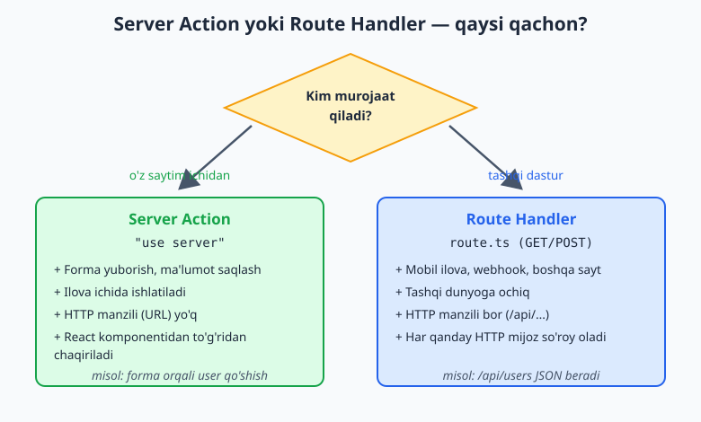
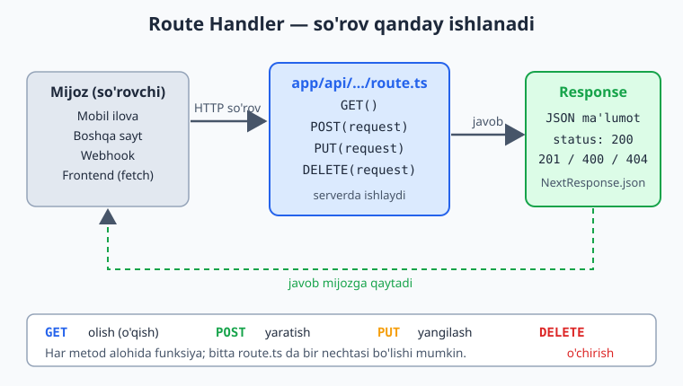
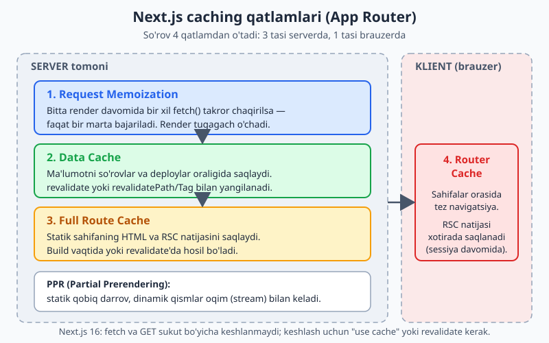

# Next.js — 0 dan Expert darajagacha (3-QISM)

📚 [README](./README.md) · [← 2-qism — Server & Actions](./Nextjs-0-dan-Expert-2-qism.md) · [Keyingi: 4-qism — Production →](./Nextjs-0-dan-Expert-4-qism.md)

> **Eslatma:** Bu — qo'llanmaning 3-qismi. 1-qism (JS, React, routing) va 2-qism (Server/Client Components, data fetching, Server Actions, caching)ni o'rgangan bo'lishingiz kerak. Bu qism ularning ustiga quriladi.
>
> **Versiya:** Next.js **16**, React 19. Node.js **20.9+**.

---

## 📚 Bu qismda nimalarni o'rganamiz

2-qism oxirida bitta katta muammo qolgandi: ma'lumotlar `console.log`da yo'qolib ketardi. Bu qism aynan shu — ma'lumotni **haqiqatan saqlash** va **foydalanuvchilarni himoyalash** haqida. Bu — "to'liq full-stack dasturchi" bo'lishingiz boshlanadigan joy.

- **9-bob. Route Handlers** — tashqi dasturlar (mobil ilova, boshqa saytlar) uchun API yaratish
- **10-bob. Ma'lumotlar bazasi (Prisma)** — ma'lumotni haqiqatan saqlash
- **11-bob. Validatsiya (Zod)** — ma'lumotni tekshirib, xavfsiz qabul qilish
- **12-bob. Autentifikatsiya (Better Auth)** — login/register, sessiyalar, himoyalangan sahifalar + xavfsizlik

> **Maslahat:** Bu qism eng "texnik" qism. Ba'zi narsalar (bazani o'rnatish, auth sozlash) ko'p qadamli. Shoshilmang, har qadamni o'zingiz bajaring. Xato chiqsa — bu normal, hammamiz shunday o'rganganmiz.

---
---

# 9-BOB. Route Handlers — o'z API'ngizni yaratish

2-qismda **Server Actions** bilan forma ma'lumotini serverga yubordik. Bu — **ilova ichidagi** ishlar uchun ideal. Lekin ba'zan bizga **tashqi dunyoga ochiq** API kerak bo'ladi. Mana shu yerda **Route Handlers** ishga tushadi.

## 9.1. API nima va nega kerak?

**API** (Application Programming Interface) — bu dasturlar bir-biri bilan **gaplashish usuli**. Bir dastur ma'lumot so'raydi, ikkinchisi javob beradi.

> **Misol:** Restoran menyusi — bu API'ga o'xshaydi. Siz "1-taom" deysiz (so'rov), oshxona o'sha taomni beradi (javob). Menyuda aniq qoidalar bor: nima so'rasa bo'ladi, nima qaytadi.

**Qachon API kerak?**
- 📱 Mobil ilova (masalan, Flutter/React Native) saytingiz ma'lumotini olishi kerak bo'lganda
- 🔗 Boshqa sayt sizning ma'lumotingizni ishlatganda
- 🤖 Webhook — boshqa xizmat (masalan, to'lov tizimi) sizga xabar yuborganda
- 📊 Frontend'dan ma'lumotni alohida olish kerak bo'lganda

## 9.2. Server Actions vs Route Handlers — qaysi birini qachon?

Bu — boshlovchilarni ko'p chalkashtiradigan savol. Oddiy qoida:

| Server Actions (2-qism) | Route Handlers (9-bob) |
|---|---|
| **Ilova ichida** ishlatiladi | **Tashqi dunyoga** ochiq |
| Forma yuborish, ma'lumot saqlash | Mobil ilova, webhook, boshqa saytlar |
| `"use server"` funksiya | `route.ts` fayli (GET/POST) |
| HTTP manzili yo'q | HTTP manzili bor (`/api/...`) |

> **Sodda qoida:** Saytingiz **o'z formasi** ma'lumotini saqlayaptimi? → **Server Action**. Tashqi dastur ma'lumot so'rayaptimi? → **Route Handler**.

Quyidagi sxema bu qarorni ko'rsatadi — kim murojaat qilishiga qarab qaysi birini tanlash kerak:



## 9.3. Birinchi Route Handler

Routing'ni eslang (1-qism, 4-bob): papka = sahifa. Route Handler ham xuddi shunday, faqat `page.tsx` o'rniga **`route.ts`** fayli yozamiz.

```
app/
└── api/
    └── salom/
        └── route.ts
```

```ts
// app/api/salom/route.ts
import { NextResponse } from "next/server";

export async function GET() {
  return NextResponse.json({ xabar: "Salom, dunyo!" });
}
```

Endi brauzerda **`localhost:3000/api/salom`**ni ochsangiz, JSON ko'rinishidagi javob chiqadi:
```json
{ "xabar": "Salom, dunyo!" }
```

**Tushuntirish:**
- `route.ts` — bu API yo'naki (sahifa emas, ma'lumot qaytaradi).
- `export async function GET()` — **GET** so'roviga javob beradigan funksiya.
- `NextResponse.json(...)` — JSON ko'rinishidagi javob qaytaradi.

Umumiy oqim quyidagicha: HTTP so'rov kelib, `route.ts` ichidagi mos handlerga (GET/POST/PUT/DELETE) tushadi va u Response qaytaradi:



## 9.4. HTTP metodlar — GET, POST, PUT, DELETE

Internetda so'rovlarning turli **metodlari** bor. Har birining o'z vazifasi:

| Metod | Vazifasi | Misol |
|---|---|---|
| **GET** | Ma'lumot **olish** (o'qish) | Foydalanuvchilar ro'yxatini olish |
| **POST** | Yangi ma'lumot **yaratish** | Yangi foydalanuvchi qo'shish |
| **PUT** / **PATCH** | Ma'lumotni **yangilash** | Profilni tahrirlash |
| **DELETE** | Ma'lumotni **o'chirish** | Hisobni o'chirish |

Bitta `route.ts`da bir nechta metod bo'lishi mumkin:

```ts
// app/api/users/route.ts
import { NextResponse } from "next/server";

// GET — foydalanuvchilarni olish
export async function GET() {
  const users = [
    { id: 1, ism: "Ali" },
    { id: 2, ism: "Vali" },
  ];
  return NextResponse.json(users);
}

// POST — yangi foydalanuvchi qo'shish
export async function POST(request: Request) {
  const malumot = await request.json(); // tanadagi (body) ma'lumotni o'qish
  console.log("Yangi foydalanuvchi:", malumot);
  return NextResponse.json({ muvaffaqiyat: true }, { status: 201 });
}
```

- `request.json()` — so'rov **tanasidagi** (body) yuborilgan ma'lumotni o'qiydi.
- `{ status: 201 }` — HTTP holat kodi (201 = "yaratildi"). 200 = OK, 404 = topilmadi, 500 = server xatosi.

## 9.5. Dinamik API yo'naklari — `[id]`

Dinamik sahifalar (`[id]`) kabi, API yo'naklarida ham dinamik segment bo'lishi mumkin:

```
app/api/users/[id]/route.ts
```

> **⚠️ Next.js 16 muhim:** Bu yerda ham `params` **asinxron** (Promise). Sahifalardagi kabi, uni `await` qilish kerak.

```ts
// app/api/users/[id]/route.ts
import { NextResponse } from "next/server";

export async function GET(
  request: Request,
  { params }: { params: Promise<{ id: string }> }
) {
  const { id } = await params; // Next.js 16 — async params

  return NextResponse.json({ id, ism: `Foydalanuvchi #${id}` });
}
```

`/api/users/5`ga GET so'rov yuborsangiz — `{ "id": "5", "ism": "Foydalanuvchi #5" }`.

Quyidagi sxema bitta `[id]` handler turli URL qiymatlarini qanday ushlashini ko'rsatadi (Next.js 16'da `params` — Promise, `await` shart):

![Dinamik route segmenti [id]](rasmlar/nx3-dinamik-route-id.svg)

## 9.6. So'rov parametrlarini o'qish (query params)

URL'dagi `?` dan keyingi parametrlarni o'qish (masalan, `/api/search?q=nextjs`):

```ts
// app/api/search/route.ts
import { NextResponse } from "next/server";

export async function GET(request: Request) {
  const { searchParams } = new URL(request.url);
  const qidiruv = searchParams.get("q"); // ?q=... qiymatini oladi

  return NextResponse.json({ qidiruv, natijalar: [] });
}
```

`/api/search?q=nextjs` → `{ "qidiruv": "nextjs", "natijalar": [] }`.

## 9.7. ⚠️ Next.js 16'da GET keshlanmaydi

> **Next.js 16 o'zgarishi:** 2-bobda `fetch` haqida aytganimizdek, Route Handler'dagi **GET** ham endi sukut bo'yicha **keshlanmaydi** (har safar yangi ishlaydi). Eski versiyalarda GET avtomatik keshlanardi.

Agar GET natijasini keshlash kerak bo'lsa, 2-qismdagi (8-bob) `"use cache"` mexanizmidan foydalanasiz yoki maxsus sozlama qo'shasiz. Hozircha: GET har safar yangi ma'lumot beradi.

Umuman, App Router'da ma'lumot bir nechta kesh qatlamidan o'tadi — uchtasi serverda, bittasi brauzerda. Quyidagi sxema bu qatlamlarni tartib bilan ko'rsatadi:



## 9.8. To'liq misol: oddiy API

```ts
// app/api/posts/route.ts
import { NextResponse } from "next/server";

// Vaqtincha "baza" (haqiqiy baza 10-bobda)
let posts = [
  { id: 1, sarlavha: "Birinchi maqola" },
  { id: 2, sarlavha: "Ikkinchi maqola" },
];

// Hamma maqolalarni olish
export async function GET() {
  return NextResponse.json(posts);
}

// Yangi maqola qo'shish
export async function POST(request: Request) {
  const { sarlavha } = await request.json();

  if (!sarlavha) {
    return NextResponse.json(
      { xato: "Sarlavha kerak" },
      { status: 400 } // 400 = noto'g'ri so'rov
    );
  }

  const yangi = { id: posts.length + 1, sarlavha };
  posts.push(yangi);

  return NextResponse.json(yangi, { status: 201 });
}
```

Bu API'ni mobil ilova ham, boshqa sayt ham ishlatishi mumkin. Tabriklaymiz — birinchi API'ngizni yasadingiz!

> **Sinash:** GET'ni brauzerda ochsangiz bo'ladi. POST'ni sinash uchun **Postman**, **Thunder Client** (VS Code kengaytmasi) yoki `curl` kabi vositalar kerak (brauzerda oddiy ochib bo'lmaydi).

---

## ✍️ 9-BOB MASALALARI (20 ta)

**Tushunish (1–6):**
1. API nima? Restoran menyusi misolida tushuntiring.
2. Server Actions va Route Handlers farqi nima? Qaysi birini qachon ishlatasiz?
3. GET, POST, PUT, DELETE — har biri nima qiladi?
4. HTTP holat kodlari nima: 200, 201, 400, 404, 500?
5. `route.ts` va `page.tsx` farqi nima?
6. Qachon API kerak bo'ladi? 3 ta misol ayting.

**Asosiy Route Handlers (7–14):**
7. `app/api/salom/route.ts` yaratib, GET so'roviga `{ xabar: "Salom" }` qaytaring.
8. Brauzerda `/api/salom`ni ochib, javobni ko'ring.
9. `/api/vaqt` yaratib, hozirgi vaqtni (`new Date()`) qaytaring.
10. `/api/users`da GET — 3 ta foydalanuvchi massivini qaytaring.
11. Shu route'ga POST qo'shing — `request.json()` bilan ma'lumot oling va `console.log` qiling.
12. POST javobida `status: 201` qaytaring.
13. POST'da sarlavha bo'sh bo'lsa, `status: 400` va xato xabari qaytaring.
14. Thunder Client (VS Code) yoki Postman bilan POST so'rovini sinab ko'ring.

**Dinamik va parametrlar (15–20):**
15. `/api/users/[id]/route.ts` yaratib, `id`ni qaytaring (async params!).
16. `/api/users/5`ga kirib, to'g'ri javob kelishini tasdiqlang.
17. `/api/posts/[id]` yaratib, bitta maqola obyektini qaytaring.
18. `/api/search` yaratib, `?q=...` parametrini o'qing va qaytaring.
19. `/api/search?q=nextjs`ni ochib, qidiruv qiymatini ko'ring.
20. `/api/calc?a=5&b=3` yaratib, ikki sonni qo'shgan natijani qaytaring (`Number(...)` bilan).

> **Qo'shimcha challenge:** To'liq **"vazifalar" (todo) API** yarating: GET (hammani olish), POST (qo'shish, validatsiya bilan), va `/api/todos/[id]` uchun GET (bittani olish). Vaqtincha massivda saqlang (haqiqiy baza keyingi bobda). Thunder Client bilan hammani sinab ko'ring.

---
---

# 10-BOB. Ma'lumotlar bazasi (Prisma)

Mana eng muhim qadam: ma'lumotni **doimiy saqlash**. Hozirgacha `console.log` qilgan ma'lumotlar server o'chsa yo'qolardi. Endi ularni **ma'lumotlar bazasiga** saqlaymiz — u ma'lumotni abadiy eslab qoladi.

## 10.1. Ma'lumotlar bazasi nima?

**Ma'lumotlar bazasi (database)** — bu ma'lumotni **tartibli saqlaydigan** va server o'chsa ham **yo'qotmaydigan** maxsus tizim.

> **Misol:** `console.log` — bu bo'r bilan doskaga yozishga o'xshaydi: doska o'chirilsa, hammasi yo'qoladi. **Baza** — bu daftarga ruchka bilan yozish: yopib qo'ysangiz ham, qaytib ochsangiz — hammasi joyida.

**Baza nima saqlaydi?** Foydalanuvchilar, maqolalar, izohlar, buyurtmalar — har qanday ma'lumotni. U ma'lumotni **jadvallar (tables)**da saqlaydि. Jadval — Excel jadvaliga o'xshaydi: ustunlar (ism, email, yosh) va qatorlar (har bir foydalanuvchi).

**Baza turlari:**
- **SQL bazalari** (PostgreSQL, MySQL, SQLite) — eng keng tarqalgan, tartibli, ishonchli. Biz shularni ishlatamiz.
- NoSQL bazalari (MongoDB) — boshqacha tuzilishda. Hozir kerak emas.

> **Boshlash uchun:** Biz **SQLite**dan boshlaymiz — u hech narsa o'rnatishni talab qilmaydi, oddiygina fayl (`dev.db`). O'rganish uchun ideal. Keyincha haqiqiy loyihada PostgreSQL'ga (Neon, Supabase yoki Prisma Postgres) o'tasiz.

## 10.2. ORM va Prisma nima?

Baza o'zining tiliga ega — **SQL** (`SELECT * FROM users WHERE age > 18`). Buni o'rganish kerak, lekin biroz qiyin.

**ORM** (Object-Relational Mapping) — bu **tarjimon**. Siz oddiy JavaScript yozasiz, ORM uni SQL'ga tarjima qiladి.

> Siz `prisma.user.findMany()` deysiz → Prisma uni `SELECT * FROM users`ga aylantiradi. Siz SQL bilmasangiz ham, baza bilan ishlay olasiz!

**Prisma** — eng mashhur va boshlovchiga qulay ORM. Type-safe (xatolarni oldindan tutadi), zo'r hujjatli. Biz shuni ishlatamiz.

## 10.3. Prisma'ni o'rnatish

Loyihangiz papkasida terminal ochib:

```bash
# 1. Prisma'ni o'rnatamiz
npm install prisma --save-dev
npm install @prisma/client

# 2. Prisma'ni ishga tushiramiz (SQLite bilan)
npx prisma init --datasource-provider sqlite
```

Bu 2 ta narsa yaratadi:
- `prisma/schema.prisma` — **baza "chizmasi"** (qanday ma'lumot saqlanishini belgilaydi).
- `.env` — maxfiy sozlamalar (baza manzili).

`.env` faylida shunday qator bo'ladi:
```
DATABASE_URL="file:./dev.db"
```
(SQLite uchun — bu oddiy fayl, hech narsa sozlash kerak emas.)

## 10.4. Schema — baza chizmasini yozish

`prisma/schema.prisma` faylini oching. `generator` va `datasource` bloklari avtomatik yozilgan bo'ladi — ularga tegmang. Siz faqat **model**lar qo'shasiz.

**Model** — bu jadval ta'rifi. Masalan, foydalanuvchi modeli:

```prisma
// prisma/schema.prisma

generator client {
  provider = "prisma-client-js"
}

datasource db {
  provider = "sqlite"
  url      = env("DATABASE_URL")
}

// Bizning birinchi modelimiz:
model User {
  id        Int      @id @default(autoincrement())
  email     String   @unique
  name      String?
  createdAt DateTime @default(now())
}
```

**Tushuntirish:**
- `model User` — `User` nomli jadval yaratadి.
- `id Int @id @default(autoincrement())` — `id` ustuni, raqamli, asosiy kalit (`@id`), avtomatik oshadi (1, 2, 3...).
- `email String @unique` — matn, **takrorlanmas** (`@unique` — ikki bir xil email bo'lmaydi).
- `name String?` — matn, **ixtiyoriy** (`?` — bo'sh bo'lishi mumkin).
- `createdAt DateTime @default(now())` — yaratilgan vaqt, avtomatik hozirgi vaqt.

## 10.5. Migration — chizmani bazaga qo'llash

Modelni yozdingiz, lekin bazada hali jadval yo'q. **Migration** — chizmani haqiqiy bazaga aylantirishdir.

> Migration — uy chizmasini olib, haqiqiy uy qurishga o'xshaydi. Chizma o'zgarsa (yangi model), qaytadan "qurasiz".

```bash
npx prisma migrate dev --name init
```

Bu buyruq:
1. Bazada (`dev.db`) `User` jadvalini yaratadi.
2. Prisma Client'ni generatsiya qiladி (JavaScript'dan bazaga murojaat qilishingiz uchun).

> **Schemani har o'zgartirganingizda** (yangi model/ustun qo'shganda), shu buyruqni qayta ishga tushiring (`--name` keyinga mazmunli nom bilan, masalan `--name add-posts`).

## 10.6. Prisma Client — bazaga ulanish

JavaScript'dan bazaga murojaat qilish uchun **Prisma Client** ishlatamiz. Avval uni bir joyda sozlaymiz (`lib/prisma.ts`):

```ts
// lib/prisma.ts
import { PrismaClient } from "@prisma/client";

const globalForPrisma = globalThis as unknown as { prisma?: PrismaClient };

export const prisma = globalForPrisma.prisma ?? new PrismaClient();

if (process.env.NODE_ENV !== "production") {
  globalForPrisma.prisma = prisma;
}
```

> **Nega bunaqa murakkab?** Next.js ishlab chiqishda kodni tez-tez qayta yuklaydi (hot-reload). Agar har safar yangi `PrismaClient` yaratsak, bazaga juda ko'p ulanish ochilib ketadi. Bu kod faqat **bitta** Client bo'lishini ta'minlaydি. Hozir tushunmasangiz ham, shu kodni nusxalab ishlating — bu standart amaliyot.
>
> **⚠️ Eslatma:** Yangi Prisma versiyalarida Client boshqa joyga (masalan `app/generated/prisma`) generatsiya qilinishi mumkin. Agar `@prisma/client`dan import xato bersa, `schema.prisma`dagi `generator` blokidagi `output` yo'lini tekshiring va import yo'lini o'shanga moslang (yoki Prisma'ning rasmiy Next.js qo'llanmasini ko'ring: prisma.io/docs).

## 10.7. CRUD — baza bilan 4 ta asosiy amal

**CRUD** = **C**reate (yaratish), **R**ead (o'qish), **U**pdate (yangilash), **D**elete (o'chirish). Baza bilan ishlashning asosi.

```ts
import { prisma } from "@/lib/prisma";

// CREATE — yangi foydalanuvchi yaratish
const yangiUser = await prisma.user.create({
  data: { email: "ali@example.com", name: "Ali" },
});

// READ — hammani o'qish
const hammaUserlar = await prisma.user.findMany();

// READ — bittani o'qish (id bo'yicha)
const bittaUser = await prisma.user.findUnique({
  where: { id: 1 },
});

// UPDATE — yangilash
const yangilangan = await prisma.user.update({
  where: { id: 1 },
  data: { name: "Ali Valiyev" },
});

// DELETE — o'chirish
await prisma.user.delete({
  where: { id: 1 },
});
```

Ko'ryapsizmi? SQL umuman yozmadik. Oddiy JavaScript — Prisma qolganini o'zi bajaradi.

## 10.8. Bazani Server Component'da o'qish (haqiqiy ma'lumot!)

2-qism (6-bob)da fetch bilan tashqi API'dan o'qigan edik. Endi **o'z bazamizdan** o'qiymiz — xuddi shunchalik oddiy:

```tsx
// app/users/page.tsx — Server Component
import { prisma } from "@/lib/prisma";

export default async function UsersPage() {
  const users = await prisma.user.findMany(); // ← bevosita bazadan!

  return (
    <ul className="p-8">
      {users.map((user) => (
        <li key={user.id}>
          {user.name} — {user.email}
        </li>
      ))}
    </ul>
  );
}
```

`fetch` ham, API ham kerak emas! Server Component bevosita bazaga murojaat qildi. Bu — Next.js'ning eng kuchli tomoni (5-bobni eslang: Server Component serverda ishlaydi, shuning uchun bazaga to'g'ridan-to'g'ri kira oladi).

## 10.9. Bazaga Server Action bilan saqlash (haqiqiy!)

2-qism (7-bob)da Server Action bilan ma'lumotni `console.log` qilgan edik. Endi uni **haqiqatan saqlaymiz**:

```ts
// app/actions.ts
"use server";

import { prisma } from "@/lib/prisma";
import { revalidatePath } from "next/cache";

export async function userQoshish(formData: FormData) {
  const email = formData.get("email") as string;
  const name = formData.get("name") as string;

  // HAQIQATAN bazaga saqlash:
  await prisma.user.create({
    data: { email, name },
  });

  revalidatePath("/users"); // ro'yxatni yangila — yangi user darrov ko'rinadi
}
```

Endi forma orqali qo'shilgan foydalanuvchi **haqiqiy bazaga** saqlanadi va sahifani yangilasangiz ham — joyida turadi! Tabriklaymiz — endi siz haqiqiy full-stack dasturchisiz!

## 10.10. Prisma Studio — bazani ko'z bilan ko'rish

Bazada nima borligini ko'rish uchun Prisma maxsus vosita beradi:

```bash
npx prisma studio
```

Bu brauzerda bazangizni **jadval ko'rinishida** ochadi — ma'lumotni ko'rish, qo'shish, o'chirish mumkin. Juda foydali.

## 10.11. Bog'langan ma'lumotlar (Relations)

Real loyihada ma'lumotlar **bir-biriga bog'langan** bo'ladi. Masalan, har bir maqola bir foydalanuvchiga tegishli. Buni schemada ko'rsatamiz:

```prisma
model User {
  id    Int     @id @default(autoincrement())
  email String  @unique
  name  String?
  posts Post[]  // ← bir userning ko'p maqolasi bor
}

model Post {
  id       Int    @id @default(autoincrement())
  title    String
  author   User   @relation(fields: [authorId], references: [id])
  authorId Int    // ← qaysi userga tegishli
}
```

Endi maqolani muallifi bilan birga olishingiz mumkin:
```ts
const posts = await prisma.post.findMany({
  include: { author: true }, // ← muallifni ham qo'shib ber
});
// Endi har bir post.author.name mavjud
```

> Bu — ilg'orroq mavzu. Hozir asosning (CRUD) ustasi bo'ling, relationlarni keyincha chuqurroq o'rganasiz.

---

## ✍️ 10-BOB MASALALARI (22 ta)

**Tushunish (1–6):**
1. Ma'lumotlar bazasi nima? `console.log`dan farqi (doska vs daftar) nima?
2. ORM nima? Prisma nima qiladi (tarjimon analogiyasi)?
3. SQLite nega o'rganish uchun qulay?
4. Schema, model, migration — har biri nima?
5. CRUD nima? To'liq oching (4 ta amal).
6. Nega Server Component bevosita bazaga kira oladi, lekin Client Component yo'q? (5-bobni eslang.)

**O'rnatish va schema (7–12):**
7. Prisma'ni o'rnating (`npm install` + `npx prisma init --datasource-provider sqlite`).
8. `.env`da `DATABASE_URL` borligini tekshiring.
9. `schema.prisma`da `User` modeli yarating (id, email, name, createdAt).
10. `npx prisma migrate dev --name init` bilan migration qiling.
11. `lib/prisma.ts` faylini yarating (yuqoridagi singleton kod bilan).
12. `npx prisma studio` bilan bazani ochib, bo'sh `User` jadvalini ko'ring.

**CRUD (13–18):**
13. Server Action yarating — `prisma.user.create` bilan yangi user qo'shsin.
14. Forma yarating (`email`, `name`), Server Action'ga ulang.
15. `/users` Server Component'da `prisma.user.findMany()` bilan hammani ko'rsating.
16. Forma orqali qo'shgan user ro'yxatda ko'rinishini tasdiqlang (`revalidatePath` bilan).
17. `/users/[id]` sahifasida `findUnique` bilan bitta userni ko'rsating.
18. "O'chirish" tugmasi qo'shing — Server Action `prisma.user.delete` qilsin.

**Ilg'or (19–22):**
19. `User`ga yangi ustun qo'shing (masalan `bio String?`) va qaytadan migration qiling.
20. `prisma.user.update` bilan userning ismini yangilaydigan Server Action yozing.
21. `Post` modelini qo'shing va `User` bilan bog'lang (relation).
22. `include: { author: true }` bilan maqolalarni muallifi bilan birga oling va ko'rsating.

> **Qo'shimcha challenge:** 2-qismdagi **guestbook** loyihangizni haqiqiy bazaga ulang: `Message` modeli (id, name, text, createdAt). Forma → Server Action → `prisma.message.create`. Xabarlar `/` sahifasida `findMany` bilan (eng yangisi yuqorida — `orderBy: { createdAt: "desc" }`) ko'rinsin. Endi xabarlar server o'chsa ham yo'qolmaydi!

---
---

# 11-BOB. Validatsiya (Zod)

Bazaga ma'lumot saqlashni o'rgandik. Lekin **bir muammo** bor: foydalanuvchi xohlagan narsani yuborishi mumkin — bo'sh email, 1000 belgili ism, yoki hatto zararli ma'lumot. **Validatsiya** — kelgan ma'lumotni **tekshirib**, faqat to'g'risini qabul qilishdir.

## 11.1. Nega validatsiya muhim?

> **Oltin qoida:** **Hech qachon foydalanuvchiga ishonmang.** Forma frontend'da "to'g'ri" ko'rinsa ham, kimdir uni chetlab o'tib, serverga istalgan narsani yuborishi mumkin.

Validatsiyasiz nima bo'ladi:
- ❌ Bo'sh yoki noto'g'ri email bazaga tushadi
- ❌ Juda uzun matn bazani buzadi
- ❌ Xavfsizlik teshiklari ochiladi (xakerlar foydalanadi)
- ❌ Ilova kutilmaganda "qulab" tushadi

**Validatsiya 2 joyda qilinadi:**
1. **Frontend'da** — foydalanuvchiga tez xato ko'rsatish uchun (qulaylik).
2. **Server'da** — HAQIQiy himoya (bu **majburiy**, chetlab o'tib bo'lmaydi).

## 11.2. Zod nima?

**Zod** — ma'lumotni tekshirishning eng mashhur vositasi. Siz "ma'lumot shunday bo'lishi kerak" deb **qoida (schema)** yozasiz, Zod tekshirib beradi.

> Zod — bu chegaradagi pasport nazoratchisiga o'xshaydi. "Pasport amal qilishi kerak, yoshi 18+, viza borlig'i shart" — qoidalar. Nazoratchi har kimni shu qoidalar bo'yicha tekshiradi.

O'rnatish:
```bash
npm install zod
```

## 11.3. Birinchi Zod schema

```ts
import { z } from "zod";

const userSchema = z.object({
  email: z.string().email("To'g'ri email kiriting"),
  name: z.string().min(2, "Ism kamida 2 belgi bo'lsin"),
  age: z.number().min(18, "18 yoshdan katta bo'lishingiz kerak"),
});
```

**Tushuntirish:**
- `z.object({...})` — obyekt qoidasi.
- `z.string()` — matn bo'lishi shart.
- `.email(...)` — to'g'ri email formati.
- `.min(2, ...)` — kamida 2 belgi (xato xabari bilan).
- `z.number().min(18)` — son, kamida 18.

**Boshqa foydali qoidalar:**
```ts
z.string().min(5).max(100)   // 5–100 belgi
z.string().url()             // to'g'ri havola (URL)
z.number().positive()        // musbat son
z.boolean()                  // true/false
z.string().optional()        // ixtiyoriy (bo'lmasa ham mayli)
z.enum(["admin", "user"])    // faqat shu qiymatlardan biri
```

## 11.4. Tekshirish — `safeParse`

Ma'lumotni tekshirish uchun `safeParse` ishlatamiz. U "muvaffaqiyatli" yoki "xato" deb javob beradi (ilova qulamaydi):

```ts
const natija = userSchema.safeParse({
  email: "notogri",
  name: "A",
  age: 15,
});

if (!natija.success) {
  console.log(natija.error); // xatolar ro'yxati
} else {
  console.log(natija.data); // tekshirilgan, toza ma'lumot
}
```

- `natija.success` — `true` (to'g'ri) yoki `false` (xato).
- `natija.data` — agar to'g'ri bo'lsa, tozalangan ma'lumot.
- `natija.error` — agar xato bo'lsa, xatolar.

## 11.5. Zod'ni Server Action bilan birlashtirish (haqiqiy himoya)

Mana eng muhim qo'llanilishi: Server Action ichida ma'lumotni bazaga saqlashdan **oldin** tekshirish:

```ts
// app/actions.ts
"use server";

import { z } from "zod";
import { prisma } from "@/lib/prisma";
import { revalidatePath } from "next/cache";

const userSchema = z.object({
  email: z.string().email("To'g'ri email kiriting"),
  name: z.string().min(2, "Ism kamida 2 belgi bo'lsin"),
});

export async function userQoshish(oldingi: any, formData: FormData) {
  // 1. Ma'lumotni yig'amiz
  const xom = {
    email: formData.get("email"),
    name: formData.get("name"),
  };

  // 2. Tekshiramiz
  const natija = userSchema.safeParse(xom);

  if (!natija.success) {
    // Xatolarni qaytaramiz (forma ularni ko'rsatadi)
    return {
      xatolar: natija.error.flatten().fieldErrors,
    };
  }

  // 3. FAQAT to'g'ri bo'lsa — bazaga saqlaymiz
  await prisma.user.create({
    data: natija.data, // toza, tekshirilgan ma'lumot
  });

  revalidatePath("/users");
  return { muvaffaqiyat: true };
}
```

`natija.error.flatten().fieldErrors` — bu har bir maydon uchun xatolarni qulay ko'rinishda beradi: `{ email: ["To'g'ri email kiriting"], name: [...] }`.

## 11.6. Xatolarni formada ko'rsatish

2-qism (7-bob)dagi `useActionState` bilan xatolarni ko'rsatamiz:

```tsx
// app/UserFormasi.tsx
"use client";

import { useActionState } from "react";
import { userQoshish } from "./actions";

export default function UserFormasi() {
  const [holat, action, yuborilmoqda] = useActionState(userQoshish, null);

  return (
    <form action={action} className="max-w-md p-8 space-y-3">
      <div>
        <input name="email" placeholder="Email" className="w-full border p-2 rounded" />
        {holat?.xatolar?.email && (
          <p className="text-red-600 text-sm">{holat.xatolar.email[0]}</p>
        )}
      </div>

      <div>
        <input name="name" placeholder="Ism" className="w-full border p-2 rounded" />
        {holat?.xatolar?.name && (
          <p className="text-red-600 text-sm">{holat.xatolar.name[0]}</p>
        )}
      </div>

      <button
        type="submit"
        disabled={yuborilmoqda}
        className="px-4 py-2 bg-blue-600 text-white rounded disabled:opacity-50"
      >
        {yuborilmoqda ? "Saqlanmoqda..." : "Saqlash"}
      </button>

      {holat?.muvaffaqiyat && <p className="text-green-600">✓ Saqlandi!</p>}
    </form>
  );
}
```

Endi: noto'g'ri email yozsangiz, o'sha maydon ostida qizil xato chiqadi. Hammasi to'g'ri bo'lsa — bazaga saqlanadi. Bu — professional, xavfsiz forma!

## 11.7. TypeScript bilan bonus

Zod schemadan TypeScript turini avtomatik olish mumkin (kodni xavfsizroq qiladi):

```ts
const userSchema = z.object({
  email: z.string().email(),
  name: z.string(),
});

type User = z.infer<typeof userSchema>;
// type User = { email: string; name: string }
```

`z.infer` — schemadan turni avtomatik yasaydi. Endi ikkala joyda (validatsiya + tur) bir manbadan foydalanasiz.

---

## ✍️ 11-BOB MASALALARI (20 ta)

**Tushunish (1–6):**
1. Validatsiya nima va nega muhim? "Foydalanuvchiga ishonma" qoidasini izohlang.
2. Nega validatsiya server'da **majburiy** (frontend yetmaydi)?
3. Zod nima? Pasport nazorati analogiyasi bilan tushuntiring.
4. `safeParse` nima qaytaradi (`success`, `data`, `error`)?
5. Validatsiyasiz qanday muammolar chiqadi? 3 ta ayting.
6. Validatsiya frontend va backend'da qanday farq qiladi?

**Zod schema (7–14):**
7. Zod'ni o'rnating (`npm install zod`).
8. `email` (email format) va `name` (min 2) uchun schema yozing.
9. Schemaga `age` qo'shing (son, min 18).
10. Noto'g'ri ma'lumotni `safeParse` qilib, `natija.success` ni `console.log` qiling.
11. To'g'ri ma'lumot bilan sinab, `natija.data`ni ko'ring.
12. `password` maydoni qo'shing: min 8 belgi.
13. `website` maydoni qo'shing: `url()` va `optional()`.
14. `role` maydoni qo'shing: `enum(["admin", "user"])`.

**Server Action bilan (15–20):**
15. Server Action ichida schema yarating va `safeParse` bilan tekshiring.
16. Xato bo'lsa `fieldErrors`ni qaytaring, to'g'ri bo'lsa bazaga saqlang.
17. `useActionState` bilan formada har maydon ostida xatoni ko'rsating.
18. Noto'g'ri email yozib, qizil xato chiqishini tasdiqlang.
19. Hammasini to'g'ri to'ldirib, bazaga saqlanishini tasdiqlang.
20. `z.infer` bilan schemadan TypeScript tur yasang va ishlating.

> **Qo'shimcha challenge:** 10-bobdagi guestbook loyihangizga to'liq validatsiya qo'shing: ism (2–50 belgi), xabar (5–500 belgi), ixtiyoriy email (`optional` + `email`). Server Action'da Zod bilan tekshiring, formada har maydon xatosini ko'rsating. Endi bo'sh yoki noto'g'ri ma'lumot bazaga tusha olmaydi.

---
---

# 12-BOB. Autentifikatsiya (Better Auth) va xavfsizlik

Mana yakuniy va eng muhim mavzu: **autentifikatsiya** — ya'ni foydalanuvchilar ro'yxatdan o'tishi, tizimga kirishi va himoyalangan sahifalar. Buni to'g'ri qilish — saytingizning xavfsizlig'i uchun hayotiy muhim.

## 12.1. Autentifikatsiya nima? Asosiy tushunchalar

**Autentifikatsiya (auth)** — "siz kimsiz?" degan savolga javob berish jarayoni (login). **Avtorizatsiya** — "sizning ruxsatingiz bormi?" (masalan, faqat adminlar kira oladigan sahifa).

**3 ta muhim tushuncha (oddiy tilda):**

**1) Parol (password) va uni hashlash**
> **OLTIN QOIDA:** Parolni **hech qachon ochiq saqlamang**. Buning o'rniga uni **"maydalab"** (hash qilib) saqlaymiz.
>
> Hashlash — bu **bir tomonlama maydalagich**. Parolni maydalab bo'ladi, lekin maydalangandan orqaga parolni **tiklab bo'lmaydi**. Login paytida: kiritilgan parolni ham maydalaymiz va ikki maydani solishtiramiz. Shunday qilib, baza o'g'irlansa ham, parollar himoyalangan qoladi.

**2) Sessiya (session) va cookie**
> Har safar sahifa ochganda parol so'rashi noqulay. Buning o'rniga: bir marta kirganda foydalanuvchiga **"bilaguzuk" (cookie)** beriladi.
>
> **Cookie — bu konsertdagi bilaguzukka o'xshaydi.** Kiraverishda (login) bilaguzuk taqasiz. Keyin VIP zonaga (himoyalangan sahifa) har borganda qorovul bilaguzungizni tekshiradi — pasport qayta so'ramaydi. Chiqib ketganda (logout) bilaguzuk kesiladi.

**3) Auth kutubxonasi**
> Bularning hammasini (hashlash, sessiya, cookie, xavfsizlik) qo'lda yozish juda murakkab va **xatarli** (bitta xato — butun sayt buziladi). Shuning uchun **tayyor, sinalgan kutubxona** ishlatamiz.

## 12.2. Qaysi auth kutubxonasini tanlash? (2026)

2026-yilda asosiy variantlar:

| Kutubxona | Kim uchun |
|---|---|
| **Better Auth** | Self-hosted, ma'lumot o'zingizda, type-safe. **Yangi loyihalar uchun eng yaxshi standart.** |
| **Clerk** | Eng tez (tayyor UI), lekin pulli (foydalanuvchi soniga qarab) va ma'lumot ularda |
| **Auth.js (NextAuth)** | Eski, mashhur, lekin asosan eski loyihalar uchun |

> Biz **Better Auth**'ni o'rganamiz: bepul, ma'lumotingiz o'zingizda (vendor lock-in yo'q), Next.js 16 va Prisma bilan zo'r ishlaydi. Tezroq boshlamoqchi bo'lsangiz — **Clerk** ham yaxshi variant (3 qadamda tayyor UI).

## 12.3. Better Auth'ni o'rnatish

```bash
npm install better-auth
```

`.env` fayliga maxfiy kalit qo'shing (uni hech kimga bermang, GitHub'ga yuklamang!):
```
BETTER_AUTH_SECRET=tasodifiy-uzun-maxfiy-satr-bu-yerga
BETTER_AUTH_URL=http://localhost:3000
```

> Maxfiy kalitni tasodifiy yarating (terminalda: `openssl rand -base64 32`).

## 12.4. Better Auth'ni sozlash (3 ta fayl)

**1) Server sozlamasi — `lib/auth.ts`:**
```ts
// lib/auth.ts
import { betterAuth } from "better-auth";
import { prismaAdapter } from "better-auth/adapters/prisma";
import { prisma } from "@/lib/prisma";

export const auth = betterAuth({
  database: prismaAdapter(prisma, { provider: "sqlite" }),
  emailAndPassword: {
    enabled: true, // email + parol bilan kirishni yoqamiz
  },
});
```

**2) Client sozlamasi — `lib/auth-client.ts`:**
```ts
// lib/auth-client.ts
import { createAuthClient } from "better-auth/react";

export const authClient = createAuthClient();
```

**3) API yo'naki — `app/api/auth/[...all]/route.ts`:**
```ts
// app/api/auth/[...all]/route.ts
import { auth } from "@/lib/auth";
import { toNextJsHandler } from "better-auth/next-js";

export const { GET, POST } = toNextJsHandler(auth);
```

Bu yo'naki barcha auth so'rovlarini (login, register, logout) avtomatik boshqaradi.

**4) Bazaga auth jadvallarini qo'shish:**
Better Auth o'z jadvallarini (`User`, `Session`, `Account`) talab qiladi. Ularni schemaga qo'shish uchun:
```bash
npx @better-auth/cli generate   # schema.prisma'ga modellarni qo'shadi
npx prisma migrate dev --name add-auth   # bazaga qo'llaydi
```

## 12.5. Ro'yxatdan o'tish va kirish (formalar)

Better Auth client funksiyalarini ishlatamiz (bular **Client Component**da):

```tsx
// app/register/page.tsx
"use client";

import { useState } from "react";
import { authClient } from "@/lib/auth-client";
import { useRouter } from "next/navigation";

export default function RegisterPage() {
  const router = useRouter();
  const [xato, setXato] = useState("");

  async function royxatdanOtish(formData: FormData) {
    const { error } = await authClient.signUp.email({
      email: formData.get("email") as string,
      password: formData.get("password") as string,
      name: formData.get("name") as string,
    });

    if (error) {
      setXato(error.message || "Xato yuz berdi");
    } else {
      router.push("/dashboard"); // muvaffaqiyatdan keyin
    }
  }

  return (
    <form action={royxatdanOtish} className="max-w-md p-8 space-y-3">
      <input name="name" placeholder="Ism" className="w-full border p-2 rounded" />
      <input name="email" type="email" placeholder="Email" className="w-full border p-2 rounded" />
      <input name="password" type="password" placeholder="Parol" className="w-full border p-2 rounded" />
      <button type="submit" className="px-4 py-2 bg-blue-600 text-white rounded">
        Ro'yxatdan o'tish
      </button>
      {xato && <p className="text-red-600">{xato}</p>}
    </form>
  );
}
```

**Kirish (login)** ham xuddi shunday, faqat `signUp` o'rniga `signIn`:
```tsx
const { error } = await authClient.signIn.email({
  email: formData.get("email") as string,
  password: formData.get("password") as string,
});
```

**Chiqish (logout):**
```tsx
await authClient.signOut();
```

> Parolni hashlash, cookie yaratish — bularning hammasini Better Auth **avtomatik** qiladi. Siz faqat `signUp`/`signIn` chaqirasiz!

## 12.6. Himoyalangan sahifalar — sessiyani tekshirish

Faqat kirgan foydalanuvchi ko'radigan sahifa (masalan, dashboard). Server Component'da sessiyani tekshiramiz:

```tsx
// app/dashboard/page.tsx — Server Component
import { auth } from "@/lib/auth";
import { headers } from "next/headers";
import { redirect } from "next/navigation";

export default async function DashboardPage() {
  const session = await auth.api.getSession({
    headers: await headers(), // Next.js 16 — headers() async!
  });

  if (!session) {
    redirect("/login"); // kirmagan bo'lsa — login'ga yubor
  }

  return (
    <div className="p-8">
      <h1 className="text-2xl font-bold">Boshqaruv paneli</h1>
      <p>Xush kelibsiz, {session.user.name}!</p>
    </div>
  );
}
```

**Tushuntirish:**
- `auth.api.getSession(...)` — joriy foydalanuvchi sessiyasini oladi.
- `headers: await headers()` — Next.js 16'da `headers()` asinxron (`await` shart).
- `if (!session) redirect(...)` — kirmagan bo'lsa, login sahifasiga yuboradi.

## 12.7. ⚠️ ENG MUHIM XAVFSIZLIK DARSI: middleware'ga ishonma

Bu — minglab dasturchi qiladigan **xatarli xato**. Diqqat bilan o'qing.

2025-yilda jiddiy xavfsizlik teshigi topildi (CVE-2025-29927): **Next.js middleware'dagi himoya chetlab o'tilishi mumkin.** Ya'ni, agar siz faqat middleware (Next.js 16'da **`proxy.ts`**) ichida "kirmagan bo'lsa, kiritma" deb yozsangiz — xaker uni aldab o'tib ketishi mumkin.

> **Bilaguzuk analogiyasi:** Agar qorovul faqat eshik oldida turib, ichkarida hech kim tekshirmasa — kimdir devordan oshib kirsa, hech kim ushlamaydi. Har VIP xonada ham tekshiruv bo'lishi kerak.

**To'g'ri yondashuv:**
- ✅ **Har bir himoyalangan sahifa/action ichida** sessiyani tekshiring (`auth.api.getSession` — yuqoridagi kabi). Bu — HAQIQiy himoya.
- ⚠️ `proxy.ts` (middleware)'ni faqat **qulaylik** uchun ishlating (masalan, kirmaganlari tez login'ga yo'naltirish). Lekin u **yagona himoya bo'lmasin**.

> **Next.js 16 o'zgarishi:** Next.js 16'da `middleware.ts` fayli **`proxy.ts`**ga, `middleware` funksiyasi esa `proxy`ga o'zgardi. Eski darsliklarda `middleware` ko'rsangiz — endi u `proxy`.

`proxy.ts` (ixtiyoriy, tez yo'naltirish uchun):
```ts
// proxy.ts
import { NextRequest, NextResponse } from "next/server";
import { getSessionCookie } from "better-auth/cookies";

export async function proxy(request: NextRequest) {
  const cookie = getSessionCookie(request);
  // BU XAVFSIZ EMAS — faqat tez yo'naltirish uchun!
  if (!cookie) {
    return NextResponse.redirect(new URL("/login", request.url));
  }
  return NextResponse.next();
}

export const config = {
  matcher: ["/dashboard/:path*"], // qaysi yo'llarga qo'llanadi
};
```

**Yana bir bor:** `proxy.ts` — qulaylik. Haqiqiy tekshiruv — har sahifa/action ichida.

## 12.8. Server Action'da foydalanuvchini tekshirish

Ma'lumotni o'zgartiradigan har bir Server Action ichida ham foydalanuvchini tekshiring:

```ts
// app/actions.ts
"use server";

import { auth } from "@/lib/auth";
import { headers } from "next/headers";
import { prisma } from "@/lib/prisma";

export async function maqolaQoshish(formData: FormData) {
  // 1. Avval foydalanuvchini tekshiramiz
  const session = await auth.api.getSession({ headers: await headers() });
  if (!session) {
    return { xato: "Avval tizimga kiring" };
  }

  // 2. Endi xavfsiz — uning maqolasini saqlaymiz
  await prisma.post.create({
    data: {
      title: formData.get("title") as string,
      authorId: session.user.id, // kim yaratgani
    },
  });

  return { muvaffaqiyat: true };
}
```

## 12.9. Xavfsizlik bo'yicha asosiy qoidalar (xulosa)

Yodlab oling — bular professional dasturchi bo'lishning asosi:

1. **Parolni hech qachon ochiq saqlamang** — auth kutubxonasi avtomatik hashlaydi.
2. **Maxfiy kalitlarni `.env`da saqlang** va ularni GitHub'ga **yuklamang** (`.gitignore`da `.env` borligini tekshiring).
3. **Hech qachon foydalanuvchiga ishonmang** — har doim server'da validatsiya (Zod) qiling.
4. **Har himoyalangan sahifa/action ichida** sessiyani tekshiring — middleware'ga **yagona himoya** sifatida ishonmang.
5. **HTTPS ishlating** (production'da) — ma'lumot shifrlangan holatda yuborilsin.
6. **Auth'ni o'zingiz yozmang** — sinalgan kutubxona ishlating.

---

## ✍️ 12-BOB MASALALARI (22 ta)

**Tushunish (1–8):**
1. Autentifikatsiya va avtorizatsiya farqi nima?
2. Parolni nega ochiq saqlash mumkin emas? Hashlash nima (bir tomonlama maydalagich)?
3. Cookie va sessiya nima? Konsert bilaguzugi analogiyasi bilan tushuntiring.
4. Nega auth'ni o'zimiz yozmay, kutubxona ishlatamiz?
5. Better Auth, Clerk, Auth.js — har biri kim uchun?
6. CVE-2025-29927 nima haqida edi? Nega middleware'ga ishonish xavfli?
7. Next.js 16'da `middleware.ts` nimaga o'zgardi?
8. Himoyalangan sahifani qaerda tekshirish kerak — faqat middleware'dami yoki har sahifadami? Nega?

**O'rnatish va sozlash (9–14):**
9. Better Auth'ni o'rnating (`npm install better-auth`).
10. `.env`ga `BETTER_AUTH_SECRET` va `BETTER_AUTH_URL` qo'shing.
11. `lib/auth.ts` yarating (Prisma adapter bilan).
12. `lib/auth-client.ts` yarating.
13. `app/api/auth/[...all]/route.ts` yarating.
14. Auth modellarini generatsiya qilib, migration qiling.

**Forma va sessiya (15–20):**
15. Ro'yxatdan o'tish (register) formasi yarating (`authClient.signUp.email`).
16. Kirish (login) formasi yarating (`authClient.signIn.email`).
17. Xato bo'lganda (masalan, mavjud email) xato xabarini ko'rsating.
18. Himoyalangan `/dashboard` sahifasi yarating (`getSession` + `redirect`).
19. Dashboard'da foydalanuvchi ismini ko'rsating (`session.user.name`).
20. "Chiqish" (logout) tugmasini qo'shing (`authClient.signOut`).

**Xavfsizlik (21–22):**
21. Server Action yarating — ichida `getSession` bilan tekshirsin, kirmagan bo'lsa rad etsin.
22. `.gitignore`da `.env` borlig'ini tekshiring (maxfiy kalitlar himoyada).

> **Qo'shimcha challenge:** To'liq **himoyalangan blog** yasang: ro'yxatdan o'tish + kirish + chiqish. Faqat kirgan foydalanuvchi maqola qo'sha olsin (Server Action'da `getSession` tekshiruvi). Har maqola muallifiga bog'lansin (`authorId`). Bosh sahifa — hammaga ochiq (maqolalar ro'yxati), `/new` — faqat kirganlarga. Zod validatsiyasi ham bo'lsin. Bu — haqiqiy, xavfsiz, full-stack ilova!

---
---

# 🎯 3-QISM YAKUNI

Ajoyib! Endi siz **haqiqiy full-stack dasturchi**siz. Mana nimani o'rgandingiz:

✅ **Route Handlers** bilan tashqi dunyoga ochiq API yaratasiz
✅ **Prisma + ma'lumotlar bazasi** bilan ma'lumotni doimiy saqlaysiz (CRUD)
✅ **Zod** bilan kelgan ma'lumotni tekshirib, xavfsiz qabul qilasiz
✅ **Better Auth** bilan to'liq login/register tizimi va himoyalangan sahifalar qurasiz
✅ **Xavfsizlik** asoslarini bilasiz — hashlash, sessiya, "middleware'ga ishonma" darsi

Endi sizda haqiqiy, foydalanuvchili, ma'lumot saqlaydigan, xavfsiz veb-ilova qurish uchun **hamma asosiy ko'nikma** bor. Bu — ko'pchilik dasturchi yetmaydigan darajada katta yutuq!

## Keyingi qadam: 4-QISM (yakuniy) nimani o'z ichiga oladi?

- **Tezlik (Performance)** — saytni "uchadigan" qilish, optimizatsiya texnikalari
- **Test yozish** — kodningizni avtomatik tekshirish (xatolarni oldindan tutish)
- **Deployment** — saytni internetga chiqarish (Vercel, VPS), domen ulash
- **Monitoring va ilg'or patternlar** — real loyihani boshqarish, professional amaliyotlar
- **Yakuniy loyiha** — hamma bilimni birlashtirgan to'liq proyekt

> **Maslahat:** 4-qismga o'tishdan oldin, bu qismdagi "himoyalangan blog" challenge'ini albatta bajaring. Auth + DB + validatsiya + Server Actions — hammasini birga ishlatib ko'rsangiz, full-stack mantig'i miyangizda mustahkamlanadi.

---

*Bu — "Next.js 0 dan Expert darajagacha" qo'llanmasining 3-qismi.*

---

📚 [README](./README.md) · [← 2-qism — Server & Actions](./Nextjs-0-dan-Expert-2-qism.md) · [Keyingi: 4-qism — Production →](./Nextjs-0-dan-Expert-4-qism.md)
