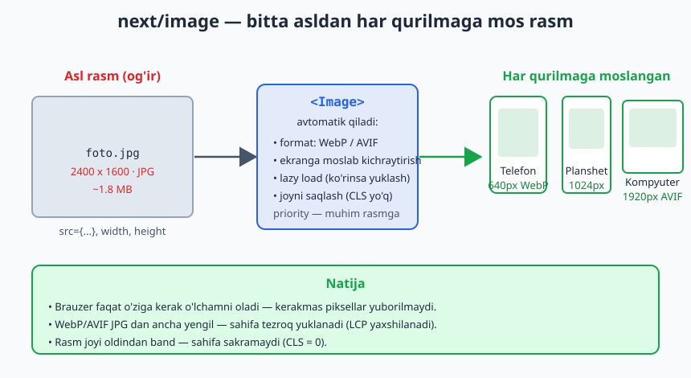
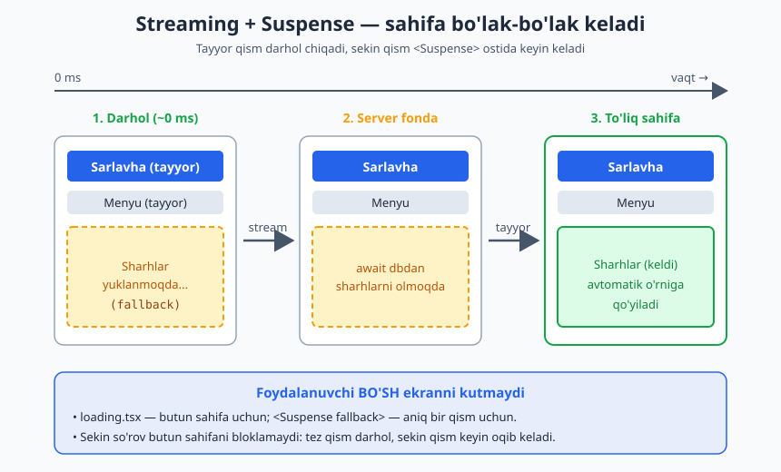
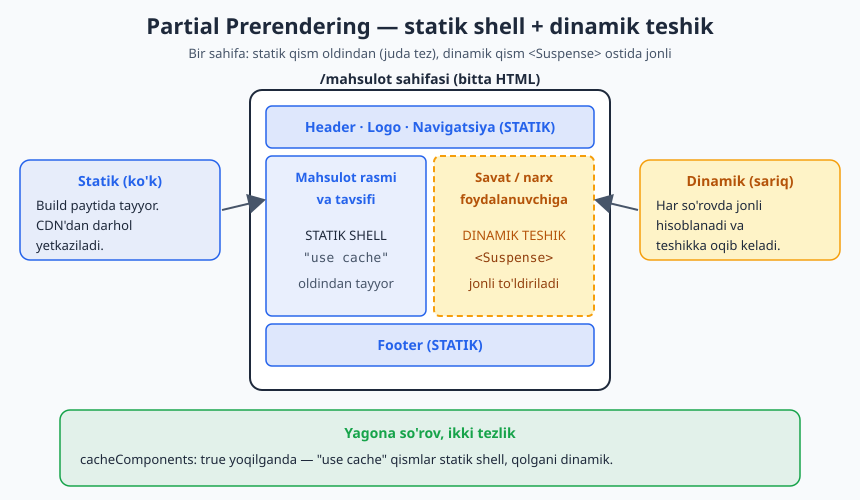
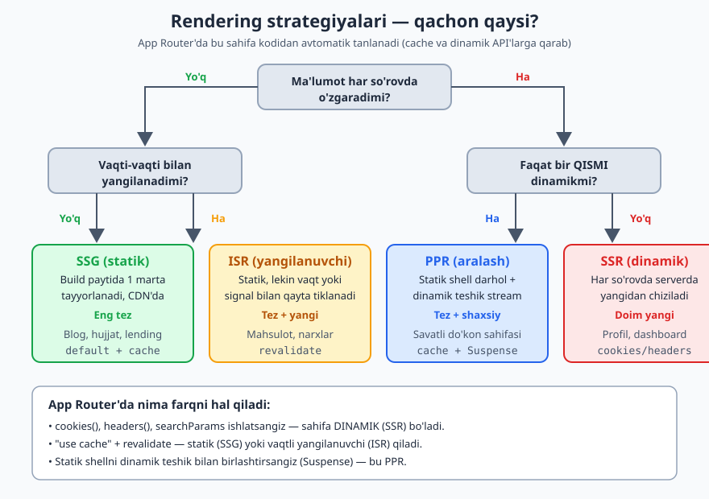

# Next.js — 0 dan Expert darajagacha (4-QISM, YAKUNIY)

📚 [README](./README.md) · [← 3-qism — Full-stack](./Nextjs-0-dan-Expert-3-qism.md) · [Keyingi: BONUS boblar →](./Nextjs-0-dan-Expert-Bonus-i18n-Stripe-Realtime.md)

> **Eslatma:** Bu — qo'llanmaning **yakuniy** qismi. 1–3-qismlar (JS, React, routing, Server/Client Components, data fetching, Server Actions, caching, API, ma'lumotlar bazasi, validatsiya, auth)ni o'rgangan bo'lishingiz kerak.
>
> **Versiya:** Next.js **16**, React 19. Node.js **20.9+**.

---

## 📚 Bu qismda nimalarni o'rganamiz

Endi sizda ishlaydigan full-stack ilova bor. Bu qism — uni **professional, tez va internetga chiqarilgan** holatga keltirish haqida. Bu — "dasturchi" va "**expert** dasturchi" o'rtasidagi farq.

- **13-bob. Performance (Tezlik)** — saytni "uchadigan" qilish texnikalari
- **14-bob. Test yozish** — kodni avtomatik tekshirish, xatolarni oldindan tutish (Vitest + Playwright)
- **15-bob. Deployment** — saytni internetga chiqarish (Vercel va VPS)
- **16-bob. Monitoring, ilg'or patternlar va yakuniy loyiha**

> **Maslahat:** Bu qismdagi bilimlar real loyihalarda, vaqt o'tishi bilan chuqurlashadi. Hozir asoslarni tushunsangiz va bir marta sinab ko'rsangiz — yetadi. Expert bo'lish — bu uzluksiz amaliyot.

---
---

# 13-BOB. Performance (Tezlik)

Tez sayt — yaxshi sayt. Foydalanuvchilar 2–3 soniya kutsa, ketib qoladi; Google ham tez saytlarni yuqoriroq ko'rsatadi. Yaxshi xabar: **Next.js ko'p optimizatsiyani sizning o'rningizga qiladi.** Bu bobda qolganini ham o'rganamiz.

## 13.1. Tezlik nima va nega muhim?

> **Misol:** Tez restoran — taomning bir qismini oldindan tayyorlab qo'yadi (kesh), tayyor bo'lgan taomni darrov chiqaradi, hammasini kutib o'tirmaysiz (streaming), va keraksiz yukni tashimaydi. Sekin restoran — hamma narsani noldan, sizning oldingizda qiladi va siz 40 daqiqa kutasiz.

Tezlik ko'rsatkichlari (**Core Web Vitals** — Google o'lchaydigan):
- **LCP** — eng katta element qancha tez ko'rinadi (sahifa "tayyor" bo'lish hissi).
- **CLS** — sahifa "sakrab" turmasligi (matn/rasm joyini o'zgartirmasligi).
- **INP** — tugmaga bosganda qancha tez javob beradi.

## 13.2. Next.js sizning o'rningizga qiladigan optimizatsiyalar

Bularni **bepulga** olasiz (alohida hech narsa qilmaysiz):
- ✅ **Server Components** — komponent kodi brauzerga yuborilmaydi → kamroq JavaScript → tezroq (5-bobni eslang).
- ✅ **Avtomatik kod bo'lish (code splitting)** — har sahifa faqat o'ziga kerak kodni yuklaydi.
- ✅ **Turbopack** — juda tez build (Next.js 16'da standart).

Demak, agar siz "ko'pchilik komponentni Server qoldirib, faqat interaktivni Client qilish" qoidasiga amal qilsangiz (5-bob) — allaqachon tez saytdasiz.

## 13.3. Rasmlarni optimallash — `next/image`

Rasmlar — sahifani sekinlashtiruvchi eng katta sabab. 1-qismda ko'rgan `<Image>` komponenti buni hal qiladi:

```tsx
import Image from "next/image";

export default function Rasm() {
  return (
    <Image
      src="/katta-rasm.jpg"
      alt="Tavsif"
      width={800}
      height={600}
      priority // ← faqat ekranda darrov ko'rinadigan muhim rasm uchun
    />
  );
}
```

`<Image>` avtomatik:
- Rasmni kichikroq formatga (WebP/AVIF) o'giradi.
- Ekran o'lchamiga moslab kichraytiradi (telefonga kichik, kompyuterga katta).
- Faqat ko'rinadigan rasmlarni yuklaydi ("lazy loading").
- Rasm yuklanguncha joyini saqlab turadi (CLS yo'q — sakramaydi).

> Oddiy `` o'rniga **doim** `<Image>` ishlating. Bu — bepul tezlik.

Quyidagi diagramma bitta asl rasmdan har bir qurilmaga mos o'lcham va format qanday tayyorlanishini ko'rsatadi:



## 13.4. Shriftlarni optimallash — `next/font`

Shriftlar ham sekinlashtiradi. `next/font` ularni avtomatik optimallaydi:

```tsx
// app/layout.tsx
import { Inter } from "next/font/google";

const inter = Inter({ subsets: ["latin"] });

export default function RootLayout({ children }: { children: React.ReactNode }) {
  return (
    <html lang="uz" className={inter.className}>
      <body>{children}</body>
    </html>
  );
}
```

Bu shriftni saytingiz bilan birga "joylashtiradi" (tashqi serverdan kutmaydi) va matn "sakramasligini" ta'minlaydi.

## 13.5. Streaming — kontentni bosqichma-bosqich ko'rsatish

2-qism (6-bob)dagi `loading.tsx`ni eslang. U aslida **streaming** texnikasi: sekin yuklanadigan qism kutilayotganda, sahifaning qolgan qismini darrov ko'rsatadi.

> Restoran: salat tayyor bo'lishini kutib, ovqatni stol ustida ushlab turmaydi. Salatni darrov chiqaradi, asosiy taom keyin keladi. Foydalanuvchi bo'sh o'tirmaydi.

Aniqroq nazorat uchun `<Suspense>` ishlatamiz — sahifaning **bir qismini** kutib, qolganini darrov ko'rsatish:

```tsx
import { Suspense } from "react";

export default function Page() {
  return (
    <div>
      <h1>Bosh sahifa</h1>
      {/* Bu darrov ko'rinadi */}

      <Suspense fallback={<p>Sharhlar yuklanmoqda...</p>}>
        <SekinSharhlar /> {/* Bu sekin, alohida kutiladi */}
      </Suspense>
    </div>
  );
}

async function SekinSharhlar() {
  const sharhlar = await sekinMalumotOl(); // vaqt oladi
  return <div>{/* sharhlarni ko'rsatish */}</div>;
}
```

Natija: sarlavha darrov ko'rinadi, sharhlar "Yuklanmoqda..." bilan kelguncha foydalanuvchi kutib o'tirmaydi.

Quyidagi diagramma sahifaning bo'lak-bo'lak qanday oqib kelishini bosqichma-bosqich ko'rsatadi:



## 13.6. Static shell + dinamik teshik (Partial Prerendering)

Next.js 16'ning kuchli imkoniyati: sahifaning **statik qismini** oldindan tayyorlab (juda tez), faqat **dinamik qismini** (masalan, foydalanuvchi savati) jonli yuklash. Bu 2-qism (8-bob)dagi `"use cache"` modeli bilan ishlaydi.

> Restoran: menyu, devor bezagi — oldindan tayyor (statik). Faqat sizning buyurtmangiz — jonli tayyorlanadi (dinamik). Hamma narsani noldan qilmaydi.

Buni `cacheComponents: true` (8-bob) yoqilganda, `"use cache"` bilan keshlangan qismlar statik bo'lib, qolgani dinamik qoladi. Amalda: keshlanishi mumkin bo'lgan qismlarni keshlang, dinamik qismni `<Suspense>`ga o'rang.

Quyidagi diagramma bitta sahifada statik shell va dinamik teshik qanday birga yashashini ko'rsatadi:



Bu yerda ko'rgan to'rt yondashuv (statik, vaqtli yangilanish, aralash va to'liq dinamik) qachon qaysi biri kerakligini quyidagi yo'l-xarita umumlashtiradi:



## 13.7. Og'ir Client komponentlarni keyin yuklash — `next/dynamic`

Ba'zi komponentlar og'ir (masalan, katta grafik, xarita). Ularni faqat **kerak bo'lganda** yuklash mumkin:

```tsx
import dynamic from "next/dynamic";

// Bu komponent faqat kerak bo'lganda yuklanadi (boshida emas)
const OgirGrafik = dynamic(() => import("./OgirGrafik"), {
  loading: () => <p>Grafik yuklanmoqda...</p>,
});

export default function Page() {
  return (
    <div>
      <h1>Hisobot</h1>
      <OgirGrafik />
    </div>
  );
}
```

Bu — "lazy loading": og'ir kod boshlang'ich yuklanishni sekinlashtirmaydi.

## 13.8. Bundle Analyzer — nima og'irligini topish

Saytingiz sekin bo'lsa, sababini topish kerak. `@next/bundle-analyzer` qaysi kutubxona ko'p joy egallayotganini ko'rsatadi:

```bash
npm install @next/bundle-analyzer
```

U "xarita" chizadi — qaysi paket katta ekanini ko'rasiz va keraksizlarini olib tashlaysiz.

> **Maslahat:** Tezlik muammosini **o'lchamasdan** hal qilmang. Avval Chrome'dagi **Lighthouse** (F12 → Lighthouse) yoki bundle analyzer bilan **sababni toping**, keyin tuzating.

## 13.9. Tezlik bo'yicha amaliy qoidalar

1. Ko'pchilik komponentni **Server** qoldiring, `"use client"`ni faqat kichik interaktiv qismlarga bering.
2. Rasmlar uchun **doim `<Image>`**, shriftlar uchun **`next/font`**.
3. Sekin qismlarni **`<Suspense>`** yoki **`loading.tsx`** bilan o'rang.
4. Tez-tez o'zgarmaydigan ma'lumotni **keshlang** (`"use cache"`, 8-bob).
5. Og'ir client komponentlarni **`next/dynamic`** bilan keyin yuklang.
6. Muammoni **avval o'lchang** (Lighthouse), keyin tuzating.

---

## ✍️ 13-BOB MASALALARI (20 ta)

**Tushunish (1–7):**
1. Nega tezlik muhim? 2 ta sabab ayting.
2. Core Web Vitals nima: LCP, CLS, INP — har biri nimani o'lchaydi?
3. Next.js sizning o'rningizga qiladigan 3 ta optimizatsiyani ayting.
4. Nega Server Component avtomatik tezroq (brauzerga nima yuborilmaydi)?
5. Streaming nima? Restoran misolida tushuntiring.
6. Partial Prerendering (statik shell + dinamik teshik) nima?
7. `next/dynamic` (lazy loading) qachon foydali?

**Amaliy (8–16):**
8. Loyihangizdagi oddiy ``ni `<Image>`ga o'zgartiring.
9. Muhim rasmga `priority` qo'shing, sababini izohlang.
10. `next/font` bilan loyihaga shrift qo'shing (`layout.tsx`).
11. Sekin yuklanadigan komponent yarating va uni `<Suspense fallback={...}>`ga o'rang.
12. Bir sahifada tez qism (sarlavha) darrov, sekin qism Suspense bilan kelishini ko'rsating.
13. Og'ir komponentni `next/dynamic` bilan yuklang (`loading` bilan).
14. Chrome'da Lighthouse'ni ishga tushiring (F12 → Lighthouse) va sahifangizni baholang.
15. Lighthouse natijasidan bitta muammoni toping va tuzatishga harakat qiling.
16. `@next/bundle-analyzer`ni o'rnatib, qaysi paket katta ekanini ko'ring.

**Strategiya (17–20):**
17. Bir sahifani oling: qaysi qismlar Server, qaysilari Client bo'lishi kerak — qayta ko'rib chiqing.
18. Qaysi ma'lumotni keshlash mumkin, qaysini yo'q — bitta loyihangiz uchun rejalashtiring.
19. "Avval o'lcha, keyin tuzat" qoidasini o'z so'zingiz bilan tushuntiring.
20. Tezlik bo'yicha 6 ta qoidani o'z loyihangizga qanday qo'llashingizni yozing.

> **Qo'shimcha challenge:** 3-qismdagi blog loyihangizni tezlashtiring: rasmlarni `<Image>`ga o'tkazing, shriftni `next/font` qiling, maqolalar ro'yxatini `"use cache"` bilan keshlang, sekin qismlarni `<Suspense>`ga o'rang. Lighthouse'da oldin va keyin ballarni solishtiring.

---
---

# 14-BOB. Test yozish

Kod yozdingiz, qo'lda sinab ko'rdingiz, ishladi. Lekin keyin boshqa joyni o'zgartirsangiz, eskisi buzilmadimi? Har safar hammasini qo'lda tekshirib bo'lmaydi. **Test** — kodni **avtomatik** tekshiradigan kod.

## 14.1. Test nima va nega kerak?

> **Misol:** Test — bu avtomobilning xavfsizlik tekshiruviga yoki oshpazning taomni mijozga berishdan oldin tatib ko'rishiga o'xshaydi. Muammoni **mijoz sezishdan oldin** topasiz.

Testsiz: har o'zgarishdan keyin qo'lda hamma narsani bosib chiqasiz (zerikarli, ishonchsiz). Test bilan: bir buyruq be” – kod o'zi tekshiradi, xato bo'lsa darrov aytadi.

**Foydalari:**
- 🐛 Xatolarni erta tutadi (foydalanuvchi sezmasdan).
- 😌 O'zgarish kiritishda qo'rqmaysiz (test buzilsa, ko'rasiz).
- 📖 Test kodning qanday ishlashini hujjatlaydi.

## 14.2. Test turlari va vositalar (2026)

| Tur | Nima tekshiradi | Vosita |
|---|---|---|
| **Unit test** | Bitta funksiya/komponent alohida | **Vitest** + React Testing Library |
| **E2E test** | Butun jarayon (foydalanuvchi kabi) | **Playwright** |

> **Misol:** Unit test — bitta ingredientni tatib ko'rish (tuz yetarlimi?). E2E test — butun taomni mijoz kabi yeb ko'rish (boshidan oxirigacha).

**2026 holatiga ko'ra:**
- **Vitest** — unit testlar uchun standart (eski Jest o'rniga; tezroq, API'si bir xil).
- **Playwright** — E2E uchun standart (haqiqiy brauzerda sinaydi).

> **⚠️ Muhim cheklov:** Vitest **`async` Server Componentlarni** sinashni qo'llab-quvvatlamaydi (React'da bu hali barqaror emas). Shuning uchun: **sinxron komponentlar, Server Actions (oddiy funksiya sifatida), Zod schemalar** — Vitest bilan; **`async` Server Componentlar va auth jarayonlari** — Playwright (E2E) bilan.

## 14.3. Vitest'ni o'rnatish

```bash
npm install -D vitest @vitejs/plugin-react jsdom @testing-library/react @testing-library/dom vite-tsconfig-paths
```

Loyiha ildizida `vitest.config.mts` yarating:

```ts
// vitest.config.mts
import { defineConfig } from "vitest/config";
import react from "@vitejs/plugin-react";
import tsconfigPaths from "vite-tsconfig-paths";

export default defineConfig({
  plugins: [tsconfigPaths(), react()],
  test: {
    environment: "jsdom", // brauzer muhitini taqlid qiladi
  },
});
```

`package.json`ga test buyrug'ini qo'shing:
```json
{
  "scripts": {
    "test": "vitest"
  }
}
```

> **Tez yo'l:** `npx create-next-app --example with-vitest with-vitest-app` — tayyor sozlangan loyiha beradi.

## 14.4. Birinchi unit test — oddiy funksiya

Avval testlash oson bo'lgan oddiy funksiya:

```ts
// lib/math.ts
export function qoshish(a: number, b: number) {
  return a + b;
}
```

```ts
// lib/math.test.ts
import { describe, it, expect } from "vitest";
import { qoshish } from "./math";

describe("qoshish funksiyasi", () => {
  it("ikki sonni to'g'ri qo'shadi", () => {
    expect(qoshish(2, 3)).toBe(5);
  });

  it("manfiy sonlar bilan ishlaydi", () => {
    expect(qoshish(-1, 1)).toBe(0);
  });
});
```

`npm test` bilan ishga tushiring. Yashil ✓ — test o'tdi.

**Tushuntirish:**
- `describe(...)` — testlarni guruhlaydi.
- `it(...)` — bitta test ("u shunday qilishi kerak").
- `expect(natija).toBe(kutilgan)` — "natija kutilganga teng bo'lsin".

## 14.5. Zod schemani sinash

3-qism (11-bob)dagi Zod schemalar — sinash uchun ideal (oddiy funksiya):

```ts
// schema.test.ts
import { describe, it, expect } from "vitest";
import { z } from "zod";

const userSchema = z.object({
  email: z.string().email(),
  name: z.string().min(2),
});

describe("userSchema", () => {
  it("to'g'ri ma'lumotni qabul qiladi", () => {
    const natija = userSchema.safeParse({ email: "a@b.com", name: "Ali" });
    expect(natija.success).toBe(true);
  });

  it("noto'g'ri emailni rad etadi", () => {
    const natija = userSchema.safeParse({ email: "xato", name: "Ali" });
    expect(natija.success).toBe(false);
  });
});
```

## 14.6. Komponentni sinash (React Testing Library)

Sinxron (oddiy, `async` bo'lmagan) komponentlarni sinash:

```tsx
// Salom.tsx
export default function Salom({ ism }: { ism: string }) {
  return <h1>Salom, {ism}!</h1>;
}
```

```tsx
// Salom.test.tsx
import { describe, it, expect } from "vitest";
import { render, screen } from "@testing-library/react";
import Salom from "./Salom";

describe("Salom komponenti", () => {
  it("ismni ko'rsatadi", () => {
    render(<Salom ism="Oqil" />);
    expect(screen.getByText("Salom, Oqil!")).toBeDefined();
  });
});
```

`render(...)` — komponentni "chizadi", `screen.getByText(...)` — matnni topadi.

## 14.7. E2E test — Playwright

`async` Server Componentlar, auth jarayonlari, butun foydalanuvchi yo'li uchun Playwright:

```bash
npm init playwright@latest
```
(Yoki tayyor: `npx create-next-app --example with-playwright with-playwright-app`)

Oddiy E2E test:
```ts
// e2e/home.spec.ts
import { test, expect } from "@playwright/test";

test("bosh sahifa sarlavhasini ko'rsatadi", async ({ page }) => {
  await page.goto("http://localhost:3000");
  await expect(page.getByRole("heading", { level: 1 })).toBeVisible();
});

test("about sahifasiga o'tadi", async ({ page }) => {
  await page.goto("http://localhost:3000");
  await page.getByRole("link", { name: "Biz haqimizda" }).click();
  await expect(page).toHaveURL(/about/);
});
```

Playwright **haqiqiy brauzer** ochib, foydalanuvchi kabi bosadi, yozadi, tekshiradi. Auth, formalar, navigatsiya — hammasini real holatda sinaydi.

## 14.8. Nimani sinash kerak (va nimani yo'q)

- ✅ **Sinang:** muhim biznes mantiq, Zod schemalar, Server Actions, kritik foydalanuvchi yo'llari (login, to'lov, ro'yxatdan o'tish).
- ❌ **Sinamang:** tashqi kutubxona allaqachon sinagan narsalar, "tugma tugma ekanini" tekshiruvchi ma'nosiz testlar.

> **Sifat > miqdor.** 30 ta muhim test — 200 ta ma'nosiz testdan yaxshiroq. Eng muhim yo'llarga (login, asosiy amallar) e'tibor bering.

---

## ✍️ 14-BOB MASALALARI (20 ta)

**Tushunish (1–6):**
1. Test nima va nega kerak? Avtomobil tekshiruvi/taom tatib ko'rish misolida ayting.
2. Unit test va E2E test farqi nima?
3. 2026'da nega Jest emas, Vitest ishlatiladi?
4. Vitest nega `async` Server Componentlarni sinay olmaydi? Nima qilish kerak?
5. Qaysi narsalarni Vitest bilan, qaysilarini Playwright bilan sinaymiz?
6. "Sifat > miqdor" — testda buni izohlang.

**Vitest (7–14):**
7. Vitest'ni o'rnating va `vitest.config.mts` yarating.
8. `package.json`ga `"test": "vitest"` qo'shing.
9. `qoshish(a, b)` funksiyasi uchun unit test yozing.
10. Unga manfiy sonlar va nol uchun testlar qo'shing.
11. `npm test` bilan testlarni ishga tushiring, yashil ✓ ni ko'ring.
12. Bir Zod schema uchun "to'g'ri qabul qiladi" testi yozing.
13. Shu schema uchun "noto'g'rini rad etadi" testi yozing.
14. Sinxron komponent (`Salom`) uchun RTL bilan test yozing.

**Playwright (15–20):**
15. Playwright'ni o'rnating (`npm init playwright@latest` yoki `with-playwright` namunasi).
16. Bosh sahifa sarlavhasini tekshiradigan E2E test yozing.
17. Bir sahifadan boshqasiga o'tishni tekshiradigan test yozing.
18. Playwright testini ishga tushiring (`npx playwright test`).
19. Login formasini tekshiradigan E2E test yozing (email/parol kiritish, kirish).
20. Sinash kerak bo'lgan 5 ta kritik yo'lni loyihangiz uchun ro'yxatlang.

> **Qo'shimcha challenge:** 3-qismdagi blog loyihangiz uchun: Zod schemalariga unit testlar (Vitest) + "foydalanuvchi ro'yxatdan o'tadi, maqola qo'shadi, ko'radi" jarayoniga E2E test (Playwright) yozing.

---
---

# 15-BOB. Deployment — saytni internetga chiqarish

Mana eng hayajonli qadam! Hozirgacha saytingiz faqat **sizning kompyuteringizda** (`localhost:3000`) ishlardi. **Deployment** — uni internetga chiqarish, ya'ni butun dunyo ko'ra oladigan qilish.

## 15.1. Deployment nima?

> **Misol:** Hozirgacha sizning restoraningiz uy oshxonasi edi — faqat siz ovqatlanardingiz. Deployment — ko'chada haqiqiy restoran ochish, har kim kelib ovqatlanishi mumkin bo'lgan joy. **Domen** (masalan, `mening-saytim.uz`) — restoranning manzili va peshtaxtasi.

Next.js saytini chiqarishning 2 ta asosiy yo'li bor:
1. **Vercel** — eng oson (Next.js'ni yaratgan kompaniya). Boshlovchi uchun ideal.
2. **VPS** (o'z serveringiz) — to'liq nazorat, arzonroq (katta loyihalar uchun).

## 15.2. 1-yo'l: Vercel (eng oson)

Vercel — Next.js'ni yaratgan kompaniya, shuning uchun ularning platformasi Next.js uchun mukammal sozlangan. Kichik/o'rta loyihalar uchun bepul.

**Qadamlar:**
1. Kodingizni **GitHub**ga yuklang (agar bilmasangiz — `git` va GitHub'ni alohida o'rganing, bu zarur ko'nikma).
2. [vercel.com](https://vercel.com)ga kiring (GitHub bilan).
3. "New Project" → GitHub reponi tanlang.
4. Maxfiy sozlamalarni (`.env`dagi `DATABASE_URL`, `BETTER_AUTH_SECRET` va h.k.) Vercel sozlamalariga qo'shing (**Environment Variables**).
5. "Deploy" bosing.

Bir necha daqiqada saytingiz `sizning-loyihangiz.vercel.app` manzilida internetda! Har safar GitHub'ga yangi kod yuklasangiz, Vercel avtomatik yangilaydi.

> **Domen ulash:** Vercel'da "Domains" bo'limidan o'z domeningizni (`mening-saytim.uz`) ulashingiz mumkin.

## 15.3. 2-yo'l: VPS (o'z serveringiz)

VPS — bu internetdagi ijaraga olingan kompyuter (Linux). To'liq nazorat, arzon (oyiga $5–10), vendor lock-in yo'q. Next.js 16 self-hosting'ni ancha osonlashtirgan.

> Bu yo'l ko'proq qadamli va Linux/terminal bilimini talab qiladi. Boshida Vercel bilan boshlang, keyin tajriba bilan VPS'ga o'ting.

**Asosiy g'oya — `standalone` rejim:** Next.js 16 loyihangizni **mustaqil, yengil paket**ga jamlaydi (faqat kerakli fayllar, ulkan `node_modules`siz).

`next.config.ts`ga qo'shing:
```ts
// next.config.ts
import type { NextConfig } from "next";

const nextConfig: NextConfig = {
  output: "standalone", // ← mustaqil paket yaratadi
};

export default nextConfig;
```

**VPS'da deployment qadamlari (qisqacha):**

```bash
# 1. VPS'da Node.js 22 va PM2 o'rnatish
curl -fsSL https://deb.nodesource.com/setup_22.x | sudo -E bash -
sudo apt install -y nodejs nginx
sudo npm install -g pm2

# 2. Loyihani build qilish (lokalda yoki serverda)
npm run build

# 3. standalone papkaga static va public fayllarni nusxalash
#    (bular avtomatik kiritilmaydi — qo'lda nusxalanadi)
cp -r .next/static .next/standalone/.next/
cp -r public .next/standalone/

# 4. PM2 bilan ishga tushirish (24/7 ishlab turadi)
pm2 start .next/standalone/server.js --name myapp
pm2 save      # ro'yxatni saqlaydi
pm2 startup   # server qayta yuklansa ham avtomatik ishga tushadi
```

**Nginx — reverse proxy** (saytni 80/443 portga ulash):
```nginx
# /etc/nginx/sites-available/myapp
server {
    listen 80;
    server_name mening-saytim.uz;

    location / {
        proxy_pass http://localhost:3000;
        proxy_http_version 1.1;
        proxy_set_header Host $host;
        proxy_set_header X-Real-IP $remote_addr;
    }
}
```

**SSL (HTTPS)** — Let's Encrypt (Certbot) bilan bepul:
```bash
sudo apt install certbot python3-certbot-nginx
sudo certbot --nginx -d mening-saytim.uz
```

> **Maxfiy sozlamalar (env):** `DATABASE_URL`, kalitlar kabi server sozlamalarini VPS'da (PM2 config yoki `.env`da) o'rnating — kodga "qotirib" yozmang. `NEXT_PUBLIC_` bilan boshlanadigan o'zgaruvchilar build paytida kiritiladi (o'zgartirsangiz — qayta build kerak).

## 15.4. Vercel vs VPS — qaysi birini tanlash?

| | Vercel | VPS |
|---|---|---|
| Qiyinlik | ⭐ Juda oson | ⭐⭐⭐ Murakkabroq |
| Narx | Boshida bepul, o'sganda qimmat | $5–10/oy, barqaror |
| Nazorat | Cheklangan | To'liq |
| Boshlovchi uchun | ✅ Ideal | Tajriba kerak |

> **Maslahat:** Birinchi loyihangizni **Vercel** da chiqaring (5 daqiqa). Keyinroq, server boshqarishni o'rganib, **VPS**'ni sinang. Ikkalasi ham foydali ko'nikma.

## 15.5. Deploymentdan oldin tekshiruv ro'yxati

1. ✅ `npm run build` xatosiz o'tadimi? (Lokalda sinang.)
2. ✅ Barcha maxfiy sozlamalar (`.env`) serverda o'rnatilganmi?
3. ✅ `.env` GitHub'ga yuklanmaganmi? (`.gitignore`da bo'lsin.)
4. ✅ Ma'lumotlar bazasi production'ga ulanganmi? (SQLite emas — PostgreSQL: Neon/Supabase.)
5. ✅ `npm run build && npm run start` bilan production rejimini lokalda sinab ko'rdingizmi? (8-bobdagi kesh shu yerda ishlaydi.)

> **⚠️ Eslatma:** O'rganishda ishlatgan **SQLite** — production uchun emas. Haqiqiy saytda **PostgreSQL** (Neon, Supabase, yoki Prisma Postgres) ishlating. Prisma schemada `provider`ni `postgresql`ga o'zgartirib, `DATABASE_URL`ni yangilang.

---

## ✍️ 15-BOB MASALALARI (20 ta)

**Tushunish (1–7):**
1. Deployment nima? Uy oshxonasi vs restoran misolida ayting.
2. Domen nima? Nima vazifani bajaradi?
3. Vercel va VPS farqi nima? Har biri kim uchun?
4. `output: "standalone"` nima qiladi?
5. PM2 nima uchun kerak (`pm2 startup`/`pm2 save` nima qiladi)?
6. Nginx (reverse proxy) nima vazifani bajaradi?
7. Nega o'rganishdagi SQLite production uchun yaramaydi?

**Vercel (8–13):**
8. Kodingizni GitHub'ga yuklang (git bilmasangiz — avval o'rganing).
9. Vercel'ga GitHub bilan kiring.
10. "New Project" bilan repongizni ulang.
11. Environment Variables'ga `.env` qiymatlarini qo'shing.
12. "Deploy" bosib, saytni internetga chiqaring.
13. Sayt manzilini (`....vercel.app`) brauzerda ochib, ishlashini tasdiqlang.

**VPS va sozlamalar (14–20):**
14. `next.config.ts`ga `output: "standalone"` qo'shing.
15. `npm run build` qilib, `.next/standalone` papkasi yaratilganini ko'ring.
16. (Agar VPS'ingiz bo'lsa) Node.js + PM2 o'rnatib, loyihani ishga tushiring.
17. Oddiy Nginx reverse proxy konfiguratsiyasini yozing (port 3000'ga).
18. Maxfiy va `NEXT_PUBLIC_` o'zgaruvchilar farqini izohlang.
19. Deployment oldidan tekshiruv ro'yxatini (5 band) o'z loyihangizga qo'llang.
20. Production bazasini (Neon/Supabase) sozlash bo'yicha reja tuzing (SQLite → PostgreSQL).

> **Qo'shimcha challenge:** 3-qismdagi blog loyihangizni haqiqatan internetga chiqaring: bazani PostgreSQL'ga (Neon/Supabase) o'tkazing, Vercel'ga deploy qiling, env'larni sozlang. Do'stlaringizga manzilni yuboring — ular ham foydalansin!

---
---

# 16-BOB. Monitoring, ilg'or patternlar va yakuniy loyiha

Yakuniy bob. Saytingiz internetda. Endi uni **kuzatish**, professional **patternlarni** bilish va hamma bilimni **bitta loyihada** birlashtirish vaqti.

## 16.1. Monitoring — saytni kuzatish

Sayt chiqdi, lekin foydalanuvchilar xato ko'rsa-chi? Sekin bo'lsa-chi? Buni bilishingiz kerak. **Monitoring** — saytni kuzatish.

> **Misol:** Restoran ochildi, lekin oshxonada nima bo'layotganini bilmasangiz — mijozlar shikoyat qilganda kech bo'ladi. Monitoring — oshxonadagi kameralar va sensorlar: muammo bo'lishi bilan bilasiz.

**Asosiy vositalar:**
- **Xato kuzatish (error tracking):** [Sentry](https://sentry.io) — saytda xato bo'lsa, sizga darrov xabar beradi (qaysi qator, qaysi foydalanuvchi).
- **Analitika:** kim, qayerdan, qaysi sahifaga kirayotganini ko'rish (Vercel Analytics, yoki maxfiylikka do'st Plausible/Umami).
- **Tezlik kuzatuvi:** Vercel Speed Insights — real foydalanuvchilarda tezlikni o'lchaydi.

Sentry'ni o'rnatish juda oson (ularning qo'llanmasi bor) va boshlovchi loyihalar uchun bepul rejasi yetadi.

## 16.2. `instrumentation.ts` — ilg'or kuzatuv

Next.js maxsus `instrumentation.ts` fayli beradi — u ilova ishga tushganda bajariladigan kuzatuv kodini joylash uchun (masalan, Sentry'ni ulash, OpenTelemetry). Bu — ilg'or mavzu; hozir borligini bilib qo'ying, kerak bo'lganda Sentry hujjatlaridan foydalanasiz.

## 16.3. Ilg'or pattern: Data Access Layer (xavfsizlik uchun)

3-qism (12-bob)da "har action/sahifada sessiyani tekshir" degandik. Buni **markazlashtirish** — professional yondashuv. Sessiya tekshiruvini bitta joyda yozasiz, hamma joyda shuni chaqirasiz:

```ts
// lib/auth-utils.ts
import { auth } from "@/lib/auth";
import { headers } from "next/headers";
import { redirect } from "next/navigation";

// Markazlashtirilgan tekshiruv
export async function joriyFoydalanuvchi() {
  const session = await auth.api.getSession({ headers: await headers() });
  if (!session) {
    redirect("/login");
  }
  return session.user;
}
```

Endi har sahifada qaytarmaysiz, shunchaki chaqirasiz:
```tsx
export default async function DashboardPage() {
  const user = await joriyFoydalanuvchi(); // bitta qator!
  return <h1>Salom, {user.name}!</h1>;
}
```

> Bu "Data Access Layer (DAL)" deyiladi — xavfsizlik mantig'ini bir joyda saqlash. Kod takrorlanmaydi va xato qilish ehtimoli kamayadi.

## 16.4. Ilg'or pattern: Optimistik UI (`useOptimistic`)

Foydalanuvchi "Yoqdi" tugmasini bossa, server javobini kutmasdan **darrov** yurakcha to'lsa — yaxshi tajriba. React'ning `useOptimistic` hook'i shuni qiladi. Bu — ilg'or mavzu; loyihangiz o'sganda o'rganasiz.

## 16.5. Boshqa ilg'or mavzular (kelajakda o'rganiladigan)

Expert bo'lish yo'lida quyidagilarni sekin-asta o'rganasiz:
- **Parallel va Intercepting Routes** — murakkab navigatsiya (modal oynalar, yonma-yon sahifalar).
- **Webhooklar** — boshqa xizmatlar (to'lov, email) bilan integratsiya.
- **Background jobs / queues** — uzoq ishlarni fonda bajarish.
- **i18n** — ko'p tillik sayt.
- **CI/CD** — GitHub Actions bilan avtomatik test va deploy.
- **Caching strategiyalar** — chuqurroq kesh boshqaruvi (8-bob ustida).

> Bularni **bir vaqtda** o'rganmang. Loyiha ishlab, ehtiyoj tug'ilganda — o'sha mavzuni o'rganasiz. Bu — tabiiy o'sish yo'li.

## 16.6. 🏆 YAKUNIY LOYIHA — hamma bilimni birlashtirish

Endi to'rt qismda o'rgangan hamma narsani **bitta haqiqiy loyihada** birlashtiring. Tavsiya: **mini ijtimoiy/blog platforma** yoki **vazifalar boshqaruvi (task manager)**.

**Talablar (har biri qaysi bobda o'rganilgan):**

1. **Sahifalar va routing** (1-qism, 4-bob): bosh sahifa, profil, har bir element uchun dinamik sahifa.
2. **Server/Client Components** (2-qism, 5-bob): ma'lumot — Server'da, interaktiv tugmalar — Client'da.
3. **Ma'lumot olish** (2-qism, 6-bob): elementlar ro'yxatini bazadan o'qish, `loading`/`error` bilan.
4. **Server Actions** (2-qism, 7-bob): qo'shish, tahrirlash, o'chirish — formalar orqali.
5. **Keshlash** (2-qism, 8-bob): ro'yxatni `"use cache"` bilan tezlashtirish.
6. **API** (3-qism, 9-bob): mobil ilova uchun kamida bitta Route Handler.
7. **Ma'lumotlar bazasi** (3-qism, 10-bob): Prisma + modellar (foydalanuvchi, element, bog'lanishlar).
8. **Validatsiya** (3-qism, 11-bob): Zod bilan barcha formalarni tekshirish.
9. **Auth** (3-qism, 12-bob): ro'yxatdan o'tish, kirish, faqat egasi tahrirlay olishi.
10. **Tezlik** (4-qism, 13-bob): `<Image>`, `next/font`, `<Suspense>`.
11. **Test** (4-qism, 14-bob): kamida bir nechta unit + E2E test.
12. **Deployment** (4-qism, 15-bob): Vercel'ga chiqarish, PostgreSQL bilan.
13. **Monitoring** (4-qism, 16-bob): Sentry ulash.

Buni tugatsangiz — siz **portfolioga qo'ysa bo'ladigan, internetda ishlab turgan, professional Next.js loyihasi** yaratgan bo'lasiz. Bu — ishga kirish yoki freelance uchun kuchli dalil!

---

## ✍️ 16-BOB MASALALARI (20 ta)

**Tushunish (1–7):**
1. Monitoring nima va nega kerak? Restoran kamerasi misolida ayting.
2. Sentry nima qiladi?
3. Analitika nimani ko'rsatadi?
4. Data Access Layer (DAL) nima? Nega xavfsizlik uchun foydali?
5. Optimistik UI (`useOptimistic`) qanday yaxshi tajriba beradi?
6. Nega ilg'or mavzularni "bir vaqtda" emas, "ehtiyojga qarab" o'rganish kerak?
7. `instrumentation.ts` nima uchun?

**Patternlar (8–12):**
8. `lib/auth-utils.ts`da markazlashtirilgan `joriyFoydalanuvchi()` funksiyasini yozing.
9. Uni bir himoyalangan sahifada chaqirib, kodni soddalashtiring.
10. Sentry hisobi ochib, loyihangizga ulang (ularning qo'llanmasi bilan).
11. Ataylab xato yarating va Sentry uni tutishini tasdiqlang.
12. (Ilg'or) `useOptimistic` haqida o'qib, "Yoqdi" tugmasi misolini tushuning.

**Yakuniy loyiha (13–20):**
13. Yakuniy loyiha mavzusini tanlang (blog, task manager, yoki o'zingizniki).
14. Prisma modellarini loyihalang (foydalanuvchi, asosiy element, bog'lanishlar).
15. Auth qo'shing (register, login, logout).
16. Asosiy CRUD'ni Server Actions + Zod validatsiya bilan qiling.
17. Ro'yxat sahifasini `loading`/`error`/keshlash bilan yarating.
18. Kamida bir nechta unit (Vitest) va bir E2E (Playwright) test yozing.
19. Tezlikni optimallang (`<Image>`, `next/font`, `<Suspense>`).
20. Loyihani Vercel'ga (PostgreSQL bilan) deploy qiling va Sentry ulang.

> **Yakuniy challenge:** Yuqoridagi to'liq loyihani boshidan oxirigacha yakunlang va internetga chiqaring. Tugatgach — uni portfoliongizga qo'shing, GitHub'ga yuklang, do'stlaringizga ulashing. **Tabriklaymiz — siz endi Next.js dasturchisisiz!**

---
---

# 🎓 BUTUN QO'LLANMA YAKUNI

To'rt qismni tugatdingiz. Keling, qancha yo'l bosganingizni ko'rib chiqaylik:

**1-QISM** — Poydevor: JavaScript, React, Next.js loyihasi, routing.
**2-QISM** — Dinamik ilova: Server/Client Components, data fetching, Server Actions, keshlash.
**3-QISM** — Full-stack: API, ma'lumotlar bazasi, validatsiya, autentifikatsiya.
**4-QISM** — Professional: tezlik, test, deployment, monitoring, yakuniy loyiha.

Agar masalalarni yechgan va loyihalarni qurgan bo'lsangiz — siz endi **haqiqiy Next.js dasturchisisiz**. Bu — kichik yutuq emas. Ko'pchilik bu yo'lni yakunlamaydi.

## Bundan keyin nima qilish kerak?

1. **Loyiha quring.** Bilim — amaliyotda mustahkamlanadi. O'zingizga qiziq narsani (sayt, ilova) yasang. Xato qiling, tuzating, o'rganing.
2. **Boshqa loyihalarni o'qing.** GitHub'dagi ochiq Next.js loyihalarini ko'ring — boshqalar qanday yozganini o'rganing.
3. **Hujjatlarni do'st tuting.** [nextjs.org/docs](https://nextjs.org/docs) — eng ishonchli manba. Yangi versiyalar chiqganda shu yerda o'qing.
4. **Hamjamiyatga qo'shiling.** Savol bering, javob bering, boshqalar bilan o'rganing.
5. **To'xtamang.** Texnologiya o'zgaradi (masalan, Next.js har yilda yangilanadi). Expert — bu "hammasini bilgan" emas, "doim o'rganishda davom etgan" odam.

> **Eng muhim maslahat:** Mukammallikni kutmang. Bugun bilgan narsangiz bilan **bir narsa yasang**. Eng yaxshi o'rganish — qilib ko'rish. Omad!

---

*Bu — "Next.js 0 dan Expert darajagacha" qo'llanmasining yakuniy 4-qismi. To'rt qism birga — JavaScript asoslaridan to professional, internetda ishlab turgan ilovagacha bo'lgan to'liq yo'l.*

---

📚 [README](./README.md) · [← 3-qism — Full-stack](./Nextjs-0-dan-Expert-3-qism.md) · [Keyingi: BONUS boblar →](./Nextjs-0-dan-Expert-Bonus-i18n-Stripe-Realtime.md)
