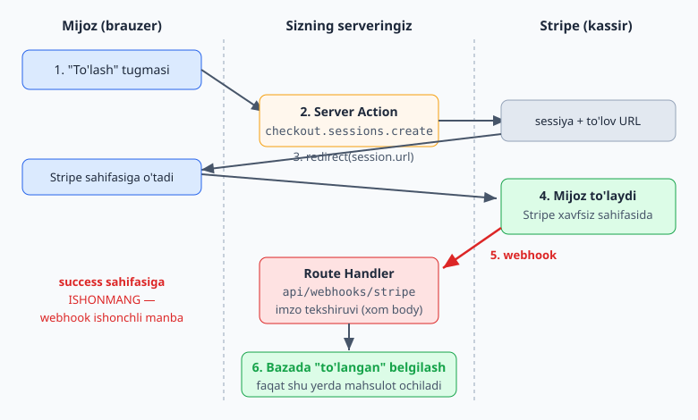
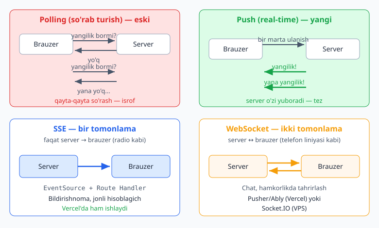

# Next.js — 0 dan Expert: BONUS BOBLAR

📚 [README](./README.md) · [← 4-qism — Production](./Nextjs-0-dan-Expert-4-qism.md)

> **Eslatma:** Bu — asosiy 4 qismga **qo'shimcha (bonus)** boblar. Ular **ilg'or** mavzular bo'lib, 1–4-qismlardagi hamma narsani (ayniqsa Server/Client Components, Server Actions, Route Handlers, auth) bilishni talab qiladi. Agar asosiy qismlarni tugatmagan bo'lsangiz — avval ularga qayting.
>
> **Versiya:** Next.js **16**, React 19. Node.js **20.9+**.

## 📚 Bonus boblar

- **17-bob. Ko'p tillik (i18n)** — saytni bir nechta tilda qilish (next-intl)
- **18-bob. To'lov qabul qilish (Stripe + mahalliy provayderlar)** — pul to'lash, obuna, webhook
- **19-bob. Real-time (jonli yangilanish / WebSocket)** — chat, bildirishnoma, jonli ma'lumot

> **Maslahat:** Bularning har biri katta mavzu. Hozir asosiy g'oyani va patternni tushunsangiz yetadi — chuqurroq tafsilotlarni real loyihada ehtiyoj tug'ilganda o'rganasiz.

---
---

# 17-BOB. Ko'p tillik (i18n)

Saytingizni o'zbek, rus va ingliz tillarida ko'rsatmoqchimisiz? Bu — **i18n** (internationalization — "internationalizatsiya"; i va n orasida 18 ta harf bor, shuning uchun "i18n"). O'zbekiston bozori uchun ayniqsa muhim — ko'p saytlar uz/ru/en tillarini talab qiladi.

## 17.1. i18n nima va qanday ishlaydi?

> **Misol:** Muzeyni tasavvur qiling — har bir eksponat oldida bir nechta tilda yozuv bor. Eksponat bitta, lekin tashrif buyuruvchi o'z tilidagi yozuvni o'qiydi. URL'dagi til kodi (`/uz`, `/ru`, `/en`) — "qaysi tildagi yozuvlarni ko'rsataylik" degani.

i18n ikki qismdan iborat:
1. **Routing (yo'naltirish):** URL'da til ko'rsatiladi — `/uz/about`, `/ru/about`, `/en/about`.
2. **Tarjimalar:** matnlar har til uchun alohida faylda saqlanadi (lug'at kabi).

## 17.2. ⚠️ App Router'da i18n: kutubxona kerak

> **Muhim:** 1-qismda o'rgangan App Router'da Next.js'ning **o'zining ichki i18n sozlamasi yo'q** (u faqat eski Pages Router uchun edi). Shuning uchun kutubxona ishlatamiz.

2026-yilda App Router uchun eng yaxshi tanlov — **next-intl**:
- Juda yengil (~2KB)
- Server Components'da to'g'ridan-to'g'ri ishlaydi (qo'shimcha JavaScript yo'q)
- TypeScript bilan zo'r
- Next.js 16 bilan to'liq mos

> Boshqa variantlar ham bor (`react-i18next`, `next-i18next` v16), lekin biz next-intl'ni o'rganamiz — App Router uchun standart.

```bash
npm install next-intl
```

## 17.3. Sozlash (4 ta fayl)

**1) Tillarni belgilash — `i18n/routing.ts`:**
```ts
// i18n/routing.ts
import { defineRouting } from "next-intl/routing";

export const routing = defineRouting({
  locales: ["uz", "ru", "en"], // qo'llab-quvvatlanadigan tillar
  defaultLocale: "uz",          // standart til
});
```

**2) Yo'naltirish — `proxy.ts`:**
> **⚠️ Next.js 16 eslatma:** Bu fayl ilgari (15-versiyagacha) `middleware.ts` deb atalardi. Next.js 16'da u **`proxy.ts`**ga o'zgardi (3-qism, 12-bobni eslang). Eski darsliklarda `middleware` ko'rsangiz — endi u `proxy`.

```ts
// proxy.ts (loyiha ildizida)
import createMiddleware from "next-intl/middleware";
import { routing } from "./i18n/routing";

export default createMiddleware(routing);

export const config = {
  // API, statik fayllar va Next ichki yo'llaridan tashqari hammasiga qo'llanadi
  matcher: ["/((?!api|_next|.*\\..*).*)"],
};
```

Bu foydalanuvchining tilini aniqlaydi (cookie → brauzer tili → standart) va to'g'ri til manziliga yo'naltiradi.

**3) Til-sezgir navigatsiya — `i18n/navigation.ts`:**
```ts
// i18n/navigation.ts
import { createNavigation } from "next-intl/navigation";
import { routing } from "./routing";

export const { Link, redirect, usePathname, useRouter } =
  createNavigation(routing);
```

> **Muhim:** Endi Next.js'ning oddiy `Link`/`useRouter`ini emas, **shularni** ishlating — ular til prefiksini (`/uz`, `/ru`) avtomatik qo'shadi.

**4) Tarjima fayllari — `messages/` papkasida:**
```json
// messages/uz.json
{
  "salom": "Salom dunyo",
  "haqida": "Biz haqimizda"
}
```
```json
// messages/ru.json
{
  "salom": "Привет мир",
  "haqida": "О нас"
}
```
```json
// messages/en.json
{
  "salom": "Hello world",
  "haqida": "About us"
}
```

## 17.4. `[locale]` papka strukturasi

Endi barcha sahifalar `app/[locale]/` ichiga ko'chadi (1-qismdagi dinamik sahifalarni eslang):

```
app/
└── [locale]/
    ├── layout.tsx
    ├── page.tsx
    └── about/
        └── page.tsx
```

**Layout** — tarjimalarni yuklab beradi:
```tsx
// app/[locale]/layout.tsx
import { NextIntlClientProvider } from "next-intl";
import { setRequestLocale } from "next-intl/server";
import { routing } from "@/i18n/routing";

// Barcha tillar uchun sahifalarni oldindan tayyorlash (statik)
export function generateStaticParams() {
  return routing.locales.map((locale) => ({ locale }));
}

export default async function LocaleLayout({
  children,
  params,
}: {
  children: React.ReactNode;
  params: Promise<{ locale: string }>;
}) {
  const { locale } = await params; // Next.js 16 — async params
  setRequestLocale(locale); // joriy tilni o'rnatamiz

  return (
    <html lang={locale}>
      <body>
        <NextIntlClientProvider>{children}</NextIntlClientProvider>
      </body>
    </html>
  );
}
```

## 17.5. Tarjimani ishlatish — `useTranslations`

Endi sahifalarda tarjimalardan foydalanamiz:

```tsx
// app/[locale]/page.tsx
import { useTranslations } from "next-intl";
import { setRequestLocale } from "next-intl/server";

export default function Home({ params }: { params: Promise<{ locale: string }> }) {
  // (server component'da setRequestLocale uchun locale kerak bo'lsa, await qiling)
  const t = useTranslations(); // tarjima funksiyasi

  return (
    <div>
      <h1>{t("salom")}</h1>
      <p>{t("haqida")}</p>
    </div>
  );
}
```

`/uz`ga kirsangiz "Salom dunyo", `/ru`ga "Привет мир", `/en`ga "Hello world" chiqadi! Bitta kod — uch til.

Quyidagi diagrammada URL'dagi `[locale]` segmenti qanday qilib tilni aniqlashi va tegishli tarjima faylidan mos kontentni ko'rsatishi tasvirlangan:

![i18n routing: [locale] segmenti URL tilini aniqlaydi va tilga mos kontentni ko'rsatadi](rasmlar/nxb-i18n-routing.svg)

> **Diqqat:** `t("salom")` — `messages` faylidagi kalitni oladi. Kalit bo'lmasa, xato chiqadi.

## 17.6. Til almashtirish tugmasi

Foydalanuvchi tilni o'zgartira olishi uchun (next-intl navigatsiyasidan foydalanib):
```tsx
"use client";
import { useRouter, usePathname } from "@/i18n/navigation";

export default function TilAlmashtir() {
  const router = useRouter();
  const pathname = usePathname();

  return (
    <select onChange={(e) => router.replace(pathname, { locale: e.target.value })}>
      <option value="uz">O'zbekcha</option>
      <option value="ru">Русский</option>
      <option value="en">English</option>
    </select>
  );
}
```

Tanlangan til avtomatik saqlanadi (cookie) va keyingi tashriflarda eslab qolinadi.

## 17.7. Maslahatlar

- **Kalitlarni mavzu bo'yicha guruhlang** (namespace): `messages/uz.json` ichida `{ "home": {...}, "about": {...} }` — har sahifa o'z bo'limini oladi.
- **ICU sintaksisi:** son/sana/ko'plik formatlarini next-intl avtomatik to'g'rilaydi (masalan, "1 ta xabar" vs "5 ta xabar").
- **SEO:** har til o'z URL'iga ega bo'lgani uchun Google har tilni alohida indekslaydi — zo'r.

---

## ✍️ 17-BOB MASALALARI (20 ta)

**Tushunish (1–7):**
1. i18n nima? Muzey yozuvlari misolida tushuntiring.
2. i18n'ning ikki qismi (routing va tarjimalar) nima?
3. Nega App Router'da kutubxona kerak (Next.js o'zida yo'q)?
4. 2026'da App Router uchun nega next-intl tavsiya etiladi?
5. `[locale]` papka nima qiladi? URL'da qanday ko'rinadi?
6. Nega oddiy `Link` emas, next-intl'ning `Link`ini ishlatamiz?
7. Next.js 16'da `middleware.ts` nimaga o'zgardi (i18n routing'da qaysi fayl)?

**Sozlash (8–14):**
8. next-intl'ni o'rnating.
9. `i18n/routing.ts`da uz, ru, en tillarini belgilang (default: uz).
10. `proxy.ts` yarating (`createMiddleware`).
11. `i18n/navigation.ts` yarating.
12. `messages/uz.json`, `ru.json`, `en.json` fayllarini yarating (kamida 3 ta kalit).
13. Sahifalarni `app/[locale]/` ichiga ko'chiring.
14. `app/[locale]/layout.tsx`ni sozlang (`generateStaticParams` + `setRequestLocale`).

**Ishlatish (15–20):**
15. Bosh sahifada `useTranslations` bilan tarjimalarni ko'rsating.
16. `/uz`, `/ru`, `/en`ga kirib, matn o'zgarishini tasdiqlang.
17. `about` sahifasi yaratib, unga ham tarjima qo'shing.
18. Til almashtirish tugmasini (`<select>`) yarating.
19. Tilni almashtiring va sahifa o'zgarishini ko'ring.
20. `messages` faylini namespace bilan guruhlang (`home`, `about`) va ishlating.

> **Qo'shimcha challenge:** 3-qismdagi blog loyihangizni 3 tilda qiling: menyu, tugmalar, sahifa sarlavhalari uchun tarjimalar. Til almashtirish tugmasi har sahifada ishlasin. (Maqola matnlari bazadan kelsa — har til uchun alohida maydon yoki tarjima jadvali kerak bo'ladi, buni o'ylab ko'ring.)

---
---

# 18-BOB. To'lov qabul qilish (Stripe va mahalliy provayderlar)

Saytingizdan pul to'plamoqchimisiz? Obuna, mahsulot sotish, xizmat haqi? Bu bob — to'lovlarni **xavfsiz** qabul qilish haqida. Biz **Stripe** misolida o'rganamiz, lekin pattern hamma joyda (jumladan Payme/Click) bir xil.

## 18.1. To'lovning asosiy pattern'i (eng muhim g'oya)

> **Misol:** Siz pulni **o'zingiz** sanab olmaysiz. Mijozni ishonchli **kassirga** (Stripe, Payme) yuborasiz. Kassir pulni oladi va sizga **tasdiqnoma** (webhook) yuboradi: "to'landi". Siz mahsulotni faqat tasdiqnoma kelgach ochasiz — mijoz "to'ladim" degani uchun emas.

To'lov jarayoni doim shunday (qaysi provayder bo'lishidan qat'i nazar):
1. Mijoz "To'lash" tugmasini bosadi.
2. Sayt server'da **to'lov sessiyasi** yaratadi.
3. Mijoz to'lov sahifasiga (Stripe/Payme) **yo'naltiriladi**.
4. Mijoz to'laydi.
5. Provayder sizga **webhook** (tasdiqnoma) yuboradi.
6. Siz tasdiqnoma kelgach mahsulotni/xizmatni ochasiz.

> **⚠️ Eng muhim:** "Ochishni" 5-qadamdagi **webhook** asosida qiling, 3-qadamdagi muvaffaqiyat sahifasi asosida emas! Mijoz to'lov sahifasini yopib qo'ysa yoki aldasa — webhook'gina ishonchli manba.

Quyidagi diagrammada shu oltita qadam — tugmadan checkout sessiyasiga, Stripe to'lov sahifasiga, so'ng webhook orqali bazada tasdiqlashgacha — yaxlit ko'rsatilgan:



## 18.2. ⚠️ O'zbekiston konteksti: Payme, Click, Uzum

> **Muhim:** **Stripe O'zbekistonda ishlamaydi** (Stripe bu yerda mavjud emas). O'zbekiston bozori uchun **Payme, Click, Uzum** kabi mahalliy provayderlar ishlatiladi.

**Yaxshi xabar:** yuqoridagi pattern (sessiya yaratish → yo'naltirish → webhook bilan tasdiqlash) **bir xil**. Payme/Click'ning ham o'z API va webhook'lari bor. Stripe'ni o'rganib, patternni tushunsangiz — mahalliy provayderlarga ham oson o'tasiz (faqat API hujjatlari boshqacha). Quyida Stripe misolida pattern'ni o'rganamiz, keyin uni Payme/Click'ga moslaysiz.

> Halqaro bozorga (masalan, xorijiy mijozlar) sotsangiz — Stripe to'g'ri keladi. Mahalliy bozor uchun — Payme/Click/Uzum.

## 18.3. Stripe'ni o'rnatish

```bash
npm install stripe @stripe/stripe-js
```

- `stripe` — server uchun (maxfiy, **hech qachon Client Component'da ishlatmang!**).
- `@stripe/stripe-js` — brauzer uchun (yengil yordamchi).

`.env`ga kalitlarni qo'shing (Stripe Dashboard'dan olasiz):
```
STRIPE_SECRET_KEY=sk_test_...
NEXT_PUBLIC_STRIPE_PUBLISHABLE_KEY=pk_test_...
STRIPE_WEBHOOK_SECRET=whsec_...
NEXT_PUBLIC_APP_URL=http://localhost:3000
```

Stripe'ni bir joyda sozlang:
```ts
// lib/stripe.ts
import Stripe from "stripe";

export const stripe = new Stripe(process.env.STRIPE_SECRET_KEY!);
```

## 18.4. To'lov sessiyasini yaratish (Server Action)

3-qism (7-bob)dagi Server Actions'ni eslang. To'lov sessiyasini server'da yaratamiz:

```ts
// app/actions.ts
"use server";

import { stripe } from "@/lib/stripe";
import { redirect } from "next/navigation";

export async function tolovBoshlash(priceId: string) {
  // To'lov sessiyasini yaratamiz
  const session = await stripe.checkout.sessions.create({
    mode: "payment", // bir martalik to'lov (obuna uchun "subscription")
    line_items: [{ price: priceId, quantity: 1 }],
    success_url: `${process.env.NEXT_PUBLIC_APP_URL}/success`,
    cancel_url: `${process.env.NEXT_PUBLIC_APP_URL}/cancel`,
  });

  // Mijozni Stripe to'lov sahifasiga yo'naltiramiz
  redirect(session.url!);
}
```

Mijoz tugmani bosganda, u Stripe'ning xavfsiz to'lov sahifasiga o'tadi. Siz parol/karta ma'lumotlarini **umuman ko'rmaysiz** — Stripe hammasini o'zi qiladi (xavfsiz).

## 18.5. ⚠️ Webhook — to'lovni tasdiqlash (MAJBURIY)

Mana eng muhim qism. Mijoz to'lagach, Stripe sizga **webhook** yuboradi. Bu — **Route Handler** bo'lishi **shart** (Server Action emas), chunki Stripe'ga "ping" qilish uchun doimiy URL kerak.

```ts
// app/api/webhooks/stripe/route.ts
import { stripe } from "@/lib/stripe";
import { headers } from "next/headers";
import { NextResponse } from "next/server";

export async function POST(req: Request) {
  // 1. XOM (raw) body — JSON.parse QILMANG, imzoni buzadi!
  const body = await req.text();
  const signature = (await headers()).get("stripe-signature")!;

  // 2. Imzoni tekshiramiz (haqiqatan Stripe'danmi?)
  let event;
  try {
    event = stripe.webhooks.constructEvent(
      body,
      signature,
      process.env.STRIPE_WEBHOOK_SECRET!
    );
  } catch (err) {
    return new NextResponse("Webhook imzosi noto'g'ri", { status: 400 });
  }

  // 3. To'lov tugaganini tekshiramiz
  if (event.type === "checkout.session.completed") {
    const session = event.data.object;
    // ENDI mahsulotni/xizmatni ochamiz (bazada belgilaymiz)
    console.log("To'lov tasdiqlandi:", session.id);
    // await prisma.order.update(...) — buyurtmani "to'langan" qilamiz
  }

  return new NextResponse(null, { status: 200 });
}
```

**Tushuntirish:**
- `req.text()` — **xom** body (juda muhim: `req.json()` ishlatmang — imzo tekshiruvini buzadi).
- `constructEvent(...)` — webhook haqiqatan Stripe'danmi yoki firibgarmi — imzo bilan tekshiradi.
- `checkout.session.completed` — to'lov muvaffaqiyatli bo'lganini bildiradi.
- Faqat shu yerda mahsulotni ochasiz — bu ishonchli manba.

## 18.6. ⚠️ Webhook'lar bir necha marta kelishi mumkin (idempotency)

> **Muhim:** Stripe webhook'ni bir necha marta yuborishi mumkin (uzilish bo'lsa, 3 kun davomida qayta urinadi). Shuning uchun bir to'lovni **ikki marta** ishlamasligingiz kerak (masalan, mijozga ikki marta mahsulot bermang).

Yechim — qaysi webhook'larni ishlaganingizni eslab qolish:
```ts
// Ishlashdan oldin tekshiring:
const oldin = await prisma.processedWebhook.findUnique({
  where: { eventId: event.id },
});
if (oldin) return new NextResponse(null, { status: 200 }); // allaqachon ishlangan

// ... ishni bajaring ...

// Keyin belgilang:
await prisma.processedWebhook.create({ data: { eventId: event.id } });
```

## 18.7. Lokal sinash — Stripe CLI

Webhook'ni lokalda (`localhost`) sinash uchun Stripe CLI ishlatiladi:
```bash
# Stripe CLI'ni o'rnating (https://stripe.com/docs/stripe-cli)
stripe login

# Webhook'larni lokal serveringizga yo'naltiring:
stripe listen --forward-to localhost:3000/api/webhooks/stripe

# Test to'lov hodisasini yuboring:
stripe trigger checkout.session.completed
```

Bu `STRIPE_WEBHOOK_SECRET`ni beradi (uni `.env`ga qo'ying) va to'lovlarni soxta sinash imkonini beradi (haqiqiy pul ishlatmasdan).

## 18.8. Obunalar (subscriptions)

Bir martalik emas, **oylik obuna** uchun (masalan, EduCore $29/oy):
- `mode: "subscription"` ishlating (`"payment"` o'rniga).
- Stripe Dashboard'da "recurring" (takrorlanuvchi) narx yarating.
- Webhook'da `customer.subscription.created`, `invoice.payment_succeeded` kabi hodisalarni tinglang.

> Obunalar murakkabroq (bekor qilish, yangilash, to'lov o'tmaganda). Boshida bir martalik to'lovni o'rganing, keyin obunaga o'ting.

---

## ✍️ 18-BOB MASALALARI (20 ta)

**Tushunish (1–8):**
1. To'lovning asosiy pattern'ini (6 qadam) ayting. Kassir misolida tushuntiring.
2. Nega mahsulotni "success sahifasi" emas, "webhook" asosida ochamiz?
3. O'zbekistonda qaysi to'lov provayderlari ishlatiladi? Stripe ishlaydimi?
4. Pattern Payme/Click uchun ham bir xilmi? Nega Stripe'ni o'rganish foydali?
5. Nega `stripe` (server SDK) Client Component'da ishlatib bo'lmaydi?
6. Webhook nega Server Action emas, Route Handler bo'lishi kerak?
7. Webhook'da nega `req.text()` (xom body) ishlatiladi, `req.json()` emas?
8. Idempotency nima? Nega webhook'ni ikki marta ishlamaslik kerak?

**Sozlash va sessiya (9–14):**
9. Stripe'ni o'rnating (`stripe` + `@stripe/stripe-js`).
10. `.env`ga 3 ta Stripe kalitini qo'shing.
11. `lib/stripe.ts` yarating.
12. Stripe Dashboard'da test mahsulot va narx yarating (`priceId` oling).
13. `tolovBoshlash(priceId)` Server Action yozing (sessiya yaratish + redirect).
14. "To'lash" tugmasini yarating va Server Action'ga ulang.

**Webhook (15–20):**
15. `app/api/webhooks/stripe/route.ts` yarating (imzo tekshiruvi bilan).
16. `checkout.session.completed` hodisasini tutib, `console.log` qiling.
17. Stripe CLI'ni o'rnatib, `stripe listen` bilan webhook'ni ulang.
18. `stripe trigger` bilan test to'lov yuborib, webhook ishlashini ko'ring.
19. Idempotency qo'shing (`processedWebhook` jadvali bilan).
20. To'lovdan keyin bazada buyurtmani "to'langan" deb belgilang (Prisma bilan).

> **Qo'shimcha challenge:** Oddiy **"mahsulot sotish" sahifasi** yasang: mahsulotlar ro'yxati (har biriga narx), "Sotib olish" tugmasi → Stripe checkout → webhook → bazada buyurtmani saqlash. To'lov tugaganlar `/orders` sahifasida ko'rinsin. (Mahalliy bozor uchun: keyinroq shu pattern'ni Payme/Click hujjatlari bo'yicha moslang.)

---
---

# 19-BOB. Real-time (jonli yangilanish / WebSocket)

Chat, jonli bildirishnoma, "kim onlayn", jonli hisoblagich, hamkorlikdagi tahrirlash — bularning hammasi **real-time** (jonli) imkoniyatlardir. Bu bobda Next.js'da ularni qanday qilishni o'rganamiz. Diqqat: bu Next.js'da **alohida e'tibor** talab qiladigan mavzu.

## 19.1. Real-time nima va muammosi nimada?

> **Misol:** Oddiy web — siz har safar eshikni ochib "yangilik bormi?" deb so'rashingiz kerak (so'rab turish — "polling"). Real-time — yangilik **o'zi sizga keladi**, sodir bo'lishi bilanoq (push) — eshikni qayta-qayta tekshirish o'rniga qo'ng'iroq eshitganga o'xshaydi.

Texnik jihatdan:
- **WebSocket** — server va brauzer o'rtasida **ikki tomonlama, doimiy ochiq** aloqa liniyasi (telefon liniyasiga o'xshaydi — ikkalasi ham gaplashishi mumkin).
- **SSE (Server-Sent Events)** — **bir tomonlama** (faqat server → brauzer). Radio eshittirishiga o'xshaydi (stansiya → siz).

Quyidagi diagrammada avval polling (so'rab turish) va push (real-time) farqi, so'ng SSE'ning bir tomonlama va WebSocket'ning ikki tomonlama aloqasi yonma-yon ko'rsatilgan:



## 19.2. ⚠️ Serverless muammosi (eng muhim tushuncha)

> **Muhim:** Vercel, Netlify kabi **serverless** platformalar **doimiy ochiq aloqa**ni (WebSocket) qo'llab-quvvatlamaydi! Sizning ilovangiz "cloud funksiya" sifatida ishlaydi — so'rov tugagach, funksiya o'chiriladi. Doimiy ochiq liniyani qanday saqlaysiz?

> **Telefon analogiyasi:** Serverless'da operator har gapdan keyin telefonni o'chirib qo'yadi — liniyani ochiq saqlab bo'lmaydi.

Bu muammo yechimlarini ikkiga bo'ladi:
1. **Tashqi xizmat** (Pusher, Ably, Supabase Realtime) — WebSocket'ni **ular** boshqaradi, siz ulanasiz. Vercel'da **yagona yo'l**.
2. **O'z serveringiz** (VPS) — doimiy ishlaydigan Node.js server. Bu yerda **Socket.IO** ishlaydi.

## 19.3. Uchta yondashuv — qaysi birini qachon?

| Yondashuv | Qanday ishlaydi | Qachon |
|---|---|---|
| **SSE** (Server-Sent Events) | Bir tomonlama push, Route Handler orqali | Bildirishnoma, jonli hisoblagich (faqat server → mijoz) |
| **Tashqi xizmat** (Pusher/Ably) | WebSocket'ni xizmat boshqaradi | Vercel'da chat, ikki tomonlama, tez boshlash |
| **Socket.IO** (VPS'da) | O'z serveringizda doimiy WebSocket | VPS bor, to'liq nazorat, bepul (server haqi bor) |

> **Maslahat siz uchun:** Agar **Vercel**'da bo'lsangiz → SSE (bir tomonlama uchun) yoki Pusher/Ably (chat uchun). Agar **VPS**'ingiz bo'lsa → Socket.IO ham yaxshi variant (bepul, to'liq nazorat).

## 19.4. SSE — eng oddiy yo'l (bir tomonlama push)

SSE Route Handler orqali ishlaydi va **hamma joyda** (jumladan Vercel'da) ishlaydi. Bildirishnoma, jonli yangiliklar uchun ideal.

**Server tomoni (Route Handler):**
```ts
// app/api/notifications/route.ts
export async function GET() {
  const encoder = new TextEncoder();

  const stream = new ReadableStream({
    start(controller) {
      // Har 3 soniyada mijozga xabar yuboramiz
      const interval = setInterval(() => {
        const data = JSON.stringify({ vaqt: new Date().toISOString() });
        controller.enqueue(encoder.encode(`data: ${data}\n\n`));
      }, 3000);

      // Aloqa uzilganda tozalaymiz
      // (real loyihada request.signal bilan)
    },
  });

  return new Response(stream, {
    headers: {
      "Content-Type": "text/event-stream",
      "Cache-Control": "no-cache",
      Connection: "keep-alive",
    },
  });
}
```

**Brauzer tomoni (Client Component):**
```tsx
"use client";
import { useEffect, useState } from "react";

export default function Bildirishnomalar() {
  const [xabar, setXabar] = useState("");

  useEffect(() => {
    const eventSource = new EventSource("/api/notifications");

    eventSource.onmessage = (event) => {
      const data = JSON.parse(event.data);
      setXabar(data.vaqt); // har 3 soniyada yangilanadi
    };

    return () => eventSource.close(); // tozalash
  }, []);

  return <p>Oxirgi yangilanish: {xabar}</p>;
}
```

`EventSource` — brauzerning SSE uchun tayyor vositasi. Server xabar yuborganda `onmessage` ishlaydi. So'rab turish (polling) kerak emas!

## 19.5. Tashqi xizmat — Pusher (Vercel'da chat uchun)

Ikki tomonlama (chat) va Vercel uchun — Pusher kabi xizmat. G'oya:
1. Pusher'da bepul hisob ochasiz (kalitlar olasiz).
2. Xabar yuborilganda, server (Server Action/Route Handler) Pusher'ga "e'lon qil" deydi.
3. Pusher uni barcha ulangan brauzerlarga tarqatadi.

```ts
// Soddalashtirilgan g'oya (server tomoni)
// import Pusher from "pusher";
// pusher.trigger("chat", "yangi-xabar", { matn: "Salom!" });
```
```tsx
// Brauzer tomoni
// pusher.subscribe("chat").bind("yangi-xabar", (data) => {
//   // yangi xabarni ko'rsatish
// });
```

Pusher WebSocket'ni o'zi boshqaradi — siz faqat "e'lon qil" va "tingla" deysiz. Vercel'da ishlaydi. (Ably ham shunga o'xshash, kattaroq miqyos uchun.)

> **Narx eslatmasi:** Bu xizmatlar xabar miqdoriga qarab pul oladi (Pusher'da ~200 ulanish bepul). Ko'p foydalanuvchili chatda qimmatga tushishi mumkin — shunda VPS + Socket.IO arzonroq bo'ladi.

## 19.6. Socket.IO — VPS'da to'liq nazorat

Agar o'z **VPS**'ingiz bo'lsa (3-qism, 15-bobni eslang), **Socket.IO** bilan to'liq, ikki tomonlama, bepul real-time qura olasiz. Socket.IO — bu sohaning standarti (rooms, namespaces, avtomatik qayta ulanish).

> **Diqqat:** Socket.IO doimiy ishlaydigan server talab qiladi. Buni odatda Next.js'dan **alohida Node.js server** sifatida (yoki maxsus server sozlamasi bilan) ishlatiladi, VPS'da PM2 bilan boshqariladi. Bu ilg'or sozlash — Socket.IO va Next.js hujjatlarini ko'ring.

VPS'ingiz borligi uchun bu yo'l siz uchun tabiiy va arzon (xizmat haqi yo'q, faqat server haqi).

## 19.7. Qaysi birini tanlash — qisqacha

- **Faqat server → mijoz push** (bildirishnoma, jonli son) → **SSE** (oddiy, bepul, hamma joyda).
- **Chat/ikki tomonlama + Vercel** → **Pusher/Ably** (tez, lekin pulli).
- **Chat/ikki tomonlama + VPS** → **Socket.IO** (bepul, nazorat, biroz ko'proq sozlash).
- **Allaqachon Supabase'da** → **Supabase Realtime** (baza o'zgarishi → jonli yangilanish).

> **Maslahat:** Boshlovchi uchun **SSE**'dan boshlang — eng oddiy va ko'p holatda yetarli. Chat kerak bo'lganda tashqi xizmat yoki Socket.IO'ga o'ting.

---

## ✍️ 19-BOB MASALALARI (20 ta)

**Tushunish (1–9):**
1. Real-time nima? "So'rab turish (polling)" va "push" farqi nima? Qo'ng'iroq misolida ayting.
2. WebSocket va SSE farqi nima (ikki tomonlama vs bir tomonlama)?
3. Serverless'da (Vercel) WebSocket nega muammo? Telefon analogiyasi bilan tushuntiring.
4. Real-time uchun 2 ta asosiy yechim turkumi (tashqi xizmat va o'z server) nima?
5. SSE qachon to'g'ri keladi? Misol ayting.
6. Pusher/Ably qachon ishlatiladi? Kamchiligi nima (narx)?
7. Socket.IO qachon yaxshi (qanday server kerak)?
8. Vercel'da chat uchun nima ishlatasiz? VPS'da-chi?
9. Supabase Realtime qachon mantiqiy?

**SSE amaliyot (10–16):**
10. `app/api/notifications/route.ts` yaratib, SSE stream qaytaring.
11. Har 3 soniyada joriy vaqtni yuboradigan qiling.
12. Client Component'da `EventSource` bilan ulang.
13. Kelgan xabarni ekranda ko'rsating (har 3 soniyada yangilansin).
14. `onmessage` va `eventSource.close()` nima qilishini izohlang.
15. Yuborish oralig'ini 1 soniyaga o'zgartiring va kuzating.
16. Server yuboradigan ma'lumotni o'zgartiring (masalan, tasodifiy son).

**Konseptual va tanlov (17–20):**
17. Pusher bilan chat qanday ishlashini (3 qadam) o'z so'zingiz bilan yozing.
18. Socket.IO uchun nega doimiy server kerakligini izohlang.
19. Quyidagilar uchun qaysi yechimni tanlaysiz: (a) Vercel'da bildirishnoma, (b) VPS'da chat, (c) jonli "kim onlayn" hisoblagichi? Izohlang.
20. O'z loyihangiz uchun bitta real-time imkoniyat o'ylab toping va qaysi yondashuv mosligini ayting.

> **Qo'shimcha challenge:** SSE bilan **jonli bildirishnoma** tizimi yasang: server yangi voqea bo'lganda (masalan, kimdir izoh qoldirganda) ulangan brauzerlarga xabar yuborsin, ekranda "🔔 Yangi bildirishnoma" chiqsin. (Ilg'or: Pusher yoki Socket.IO bilan oddiy 2 kishilik chat yasashga harakat qiling.)

---
---

# 🎁 BONUS BOBLAR YAKUNI

Tabriklaymiz — endi sizda **professional, real loyihalarda kerak bo'ladigan** qo'shimcha ko'nikmalar ham bor:

✅ **i18n** — saytni o'zbek/rus/ingliz (yoki istalgan) tillarida (next-intl)
✅ **To'lov** — Stripe (va shu pattern bilan Payme/Click/Uzum) orqali xavfsiz pul qabul qilish — webhook bilan
✅ **Real-time** — chat, bildirishnoma, jonli yangilanish (SSE, Pusher, Socket.IO) — serverless muammosini bilgan holda

Bu uchta mavzu — ko'p SaaS va biznes loyihalarida talab qilinadi. Ularni asosiy 4 qism bilan birga ishlatsangiz, deyarli har qanday zamonaviy veb-ilovani qura olasiz.

> **Eslatma:** Bularning hammasi — chuqur mavzular. Bu boblar sizga **pattern va yo'nalishni** berdi. Haqiqiy ustalik — real loyihada ishlash, hujjatlarni o'qish va tajriba orttirish bilan keladi. Omad! 🚀

---

*Bu — "Next.js 0 dan Expert darajagacha" qo'llanmasining bonus boblari. Asosiy 4 qism + shu 3 bonus bob birga — boshlang'ich darajadan to ilg'or, professional SaaS imkoniyatlarigacha bo'lgan to'liq yo'l.*

---

📚 [README / Mundarija](./README.md) · [← 4-qism — Production](./Nextjs-0-dan-Expert-4-qism.md)
