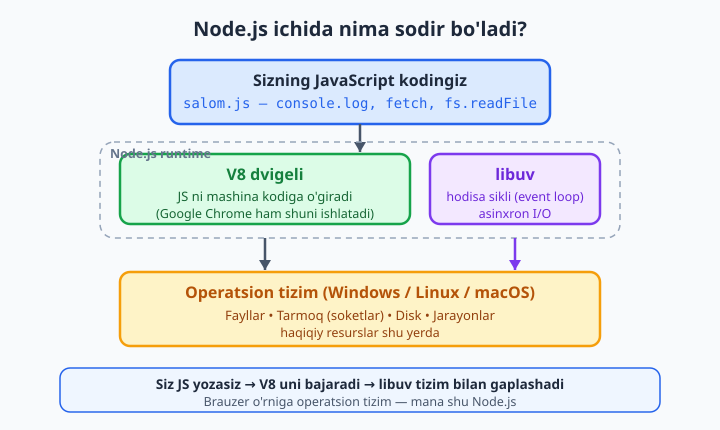
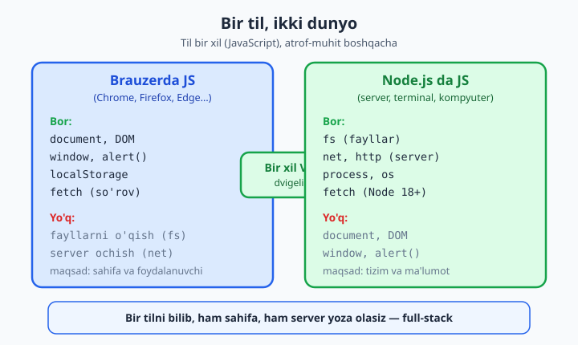

# 01 — Node.js nima va o'rnatish

[🏠 README](./README.md) · [Keyingi: 02 — Modullar: CommonJS va ESM ➡️](./02-modullar.md)

> **Bu bobda:** JavaScript hozirgacha sizning ongingizda faqat brauzer bilan bog'liq bo'lsa, shu bob shu tasavvurni ochib tashlaydi. Node.js — bu brauzerdan tashqarida, to'g'ridan-to'g'ri kompyuteringizda yoki serverda JavaScript ishga tushiruvchi muhit (runtime). Uning ichida nima borligini (V8 dvigeli, libuv), nega u shu qadar mashhur bo'lganini (bitta tilda butun loyiha, ulkan npm ekotizimi) va uning asinxron, "bloklamaydigan" tabiati nimani anglatishini ko'ramiz. Node.js qachon to'g'ri tanlov, qachon noto'g'ri tanlov ekanini aniqlaymiz. Brauzerdagi JS bilan farqini (DOM yo'q, lekin fayl va tarmoq bor) tushunamiz. Oxirida Node'ni o'rnatamiz, versiyani tekshiramiz, REPL bilan o'ynaymiz va birinchi haqiqiy skriptni — buyruq qatoridan ism qabul qiladigan salomlashuvchi CLI'ni — yozib ishga tushiramiz.

---

## JavaScript faqat brauzer uchunmi edi?

Ko'pchilik JavaScript bilan brauzerda tanishadi. Sahifaga tugma qo'yasiz, bosilganda `alert("Salom!")` chiqadi, `document.querySelector` bilan elementni topasiz, `fetch` bilan serverdan ma'lumot olasiz. Bularning hammasi **brauzer ichida** sodir bo'ladi. Tabiiy savol tug'iladi: JavaScript brauzersiz, o'zicha ishlay oladimi?

1995-yilda JavaScript aynan brauzer uchun yaratilgan edi. Yigirma yildan ko'proq vaqt davomida u brauzerdan tashqariga deyarli chiqa olmadi. Server tomonida (foydalanuvchiga sahifa jo'natadigan, ma'lumotlar bazasi bilan ishlaydigan dasturlar) PHP, Python, Java, Ruby kabi tillar hukmronlik qildi.

2009-yilda Rayan Dal (Ryan Dahl) bir g'oyani amalga oshirdi: brauzerning ichidan eng tez JavaScript dvigelini — Google'ning **V8**'ini — olib chiqib, uni mustaqil dasturga aylantirsa-chi? Natija **Node.js** bo'ldi. Endi JavaScript brauzerdan tashqarida, terminalda, serverda — xohlagan joyda ishlay oladigan to'liq huquqli til bo'ldi.

Ya'ni Node.js — yangi til **emas**. U siz allaqachon biladigan (yoki o'rganayotgan) JavaScript'ning aynan o'zi, faqat boshqa joyda ishlaydi.

## Node.js nima? (aniq ta'rif)

Ta'rif sodda, lekin har bir so'zi muhim:

> **Node.js — bu JavaScript kodini brauzerdan tashqarida ishga tushiruvchi runtime (ishga tushirish muhiti).**

"Runtime" so'zini ochib tashlaylik. Bu — kodingiz ishlashi uchun zarur bo'lgan butun atrof-muhit: kodni tushunadigan dvigel, tizim bilan gaplashadigan ko'mak qatlamlari, tayyor kutubxonalar. Brauzer ham JavaScript uchun runtime'dir — lekin brauzer sahifalar va foydalanuvchi uchun mo'ljallangan. Node.js esa **serverlar, terminal vositalari va kompyuterning o'zi** bilan ishlash uchun mo'ljallangan runtime.

Node ichida nima bor? Ikkita asosiy qism:

- **V8** — Google yaratgan JavaScript dvigeli. Uning vazifasi: siz yozgan JavaScript matnini kompyuter tushunadigan mashina kodiga o'girib, bajarish. Aytib o'tganimizdek, aynan shu dvigel Google Chrome ichida ham ishlaydi. Demak Node va Chrome JavaScript'ni bir xil tezlik va xulq bilan bajaradi.
- **libuv** — C tilida yozilgan kutubxona. U Node'ga operatsion tizim bilan gaplashishni o'rgatadi: fayllarni o'qish/yozish, tarmoq ulanishlari, va eng muhimi — **asinxron, bloklamaydigan I/O** va **hodisa sikli (event loop)**. Bu nima ekanini biroz pastda intuitiv tushuntiramiz, chuqur ko'rinishini esa 05-bobda ochamiz.

V8 "JavaScript'ni bajaradi", libuv esa "tashqi dunyo bilan bog'laydi". Ikkalasi birgalikda Node.js'ni tashkil qiladi.



Diagrammani yuqoridan pastga o'qing: sizning `salom.js` faylingizdagi JavaScript V8'ga tushadi, V8 uni bajaradi. Kodingiz faylga yozish yoki tarmoqdan ma'lumot olish kabi tashqi ishni so'rasa — bu so'rov libuv orqali operatsion tizimga uzatiladi. Operatsion tizim haqiqiy diskka yozadi yoki tarmoqqa chiqadi. Brauzerda bu eng pastki qatlam "sahifa va foydalanuvchi" edi; Node'da esa — "operatsion tizim va uning resurslari". Butun farq mana shu pastki qatlamda.

## Nega Node.js? (nega bunchalik mashhur?)

Yangi texnologiya faqat "ishlagani" uchun mashhur bo'lmaydi — u kishilarning hayotini yengillashtirgani uchun mashhur bo'ladi. Node bir nechta sababga ko'ra dunyoni zabt etdi.

**1. Bitta til — butun loyiha (full-stack JavaScript).** Veb-dastur odatda ikki qismdan iborat: brauzerda ishlaydigan qism (frontend) va serverda ishlaydigan qism (backend). Node'dan oldin frontend'ni JavaScript'da, backend'ni esa boshqa tilda (masalan PHP yoki Python) yozishga to'g'ri kelardi. Bu — ikki til, ikki fikrlash tarzi, ba'zan ikki xil dasturchi degani edi. Node bilan **ikkala qismni ham JavaScript'da** yozish mumkin bo'ldi. Bir tilni chuqur bilsangiz — butun ilovani yoza olasiz. Buni "full-stack JavaScript" deyishadi.

**2. npm — dunyodagi eng katta kod kutubxonasi.** Node bilan birga **npm** (Node Package Manager) keladi. Bu — boshqa dasturchilar yozib, bepul ulashgan tayyor "paketlar" ombori. Sana bilan ishlashmi, server qurishmi, rasm tahrirlashmi — deyarli har bir vazifa uchun tayyor paket bor. Hozirda npm'da millionlab paket mavjud va u dunyodagi eng katta dasturiy ta'minot ombori hisoblanadi. Bu — har safar g'ildirakni qaytadan ixtiro qilmaslik degani.

**3. Tez va katta yuk ko'tara oladi.** Node'ning asinxron modeli (buni keyingi bo'limda ko'ramiz) uni ayniqsa minglab bir vaqtdagi foydalanuvchilarni boshqarishda samarali qiladi. Shuning uchun Netflix, PayPal, LinkedIn, Uber kabi yirik kompaniyalar o'z serverlarining muhim qismini Node'da quradi.

**4. Asboblar ham Node'da.** Bugun frontend dunyosining deyarli barcha asboblari — React, Vue, Angular qurish vositalari, Vite, Webpack, TypeScript kompilyatori, ESLint, Prettier — Node ustida ishlaydi. Demak frontend yozsangiz ham, Node'siz bir qadam ham bosa olmaysiz. Node — zamonaviy veb-ishlab chiqishning poydevoridir.

## Asinxron, bloklamaydigan — bu nima degani?

Bu Node'ning eng o'ziga xos, lekin boshlovchini ko'p chalkashtiradigan jihati. Hozir faqat **intuitsiya** beramiz — to'liq mexanizmni 05-bobda hodisa sikli bilan ochamiz.

Tasavvur qiling, oshxonada bitta oshpaz bor. Unga uchta buyurtma keldi: choy damlash, tuxum qaynatish, non yopish. Ikki ish uslubi bor.

**Bloklaydigan (sinxron) uslub:** Oshpaz choyni damlab, suv qaynaguncha **qo'l qovushtirib kutib turadi**. Choy tayyor bo'lgachgina tuxumga o'tadi va yana qaynaguncha kutadi. Har bir mijoz oldingisi tugamaguncha kutishi kerak. Bitta sekin ish butun navbatni to'xtatib qo'yadi.

**Bloklamaydigan (asinxron) uslub:** Oshpaz choyni gazga qo'yadi-yu, qaynashini kutmasdan darrov tuxumni qo'yadi, keyin nonni tandirga soladi. Endi uchchala ish **bir vaqtda** "pishmoqda". Qaysi biri tayyor bo'lsa — taymer "ding!" qiladi (bu — hodisa, event) — oshpaz o'sha ishni yakunlaydi. Oshpaz hech qachon bekor turmaydi.

Node aynan ikkinchi oshpaz kabi ishlaydi. "I/O" (Input/Output — kirish/chiqish: fayl o'qish, ma'lumotlar bazasiga so'rov, tarmoq so'rovi) — bu sekin ishlar. Node ularni boshlab qo'yadi-yu, javobni kutib o'tirmaydi; boshqa ishlar bilan davom etadi. Javob kelganda esa Node uni "hodisa" sifatida qabul qilib, kerakli kodni ishga tushiradi. Shuning uchun Node **hodisa-asoslangan (event-driven)** deyiladi.

Natija: bitta Node jarayoni minglab foydalanuvchini bir vaqtda xizmat qila oladi — chunki u kutish vaqtini behuda sarflamaydi. Bu shuningdek nega Node I/O ko'p ishlarda zo'r, lekin og'ir hisob-kitobda kuchsiz ekanini tushuntiradi (pastda ko'ramiz).

## Node qachon to'g'ri tanlov, qachon yo'q?

Hech bir texnologiya "har narsa uchun eng yaxshi" emas. Node'ning kuchi va zaifligi uning asinxron tabiatidan kelib chiqadi.

**Node mos keladi (I/O ko'p, hisob-kitob kam):**

- **Veb-saytlar va REST API'lar** — so'rovlarning aksariyati ma'lumotlar bazasidan o'qib, javob qaytarishdan iborat (sof I/O). Node bunda a'lo.
- **Real vaqtli ilovalar** — chat, onlayn o'yin, jonli bildirishnomalar, hamkorlikdagi tahrirchilar. Ko'p ulanishni bir vaqtda ushlab turish — Node'ning kuchli tarafi.
- **Mikroservislar va vositalar (CLI)** — yengil, tez ishga tushadigan dasturlar.

**Node mos kelmaydi (CPU ko'p, og'ir hisob-kitob):**

- **Og'ir matematik hisob-kitoblar** — video qayta ishlash, murakkab tasvir tahlili, ilmiy modellashtirish, kriptografik "qazib olish". Bunday vazifa protsessorni uzoq band qiladi. Node'ning bitta asosiy "oshpazi" shu bir ishga bandligida boshqa hech kimga xizmat qila olmaydi — navbat to'xtaydi. Bunday ishlar uchun ko'p oqimli (multithread) tillar — masalan, Go, Rust, C++, Java — ko'pincha to'g'riroq tanlov.

Qoidani sodda eslab qoling: **Node ko'p kutib, kam hisoblaydigan ishlarni yaxshi ko'radi.** Sizning ishingiz asosan "ma'lumotni u yer-bu yerga ko'chirish" bo'lsa — Node ajoyib. Asosan "raqamlarni uzoq xrustlatish" bo'lsa — boshqa yo'lni o'ylab ko'ring.

## Brauzerdagi JS va Node'dagi JS farqi

Til bir xil, lekin **atrof-muhit** boshqacha. Bu farqni tushunmaslik boshlovchini ko'p adashtiradi, shuning uchun aniq qaratib o'tamiz.



**Brauzerda bor, Node'da yo'q:**

- `document`, DOM (sahifadagi HTML elementlar) — Node'da hech qanday sahifa yo'q, shuning uchun DOM ham yo'q.
- `window`, `alert()`, `localStorage` — bularning hammasi brauzer oynasiga bog'liq, Node'da mavjud emas.

```js
// ❌ Bu kod Node'da xato beradi: brauzer obyektlari yo'q
console.log(document.title);
// ReferenceError: document is not defined
```

**Node'da bor, brauzerda yo'q:**

- `fs` (file system) — fayllarni o'qish va yozish. Brauzerdagi JS xavfsizlik sababli sizning diskingizga erkin kira olmaydi; Node esa kira oladi.
- `net`, `http` — server ochish, tarmoq bilan past darajada ishlash.
- `process` — ishlab turgan jarayon haqida ma'lumot: argumentlar, atrof-muhit o'zgaruvchilari, versiya.
- `os`, `path`, `crypto` va boshqa ko'plab o'rnatilgan modullar.

```js
// Bu kod faqat Node'da ishlaydi — brauzerda fs yo'q
import { readFileSync } from "node:fs";
const matn = readFileSync("eslatma.txt", "utf8");
console.log(matn);
```

**Ikkalasida ham bor:** tilning o'zagi — `let`, `const`, funksiyalar, massivlar, obyektlar, `Array.map`, `Promise`, `async/await`, `JSON`, va Node 18-versiyadan boshlab — global `fetch`. Demak siz brauzerda o'rgangan JavaScript bilimingizning katta qismi Node'da ham aynan ishlaydi. Faqat "atrofdagi mebel" boshqacha.

## Node.js'ni o'rnatish

Endi amaliyotga o'tamiz. Node'ni o'rnatishning eng oddiy yo'li — rasmiy saytdan.

1. [nodejs.org](https://nodejs.org) saytiga kiring.
2. Ikkita yuklash tugmasidan **LTS** belgilangani-ni tanlang. LTS — "Long Term Support" (uzoq muddatli qo'llab-quvvatlash) degani: bu eng barqaror, ishlab chiqarish (production) uchun tavsiya etiladigan versiya. Yonidagi "Current" versiya eng so'nggi yangiliklar bilan keladi, lekin barqarorligi kamroq — boshlovchi uchun LTS to'g'ri tanlov.
3. Yuklab olingan o'rnatuvchini ishga tushiring va "Keyingi → Keyingi → Tugatish" tartibida o'rnating. Standart sozlamalar yetarli. Windows'da o'rnatuvchi npm'ni ham, `PATH`'ni ham avtomatik to'g'rilab beradi.

> **nvm haqida eslatma.** Tajribangiz oshgach, ko'pincha bir nechta Node versiyasini parallel saqlab, loyihalar orasida almashtirish kerak bo'ladi (bir loyiha eski versiyani, boshqasi yangisini talab qilishi mumkin). Buning uchun **nvm** (Node Version Manager) ishlatiladi: Linux/macOS uchun `nvm`, Windows uchun `nvm-windows`. Hozircha bu shart emas — rasmiy o'rnatuvchi yetarli. Lekin "nvm" so'zini eshitsangiz, bilingki — bu Node versiyalarini boshqarish vositasi.

### O'rnatishni tekshirish

O'rnatgach, terminalni (Windows'da PowerShell yoki Command Prompt, macOS/Linux'da Terminal) oching va ikki buyruq yozing:

```bash
node -v
npm -v
```

Quyidagiga o'xshash natija ko'rishingiz kerak (raqamlar sizda boshqacha bo'lishi mumkin):

```text
v24.12.0
11.6.2
```

Agar versiya raqamlari chiqsa — tabriklaymiz, Node ham, npm ham o'rnatildi va ishlayapti. Agar "node is not recognized" yoki "command not found" desa — o'rnatish yakunlanmagan yoki terminalni qayta ochish kerak (`PATH` yangilanishi uchun yangi terminal oyna oching).

> Bu kitobdagi barcha kod **Node 24** (LTS) da yozilib, ishga tushirib tekshirilgan. Sizda 20 yoki undan yuqori versiya bo'lsa, deyarli hamma narsa aynan ishlaydi.

## REPL — Node bilan jonli suhbat

Skript yozishdan oldin Node bilan tezda "gaplashib" ko'rishning ajoyib yo'li bor — **REPL**. Bu so'z to'rt qadamning bosh harfidan tuzilgan: **R**ead (o'qish) — **E**val (baholash) — **P**rint (chop etish) — **L**oop (qaytarish). Ya'ni siz bir satr yozasiz, Node uni darrov bajarib, natijani ko'rsatadi, va yana sizdan keyingi satrni so'raydi.

REPL'ni ochish uchun terminalga shunchaki `node` deb yozing (hech qanday fayl nomisiz):

```bash
node
```

`>` belgisi paydo bo'ladi — Node sizni kutyapti. Endi har qanday JavaScript ifodasini yozib, Enter bosing:

```text
> 2 + 2
4
> const ism = "Oqil"
undefined
> `Salom, ${ism}!`
'Salom, Oqil!'
> [1, 2, 3].map(n => n * 2)
[ 2, 4, 6 ]
> process.version
'v24.12.0'
```

E'tibor bering, `const ism = "Oqil"` qatori `undefined` qaytardi — chunki o'zgaruvchi e'lon qilish hech narsa "qaytarmaydi", lekin o'zgaruvchi baribir yaratildi (keyingi qatorda ishlatdik). REPL — yangi g'oyani, kichik ifodani yoki o'rnatilgan modulni tezda sinab ko'rish uchun zo'r joy. Hisoblagich sifatida ham ishlatsa bo'ladi.

Chiqish uchun `.exit` deb yozing yoki ikki marta `Ctrl + C` bosing.

## Birinchi skript — `node fayl.js`

REPL tez sinash uchun yaxshi, lekin haqiqiy dasturlarni faylga yozamiz. Ixtiyoriy joyda papka yarating (masalan `node-mashq`), uning ichida `salom.js` nomli fayl oching va shuni yozing:

```js
console.log("Salom, Node.js!");
console.log("Bugun:", new Date().toLocaleDateString("uz-UZ"));
console.log("Node versiyasi:", process.version);
console.log("Platforma:", process.platform);
```

Endi terminalda o'sha papkaga o'tib, faylni ishga tushiring:

```bash
node salom.js
```

Natija:

```text
Salom, Node.js!
Bugun: 12/06/2026
Node versiyasi: v24.12.0
Platforma: win32
```

Mana — sizning birinchi Node dasturingiz ishladi! `console.log` brauzerdagi kabi ishlaydi, faqat natija sahifaning konsoliga emas, **terminalga** chiqadi. `process.version` va `process.platform` esa — Node'gagina xos: ular ishlab turgan muhit haqida ma'lumot beradi (`win32` — Windows, `linux`, `darwin` — macOS).

## REAL KEYS: buyruq qatoridan ism qabul qiladigan salomlashuvchi CLI

Endi quruq sintaksisdan haqiqiy mini-vazifaga o'tamiz. Tasavvur qiling, siz jamoangiz uchun kichik bir terminal vositasi yozyapsiz — uni ishga tushirganda, **foydalanuvchi nomini argument sifatida berib**, shaxsiy salom olish kerak. Bu — har qanday CLI (Command Line Interface — buyruq qatori vositasi) dasturining asosi: foydalanuvchidan kirish ma'lumotini qabul qilish.

Node'da buyruq qatoridan berilgan argumentlar **`process.argv`** massivida turadi. Uni tekshirib ko'raylik. `argv-korish.js` fayl yarating:

```js
console.log(process.argv);
```

Va ishga tushiring:

```bash
node argv-korish.js Oqil 25
```

Natija (yo'llar sizda boshqacha bo'ladi):

```text
[
  'C:\\Program Files\\nodejs\\node.exe',
  'C:\\Users\\imomn\\node-mashq\\argv-korish.js',
  'Oqil',
  '25'
]
```

Diqqat qiling: massivning **birinchi ikki elementi** har doim band — `[0]` Node'ning o'zining yo'li, `[1]` esa skript faylining yo'li. Bizga keragi — undan keyingilari. Shuning uchun **`slice(2)`** bilan birinchi ikkitasini kesib tashlaymiz. Endi to'liq vositani yozamiz — `salomla.js`:

```js
// process.argv — buyruq qatori argumentlari massivi.
// [0] = node yo'li, [1] = skript yo'li, [2..] = haqiqiy argumentlar.
const arglar = process.argv.slice(2);

if (arglar.length === 0) {
  console.log("Salom, notanish! Ismingizni kiriting: node salomla.js Oqil");
} else {
  const ism = arglar.join(" ");
  console.log(`Salom, ${ism}! Node.js dunyosiga xush kelibsiz.`);
}
```

Sinab ko'ramiz — uchta holatda:

```bash
node salomla.js
# Salom, notanish! Ismingizni kiriting: node salomla.js Oqil

node salomla.js Oqil
# Salom, Oqil! Node.js dunyosiga xush kelibsiz.

node salomla.js Oqil Imomnazarov
# Salom, Oqil Imomnazarov! Node.js dunyosiga xush kelibsiz.
```

Mana sizning birinchi haqiqiy CLI vositangiz. E'tibor bering, biz `arglar.length === 0` bilan **kirish yo'qligini** ham qayta ishladik — bu professional dasturning belgisi: foydalanuvchi noto'g'ri ishlatsa, dastur yiqilmaydi, balki nima qilish kerakligini tushuntiradi. `join(" ")` esa bir nechta so'zni (ism va familiya) bitta matnga birlashtiradi.

Buni biroz boyitsak — vaqtga qarab salomlashadigan versiya `vaqt.js`:

```js
const arglar = process.argv.slice(2);
const ism = arglar[0] || "do'stim";

const hozir = new Date();
const soat = hozir.getHours();

let salom;
if (soat < 6) salom = "Tunni xayrli o'tkazyapsizmi";
else if (soat < 12) salom = "Xayrli tong";
else if (soat < 18) salom = "Xayrli kun";
else salom = "Xayrli kech";

const vaqt = hozir.toLocaleTimeString("uz-UZ");
console.log(`${salom}, ${ism}! Hozir soat ${vaqt}.`);
```

```bash
node vaqt.js Oqil
# Xayrli kun, Oqil! Hozir soat 12:05:31.
```

Bu yerda ikkita yangi g'oya bor. `arglar[0] || "do'stim"` — argument berilmasa, "do'stim" qiymatini sukut bo'yicha (default) oladi. Va `new Date().getHours()` bilan joriy soatga qarab to'g'ri salomlashuvni tanlaymiz. Atigi 12 qator kodda — kirish qabul qilish, sukut qiymat, shart, va sana bilan ishlash — haqiqiy dasturning to'rt asosiy elementi jamlangan.

## npm ekotizimi — qisqacha kirish

Node bilan birga o'rnatilgan **npm** haqida bir og'iz aytib o'tamiz (chuqur foydalanishni keyingi boblarda ko'ramiz). npm ikki narsani anglatadi:

1. **Vosita** — terminaldagi `npm` buyrug'i. U bilan loyihaga tashqi paketlar o'rnatasiz, masalan `npm install express`.
2. **Ombor (registry)** — [npmjs.com](https://www.npmjs.com) saytida joylashgan, millionlab tayyor paket saqlanadigan ulkan kutubxona.

G'oya oddiy: birovning yozgan foydali kodini noldan qaytadan yozmay, bir buyruq bilan loyihangizga qo'shasiz. Masalan, veb-server qurish uchun **Express**, sanani chiroyli formatlash uchun **dayjs**, terminalga rangli matn chiqarish uchun **chalk** kabi paketlar bor. Har bir o'rnatilgan paket loyihangizning `node_modules` papkasiga tushadi, ro'yxati esa `package.json` faylida saqlanadi.

Hozircha shuni bilsangiz yetarli: **Node — dvigel, npm — uning ulkan ehtiyot qismlar do'koni.** Keyingi boblarda avval modullar (02-bob), keyin npm bilan to'liq ishlashni o'rganamiz va Express bilan haqiqiy server quramiz.

## Xulosa

- **Node.js** — JavaScript'ni brauzerdan tashqarida ishga tushiruvchi runtime. Yangi til emas — bu o'sha JavaScript, boshqa joyda.
- Ichida **V8** (JS'ni bajaradigan dvigel) va **libuv** (tizim bilan ishlash, asinxron I/O, hodisa sikli) bor.
- Node mashhur, chunki: **bitta tilda full-stack**, ulkan **npm** ekotizimi, va asinxron modeli tufayli yuqori yuk ko'tara olishi.
- Node **asinxron va bloklamaydigan**: sekin I/O ishlarni kutib o'tirmaydi, shuning uchun I/O ko'p ishlarda (veb, API, real-time) zo'r, lekin og'ir CPU hisob-kitobda kuchsiz.
- Brauzerdan farqi: **DOM/window yo'q**, lekin **fs/net/process** bor. Til o'zagi esa bir xil.
- O'rnatish: nodejs.org → LTS. Tekshirish: `node -v`, `npm -v`. Tez sinash: `node` (REPL). Skript ishga tushirish: `node fayl.js`.
- **`process.argv`** bilan buyruq qatori argumentlarini o'qib, oddiy CLI vositalar yozish mumkin (`slice(2)` ni unutmang).

Keyingi bobda **modullar**ga o'tamiz: kodni bir nechta faylga bo'lib, ularni bir-biriga bog'lashni — CommonJS (`require`) va zamonaviy ESM (`import`/`export`) usullarini — o'rganamiz.

---

## Mashqlar

### Oson

1. O'z so'zlaringiz bilan bir-ikki jumlada javob bering: "Node.js — bu yangi dasturlash tili" degan fikr to'g'rimi? Nega?
2. Terminalingizda `node -v` va `npm -v` buyruqlarini ishga tushiring va chiqqan versiyalarni yozib qo'ying.
3. REPL'ni oching (`node`) va quyidagilarni hisoblang: `100 * 12`, `"Node" + ".js"`, `[5, 3, 9].sort()`. Har birining natijasini yozing. Keyin REPL'dan qanday chiqish mumkinligini ayting.
4. `salom.js` skriptini yarating, unda o'z ismingiz va sevimli rangingizni `console.log` bilan chiqaring, `node salom.js` bilan ishga tushiring.
5. Quyidagilardan qaysilari brauzerda bor, qaysilari Node'da bor: `document`, `fs`, `window`, `process`, `alert`, `fetch`? Ikki ustunga ajrating (`fetch` ikkalasida ham borligini eslang).

### O'rta

6. `process.argv` nima ekanini tushuntiring va nega undan deyarli har doim `slice(2)` qilinishini ayting.
7. Quyidagi vazifalardan qaysilariga Node mos, qaysilariga mos emas — har biriga sabab yozing: (a) chat ilovasi serveri, (b) 4K videolarni qayta kodlash dasturi, (c) ob-havo API'si, (d) shaxmat dvigeli (har bir yurish uchun millionlab variantni hisoblaydigan).
8. `son.js` skript yozing: u buyruq qatoridan ikkita son qabul qilib (`node son.js 7 5`), ularning yig'indisini chiqarsin. Maslahat: `process.argv`'dagi argumentlar **matn** (string) bo'ladi — `Number()` bilan songa o'giring.
9. "Node bloklamaydi" iborasini oshxonadagi oshpaz misolidan foydalanmasdan, o'z misolingiz bilan tushuntiring.
10. `vaqt.js` skriptini shunday o'zgartiring: agar foydalanuvchi nom bermasa "do'stim" emas, "mehmon" deb salomlasin va ekranga joriy **sana**ni ham (`toLocaleDateString`) qo'shsin.

### Qiyin

11. `salom-kop.js` CLI yozing: u istalgan miqdordagi ismni qabul qilsin (`node salom-kop.js Oqil Ali Vali`) va har biriga alohida qatorda salom chiqarsin. Agar hech kim berilmasa, foydalanish yo'riqnomasini ko'rsatsin. Massivni aylanish (`for...of` yoki `forEach`) kerak bo'ladi.
12. `kalkulyator.js` yozing: u uchta argument oladi — son, amal, son (`node kalkulyator.js 8 + 3`). Qo'llab-quvvatlanadigan amallar: `+ - x /`. To'g'ri natijani chiqarsin (ko'paytirish uchun `*` o'rniga `x` ishlatamiz, chunki ko'p terminalda `*` maxsus belgi). Nolga bo'lish va noma'lum amalni alohida xato xabari bilan qayta ishlang.

<details markdown="1"><summary>Yechim — 1</summary>

Yo'q, bu fikr **noto'g'ri**. Node.js — yangi til emas, balki JavaScript'ni ishga tushiruvchi **muhit (runtime)**. Til o'sha-o'sha JavaScript: `let`, `const`, funksiyalar, massivlar, `async/await` — hammasi bir xil. Faqat kod endi brauzer ichida emas, brauzerdan **tashqarida** (terminalda, serverda) ishlaydi. Ya'ni Node siz biladigan JavaScript'ga yangi qobiliyat (fayl o'qish, server ochish) qo'shadi, lekin tilning o'zini almashtirmaydi.

</details>

<details markdown="1"><summary>Yechim — 2</summary>

```bash
node -v
# v24.12.0

npm -v
# 11.6.2
```

Sizdagi raqamlar boshqacha bo'lishi mumkin — bu normal. Muhimi: ikkala buyruq ham versiya raqami qaytarsa, Node ham, npm ham to'g'ri o'rnatilgan. Agar "node is not recognized" yoki "command not found" chiqsa, terminalni qayta oching (`PATH` yangilanishi uchun) yoki o'rnatishni qaytadan bajaring.

</details>

<details markdown="1"><summary>Yechim — 3</summary>

```text
> 100 * 12
1200
> "Node" + ".js"
'Node.js'
> [5, 3, 9].sort()
[ 3, 5, 9 ]
```

- `100 * 12` — oddiy ko'paytirish, natija `1200`.
- `"Node" + ".js"` — ikki matnni ulash (konkatenatsiya), natija `'Node.js'`.
- `[5, 3, 9].sort()` — massivni saralaydi, natija `[ 3, 5, 9 ]`. (Diqqat: `sort()` sukut bo'yicha elementlarni **matn** sifatida saralaydi; bu yerda bir xonali sonlar bo'lgani uchun natija son tartibiga to'g'ri keldi.)

REPL'dan chiqish: `.exit` deb yozing yoki ikki marta `Ctrl + C` bosing.

</details>

<details markdown="1"><summary>Yechim — 4</summary>

```js
// salom.js
console.log("Ismim: Oqil");
console.log("Sevimli rangim: ko'k");
```

```bash
node salom.js
# Ismim: Oqil
# Sevimli rangim: ko'k
```

`console.log` — brauzerdagi kabi ishlaydi, faqat natija sahifa konsoliga emas, **terminalga** chiqadi. O'z ism va rangingizni qo'ying.

</details>

<details markdown="1"><summary>Yechim — 5</summary>

| Faqat brauzerda | Faqat Node'da | Ikkalasida ham |
|---|---|---|
| `document`, `window`, `alert` | `fs`, `process` | `fetch` |

- `document`, `window`, `alert` — brauzer oynasi va sahifaga bog'liq, Node'da yo'q (Node'da sahifa yo'q).
- `fs`, `process` — operatsion tizim va jarayon bilan ishlash uchun, brauzerda yo'q (brauzer xavfsizlik sababli diskka erkin kira olmaydi).
- `fetch` — brauzerda azaldan bor edi, Node'da esa **18-versiyadan** boshlab global bo'lib qo'shildi. Demak hozir ikkalasida ham bor.

</details>

<details markdown="1"><summary>Yechim — 6</summary>

`process.argv` — Node dasturi ishga tushganda buyruq qatoridan berilgan **barcha argumentlar massivi**. Lekin uning birinchi ikki elementi har doim band:

- `process.argv[0]` — Node ijro etuvchisining (`node.exe`) yo'li.
- `process.argv[1]` — ishga tushayotgan skript faylining yo'li.
- `process.argv[2]` va keyingilari — foydalanuvchi haqiqatan bergan argumentlar.

Bizga deyarli har doim faqat **foydalanuvchi argumentlari** kerak, shuning uchun `slice(2)` bilan birinchi ikki (texnik) elementni kesib tashlaymiz va toza ro'yxat olamiz.

```js
// node dastur.js Oqil 25
process.argv.slice(2); // ["Oqil", "25"]
```

</details>

<details markdown="1"><summary>Yechim — 7</summary>

- **(a) chat ilovasi serveri — MOS.** Chat — bu ko'p ulanishni bir vaqtda ushlab turish va xabarlarni u yer-bu yerga uzatish (sof I/O, real-time). Node'ning eng kuchli tarafi.
- **(b) 4K videolarni qayta kodlash — MOS EMAS.** Video kodlash — protsessorni uzoq band qiladigan og'ir hisob-kitob (CPU-bound). Node'ning bitta asosiy oqimi shu ishga band bo'lib qolib, boshqalarni bloklaydi.
- **(c) ob-havo API'si — MOS.** API odatda boshqa manbadan (baza yoki tashqi xizmat) ma'lumot olib, javob qaytaradi — sof I/O. Node bunda a'lo.
- **(d) shaxmat dvigeli — MOS EMAS.** Har yurish uchun millionlab variantni hisoblash — og'ir CPU ishi. Bunday vazifaga ko'p oqimli tillar (Go, Rust, C++) to'g'riroq.

Umumiy qoida: ko'p **kutadigan** (I/O) ishlarga Node mos, ko'p **hisoblaydigan** (CPU) ishlarga mos emas.

</details>

<details markdown="1"><summary>Yechim — 8</summary>

```js
// son.js
const [aMatn, bMatn] = process.argv.slice(2);

if (aMatn === undefined || bMatn === undefined) {
  console.log("Foydalanish: node son.js <son1> <son2>");
  process.exit(1);
}

const a = Number(aMatn);
const b = Number(bMatn);

if (Number.isNaN(a) || Number.isNaN(b)) {
  console.log(`Xato: "${aMatn}" yoki "${bMatn}" son emas.`);
  process.exit(1);
}

console.log(`${a} + ${b} = ${a + b}`);
```

```bash
node son.js 7 5
# 7 + 5 = 12

node son.js 7
# Foydalanish: node son.js <son1> <son2>

node son.js olma 5
# Xato: "olma" yoki "5" son emas.
```

Asosiy nuqta: `process.argv`'dagi argumentlar **matn** (string) bo'ladi. Agar `Number()` bilan songa o'girmasangiz, `"7" + "5"` natijasi `"75"` (matnlar ulanadi) bo'lib qolardi — `12` emas. Shuning uchun avval `Number()` bilan o'giramiz, keyin qo'shamiz. Yetishmagan yoki son bo'lmagan kirishni ham tekshirib qo'yish — professional odat.

</details>

<details markdown="1"><summary>Yechim — 9</summary>

Misol — restorandagi ofitsiant. **Bloklaydigan** ofitsiant bitta stolga buyurtma olib, oshxonaga berib, taom tayyor bo'lguncha o'sha stol yonida qo'l qovushtirib turadi; boshqa stollar kutib qoladi. **Bloklamaydigan** ofitsiant esa buyurtmani oshxonaga uzatadi-yu, darrov keyingi stolga o'tadi, undan keyingisiga; qaysidir taom tayyor bo'lganda (bu — hodisa) borib olib keladi. Bitta ofitsiant ko'p stolni samarali xizmat qiladi, chunki u **kutish vaqtini behuda sarflamaydi**. Node aynan shunday: I/O (fayl, baza, tarmoq) javobini kutib o'tirmasdan boshqa ishlar bilan davom etadi.

(Boshqa mos misollar: kir yuvish mashinasini yoqib qo'yib, kutmasdan ovqat tayyorlash; pochta jo'natib, javob kutmasdan ishni davom ettirish.)

</details>

<details markdown="1"><summary>Yechim — 10</summary>

```js
// vaqt.js
const arglar = process.argv.slice(2);
const ism = arglar[0] || "mehmon";

const hozir = new Date();
const soat = hozir.getHours();

let salom;
if (soat < 6) salom = "Tunni xayrli o'tkazyapsizmi";
else if (soat < 12) salom = "Xayrli tong";
else if (soat < 18) salom = "Xayrli kun";
else salom = "Xayrli kech";

const vaqt = hozir.toLocaleTimeString("uz-UZ");
const sana = hozir.toLocaleDateString("uz-UZ");
console.log(`${salom}, ${ism}! Bugun ${sana}, hozir soat ${vaqt}.`);
```

```bash
node vaqt.js Oqil
# Xayrli kun, Oqil! Bugun 12/06/2026, hozir soat 12:21:08.

node vaqt.js
# Xayrli kun, mehmon! Bugun 12/06/2026, hozir soat 12:21:08.
```

Ikkita o'zgartirish: `"do'stim"` o'rniga sukut qiymat `"mehmon"` qilindi, va `toLocaleDateString("uz-UZ")` bilan joriy **sana** qo'shildi. Sana va vaqt sizning kompyuteringizdagi qiymatga qarab boshqacha chiqadi.

</details>

<details markdown="1"><summary>Yechim — 11</summary>

```js
// salom-kop.js
const ismlar = process.argv.slice(2);

if (ismlar.length === 0) {
  console.log("Foydalanish: node salom-kop.js <ism1> <ism2> ...");
  console.log("Masalan:    node salom-kop.js Oqil Ali Vali");
} else {
  for (const ism of ismlar) {
    console.log(`Salom, ${ism}!`);
  }
  console.log(`Jami ${ismlar.length} kishiga salom berildi.`);
}
```

```bash
node salom-kop.js Oqil Ali Vali
# Salom, Oqil!
# Salom, Ali!
# Salom, Vali!
# Jami 3 kishiga salom berildi.

node salom-kop.js
# Foydalanish: node salom-kop.js <ism1> <ism2> ...
# Masalan:    node salom-kop.js Oqil Ali Vali
```

Asosiy g'oya: `slice(2)` bilan barcha ismlarni massivga olamiz, `for...of` bilan har biri ustidan yuramiz. `ismlar.length` esa nechta kishi borligini beradi — bo'sh holatni tekshirish va yakuniy hisob uchun ishlatdik.

</details>

<details markdown="1"><summary>Yechim — 12</summary>

```js
// kalkulyator.js
const [aMatn, amal, bMatn] = process.argv.slice(2);

// 1) Yetarli argument berilganini tekshiramiz
if (aMatn === undefined || amal === undefined || bMatn === undefined) {
  console.log("Foydalanish: node kalkulyator.js <son> <amal> <son>");
  console.log("Amallar: + - x /   Masalan: node kalkulyator.js 8 + 3");
  process.exit(1); // 0 bo'lmagan kod — xato bilan tugadi degani
}

// 2) Matnlarni songa o'giramiz va haqiqiy son ekanini tekshiramiz
const a = Number(aMatn);
const b = Number(bMatn);

if (Number.isNaN(a) || Number.isNaN(b)) {
  console.log(`Xato: "${aMatn}" yoki "${bMatn}" son emas.`);
  process.exit(1);
}

// 3) Amalni bajaramiz
let natija;
switch (amal) {
  case "+":
    natija = a + b;
    break;
  case "-":
    natija = a - b;
    break;
  case "x":
    natija = a * b;
    break;
  case "/":
    if (b === 0) {
      console.log("Xato: nolga bo'lib bo'lmaydi.");
      process.exit(1);
    }
    natija = a / b;
    break;
  default:
    console.log(`Xato: "${amal}" noma'lum amal. Faqat + - x / ishlaydi.`);
    process.exit(1);
}

console.log(`${a} ${amal} ${b} = ${natija}`);
```

```bash
node kalkulyator.js 8 + 3
# 8 + 3 = 11

node kalkulyator.js 10 x 4
# 10 x 4 = 40

node kalkulyator.js 9 / 0
# Xato: nolga bo'lib bo'lmaydi.

node kalkulyator.js 5 % 2
# Xato: "%" noma'lum amal. Faqat + - x / ishlaydi.

node kalkulyator.js olma + 3
# Xato: "olma" yoki "3" son emas.
```

Bu yechimda professional CLI'ning bir nechta muhim odati bor:

- **Massivni "yechib olish" (destructuring):** `const [aMatn, amal, bMatn] = ...` bilan uch argumentni darrov uchta o'zgaruvchiga ajratamiz.
- **Kirishni bosqichma-bosqich tekshirish:** avval argument bor-yo'qligini, keyin son ekanini, keyin amalning to'g'riligini, keyin nolga bo'lishni — har bir xato holatga alohida, tushunarli xabar.
- **`process.exit(1)`:** dastur xato bilan tugaganida 0 dan farqli "chiqish kodi" qaytaramiz. Bu — boshqa dasturlar (masalan, skriptlar) sizning vositangiz muvaffaqiyatli ishlaganmi yoki yo'qmi tushunishi uchun. `0` — muvaffaqiyat, `0` bo'lmagan har qanday son — xato.
- **`Number.isNaN`:** `Number("olma")` natijasi `NaN` (Not a Number) bo'ladi; aynan shuni tutib, foydalanuvchini ogohlantiramiz.

</details>

---

[🏠 README](./README.md) · [Keyingi: 02 — Modullar: CommonJS va ESM ➡️](./02-modullar.md)
