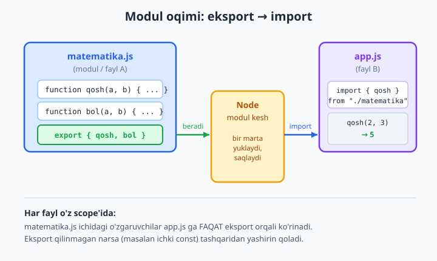
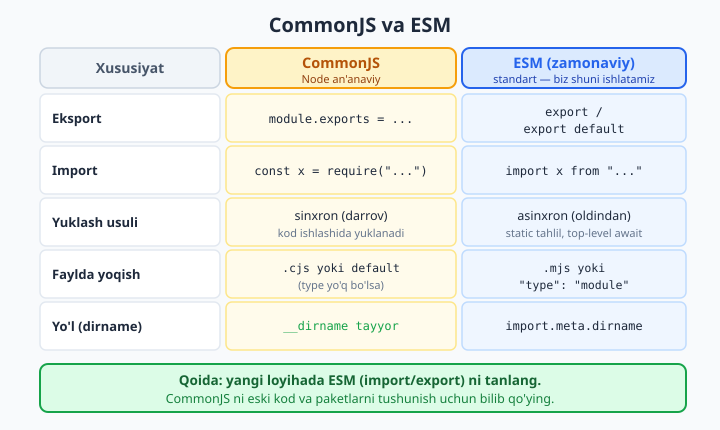

# 02 — Modullar: CommonJS va ESM

[⬅️ Oldingi: 01 — Node.js nima va o'rnatish](./01-nodejs-nima.md) · [🏠 README](./README.md) · [Keyingi: 03 — npm va package.json ➡️](./03-npm.md)

> **Bu bobda:** kodni nega bitta ulkan faylga emas, ko'p kichik **modul**larga bo'lish kerakligini ko'ramiz: qayta ishlatish, izolyatsiya, tartib. Keyin Node'ning ikki modul tizimini o'rganamiz — **CommonJS** (an'anaviy `require`/`module.exports`) va **ESM** (zamonaviy standart `import`/`export`). Har biri qanday ishlashini, fayl scope'i va modul kesh nimaligini, `__dirname` va uning ESM'dagi muqobili `import.meta` ni, top-level await'ni, built-in (`node:`) va uchinchi-tomon modullar farqini, Node modulni qanday topishini (resolution) va ikkalasini birga ishlatishdagi nozikliklarni ko'rib chiqamiz. Bitta matematik yordamchi modulni ham CommonJS, ham ESM uslubida yozib, boshqa fayldan chaqiramiz. Bu bobdan keyin kitobimizda **asosiy uslub ESM** bo'ladi.

---

## Nega modullar kerak?

Tasavvur qiling, butun dasturingiz bitta `index.js` faylda — 3000 qator kod. Kalkulyator funksiyalari, fayl o'qish, server, ma'lumotlar tekshiruvi — hammasi aralash. Bunday faylda:

- Kerakli funksiyani topish qiyin.
- Bir o'zgaruvchi nomi ikki joyda ishlatilsa, ular bir-biriga xalaqit beradi (hammasi bitta global makonda).
- Bu kodning bir bo'lagini boshqa loyihada qayta ishlatib bo'lmaydi — hammasi bir-biriga yopishgan.

**Modul** — bu mustaqil bir fayl. Node'da **har fayl alohida modul**, va u o'z ichidagi o'zgaruvchilarni "yashirin" saqlaydi. Modul tashqariga faqat o'zi **ataylab bergan** narsalarni ko'rsatadi (eksport qiladi), boshqa fayl esa o'sha narsani **so'rab oladi** (import qiladi).

Modullar uchta katta foyda beradi:

1. **Kodni bo'lish** — har vazifa o'z faylida. `matematika.js`, `server.js`, `fayllar.js`. O'qish va tuzatish oson.
2. **Qayta ishlatish** — bir marta yozilgan `matematika.js` ni o'nlab joyda chaqirish mumkin.
3. **Izolyatsiya** — bir modul ichidagi o'zgaruvchi boshqasiga sizib chiqmaydi. Bu xatolarning butun dasturga tarqalishini oldini oladi.



Node'da modullarni yozishning ikki usuli bor. Avval **CommonJS** ni (Node bilan tug'ilgan, eski paketlarda hali ham keng tarqalgan), keyin **ESM** ni (JavaScript'ning rasmiy zamonaviy standarti, biz asosan shuni ishlatamiz) ko'ramiz.

---

## CommonJS — Node'ning an'anaviy tizimi

CommonJS — Node 2009-yilda paydo bo'lganidan beri mavjud bo'lgan tizim. Uning ikki asosiy kaliti bor: eksport uchun `module.exports`, import uchun `require()`.

### Birinchi modul: matematika yordamchisi

Keling, real bir narsa yozaylik — bir necha matematik amalni jamlagan yordamchi modul. Bu kelajakda bir necha joyda kerak bo'ladigan, qayta ishlatiladigan kod.

```js
// matematika.js — CommonJS modul (yordamchi funksiyalar)
function qosh(a, b) {
  return a + b;
}

function ayir(a, b) {
  return a - b;
}

function kopaytir(a, b) {
  return a * b;
}

function bol(a, b) {
  if (b === 0) throw new Error("Nolga bo'lib bo'lmaydi");
  return a / b;
}

// PI — modul ichidagi const, faqat eksport qilinsa tashqaridan ko'rinadi
const PI = 3.14159;

// module.exports — bu modul tashqariga nimani beradi
module.exports = { qosh, ayir, kopaytir, bol, PI };
```

`module.exports` — bu har modulda Node avtomatik beradigan maxsus obyekt. Modul tashqariga **nimani ko'rsatishini** shu obyektga yozasiz. Bu yerda biz to'rt funksiya va `PI` ni bitta obyekt ichida eksport qildik.

Endi boshqa fayldan bu modulni chaqiramiz:

```js
// app.js — matematika modulini require bilan chaqiramiz
const matematika = require("./matematika.js");

console.log("qosh(2, 3) =", matematika.qosh(2, 3));
console.log("ayir(10, 4) =", matematika.ayir(10, 4));
console.log("kopaytir(6, 7) =", matematika.kopaytir(6, 7));
console.log("bol(20, 5) =", matematika.bol(20, 5));
console.log("PI =", matematika.PI);

// Faqat kerakli funksiyalarni ham olish mumkin (destructuring)
const { qosh, bol } = require("./matematika.js");
console.log("qosh(100, 1) =", qosh(100, 1));
```

`require("./matematika.js")` — bu funksiya `matematika.js` ni topib, ishga tushiradi va o'sha modulning `module.exports` obyektini qaytaradi. `./` — bu "shu papkadan" degani (nisbiy yo'l). Faylni `node app.js` bilan ishga tushiramiz:

```bash
node app.js
```

Natija:

```text
qosh(2, 3) = 5
ayir(10, 4) = 6
kopaytir(6, 7) = 42
bol(20, 5) = 4
PI = 3.14159
qosh(100, 1) = 101
```

E'tibor bering: `matematika.js` ichidagi `PI` ham, funksiyalar ham `module.exports` ga qo'shilgani uchun tashqaridan ko'rindi. Agar biror narsani eksport qilmasak — u modul ichida **yashirin** qoladi, bu izolyatsiyaning asosi.

### `exports` qisqartmasi va bitta tuzoq

`module.exports` o'rniga qisqacha `exports` deb ham yozish mumkin — bu bir xil obyektga ishora. Maydon qo'shganda ishlaydi:

```js
// exports — bu module.exports ga ishora (shortcut). Maydon qo'shsa ishlaydi:
exports.a = 1;
exports.b = 2;

// ❌ Lekin exports ni TO'LIQ almashtirib bo'lmaydi — bog'lanish uziladi:
// exports = { c: 3 };   // bu module.exports ni o'zgartirmaydi!
// To'liq almashtirish kerak bo'lsa module.exports ishlatiladi:
module.exports.c = 3;
console.log("Bu modul:", module.exports); // { a: 1, b: 2, c: 3 }
```

Eslab qoling: `exports.nimadir = ...` ishlaydi, lekin `exports = {...}` (to'liq almashtirish) ishlamaydi. Shubha bo'lsa, har doim `module.exports` yozing — u har vaqt to'g'ri ishlaydi.

### `__dirname` va `__filename`

CommonJS modullarida Node ikkita tayyor o'zgaruvchi beradi: `__filename` (joriy faylning to'liq yo'li) va `__dirname` (joriy faylning papkasi). Bular fayllarni ishonchli ochish uchun juda kerak — chunki dastur **qaysi papkadan ishga tushirilganidan** qat'i nazar, kerakli fayl modulning yonida bo'ladi.

```js
// CommonJS: __dirname va __filename tayyor mavjud
console.log("__filename =", __filename);
console.log("__dirname  =", __dirname);

const path = require("node:path");
console.log("birga      =", path.join(__dirname, "data", "a.txt"));
```

Natija (yo'llar sizning kompyuteringizga mos bo'ladi):

```text
__filename = C:\...\dirname-cjs.js
__dirname  = C:\...\
birga      = C:\...\data\a.txt
```

### Modul kesh — modul bir marta yuklanadi

Muhim xususiyat: Node har modulni **faqat bir marta** yuklaydi va natijasini **keshlaydi**. Bir modulni necha marta `require` qilsangiz ham, modul tanasi (yuqori darajadagi kod) faqat bir marta ishlaydi, va doim **bir xil obyekt** qaytadi.

```js
// hisoblagich.js — modul tanasi FAQAT bir marta ishlaydi
console.log("[hisoblagich.js ishga tushdi]");
let son = 0;
function oshir() {
  son += 1;
  return son;
}
module.exports = { oshir };
```

```js
// kesh-test.js — bir necha bor require qilsak ham, modul keshlanadi, holat saqlanadi
const a = require("./hisoblagich.js");
const b = require("./hisoblagich.js");

console.log("a === b ?", a === b); // true — bir xil obyekt
console.log(a.oshir()); // 1
console.log(b.oshir()); // 2  (a va b bir xil modul!)
console.log(a.oshir()); // 3
```

Natija:

```text
[hisoblagich.js ishga tushdi]
a === b ? true
1
2
3
```

`[hisoblagich.js ishga tushdi]` faqat **bir marta** chiqdi, garchi ikki marta `require` qildik. `a` va `b` aynan bir xil obyekt — shuning uchun `son` hisobi ular orasida bo'linadi. Bu juda foydali: masalan, bitta ma'lumotlar bazasi ulanishini yoki sozlamani butun dastur bo'ylab "yagona nusxa" sifatida ulashish mumkin.

---

## ESM — zamonaviy standart

**ESM** (ECMAScript Modules) — bu JavaScript tilining **rasmiy** modul tizimi. U brauzerda ham, Node'da ham bir xil ishlaydi. Bugun yangi loyihalar uchun **standart tanlov shu**. Kalitlari: eksport uchun `export` / `export default`, import uchun `import`.

### Node'ga "bu fayl ESM" deb aytish

Node faylni standart holatda CommonJS deb hisoblaydi. ESM yoqishning ikki yo'li bor:

1. Fayl kengaytmasini `.mjs` qilish, **yoki**
2. `package.json` ichida `"type": "module"` yozish — shunda papkadagi barcha `.js` fayllar ESM bo'ladi.

Biz kitobda ikkinchi yo'lni asosiy qilamiz. Shunchaki papkaga shunday `package.json` qo'yamiz:

```json
{
  "name": "esm-demo",
  "version": "1.0.0",
  "type": "module"
}
```

### Bir xil matematika moduli — ESM uslubida

Endi xuddi shu yordamchi modulni ESM bilan yozamiz. Bu yerda farq: har funksiya oldida `export`, va modulning "asosiy" narsasi uchun `export default`.

```js
// matematika.js — ESM modul. Har funksiya oldida export.
export function qosh(a, b) {
  return a + b;
}

export function ayir(a, b) {
  return a - b;
}

export function kopaytir(a, b) {
  return a * b;
}

export function bol(a, b) {
  if (b === 0) throw new Error("Nolga bo'lib bo'lmaydi");
  return a / b;
}

export const PI = 3.14159;

// Modulning "asosiy" eksporti — default
export default function kalkulyator(amal, a, b) {
  switch (amal) {
    case "+": return qosh(a, b);
    case "-": return ayir(a, b);
    case "*": return kopaytir(a, b);
    case "/": return bol(a, b);
    default: throw new Error("Noma'lum amal: " + amal);
  }
}
```

Bu yerda ikki turdagi eksport bor:

- **Named eksport** (`export function qosh`, `export const PI`) — nomi bilan eksport qilinadi, import qilganda **xuddi shu nom** bilan, `{ }` qavs ichida olinadi.
- **Default eksport** (`export default ...`) — modulda **bittagina** bo'ladi, modulning "asosiy qiymati". Import qilganda istalgan nom bilan, qavssiz olinadi.

Import tomoni:

```js
// app.js — ESM. default va named importlar bir qatorda.
import kalkulyator, { qosh, ayir, PI } from "./matematika.js";

console.log("qosh(2, 3) =", qosh(2, 3));
console.log("ayir(10, 4) =", ayir(10, 4));
console.log("PI =", PI);
console.log('kalkulyator("*", 6, 7) =', kalkulyator("*", 6, 7));

// Hammasini bitta nom ostida yig'ish (namespace import)
import * as matematika from "./matematika.js";
console.log("matematika.kopaytir(4, 5) =", matematika.kopaytir(4, 5));
```

`import kalkulyator, { qosh, ayir, PI } from "./matematika.js"` qatorida: `kalkulyator` — default eksport (qavssiz), `{ qosh, ayir, PI }` — named eksportlar. `import * as matematika` esa modulning **hamma** named eksportini bitta `matematika` obyektiga yig'adi.

`node app.js` natijasi:

```text
qosh(2, 3) = 5
ayir(10, 4) = 6
PI = 3.14159
kalkulyator("*", 6, 7) = 42
matematika.kopaytir(4, 5) = 20
```

> **Diqqat:** ESM'da import qilganda fayl nomini **to'liq** yozish kerak — `"./matematika.js"`, `.js` siz emas. CommonJS'da `.js` ni tashlab ketsa ham ishlaydi, ESM'da esa to'liq nom talab qilinadi (bu standart talabi).

### `import.meta` — ESM'da `__dirname` o'rni

ESM modullarida `__dirname` va `__filename` **yo'q** — bu CommonJS o'zgaruvchilari edi. Ularning o'rnida `import.meta` bor. `import.meta.url` joriy faylning URL manzilini beradi (`file:///...` ko'rinishida), undan klassik yo'lni ajratib olamiz:

```js
// ESM: __dirname/__filename YO'Q. import.meta dan olamiz.
import { fileURLToPath } from "node:url";
import path from "node:path";

const __filename = fileURLToPath(import.meta.url);
const __dirname = path.dirname(__filename);

console.log("import.meta.url =", import.meta.url);
console.log("__filename      =", __filename);
console.log("__dirname       =", __dirname);

// Node 20.11+ / 21.2+ da tayyor mayyor variant ham bor:
console.log("import.meta.dirname =", import.meta.dirname);
```

Natija:

```text
import.meta.url = file:///C:/.../dirname-esm.mjs
__filename      = C:\...\dirname-esm.mjs
__dirname       = C:\...\
import.meta.dirname = C:\...\
```

Zamonaviy Node'da (biz ishlatayotgan 24-versiya) `import.meta.dirname` va `import.meta.filename` to'g'ridan-to'g'ri tayyor — `fileURLToPath` bilan ovora bo'lmasdan ishlataversa bo'ladi. Eski versiyalarni qo'llab-quvvatlash kerak bo'lsa yuqoridagi `fileURLToPath` usulini biling.

### Top-level await

ESM'ning yana bir kuchli imkoniyati — **top-level await**. Ya'ni `await` ni `async` funksiya ichiga o'rashsiz, to'g'ridan-to'g'ri fayl darajasida ishlatish mumkin. (CommonJS'da bu mumkin emas.) Node 24'da global `fetch` ham tayyor, demak hech qanday paketsiz internetdan ma'lumot olish mumkin:

```js
// Top-level await — ESM da await ni funksiyasiz, fayl darajasida ishlatish mumkin
console.log("Ma'lumot so'ralmoqda...");
const javob = await fetch("https://httpbin.org/get");
const data = await javob.json();
console.log("Status:", javob.status);
console.log("Sizning IP (origin):", data.origin);
```

Natija (IP raqami sizda boshqacha bo'ladi):

```text
Ma'lumot so'ralmoqda...
Status: 200
Sizning IP (origin): 203.0.113.5
```

Top-level await ayniqsa **sozlama yuklash** kabi vazifalarda qulay: dastur boshlanishidan oldin konfiguratsiya faylini yoki bazadan dastlabki ma'lumotni o'qib olib, keyin davom etish. Buni bob oxiridagi mashqlarda ishlatamiz.

---

## CommonJS va ESM — farqlari va qaysi birini tanlash

Ikki tizimni yonma-yon ko'rib chiqaylik:



| Xususiyat | CommonJS | ESM |
|---|---|---|
| Eksport | `module.exports = {...}` | `export` / `export default` |
| Import | `const x = require("...")` | `import x from "..."` |
| Yuklash | **sinxron** — `require` chaqirilganda darrov | **asinxron** — oldindan tahlil qilinadi |
| Fayl | `.cjs` yoki standart (type yo'q) | `.mjs` yoki `"type": "module"` |
| Papka yo'li | `__dirname` tayyor | `import.meta.dirname` |
| Top-level await | yo'q | bor |
| Fayl nomi importda | `.js` siz ham bo'ladi | to'liq nom (`./x.js`) shart |

Asosiy texnik farq: **`require` sinxron** — u kod ishlayotgan paytda, o'sha qatorga yetganda modulni topadi va darrov yuklaydi. **`import` esa asinxron va statik** — Node faylni ishga tushirishdan oldin barcha `import` larni tahlil qiladi, kerakli modullarni oldindan yuklaydi. Aynan shu "oldindan tahlil" tufayli `import` doim faylning yuqorisida bo'lishi kerak (shart bilan import qilib bo'lmaydi — buning uchun dinamik `import()` bor, pastda).

**Qaysi birini tanlash?**

- **Yangi loyiha** — **ESM**. Bu standart, brauzer bilan bir xil, kelajak shu tomonda. Bizning kitobimiz ham 02-bobdan keyin ESM ni asosiy uslub qiladi.
- **Eski kod yoki ba'zi eski npm paketlari** — CommonJS bilan uchrashasiz. Shuning uchun uni **o'qiy va tushuna olish** kerak, ataylab yangidan yozmasangiz ham.

---

## Built-in va uchinchi-tomon modullar

Node'da modullar uch turga bo'linadi, va Node ularni qayerdan topishini **modul nomiga qarab** ajratadi:

1. **Built-in (yadro) modullar** — Node'ning o'zi bilan keladi, hech narsa o'rnatish shart emas: `fs` (fayllar), `path` (yo'llar), `http` (server), `os` (operatsion tizim), `url`, `crypto` va boshqalar. Zamonaviy uslub — ularni **`node:` prefiks** bilan yozish: `import fs from "node:fs"`. Bu Node'ga "bu aniq yadro moduli, papkalarda qidirmang" deb aytadi va boshqa paket bilan nom to'qnashuvidan saqlaydi.

```js
// node: prefiks bilan built-in modul — bu Node ichidagi modul, npm dan emas
import { writeFile, readFile } from "node:fs/promises";

await writeFile("salom.txt", "Salom, Node!", "utf8");
const matn = await readFile("salom.txt", "utf8");
console.log("Faylda:", matn); // Faylda: Salom, Node!
```

2. **Uchinchi-tomon modullar** — npm orqali o'rnatasiz, `node_modules` papkasida yashaydi. Masalan `express`, `lodash`. Bularni prefikssiz, faqat nomi bilan import qilasiz: `import express from "express"`. (npm va `node_modules` haqida keyingi bobda batafsil.)

3. **O'z modullaringiz** — siz yozgan fayllar. Bularni **nisbiy yo'l** bilan chaqirasiz: `import { qosh } from "./matematika.js"` — `./` yoki `../` bilan boshlanadi.

Mana shu uchchala turni bitta serverda ko'ramiz (REAL KEYS qismida).

---

## Modul resolution — Node modulni qanday topadi

Siz `require("nimadir")` yoki `import ... from "nimadir"` yozganingizda, Node "nimadir" ni qayerdan qidiradi? Tartib shunday:

1. **Yadro modulmi?** Agar nom `node:` bilan boshlansa yoki yadro moduli nomi bo'lsa (`fs`, `path`, ...) — Node uni ichidan oladi, fayl tizimiga umuman qaramaydi. Eng tez yo'l.
2. **Nisbiy yo'lmi?** Agar nom `./`, `../` yoki `/` bilan boshlansa — Node uni **fayl yo'li** deb biladi va o'sha joydan qidiradi (`./matematika.js`).
3. **Aks holda — paket nomi.** Node `node_modules` papkasiga boradi: avval joriy papkadagi `node_modules`, topmasa bir yuqori papkadagi `node_modules`, va hokazo yuqoriga qarab — ildizgacha.

`require.resolve` modul aynan qayerdan topilganini ko'rsatadi — bu resolution'ni "ko'z bilan ko'rish" uchun foydali:

```js
// Node modulni qayerdan topishini ko'rsatadi
console.log("path:    ", require.resolve("node:path"));      // core
console.log("hisob:   ", require.resolve("./hisoblagich.js")); // nisbiy
```

Natija:

```text
path:     node:path
hisob:    C:\...\hisoblagich.js
```

`node:path` o'zicha qaytdi (yadro), nisbiy fayl esa to'liq fizik yo'l bilan. Demak Node birinchi navbatda yadroni, keyin nisbiy yo'lni, oxirida `node_modules` ni tekshiradi.

---

## REAL KEYS: yordamchi modulni serverga ulash

Endi hammasini birlashtiraylik. Real vazifa: matematik yordamchi modulimizni **veb-server**ga ulaymiz — foydalanuvchi `http://localhost:3000/qosh/2/3` ga kirsa, server `5` ni qaytaradi. Bu yerda barcha uch turdagi modul birga ishlaydi: uchinchi-tomon `express`, bizning `matematika.js`, va Node yadrosi.

Avval papkada `package.json` (ESM uchun) yaratamiz va `express` ni o'rnatamiz:

```bash
npm init -y
npm pkg set type=module
npm install express
```

Yordamchi modul (avvalgisining soddalashtirilgan ESM nusxasi):

```js
// matematika.js — o'sha yordamchi modul, endi serverda ishlatiladi
export function qosh(a, b) { return a + b; }
export function ayir(a, b) { return a - b; }
export function kopaytir(a, b) { return a * b; }
export function bol(a, b) {
  if (b === 0) throw new Error("Nolga bo'lib bo'lmaydi");
  return a / b;
}
```

Server — `express` ni (uchinchi-tomon) va o'z modulimizni (nisbiy yo'l) import qiladi:

```js
// server.js — ESM import bilan modulni serverga ulaymiz
import express from "express";          // uchinchi-tomon modul (node_modules)
import { qosh, kopaytir } from "./matematika.js"; // o'z modulimiz (nisbiy yo'l)

const app = express();

app.get("/qosh/:a/:b", (req, res) => {
  const a = Number(req.params.a);
  const b = Number(req.params.b);
  res.json({ amal: "qosh", natija: qosh(a, b) });
});

app.get("/kopaytir/:a/:b", (req, res) => {
  res.json({ amal: "kopaytir", natija: kopaytir(Number(req.params.a), Number(req.params.b)) });
});

app.listen(3000, () => console.log("Server: http://localhost:3000"));
```

`node server.js` bilan ishga tushiriladi, keyin brauzerda `http://localhost:3000/qosh/2/3` ni ochsangiz `{"amal":"qosh","natija":5}` ko'rasiz. Tekshirishni avtomatlashtirish uchun serverni ko'tarib, o'sha jarayonning ichida global `fetch` bilan so'rov yuborib ko'ramiz:

```js
// test-client.mjs — serverni ko'tarib, fetch bilan so'rov yuboramiz
import express from "express";
import { qosh, kopaytir } from "./matematika.js";

const app = express();
app.get("/qosh/:a/:b", (req, res) =>
  res.json({ natija: qosh(Number(req.params.a), Number(req.params.b)) }));
app.get("/kopaytir/:a/:b", (req, res) =>
  res.json({ natija: kopaytir(Number(req.params.a), Number(req.params.b)) }));

const server = app.listen(3000);
await new Promise(r => server.once("listening", r)); // top-level await!

const r1 = await (await fetch("http://localhost:3000/qosh/2/3")).json();
const r2 = await (await fetch("http://localhost:3000/kopaytir/6/7")).json();
console.log("qosh:", r1, " kopaytir:", r2);

server.close();
```

Natija:

```text
qosh: { natija: 5 }  kopaytir: { natija: 42 }
```

Mana — bitta yordamchi modul yozdik, uni serverga uladik, uchinchi-tomon paket bilan birga ishlatdik va top-level await yordamida tekshirdik. Modullarning kuchi shunda: `matematika.js` ni endi xohlagan loyihada qayta ishlatish mumkin.

---

## Ikkalasini birga ishlatish — nozikliklar

Real loyihalarda ba'zan CommonJS va ESM kodlari uchrashadi (masalan, ESM loyihangizda eski CommonJS paketdan foydalanasiz). Node bularni birga ishlata oladi, lekin bir nechta qoidani bilish kerak.

### ESM ichidan CommonJS modulni import qilish — oson

Bu eng keng tarqalgan holat va u yaxshi ishlaydi. CommonJS modulning `module.exports` obyekti ESM tomonda **default eksport** bo'lib keladi:

```js
// cjs-modul.cjs — CommonJS modul (.cjs kengaytma har doim CommonJS)
function salom(ism) {
  return "Salom, " + ism + "!";
}
module.exports = { salom };
```

```js
// esm-ishlatadi.mjs — ESM dan CommonJS modulni import qilish
import cjs from "./cjs-modul.cjs";   // module.exports => default
console.log(cjs.salom("Oqil"));      // Salom, Oqil!

// Named import ham ko'pincha ishlaydi (Node static-analyzdan aniqlaydi):
import { salom } from "./cjs-modul.cjs";
console.log(salom("Ali"));           // Salom, Ali!
```

### CommonJS ichidan ESM modulni chaqirish

Bu yo'nalish murakkabroq edi, lekin zamonaviy Node'da (22+ va biz ishlatayotgan 24) ancha soddalashdi. Endi **sinxron** ESM modulni to'g'ridan-to'g'ri `require` qilsa bo'ladi:

```js
// esm-modul.mjs
export const ism = "ESM modul";
export function hi() { return "hi from esm"; }
```

```js
// require-esm.cjs — Node 22+/24: require() endi sinxron ESM grafini ham yuklay oladi
const esm = require("./esm-modul.mjs");
console.log(esm.ism); // ESM modul
console.log(esm.hi()); // hi from esm
```

**Ammo** — agar ESM modulda **top-level await** bo'lsa (ya'ni modul asinxron), uni sinxron `require` qilib bo'lmaydi:

```js
// esm-tla.mjs — top-level await li ESM (asinxron modul)
await Promise.resolve();
export const x = 1;
```

```js
// ❌ require-esm-tla.cjs — top-level await li ESM ni sinxron require qilib bo'lmaydi
const esm = require("./esm-tla.mjs");
console.log(esm.x);
```

Bu xato beradi:

```text
Error [ERR_REQUIRE_ASYNC_MODULE]: require() cannot be used on an ESM graph
with top-level await. Use import() instead.
```

Yechim — **dinamik `import()`**. Bu funksiya CommonJS'da ham, ESM'da ham ishlaydi, Promise qaytaradi va har qanday ESM modulni (top-level await li bo'lsa ham) yuklay oladi:

```js
// dynamic-import.js — CommonJS faylida ESM modulni yuklash uchun import() (Promise qaytaradi)
async function main() {
  const esm = await import("node:os");
  console.log("Platforma:", esm.platform());      // win32 / linux / darwin
  console.log("CPU yadrolari:", esm.cpus().length);
}
main();
```

`import()` (qavs bilan) — bu **dinamik import**: oddiy `import` (qavssiz) faylning yuqorisida, statik bo'lishi shart edi; `import()` esa istalgan joyda, shart ostida, funksiya ichida ishlatiladi va natijani `await` qilasiz.

### ESM ichida `require` kerak bo'lsa

ESM modulda `require` o'zgaruvchisi yo'q. Ba'zan eski CommonJS paketni `require` bilan chaqirish kerak bo'lsa, `createRequire` yordam beradi:

```js
// createRequire.mjs — ESM ichida require kerak bo'lsa
import { createRequire } from "node:module";
const require = createRequire(import.meta.url);

const cjs = require("./cjs-modul.cjs");
console.log(cjs.salom("Vali")); // Salom, Vali!
```

**Amaliy maslahat:** boshida bu nozikliklarni yodlab o'tirmang. Asosiy qoida — **yangi kodni ESM'da yozing**, va kerak bo'lganda CommonJS bilan ulashning bu usullarini eslang. Ko'pincha shunchaki `import ... from "..."` yetarli.

---

## Mashqlar

> Yechimga qaramasdan urinib ko'ring. Har birini `node` bilan ishga tushirib tekshiring. ESM uchun papkada `package.json` da `"type": "module"` borligiga ishonch hosil qiling (yoki `.mjs` ishlating).

### Oson

1. Bitta `salom.js` modul yarating: u `salomla(ism)` funksiyasini eksport qilsin (`"Salom, " + ism + "!"` qaytarsin). Boshqa `index.js` faylda uni chaqirib, `salomla("Dunyo")` natijasini chop eting. Avval CommonJS uslubida yozing.

2. Xuddi shu `salom.js` ni endi ESM uslubida qayta yozing (`export function`), `index.js` da `import` qiling. `package.json` ga `"type": "module"` qo'shing.

3. `node:os` built-in modulidan foydalanib, kompyuteringiz platformasini (`os.platform()`) va CPU yadrolari sonini (`os.cpus().length`) chop eting. `node:` prefiksini ishlating.

### O'rta

4. `harorat.js` moduli yozing: `cToF(c)` (Selsiydan Farengeytga) va `fToC(f)` (teskari) funksiyalarini eksport qilsin. Ham CommonJS, ham ESM versiyasini alohida yozib, ikkalasini ham ishga tushirib tekshiring. `cToF(100)` → `212`, `fToC(32)` → `0` bo'lishi kerak.

5. Modul kesh xulq-atvorini isbotlang: bir `holatlar.js` moduli yozing, u ichida `let ochilganlar = 0` saqlasin va `ochil()` funksiyasi har chaqirilganda uni oshirib qaytarsin. Boshqa faylda modulni **ikki marta** `require`/`import` qiling, ikkalasidan ham `ochil()` ni chaqiring va natija umumiy hisoblanishini (1, 2, 3...) ko'rsating.

6. ESM modulda top-level await bilan `https://httpbin.org/get` dan ma'lumot oling (`fetch`) va javobdagi `origin` (sizning IP) ni chop eting. `async` funksiya **ishlatmang** — to'g'ridan-to'g'ri fayl darajasida `await`.

### Qiyin

7. **Sozlama yuklovchi modul.** `config.json` faylida `{ "nom": "...", "port": 8080, "debug": true }` saqlang. `config-yukla.mjs` moduli yozing: u top-level await bilan `node:fs/promises` orqali shu faylni o'qisin, `JSON.parse` qilsin va natijani **default eksport** qilsin. Yo'lni `import.meta` dan to'g'ri quring (dastur boshqa papkadan ishga tushirilsa ham fayl topilsin). Modulni import qilib, `config.port` ni chop eting.

8. **Mini kalkulyator API.** 4-mashqdagi `harorat.js` (ESM) modulini Express serverga ulang: `GET /c-to-f/:c` Selsiyni Farengeytga, `GET /f-to-c/:f` teskarisini JSON qilib qaytarsin. Serverni ko'tarib, o'sha jarayonda global `fetch` bilan `/c-to-f/100` ga so'rov yuborib, natija `212` ekanini tekshiring (in-process test). `express` ni `npm install` qiling.

<details markdown="1"><summary>Yechim — 1</summary>

```js
// salom.js (CommonJS)
function salomla(ism) {
  return "Salom, " + ism + "!";
}
module.exports = { salomla };
```

```js
// index.js
const { salomla } = require("./salom.js");
console.log(salomla("Dunyo")); // Salom, Dunyo!
```

`node index.js` → `Salom, Dunyo!`

</details>

<details markdown="1"><summary>Yechim — 2</summary>

`package.json`:

```json
{ "type": "module" }
```

```js
// salom.js (ESM)
export function salomla(ism) {
  return "Salom, " + ism + "!";
}
```

```js
// index.js
import { salomla } from "./salom.js"; // .js to'liq yozilishi shart
console.log(salomla("Dunyo")); // Salom, Dunyo!
```

</details>

<details markdown="1"><summary>Yechim — 3</summary>

```js
import os from "node:os";
console.log("Platforma:", os.platform());
console.log("CPU yadrolari:", os.cpus().length);
```

(CommonJS bo'lsa: `const os = require("node:os");`)

</details>

<details markdown="1"><summary>Yechim — 4</summary>

ESM versiya:

```js
// harorat.js (ESM)
export function cToF(c) { return c * 9 / 5 + 32; }
export function fToC(f) { return (f - 32) * 5 / 9; }
```

```js
// harorat-app.js (ESM)
import { cToF, fToC } from "./harorat.js";
console.log("100C =", cToF(100), "F"); // 212
console.log("32F  =", fToC(32), "C");  // 0
```

CommonJS versiya:

```js
// harorat.js (CommonJS)
function cToF(c) { return c * 9 / 5 + 32; }
function fToC(f) { return (f - 32) * 5 / 9; }
module.exports = { cToF, fToC };
```

```js
// harorat-app.js (CommonJS)
const { cToF, fToC } = require("./harorat.js");
console.log("100C =", cToF(100), "F"); // 212
console.log("32F  =", fToC(32), "C");  // 0
```

Ikkalasi ham bir xil natija beradi — bu modul mantig'i bir xilligini, faqat eksport/import sintaksisi farq qilishini ko'rsatadi.

</details>

<details markdown="1"><summary>Yechim — 5</summary>

```js
// holatlar.js
console.log("[holatlar.js yuklandi]");
let ochilganlar = 0;
function ochil() {
  ochilganlar += 1;
  return ochilganlar;
}
module.exports = { ochil };
```

```js
// test.js
const a = require("./holatlar.js");
const b = require("./holatlar.js");
console.log("a === b ?", a === b); // true — kesh tufayli bir xil obyekt
console.log(a.ochil()); // 1
console.log(b.ochil()); // 2
console.log(a.ochil()); // 3
```

`[holatlar.js yuklandi]` faqat bir marta chiqadi: modul tanasi bir marta ishlaydi, holat (`ochilganlar`) `a` va `b` orasida umumiy.

</details>

<details markdown="1"><summary>Yechim — 6</summary>

`package.json` da `"type": "module"` bo'lsin (yoki fayl `.mjs`):

```js
console.log("Ma'lumot so'ralmoqda...");
const javob = await fetch("https://httpbin.org/get"); // top-level await
const data = await javob.json();
console.log("Status:", javob.status);    // 200
console.log("Sizning IP:", data.origin); // masalan 203.0.113.5
```

`async function` umuman yo'q — `await` to'g'ridan-to'g'ri fayl darajasida ishladi, bu faqat ESM'da mumkin.

</details>

<details markdown="1"><summary>Yechim — 7</summary>

`config.json`:

```json
{ "nom": "Mening ilovam", "port": 8080, "debug": true }
```

```js
// config-yukla.mjs
import { readFile } from "node:fs/promises";
import { fileURLToPath } from "node:url";
import path from "node:path";

// Yo'lni modul joylashgan papkaga nisbatan quramiz — dastur qayerdan ishga
// tushirilganidan qat'i nazar fayl topiladi.
const __dirname = path.dirname(fileURLToPath(import.meta.url));
const xom = await readFile(path.join(__dirname, "config.json"), "utf8");
const config = JSON.parse(xom);

console.log("Ilova nomi:", config.nom);
console.log("Port:", config.port);

export default config; // top-level await tugagach eksport qilinadi
```

```js
// index.mjs
import config from "./config-yukla.mjs";
console.log("Import qilingan port:", config.port); // 8080
```

Natija:

```text
Ilova nomi: Mening ilovam
Port: 8080
Import qilingan port: 8080
```

Diqqat qiling: `config-yukla.mjs` ichidagi `await` (fayl o'qish) modul **eksport qilinishidan oldin** tugaydi. Boshqa fayl uni import qilganida, `config` allaqachon tayyor bo'ladi — bu top-level await'ning kuchi.

> Eslatma: zamonaviy Node'da JSON ni to'g'ridan-to'g'ri ham import qilsa bo'ladi:
> `import config from "./config.json" with { type: "json" };` — bu yana ham qisqaroq, lekin fayl o'qishni "qo'lda" qilishni o'rganish ham foydali.

</details>

<details markdown="1"><summary>Yechim — 8</summary>

Tayyorgarlik:

```bash
npm init -y
npm pkg set type=module
npm install express
```

```js
// harorat.js (ESM)
export function cToF(c) { return c * 9 / 5 + 32; }
export function fToC(f) { return (f - 32) * 5 / 9; }
```

```js
// server-test.mjs — serverni ko'tarib, in-process fetch bilan tekshiramiz
import express from "express";              // uchinchi-tomon
import { cToF, fToC } from "./harorat.js";  // o'z modulimiz

const app = express();
app.get("/c-to-f/:c", (req, res) =>
  res.json({ natija: cToF(Number(req.params.c)) }));
app.get("/f-to-c/:f", (req, res) =>
  res.json({ natija: fToC(Number(req.params.f)) }));

const server = app.listen(3000);
await new Promise(r => server.once("listening", r)); // top-level await

const c100 = await (await fetch("http://localhost:3000/c-to-f/100")).json();
const f32 = await (await fetch("http://localhost:3000/f-to-c/32")).json();
console.log("100C ->", c100, " (212 kutilgan)");
console.log("32F  ->", f32, " (0 kutilgan)");

if (c100.natija !== 212) throw new Error("c-to-f xato!");
if (f32.natija !== 0) throw new Error("f-to-c xato!");
console.log("Hammasi to'g'ri!");

server.close();
```

Natija:

```text
100C -> { natija: 212 }  (212 kutilgan)
32F  -> { natija: 0 }  (0 kutilgan)
Hammasi to'g'ri!
```

Bu yechim bobning hamma asosiy g'oyasini bir joyda ko'rsatadi: o'z modulimizni (`harorat.js`) yozdik, uchinchi-tomon modul (`express`) bilan ulagandik, ESM `import` ishlatib, top-level await bilan serverni ko'tarib, global `fetch` bilan tekshirdik. Server yopilishini unutmang (`server.close()`), aks holda jarayon yopilmay turaverishi mumkin.

</details>

---

[⬅️ Oldingi: 01 — Node.js nima va o'rnatish](./01-nodejs-nima.md) · [🏠 README](./README.md) · [Keyingi: 03 — npm va package.json ➡️](./03-npm.md)
