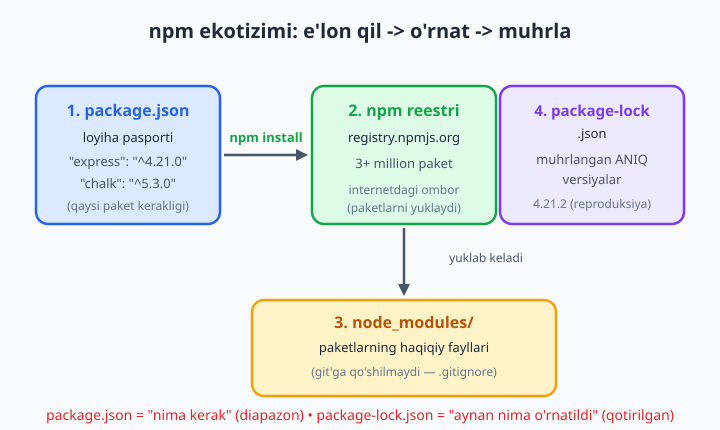
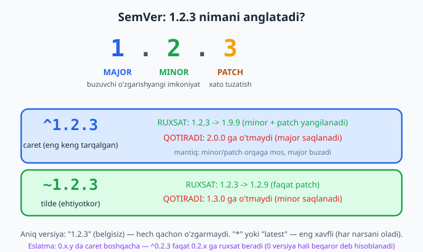

# 03 — npm va package.json

[⬅️ Oldingi: 02 — Modullar: CommonJS va ESM](./02-modullar.md) · [🏠 README](./README.md) · [Keyingi: 04 — Node uchun zamonaviy JavaScript va globallar ➡️](./04-zamonaviy-js.md)

> **Bu bobda:** dasturchi hayotidagi eng ko'p ishlatiladigan asbob — **npm** bilan tanishamiz. `package.json` faylini ("loyiha pasporti") yaratamiz va uning har bir maydonini tushunamiz. Boshqalar yozgan tayyor kodni (**paket**) `npm install` bilan o'rnatamiz, `node_modules` va `package-lock.json` nima ekanini, NEGA "lock" kerakligini ko'ramiz. **SemVer** (versiyalash qoidasi) va `^`/`~` belgilari aslida nimaga ruxsat berishini aniq o'rganamiz. **npm scripts** bilan buyruqlarni avtomatlashtirib, `npm run dev` deb yozadigan darajaga yetamiz, **npx** bilan paketni o'rnatmasdan ishga tushiramiz. Yakunida real mini-loyiha yaratib, unga `nodemon`, `chalk`, `dayjs` ni o'rnatib, hammasini birga ishlatamiz.

---

## Muammo: g'ildirakni qayta ixtiro qilmaslik

Tasavvur qiling, sizga konsolda **rangli matn** chiqarish kerak. Yoki sanani `2026-06-12` ko'rinishida chiroyli formatlash kerak. Yoki to'liq veb-server yozish kerak. Bularning har birini noldan yozsangiz — yuzlab qator kod, haftalab vaqt va ko'plab xatolar.

Yaxshi xabar: dunyodagi millionlab dasturchilar bu muammolarni allaqachon hal qilgan va yechimlarini **bepul** ulashgan. Faqat ularni qanday topish, yuklab olish va loyihangizga ulashni bilish kerak. Aynan shu — **npm** ning vazifasi.

Bu bob amaliy. Oxirida siz haqiqiy loyiha papkasiga ega bo'lasiz, undagi `package.json` ni o'qiy olasiz va `npm run dev` deb terib serverni jonlantirasiz — xuddi professional dasturchilar kabi.

## npm nima?

**npm** — *Node Package Manager*, ya'ni "Node paket boshqaruvchisi". U uch narsani anglatadi:

1. **Buyruq qatori asbobi** — terminalga `npm install ...` deb yozadigan dastur. U Node.js bilan **birga** o'rnatiladi, alohida yuklash shart emas.
2. **Onlayn reestr (ombor)** — `registry.npmjs.org` manzilidagi ulkan kutubxona. Bu yerda **3 milliondan ortiq** paket bor — dunyodagi eng katta dasturiy kod ombori. Har biri kimdir yozib, hamma uchun ochiq qilib qo'ygan tayyor kod.
3. **Veb-sayt** — [npmjs.com](https://www.npmjs.com) — paketlarni qidirib, hujjatlarini, yuklab olinish sonini va xavfsizligini ko'rasiz.

Avval Node va npm o'rnatilganini tekshiramiz:

```bash
node --version
npm --version
```

Chiqishi taxminan `v24.12.0` va `11.6.2` bo'ladi (sizniki yangiroq bo'lishi mumkin). Agar "command not found" desa, [nodejs.org](https://nodejs.org) dan **LTS** versiyani o'rnating.

📌 **Paket (package) nima?** — bu boshqa birovning yozgan, qayta ishlatish uchun tayyor kod bo'lagi. Masalan `express` — veb-server qurish uchun paket, `chalk` — matnni ranglash uchun paket. Har bir paketning o'z `package.json` fayli bor — demak paket ham aslida bir loyiha.

### npm vs npx vs paket — uchovini chalkashtirmang

Bu uchta so'z yangi boshlovchilarni ko'p chalkashtiradi. Farqi oddiy:

| So'z | Ma'nosi |
|------|---------|
| **paket** | Boshqa birov yozgan kod (masalan `express`). "Narsa". |
| **npm** | Paketlarni **o'rnatadigan** va boshqaradigan asbob. "Do'kon menejeri". |
| **npx** | Paketni **o'rnatmasdan bir marta ishga tushiradigan** asbob (npm bilan keladi). "Bir martalik ijara". |

`npm` paketni kompyuteringizga **yuklab qo'yadi** (keyin ko'p marta ishlatasiz). `npx` esa paketni vaqtincha yuklab, **ishlatadi va tashlab yuboradi** (masalan bir martalik generator). Ikkalasini ham pastda amalda ko'ramiz.

## `package.json` — loyiha pasporti

Har bir Node loyihasining markazida bitta fayl turadi: **`package.json`**. Bu — loyihangizning "pasporti" yoki "anketasi": uning nomi, versiyasi, qanday paketlarga bog'liqligi va qanday buyruqlar bilan ishga tushishini bir joyda saqlaydi.

Yangi loyiha boshlaymiz. Terminal oching va yozing:

```bash
mkdir salom-npm
cd salom-npm
npm init -y
```

`npm init` — interaktiv ravishda savol berib `package.json` yaratadi (nom, versiya, muallif...). `-y` bayrog'i (`--yes` qisqartmasi) esa "hamma savolga standart javob ber" deydi — eng tez yo'l. Natijada quyidagi fayl paydo bo'ladi:

```json
{
  "name": "salom-npm",
  "version": "1.0.0",
  "description": "",
  "main": "index.js",
  "scripts": {
    "test": "echo \"Error: no test specified\" && exit 1"
  },
  "keywords": [],
  "author": "",
  "license": "ISC",
  "type": "commonjs"
}
```

📌 **Eslatma (npm 11):** zamonaviy npm `npm init -y` da `"type": "commonjs"` ni avtomatik qo'shadi. Biz bu bobda zamonaviy **ESM** uslubidan foydalanamiz, shuning uchun pastda buni `"type": "module"` ga o'zgartiramiz.

### Asosiy maydonlar

Har bir maydonni tushunamiz — bularni bilsangiz, istalgan loyiha `package.json` ini o'qiy olasiz:

- **`name`** — loyiha nomi. Faqat kichik harf, bo'sh joysiz (`salom-npm`, `mening-bot`). Agar paketni npm ga e'lon qilsangiz, bu nom band bo'lmasligi kerak.
- **`version`** — loyiha versiyasi `MAJOR.MINOR.PATCH` ko'rinishida (pastda SemVer'da chuqur tushuntiriladi). Yangi loyiha odatda `1.0.0` dan boshlanadi.
- **`type`** — modul tizimi. `"module"` — ESM (`import`/`export`); `"commonjs"` — eski uslub (`require`). 02-bobda ikkalasini ko'rgandik; biz `"module"` ishlatamiz.
- **`main`** — loyihaning "kirish nuqtasi", ya'ni bosh fayl (odatda `index.js`). Boshqa loyiha sizning paketingizni `import` qilsa, aynan shu fayl yuklanadi.
- **`scripts`** — qisqa buyruqlar ro'yxati (`npm start`, `npm test`...). Eng foydali maydonlardan biri — pastda batafsil.
- **`dependencies`** — loyiha **ishlashi uchun zarur** paketlar (masalan `express`). Foydalanuvchi serveringizni ishga tushirsa, bular kerak.
- **`devDependencies`** — faqat **dasturlash vaqtida** kerak paketlar (masalan `nodemon`, test asboblari). Tayyor mahsulotga kirmaydi.

💡 `npm init -y` dan keyin `package.json` da hali `dependencies` yo'q — chunki hech narsa o'rnatmadik. Birinchi `npm install <paket>` dan keyin u o'zi paydo bo'ladi.

## Paket o'rnatish: `npm install`

Endi loyihaga birinchi paketni o'rnatamiz. Konsolga rangli matn chiqaradigan mashhur **`chalk`** paketini olamiz:

```bash
npm install chalk
```

`npm install` (qisqasi `npm i`) quyidagilarni qiladi:

1. `chalk` ni **npm reestridan** (internetdan) topib yuklaydi.
2. Uni `node_modules/` papkasiga joylaydi.
3. `package.json` ning `dependencies` ga `"chalk": "^5.x.x"` qatorini qo'shadi.
4. `package-lock.json` faylini yangilaydi (pastda).

Yana bitta paket — sanalar bilan ishlash uchun **`dayjs`** ni qo'shamiz:

```bash
npm install dayjs
```

Endi `package.json` ga qarasangiz, `dependencies` paydo bo'lgan:

```json
{
  "dependencies": {
    "chalk": "^5.6.2",
    "dayjs": "^1.11.18"
  }
}
```

### `--save-dev`: dasturchi asboblari

Ba'zi paketlar faqat **siz kod yozayotganda** kerak — foydalanuvchiga emas. Masalan **`nodemon`** — kod o'zgarganda serverni avtomatik qayta ishga tushiradigan dasturchi yordamchisi. Bunday paketlarni `--save-dev` (qisqasi `-D`) bilan o'rnatamiz:

```bash
npm install --save-dev nodemon
```

Bu uni `dependencies` emas, **`devDependencies`** ga yozadi:

```json
{
  "devDependencies": {
    "nodemon": "^3.1.10"
  }
}
```

📌 **Nega bu farq muhim?** Server `chalk` va `dayjs` siz ishlamaydi — ular `dependencies`. Lekin `nodemon` faqat sizning kompyuteringizda kodni kuzatish uchun — foydalanuvchining serveriga u kerak emas. Productionda `npm install --omit=dev` deb faqat `dependencies` ni o'rnatib, joy va vaqtni tejash mumkin.

### `node_modules/` — paketlarning haqiqiy joyi

`npm install` dan keyin loyihada **`node_modules/`** papkasi paydo bo'ladi. Bu — barcha o'rnatilgan paketlarning haqiqiy fayllari turadigan joy. Bitta paket o'z navbatida boshqa paketlarga bog'liq bo'lishi mumkin (ular ham shu yerga tushadi), shuning uchun `node_modules` ko'pincha **yuzlab papka** dan iborat bo'ladi.

⚠️ **Muhim qoida:** `node_modules` ni hech qachon Git'ga qo'shmang! U juda katta va `package.json` dan istalgan vaqt qayta tiklash mumkin. Loyiha ildizida `.gitignore` fayl yarating va ichiga yozing:

```
node_modules
```

Boshqa dasturchi loyihangizni yuklab olsa, faqat `npm install` deydi (paketsiz, faylsiz) — npm `package.json` ni o'qib hammasini qaytadan o'rnatadi.



## `package-lock.json` — NEGA "lock" kerak?

`npm install` dan keyin yana bitta fayl paydo bo'ladi: **`package-lock.json`**. Ko'p boshlovchilar uni "keraksiz fayl" deb o'ylab o'chiradi — bu xato. Tushunamiz nega u muhim.

`package.json` da versiya **diapazon** bilan yoziladi: `"chalk": "^5.6.2"`. `^` belgisi "5.6.2 va undan yuqori, lekin 6.0.0 dan past har qanday versiya bo'ladi" degani. Demak bugun `npm install` qilsangiz `5.6.2` tushishi mumkin, bir oydan keyin esa `5.7.0` chiqsa — **boshqa versiya** tushadi.

Bu xavfli: sizning kompyuteringizda `5.6.2` bilan hammasi ishlaydi, hamkasbingizda esa `5.7.0` tushib, kutilmagan xato chiqishi mumkin. "Menda ishlayapti-ku!" muammosi aynan shundan.

**`package-lock.json` shu muammoni hal qiladi.** U har bir paketning (va ularning bog'liqliklarining) **aynan qaysi versiyasi** o'rnatilganini muhrlab qo'yadi:

```json
{
  "node_modules/chalk": {
    "version": "5.6.2",
    "resolved": "https://registry.npmjs.org/chalk/-/chalk-5.6.2.tgz"
  }
}
```

Endi loyihani kim yuklab olsa ham, `npm install` aynan `5.6.2` ni o'rnatadi — chunki lock fayl shuni buyuradi. Bu **reproduksiya** (qayta tiklanuvchanlik) deyiladi: hamma joyda **bir xil** versiyalar, demak bir xil xulq-atvor.

📌 **Ikkita faylning vazifasi:**
- `package.json` = "menga **nima** kerak" (diapazon, odam o'qiydi).
- `package-lock.json` = "**aynan nima** o'rnatildi" (qotirilgan, npm o'qiydi).

✅ `package-lock.json` ni **Git'ga qo'shing**. U jamoadagi hammaning bir xil paketlarda ishlashini kafolatlaydi.

💡 Productionda (masalan serverga deploy qilganda) `npm install` o'rniga **`npm ci`** (clean install) ishlatiladi: u faqat lock fayldan o'qiydi, juda tez va aniq.

## SemVer — versiya raqamlari tili

Yuqorida `^5.6.2` belgisini ko'rdik. Bu **SemVer** (*Semantic Versioning*, "ma'noli versiyalash") tizimi. Bu butun npm dunyosi tilida gaplashadigan til — uni bilish majburiy.

Versiya uch qismdan iborat: **`MAJOR.MINOR.PATCH`** (masalan `1.2.3`):

- **MAJOR** (`1`) — **buzuvchi o'zgarish**. Yangi versiya eski kod bilan mos kelmasligi mumkin. `1.x` dan `2.0.0` ga o'tish — "ehtiyot bo'l, kodingni o'zgartirish kerak bo'lishi mumkin".
- **MINOR** (`2`) — **yangi imkoniyat** qo'shildi, lekin eski kod baribir ishlaydi (orqaga mos).
- **PATCH** (`3`) — **xato tuzatildi**, yangi narsa yo'q, hammasi mos.



### `^` (caret) — eng keng tarqalgan

`"chalk": "^5.6.2"` — `^` (caret) **MAJOR ni qotiradi**, MINOR va PATCH ni esa yangilashga ruxsat beradi:

- ✅ `5.6.2` -> `5.9.0` -> `5.20.5` — **ruxsat** (minor/patch o'zgaradi, mos qoladi).
- ❌ `6.0.0` — **rad** (major o'zgardi, buzilishi mumkin).

Mantiq: SemVer qoidasi bo'yicha bir xil major ichida orqaga moslik saqlanadi, shuning uchun caret xavfsiz "avtomatik yangilanish" beradi.

### `~` (tilde) — ehtiyotkorroq

`"chalk": "~5.6.2"` — `~` (tilde) faqat **PATCH** ga ruxsat beradi:

- ✅ `5.6.2` -> `5.6.9` — ruxsat (faqat xato tuzatishlari).
- ❌ `5.7.0` — rad (minor o'zgardi).

Tilde "men faqat xato tuzatishlarini olaman, yangi imkoniyatlarni xohlamayman" degani — barqarorlik muhim joyda.

### Qaysisi xavfli?

| Yozuv | Ma'no | Xavf darajasi |
|-------|-------|---------------|
| `5.6.2` | Aniq versiya, hech qachon o'zgarmaydi | 🟢 eng xavfsiz |
| `~5.6.2` | Faqat patch | 🟢 xavfsiz |
| `^5.6.2` | Minor + patch (standart) | 🟡 odatda xavfsiz |
| `*` yoki `latest` | **Har qanday** versiya, hatto major | 🔴 **xavfli** |

⚠️ `*` yoki `latest` ishlatmang — u ertaga chiqqan `7.0.0` ni ham oladi va loyihangizni to'satdan buzishi mumkin. `^` (standart) yetarli.

⚠️ **Maxsus holat — `0.x` versiyalar:** agar paket hali `1.0.0` ga yetmagan bo'lsa (masalan `0.2.3`), u "beqaror" deb hisoblanadi. Bunda `^0.2.3` faqat `0.2.x` ga ruxsat beradi (`0.3.0` ni emas!) — ya'ni `0` versiyalarda caret tilde kabi ehtiyotkor ishlaydi. Buni bilib qo'ying, ko'pchilik adashadi.

## npm scripts — buyruqlarni avtomatlashtirish

Endi eng kundalik ishlatiladigan narsa — **npm scripts**. Bular `package.json` ning `scripts` maydonida saqlanadigan, qisqa nom bilan ishga tushadigan buyruqlar.

Avval loyihamizni ESM ga o'tkazamiz va asosiy faylni yozamiz. `package.json` da `"type"` ni o'zgartiring:

```json
{
  "name": "salom-npm",
  "version": "1.0.0",
  "type": "module",
  "main": "index.js",
  "scripts": {
    "start": "node index.js",
    "dev": "nodemon index.js"
  },
  "dependencies": {
    "chalk": "^5.6.2",
    "dayjs": "^1.11.18"
  },
  "devDependencies": {
    "nodemon": "^3.1.10"
  }
}
```

`index.js` faylini yarating:

```js
import chalk from "chalk";
import dayjs from "dayjs";

const vaqt = dayjs().format("YYYY-MM-DD HH:mm:ss");

console.log(chalk.green.bold("Salom, npm dunyosi!"));
console.log(chalk.blue(`Hozir vaqt: ${vaqt}`));
console.log(chalk.yellow("Bu xabar dayjs va chalk paketlari yordamida chiqdi."));
```

Endi ishga tushiramiz:

```bash
npm start
```

Natija (rangli holda):

```
Salom, npm dunyosi!
Hozir vaqt: 2026-06-12 12:06:08
Bu xabar dayjs va chalk paketlari yordamida chiqdi.
```

🎉 Mana siz birinchi marta tashqi paketlarni o'rnatib, ularni `import` qilib, npm script orqali ishga tushirdingiz!

### `start`, `test` va boshqalar

npm ba'zi nomlarni **maxsus** biladi:

- **`npm start`** — `scripts.start` ni ishga tushiradi (`npm run start` deb yozsa ham bo'ladi, lekin `start` uchun `run` shart emas).
- **`npm test`** (yoki `npm t`) — `scripts.test` ni ishga tushiradi.

### Custom (o'zingiz qo'ygan) scriptlar

Istalgan nom qo'shishingiz mumkin. Lekin `start`/`test` dan tashqari nomlarni ishga tushirishda **`npm run`** kerak:

```json
"scripts": {
  "start": "node index.js",
  "dev": "nodemon index.js",
  "salom": "node index.js",
  "build": "node build.js"
}
```

```bash
npm run dev      # nodemon orqali (kod o'zgarsa qayta ishlaydi)
npm run salom    # custom script
npm run build    # custom script
```

📌 **Nega scriptlar foydali?** Tasavvur qiling, serveringizni ishga tushirish uchun uzun buyruq kerak: `node --env-file=.env --watch src/server.js`. Buni har safar terish o'rniga `scripts.dev` ga yozib qo'yib, faqat `npm run dev` deysiz. Butun jamoa bir xil buyruqdan foydalanadi — bu standartlashtiruvchi katta qulaylik.

💡 Qaysi scriptlar borligini ko'rish uchun shunchaki `npm run` (argumentsiz) deng — u barcha mavjud scriptlarni ro'yxatlaydi.

### `pre` va `post` — avtomatik ilgaklar

npm scriptlarda sehrli qoida bor: agar `build` nomli script bo'lsa va siz `prebuild` hamda `postbuild` nomli scriptlar ham qo'shsangiz, npm ularni **avtomatik** tartibda ishlatadi:

```json
"scripts": {
  "prebuild": "node before.js",
  "build": "node build.js",
  "postbuild": "node after.js"
}
```

`npm run build` deganingizda, npm ketma-ket ishga tushiradi:

```
1) prebuild: tayyorgarlik
2) build: asosiy ish bajarilyapti
3) postbuild: tozalash
```

Ya'ni `pre<nom>` — asosiy scriptdan **oldin**, `post<nom>` — **keyin** avtomatik ishlaydi. Bu test oldidan kodni tekshirish, build oldidan eski papkani tozalash kabi ishlar uchun qulay.

## npx — o'rnatmasdan ishga tushirish

Ba'zan paketni **bir martagina** ishlatish kerak — masalan loyiha shabloni generatori. Uni doimiy o'rnatib, keyin o'chirish noqulay. Aynan shu yerda **npx** yordam beradi: u paketni vaqtincha yuklab, ishlatadi va tugaganda tashlaydi.

```bash
npx cowsay "Salom npx!"
```

Natija:

```
 ____________
< Salom npx! >
 ------------
        \   ^__^
         \  (oo)\_______
            (__)\       )\/\
                ||----w |
                ||     ||
```

`cowsay` ni umuman o'rnatmadik — npx uni reestrdan vaqtincha olib ishga tushirdi. Eng mashhur misol — yangi loyiha boshlash:

```bash
npx create-react-app mening-saytim   # React loyihasi generatori
npx degit user/repo mening-loyiham   # shablonni klonlash
```

📌 **npx loyiha ichida ham foydali:** agar paket lokal `node_modules` da o'rnatilgan bo'lsa (masalan `nodemon`), `npx nodemon index.js` deb to'g'ridan ishlatasiz — npx avval lokal o'rnatilganni topadi, faqat topolmasa internetdan oladi. Shuning uchun lokal asboblarni doim `npx <asbob>` deb chaqirish mumkin.

## Global vs lokal o'rnatish

Hozirgacha hamma paketni **lokal** (loyiha ichiga, `node_modules` ga) o'rnatdik. Bu **tavsiya etilgan** usul, chunki har loyiha o'z versiyalarini saqlaydi.

Lekin `-g` (`--global`) bayrog'i bilan paketni **butun tizimga** o'rnatish mumkin — u istalgan papkadan ishlaydi:

```bash
npm install -g nodemon       # global o'rnatish
npm list -g --depth=0        # global o'rnatilganlarni ko'rish
```

| | Lokal (`npm i paket`) | Global (`npm i -g paket`) |
|---|---|---|
| Qayerga | Loyiha `node_modules` ga | Butun tizimga |
| Kim ko'radi | Faqat shu loyiha | Hamma loyiha |
| Versiya | Har loyihada alohida | Bitta umumiy |
| Qachon | **Deyarli doim shu** | Faqat CLI asboblar uchun (kamdan-kam) |

⚠️ **Maslahat:** kutubxonalarni (`express`, `chalk`...) **hech qachon** global o'rnatmang — ular loyihaga tegishli. Global faqat butun tizim bo'ylab ishlatiladigan **CLI asboblar** uchun (va hatto ularni ham ko'pincha `npx` bilan ishlatish yaxshiroq). Sabab: global versiya bitta bo'ladi, turli loyihalar turli versiya talab qilsa — ziddiyat chiqadi.

## Mashhur paketlar bilan tanishuv

Eng ko'p ishlatiladigan bir nechta paket bilan qisqacha tanishamiz — keyingi boblarda ulardan foydalanamiz.

### `express` — veb-server

**`express`** — Node'da veb-server va API qurish uchun eng mashhur paket. Mana to'liq ishlaydigan misol. Avval o'rnating:

```bash
npm install express
```

```js
import express from "express";

const app = express();

app.get("/salom", (req, res) => {
  res.json({ xabar: "Express paketi npm orqali o'rnatildi!", vaqt: Date.now() });
});

const server = app.listen(3000, async () => {
  // Server ko'tarilgach, global fetch bilan o'zimizga so'rov yuboramiz (Node 24)
  const javob = await fetch("http://localhost:3000/salom");
  const data = await javob.json();
  console.log("Status:", javob.status);   // 200
  console.log("Javob:", data.xabar);
  server.close();
});
```

Bu kod serverni 3000-portda ko'taradi, so'ng Node 24 ning ichki **`fetch`** funksiyasi bilan o'ziga so'rov yuborib javobni tekshiradi. Chiqishi:

```
Status: 200
Javob: Express paketi npm orqali o'rnatildi!
```

Express'ni alohida — 09-bobda chuqur o'rganamiz. Hozir muhimi: bir buyruq (`npm install express`) bilan butun veb-server imkoniyatiga ega bo'ldik.

### `dotenv` — maxfiy sozlamalar

**`dotenv`** — maxfiy ma'lumotlarni (parol, API kalit, port) koddan ajratib `.env` faylda saqlash uchun. `.env` faylini Git'ga qo'shmaysiz, demak sirlar commit'ga tushmaydi.

```bash
npm install dotenv
```

`.env` fayli:

```
PORT=4000
APP_NOMI=Mening-Ilovam
```

`app.js`:

```js
import "dotenv/config"; // .env faylni o'qib process.env ga yuklaydi

console.log("PORT:", process.env.PORT);         // 4000
console.log("APP_NOMI:", process.env.APP_NOMI); // Mening-Ilovam
```

💡 **Node 24 yangiligi:** endi `dotenv` ham shart emas — Node ichida `--env-file` bayrog'i bor:

```bash
node --env-file=.env app.js
```

Bu `.env` ni avtomatik o'qiydi. Lekin `dotenv` hali ham keng tarqalgan, chunki eski Node versiyalarida ham ishlaydi va qo'shimcha imkoniyatlari bor.

### `nodemon` — avtomatik qayta ishga tushiruvchi

**`nodemon`** — dasturchi do'sti. Oddiy `node index.js` da kodni o'zgartirsangiz, qayta `node index.js` terishingiz kerak. `nodemon index.js` esa faylni kuzatib turadi va har o'zgarishda serverni **avtomatik** qayta ishga tushiradi. Shuning uchun u har doim `devDependencies` ga (`--save-dev`) o'rnatiladi va `scripts.dev` da ishlatiladi.

## REAL KEYS: kichik CLI loyiha — "Kunlik salom"

Endi o'rgangan hamma narsani bitta real mini-loyihada birlashtiramiz. Maqsad: terminalga **rangli, sanali salomlashuv** chiqaradigan kichik asbob yasash va uni `nodemon` bilan dasturlash rejimida ishlatish.

**1-qadam. Loyiha yaratish:**

```bash
mkdir kunlik-salom
cd kunlik-salom
npm init -y
```

**2-qadam. Paketlarni o'rnatish** — ishlash uchun `chalk` + `dayjs`, dasturlash uchun `nodemon`:

```bash
npm install chalk dayjs
npm install --save-dev nodemon
```

**3-qadam. `package.json` ni sozlash** — `"type": "module"` va scriptlar qo'shing:

```json
{
  "name": "kunlik-salom",
  "version": "1.0.0",
  "type": "module",
  "main": "index.js",
  "scripts": {
    "start": "node index.js",
    "dev": "nodemon index.js"
  },
  "dependencies": {
    "chalk": "^5.6.2",
    "dayjs": "^1.11.18"
  },
  "devDependencies": {
    "nodemon": "^3.1.10"
  }
}
```

**4-qadam. `index.js`** — soatga qarab salom beradigan dastur:

```js
import chalk from "chalk";
import dayjs from "dayjs";

const hozir = dayjs();
const soat = hozir.hour();

// Soatga qarab tegishli salomlashuvni tanlaymiz
let salom;
if (soat < 12) {
  salom = chalk.yellow.bold("Xayrli tong!");
} else if (soat < 18) {
  salom = chalk.cyan.bold("Xayrli kun!");
} else {
  salom = chalk.magenta.bold("Xayrli kech!");
}

console.log(salom);
console.log(chalk.green(`Bugun: ${hozir.format("YYYY-MM-DD, dddd")}`));
console.log(chalk.gray(`Soat: ${hozir.format("HH:mm:ss")}`));
```

**5-qadam. Ishga tushirish:**

```bash
npm start
```

Natija (oqshom ishga tushirilsa):

```
Xayrli kech!
Bugun: 2026-06-12, Friday
Soat: 20:15:42
```

**6-qadam. Dasturlash rejimi.** `npm run dev` deb ishga tushiring — endi `index.js` ni o'zgartirib saqlasangiz, `nodemon` dasturni **o'zi** qayta ishga tushiradi:

```bash
npm run dev
```

Mana, real dasturchi ish jarayoni: paketlarni o'rnatish, ESM bilan kod yozish, scriptlar orqali ishga tushirish va `nodemon` bilan tez sinash. Bu naqsh keyingi barcha loyihalaringizda takrorlanadi.

## Paket xavfsizligi: `npm audit`

Boshqa odamlarning kodini o'rnatish qulay, lekin ba'zi paketlarda **xavfsizlik zaifliklari** topilishi mumkin. npm bunga maxsus asbob beradi:

```bash
npm audit
```

U o'rnatilgan barcha paketlarni ma'lum zaifliklar bazasiga solishtirib hisobot beradi:

```
found 0 vulnerabilities
```

Agar zaiflik topilsa, ko'pincha avtomatik tuzatish mumkin:

```bash
npm audit fix
```

Bu zaif paketlarni xavfsiz versiyaga (SemVer diapazoni doirasida) yangilaydi.

⚠️ Begona paketni o'rnatishdan oldin [npmjs.com](https://www.npmjs.com) da uning haftalik yuklab olinishini, oxirgi yangilanishini va ochiq xatolarini ko'rib chiqing. Mashhur, faol paket — xavfsizroq.

## `"type": "module"` — yana bir bor eslatma

Bu bobda biz `"type": "module"` ishlatdik, ya'ni `import`/`export` (ESM). Buni doim esda tuting:

- `"type": "module"` bo'lsa — `.js` fayllar ESM (`import x from "..."`).
- `"type": "commonjs"` (yoki yo'q) bo'lsa — `.js` fayllar CommonJS (`const x = require("...")`).
- Aralashtirish kerak bo'lsa: ESM loyihada ataylab CommonJS fayl `.cjs` kengaytmasi bilan, CommonJS loyihada ESM fayl `.mjs` bilan yoziladi.

Ko'p paketlar ikkala uslubni ham qo'llaydi. Masalan `dayjs` ni CommonJS loyihada `.cjs` faylida shunday ishlatasiz:

```js
// dayjs-cjs.cjs — CommonJS uslubi
const dayjs = require("dayjs");
console.log("CJS orqali dayjs ishladi:", dayjs().format("YYYY-MM-DD"));
```

⚠️ Ammo `chalk` ning 5-versiyasi **faqat ESM** (CommonJS'da `require("chalk")` ishlamaydi). Bu paketni o'rnatishdan oldin hujjatini o'qish kerakligining yaxshi sababi. Biz zamonaviy ESM ishlatganimiz uchun bunday muammoga duch kelmaymiz.

```js
// ❌ XATO — "type": "module" bo'lgan loyihada require ishlamaydi:
const chalk = require("chalk");
// ReferenceError: require is not defined in ES module scope
```

To'g'risi — ESM `import`:

```js
// ✅ TO'G'RI:
import chalk from "chalk";
```

## Xulosa

- **npm** — Node bilan keladigan paket boshqaruvchisi; reestrida 3+ million paket bor. **paket** = boshqa birovning kodi, **npm** = o'rnatuvchi, **npx** = o'rnatmasdan ishlatuvchi.
- **`package.json`** — loyiha pasporti; `npm init -y` bilan yaratiladi. Asosiy maydonlar: `name`, `version`, `type`, `main`, `scripts`, `dependencies`, `devDependencies`.
- `npm install <paket>` paketni `node_modules` ga yuklaydi va `dependencies` ga yozadi; `--save-dev` esa `devDependencies` ga (dasturchi asboblari).
- **`package-lock.json`** aniq versiyalarni muhrlab **reproduksiya** beradi — uni Git'ga qo'shing, `node_modules` ni esa qo'shmang.
- **SemVer** `MAJOR.MINOR.PATCH`: `^` major'ni qotiradi (standart, xavfsiz), `~` faqat patch'ga ruxsat beradi, `*`/`latest` — xavfli.
- **npm scripts** buyruqlarni avtomatlashtiradi: `start`/`test` maxsus, qolganlari `npm run <nom>`; `pre`/`post` avtomatik ilgaklar.
- **npx** paketni o'rnatmasdan ishlatadi; **global** o'rnatish faqat kamdan-kam CLI asboblar uchun.
- `npm audit` zaifliklarni tekshiradi. Zamonaviy uslub — `"type": "module"` bilan ESM.

## Mashqlar

### Oson

1. Yangi `mening-loyiham` papkasi yarating, ichida `npm init -y` ishlating. Hosil bo'lgan `package.json` ni oching va `name`, `version`, `main`, `type` maydonlarining qiymatlarini ayting.

2. Quyidagi versiya yozuvlarini "xavfsizdan xavflisiga" tartiblang va har birini qisqacha izohlang: `*`, `~2.1.0`, `2.1.0`, `^2.1.0`.

3. Loyihaga `dayjs` ni o'rnating (`npm install dayjs`). `npm install dayjs` dan keyin `package.json` ning qaysi maydoni o'zgardi va qaysi yangi fayl/papka paydo bo'ldi? Uchtasini sanang.

### O'rta

4. `package.json` ga `salom` nomli custom script qo'shing, u `node index.js` ni ishga tushirsin. Keyin `index.js` da bitta `console.log` yozing va scriptni to'g'ri buyruq bilan ishga tushiring. (Savol: `npm salom` ishlaydimi yoki `npm run salom` kerakmi? Nega?)

5. `^1.4.2` diapazoni quyidagi versiyalardan qaysilariga **ruxsat** beradi: `1.4.5`, `1.9.0`, `2.0.0`, `1.4.1`? Har biriga "ha/yo'q" va sababini yozing.

6. `chalk` paketini o'rnatib, ESM (`import`) bilan terminalga **qizil** xatolik xabari va **yashil** muvaffaqiyat xabari chiqaradigan dastur yozing. `package.json` da `"type": "module"` borligiga ishonch hosil qiling.

### Qiyin

7. To'liq mini-loyiha yarating: `chalk` (dependency), `nodemon` (devDependency) o'rnatilgan, `package.json` da `start` (`node`) va `dev` (`nodemon`) scriptlari bor. `index.js` joriy sanani `dayjs` bilan formatlab, rangli chiqarsin. Loyiha tuzilishini va to'liq `package.json` ni yozing. So'ng tushuntiring: nega `nodemon` `devDependencies` da-yu, `chalk` `dependencies` da?

8. `package-lock.json` nima uchun kerakligini bir hamkasbingizga tushuntirayotgandek yozing. Misol keltiring: `package.json` da `"chalk": "^5.6.2"` turibdi. Ikki dasturchi ikki xil vaqtda `npm install` qildi — lock fayl **bo'lmasa** nima sodir bo'lishi mumkin va u **bo'lganda** nima kafolatlanadi?

<details markdown="1"><summary>Yechim — 5</summary>

`^1.4.2` caret bo'lib, **MAJOR (1) ni qotiradi**, MINOR va PATCH ni yangilashga ruxsat beradi. Demak `>=1.4.2` va `<2.0.0` oralig'i:

- `1.4.5` — ✅ **ha** (patch oshdi, major bir xil `1`).
- `1.9.0` — ✅ **ha** (minor oshdi, lekin major hali `1`).
- `2.0.0` — ❌ **yo'q** (major `2` ga o'tdi — caret bunga ruxsat bermaydi, buzuvchi o'zgarish bo'lishi mumkin).
- `1.4.1` — ❌ **yo'q** (`1.4.2` dan **past**, ya'ni boshlang'ich versiyadan oldingisi).

Asosiy g'oya: caret faqat **oldinga**, lekin major chegarasi ichida yangilanadi.

</details>

<details markdown="1"><summary>Yechim — 7</summary>

**Loyiha tuzilishi:**

```
kunlik-sana/
├── node_modules/        (Git'ga qo'shilmaydi)
├── .gitignore           ("node_modules" yozilgan)
├── package.json
├── package-lock.json
└── index.js
```

**Buyruqlar:**

```bash
mkdir kunlik-sana
cd kunlik-sana
npm init -y
npm install chalk dayjs
npm install --save-dev nodemon
```

**`package.json`** (`"type": "module"` va scriptlar qo'lda qo'shiladi):

```json
{
  "name": "kunlik-sana",
  "version": "1.0.0",
  "type": "module",
  "main": "index.js",
  "scripts": {
    "start": "node index.js",
    "dev": "nodemon index.js"
  },
  "dependencies": {
    "chalk": "^5.6.2",
    "dayjs": "^1.11.18"
  },
  "devDependencies": {
    "nodemon": "^3.1.10"
  }
}
```

**`index.js`:**

```js
import chalk from "chalk";
import dayjs from "dayjs";

const sana = dayjs().format("YYYY-MM-DD HH:mm:ss");
console.log(chalk.green.bold("Joriy sana va vaqt:"));
console.log(chalk.cyan(sana));
```

**Ishga tushirish:** `npm start` (bir martalik) yoki `npm run dev` (o'zgarishlarni kuzatib).

**Nega `chalk` -> `dependencies`, `nodemon` -> `devDependencies`?**
`chalk` dasturning **ishlashi uchun** zarur — `index.js` uni `import` qiladi, usiz dastur xato beradi. Shuning uchun u `dependencies` da. `nodemon` esa faqat **dasturlash vaqtida** kodni kuzatish uchun yordamchi — tayyor dastur uchun kerak emas (productionda `npm run dev` ishlatilmaydi). Shuning uchun u `devDependencies` da. Qoida: "dastur ishlashi uchun kerakmi?" — ha bo'lsa `dependencies`, faqat siz uchun bo'lsa `devDependencies`.

</details>

<details markdown="1"><summary>Yechim — 8</summary>

**Tushuntirish:**

`package.json` da versiya **diapazon** bilan yoziladi: `"chalk": "^5.6.2"`. `^` belgisi "5.6.2 dan boshlab, 6.0.0 dan past istalgan versiya" degani. Demak npm bu yozuvga qarab **bir nechta** versiyani o'rnatishi mumkin — qaysi biri eng yangisi shu paytda mavjud bo'lsa.

**Lock fayl BO'LMASA:**

Tasavvur qiling, Ali bugun `npm install` qildi — o'shanda eng yangi mos versiya `5.6.2` edi, shu tushdi. Bir hafta o'tib Vali xuddi shu loyihani yuklab `npm install` qildi — endi `5.7.0` chiqib bo'lgan (`^` unga ham ruxsat beradi), shuning uchun **5.7.0** tushadi. Natijada Ali va Vali **turli versiyalarda** ishlaydi. Agar `5.7.0` da biror xulq o'zgargan bo'lsa, Valida xato chiqib, Alida chiqmaydi — "menda ishlayapti-ku!" muammosi. Bu juda chalkash va topish qiyin nosozlik.

**Lock fayl BO'LGANDA:**

Ali birinchi `npm install` qilganda npm `package-lock.json` ga **aniq** `5.6.2` ni (va barcha ichki bog'liqliklarini aniq versiyalari bilan) yozadi. Bu fayl Git'ga commit qilinadi. Vali loyihani yuklab `npm install` qilganda npm avval lock faylga qaraydi va aynan `5.6.2` ni o'rnatadi — yangiroq versiya chiqqan bo'lsa ham. Natijada **ikkalasi ham bir xil versiyalarda** ishlaydi.

**Kafolat:** `package-lock.json` — **reproduksiya** kafolati. U loyiha qaysi mashinada, qachon o'rnatilishidan qat'i nazar, bir xil paket versiyalari o'rnatilishini ta'minlaydi. Shuning uchun uni doim Git'ga qo'shasiz, `node_modules` ni esa qo'shmaysiz (uni har doim lock fayldan qayta tiklash mumkin).

</details>

---

[⬅️ Oldingi: 02 — Modullar: CommonJS va ESM](./02-modullar.md) · [🏠 README](./README.md) · [Keyingi: 04 — Node uchun zamonaviy JavaScript va globallar ➡️](./04-zamonaviy-js.md)
