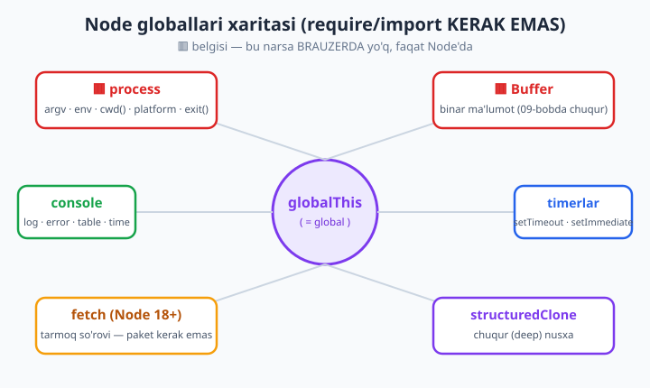
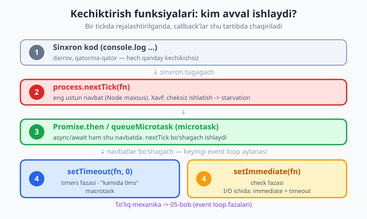

# 04 — Node uchun zamonaviy JavaScript va globallar

[⬅️ Oldingi: 03 — npm va package.json](./03-npm.md) · [🏠 README](./README.md) · [Keyingi: 05 — Event loop va non-blocking I/O ➡️](./05-event-loop.md)

> **Bu bobda:** Node yozish uchun KERAK bo'ladigan zamonaviy JavaScript tushunchalarini Node kontekstida tezkor takrorlaymiz — **destructuring**, **spread/rest**, **arrow funksiya va `this`**, **shablon literallari**, **standart/"named" parametrlar**, **optional chaining `?.`** va **nullish `??`**, eng ko'p ishlatiladigan **massiv metodlari** (`map`/`filter`/`reduce`/`find`) va **obyekt metodlari** (`Object.keys`/`values`/`entries`). So'ng brauzerda **umuman yo'q**, lekin Node'da har kuni ishlatadigan **globallar**ga o'tamiz: `process` (`argv`/`env`/`cwd`/`platform`/`exit`/`nextTick`), `Buffer` (qisqacha), `global` vs `globalThis`, CommonJS'dagi `__dirname`/`__filename` va ESM'dagi `import.meta`, `console` metodlari, `setTimeout`/`setImmediate`/`process.nextTick`/`queueMicrotask` farqi, `structuredClone` va Node 18+ dagi global `fetch`. Oxirida `Error` obyektlari, `throw`, `instanceof` va o'z maxsus xato sinflaringizni yozishni o'rganamiz. **REAL KEYS:** `process.env` va `process.argv` bilan sozlanadigan kichik salomlash skripti yasaymiz.

---

## Bu bob nima uchun va kimga?

JavaScript tilining o'zini bu kitobda noldan o'rgatmaymiz — buning uchun alohida [JavaScript kitobi](../js/) bor; agar `let`/`const`, funksiya, obyekt, massiv nima ekanini umuman bilmasangiz, avval o'sha yerga bir o'ting.

Bu bobning maqsadi boshqa: **Node'ni o'rganishga kirishishdan oldin, aynan Node'da kunda ming marta uchraydigan zamonaviy JS bo'laklarini bir joyda mustahkamlash** va eng muhimi — **brauzerda yo'q, faqat Node'da bor narsalar** (globallar) bilan tanishtirish. Keyingi boblardagi har bir misol shu tushunchalarga tayanadi: `const { readFile } = await import(...)`, `process.argv`, `app.use((req, res) => ...)` — bularning hammasi shu yerda yotadi.

Shuning uchun bu bob ataylab amaliy va tig'iz. Har bir bo'lak bitta toza misol bilan, va har bir misol **haqiqatan `node` bilan ishga tushadi**.

📌 **Eslatma — fayl kengaytmasi.** Bu kitobda 02-bobdan boshlab asosiy uslub — **ESM** (`import`/`export`). Loyiha papkasida `package.json` ichida `"type": "module"` bo'lsa, oddiy `.js` fayl ESM bo'ladi. Agar shunday sozlama bo'lmasa, ESM uchun `.mjs`, CommonJS (`require`) uchun `.cjs` ishlatiladi. Bu bobdagi misollarni `salom.mjs` deb saqlab `node salom.mjs` bilan ishga tushirsangiz bo'ladi.

---

## 1-qism: Node uchun zamonaviy JavaScript

### Destructuring — qiymatlarni "ajratib olish"

Destructuring obyekt yoki massivdan qiymatlarni bitta qatorda, nomi bo'yicha ajratib oladi. Node kodida bu **hamma joyda** uchraydi: modul import qilganda (`const { readFile } = ...`), funksiya parametrida, konfiguratsiya o'qiganda.

```js
// Obyekt destructuring
const sozlama = { port: 3000, host: "localhost", debug: true };

// Eski usul — bitta-bittadan
const portEski = sozlama.port;

// Destructuring — bir qatorda
const { port, host } = sozlama;
console.log(port, host); // 3000 localhost

// Yangi nom berib olish (port -> p) va yo'q maydon uchun standart qiymat
const { port: p, vaqt = "yo'q" } = sozlama;
console.log(p, vaqt); // 3000 yo'q
```

Massivda esa **tartib** muhim (nom emas, joylashuv bo'yicha olinadi):

```js
const ranglar = ["qizil", "yashil", "ko'k"];
const [birinchi, , uchinchi] = ranglar; // ikkinchini bo'sh joy bilan o'tkazib yubordik
console.log(birinchi, uchinchi); // qizil ko'k
```

Eng foydali joyi — **funksiya parametrida destructuring**. Node'da konfiguratsiya obyekti uzatish odatiy hol:

```js
function ulan({ host, port, debug = false }) {
  return `${host}:${port} (debug=${debug})`;
}
console.log(ulan({ port: 3000, host: "localhost", debug: true }));
// localhost:3000 (debug=true)
```

### Spread va rest — `...` uchta nuqta, ikki vazifa

`...` belgisi qayerda turishiga qarab ikki xil ishlaydi. **Spread** ("yoyish") mavjud narsani yoyadi; **rest** ("yig'ish") tarqoq narsalarni bittaga to'playdi.

```js
// SPREAD — massivni yoyib, nusxalash va birlashtirish
const a = [1, 2, 3];
const b = [4, 5];
const birlashgan = [...a, ...b];
console.log(birlashgan); // [ 1, 2, 3, 4, 5 ]

// Obyektlarni birlashtirish — keyingisi oldingisining ustiga yoziladi
const standart = { port: 3000, debug: false };
const foydalanuvchi = { debug: true };
const yakuniy = { ...standart, ...foydalanuvchi };
console.log(yakuniy); // { port: 3000, debug: true }
```

Bu "obyektni yoyib, ba'zi maydonni almashtirish" usuli Node'da konfiguratsiyani standart qiymatlar bilan birlashtirishda doim ishlatiladi (REAL KEYS misolida ham ko'ramiz).

```js
// REST — qolgan argumentlarni massivga to'plash
function yigindi(...sonlar) {
  return sonlar.reduce((s, n) => s + n, 0);
}
console.log(yigindi(1, 2, 3, 4)); // 10

// Rest destructuring bilan: bosh elementni ol, qolganini massiv qil
const [bosh, ...qoldiq] = [10, 20, 30, 40];
console.log(bosh, qoldiq); // 10 [ 20, 30, 40 ]
```

⚠️ **Muhim ogohlantirish — spread "sayoz" (shallow) nusxa qiladi.** `{ ...obj }` faqat birinchi qatlamni nusxalaydi; ichki obyektlar **baham ko'riladi**. Chuqur nusxa kerak bo'lsa, pastda `structuredClone` ni ko'ramiz.

### Arrow funksiya va `this` — eng ko'p chalkashtiriladigan joy

Arrow funksiya (`=>`) faqat qisqa yozuv emas. Uning eng muhim xususiyati: **`this` ni o'zi yaratmaydi** — uni tashqi (leksik) qamrovdan oladi. Aynan shu xususiyat Node'dagi callback'larda hayotni yengillashtiradi.

```js
const hisoblagich = {
  son: 0,
  ishga_tushir() {
    // setInterval ichida ARROW ishlatamiz: 'this' baribir hisoblagich bo'lib qoladi
    const id = setInterval(() => {
      this.son++; // arrow tufayli 'this' = hisoblagich
      console.log("son:", this.son);
      if (this.son >= 3) clearInterval(id);
    }, 50);
  },
};
hisoblagich.ishga_tushir();
// son: 1   son: 2   son: 3
```

Agar `setInterval` ichida arrow o'rniga oddiy `function () {...}` yozsangiz, ichdagi `this` boshqa narsa bo'lib qoladi va `this.son` ishlamaydi:

```js
// ❌ Bu ishlamaydi: oddiy function() o'z 'this'ini yaratadi (hisoblagich EMAS)
setInterval(function () {
  this.son++; // TypeError: Cannot read properties of undefined (reading 'son')
}, 50);
```

📌 **Qoida (Node uchun):** callback yozayotganda, agar tashqi `this`ni saqlamoqchi bo'lsangiz — **arrow** ishlating. Bu Node'da deyarli har doim shunday.

### Shablon literallari — `${}` va ko'p qatorli matn

Backtick (`` ` ``) ichidagi matn — shablon literal. U `${...}` bilan o'zgaruvchi joylashtiradi va to'g'ridan-to'g'ri ko'p qatorli bo'la oladi:

```js
const ism = "Oqil";
const xat = `Salom, ${ism}!
Bugun ${new Date().getFullYear()}-yil.
Jami: ${2 + 3} ta xabar.`;
console.log(xat);
// Salom, Oqil!
// Bugun 2026-yil.
// Jami: 5 ta xabar.
```

Node'da log xabarlari, SQL/HTML matnlari, fayl yo'llari — barchasini shablon literal bilan yig'amiz.

### Standart va "named" parametrlar

Funksiya parametriga `=` bilan **standart qiymat** beriladi: argument uzatilmasa (yoki `undefined` bo'lsa) o'sha qiymat ishlatiladi.

```js
function ulan(host = "localhost", port = 3000) {
  return `${host}:${port}`;
}
console.log(ulan());              // localhost:3000
console.log(ulan("db.example")); // db.example:3000
```

JavaScriptda Python'dagidek "named parametr" (`server(port=8080)`) yo'q. Lekin uning o'rniga **obyekt + destructuring + standart qiymat** kombinatsiyasi ishlatiladi — bu Node API'larida juda keng tarqalgan uslub:

```js
function server({ host = "localhost", port = 3000, https = false } = {}) {
  const protokol = https ? "https" : "http";
  return `${protokol}://${host}:${port}`;
}
console.log(server());                            // http://localhost:3000
console.log(server({ port: 8080, https: true })); // https://localhost:8080
```

Oxiridagi `= {}` muhim: u funksiyani **argumentsiz** chaqirsa ham (`server()`) ishlashini ta'minlaydi — aks holda `undefined` ni destructuring qilishga urinib xato berardi.

### Optional chaining `?.` va nullish `??`

Bu ikki belgi Node kodini **ancha xavfsiz** qiladi. `?.` chuqur obyektga xavfsiz murojaat qiladi: oraliq qiymat `null`/`undefined` bo'lsa, dastur qulamaydi — `undefined` qaytadi.

```js
const javob = {
  user: { name: "Oqil", manzil: { shahar: "Toshkent" } },
};

console.log(javob.user?.manzil?.shahar); // Toshkent
console.log(javob.user?.tel?.raqam);     // undefined  (xato EMAS)

// metod chaqirishda ham xavfsiz
const obj = {};
console.log(obj.salom?.()); // undefined  (salom metodi yo'q, lekin qulamaydi)
```

`??` (nullish coalescing) — faqat chap tomon **`null` yoki `undefined`** bo'lsagina o'ng tomonni oladi. Bu `||` dan farq qiladi: `||` esa `0`, `""`, `false` larni ham "yolg'on" deb tashlab yuboradi.

```js
const port = 0;
console.log(port ?? 3000); // 0     -> ?? faqat null/undefined'da ishlaydi, 0 saqlanadi
console.log(port || 3000); // 3000  -> || 0 ni "yolg'on" deb tashladi (XATO bo'lishi mumkin!)

const ism = undefined;
console.log(ism ?? "mehmon"); // mehmon
```

📌 **Node uchun amaliy farq:** `process.env.PORT ?? 3000` to'g'ri (faqat o'zgaruvchi yo'q bo'lsa standartni ol), lekin agar foydalanuvchi `0` kiritsa va siz `||` ishlatsangiz, kutilmaganda `3000` ga tushib qolasiz. Sozlamalarda `??` ni afzal ko'ring.

### Massiv metodlari: `map` / `filter` / `find` / `reduce`

Bu to'rtta metod Node'da ma'lumotni qayta ishlashning asosi (DB javobi, API javobi, fayl qatorlari — hammasi massiv bo'ladi). Bitta misolda hammasini ko'ramiz:

```js
const buyurtmalar = [
  { id: 1, mahsulot: "kitob", narx: 50000, soni: 2 },
  { id: 2, mahsulot: "qalam", narx: 3000, soni: 10 },
  { id: 3, mahsulot: "daftar", narx: 8000, soni: 5 },
];

// map — har elementni o'zgartirib YANGI massiv qaytaradi
const nomlar = buyurtmalar.map((b) => b.mahsulot);
console.log(nomlar); // [ 'kitob', 'qalam', 'daftar' ]

// filter — shartga mos elementlardan yangi massiv
const qimmat = buyurtmalar.filter((b) => b.narx >= 8000);
console.log(qimmat.map((b) => b.mahsulot)); // [ 'kitob', 'daftar' ]

// find — birinchi mos elementni (yoki undefined) qaytaradi
const topildi = buyurtmalar.find((b) => b.id === 2);
console.log(topildi.mahsulot); // qalam

// reduce — hammasini bitta qiymatga "yig'ish" (bu yerda: jami summa)
const jami = buyurtmalar.reduce((sum, b) => sum + b.narx * b.soni, 0);
console.log("jami:", jami); // jami: 170000
```

`reduce` boshda qiyin tuyuladi, lekin formulasi sodda: `(yig'indi, joriy) => yangi_yig'indi`, va `0` — boshlang'ich qiymat. Har qadamda `sum`ga `narx * soni` qo'shilib boradi.

### Obyekt metodlari: `Object.keys` / `values` / `entries`

Obyekt ustidan aylanish kerak bo'lganda shu uchta metod ishlatiladi:

```js
const sozlama = { port: 3000, host: "localhost" };

console.log(Object.keys(sozlama));    // [ 'port', 'host' ]
console.log(Object.values(sozlama));  // [ 3000, 'localhost' ]
console.log(Object.entries(sozlama)); // [ [ 'port', 3000 ], [ 'host', 'localhost' ] ]

// entries + for...of + destructuring — obyekt bo'ylab aylanishning eng toza usuli
for (const [kalit, qiymat] of Object.entries(sozlama)) {
  console.log(`${kalit} = ${qiymat}`);
}
// port = 3000
// host = localhost
```

📌 **Modullar** (`import`/`export`) ham zamonaviy JS ning bir qismi, lekin ular shu kitobning [02-bobida](./02-modullar.md) to'liq yoritilgan. Bu bobdan boshlab biz asosan **ESM** uslubini ishlatamiz.

---

## 2-qism: Node globallari (brauzerda yo'q)

Brauzerda `window`, `document`, `alert` bor; Node'da ular **yo'q**. Buning o'rniga Node o'z globallarini beradi — ularni `import` qilish **shart emas**, har joyda tayyor turadi. Quyidagi xarita eng muhimlarini ko'rsatadi.



### `process` — jarayon haqidagi hamma narsa

`process` — Node'ning eng muhim globali. U ishlab turgan jarayon (process) haqidagi ma'lumot va boshqaruvni beradi.

```js
console.log("Node versiyasi:", process.version);  // v24.12.0
console.log("Platforma:", process.platform);       // win32 / linux / darwin
console.log("Arxitektura:", process.arch);         // x64 / arm64
console.log("Ishchi papka:", process.cwd());       // node qaysi papkadan ishga tushgan
console.log("PID:", process.pid);                  // jarayon raqami
```

`process.platform` ayniqsa foydali — kodingiz Windows'da (`win32`), Linux'da yoki macOS'da (`darwin`) ishlayotganini bilib, mos yo'l ajratuvchisi yoki buyruq tanlashga yordam beradi.

#### `process.argv` — buyruq qatori argumentlari

`process.argv` — terminalda berilgan argumentlar massivi. Birinchi ikkitasi doim shu: `[0]` — `node` ning yo'li, `[1]` — skript fayl yo'li. **Haqiqiy argumentlar** `[2]` dan boshlanadi.

```js
// argv.mjs
console.log(process.argv);
```

```bash
node argv.mjs salom dunyo --baland
```

Chiqishi (yo'llar sizniki bilan farq qiladi):

```text
[
  'C:\\Program Files\\nodejs\\node.exe',
  'C:\\...\\argv.mjs',
  'salom',
  'dunyo',
  '--baland'
]
```

Shuning uchun argumentlarni olishda deyarli doim `process.argv.slice(2)` qilamiz — birinchi ikkitasini tashlab.

#### `process.env` — muhit o'zgaruvchilari

`process.env` — operatsion tizimning **muhit o'zgaruvchilari** (environment variables). Bu — kodga tashqaridan sozlama berishning asosiy usuli: ma'lumotlar bazasi paroli, port, ish rejimi (`development`/`production`) — bularning hammasi `env` orqali uzatiladi (parolni kodga yozish xavfli).

```js
console.log(typeof process.env.PATH);   // string — barcha qiymat MATN bo'ladi
console.log(process.env.MENING_VAR);    // undefined — agar o'rnatilmagan bo'lsa
```

⚠️ **Diqqat:** `process.env` ning **hamma qiymatlari matn** (string). `process.env.PORT` "3000" matn bo'ladi — son kerak bo'lsa `Number(process.env.PORT)` qiling.

Muhit o'zgaruvchisini bir martalik o'rnatish:

```bash
# Linux / macOS:
GREET_LANG=en node salom.mjs

# Windows PowerShell:
$env:GREET_LANG="en"; node salom.mjs
```

#### `process.exit` va chiqish kodi

`process.exit(kod)` jarayonni darrov to'xtatadi. `0` — muvaffaqiyat, `0` dan boshqa har qanday son — xato (bu konvensiya CI/skriptlar uchun muhim).

```js
if (!process.env.API_KEY) {
  console.error("Xato: API_KEY o'rnatilmagan");
  process.exit(1); // xato kodi bilan chiqamiz
}
```

📌 **Maslahat:** `process.exit()` ni kerak bo'lmasa ishlatmang — u kutilayotgan yozish/log'larni "kesib" yuborishi mumkin. Odatda funksiyadan `return` qilish yoki xato `throw` qilish yetarli; `exit` faqat haqiqatan darrov to'xtash kerak bo'lganda.

#### `process.nextTick` — eng tezkor kechiktirish

`process.nextTick(fn)` callback'ni "hozirgi sinxron ish tugagach, lekin hammadan oldin" ishlatadi. Bu — Node'ning eng ustun navbati. Uni 05-bobda (event loop) chuqur ko'ramiz; hozir faqat mavjudligini bilib qo'ying:

```js
console.log("1");
process.nextTick(() => console.log("3 (nextTick)"));
console.log("2");
// Chiqish: 1, 2, 3 — nextTick sinxron koddan keyin chaqiriladi
```

### `Buffer` — binar ma'lumot (qisqacha)

`Buffer` — Node'da **xom baytlar** (binar ma'lumot) bilan ishlash uchun. Fayl o'qiganda, tarmoqdan ma'lumot kelganda, rasm/audio bilan ishlaganda Buffer paydo bo'ladi. Hozir faqat tanishuv — to'liq mavzu [09-bobda](./09-streams-buffers.md):

```js
const buf = Buffer.from("Salom", "utf8");
console.log(buf);             // <Buffer 53 61 6c 6f 6d>  -- har belgi bayt sifatida
console.log(buf.length);     // 5  -- bayt soni
console.log(buf.toString()); // Salom  -- matnga qaytarish
```

📌 `<Buffer 53 61 6c 6f 6d>` — bu "Salom" matnining UTF-8 baytlari (`53`=S, `61`=a, ... 16 lik sanoqda). Buffer matn EMAS, balki xom baytlar to'plami.

### `global` vs `globalThis`

Brauzerda global obyekt `window`, Node'da esa `global` deyilardi. Bu chalkashlikni yo'qotish uchun standart **`globalThis`** nomi kiritildi — u **har joyda** (brauzer ham, Node ham, web worker ham) ishlaydi.

```js
console.log(typeof globalThis);     // object
console.log(globalThis === global); // true  (Node'da global = globalThis)

// Barcha standart globallar globalThis ostida yashaydi
console.log(typeof globalThis.fetch);           // function
console.log(typeof globalThis.setTimeout);      // function
console.log(typeof globalThis.structuredClone); // function
```

⚠️ Global obyektga o'zingizning o'zgaruvchingizni qo'shish (`globalThis.APP = ...`) **texnik jihatdan mumkin**, lekin **tavsiya etilmaydi** — u modullararo yashirin bog'liqlik yaratadi va testni qiyinlashtiradi. Modullar orasida ma'lumotni `import`/`export` orqali uzating.

### `__dirname` / `__filename` (CommonJS) va `import.meta` (ESM)

Joriy fayl qaysi papkada ekanini bilish ko'p kerak bo'ladi (yondosh fayl o'qish uchun).

**CommonJS** (`.cjs` yoki eski stil) da ikki sehrli o'zgaruvchi tayyor turadi:

```js
// CommonJS — bu ikkisi tayyor
console.log(__dirname);  // fayl turgan papka
console.log(__filename); // faylning to'liq yo'li
```

**ESM** (`.mjs` yoki `"type": "module"`) da esa `__dirname`/`__filename` **yo'q**. Buning o'rniga `import.meta` bor:

```js
// ESM
import { fileURLToPath } from "node:url";
import { dirname } from "node:path";

console.log(import.meta.url); // file:///C:/.../fayl.mjs  (URL ko'rinishida)

// Eski uslubdagi yo'l kerak bo'lsa, URL'ni yo'lga aylantiramiz:
const __filename = fileURLToPath(import.meta.url);
const __dirname = dirname(__filename);
console.log(__filename, __dirname);
```

Yaxshi xabar: zamonaviy Node (21.2+, demak 24'da albatta) ikkita qisqa yordamchi qo'shdi — endi qo'lda aylantirish ham shart emas:

```js
// Node 21.2+ — eng qisqa yo'l
console.log(import.meta.dirname);  // fayl papkasi (oddiy yo'l)
console.log(import.meta.filename); // faylning to'liq yo'li
```

### `console` metodlari — `log` dan ko'p narsa

`console.log` ni bilasiz, lekin `console` ancha kuchli:

```js
console.log("oddiy xabar");    // stdout (asosiy chiqish)
console.error("xato xabar");   // stderr (ALOHIDA xato oqimi)
console.warn("ogohlantirish"); // stderr

// console.table — massiv/obyektlarni chiroyli jadval qilib
console.table([
  { ism: "Oqil", yosh: 25 },
  { ism: "Laylo", yosh: 30 },
]);

// console.time / timeEnd — kod qancha vaqt olganini o'lchash
console.time("hisob");
let s = 0;
for (let i = 0; i < 1_000_000; i++) s += i;
console.timeEnd("hisob"); // hisob: 3.7ms

// console.dir — chuqur obyektni to'liq ko'rsatish (depth: null)
console.dir({ a: { b: { c: { d: 1 } } } }, { depth: null });
```

`console.table` chiqishi:

```text
┌─────────┬─────────┬──────┐
│ (index) │ ism     │ yosh │
├─────────┼─────────┼──────┤
│ 0       │ 'Oqil'  │ 25   │
│ 1       │ 'Laylo' │ 30   │
└─────────┴─────────┴──────┘
```

📌 **`log` vs `error` farqi muhim:** `console.log` "standart chiqish" (stdout), `console.error`/`warn` esa "xato chiqishi" (stderr) ga yozadi. Bu ikki oqim alohida; serverda log'larni faylga yo'naltirganda yoki CI'da xatolarni ajratishda shu farq qo'l keladi.

### Timerlar va navbat tartibi: `setTimeout` / `setImmediate` / `nextTick` / `queueMicrotask`

Bu to'rttasi — "kodni keyinroq ishlatish" usullari, lekin **qaysi avval ishlashi** har xil. To'liq mexanika 05-bobda; bu yerda asosiy tartibni amalda ko'ramiz.



Quyidagi misolni `.cjs` faylga yozamiz (sof tartibni ko'rsatish uchun — sababi pastda):

```js
// tartib.cjs
console.log("1: sinxron boshlanish");

setTimeout(() => console.log("5: setTimeout 0 (macrotask)"), 0);
setImmediate(() => console.log("6: setImmediate (check fazasi)"));

queueMicrotask(() => console.log("3: queueMicrotask (microtask)"));
Promise.resolve().then(() => console.log("4: Promise.then (microtask)"));
process.nextTick(() => console.log("2: process.nextTick (eng ustun)"));

console.log("1b: sinxron oxiri");
```

`node tartib.cjs` chiqishi:

```text
1: sinxron boshlanish
1b: sinxron oxiri
2: process.nextTick (eng ustun)
3: queueMicrotask (microtask)
4: Promise.then (microtask)
5: setTimeout 0 (macrotask)
6: setImmediate (check fazasi)
```

Tartib qoidasi: **sinxron kod → `process.nextTick` → microtask'lar (`queueMicrotask`/`Promise.then`) → macrotask'lar (`setTimeout`/`setImmediate`)**.

- **`process.nextTick`** — eng ustun. Cheksiz ishlatish xavfli (timer'larni "och qoldiradi" — *starvation*).
- **`queueMicrotask` / `Promise.then`** — microtask navbati; `async/await` ham shu yerda.
- **`setTimeout(fn, 0)`** — macrotask, "kamida 0ms" (aniq emas).
- **`setImmediate`** — macrotask; I/O callback **ichida** doim `setTimeout(0)` dan oldin ishlaydi.

⚠️ **Nozik nuqta (rost gap).** Yuqorida `.cjs` ishlatdik. **ESM faylning eng yuqori (top-level) qatorida** `nextTick` `Promise.then` dan **keyin** chiqishi mumkin — sababi ESM modul tanasining o'zi bir microtask "ish"i sifatida bajariladi. Lekin **callback ichida** (masalan `setTimeout` ichida) yoki CommonJS'da klassik tartib (`nextTick` avval) saqlanadi. Boshlovchi sifatida shuni eslang: **klassik "nextTick avval" qoidasini ishonchli ko'rish uchun kodni biror callback ichiga joylang yoki `.cjs` ishlating.** Bu detal 05-bobda chuqur ochiladi.

### `structuredClone` — chuqur (deep) nusxa

Yodingizdami, spread `{ ...obj }` faqat sayoz nusxa qilardi va ichki obyektlar baham ko'rilardi? Mana muammo va yechimi:

```js
const asl = { user: { ism: "Oqil", tillar: ["uz", "en"] } };

// ❌ Spread sayoz nusxa: ichki user obyektini IKKALASI baham ko'radi
const sayoz = { ...asl };
sayoz.user.ism = "BUZILDI";
console.log(asl.user.ism); // BUZILDI  -- aslni ham buzdik!

// ✅ structuredClone — to'liq chuqur nusxa (Node 17+ da global)
const asl2 = { user: { ism: "Oqil", tillar: ["uz", "en"] } };
const nusxa = structuredClone(asl2);
nusxa.user.tillar.push("ru");        // faqat nusxani o'zgartiramiz
console.log(asl2.user.tillar);       // [ 'uz', 'en' ]        -- daxlsiz
console.log(nusxa.user.tillar);      // [ 'uz', 'en', 'ru' ]
```

`structuredClone` ilgari `JSON.parse(JSON.stringify(obj))` "hiyla"sini almashtiradi va undan ko'ra ishonchli (sana, Map, Set, ichma-ich obyektlarni to'g'ri nusxalaydi).

### Global `fetch` — tarmoq so'rovi, paketsiz (Node 18+)

Ilgari Node'da HTTP so'rov yuborish uchun `axios` yoki `node-fetch` paketini o'rnatish kerak edi. **Node 18'dan boshlab `fetch` global** — brauzerdagidek, paketsiz ishlaydi. ESM faylda **top-level `await`** ham mavjud (funksiya ichiga o'rashsiz):

```js
// fetch-misol.mjs — paket KERAK EMAS
const res = await fetch("https://dummyjson.com/products/1");
const data = await res.json();

console.log("HTTP status:", res.status);  // 200
console.log("mahsulot nomi:", data.title); // Essence Mascara Lash Princess
```

⚠️ **Muhim:** `fetch` faqat tarmoq **butunlay** ishlamaganda (internet yo'q) xato tashlaydi. Server `404` yoki `500` qaytarsa, `fetch` baribir "muvaffaqiyat" deb hisoblaydi — shuning uchun `res.ok` yoki `res.status` ni o'zingiz tekshirishingiz kerak. Buni xato boshqaruvi qismida (va Qiyin mashqda) ko'ramiz.

### `Error`, `throw`, `instanceof` va maxsus xato sinflari

Node'da xatolarni to'g'ri boshqarish — professional kodning markazi. Xato `throw` qilinadi, `try/catch` bilan ushlanadi.

```js
function bol(a, b) {
  if (b === 0) {
    throw new Error("Nolga bo'lib bo'lmaydi");
  }
  return a / b;
}

try {
  bol(10, 0);
} catch (xato) {
  console.log("xabar:", xato.message);              // Nolga bo'lib bo'lmaydi
  console.log("Error mi?:", xato instanceof Error); // true
  console.log("nomi:", xato.name);                  // Error
  // xato.stack -> xato qayerda yuz berganining "izi" (debug uchun oltin)
}
```

Haqiqiy dasturda **xatoning turini ajrata olish** kerak: bu validatsiya xatosimi, tarmoq xatosimi yoki kutilmagan dastur xatosi? Buning uchun `Error` dan **meros oladigan** o'z sinflaringizni yozasiz:

```js
// Maxsus (custom) Error sinfi
class ValidatsiyaXatosi extends Error {
  constructor(maydon, xabar) {
    super(xabar);                 // ota Error konstruktoriga xabarni uzatamiz
    this.name = "ValidatsiyaXatosi";
    this.maydon = maydon;         // qo'shimcha ma'lumot saqlaymiz
  }
}

function tekshir(yosh) {
  if (yosh < 0) {
    throw new ValidatsiyaXatosi("yosh", "Yosh manfiy bo'lolmaydi");
  }
  return yosh;
}

try {
  tekshir(-5);
} catch (e) {
  // instanceof bilan xato TURINI farqlaymiz
  if (e instanceof ValidatsiyaXatosi) {
    console.log(`Validatsiya xatosi [${e.maydon}]: ${e.message}`);
    // -> Validatsiya xatosi [yosh]: Yosh manfiy bo'lolmaydi
  } else {
    throw e; // bizniki emas -> yuqoriga uzatamiz (yutib yubormaymiz!)
  }
}
```

📌 **Qoida:** `catch` blokida `instanceof` bilan o'zingiz kutgan xatoni boshqaring; kutmagan xatoni **`throw e`** bilan yuqoriga uzating. Xatolarni "ovsiz" yutib yuborish (`catch {}`) — eng ko'p uchraydigan, eng xavfli xato.

---

## REAL KEYS: ENV va argv bilan sozlanadigan salomlash skripti

Endi shu bob tushunchalarini bitta hayotiy, sozlanadigan skriptga yig'amiz. Vazifa: **`GREET_LANG` muhit o'zgaruvchisiga qarab salom tilini tanlash**, ismni argument sifatida olish va `--baland` bayrog'i bilan matnni bosh harfga o'tkazish. Bu — real CLI asboblari (masalan generator, deploy skripti) aynan shunday sozlanadi.

```js
// salom.mjs
// Ishlatish:
//   node salom.mjs Oqil
//   GREET_LANG=en node salom.mjs Oqil          (PowerShell: $env:GREET_LANG="en"; ...)
//   GREET_LANG=ru node salom.mjs Oqil --baland

// 1) Argumentlar: birinchi ikkitasini (node, skript) tashlaymiz
const arglar = process.argv.slice(2);

// Bayroqlarni ("--..." bilan boshlanadigan) ismdan ajratamiz
const bayroqlar = arglar.filter((a) => a.startsWith("--"));
const [ism = "mehmon"] = arglar.filter((a) => !a.startsWith("--"));

// 2) ENV'dan tilni olamiz; yo'q bo'lsa standart "uz" (?? bilan)
const til = process.env.GREET_LANG ?? "uz";

// 3) Til -> salom matnini yasovchi funksiya xaritasi
const salomlar = {
  uz: (n) => `Salom, ${n}!`,
  en: (n) => `Hello, ${n}!`,
  ru: (n) => `Privet, ${n}!`,
};

// Optional chaining + ?? : noma'lum til kelsa, xato emas -> standart uz'ga tushamiz
const yasovchi = salomlar[til] ?? salomlar.uz;
let matn = yasovchi(ism);

// 4) --baland bayrog'i bo'lsa, bosh harfga o'tkazamiz
if (bayroqlar.includes("--baland")) {
  matn = matn.toUpperCase();
}

console.log(matn);
console.log(`(til=${til}, ism=${ism}, bayroqlar=[${bayroqlar.join(", ")}])`);
```

Sinab ko'ramiz (PowerShell sintaksisi bilan):

```bash
node salom.mjs Oqil
# Salom, Oqil!
# (til=uz, ism=Oqil, bayroqlar=[])

# Linux/macOS:  GREET_LANG=en node salom.mjs Oqil
# PowerShell:   $env:GREET_LANG="en"; node salom.mjs Oqil
# Hello, Oqil!
# (til=en, ism=Oqil, bayroqlar=[])

# PowerShell:   $env:GREET_LANG="ru"; node salom.mjs Oqil --baland
# PRIVET, OQIL!
# (til=ru, ism=Oqil, bayroqlar=[--baland])

# Noma'lum til -> xato emas, uz'ga tushadi:
# PowerShell:   $env:GREET_LANG="fr"; node salom.mjs Laylo
# Salom, Laylo!
# (til=fr, ism=Laylo, bayroqlar=[])
```

Bu kichkina skriptda shu bobning **deyarli hammasi** ishladi: `process.argv` va `process.env`, `slice`/`filter`/`includes`, destructuring (`[ism = "mehmon"]`), standart qiymat, `??`, optional chaining (`salomlar[til]?.`), shablon literal va arrow funksiyalar. Aynan shu — Node skriptini sozlanadigan qilishning standart yo'li.

---

## Bu bobda nimani o'rgandik

- **Zamonaviy JS:** destructuring, spread/rest, arrow va `this`, shablon literallari, standart va "obyekt-named" parametrlar, `?.` va `??`, `map`/`filter`/`find`/`reduce`, `Object.keys`/`values`/`entries`.
- **Node globallari:** `process` (`argv`/`env`/`cwd`/`platform`/`exit`/`nextTick`), `Buffer` (qisqacha), `global`/`globalThis`, CJS'da `__dirname`/`__filename`, ESM'da `import.meta`, `console` (log/error/table/time/dir).
- **Kechiktirish va navbat:** `setTimeout` / `setImmediate` / `process.nextTick` / `queueMicrotask` tartibi (05-bobga ko'prik).
- **Zamonaviy globallar:** `structuredClone` (chuqur nusxa), Node 18+ dagi global `fetch` va top-level `await`.
- **Xatolar:** `Error`, `throw`, `instanceof`, maxsus `Error` sinflari va to'g'ri `catch`.

Endi siz Node kodini o'qiy olasiz va sozlanadigan skript yoza olasiz. Keyingi bobda Node'ning **yuragi** — *event loop* va non-blocking I/O bilan tanishamiz: nega bitta thread minglab so'rovni eplaydi va `nextTick`/`setImmediate` tartibi aslida qanday hal qilinadi.

---

## Mashqlar

### Oson

1. Quyidagi obyektdan `nom` va `yosh` ni destructuring bilan oling, `email` uchun esa `"yo'q"` standart qiymat bering, so'ng `node` bilan tekshiring:
   ```js
   const user = { nom: "Oqil", yosh: 25, shahar: "Toshkent" };
   ```
2. `process.argv` dan foydalanib, ikki son qabul qilib ularning yig'indisini chiqaradigan `qosh.mjs` yozing. Ishlatish: `node qosh.mjs 7 5` -> `12`. (Maslahat: `process.argv` qiymatlari **matn**, `Number(...)` qiling.)
3. `["olma", "anor", "uzum", "olcha"]` massividan faqat `"o"` harfi bilan boshlanadiganlarini `filter` bilan ajrating va `map` bilan bosh harfli qiling (`OLMA`, ...).

### O'rta

4. `process.env.NODE_ENV ?? "development"` ni o'qib, agar `"production"` bo'lsa "Ishlab chiqarish rejimi", aks holda "Tuzatish rejimi" chiqaradigan skript yozing. `||` o'rniga nega `??` to'g'riroq ekanini ham izohlang.
5. Quyidagi mahsulotlar massivida `reduce` bilan **eng qimmat** mahsulotni toping (eng katta `narx` li obyektni). So'ng `Object.entries` bilan g'olib obyektning har maydonini `kalit = qiymat` ko'rinishida chop eting.
   ```js
   const m = [
     { nom: "kitob", narx: 50000 },
     { nom: "qalam", narx: 3000 },
     { nom: "noutbuk", narx: 9000000 },
   ];
   ```
6. ESM faylda `import.meta.dirname` dan foydalanib, joriy fayl turgan papka yo'lini chop eting, so'ng o'sha papkaning **oxirgi qismini** (`path.basename`) ajratib chiqaring.

### Qiyin

7. **Sozlama yuklovchi.** `standart` qiymatlar, `process.env` (masalan `APP_PORT`, `APP_HOST`) va `process.argv` (`--port=9000` shaklida) larni **birlashtiradigan** skript yozing. Ustunlik tartibi: **argv > ENV > standart**. Har bir qiymat qayerdan kelganini (`standart`/`ENV`/`argv`) ham chop eting. (Maslahat: spread bilan `{ ...standart, ...env, ...argv }`.)
8. **Xato iyerarxiyasi va fetch.** `AppError` bazaviy sinfidan `TarmoqXatosi` va `MalumotXatosi` ni meros qiling. Global `fetch` bilan `https://dummyjson.com/products/<id>` dan mahsulot oling: tarmoq umuman ishlamasa `TarmoqXatosi`, server `404`/`500` qaytarsa `MalumotXatosi` tashlang. `id=1` (bor) va `id=999999` (yo'q) uchun `instanceof` bilan har xil xabar chiqaring.

<details markdown="1"><summary>Yechim — 1</summary>

```js
// mashq1.mjs
const user = { nom: "Oqil", yosh: 25, shahar: "Toshkent" };
const { nom, yosh, email = "yo'q" } = user;
console.log(nom, yosh, email); // Oqil 25 yo'q
```

`email` obyektda yo'q, shuning uchun standart qiymat (`"yo'q"`) ishlaydi.

</details>

<details markdown="1"><summary>Yechim — 2</summary>

```js
// qosh.mjs
const [a, b] = process.argv.slice(2).map(Number);
console.log(a + b);
```

`node qosh.mjs 7 5` -> `12`. `.map(Number)` har bir argument matnini songa aylantiradi. Agar `Number` siz qo'shsangiz, `"7" + "5"` = `"75"` (matn ulanishi) bo'lib qolardi.

</details>

<details markdown="1"><summary>Yechim — 3</summary>

```js
// mashq3.mjs
const mevalar = ["olma", "anor", "uzum", "olcha"];
const natija = mevalar
  .filter((m) => m.startsWith("o"))
  .map((m) => m.toUpperCase());
console.log(natija); // [ 'OLMA', 'OLCHA' ]
```

`filter` avval `"o"` bilan boshlanadiganlarni ajratadi, so'ng `map` ularni bosh harfga o'tkazadi. Metodlarni zanjirlash (`.filter().map()`) — Node'da odatiy.

</details>

<details markdown="1"><summary>Yechim — 4</summary>

```js
// mashq4.mjs
const muhit = process.env.NODE_ENV ?? "development";
if (muhit === "production") {
  console.log("Ishlab chiqarish rejimi");
} else {
  console.log("Tuzatish rejimi");
}
```

`??` ni ishlatamiz, chunki bu yerda faqat `NODE_ENV` **o'rnatilmagan** (`undefined`) bo'lsagina standart kerak. `||` ham shu holatda ishlardi, lekin agar kelajakda qiymat bo'sh matn (`""`) bo'lib qolsa, `||` uni ham "yolg'on" deb tashlardi — `??` esa bo'sh matnni saqlaydi. Sozlamalarda `??` xavfsizroq odat.

</details>

<details markdown="1"><summary>Yechim — 5</summary>

```js
// mashq5.mjs
const m = [
  { nom: "kitob", narx: 50000 },
  { nom: "qalam", narx: 3000 },
  { nom: "noutbuk", narx: 9000000 },
];

// reduce: har qadamda hozirgi "g'olib"ni saqlaymiz
const golib = m.reduce((eng, joriy) => (joriy.narx > eng.narx ? joriy : eng));
console.log("eng qimmat:", golib.nom); // noutbuk

for (const [kalit, qiymat] of Object.entries(golib)) {
  console.log(`${kalit} = ${qiymat}`);
}
// nom = noutbuk
// narx = 9000000
```

`reduce` ga boshlang'ich qiymat bermadik — u holda birinchi element boshlang'ich bo'ladi va taqqoslash ikkinchisidan boshlanadi. Har qadamda kattaroq `narx` li obyekt "g'olib" bo'lib qoladi.

</details>

<details markdown="1"><summary>Yechim — 6</summary>

```js
// mashq6.mjs
import { basename } from "node:path";

const papka = import.meta.dirname; // Node 21.2+
console.log("to'liq papka:", papka);
console.log("oxirgi qism:", basename(papka));
```

`import.meta.dirname` joriy fayl turgan papkaning to'liq yo'lini beradi (CommonJS'dagi `__dirname` ekvivalenti). `path.basename` esa yo'lning oxirgi qismini (papka nomini) ajratadi. Eski Node'da `import.meta.dirname` o'rniga `fileURLToPath(import.meta.url)` + `dirname(...)` ishlatilardi.

</details>

<details markdown="1"><summary>Yechim — 7 (sozlama yuklovchi)</summary>

```js
// config.mjs
const STANDART = { port: 3000, host: "localhost", log: "info" };

// 1) ENV'dan yig'amiz — faqat mavjudlarini
const envSozlama = {};
if (process.env.APP_PORT) envSozlama.port = Number(process.env.APP_PORT);
if (process.env.APP_HOST) envSozlama.host = process.env.APP_HOST;
if (process.env.APP_LOG) envSozlama.log = process.env.APP_LOG;

// 2) argv'dan --kalit=qiymat shaklidagilarni yig'amiz
const argvSozlama = {};
for (const arg of process.argv.slice(2)) {
  const moslik = arg.match(/^--([^=]+)=(.+)$/);
  if (moslik) {
    const [, kalit, qiymat] = moslik;
    argvSozlama[kalit] = kalit === "port" ? Number(qiymat) : qiymat;
  }
}

// 3) Spread bilan birlashtiramiz — o'ng tomon ustunroq (argv eng oxirida)
const sozlama = { ...STANDART, ...envSozlama, ...argvSozlama };
console.log("Yakuniy sozlama:", sozlama);

// Manbalarni ko'rsatamiz
for (const kalit of Object.keys(STANDART)) {
  let manba = "standart";
  if (kalit in envSozlama) manba = "ENV";
  if (kalit in argvSozlama) manba = "argv"; // argv eng ustun
  console.log(`  ${kalit} = ${sozlama[kalit]}  (manba: ${manba})`);
}
```

Sinash (PowerShell):

```bash
node config.mjs
#   port = 3000  (manba: standart) ...

# $env:APP_PORT="8080"; $env:APP_HOST="db.local"; node config.mjs --port=9000
# Yakuniy sozlama: { port: 9000, host: 'db.local', log: 'info' }
#   port = 9000  (manba: argv)      <- argv ENV'ni ham yengdi
#   host = db.local  (manba: ENV)
#   log = info  (manba: standart)
```

Asosiy g'oya: spread'da o'ngdagi obyekt chapdagini ustiga yozadi. `{ ...STANDART, ...envSozlama, ...argvSozlama }` tartibida argv eng oxirida — shuning uchun u eng ustun. Bu — `dotenv`, `commander` kabi real paketlar ham qanday ishlashining soddalashtirilgan modeli.

</details>

<details markdown="1"><summary>Yechim — 8 (xato iyerarxiyasi va fetch)</summary>

```js
// fetch-xato.mjs
class AppError extends Error {
  constructor(xabar, kod) {
    super(xabar);
    this.name = this.constructor.name; // sinf nomini avtomatik oladi
    this.kod = kod;
  }
}
class TarmoqXatosi extends AppError {}
class MalumotXatosi extends AppError {}

async function mahsulotOl(id) {
  let res;
  try {
    res = await fetch(`https://dummyjson.com/products/${id}`);
  } catch (e) {
    // internet umuman yo'q bo'lsa, fetch shu yerda xato tashlaydi
    throw new TarmoqXatosi(`Tarmoqqa ulanib bo'lmadi: ${e.message}`, "ENET");
  }

  // MUHIM: 404/500'da fetch xato tashlamaydi -> o'zimiz tekshiramiz
  if (!res.ok) {
    throw new MalumotXatosi(`Mahsulot topilmadi (status ${res.status})`, "E404");
  }

  const data = await res.json();
  if (!data?.title) {
    throw new MalumotXatosi("Javobda 'title' maydoni yo'q", "EBAD");
  }
  return data.title;
}

for (const id of [1, 999999]) {
  try {
    const nom = await mahsulotOl(id);
    console.log(`id=${id} -> ${nom}`);
  } catch (e) {
    if (e instanceof TarmoqXatosi) {
      console.log(`id=${id} -> TARMOQ muammosi [${e.kod}]: ${e.message}`);
    } else if (e instanceof MalumotXatosi) {
      console.log(`id=${id} -> MALUMOT muammosi [${e.kod}]: ${e.message}`);
    } else {
      console.log(`id=${id} -> kutilmagan xato:`, e);
    }
  }
}
```

`node fetch-xato.mjs` chiqishi:

```text
id=1 -> Essence Mascara Lash Princess
id=999999 -> MALUMOT muammosi [E404]: Mahsulot topilmadi (status 404)
```

Uchta muhim dars: (1) `fetch` faqat **tarmoq darajasida** xato tashlaydi — `404`/`500` ni `res.ok` bilan o'zingiz ushlaysiz; (2) `Error` dan meros olib, xatolarni **turlarga** ajratasiz; (3) `instanceof` bilan har bir turni alohida boshqarasiz, kutilmaganini esa yuqoriga uzatasiz. Bu — Node serverlarida xato boshqaruvining asosiy namunasi (13-bobda Express'da yana ko'ramiz).

</details>

---

[⬅️ Oldingi: 03 — npm va package.json](./03-npm.md) · [🏠 README](./README.md) · [Keyingi: 05 — Event loop va non-blocking I/O ➡️](./05-event-loop.md)
