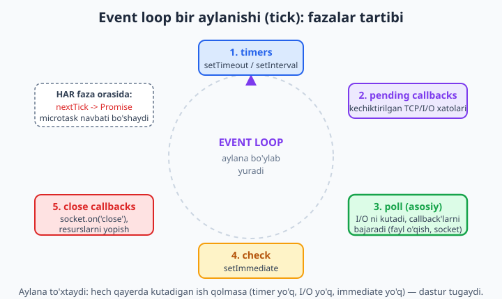
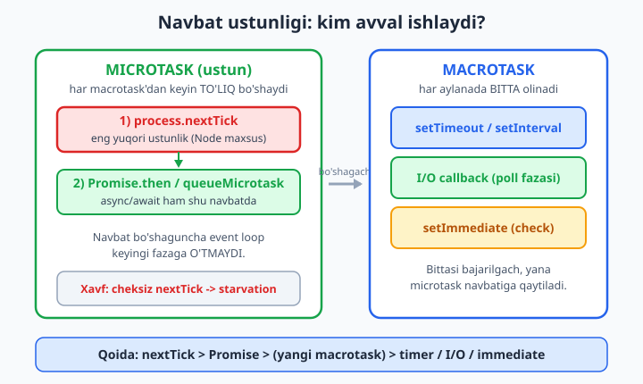

# 05 — Event loop va non-blocking I/O

[⬅️ Oldingi: 04 — Node uchun zamonaviy JavaScript va globallar](./04-zamonaviy-js.md) · [🏠 README](./README.md) · [Keyingi: 06 — Asinxronlik: callback, Promise, async/await ➡️](./06-asinxron.md)

> **Bu bobda:** Node'ning eng muhim va eng ko'p chalkashtiriladigan tushunchasi — **event loop** bilan tanishamiz. Nega Node bitta JavaScript thread'ida ishlaydi-yu, lekin minglab so'rovni bir vaqtda (konkurent) eplaydi? **Bloklovchi** (sinxron) va **non-bloklovchi** (asinxron) kod farqini o'lchab ko'ramiz; call stack, callback navbati va event loop mexanikasini ochamiz; event loop **fazalarini** (timers, pending, poll, check, close) ko'rib chiqamiz; **microtask** (`Promise.then`, `queueMicrotask`, `process.nextTick`) va **macrotask** (`setTimeout`, `setImmediate`, I/O) navbat tartibini Node'da haqiqatan ishga tushirib **isbotlaymiz**; `process.nextTick` ustunligi va uning xavfi (starvation), `setImmediate` vs `setTimeout(0)`, libuv **thread pool** (`UV_THREADPOOL_SIZE`) va nega CPU-bound og'ir hisob serverni qotirishini — real Express misolida — ko'rsatamiz.

---

## Muammo: bitta thread, lekin minglab mijoz

Tasavvur qiling, restoran bor, unda **bitta ofitsiant**. Sodda aql aytadi: bitta ofitsiant bilan ko'p mijozga xizmat qilib bo'lmaydi. Lekin yaxshi ofitsiant shunday ishlaydi: birinchi stoldan buyurtma oladi, oshxonaga beradi va **ovqat pishguncha kutib turmaydi** — darrov ikkinchi stolga o'tadi. Oshxona (parallel ishlaydigan oshpazlar) tayyor bo'lganda ofitsiantni chaqiradi, u esa kelib taomni eltadi.

Node aynan shu ofitsiant. **JavaScript kodingiz bitta thread'da** ishlaydi (bitta ofitsiant), lekin sekin ishlar — fayl o'qish, tarmoq so'rovi, ma'lumotlar bazasi — Node ostidagi **libuv** kutubxonasi tomonidan **parallel** bajariladi (oshxona). JS thread bu ishlarni "buyurtma berib" qo'yadi va boshqa ish bilan band bo'ladi; ish tayyor bo'lganda **callback** chaqiriladi.

Ana shu "buyurtmalarni boshqaradigan, tayyor bo'lganini chaqiradigan" mexanizm — **event loop**. Bu bobni tushunsangiz, Node'ning yarmini tushungan bo'lasiz.

```js
// Bu Node uchun ODDIY: 1000 ta faylni "bir vaqtda" o'qishni boshlash mumkin,
// chunki o'qish ishi JS thread'ni bandlamaydi.
import { readFile } from "node:fs/promises";

console.log("o'qishni boshladik...");
const matn = await readFile("data.txt", "utf8"); // kutadi, lekin BLOKLAMAYDI
console.log("o'qildi:", matn.length, "belgi");
```

Asosiy savol: "kutadi, lekin bloklamaydi" — bu qanday mumkin? Keling, avval bloklash nima ekanini ko'ramiz.

---

## Bloklovchi vs non-bloklovchi: o'lchab ko'ramiz

**Bloklovchi (sinxron)** kod — JS thread'ni egallab oladi va tugaguncha **boshqa hech narsa ishlamaydi**. **Non-bloklovchi (asinxron)** kod — ishni libuv'ga topshiradi va thread'ni bo'shatadi.

Faraz qiling, 100ms keyin ishlaydigan timer qo'ydik, so'ng 1 soniyalik og'ir sinxron sikl yozdik:

```js
// blocking.mjs
console.log("start");

setTimeout(() => {
  console.log("timer 100ms da rejalashtirilgan edi");
}, 100);

// 1 soniyalik og'ir sinxron hisob — JS thread'ni QOTIRADI
const tStart = Date.now();
while (Date.now() - tStart < 1000) {
  // bo'sh sikl — ataylab bloklaymiz
}
console.log(`sinxron blok ${Date.now() - tStart}ms davom etdi`);
```

Ishga tushiramiz — `node blocking.mjs`:

```text
start
sinxron blok 1000ms davom etdi
timer 100ms da rejalashtirilgan edi
```

E'tibor bering: timer **100ms** da emas, balki **1 soniyadan keyin** ishladi! Nega? Chunki `setTimeout` callback'i event loop'da navbat kutadi, lekin JS thread `while` sikli bilan band. Sikl tugamaguncha event loop bir qadam ham qo'ya olmaydi. **Bloklovchi kod hamma narsani to'xtatadi.**

📌 Bu Node'da eng ko'p uchraydigan xato manbasi. `setTimeout(fn, 100)` — bu "**aniq** 100ms keyin ishlaydi" degani emas, balki "**eng kamida** 100ms keyin, agar thread bo'sh bo'lsa" degani.

Sinxron `fs.readFileSync` ham aynan shunday qotiradi:

```js
import { readFileSync } from "node:fs";

// ❌ Server kontekstida YOMON: fayl o'qilguncha BUTUN dastur kutib turadi,
// boshqa hech bir mijozga xizmat qila olmaydi.
const data = readFileSync("katta-fayl.json", "utf8");
console.log(data.length);
```

Asinxron varianti esa thread'ni bo'shatadi:

```js
import { readFile } from "node:fs/promises";

// ✅ YAXSHI: o'qish libuv'da fonda ketadi, JS thread boshqa ishlarni bajarib turadi.
const data = await readFile("katta-fayl.json", "utf8");
console.log(data.length);
```

Ikkalasi ham faylni o'qiydi. Farq — **kim kutadi**: sinxronda JS thread o'lik kutadi; asinxronda libuv kutadi, JS thread esa erkin.

---

## Mexanika: call stack, callback navbati, event loop

JS thread'ning ichida **call stack** (chaqiruvlar steki) bor — hozir qaysi funksiya ishlayotganini ko'rsatadigan tartiblangan ro'yxat. Funksiya chaqirilsa stekka qo'shiladi, tugasa olib tashlanadi. Stek **bitta** — shu sababli "bitta thread".

`setTimeout`, `readFile` kabi asinxron funksiyani chaqirsangiz:

1. JS uni call stack'da chaqiradi, lekin u faqat **"ishni boshla"** deb libuv'ga aytadi va **darhol qaytadi** (stekdan tushadi).
2. Libuv ishni fonda (taymer hisoblash, fayl o'qish) bajaradi.
3. Ish tayyor bo'lganda, callback tegishli **navbatga** (queue) qo'yiladi.
4. **Event loop** — abadiy aylanadigan sikl — call stack **bo'sh** bo'lishini kutadi, so'ng navbatdan callback'ni olib stekka qo'yadi.

Demak event loop oddiy qoidaga bo'ysunadi: **call stack bo'shaguncha hech bir callback ishlamaydi**. Mana shuning uchun sinxron `while` sikli timer'ni kechiktirdi — sikl call stack'ni egallab turgan edi.

```js
console.log("1");                       // call stack: darhol
setTimeout(() => console.log("3"), 0);  // libuv'ga topshiriladi, navbatga
console.log("2");                       // call stack: darhol
// Chiqish: 1, 2, 3 — chunki sinxron kod tugamaguncha callback kutadi
```

> Bu yerda muhim xulosa: **sinxron kodning hammasi har doim asinxron callback'lardan oldin** ishlaydi. `setTimeout(..., 0)` ham "darhol" emas — u faqat "sinxron kod tugagach, navbat kelganda" degani.

---

## Event loop fazalari

Event loop bir aylanishi (uni **tick** deyishadi) bir nechta **fazadan** iborat. Har fazaning o'z navbati bor; loop fazalarni shu tartibda aylanadi:



| Faza | Nima bajariladi |
| --- | --- |
| **timers** | Vaqti yetgan `setTimeout` / `setInterval` callback'lari |
| **pending callbacks** | Ba'zi tizim operatsiyalarining kechiktirilgan callback'lari (masalan, ayrim TCP xatolari) |
| **poll** | Eng muhim faza: yangi I/O hodisalarini kutadi va I/O callback'larini (fayl o'qildi, socket'dan ma'lumot keldi) bajaradi |
| **check** | `setImmediate` callback'lari |
| **close** | Yopilish callback'lari, masalan `socket.on("close", ...)` |

Eng ko'p vaqt **poll** fazasida o'tadi — Node u yerda I/O ni "tinglab" turadi. Agar bajariladigan I/O callback bo'lsa, ularni bajaradi; agar `setImmediate` rejalashtirilgan bo'lsa, `check` fazasiga o'tadi; aks holda yangi I/O kelishini kutadi.

**Eng muhim qoida:** har faza orasida (aslida har bir callback orasida) Node **microtask navbatini** to'liq bo'shatadi — avval `process.nextTick`, keyin `Promise`. Buni keyingi bo'limda isbotlaymiz.

Quyidagi misol fazalarni real ko'rsatadi (CommonJS, chunki `__filename` ishlatamiz):

```js
// phases.cjs
const fs = require("node:fs");

console.log("=== boshlanish (sinxron) ===");

setTimeout(() => console.log("timers fazasi: setTimeout"), 0);
setImmediate(() => console.log("check fazasi: setImmediate"));

fs.readFile(__filename, () => {
  console.log("poll fazasi: fs.readFile callback (I/O tugadi)");
  process.nextTick(() => console.log("  -> nextTick (I/O dan keyin darhol)"));
  Promise.resolve().then(() => console.log("  -> Promise (microtask)"));
  setImmediate(() => console.log("  -> check: setImmediate (poll'dan keyin)"));
});

console.log("=== oxiri (sinxron) ===");
```

`node phases.cjs` natijasi:

```text
=== boshlanish (sinxron) ===
=== oxiri (sinxron) ===
timers fazasi: setTimeout
check fazasi: setImmediate
poll fazasi: fs.readFile callback (I/O tugadi)
  -> nextTick (I/O dan keyin darhol)
  -> Promise (microtask)
  -> check: setImmediate (poll'dan keyin)
```

Birinchi ikki qator — sinxron kod. Keyin I/O callback ichida: `nextTick` Promise'dan oldin, ikkalasi esa keyingi `setImmediate`'dan oldin ishladi. Bu — fazalar va microtask qoidasining birgalikdagi natijasi.

---

## Microtask vs macrotask: navbat tartibi

Bu — bobning yuragi. Node'da ikki xil "kutayotgan ish" navbati bor:

- **Macrotask** (yoki "task"): `setTimeout`, `setInterval`, `setImmediate`, I/O callback'lari. Event loop **har aylanada bittasini** oladi.
- **Microtask**: `process.nextTick`, `Promise.then/catch/finally`, `queueMicrotask`, va `await`'dan keyingi davom. Bular **alohida, ustun navbatda**.

Asosiy qoida: **har bir macrotask bajarilgach, event loop keyingi macrotask'ga o'tishdan OLDIN butun microtask navbatini to'liq bo'shatadi.** Microtask navbati ichida esa o'z tartibi bor:



**nextTick > Promise > (yangi macrotask) > timer / I/O / immediate.**

Endi buni quruq aytib qo'ymaymiz — **isbotlaymiz**. Quyidagi faylni ishga tushiramiz (CommonJS — sababini darrov tushuntiramiz):

```js
// order.cjs
console.log("1: sinxron boshi");

setTimeout(() => console.log("6: setTimeout(0) macrotask"), 0);
setImmediate(() => console.log("7: setImmediate (check fazasi)"));

Promise.resolve().then(() => console.log("4: Promise.then microtask"));
queueMicrotask(() => console.log("5: queueMicrotask microtask"));
process.nextTick(() => console.log("3: process.nextTick (eng ustun)"));

console.log("2: sinxron oxiri");
```

`node order.cjs` natijasi:

```text
1: sinxron boshi
2: sinxron oxiri
3: process.nextTick (eng ustun)
4: Promise.then microtask
5: queueMicrotask microtask
7: setImmediate (check fazasi)
6: setTimeout(0) macrotask
```

Buni qadam-baqadam o'qiymiz:

1. **1, 2** — barcha sinxron kod birinchi ishlaydi, call stack bo'shaydi.
2. **3** — `process.nextTick` eng ustun microtask, hatto kodda oxirida yozilgan bo'lsa ham birinchi.
3. **4, 5** — `Promise.then` va `queueMicrotask` — bir xil microtask navbatida, yozilish tartibida.
4. **7, 6** — keyin macrotask'lar. (Bu yerda `setImmediate` `setTimeout`'dan oldin chiqdi — yuqori darajada bu tartib **kafolatlanmagan**; pastda buni alohida muhokama qilamiz.)

> ⚠️ **Muhim nozik joy — ESM vs CommonJS.** Yuqoridagi faylni `.mjs` (ESM) qilib yozsangiz, `process.nextTick` Promise'dan **keyin** chiqishi mumkin! Sababi: ESM modulning yuqori darajadagi kodi o'zi Promise/microtask kontekstida bajariladi, shu sababli birinchi `nextTick` allaqachon kutayotgan modul-microtask'lar ortida qoladi. Toza, kutilgan "nextTick birinchi" tartibini ko'rsatish uchun biz bu yerda `.cjs` ishlatdik. **Funksiya yoki I/O callback ichida esa** (yuqoridagi `phases.cjs`'dagidek) tartib ESM'da ham bir xil — `nextTick` doim Promise'dan oldin.

### Microtask navbati to'liq bo'shaydi

Yana bir muhim isbot — har macrotask'dan keyin microtask navbati **to'liq** (yarim emas) bo'shaydi:

```js
// drain.cjs
setTimeout(() => {
  console.log("timer A");
  Promise.resolve().then(() => console.log("  micro A1"));
  Promise.resolve().then(() => console.log("  micro A2"));
}, 0);

setTimeout(() => {
  console.log("timer B");
  Promise.resolve().then(() => console.log("  micro B1"));
}, 0);
```

`node drain.cjs`:

```text
timer A
  micro A1
  micro A2
timer B
  micro B1
```

`timer A` (macrotask) ishlagach, u qo'shgan **ikkala** microtask (`A1`, `A2`) `timer B`'dan **oldin** bo'shaydi. Ya'ni event loop keyingi timer'ga o'tishdan oldin microtask navbatini oxirigacha tozalaydi.

---

## process.nextTick: ustunlik va xavf (starvation)

`process.nextTick` — Node'ning maxsus mexanizmi. U callback'ni **hozirgi operatsiya tugagach, lekin event loop keyingi fazaga o'tishidan oldin** ishga tushiradi. Hatto Promise microtask'laridan ham ustun.

Bu kuch — lekin shu kuch xavfli ham. Agar `nextTick` ichida yana `nextTick` chaqirsangiz, navbat **hech qachon bo'shamaydi** — event loop keyingi fazaga (timers, poll, I/O) umuman o'ta olmaydi. Bu **starvation** (ochlik): boshqa ishlar "och qoladi".

```js
// ❌ starve-small.cjs — XAVFNI ko'rsatadigan misol
setTimeout(() => console.log("timer kechikdi!"), 0);

let n = 0;
function recurse() {
  if (++n <= 1000) process.nextTick(recurse); // har safar YANGI nextTick qo'shadi
  else console.log("nextTick navbati bo'shadi, n =", n);
}
recurse();
```

`node starve-small.cjs`:

```text
nextTick navbati bo'shadi, n = 1001
timer kechikdi!
```

E'tibor bering: `setTimeout` kodda birinchi yozilgan bo'lsa-da, **1001 marta** rekursiv `nextTick` to'liq bo'shamaguncha ishlamadi. Bu yerda biz `n <= 1000` bilan chegaraladik — agar chegara bo'lmasa, `setTimeout` **umuman** ishlamasdi va dastur "tirik osilib" qolardi. Aynan shu — production'da Node serverini muzlatadigan klassik xato.

📌 **Amaliy maslahat:** kundalik kodda `process.nextTick` deyarli kerak emas. "Bu ishni hozirgi sinxron blokdan keyin, lekin imkon qadar tez bajar" desangiz, ko'p hollarda `queueMicrotask` xavfsizroq (u Promise microtask navbatida, starvation xavfi kamroq). `process.nextTick` asosan kutubxona mualliflari uchun maxsus holatlarda ishlatiladi.

---

## setImmediate vs setTimeout(0)

Ikkalasi ham "imkon qadar tez, lekin sinxron koddan keyin" degandek tuyuladi, lekin ular **turli fazalarda**:

- `setTimeout(fn, 0)` — **timers** fazasida.
- `setImmediate(fn)` — **check** fazasida.

Yuqori darajada (asosiy modulda) ularning tartibi **kafolatlanmagan** — taymer aniqligiga bog'liq, run'dan run'ga o'zgarishi mumkin. Lekin **I/O callback ichida** tartib **har doim aniq**: `setImmediate` `setTimeout(0)` dan **oldin** ishlaydi. Sababi: I/O callback `poll` fazasida bajariladi, undan keyingi faza esa darhol `check` (setImmediate), `timers` esa keyingi aylanada keladi.

```js
// immediate.cjs
const fs = require("node:fs");

// I/O callback ICHIDA tartib ANIQ: setImmediate doim setTimeout dan oldin
fs.readFile(__filename, () => {
  setTimeout(() => console.log("setTimeout(0)"), 0);
  setImmediate(() => console.log("setImmediate"));
});
```

`node immediate.cjs`'ni necha marta ishlatsangiz ham, natija bir xil:

```text
setImmediate
setTimeout(0)
```

💡 Xulosa: "I/O dan keyin bir narsani **darhol** keyingi tickda bajar" desangiz — `setImmediate`. U `setTimeout(0)` dan ham aniqroq va biroz tezroq, chunki minimal taymer hisobini kutmaydi.

---

## Libuv thread pool

"To'xtang — agar JS bitta thread bo'lsa, fayl o'qish va crypto **kim** parallel bajaradi?" Javob: **libuv thread pool**.

Ba'zi operatsiyalar operatsion tizimda haqiqiy asinxron API'ga ega emas yoki CPU talab qiladi. Bularni libuv o'zining **ishchi thread'lar pulida** (default **4 ta** thread) bajaradi. Bunga kiradi:

- **fayl tizimi** (`fs.*` — ko'pchiligi),
- **crypto** (masalan `crypto.pbkdf2`, `crypto.randomBytes`),
- **dns.lookup** (ba'zi holatlarda),
- **zlib** (siqish).

Tarmoq (TCP/HTTP) so'rovlari esa pulni **ishlatmaydi** — ular OS'ning o'z asinxron mexanizmiga (epoll/kqueue/IOCP) tayanadi.

Pul o'lchamini `UV_THREADPOOL_SIZE` muhit o'zgaruvchisi orqali sozlash mumkin. Buni o'lchaymiz — 4 ta og'ir `pbkdf2` vazifasini bir vaqtda ishga tushiramiz:

```js
// threadpool.mjs
import crypto from "node:crypto";

const start = Date.now();
for (let i = 1; i <= 4; i++) {
  crypto.pbkdf2("parol", "tuz", 200000, 64, "sha512", () => {
    console.log(`Vazifa ${i} tugadi: ${Date.now() - start}ms`);
  });
}
```

Default holatda (4 thread) hammasi **birga** tugaydi:

```text
=== default (4) ===
Vazifa 1 tugadi: 112ms
Vazifa 2 tugadi: 113ms
Vazifa 3 tugadi: 115ms
Vazifa 4 tugadi: 120ms
```

Endi pulni 2 thread'ga cheklab ishlatamiz — `UV_THREADPOOL_SIZE=2 node threadpool.mjs`:

```text
=== UV_THREADPOOL_SIZE=2 ===
Vazifa 2 tugadi: 117ms
Vazifa 1 tugadi: 120ms
Vazifa 3 tugadi: 233ms
Vazifa 4 tugadi: 237ms
```

Endi faqat **2 tasi** parallel ishladi (~120ms), qolgan ikkitasi navbat kutib **ikkinchi to'lqinda** (~235ms) tugadi. Bu — thread pul cheklangan resurs ekanining aniq isboti.

> 🪟 **Windows eslatma:** muhit o'zgaruvchisini PowerShell'da shunday beriladi: `$env:UV_THREADPOOL_SIZE=2; node threadpool.mjs`. Bash/Linux/macOS'da esa `UV_THREADPOOL_SIZE=2 node threadpool.mjs`.

💡 Amaliyot: agar ilovangiz ko'p `fs` yoki `crypto` ishlatsa va ular "tiqilib" qolsa, `UV_THREADPOOL_SIZE`'ni protsessor yadrolari soniga moslab oshirish yordam berishi mumkin. Lekin avval o'lchang — ko'r-ko'rona kattalashtirish foyda bermaydi.

---

## REAL KEYS: CPU-bound kod butun serverni qotiradi

Endi eng muhim amaliy dars. Yuqoridagi hamma narsa bitta xulosaga olib keladi: **JS thread'ida og'ir sinxron (CPU-bound) hisob bajarsangiz, butun server qotadi** — bir mijoz uchun hisoblayotganda boshqa hech kimga javob bera olmaysiz.

Buni real Express serverida ko'rsatamiz. Bitta endpoint og'ir sinxron sikl bajaradi, ikkinchisi — yengil. So'ng og'irini chaqirib, darrov yengilini urinib ko'ramiz:

```js
// server.mjs  (package.json: { "type": "module" }, va: npm install express)
import express from "express";
const app = express();

// ❌ BLOKLOVCHI handler: og'ir sinxron sikl butun serverni qotiradi
app.get("/slow", (req, res) => {
  const t = Date.now();
  while (Date.now() - t < 2000) {} // 2s sinxron blok — JS thread band
  res.send("slow tugadi");
});

// Yengil endpoint — lekin /slow ishlayotganda U HAM javob bera olmaydi
app.get("/fast", (req, res) => res.send("fast javob"));

const server = app.listen(3000, async () => {
  const slow = fetch("http://localhost:3000/slow"); // jo'natamiz, kutmaymiz
  const startFast = Date.now();
  await fetch("http://localhost:3000/fast");         // darhol urinib ko'ramiz
  console.log(`/fast javobi ${Date.now() - startFast}ms da keldi (server bloklangan!)`);
  await slow;
  server.close();
});
```

`node server.mjs`:

```text
/fast javobi 2022ms da keldi (server bloklangan!)
```

`/fast` bir zumda javob berishi kerak edi, lekin **2022ms** kutdi! Chunki `/slow`'dagi `while` sikli JS thread'ni 2 soniya egalladi va event loop `/fast` so'rovini umuman ko'ra olmadi. **Bitta sekin so'rov butun serverni hamma uchun muzlatdi.**

Endi yechimini ko'ramiz — og'ir sinxron siklni asinxron kutish bilan almashtiramiz (bu yerda namuna uchun `setTimeout`, real hayotda esa I/O yoki worker):

```js
// nonblock-server.mjs
import express from "express";
import { setTimeout as sleep } from "node:timers/promises";
const app = express();

// ✅ NON-BLOKLOVCHI: await JS thread'ni bo'shatadi, event loop erkin
app.get("/slow", async (req, res) => {
  await sleep(2000);          // 2s, lekin thread band emas
  res.send("slow tugadi");
});
app.get("/fast", (req, res) => res.send("fast javob"));

const server = app.listen(3000, async () => {
  const slow = fetch("http://localhost:3000/slow");
  const startFast = Date.now();
  await fetch("http://localhost:3000/fast");
  console.log(`/fast javobi ${Date.now() - startFast}ms da keldi (server erkin!)`);
  await slow;
  server.close();
});
```

`node nonblock-server.mjs`:

```text
/fast javobi 19ms da keldi (server erkin!)
```

**2022ms → 19ms.** Mana shu — Node'ning butun falsafasi. `await sleep(...)` paytida JS thread bo'sh, shuning uchun `/fast` darrov javob berdi. Farq bitta narsada: thread'ni **bloklash yoki bo'shatish**.

> 🧮 **Real CPU-bound ishlar-chi?** Rasmni qayta o'lchash, katta JSON'ni parsing qilish, parol hash'lash, video kodlash — bularni `await` bilan "bo'shatib" bo'lmaydi, chunki ular haqiqatan CPU vaqtini talab qiladi. Bunday vazifalarni asosiy thread'dan **boshqa thread'ga** chiqarish kerak — buni **`worker_threads`** moduli orqali qilamiz, 24-bobda batafsil ko'rib chiqamiz. Qoida: **event loop'ni hech qachon og'ir sinxron hisob bilan bloklamang.**

---

## Yana bir foydali namuna: `await` ham microtask

`async/await` — bu Promise'ning shirin sintaksisi, shuning uchun `await`'dan keyingi qism ham **microtask** sifatida ishlaydi:

```js
// await-order.mjs
console.log("A: boshlanish");

async function vazifa() {
  console.log("B: async ichi (sinxron qism)");
  await null;                           // bu yerda thread "bo'shab", microtaskka o'tadi
  console.log("D: await dan keyin (microtask)");
}

vazifa();
console.log("C: asosiy kod davomi");
```

`node await-order.mjs`:

```text
A: boshlanish
B: async ichi (sinxron qism)
C: asosiy kod davomi
D: await dan keyin (microtask)
```

`async` funksiya `await`'gacha bo'lgan qismni **sinxron** bajaradi (B), `await`'dan keyingi qism esa microtask'ga qo'yiladi va sinxron kod (C) tugagach ishlaydi (D). Buni tushunsangiz, keyingi bobdagi async/await sirli emas — u shunchaki event loop ustidagi qulay qatlam. Endi 06-bobda asinxronlikning uch avlodini (callback → Promise → async/await) chuqur ko'ramiz.

---

## Xulosa

- Node **bitta JS thread**'da ishlaydi, lekin sekin I/O ni **libuv** parallel bajargani uchun **konkurent** (ko'p ishni birga eplaydi).
- **Bloklovchi** (sinxron) kod thread'ni egallaydi va hamma narsani to'xtatadi; **non-bloklovchi** kod ishni libuv'ga topshirib thread'ni bo'shatadi.
- **Event loop** call stack bo'shaganda navbatdan callback oladi; fazalari: **timers → pending → poll → check → close**.
- Har macrotask'dan keyin **microtask navbati to'liq bo'shaydi**: **nextTick > Promise/queueMicrotask**, keyin macrotask (timer / I/O / immediate).
- `process.nextTick` eng ustun, lekin rekursiv ishlatish **starvation**'ga olib keladi — ehtiyot bo'ling.
- I/O callback ichida `setImmediate` doim `setTimeout(0)` dan oldin.
- **CPU-bound og'ir hisob event loop'ni bloklaydi va butun serverni qotiradi** — bunday vazifalarni `worker_threads`'ga chiqaring (24-bob).

---

## Mashqlar

### Oson

1. Quyidagi kodning chiqish tartibini **avval qog'ozda taxmin qiling**, so'ng `.cjs` faylga yozib `node` bilan tekshiring:
   ```js
   console.log("a");
   setTimeout(() => console.log("b"), 0);
   Promise.resolve().then(() => console.log("c"));
   console.log("d");
   ```
2. O'z so'zlaringiz bilan tushuntiring: nega `setTimeout(fn, 1000)` "aynan 1000ms" emas, balki "kamida 1000ms" degani?
3. Quyidagilardan qaysilari **macrotask**, qaysilari **microtask**: `setTimeout`, `Promise.then`, `setImmediate`, `process.nextTick`, `queueMicrotask`, I/O callback?

### O'rta

4. Sinxron `fs.readFileSync` bilan asinxron `fs.promises.readFile` farqini ko'rsatadigan kichik dastur yozing: ikkala holatda ham o'qishdan **oldin** `setTimeout(() => console.log("timer"), 0)` qo'ying va timer qachon ishlashini kuzating.
5. I/O callback **ichida** `setTimeout(0)` va `setImmediate`'ni qo'yib, har doim `setImmediate` oldin ishlashini Node bilan tasdiqlang. So'ng ularni I/O callback'dan **tashqarida** (asosiy modulda) qo'yib, tartib o'zgarishi (kafolatlanmaganligi) mumkinligini ko'ring.
6. `crypto.pbkdf2` bilan 8 ta vazifani parallel ishga tushiring va `UV_THREADPOOL_SIZE`'ni 4, 8, 1 qilib o'lchang. Qaysi holatda hammasi birga, qaysida to'lqinlarga bo'linib tugaydi?

### Qiyin

7. **Starvation'ni ko'rsating va tuzating.** `process.nextTick` rekursiyasi `setTimeout`'ni "och qoldirishini" ko'rsatadigan dastur yozing. So'ng `process.nextTick` o'rniga nima qilsa, timer ham, rekursiya ham ishlay olishini ko'rsating (maslahat: `setImmediate` yoki har N qadamda navbatni "bo'shatish").
8. **Mini bloklash detektori.** Har 100ms da ishlaydigan `setInterval` qo'ying va u haqiqatan qancha kechikish bilan ishlayotganini o'lchang (kutilgan vaqt bilan farqni). So'ng o'rtada 500ms lik og'ir sinxron sikl yuriting va detektorda "lag" (kechikish) paydo bo'lishini ko'ring. Bu — production'da event loop bloklanishini aniqlashning sodda usuli.

<details markdown="1"><summary>Yechim — 1</summary>

```js
// echo1.cjs
console.log("a");
setTimeout(() => console.log("b"), 0);
Promise.resolve().then(() => console.log("c"));
console.log("d");
```

`node echo1.cjs`:

```text
a
d
c
b
```

Tartib: `a`, `d` (sinxron) → `c` (microtask, Promise) → `b` (macrotask, setTimeout). Microtask har doim macrotask'dan oldin bo'shaydi.

</details>

<details markdown="1"><summary>Yechim — 4</summary>

```js
// sync-vs-async.cjs
const fs = require("node:fs");

console.log("--- SINXRON ---");
setTimeout(() => console.log("timer (sinxron testdan keyin)"), 0);
const data = fs.readFileSync(__filename, "utf8"); // BLOKLAYDI
console.log("sinxron o'qildi:", data.length, "belgi");

// Asinxron qismni keyingi tickda boshlaymiz, toza ko'rinishi uchun
setImmediate(() => {
  console.log("--- ASINXRON ---");
  setTimeout(() => console.log("timer (asinxron oqim erkin)"), 0);
  fs.promises.readFile(__filename, "utf8").then((d) => {
    console.log("asinxron o'qildi:", d.length, "belgi");
  });
});
```

Sinxron holatda `readFileSync` thread'ni egallaydi, lekin u baribir tez (kichik fayl), shuning uchun timer keyin chiqadi. Asinxron holatda o'qish libuv'da ketadi — timer va o'qish callback'i navbat bo'yicha ishlaydi, JS thread esa bloklanmaydi. Asosiy dars: sinxron versiyada o'qish davomida **boshqa hech narsa** ishlay olmaydi.

</details>

<details markdown="1"><summary>Yechim — 7 (starvation va tuzatish)</summary>

**Muammo (starvation):**

```js
// ❌ starve.cjs — timer hech qachon (yoki juda kech) ishlaydi
setTimeout(() => console.log("TIMER ishladi"), 0);
let n = 0;
(function recurse() {
  if (++n <= 1_000_000) process.nextTick(recurse);
  else console.log("nextTick tugadi");
})();
```

`nextTick` navbati million marta bo'shaguncha event loop `timers` fazasiga umuman o'ta olmaydi. Agar `n` chegarasi bo'lmasa, `TIMER` **hech qachon** ishlamasdi.

**Yechim 1 — `setImmediate` bilan:** rekursiyani `setImmediate` orqali qiling. U **check** fazasida, har aylanada bir marta — shuning uchun event loop har aylanada `timers` fazasiga ham o'tib, timer'ga "nafas" beradi:

```js
// fix1.cjs
setTimeout(() => console.log("TIMER ishladi"), 0);
let n = 0;
(function recurse() {
  if (++n <= 1_000_000) setImmediate(recurse); // event loop'ni och qoldirmaydi
  else console.log("setImmediate rekursiya tugadi");
})();
```

`node fix1.cjs` — endi `TIMER ishladi` rekursiya tugashini kutmasdan, birinchi aylanalardayoq chiqadi.

**Yechim 2 — har N qadamda navbatni bo'shatish:** agar `nextTick`'ni juda ko'p ishlatish shart bo'lsa, vaqti-vaqti bilan `setImmediate` orqali "nafas oling":

```js
// fix2.cjs
setTimeout(() => console.log("TIMER ishladi"), 0);
let n = 0;
(function recurse() {
  if (++n > 1_000_000) return console.log("tugadi");
  if (n % 1000 === 0) setImmediate(recurse); // har 1000 qadamda loop'ga nafas
  else process.nextTick(recurse);
})();
```

Asosiy dars: **rekursiv `process.nextTick` — event loop dushmani.** Ko'p iteratsiyali ishni bo'laklarga bo'lib, orasiga `setImmediate` qo'ying.

</details>

<details markdown="1"><summary>Yechim — 8 (bloklash detektori)</summary>

```js
// lag-detector.cjs
const KUTILGAN = 100; // ms
let oxirgi = Date.now();

const taymer = setInterval(() => {
  const hozir = Date.now();
  const lag = hozir - oxirgi - KUTILGAN; // kutilgandan ortiqcha kechikish
  oxirgi = hozir;
  console.log(`tick — lag: ${lag}ms`);
}, KUTILGAN);

// 700ms keyin og'ir sinxron sikl yuritamiz — event loop bloklanadi
setTimeout(() => {
  console.log(">>> 500ms og'ir sinxron sikl boshlandi <<<");
  const t = Date.now();
  while (Date.now() - t < 500) {} // BLOK
  console.log(">>> sinxron sikl tugadi <<<");
}, 700);

// 2 soniyadan keyin to'xtatamiz
setTimeout(() => clearInterval(taymer), 2000);
```

`node lag-detector.cjs` natijasi (raqamlar mashinaga qarab biroz farq qiladi):

```text
tick — lag: 1ms
tick — lag: 0ms
tick — lag: 1ms
tick — lag: 1ms
tick — lag: 1ms
tick — lag: 1ms
>>> 500ms og'ir sinxron sikl boshlandi <<<
>>> sinxron sikl tugadi <<<
tick — lag: 503ms
tick — lag: 0ms
```

Oddiy holatda lag ~0-1ms. Sinxron sikl ishlagan zahoti keyingi tick **~500ms** kechikdi — bu aynan biz bloklab turgan vaqt. Production'da `setInterval` lag'ini doimiy o'lchab turish — event loop bloklanishini aniqlashning eng sodda usuli (mashhur kutubxonalar, masalan `event-loop-lag`, shu printsipga asoslangan). Agar lag muntazam yuqori bo'lsa — kodingizda bloklovchi CPU-bound ish bor demakdir.

</details>

---

[⬅️ Oldingi: 04 — Node uchun zamonaviy JavaScript va globallar](./04-zamonaviy-js.md) · [🏠 README](./README.md) · [Keyingi: 06 — Asinxronlik: callback, Promise, async/await ➡️](./06-asinxron.md)
