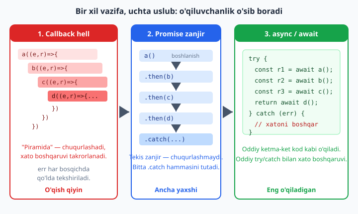
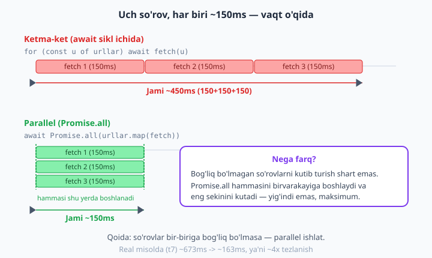

# 06 — Asinxronlik: callback, Promise, async/await

[⬅️ Oldingi: 05 — Event loop va non-blocking I/O](./05-event-loop.md) · [🏠 README](./README.md) · [Keyingi: 07 — EventEmitter va hodisa-asoslangan dasturlash ➡️](./07-eventemitter.md)

> **Bu bobda:** asinxron dasturlashning butun evolyutsiyasini bosib o'tamiz — nega umuman asinxron kerakligidan boshlab, **callback** va error-first konvensiyasi, undan kelib chiqadigan **callback hell** muammosi, keyin **Promise** (holatlari, `then/catch/finally`, zanjir, `new Promise`), `util.promisify` va `fs/promises`, va nihoyat eng o'qiladigan uslub — **async/await** hamda `try/catch`. So'ng amaliyotning yuragi: **ketma-ket vs parallel** ishlash, `Promise.all / allSettled / race / any` farqi va qachon qaysisini ishlatish, xato boshqaruvi tuzoqlari (unutilgan `.catch`, `unhandledRejection`), va **top-level await**. REAL KEYS sifatida bir nechta URL dan `fetch` bilan parallel va ketma-ket ma'lumot olib, vaqt farqini o'z ko'zimiz bilan ko'ramiz.

---

## 6.1 Nega asinxron? I/O ni kutib turmaslik

5-bobda event loop va non-blocking I/O ni ko'rdik: Node bitta asosiy ipda (thread) ishlaydi, lekin fayl o'qish, tarmoq so'rovi, ma'lumotlar bazasiga murojaat kabi **I/O** amallarini operatsion tizimga topshirib, javobini **kutib turmasdan** keyingi ishni davom ettiradi.

Savol shu: agar funksiya natijani darrov qaytarmasa — javob keyin kelsa — natijani qanday **qabul qilamiz**? Mana shu yerda asinxronlik vositalari kerak bo'ladi.

Bir oddiy taqqoslash bilan boshlaylik. **Sinxron (bloklovchi)** kod natijani qaytarguncha hamma narsani to'xtatadi:

```js
// Sinxron: fayl o'qib bo'lguncha boshqa hech narsa ishlamaydi
import { readFileSync } from 'node:fs';

console.log('1: boshlandi');
const matn = readFileSync(import.meta.filename, 'utf8'); // shu yerda KUTAMIZ
console.log('2: fayl o\'qildi, uzunligi =', matn.length);
console.log('3: tugadi');
```

Bu kichik skript uchun muammosiz. Lekin server 100 ta foydalanuvchiga xizmat qilayotganda, bitta sekin fayl o'qish butun serverni "muzlatib" qo'yadi — boshqalar navbat kutadi. Yechim — **asinxron** variant: amalni boshlab, "tayyor bo'lganda menga xabar ber" deb aytib, ishni davom ettirish.

> **Asosiy g'oya:** asinxron kod "natijani hozir ber" demaydi. U "natija tayyor bo'lganda, mana bu kodni ishga tushir" deydi. Faqat "mana bu kodni" qanday uzatishimiz — callback, Promise yoki async/await — vaqt o'tishi bilan o'zgarib, qulayroq bo'lib bordi. Quyidagi diagramma aynan shu evolyutsiyani ko'rsatadi:



---

## 6.2 Callback — eng birinchi mexanizm

**Callback** (qayta chaqiruvchi funksiya) — bu boshqa funksiyaga **argument sifatida uzatilgan** funksiya. Asinxron amal tugagach, u shu funksiyani chaqiradi.

Eng oddiy misol — taymer. `setTimeout` darrov tugamaydi; u "berilgan vaqt o'tgach, shu funksiyani chaqir" deydi:

```js
console.log('1: buyruq berildi');

setTimeout(() => {
  console.log('3: 100ms o\'tdi, callback ishladi');
}, 100);

console.log('2: davom etyapmiz (kutib turmadik)');
```

Ishga tushiramiz (`node fayl.mjs`):

```
1: buyruq berildi
2: davom etyapmiz (kutib turmadik)
3: 100ms o'tdi, callback ishladi
```

E'tibor ber: `2` `3` dan **oldin** chiqdi. Node `setTimeout` ni boshlab, kutib turmasdan keyingi qatorga o'tdi. Bu — non-blocking xulq-atvorning amaliy ko'rinishi.

### Error-first callback konvensiyasi: `cb(err, data)`

Node'ning klassik (Promise'dan oldingi) kutubxonalari bir kelishuvga amal qiladi: **callback ning birinchi argumenti — xato**, ikkinchisi — natija. Bu **error-first** (xato-birinchi) konvensiyasi:

```js
import { readFile } from 'node:fs';

// readFile(callback) ni shunday chaqiramiz: cb(err, data)
readFile(import.meta.filename, 'utf8', (err, data) => {
  if (err) {
    console.error('Xato yuz berdi:', err.message);
    return;                       // xato bo'lsa, darrov chiqamiz
  }
  console.log('Fayl uzunligi:', data.length);
});
```

Qoida sodda, lekin **qattiq**:
- Muvaffaqiyatda: `cb(null, natija)` — xato yo'q (`null`), natija bor.
- Xatoda: `cb(err)` — birinchi argument `Error` obyekti.
- Callback ichida **eng avval** `if (err)` ni tekshirib, kerak bo'lsa `return` qilamiz.

Endi shu konvensiyaga amal qiluvchi o'z funksiyamizni yozamiz:

```js
function ishniBaja(vaqt, cb) {
  setTimeout(() => {
    if (vaqt < 0) {
      cb(new Error('vaqt manfiy bo\'lishi mumkin emas')); // xato-birinchi
      return;
    }
    cb(null, `${vaqt}ms dan keyin tayyor`);                // null = xato yo'q
  }, vaqt);
}

ishniBaja(50, (err, natija) => {
  if (err) {
    console.error('Xato:', err.message);
    return;
  }
  console.log('Natija:', natija);     // Natija: 50ms dan keyin tayyor
});
```

> **Nega aynan birinchi argument xato?** Chunki xatoni **e'tibordan chetda qoldirish oson** — agar u oxirda bo'lsa, ko'pchilik uni unutardi. Birinchi o'ringa qo'yib, til darajasida "avval xatoni tekshir" madaniyatini singdirishadi.

---

## 6.3 Callback hell — piramida muammosi

Callback bitta amal uchun yaxshi. Muammo — amallar **ketma-ket bog'langanda** boshlanadi: birinchining natijasi ikkinchiga, uniki uchinchiga kerak. Har bir keyingi amalni oldingisining callback'i **ichiga** yozishga majbur bo'lamiz, va kod o'ngga "qiyshayib", piramidaga aylanadi:

```js
function ishniBaja(vaqt, cb) {
  setTimeout(() => cb(null, `${vaqt}ms tayyor`), vaqt);
}

// Uchta amalni ketma-ket bajaramiz — har biri oldingisini kutadi
ishniBaja(10, (err, a) => {
  if (err) return console.error(err);
  ishniBaja(10, (err, b) => {            // a tayyor bo'lgach
    if (err) return console.error(err);
    ishniBaja(10, (err, c) => {          // b tayyor bo'lgach
      if (err) return console.error(err);
      console.log('Hammasi tayyor:', a, '|', b, '|', c);
    });
  });
});
```

Bu hali faqat 3 ta amal. 6-7 ta bo'lsa, kod o'ng tomonga shunchalik suriladiki, o'qib bo'lmaydi. Buni **callback hell** ("callback jahannami") yoki **"pyramid of doom"** ("halokat piramidasi") deyishadi. Muammolari:

- **O'ngga siljish:** har bosqich chuqurlashadi, o'qish qiyinlashadi.
- **Xato boshqaruvi takrorlanadi:** har callback ichida `if (err)` qayta-qayta yoziladi.
- **Boshqarish qiyin:** o'rtaga yangi qadam qo'shish yoki tartibni o'zgartirish — qaltis.

Aynan shu muammoni hal qilish uchun **Promise** o'ylab topilgan.

---

## 6.4 Promise — kelajakdagi qiymat

**Promise** ("va'da") — bu hozir mavjud bo'lmagan, lekin **kelajakda tayyor bo'ladigan** qiymatni ifodalovchi obyekt. Uni "javob keladigan kvitansiya" deb tasavvur qil: hozir natija yo'q, lekin natija (yoki xato) kelganda seni xabardor qiladi.

### Promise'ning uchta holati

Promise har doim quyidagi **uch holat**dan birida bo'ladi:

| Holat | Ma'nosi |
|-------|---------|
| **pending** (kutilmoqda) | Hali tugamagan — natija ham, xato ham yo'q |
| **fulfilled** (bajarildi) | Muvaffaqiyatli yakunlandi, qiymat bor (`resolve`) |
| **rejected** (rad etildi) | Xato bilan yakunlandi (`reject`) |

`pending` dan keyin Promise **faqat bir marta** `fulfilled` yoki `rejected` ga o'tadi va keyin **o'zgarmaydi** (qotadi). "Settled" (yakunlangan) so'zi fulfilled yoki rejected ni — ya'ni "endi pending emas" ni anglatadi.

### Promise iste'mol qilish: `then` / `catch` / `finally`

Tayyor Promise qaytaruvchi funksiyaga (masalan, keyinroq ko'radigan `fs/promises`) `.then`, `.catch`, `.finally` bilan ulanamiz:

- `.then(qiymat => ...)` — Promise **fulfilled** bo'lganda ishlaydi, qiymatni oladi.
- `.catch(xato => ...)` — Promise **rejected** bo'lganda ishlaydi, xatoni oladi.
- `.finally(() => ...)` — **har holatda** ishlaydi (tozalash uchun: faylni yopish, "yuklanmoqda" indikatorini o'chirish).

### O'z Promise'ingni yaratish: `new Promise`

`new Promise` ga **executor** (ijrochi) funksiya beramiz. Unga ikkita funksiya — `resolve` va `reject` — uzatiladi. Muvaffaqiyatda `resolve(qiymat)`, xatoda `reject(error)` chaqiramiz:

```js
function kechikish(ms, qiymat) {
  return new Promise((resolve, reject) => {
    if (ms < 0) {
      reject(new Error('ms manfiy'));          // -> rejected
      return;
    }
    setTimeout(() => resolve(qiymat), ms);      // ms dan keyin -> fulfilled
  });
}

kechikish(30, 'salom')
  .then((x) => console.log('Tayyor:', x))       // Tayyor: salom
  .catch((e) => console.error('Xato:', e.message));
```

### Promise zanjiri — piramidadan qutulish

Mana callback hell'ning Promise versiyasi. Diqqat: har bir `.then` ichidan **qiymat qaytarsak**, u keyingi `.then` ga o'tadi; **Promise qaytarsak**, zanjir uni kutadi. Natijada kod chuqurlashmaydi — **tekis** bo'lib qoladi:

```js
function kechikish(ms, qiymat) {
  return new Promise((resolve) => setTimeout(() => resolve(qiymat), ms));
}

kechikish(30, 10)
  .then((x) => {
    console.log('1-qadam:', x);     // 1-qadam: 10
    return x * 2;                   // oddiy qiymat -> keyingi then ga
  })
  .then((x) => {
    console.log('2-qadam:', x);     // 2-qadam: 20
    return kechikish(20, x + 5);    // Promise -> zanjir uni KUTADI
  })
  .then((x) => {
    console.log('3-qadam:', x);     // 3-qadam: 25
  })
  .catch((err) => {
    // Yuqoridagi ISTALGAN qadamdagi xato shu yerga tushadi
    console.error('Zanjirda xato:', err.message);
  })
  .finally(() => {
    console.log('Zanjir tugadi (finally)');
  });
```

Callback hell'ga nisbatan ikkita katta yutuq:
1. Kod **tekis** — har qadam bir xil chuqurlikda.
2. **Bitta `.catch`** zanjirning istalgan joyidagi xatoni tutadi — `if (err)` ni har qadamda takrorlash shart emas.

> **Ko'p uchraydigan tuzoq:** `.then` ichida Promise qaytarishni **unutma**. `return kechikish(...)` o'rniga shunchaki `kechikish(...)` yozsang, zanjir uni kutmaydi va tartib buziladi. Qoida: `.then` ichidagi asinxron amalni **doimo `return` qil**.

---

## 6.5 Callback API ni Promise ga aylantirish: `promisify` va `fs/promises`

Node'ning eski API'lari callback'li. Ularni Promise'ga o'tkazishning ikki yo'li bor.

### 1) `util.promisify` — universal o'tkazgich

`util.promisify` error-first callback funksiyasini Promise qaytaradigan funksiyaga aylantiradi:

```js
import { promisify } from 'node:util';
import { readFile as readFileCb } from 'node:fs';

const readFileP = promisify(readFileCb);   // callback API -> Promise API

const matn = await readFileP(import.meta.filename, 'utf8');
console.log('Uzunligi:', matn.length);
```

### 2) `fs/promises` — tayyor Promise versiyalari

Aslida `fs` modulining ko'p funksiyalari uchun Node **allaqachon** Promise versiyasini beradi — `node:fs/promises`. Bu afzal yo'l:

```js
import { writeFile, readFile, unlink } from 'node:fs/promises';
import { promisify } from 'node:util';
import { readFile as readFileCb } from 'node:fs';
import { tmpdir } from 'node:os';
import { join } from 'node:path';

const readFileP = promisify(readFileCb);
const fayl = join(tmpdir(), 'ch06-demo.txt');

await writeFile(fayl, 'Salom, fs/promises!', 'utf8');

const matn1 = await readFile(fayl, 'utf8');     // fs/promises (afzal)
console.log('fs/promises:', matn1);             // Salom, fs/promises!

const matn2 = await readFileP(fayl, 'utf8');    // promisify qilingan
console.log('promisify:  ', matn2);             // Salom, fs/promises!

await unlink(fayl);                              // tozalab qo'yamiz
console.log('Fayl o\'chirildi.');
```

> **Qaysi birini tanlash?** Agar modulning tayyor `/promises` versiyasi bo'lsa (`fs/promises`, `dns/promises`, `timers/promises`...) — **o'shani ishlat**. `promisify` esa tayyor versiyasi yo'q, eski callback'li funksiyalar uchun zaxira yo'l.

---

## 6.6 async/await — eng o'qiladigan uslub

Promise zanjiri callback hell'dan yaxshi, lekin baribir `.then` lar ketma-ketligi. **async/await** Promise'ning ustiga qurilgan **sintaktik qulaylik**: u asinxron kodni xuddi oddiy ketma-ket koddek yozish imkonini beradi.

Ikki kalit so'z:
- **`async`** funksiya oldiga qo'yiladi. Bunday funksiya **doimo Promise qaytaradi**.
- **`await`** Promise oldiga qo'yiladi va Promise yakunlanguncha shu joyda **"kutadi"** (asosiy ipni bloklamasdan!), so'ng natijani qiymat sifatida beradi.

```js
function kechikish(ms, qiymat) {
  return new Promise((resolve) => setTimeout(() => resolve(qiymat), ms));
}

async function vazifa() {
  const a = await kechikish(20, 'A');   // 'A' kelguncha kutadi
  const b = await kechikish(20, 'B');   // keyin 'B'
  return `${a}+${b}`;                    // async funksiya Promise qaytaradi
}

const natija = await vazifa();
console.log('Natija:', natija);         // Natija: A+B
```

Ko'rdingmi — `.then` yo'q, callback yo'q. Kod yuqoridan pastga, oddiy o'qiladi. 6.4 dagi zanjirni async/await bilan qayta yozsak:

```js
function kechikish(ms, qiymat) {
  return new Promise((resolve) => setTimeout(() => resolve(qiymat), ms));
}

async function jarayon() {
  const x1 = await kechikish(30, 10);
  console.log('1-qadam:', x1);          // 10
  const x2 = await kechikish(20, x1 * 2);
  console.log('2-qadam:', x2);          // 20
  const x3 = await kechikish(20, x2 + 5);
  console.log('3-qadam:', x3);          // 25
}

await jarayon();
```

### Xato boshqaruvi: `try / catch`

async/await'ning eng yoqimli jihati — xatolarni **oddiy `try/catch`** bilan tutamiz, xuddi sinxron koddek. `await` qilingan Promise rejected bo'lsa, u **`throw`** kabi ishlaydi va `catch` ga tushadi:

```js
async function xatoli() {
  throw new Error('rejalashtirilgan xato');   // bu Promise ni reject qiladi
}

async function main() {
  try {
    await xatoli();
  } catch (err) {
    console.log('try/catch tutdi:', err.message);  // rejalashtirilgan xato
  }
}

await main();
```

`finally` ham xuddi sinxron koddagidek ishlaydi — tozalash kodini shu yerga qo'yamiz:

```js
async function ishla() {
  try {
    return await kechikish(20, 'natija');
  } finally {
    console.log('tozalash: resurs yopildi');  // har holatda ishlaydi
  }
}
```

> **Eslatma:** `await` ni faqat `async` funksiya ichida (yoki ESM modulning eng yuqori darajasida — 6.10 ga qara) ishlatish mumkin. Oddiy, `async` bo'lmagan funksiya ichida `await` yozsang — sintaksis xatosi.

---

## 6.7 Ketma-ket vs parallel — eng muhim amaliy farq

Endi asinxronlikning eng ko'p xato qilinadigan joyiga keldik. `await` kodni **kutadi**. Bu yaxshi, lekin **noto'g'ri joyda kutsak — vaqtni bekorga sarflaymiz**.

### Muammo: `await` ni siklda ishlatish

Tasavvur qil: uchta bir-biriga **bog'liq bo'lmagan** vazifa bor (masalan, uch xil URL dan ma'lumot olish). Agar ularni siklda `await` bilan bajarsak, **har biri oldingisini kutadi** — garchi kutishning hech qanday zarurati bo'lmasa ham:

```js
function kechikish(ms, qiymat) {
  return new Promise((resolve) => setTimeout(() => resolve(qiymat), ms));
}

const vazifalar = [
  () => kechikish(100, 'bir'),
  () => kechikish(100, 'ikki'),
  () => kechikish(100, 'uch'),
];

// ❌ SEKIN: har biri oldingisini kutadi (await sikl ichida)
const t1 = performance.now();
const ketma = [];
for (const v of vazifalar) {
  ketma.push(await v());          // 100 + 100 + 100 = ~300ms
}
console.log('Ketma-ket:', ketma, `~${Math.round(performance.now() - t1)}ms`);
```

Bu ataylab-noto'g'ri emas (ishlaydi), lekin **samarasiz**: jami ~300ms, holbuki uch vazifa bir-biriga bog'liq emas — ularni bir vaqtda boshlash mumkin edi.

### Yechim: `Promise.all` bilan parallel

`Promise.all` Promise'lar massivini oladi va **hammasini bir vaqtda** boshlatadi, keyin **hammasi tayyor bo'lguncha** kutadi. Vaqt — yig'indi emas, **eng sekinining vaqti**:

```js
// ✅ TEZ: hammasi bir vaqtda boshlanadi (parallel)
const t2 = performance.now();
const parallel = await Promise.all(vazifalar.map((v) => v()));  // ~100ms
console.log('Parallel: ', parallel, `~${Math.round(performance.now() - t2)}ms`);
```

To'liq skriptni `node` da ishga tushirsak, natija (taxminan):

```
Ketma-ket: [ 'bir', 'ikki', 'uch' ] ~318ms
Parallel:  [ 'bir', 'ikki', 'uch' ] ~109ms
```

Uchta 100ms lik vazifa: ketma-ket ~300ms, parallel ~100ms — uch barobar tezroq. Quyidagi diagramma buni vaqt o'qida ko'rsatadi:



> **Oltin qoida:** agar asinxron amallar **bir-biriga bog'liq bo'lmasa** (birining natijasi ikkinchisiga kerak emas) — ularni **parallel** ishlat (`Promise.all`). Agar **bog'liq bo'lsa** (B uchun A ning natijasi kerak) — **ketma-ket** `await` to'g'ri. Sikl ichidagi har bir `await` ni ko'rganingda o'zingdan so'ra: "bu chindan oldingisini kutishi kerakmi?"

---

## 6.8 Promise birlashtiruvchilari: `all` / `allSettled` / `race` / `any`

Bir nechta Promise bilan ishlashning to'rt asosiy usuli bor. Farqini bilish — to'g'ri tanlovning kaliti:

| Metod | Qachon yakunlanadi | Natija |
|-------|--------------------|--------|
| `Promise.all` | **Hammasi** fulfilled bo'lganda **YOKI bittasi** rejected bo'lishi bilanoq | Barcha qiymatlar massivi; bitta xato — **butun all rejected** |
| `Promise.allSettled` | **Hammasi** yakunlanganda (xato bo'lsa ham) | Har birining holati: `{status, value}` yoki `{status, reason}` — **hech qachon rejected emas** |
| `Promise.race` | **Birinchi yakunlangani** (fulfilled YOKI rejected) | O'sha birinchining natijasi/xatosi |
| `Promise.any` | **Birinchi muvaffaqiyatli** (fulfilled) | Birinchi qiymat; hammasi rad etilsa — `AggregateError` |

Hammasini bitta misolda ko'rib chiqamiz:

```js
function ok(ms, v) {
  return new Promise((res) => setTimeout(() => res(v), ms));
}
function fail(ms, v) {
  return new Promise((_, rej) => setTimeout(() => rej(new Error(v)), ms));
}

// all — bittasi rad etsa, butun all rad etiladi
try {
  await Promise.all([ok(20, 'a'), fail(10, 'xato-b'), ok(30, 'c')]);
} catch (e) {
  console.log('all rad etildi:', e.message);             // all rad etildi: xato-b
}

// allSettled — hech qachon rad etmaydi, har birining holatini beradi
const natijalar = await Promise.allSettled([ok(20, 'a'), fail(10, 'xato-b')]);
console.log('allSettled:', natijalar.map((r) => r.status)); // ['fulfilled','rejected']

// race — birinchi YAKUNLANGAN (fulfilled YOKI rejected) g'olib
try {
  const g = await Promise.race([ok(50, 'sekin'), fail(10, 'tez-xato')]);
  console.log('race g\'olib:', g);
} catch (e) {
  console.log('race rad etildi:', e.message);            // race rad etildi: tez-xato
}

// any — birinchi MUVAFFAQIYATLI g'olib (xatolarni e'tiborsiz qoldiradi)
const a = await Promise.any([fail(10, 'x1'), ok(40, 'yagona-ok'), fail(20, 'x2')]);
console.log('any g\'olib:', a);                           // any g'olib: yagona-ok
```

**Qachon qaysi biri?**
- `Promise.all` — "hammasi kerak, bittasi yiqilsa ish bekor" (masalan, sahifa uchun 3 ta majburiy ma'lumot blokini olish).
- `Promise.allSettled` — "hammasini urinib ko'r, kim yiqilsa yiqilsin, qolganlari bilan davom et" (bardoshli (resilient) yig'ish — pastda misol bor).
- `Promise.race` — "birinchi javob (yoki birinchi xato) yetarli" — ko'pincha **timeout** qo'yish uchun (6.9 ga qara).
- `Promise.any` — "biron-bir manba javob bersa bo'lgani" (bir nechta nusxadan (mirror) eng tezini olish).

### Bardoshli yig'ish: `allSettled` amalda

Ko'p hollarda biz "ba'zi manbalar yiqilsa ham, qolganlari bilan ishni davom ettirish" ni xohlaymiz. `all` bu yerda mos kelmaydi (bittasi yiqilsa hammasini bekor qiladi), `allSettled` esa ayni muddao:

```js
function ok(ms, v) { return new Promise((r) => setTimeout(() => r(v), ms)); }
function fail(ms, v) { return new Promise((_, rj) => setTimeout(() => rj(new Error(v)), ms)); }

const natijalar = await Promise.allSettled([
  ok(30, 'API-1 javobi'),
  fail(20, 'API-2 yiqildi'),
  ok(40, 'API-3 javobi'),
]);

const muvaffaq = natijalar.filter((r) => r.status === 'fulfilled').map((r) => r.value);
const xatolar  = natijalar.filter((r) => r.status === 'rejected').map((r) => r.reason.message);

console.log('Muvaffaqiyatli:', muvaffaq);  // ['API-1 javobi', 'API-3 javobi']
console.log('Yiqilganlar  :', xatolar);    // ['API-2 yiqildi']
```

---

## 6.9 Xato boshqaruvi tuzoqlari: unutilgan `.catch` va `unhandledRejection`

Asinxron koddagi eng xavfli xato — **xatoni umuman tutmaslik**. Agar Promise rejected bo'lsa-yu, unga `.catch` (yoki `try/catch`) ulanmagan bo'lsa — bu **unhandled rejection** (ushlanmagan rad etish) deyiladi. Node bunday holatni o'lja qilib oladi va `process` da `unhandledRejection` hodisasini chiqaradi; zamonaviy Node'da bu **dasturni ishdan chiqarishi** mumkin.

```js
process.on('unhandledRejection', (reason) => {
  console.log('Ushlanmagan rejection tutildi:', reason.message);
});

function fail(ms, v) {
  return new Promise((_, rej) => setTimeout(() => rej(new Error(v)), ms));
}

// ❌ .catch UNUTILDI — bu unhandledRejection ga olib keladi
fail(20, 'catch unutildi');

// ✅ to'g'ri: .catch bilan
fail(20, 'to\'g\'ri tutildi').catch((e) => console.log('Tutildi:', e.message));

// ✅ to'g'ri: async funksiyada try/catch
async function xavfsiz() {
  try {
    await fail(20, 'async ichida');
  } catch (e) {
    console.log('async try/catch:', e.message);
  }
}
await xavfsiz();

await new Promise((r) => setTimeout(r, 60));  // unutilgan rejection chiqishi uchun kutamiz
```

Chiqish (tartib biroz farq qilishi mumkin):

```
Ushlanmagan rejection tutildi: catch unutildi
Tutildi: to'g'ri tutildi
async try/catch: async ichida
```

> **Amaliy qoidalar:**
> - Har bir Promise zanjirida **`.catch` bo'lsin**, har bir `await` to'plami **`try/catch` ichida** bo'lsin.
> - `process.on('unhandledRejection', ...)` ni **oxirgi himoya** (safety net) sifatida ishlat — xatoni jurnalga yozish va dasturni nazorat ostida to'xtatish uchun. Lekin u **asosiy** boshqaruv emas: har bir joyda xatoni o'z vaqtida tutgan ma'qul.
> - `Promise.all` da bitta Promise rejected bo'lsa, qolganlari "ushlanmagan" bo'lib qolmaydimi? Yo'q — `all` ularni o'ziga "ulagan", shuning uchun xavfsiz. Lekin `allSettled` afzalroq, agar har birining alohida natijasi kerak bo'lsa.

### `Promise.race` bilan timeout qo'yish

Amaliy misol: tarmoq so'rovi juda uzoq cho'zilsa, uni **bekor qilish** kerak. Zamonaviy yo'l — `AbortController`, lekin g'oyani `race` orqali ham ko'rsatib o'tamiz. Quyida `AbortController` bilan `fetch` ga timeout qo'yamiz:

```js
import { createServer } from 'node:http';

const server = createServer((req, res) => {
  setTimeout(() => res.end('kech keldi'), 500);   // server ataylab sekin (500ms)
});
await new Promise((r) => server.listen(0, r));
const port = server.address().port;

async function fetchTimeoutBilan(url, ms) {
  const ctrl = new AbortController();
  const timer = setTimeout(() => ctrl.abort(), ms);  // ms o'tsa, so'rovni bekor qil
  try {
    const res = await fetch(url, { signal: ctrl.signal });
    return await res.text();
  } finally {
    clearTimeout(timer);                             // taymerni tozalaymiz
  }
}

try {
  await fetchTimeoutBilan(`http://localhost:${port}/`, 100);  // 100ms < 500ms
} catch (err) {
  console.log('Timeout ishladi:', err.name);   // Timeout ishladi: AbortError
}

server.close();
```

100ms ichida server javob bermagani uchun `AbortController` so'rovni bekor qildi va `fetch` `AbortError` bilan rad etildi.

---

## 6.10 Top-level await (ESM)

Ilgari `await` ni faqat `async` funksiya ichida ishlatish mumkin edi. Zamonaviy Node'da (ESM — `.mjs` yoki `package.json` da `"type": "module"`) **modulning eng yuqori darajasida** ham `await` ishlatsa bo'ladi — `async` o'rovchi (wrapper) funksiya shart emas:

```js
// top-level-await.mjs  (ESM)
function kechikish(ms, v) {
  return new Promise((res) => setTimeout(() => res(v), ms));
}

const qiymat = await kechikish(30, 'top-level await ishladi');
console.log(qiymat);   // top-level await ishladi
```

CommonJS (`require`, `.cjs`) da top-level await **yo'q** — u yerda `async` funksiya o'rovchisi kerak:

```js
// common-js.cjs  (CommonJS)
const { setTimeout: sleep } = require('node:timers/promises');

async function main() {
  await sleep(20);
  console.log('CommonJS async wrapper ishladi');
}
main();    // o'rovchi funksiyani chaqiramiz
```

> **Eslatma:** `node:timers/promises` — taymerlarning Promise versiyasi. `setTimeout(ms)` shu yerdan to'g'ridan-to'g'ri `await` qilinadigan Promise qaytaradi — bu `new Promise(...)` yozishdan qulayroq. Bu bobning ko'p misollarida shuni ishlatsa ham bo'lardi.

---

## 6.11 REAL KEYS — bir nechta API dan parallel ma'lumot yig'ish

Endi nazariyani **hayotiy vazifa**da birlashtiramiz. Tasavvur qil: profil sahifasini ko'rsatish uchun bir nechta foydalanuvchining ma'lumotini "API" dan olishimiz kerak. Tashqi internetga bog'lanmaslik uchun kichik **mahalliy server** quramiz (u har so'rovga ~150ms kechikish bilan javob beradi — sekin tashqi API'ni taqlid qiladi), so'ng global `fetch` bilan undan ma'lumot olamiz — **avval ketma-ket, keyin parallel** — va vaqt farqini o'lchaymiz:

```js
import { createServer } from 'node:http';

// 1) Mahalliy "API" serveri: har so'rovga ~150ms kechikish bilan JSON qaytaradi
const server = createServer((req, res) => {
  const id = new URL(req.url, 'http://localhost').searchParams.get('id');
  setTimeout(() => {
    res.setHeader('Content-Type', 'application/json');
    res.end(JSON.stringify({ id: Number(id), nom: `Foydalanuvchi ${id}` }));
  }, 150);
});

await new Promise((resolve) => server.listen(0, resolve));   // bo'sh portda ishga tushadi
const port = server.address().port;
const url = (id) => `http://localhost:${port}/user?id=${id}`;
const idlar = [1, 2, 3, 4];

// 2) KETMA-KET: har fetch oldingisini kutadi (await sikl ichida)
const s1 = performance.now();
const ketma = [];
for (const id of idlar) {
  const res = await fetch(url(id));      // navbat bilan
  ketma.push(await res.json());
}
const ketmaVaqt = Math.round(performance.now() - s1);

// 3) PARALLEL: hammasi bir vaqtda jo'natiladi (Promise.all)
const s2 = performance.now();
const javoblar = await Promise.all(idlar.map((id) => fetch(url(id))));
const parallel = await Promise.all(javoblar.map((r) => r.json()));
const parallelVaqt = Math.round(performance.now() - s2);

console.log('Ketma-ket :', ketma.map((u) => u.nom).join(', '), `~${ketmaVaqt}ms`);
console.log('Parallel  :', parallel.map((u) => u.nom).join(', '), `~${parallelVaqt}ms`);
console.log(`Tezlanish : ~${(ketmaVaqt / parallelVaqt).toFixed(1)}x`);

server.close();
```

`node real-keys.mjs` natijasi (taxminan):

```
Ketma-ket : Foydalanuvchi 1, Foydalanuvchi 2, Foydalanuvchi 3, Foydalanuvchi 4 ~673ms
Parallel  : Foydalanuvchi 1, Foydalanuvchi 2, Foydalanuvchi 3, Foydalanuvchi 4 ~163ms
Tezlanish : ~4.1x
```

To'rtta so'rov: ketma-ket ~673ms (4 × ~150ms + ortcha), parallel ~163ms (eng sekiniga teng) — **taxminan to'rt barobar tezroq**. Real loyihalarda bu farq foydalanuvchi uchun "sekin sahifa" va "tez sahifa" o'rtasidagi farqdir.

> **Muhim ogohlantirish:** "parallel doim yaxshi" deb haddan oshma. Agar 1000 ta URL bo'lsa, ularning hammasini bir vaqtda `Promise.all` bilan otish serverni (yoki tashqi API'ni) bosib qo'yadi. Bunday holatda **cheklangan parallellik** (bir vaqtda eng ko'pi N ta) kerak — buni Mashqlarning Qiyin qismida yozamiz.

---

## 6.12 Qisqacha xulosa

- **Callback** — eng birinchi mexanizm; **error-first** konvensiyasi (`cb(err, data)`). Ketma-ket bog'langanda **callback hell** (piramida) keltirib chiqaradi.
- **Promise** — kelajakdagi qiymat; **pending / fulfilled / rejected**. `.then/.catch/.finally` bilan iste'mol qilinadi, `new Promise(resolve, reject)` bilan yaratiladi. Zanjir piramidani **tekislaydi**.
- **`promisify`** va **`fs/promises`** — callback API'ni Promise'ga o'tkazadi (tayyor `/promises` versiyasini afzal ko'r).
- **async/await** — Promise ustidagi qulaylik; kod **ketma-ket koddek** o'qiladi, xatolar **`try/catch`** bilan tutiladi. Eng o'qiladigan uslub.
- **Ketma-ket vs parallel:** bog'liq bo'lmagan amallar uchun `await` ni siklda ishlatish **sekin**; `Promise.all` bilan **parallel** ishlat.
- **`all / allSettled / race / any`** — har birining o'rni bor: hammasi kerak / bardoshli yig'ish / birinchi yakun (timeout) / birinchi muvaffaqiyat.
- **Xato boshqaruvi:** `.catch` ni unutma, `unhandledRejection` ni safety net qil.
- **Top-level await** — ESM'da `async` o'rovchisiz; CommonJS'da yo'q.

---

## Mashqlar

> Har bir mashqni `.mjs` faylga yozib (yoki `package.json` da `"type": "module"`), `node fayl.mjs` bilan ishga tushir. Yechimlardagi kodlar Node 24 da tekshirilgan.

### Oson

1. `setTimeout` ishlatib, 200ms dan keyin `"Salom!"` chiqaruvchi callback yoz. Undan oldin va keyin oddiy `console.log` qo'yib, qaysi tartibda chiqishini kuzat.
2. Error-first callback konvensiyasiga amal qiluvchi `bol(a, b, cb)` funksiyasini yoz: `b === 0` bo'lsa `cb(new Error('nolga bo'lish'))`, aks holda `cb(null, a / b)`. Ikkala holatni ham sinab ko'r.
3. `new Promise` bilan 1 soniyadan keyin `42` qiymatiga `resolve` bo'ladigan Promise yarat va `.then` bilan natijani chiqar.
4. `node:timers/promises` dan `setTimeout` ni import qilib, `await` bilan 300ms kutib, keyin xabar chiqar (top-level await ishlat).
5. Quyidagi Promise zanjirini async/await'ga aylantir:
   ```js
   Promise.resolve(5).then((x) => x + 1).then((x) => x * 2).then(console.log);
   ```

### O'rta

6. `kechikish(ms, qiymat)` yordamchi funksiyasini yoz (Promise qaytarsin). Undan foydalanib, uchta qiymatni **avval ketma-ket**, keyin **`Promise.all` bilan parallel** olib, ikkala usulning umumiy vaqtini `performance.now()` bilan o'lchab solishtir.
7. `Promise.allSettled` ishlatib, ulardan biri rad etiladigan uchta Promise'ni qayta ishla. Muvaffaqiyatli qiymatlar va xato xabarlarini **ikki alohida massiv**ga ajrat.
8. `promisify` yordamida `fs.readFile` ni Promise versiyasiga o'tkaz va shu fayl(ning o'zi)ni o'qib, belgilar sonini chiqar. Keyin shu ishni `fs/promises` bilan qayta yoz.
9. `try/catch` bilan: `await` qilingan Promise rejected bo'lganda xatoni tutib, foydalanuvchiga tushunarli xabar chiqar; `finally` da "tugadi" deb yoz.
10. `Promise.race` ishlatib, ikkita Promise'dan tezrog'ining natijasini ol: biri 100ms da `'tez'`, ikkinchisi 300ms da `'sekin'` qaytarsin. Qaysi biri g'olib chiqadi?

### Qiyin

11. **Bardoshli parallel yig'ish:** to'rtta "manba"dan ma'lumot oluvchi funksiyalar bor (ba'zilari ataylab xato tashlaydi). `Promise.allSettled` bilan ularning hammasini urinib ko'r, muvaffaqiyatlilarini yig'ib qaytar, yiqilganlarini jurnalga yoz — bitta manba yiqilsa ham qolganlari yo'qolmasin.
12. **Qayta-urinish (retry):** `qaytaUrinish(fn, urinishlar, kechikish)` funksiyasini yoz — `fn` (async) xato tashlasa, **eksponensial kechikish** (har urinishda kechikish ikki barobar) bilan qayta urinsin; barcha urinishlar tugasa, oxirgi xatoni `throw` qilsin.
13. **Cheklangan parallellik:** `chekliMap(elementlar, chek, fn)` yoz — `elementlar` ustida `fn` ni bajarsin, lekin **bir vaqtda eng ko'pi `chek` ta** ishlasin (qolganlar navbat kutsin). 6 ta vazifa, har biri 100ms, `chek = 2` da umumiy vaqt ~300ms bo'lishini ko'rsat.
14. **Mini sahifa yig'uvchi:** mahalliy `http` server qur (uchta endpoint: `/user`, `/posts`, `/comments` — har biri JSON va kichik kechikish bilan). Global `fetch` va `Promise.all` bilan uchchalasini parallel olib, bitta obyektga yig'ib chiqar; xato bo'lsa `try/catch` bilan ushla. Oxirida serverni yop.

<details markdown="1"><summary>Yechim — 6 (ketma-ket vs parallel)</summary>

```js
function kechikish(ms, qiymat) {
  return new Promise((resolve) => setTimeout(() => resolve(qiymat), ms));
}

const ish = [() => kechikish(120, 'a'), () => kechikish(120, 'b'), () => kechikish(120, 'c')];

// Ketma-ket
const t1 = performance.now();
const ketma = [];
for (const f of ish) ketma.push(await f());
console.log('Ketma-ket:', ketma, `~${Math.round(performance.now() - t1)}ms`);  // ~360ms

// Parallel
const t2 = performance.now();
const parallel = await Promise.all(ish.map((f) => f()));
console.log('Parallel: ', parallel, `~${Math.round(performance.now() - t2)}ms`); // ~120ms
```
</details>

<details markdown="1"><summary>Yechim — 7 (allSettled ajratish)</summary>

```js
function ok(ms, v) { return new Promise((r) => setTimeout(() => r(v), ms)); }
function fail(ms, v) { return new Promise((_, rj) => setTimeout(() => rj(new Error(v)), ms)); }

const res = await Promise.allSettled([ok(20, 'A'), fail(10, 'B xato'), ok(30, 'C')]);

const muvaffaq = res.filter((r) => r.status === 'fulfilled').map((r) => r.value);
const xatolar  = res.filter((r) => r.status === 'rejected').map((r) => r.reason.message);

console.log('Muvaffaq:', muvaffaq);  // ['A', 'C']
console.log('Xatolar :', xatolar);   // ['B xato']
```
</details>

<details markdown="1"><summary>Yechim — 8 (promisify va fs/promises)</summary>

```js
import { promisify } from 'node:util';
import { readFile as readFileCb } from 'node:fs';
import { readFile } from 'node:fs/promises';

// 1) promisify bilan
const readFileP = promisify(readFileCb);
const matn1 = await readFileP(import.meta.filename, 'utf8');
console.log('promisify, belgilar:', matn1.length);

// 2) fs/promises bilan (afzal yo'l)
const matn2 = await readFile(import.meta.filename, 'utf8');
console.log('fs/promises, belgilar:', matn2.length);
```
</details>

<details markdown="1"><summary>Yechim — 11 (bardoshli parallel yig'ish)</summary>

```js
// To'rtta "manba"; ba'zilari ataylab xato tashlaydi
function manba(nom, ms, xatomi) {
  return new Promise((resolve, reject) => {
    setTimeout(() => {
      if (xatomi) reject(new Error(`${nom} yiqildi`));
      else resolve(`${nom} ma'lumoti`);
    }, ms);
  });
}

const manbalar = [
  manba('A', 30, false),
  manba('B', 20, true),   // ataylab xato
  manba('C', 40, false),
  manba('D', 15, true),   // ataylab xato
];

const natijalar = await Promise.allSettled(manbalar);

const yigildi = [];
for (const r of natijalar) {
  if (r.status === 'fulfilled') {
    yigildi.push(r.value);                     // muvaffaqiyatlini yig'amiz
  } else {
    console.log('Manba yiqildi (jurnal):', r.reason.message);
  }
}

console.log('Yig\'ilgan ma\'lumot:', yigildi);
// Manba yiqildi (jurnal): B yiqildi
// Manba yiqildi (jurnal): D yiqildi
// Yig'ilgan ma'lumot: [ "A ma'lumoti", "C ma'lumoti" ]
```

**Izoh:** `Promise.allSettled` hech qachon rad etmaydi — har bir manbaning natijasini (`fulfilled` yoki `rejected`) alohida beradi. Shu sabab bitta (yoki bir nechta) manba yiqilsa ham, qolganlarining ma'lumoti yo'qolmaydi. Natijalar **kirish tartibida** keladi (tugash vaqtida emas), shuning uchun jurnal B, keyin D ni ko'rsatadi.
</details>

<details markdown="1"><summary>Yechim — 12 (retry, eksponensial kechikish)</summary>

```js
import { setTimeout as sleep } from 'node:timers/promises';

async function qaytaUrinish(fn, urinishlar = 3, kechikish = 50) {
  let oxirgiXato;
  for (let i = 0; i < urinishlar; i++) {
    try {
      return await fn();                     // muvaffaq bo'lsa darrov qaytamiz
    } catch (err) {
      oxirgiXato = err;
      console.log(`Urinish ${i + 1} yiqildi: ${err.message}`);
      if (i < urinishlar - 1) {
        await sleep(kechikish * 2 ** i);      // 50, 100, 200... ms
      }
    }
  }
  throw oxirgiXato;                            // hamma urinish tugadi
}

// Sinov: 3-urinishda muvaffaq bo'ladigan funksiya
let n = 0;
const beqaror = async () => {
  n++;
  if (n < 3) throw new Error(`hali tayyor emas (${n})`);
  return 'NIHOYAT muvaffaqiyat';
};

console.log('Natija:', await qaytaUrinish(beqaror));
// Urinish 1 yiqildi: hali tayyor emas (1)
// Urinish 2 yiqildi: hali tayyor emas (2)
// Natija: NIHOYAT muvaffaqiyat
```
</details>

<details markdown="1"><summary>Yechim — 13 (cheklangan parallellik)</summary>

```js
async function chekliMap(elementlar, chek, fn) {
  const natijalar = new Array(elementlar.length);
  let indeks = 0;

  // Har bir "ishchi" navbatdagi bo'sh indeksni olib ishlaydi
  async function ishchi() {
    while (indeks < elementlar.length) {
      const i = indeks++;                  // o'ziga indeks "band" qiladi
      natijalar[i] = await fn(elementlar[i], i);
    }
  }

  // chek ta ishchini bir vaqtda ishga tushiramiz
  const ishchilar = Array.from({ length: chek }, () => ishchi());
  await Promise.all(ishchilar);
  return natijalar;
}

function sleep(ms, v) { return new Promise((r) => setTimeout(() => r(v), ms)); }

const t = performance.now();
const r = await chekliMap([1, 2, 3, 4, 5, 6], 2, (x) => sleep(100, x * 10));
console.log('Natija:', r, `~${Math.round(performance.now() - t)}ms`);
// Natija: [10, 20, 30, 40, 50, 60] ~300ms (3 to'lqin x ~100ms, bir vaqtda 2 ta)
```

**Izoh:** `chek` ta ishchi parallel ishlaydi, har biri tugagach navbatdagi bo'sh indeksni oladi. 6 ta vazifa, bir vaqtda 2 ta => 3 "to'lqin" => ~300ms. Agar `Promise.all` bilan hammasini birvarakayiga otsak ~100ms bo'lardi, lekin bu yerda maqsad — yukni cheklash.
</details>

<details markdown="1"><summary>Yechim — 14 (mini sahifa yig'uvchi: server + parallel fetch)</summary>

```js
import { createServer } from 'node:http';

// Mahalliy server: yo'lga qarab har xil JSON va kichik kechikish bilan javob beradi
const server = createServer((req, res) => {
  const yol = new URL(req.url, 'http://localhost').pathname;
  const javoblar = {
    '/user':     { kechikish: 120, data: { id: 1, ism: 'Oqil' } },
    '/posts':    { kechikish: 90,  data: [{ id: 10, sarlavha: 'Birinchi post' }] },
    '/comments': { kechikish: 150, data: [{ id: 100, matn: 'Zo\'r!' }] },
  };
  const j = javoblar[yol];
  if (!j) { res.statusCode = 404; res.end('topilmadi'); return; }
  setTimeout(() => {
    res.setHeader('Content-Type', 'application/json');
    res.end(JSON.stringify(j.data));
  }, j.kechikish);
});

await new Promise((r) => server.listen(0, r));
const port = server.address().port;
const base = `http://localhost:${port}`;

async function jsonOl(yol) {
  const res = await fetch(base + yol);
  if (!res.ok) throw new Error(`${yol}: HTTP ${res.status}`);
  return res.json();
}

try {
  const t = performance.now();
  // Uchchalasi PARALLEL — bir-biriga bog'liq emas
  const [user, posts, comments] = await Promise.all([
    jsonOl('/user'),
    jsonOl('/posts'),
    jsonOl('/comments'),
  ]);
  const sahifa = { user, posts, comments };
  console.log('Sahifa yig\'ildi:', JSON.stringify(sahifa));
  console.log(`Vaqt: ~${Math.round(performance.now() - t)}ms (eng sekini ~150ms)`);
} catch (err) {
  console.error('Sahifani yig\'ishda xato:', err.message);
} finally {
  server.close();   // serverni har holatda yopamiz
}
// Sahifa yig'ildi: {"user":{...},"posts":[...],"comments":[...]}
// Vaqt: ~150ms (uchta so'rov ketma-ket bo'lsa ~360ms bo'lardi)
```

**Izoh:** uchta endpoint bir-biriga bog'liq emas, shuning uchun `Promise.all` bilan parallel olamiz — umumiy vaqt **eng sekin so'rovga** (~150ms) teng, yig'indiga (~360ms) emas. `try/catch/finally` xato boshqaruvini va serverni yopishni kafolatlaydi.
</details>

---

[⬅️ Oldingi: 05 — Event loop va non-blocking I/O](./05-event-loop.md) · [🏠 README](./README.md) · [Keyingi: 07 — EventEmitter va hodisa-asoslangan dasturlash ➡️](./07-eventemitter.md)
