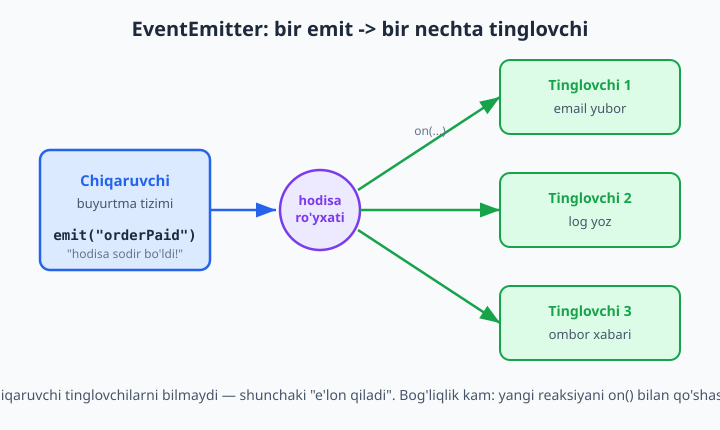
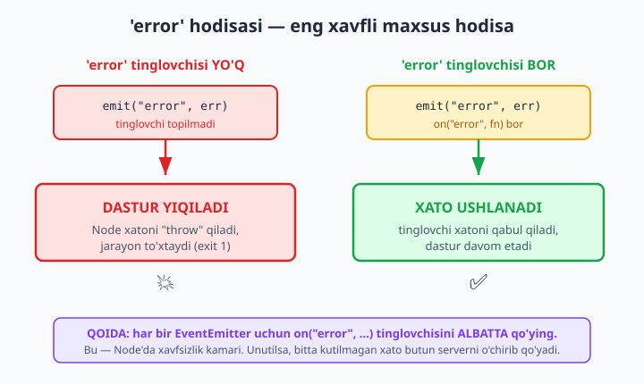

# 07 — EventEmitter va hodisa-asoslangan dasturlash

[⬅️ Oldingi: 06 — Asinxronlik: callback, Promise, async/await](./06-asinxron.md) · [🏠 README](./README.md) · [Keyingi: 08 — Fayl tizimi (fs) va path ➡️](./08-fayl-tizimi.md)

> **Bu bobda:** Node.js'ning eng muhim ichki patterni — **hodisa-asoslangan (event-driven) dasturlash**ni o'rganamiz. Bir narsa "sodir bo'lganda" bir nechta mustaqil reaksiyani qanday ishga tushirishni; `node:events` modulidagi `EventEmitter` sinfini (`on`, `emit`, `once`, `off`); o'z sinfingni undan meros qilishni; argument uzatishni; nega `error` hodisasi maxsus va e'tiborsiz qoldirilsa butun dasturni yiqitishini; `maxListeners` ogohlantirishi qachon "xotira oqishi" (memory leak) belgisi ekanini; tinglovchilarni `once`/`off` bilan toza tutishni; EventEmitter'ni qachon ishlatish va qachon Promise yetarli ekanini; va Node'ning o'zi (HTTP server, stream'lar) qanday qilib EventEmitter ustiga qurilganini ko'rib chiqamiz. Real misol — kichik **buyurtma tizimi**.

---

## Muammo: bitta voqea, ko'p reaksiya

Tasavvur qiling, internet-do'kon yozyapsiz. Mijoz buyurtma berdi. Shu **bitta voqea** sodir bo'lganda ko'p narsa qilinishi kerak:

1. Mijozga tasdiq xati (email) yuboriladi.
2. Tizim jurnaliga (log) yozib qo'yiladi.
3. Ombor xabardor qilinadi.
4. Sotuv statistikasi yangilanadi.

Eng sodda yo'l — buyurtma yaratadigan funksiya ichida shu to'rtta ishni ham birma-bir chaqirish:

```js
function buyurtmaYarat(order) {
  saqla(order);
  emailYubor(order);      // 1
  logYoz(order);          // 2
  omborgaXabar(order);    // 3
  statistikaYangila(order); // 4
}
```

Bu ishlaydi, lekin muammosi bor: `buyurtmaYarat` funksiyasi endi email, log, ombor, statistika — hammasini **bilishga majbur**. Ertaga "buyurtma berilganda SMS ham yubor" desangiz, shu funksiyani ochib o'zgartirasiz. Bu **qattiq bog'liqlik** (tight coupling): bir joydagi o'zgarish boshqa joyni buzishi mumkin, va kod o'sgani sari bu funksiya "hamma narsani biladigan" ulkan tugunga aylanadi.

**Hodisa-asoslangan model** boshqacha o'ylaydi: buyurtma yaratadigan kod faqat shuni e'lon qiladi — *"buyurtma yaratildi!"*. U **kim eshitishini bilmaydi va bilishi shart emas**. Email moduli, log moduli, ombor moduli — har biri alohida "men shu voqeani tinglayman" deb yoziladi. Yangi reaksiya qo'shish = bitta yangi tinglovchi qo'shish, eski kodga **tegmasdan**.

Bu — Node.js'ning yuragi. `setTimeout`, fayl o'qish, tarmoq so'rovi, HTTP server — hammasi "bir narsa tayyor bo'ldi, mana sizga xabar" tamoyiliga quriladi.

---

## Hodisa-asoslangan model nima?

Modelda ikki tomon bor:

- **Chiqaruvchi (emitter / producer)** — voqeani e'lon qiladi: "salom hodisasi sodir bo'ldi". U natija bilan nima qilinishini bilmaydi.
- **Tinglovchi (listener / consumer)** — ma'lum bir hodisaga oldindan "obuna bo'ladi" va u sodir bo'lganda reaksiya qiladi.

Aloqa **nom orqali** boradi: chiqaruvchi `"orderPaid"` degan satr (hodisa nomi) bilan e'lon qiladi, tinglovchi ham aynan shu nomga yozilgan bo'ladi. Ikkalasi bir-birini to'g'ridan-to'g'ri chaqirmaydi — o'rtada vositachi (EventEmitter) turadi.



Bunday yondashuv brauzerdagi `button.addEventListener("click", ...)` ga juda o'xshaydi — u yerda ham siz tugmani bosishni "tinglaysiz". Node'da brauzer DOM'i yo'q, lekin xuddi shu g'oya `EventEmitter` sinfida umumlashtirilgan: **istalgan voqeani** o'zingiz nomlaysiz va tinglaysiz.

---

## `node:events` va birinchi EventEmitter

EventEmitter Node'ning o'rnatilgan `node:events` modulida. Qo'shimcha paket o'rnatish shart emas.

```js
// basic.mjs — zamonaviy ESM uslubi (package.json'da "type": "module")
import { EventEmitter } from "node:events";

const bus = new EventEmitter();

// "salom" hodisasini tinglaymiz
bus.on("salom", (ism) => {
  console.log(`Salom, ${ism}!`);
});

// hodisani chiqaramiz (argument bilan)
bus.emit("salom", "Oqil");
bus.emit("salom", "Laylo");
```

Ishga tushiramiz:

```bash
node basic.mjs
```

Natija:

```
Salom, Oqil!
Salom, Laylo!
```

Bu yerda nima bo'ldi:

- `bus.on("salom", fn)` — `"salom"` nomli hodisaga **tinglovchi** ulaydi. `fn` — shu hodisa sodir bo'lganda chaqiriladigan funksiya (callback).
- `bus.emit("salom", "Oqil")` — `"salom"` hodisasini **chiqaradi** va `"Oqil"` argumentini tinglovchilarga uzatadi.

`emit` **darhol, sinxron** ishlaydi: u shu hodisaning barcha tinglovchilarini qo'shilgan tartibda, birma-bir, navbat bilan chaqiradi va hammasi tugagandan keyingina davom etadi. (Bu Promise'dan farqi — Promise callback'lari keyingi "tick"da ishlaydi.)

> **CommonJS eslatma.** Eski `require` uslubida ham xuddi shunday: `const { EventEmitter } = require("node:events");`. Faqat import qatori farq qiladi, qolgan API bir xil. Biz bundan keyin asosan ESM ishlatamiz.

### Asosiy metodlar bir qarashda

| Metod | Vazifasi |
|-------|----------|
| `on(nom, fn)` | Hodisaga tinglovchi qo'shadi (har emit'da ishlaydi). `addListener` — sinonimi. |
| `once(nom, fn)` | Tinglovchi **faqat bir marta** ishlaydi, keyin o'zini olib tashlaydi. |
| `emit(nom, ...args)` | Hodisani chiqaradi, argumentlarni uzatadi. Tinglovchi bo'lsa `true` qaytaradi. |
| `off(nom, fn)` | Aniq bir tinglovchini olib tashlaydi. `removeListener` — sinonimi. |
| `removeAllListeners(nom)` | Berilgan hodisaning (yoki argumentsiz — barchasining) tinglovchilarini o'chiradi. |
| `listenerCount(nom)` | Hodisada nechta tinglovchi borligini qaytaradi. |
| `eventNames()` | Hozir tinglovchisi bor hodisalar nomlari ro'yxati. |

---

## REAL KEYS: buyurtma tizimi

Endi muammoga qaytamiz va kichik, lekin hayotiy **buyurtma tizimi**ni hodisa-asoslangan qilib yozamiz. Ikki hodisa bo'ladi: `orderCreated` (buyurtma yaratildi) va `orderPaid` (to'lov o'tdi). Har biriga bir nechta mustaqil tinglovchi ulaymiz: email, log, ombor.

E'tibor bering — biz `EventEmitter`'dan **meros** olib, o'z `OrderBus` sinfimizni yaratamiz. Bu Node'da odatiy uslub: domeningizga xos emitter o'z nomi va metodlariga ega bo'ladi.

```js
// order.mjs
import { EventEmitter } from "node:events";

// O'z sinfimizni EventEmitter'dan meros qilamiz
class OrderBus extends EventEmitter {}

const orders = new OrderBus();

// --- Tinglovchilar: har biri bir vazifa uchun, bir-biridan mustaqil ---

// Tinglovchi 1: tasdiq xati
orders.on("orderCreated", (order) => {
  console.log(`[email]   #${order.id} uchun tasdiq xati ketdi -> ${order.email}`);
});

// Tinglovchi 2: jurnalga yozish
orders.on("orderCreated", (order) => {
  console.log(`[log]     #${order.id} yaratildi, summa: ${order.total} so'm`);
});

// To'lovdan keyingi reaksiyalar
orders.on("orderPaid", (order) => {
  console.log(`[ombor]   #${order.id} yig'ishga berildi`);
});

orders.on("orderPaid", (order) => {
  console.log(`[email]   #${order.id} uchun "to'lov qabul qilindi" xati ketdi`);
});

// --- Voqealar sodir bo'ladi (masalan, mijoz amallari natijasida) ---
orders.emit("orderCreated", { id: 1001, email: "olim@mail.uz", total: 250000 });
orders.emit("orderPaid", { id: 1001 });
```

```bash
node order.mjs
```

Natija:

```
[email]   #1001 uchun tasdiq xati ketdi -> olim@mail.uz
[log]     #1001 yaratildi, summa: 250000 so'm
[ombor]   #1001 yig'ishga berildi
[email]   #1001 uchun "to'lov qabul qilindi" xati ketdi
```

Diqqat qiling: **`orders.emit(...)` ni yozgan kod email, log yoki ombor haqida hech narsa bilmaydi.** U faqat "buyurtma yaratildi" deb e'lon qildi. Ertaga marketing bo'limi "buyurtma yaratilganda Telegram'ga ham xabar yubor" desa, siz hech narsani o'zgartirmasdan **yangi bitta tinglovchi** qo'shasiz:

```js
orders.on("orderCreated", (order) => {
  console.log(`[telegram] yangi buyurtma #${order.id}`);
});
```

Mana shu — **kengaytirilishi oson, kam bog'liq** arxitektura. Real loyihalarda `console.log` o'rniga haqiqiy email yuborish, ma'lumotlar bazasiga yozish kabi ishlar turadi (ularni keyingi boblarda ko'ramiz), lekin **pattern aynan shu**.

### Argument uzatish

`emit`'ga hodisa nomidan keyin **istalgancha** argument bera olasiz — ularning hammasi tinglovchiga xuddi shu tartibda yetib boradi:

```js
const e = new EventEmitter();
e.on("login", (foydalanuvchi, vaqt, ip) => {
  console.log(`${foydalanuvchi} kirdi (${vaqt}), IP: ${ip}`);
});
e.emit("login", "oqil", "10:42", "192.168.0.5");
// -> oqil kirdi (10:42), IP: 192.168.0.5
```

Amaliyotda ko'pincha **bitta obyekt** uzatish qulayroq (yuqoridagi `order` kabi): shunda tinglovchilar faqat kerakli maydonini oladi va argument tartibiga bog'lanib qolmaydi.

---

## `error` hodisasi — maxsus va xavfli

EventEmitter'da bitta hodisa nomi alohida maqomga ega: **`"error"`**. Node'da xato yuz berganini bildirish uchun `emit("error", err)` ishlatiladi (masalan, stream'lar va tarmoq ulanishlari shunday qiladi).

Gap shundaki: agar siz `"error"` hodisasini **tinglovchisi yo'q** holatda chiqarsangiz, EventEmitter xatoni shunchaki e'tiborsiz qoldirmaydi — u uni **`throw` qiladi**, va agar hech kim ushlamasa, **butun dastur yiqiladi** (jarayon `exit 1` bilan to'xtaydi).



Buni ko'ramiz:

```js
// ❌ err1.mjs — XATO: "error" tinglovchisi yo'q
import { EventEmitter } from "node:events";

const e = new EventEmitter();
e.emit("error", new Error("ulanish uzildi"));

console.log("BU QATOR HECH QACHON CHIQMAYDI");
```

```bash
node err1.mjs
```

Natija (dastur yiqildi):

```
file:///.../err1.mjs:4
e.emit("error", new Error("ulanish uzildi"));
                ^
Error: ulanish uzildi
    at ...
Emitted 'error' event at:
    at ...
```

Oxirgi `console.log` umuman ishlamadi — Node `"error"` ni ko'rib darhol to'xtadi.

Yechim oddiy: **`"error"` uchun har doim tinglovchi qo'ying.** Shunda xato xavfsiz ushlanadi va dastur davom etadi:

```js
// err2.mjs — TO'G'RI
import { EventEmitter } from "node:events";

const e = new EventEmitter();

e.on("error", (err) => {
  console.log("error ushlandi:", err.message);
});

e.emit("error", new Error("ulanish uzildi"));
console.log("Dastur davom etyapti");
```

```bash
node err2.mjs
```

```
error ushlandi: ulanish uzildi
Dastur davom etyapti
```

> **Eslab qoling:** har bir jiddiy EventEmitter (ayniqsa tarmoq yoki fayl bilan ishlaydiganlar) uchun `on("error", ...)` — bu **xavfsizlik kamari**. Uni unutish — Node serverlari "tushib qolishi"ning eng keng tarqalgan sabablaridan biri. Bitta kutilmagan xato butun jarayonni o'chirib qo'yadi.

---

## `once` — bir martalik tinglovchi

Ba'zan hodisa ko'p marta sodir bo'lishi mumkin, lekin sizga uning **faqat birinchisi** kerak. Masalan, ulanish bir marta tayyor bo'lishini kutyapsiz. Buning uchun `once` bor — u ishlagach o'zini avtomatik olib tashlaydi:

```js
// once.mjs
import { EventEmitter } from "node:events";

const e = new EventEmitter();

let soni = 0;
e.once("ulandi", () => {
  soni++;
  console.log("once ishladi, soni =", soni);
});

e.emit("ulandi"); // ishlaydi
e.emit("ulandi"); // e'tiborsiz: tinglovchi allaqachon olib tashlangan

console.log("once'dan keyin listener soni:", e.listenerCount("ulandi"));
```

```
once ishladi, soni = 1
once'dan keyin listener soni: 0
```

`once` ikkinchi `emit`'da umuman ishlamadi, va `listenerCount` 0 ni qaytardi — ya'ni tinglovchi haqiqatan o'zini tozalab ketdi. Bu xotira boshqaruvi uchun muhim (pastda ko'ramiz).

---

## `off` / `removeListener` — tinglovchini olib tashlash va tozalash

`on` bilan qo'shilgan tinglovchi, siz uni **ataylab olib tashlamaguningizcha**, abadiy qolaveradi va har `emit`'da ishlaydi. Olib tashlash uchun `off` (yoki uning eski nomi `removeListener`) ishlatiladi. Muhim shart: olib tashlash uchun **aynan o'sha funksiya havolasini** berishingiz kerak — shuning uchun nomli funksiya ishlatamiz:

```js
// off.mjs
import { EventEmitter } from "node:events";

const e = new EventEmitter();

function handler() {
  console.log("handler chaqirildi");
}

e.on("tik", handler);
e.emit("tik");          // -> handler chaqirildi

e.off("tik", handler);  // olib tashlaymiz (= removeListener)
e.emit("tik");          // endi hech narsa chiqmaydi

console.log("tik listener soni:", e.listenerCount("tik")); // 0
```

```
handler chaqirildi
tik listener soni: 0
```

> **Nega anonim funksiya ishlamaydi?** Agar `e.on("tik", () => {...})` deb yozsangiz, keyin uni `off` qila olmaysiz — chunki ikkinchi marta `() => {...}` yozganingizda bu **yangi**, boshqa funksiya bo'ladi. Olib tashlamoqchi bo'lgan tinglovchini nomli funksiya yoki o'zgaruvchida saqlang.

Bir hodisaning **barcha** tinglovchilarini bir yo'la tozalash uchun `removeAllListeners("tik")` bor (argumentsiz chaqirilsa — hamma hodisani tozalaydi, lekin buni ehtiyotkorlik bilan ishlating).

---

## `maxListeners` ogohlantirishi — xotira oqishi belgisi

EventEmitter'da xavfsizlik mexanizmi bor. Agar **bitta hodisaga 10 tadan ortiq** tinglovchi qo'shsangiz, Node konsolga ogohlantirish chiqaradi:

```js
// maxlisteners.mjs
import { EventEmitter } from "node:events";

const e = new EventEmitter();

for (let i = 0; i < 11; i++) {
  e.on("data", () => {});
}
console.log("11 ta listener qo'shildi");
```

```
11 ta listener qo'shildi
(node:12592) MaxListenersExceededWarning: Possible EventEmitter memory leak
detected. 11 data listeners added to [EventEmitter]. MaxListeners is 10.
Use emitter.setMaxListeners() to increase limit
```

Bu **xato emas, balki ogohlantirish**: "ehtimol sizda xotira oqishi (memory leak) bor". Odatda bu chinakam muammoning belgisi: masalan, siz `on(...)` ni **tsikl ichida yoki har so'rovda** chaqirib, lekin **`off` qilishni unutib**, tinglovchilarni cheksiz to'plab ketyapsiz. Ular hech qachon o'chmaganligi uchun xotira asta-sekin to'lib boradi.

Ikkita yo'l bor:

1. **Haqiqatan ham ko'p tinglovchi kerak** (kamdan-kam holat) — limitni oshiring:

```js
e.setMaxListeners(20);      // shu emitter uchun
// yoki global:
import { setMaxListeners } from "node:events";
setMaxListeners(20);        // barcha emitterlar uchun standart
```

2. **Aslida leak bor** (ko'p hollarda shunday) — kodingizni tekshiring: tinglovchilarni `off` yoki `once` bilan tozalayapsizmi? Limitni shunchaki ko'tarib qo'yish — termometr ko'rsatkichini bo'yab, isitmani "tuzatish"ga o'xshaydi.

### Toza tutish: `once` va `off` qachon kerak

Quyidagi misol leak'ni ko'rsatadi va tuzatadi. Tasavvur qiling, har so'rovda emitter'ga vaqtinchalik tinglovchi qo'shyapsiz:

```js
// leak-vs-toza.mjs
import { EventEmitter } from "node:events";

const e = new EventEmitter();

// ❌ NOTO'G'RI: har "so'rov"da on() qo'shamiz, lekin hech qachon olib tashlamaymiz
function notogriSorov(n) {
  e.on("javob", () => {}); // har safar yangi tinglovchi to'planadi
}

// ✅ TO'G'RI: bir martalik javobni once bilan kutamiz — o'zini tozalaydi
function togriSorov(n) {
  e.once("javob", () => {}); // ishlagach o'chadi
}

for (let i = 0; i < 5; i++) togriSorov(i);
e.emit("javob");
console.log("toza usuldan keyin listener soni:", e.listenerCount("javob")); // 0
```

```
toza usuldan keyin listener soni: 0
```

Qoida: **bir martalik kutish uchun `once`**; uzluksiz tinglovchini esa kerak bo'lmay qolganda **`off` bilan olib tashlang**. Shunda tinglovchilar to'planib qolmaydi.

---

## EventEmitter vs Promise/callback — qaysi birini qachon?

Bu — yangi boshlovchilarni eng ko'p chalg'itadigan savol. Ikkalasi ham asinxron olamning vositalari, lekin **har xil shakldagi voqealar uchun**:

| Holat | To'g'ri vosita | Sabab |
|-------|----------------|-------|
| **Bir martalik natija** ("fayl o'qib bo'lindi", "so'rov javobi keldi") | **Promise / async-await** | Bir marta hal bo'ladi: yo natija, yo xato. `await` qilib, ketma-ket o'qiladigan kod yoziladi. |
| **Ko'p marta takrorlanadigan hodisa** ("har yangi ulanish", "har kelgan ma'lumot bo'lagi", "har bosilgan tugma") | **EventEmitter** | Voqea qayta-qayta sodir bo'ladi. Promise buni qila olmaydi — u faqat **bir marta** hal bo'ladi va qaytib o'zgarmaydi. |

Soddaroq: **Promise — bir martalik javob; EventEmitter — uzluksiz oqim.**

Buyurtma misolimizda `orderCreated` **ko'p marta** sodir bo'ladi (har bir mijoz uchun), shuning uchun emitter mos. Aksincha, "shu konkret faylni o'qib ber" — bir martalik natija, shuning uchun Promise (`await readFile(...)`) mos.

Ko'pincha ikkalasi birga ishlatiladi: emitter oqimni boshqaradi, lekin oqimdagi **bitta** voqeani kutish kerak bo'lganda Promise'ga o'tiladi — buni quyidagi `events.once` qiladi.

---

## `events.once` — emitter'ni Promise'ga ko'prik qilish

Ba'zan emitter'dan **bitta** hodisani `await` qilib kutmoqchisiz. Buning uchun har gal qo'lda `new Promise(...)` yozish o'rniga Node tayyor yordamchi beradi: `node:events` modulidan **`once` funksiyasi** (sinf metodi `once` bilan adashtirmang — bu modulning alohida funksiyasi).

```js
// once-promise.mjs
import { EventEmitter, once } from "node:events";

const e = new EventEmitter();

// 300 ms dan keyin hodisa chiqaramiz
setTimeout(() => e.emit("ready", "tayyor!", 42), 300);

console.log("ready hodisasini kutyapmiz...");
const args = await once(e, "ready"); // Promise sifatida kutamiz (top-level await)
console.log("once() Promise qaytardi:", args); // [ 'tayyor!', 42 ]
```

```bash
node once-promise.mjs
```

```
ready hodisasini kutyapmiz...
once() Promise qaytardi: [ 'tayyor!', 42 ]
```

`events.once(emitter, "ready")` — hodisa sodir bo'lganda **resolve** bo'ladigan Promise qaytaradi; resolve qiymati esa `emit`'ga berilgan **barcha argumentlar massivi** (shuning uchun `[ 'tayyor!', 42 ]`). Agar emitter `"error"` chiqarsa, bu Promise **reject** bo'ladi — ya'ni siz `try/catch` bilan ushlay olasiz. Bu emitter va async-await olamlarini chiroyli bog'laydi.

> **`emit` qaytaradigan qiymat.** `emit` `true` qaytaradi, agar shu hodisada hech bo'lmasa bitta tinglovchi bo'lsa; aks holda `false`. Bu "men chiqargan hodisani eshitgan kim bordir" deb tekshirishga yordam beradi.

---

## Node ichida emitter qayerda? (HTTP server va stream'larga ko'prik)

EventEmitter — Node'da chetda turgan o'yinchoq emas; u Node'ning ko'p qismining **poydevori**. Mana asosiy misollar:

- **HTTP server** (`http.Server`) — EventEmitter'dan meros oladi. Har kelgan so'rov `"request"` hodisasini chiqaradi.
- **Stream'lar** (`fs` o'qish/yozish, tarmoq) — EventEmitter ustiga qurilgan: `"data"`, `"end"`, `"error"`, `"close"` hodisalari (11-bobda chuqur ko'ramiz).
- **`process`** — global obyekt ham emitter: `process.on("exit", ...)`, `process.on("uncaughtException", ...)`.

Quyida HTTP server **aslida emitter ekanini** ko'rsatadigan tirik misol. `server.on("request", ...)` — bu xuddi siz yuqorida yozgan `on(...)` ! Serverni ishga tushirib, o'sha jarayonning o'zidan global `fetch` bilan so'rov yuboramiz va javobni tekshiramiz:

```js
// http-emitter.mjs
import http from "node:http";

// http.createServer() bizga EventEmitter qaytaradi
const server = http.createServer();

// "request" hodisasini tinglaymiz — bu oddiy on() !
server.on("request", (req, res) => {
  res.writeHead(200, { "Content-Type": "application/json" });
  res.end(JSON.stringify({ yol: req.url, usul: req.method }));
});

// "listening" va "close" ham — hodisalar
server.on("listening", () => console.log("server tinglayapti (listening hodisasi)"));

server.listen(3000, async () => {
  const javob = await fetch("http://localhost:3000/salom"); // Node 24 global fetch
  console.log("status:", javob.status);
  console.log("body: ", await javob.text());
  server.close(() => console.log("server yopildi (close hodisasi)"));
});
```

```bash
node http-emitter.mjs
```

```
server tinglayapti (listening hodisasi)
status: 200
body:  {"yol":"/salom","usul":"GET"}
server yopildi (close hodisasi)
```

Ko'ryapsizmi — `server.on("request", ...)`, `server.on("listening", ...)`, `server.close(callback)` — hammasi shu bobda o'rgangan EventEmitter API'si. HTTP serverni (8/11-boblar) yoki stream'larni o'rganganda, bu bob poydevor bo'lib xizmat qiladi: ular shunchaki o'z hodisalari bo'lgan emitterlardir.

---

## Foydali qo'shimcha metodlar

Kundalik ishda ba'zan kerak bo'ladigan metodlar:

```js
// extra.mjs
import { EventEmitter } from "node:events";
const e = new EventEmitter();

// prependListener: tinglovchini ro'yxat BOSHIGA qo'yadi (birinchi ishlaydi)
e.on("yoz", () => console.log("ikkinchi (oddiy on)"));
e.prependListener("yoz", () => console.log("birinchi (prepend)"));
e.emit("yoz");

// eventNames + listenerCount: introspeksiya
e.on("login", () => {});
console.log("hodisalar:", e.eventNames());          // [ 'yoz', 'login' ]
console.log("yoz soni:", e.listenerCount("yoz"));    // 2

// newListener meta-hodisa: har on() chaqirilganda ishlaydi (ilg'or)
const m = new EventEmitter();
m.on("newListener", (nom) => console.log(`[meta] yangi listener: "${nom}"`));
m.on("salom", () => {}); // -> [meta] yangi listener: "salom"
```

```
birinchi (prepend)
ikkinchi (oddiy on)
hodisalar: [ 'yoz', 'login' ]
yoz soni: 2
[meta] yangi listener: "salom"
```

`prependListener` tartibni boshqaradi (masalan, "logni har doim birinchi yoz"). `newListener`/`removeListener` — emitterga tinglovchi qo'shilishi/olinishini kuzatadigan maxsus meta-hodisalar; ularni kamdan-kam, asosan kutubxona yozganda ishlatasiz.

---

## Mashqlar

### Oson

1. `EventEmitter` yarating, `"xabar"` hodisasini bir argument (matn) bilan tinglang, so'ng uni ikki marta `emit` qiling. Har gal `Xabar keldi: <matn>` chiqarilsin.
2. `once` ishlatib, `"start"` hodisasi **faqat birinchi** `emit`'da ishlashini ko'rsating. Ikkinchi `emit`'dan keyin `listenerCount("start")` ning 0 ekanini chiqaring.
3. `"error"` hodisasiga tinglovchi **qo'shmasdan** uni `emit` qilsangiz nima bo'ladi? Avval taxmin qiling, keyin sinab ko'ring va nima uchun shunday bo'lganini bir jumlada yozing.

### O'rta

4. `EventEmitter`'dan meros oluvchi `Termometr` sinfi yozing. Uning `oicha(harorat)` metodi `harorat > 30` bo'lsa `"issiq"` hodisasini, `harorat < 0` bo'lsa `"sovuq"` hodisasini chiqarsin. Ikkala hodisaga tinglovchi ulang va `oicha(35)`, `oicha(-5)`, `oicha(20)` ni sinang.
5. Emitterni Promise'ga o'raydigan `natijaniKut(emitter, muvaffaqiyatNomi, xatoNomi)` funksiyasini yozing: u `muvaffaqiyatNomi` hodisasida **resolve**, `xatoNomi` hodisasida **reject** bo'lsin va ikkala holatda ham qarama-qarshi tinglovchini `off` bilan **tozalasin** (leak qoldirmasin).
6. `setMaxListeners` ni ishlatib, bitta hodisaga 12 ta tinglovchi qo'shganda **ogohlantirish chiqmasligi**ga erishing. Keyin tushuntiring: bu yechim qachon to'g'ri, qachon leak'ni yashirib qo'yadi?

### Qiyin

7. Kichik **yuklab oluvchi** (downloader) yozing: `EventEmitter`'dan meros oluvchi `Downloader` sinfining `start(fayl, qadamlar)` metodi `setInterval` bilan har 50 ms da `"progress"` hodisasini (`{ fayl, foiz }` bilan) chiqarsin, oxirida esa `"done"` (`{ fayl, hajm }` bilan) chiqarsin. `"progress"` ni tinglab foizni chop eting, `"done"` ni esa `events.once` bilan `await` qilib kuting va yakuniy natijani chiqaring.

<details markdown="1"><summary>Yechim — 1</summary>

```js
import { EventEmitter } from "node:events";
const e = new EventEmitter();
e.on("xabar", (matn) => console.log(`Xabar keldi: ${matn}`));
e.emit("xabar", "salom");
e.emit("xabar", "yana salom");
```

```
Xabar keldi: salom
Xabar keldi: yana salom
```
</details>

<details markdown="1"><summary>Yechim — 2</summary>

```js
import { EventEmitter } from "node:events";
const e = new EventEmitter();
e.once("start", () => console.log("start ishladi"));
e.emit("start"); // -> start ishladi
e.emit("start"); // e'tiborsiz
console.log("listener soni:", e.listenerCount("start")); // 0
```

`once` ishlagandan keyin o'zini avtomatik olib tashlagani uchun ikkinchi `emit` hech narsa qilmaydi va sanoq 0 bo'ladi.
</details>

<details markdown="1"><summary>Yechim — 3</summary>

```js
// ❌ tinglovchisiz "error" emit
import { EventEmitter } from "node:events";
const e = new EventEmitter();
e.emit("error", new Error("xato!"));
console.log("bu chiqmaydi");
```

Dastur **yiqiladi** (`exit 1`), oxirgi `console.log` ishlamaydi. Sababi: `"error"` — maxsus hodisa; tinglovchisi bo'lmasa, EventEmitter xatoni `throw` qiladi va uni hech kim ushlamaganligi uchun jarayon to'xtaydi.
</details>

<details markdown="1"><summary>Yechim — 4</summary>

```js
import { EventEmitter } from "node:events";

class Termometr extends EventEmitter {
  oicha(harorat) {
    console.log(`o'lchandi: ${harorat}°`);
    if (harorat > 30) this.emit("issiq", harorat);
    else if (harorat < 0) this.emit("sovuq", harorat);
  }
}

const t = new Termometr();
t.on("issiq", (h) => console.log(`  ogohlantirish: issiq! (${h}°)`));
t.on("sovuq", (h) => console.log(`  ogohlantirish: sovuq! (${h}°)`));

t.oicha(35); // issiq
t.oicha(-5); // sovuq
t.oicha(20); // hech qanday hodisa yo'q
```

```
o'lchandi: 35°
  ogohlantirish: issiq! (35°)
o'lchandi: -5°
  ogohlantirish: sovuq! (-5°)
o'lchandi: 20°
```
</details>

<details markdown="1"><summary>Yechim — 5</summary>

```js
import { EventEmitter } from "node:events";

function natijaniKut(emitter, muvaffaqiyatNomi, xatoNomi) {
  return new Promise((resolve, reject) => {
    function onOk(d) { cleanup(); resolve(d); }
    function onErr(e) { cleanup(); reject(e); }
    function cleanup() {
      emitter.off(muvaffaqiyatNomi, onOk);
      emitter.off(xatoNomi, onErr);
    }
    emitter.once(muvaffaqiyatNomi, onOk);
    emitter.once(xatoNomi, onErr);
  });
}

// Sinov
const job = new EventEmitter();
setTimeout(() => job.emit("done", { id: 7, ok: true }), 100);

try {
  const r = await natijaniKut(job, "done", "fail");
  console.log("Natija:", r);
} catch (e) {
  console.log("Xato:", e.message);
}
console.log("done qoldimi?", job.listenerCount("done")); // 0
```

```
Natija: { id: 7, ok: true }
done qoldimi? 0
```

Muhim nuqta: `done` kelganda biz `fail` tinglovchisini ham `off` qildik. Aks holda u abadiy osilib qolardi — bu xotira oqishi (leak). `cleanup` ikkala holatda ham ishlagani uchun tinglovchilar toza qoladi. (Aslida buni Node tayyor beradi: `events.once(job, "done")` — lekin bu yerda mexanizmni qo'lda yozib tushundik.)
</details>

<details markdown="1"><summary>Yechim — 6</summary>

```js
import { EventEmitter } from "node:events";
const e = new EventEmitter();
e.setMaxListeners(15); // limitni 15 ga ko'tardik
for (let i = 0; i < 12; i++) e.on("data", () => {});
console.log("ogohlantirish chiqmadi, soni:", e.listenerCount("data")); // 12
```

```
ogohlantirish chiqmadi, soni: 12
```

**Qachon to'g'ri:** agar haqiqatan ham shu emitterga ko'p (lekin **aniq, cheklangan**) sondagi tinglovchi kerak bo'lsa — masalan, 20 ta modul bitta tizim hodisasiga obuna bo'ladi. **Qachon leak'ni yashiradi:** agar tinglovchilar **tsikl ichida yoki har so'rovda cheksiz** qo'shilib, hech qachon `off` qilinmayotgan bo'lsa. Bunda limitni ko'tarish — muammoni vaqtincha berkitadi, lekin xotira baribir to'lib boraveradi. To'g'ri yechim — `once`/`off` bilan tozalash.
</details>

<details markdown="1"><summary>Yechim — 7</summary>

```js
import { EventEmitter, once } from "node:events";

class Downloader extends EventEmitter {
  start(fayl, qadamlar = 4) {
    let bajarildi = 0;
    const timer = setInterval(() => {
      bajarildi++;
      const foiz = Math.round((bajarildi / qadamlar) * 100);
      this.emit("progress", { fayl, foiz });
      if (bajarildi >= qadamlar) {
        clearInterval(timer);
        this.emit("done", { fayl, hajm: qadamlar * 256 });
      }
    }, 50);
    return this; // zanjirlash uchun
  }
}

const d = new Downloader();
d.on("progress", ({ fayl, foiz }) => console.log(`  ${fayl}: ${foiz}%`));

d.start("rasm.png");
const [natija] = await once(d, "done"); // bitta hodisani Promise sifatida kutamiz
console.log("Yuklash tugadi:", natija);
```

```
  rasm.png: 25%
  rasm.png: 50%
  rasm.png: 75%
  rasm.png: 100%
Yuklash tugadi: { fayl: 'rasm.png', hajm: 1024 }
```

Bu yerda **ikkala dunyo birlashdi**: `"progress"` — ko'p marta takrorlanadigan hodisa (EventEmitter uchun ideal), `"done"` esa bir martalik yakun (Promise/`await` uchun ideal). `events.once(d, "done")` aynan shu ko'prikni quradi: emitter oqimidagi bitta hodisani `await` qilib kutamiz. `await` natijasi — `emit("done", obj)`'dagi argumentlar massivi, shuning uchun `const [natija]` bilan birinchi (yagona) argumentni olamiz.
</details>

---

[⬅️ Oldingi: 06 — Asinxronlik: callback, Promise, async/await](./06-asinxron.md) · [🏠 README](./README.md) · [Keyingi: 08 — Fayl tizimi (fs) va path ➡️](./08-fayl-tizimi.md)
