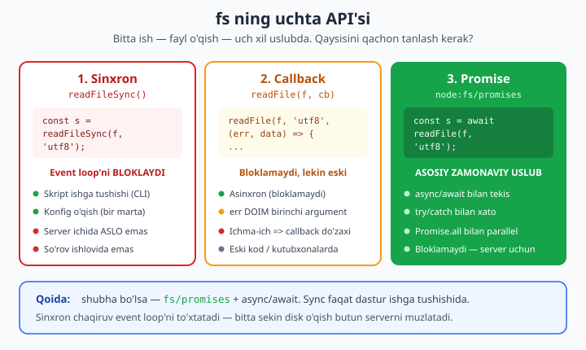
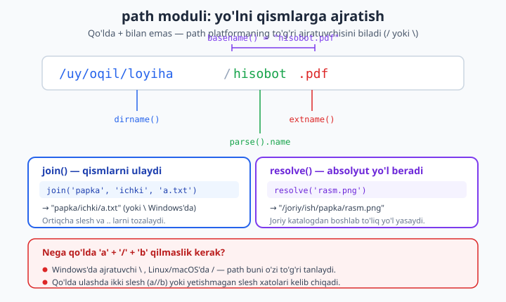

# 08 — Fayl tizimi (fs) va path

[⬅️ Oldingi: 07 — EventEmitter va hodisa-asoslangan dasturlash](./07-eventemitter.md) · [🏠 README](./README.md) · [Keyingi: 09 — Streams va Buffers ➡️](./09-streams-buffers.md)

> **Bu bobda:** brauzerdagi JavaScript diskka tega olmaydi — bu xavfsizlik chegarasi. Node.js esa server muhitida ishlagani uchun **fayllarni o'qiy, yoza, o'chira va ko'chira oladi**. Bu bobda `node:fs` modulining **uchta yuzini** ochamiz: sinxron (`readFileSync` — qulay, lekin event loop'ni bloklaydi, qachon mumkin/qachon xavfli), callback (`readFile` — eski, lekin hali ham uchraydi) va **promise** (`node:fs/promises` — `async/await` bilan, **zamonaviy asosiy uslub**). So'ng amaliy operatsiyalar: o'qish/yozish (`readFile`/`writeFile`, `'utf8'` matn vs xom `Buffer`), qo'shish (`appendFile`), papka yaratish (`mkdir` `recursive` bilan), ro'yxat (`readdir`), metama'lumot (`stat`), o'chirish/ko'chirish (`unlink`/`rename`/`rm`/`cp`). Keyin **fayl bor-yo'qligini** to'g'ri tekshirish — `existsSync` tuzog'i va **poyga (race condition)** muammosi. `node:path` moduli (`join`/`resolve`/`basename`/`dirname`/`extname`/`parse`) — nega yo'lni qo'lda `+` bilan birlashtirmaslik kerak va platforma farqi (`/` vs `\`). ESM'da `__dirname` o'rnini bosadigan `import.meta.dirname`. **REAL KEYS:** vazifalar ro'yxatini JSON faylga saqlaydigan kichik CLI. Hamma kod Node 24 da haqiqiy temp fayllarda ishga tushirib tasdiqlangan.

---

## Nega fayl tizimi Node'da alohida e'tibor talab qiladi?

Brauzerda JavaScript yozganingizda diskka kira olmasdingiz — `localStorage` va `IndexedDB` bor, lekin foydalanuvchining `C:\` diskidagi faylni o'qib bo'lmaydi. Bu ataylab qilingan: agar har bir veb-sahifa kompyuteringizdagi fayllarni o'qiy olsa, bu dahshatli xavfsizlik teshigi bo'lardi.

Node.js boshqa muhit. U **server** (yoki sizning kompyuteringiz) ustida, to'liq huquqlar bilan ishlaydi. Shuning uchun u operatsion tizimning fayl tizimi bilan to'g'ridan-to'g'ri gaplashadi: log yozadi, konfiguratsiyani o'qiydi, yuklangan rasmni saqlaydi, ma'lumotlar bazasiz JSON faylda holatni saqlaydi. Bularning hammasi `node:fs` ("file system") moduli orqali bo'ladi.

Lekin fayl bilan ishlash bitta nozik tomon olib keladi: **disk sekin**. Operativ xotira (RAM) ga murojaat nanosekundlar, diskka murojaat esa millisekundlar oladi — minglab marta sekinroq. Node bitta asosiy ipda (single-threaded event loop, [5-bobda](./05-event-loop.md) ko'rgan) ishlagani uchun, diskni **kutib turish** butun dasturni muzlatib qo'yishi mumkin. Aynan shu sababli `fs` ning uchta API'si bor — va ulardan qaysi birini tanlash katta ahamiyatga ega.

> **Modul nomi haqida.** Node 24'da o'rnatilgan modullarni `node:` prefiksi bilan import qilish tavsiya etiladi: `import { readFile } from 'node:fs/promises'`. `'fs/promises'` (prefikssiz) ham ishlaydi, lekin `node:` aniqroq — bu nom npm'dan o'rnatilgan paket emas, balki Node'ning o'zinikidir, deb bir qarashda ko'rsatadi. Bu bobda doim `node:` ishlatamiz.

---

## fs ning uchta API'si: sync, callback, promise

Bitta vazifani — "faylni o'qish" — Node uch xil yo'l bilan bajaradi. Ular bir xil ish qiladi, lekin **vaqt bilan munosabati** har xil.



### 1. Sinxron: `readFileSync` — sodda, lekin bloklaydi

Sinxron versiya eng tushunarli: faylni o'qiydi va **natijani darhol qaytaradi**. Kod yuqoridan pastga, tartib bilan oqadi.

```js
// sync.mjs
import { readFileSync } from 'node:fs';

const matn = readFileSync('salom.txt', 'utf8');
console.log(matn);          // fayl o'qilib bo'lguncha shu yerda KUTAMIZ
console.log('Keyingi qator');
```

Muammo: `readFileSync` faylni o'qish davomida **butun Node jarayonini to'xtatadi**. Disk javob berguncha boshqa hech narsa — boshqa so'rovlar, taymerlar, hodisalar — ishlamaydi. Bitta foydalanuvchili CLI skriptida bu muammo emas. Lekin **HTTP serverda** har bir `readFileSync` chaqiruvi shu paytda kelgan boshqa barcha so'rovlarni muzlatadi. 100 ta foydalanuvchi bir vaqtda kirsa, server qotib qoladi.

**Qachon `Sync` mumkin:**
- Dastur ishga tushishida konfiguratsiyani bir marta o'qish (server hali so'rov qabul qilmayapti).
- Kichik CLI skriptlari (`node skript.mjs` — bitta odam ishlatadi).
- Build vositalari, migratsiya skriptlari.

**Qachon xavfli:**
- HTTP server ichida, so'rov ishlovida — **hech qachon**.
- Hodisa ishlovchilari (callback'lar) ichida.

### 2. Callback: `readFile` — eski asinxron uslub

Node 2009-yilda paydo bo'lganda `Promise` hali standart emasdi. Shuning uchun asinxron operatsiyalar **callback** orqali ishlatilgan: "men bilan ishni boshla, tugaganda mana shu funksiyani chaqir".

```js
// callback.mjs
import { readFile } from 'node:fs';

readFile('salom.txt', 'utf8', (xato, matn) => {
  if (xato) {
    console.error('O\'qishda xato:', xato.message);
    return;
  }
  console.log(matn);
});
console.log('Bu qator AVVAL chiqadi'); // readFile kutmaydi
```

Bu yerda ikkita muhim narsa:

1. **`xato` doim birinchi argument.** Node'ning callback konvensiyasi shu: `(err, natija) => {}`. Avval xatoni tekshirasiz, keyin natijani ishlatasiz. Bu naqsh "error-first callback" deb ataladi.
2. **`console.log('Bu qator AVVAL chiqadi')` birinchi chiqadi**, chunki `readFile` faylni *fonda* o'qiydi va asosiy kod kutmasdan davom etadi.

Callback'ning katta kamchiligi: bir nechta fayl operatsiyasini ketma-ket bajarganda ular **ichma-ich joylashadi** va "callback do'zaxi" (callback hell) hosil bo'ladi:

```js
// ❌ Callback do'zaxi — o'qish qiyin, xato boshqaruvi takrorlanadi
readFile('a.txt', 'utf8', (e1, a) => {
  if (e1) return console.error(e1);
  readFile('b.txt', 'utf8', (e2, b) => {
    if (e2) return console.error(e2);
    writeFile('c.txt', a + b, (e3) => {
      if (e3) return console.error(e3);
      console.log('Tayyor'); // uch qavat ichkarida...
    });
  });
});
```

Callback API hali ham mavjud va ba'zi eski kutubxonalar uni ishlatadi, lekin yangi kod yozayotganda buni tanlamaymiz.

### 3. Promise: `node:fs/promises` — zamonaviy asosiy uslub

Eng yaxshi yo'l — `node:fs/promises`. Bu modul har bir funksiyaning `Promise` qaytaradigan versiyasini beradi, ya'ni `async/await` bilan **tekis, o'qiladigan** kod yozasiz:

```js
// promise.mjs
import { readFile } from 'node:fs/promises';

try {
  const matn = await readFile('salom.txt', 'utf8'); // top-level await (ESM)
  console.log(matn);
} catch (xato) {
  console.error('O\'qishda xato:', xato.message);
}
```

Yuqoridagi callback do'zaxi shu uslubda tep-tekis bo'ladi:

```js
// ✅ fs/promises — tekis, bitta try/catch hammasini qamraydi
import { readFile, writeFile } from 'node:fs/promises';

try {
  const a = await readFile('a.txt', 'utf8');
  const b = await readFile('b.txt', 'utf8');
  await writeFile('c.txt', a + b, 'utf8');
  console.log('Tayyor');
} catch (xato) {
  console.error(xato.message);
}
```

Afzalliklari:
- **Bloklamaydi** — server uchun xavfsiz.
- **`async/await` bilan tekis** — ichma-ich joylashish yo'q.
- **`try/catch` bilan xato** — bitta blok bir nechta operatsiyani qamrab oladi.
- **`Promise.all` bilan parallel** — bir nechta faylni bir vaqtda o'qish mumkin (quyida ko'ramiz).

> **Qoida.** Shubha bo'lsa — `node:fs/promises` + `async/await`. Sinxron versiyani faqat dastur ishga tushganida (yoki kichik CLI'da) ishlating. Callback versiyasini faqat eski kutubxona shuni talab qilganda. Bu bobning qolgan qismida **promise** uslubini asosiy qilamiz.

> **CommonJS eslatma.** Agar fayl `.cjs` bo'lsa yoki `package.json`'da `"type": "module"` yo'q bo'lsa, import shunday: `const { readFile } = require('node:fs/promises');`. Lekin top-level `await` faqat ESM'da ishlaydi — CommonJS'da kodingizni `async` funksiya ichiga o'rashingiz kerak. [02-bobda](./02-modullar.md) ikkala modul tizimini ko'rgan edik; bu bobdan boshlab ESM asosiy.

---

## Fayl o'qish va yozish: matn vs Buffer

### writeFile va readFile

`writeFile(yol, malumot, encoding)` faylga yozadi (fayl bo'lmasa yaratadi, **bor bo'lsa to'liq almashtiradi**). `readFile(yol, encoding)` o'qiydi.

```js
import { writeFile, readFile } from 'node:fs/promises';

await writeFile('salom.txt', 'Salom, Node!\n', 'utf8');
const matn = await readFile('salom.txt', 'utf8');
console.log(matn);          // Salom, Node!
```

### encoding 'utf8' vs xom Buffer

Bu yerda nozik nuqta bor. `readFile`'ga **encoding bersangiz** (`'utf8'`), Node baytlarni satrga (string) o'giradi. **Encoding bermasangiz**, xom `Buffer` qaytaradi — bu baytlarning ketma-ketligi:

```js
import { readFile } from 'node:fs/promises';

const satr = await readFile('salom.txt', 'utf8');
console.log(typeof satr);              // string

const buf = await readFile('salom.txt');
console.log(Buffer.isBuffer(buf));     // true
console.log(buf.length, 'bayt');       // baytlar soni
console.log(buf.toString('utf8'));     // satrga o'girish
```

Qachon qaysi biri:
- **Matn fayl** (`.txt`, `.json`, `.html`, `.csv`) — `'utf8'` bering, satr oling.
- **Ikkilik fayl** (`.png`, `.jpg`, `.zip`, `.pdf`) — encoding bermang, `Buffer` bilan ishlang. Rasmni `'utf8'` bilan o'qisangiz, baytlar buziladi.

`Buffer` — Node'ning xom baytlar bilan ishlash turi. U haqida [09-bob (Streams va Buffers)](./09-streams-buffers.md) da batafsil; hozircha "matn bo'lmagan ma'lumot uchun" deb eslab qoling.

### appendFile — fayl oxiriga qo'shish

`writeFile` mavjud kontentni o'chirib tashlaydi. Agar **oxiriga qo'shmoqchi** bo'lsangiz (masalan, log fayliga yangi qator) — `appendFile`:

```js
import { appendFile, readFile } from 'node:fs/promises';

await appendFile('log.txt', `[${new Date().toISOString()}] Boshlandi\n`, 'utf8');
await appendFile('log.txt', `[${new Date().toISOString()}] Tugadi\n`, 'utf8');
console.log(await readFile('log.txt', 'utf8'));
// Ikki qator: writeFile bo'lganda esa faqat oxirgisi qolardi
```

`appendFile` fayl yo'q bo'lsa uni yaratadi, bor bo'lsa kontentni saqlab oxiriga yozadi.

> **Katta faylga eslatma.** `readFile` butun faylni RAMga oladi. 5 MB log fayli — muammo emas. Lekin 2 GB video faylni `readFile` bilan o'qisangiz, 2 GB RAM band bo'ladi va dastur "out of memory" bilan o'lishi mumkin. Bunday holatda faylni **bo'lak-bo'lak** o'qiydigan **stream** kerak — bu [09-bob (Streams va Buffers)](./09-streams-buffers.md) mavzusi. Hozircha qoida: fayl katta bo'lsa (~ o'nlab MB dan oshsa), `readFile` o'rniga stream haqida o'ylang.

---

## Fayl va papka operatsiyalari

Faqat o'qish/yozish emas — fayl tizimida papka yaratish, ro'yxat olish, o'chirish, ko'chirish kerak bo'ladi. Hammasi `node:fs/promises` da.

### mkdir — papka yaratish (recursive)

```js
import { mkdir } from 'node:fs/promises';

// Bitta papka
await mkdir('chiqish');

// Ichma-ich papkalar — recursive bo'lmasa "ota papka yo'q" xatosi bo'ladi
await mkdir('chiqish/2026/iyun', { recursive: true });
```

`{ recursive: true }` ikkita foyda beradi: (1) yo'ldagi barcha oraliq papkalarni yaratadi, (2) papka **allaqachon mavjud bo'lsa xato bermaydi**. Amalda deyarli doim `recursive: true` ishlatamiz.

### readdir — papka ichini ro'yxatlash

```js
import { readdir } from 'node:fs/promises';

const yozuvlar = await readdir('.');
console.log(yozuvlar);   // ['fayl1.txt', 'papka', ...]
```

Fayl va papkalarni ajratmoqchi bo'lsangiz, `{ withFileTypes: true }` bering — har bir element `Dirent` obyekti bo'ladi:

```js
import { readdir } from 'node:fs/promises';

for (const yozuv of await readdir('.', { withFileTypes: true })) {
  const turi = yozuv.isDirectory() ? 'papka' : 'fayl';
  console.log(`${yozuv.name} — ${turi}`);
}
```

### stat — fayl metama'lumotlari

`stat` fayl haqida ma'lumot beradi: hajmi, turi, yaratilgan/o'zgartirilgan vaqt.

```js
import { stat } from 'node:fs/promises';

const st = await stat('salom.txt');
console.log('Fayl?', st.isFile());          // true
console.log('Papka?', st.isDirectory());    // false
console.log('Hajm:', st.size, 'bayt');
console.log('O\'zgartirilgan:', st.mtime);  // Date obyekti
```

### unlink, rename, rm, cp

```js
import { unlink, rename, rm, cp } from 'node:fs/promises';

await rename('eski.txt', 'yangi.txt');       // nomini o'zgartirish / ko'chirish
await cp('yangi.txt', 'nusxa.txt');          // nusxa olish
await unlink('nusxa.txt');                   // bitta faylni o'chirish

// rm — fayl ham, papka ham o'chiradi (recursive bilan)
await rm('chiqish', { recursive: true, force: true });
```

Bu yerda farqlarga e'tibor bering:
- **`unlink`** faqat **bitta faylni** o'chiradi (papkani emas).
- **`rm`** zamonaviy, universal — `{ recursive: true }` bilan papkani butun ichi bilan o'chiradi. `{ force: true }` esa fayl yo'q bo'lsa ham xato bermaydi (`rm -rf` kabi).
- **`rename`** bir xil disk ichida ko'chirish/qayta nomlash uchun — bu **atomik** operatsiya (quyida foydalanamiz).
- **`cp`** nusxalaydi; papkani nusxalashda `{ recursive: true }` kerak.

Mana hammasi birga, ishlab tekshirilgan misol:

```js
// fs-amaliyot.mjs
import { mkdir, writeFile, readdir, stat, rename, cp, rm } from 'node:fs/promises';
import { join } from 'node:path';
import { tmpdir } from 'node:os';

const dir = join(tmpdir(), 'nodejs-demo-' + Date.now());
await mkdir(dir, { recursive: true });

const f = join(dir, 'salom.txt');
await writeFile(f, 'Salom\n', 'utf8');

const st = await stat(f);
console.log('Hajm:', st.size, 'bayt, fayl?', st.isFile());

await rename(f, join(dir, 'salom2.txt'));
await cp(join(dir, 'salom2.txt'), join(dir, 'nusxa.txt'));
console.log('Ro\'yxat:', (await readdir(dir)).sort());

await rm(dir, { recursive: true, force: true });   // tozalash
console.log('Tugadi');
```

`os.tmpdir()` — operatsion tizimning vaqtinchalik papkasi (Windows'da `Temp`, Linux'da `/tmp`). Tajriba qilganda haqiqiy loyiha papkasini iflos qilmaslik uchun shu yerda ishlash qulay.

---

## Fayl bor-yo'qligini tekshirish: existsSync tuzog'i va poyga

Tabiiy savol: "faylni o'qishdan oldin u bormi-yo'qmi tekshiray". Node'da bunga `existsSync` bor, lekin u **ikki sababga ko'ra tuzoq**.

### existsSync nima qiladi

```js
import { existsSync } from 'node:fs';

if (existsSync('cfg.json')) {
  console.log('Fayl bor');
}
```

Birinchi muammo: `existsSync` — **sinxron**, ya'ni event loop'ni bloklaydi (yuqoridagi "Sync xavfli" qoidasi shu yerda ham amal qiladi). Async muqobili — `fs.access`:

```js
import { access, constants } from 'node:fs/promises';

async function bormi(yol) {
  try {
    await access(yol, constants.R_OK);  // o'qish huquqi bormi?
    return true;
  } catch {
    return false;
  }
}
console.log(await bormi('cfg.json'));
```

### Asosiy tuzoq: poyga (race condition)

Lekin chuqurroq muammo bor. "Avval tekshir, keyin o'qi" naqshi **poyga (race condition)** ga olib keladi:

```js
// ❌ TUS — tekshir-keyin-ishlat naqshi (TOCTOU bug)
import { access } from 'node:fs/promises';
import { readFile } from 'node:fs/promises';

if (await bormi('cfg.json')) {
  // ⚠️ Aynan shu yerda — tekshiruv bilan o'qish ORASIDA —
  //    boshqa jarayon faylni o'chirib qo'yishi mumkin!
  const matn = await readFile('cfg.json', 'utf8'); // baribir xato berishi mumkin
}
```

Tekshiruv ("bor") bilan harakat ("o'qish") orasida vaqt o'tadi. Shu oraliqda boshqa jarayon (yoki foydalanuvchi) faylni o'chirsa, `readFile` baribir yiqiladi. Bu klassik **TOCTOU** (Time Of Check, Time Of Use) xatosi.

**To'g'ri yondashuv:** tekshirmang — **shunchaki harakat qiling va xatoni ushlang**. Faylni o'qishga urinib ko'ring; agar yo'q bo'lsa, `readFile` `ENOENT` xatosi beradi, uni `try/catch` bilan boshqarasiz:

```js
// ✅ To'g'ri: tekshirmasdan o'qishga urin, xatoni boshqar
import { readFile } from 'node:fs/promises';

async function konfigOqi() {
  try {
    return JSON.parse(await readFile('cfg.json', 'utf8'));
  } catch (xato) {
    if (xato.code === 'ENOENT') {
      return {};   // fayl yo'q — standart bo'sh konfig
    }
    throw xato;    // boshqa xato (huquq yo'q, buzilgan JSON) — qaytadan otamiz
  }
}
```

`xato.code` — Node fayl xatolarini matn emas, **kod** bilan beradi. Eng ko'p uchraydiganlar:

| Kod | Ma'no |
|-----|-------|
| `ENOENT` | fayl yoki papka yo'q (Error NO ENTry) |
| `EACCES` | huquq yetishmaydi (Access) |
| `EEXIST` | allaqachon mavjud (yangi yaratmoqchi bo'lganda) |
| `EISDIR` | fayl deb murojaat qildingiz, lekin u papka |
| `ENOTDIR` | papka deb murojaat qildingiz, lekin u fayl |

> **Xulosa.** `existsSync` ni "tekshirib keyin o'qiyman" uchun **ishlatmang** — bu sekin va poygaga ochiq. O'rniga to'g'ridan-to'g'ri harakatni urinib ko'ring va `xato.code === 'ENOENT'` ni boshqaring. `existsSync` faqat tezkor, kritik bo'lmagan tekshiruvlar uchun maqbul (masalan, dastur ishga tushishida "bu papka bormi" deb bir marta qarash).

---

## path moduli: yo'l bilan to'g'ri ishlash

Fayl yo'llarini satr (string) sifatida qo'lda birlashtirish — keng tarqalgan xato manbai. `node:path` moduli buni to'g'ri qiladi.



### Nega qo'lda string birlashtirmaslik kerak

```js
// ❌ Qo'lda birlashtirish — xato manbai
const yol = papka + '/' + 'fayl.txt';
```

Bunda ikki muammo bor:
1. **Platforma farqi.** Windows'da yo'l ajratuvchisi `\` (`C:\Users\oqil`), Linux/macOS'da `/` (`/home/oqil`). Qo'lda `/` yozsangiz, kodingiz bir platformada ishlaydi, boshqasida sinishi mumkin.
2. **Ortiqcha/yetishmagan slesh.** `papka` oxirida allaqachon `/` bo'lsa, `papka + '/' + ...` ikki slesh (`a//b`) beradi. Yoki umuman yetishmasligi mumkin.

`path.join` bularning hammasini to'g'ri hal qiladi — joriy platforma uchun mos ajratuvchini ishlatadi va ortiqcha sleshlarni tozalaydi.

### join, resolve

```js
import { join, resolve } from 'node:path';

console.log(join('papka', 'ichki', 'fayl.txt'));
// Linux/macOS: papka/ichki/fayl.txt
// Windows:     papka\ichki\fayl.txt

console.log(join('/a/b/c', '..', 'd.txt'));
// /a/b/d.txt  — '..' ni hisoblab tozaladi

console.log(resolve('rasm.png'));
// joriy ishchi katalogdan boshlab MUTLAQ yo'l:
// masalan /home/oqil/loyiha/rasm.png
```

Farqi:
- **`join`** — bo'laklarni ulaydi, lekin natija **nisbiy** qoladi (agar birinchi bo'lak mutlaq bo'lmasa).
- **`resolve`** — natijani **mutlaq (absolute)** yo'lga aylantiradi, joriy ishchi katalogdan (`process.cwd()`) boshlab hisoblaydi.

### basename, dirname, extname, parse

Bu funksiyalar yo'lni **qismlarga ajratadi**:

```js
import { basename, dirname, extname, parse } from 'node:path';

const yol = '/var/log/app.log';

console.log(basename(yol));          // app.log   — oxirgi qism (fayl nomi)
console.log(basename(yol, '.log'));  // app       — kengaytmasiz nom
console.log(dirname(yol));           // /var/log  — papka qismi
console.log(extname(yol));           // .log      — kengaytma

console.log(parse('/uy/oqil/hisobot.pdf'));
// {
//   root: '/',
//   dir: '/uy/oqil',
//   base: 'hisobot.pdf',
//   ext: '.pdf',
//   name: 'hisobot'
// }
```

`parse` — hamma qismni bitta obyektda beradi, qulay. `extname` bilan kichik nozik nuqta: u **oxirgi nuqtadan** boshlaydi, shuning uchun `arxiv.tar.gz` uchun `.gz` qaytaradi (`.tar.gz` emas).

> **Platforma eslatmasi.** Bu bobning kodlari Windows'da tekshirilgan, shuning uchun `join` chiqishi `papka\ichki\fayl.txt` ko'rinishida (`\` bilan) bo'ladi. Linux/macOS'da xuddi shu kod `/` beradi. Aynan shu — `path` ni qo'lda string birlashtirishdan ustun qiladigan sabab: **siz ajratuvchini yozmaysiz, path uni platformaga qarab tanlaydi**.

---

## ESM'da yo'l: __dirname o'rni

CommonJS'da har bir modulda `__dirname` (joriy fayl papkasi) va `__filename` (joriy fayl yo'li) avtomatik mavjud edi. Ular ko'pincha "loyihadagi boshqa faylni nisbiy yo'l bilan topish" uchun ishlatilardi.

**ESM'da bu o'zgaruvchilar yo'q.** Ularning o'rnini bosadigan ikki usul bor.

### import.meta.dirname (Node 20.11+, eng oddiy)

Node 20.11 dan boshlab ESM'da `import.meta.dirname` va `import.meta.filename` mavjud — bevosita CommonJS `__dirname`/`__filename` o'rnini bosadi:

```js
// joy.mjs
console.log(import.meta.dirname);    // bu .mjs fayl joylashgan papka (mutlaq)
console.log(import.meta.filename);   // bu faylning to'liq yo'li

import { join } from 'node:path';
const malumotYoli = join(import.meta.dirname, 'malumot.txt');
console.log(malumotYoli);   // shu fayl yonidagi malumot.txt
```

Node 24'da ishlayotgan bo'lsangiz — **shuni ishlating**, eng sodda.

### fileURLToPath (eskiroq Node uchun)

Node 20.11 dan eski versiyalarda `import.meta.dirname` yo'q. U yerda `import.meta.url` (fayl `file://` URL'i) dan foydalanib qo'lda hisoblaysiz:

```js
import { fileURLToPath } from 'node:url';
import { dirname } from 'node:path';

const __filename = fileURLToPath(import.meta.url);
const __dirname = dirname(__filename);

console.log(__dirname);   // import.meta.dirname bilan bir xil natija
```

`import.meta.url` `file:///C:/.../joy.mjs` ko'rinishidagi URL beradi; `fileURLToPath` uni oddiy fayl yo'liga aylantiradi (URL'da bo'shliqlar `%20` bo'ladi, shuni ham to'g'ri ochadi). Yangi loyihalarda `import.meta.dirname` ni afzal ko'ring, lekin eski kodda `fileURLToPath` naqshini ko'p uchratasiz.

> **Nima uchun bu muhim?** Skriptingizni boshqa papkadan ishga tushirsangiz (`node ../skriptlar/joy.mjs`), `process.cwd()` (joriy ishchi katalog) o'zgaradi, lekin `import.meta.dirname` doim **faylning o'zi joylashgan** papkani ko'rsatadi. Konfig, shablon yoki ma'lumot faylini "men bilan yonma-yon" deb topish uchun aynan shuni ishlatasiz.

---

## JSON fayl bilan ishlash

Node ilovalarida JSON eng ko'p uchraydigan fayl formati: konfiguratsiya, kichik ma'lumot ombori, eksport. Naqsh oddiy: `readFile` bilan satr o'qi, `JSON.parse` bilan obyektga aylantir; aksincha `JSON.stringify` bilan satr yasab `writeFile` bilan yoz.

```js
import { readFile, writeFile } from 'node:fs/promises';

// O'qish: satr -> obyekt
const xom = await readFile('cfg.json', 'utf8');
const cfg = JSON.parse(xom);

// O'zgartirish
cfg.versiya = (cfg.versiya ?? 0) + 1;

// Yozish: obyekt -> satr (null, 2 — chiroyli, 2 bo'shliqli otstep)
await writeFile('cfg.json', JSON.stringify(cfg, null, 2) + '\n', 'utf8');
```

`JSON.stringify(obyekt, null, 2)` — ikkinchi argument (`null`) almashtirish funksiyasi (kerak emas), uchinchi (`2`) — chekinish (indent) probellari soni. Bu faylni odam o'qiy oladigan, chiroyli formatda yozadi.

### Xato boshqaruvi — JSON.parse buziladi

`JSON.parse` — eng ko'p e'tibordan qoladigan xato manbai. Fayl bo'sh bo'lsa, qo'lda tahrirlanib buzilgan bo'lsa yoki yarim yozilgan bo'lsa, `JSON.parse` `SyntaxError` otadi. Buni alohida boshqarish kerak:

```js
import { readFile } from 'node:fs/promises';

async function jsonOqi(yol, standart = {}) {
  let xom;
  try {
    xom = await readFile(yol, 'utf8');
  } catch (xato) {
    if (xato.code === 'ENOENT') return standart;  // fayl yo'q
    throw xato;
  }
  try {
    return JSON.parse(xom);
  } catch {
    console.error(`Ogohlantirish: ${yol} buzilgan JSON, standart ishlatildi`);
    return standart;
  }
}
```

E'tibor bering — ikkita `try/catch`: biri **o'qish** xatosi uchun (`ENOENT`), ikkinchisi **tahlil** (parse) xatosi uchun. Ular har xil sabablar, shuning uchun har xil boshqariladi.

---

## REAL KEYS: JSON faylda vazifalar ro'yxati (kichik CLI)

Endi hamma narsani birlashtiramiz. Yasaymiz: **vazifalar ro'yxati** ni boshqaradigan kichik CLI. U vazifalarni JSON faylga saqlaydi, terminal orqali yangisini qo'shadi va ro'yxatni chiqaradi. Bu — ma'lumotlar bazasiz, faqat fayl tizimi bilan ishlovchi haqiqiy mini-dastur (ma'lumotlar bazasi bu kitobning keyingi to'lqinida).

CLI argumentlari `process.argv` orqali keladi: `process.argv[0]` — `node`, `[1]` — skript yo'li, `[2]` dan boshlab — sizning argumentlaringiz.

```js
// vazifa.mjs — node vazifa.mjs qosh "Sut sotib olish"
//              node vazifa.mjs korsat
import { readFile, writeFile } from 'node:fs/promises';
import { join } from 'node:path';

// DB faylni skript yonida saqlaymiz — qayerdan ishga tushirilsa ham bir joy
const DB = join(import.meta.dirname, 'vazifalar.json');

// --- Saqlash qatlami ---
async function oqi() {
  try {
    return JSON.parse(await readFile(DB, 'utf8'));
  } catch (xato) {
    if (xato.code === 'ENOENT') return [];     // hali fayl yo'q -> bo'sh ro'yxat
    if (xato instanceof SyntaxError) {
      console.error('Ogohlantirish: vazifalar.json buzilgan, bo\'sh boshlanadi');
      return [];
    }
    throw xato;
  }
}

async function saqla(royxat) {
  await writeFile(DB, JSON.stringify(royxat, null, 2) + '\n', 'utf8');
}

// --- Buyruqlar ---
async function qosh(matn) {
  if (!matn) { console.error('Vazifa matni kerak'); return; }
  const royxat = await oqi();
  const yangi = { id: royxat.length + 1, matn, bajarildi: false };
  royxat.push(yangi);
  await saqla(royxat);
  console.log(`Qo'shildi: #${yangi.id} ${matn}`);
}

async function korsat() {
  const royxat = await oqi();
  if (royxat.length === 0) { console.log('Ro\'yxat bo\'sh'); return; }
  for (const v of royxat) {
    const belgi = v.bajarildi ? '[x]' : '[ ]';
    console.log(`${belgi} ${v.id}. ${v.matn}`);
  }
}

// --- Argumentlarni o'qish va tarmoqlash ---
const [, , buyruq, ...qolgan] = process.argv;
const matn = qolgan.join(' ');

switch (buyruq) {
  case 'qosh':    await qosh(matn); break;
  case 'korsat':  await korsat();   break;
  default:
    console.log('Foydalanish:');
    console.log('  node vazifa.mjs qosh "<matn>"');
    console.log('  node vazifa.mjs korsat');
}
```

Ishlatish:

```bash
node vazifa.mjs qosh "Node.js o'rganish"
# Qo'shildi: #1 Node.js o'rganish

node vazifa.mjs qosh "Fayl tizimi bobini tugatish"
# Qo'shildi: #2 Fayl tizimi bobini tugatish

node vazifa.mjs korsat
# [ ] 1. Node.js o'rganish
# [ ] 2. Fayl tizimi bobini tugatish
```

Bu kichik dasturda biz bu bobning deyarli hamma g'oyasini ishlatdik: `fs/promises` bilan o'qish/yozish, `ENOENT` ni "bo'sh ro'yxat" ga aylantirish, `JSON.parse`/`stringify`, buzilgan JSON ni boshqarish, `path.join` bilan xavfsiz yo'l, va `import.meta.dirname` bilan "men bilan yonma-yon" fayl. Diqqat qiling: fayl yo'qligini **oldindan tekshirmadik** — shunchaki o'qishga urinib, `ENOENT` ni boshqardik (poygadan xoli to'g'ri naqsh).

> **Mustahkamlash uchun.** Bu CLI'ga `bajar <id>` (vazifani bajarilgan deb belgilash) va `ochir <id>` buyruqlarini qo'shish — quyidagi mashqlardan birida.

---

## Bonus: parallel o'qish (Promise.all)

`async/await` ketma-ketlikni tabiiy qiladi, lekin ba'zan **bir nechta** faylni bir vaqtda o'qimoqchi bo'lasiz. Ularni ketma-ket `await` qilish sekin (biri tugaganda ikkinchisi boshlanadi). `Promise.all` esa hammasini **parallel** ishga tushiradi:

```js
import { readFile } from 'node:fs/promises';

// ❌ Ketma-ket — a tugaguncha b kutadi (sekinroq)
const a = await readFile('a.txt', 'utf8');
const b = await readFile('b.txt', 'utf8');

// ✅ Parallel — ikkalasi bir vaqtda boshlanadi
const [x, y] = await Promise.all([
  readFile('a.txt', 'utf8'),
  readFile('b.txt', 'utf8'),
]);
```

Bir-biriga bog'liq bo'lmagan operatsiyalar uchun `Promise.all` sezilarli tezlik beradi. (Bog'liq bo'lsa — masalan, birinchi fayldan ikkinchisining nomini olsangiz — ketma-ket qilish kerak.)

---

## Atomik yozish: yarim fayl muammosi

So'nggi amaliy naqsh. JSON konfigni yozayotganda, `writeFile` o'rtasida dastur to'satdan to'xtasa (elektr o'chdi, `kill` bo'ldi), faylda **yarim yozilgan, buzilgan** JSON qolishi mumkin. Keyingi o'qishda `JSON.parse` yiqiladi.

Yechim — **atomik yozish naqshi**: avval **vaqtinchalik faylga** to'liq yozasiz, keyin uni `rename` bilan asl nom ustiga ko'chirasiz. `rename` operatsion tizim darajasida **atomik** — u to'liq bajariladi yoki umuman bajarilmaydi, "yarmi" degan holat bo'lmaydi.

```js
import { writeFile, rename } from 'node:fs/promises';

async function atomikJsonYoz(yol, malumot) {
  const vaqt = `${yol}.tmp-${process.pid}`;            // vaqtinchalik fayl
  await writeFile(vaqt, JSON.stringify(malumot, null, 2) + '\n', 'utf8');
  await rename(vaqt, yol);   // atomik almashtirish: o'quvchilar yo eskini, yo yangini ko'radi
}

await atomikJsonYoz('cfg.json', { til: 'uz', versiya: 2 });
```

Endi yozish o'rtasida dastur to'xtasa ham, `cfg.json` o'zgarmagan (eski to'liq versiya) qoladi — faqat vaqtinchalik `.tmp` fayli yarim bo'ladi. Bu — log, konfig, kichik ma'lumot fayllari uchun professional naqsh.

---

## Bobni xulosa qilamiz

- `node:fs` ning **uch API'si** bor: **sinxron** (`readFileSync` — bloklaydi, faqat ishga tushirish/CLI), **callback** (`readFile` — eski), va **promise** (`node:fs/promises` — `async/await`, **asosiy zamonaviy uslub**).
- O'qish/yozish: `readFile`/`writeFile`; oxiriga qo'shish `appendFile`. Encoding `'utf8'` bersangiz satr, bermasangiz xom `Buffer` — matn uchun `'utf8'`, ikkilik fayl uchun `Buffer`.
- Operatsiyalar: `mkdir({recursive:true})`, `readdir({withFileTypes:true})`, `stat`, `unlink`/`rm`/`rename`/`cp`.
- Faylni "oldin tekshir, keyin o'qi" — **poyga (TOCTOU)** tuzog'i. To'g'ri yo'l: o'qishga urin, `xato.code === 'ENOENT'` ni boshqar. `existsSync` ni bu maqsadda ishlatmang.
- `node:path` yo'lni to'g'ri quradi: `join`/`resolve`/`basename`/`dirname`/`extname`/`parse`. Qo'lda string `+` qilmang — platforma `/` vs `\` farqi bor.
- ESM'da `__dirname` yo'q — `import.meta.dirname` (Node 20.11+) yoki `fileURLToPath(import.meta.url)`.
- JSON: `readFile` + `JSON.parse` (o'qish va parse xatolarini alohida boshqar), `JSON.stringify(x, null, 2)` + `writeFile`. Muhim konfig uchun **atomik yozish** (write-temp-then-rename).
- Katta fayllar uchun `readFile` o'rniga **stream** — keyingi [09-bob](./09-streams-buffers.md) mavzusi.

---

## Mashqlar

### Oson

**Oson 1.** `node:fs/promises` bilan `salom.txt` fayliga `"Salom, Node 24!"` matnini yozing, so'ng o'qib ekranga chiqaring. Keyin `appendFile` bilan ikkinchi qator qo'shing va qaytadan o'qib, ikki qator chiqqanini tasdiqlang.

**Oson 2.** `node:path` dan foydalanib `/uy/oqil/loyiha/hisobot.pdf` yo'li uchun: papka qismini (`dirname`), fayl nomini kengaytmasiz (`parse().name`) va kengaytmani (`extname`) chiqaring.

### O'rta

**O'rta 1.** Berilgan papkani `readdir({ withFileTypes: true })` bilan o'qib, faqat **fayllar** (papkalar emas) ning nomi va hajmini chiqaradigan async funksiya yozing. Hajmni `stat` dan oling.

**O'rta 2.** `jsonOqi(yol, standart)` funksiyasini yozing: u JSON faylni o'qiydi, agar fayl **yo'q** bo'lsa `standart` qiymatni qaytaradi, agar JSON **buzilgan** bo'lsa ogohlantirish chiqarib `standart` qaytaradi, boshqa xatoni esa qaytadan otadi. Uch holatni ham sinab ko'rsating (yo'q fayl, buzilgan JSON, to'g'ri JSON).

### Qiyin

**Qiyin 1.** REAL KEYS dagi vazifalar CLI'siga `bajar <id>` buyrug'ini qo'shing: berilgan `id` li vazifaning `bajarildi` maydonini `true` qiladi va saqlaydi. `id` topilmasa tushunarli xabar chiqaring. **Atomik yozish** naqshini (write-temp-then-rename) ishlating, shunda yozish o'rtasida uzilsa fayl buzilmaydi.

**Qiyin 2.** Berilgan papkani **rekursiv** aylanib, hajm bo'yicha **eng katta 3 ta faylni** topadigan funksiya yozing. Async generator (`async function*`) bilan barcha fayllarni (ichki papkalar bilan) chiqaring, har birini `stat` bilan o'lchang, hajm bo'yicha saralang va eng katta 3 tasini `nom: hajm` ko'rinishida bering. Bonus: faqat ma'lum kengaytmali (masalan `.log`) fayllarni hisobga olish imkonini qo'shing.

---

<details markdown="1"><summary>Yechim — Oson 1</summary>

```js
import { writeFile, appendFile, readFile } from 'node:fs/promises';

await writeFile('salom.txt', 'Salom, Node 24!\n', 'utf8');
console.log('Birinchi o\'qish:', await readFile('salom.txt', 'utf8'));

await appendFile('salom.txt', 'Ikkinchi qator\n', 'utf8');
const matn = await readFile('salom.txt', 'utf8');
console.log('Append keyin:', matn);
console.log('Qatorlar soni:', matn.trim().split('\n').length); // 2
```

`writeFile` faylni yaratib boshidan yozadi; `appendFile` esa mavjud kontentni saqlab oxiriga qo'shadi. Agar ikkala joyda ham `writeFile` ishlatsangiz, ikkinchisi birinchisini o'chirib tashlaydi va faqat bitta qator qolardi.

</details>

<details markdown="1"><summary>Yechim — Oson 2</summary>

```js
import { dirname, extname, parse } from 'node:path';

const yol = '/uy/oqil/loyiha/hisobot.pdf';

console.log('Papka:', dirname(yol));        // /uy/oqil/loyiha
console.log('Nom:', parse(yol).name);       // hisobot
console.log('Kengaytma:', extname(yol));    // .pdf
```

`parse` butun parchalanishni bitta obyektda beradi (`root`, `dir`, `base`, `ext`, `name`), shuning uchun `.name` orqali kengaytmasiz nomni olamiz. Yo'lni qo'lda `split('/')` qilish o'rniga `path` ishlatish platformaga bog'liq xatolardan saqlaydi.

</details>

<details markdown="1"><summary>Yechim — O'rta 1</summary>

```js
import { readdir, stat } from 'node:fs/promises';
import { join } from 'node:path';

async function faqatFayllar(papka) {
  const yozuvlar = await readdir(papka, { withFileTypes: true });
  for (const d of yozuvlar) {
    if (d.isDirectory()) continue;          // papkalarni o'tkazib yuboramiz
    const st = await stat(join(papka, d.name));
    console.log(`${d.name} — ${st.size} bayt`);
  }
}

await faqatFayllar('.');
```

`withFileTypes: true` har bir elementni `Dirent` obyekti qiladi, shuning uchun `isDirectory()` bilan filtrlash mumkin — qo'shimcha `stat` chaqirmasdan. Hajm uchun esa `stat` kerak, va yo'lni `join(papka, d.name)` bilan to'liq yasaymiz (faqat `d.name` joriy katalogda ishlardi, lekin boshqa papkada emas).

</details>

<details markdown="1"><summary>Yechim — O'rta 2</summary>

```js
import { readFile, writeFile } from 'node:fs/promises';

async function jsonOqi(yol, standart = {}) {
  let xom;
  try {
    xom = await readFile(yol, 'utf8');
  } catch (xato) {
    if (xato.code === 'ENOENT') return standart;   // 1) fayl yo'q
    throw xato;                                     // boshqa o'qish xatosi
  }
  try {
    return JSON.parse(xom);
  } catch {
    console.error(`Ogohlantirish: ${yol} buzilgan JSON`);
    return standart;                                // 2) buzilgan JSON
  }
}

// Sinov
import { tmpdir } from 'node:os';
import { join } from 'node:path';

const yoq = join(tmpdir(), 'yoq-fayl-12345.json');
console.log('Yo\'q fayl:', await jsonOqi(yoq, { holat: 'standart' }));

const buzuq = join(tmpdir(), 'buzuq.json');
await writeFile(buzuq, '{ buzilgan ', 'utf8');
console.log('Buzilgan:', await jsonOqi(buzuq, { holat: 'standart' }));

const togri = join(tmpdir(), 'togri.json');
await writeFile(togri, JSON.stringify({ holat: 'ok' }), 'utf8');
console.log('To\'g\'ri:', await jsonOqi(togri, {}));
```

Asosiy g'oya — **ikki xil xatoni ajratish**: o'qish bosqichidagi `ENOENT` (fayl yo'q) va tahlil bosqichidagi `SyntaxError` (buzilgan JSON) har xil sabablardan, shuning uchun alohida `try/catch` bloklarida boshqariladi. Kutilmagan o'qish xatosini (masalan, huquq yo'q `EACCES`) yashirib qo'ymaslik uchun uni qaytadan `throw` qilamiz.

</details>

<details markdown="1"><summary>Yechim — Qiyin 1</summary>

```js
import { readFile, writeFile, rename } from 'node:fs/promises';
import { join } from 'node:path';

const DB = join(import.meta.dirname, 'vazifalar.json');

async function oqi() {
  try {
    return JSON.parse(await readFile(DB, 'utf8'));
  } catch (xato) {
    if (xato.code === 'ENOENT') return [];
    if (xato instanceof SyntaxError) return [];
    throw xato;
  }
}

// Atomik yozish: vaqtinchalik faylga yoz, keyin rename
async function atomikSaqla(royxat) {
  const vaqt = `${DB}.tmp-${process.pid}`;
  await writeFile(vaqt, JSON.stringify(royxat, null, 2) + '\n', 'utf8');
  await rename(vaqt, DB);   // atomik almashtirish
}

async function bajar(id) {
  const royxat = await oqi();
  const v = royxat.find((x) => x.id === id);
  if (!v) {
    console.error(`Xato: #${id} li vazifa topilmadi`);
    return;
  }
  v.bajarildi = true;
  await atomikSaqla(royxat);
  console.log(`Bajarildi deb belgilandi: #${id} ${v.matn}`);
}

// Buyruq qatori: node vazifa.mjs bajar 2
const [, , buyruq, idMatn] = process.argv;
if (buyruq === 'bajar') {
  const id = Number(idMatn);
  if (Number.isInteger(id)) await bajar(id);
  else console.error('id butun son bo\'lishi kerak');
}
```

Diqqat qilinadigan nuqtalar:
- **`atomikSaqla`** avval `.tmp-<pid>` fayliga to'liq yozadi, keyin `rename` bilan asl nom ustiga ko'chiradi. `rename` atomik bo'lgani uchun, agar dastur yozish o'rtasida uzilsa, `vazifalar.json` eski to'liq versiyada qoladi — hech qachon yarim buzilgan bo'lmaydi.
- **`royxat.find`** bilan `id` ni qidiramiz; topilmasa tushunarli xabar va `return`.
- `process.argv` dan `id` ni olib `Number` bilan songa aylantiramiz va `Number.isInteger` bilan tekshiramiz (`node vazifa.mjs bajar abc` ni rad etish uchun).

</details>

<details markdown="1"><summary>Yechim — Qiyin 2</summary>

```js
import { readdir, stat } from 'node:fs/promises';
import { join, extname } from 'node:path';

// Rekursiv: barcha fayl yo'llarini birma-bir beradi (papkalarga ham kiradi)
async function* barchaFayllar(papka) {
  const yozuvlar = await readdir(papka, { withFileTypes: true });
  for (const d of yozuvlar) {
    const yol = join(papka, d.name);
    if (d.isDirectory()) {
      yield* barchaFayllar(yol);   // ichki papkani ham aylanamiz
    } else {
      yield yol;
    }
  }
}

async function engKatta3(papka, kengaytma = null) {
  const royxat = [];
  for await (const yol of barchaFayllar(papka)) {
    if (kengaytma && extname(yol) !== kengaytma) continue;  // bonus filtri
    const st = await stat(yol);
    royxat.push({ yol, hajm: st.size });
  }
  royxat.sort((a, b) => b.hajm - a.hajm);   // kamayish tartibida
  return royxat.slice(0, 3);
}

// Sinov
import { mkdir, writeFile, rm } from 'node:fs/promises';
import { tmpdir } from 'node:os';

const root = join(tmpdir(), 'eng-katta-' + Date.now());
await mkdir(join(root, 'sub'), { recursive: true });
await writeFile(join(root, 'a.log'), 'x'.repeat(100));
await writeFile(join(root, 'b.txt'), 'x'.repeat(500));
await writeFile(join(root, 'sub', 'c.log'), 'x'.repeat(300));
await writeFile(join(root, 'sub', 'd.log'), 'x'.repeat(50));

console.log('Barcha fayllar ichidan eng katta 3:');
for (const r of await engKatta3(root)) {
  console.log(`  ${r.yol.split(/[\\/]/).pop()}: ${r.hajm}`);
}

console.log('Faqat .log, eng katta 3:');
for (const r of await engKatta3(root, '.log')) {
  console.log(`  ${r.yol.split(/[\\/]/).pop()}: ${r.hajm}`);
}

await rm(root, { recursive: true, force: true });
```

Bu yechim bir nechta kuchli g'oyani birlashtiradi:
- **Async generator** (`async function*` + `yield*`) papkani **rekursiv** aylanadi, lekin barcha yo'llarni bir vaqtda RAMga olmaydi — birma-bir beradi (`for await ... of`). Katta daraxtlar uchun bu xotiraga do'st.
- `withFileTypes: true` bilan `isDirectory()` — qo'shimcha `stat` chaqirmasdan papka/faylni ajratadi.
- Saralash `sort((a, b) => b.hajm - a.hajm)` — kamayish, keyin `slice(0, 3)` eng katta uchtasini oladi.
- Bonus: `extname(yol) !== kengaytma` filtri faqat berilgan turdagi fayllarni qoldiradi.

Chiqishda `.log` filtri qo'llanganda `c.log` (300), `a.log` (100), `d.log` (50) chiqadi — `.txt` chiqib qoladi.

</details>

---

[⬅️ Oldingi: 07 — EventEmitter va hodisa-asoslangan dasturlash](./07-eventemitter.md) · [🏠 README](./README.md) · [Keyingi: 09 — Streams va Buffers ➡️](./09-streams-buffers.md)
