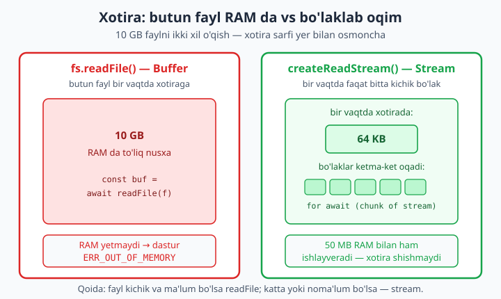
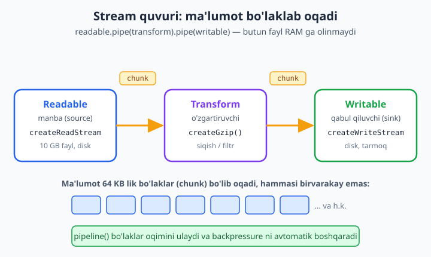

# 09 — Streams va Buffers

[⬅️ Oldingi: 08 — Fayl tizimi (fs) va path](./08-fayl-tizimi.md) · [🏠 README](./README.md) · [Keyingi: 10 — process, os, CLI va child_process ➡️](./10-process-cli.md)

> **Bu bobda:** Node.js'ning eng kuchli, lekin ko'pchilik o'tkazib yuboradigan mavzusi — katta ma'lumot bilan **samarali** ishlash. Avval **Buffer** bilan tanishamiz: binar (xom bayt) ma'lumot nima, `Buffer.from`/`Buffer.alloc`, `toString('utf8'/'hex'/'base64')` va nega Node'ga binar tip kerakligi. So'ng asosiy mavzu — **Stream**: butun faylni RAM ga olmasdan **bo'laklab** (chunk) ishlash. Buning yordamida 10 GB faylni 50 MB xotira bilan qayta ishlash mumkin. To'rt stream turini (Readable, Writable, Duplex, Transform), `pipe`/`pipeline()` bilan oqimlarni ulashni, **backpressure** (bosim) tushunchasini, `zlib` bilan gzip siqishni va katta log/CSV faylni qatorma-qator filtrlashni o'rganamiz. Har bir misol haqiqiy Node 24 da ishga tushirib tekshirilgan.

---

## Muammo: butun fayl xotiraga sig'maydi

Tasavvur qiling, serverda 10 GB lik log fayl bor va undan faqat `ERROR` qatorlarni topishingiz kerak. Oldingi bobda o'rgangan `readFile` bilan yozsangiz:

```js
import { readFile } from "node:fs/promises";

const matn = await readFile("ulkan.log", "utf8");   // ❌ 10 GB ni RAM ga oladi
const xatolar = matn.split("\n").filter((s) => s.includes("ERROR"));
```

Bu kod kichik faylda ishlaydi. Lekin 10 GB lik faylda dastur **portlaydi**: `readFile` butun faylni bir vaqtda xotiraga yuklamoqchi bo'ladi, RAM yetmaydi va Node `ERR_FS_FILE_TOO_LARGE` yoki xotira tugashi xatosini beradi. Serveringizda atigi 2 GB RAM bo'lsa, 10 GB lik faylga umuman yaqinlasholmaysiz.

Yechim — faylni **bo'lak-bo'lak** o'qish: bir vaqtda 64 KB olib, qayta ishlab, tashlab, keyingisini olish. Shunda 10 GB fayl ham bir necha o'nlab MB xotira bilan ishlanadi. Aynan shu — **stream** (oqim) g'oyasi. Lekin streamga kirishdan oldin, oqim ichida sayohat qiladigan "yuk" — **Buffer** bilan tanishaylik.



---

## Buffer — xom baytlar bilan ishlash

JavaScript'ning oddiy `string` tipi matn uchun yaratilgan: u Unicode belgilar ketma-ketligi. Lekin fayl, tarmoq soketi yoki rasm — bular **xom baytlar** (binar ma'lumot). Rasm fayli "harflar" emas, `0` dan `255` gacha sonlar ketma-ketligi. JavaScript'ning string'i bunga mos kelmaydi.

Shu sababli Node `Buffer` tipini beradi: u **o'zgarmas o'lchamli xom bayt massivi**. Har bir element — bitta bayt (0–255). Buffer Node'ning eng past darajadagi ma'lumot tipi: fayl o'qisangiz ham, tarmoqdan ma'lumot kelsa ham, aslida orqada Buffer turadi.

### Buffer yaratish: `from` va `alloc`

```js
// Matndan Buffer (utf8 — standart)
const buf1 = Buffer.from("Salom", "utf8");
console.log(buf1);                    // <Buffer 53 61 6c 6f 6d>
console.log(buf1.length);             // 5  (5 ta bayt)

// Bo'sh, oldindan tayyorlangan Buffer (hammasi nol)
const buf2 = Buffer.alloc(4);         // <Buffer 00 00 00 00>
buf2[0] = 0xff;                       // birinchi baytni o'zgartirdik
console.log(buf2);                    // <Buffer ff 00 00 00>
```

`<Buffer 53 61 6c 6f 6d>` — bu `"Salom"` so'zining **bayt** ko'rinishi, har biri o'n oltilik (hex) sonda: `53` = `S`, `61` = `a`, va h.k. Bular ASCII kodlari.

- `Buffer.from(...)` — mavjud ma'lumotdan (matn, massiv, boshqa buffer) yangi Buffer yasaydi.
- `Buffer.alloc(n)` — `n` baytlik **nol bilan to'ldirilgan** xavfsiz Buffer. (Eski `Buffer.allocUnsafe` tezroq, lekin tozalanmagan xotira beradi — xavfsizlik uchun `alloc` ishlating.)

📌 Buffer — o'zgarmas **o'lchamli**: yaratilgandan keyin uzaytirib bo'lmaydi. Massiv kabi `buf[i]` orqali baytlarga kirasiz, lekin `push` qila olmaysiz.

### `toString` — baytlarni matnga aylantirish (kodlash)

Bir xil baytlar har xil **kodlashda** (encoding) har xil ko'rinadi. Eng muhim uchtasi: `utf8` (matn), `hex` (o'n oltilik), `base64` (matn sifatida xavfsiz uzatish uchun).

```js
const buf = Buffer.from("Salom", "utf8");

console.log(buf.toString("utf8"));     // Salom
console.log(buf.toString("hex"));      // 53616c6f6d
console.log(buf.toString("base64"));   // U2Fsb20=
```

Va teskari yo'nalish — kodlangan matndan Buffer'ni tiklash:

```js
const fromHex = Buffer.from("53616c6f6d", "hex");
console.log(fromHex.toString());       // Salom

const fromB64 = Buffer.from("U2Fsb20=", "base64");
console.log(fromB64.toString());       // Salom
```

Bu real hayotda doim kerak bo'ladi: API'lar fayllarni ko'pincha **base64** matn sifatida yuboradi (JSON ichiga xom bayt sig'maydi), parol xeshlari **hex** ko'rinishida saqlanadi, `crypto` modul natijalari Buffer qaytaradi.

### Bayt ≠ belgi: UTF-8 da bir harf bir necha bayt

Bu juda muhim nuqta. `string.length` **belgilar** sonini, `Buffer.byteLength` esa **baytlar** sonini beradi. Lotin harfi 1 bayt, lekin boshqa alifbolar yoki emoji 2–4 bayt egallashi mumkin:

```js
console.log("abc".length);              // 3  (belgilar)
console.log(Buffer.byteLength("abc"));  // 3  (baytlar — lotin uchun bir xil)

const bolaklar = [Buffer.from("Sa"), Buffer.from("lom "), Buffer.from("dunyo")];
const butun = Buffer.concat(bolaklar);  // bir necha buffer'ni birlashtirish
console.log(butun.toString());          // Salom dunyo
console.log(butun.length);              // 11
```

`Buffer.concat([...])` — bir nechta Buffer'ni bitta qilib qo'shadi. Bu stream'da juda muhim: bo'laklar kelganda ularni yig'ib, oxirida birlashtirasiz.

> **Nega bayt ≠ belgi muhim?** Stream faylni baytlar bo'yicha bo'ladi, belgi chegarasini bilmaydi. Agar ko'p baytli belgi (masalan emoji) ikki bo'lak orasiga tushib qolsa va siz har bo'lakni alohida `toString` qilsangiz — belgi buziladi. Shuning uchun stream'da `{ encoding: "utf8" }` berish yoki bo'laklarni avval Buffer sifatida yig'ib, oxirida bir marta matnga aylantirish to'g'ri yo'l.

### `readFile` aslida Buffer qaytaradi

Oldingi bobdagi `readFile`ni kodlashsiz chaqirsangiz, u matn emas — **Buffer** qaytaradi:

```js
import { readFile } from "node:fs/promises";

const buf = await readFile("savdo.csv");
console.log(Buffer.isBuffer(buf));            // true
console.log(buf.toString("utf8", 0, 5));      // faqat birinchi 5 baytni matnga
```

`"utf8"` kodlash berganingizda (`readFile(path, "utf8")`) Node siz uchun Buffer'ni avtomatik matnga o'giradi. Bermasangiz — xom Buffer qaytadi. Mana shu Buffer keyin stream ichida bo'lak (chunk) bo'lib sayohat qiladi.

---

## Stream nima va nega kerak

**Stream** — bu ma'lumotni **bo'lak-bo'lak**, vaqt o'tishi bilan uzatadigan abstraksiya. Faylni bir vaqtda butun o'qish o'rniga, stream uni kichik bo'laklarga (odatda 64 KB) bo'lib, har birini navbatma-navbat beradi.

Taqqoslash uchun: butun faylni `readFile` bilan o'qish — vannani to'la suvga to'ldirib, keyin ko'tarib tashishga o'xshaydi. Stream — quvurdan suvni oqizishga: bir vaqtda quvurda atigi ozgina suv bor, lekin oxir-oqibat hammasi o'tadi. Vanna 10 GB bo'lsa ko'tarolmaysiz; quvur esa 10 GB ni ham o'tkazaveradi.

**Stream'ning afzalliklari:**

- **Xotira:** bir vaqtda faqat bitta bo'lak RAM da turadi. 10 GB fayl 50 MB xotira bilan ishlanadi.
- **Vaqt (tezroq boshlash):** birinchi bo'lak kelishi bilan ish boshlanadi — butun yuklanishini kutmaysiz. Video striming shu tamoyilda: film boshini ko'ra boshlaysiz, oxiri hali yuklanmagan bo'ladi.
- **Kompozitsiya:** oqimlarni quvurdek **ulash** mumkin: o'qi → siq → shifrla → yoz.

Node'da hamma narsa stream: HTTP so'rov/javob, `process.stdin`/`stdout`, fayllar, tarmoq soketlari, `zlib` siqish — barchasi stream interfeysiga ega.

### To'rt stream turi

| Tur | Vazifasi | Misol |
|-----|----------|-------|
| **Readable** | Ma'lumot **o'qiladi** (manba) | `fs.createReadStream`, HTTP so'rov tanasi |
| **Writable** | Ma'lumot **yoziladi** (qabul qiluvchi) | `fs.createWriteStream`, HTTP javob |
| **Duplex** | O'qish **va** yozish (ikki kanal) | TCP soket |
| **Transform** | Kiruvchini **o'zgartirib** chiquvchi qiladi | `zlib.createGzip`, shifrlash |

Endi har birini navbat bilan ko'ramiz.

---

## Readable stream — manbadan o'qish

`fs.createReadStream` faylni bo'laklab o'qiydigan Readable stream beradi. Uni ishlatishning ikki uslubi bor: eski **hodisa** (event) uslubi va zamonaviy **`for await...of`** uslubi.

### Hodisa uslubi: `data` / `end` / `error`

Readable stream uchta asosiy hodisa chiqaradi:

- `'data'` — yangi bo'lak (chunk) tayyor;
- `'end'` — fayl tugadi, boshqa bo'lak yo'q;
- `'error'` — xato yuz berdi.

```js
import { createReadStream } from "node:fs";

const stream = createReadStream("katta.log", { encoding: "utf8" });
let baytlar = 0;
let bolaklar = 0;

stream.on("data", (chunk) => {
  baytlar += chunk.length;
  bolaklar++;
});

stream.on("end", () => {
  console.log(`Tugadi: ${bolaklar} ta bo'lak, ${baytlar} belgi`);
});

stream.on("error", (err) => {
  console.error("Xato:", err.message);
});
```

420 KB lik fayl uchun bu kod chiqaradi:

```text
Tugadi: 7 ta bo'lak, 420322 belgi
```

E'tibor bering — fayl bir bo'lakda emas, **7 ta** bo'lakda keldi. Har bo'lak ~64 KB. `encoding: "utf8"` bersangiz `chunk` matn bo'ladi; bermasangiz — Buffer.

📌 `'error'` hodisasini **hech qachon e'tiborsiz qoldirmang**. Agar Readable stream'da xato chiqsa va siz `'error'`ni eshitmasangiz, Node dasturni butunlay yiqitadi (uncaught exception). Bu hodisa uslubining eng katta tuzog'i — buni keyinroq `pipeline` bilan yengamiz.

### Zamonaviy uslub: `for await...of`

Hodisalar o'rniga Readable stream'ni to'g'ridan-to'g'ri `for await...of` bilan aylanib o'tish mumkin. Bu ancha toza va xatoni `try/catch` bilan ushlash imkonini beradi:

```js
import { createReadStream } from "node:fs";

const stream = createReadStream("katta.log", { encoding: "utf8" });
let qoldiq = "";
let errorlar = 0;

for await (const chunk of stream) {
  const matn = qoldiq + chunk;
  const satrlar = matn.split("\n");
  qoldiq = satrlar.pop();          // oxirgi to'liqsiz qatorni keyingi bo'lakka qoldir
  for (const s of satrlar) {
    if (s.includes("ERROR")) errorlar++;
  }
}
if (qoldiq.includes("ERROR")) errorlar++;

console.log("ERROR qatorlar soni:", errorlar);   // ERROR qatorlar soni: 1428
```

Bu yerda muhim nuance bor: bo'lak (chunk) **qator chegarasida** bo'linmaydi. Bir qator ikki bo'lak orasiga tushib qolishi mumkin. Shuning uchun `qoldiq` o'zgaruvchisi bilan oxirgi to'liqsiz qatorni saqlab, keyingi bo'lak boshiga qo'shamiz. Bu — stream bilan ishlashda eng ko'p uchraydigan xato manbai. (Keyinroq `readline` bu muammoni butunlay yo'q qiladi.)

---

## Writable stream — manbaga yozish

`fs.createWriteStream` faylga bo'laklab **yozadigan** Writable stream beradi. Asosiy metodlari: `write(data)` (bo'lak yozish) va `end(data?)` (oxirgi bo'lakni yozib, oqimni yopish).

```js
import { createWriteStream } from "node:fs";

const ws = createWriteStream("hisobot.txt");

ws.write("Hisobot boshlandi\n");
ws.write("Qator 2\n");
ws.end("Tugadi\n");                 // oxirgi yozuv + yopish

ws.on("finish", () => console.log("hisobot.txt yozib bo'lindi"));
```

- `write(...)` — istalgancha marta chaqirib, bo'laklab yozasiz.
- `end(...)` — oqimni yopadi. Bundan keyin `write` qilolmaysiz. Argument bersangiz, u oxirgi bo'lak sifatida yoziladi.
- `'finish'` hodisasi — hamma narsa diskka yozilib bo'lganda chiqadi.

---

## Backpressure — "bosim"ni boshqarish

Mana stream'ning eng nozik, lekin eng muhim tushunchasi. Tasavvur qiling: o'quvchi (Readable) ma'lumotni **juda tez** o'qiyapti, lekin yozuvchi (Writable) — sekin disk yoki sust tarmoq — **ulgurmayapti**. Agar siz to'xtovsiz `write` qilaversangiz, yozilmagan ma'lumot xotirada to'planib boraveradi va... yana xotira tugaydi. Bu — aynan biz qochmoqchi bo'lgan muammo.

**Backpressure** (orqaga bosim) — bu mexanizm: sekin yozuvchi tez o'quvchiga "shoshma, men ulgurmayapman" deb signal beradi.

`write()` metodi buni qaytariladigan qiymat orqali aytadi: agar u **`false`** qaytarsa — ichki bufer to'lib ketdi, yozishni **to'xtatish** kerak. Keyin `'drain'` hodisasi chiqqach (bufer bo'shagach) davom etasiz:

```js
import { createWriteStream } from "node:fs";

function bosimliYozish() {
  const out = createWriteStream("kop.txt");
  let i = 0;

  function yoz() {
    let davom = true;
    while (i < 100000 && davom) {
      i++;
      davom = out.write(`qator ${i}\n`);   // false bo'lsa — bufer to'ldi
    }
    if (i < 100000) {
      out.once("drain", yoz);              // bufer bo'shaganini kutamiz, keyin davom
    } else {
      out.end(() => console.log("kop.txt: 100000 qator, backpressure bilan"));
    }
  }

  yoz();
}

bosimliYozish();
```

Bu kod 100 000 qatorni yozadi, lekin **hech qachon xotirani to'ldirmaydi**: `write` `false` qaytarsa to'xtab, disk ulgurishini kutadi.

📌 Yaxshi xabar: pastdagi `pipe` va `pipeline` bu murakkab raqsni **siz uchun avtomatik** boshqaradi. Backpressure'ni qo'lda yozish kerak bo'lmaydi — lekin u **nima uchun** kerakligini bilish stream'ni tushunishning kaliti.

---

## `pipe` va `pipeline` — oqimlarni ulash

Stream'larning butun kuchi — ularni **quvurdek ulash**da. `readable.pipe(writable)` Readable'dan kelgan har bo'lakni Writable'ga avtomatik uzatadi va backpressure'ni o'zi boshqaradi:

```js
import { createReadStream, createWriteStream } from "node:fs";

// Faylni nusxalash — xotira shishmaydi
createReadStream("manba.txt").pipe(createWriteStream("nusxa.txt"));
```

Bu bir qator butun faylni — qanchalik katta bo'lsa ham — bo'laklab nusxalaydi. Lekin `pipe`ning jiddiy kamchiligi bor: **xatolarni yaxshi boshqarmaydi**. Agar oqimlardan biri xato bersa, boshqalari avtomatik yopilmaydi (resurs sizishi — "stream leak"), va xatoni ushlash uchun har bir oqimga alohida `.on('error')` yozish kerak. Zanjir uzun bo'lsa, bu juda noqulay va xavfli.

### `pipeline()` — to'g'ri yo'l

Shu sababli zamonaviy Node `stream/promises` modulidagi **`pipeline()`** funksiyasini beradi. U oqimlarni ulaydi, backpressure'ni boshqaradi, **va** xato bo'lsa hamma oqimni to'g'ri yopib, xatoni bir joyda (`try/catch` yoki `await` rad) qaytaradi:

```js
import { createReadStream, createWriteStream } from "node:fs";
import { pipeline } from "node:stream/promises";

try {
  await pipeline(
    createReadStream("manba.txt"),
    createWriteStream("nusxa.txt"),
  );
  console.log("Nusxalash tugadi");
} catch (err) {
  console.error("Nusxalashda xato:", err.message);
}
```

Bitta `try/catch` — butun zanjir uchun. Bu — **doimo `pipeline` ishlatish kerakligining** sababi. `pipe`ni faqat eski kod va eng oddiy holatlarda ko'rasiz.



`pipeline` xatoni qanchalik yaxshi ushlashini ko'rsatamiz — mavjud bo'lmagan fayl va Transform ichidagi xato:

```js
import { createReadStream, createWriteStream } from "node:fs";
import { pipeline } from "node:stream/promises";

// Mavjud bo'lmagan fayl — pipeline xatoni try/catch ga uzatadi
try {
  await pipeline(
    createReadStream("yoq-fayl.txt"),     // bunday fayl yo'q
    createWriteStream("chiqish.txt"),
  );
} catch (err) {
  console.log("pipeline xatoni ushladi:", err.code);  // pipeline xatoni ushladi: ENOENT
}
```

---

## Transform stream — oqimni o'zgartirish

**Transform** — bu ham Readable, ham Writable: bir tomondan ma'lumot **kiradi**, ichida **o'zgaradi**, boshqa tomondan **chiqadi**. U `pipeline`ning o'rtasiga qo'yiladi: `read → transform → write`.

Eng ko'p ishlatiladigan tayyor Transform — `zlib.createGzip()` (siqish). Quyida katta log faylni gzip bilan siqamiz:

```js
import { createReadStream, createWriteStream } from "node:fs";
import { pipeline } from "node:stream/promises";
import { createGzip } from "node:zlib";

await pipeline(
  createReadStream("katta.log"),    // o'qi
  createGzip(),                     // siq  (Transform)
  createWriteStream("katta.log.gz"),// yoz
);
console.log("Gzip tugadi: katta.log.gz yaratildi");
```

Bu uch bosqichli quvur 420 KB lik faylni 28 KB ga siqadi — **butun faylni RAM ga olmasdan**, bo'laklab. 10 GB lik fayl uchun ham xuddi shu kod ishlaydi.

Teskari amal — `createGunzip()` bilan ochish:

```js
import { createReadStream, createWriteStream, statSync } from "node:fs";
import { pipeline } from "node:stream/promises";
import { createGunzip } from "node:zlib";

await pipeline(
  createReadStream("katta.log.gz"),
  createGunzip(),                   // siqishni och  (Transform)
  createWriteStream("qayta.log"),
);

const asl = statSync("katta.log").size;
const qayta = statSync("qayta.log").size;
console.log(`Gunzip: asl=${asl}, qayta=${qayta}, teng=${asl === qayta}`);
// Gunzip: asl=420322, qayta=420322, teng=true
```

Ochilgan fayl asl bilan **bayt-bayt bir xil** — siqish hech narsani yo'qotmaydi.

### O'z Transform'ingizni yozish

Tayyor Transform'lardan tashqari, o'zingiznikini yozishingiz mumkin. `transform(chunk, encoding, callback)` metodini berasiz: bo'lakni o'zgartirib, `callback(null, natija)` bilan chiqarasiz. Quyida har bo'lakni katta harfga o'tkazuvchi Transform:

```js
import { createReadStream, createWriteStream } from "node:fs";
import { pipeline } from "node:stream/promises";
import { Transform } from "node:stream";

const kattaHarf = new Transform({
  transform(chunk, encoding, callback) {
    callback(null, chunk.toString().toUpperCase());
  },
});

await pipeline(
  createReadStream("katta.log"),
  kattaHarf,
  createWriteStream("katta-upper.log"),
);
console.log("Transform tugadi: katta-upper.log yaratildi");
```

`callback`ning birinchi argumenti — **xato** (yo'q bo'lsa `null`), ikkinchisi — chiqariladigan ma'lumot. Agar `callback(new Error(...))` chaqirsangiz, `pipeline` butun zanjirni to'xtatib, xatoni `try/catch`ga uzatadi.

---

## Duplex stream — o'qish va yozish bir obyektda

**Duplex** — ikki mustaqil kanalga ega: o'qish (Readable) va yozish (Writable) **alohida** ishlaydi. Transform'dan farqi: Transform'da chiqish kirishning o'zgartirilgan natijasi; Duplex'da ikki kanal bir-biriga bog'liq emas. Eng tipik misol — TCP soket: bir tomondan ma'lumot yuborasiz (yozish), boshqa tomondan qabul qilasiz (o'qish), va ular alohida oqimlar.

Amaliyotda Duplex'ni odatda **siz yozmaysiz** — tayyor obyektlarni (soketlar) ishlatasiz. Lekin tushunish uchun oddiy "echo" Duplex:

```js
import { Duplex } from "node:stream";

const dup = new Duplex({
  write(chunk, enc, cb) {
    this.saqlangan = (this.saqlangan || "") + chunk.toString();
    cb();
  },
  read() {
    this.push(this.saqlangan || null);   // null — o'qish tugadi
    this.saqlangan = "";
  },
});

dup.write("salom ");
dup.write("duplex");
dup.end();

let yigib = "";
dup.on("data", (c) => (yigib += c));
dup.on("end", () => console.log("Duplex natija:", yigib));  // Duplex natija: salom duplex
```

📌 Eslab qolish uchun: **Transform = quvur o'rtasidagi filtr** (kirish o'zgaradi → chiqadi), **Duplex = ikki tomonlama yo'l** (yozish va o'qish bog'liq emas). Kundalik ishda Transform ko'p, Duplex'ni o'zingiz kamdan-kam yozasiz.

---

## REAL KEYS: katta logdan xatolarni ajratib chiqarish

Bobning amaliy nuqtasi. Frontda jonli loyihada server logi `app.log` necha gigabaytga yetadi. Sizga undagi faqat `ERROR` qatorlarni alohida `xatolar.log` faylga ko'chirish kerak — **xotira shishmasdan**, fayl 10 GB bo'lsa ham. Bu DevOps va backend ishida juda ko'p uchraydigan vazifa.

Yechim — `pipeline` ichida o'z Transform'imiz bilan filtrlash. Bir vaqtda butun fayl emas, bitta bo'lak qayta ishlanadi:

```js
import { createReadStream, createWriteStream, statSync } from "node:fs";
import { pipeline } from "node:stream/promises";
import { Transform } from "node:stream";

let qoldiq = "";   // bo'lak chegarasida bo'lingan to'liqsiz qatorni saqlaydi

const faqatError = new Transform({
  transform(chunk, enc, cb) {
    const matn = qoldiq + chunk.toString();
    const satrlar = matn.split("\n");
    qoldiq = satrlar.pop();              // oxirgi to'liqsiz qatorni keyingi bo'lakka
    let chiqish = "";
    for (const s of satrlar) {
      if (s.includes("ERROR")) chiqish += s + "\n";
    }
    cb(null, chiqish);
  },
  flush(cb) {                            // oqim tugaganda qolgan qoldiqni tekshir
    if (qoldiq.includes("ERROR")) cb(null, qoldiq + "\n");
    else cb();
  },
});

await pipeline(
  createReadStream("katta.log"),
  faqatError,
  createWriteStream("xatolar.log"),
);

console.log("xatolar.log o'lcham:", statSync("xatolar.log").size, "bayt");
// xatolar.log o'lcham: 61247 bayt
```

Bu yerdagi ikki muhim nuqta:

1. **`qoldiq`** — bo'lak qator o'rtasida tugashi mumkin, shuning uchun oxirgi to'liqsiz qatorni saqlab, keyingi bo'lakka qo'shamiz.
2. **`flush`** — oqim tugaganda chaqiriladi; bu yerda eng oxirgi qatorni (oxirida `\n` bo'lmasligi mumkin) tekshiramiz.

Endi 10 GB lik faylni ham 50 MB RAM bilan filtrlay olasiz. `readFile` yondashuvi bu yerda butunlay ishlamasdi.

---

## CSV/log faylni qatorma-qator o'qish: `readline`

Yuqorida har bo'lakni qo'lda `split("\n")` qilib, `qoldiq` bilan ovora bo'ldik. Node buni soddalashtiradigan tayyor modul beradi — **`readline`**. U stream ustiga qatorma-qator interfeys quradi: bo'lak chegaralarini o'zi boshqaradi, sizga toza qatorlar beradi.

```js
import { createReadStream } from "node:fs";
import { createInterface } from "node:readline";

const rl = createInterface({
  input: createReadStream("katta.log"),
  crlfDelay: Infinity,                 // \r\n (Windows) ni to'g'ri boshqaradi
});

let sanoq = 0;
for await (const qator of rl) {        // har iteratsiyada — bitta to'liq qator
  if (qator.includes("ERROR")) sanoq++;
}
console.log("readline ERROR sanoq:", sanoq);   // readline ERROR sanoq: 1428
```

Hech qanday `qoldiq`, hech qanday `split` — `readline` har iteratsiyada **bitta to'liq qator** beradi. CSV o'qishda ham xuddi shu yondashuv qulay: har qatorni vergul bo'yicha ajratib, sarlavhalarga moslab obyekt qurasiz:

```js
import { createReadStream } from "node:fs";
import { createInterface } from "node:readline";

const rl = createInterface({
  input: createReadStream("savdo.csv"),
  crlfDelay: Infinity,
});

let jami = 0;
let ustunlar = [];
let birinchi = true;

for await (const qator of rl) {
  if (!qator.trim()) continue;
  const qiymatlar = qator.split(",");
  if (birinchi) {                       // birinchi qator — sarlavhalar
    ustunlar = qiymatlar;
    birinchi = false;
    continue;
  }
  const satr = Object.fromEntries(ustunlar.map((u, i) => [u, qiymatlar[i]]));
  jami += Number(satr.narx);
}

console.log("Jami narx:", jami);        // Jami narx: 28000
```

`savdo.csv` (`id,mahsulot,narx` + 4 qator: 5000+3000+8000+12000) uchun jami **28000** chiqadi — butun faylni RAM ga olmasdan, qatorma-qator.

> **Eslatma:** real loyihada murakkab CSV (qo'shtirnoq ichidagi vergullar, ko'p qatorli qiymatlar) uchun `csv-parse` kabi tayyor paketni ishlating. Yuqoridagi qo'lda yondashuv soddagina CSV uchun yetarli va `readline`ning kuchini ko'rsatadi.

---

## CommonJS farqi (qisqacha)

Bu kitobda asosiy uslub — ESM (`import`). Lekin eski kodda CommonJS (`require`) ko'rasiz. Stream uchun farq faqat yuqori qatorda:

```js
// ESM (bizning uslub)
import { createReadStream } from "node:fs";
import { pipeline } from "node:stream/promises";

// CommonJS (eski kod)
const { createReadStream } = require("node:fs");
const { pipeline } = require("node:stream/promises");
```

Modullarning o'zi (`fs`, `stream`, `zlib`) ikkalasida ham bir xil ishlaydi. ESM'da qulaylik — `await` ni to'g'ridan-to'g'ri fayl darajasida (top-level await) ishlatish mumkin, CommonJS'da esa kodni `async` funksiya ichiga o'rashga to'g'ri keladi.

---

## Qachon stream, qachon readFile?

Stream kuchli, lekin har doim ham kerak emas. Oddiy qoida:

| Holat | Tanlov |
|-------|--------|
| Fayl kichik (< bir necha MB) va o'lchami ma'lum | `readFile` — sodda, yetarli |
| Fayl katta yoki o'lchami noma'lum (foydalanuvchi yuklaydi) | **stream** |
| Faylni o'zgartirib boshqasiga uzatish (siq, shifrla) | **stream + pipeline** |
| Tarmoq orqali jonli ma'lumot (HTTP, soket) | **stream** (boshqa imkon yo'q) |
| Butun fayl ustida murakkab amal (masalan, JSON.parse) | `readFile` (JSON oqimini stream qilish murakkab) |

📌 Maslahat: ishonchsiz bo'lsangiz — agar fayl o'lchamini **siz nazorat qilmasangiz** (foydalanuvchi yuklagan fayl, jurnal, eksport), doim stream tanlang. Bitta katta fayl serverni butunlay yiqitishi mumkin.

---

## Mashqlar

### Oson

1. `Buffer.from("Node.js")` yarating va uni `hex` hamda `base64` ko'rinishida chop eting. So'ng `base64` natijadan Buffer'ni qaytarib, matnga aylantirib tekshiring.
2. `"Salom"` so'zining `string.length` va `Buffer.byteLength("Salom")` qiymatlarini chop eting. Ular tengmi? Nega? (Lotin harflari uchun.)
3. `createWriteStream` bilan `kunlik.txt` fayliga uch qator yozing (`write` ikki marta, `end` bir marta) va `'finish'` hodisasida "yozildi" deb chop eting.

### O'rta

4. `createReadStream` va `for await...of` bilan istalgan matn faylini o'qing va undagi **belgilar umumiy sonini** sanang. Fayl necha bo'lakda kelganini ham chop eting (`encoding: "utf8"` bering).
5. `pipeline` bilan biror faylni `createGzip()` orqali `.gz` ga siqing, so'ng alohida `pipeline` bilan `createGunzip()` orqali qaytarib oching. Asl va ochilgan fayl o'lchamlari teng ekanini `statSync` bilan tasdiqlang.
6. `readline` (`createInterface`) bilan CSV faylni o'qing. Birinchi qator — sarlavha. Har qatorni obyektga aylantirib, biror ustun bo'yicha shartni qanoatlantiradigan qatorlar sonini sanang (masalan, `narx > 5000`).

### Qiyin

7. **Log filtri.** O'z `Transform`ingizni yozing: kiruvchi matn oqimidan faqat ma'lum so'z (`WARN`) bor qatorlarni chiqarsin. `qoldiq` bilan bo'lak chegarasini, `flush` bilan oxirgi qatorni to'g'ri boshqaring. `pipeline` ichida ishlating va natija faylini tekshiring.
8. **Katta-harf siquvchi quvur.** Bitta `pipeline`da uch bosqich quring: o'qi → har qatorni katta harfga o'tkazuvchi o'z Transform'ingiz → `createGzip()` → yoz. Natija `.gz` faylni `gunzip` qilib, ichidagi matn haqiqatan ham katta harfda ekanini tasdiqlang.
9. **Backpressure'ni his qilish.** `createWriteStream` ga 200 000 qator yozing. Ikki versiya yozing: (a) backpressure'ni e'tiborsiz qoldirib, faqat `write` chaqirib ketadigan; (b) `write` `false` qaytarganda `'drain'`ni kutadigan to'g'ri versiya. Ikkalasini ishga tushiring va xulosa qiling — qaysi biri xavfsiz va nega.

<details markdown="1"><summary>Yechim — 1</summary>

```js
const buf = Buffer.from("Node.js");

const hex = buf.toString("hex");
const b64 = buf.toString("base64");
console.log("hex:", hex);              // hex: 4e6f64652e6a73
console.log("base64:", b64);           // base64: Tm9kZS5qcw==

// base64 dan Buffer'ni qaytarib, matnga aylantiramiz
const qayta = Buffer.from(b64, "base64");
console.log("qayta:", qayta.toString());              // qayta: Node.js
console.log("teng:", qayta.toString() === "Node.js"); // teng: true
```

`Buffer.from("Node.js")` matndan Buffer yasaydi (standart kodlash — utf8). `toString("hex")` har baytni ikki belgili o'n oltilik songa, `toString("base64")` esa matn sifatida xavfsiz uzatiladigan ko'rinishga o'tkazadi. Teskari yo'nalishda `Buffer.from(b64, "base64")` o'sha baytlarni tiklaydi — natija asl matn bilan **bir xil**.
</details>

<details markdown="1"><summary>Yechim — 2</summary>

```js
const soz = "Salom";

console.log("string.length:", soz.length);                  // 5
console.log("byteLength:", Buffer.byteLength(soz));          // 5
console.log("teng:", soz.length === Buffer.byteLength(soz)); // teng: true

// Nega teng? "Salom" dagi har bir harf — lotin (ASCII), UTF-8 da 1 bayt.
// Shuning uchun belgilar soni (5) baytlar soniga (5) teng.
// Agar so'zda ko'p baytli belgi bo'lsa, byteLength string.length dan katta bo'lardi:
console.log('"é" byteLength:', Buffer.byteLength("é"));   // "é" byteLength: 2 (UTF-8 da 2 bayt)
console.log('"🙂" byteLength:', Buffer.byteLength("🙂")); // "🙂" byteLength: 4 (emoji — 4 bayt)
```

Lotin harflari ASCII bo'lib, UTF-8 da har biri **bir bayt** egallaydi — shu sababli `"Salom"` uchun `length` ham, `byteLength` ham 5. Lekin bu doim shunday emas: emoji 4 bayt, ko'p alifbolardagi harflar 2–3 bayt. Aynan shu farq stream'da bo'lakni qator (yoki belgi) chegarasida emas, **bayt** chegarasida bo'lishini eslatadi.
</details>

<details markdown="1"><summary>Yechim — 3</summary>

```js
import { createWriteStream } from "node:fs";

const ws = createWriteStream("kunlik.txt");

ws.write("Birinchi qator\n");   // write — 1
ws.write("Ikkinchi qator\n");   // write — 2
ws.end("Uchinchi qator\n");     // end — oxirgi qator + yopish

ws.on("finish", () => console.log("yozildi"));   // yozildi
ws.on("error", (err) => console.error("Xato:", err.message));
```

`write` ni xohlagancha marta chaqirib bo'laklab yozasiz; `end` esa oxirgi bo'lakni yozib, oqimni **yopadi** (bundan keyin `write` qilib bo'lmaydi). Hamma narsa diskka tushib bo'lgach `'finish'` hodisasi chiqadi — shuning uchun "yozildi" ni aynan shu yerda chop etamiz. `'error'` ni ham eshitish odat bo'lsin: aks holda kutilmagan xato dasturni yiqitadi.
</details>

<details markdown="1"><summary>Yechim — 4</summary>

```js
import { createReadStream, writeFileSync } from "node:fs";

// Sinov uchun katta matn fayli yaratamiz (~180 KB)
let matn = "";
for (let i = 1; i <= 5000; i++) matn += `Bu ${i}-qator, Node streams misoli.\n`;
writeFileSync("matn.txt", matn);

const stream = createReadStream("matn.txt", { encoding: "utf8" });
let belgilar = 0;
let bolaklar = 0;

for await (const chunk of stream) {
  belgilar += chunk.length;   // encoding: "utf8" bergani uchun chunk — matn
  bolaklar++;
}

console.log("Belgilar soni:", belgilar);   // Belgilar soni: 178893
console.log("Bo'laklar soni:", bolaklar);  // Bo'laklar soni: 3
```

`for await...of` Readable stream'ni bo'lak-bo'lak aylanib o'tadi. `encoding: "utf8"` berilgani uchun har `chunk` — matn, demak `chunk.length` belgilar sonini beradi. E'tibor bering: fayl bir bo'lakda emas, **bir nechta** bo'lakda keladi (bu yerda 3 ta, har biri ~64 KB) — aynan shu stream'ning mohiyati: butun fayl hech qachon bir vaqtda RAM da turmaydi. (Bo'laklar soni va belgilar miqdori fayl o'lchamiga qarab o'zgaradi.)
</details>

<details markdown="1"><summary>Yechim — 5</summary>

```js
import { createReadStream, createWriteStream, writeFileSync, statSync } from "node:fs";
import { pipeline } from "node:stream/promises";
import { createGzip, createGunzip } from "node:zlib";

// Sinov fayli (takrorlanuvchi matn yaxshi siqiladi)
let matn = "";
for (let i = 1; i <= 3000; i++) matn += `qator ${i}: takrorlanuvchi matn yaxshi siqiladi\n`;
writeFileSync("asl.txt", matn);

// 1) Siqish: asl.txt -> asl.txt.gz
await pipeline(
  createReadStream("asl.txt"),
  createGzip(),
  createWriteStream("asl.txt.gz"),
);

// 2) Ochish: asl.txt.gz -> ochilgan.txt
await pipeline(
  createReadStream("asl.txt.gz"),
  createGunzip(),
  createWriteStream("ochilgan.txt"),
);

const asl = statSync("asl.txt").size;
const gz = statSync("asl.txt.gz").size;
const ochilgan = statSync("ochilgan.txt").size;

console.log(`asl=${asl}, gz=${gz}, ochilgan=${ochilgan}`);  // asl=142893, gz=7850, ochilgan=142893
console.log("teng:", asl === ochilgan);                     // teng: true
```

Ikki alohida `pipeline`: birinchisi `createGzip()` Transform bilan siqadi, ikkinchisi `createGunzip()` bilan qaytarib ochadi. `statSync` o'lchamlarni solishtiradi: gzip fayli ancha kichik (takror matn zich siqiladi), lekin ochilgan fayl asl bilan **aynan teng** — siqish ma'lumotni yo'qotmaydi (lossless). Aniq o'lchamlar fayl mazmuniga bog'liq, lekin `asl === ochilgan` doim `true` bo'ladi.
</details>

<details markdown="1"><summary>Yechim — 6</summary>

```js
import { createReadStream, writeFileSync } from "node:fs";
import { createInterface } from "node:readline";

// Sinov CSV fayli
writeFileSync(
  "savdo.csv",
  "id,mahsulot,narx\n1,Daftar,5000\n2,Ruchka,3000\n3,Kitob,8000\n4,Sumka,12000\n",
);

const rl = createInterface({
  input: createReadStream("savdo.csv"),
  crlfDelay: Infinity,                 // \r\n (Windows) ni to'g'ri boshqaradi
});

let ustunlar = [];
let birinchi = true;
let qimmatlar = 0;   // narx > 5000 bo'lgan qatorlar soni

for await (const qator of rl) {
  if (!qator.trim()) continue;
  const qiymatlar = qator.split(",");
  if (birinchi) {
    ustunlar = qiymatlar;     // birinchi qator — sarlavhalar
    birinchi = false;
    continue;
  }
  const satr = Object.fromEntries(ustunlar.map((u, i) => [u, qiymatlar[i]]));
  if (Number(satr.narx) > 5000) qimmatlar++;
}

console.log("narx > 5000 bo'lgan qatorlar:", qimmatlar);   // 2 (Kitob 8000, Sumka 12000)
```

`readline` har iteratsiyada bitta **to'liq qator** beradi — `qoldiq`/`split("\n")` bilan ovora bo'lmaymiz. Birinchi qatorni sarlavha sifatida saqlab, qolganlarini `Object.fromEntries` bilan obyektga aylantiramiz, so'ng `narx` ustuni bo'yicha shartni tekshiramiz. 4 ta ma'lumot qatoridan ikkitasi (Kitob 8000, Sumka 12000) shartni qanoatlantiradi.
</details>

<details markdown="1"><summary>Yechim — 7</summary>

```js
import { createReadStream, createWriteStream, writeFileSync, statSync } from "node:fs";
import { pipeline } from "node:stream/promises";
import { Transform } from "node:stream";

// Test fayl: ba'zi qatorlarda WARN bor
let matn = "";
for (let i = 1; i <= 1000; i++) {
  const daraja = i % 5 === 0 ? "WARN" : "INFO";
  matn += `2026-06-12 ${daraja} hodisa ${i}\n`;
}
writeFileSync("test.log", matn);

let qoldiq = "";
const faqatWarn = new Transform({
  transform(chunk, enc, cb) {
    const t = qoldiq + chunk.toString();
    const satrlar = t.split("\n");
    qoldiq = satrlar.pop();
    let chiqish = "";
    for (const s of satrlar) {
      if (s.includes("WARN")) chiqish += s + "\n";
    }
    cb(null, chiqish);
  },
  flush(cb) {
    cb(null, qoldiq.includes("WARN") ? qoldiq + "\n" : "");
  },
});

await pipeline(
  createReadStream("test.log"),
  faqatWarn,
  createWriteStream("warn.log"),
);

console.log("warn.log o'lcham:", statSync("warn.log").size, "bayt");
// 1000 / 5 = 200 ta WARN qatori chiqadi
```

`qoldiq` — bo'lak chegarasida bo'lingan qatorni saqlaydi; `flush` — oqim tugaganda oxirgi qatorni tekshiradi. `pipeline` xatoni o'zi boshqarganligi uchun alohida `error` ushlash shart emas (kerak bo'lsa butun `await`ni `try/catch`ga olasiz).
</details>

<details markdown="1"><summary>Yechim — 8</summary>

```js
import { createReadStream, createWriteStream, writeFileSync, readFileSync } from "node:fs";
import { pipeline } from "node:stream/promises";
import { Transform } from "node:stream";
import { createGzip, gunzipSync } from "node:zlib";

writeFileSync("kichik.txt", "salom dunyo\nnode streams\nkatta harf\n");

let qoldiq = "";
const kattaHarf = new Transform({
  transform(chunk, enc, cb) {
    cb(null, chunk.toString().toUpperCase());
  },
});

// Uch bosqichli quvur: o'qi -> katta harf -> gzip -> yoz
await pipeline(
  createReadStream("kichik.txt"),
  kattaHarf,
  createGzip(),
  createWriteStream("kichik.gz"),
);
console.log("kichik.gz yaratildi");

// Tekshirish: gunzip qilib, ichidagi matn katta harfda ekanini ko'rsatamiz
const ochilgan = gunzipSync(readFileSync("kichik.gz")).toString();
console.log(ochilgan);
console.log("Hammasi katta harfmi:", ochilgan === ochilgan.toUpperCase());
// SALOM DUNYO / NODE STREAMS / KATTA HARF  va  true
```

Diqqat: Transform `pipeline`da gzip'dan **oldin** turishi shart — avval o'zgartirib, keyin siqamiz. `gunzipSync` — bu yerda kichik fayl uchun sinxron, tekshirish qulay bo'lsin deb ishlatildi.
</details>

<details markdown="1"><summary>Yechim — 9</summary>

```js
import { createWriteStream } from "node:fs";

const N = 200000;

// (a) ❌ Backpressure'ni e'tiborsiz qoldirgan versiya — XAVFLI
function yomon() {
  const out = createWriteStream("yomon.txt");
  for (let i = 0; i < N; i++) {
    out.write(`qator ${i}\n`);   // write() false qaytarsa ham to'xtamaymiz!
  }
  out.end();
  // Muammo: disk ulgurmasa, yozilmagan ma'lumot xotirada to'planadi.
  // Kichik faylda "ishlaganday" tuyuladi, lekin katta hajmda RAM shishadi.
}

// (b) ✅ To'g'ri versiya — 'drain' ni kutadi
function yaxshi() {
  return new Promise((resolve) => {
    const out = createWriteStream("yaxshi.txt");
    let i = 0;
    function yoz() {
      let davom = true;
      while (i < N && davom) {
        i++;
        davom = out.write(`qator ${i}\n`);  // false bo'lsa — bufer to'ldi
      }
      if (i < N) {
        out.once("drain", yoz);             // bufer bo'shaguncha kutamiz
      } else {
        out.end(resolve);
      }
    }
    yoz();
  });
}

yomon();
await yaxshi();
console.log("Ikkalasi tugadi");
```

**Xulosa:** (a) versiyada `write`ning `false` qaytarishini e'tiborsiz qoldiramiz — yozilmagan ma'lumot Node'ning ichki buferida to'planadi. Kichik hajmda muammo sezilmaydi, lekin millionlab qator yoki katta bo'laklar bilan RAM shishib, dastur sekinlashadi yoki yiqiladi. (b) versiyada `write` `false` qaytarganda to'xtab, `'drain'` (bufer bo'shadi) hodisasini kutamiz — xotira nazorat ostida. Eng yaxshisi esa — bu mantiqni qo'lda yozmasdan, **`pipeline` ishlatish**: u backpressure'ni avtomatik boshqaradi.
</details>

---

## Xulosa

Bu bobda Node'ning katta ma'lumot bilan ishlash poydevorini o'rgandik:

- **Buffer** — xom baytlar bilan ishlash tipi. `Buffer.from`/`alloc`, `toString('utf8'/'hex'/'base64')`. Bayt ≠ belgi: UTF-8 da bir harf bir necha bayt.
- **Stream** — ma'lumotni bo'laklab (chunk) uzatish. Butun faylni RAM ga olmasdan ishlash imkonini beradi: 10 GB fayl, 50 MB xotira.
- **To'rt tur:** Readable (o'qish), Writable (yozish), Duplex (ikki kanal), Transform (o'zgartirish).
- **`pipeline()`** — oqimlarni ulashning to'g'ri yo'li: backpressure'ni avtomatik boshqaradi va xatoni bir joyda ushlaydi. `pipe`dan ko'ra doim afzal.
- **Backpressure** — sekin yozuvchi tez o'quvchiga "shoshma" deyishi; xotira shishishining oldini oladi.
- **`zlib`** (gzip/gunzip) Transform bilan siqish, **`readline`** bilan qatorma-qator o'qish — kundalik amaliy vositalar.

Keyingi bobda Node'ning tashqi dunyo bilan aloqasiga o'tamiz: `process`, `os`, buyruq qatori (CLI) argumentlari va `child_process` bilan boshqa dasturlarni ishga tushirish.

---

[⬅️ Oldingi: 08 — Fayl tizimi (fs) va path](./08-fayl-tizimi.md) · [🏠 README](./README.md) · [Keyingi: 10 — process, os, CLI va child_process ➡️](./10-process-cli.md)
