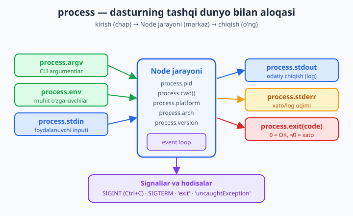
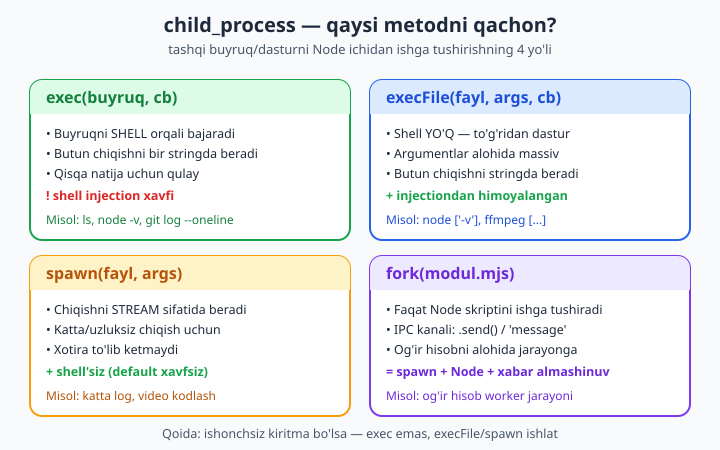

# 10 — process, os, CLI va child_process

[⬅️ Oldingi: 09 — Streams va Buffers](./09-streams-buffers.md) · [🏠 README](./README.md) · [Keyingi: 11 — HTTP moduli: native server (sehrsiz) ➡️](./11-http-modul.md)

> **Bu bobda:** dasturingiz tashqi dunyo bilan qanday gaplashishini o'rganamiz. Avval `process` obyektini chuqur ochamiz — CLI argumentlar (`argv`), muhit o'zgaruvchilari (`env`), ishchi papka, platforma/arxitektura, PID, chiqish kodlari va eng muhimi — jarayon hodisalari va signallar (`SIGINT`/`SIGTERM`), ya'ni dasturni **toza yopish** (graceful shutdown). Keyin `os` moduli bilan tizim haqida ma'lumot olamiz (CPU, xotira, hostname). So'ng haqiqiy **CLI vosita** yasaymiz: argumentlarni parse qilamiz, foydalanuvchidan input so'raymiz (`readline`) va chiqishni rangli qilamiz. Nihoyat, eng kuchli qism — `child_process`: Node ichidan **tashqi buyruq yoki dastur** ishga tushirish. `exec`, `execFile`, `spawn` va `fork` to'rtaligining farqini va qaysi birini qachon ishlatishni, hamda shell injection xavfini ko'ramiz. Hamma kod Node 24 da ishlatib tekshirilgan.

---

## Nega bu bob muhim?

Shu paytgacha biz fayllar, oqimlar va modullar bilan ishladik — bularning hammasi dasturingiz **ichidagi** dunyo edi. Lekin haqiqiy dasturlar tashqi dunyo bilan ham gaplashadi: foydalanuvchi terminalga argument yozadi, server `PORT=8080` degan sozlamani muhitdan oladi, deploy tizimi serverga "to'xta" signalini yuboradi, yoki dasturingiz boshqa bir dasturni (masalan `git` yoki `ffmpeg`) ishga tushirishi kerak bo'ladi.

Bularning barchasi — bitta obyekt va bir nechta modul orqali boshqariladi:

- **`process`** — dasturingizning "tashqi yuzi": kim qanday argument berdi, qanday muhitda ishlayapmiz, qachon to'xtatish kerak.
- **`node:os`** — kompyuter haqida ma'lumot (necha yadro, qancha xotira).
- **`node:readline`** — foydalanuvchidan interaktiv input.
- **`node:child_process`** — boshqa dasturlarni ishga tushirish.

Quyidagi diagramma `process` obyektining tashqi dunyo bilan aloqasini umumlashtiradi — uni boshda ko'rib qo'ying, bob davomida har bir qismni alohida ochamiz:



---

## process obyekti — asoslar

`process` — global obyekt. Uni `import` qilish shart emas, har joyda mavjud (xohlasangiz `import process from 'node:process'` ham yozsangiz bo'ladi). U dasturingiz haqida ko'p narsani biladi:

```js
// process asoslari
console.log('Node versiyasi :', process.version);          // 'v24.12.0'
console.log('Platforma      :', process.platform);         // 'win32' | 'linux' | 'darwin'
console.log('Arxitektura    :', process.arch);             // 'x64' | 'arm64'
console.log('Jarayon PID    :', process.pid);              // masalan 12345
console.log('Ish papkasi    :', process.cwd());            // hozirgi papka
console.log('CLI argument   :', process.argv.slice(2));    // foydalanuvchi bergan argumentlar
console.log('PATH bormi     :', typeof process.env.PATH === 'string');
```

Buni `node process-basics.mjs` bilan ishga tushiring. Natija (sizning mashinangizda):

```text
Node versiyasi : v24.12.0
Platforma      : win32
Arxitektura    : x64
Jarayon PID    : 19408
Ish papkasi    : C:\Users\imomn\Desktop\e-books
CLI argument   : []
PATH bormi     : true
```

Har bir qatorni tushuntiramiz:

- **`process.version`** — Node versiyasi (`v` bilan boshlanadi). `process.versions` esa V8, OpenSSL va boshqalarning versiyalarini ham beradi.
- **`process.platform`** — operatsion tizim: `'win32'` (Windows), `'linux'`, `'darwin'` (macOS). Diqqat: Windows 64-bit'da ham `'win32'` qaytadi — bu tarixiy nom.
- **`process.arch`** — protsessor arxitekturasi: `'x64'`, `'arm64'` va h.k.
- **`process.pid`** — jarayon identifikatori (Process ID). Operatsion tizim har bir ishlab turgan dasturga shu raqamni beradi.
- **`process.cwd()`** — *current working directory*, ya'ni dasturni **ishga tushirgan** papka (skript turgan papka emas! Bu farq muhim).
- **`process.argv`** va **`process.env`** — quyida alohida ochamiz, bular eng ko'p ishlatiladi.

> **`cwd()` va skript papkasi farqi:** `process.cwd()` — terminalda turgan papka. Skriptning o'z papkasini olish uchun esa `import.meta.dirname` (Node 20.11+) yoki eski usulda `path.dirname(fileURLToPath(import.meta.url))` ishlatiladi. Misol: `node src/app.mjs` ni `C:\loyiha` dan ishga tushirsangiz, `cwd()` — `C:\loyiha`, lekin skript `C:\loyiha\src` da.

---

## process.argv — CLI argumentlar

`process.argv` — terminalda dasturni ishga tushirganda berilgan barcha so'zlar massivi. Lekin uning **birinchi ikki elementi har doim bir xil**:

- `argv[0]` — Node ijro etuvchisi yo'li (masalan `C:\...\node.exe`).
- `argv[1]` — ishga tushirilgan skript yo'li.
- `argv[2]` dan boshlab — **sizning** argumentlaringiz.

Shuning uchun deyarli har doim `process.argv.slice(2)` yozamiz — birinchi ikkitasini tashlab, faqat foydalanuvchi bergan qismni olamiz:

```js
// greet.mjs — CLI argumentlarni o'qish
const args = process.argv.slice(2);   // [0]=node yo'li, [1]=skript yo'li ni tashlab yuboramiz

if (args.length === 0) {
  console.error('Foydalanish: node greet.mjs <ism> [yana ismlar...]');
  process.exit(1);                    // 1 = xato bilan chiqish
}

for (const ism of args) {
  console.log(`Salom, ${ism}!`);
}
```

```text
$ node greet.mjs Ali Vali
Salom, Ali!
Salom, Vali!

$ node greet.mjs
Foydalanish: node greet.mjs <ism> [yana ismlar...]
(exit kod: 1)
```

E'tibor bering: xato xabarini `console.error` bilan yozdik (u **stderr** ga ketadi, oddiy natija emas) va `process.exit(1)` bilan **xato kodi** bilan chiqdik. Buni quyida batafsil ko'ramiz.

### Bayroqlarni qo'lda parse qilish

Haqiqiy CLI vositalarda `--verbose`, `--name=Ali` kabi **bayroqlar** (flags) bo'ladi. Eng oddiy holatda ularni qo'lda ajratish mumkin:

```js
// parse-flags.mjs — qo'lda oddiy flag parser
function parseArgs(argv) {
  const opts = {};      // --kalit=qiymat va --bayroq
  const positional = []; // oddiy argumentlar

  for (const token of argv) {
    if (token.startsWith('--')) {
      const eq = token.indexOf('=');
      if (eq !== -1) {
        opts[token.slice(2, eq)] = token.slice(eq + 1);  // --name=Ali
      } else {
        opts[token.slice(2)] = true;                     // --verbose
      }
    } else {
      positional.push(token);
    }
  }
  return { opts, positional };
}

const { opts, positional } = parseArgs(process.argv.slice(2));
console.log('Bayroqlar :', opts);
console.log('Argumentlar:', positional);
```

```text
$ node parse-flags.mjs build --verbose --name=Ali src
Bayroqlar : { verbose: true, name: 'Ali' }
Argumentlar: [ 'build', 'src' ]
```

### Node ichidagi rasmiy parser: `util.parseArgs`

Qo'lda yozish o'rgatish uchun yaxshi, lekin amalda Node'ning **o'z** parseri bor — `node:util` modulidagi `parseArgs` (Node 18.3+ dan barqaror). U qisqa bayroqlar (`-n`), default qiymatlar va turlarni biladi:

```js
// Node ichidagi rasmiy parser: node:util parseArgs (Node 18.3+ barqaror)
import { parseArgs } from 'node:util';

const { values, positionals } = parseArgs({
  args: process.argv.slice(2),
  options: {
    name:    { type: 'string',  short: 'n' },
    count:   { type: 'string',  short: 'c', default: '1' },
    verbose: { type: 'boolean', short: 'v' },
  },
  allowPositionals: true,
});

const n = Number(values.count);
for (let i = 0; i < n; i++) {
  console.log(`Salom, ${values.name ?? 'dunyo'}!`);
}
if (values.verbose) console.log('positionals:', positionals);
```

```text
$ node parseargs.mjs -n Ali -c 2 -v x y
Salom, Ali!
Salom, Ali!
positionals: [ 'x', 'y' ]
```

> **Tashqi paketlar — `minimist` va `commander`:** katta CLI vositalarda (deklarativ buyruqlar, avtomatik `--help`, ranglar) ko'pincha `commander` yoki `yargs` paketlari ishlatiladi (`npm install commander`). Oddiy parse uchun esa `minimist` yetadi. Lekin endi Node'ning o'z `parseArgs`i bor, ko'p holatda tashqi paket shart emas. Bu bobda paketsiz ham hammasini qila olishni ko'rsatamiz — keyin o'zingiz tanlaysiz.

---

## process.env — muhit o'zgaruvchilari

`process.env` — operatsion tizimning **muhit o'zgaruvchilari** (environment variables) obyekti. Bu — dasturga **tashqaridan**, kodga tegmasdan sozlama berish usuli. Eng klassik misol — server porti va ishlash rejimi:

```js
// env.mjs — muhit o'zgaruvchilari
const port = process.env.PORT ?? 3000;          // berilmasa 3000
const mode = process.env.NODE_ENV ?? 'development';

console.log(`Server porti : ${port}`);
console.log(`Rejim        : ${mode}`);
console.log(`Ishlab chiqarishdami? ${mode === 'production'}`);

// env qiymati DOIM string bo'ladi — sonni o'zingiz aylantirasiz
console.log('PORT turi:', typeof process.env.PORT);   // undefined yoki 'string'
```

Endi uni **muhit o'zgaruvchisi bilan** ishga tushiramiz. Windows PowerShell'da:

```bash
# PowerShell
$env:PORT="8080"; $env:NODE_ENV="production"; node env.mjs

# Linux/macOS (bash)
PORT=8080 NODE_ENV=production node env.mjs
```

```text
Server porti : 8080
Rejim        : production
Ishlab chiqarishdami? true
PORT turi: string
```

Ikki muhim qoidani yodda tuting:

1. **`process.env` qiymatlari DOIM string** (yoki `undefined`). `PORT=8080` bersangiz ham, `process.env.PORT` — `'8080'` (matn), `8080` (son) emas. Shuning uchun `Number(process.env.PORT)` qilib aylantirasiz.
2. **Yo'q bo'lsa `undefined`** qaytadi. Shuning uchun `?? 3000` (nullish coalescing) bilan default qiymat berish odat tusiga kiradi.

> **`.env` fayllari haqida — 21-bobga eslatma:** amalda sirli qiymatlar (parol, API kalit, ma'lumotlar bazasi ulanishi) `.env` faylida saqlanadi va dasturga yuklanadi. Node 20.6+ da `node --env-file=.env app.mjs` bilan buni o'rnatilgan tarzda qilish mumkin (ilgari `dotenv` paketi kerak edi). Bu mavzuni **21-bobda** (muhit, sozlama va sirlar) chuqur ko'ramiz. Hozircha shuni bilib qo'ying: muhit o'zgaruvchilari — sozlamani koddan **ajratish**ning standart usuli.

---

## Chiqish kodlari va process.exit()

Har bir dastur tugaganda operatsion tizimga bitta **butun son** — *exit code* (chiqish kodi) qaytaradi. Kelishuv oddiy:

- **`0`** — hammasi muvaffaqiyatli tugadi.
- **`0` dan boshqa** (1, 2, ...) — xatolik yuz berdi.

Bu kod skriptlar va CI tizimlari uchun hayotiy: `node test.mjs && node deploy.mjs` da `&&` faqat birinchi buyruq `0` qaytarsagina ikkinchisini ishga tushiradi.

Chiqish kodini ikki yo'l bilan o'rnatamiz:

```js
// exitcode.mjs — chiqish kodini boshqarish
const args = process.argv.slice(2);

if (args.length === 0) {
  console.error('Xato: kamida bitta argument kerak');
  process.exitCode = 2;     // exit() darhol to'xtatmaydi; oxirida shu kod ishlatiladi
  // exit() o'rniga exitCode afzal: ochiq fayllar/loglar tugashga ulguradi
} else {
  console.log('Argumentlar soni:', args.length);
  process.exitCode = 0;
}
```

```text
$ node exitcode.mjs          # exit kod: 2
Xato: kamida bitta argument kerak

$ node exitcode.mjs a b      # exit kod: 0
Argumentlar soni: 2
```

`process.exit(code)` va `process.exitCode` farqi muhim:

- **`process.exit(1)`** — dasturni **shu zahoti** to'xtatadi. Agar shu paytda buferdagi log hali yozilmagan bo'lsa yoki fayl yopilmagan bo'lsa — **yo'qoladi**. Shuning uchun ehtiyot bo'lib ishlatiladi.
- **`process.exitCode = 1`** — faqat **kelajakdagi** chiqish kodini belgilaydi, dasturni to'xtatmaydi. Event loop tabiiy tugaganda shu kod bilan chiqadi. Bu — **xavfsizroq** usul, chunki hamma ishlar tugashga ulguradi.

> **Qoida:** iloji bo'lsa `process.exitCode` ishlating va funksiyadan `return` qiling. `process.exit()` ni faqat "darhol to'xta" kerak bo'lganda (masalan, qaytarib bo'lmaydigan xatolik) ishlating.

---

## process hodisalari va signallar

`process` — `EventEmitter` (8-bobdagi hodisa tarqatuvchi). U muhim hodisalarni e'lon qiladi:

```js
// events.mjs — process hodisalari
process.on('exit', (code) => {
  // BU YERDA faqat sinxron kod ishlaydi (event loop tugagan)
  console.log(`[exit] dastur ${code} kodi bilan tugadi`);
});

process.on('uncaughtException', (err) => {
  console.error('[uncaughtException] ushlanmagan xato:', err.message);
  process.exit(1);   // log yozib, toza chiqish
});

process.on('unhandledRejection', (reason) => {
  console.error('[unhandledRejection] ushlanmagan promise:', reason);
});

console.log('Dastur boshlandi, PID:', process.pid);

// ataylab ushlanmagan rejection (faqat namoyish uchun):
Promise.reject(new Error('unutilgan await'));

// biroz keyin normal tugaymiz
setTimeout(() => console.log('ish tugadi'), 50);
```

```text
$ node events.mjs
Dastur boshlandi, PID: 19896
[unhandledRejection] ushlanmagan promise: Error: unutilgan await
    at file:///.../events.mjs:19:16
ish tugadi
[exit] dastur 0 kodi bilan tugadi
```

Uchta asosiy hodisa:

- **`'exit'`** — dastur tugayotganda chaqiriladi. Bu yerda **faqat sinxron** kod ishlaydi (event loop allaqachon to'xtagan, `setTimeout`/`await` ishlamaydi). Oxirgi soniyada toza yozish uchun ishlatiladi.
- **`'uncaughtException'`** — `try/catch` bilan ushlanmagan **sinxron** xato. Bu — "oxirgi himoya chizig'i": xatoni log qilib, dasturni **to'xtatish** kerak (qaytib davom etish xavfli — holat buzilgan bo'lishi mumkin).
- **`'unhandledRejection'`** — `.catch()` siz qolgan rad etilgan Promise (`await` unutilgan). Zamonaviy Node bularni qattiq oladi — ishlab chiqarishda ko'pincha dasturni to'xtatadi.

> **Muhim:** `uncaughtException`/`unhandledRejection` — **xatolarni yashirish vositasi emas**. Ularda log yozib, jarayonni **qayta ishga tushirish** (masalan `pm2` yoki Docker orqali) to'g'ri yondashuv. Ushlab "davom etaveramiz" deyish — yashirin buglar manbai.

---

## Signallar va graceful shutdown — REAL KEYS

Endi eng amaliy va muhim qism. **Signal** — operatsion tizim jarayonga yuboradigan "xabar". Eng ko'p uchraydiganlari:

- **`SIGINT`** — siz terminalda **Ctrl+C** bosganda keladi ("interrupt").
- **`SIGTERM`** — boshqa dastur yoki tizim (Docker, Kubernetes, deploy skripti) "iltimos, toza to'xta" deganda yuboradi.

Default holatda bu signallar dasturni **shartta o'ldiradi**. Lekin server uchun bu yomon: o'rtada qolgan so'rovlar uziladi, ma'lumotlar bazasiga yozuv tugamay qoladi. To'g'ri yo'l — **graceful shutdown** (toza yopilish): signal kelganda yangi ish qabul qilishni to'xtatamiz, joriylarini tugatamiz, ulanishlarni yopamiz, **keyin** chiqamiz.

Mana real HTTP server (11-bobda HTTP'ni chuqur o'rganamiz, hozir tushuncha uchun):

```js
// graceful.mjs — SIGTERM/SIGINT da toza yopilish
import http from 'node:http';

const server = http.createServer((req, res) => {
  res.end('Salom!\n');
});

server.listen(3000, () => console.log('Server 3000-portda, PID:', process.pid));

let yopilmoqda = false;

function gracefulShutdown(signal) {
  if (yopilmoqda) return;        // ikkinchi signalni e'tiborsiz qoldiramiz
  yopilmoqda = true;
  console.log(`\n${signal} keldi — yangi ulanishlar to'xtatildi, mavjudlari tugatilmoqda...`);

  server.close(() => {           // yangi ulanish qabul qilinmaydi, ochiqlari tugaydi
    console.log('Hamma ulanish yopildi. Xayr!');
    process.exit(0);
  });

  // agar 10 soniyada yopilmasa — majburan chiqamiz
  setTimeout(() => {
    console.error('Vaqt tugadi — majburan yopilamiz');
    process.exit(1);
  }, 10_000).unref();            // unref: bu taymer dasturni tirik ushlab turmaydi
}

process.on('SIGTERM', () => gracefulShutdown('SIGTERM'));
process.on('SIGINT',  () => gracefulShutdown('SIGINT'));
```

Buni ishga tushirib, terminalda **Ctrl+C** bosing:

```text
$ node graceful.mjs
Server 3000-portda, PID: 16404
^C
SIGINT keldi — yangi ulanishlar to'xtatildi, mavjudlari tugatilmoqda...
Hamma ulanish yopildi. Xayr!
```

Bu kod mantig'ini biz `fetch` bilan ham tekshirib ko'rdik — server javob beradi (`Salom!`), keyin signal `server.close()` ni ishga tushiradi va jarayon `0` kodi bilan toza chiqadi:

```text
listen OK, PID: 19316
fetch javobi: Salom!
SIGINT keldi — yopilmoqda...
Hamma ulanish yopildi. Xayr!
(exit kod: 0)
```

E'tibor bering:

- **`yopilmoqda` bayrog'i** — foydalanuvchi ikki marta Ctrl+C bossa, ikkinchisini e'tiborsiz qoldiramiz (aks holda `server.close()` ikki marta chaqirilib chalkashlik bo'ladi).
- **`server.close(cb)`** — yangi ulanish **qabul qilmaydi**, lekin ochiq so'rovlar **tugashini kutadi**, keyin `cb` ni chaqiradi.
- **Majburan chiqish taymeri** — agar biror so'rov "osilib" qolsa, dastur abadiy kutmasin uchun 10 soniyalik chegara. `.unref()` — bu taymer **o'zi** dasturni tirik ushlab turmasin uchun.

Bu naqsh — production serverlarning poydevori. **24-bobda** (production deployment) buni Docker va `pm2` bilan birga, chuqurroq ko'ramiz. Hozircha asosiy g'oyani — "signal kelganda darrov o'lmang, toza yoping" — yodda saqlang.

---

## stdin / stdout / stderr — standart oqimlar

Har bir jarayonda **uchta standart oqim** bor:

- **`process.stdout`** — odatiy chiqish (`console.log` shu yerga yozadi).
- **`process.stderr`** — xato/log oqimi (`console.error` shu yerga yozadi).
- **`process.stdin`** — kirish (klaviatura yoki pipe orqali kelgan ma'lumot).

`stdout` va `stderr` ni **ajratish** muhim: shunda `node app.mjs > natija.txt` qilganda faqat haqiqiy natija faylga tushadi, loglar esa ekranda qoladi. Bu Unix falsafasining asosi.

### stdin'dan o'qish — pipe uchun filtr

`stdin` — `Readable` oqim (9-bob). Undan o'qib, qayta ishlab, `stdout`ga yozadigan **filtr** dastur yasash mumkin:

```js
// uppercase.mjs — stdin'dan o'qib, stdout'ga yozadigan filtr (pipe uchun)
// Foydalanish:  echo salom | node uppercase.mjs
let kirgan = '';
process.stdin.setEncoding('utf8');

process.stdin.on('data', (bolak) => { kirgan += bolak; });

process.stdin.on('end', () => {
  process.stdout.write(kirgan.toUpperCase());
});
```

```text
$ echo "salom dunyo" | node uppercase.mjs
SALOM DUNYO
```

Bu — boshqa dasturning chiqishini "quvur" (pipe `|`) orqali olib, o'zgartirib qayta chiqaradi. Unix vositalari (grep, sort, ...) aynan shunday zanjir bo'lib ishlaydi.

### TTY tekshiruvi — terminalmi yoki pipe?

Dasturingiz **terminalga** yozyaptimi yoki **faylga/pipe'ga**? Bu farq muhim: terminalga rang chiqarsa chiroyli, lekin faylga rang kodlarini yozsa — axlat bo'ladi. `isTTY` shuni aytadi:

```js
// tty.mjs — terminalmi yoki pipe'gami chiqyapmiz?
if (process.stdout.isTTY) {
  console.log('Terminalga yozyapmiz — rang ishlatsa bo\'ladi');
} else {
  console.log('Pipe yoki faylga yozyapmiz — rangsiz toza matn');
}
// stderr alohida oqim — log'ni stdout'dan ajratish uchun ishlatiladi
console.error('[log] bu xabar stderr ga ketdi');
```

```text
$ node tty.mjs | cat
Pipe yoki faylga yozyapmiz — rangsiz toza matn
[log] bu xabar stderr ga ketdi
```

Yaxshi CLI vositalar (masalan `git`) aynan shu tekshiruvni qiladi: terminalga rang beradi, pipe'da esa rangsiz toza matn chiqaradi.

---

## node:os moduli — tizim haqida ma'lumot

`node:os` moduli kompyuter va operatsion tizim haqida ma'lumot beradi: necha yadro, qancha xotira, qaysi foydalanuvchi va h.k.

```js
// os.mjs — tizim haqida ma'lumot
import os from 'node:os';

const gb = (bytes) => (bytes / 1024 ** 3).toFixed(2) + ' GB';

console.log('Platforma :', os.platform());     // 'win32' | 'linux' | 'darwin'
console.log('Tur       :', os.type());         // 'Windows_NT' | 'Linux' | 'Darwin'
console.log('Reliz     :', os.release());
console.log('Hostname  :', os.hostname());
console.log('Home papka:', os.homedir());
console.log('CPU yadro :', os.cpus().length, 'ta');
console.log('CPU model :', os.cpus()[0].model.trim());
console.log('Jami RAM  :', gb(os.totalmem()));
console.log('Bo`sh RAM :', gb(os.freemem()));
console.log('Uptime    :', Math.round(os.uptime() / 60), 'daqiqa');
console.log('EOL belgi :', JSON.stringify(os.EOL));  // '\r\n' yoki '\n'
```

```text
Platforma : win32
Tur       : Windows_NT
Reliz     : 10.0.26200
Hostname  : Oqil
Home papka: C:\Users\imomn
CPU yadro : 12 ta
CPU model : Intel(R) Core(TM) i5-10400 CPU @ 2.90GHz
Jami RAM  : 15.92 GB
Bo`sh RAM : 7.45 GB
Uptime    : 130 daqiqa
EOL belgi : "\r\n"
```

Eng ko'p ishlatiladigan funksiyalar:

| Funksiya | Nima qaytaradi |
|---|---|
| `os.platform()` | OS: `'win32'`, `'linux'`, `'darwin'` |
| `os.cpus()` | Har bir CPU yadrosi haqida massiv (`.length` — yadro soni) |
| `os.totalmem()` / `os.freemem()` | Jami / bo'sh RAM (bayt'larda) |
| `os.hostname()` | Kompyuter nomi |
| `os.homedir()` | Foydalanuvchi uy papkasi |
| `os.tmpdir()` | Vaqtinchalik fayllar papkasi |
| `os.EOL` | Qatorlar oxiri belgisi (Windows'da `\r\n`, Unix'da `\n`) |

`os.cpus().length` — ayniqsa muhim: u necha yadro borligini aytadi, bu esa nechta worker jarayon ochishni hal qilishda kerak (24-bobda `cluster`).

---

## CLI yaratish: input va rang

Yaxshi CLI vosita ikki narsani biladi: foydalanuvchidan **so'rash** va chiqishni **rang** bilan tushunarli qilish. Ikkalasini ham paketsiz qila olamiz.

### Foydalanuvchidan input — node:readline

`node:readline` moduli terminaldan qator-qator o'qishni osonlashtiradi. Zamonaviy, Promise'li versiyasi — `node:readline/promises`:

```js
// readline.mjs — interaktiv savol-javob
import readline from 'node:readline/promises';
import { stdin as input, stdout as output } from 'node:process';

const rl = readline.createInterface({ input, output });

const ism = await rl.question('Ismingiz? ');
const yosh = await rl.question('Yoshingiz? ');

console.log(`Salom, ${ism}! Siz ${yosh} yoshdasiz.`);
rl.close();
```

Terminalda ishga tushiring (bu **interaktiv** — javob yozasiz):

```text
$ node readline.mjs
Ismingiz? Oqil
Yoshingiz? 28
Salom, Oqil! Siz 28 yoshdasiz.
```

> **Diqqat:** `readline/promises` ning `question`'i **haqiqiy terminal** uchun mo'ljallangan. Agar inputni pipe orqali bersangiz (`echo ... | node readline.mjs`) va oqim o'rtada tugasa, ikkinchi `question` "osilib" qolishi mumkin. Pipe'lanadigan inputni o'qish uchun quyidagi `'line'` hodisali usul ishonchliroq.

Pipe va fayldan ham, terminaldan ham ishlaydigan ishonchli usul — `'line'` hodisasi orqali har bir qatorni qayta ishlash:

```js
// readline-lines.mjs — har bir qatorni o'qib qayta ishlash (stdin pipe ham ishlaydi)
import readline from 'node:readline';
import { stdin as input, stdout as output } from 'node:process';

const rl = readline.createInterface({ input, output, prompt: '> ' });
let jami = 0;

rl.prompt();
rl.on('line', (line) => {
  const son = Number(line.trim());
  if (!Number.isNaN(son)) {
    jami += son;
    console.log(`  qabul qilindi, joriy yig'indi: ${jami}`);
  } else if (line.trim()) {
    console.log('  son emas, e\'tiborsiz qoldirildi');
  }
  rl.prompt();
});

rl.on('close', () => {
  console.log(`\nUmumiy yig'indi: ${jami}`);
});
```

```text
$ printf "10\n20\nsalom\n5" | node readline-lines.mjs
>   qabul qilindi, joriy yig'indi: 10
>   qabul qilindi, joriy yig'indi: 30
>   son emas, e'tiborsiz qoldirildi
>   qabul qilindi, joriy yig'indi: 35

Umumiy yig'indi: 35
```

### Rang — paketsiz ANSI kodlari

Terminalga rang berish uchun maxsus **ANSI escape** ketma-ketliklari bor. `\x1b[31m` — qizil rang yoq, `\x1b[0m` — rangni qaytaradi (reset). Buni paketsiz qilamiz:

```js
// ansi.mjs — paketsiz rangli chiqish (ANSI kodlari)
const c = {
  reset:  '\x1b[0m',
  red:    '\x1b[31m',
  green:  '\x1b[32m',
  yellow: '\x1b[33m',
  blue:   '\x1b[34m',
  bold:   '\x1b[1m',
};

function paint(color, text) {
  return `${color}${text}${c.reset}`;
}

console.log(paint(c.green, 'OK')    + ' — hammasi joyida');
console.log(paint(c.yellow, 'OGOH') + ' — diqqat qiling');
console.log(paint(c.red, 'XATO')    + ' — nimadir buzildi');
console.log(c.bold + c.blue + 'Qalin ko`k sarlavha' + c.reset);
```

Terminalda `OK` yashil, `XATO` qizil bo'lib chiqadi. **Har bir rangdan keyin `reset` qo'yishni unutmang** — aks holda undan keyingi hamma matn o'sha rangda qolib ketadi.

> **Tashqi paket — `chalk`:** amalda ko'pincha `chalk` paketi (`npm install chalk`) ishlatiladi — u `chalk.green('OK')` kabi qulay va `isTTY` ni avtomatik tekshiradi (pipe'da rangni o'chiradi). Lekin ko'rib turibsiz: oddiy holatda paketsiz ham bemalol bo'ladi va ANSI kodlari aslida nima ekanini bilib qo'ydingiz.

---

## child_process — boshqa dasturlarni ishga tushirish

Ba'zan Node ichidan **tashqi buyruq yoki dastur** ishga tushirish kerak bo'ladi: `git`ni chaqirish, `ffmpeg` bilan video qayta ishlash, yoki tizim buyrug'ini bajarish. Buning uchun `node:child_process` moduli bor.

Uning **to'rtta** asosiy metodi bor va ularning farqini bilish — eng ko'p adashiladigan joy. Quyidagi diagramma to'rttasini taqqoslaydi:



Qisqacha:

| Metod | Shell? | Chiqish | Qachon |
|---|---|---|---|
| `exec` | Ha | Bir stringda | Qisqa natija, shell xususiyatlari kerak |
| `execFile` | Yo'q | Bir stringda | Bitta dasturni xavfsiz chaqirish |
| `spawn` | Yo'q | Stream | Katta/uzluksiz chiqish |
| `fork` | — | IPC (xabar) | Node-Node, og'ir hisobni alohida jarayonda |

### exec — qisqa chiqishli buyruq

`exec` buyruqni **shell orqali** bajaradi va butun chiqishni callback'da (yoki Promise'da) **bitta string** sifatida beradi. Qisqa natijalar uchun qulay:

```js
// exec.mjs — qisqa chiqishli buyruq (butun chiqishni bir stringda beradi)
import { exec } from 'node:child_process';
import { promisify } from 'node:util';

const execAsync = promisify(exec);   // callback -> Promise

const { stdout, stderr } = await execAsync('node -v');
console.log('Node versiyasi:', stdout.trim());
if (stderr) console.error('stderr:', stderr);
```

```text
$ node exec.mjs
Node versiyasi: v24.12.0
```

`exec` shell orqali ishlaganligi uchun `ls -la | grep .js` kabi quvurlar, `&&`, `*` shablon belgilari ishlaydi. Lekin aynan shu — **xavf manbai** (quyida).

### execFile — shell'siz, xavfsiz

`execFile` dasturni **shell'siz**, to'g'ridan-to'g'ri ishga tushiradi va argumentlarni **alohida massivda** oladi. Bu — injection'dan himoyaning asosi:

```js
// execfile.mjs — shell'siz, argumentlar massiv (injection'dan himoyalangan)
import { execFile } from 'node:child_process';
import { promisify } from 'node:util';

const execFileAsync = promisify(execFile);

// 'node' dasturini to'g'ridan-to'g'ri chaqiramiz, argumentlar alohida massivda
const { stdout } = await execFileAsync('node', ['-e', 'console.log(2 + 2)']);
console.log('Natija:', stdout.trim());   // '4'
```

```text
$ node execfile.mjs
Natija: 4
```

### spawn — katta yoki uzluksiz chiqish

`exec`/`execFile` butun chiqishni xotirada to'plab, oxirida beradi. Agar chiqish **juda katta** bo'lsa (gigabaytlik log) yoki **uzluksiz** kelsa (jonli monitoring) — xotira to'lib ketadi. `spawn` esa chiqishni **stream** sifatida beradi — bo'lak-bo'lak:

```js
// spawn.mjs — katta yoki uzluksiz chiqish uchun (stream sifatida keladi)
import { spawn } from 'node:child_process';

// 'node' bilan kichik skript ishga tushiramiz, u 3 marta chiqaradi
const child = spawn('node', [
  '-e',
  'for (let i = 1; i <= 3; i++) console.log("qator " + i)',
]);

child.stdout.on('data', (chunk) => {
  process.stdout.write('[bola] ' + chunk.toString());
});

child.stderr.on('data', (chunk) => {
  process.stderr.write('[xato] ' + chunk.toString());
});

child.on('close', (code) => {
  console.log(`Bola jarayon ${code} kodi bilan tugadi`);
});
```

```text
$ node spawn.mjs
[bola] qator 1
[bola] qator 2
[bola] qator 3
Bola jarayon 0 kodi bilan tugadi
```

`child.stdout` — bu `Readable` oqim (9-bob). Shuning uchun uni faylga ham `pipe` qilsa bo'ladi: `child.stdout.pipe(fs.createWriteStream('log.txt'))`. Bu — `spawn`ning kuchi.

### fork — Node-Node aloqasi (IPC)

`fork` — `spawn`ning maxsus turi: u **faqat Node skriptini** ishga tushiradi va ota-bola jarayon o'rtasida **xabar almashinuv kanali** (IPC) ochadi. Og'ir hisobni asosiy jarayonni bloklamasdan, alohida jarayonga uzatish uchun ishlatiladi.

Ona jarayon (`parent.mjs`):

```js
// parent.mjs — fork: Node-Node IPC (xabar almashinuvi)
import { fork } from 'node:child_process';
import { fileURLToPath } from 'node:url';
import path from 'node:path';

const __dirname = path.dirname(fileURLToPath(import.meta.url));
const child = fork(path.join(__dirname, 'child.mjs'));

child.on('message', (msg) => {
  console.log('[ota] boladan keldi:', msg);
  child.disconnect();   // kanalni yopamiz -> bola tugaydi
});

child.send({ son: 7 });   // bolaga obyekt yuboramiz (JSON sifatida)
```

Bola jarayon (`child.mjs`):

```js
// child.mjs — fork qilingan bola jarayon
process.on('message', (msg) => {
  const natija = msg.son * msg.son;     // og'ir hisob shu yerda bo'lishi mumkin
  process.send({ kvadrat: natija });    // otaga javob yuboramiz
});
```

```text
$ node parent.mjs
[ota] boladan keldi: { kvadrat: 49 }
```

`fork`ning farqlovchi xususiyati — `.send()` va `'message'` orqali **strukturali ma'lumot** (obyekt) almashinuvi. Node bularni avtomatik JSON qiladi va qaytaradi. Bu — CPU'ni ko'p talab qiladigan ishlarni (rasm qayta ishlash, hisob-kitob) asosiy server jarayonidan ajratishning klassik yo'li.

---

## Xavfsizlik: shell injection

Eng muhim xavfsizlik darsi. `exec` buyruqni **shell orqali** bajaradi. Agar buyruqqa **foydalanuvchi kiritmasini** to'g'ridan-to'g'ri qo'shsangiz, falokat:

```js
// ❌ XAVFLI — HECH QACHON BUNDAY QILMANG
import { exec } from 'node:child_process';
const fayl = foydalanuvchiKiritmasi;          // tasavvur: 'rasm.png; rm -rf /'
exec(`convert ${fayl} out.png`);              // shell ';' ni alohida buyruq deb o'qiydi!
```

Bu yerda foydalanuvchi `rasm.png; rm -rf /` deb yozsa, shell uni **ikkita buyruq** deb ko'radi: avval `convert`, keyin `rm -rf /` (hamma fayl o'chadi!). Bu — **shell injection** hujumi.

To'g'ri yo'l — `execFile` yoki `spawn` ishlatish. Ularda shell yo'q, argumentlar **alohida massivda** uzatiladi, shuning uchun `;`, `&&`, `|` kabi belgilar oddiy **matn** bo'lib qoladi:

```js
// XAVFSIZ: execFile foydalanuvchi kiritmasini argument sifatida uzatadi,
// shell yo'q -> ; && | kabi belgilar oddiy matn bo'lib qoladi
import { execFile } from 'node:child_process';
import { promisify } from 'node:util';
const execFileAsync = promisify(execFile);

const foydalanuvchiKiritmasi = 'console.log("xavfsiz")';   // tasavvur: tashqaridan keldi
const { stdout } = await execFileAsync('node', ['-e', foydalanuvchiKiritmasi]);
console.log('Natija:', stdout.trim());
```

```text
$ node injection-safe.mjs
Natija: xavfsiz
```

> **Oltin qoida:** ishonchsiz (foydalanuvchidan kelgan) ma'lumot buyruqqa kirsa — **hech qachon `exec`** ishlatmang. `execFile` yoki `spawn` bilan, argumentlarni **massiv** sifatida bering. `exec`ni faqat **siz to'liq nazorat qiladigan**, statik buyruqlar uchun ishlating.

### Windows'da `.cmd` shimlari haqida

Windowsda `npm`, `npx`, `yarn` — aslida `.cmd` skriptlari (real `.exe` emas). Zamonaviy Node (xavfsizlik uchun) ularni `execFile` orqali shell'siz ishga tushirishni **bloklaydi** (`EINVAL` xatosi beradi — bu CVE-2024-27980 himoyasi). Ularni chaqirish uchun `shell: true` kerak:

```js
// Windows'da .cmd shim (npm, npx, yarn) ni ishonchli chaqirish: shell:true
// DIQQAT: shell:true bilan argumentlarni FAQAT ishonchli manbadan oling
// (foydalanuvchi kiritmasini bu yerga qo'shmang -> injection xavfi).
import { execFile } from 'node:child_process';
import { promisify } from 'node:util';
const execFileAsync = promisify(execFile);

const { stdout } = await execFileAsync('npm', ['-v'], { shell: true });
console.log('npm versiyasi:', stdout.trim());
```

```text
$ node npm-shell.mjs
(node:20052) [DEP0190] DeprecationWarning: Passing args to a child process
with shell option true can lead to security vulnerabilities...
npm versiyasi: 11.6.2
```

Node hatto `DEP0190` ogohlantirishini ham chiqaradi: `shell: true` bilan argumentlar **ekranlanmaydi** (escape qilinmaydi). Demak, bu yo'lni faqat **ishonchli, statik** argumentlar bilan ishlating. Bu — Windows'da CLI vosita yozayotganda tez-tez uchraydigan tuzoq.

---

## REAL KEYS: tizim hisobot kartasi (sysinfo CLI)

Endi o'rganganlarimizni birlashtirib, haqiqiy mini-vosita yasaymiz — `os` moduli bilan tizim ma'lumotini yig'ib, `child_process` bilan Node versiyasini tashqi buyruqdan olib, hammasini rangli chiroyli karta sifatida ko'rsatamiz:

```js
// sysinfo.mjs — tizim hisobot kartasi (os + child_process birga)
import os from 'node:os';
import { execFile } from 'node:child_process';
import { promisify } from 'node:util';

const execFileAsync = promisify(execFile);

const c = { reset: '\x1b[0m', green: '\x1b[32m', cyan: '\x1b[36m', bold: '\x1b[1m' };
const gb = (b) => (b / 1024 ** 3).toFixed(1) + ' GB';
const qator = (nom, qiymat) => console.log(`  ${c.cyan}${nom.padEnd(14)}${c.reset} ${qiymat}`);

// Node versiyasini tashqi buyruq orqali olamiz (execFile = shell'siz, xavfsiz)
let nodeVer = process.version;
try {
  const { stdout } = await execFileAsync('node', ['-v']);
  nodeVer = stdout.trim();
} catch {
  // node PATH'da bo'lmasa, ichki qiymatga qaytamiz
}

console.log(c.bold + '\n  TIZIM HISOBOTI' + c.reset);
console.log('  ' + '-'.repeat(34));
qator('Platforma', `${os.type()} (${os.platform()}/${os.arch()})`);
qator('Hostname', os.hostname());
qator('CPU', `${os.cpus()[0].model.trim()} x${os.cpus().length}`);
qator('RAM', `${gb(os.freemem())} bo'sh / ${gb(os.totalmem())} jami`);
qator('Node', nodeVer);
qator('Uptime', `${Math.round(os.uptime() / 3600)} soat`);
console.log(`\n  ${c.green}OK${c.reset} — hisobot tayyor.\n`);
```

```text
$ node sysinfo.mjs

  TIZIM HISOBOTI
  ----------------------------------
  Platforma      Windows_NT (win32/x64)
  Hostname       Oqil
  CPU            Intel(R) Core(TM) i5-10400 CPU @ 2.90GHz x12
  RAM            7.5 GB bo'sh / 15.9 GB jami
  Node           v24.12.0
  Uptime         2 soat

  OK — hisobot tayyor.
```

Bu kichik vosita uchta narsani birlashtiradi: **`os`** (tizim ma'lumoti), **`execFile`** (tashqi `node -v` ni xavfsiz ishga tushirish) va **ANSI rang** (chiroyli chiqish). `padEnd(14)` bilan ustunlarni tekisladik, `try/catch` bilan esa `node` topilmasa ham yiqilmaydigan qildik. Mana shu — kundalik ishda foydali, haqiqiy CLI vositaning kichik, lekin to'liq namunasi.

---

## Xulosa

- **`process`** — dasturingizning tashqi yuzi: `argv` (CLI argumentlar), `env` (muhit sozlamalari), `cwd()`, `platform`/`arch`, `pid`.
- **Chiqish kodi**: `0` = OK, `≠0` = xato. `process.exit()` darrov to'xtatadi (xavfli), `process.exitCode` esa toza chiqish uchun afzal.
- **Signallar va graceful shutdown** — `SIGINT`/`SIGTERM` da darrov o'lmang: yangi ishni to'xtatib, joriylarini tugatib, ulanishlarni yopib chiqing. Bu — production serverlarning poydevori (24-bob).
- **`stdin`/`stdout`/`stderr`** — uchta standart oqim; `stderr`ni log uchun ajrating, `isTTY` bilan terminal/pipe ni farqlang.
- **`os`** — tizim ma'lumoti: `cpus()`, `totalmem()`/`freemem()`, `hostname()`, `homedir()`.
- **CLI** — `parseArgs` (yoki `commander`) bilan argument, `readline` bilan input, ANSI/`chalk` bilan rang.
- **`child_process`** — `exec` (qisqa, shell), `execFile` (xavfsiz, shell'siz), `spawn` (katta chiqish, stream), `fork` (Node-Node IPC).
- **Xavfsizlik** — ishonchsiz kiritma bo'lsa `exec` emas, `execFile`/`spawn` bilan argumentlarni **massiv** sifatida bering. Shell injection — jiddiy xavf.

Keyingi bobda native HTTP server yozamiz — `child_process`dagi server tushunchasi va graceful shutdown naqshi o'sha yerda to'liq ochiladi.

---

## Mashqlar

### Oson

1. **CLI kalkulyator.** `node calc.mjs 4 + 5` ko'rinishida ishlaydigan dastur yozing: uchta argument (son, amal, son) ni oling va natijani chiqaring. `+ - x /` amallarini qo'llab-quvvatlang (`*` o'rniga `x`, chunki `*` shell uchun maxsus). Son bo'lmagan yoki noma'lum amal bo'lsa, xato xabari va `exit(1)`.

2. **Muhit salomi.** `process.env.USER` (Linux/macOS) yoki `process.env.USERNAME` (Windows) ni o'qib, "Salom, <ism>!" deb chiqaring. O'zgaruvchi yo'q bo'lsa "Salom, mehmon!" deng.

3. **Tizim qisqacha.** `os` moduli bilan platforma, CPU yadrolari soni va jami RAM (GB) ni bitta qatorda chiqaring.

### O'rta

4. **Sozlamani tekshiruvchi.** `process.env` dan `PORT` va `NODE_ENV` ni o'qib, tekshiradigan `getConfig()` funksiyasini yozing: `PORT` 1..65535 oralig'ida son bo'lishi, `NODE_ENV` esa `development`/`production`/`test` dan biri bo'lishi shart. Noto'g'ri bo'lsa, aniq xato xabari bilan `exit(1)`.

5. **stdin yig'indisi.** `readline` ning `'line'` hodisasi bilan foydalanuvchi kiritgan sonlarni o'qib, kiritish tugaganda (`close`) ularning yig'indisini chiqaring. Son bo'lmagan qatorlarni e'tiborsiz qoldiring.

6. **Versiyani oling.** `execFile` bilan `node -v` ni ishga tushirib, versiyani oling. Lekin xato (masalan, buyruq topilmasa) bo'lsa, `try/catch` bilan ushlab, toza xabar bering.

### Qiyin

7. **Parallel versiya tekshiruvchi.** `node`, `npm`, `git` dasturlarining versiyalarini **parallel** (`Promise.allSettled`) tekshiradigan vosita yozing. Har biri uchun yashil `OK` + versiya yoki qizil `YO'Q` chiqaring. Birortasi topilmasa, jarayon `exit(1)` qaytarsin. Windows'da `npm` `.cmd` shim ekanligini hisobga oling.

8. **Graceful logger.** `setInterval` bilan har soniyada ishlayotgan "ishchi" dastur yozing (masalan, hisoblagichni oshirib log qiladi). `SIGINT` (Ctrl+C) kelganda: yangi ishni to'xtating, "Toza yopilyapman, jami N marta ishladim" deb yozing va `exit(0)`. `setInterval` ni `clearInterval` bilan to'xtatishni unutmang.

---

<details markdown="1"><summary>Yechim — 1 (CLI kalkulyator)</summary>

```js
// calc.mjs — CLI kalkulyator
const [, , a, amal, b] = process.argv;   // destructuring bilan o'qish

const x = Number(a);
const y = Number(b);

if (Number.isNaN(x) || Number.isNaN(y)) {
  console.error('Xato: ikkita son kiriting. Masalan: node calc.mjs 4 + 5');
  process.exit(1);
}

let natija;
switch (amal) {
  case '+': natija = x + y; break;
  case '-': natija = x - y; break;
  case 'x': natija = x * y; break;   // '*' shell uchun maxsus, shuning uchun 'x'
  case '/':
    if (y === 0) { console.error('Xato: 0 ga bo\'lib bo\'lmaydi'); process.exit(1); }
    natija = x / y; break;
  default:
    console.error(`Noma'lum amal: ${amal}`);
    process.exit(1);
}
console.log(`${x} ${amal} ${y} = ${natija}`);
```

```text
$ node calc.mjs 4 + 5
4 + 5 = 9
$ node calc.mjs 6 x 7
6 x 7 = 42
$ node calc.mjs 10 / 0
Xato: 0 ga bo'lib bo'lmaydi    (exit kod: 1)
```

`const [, , a, amal, b]` — birinchi ikki elementni (node, skript) bo'sh joy bilan tashlab, keyingilarni nomladik.
</details>

<details markdown="1"><summary>Yechim — 2 (Muhit salomi)</summary>

```js
// salom.mjs
const ism = process.env.USER ?? process.env.USERNAME ?? 'mehmon';
console.log(`Salom, ${ism}!`);
```

`??` zanjiri bilan: avval `USER` (Unix), keyin `USERNAME` (Windows), ikkalasi ham yo'q bo'lsa `'mehmon'`. `??` faqat `null`/`undefined` da keyingiga o'tadi (bo'sh string `''` da emas — bu yerda kerakli xulq).
</details>

<details markdown="1"><summary>Yechim — 3 (Tizim qisqacha)</summary>

```js
// kiska.mjs
import os from 'node:os';
const gb = (b) => (b / 1024 ** 3).toFixed(1);
console.log(`${os.platform()} | ${os.cpus().length} yadro | ${gb(os.totalmem())} GB RAM`);
```

```text
win32 | 12 yadro | 15.9 GB RAM
```
</details>

<details markdown="1"><summary>Yechim — 4 (Sozlamani tekshiruvchi)</summary>

```js
// config.mjs — env'dan sozlamani o'qish va tekshirish
function getConfig() {
  const port = Number(process.env.PORT ?? 3000);
  const mode = process.env.NODE_ENV ?? 'development';
  const debug = process.env.DEBUG === 'true';      // string -> boolean

  if (Number.isNaN(port) || port < 1 || port > 65535) {
    throw new Error(`Noto'g'ri PORT: ${process.env.PORT}`);
  }
  const ruxsatRejimlar = ['development', 'production', 'test'];
  if (!ruxsatRejimlar.includes(mode)) {
    throw new Error(`Noma'lum NODE_ENV: ${mode}`);
  }
  return { port, mode, debug };
}

try {
  const cfg = getConfig();
  console.log('Sozlama yuklandi:', cfg);
} catch (err) {
  console.error('Sozlama xatosi:', err.message);
  process.exit(1);
}
```

```text
$ node config.mjs
Sozlama yuklandi: { port: 3000, mode: 'development', debug: false }

$ $env:PORT="abc"; node config.mjs
Sozlama xatosi: Noto'g'ri PORT: abc    (exit kod: 1)

$ $env:NODE_ENV="production"; $env:DEBUG="true"; node config.mjs
Sozlama yuklandi: { port: 3000, mode: 'production', debug: true }
```

Diqqat: `DEBUG === 'true'` — chunki env qiymati string, `Boolean('false')` esa `true` qaytaradi (bo'sh bo'lmagan string), shuning uchun aniq taqqoslash kerak.
</details>

<details markdown="1"><summary>Yechim — 5 (stdin yig'indisi)</summary>

```js
// yigindi.mjs
import readline from 'node:readline';
import { stdin as input, stdout as output } from 'node:process';

const rl = readline.createInterface({ input, output, prompt: 'son> ' });
let jami = 0;

rl.prompt();
rl.on('line', (line) => {
  const son = Number(line.trim());
  if (!Number.isNaN(son) && line.trim() !== '') {
    jami += son;
  } else if (line.trim()) {
    console.log('  (son emas, tashlandi)');
  }
  rl.prompt();
});

rl.on('close', () => console.log(`\nYig'indi: ${jami}`));
```

```text
$ printf "10\n5\nx\n3" | node yigindi.mjs
son> son> son>   (son emas, tashlandi)
son> son>
Yig'indi: 18
```
</details>

<details markdown="1"><summary>Yechim — 6 (Versiyani oling)</summary>

```js
// version.mjs
import { execFile } from 'node:child_process';
import { promisify } from 'node:util';
const execFileAsync = promisify(execFile);

try {
  const { stdout } = await execFileAsync('node', ['-v']);
  console.log('Node versiyasi:', stdout.trim());
} catch (err) {
  console.error('Versiyani aniqlab bo\'lmadi:', err.message);
  process.exitCode = 1;
}
```

`execFile` (shell'siz) ishlatdik, chunki bu yerda hech qanday shell xususiyati kerak emas — xavfsizroq tanlov.
</details>

<details markdown="1"><summary>Yechim — 7 (Parallel versiya tekshiruvchi)</summary>

```js
// runall.mjs — bir nechta buyruqni parallel ishga tushirish
import { execFile } from 'node:child_process';
import { promisify } from 'node:util';
const execFileAsync = promisify(execFile);

const c = { reset: '\x1b[0m', green: '\x1b[32m', red: '\x1b[31m' };

// Windows'da npm — .cmd shim, shuning uchun shell:true kerak bo'ladi.
// shell:true ni FAQAT statik (ishonchli) argumentlar bilan ishlatamiz.
const win = process.platform === 'win32';
const tekshiruvlar = [
  { nom: 'node', argv: ['-v'],        shell: false },
  { nom: 'npm',  argv: ['-v'],        shell: win },   // Windows'da shim -> shell
  { nom: 'git',  argv: ['--version'], shell: false },
];

const natijalar = await Promise.allSettled(
  tekshiruvlar.map(async (t) => {
    const { stdout } = await execFileAsync(t.nom, t.argv, { shell: t.shell });
    return stdout.trim();
  })
);

for (let i = 0; i < natijalar.length; i++) {
  const r = natijalar[i];
  const nom = tekshiruvlar[i].nom.padEnd(6);
  if (r.status === 'fulfilled') {
    console.log(`${c.green}OK${c.reset}   ${nom} -> ${r.value}`);
  } else {
    console.log(`${c.red}YO'Q${c.reset} ${nom} -> topilmadi yoki xato`);
  }
}

const xato = natijalar.some((r) => r.status === 'rejected');
process.exitCode = xato ? 1 : 0;
```

```text
$ node runall.mjs
OK   node   -> v24.12.0
OK   npm    -> 11.6.2
OK   git    -> git version 2.53.0.windows.3
```

Asosiy g'oyalar:
- **`Promise.allSettled`** — `Promise.all`dan farqli, biror dastur topilmasa ham qolganlari tekshiriladi (`all` birinchi xatoda to'xtardi).
- **Windows `.cmd` muammosi** — `npm` Windows'da `npm.cmd` shim. Zamonaviy Node uni `execFile` orqali shell'siz ishga tushirmaydi (`EINVAL`), shuning uchun `shell: true` bersak ishlaydi. Argumentlar statik (`-v`) bo'lgani uchun bu xavfsiz.
- **Exit kod** — birortasi yiqilsa `process.exitCode = 1`, CI shu orqali muvaffaqiyat/muvaffaqiyatsizlikni biladi.
</details>

<details markdown="1"><summary>Yechim — 8 (Graceful logger)</summary>

```js
// logger.mjs — har soniyada ishlaydi, Ctrl+C da toza yopiladi
let hisoblagich = 0;

const timer = setInterval(() => {
  hisoblagich++;
  console.log(`[${new Date().toLocaleTimeString()}] ish #${hisoblagich}`);
}, 1000);

let yopilmoqda = false;

function shutdown() {
  if (yopilmoqda) return;
  yopilmoqda = true;
  clearInterval(timer);                          // taymerni to'xtatamiz
  console.log(`\nToza yopilyapman. Jami ${hisoblagich} marta ishladim. Xayr!`);
  process.exit(0);
}

process.on('SIGINT', shutdown);                  // Ctrl+C
process.on('SIGTERM', shutdown);                 // tashqi to'xtatish

console.log('Ishlayapman... to\'xtatish uchun Ctrl+C bosing.');
```

```text
$ node logger.mjs
Ishlayapman... to'xtatish uchun Ctrl+C bosing.
[14:32:01] ish #1
[14:32:02] ish #2
[14:32:03] ish #3
^C
Toza yopilyapman. Jami 3 marta ishladim. Xayr!
(exit kod: 0)
```

Bu — graceful shutdown'ning eng sodda namunasi. Asosiy serverda `clearInterval` o'rniga `server.close()` bo'ladi, lekin g'oya bir xil: signal kelganda **avval tozalash**, **keyin chiqish**. `yopilmoqda` bayrog'i ikki marta Ctrl+C bosishdan himoya qiladi.
</details>

---

[⬅️ Oldingi: 09 — Streams va Buffers](./09-streams-buffers.md) · [🏠 README](./README.md) · [Keyingi: 11 — HTTP moduli: native server (sehrsiz) ➡️](./11-http-modul.md)
