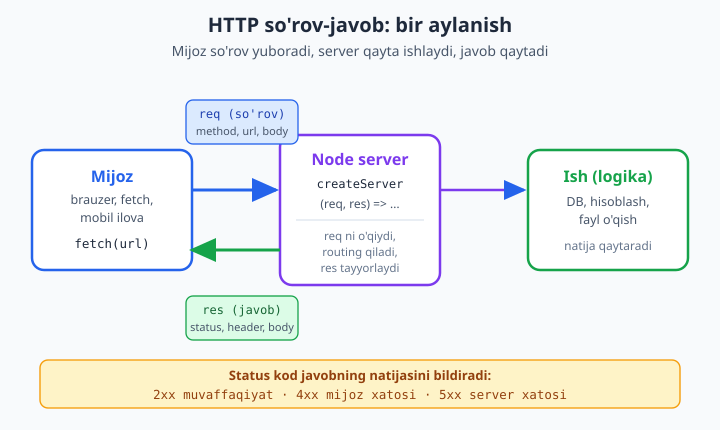
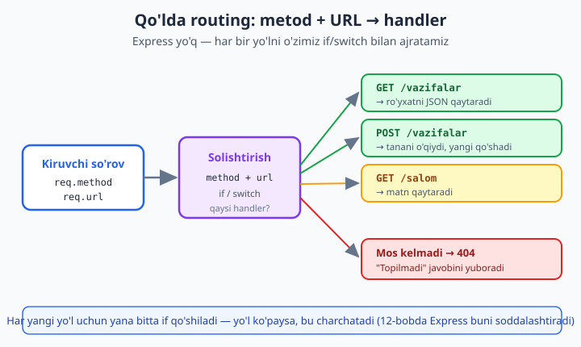

# 11 — HTTP moduli: native server (sehrsiz)

[⬅️ Oldingi: 10 — process, os, CLI va child_process](./10-process-cli.md) · [🏠 README](./README.md) · [Keyingi: 12 — Express asoslari ➡️](./12-express-asoslari.md)

> **Bu bobda:** Node'ning **o'z** `node:http` moduli bilan veb-server quramiz — hech qanday tashqi paketsiz, "sehrsiz". HTTP'ni qisqa takrorlaymiz (so'rov/javob, metodlar, status kodlar, sarlavhalar); `http.createServer` bilan server yaratib `listen` qilamiz; **so'rov** (`req`) obyektidan metod, URL va sarlavhalarni o'qiymiz, **tanani oqim (stream) sifatida** yig'amiz va JSON'ni parse qilamiz; **javob** (`res`) obyektiga status, sarlavha va tana yozamiz; metod va URL bo'yicha **qo'lda routing** qilib 404 qaytaramiz; JSON API beramiz; query string'ni `URL`/`URLSearchParams` bilan ajratamiz; statik faylni stream bilan uzatamiz. Yakunda **REAL KEYS** sifatida kichik "Vazifalar" REST API (GET/POST `/vazifalar`) quramiz — keyingi bobda buni Express bilan solishtiramiz va nega har narsani qo'lda yozish charchatishini his qilamiz.

---

## Nega native HTTP'dan boshlaymiz?

Ko'pchilik Node'ni o'rganishni to'g'ridan-to'g'ri **Express**'dan boshlaydi. Express ajoyib, lekin u — **abstraksiya**: u sizning o'rningizga ko'p ishni "sehrli" qiladi. Sehrning ostida nima borligini bilmasangiz, biror narsa buzilganda boshingiz qotadi: "Bu `req.body` qayerdan keldi? Nega `res.json()` ishlaydi-yu, `res.end()` ham bor?"

Shuning uchun avval **sehrsiz** qatlamni — Node'ning o'z `node:http` modulini — qo'lda ishlatamiz. Bu modul Express, Fastify, Koa va boshqa hamma freymvorklarning **poydevori**. Ularning ostida o'sha o'sha `http.createServer` turadi. Bir marta o'zingiz qo'lda yozsangiz, Express'ning har bir "sehri" oddiy funksiya chaqiruviga aylanadi.

Bob oxiriga kelib siz native HTTP bilan to'liq ishlaydigan JSON API yozasiz. Keyin 12-bobda **xuddi shu API**ni Express bilan qayta yozib, "qancha kod tejaldi" degan savolga o'zingiz javob berasiz.

> 📌 Bu bobda **DB yo'q** — ma'lumotlarni oddiy massivda (xotirada) saqlaymiz. Haqiqiy ma'lumotlar bazasi 14-bobdan boshlanadi. Hozir e'tibor — HTTP qatlamida.

---

## 1. HTTP — 60 soniyalik takror

HTTP (HyperText Transfer Protocol) — bu **mijoz** (brauzer, mobil ilova, `fetch`) bilan **server** o'rtasidagi suhbat tili. Suhbat juda oddiy qoidada boradi: **mijoz so'rov yuboradi, server bitta javob qaytaradi.** Boshqasi yo'q — server o'zicha gap boshlamaydi.



Har bir **so'rov** (request) quyidagilardan iborat:

- **Metod** — niyatni bildiradi: `GET` (o'qish), `POST` (yangi yaratish), `PUT`/`PATCH` (o'zgartirish), `DELETE` (o'chirish).
- **URL** — qaysi resurs: `/vazifalar`, `/vazifalar/5?bajarildi=true`.
- **Sarlavhalar (headers)** — qo'shimcha ma'lumot: `Content-Type: application/json`, `Authorization: ...`, `Host: ...`.
- **Tana (body)** — ixtiyoriy yuk (asosan `POST`/`PUT`'da): masalan, yangi vazifaning JSON'i.

Har bir **javob** (response) ham shunga o'xshash:

- **Status kod** — natija: `200` (OK), `201` (yaratildi), `404` (topilmadi), `422` (yaroqsiz ma'lumot), `500` (server xatosi).
- **Sarlavhalar** — masalan, `Content-Type: application/json`.
- **Tana** — javob mazmuni (HTML, JSON, rasm, ...).

Status kodlarni guruh bo'yicha eslab qolish oson:

| Guruh | Ma'no | Misollar |
|-------|-------|----------|
| `2xx` | Muvaffaqiyat | `200` OK, `201` Created, `204` No Content |
| `3xx` | Yo'naltirish | `301` Moved, `304` Not Modified |
| `4xx` | **Mijoz** xatosi | `400` Bad Request, `404` Not Found, `422` Unprocessable |
| `5xx` | **Server** xatosi | `500` Internal Error, `503` Unavailable |

Asosiy farqni yodda tuting: **4xx** — aybdor mijoz (noto'g'ri so'rov yubordi), **5xx** — aybdor server (so'rov to'g'ri edi, lekin kod yiqildi).

---

## 2. Birinchi server: `http.createServer`

Eng kichik ishlaydigan server — atigi bir necha qator. Yangi papka oching, `package.json` ga `"type": "module"` qo'shing (ESM uchun) va `server.mjs` yarating:

```js
// server.mjs
import { createServer } from 'node:http';

const server = createServer((req, res) => {
  res.statusCode = 200;
  res.setHeader('Content-Type', 'text/plain; charset=utf-8');
  res.end('Salom, dunyo!');
});

server.listen(3000, () => {
  console.log('Server http://localhost:3000 da tinglayapti');
});
```

Ishga tushiramiz:

```bash
node server.mjs
```

Endi brauzerda `http://localhost:3000` ni oching — "Salom, dunyo!" chiqadi. To'xtatish uchun terminalda `Ctrl + C`.

Nima sodir bo'ldi, qatorma-qator:

- `createServer(callback)` — **server obyekti** yaratadi. `callback` — bu **har bir so'rovda** chaqiriladigan funksiya. Unga ikkita argument keladi: `req` (kelgan so'rov) va `res` (biz to'ldiradigan javob).
- `res.statusCode = 200` — javob statusini belgilaymiz.
- `res.setHeader(...)` — javob sarlavhasini qo'shamiz. `charset=utf-8` — o'zbekcha/kirill harflar to'g'ri ko'rinishi uchun muhim.
- `res.end('...')` — tanani yozamiz **va** javobni yopamiz. `end()` chaqirilmasa, mijoz "muzlab" qoladi — javob hech tugamaydi.
- `server.listen(3000, ...)` — serverni `3000`-portda **tinglashga** qo'yamiz. Bu qator bo'lmasa, server hech kimni eshitmaydi.

> 💡 **CommonJS farqi:** agar `"type": "module"` yo'q bo'lsa (eski uslub), import o'rniga `const http = require('node:http');` deb yozasiz va `http.createServer(...)` ishlatasiz. Qolgan hammasi bir xil. Bu kitobda asosiy uslub — ESM (`import`).

### Kodni o'zimiz sinaymiz (global `fetch` bilan)

Node 24'da **`fetch` global** — brauzerdagidek, hech narsa o'rnatmasdan ishlaydi. Shuni ishlatib, serverni ishga tushirib, unga o'zimiz so'rov yuborib, javobni tekshiramiz — hammasi bitta faylda:

```js
// test-server.mjs
import { createServer } from 'node:http';

const server = createServer((req, res) => {
  res.statusCode = 200;
  res.setHeader('Content-Type', 'text/plain; charset=utf-8');
  res.end('Salom, dunyo!');
});

server.listen(3000, () => {
  console.log('Server http://localhost:3000 da tinglayapti');
});

// 300ms dan keyin o'zimizga so'rov yuboramiz, javobni tekshiramiz, serverni yopamiz
setTimeout(async () => {
  const javob = await fetch('http://localhost:3000/');
  console.log('Status:', javob.status);
  console.log('Content-Type:', javob.headers.get('content-type'));
  console.log('Tana:', await javob.text());
  server.close(); // server.close() — yangi ulanishlarni to'xtatadi
}, 300);
```

```bash
node test-server.mjs
```

Natija:

```text
Server http://localhost:3000 da tinglayapti
Status: 200
Content-Type: text/plain; charset=utf-8
Tana: Salom, dunyo!
```

`server.close()` chaqirilgani uchun dastur o'zi tugaydi — endi `Ctrl + C` shart emas. Bu uslubni butun bobda ishlatamiz: **server + uni sinaydigan `fetch`** bir faylda, shuning uchun har misolni shunchaki `node fayl.mjs` deb tekshira olasiz.

---

## 3. `req` — so'rov obyekti

`req` (aslida `IncomingMessage` klassi) — bu mijoz yuborgan so'rovning hamma ma'lumoti. Eng ko'p kerak bo'ladiganlari:

- `req.method` — `"GET"`, `"POST"` va h.k. (har doim katta harfda).
- `req.url` — yo'l va query string: `"/vazifalar?bajarildi=true"`.
- `req.headers` — sarlavhalar obyekti (kalitlar **kichik harfda**): `req.headers['content-type']`, `req.headers.host`.

```js
import { createServer } from 'node:http';

const server = createServer((req, res) => {
  console.log('Metod:', req.method);
  console.log('URL:', req.url);
  console.log('Host:', req.headers.host);
  console.log('User-Agent:', req.headers['user-agent']);

  res.end('OK');
});

server.listen(3000, () => console.log('tinglayapti'));
```

Lekin diqqat: `req.url` bu **butun yo'l + query** — uni hali parse qilish kerak (4-bo'limda ko'ramiz). Va `req.headers` — bu shunchaki tayyor obyekt. Eng qiyini esa **tana** — chunki u darrov tayyor turmaydi.

### Tanani oqim (stream) sifatida o'qish

Mana bu yerda Node'ning "sehrsiz"ligi seziladi. `req.body` degan tayyor narsa **yo'q**! Tana — bu **oqim (stream)**: mijoz uni bo'lak-bo'lak (chunk) yuboradi, ayniqsa katta bo'lsa. Node sizga tananing kelishini kuzatib, bo'laklarni o'zingiz yig'ish imkonini beradi.

Eng zamonaviy va o'qishga oson usul — **`for await`** (async iteratsiya):

```js
import { createServer } from 'node:http';

const server = createServer(async (req, res) => {
  // Tanani oqim sifatida bo'lak-bo'lak yig'amiz
  let xom = '';
  for await (const bolak of req) {
    xom += bolak; // bolak — Buffer; satrga qo'shilsa avtomatik matnga aylanadi
  }
  console.log('Xom tana:', xom);

  res.end('Qabul qilindi');
});

server.listen(3000, () => console.log('tinglayapti'));
```

`req` obyekti **async iterable** — ya'ni uni `for await` bilan aylantirsa bo'ladi. Har `bolak` — `Buffer` (xom baytlar), lekin matnga (`+=`) qo'shilganda Node uni avtomatik UTF-8 satrga aylantiradi.

Klassik (eski) usul — `data` va `end` **hodisalari** orqali. Buni ham bilib qo'yish kerak, chunki ko'p eski koddan uchraydi:

```js
// 'data' / 'end' hodisalari bilan tanani yig'ish (klassik usul)
function tanaOqi(req) {
  return new Promise((resolve, reject) => {
    const bolaklar = [];
    req.on('data', (bolak) => bolaklar.push(bolak));   // har bo'lakni saqlaymiz
    req.on('end', () => resolve(Buffer.concat(bolaklar).toString('utf-8'))); // tugadi
    req.on('error', reject);
  });
}
```

`req.on('data', ...)` — har bo'lak kelganda chaqiriladi. `req.on('end', ...)` — hammasi kelib bo'lganda. Biz bo'laklarni massivga yig'ib, oxirida `Buffer.concat(...)` bilan birlashtiramiz. Ikkala usul ham bir xil natija beradi; `for await` qisqaroq va xatosi kamroq.

### JSON tanani parse qilish

API'lar odatda JSON jo'natadi. Yig'ilgan xom matn — bu shunchaki satr (`'{"matn":"..."}'`). Uni JavaScript obyektiga aylantirish uchun `JSON.parse` kerak. Lekin mijoz **buzuq** JSON yuborishi mumkin — shuning uchun `try/catch` shart:

```js
import { createServer } from 'node:http';

const server = createServer(async (req, res) => {
  let xom = '';
  for await (const bolak of req) xom += bolak;

  let tana = null;
  if (xom) {
    try {
      tana = JSON.parse(xom);
    } catch {
      // Buzuq JSON kelsa — mijozning xatosi (4xx)
      res.writeHead(400, { 'Content-Type': 'application/json; charset=utf-8' });
      res.end(JSON.stringify({ xato: 'Yaroqsiz JSON' }));
      return; // muhim: javobdan keyin chiqib ketamiz
    }
  }

  res.writeHead(200, { 'Content-Type': 'application/json; charset=utf-8' });
  res.end(JSON.stringify({ qabulQilindi: tana, metod: req.method }));
});

server.listen(3000, () => console.log('tinglayapti'));

// Sinov:
setTimeout(async () => {
  const javob = await fetch('http://localhost:3000/echo', {
    method: 'POST',
    headers: { 'Content-Type': 'application/json' },
    body: JSON.stringify({ ism: 'Olim', yosh: 25 }),
  });
  console.log('Javob:', await javob.json());

  const yomon = await fetch('http://localhost:3000/echo', { method: 'POST', body: '{buzuq' });
  console.log('Buzuq status:', yomon.status, await yomon.json());

  server.close();
}, 300);
```

Natija:

```text
tinglayapti
Javob: { qabulQilindi: { ism: 'Olim', yosh: 25 }, metod: 'POST' }
Buzuq status: 400 { xato: 'Yaroqsiz JSON' }
```

E'tibor bering: bu **uch qator g'oya** — oqimni o'qi, `JSON.parse` qil, xatoni ushla — bu Express'da bitta `express.json()` chaqiruviga sig'adi. Hozir hammasini qo'lda qilyapmiz. Buni har endpoint uchun takrorlash kerak bo'ladi — mana shu yerda charchoq boshlanadi.

---

## 4. `res` — javob obyekti

`res` (`ServerResponse` klassi) — javobni quradigan obyekt. Asosiy metodlari:

- `res.statusCode = 200` **yoki** `res.writeHead(200, { ... })` — status kod (va birvarakay sarlavhalar).
- `res.setHeader('Content-Type', '...')` — bitta sarlavha qo'shish.
- `res.write('...')` — tanaga bo'lak qo'shish (bir necha marta chaqirilsa bo'ladi).
- `res.end('...')` — tanani tugatib, javobni yopish (oxirgi bo'lakni ham yozadi).

`writeHead` — `statusCode` + sarlavhalarni bitta chaqiruvda beradi, shuning uchun qisqaroq:

```js
// Ikkala variant bir xil natija beradi:

// Variant A — alohida
res.statusCode = 201;
res.setHeader('Content-Type', 'application/json; charset=utf-8');
res.end(JSON.stringify({ ok: true }));

// Variant B — writeHead bilan (qisqaroq)
res.writeHead(201, { 'Content-Type': 'application/json; charset=utf-8' });
res.end(JSON.stringify({ ok: true }));
```

> ⚠️ **Muhim qoida:** sarlavhalarni faqat **tana yozilmasdan oldin** o'rnatish mumkin. `res.write()` yoki `res.end()` chaqirilgandan keyin `setHeader`/`writeHead` qilsangiz — `ERR_HTTP_HEADERS_SENT` xatosi chiqadi. Avval sarlavha, keyin tana — tartibi shu.

`write()` — tanani bo'lak-bo'lak yuborishni ko'rsatish uchun:

```js
res.writeHead(200, { 'Content-Type': 'text/plain; charset=utf-8' });
res.write('Salom, ');  // birinchi bo'lak
res.write('dunyo!');   // ikkinchi bo'lak
res.end();             // bo'sh end — yakunlaydi (qo'shimcha bo'lak yo'q)
```

Mijozga `"Salom, dunyo!"` yetib boradi — Node bo'laklarni birlashtiradi. Amalda kichik javoblar uchun to'g'ridan-to'g'ri `res.end('Salom, dunyo!')` qulayroq; `write()` katta yoki oqimli (streaming) javoblar uchun foydali.

---

## 5. Qo'lda routing: metod + URL bo'yicha

Hozirgacha serverimiz **hamma** so'rovga bir xil javob berardi. Haqiqiy ilovada esa `/vazifalar` boshqacha, `/salom` boshqacha javob berishi kerak. Bu — **routing** (yo'naltirish). Express'da bu uchun maxsus sintaksis bor; native'da esa biz oddiy `if`/`switch` bilan **o'zimiz** ajratamiz.



`if` bilan eng tushunarli:

```js
import { createServer } from 'node:http';

const server = createServer((req, res) => {
  const url = new URL(req.url, `http://${req.headers.host}`);
  const yol = url.pathname; // query'siz toza yo'l: "/salom"

  if (req.method === 'GET' && yol === '/') {
    res.writeHead(200, { 'Content-Type': 'text/plain; charset=utf-8' });
    res.end('Bosh sahifa');
    return;
  }

  if (req.method === 'GET' && yol === '/salom') {
    res.writeHead(200, { 'Content-Type': 'text/plain; charset=utf-8' });
    res.end('Salom!');
    return;
  }

  // Hech qaysiga mos kelmadi — 404
  res.writeHead(404, { 'Content-Type': 'text/plain; charset=utf-8' });
  res.end('404 — bunday sahifa yo\'q');
});

server.listen(3000, () => console.log('tinglayapti'));
```

`switch` bilan ham yozsa bo'ladi — metod va yo'lni bitta kalitga birlashtirib:

```js
import { createServer } from 'node:http';

const server = createServer((req, res) => {
  const url = new URL(req.url, `http://${req.headers.host}`);
  const kalit = `${req.method} ${url.pathname}`; // "GET /salom"

  switch (kalit) {
    case 'GET /':
      res.writeHead(200, { 'Content-Type': 'text/plain; charset=utf-8' });
      res.end('Bosh sahifa');
      break;
    case 'GET /salom':
      res.writeHead(200, { 'Content-Type': 'text/plain; charset=utf-8' });
      res.write('Salom, ');
      res.write('dunyo!');
      res.end();
      break;
    default:
      res.writeHead(404, { 'Content-Type': 'text/plain; charset=utf-8' });
      res.end('404 — bunday sahifa yo\'q');
  }
});

server.listen(3000, () => console.log('tinglayapti'));

// Sinov:
setTimeout(async () => {
  for (const p of ['/', '/salom', '/yoq']) {
    const r = await fetch('http://localhost:3000' + p);
    console.log(p, '=>', r.status, JSON.stringify(await r.text()));
  }
  server.close();
}, 300);
```

Natija:

```text
tinglayapti
/ => 200 "Bosh sahifa"
/salom => 200 "Salom, dunyo!"
/yoq => 404 "404 — bunday sahifa yo'q"
```

Ikkala usulning ham **default/oxirgi tarmog'i — 404**: agar so'rov hech qaysi shartga mos kelmasa, "topilmadi" deb javob beramiz. Bu **majburiy** — aks holda mos kelmagan so'rov javobsiz "muzlab" qoladi.

> 🔍 **Sezdingizmi?** Har yangi sahifa = yana bitta `if`/`case` + har birida o'sha `writeHead` + `Content-Type`ni qayta yozish. 5 ta yo'lda chidasa bo'ladi, 50 ta yo'lda esa bu jahannam. Express aynan shu takrorni yo'qotadi.

---

## 6. Query string'ni ajratish: `URL` va `URLSearchParams`

`req.url` — `"/qidir?q=node&sahifa=2"` kabi keladi. Bizga ikki narsa kerak: toza yo'l (`/qidir`) va parametrlar (`q=node`, `sahifa=2`). Buni qo'lda `split('?')` qilish mumkin, lekin xatosi ko'p (kodlangan belgilar, bir nechta `=` va h.k.). Node'ning o'rnatilgan **`URL`** klassi buni to'g'ri qiladi:

```js
import { createServer } from 'node:http';

const server = createServer((req, res) => {
  // req.url nisbiy bo'lgani uchun ikkinchi argument (asos) kerak
  const url = new URL(req.url, `http://${req.headers.host}`);

  const yol = url.pathname;                      // "/qidir"
  const q = url.searchParams.get('q');           // "node"
  const sahifa = url.searchParams.get('sahifa'); // "2" (har doim SATR!)

  res.writeHead(200, { 'Content-Type': 'application/json; charset=utf-8' });
  res.end(JSON.stringify({ yol, q, sahifa }));
});

server.listen(3000, () => console.log('tinglayapti'));

setTimeout(async () => {
  const javob = await fetch('http://localhost:3000/qidir?q=node&sahifa=2');
  console.log(await javob.json());
  server.close();
}, 300);
```

Natija:

```text
tinglayapti
{ yol: '/qidir', q: 'node', sahifa: '2' }
```

Muhim nuqtalar:

- `new URL(req.url, asos)` — `req.url` nisbiy (`/qidir?...`), shuning uchun `URL` ga to'liq asos (`http://host`) kerak. `req.headers.host` shuni beradi.
- `url.pathname` — query'siz toza yo'l. Routing'da **shuni** ishlatamiz (yuqorida ko'rdik).
- `url.searchParams` — bu `URLSearchParams` obyekti. `.get('kalit')` bilan qiymat olamiz.
- ⚠️ Query qiymatlari **har doim satr**. `sahifa` — `"2"` (satr), `2` (son) emas. Songa kerak bo'lsa `Number(sahifa)` qiling.

`URLSearchParams`ni mustaqil ham ishlatsa bo'ladi (masalan, `POST` da kelgan form-data uchun):

```js
const params = new URLSearchParams('q=node&sahifa=2&teg=js&teg=web');
console.log(params.get('q'));      // "node" — birinchisi
console.log(params.getAll('teg')); // ["js", "web"] — takroriy kalitlar
console.log(params.has('sahifa')); // true
```

---

## 7. Statik fayl serve qilish (qisqacha)

Ko'pincha serverdan oddiy fayllarni — `index.html`, `style.css`, rasm — berish kerak bo'ladi. Ularni `fs` bilan **oqim (stream)** qilib uzatamiz, shunda 100 MB lik fayl ham RAM ni to'ldirmaydi (oqimlar haqida 9-bobda gaplashgandik):

```js
import { createServer } from 'node:http';
import { createReadStream } from 'node:fs';
import { stat } from 'node:fs/promises';
import { extname, join, normalize } from 'node:path';

// Kengaytma -> Content-Type jadvali
const turlar = {
  '.html': 'text/html; charset=utf-8',
  '.css': 'text/css; charset=utf-8',
  '.js': 'text/javascript; charset=utf-8',
  '.json': 'application/json; charset=utf-8',
  '.png': 'image/png',
  '.svg': 'image/svg+xml',
};

const ILDIZ = process.cwd(); // fayllar shu papkadan beriladi

const server = createServer(async (req, res) => {
  // "/" so'ralsa index.html ga aylantiramiz
  const yol = req.url === '/' ? '/index.html' : req.url;

  // XAVFSIZLIK: "../" bilan papkadan chiqib ketishni to'sish
  const toliqYol = normalize(join(ILDIZ, yol));
  if (!toliqYol.startsWith(ILDIZ)) {
    res.writeHead(403).end('Taqiqlangan');
    return;
  }

  try {
    const info = await stat(toliqYol);
    if (!info.isFile()) throw new Error('katalog');
    const tur = turlar[extname(toliqYol)] ?? 'application/octet-stream';
    res.writeHead(200, { 'Content-Type': tur });
    // Faylni OQIM bilan uzatamiz — pipe res ga to'g'ridan-to'g'ri yozadi
    createReadStream(toliqYol).pipe(res);
  } catch {
    res.writeHead(404, { 'Content-Type': 'text/plain; charset=utf-8' });
    res.end('404 — fayl topilmadi');
  }
});

server.listen(3000, () => console.log('http://localhost:3000'));
```

Diqqat qiladigan joylar:

- **Content-Type kengaytmadan aniqlanadi.** Bu juda muhim: agar `.css` faylni `text/plain` deb yuborsangiz, brauzer uni stil sifatida qo'llamaydi. Mos `Content-Type` — brauzerga "bu nima ekanini" aytadi.
- `createReadStream(fayl).pipe(res)` — fayl oqimini to'g'ridan-to'g'ri javob oqimiga ulaydi. Faylni butun o'qib, keyin yozish o'rniga, u **bo'lak-bo'lak oqib** o'tadi.
- **`../` himoyasi majburiy.** Foydalanuvchi `/../../secret.txt` so'rasa, `normalize` uni hisoblab chiqaradi; biz `startsWith(ILDIZ)` bilan papkadan tashqariga chiqishni bloklaymiz. Bu — `path traversal` hujumiga qarshi eng asosiy himoya.

> 📌 Bu — Express'da `express.static('public')` bitta qatori. Yana bir "qo'lda qilsangiz murakkab, freymvork bilan oson" misol.

---

## 8. REAL KEYS — native http bilan "Vazifalar" REST API

Endi hamma o'rgangan narsamizni bitta **amaliy** mini-loyihaga jamlaymiz: kichik **Vazifalar (to-do) REST API**. Bu — hayotiy holat: deyarli har bir backend developer karyerasida shunday CRUD endpoint yozadi. Ikki yo'l qo'yamiz:

- `GET /vazifalar` — barcha vazifalar ro'yxatini JSON qaytaradi.
- `POST /vazifalar` — tanada kelgan yangi vazifani qo'shadi (validatsiya bilan).

Ma'lumotni xotiradagi massivda saqlaymiz (DB 14-bobda). Hamma o'rgangan qismlar shu yerda jam: routing, oqimdan tana o'qish, JSON parse, validatsiya, status kodlar, 404.

```js
// vazifalar.mjs — native http bilan kichik REST API
import { createServer } from 'node:http';

// Vaqtinchalik "ma'lumotlar bazasi" — oddiy massiv (xotirada)
let vazifalar = [
  { id: 1, matn: 'Node o\'rganish', bajarildi: false },
  { id: 2, matn: 'HTTP modulni tushunish', bajarildi: true },
];
let keyingiId = 3;

// Yordamchi: JSON javob yuborish (takrorni kamaytirish uchun)
function jsonYubor(res, status, data) {
  res.writeHead(status, { 'Content-Type': 'application/json; charset=utf-8' });
  res.end(JSON.stringify(data));
}

// Yordamchi: so'rov tanasini JSON sifatida o'qish
async function jsonOqi(req) {
  let xom = '';
  for await (const bolak of req) xom += bolak;
  if (!xom) return null;
  return JSON.parse(xom); // buzuq bo'lsa — chaqiruvchi yerda ushlaymiz
}

const server = createServer(async (req, res) => {
  const { method } = req;
  const url = new URL(req.url, `http://${req.headers.host}`);
  const yol = url.pathname;

  // --- ROUTING ---
  if (method === 'GET' && yol === '/vazifalar') {
    return jsonYubor(res, 200, vazifalar);
  }

  if (method === 'POST' && yol === '/vazifalar') {
    let tana;
    try {
      tana = await jsonOqi(req);
    } catch {
      return jsonYubor(res, 400, { xato: 'Yaroqsiz JSON' });
    }
    // Validatsiya: matn bo'lishi va bo'sh bo'lmasligi shart
    if (!tana || typeof tana.matn !== 'string' || tana.matn.trim() === '') {
      return jsonYubor(res, 422, { xato: '"matn" maydoni majburiy' });
    }
    const yangi = { id: keyingiId++, matn: tana.matn.trim(), bajarildi: false };
    vazifalar.push(yangi);
    return jsonYubor(res, 201, yangi); // 201 = yaratildi
  }

  // Hech qaysi yo'lga mos kelmadi
  return jsonYubor(res, 404, { xato: 'Topilmadi', yol });
});

server.listen(3000, () => console.log('Vazifalar API http://localhost:3000'));

// --- O'z-o'zini test (global fetch) ---
setTimeout(async () => {
  const baza = 'http://localhost:3000';

  let r = await fetch(`${baza}/vazifalar`);
  console.log('GET status:', r.status, '| ro\'yxat uzunligi:', (await r.json()).length);

  r = await fetch(`${baza}/vazifalar`, {
    method: 'POST',
    headers: { 'Content-Type': 'application/json' },
    body: JSON.stringify({ matn: 'Express ga o\'tish' }),
  });
  console.log('POST status:', r.status, '| yangi:', await r.json());

  r = await fetch(`${baza}/vazifalar`, { method: 'POST', body: JSON.stringify({}) });
  console.log('Bo\'sh matn status:', r.status, '| xato:', await r.json());

  r = await fetch(`${baza}/yoq`);
  console.log('404 status:', r.status, '| javob:', await r.json());

  server.close();
}, 300);
```

```bash
node vazifalar.mjs
```

Natija:

```text
Vazifalar API http://localhost:3000
GET status: 200 | ro'yxat uzunligi: 2
POST status: 201 | yangi: { id: 3, matn: "Express ga o'tish", bajarildi: false }
Bo'sh matn status: 422 | xato: { xato: '"matn" maydoni majburiy' }
404 status: 404 | javob: { xato: 'Topilmadi', yol: '/yoq' }
```

Ishladi! Bu — **to'liq ishlaydigan REST API**, hech qanday tashqi paketsiz. E'tibor bering:

- `jsonYubor` va `jsonOqi` yordamchilarini ajratmaganimizda, har endpoint'da `writeHead` + `JSON.stringify` va oqim o'qishni **qayta-qayta** yozardik. Demak takrorni kamaytirish uchun **o'zimiz mini-freymvork yozyapmiz** — bu Express'ning aynan qilgan ishi.
- Validatsiya, status kod tanlash (`201` vs `422` vs `404`), buzuq JSON ushlash — hammasi **qo'lda**. Yangi endpoint qo'shilsa, bu naqsh yana takrorlanadi.

---

## 9. Nega bu charchatadi — va Express keraklligi

Yuqoridagi API ishlaydi, lekin endigina **ikkita** yo'l bor. Endi tasavvur qiling, haqiqiy loyihada:

- `GET /vazifalar`, `POST /vazifalar`, `GET /vazifalar/:id`, `PUT /vazifalar/:id`, `PATCH /vazifalar/:id`, `DELETE /vazifalar/:id` — bitta resurs uchun 6 ta yo'l.
- Yana foydalanuvchilar, izohlar, autentifikatsiya... — o'nlab yo'l.

Native'da har bir yo'lda **bir xil narsa takrorlanadi**:

| Muammo | Native'da | Express'da |
|--------|-----------|------------|
| URL'dan parametr (`/vazifalar/5`) | `pathname.split('/')` ni qo'lda parse | `app.get('/vazifalar/:id')` — `req.params.id` |
| Tanani o'qish (JSON) | har safar oqimni yig', `JSON.parse`, `try/catch` | `express.json()` bir marta, `req.body` tayyor |
| 404 | oxirida qo'lda `if` qoldig'i | avtomatik |
| JSON javob | `writeHead` + `JSON.stringify` har joyda | `res.json(...)` |
| Routing | uzun `if`/`switch` zanjiri | har yo'l alohida, toza |
| Xatolarni boshqarish | har joyda qo'lda | markazlashgan middleware |

Ya'ni native HTTP bilan siz **asta-sekin o'zingizning Express'ingizni yozib chiqasiz** — yomonroq va xatosi ko'proq variantini. Aynan shu sababdan dunyo Express (va undan keyingilarni) yaratdi: **takrorlanadigan ishni bir marta yechib, sizga toza, deklarativ API berish.**

Lekin endi siz sehrning ostida nima borligini **bilasiz**. 12-bobda xuddi shu "Vazifalar" API'ni Express bilan qayta yozganda, har bir Express funksiyasi sizning hozir qo'lda yozgan kodingizning qaysi qismini almashtirayotganini aniq ko'rasiz. Bu — eng kuchli o'rganish: avval qiyin yo'l, keyin oson yo'l, va orasidagi farqni his qilish.

> 💡 Native HTTP behuda emas: ba'zan juda yengil, bog'liqliksiz mikroservis yoki health-check endpoint uchun aynan shu yetarli. Lekin to'laqonli ilova — Express (yoki Fastify, Hono) bilan.

---

## Mashqlar

### Oson

1. `server.mjs` ni o'zgartiring: javob `text/plain` o'rniga **HTML** qaytarsin. `Content-Type` ni `text/html` qiling va tanada `<h1>Salom!</h1>` yuboring. Brauzerda farqi ko'rinadimi?
2. Serverga `GET /vaqt` yo'lini qo'shing: u joriy vaqtni (`new Date().toISOString()`) matn sifatida qaytarsin. Boshqa yo'llar 404 bersin.
3. "Vazifalar" API'siga `GET /soni` yo'lini qo'shing: u `{ "soni": N }` JSON qaytarsin, bu yerda `N` — hozirgi vazifalar soni.

### O'rta

4. `GET /vazifalar` ga **filter** qo'shing: `?bajarildi=true` so'ralsa faqat bajarilgan, `?bajarildi=false` so'ralsa faqat bajarilmagan vazifalar qaytsin. Filter bo'lmasa — hammasi. (`URLSearchParams` ishlating.)
5. `jsonOqi` yordamchisiga **hajm chegarasi** qo'shing: agar tana 1 MB dan oshsa, yig'ishni to'xtatib `413 Payload Too Large` qaytaring. (Maslahat: `for await` ichida yig'ilgan uzunlikni hisoblang.)
6. Har bir so'rov uchun konsolga oddiy **log** chiqaring: `[vaqt] METOD url -> status`. Buning uchun javob yuborilgandan keyin `res.statusCode` ni o'qing (`res.on('finish', ...)` hodisasi yordam beradi).

### Qiyin

7. "Vazifalar" API'sini **to'liq CRUD** qiling: `GET /vazifalar/:id` (bitta vazifa), `PATCH /vazifalar/:id` (`bajarildi` ni o'zgartirish) va `DELETE /vazifalar/:id` (o'chirish). `:id` ni URL'dan o'zingiz ajrating (`pathname.split('/')`). Mavjud bo'lmagan `id` uchun `404`, muvaffaqiyatli `DELETE` uchun `204` (tanasiz) qaytaring. Hammasini `fetch` bilan sinab ko'ring.

<details markdown="1"><summary>Yechim — 4</summary>

`GET /vazifalar` handleri ichida `URLSearchParams`'dan `bajarildi` ni o'qib, massivni filtrlaymiz. Qiymat har doim **satr** ekanini unutmang (`"true"`, `"false"`).

```js
import { createServer } from 'node:http';

const vazifalar = [
  { id: 1, matn: 'A', bajarildi: false },
  { id: 2, matn: 'B', bajarildi: true },
  { id: 3, matn: 'C', bajarildi: true },
];

const server = createServer((req, res) => {
  const url = new URL(req.url, `http://${req.headers.host}`);
  if (req.method === 'GET' && url.pathname === '/vazifalar') {
    let natija = vazifalar;
    const f = url.searchParams.get('bajarildi'); // "true" / "false" / null
    if (f === 'true') natija = vazifalar.filter((v) => v.bajarildi);
    if (f === 'false') natija = vazifalar.filter((v) => !v.bajarildi);
    res.writeHead(200, { 'Content-Type': 'application/json; charset=utf-8' });
    res.end(JSON.stringify(natija));
    return;
  }
  res.writeHead(404).end();
});

server.listen(3000, () => console.log('tinglayapti'));

setTimeout(async () => {
  let r = await fetch('http://localhost:3000/vazifalar?bajarildi=true');
  console.log('bajarildi=true:', (await r.json()).map((v) => v.id)); // [2, 3]
  r = await fetch('http://localhost:3000/vazifalar?bajarildi=false');
  console.log('bajarildi=false:', (await r.json()).map((v) => v.id)); // [1]
  server.close();
}, 300);
```

Asosiy g'oya: `searchParams.get('bajarildi')` qaytargan qiymat `"true"`/`"false"`/`null` bo'ladi — `boolean` emas. Shuning uchun satr bilan solishtiramiz.

</details>

<details markdown="1"><summary>Yechim — 5</summary>

`data` hodisasida yig'ilgan baytlar sonini kuzatamiz. Chegaradan oshsa, **darrov** `413` javobini yuboramiz va `tugadi` bayrog'i bilan ikki marta javob bermaslikni ta'minlaymiz. Muhim nuance: chegara oshganda ulanishni `req.destroy()` bilan uzib tashlasak, mijoz toza `413` javobini olmasdan `ECONNRESET` (uzilish) ko'radi. Shuning uchun avval javobni yozamiz, keyin qolgan ma'lumotni `req.resume()` bilan "bo'sh" o'qib tashlaymiz.

```js
import { createServer } from 'node:http';

const CHEGARA = 1024 * 1024; // 1 MB

const server = createServer((req, res) => {
  let xom = '';
  let uzunlik = 0;
  let tugadi = false; // ikki marta javob bermaslik uchun

  req.on('data', (bolak) => {
    if (tugadi) return;
    uzunlik += bolak.length; // bolak — Buffer, .length baytlarda
    if (uzunlik > CHEGARA) {
      tugadi = true;
      res.writeHead(413, { 'Content-Type': 'application/json; charset=utf-8' });
      res.end(JSON.stringify({ xato: 'Tana juda katta (max 1 MB)' }));
      req.resume(); // qolgan ma'lumotni o'qib tashlaymiz (javob allaqachon ketdi)
      return;
    }
    xom += bolak;
  });

  req.on('end', () => {
    if (tugadi) return; // 413 yuborilgan bo'lsa, chiqamiz
    const tana = xom ? JSON.parse(xom) : null;
    res.writeHead(200, { 'Content-Type': 'application/json; charset=utf-8' });
    res.end(JSON.stringify({ qabul: tana }));
  });
});

server.listen(3000, () => console.log('tinglayapti'));

setTimeout(async () => {
  // Kichik tana — o'tadi
  let r = await fetch('http://localhost:3000/', { method: 'POST', body: JSON.stringify({ a: 1 }) });
  console.log('Kichik:', r.status, await r.json()); // 200
  // Katta tana — 2 MB
  r = await fetch('http://localhost:3000/', { method: 'POST', body: 'x'.repeat(2 * 1024 * 1024) });
  console.log('Katta:', r.status, await r.json()); // 413
  server.close();
}, 300);
```

Natija:

```text
tinglayapti
Kichik: 200 { qabul: { a: 1 } }
Katta: 413 { xato: 'Tana juda katta (max 1 MB)' }
```

`tugadi` bayrog'i — javobni faqat bir marta yuborilishini kafolatlaydi; aks holda `end` da yana yozib `ERR_HTTP_HEADERS_SENT` olardik.

</details>

<details markdown="1"><summary>Yechim — 6</summary>

`res.on('finish', ...)` — javob to'liq yuborilgandan keyin chaqiriladi. O'shanda `res.statusCode` allaqachon belgilangan bo'ladi, shuning uchun loglash uchun ideal joy.

```js
import { createServer } from 'node:http';

const server = createServer((req, res) => {
  const boshlandi = Date.now();

  // Javob tugaganda loglaymiz
  res.on('finish', () => {
    const vaqt = new Date().toISOString();
    const davom = Date.now() - boshlandi;
    console.log(`[${vaqt}] ${req.method} ${req.url} -> ${res.statusCode} (${davom}ms)`);
  });

  // Oddiy javob
  res.writeHead(200, { 'Content-Type': 'text/plain; charset=utf-8' });
  res.end('OK');
});

server.listen(3000, () => console.log('tinglayapti'));

setTimeout(async () => {
  await fetch('http://localhost:3000/salom');
  await fetch('http://localhost:3000/vazifalar');
  server.close();
}, 300);
```

Natija (vaqt har xil bo'ladi):

```text
tinglayapti
[2026-06-12T...Z] GET /salom -> 200 (1ms)
[2026-06-12T...Z] GET /vazifalar -> 200 (0ms)
```

Bu — Express'dagi `morgan` logging middleware'ning eng oddiy versiyasi. Yana bir "freymvork bizning o'rnimizga qiladigan ish".

</details>

<details markdown="1"><summary>Yechim — 7 (to'liq CRUD)</summary>

Asosiy g'oya: yo'lni `split('/').filter(Boolean)` bilan bo'laklarga ajratamiz. `['vazifalar']` — kolleksiya, `['vazifalar', '5']` — bitta element. Keyin metod bo'yicha taqsimlaymiz.

```js
// crud.mjs
import { createServer } from 'node:http';

let vazifalar = [{ id: 1, matn: 'Test', bajarildi: false }];
let keyingiId = 2;

function jsonYubor(res, status, data) {
  res.writeHead(status, { 'Content-Type': 'application/json; charset=utf-8' });
  res.end(data === null ? '' : JSON.stringify(data)); // 204 uchun tanasiz
}
async function jsonOqi(req) {
  let xom = '';
  for await (const b of req) xom += b;
  return xom ? JSON.parse(xom) : null;
}

const server = createServer(async (req, res) => {
  const { method } = req;
  const url = new URL(req.url, `http://${req.headers.host}`);
  // "/vazifalar/5" -> ["vazifalar", "5"]
  const qismlar = url.pathname.split('/').filter(Boolean);

  // --- /vazifalar (kolleksiya) ---
  if (qismlar.length === 1 && qismlar[0] === 'vazifalar') {
    if (method === 'GET') return jsonYubor(res, 200, vazifalar);
    if (method === 'POST') {
      let tana;
      try { tana = await jsonOqi(req); }
      catch { return jsonYubor(res, 400, { xato: 'Yaroqsiz JSON' }); }
      if (!tana?.matn?.trim()) return jsonYubor(res, 422, { xato: '"matn" majburiy' });
      const yangi = { id: keyingiId++, matn: tana.matn.trim(), bajarildi: false };
      vazifalar.push(yangi);
      return jsonYubor(res, 201, yangi);
    }
  }

  // --- /vazifalar/:id (bitta element) ---
  if (qismlar.length === 2 && qismlar[0] === 'vazifalar') {
    const id = Number(qismlar[1]);
    const idx = vazifalar.findIndex((v) => v.id === id);
    if (idx === -1) return jsonYubor(res, 404, { xato: 'Vazifa topilmadi' });

    if (method === 'GET') return jsonYubor(res, 200, vazifalar[idx]);
    if (method === 'DELETE') {
      vazifalar.splice(idx, 1);
      return jsonYubor(res, 204, null); // 204 = muvaffaqiyat, tanasiz
    }
    if (method === 'PATCH') {
      let tana;
      try { tana = await jsonOqi(req); }
      catch { return jsonYubor(res, 400, { xato: 'Yaroqsiz JSON' }); }
      if (typeof tana?.bajarildi === 'boolean') vazifalar[idx].bajarildi = tana.bajarildi;
      return jsonYubor(res, 200, vazifalar[idx]);
    }
  }

  return jsonYubor(res, 404, { xato: 'Topilmadi' });
});

server.listen(3000, () => console.log('tinglayapti'));

// --- Sinov ---
setTimeout(async () => {
  const b = 'http://localhost:3000';
  let r = await fetch(`${b}/vazifalar/1`, { method: 'PATCH', body: JSON.stringify({ bajarildi: true }) });
  console.log('PATCH:', r.status, await r.json());          // 200 { ..., bajarildi: true }
  r = await fetch(`${b}/vazifalar/1`, { method: 'DELETE' });
  console.log('DELETE status:', r.status, '(204 = tanasiz)'); // 204
  r = await fetch(`${b}/vazifalar`);
  console.log('Qolgan:', (await r.json()).length, 'ta');       // 0 ta
  r = await fetch(`${b}/vazifalar/99`, { method: 'DELETE' });
  console.log('Yo\'q id:', r.status, await r.json());          // 404
  server.close();
}, 300);
```

Natija:

```text
tinglayapti
PATCH: 200 { id: 1, matn: 'Test', bajarildi: true }
DELETE status: 204 (204 = tanasiz)
Qolgan: 0 ta
Yo'q id: 404 { xato: 'Vazifa topilmadi' }
```

E'tibor bering — atigi **bitta resurs** uchun `if`/metod zanjiri allaqachon shuncha uzaydi. Endi tasavvur qiling, 5 ta resurs bo'lsa. Aynan shu murakkablik 12-bobda Express'ga o'tish sababimiz: `app.get('/vazifalar/:id', ...)` bilan `:id` o'zi ajraladi, `req.body` o'zi parse bo'ladi, kod esa toza qoladi.

</details>

---

[⬅️ Oldingi: 10 — process, os, CLI va child_process](./10-process-cli.md) · [🏠 README](./README.md) · [Keyingi: 12 — Express asoslari ➡️](./12-express-asoslari.md)
