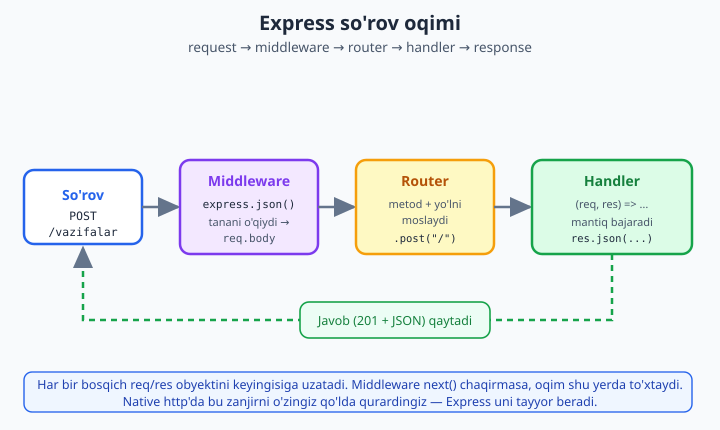
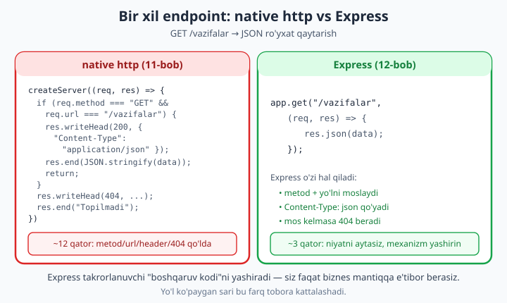

# 12 — Express asoslari

[⬅️ Oldingi: 11 — HTTP moduli: native server (sehrsiz)](./11-http-modul.md) · [🏠 README](./README.md) · [Keyingi: 13 — Middleware ➡️](./13-middleware.md)

> **Bu bobda:** 11-bobda native `http` moduli bilan server qurdik va tezda sezdik — metodni, URL'ni, so'rov tanasini, headerlarni hammasini **qo'lda** boshqarish charchatadi. Endi **Express.js** bilan tanishamiz: Node ekotizimidagi eng mashhur veb-framework. U aynan o'sha takrorlanuvchi "boshqaruv kodi"ni yashiradi va sizga toza, deklarativ marshrutlash (routing), so'rov tanasini avtomatik o'qish va qulay javob metodlarini beradi. O'rnatish (`npm install express`), minimal app, `app.get/post/put/delete`, route parametrlari (`:id`), query string, `express.json()` bilan `req.body`, `res.json/status/send/redirect`, marshrutlarni `express.Router()` bilan alohida fayllarga bo'lish, statik fayllar (`express.static`) — hammasini ko'ramiz. So'ng native `http` bilan **yonma-yon solishtiramiz** va Fastify/NestJS alternativalarini qisqa eslab o'tamiz. Real misol — **vazifalar (todo) REST API**, ishlaydigan va to'liq.

---

## Nega Express? Native `http` ning og'rig'i

11-bobda biz bitta JSON endpoint yozish uchun shunga o'xshash kod yozdik:

```js
import { createServer } from "node:http";

const server = createServer((req, res) => {
  if (req.method === "GET" && req.url === "/vazifalar") {
    res.writeHead(200, { "Content-Type": "application/json" });
    res.end(JSON.stringify([{ id: 1, matn: "test" }]));
    return;
  }
  res.writeHead(404, { "Content-Type": "application/json" });
  res.end(JSON.stringify({ xato: "Topilmadi" }));
});

server.listen(3000);
```

Bu ishlaydi. Lekin har bir yangi yo'l uchun yana bitta `if` qo'shiladi, har bir javobda `Content-Type` ni o'zingiz yozasiz, POST tanasini o'qish uchun `data`/`end` hodisalarini qo'lda yig'asiz, va `/users/:id` kabi **parametrli** yo'l uchun esa URL'ni o'zingiz bo'laklarga ajratasiz. Ilova o'sgani sari bu kod bir nechta o'nlab `if`larga aylanadi — o'qib bo'lmaydigan, xato osongina kiradigan tugunga.

**Express** shu muammoni hal qiladi. U native `http` ustiga qurilgan **yupqa qatlam** (thin layer): tagida baribir o'sha `http.createServer` ishlaydi, lekin Express sizga uchta katta qulaylikni beradi:

1. **Routing** — "GET /vazifalar bo'lsa, mana bu funksiya" deb deklarativ aytasiz; metod va URL solishtirishni Express qiladi.
2. **Body parsing** — `express.json()` middleware so'rov tanasini avtomatik o'qib `req.body` ga JS obyekt qilib qo'yadi.
3. **Qulay javob metodlari** — `res.json(obj)` headerni ham, `JSON.stringify`ni ham o'zi qiladi; `res.status(201)` zanjirlanadi.

Natijada yuqoridagi 12 qatorlik native kod Express'da uch qatorga aylanadi (buni bob oxirida yonma-yon ko'rasiz). Siz **niyatni** yozasiz, mexanizmni Express yashiradi.

Yana bir muhim narsa — Express **ulkan ekotizim**: autentifikatsiya, sessiya, fayl yuklash, shablonlar uchun minglab tayyor middleware'lar bor. "Node'da backend" deganda ko'pchilik avval Express'ni nazarda tutadi. Shuning uchun u o'rganish uchun ideal birinchi framework.

> **Eslatma:** Express — "sehr" emas. U faqat siz qiladigan ishni qisqartiradi. 11-bobni o'tganingiz uchun siz tagida nima bo'layotganini bilasiz — bu sizni "sehrga ishonadigan" emas, "mexanizmni tushunadigan" dasturchi qiladi.

---

## O'rnatish va minimal ilova

Express tashqi paket — Node bilan kelmaydi, `npm` orqali o'rnatiladi. Avval loyiha papkasini tayyorlaymiz:

```bash
mkdir vazifalar-api
cd vazifalar-api
npm init -y
npm install express
```

`npm install express` `node_modules/` ichiga Express va uning bog'liqliklarini joylaydi va `package.json` ga qo'shadi. Biz **zamonaviy ESM** (`import`/`export`) uslubidan foydalanamiz, shuning uchun `package.json` ga `"type": "module"` qo'shamiz:

```json
{
  "name": "vazifalar-api",
  "version": "1.0.0",
  "type": "module",
  "dependencies": {
    "express": "^5.1.0"
  }
}
```

> **CommonJS farqi:** agar `"type": "module"` qo'ymasangiz (eski uslub), import o'rniga `const express = require("express")` yozasiz. Bu bobda hamma joyda ESM `import express from "express"` ishlatamiz — Node 20+ va Express 5 da bu standart.

Endi eng kichik ishlaydigan server:

```js
// app.mjs
import express from "express";

const app = express();           // ilova obyektini yaratamiz

app.get("/", (req, res) => {     // GET / so'rovini tinglaymiz
  res.send("Salom, Express!");   // javob yuboramiz
});

app.listen(3000, () => {         // 3000-portda tinglashni boshlaymiz
  console.log("Server tayyor: http://localhost:3000");
});
```

Ishga tushiramiz:

```bash
node app.mjs
```

Brauzerda `http://localhost:3000` ni oching yoki boshqa terminalda tekshiring. Uch tushuncha:

- `express()` — markaziy **ilova obyekti**. Bu funksiya, lekin unda `get`, `post`, `use`, `listen` kabi metodlar bor.
- `app.get(yo'l, handler)` — "GET metodli, shu yo'lga kelgan so'rovni mana bu funksiya bilan ishla" deb ro'yxatdan o'tkazadi. `handler` — `(req, res)` qabul qiluvchi funksiya.
- `app.listen(port, callback)` — tagidagi `http` serverni ishga tushiradi. Bu native `http.Server` — Express uni o'rab beradi xolos.

### Serverni kod bilan tekshirish

Butun bob davomida biz serverni ishga tushirib, **o'sha jarayon ichida** Node 24 ning global `fetch` funksiyasi bilan so'rov yuboramiz va javobni tekshiramiz. Bu — kodni haqiqatan ishlashiga ishonch hosil qilishning eng to'g'ri yo'li:

```js
// minimal.mjs — ishga tushiring: node minimal.mjs
import express from "express";

const app = express();
app.get("/", (req, res) => {
  res.send("Salom, Express!");
});

const server = app.listen(3000, async () => {
  const r = await fetch("http://localhost:3000/");
  console.log("Status:", r.status);
  console.log("Body:", await r.text());
  server.close();                // tekshirib bo'lib serverni yopamiz
});
```

```
Status: 200
Body: Salom, Express!
```

`server.close()` serverni to'xtatadi — aks holda jarayon abadiy tinglab turaverardi. Real ilovada `close` qilmaysiz (server doim ishlasin), lekin tekshiruv skriptida bu qulay.

---

## Routing: metod va yo'l bo'yicha marshrutlash

**Routing** — "qaysi so'rov qaysi funksiyaga boradi" degan masala. Express har bir HTTP metod uchun bir xil nomli metod beradi:

```js
app.get("/vazifalar", handler);     // ro'yxatni o'qish
app.post("/vazifalar", handler);    // yangi qo'shish
app.put("/vazifalar/:id", handler); // to'liq yangilash
app.patch("/vazifalar/:id", handler); // qisman yangilash
app.delete("/vazifalar/:id", handler); // o'chirish
```

Bu nomlar bejiz emas — ular **REST** konvensiyasiga mos keladi: `GET` o'qish, `POST` yaratish, `PUT`/`PATCH` yangilash, `DELETE` o'chirish uchun. Bir xil yo'l (`/vazifalar`) turli metodlar uchun turli handlerga ega bo'lishi mumkin — Express metod **va** yo'lni birga solishtiradi.

`app.use(...)` esa maxsus — u **barcha metodlar** uchun ishlaydi va asosan middleware ulash uchun (13-bobda chuqur ko'ramiz). Hozircha bilib qo'ying: `app.use(express.json())` har bir so'rovga JSON o'qishni ulaydi.



Diagrammada ko'rinib turibdi: har bir so'rov **zanjirdan** o'tadi — avval middleware (masalan `express.json()`), so'ng router to'g'ri handlerni topadi, handler javob qaytaradi. Bu — Express'ning yadro modeli.

### Handler funksiyasi: `req` va `res`

Har bir handler ikkita asosiy obyekt oladi:

- **`req`** (request) — kiruvchi so'rov: `req.method`, `req.url`, `req.params`, `req.query`, `req.body`, `req.headers`.
- **`res`** (response) — chiquvchi javob: `res.json()`, `res.status()`, `res.send()`, `res.set()`, `res.redirect()`.

Bu obyektlar native `http` ning `req`/`res` larini **kengaytiradi** — ya'ni 11-bobda ko'rgan `res.end()` hali ham mavjud, lekin Express ustiga qulayroq metodlar qo'shadi.

---

## Route parametrlari, query va so'rov tanasi

Endi Express'ning eng ko'p ishlatiladigan uchta kirish manbasini ko'ramiz: **yo'l parametrlari**, **query string** va **so'rov tanasi**.

### Route parametrlari — `req.params`

Yo'lda `:nom` ko'rinishidagi qism — bu **parametr** (o'zgaruvchan bo'lak). Express uni ajratib `req.params` ga qo'yadi:

```js
app.get("/users/:id", (req, res) => {
  res.json({ id: req.params.id, type: typeof req.params.id });
});
```

`/users/42` so'rovi quyidagini qaytaradi:

```json
{ "id": "42", "type": "string" }
```

> **Diqqat:** `req.params.id` doim **satr** (`"42"`, raqam emas). Agar sonli taqqoslash kerak bo'lsa, `Number(req.params.id)` bilan o'giring — bu keng tarqalgan xato manbai.

### Query string — `req.query`

URL'dagi `?` dan keyingi qism — query: `/search?q=node&limit=5`. Express uni obyektga aylantirib `req.query` ga qo'yadi:

```js
app.get("/search", (req, res) => {
  res.json({ q: req.query.q, limit: req.query.limit });
});
```

`/search?q=node&limit=5` →

```json
{ "q": "node", "limit": "5" }
```

Query qiymatlari ham satr bo'ladi. Query odatda **filtrlash, sahifalash, qidiruv** uchun ishlatiladi (masalan `?bajarildi=true&sahifa=2`).

### So'rov tanasi — `express.json()` va `req.body`

POST/PUT so'rovlarida ma'lumot **tanada** (body) keladi. Native `http`da buni `data`/`end` hodisalari bilan qo'lda yig'ardik. Express'da bitta middleware shuni qiladi:

```js
app.use(express.json()); // har bir so'rov tanasini JSON deb o'qib req.body ga qo'yadi
```

Endi handlerda `req.body` tayyor:

```js
app.post("/echo", (req, res) => {
  res.status(201).json({ qabulQilindi: req.body });
});
```

Bu uchta misolni birga ishga tushirib tekshiramiz:

```js
// routing.mjs — node routing.mjs
import express from "express";

const app = express();
app.use(express.json()); // tanani o'qish uchun MUHIM

app.get("/users/:id", (req, res) => {
  res.json({ id: req.params.id, type: typeof req.params.id });
});

app.get("/search", (req, res) => {
  res.json({ q: req.query.q, limit: req.query.limit });
});

app.post("/echo", (req, res) => {
  res.status(201).json({ qabulQilindi: req.body });
});

const server = app.listen(3000, async () => {
  const base = "http://localhost:3000";

  const a = await fetch(`${base}/users/42`);
  console.log("params:", await a.json());

  const b = await fetch(`${base}/search?q=node&limit=5`);
  console.log("query:", await b.json());

  const c = await fetch(`${base}/echo`, {
    method: "POST",
    headers: { "Content-Type": "application/json" },
    body: JSON.stringify({ ism: "Oqil", yosh: 30 }),
  });
  console.log("status:", c.status, "body:", await c.json());

  server.close();
});
```

```
params: { id: '42', type: 'string' }
query: { q: 'node', limit: '5' }
status: 201 body: { qabulQilindi: { ism: 'Oqil', yosh: 30 } }
```

> **Tez-tez uchraydigan xato:** `express.json()` ni `app.use` bilan ulashni unutsangiz, `req.body` `undefined` bo'ladi va dastur "yiqiladi". POST/PUT bilan ishlasangiz — bu qatorni har doim qo'shing.

---

## `res` metodlari: javobni yuborish

`res` obyekti javobni shakllantiradi. Eng muhim metodlar:

| Metod | Vazifa |
|---|---|
| `res.json(obj)` | Obyektni JSON qilib yuboradi (`Content-Type: application/json` o'zi qo'yiladi) |
| `res.send(str)` | Matn/HTML/Buffer yuboradi |
| `res.status(kod)` | Status kodini o'rnatadi (zanjirlanadi: `res.status(201).json(...)`) |
| `res.sendStatus(kod)` | Status + shu kodning standart matnini yuboradi (`404` → "Not Found") |
| `res.set(nom, qiymat)` | Javob headerini o'rnatadi |
| `res.redirect(yo'l)` | Boshqa manzilga yo'naltiradi (302) |

Hammasi bitta serverda:

```js
// res-metodlar.mjs — node res-metodlar.mjs
import express from "express";
const app = express();

app.get("/teapot", (req, res) => {
  res.set("X-Powered-By", "Express-kitob"); // header qo'yamiz
  res.status(418).send("Men choynakman");   // status + matn
});

app.get("/yoq", (req, res) => {
  res.sendStatus(404); // "Not Found" matni avtomatik
});

app.get("/eski", (req, res) => {
  res.redirect("/yangi"); // 302 yo'naltirish
});

const server = app.listen(3000, async () => {
  const base = "http://localhost:3000";

  const d = await fetch(`${base}/teapot`);
  console.log("teapot:", d.status, d.headers.get("X-Powered-By"), await d.text());

  const e = await fetch(`${base}/yoq`);
  console.log("sendStatus:", e.status, await e.text());

  const f = await fetch(`${base}/eski`, { redirect: "manual" });
  console.log("redirect:", f.status, f.headers.get("location"));

  server.close();
});
```

```
teapot: 418 Express-kitob Men choynakman
sendStatus: 404 Not Found
redirect: 302 /yangi
```

> **`res.json` vs `res.send`:** obyekt yuborayotgan bo'lsangiz — doim `res.json()`. U `Content-Type` ni to'g'ri qo'yadi va `JSON.stringify`ni o'zi qiladi. `res.send()` ga obyekt bersangiz, Express baribir JSON qiladi, lekin niyatni aniq bildirgani uchun `res.json` afzal.

**Bir handler ikki marta javob bermasligi kerak.** `res.json(...)` dan keyin yana `res.send(...)` chaqirsangiz, Express "Cannot set headers after they are sent" xatosini beradi. Shuning uchun ko'pincha `return res.status(404).json(...)` yozamiz — `return` qolgan kodni to'xtatadi.

---

## REAL KEYS: vazifalar REST API (CRUD)

Endi nazariyani **haqiqiy, ishlaydigan REST API** ga aylantiramiz: oddiy "vazifalar ro'yxati" (todo). Ma'lumotni hozircha xotiradagi massivda saqlaymiz (baza 14-bobdan boshlanadi). API to'rtta amalni qo'llaydi:

| Metod + yo'l | Vazifa |
|---|---|
| `GET /vazifalar` | Hammasini qaytaradi |
| `GET /vazifalar/:id` | Bittasini qaytaradi |
| `POST /vazifalar` | Yangi qo'shadi |
| `PUT /vazifalar/:id` | Mavjudini yangilaydi |
| `DELETE /vazifalar/:id` | O'chiradi |

Avval hammasini bitta faylga yozsa ham bo'lardi, lekin **marshrutlarni alohida modulga ajratish** — professional odat. Buni `express.Router()` bilan qilamiz.

### `express.Router()` — marshrutlarni modulga bo'lish

`Router` — "mini-ilova": uning ham `get`/`post`/`put`/`delete` metodlari bor, lekin u `app` emas, **alohida marshrut to'plami**. Uni alohida faylda yaratib, `app` ga ulaymiz. Bu kodni toza, modulli va sinov qilish oson saqlaydi.

`vazifalar.router.mjs` — faqat vazifalar marshrutlari:

```js
// vazifalar.router.mjs
import { Router } from "express";

export const vazifalarRouter = Router();

// In-memory "ma'lumotlar bazasi" (vaqtinchalik massiv)
let vazifalar = [
  { id: 1, matn: "Express o'rganish", bajarildi: false },
  { id: 2, matn: "REST API yozish", bajarildi: false },
];
let keyingiId = 3;

// GET /vazifalar -> hammasi
vazifalarRouter.get("/", (req, res) => {
  res.json(vazifalar);
});

// GET /vazifalar/:id -> bittasi
vazifalarRouter.get("/:id", (req, res) => {
  const id = Number(req.params.id);
  const v = vazifalar.find((x) => x.id === id);
  if (!v) return res.status(404).json({ xato: "Vazifa topilmadi" });
  res.json(v);
});

// POST /vazifalar -> yangi qo'shish
vazifalarRouter.post("/", (req, res) => {
  const { matn } = req.body ?? {};
  if (!matn || typeof matn !== "string") {
    return res.status(400).json({ xato: "matn (string) majburiy" });
  }
  const yangi = { id: keyingiId++, matn, bajarildi: false };
  vazifalar.push(yangi);
  res.status(201).json(yangi);
});

// PUT /vazifalar/:id -> yangilash
vazifalarRouter.put("/:id", (req, res) => {
  const id = Number(req.params.id);
  const v = vazifalar.find((x) => x.id === id);
  if (!v) return res.status(404).json({ xato: "Vazifa topilmadi" });
  if (typeof req.body.matn === "string") v.matn = req.body.matn;
  if (typeof req.body.bajarildi === "boolean") v.bajarildi = req.body.bajarildi;
  res.json(v);
});

// DELETE /vazifalar/:id -> o'chirish
vazifalarRouter.delete("/:id", (req, res) => {
  const id = Number(req.params.id);
  const bormi = vazifalar.some((x) => x.id === id);
  if (!bormi) return res.status(404).json({ xato: "Vazifa topilmadi" });
  vazifalar = vazifalar.filter((x) => x.id !== id);
  res.sendStatus(204); // No Content
});
```

E'tibor bering: router ichida yo'llar `"/"` va `"/:id"` — ya'ni **`/vazifalar` prefiksisiz**. Prefiksni `app` ulaganda beramiz. Bu router'ni qayta ishlatishni osonlashtiradi.

`server.mjs` — `app` yaratadi va router'ni ulaydi:

```js
// server.mjs
import express from "express";
import { vazifalarRouter } from "./vazifalar.router.mjs";

const app = express();
app.use(express.json());            // tanani o'qish
app.use(express.static("public"));  // statik fayllar (keyinroq tushuntiramiz)

app.use("/vazifalar", vazifalarRouter); // /vazifalar/* -> router'ga

app.get("/", (req, res) => res.send("Vazifalar API ishlayapti"));

app.listen(3000, () => {
  console.log("Server: http://localhost:3000");
});
```

`app.use("/vazifalar", vazifalarRouter)` — sehrli qator: "`/vazifalar` bilan boshlanadigan har bir so'rovni shu router'ga uzat". Shuning uchun router ichidagi `"/"` aslida `/vazifalar`, `"/:id"` esa `/vazifalar/:id` bo'ladi.

### To'liq sinov: barcha CRUD amallari

Quyida butun API ni `fetch` bilan boshidan oxirigacha sinaymiz — bu kod **haqiqatan ishlaydi** (Node 24 + Express 5 da tekshirilgan):

```js
// sinov.mjs — server.mjs dagi app ni eksport qilib, fetch bilan sinaymiz
import express from "express";
import { vazifalarRouter } from "./vazifalar.router.mjs";

const app = express();
app.use(express.json());
app.use("/vazifalar", vazifalarRouter);

const server = app.listen(3000, async () => {
  const base = "http://localhost:3000/vazifalar";

  console.log("GET hammasi:", await (await fetch(base)).json());

  const yangi = await fetch(base, {
    method: "POST",
    headers: { "Content-Type": "application/json" },
    body: JSON.stringify({ matn: "Mashqlarni yechish" }),
  });
  const qoshilgan = await yangi.json();
  console.log("POST yangi:", yangi.status, qoshilgan);

  const put = await fetch(`${base}/${qoshilgan.id}`, {
    method: "PUT",
    headers: { "Content-Type": "application/json" },
    body: JSON.stringify({ bajarildi: true }),
  });
  console.log("PUT:", put.status, await put.json());

  const yoq = await fetch(`${base}/999`);
  console.log("GET /999:", yoq.status, await yoq.json());

  const del = await fetch(`${base}/2`, { method: "DELETE" });
  console.log("DELETE /2 status:", del.status);

  console.log("Oxirgi ro'yxat:", await (await fetch(base)).json());

  const xato = await fetch(base, {
    method: "POST",
    headers: { "Content-Type": "application/json" },
    body: JSON.stringify({ notogri: 1 }),
  });
  console.log("POST validatsiya:", xato.status, await xato.json());

  server.close();
});
```

Natija:

```
GET hammasi: [
  { id: 1, matn: "Express o'rganish", bajarildi: false },
  { id: 2, matn: 'REST API yozish', bajarildi: false }
]
POST yangi: 201 { id: 3, matn: 'Mashqlarni yechish', bajarildi: false }
PUT: 200 { id: 3, matn: 'Mashqlarni yechish', bajarildi: true }
GET /999: 404 { xato: 'Vazifa topilmadi' }
DELETE /2 status: 204
Oxirgi ro'yxat: [
  { id: 1, matn: "Express o'rganish", bajarildi: false },
  { id: 3, matn: 'Mashqlarni yechish', bajarildi: true }
]
POST validatsiya: 400 { xato: 'matn (string) majburiy' }
```

Bu — to'liq, professional kichik REST API. E'tibor bering:

- **To'g'ri status kodlar:** yaratishda `201`, o'chirishda `204` (tana yo'q), topilmaganda `404`, noto'g'ri kiritishda `400`.
- **Validatsiya:** `matn` bo'lmasa `400` qaytaramiz, dastur yiqilmaydi.
- **Modullilik:** marshrutlar `app` dan alohida faylda — `server.mjs` ni o'qigan odam darhol "API tarkibi" ni ko'radi.

---

## Statik fayllar — `express.static`

Veb-ilovalar ko'pincha rasm, CSS, JS, HTML kabi **statik fayllar**ni ham berishi kerak. Buni `express.static` bitta qator bilan hal qiladi:

```js
app.use(express.static("public"));
```

Bu "loyihaning `public/` papkasidagi fayllarni bevosita ber" degani. Agar `public/index.html` bo'lsa, `http://localhost:3000/index.html` (yoki `/`) uni qaytaradi; `public/logo.png` → `/logo.png`. Express fayl turini aniqlab to'g'ri `Content-Type` ni o'zi qo'yadi.

Native `http`da buni o'zingiz qilardingiz: URL'dan fayl yo'lini hisoblash, faylni o'qish, MIME turini topish, fayl yo'qligini tekshirish. `express.static` shuning hammasini bajaradi — bu Express'ning qulayligiga yaqqol misol.

> **Maslahat:** statik fayllar API marshrutlari bilan to'qnashmasligi uchun ularni odatda `/public` yoki `/static` prefiks ostiga qo'yish mumkin: `app.use("/static", express.static("public"))`.

---

## Native `http` bilan solishtirish

Endi 11-bob va 12-bobni yonma-yon qo'yamiz. Maqsad bir xil: `GET /vazifalar` so'roviga JSON ro'yxat qaytarish.



**Native `http`:**

```js
import { createServer } from "node:http";

const data = [{ id: 1, matn: "test" }];

const server = createServer((req, res) => {
  if (req.method === "GET" && req.url === "/vazifalar") {
    res.writeHead(200, { "Content-Type": "application/json" });
    res.end(JSON.stringify(data));
    return;
  }
  res.writeHead(404, { "Content-Type": "application/json" });
  res.end(JSON.stringify({ xato: "Topilmadi" }));
});

server.listen(3000);
```

**Express:**

```js
import express from "express";
const app = express();
const data = [{ id: 1, matn: "test" }];

app.get("/vazifalar", (req, res) => {
  res.json(data);
});

app.listen(3000);
```

Express versiyasida siz **metodni va URL'ni tekshirmaysiz** (`app.get` o'zi qiladi), **`Content-Type` qo'ymaysiz** (`res.json` o'zi qo'yadi), **`JSON.stringify` qilmaysiz** (`res.json` o'zi qiladi), va **mos kelmaganda 404** — Express o'zi qaytaradi. Bitta endpoint uchun farq kichik ko'rinishi mumkin, lekin 20-30 ta endpoint, parametrlar, body parsing, xatoliklarni boshqarish qo'shilganda Express sizni yuzlab qator takror kod yozishdan qutqaradi.

Lekin tushunib qoling: **Express native `http`ni o'chirmaydi, balki o'rab beradi.** `app.listen` tagida `http.createServer` chaqiriladi. 11-bobni o'tganingiz uchun Express "sehr" emas, balki **siz qiladigan ishni avtomatlashtirilgan** ekanini bilasiz — bu sizni har qanday muammoni hal qila oladigan dasturchi qiladi.

---

## Alternativalar: Fastify va NestJS (qisqacha)

Express — eng mashhuri, lekin yagonasi emas. Qachon boshqasini o'ylash kerakligini bilib qo'ying:

- **Fastify** — Express'ga juda o'xshash, lekin **tezroq** (yuqori ishlash) va **sxema-asoslangan validatsiya**ni tabiiy qo'llaydi (JSON Schema bilan so'rov/javobni tekshirish). Agar yuqori yuklamali API yozsangiz yoki validatsiya muhim bo'lsa — Fastify yaxshi tanlov. API'si Express'ga yaqin, shuning uchun ko'chish oson.

- **NestJS** — bu **to'liq freymvork** (Angular ruhida): TypeScript, dekoratorlar (`@Controller`, `@Get`), dependency injection, modullar tizimi. U katta, ko'p odamlik, uzoq muddatli **korporativ** loyihalar uchun tuzilma beradi. Tagida odatda Express (yoki Fastify) ishlaydi. Boshlang'ich loyiha uchun ortiqcha — lekin loyiha o'sganda struktura zarur bo'lsa, NestJS qutqaradi.

**Tavsiya:** o'rganish va aksariyat loyihalar uchun Express'dan boshlang. U eng katta ekotizimga, eng ko'p o'quv materialiga ega. Fastify/NestJS — keyinchalik, aniq ehtiyoj paydo bo'lganda. Express'da o'rgangan tushunchalar (routing, middleware, req/res) ikkalasiga ham deyarli to'g'ridan-to'g'ri ko'chadi.

---

## Mashqlar

### Oson

1. Express ilovasi yarating: `GET /salom` so'roviga `{ "xabar": "Assalomu alaykum" }` JSON qaytarsin. `res.json` ishlating va `fetch` bilan tekshiring.

2. `GET /yor/:ism` marshrutini yozing — `/yor/Oqil` so'roviga matn sifatida `"Salom, Oqil!"` qaytarsin (`req.params.ism` dan foydalaning).

3. `GET /qoshish?a=5&b=3` marshrutini yozing — `req.query` dan `a` va `b` ni olib, yig'indisini JSON qaytarsin. Eslang: query qiymatlari satr, `Number()` kerak.

### O'rta

4. `POST /salomlash` marshrutini yozing: tanada `{ "ism": "..." }` keladi, javobda `{ "xabar": "Salom, <ism>!" }` qaytsin. `express.json()` ni ulashni unutmang. Agar `ism` bo'lmasa, `400` va xato xabarini qaytaring.

5. `vazifalar` API'ga query bilan **filtrlash** qo'shing: `GET /vazifalar?bajarildi=true` faqat bajarilgan vazifalarni qaytarsin. Query bo'lmasa — hammasini. (Eslatma: `req.query.bajarildi` satr `"true"` bo'ladi.)

6. `vazifalar.router.mjs` ni alohida fayl qilib `server.mjs` ga ulang, so'ng yana bitta router — `salom.router.mjs` (faqat `GET /` → matn) yarating va uni `app.use("/salom", salomRouter)` bilan ulang. Ikkita mustaqil router bir ilovada ishlashini ko'rsating.

### Qiyin

7. To'liq **vazifalar REST API** yozing (xotirada massiv): `GET /vazifalar`, `GET /vazifalar/:id`, `POST /vazifalar`, `PUT /vazifalar/:id`, `DELETE /vazifalar/:id`. To'g'ri status kodlardan foydalaning (`201` yaratishda, `204` o'chirishda, `404` topilmaganda, `400` noto'g'ri kiritishda), marshrutlarni `express.Router()` bilan alohida faylga ajrating, va butun API'ni `fetch` bilan boshdan-oxir sinab natijani konsolga chiqaring.

8. `app.route("/element/:id")` zanjiri bilan bir yo'lga `.get()` va `.delete()` ni biriktiring. So'ng kichik **so'rovchi-sanagich** middleware yozing (`app.use((req, res, next) => {...})`) — u har so'rovda `req.metod` va `req.url` ni konsolga chiqarsin, keyin `next()` chaqirsin. Middleware barcha marshrutlardan oldin ishlashini tekshiring.

<details markdown="1"><summary>Yechim — 1</summary>

```js
import express from "express";
const app = express();

app.get("/salom", (req, res) => {
  res.json({ xabar: "Assalomu alaykum" });
});

const server = app.listen(3000, async () => {
  const r = await fetch("http://localhost:3000/salom");
  console.log(r.status, await r.json());
  server.close();
});
```

```
200 { xabar: 'Assalomu alaykum' }
```
</details>

<details markdown="1"><summary>Yechim — 2</summary>

```js
import express from "express";
const app = express();

app.get("/yor/:ism", (req, res) => {
  res.send(`Salom, ${req.params.ism}!`);
});

const server = app.listen(3000, async () => {
  const r = await fetch("http://localhost:3000/yor/Oqil");
  console.log(await r.text());
  server.close();
});
```

```
Salom, Oqil!
```

`req.params.ism` — yo'ldagi `:ism` o'rniga kelgan qism.
</details>

<details markdown="1"><summary>Yechim — 3</summary>

```js
import express from "express";
const app = express();

app.get("/qoshish", (req, res) => {
  const a = Number(req.query.a);
  const b = Number(req.query.b);
  res.json({ a, b, yigindi: a + b });
});

const server = app.listen(3000, async () => {
  const r = await fetch("http://localhost:3000/qoshish?a=5&b=3");
  console.log(await r.json());
  server.close();
});
```

```
{ a: 5, b: 3, yigindi: 8 }
```

`Number()` siz `"5" + "3"` "53" satriga aylanardi — bu keng xato.
</details>

<details markdown="1"><summary>Yechim — 4</summary>

```js
import express from "express";
const app = express();
app.use(express.json()); // tanani o'qish uchun MUHIM

app.post("/salomlash", (req, res) => {
  const { ism } = req.body ?? {};
  if (!ism) {
    return res.status(400).json({ xato: "ism majburiy" });
  }
  res.json({ xabar: `Salom, ${ism}!` });
});

const server = app.listen(3000, async () => {
  const ok = await fetch("http://localhost:3000/salomlash", {
    method: "POST",
    headers: { "Content-Type": "application/json" },
    body: JSON.stringify({ ism: "Laylo" }),
  });
  console.log("ok:", ok.status, await ok.json());

  const yomon = await fetch("http://localhost:3000/salomlash", {
    method: "POST",
    headers: { "Content-Type": "application/json" },
    body: JSON.stringify({}),
  });
  console.log("xato:", yomon.status, await yomon.json());

  server.close();
});
```

```
ok: 200 { xabar: 'Salom, Laylo!' }
xato: 400 { xato: 'ism majburiy' }
```

`req.body ?? {}` — agar `express.json()` ulanmagan yoki tana bo'sh bo'lsa ham "yiqilmaslik" uchun.
</details>

<details markdown="1"><summary>Yechim — 5</summary>

```js
import express from "express";
const app = express();
app.use(express.json());

let vazifalar = [
  { id: 1, matn: "a", bajarildi: true },
  { id: 2, matn: "b", bajarildi: false },
  { id: 3, matn: "c", bajarildi: true },
];

app.get("/vazifalar", (req, res) => {
  let natija = vazifalar;
  if (req.query.bajarildi !== undefined) {
    const want = req.query.bajarildi === "true"; // satrni boolean'ga
    natija = vazifalar.filter((v) => v.bajarildi === want);
  }
  res.json(natija);
});

const server = app.listen(3000, async () => {
  const f = await fetch("http://localhost:3000/vazifalar?bajarildi=true");
  console.log("filtr:", await f.json());

  const hammasi = await fetch("http://localhost:3000/vazifalar");
  console.log("soni:", (await hammasi.json()).length);

  server.close();
});
```

```
filtr: [
  { id: 1, matn: 'a', bajarildi: true },
  { id: 3, matn: 'c', bajarildi: true }
]
soni: 3
```

Asosiy nuqta: query qiymati satr, shuning uchun `=== "true"` bilan boolean'ga aylantiramiz. `!== undefined` tekshiruvi query umuman berilmaganini ajratadi.
</details>

<details markdown="1"><summary>Yechim — 6</summary>

`salom.router.mjs`:

```js
import { Router } from "express";
export const salomRouter = Router();
salomRouter.get("/", (req, res) => res.send("Salom router'dan!"));
```

`vazifalar.router.mjs`:

```js
import { Router } from "express";
export const vazifalarRouter = Router();
const vazifalar = [{ id: 1, matn: "test" }];
vazifalarRouter.get("/", (req, res) => res.json(vazifalar));
```

`server.mjs`:

```js
import express from "express";
import { salomRouter } from "./salom.router.mjs";
import { vazifalarRouter } from "./vazifalar.router.mjs";

const app = express();
app.use("/salom", salomRouter);
app.use("/vazifalar", vazifalarRouter);

const server = app.listen(3000, async () => {
  console.log("salom:", await (await fetch("http://localhost:3000/salom")).text());
  console.log("vazifalar:", await (await fetch("http://localhost:3000/vazifalar")).json());
  server.close();
});
```

```
salom: Salom router'dan!
vazifalar: [ { id: 1, matn: 'test' } ]
```

Har bir router o'z prefiksi ostida mustaqil ishlaydi. Bu — katta ilovalarni boshqarish usuli: har bir resurs (`/foydalanuvchilar`, `/buyurtmalar`, ...) o'z fayliga.
</details>

<details markdown="1"><summary>Yechim — 7</summary>

`vazifalar.router.mjs` (modul):

```js
import { Router } from "express";
export const vazifalarRouter = Router();

let vazifalar = [
  { id: 1, matn: "Express o'rganish", bajarildi: false },
  { id: 2, matn: "REST API yozish", bajarildi: false },
];
let keyingiId = 3;

vazifalarRouter.get("/", (req, res) => res.json(vazifalar));

vazifalarRouter.get("/:id", (req, res) => {
  const id = Number(req.params.id);
  const v = vazifalar.find((x) => x.id === id);
  if (!v) return res.status(404).json({ xato: "Topilmadi" });
  res.json(v);
});

vazifalarRouter.post("/", (req, res) => {
  const { matn } = req.body ?? {};
  if (!matn || typeof matn !== "string") {
    return res.status(400).json({ xato: "matn (string) majburiy" });
  }
  const yangi = { id: keyingiId++, matn, bajarildi: false };
  vazifalar.push(yangi);
  res.status(201).json(yangi);
});

vazifalarRouter.put("/:id", (req, res) => {
  const id = Number(req.params.id);
  const v = vazifalar.find((x) => x.id === id);
  if (!v) return res.status(404).json({ xato: "Topilmadi" });
  if (typeof req.body.matn === "string") v.matn = req.body.matn;
  if (typeof req.body.bajarildi === "boolean") v.bajarildi = req.body.bajarildi;
  res.json(v);
});

vazifalarRouter.delete("/:id", (req, res) => {
  const id = Number(req.params.id);
  if (!vazifalar.some((x) => x.id === id)) {
    return res.status(404).json({ xato: "Topilmadi" });
  }
  vazifalar = vazifalar.filter((x) => x.id !== id);
  res.sendStatus(204);
});
```

`server.mjs` (sinov bilan):

```js
import express from "express";
import { vazifalarRouter } from "./vazifalar.router.mjs";

const app = express();
app.use(express.json());
app.use("/vazifalar", vazifalarRouter);

const server = app.listen(3000, async () => {
  const base = "http://localhost:3000/vazifalar";

  const yangi = await fetch(base, {
    method: "POST",
    headers: { "Content-Type": "application/json" },
    body: JSON.stringify({ matn: "Yangi ish" }),
  });
  const q = await yangi.json();
  console.log("POST:", yangi.status, q);

  const put = await fetch(`${base}/${q.id}`, {
    method: "PUT",
    headers: { "Content-Type": "application/json" },
    body: JSON.stringify({ bajarildi: true }),
  });
  console.log("PUT:", put.status, await put.json());

  const del = await fetch(`${base}/1`, { method: "DELETE" });
  console.log("DELETE status:", del.status);

  const yoq = await fetch(`${base}/999`);
  console.log("404:", yoq.status, await yoq.json());

  console.log("Oxiri:", await (await fetch(base)).json());
  server.close();
});
```

```
POST: 201 { id: 3, matn: 'Yangi ish', bajarildi: false }
PUT: 200 { id: 3, matn: 'Yangi ish', bajarildi: true }
DELETE status: 204
404: 404 { xato: 'Topilmadi' }
Oxiri: [
  { id: 2, matn: 'REST API yozish', bajarildi: false },
  { id: 3, matn: 'Yangi ish', bajarildi: true }
]
```

Diqqat qiling: har bir "topilmadi" holatida `return res.status(404)...` — `return` qolgan handlerni to'xtatadi, aks holda ikki marta javob yuborishga urinib, dastur xato berardi. Status kodlar REST konvensiyasiga mos: yaratish `201`, o'chirish `204` (tanasiz), validatsiya `400`, topilmaslik `404`.
</details>

<details markdown="1"><summary>Yechim — 8</summary>

```js
import express from "express";
const app = express();

// 1) so'rovchi-sanagich middleware — BARCHA marshrutdan oldin
app.use((req, res, next) => {
  console.log(`[log] ${req.method} ${req.url}`);
  next(); // next() chaqirilmasa, oqim shu yerda to'xtaydi!
});

// 2) app.route bilan bir yo'lga ko'p metod
app
  .route("/element/:id")
  .get((req, res) => res.json({ olindi: req.params.id }))
  .delete((req, res) => res.sendStatus(204));

const server = app.listen(3000, async () => {
  const g = await fetch("http://localhost:3000/element/9");
  console.log("get:", await g.json());

  const d = await fetch("http://localhost:3000/element/9", { method: "DELETE" });
  console.log("delete status:", d.status);

  server.close();
});
```

```
[log] GET /element/9
get: { olindi: '9' }
[log] DELETE /element/9
delete status: 204
```

Ikki tushuncha: **`app.route("/yo'l")`** bir yo'lga turli metodlarni zanjir qilib biriktiradi — yo'lni takror yozmaysiz. **Middleware** (`app.use(fn)`) har bir so'rovda, marshrutdan **oldin** ishlaydi; `next()` chaqirib navbatni keyingisiga uzatadi. Agar `next()` ni unutsangiz, so'rov "osilib" qoladi — bu 13-bobning asosiy mavzusi.
</details>

---

[⬅️ Oldingi: 11 — HTTP moduli: native server (sehrsiz)](./11-http-modul.md) · [🏠 README](./README.md) · [Keyingi: 13 — Middleware ➡️](./13-middleware.md)
