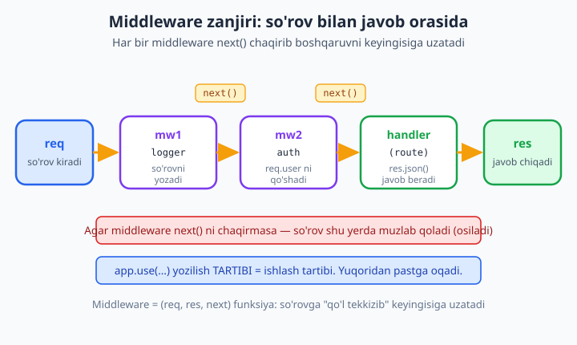
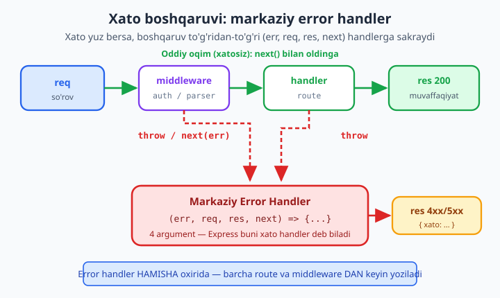

# 13 — Middleware

[⬅️ Oldingi: 12 — Express asoslari](./12-express-asoslari.md) · [🏠 README](./README.md) · [Keyingi: 14 — REST API qurish ➡️](./14-rest-api.md)

> **Bu bobda:** Express'ning **yuragi** — middleware bilan tanishamiz. Middleware nima ekanini ((req, res, next) funksiya, so'rov bilan javob **orasida** ishlaydi), `next()` ning hayotiy ahamiyatini (chaqirmasangiz so'rov muzlab qoladi), middleware **zanjiri** va `app.use` tartibining muhimligini ko'ramiz. Beshta turini — application-level, router-level, built-in (`express.json`, `express.urlencoded`, `express.static`), uchinchi-tomon (`morgan`, `cors`, `helmet`) va route-specific — o'rganamiz. So'ng `req` obyektiga ma'lumot qo'shishni (`req.user`), 4 argumentli **error-handling middleware** ni, **async** xatolarni (Express 5 avtomatik tutadi), va **404** middleware ni amaliyotda yozamiz. REAL KEYS: bitta loyihada so'rovni loglovchi, "API kalit" tekshiruvchi auth va markaziy error handler middleware larini birlashtirib, haqiqiy serverni `fetch` bilan sinab ko'ramiz. Hamma kod Node 24.12 + Express 5.2 da ishga tushirib tasdiqlangan.

---

## Middleware nima?

Oldingi bobda Express bilan birinchi serverni yozdik: `app.get("/", (req, res) => ...)`. Lekin haqiqiy ilovada so'rov route handler'ga **yetib borguncha** bir nechta ish bajariladi: so'rov loglanadi, foydalanuvchi tekshiriladi (kim bu?), JSON tanasi o'qiladi, ruxsat baholanadi. Bularning hammasi — **middleware**.

Middleware — bu **so'rov** (`req`) bilan **javob** (`res`) **orasida** turadigan funksiya. U konveyer lentasidagi ishchi kabi: so'rov o'tib ketayotganda unga "qo'l tekkizadi" — loglaydi, tekshiradi, ma'lumot qo'shadi — keyin keyingisiga uzatadi. Bitta so'rov bir nechta middleware orqali ketma-ket o'tib, oxirida route handler'ga (yoki javobga) yetadi.



Middleware funksiyasining shakli **doimo bir xil** — uchta argument:

```js
function middleware(req, res, next) {
  // 1) req yoki res bilan biror ish qilamiz
  // 2) keyin: next() chaqirib boshqaruvni keyingisiga uzatamiz
  //    YOKI: res.send()/res.json() bilan javob berib zanjirni to'xtatamiz
}
```

- `req` — kelgan so'rov (URL, header, tana, ...).
- `res` — yuboriladigan javob (`res.send`, `res.json`, `res.status`).
- `next` — **funksiya**: uni chaqirsangiz, Express keyingi middleware'ga o'tadi.

Aslida `app.get(...)` ichidagi route handler ham middleware'ning bir turi — shunchaki zanjirning **oxirgisi**, odatda javob beradigan qismi. Express'da deyarli hamma narsa middleware: shuning uchun "middleware — Express'ning yuragi" deyiladi.

---

## `next()` — zanjirning yoqilg'isi

`next()` — middleware'dagi eng muhim chiziq. U Express'ga: "men ishimni tugatdim, **keyingisiga** o't" deydi. Agar uni chaqirmasangiz va javob ham bermasangiz, so'rov **abadiy osilib** (muzlab) qoladi — brauzer aylanaverib, oxiri timeout bo'ladi.

Buni amalda ko'raylik. Quyidagi middleware `next()` ni chaqirmaydi:

```js
import express from "express";

const app = express();

// ❌ next() chaqirilmagan — so'rov shu yerda muzlab qoladi
app.use("/osilgan", (req, res, next) => {
  console.log("MW: keldim, lekin next() ni chaqirmayman...");
  // next() YO'Q — boshqaruv hech qayoqqa ketmaydi
});
app.get("/osilgan", (req, res) => res.send("bu yerga yetib kelmaydi"));

const server = app.listen(3000, async () => {
  // 600ms kutib, javob kelmasligini tekshiramiz
  const ctrl = new AbortController();
  setTimeout(() => ctrl.abort(), 600);
  try {
    await fetch("http://localhost:3000/osilgan", { signal: ctrl.signal });
    console.log("javob keldi (kutilmagan!)");
  } catch {
    console.log("javob KELMADI — so'rov osildi (kutilgan natija)");
  }
  server.close();
});
```

Ishga tushiring (`node fayl.mjs`) — chiqish:

```
MW: keldim, lekin next() ni chaqirmayman...
javob KELMADI — so'rov osildi (kutilgan natija)
```

Shunday qilib **uchta yo'l** bor, middleware ulardan **bittasini** tanlashi shart:

1. `next()` — boshqaruvni keyingi middleware'ga uzatish.
2. `res.send()` / `res.json()` / `res.end()` — javob berib zanjirni **to'xtatish** (keyingilarga o'tmaslik).
3. `next(err)` — **xato** bilan to'xtatish (pastda, error handler bo'limida ko'ramiz).

📌 Eslab qoling: javob bermay turib `next()` ni ham chaqirmaslik — eng ko'p uchraydigan boshlang'ich xato. So'rov "osilsa", birinchi navbatda yo'qolgan `next()` ni qidiring.

---

## Zanjir va tartib: `app.use` ketma-ketligi muhim

Express middleware'larni siz **yozgan tartibda**, yuqoridan pastga ishga tushiradi. Ya'ni `app.use(...)` qatorlarining joylashuvi — bu dasturning **mantiqi**, shunchaki bezak emas.

```js
import express from "express";

const app = express();

app.use((req, res, next) => {
  console.log("1-middleware");
  next();
});

app.use((req, res, next) => {
  console.log("2-middleware");
  next();
});

app.get("/", (req, res) => {
  console.log("3-handler");
  res.send("Tayyor");
});

const server = app.listen(3000, async () => {
  await fetch("http://localhost:3000/");
  server.close();
});
```

Chiqish **aynan shu tartibda**:

```
1-middleware
2-middleware
3-handler
```

Agar 2-middleware'ni 1-dan oldinga ko'chirsangiz, tartib o'zgaradi. Bu nazariy emas — amaliy oqibati bor. Masalan, **auth** middleware'ni route'lardan **oldin** qo'yish kerak (aks holda himoyalanmagan route ochilib qoladi); JSON parser'ni tana o'qiydigan route'lardan **oldin** qo'yish kerak (aks holda `req.body` bo'sh bo'ladi). Tartib = mantiq.

---

## Middleware turlari

Express'da middleware'ning beshta asosiy turi bor. Hammasi bir xil `(req, res, next)` shaklida, faqat **qayerga** va **qanday** ulanishi farq qiladi.

### 1. Application-level (`app.use`)

Eng keng tarqalgan. `app.use(fn)` bilan **hamma** so'rovga, yoki `app.use("/yol", fn)` bilan faqat ma'lum yo'l ostidagi so'rovlarga ulanadi.

```js
// Hamma so'rovga
app.use((req, res, next) => { /* ... */ next(); });

// Faqat /admin bilan boshlanadigan yo'llarga
app.use("/admin", (req, res, next) => { /* ... */ next(); });
```

### 2. Router-level

`express.Router()` — bu mini-Express. Unga ham xuddi `app` kabi middleware va route ulash mumkin, keyin uni butunligicha biror prefiksga bog'laysiz. Katta ilovani modullarga bo'lishda asosiy vosita (14-bobda chuqurroq).

```js
import express from "express";

const app = express();

const adminRouter = express.Router();

// Bu middleware faqat adminRouter ichidagi route'larga ta'sir qiladi
adminRouter.use((req, res, next) => {
  console.log("[admin router] faqat /admin/* uchun ishlaydi");
  next();
});
adminRouter.get("/panel", (req, res) => res.json({ sahifa: "admin panel" }));

app.use("/admin", adminRouter); // butun routerni /admin ga uladik

const server = app.listen(3000, async () => {
  const r = await fetch("http://localhost:3000/admin/panel");
  console.log(r.status, await r.json());
  server.close();
});
```

Chiqish:

```
[admin router] faqat /admin/* uchun ishlaydi
200 { sahifa: 'admin panel' }
```

### 3. Built-in (Express ichidagi)

Express'ning o'zida tayyor keladigan, eng ko'p ishlatiladigan uchtasi:

- **`express.json()`** — kelgan so'rov tanasidagi JSON ni o'qib `req.body` ga obyekt sifatida qo'yadi.
- **`express.urlencoded({ extended: true })`** — HTML forma (`application/x-www-form-urlencoded`) ma'lumotini `req.body` ga o'qiydi.
- **`express.static(papka)`** — papkadagi fayllarni (HTML, rasm, CSS) to'g'ridan-to'g'ri tarqatadi.

```js
import express from "express";
import { mkdir, writeFile, rm } from "node:fs/promises";
import { join } from "node:path";
import { tmpdir } from "node:os";

// Statik fayl uchun vaqtinchalik papka tayyorlaymiz
const papka = join(tmpdir(), "mw-static-" + Date.now());
await mkdir(papka, { recursive: true });
await writeFile(join(papka, "salom.txt"), "Bu statik fayl!");

const app = express();
app.use(express.static(papka));            // fayllarni tarqatadi
app.use(express.urlencoded({ extended: true })); // forma tanasini o'qiydi

app.post("/forma", (req, res) => {
  res.json({ qabul: req.body }); // forma ma'lumoti req.body da
});

const server = app.listen(3000, async () => {
  const baza = "http://localhost:3000";

  // statik faylni so'raymiz
  const r1 = await fetch(baza + "/salom.txt");
  console.log("static:", r1.status, await r1.text());

  // forma yuboramiz
  const r2 = await fetch(baza + "/forma", {
    method: "POST",
    headers: { "content-type": "application/x-www-form-urlencoded" },
    body: "ism=Oqil&yosh=25",
  });
  console.log("forma:", r2.status, await r2.json());

  await rm(papka, { recursive: true, force: true });
  server.close();
});
```

Chiqish:

```
static: 200 Bu statik fayl!
forma: 200 { qabul: { ism: 'Oqil', yosh: '25' } }
```

📌 `express.json()` yozmasangiz, `req.body` `undefined` bo'ladi — JSON so'rovlarda eng ko'p uchraydigan "nega body bo'sh?" muammosi shundan.

### 4. Uchinchi-tomon (npm paketlari)

`npm install` qilib qo'shiladigan tayyor middleware'lar. Eng mashhur uchtasi:

- **`morgan`** — har so'rovni avtomatik loglaydi (`GET /admin 200 24 - 2.8 ms`).
- **`cors`** — boshqa domendan (masalan frontend'dan) so'rov yuborishga ruxsat beruvchi CORS header'larini qo'yadi.
- **`helmet`** — bir nechta xavfsizlik header'ini (XSS, sniffing himoyasi va h.k.) avtomatik o'rnatadi.

```bash
npm install express morgan cors helmet
```

```js
import express from "express";
import morgan from "morgan";
import cors from "cors";
import helmet from "helmet";

const app = express();

app.use(helmet());        // xavfsizlik header'lari
app.use(cors());          // CORS ruxsati
app.use(morgan("tiny"));  // so'rov logi

app.get("/", (req, res) => res.json({ ok: true }));

const server = app.listen(3000, async () => {
  const r = await fetch("http://localhost:3000/");
  console.log("CORS header bormi:", r.headers.has("access-control-allow-origin"));
  console.log("Helmet (x-content-type-options):", r.headers.get("x-content-type-options"));
  server.close();
});
```

Chiqish:

```
GET / 200 11 - 1.234 ms
CORS header bormi: true
Helmet (x-content-type-options): nosniff
```

`morgan` so'rovni o'zi yozdi, `cors` va `helmet` esa javobga header qo'shdi — siz bironta qator yozmadingiz. Tayyor middleware'larning kuchi shunda.

### 5. Route-specific (bir nechta handler)

Bitta route'ga `app.get(yol, mw1, mw2, handler)` ko'rinishida **bir nechta** funksiya ulash mumkin. Ular ham zanjir bo'lib, ketma-ket ishlaydi. Bu — faqat shu route'ga tegishli tekshiruv qo'shishning toza usuli.

```js
import express from "express";

const app = express();

function tekshir1(req, res, next) { req.bosqich = "1"; next(); }
function tekshir2(req, res, next) { req.bosqich += "-2"; next(); }

// Uchta funksiya ketma-ket: tekshir1 -> tekshir2 -> handler
app.get("/zanjir", tekshir1, tekshir2, (req, res) => {
  res.json({ bosqich: req.bosqich });
});

const server = app.listen(3000, async () => {
  const r = await fetch("http://localhost:3000/zanjir");
  console.log(await r.json());  // { bosqich: '1-2' }
  server.close();
});
```

`tekshir1` `req.bosqich` ni o'rnatdi, `tekshir2` unga qo'shdi, handler natijani qaytardi. Har biri `next()` chaqirgani uchun zanjir uzilmadi.

---

## `req` ga ma'lumot qo'shish — auth middleware

Middleware'ning eng kuchli imkoniyatlaridan biri: u `req` obyektiga **yangi maydon** qo'shishi mumkin, keyingilari esa undan foydalanadi. Klassik misol — **autentifikatsiya**: middleware kim so'rov yuborganini aniqlab, `req.user` ga yozadi. Keyin barcha route'lar `req.user` orqali foydalanuvchini biladi.

Buni 20-bobdagi to'liq JWT autentifikatsiyaga **ko'prik** sifatida, hozir oddiy ko'rinishda yozaylik. Foydalanuvchini header orqali aniqlaymiz:

```js
import express from "express";

const app = express();

// Auth middleware: header'ga qarab req.user ni o'rnatadi
function autentifikatsiya(req, res, next) {
  const rol = req.get("x-rol");          // sodda misol uchun header'dan olamiz
  if (rol) {
    req.user = { id: 1, rol };            // req ga foydalanuvchi qo'shdik
  }
  next();
}
app.use(autentifikatsiya);

app.get("/men", (req, res) => {
  if (!req.user) return res.status(401).json({ xato: "Kirilmagan" });
  res.json({ user: req.user });           // keyingi route req.user ni biladi
});

const server = app.listen(3000, async () => {
  const baza = "http://localhost:3000";

  const r1 = await fetch(baza + "/men");
  console.log("anonim:", r1.status, await r1.json());

  const r2 = await fetch(baza + "/men", { headers: { "x-rol": "admin" } });
  console.log("admin:", r2.status, await r2.json());

  server.close();
});
```

Chiqish:

```
anonim: 401 { xato: 'Kirilmagan' }
admin: 200 { user: { id: 1, rol: 'admin' } }
```

Eng muhim g'oya: **auth mantiqini bir joyda** (middleware'da) yozdik, hamma route esa tayyor `req.user` dan foydalanadi. Har route'da qaytadan tekshirish shart emas. Bu — middleware'ning "ma'lumotni boyitish" (enrichment) qoliplaridan biri.

---

## Error-handling middleware

Endi Express'ning eng nozik, lekin eng foydali qismi — **xato boshqaruvi**. Tasavvur qiling, har route'da `try/catch` yozasiz, har joyda `res.status(500)...` takrorlaysiz. Bu — chalkashlik. Express buning yechimini beradi: **markaziy error handler**.



Error-handling middleware oddiy middleware'dan bitta narsa bilan farq qiladi: u **to'rt** argument oladi — `(err, req, res, next)`. Express argumentlar **sonidan** uni xato handler deb taniydi (birinchisi `err`). Boshqaruv unga faqat **xato** yuz berganda — `next(err)` chaqirilganda yoki kod `throw` qilganda — keladi.

### `next(err)` bilan xatoni uzatish

Oddiy middleware ichida xato bo'lsa, `next(err)` chaqirib uni error handler'ga **sakratasiz**. Express oraliqdagi barcha oddiy middleware/route'larni **o'tkazib yuboradi** va to'g'ri error handler'ga boradi.

```js
import express from "express";

const app = express();
app.use(express.json());

app.post("/login", (req, res, next) => {
  if (!req.body.parol) {
    const xato = new Error("Parol kiritilmagan");
    xato.status = 400;                 // o'z status kodimizni biriktiramiz
    return next(xato);                  // error handler'ga uzatamiz
  }
  res.json({ ok: true, ism: req.body.ism });
});

// Markaziy error handler — 4 argument, HAMISHA oxirida
app.use((err, req, res, next) => {
  console.log("ERROR:", err.message);
  res.status(err.status || 500).json({ xato: err.message });
});

const server = app.listen(3000, async () => {
  const baza = "http://localhost:3000";

  const r1 = await fetch(baza + "/login", {
    method: "POST",
    headers: { "content-type": "application/json" },
    body: JSON.stringify({ ism: "Oqil" }),  // parol yo'q
  });
  console.log("parolsiz:", r1.status, await r1.json());

  const r2 = await fetch(baza + "/login", {
    method: "POST",
    headers: { "content-type": "application/json" },
    body: JSON.stringify({ ism: "Oqil", parol: "12345" }),
  });
  console.log("parol bilan:", r2.status, await r2.json());

  server.close();
});
```

Chiqish:

```
ERROR: Parol kiritilmagan
parolsiz: 400 { xato: 'Parol kiritilmagan' }
parol bilan: 200 { ok: true, ism: 'Oqil' }
```

### Nega error handler oxirida?

Express middleware'larni **tartib** bo'yicha ishlatadi. Error handler ham middleware — agar uni boshida qo'ysangiz, undan keyingi route'lardagi xatolarni "ko'rmaydi". Shuning uchun u **barcha** route va middleware'lardan **keyin**, eng oxirida yoziladi. Shunda istalgan joydan kelgan xato yo'lda uni topadi.

Bu — markazlashgan xato boshqaruvi: butun ilovada **bitta joy** xatoni JSON formatga solib, status kodi bilan qaytaradi. 15-bobda (xato boshqaruvi) bu g'oyani to'liq, ishlab chiqarish darajasida (logging, maxsus xato klasslari) rivojlantiramiz.

### Async middleware'da xato — Express 5 sehri

Mana muhim nozik nuqta. **Express 4** da `async` funksiya ichidagi `throw` ni Express avtomatik tutmas edi — `try/catch` yozish yoki "wrapper" ishlatish kerak edi. **Express 5** da (bu kitobda ishlatayotgan versiya) bu **avtomatik**: async handler ichida xato bo'lsa, Express uni o'zi tutib error handler'ga uzatadi.

```js
import express from "express";

const app = express();

// Express 5: async ichidagi xato avtomatik tutiladi
app.get("/async-xato", async (req, res) => {
  await Promise.resolve();             // biror async ish
  throw new Error("Async ichida xato!"); // try/catch SHART EMAS
});

app.use((err, req, res, next) => {
  res.status(500).json({ xato: err.message });
});

const server = app.listen(3000, async () => {
  const r = await fetch("http://localhost:3000/async-xato");
  console.log(r.status, await r.json());
  server.close();
});
```

Chiqish:

```
500 { xato: 'Async ichida xato!' }
```

Agar siz Express 4 loyihasida ishlasangiz, xuddi shu natijani **wrapper** yordamchisi bilan olasiz (Express 5 da ham ishlaydi, ortiqcha emas):

```js
// asyncWrapper: har qanday Promise xatosini next ga uzatadi
const aw = (fn) => (req, res, next) =>
  Promise.resolve(fn(req, res, next)).catch(next);

app.get("/wrapper", aw(async (req, res) => {
  await Promise.resolve();
  throw new Error("wrapper tutdi");    // .catch(next) buni ushlaydi
}));
```

📌 Xulosa: Express 5 da async xatolar uchun maxsus harakat shart emas. Lekin **callback** ichidagi xato (masalan `setTimeout` ichida) hech qachon avtomatik tutilmaydi — uni `try/catch` + `next(err)` bilan qo'lda uzatish kerak.

---

## 404 middleware — "topilmadi"

Foydalanuvchi mavjud bo'lmagan yo'lni so'rasa-chi? Express'da route ketma-ket sinaladi; **hech biri** mos kelmasa, oxirgi (4 argumentsiz) `app.use` ga tushadi. Aynan shu joyga **404** middleware qo'yamiz — barcha route'lardan **keyin**, lekin error handler'dan **oldin**.

```js
import express from "express";

const app = express();

app.get("/", (req, res) => res.send("Bosh sahifa"));

// 404 — hech bir route mos kelmasa shu ishlaydi
app.use((req, res) => {
  res.status(404).json({ xato: "Topilmadi: " + req.originalUrl });
});

const server = app.listen(3000, async () => {
  const r1 = await fetch("http://localhost:3000/");
  console.log("bor:", r1.status);

  const r2 = await fetch("http://localhost:3000/yoq-sahifa");
  console.log("yoq:", r2.status, await r2.json());

  server.close();
});
```

Chiqish:

```
bor: 200
yoq: 404 { xato: "Topilmadi: /yoq-sahifa" }
```

To'g'ri tartib **yodda tursin**:

1. Built-in/uchinchi-tomon middleware (json, cors, helmet, ...).
2. Route'lar (`app.get`, `app.post`, router'lar).
3. **404** middleware (4 argumentsiz, eng oxirgi oddiy `app.use`).
4. **Error handler** (4 argumentli, eng oxirida).

---

## REAL KEYS: log + auth + error handler bitta serverda

Endi alohida o'rgangan bo'laklarni bitta **haqiqiy** mini-API'da birlashtiramiz. Bu — har bir backend loyihada uchraydigan klassik o'zak:

- so'rovni **loglaydigan** custom middleware (metod, yo'l, status, vaqt),
- **API kalit** tekshiruvchi auth middleware (kalitsiz so'rovni rad etadi),
- **markaziy error handler** (barcha xatoni bir formatda qaytaradi),
- **404** middleware.

Avval paketni o'rnating:

```bash
npm install express
```

Keyin `server.mjs` (`package.json` da `"type": "module"`):

```js
import express from "express";

const app = express();
app.use(express.json());

// 1) Custom logger: metod, yo'l, status va sarflangan vaqt
function logger(req, res, next) {
  const boshlandi = Date.now();
  res.on("finish", () => {                       // javob ketgach ishlaydi
    const vaqt = Date.now() - boshlandi;
    console.log(`${req.method} ${req.originalUrl} -> ${res.statusCode} (${vaqt}ms)`);
  });
  next();
}
app.use(logger);

// 2) API kalit tekshiruvchi auth middleware
function apiKalitTekshir(req, res, next) {
  const kalit = req.get("x-api-key");
  if (kalit !== "maxfiy-123") {
    return res.status(401).json({ xato: "Noto'g'ri yoki yo'q API kalit" });
  }
  req.user = { id: 1, rol: "admin" };            // req ni boyitamiz
  next();
}

// Ochiq route — kalit talab qilmaydi
app.get("/ochiq", (req, res) => res.json({ xabar: "hamma korishi mumkin" }));

// Himoyalangan route — apiKalitTekshir middleware'i bilan
app.get("/maxfiy", apiKalitTekshir, (req, res) => {
  res.json({ xabar: "maxfiy ma'lumot", user: req.user });
});

// Ataylab xato tashlaydigan route (error handler'ni ko'rsatish uchun)
app.get("/portla", (req, res) => {
  throw new Error("Nimadir buzildi!");
});

// 3) 404 — hech bir route mos kelmasa
app.use((req, res) => {
  res.status(404).json({ xato: "Topilmadi: " + req.originalUrl });
});

// 4) Markaziy error handler — eng oxirida, 4 argument
app.use((err, req, res, next) => {
  console.log("ERROR HANDLER:", err.message);
  res.status(err.status || 500).json({ xato: err.message });
});

const server = app.listen(3000, async () => {
  const baza = "http://localhost:3000";

  const r1 = await fetch(baza + "/ochiq");
  console.log("ochiq:", r1.status, await r1.json());

  const r2 = await fetch(baza + "/maxfiy");                       // kalitsiz
  console.log("maxfiy (kalitsiz):", r2.status, await r2.json());

  const r3 = await fetch(baza + "/maxfiy", { headers: { "x-api-key": "maxfiy-123" } });
  console.log("maxfiy (kalit bilan):", r3.status, await r3.json());

  const r4 = await fetch(baza + "/portla");                       // xato
  console.log("portla:", r4.status, await r4.json());

  const r5 = await fetch(baza + "/yoq");                          // 404
  console.log("404:", r5.status, await r5.json());

  server.close();
});
```

`node server.mjs` — chiqish:

```
GET /ochiq -> 200 (3ms)
ochiq: 200 { xabar: 'hamma korishi mumkin' }
GET /maxfiy -> 401 (1ms)
maxfiy (kalitsiz): 401 { xato: "Noto'g'ri yoki yo'q API kalit" }
GET /maxfiy -> 200 (0ms)
maxfiy (kalit bilan): 200 { xabar: "maxfiy ma'lumot", user: { id: 1, rol: 'admin' } }
ERROR HANDLER: Nimadir buzildi!
GET /portla -> 500 (1ms)
portla: 500 { xato: 'Nimadir buzildi!' }
GET /yoq -> 404 (0ms)
404: 404 { xato: 'Topilmadi: /yoq' }
```

E'tibor bering: logger **har** so'rovni avtomatik yozdi (hatto 401, 404, 500 larni ham), auth himoyalangan route'ni qo'riqladi, error handler `throw` ni bir formatga soldi, 404 esa noma'lum yo'lni ushladi. Bularning hammasi — bir-biriga ulangan **kichik, mustaqil** middleware'lar. Aynan shu — Express'da tartibli backend qurishning asosi.

📌 `res.on("finish", ...)` — logger uchun ideal: javob **to'liq ketgach** ishga tushadi, shuning uchun yakuniy `res.statusCode` va to'liq sarflangan vaqtni bilamiz.

---

## Mashqlar

### Oson

1. Har so'rovga `req.salom = "Assalomu alaykum"` qo'shadigan application-level middleware yozing. Bitta route uni `res.json({ xabar: req.salom })` bilan qaytarsin. `fetch` bilan tekshiring.
2. `morgan` ni o'rnatib (`npm install morgan`) `app.use(morgan("dev"))` qo'shing va serverga ikkita so'rov yuboring. Konsolda log paydo bo'lganini kuzating.
3. Mavjud bo'lmagan yo'l uchun `404` middleware yozib, javob tanasida so'ralgan URL ni qaytaring (`req.originalUrl`).

### O'rta

4. `metodTekshir(["GET"])` ko'rinishidagi **factory** middleware yozing: u faqat ro'yxatdagi HTTP metodlariga ruxsat bersin, aks holda `405` qaytarsin. `POST` so'rov bilan sinab ko'ring.
5. `next(err)` dan foydalanib, `/bol?son=abc` so'rovida (`son` raqam emas) `400` xato qaytaradigan route va markaziy error handler yozing. Raqam bo'lsa `{ kvadrat: son*son }` qaytarsin.
6. Bitta route'ga **ikkita** route-specific middleware ulang: birinchisi `req.t1`, ikkinchisi `req.t2` ni o'rnatsin, handler ikkalasini ham qaytarsin. Tartib to'g'ri ekanini tekshiring.

### Qiyin

7. **Rate-limiter** middleware yozing: har bir IP (`req.ip`) uchun belgilangan oyna (masalan 60 soniya) ichida ko'pi bilan `N` so'rovga ruxsat bersin. Limitdan oshsa `429` qaytarsin va `X-RateLimit-Remaining` header'ini har javobda qo' shib boring. `N` dan ko'p so'rov yuborib sinab ko'ring.
8. **Rolga asoslangan** ruxsat tizimi quring: `autentifikatsiya` middleware `x-rol` header'idan `req.user` ni yasasin; `rolTalab("admin")` factory middleware'i esa faqat kerakli rolga ruxsat bersin (`req.user` yo'q -> 401, rol mos kelmasa -> 403, mos kelsa -> 200). Uch holatni ham `fetch` bilan tekshiring.

<details markdown="1"><summary>Yechim — 1</summary>

```js
import express from "express";

const app = express();

app.use((req, res, next) => {
  req.salom = "Assalomu alaykum";
  next();
});

app.get("/salom", (req, res) => res.json({ xabar: req.salom }));

const server = app.listen(3000, async () => {
  const r = await fetch("http://localhost:3000/salom");
  console.log(await r.json());   // { xabar: 'Assalomu alaykum' }
  server.close();
});
```

Application-level middleware har so'rovda ishlab, `req` ga maydon qo'shadi. Route esa undan foydalanadi.
</details>

<details markdown="1"><summary>Yechim — 4</summary>

```js
import express from "express";

const app = express();

// Factory: ruxsat etilgan metodlar ro'yxatini olib, middleware qaytaradi
function metodTekshir(ruxsat) {
  return (req, res, next) => {
    if (!ruxsat.includes(req.method)) {
      return res.status(405).json({ xato: `${req.method} ruxsat etilmagan` });
    }
    next();
  };
}

app.post("/faqat-get", metodTekshir(["GET"]), (req, res) => res.json({ ok: true }));

const server = app.listen(3000, async () => {
  const r = await fetch("http://localhost:3000/faqat-get", { method: "POST" });
  console.log(r.status, await r.json());  // 405 { xato: 'POST ruxsat etilmagan' }
  server.close();
});
```

Bu **factory middleware** qolipi: funksiya parametr (`ruxsat`) qabul qilib, ichida sozlangan middleware qaytaradi. Shu sxema bilan bir middleware'ni har xil sozlash bilan qayta ishlatasiz.
</details>

<details markdown="1"><summary>Yechim — 5</summary>

```js
import express from "express";

const app = express();

app.get("/bol", (req, res, next) => {
  const son = Number(req.query.son);
  if (Number.isNaN(son)) {
    const xato = new Error("son raqam bo'lishi kerak");
    xato.status = 400;
    return next(xato);               // error handler'ga uzatamiz
  }
  res.json({ kvadrat: son * son });
});

app.use((err, req, res, next) => {   // markaziy error handler
  res.status(err.status || 500).json({ xato: err.message });
});

const server = app.listen(3000, async () => {
  const baza = "http://localhost:3000";

  const r1 = await fetch(baza + "/bol?son=abc");
  console.log("abc:", r1.status, await r1.json());  // 400

  const r2 = await fetch(baza + "/bol?son=5");
  console.log("5:", r2.status, await r2.json());     // 200 { kvadrat: 25 }

  server.close();
});
```

`next(xato)` boshqaruvni to'g'ridan-to'g'ri 4 argumentli error handler'ga sakratadi; oraliqdagi oddiy middleware'lar o'tkazib yuboriladi.
</details>

<details markdown="1"><summary>Yechim — 7 (Rate-limiter)</summary>

```js
import express from "express";

const app = express();

// Rate-limiter factory: har IP uchun oyna ichida max so'rov
function rateLimit({ max = 3, oyna = 60000 } = {}) {
  const xotira = new Map();                 // ip -> { soni, tiklanadi }
  return (req, res, next) => {
    const ip = req.ip;
    const hozir = Date.now();
    let yozuv = xotira.get(ip);

    // Yozuv yo'q yoki oyna tugagan bo'lsa — yangidan boshlaymiz
    if (!yozuv || hozir > yozuv.tiklanadi) {
      yozuv = { soni: 0, tiklanadi: hozir + oyna };
      xotira.set(ip, yozuv);
    }
    yozuv.soni++;

    res.set("X-RateLimit-Limit", String(max));
    res.set("X-RateLimit-Remaining", String(Math.max(0, max - yozuv.soni)));

    if (yozuv.soni > max) {
      return res.status(429).json({ xato: "Juda ko'p so'rov, biroz kuting" });
    }
    next();
  };
}

app.get("/limit", rateLimit({ max: 2 }), (req, res) => res.json({ ok: true }));

const server = app.listen(3000, async () => {
  for (let i = 1; i <= 3; i++) {
    const r = await fetch("http://localhost:3000/limit");
    console.log(`so'rov ${i}:`, r.status, "remaining=" + r.headers.get("x-ratelimit-remaining"));
  }
  server.close();
});
```

Chiqish:

```
so'rov 1: 200 remaining=1
so'rov 2: 200 remaining=0
so'rov 3: 429 remaining=0
```

Asosiy g'oyalar: hisoblagichni `Map` da IP bo'yicha saqlaymiz; har **oyna** tugaganda hisob nolga qaytadi (`hozir > yozuv.tiklanadi`); limitdan oshsa `429` qaytaramiz va har javobda qolgan so'rovlar sonini header'da yuboramiz. Bu — `express-rate-limit` paketining soddalashtirilgan modeli. Eslatma: bu **in-memory** yechim faqat bitta process uchun; ko'p server holatida Redis kabi tashqi xotira kerak bo'ladi.
</details>

<details markdown="1"><summary>Yechim — 8 (Rolga asoslangan ruxsat)</summary>

```js
import express from "express";

const app = express();

// 1) Autentifikatsiya: x-rol header'idan req.user ni yasaydi
function autentifikatsiya(req, res, next) {
  const rol = req.get("x-rol");
  if (rol) req.user = { id: 1, rol };
  next();
}
app.use(autentifikatsiya);

// 2) rolTalab factory: kerakli rollardan biri bo'lishini talab qiladi
function rolTalab(...ruxsatRollar) {
  return (req, res, next) => {
    if (!req.user) {
      return res.status(401).json({ xato: "Avval kiring" });        // umuman kirilmagan
    }
    if (!ruxsatRollar.includes(req.user.rol)) {
      return res.status(403).json({ xato: "Ruxsat yetarli emas" });  // kirgan, lekin rol mos emas
    }
    next();
  };
}

app.get("/admin", rolTalab("admin"), (req, res) => res.json({ panel: true }));

const server = app.listen(3000, async () => {
  const baza = "http://localhost:3000";

  const r1 = await fetch(baza + "/admin");                              // user yo'q
  console.log("rolsiz:", r1.status, await r1.json());                  // 401

  const r2 = await fetch(baza + "/admin", { headers: { "x-rol": "user" } });
  console.log("user rol:", r2.status, await r2.json());                // 403

  const r3 = await fetch(baza + "/admin", { headers: { "x-rol": "admin" } });
  console.log("admin rol:", r3.status, await r3.json());               // 200

  server.close();
});
```

Chiqish:

```
rolsiz: 401 { xato: 'Avval kiring' }
user rol: 403 { xato: 'Ruxsat yetarli emas' }
admin rol: 200 { panel: true }
```

Bu yechim ikki muhim qolipni birlashtiradi:

- **Ma'lumotni boyitish**: `autentifikatsiya` middleware'i `req.user` ni o'rnatadi, hamma route undan foydalanadi.
- **Factory + zanjir**: `rolTalab("admin")` sozlangan tekshiruvchi qaytaradi, uni route-specific middleware sifatida ulaymiz. `rolTalab("admin", "moderator")` kabi bir nechta rolni ham qabul qiladi (rest parametr `...ruxsatRollar`).
- **401 vs 403 farqi**: `401` — "kim ekaningni bilmayman" (kirilmagan); `403` — "kim ekaningni bilaman, lekin ruxsating yo'q". Bu HTTP semantikasini to'g'ri ishlatish backend sifatining belgisidir.

20-bobda aynan shu sxemani haqiqiy JWT token va parol heshlash bilan to'liq autentifikatsiya tizimiga aylantiramiz.
</details>

---

[⬅️ Oldingi: 12 — Express asoslari](./12-express-asoslari.md) · [🏠 README](./README.md) · [Keyingi: 14 — REST API qurish ➡️](./14-rest-api.md)
