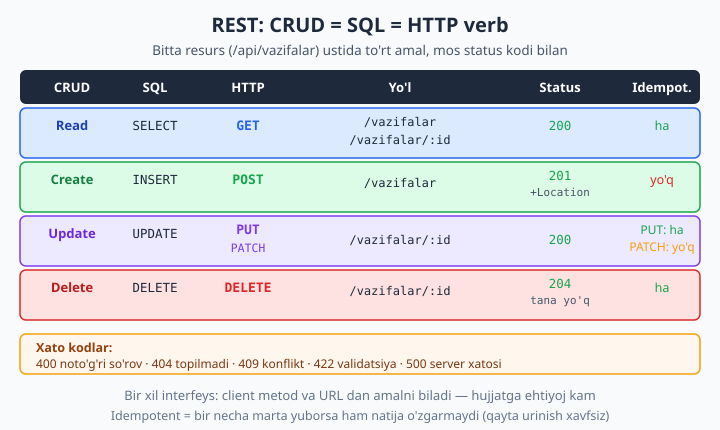
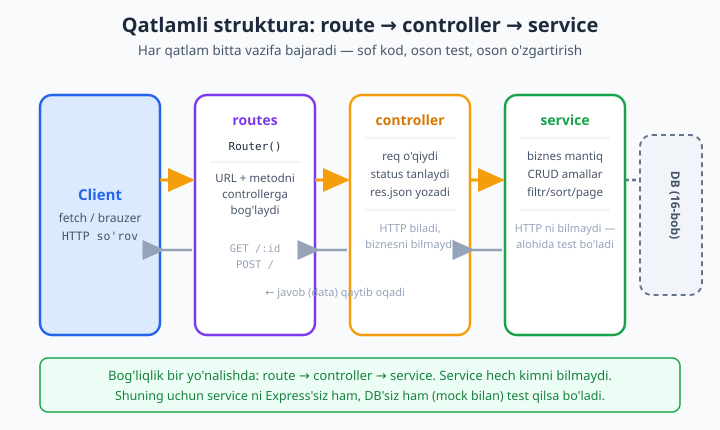

# 14 — REST API qurish

[⬅️ Oldingi: 13 — Middleware](./13-middleware.md) · [🏠 README](./README.md) · [Keyingi: 15 — Validatsiya va xato boshqaruvi ➡️](./15-validatsiya-xato.md)

> **Bu bobda:** Endi bizda Express bor (12-bob), middleware bor (13-bob) — vaqt keldi, **professional REST API** quramiz. Avval REST nima ekanini — resurs, HTTP verb semantikasi (GET/POST/PUT/PATCH/DELETE), statelessness, bir xil interfeys — chuqur tushunamiz. So'ng resurs nomlash qoidalari (`/api/vazifalar`, `/api/vazifalar/:id`, ko'plik ot, nested resurs), to'liq **CRUD** ni `express.Router()` bilan, **to'g'ri status kodlar** (200/201/204/400/404/409/422), izchil JSON javob struktura, **pagination/filtering/sorting** (`?page&limit&sort`), **versiyalash** (`/api/v1`) va eng muhimi — kodni **qatlamlarga** (routes -> controllers -> services) ajratishni o'rganamiz. REAL KEYS: vazifalar REST API ni noldan to'liq quramiz (hozircha in-memory; 16-bobda haqiqiy bazaga ko'chiramiz). Hamma endpoint Node 24.12 + Express 5.2 da `fetch` bilan ishga tushirib tasdiqlangan.

---

## REST nima va nega kerak?

12-bobda biz "vazifalar API" yozdik, 13-bobda unga middleware qo'shdik. Lekin biz hali bir savolga javob bermadik: **API qanday tartibda tuzilishi kerak?** Yo'llarni qanday nomlaymiz? Qaysi HTTP metodni qachon ishlatamiz? Qaysi status kodni qaytaramiz? Bularning hammasiga **REST** (Representational State Transfer) javob beradi.

REST — bu protokol emas, **uslub** (arxitektura prinsipi). U Roy Fielding tomonidan 2000-yilda taklif qilingan va bugun internetdagi API'larning aksariyati shu uslubda yoziladi. REST'ning asosiy g'oyasi oddiy: **hamma narsa resurs**, va resurslar ustida **standart HTTP metodlari** bilan amal bajariladi.

"Resurs" — bu sizning tizimingizdagi **biror narsa**: vazifa, foydalanuvchi, maqola, buyurtma. Har bir resursning **manzili** (URL) bor, masalan `/api/vazifalar/5` — "5-raqamli vazifa". Va siz bu manzilga **metod** bilan murojaat qilasiz: `GET` o'qish uchun, `POST` yaratish uchun, `DELETE` o'chirish uchun. Mana shu — REST'ning yuragi.

Nega bu yaxshi? Chunki **bashoratli** (predictable). Agar men sizning API'ngiz REST ekanini bilsam, hujjatni o'qimasdan ham taxmin qila olaman:

- `GET /api/maqolalar` — barcha maqolalarni beradi.
- `GET /api/maqolalar/10` — 10-maqolani beradi.
- `POST /api/maqolalar` — yangi maqola yaratadi.
- `DELETE /api/maqolalar/10` — 10-maqolani o'chiradi.

Bu **bir xil interfeys** (uniform interface) deyiladi — REST'ning eng kuchli tomoni. Bir marta qoidani o'rgansangiz, dunyodagi minglab API bilan ishlay olasiz.



---

## REST'ning to'rtta tamoyili

REST shunchaki "URL chiroyli bo'lsin" degani emas. Uning ortida aniq tamoyillar bor. Keling, eng muhim to'rttasini ko'rib chiqamiz.

### 1) Resurs va uning manzili

REST'da siz **harakatlarni** emas, **resurslarni** modellashtirasiz. Yangi boshlovchilar ko'p qiladigan xato — URL'ga fe'l yozish:

```
❌ /api/getVazifalar
❌ /api/createVazifa
❌ /api/deleteVazifa/5
```

Bu noto'g'ri, chunki **fe'l metodda** bo'lishi kerak, URL'da emas. To'g'risi:

```
✅ GET    /api/vazifalar       (olish)
✅ POST   /api/vazifalar       (yaratish)
✅ DELETE /api/vazifalar/5     (o'chirish)
```

URL — **ot** (resurs nomi), metod — **fe'l** (amal). Bu ajratish REST'ning poydevori.

### 2) HTTP verb semantikasi

Har bir HTTP metodning **aniq ma'nosi** bor. Ularni o'z xohishingizcha ishlatib bo'lmaydi:

| Metod | Ma'no | Tana yuboradimi? | Idempotent? | Xavfsiz? |
|---|---|---|---|---|
| `GET` | o'qish | yo'q | ha | ha (o'zgartirmaydi) |
| `POST` | yaratish | ha | **yo'q** | yo'q |
| `PUT` | to'liq almashtirish | ha | ha | yo'q |
| `PATCH` | qisman yangilash | ha | yo'q | yo'q |
| `DELETE` | o'chirish | yo'q | ha | yo'q |

**Xavfsiz** (safe) metod — serverni o'zgartirmaydi (faqat `GET`). **Idempotent** metod — bir necha marta yuborsangiz ham natija bir xil bo'ladi (buni quyida batafsil ko'ramiz).

### 3) Statelessness (holatsizlik)

Har bir so'rov **o'zicha to'liq** bo'lishi kerak — server oldingi so'rovlarni **eslab qolmaydi**. Agar sizning API'ngiz "avval login qildingiz, endi server sizni eslab turibdi" desa — bu RESTful emas. Buning o'rniga har bir so'rov o'zi bilan **identifikatsiyani** (masalan, `Authorization` header'da token) olib keladi.

Nega bu muhim? Chunki **kengaytirish** (scaling) oson bo'ladi: server holat saqlamasa, so'rovni istalgan serverga yuborsangiz ham bo'ladi — sessiyani bitta serverga "yopishtirib" qo'yish shart emas. Bu 23-bobda (deploy) juda asqotadi.

### 4) Bir xil interfeys (uniform interface)

Yuqorida aytdik: bir marta qoidani bilsangiz, hamma resurs bilan bir xil ishlaysiz. Bu — REST'ning client va serverni **ajratuvchi** kuchi. Frontend dasturchi backend kodini ko'rmasdan, faqat "GET/POST/PUT/DELETE + resurs nomi" qoidasini bilib ishlay oladi.

> **REST vs boshqalar:** REST yagona uslub emas. **GraphQL** (bitta endpoint, client kerakli maydonlarni so'raydi), **gRPC** (binar, tez, mikroservislar uchun), **WebSocket** (real-time — 24-bobda) ham bor. Lekin REST hali ham eng keng tarqalgani: oddiy, HTTP'ga tabiiy mos, har qanday client (brauzer, mobil, `curl`) bilan ishlaydi. Boshlash uchun ideal.

---

## Resurs nomlash qoidalari

Yaxshi REST API — yaxshi nomlangan API. Mana sanoat standartiga aylangan qoidalar.

**Ko'plik ot ishlating.** Resurs to'plamini ko'plikda nomlang:

```
✅ /api/vazifalar        (yaxshi)
❌ /api/vazifa           (yomon — bitta narsani bildiradi)
```

Mantiq: `/api/vazifalar` — "vazifalar to'plami", `/api/vazifalar/5` — "to'plamdan 5-element". Bu izchil va o'qilishi oson.

**ID'ni yo'l qismida bering.** Bitta elementga murojaat:

```
GET    /api/vazifalar/5    (5-vazifa)
PUT    /api/vazifalar/5    (5-vazifani almashtir)
DELETE /api/vazifalar/5    (5-vazifani o'chir)
```

**Nested (ichma-ich) resurs** — bog'liqlikni ko'rsatish uchun:

```
GET  /api/loyihalar/3/vazifalar       (3-loyihaning vazifalari)
POST /api/loyihalar/3/vazifalar       (3-loyihaga vazifa qo'sh)
GET  /api/foydalanuvchilar/7/buyurtmalar/2   (7-foydalanuvchining 2-buyurtmasi)
```

Lekin **ikki bosqichdan chuqurga ketmang** — `/a/1/b/2/c/3/d/4` ni o'qib bo'lmaydi. Chuqur bog'liqlik kerak bo'lsa, query parametr ishlatish yaxshiroq: `/api/vazifalar?loyiha=3`.

**Filtr, sort, sahifa — query string'da.** Bular resurs emas, resursni **tanlash usuli**:

```
GET /api/vazifalar?bajarildi=true&sort=-muhimlik&page=2&limit=10
```

**kichik harf va chiziqcha.** URL'da `camelCase` yoki `_` emas, `kebab-case` (chiziqcha) ishlating:

```
✅ /api/buyurtma-tarixi
❌ /api/buyurtmaTarixi
❌ /api/buyurtma_tarixi
```

---

## To'g'ri status kodlar

HTTP status kodi — javobning **birinchi va eng muhim** qismi. U client'ga so'rov natijasini bir raqamda aytadi. Noto'g'ri kod — yomon API belgisi. Mana eng kerakli kodlar:

| Kod | Nomi | Qachon |
|---|---|---|
| `200` | OK | Muvaffaqiyatli `GET`, `PUT`, `PATCH` |
| `201` | Created | `POST` yangi resurs yaratdi (+ `Location` header) |
| `204` | No Content | `DELETE` muvaffaqiyatli, **tana yo'q** |
| `400` | Bad Request | So'rov noto'g'ri (masalan, buzuq JSON) |
| `404` | Not Found | Resurs topilmadi |
| `409` | Conflict | Konflikt (masalan, takror yozuv) |
| `422` | Unprocessable Entity | Tana o'qildi, lekin validatsiyadan o'tmadi |
| `500` | Server Error | Serverda kutilmagan xato |

Status kodlar **toifalarga** bo'linadi:

- `2xx` — muvaffaqiyat (200, 201, 204).
- `4xx` — **client xatosi** (404, 422 — siz noto'g'ri so'rov yubordingiz).
- `5xx` — **server xatosi** (500 — biz xato qildik).

Bu farq juda muhim: `4xx` — "muammo siz tomonda", `5xx` — "muammo biz tomonda". Client `4xx` da so'rovni tuzatishi kerak, `5xx` da esa qayta urinib ko'rishi mumkin.

> **400 vs 422 farqi:** `400` — so'rovning **shaklini** o'qib bo'lmadi (masalan, JSON buzuq). `422` — shakl to'g'ri (JSON o'qildi), lekin **mazmuni** noto'g'ri (masalan, `matn` maydoni bo'sh). Bu nozik farq, lekin yaxshi API'lar uni ajratadi. (Ba'zi jamoalar ikkalasiga ham `400` ishlatadi — bu ham qabul qilinadi; muhimi izchillik.)

---

## Izchil JSON javob struktura

API'ngizning har bir javobi **bir xil shaklda** bo'lishi kerak — shunda client uni bir marta o'rganib, hamma joyda ishlatadi. Biz quyidagi qolibni ishlatamiz:

Muvaffaqiyatli javob — `data` kalitida:

```json
{ "data": { "id": 5, "matn": "Express o'rganish", "bajarildi": false } }
```

Ro'yxat + meta ma'lumot:

```json
{
  "data": [ { "id": 1, "matn": "..." }, { "id": 2, "matn": "..." } ],
  "meta": { "jami": 42, "page": 1, "limit": 10, "sahifalar": 5 }
}
```

Xato — `xato` kalitida, ichida **kod** va **xabar**:

```json
{ "xato": { "kod": "TOPILMADI", "xabar": "id=99 vazifa yo'q" } }
```

Nega `data` ichiga o'raymiz? Chunki kelajakda javobga `meta`, `links` qo'shsangiz, asosiy ma'lumot `data` ichida buzilmasdan qoladi. Bu — kelajakka chidamli dizayn. Mashina o'qiydigan `kod` (`TOPILMADI`) va inson o'qiydigan `xabar` ni ajratish ham foydali: frontend `kod` ga qarab mantiq quradi, `xabar` ni esa foydalanuvchiga ko'rsatadi.

---

## Idempotentlik: PUT vs POST

Bu tushuncha REST'da juda muhim, lekin ko'pchilik chalkashtiradi. **Idempotent** metod — uni **bir marta** yoki **yuz marta** chaqirsangiz ham, server holati **bir xil** bo'lib qoladi.

Misol bilan:

- **`POST /api/vazifalar`** (matn: "Sut sotib ol") — **idempotent EMAS**. Uch marta yuborsangiz, **uchta** vazifa yaratiladi. Har chaqiruv yangi resurs hosil qiladi.
- **`PUT /api/vazifalar/5`** (matn: "Sut sotib ol") — **idempotent**. Uch marta yuborsangiz, 5-vazifa baribir bir xil holatda bo'ladi. Birinchi marta o'zgartirdi, qolgan ikkitasi xuddi shu holatga qayta o'rnatdi.
- **`DELETE /api/vazifalar/5`** — **idempotent**. Birinchi marta o'chiradi, keyingilarida "allaqachon yo'q" (404), lekin **holat o'zgarmaydi** — 5-vazifa baribir mavjud emas.

Nega bu muhim? **Tarmoq ishonchsiz.** Tasavvur qiling: client `PUT` yubordi, lekin javob yo'lda yo'qoldi. Client javob kelmaganini ko'rib, **qayta yuboradi**. `PUT` idempotent bo'lgani uchun bu xavfsiz. Lekin `POST` ni qayta yuborsangiz — **ikkita** yozuv paydo bo'ladi (ikki marta "sut sotib ol")! Shuning uchun yaratish uchun `POST`, almashtirish uchun `PUT` ishlatamiz.

```js
// POST — har safar YANGI id beradi (idempotent emas)
service.yarat({ matn: "X" });   // id: 6
service.yarat({ matn: "X" });   // id: 7  <- ikkinchi nusxa!

// PUT — bir xil id'ga bir xil natija (idempotent)
service.almashtir(5, { matn: "X" });  // 5: { matn: "X" }
service.almashtir(5, { matn: "X" });  // 5: { matn: "X" }  <- o'zgarmadi
```

**PATCH** esa odatda idempotent emas, chunki "qiymatni 1 ga oshir" kabi nisbiy amalni bajarishi mumkin. Lekin biz oddiy qiymat o'rnatish uchun ishlatsak — amalda idempotent bo'ladi.

---

## Versiyalash: `/api/v1`

API'ngizni dunyoga chiqargach, uni client'lar (mobil ilova, boshqa jamoalar) ishlata boshlaydi. Endi siz API'ni **buzib bo'lmaysiz** — agar `data` strukturasini o'zgartirsangiz, hamma client sinadi.

Yechim — **versiyalash**. URL boshiga versiya qo'yasiz:

```
/api/v1/vazifalar     (eski client'lar)
/api/v2/vazifalar     (yangi struktura)
```

Shunda eski client'lar `v1` da ishlayveradi, yangi xususiyatlarni `v2` da chiqarasiz. Bu — orqaga moslik (backward compatibility). Biz loyihamizni boshidanoq `/api/v1` bilan quramiz — keyin afsuslanmaslik uchun.

Express'da buni Router bilan bir qatorda qilamiz:

```js
app.use("/api/v1/vazifalar", vazifaRoutes);
// kelajakda:
// app.use("/api/v2/vazifalar", vazifaRoutesV2);
```

---

## Qatlamlarga ajratish: routes -> controllers -> services

Endi eng muhim arxitektura darsi. Hozircha 12-bobda hamma kodni bitta faylga yozdik: route, mantiq, ma'lumot — aralash. Kichik loyihada bu o'tadi, lekin ilova o'sgani sari bu **chigallashadi**. Yechim — **qatlamlarga ajratish** (separation of concerns).

Uchta qatlam:

1. **routes** — qaysi URL+metod qaysi controller funksiyasiga borishini **bog'laydi**. Boshqa hech narsa.
2. **controllers** — `req` dan ma'lumot **o'qiydi**, `service` ni chaqiradi, **status kod** tanlaydi va `res.json` **yozadi**. HTTP'ni biladi, biznes mantiqni bilmaydi.
3. **services** — **biznes mantiq** va ma'lumot bilan ishlash (CRUD, filtr, sort). HTTP'ni **umuman bilmaydi** — `req`/`res` ko'rmaydi.



Nega bu shuncha muhim? Uch sabab:

- **Sof kod (clean code):** har fayl bitta ish qiladi. Controller'ni ochsangiz — HTTP mantiqini ko'rasiz; service'ni ochsangiz — biznes mantiqini. Adashmaysiz.
- **Test oson:** `service` HTTP'ni bilmagani uchun uni **Express'siz** test qilasiz — shunchaki funksiya chaqirasiz (`service.yarat({...})`). Server ko'tarish shart emas. Bu testni soddalashtiradi va tezlashtiradi (18 va 21-bobda ko'ramiz).
- **O'zgartirish oson:** ertaga in-memory'dan **MySQL'ga** o'tsangiz (16-bob), faqat `service` o'zgaradi. `controller` va `routes` tegmasdan qoladi, chunki ular service'ning **ichini** bilmaydi.

Bu — bog'liqlikning **bir yo'nalishliligi**: `routes` -> `controllers` -> `services`. Service hech kimni bilmaydi, shuning uchun u eng "sof" qatlam. Endi buni amalda quramiz.

---

## REAL KEYS: vazifalar REST API ni to'liq qurish

Keling, professional struktura bilan vazifalar API'ni noldan quramiz. Bu loyiha kitobning qolgan qismida (DB, auth, test, deploy) rivojlanib boradi. Papka tuzilishi:

```
vazifalar-api/
├── package.json          ("type": "module")
└── src/
    ├── server.js         (serverni ishga tushiradi)
    ├── app.js            (Express app'ni yig'adi)
    ├── routes/
    │   └── vazifaRoutes.js
    ├── controllers/
    │   └── vazifaController.js
    └── services/
        └── vazifaService.js
```

O'rnatamiz:

```bash
mkdir vazifalar-api && cd vazifalar-api
npm init -y
npm pkg set type=module
npm install express
```

### 1-qatlam: service (biznes mantiq)

Bu eng pastki qatlam — ma'lumot va mantiq. Hozircha **in-memory** massiv (16-bobda MySQL'ga ko'chiramiz). Diqqat: bu faylda hech qanday `req`, `res`, `express` yo'q — toza JavaScript.

```js
// src/services/vazifaService.js
let vazifalar = [
  { id: 1, matn: "Express o'rganish", bajarildi: false, muhimlik: 3 },
  { id: 2, matn: "REST API yozish", bajarildi: false, muhimlik: 5 },
  { id: 3, matn: "Suv ichish", bajarildi: true, muhimlik: 1 },
];
let keyingiId = 4;

export function hammasi({ page = 1, limit = 10, sort = "id", bajarildi } = {}) {
  let natija = [...vazifalar];

  // FILTERING — ?bajarildi=true
  if (bajarildi !== undefined) {
    const bool = bajarildi === "true";
    natija = natija.filter((v) => v.bajarildi === bool);
  }

  // SORTING — ?sort=muhimlik yoki ?sort=-muhimlik (kamayish)
  const kamayish = sort.startsWith("-");
  const maydon = kamayish ? sort.slice(1) : sort;
  natija.sort((a, b) => (a[maydon] > b[maydon] ? 1 : -1) * (kamayish ? -1 : 1));

  // PAGINATION
  const jami = natija.length;
  const boshlanish = (page - 1) * limit;
  const sahifa = natija.slice(boshlanish, boshlanish + limit);

  return { data: sahifa, jami, page, limit };
}

export function bittasi(id) {
  return vazifalar.find((v) => v.id === id) ?? null;
}

export function yarat({ matn, muhimlik = 1 }) {
  // CONFLICT misoli: bir xil matnli vazifa qayta yaratilmasin
  if (vazifalar.some((v) => v.matn === matn)) {
    const xato = new Error("Bunday matnli vazifa allaqachon mavjud");
    xato.kod = "KONFLIKT";
    throw xato;
  }
  const yangi = { id: keyingiId++, matn, bajarildi: false, muhimlik };
  vazifalar.push(yangi);
  return yangi;
}

// PUT — to'liq almashtirish (idempotent)
export function almashtir(id, { matn, bajarildi = false, muhimlik = 1 }) {
  const v = vazifalar.find((x) => x.id === id);
  if (!v) return null;
  v.matn = matn;
  v.bajarildi = bajarildi;
  v.muhimlik = muhimlik;
  return v;
}

// PATCH — qisman yangilash
export function yangila(id, ozgarishlar) {
  const v = vazifalar.find((x) => x.id === id);
  if (!v) return null;
  if (ozgarishlar.matn !== undefined) v.matn = ozgarishlar.matn;
  if (ozgarishlar.bajarildi !== undefined) v.bajarildi = ozgarishlar.bajarildi;
  if (ozgarishlar.muhimlik !== undefined) v.muhimlik = ozgarishlar.muhimlik;
  return v;
}

export function ochir(id) {
  const oldin = vazifalar.length;
  vazifalar = vazifalar.filter((v) => v.id !== id);
  return vazifalar.length < oldin;
}
```

E'tibor bering: service **HTTP haqida hech narsa bilmaydi**. U status kod qaytarmaydi, `res.json` chaqirmaydi. U faqat ma'lumot qaytaradi (yoki topilmasa `null`, konfliktda `throw`). Bu uni mustaqil va test qilinadigan qiladi.

### 2-qatlam: controller (HTTP mantiq)

Controller — service bilan HTTP olamini bog'lovchi ko'prik. U `req` dan o'qiydi, service'ni chaqiradi, va natijaga qarab **to'g'ri status kod** bilan javob yozadi.

```js
// src/controllers/vazifaController.js
import * as service from "../services/vazifaService.js";

// GET /api/v1/vazifalar
export function royxat(req, res) {
  const page = Math.max(1, parseInt(req.query.page) || 1);
  const limit = Math.min(100, Math.max(1, parseInt(req.query.limit) || 10));
  const { sort = "id", bajarildi } = req.query;

  const { data, jami } = service.hammasi({ page, limit, sort, bajarildi });

  res.json({
    data,
    meta: { jami, page, limit, sahifalar: Math.ceil(jami / limit) },
  });
}

// GET /api/v1/vazifalar/:id
export function bittasi(req, res) {
  const id = Number(req.params.id);
  const vazifa = service.bittasi(id);
  if (!vazifa) {
    return res.status(404).json({ xato: { kod: "TOPILMADI", xabar: `id=${id} vazifa yo'q` } });
  }
  res.json({ data: vazifa });
}

// POST /api/v1/vazifalar
export function yarat(req, res) {
  const { matn, muhimlik } = req.body ?? {};
  // Validatsiya (15-bobda zod bilan chuqurlashtiramiz)
  if (typeof matn !== "string" || matn.trim() === "") {
    return res.status(422).json({ xato: { kod: "VALIDATSIYA", xabar: "matn majburiy va bo'sh bo'lmasligi kerak" } });
  }
  try {
    const yangi = service.yarat({ matn: matn.trim(), muhimlik });
    // 201 + Location header — yangi resurs manzili
    res.status(201).location(`/api/v1/vazifalar/${yangi.id}`).json({ data: yangi });
  } catch (e) {
    if (e.kod === "KONFLIKT") {
      return res.status(409).json({ xato: { kod: "KONFLIKT", xabar: e.message } });
    }
    throw e; // boshqa xato — markaziy handler tutadi
  }
}

// PUT /api/v1/vazifalar/:id
export function almashtir(req, res) {
  const id = Number(req.params.id);
  const { matn, bajarildi, muhimlik } = req.body ?? {};
  if (typeof matn !== "string" || matn.trim() === "") {
    return res.status(422).json({ xato: { kod: "VALIDATSIYA", xabar: "matn majburiy" } });
  }
  const yangilangan = service.almashtir(id, { matn: matn.trim(), bajarildi, muhimlik });
  if (!yangilangan) {
    return res.status(404).json({ xato: { kod: "TOPILMADI", xabar: `id=${id} vazifa yo'q` } });
  }
  res.json({ data: yangilangan });
}

// PATCH /api/v1/vazifalar/:id
export function yangila(req, res) {
  const id = Number(req.params.id);
  const yangilangan = service.yangila(id, req.body ?? {});
  if (!yangilangan) {
    return res.status(404).json({ xato: { kod: "TOPILMADI", xabar: `id=${id} vazifa yo'q` } });
  }
  res.json({ data: yangilangan });
}

// DELETE /api/v1/vazifalar/:id
export function ochir(req, res) {
  const id = Number(req.params.id);
  const ochirildi = service.ochir(id);
  if (!ochirildi) {
    return res.status(404).json({ xato: { kod: "TOPILMADI", xabar: `id=${id} vazifa yo'q` } });
  }
  res.status(204).end(); // 204 — tana yo'q, .end() bilan tugatamiz
}
```

Diqqat qiling: controller'da **biznes qoidasi yo'q** — filtr, sort qanday qilinishi service'da. Controller faqat `req` -> service -> `res` ni ulaydi va **status kod tilini** gapiradi. Bu — sof ajratishning kuchi.

> **`res.status(204).end()` nega `.json()` emas?** `204 No Content` — "muvaffaqiyatli, lekin ko'rsatadigan tana yo'q". Standartga ko'ra `204` javobida **tana bo'lmasligi** kerak, shuning uchun `.end()` bilan bo'sh tugatamiz. `DELETE` uchun bu ideal: "o'chirildi, qaytaradigan narsa yo'q".

### 3-qatlam: routes (bog'lash)

Eng yupqa qatlam. URL+metodni controller funksiyasiga bog'laydi, xolos. `express.Router()` — bu "mini-app", uni keyin asosiy app'ga ulaymiz (12-bobda ko'rgansiz).

```js
// src/routes/vazifaRoutes.js
import { Router } from "express";
import * as c from "../controllers/vazifaController.js";

const router = Router();

router.get("/", c.royxat);        // GET    /api/v1/vazifalar
router.post("/", c.yarat);        // POST   /api/v1/vazifalar
router.get("/:id", c.bittasi);    // GET    /api/v1/vazifalar/:id
router.put("/:id", c.almashtir);  // PUT    /api/v1/vazifalar/:id
router.patch("/:id", c.yangila);  // PATCH  /api/v1/vazifalar/:id
router.delete("/:id", c.ochir);   // DELETE /api/v1/vazifalar/:id

export default router;
```

Router ichidagi yo'llar **nisbiy** (`/`, `/:id`) — `/api/v1/vazifalar` prefiksi app'da qo'shiladi. Shuning uchun ertaga prefiksni `/api/v2/vazifalar` ga o'zgartirsangiz, bu fayl tegmasdan qoladi.

### App'ni yig'ish

Endi hammasini bitta `app` ga ulaymiz: JSON parser, versiyalangan route, 404 va markaziy error handler (13-bobdan).

```js
// src/app.js
import express from "express";
import vazifaRoutes from "./routes/vazifaRoutes.js";

export function appYarat() {
  const app = express();
  app.use(express.json()); // so'rov tanasini req.body ga o'qiydi

  // Versiyalangan API — Router shu yerda ulanadi
  app.use("/api/v1/vazifalar", vazifaRoutes);

  // 404 — hech bir route mos kelmadi (oxirgi oddiy middleware)
  app.use((req, res) => {
    res.status(404).json({ xato: { kod: "TOPILMADI", xabar: `${req.method} ${req.originalUrl} yo'q` } });
  });

  // Markaziy error handler (4 argument — 13-bobda ko'rdik)
  app.use((err, req, res, next) => {
    console.error("XATO:", err.message);
    res.status(500).json({ xato: { kod: "SERVER_XATOSI", xabar: "Ichki xato" } });
  });

  return app;
}
```

Nega `appYarat()` funksiya? Chunki shunda **test** uchun (21-bob) app'ni qayta yarata olamiz, lekin portni band qilmaymiz. `server.js` esa faqat ishga tushirishga javob beradi:

```js
// src/server.js
import { appYarat } from "./app.js";

const app = appYarat();
const PORT = process.env.PORT || 3000;
app.listen(PORT, () => console.log(`API ishga tushdi: http://localhost:${PORT}/api/v1/vazifalar`));
```

`app` (mantiq) va `server` (ishga tushirish) ni ajratish — bu ham qatlamlash. App'ni test'da `listen` qilmasdan ishlatamiz; serverni esa faqat `node src/server.js` da ko'taramiz.

### Ishga tushirish va `fetch` bilan test

Endi hammasini sinaymiz. Bitta test fayl yozib, har bir endpoint va status kodni `fetch` bilan tekshiramiz. (Port `0` — Node bo'sh portni o'zi tanlaydi, shunda test boshqa server bilan to'qnashmaydi.)

```js
// test.js — har endpointni fetch bilan tekshiradi
import { appYarat } from "./src/app.js";

const server = appYarat().listen(0);
const port = server.address().port;
const baza = `http://localhost:${port}/api/v1/vazifalar`;

const j = async (p) => { const r = await p; return { status: r.status, body: await r.json().catch(() => null), loc: r.headers.get("location") }; };

let r = await j(fetch(`${baza}?sort=-muhimlik&limit=2`));
console.log("GET ro'yxat:", r.status, r.body.meta, r.body.data.map(v => v.matn));

r = await j(fetch(`${baza}/1`));
console.log("GET /1:", r.status, r.body.data.matn);

r = await j(fetch(`${baza}/999`));
console.log("GET /999:", r.status, r.body.xato.kod);

r = await j(fetch(baza, { method: "POST", headers: { "Content-Type": "application/json" }, body: JSON.stringify({ matn: "Yangi", muhimlik: 4 }) }));
console.log("POST:", r.status, "Location:", r.loc);

r = await j(fetch(baza, { method: "POST", headers: { "Content-Type": "application/json" }, body: JSON.stringify({}) }));
console.log("POST (matn yo'q):", r.status, r.body.xato.kod);

r = await j(fetch(`${baza}/4`, { method: "DELETE" }));
console.log("DELETE /4:", r.status);

server.close();
```

Ishga tushiramiz:

```bash
node test.js
```

Chiqish (haqiqiy, Node 24.12 + Express 5.2.1 da tasdiqlangan):

```
GET ro'yxat: 200 { jami: 3, page: 1, limit: 2, sahifalar: 2 } [ 'REST API yozish', "Express o'rganish" ]
GET /1: 200 Express o'rganish
GET /999: 404 TOPILMADI
POST: 201 Location: /api/v1/vazifalar/4
POST (matn yo'q): 422 VALIDATSIYA
DELETE /4: 204
```

Mana to'liq REST API! E'tibor bering:

- **Sort ishladi:** `?sort=-muhimlik` — muhimligi yuqorisi birinchi (5, 3).
- **Pagination ishladi:** `?limit=2` — meta'da `sahifalar: 2` (3 ta vazifa, 2 tadan = 2 sahifa).
- **Status kodlar to'g'ri:** 200 (o'qish), 404 (yo'q), 201 (yaratildi + Location), 422 (validatsiya), 204 (o'chirildi, tana yo'q).

To'liq test (men ishga tushirgan) barcha holatlarni qamraydi — 200/201/204/404/409/422 va idempotent PUT. Hammasi o'tdi:

```
GET list (sort=-muhimlik,limit=2): 200 {"jami":3,...} -> [ 'REST API yozish', "Express o'rganish" ]
GET filter bajarildi=true: 200 jami: 1
POST 409 (konflikt): 409 KONFLIKT
PUT 200 (1-marta): 200 true
PUT 200 (2-marta, idempotent): 200 5     <- ikkinchi marta ham bir xil natija
PATCH 200: 200 bajarildi: false matn saqlandi: Almashtirilgan
DELETE 404 (qayta): 404 TOPILMADI
HAMMA TEST O'TDI ✓
```

> **Ko'prik:** Bu yerda biz validatsiyani qo'lda (`typeof matn !== "string"`) qildik — bu tez chigallashadi. **15-bobda** `zod` bilan deklarativ, professional validatsiya quramiz va markaziy error boshqaruvni kuchaytiramiz. **16-bobda** esa bu service'ni o'zgartirmagan holda in-memory'dan **MySQL/Prisma**'ga ko'chiramiz — qatlamlash aynan shunda asqotadi. SQL chuqurroq kerak bo'lsa [`../sql/README.md`](../sql/README.md) ga qarang.

---

## 400 — buzuq JSON ni boshqarish

Yuqorida `422` ni ko'rdik (tana o'qildi, lekin mazmun noto'g'ri). Endi `400` ni — tananing **shaklini** o'qib bo'lmaganda. Agar client buzuq JSON yuborsa, `express.json()` xato tashlaydi va u **error handler** ga boradi. Uni tutib `400` qaytaramiz:

```js
app.use((err, req, res, next) => {
  // express.json() buzuq JSON da bu xatoni tashlaydi
  if (err.type === "entity.parse.failed") {
    return res.status(400).json({ xato: { kod: "NOTOGRI_JSON", xabar: "Tana yaroqli JSON emas" } });
  }
  console.error(err);
  res.status(500).json({ xato: { kod: "SERVER_XATOSI", xabar: "Ichki xato" } });
});
```

Sinab ko'ramiz — ataylab buzuq JSON yuboramiz:

```js
const r = await fetch(`http://localhost:${port}/x`, {
  method: "POST",
  headers: { "Content-Type": "application/json" },
  body: "{ buzuq json",   // XATO: yaroqsiz JSON
});
console.log(r.status, await r.json());
```

Chiqish (tasdiqlangan):

```
400 { xato: { kod: 'NOTOGRI_JSON', xabar: 'Tana yaroqli JSON emas' } }
```

Mana shunday: `400` (shakl buzuq) va `422` (shakl to'g'ri, mazmun noto'g'ri) ni ajratdik. Bu — yetuk API belgisi.

---

## Pagination, filtering, sorting — chuqurroq

Ro'yxat endpoint'lari deyarli har doim **katta** bo'ladi. Agar `GET /api/vazifalar` 100000 ta yozuvni qaytarsa — server ham, client ham, tarmoq ham qiynaladi. Shuning uchun **uchta** muhim mexanizm bor:

**Pagination (sahifalash)** — bir martada bir bo'lak qaytarish:

```
GET /api/v1/vazifalar?page=2&limit=20
```

Biz `meta` da `jami`, `page`, `limit`, `sahifalar` ni qaytaramiz — shunda client "keyingi sahifa bormi?" ni biladi. **Eslatma:** `limit` ga **yuqori chegara** qo'yish muhim (biz `Math.min(100, ...)` qildik) — aks holda client `?limit=999999` bilan serverni cho'ktirishi mumkin.

**Filtering (filtrlash)** — shartga mos yozuvlar:

```
GET /api/v1/vazifalar?bajarildi=true
```

**Sorting (saralash)** — tartiblash. Biz `-` prefiksi bilan kamayish tartibini bildiramiz (umumiy konvensiya):

```
GET /api/v1/vazifalar?sort=muhimlik     (o'sish: 1, 3, 5)
GET /api/v1/vazifalar?sort=-muhimlik    (kamayish: 5, 3, 1)
```

Bularning hammasi **query string**'da, chunki ular resursni emas — resursni **tanlash usulini** belgilaydi. Resurs baribir `/api/v1/vazifalar`. Diqqat: hozir biz massivda filtr/sort qilyapmiz, lekin 16-bobda DB'da bu `WHERE`, `ORDER BY`, `LIMIT`/`OFFSET` SQL bilan, **ancha samarali** bajariladi — chunki minglab yozuvni serverga yuklab, keyin filtrlash isrof. Lekin REST interfeysi (query parametrlar) **bir xil** qoladi — bu qatlamlashning yana bir foydasi.

---

## Mashqlar

### Oson

1. Service'dagi `hammasi` funksiyasiga `muhimlikMin` filtrini qo'shing: `?muhimlikMin=3` faqat muhimligi 3 va undan yuqori vazifalarni qaytarsin. Controller'da `req.query.muhimlikMin` ni o'qib service'ga uzating va `fetch` bilan sinang.
2. `GET /api/v1/vazifalar/abc` (id raqam emas) so'roviga `400` qaytaradigan tekshiruv qo'shing: `bittasi` controller'ida `Number.isNaN(id)` bo'lsa `{ kod: "NOTOGRI_ID" }` bilan `400` bering.
3. Yangi `GET /api/v1/salomatlik` (health-check) endpoint qo'shing: u `{ holat: "ishlayapti", vaqt: <ISO sana> }` ni `200` bilan qaytarsin. (Maslahat: alohida route fayl shart emas, app'ga to'g'ridan qo'shsangiz ham bo'ladi.)

### O'rta

4. **HEAD** so'rovini qo'llab-quvvatlang: ro'yxat endpoint'iga `router.head("/", ...)` qo'shib, faqat `X-Total-Count` header'da jami sonni qaytaring (tanasiz). `fetch(..., { method: "HEAD" })` bilan header'ni o'qing.
5. Service'ni **alohida** (Express'siz) test qiling: `vazifaService.js` ni import qilib, `yarat`, `bittasi`, `ochir` funksiyalarini to'g'ridan chaqirib `console.assert` bilan tekshiring. Bu qatlamlashning kuchini ko'rsatadi — server kerak emas.
6. `POST` da `muhimlik` 1–5 oralig'ida ekanini tekshiring: chegaradan tashqarida bo'lsa `422` bilan `{ kod: "VALIDATSIYA", xabar: "muhimlik 1-5 oralig'ida bo'lsin" }` qaytaring. `?muhimlik=9` bilan sinang.

### Qiyin

7. **Nested resurs** quring: `loyihalar` service va router qo'shing, so'ng `GET /api/v1/loyihalar/:loyihaId/vazifalar` endpoint'i shu loyihaga tegishli vazifalarni qaytarsin (vazifaga `loyihaId` maydoni qo'shing). `mergeParams: true` bilan Router ichida `:loyihaId` ni o'qishni o'rganing.
8. **Idempotentlikni isbotlang:** bitta test yozing — `PUT /api/v1/vazifalar/1` ni **ketma-ket uch marta** bir xil tana bilan yuboring va har uchala javobda `data` **bir xil** ekanini `console.assert` bilan tasdiqlang. So'ng `POST` ni uch marta bir xil **boshqa** matn bilan yuborib, **uchta har xil id** hosil bo'lishini ko'rsating (idempotent emas).

<details markdown="1"><summary>Yechim — 1 (muhimlikMin filtri)</summary>

```js
// services/vazifaService.js — hammasi() ichiga FILTERING'dan keyin qo'shing:
export function hammasi({ page = 1, limit = 10, sort = "id", bajarildi, muhimlikMin } = {}) {
  let natija = [...vazifalar];
  if (bajarildi !== undefined) {
    natija = natija.filter((v) => v.bajarildi === (bajarildi === "true"));
  }
  if (muhimlikMin !== undefined) {
    natija = natija.filter((v) => v.muhimlik >= Number(muhimlikMin)); // yangi filtr
  }
  // ... sort va pagination o'zgarmaydi
  const kamayish = sort.startsWith("-");
  const maydon = kamayish ? sort.slice(1) : sort;
  natija.sort((a, b) => (a[maydon] > b[maydon] ? 1 : -1) * (kamayish ? -1 : 1));
  const jami = natija.length;
  const sahifa = natija.slice((page - 1) * limit, (page - 1) * limit + limit);
  return { data: sahifa, jami, page, limit };
}
```

```js
// controllers/vazifaController.js — royxat() ichida:
const { sort = "id", bajarildi, muhimlikMin } = req.query;
const { data, jami } = service.hammasi({ page, limit, sort, bajarildi, muhimlikMin });
```

Sinov: `fetch("http://localhost:3000/api/v1/vazifalar?muhimlikMin=3")` — muhimligi 3, 5 bo'lganlar keladi, 1 bo'lgan tushib qoladi. Filtr **service**'da — controller faqat query'ni uzatadi.
</details>

<details markdown="1"><summary>Yechim — 2 (noto'g'ri id'ga 400)</summary>

```js
// controllers/vazifaController.js
export function bittasi(req, res) {
  const id = Number(req.params.id);
  if (Number.isNaN(id)) {
    return res.status(400).json({ xato: { kod: "NOTOGRI_ID", xabar: "id raqam bo'lishi kerak" } });
  }
  const vazifa = service.bittasi(id);
  if (!vazifa) {
    return res.status(404).json({ xato: { kod: "TOPILMADI", xabar: `id=${id} vazifa yo'q` } });
  }
  res.json({ data: vazifa });
}
```

`Number("abc")` -> `NaN`, shuning uchun `Number.isNaN(id)` true. Bu `400` (so'rov shakli noto'g'ri — id raqam emas), `404` (id to'g'ri lekin yozuv yo'q) dan farq qiladi. Ikkalasini ajratish API'ni aniqroq qiladi: client `400` da URL'ini tuzatadi, `404` da boshqa id qidiradi.
</details>

<details markdown="1"><summary>Yechim — 3 (health-check)</summary>

```js
// app.js — vazifaRoutes ulanishidan oldin yoki keyin:
app.get("/api/v1/salomatlik", (req, res) => {
  res.json({ holat: "ishlayapti", vaqt: new Date().toISOString() });
});
```

Sinov:

```js
const r = await fetch("http://localhost:3000/api/v1/salomatlik");
console.log(r.status, await r.json());
// 200 { holat: 'ishlayapti', vaqt: '2026-06-12T08:00:00.000Z' }
```

Health-check endpoint — production'da **majburiy**. Yuk balanslagich (load balancer) va monitoring tizimlari (23-bob) shu endpoint'ni vaqti-vaqti bilan so'rab, server tirikligini tekshiradi. Odatda u DB ulanishini ham tekshiradi.
</details>

<details markdown="1"><summary>Yechim — 4 (HEAD so'rovi)</summary>

```js
// routes/vazifaRoutes.js
router.head("/", (req, res) => {
  const { jami } = service.hammasi({ limit: 1 });
  res.set("X-Total-Count", String(jami)).status(200).end(); // tanasiz
});
```

Sinov:

```js
const r = await fetch("http://localhost:3000/api/v1/vazifalar", { method: "HEAD" });
console.log(r.status, r.headers.get("X-Total-Count")); // 200 3
```

`HEAD` — `GET` bilan bir xil, lekin **tanasiz**, faqat headerlar. Foydasi: client butun ro'yxatni yuklab olmasdan "nechta yozuv bor?" yoki "o'zgardimi?" (`Last-Modified` header orqali) ni bilib oladi. Bu tarmoqni tejaydi. HTTP standartiga ko'ra har bir `GET` endpoint avtomatik `HEAD` ni ham qo'llashi tavsiya etiladi.
</details>

<details markdown="1"><summary>Yechim — 5 (service'ni Express'siz test qilish)</summary>

```js
// service-test.js
import * as service from "./src/services/vazifaService.js";
import assert from "node:assert";

// yarat
const yangi = service.yarat({ matn: "Test vazifa", muhimlik: 2 });
assert.equal(yangi.matn, "Test vazifa");
assert.equal(yangi.bajarildi, false);
console.log("yarat ✓");

// bittasi — yaratilganni topish
const topildi = service.bittasi(yangi.id);
assert.equal(topildi.id, yangi.id);
console.log("bittasi ✓");

// ochir
assert.equal(service.ochir(yangi.id), true);   // o'chirildi
assert.equal(service.ochir(yangi.id), false);  // endi yo'q
assert.equal(service.bittasi(yangi.id), null); // topilmaydi
console.log("ochir ✓");

console.log("Service testlari o'tdi — Express KERAK BO'LMADI");
```

```bash
node service-test.js
```

Chiqish:

```
yarat ✓
bittasi ✓
ochir ✓
Service testlari o'tdi — Express KERAK BO'LMADI
```

Mana qatlamlashning eng katta foydasi: **server ko'tarmasdan**, port ochmasdan, HTTP'siz biznes mantiqni to'liq test qildik. Service `req`/`res` ni bilmagani uchun u shunchaki funksiya — uni chaqirib natijani tekshiramiz. 21-bobda buni `vitest` bilan professional darajaga olib chiqamiz.
</details>

<details markdown="1"><summary>Yechim — 6 (muhimlik diapazoni validatsiyasi)</summary>

```js
// controllers/vazifaController.js — yarat() ichida, matn tekshiruvidan keyin:
export function yarat(req, res) {
  const { matn, muhimlik = 1 } = req.body ?? {};
  if (typeof matn !== "string" || matn.trim() === "") {
    return res.status(422).json({ xato: { kod: "VALIDATSIYA", xabar: "matn majburiy" } });
  }
  if (!Number.isInteger(muhimlik) || muhimlik < 1 || muhimlik > 5) {
    return res.status(422).json({ xato: { kod: "VALIDATSIYA", xabar: "muhimlik 1-5 oralig'ida bo'lsin" } });
  }
  // ... qolgan kod
  const yangi = service.yarat({ matn: matn.trim(), muhimlik });
  res.status(201).location(`/api/v1/vazifalar/${yangi.id}`).json({ data: yangi });
}
```

Sinov:

```js
const r = await fetch("http://localhost:3000/api/v1/vazifalar", {
  method: "POST",
  headers: { "Content-Type": "application/json" },
  body: JSON.stringify({ matn: "X", muhimlik: 9 }),
});
console.log(r.status, await r.json()); // 422 { xato: { kod: 'VALIDATSIYA', ... } }
```

E'tibor bering — bu qo'lda validatsiya tez **takrorlanadigan** va **chigal** bo'lib boryapti (`matn`, `muhimlik`, har biri uchun `if`). Aynan shuning uchun 15-bobda **`zod`** bilan butun tanani bitta sxema bilan deklarativ tekshiramiz — toza va kengaytiriladigan.
</details>

<details markdown="1"><summary>Yechim — 7 (nested resurs)</summary>

```js
// services/loyihaVazifaService.js (yoki vazifaService'ga loyihaId qo'shing)
let vazifalar = [
  { id: 1, matn: "Dizayn", bajarildi: false, muhimlik: 3, loyihaId: 1 },
  { id: 2, matn: "Backend", bajarildi: false, muhimlik: 5, loyihaId: 1 },
  { id: 3, matn: "Marketing", bajarildi: true, muhimlik: 2, loyihaId: 2 },
];
export function loyihaVazifalari(loyihaId) {
  return vazifalar.filter((v) => v.loyihaId === loyihaId);
}
```

```js
// routes/loyihaRoutes.js
import { Router } from "express";
import * as service from "../services/loyihaVazifaService.js";

// mergeParams: true — ota-router'dagi :loyihaId ni ko'rish uchun SHART
const router = Router({ mergeParams: true });

router.get("/", (req, res) => {
  const loyihaId = Number(req.params.loyihaId);
  res.json({ data: service.loyihaVazifalari(loyihaId) });
});

export default router;
```

```js
// app.js — nested ulash:
import loyihaRoutes from "./routes/loyihaRoutes.js";
app.use("/api/v1/loyihalar/:loyihaId/vazifalar", loyihaRoutes);
```

Sinov:

```js
const r = await fetch("http://localhost:3000/api/v1/loyihalar/1/vazifalar");
console.log(await r.json()); // { data: [ {Dizayn...}, {Backend...} ] }  -- faqat loyihaId=1
```

Eng muhim nozik nuqta: `Router({ mergeParams: true })`. Default holatda ichki router ota-router'dagi `:loyihaId` parametrini **ko'rmaydi**. `mergeParams: true` uni "meros qilib oladi". Busiz `req.params.loyihaId` `undefined` bo'lib qoladi — ko'p odam shu yerda qoqiladi. Nested resurs — "bu vazifalar **shu loyihaga** tegishli" degan bog'liqlikni URL'da aniq ko'rsatadi.
</details>

<details markdown="1"><summary>Yechim — 8 (idempotentlikni isbotlash)</summary>

```js
// idempotent-test.js
import { appYarat } from "./src/app.js";
import assert from "node:assert";

const server = appYarat().listen(0);
const port = server.address().port;
const baza = `http://localhost:${port}/api/v1/vazifalar`;

// --- PUT idempotent: uch marta bir xil tana -> bir xil natija ---
const put = () => fetch(`${baza}/1`, {
  method: "PUT",
  headers: { "Content-Type": "application/json" },
  body: JSON.stringify({ matn: "Bir xil", bajarildi: true, muhimlik: 4 }),
}).then((r) => r.json());

const a = await put();
const b = await put();
const c = await put();
assert.deepEqual(a.data, b.data);
assert.deepEqual(b.data, c.data);
console.log("PUT idempotent ✓ — uch javob ham bir xil:", a.data.matn, a.data.muhimlik);

// --- POST idempotent EMAS: har safar yangi id ---
const post = (matn) => fetch(baza, {
  method: "POST",
  headers: { "Content-Type": "application/json" },
  body: JSON.stringify({ matn }),
}).then((r) => r.json());

const p1 = await post("Birinchi");
const p2 = await post("Ikkinchi");
const p3 = await post("Uchinchi");
const idlar = [p1.data.id, p2.data.id, p3.data.id];
assert.equal(new Set(idlar).size, 3); // uchtasi ham HAR XIL
console.log("POST idempotent EMAS ✓ — uchta har xil id:", idlar);

server.close();
```

```bash
node idempotent-test.js
```

Chiqish:

```
PUT idempotent ✓ — uch javob ham bir xil: Bir xil 4
POST idempotent EMAS ✓ — uchta har xil id: [ 4, 5, 6 ]
```

Mana isbot. `PUT` ni necha marta yuborsangiz ham, 1-vazifa bir xil holatda qoladi — tarmoq xatosida qayta yuborish **xavfsiz**. `POST` esa har safar yangi resurs yaratadi — qayta yuborish **takror** hosil qiladi. Aynan shuning uchun "yaratish = POST, almashtirish = PUT" qoidasiga amal qilamiz. Bu farqni bilmaslik real tizimlarda takror buyurtma, takror to'lov kabi jiddiy xatolarga olib keladi.
</details>

---

Endi sizda **professional, qatlamli REST API** bor — to'g'ri verb, to'g'ri status kod, pagination/filtering/sorting, versiyalash va sof struktura bilan. Bu — backend dasturchining asosiy mahorati. Keyingi bobda bu API'ning **eng zaif joyini** — qo'lda yozilgan validatsiyani — **`zod`** bilan mustahkamlaymiz va xato boshqaruvni markazlashtiramiz.

[⬅️ Oldingi: 13 — Middleware](./13-middleware.md) · [🏠 README](./README.md) · [Keyingi: 15 — Validatsiya va xato boshqaruvi ➡️](./15-validatsiya-xato.md)
