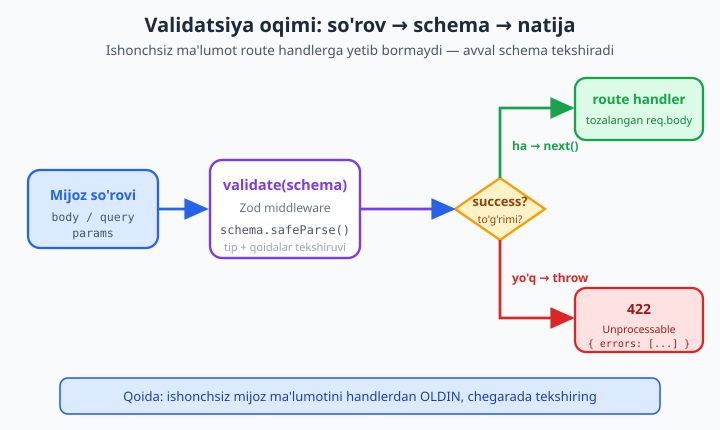
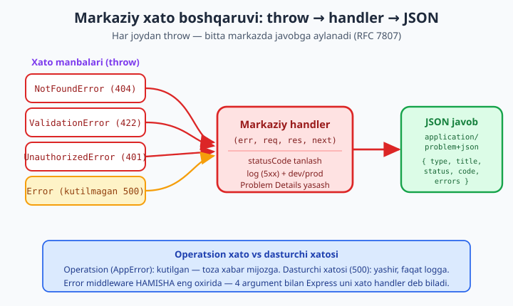

# 15 — Validatsiya va xato boshqaruvi

[⬅️ Oldingi: 14 — REST API qurish](./14-rest-api.md) · [🏠 README](./README.md) · [Keyingi: 16 — SQLite bilan ishlash ➡️](./16-sqlite.md)

> **Bu bobda:** API qurishning eng muhim, lekin ko'pincha e'tibordan chetda qoladigan ikki ustuni bilan shug'ullanamiz — **kiruvchi ma'lumot validatsiyasi** va **markaziy xato boshqaruvi**. Nega mijozdan kelgan ma'lumotga *hech qachon* ishonmaslik kerakligini (xavfsizlik, ishonchsiz tana) tushunamiz; zamonaviy schema-asosli **Zod** kutubxonasini chuqur o'rganamiz — `z.object`, `min/max/email`, `parse` vs `safeParse`, tip xulosasi (type inference), `transform` va custom xabarlar. So'ng `req.body`, `req.query`, `req.params` ni schema bilan tekshiradigan **validatsiya middleware** yozamiz (xato bo'lsa `422`). Ikkinchi yarmida **markaziy xato boshqaruvi**ni quramiz: async route'dagi xato (Express 5 — avtomatik; Express 4 — `wrap` kerak), 4 argumentli **error middleware**, `AppError` bazasidan meros oladigan **custom Error sinflari** (`NotFoundError`/`ValidationError`/`UnauthorizedError`), HTTP status xaritasi, **RFC 7807 Problem Details** javob formati, `404` va global `500` handler, dev vs prod farqi, hamda **operatsion vs dasturchi xatosi** tushunchasi. REAL KEYS: 14-bobdagi vazifa API'ga Zod validatsiya, custom error sinflari va markaziy handler qo'shib, uni tirik serverga aylantiramiz. Hamma kod Node 24.12 + Express 5.2 + Zod 4.4 da ishga tushirib tasdiqlangan.

---

## Nega validatsiya? Ishonchsiz mijoz

14-bobda biz vazifalar (tasks) uchun REST API qurdik: `POST /tasks` ga JSON yuborilsa, yangi vazifa yaratiladi. Lekin bir savol javobsiz qoldi: **agar mijoz noto'g'ri ma'lumot yuborsa nima bo'ladi?**

Serveringizga so'rov yuboradigan "mijoz" — brauzer, mobil ilova, boshqa server yoki `curl` bilan qurollangan odam — sizning nazoratingizdan **tashqarida**. U:

- bo'sh `{}` yuborishi mumkin (`sarlavha` umuman yo'q),
- `sarlavha` o'rniga `42` (raqam) yoki `null` yuborishi,
- `yosh` ga `-9999` yoki `"o'n besh"` yuborishi,
- `id` o'rniga `"'; DROP TABLE users; --"` yuborishi (SQL ineksiya urinishi),
- yoki 10 megabaytlik ulkan satr yuborib serverni bo'g'ishi mumkin.

Eng muhim qoida: **mijozdan kelgan har qanday ma'lumot — ishonchsiz, toki teskarisi isbotlanmaguncha.** Validatsiya — bu o'sha "isbot". U so'rov tanasi, query parametrlar va URL parametrlarini ilovangiz **kutgan shaklga** mosligini tekshiradi.

Validatsiyasiz API ikki xil tarzda buziladi:

1. **Xavfsizlik teshigi.** Tekshirilmagan ma'lumot to'g'ridan-to'g'ri bazaga, fayl yo'liga yoki shell buyrug'iga tushsa — ineksiya hujumlari ochiladi. (SQL ineksiya haqida `../sql/README.md` da batafsil; bu yerda asosiy himoya — *chegarada* tekshirish.)
2. **Sukut bilan buzilish.** `undefined` qiymat bazaga `NULL` bo'lib tushadi, keyin ikki hafta o'tib boshqa joyda `Cannot read property of undefined` bilan portlaydi. Manbasini topish — kunlik ish.

Validatsiya bu muammolarni **eng erta**, ya'ni route handler biznes-mantiqqa o'tishidan **oldin** to'xtatadi. Falsafasi sodda: *yomon so'rovni darvozada to'xtat, ichkariga kiritma.*



Tarixan Node'da validatsiya `if (!req.body.sarlavha) return res.status(400)...` ko'rinishida qo'lda yozilardi — uzun, takroriy, xatoga moyil. Zamonaviy yondashuv — **schema-asosli validatsiya**: ma'lumot *shaklini* bir marta e'lon qilasiz, kutubxona qolganini bajaradi. Eng mashhuri — **Zod**.

---

## Zod bilan tanishuv: schema-asosli validatsiya

Zod — TypeScript dunyosida tug'ilgan, lekin oddiy JavaScript'da ham mukammal ishlaydigan schema kutubxonasi. Uning g'oyasi: siz **schema** (ma'lumotning kutilgan tavsifi) yozasiz, Zod esa shu schema bo'yicha ma'lumotni **tekshiradi** va kerak bo'lsa **tozalaydi**.

O'rnatamiz:

```bash
npm install zod
```

> Bu bobdagi kod **Zod 4** (4.4.x) uchun yozilgan — `npm install zod` bugun aynan shu versiyani beradi. Zod 3 dan ba'zi farqlar bor (masalan `z.email()` endi yuqori darajada — pastda ko'rsatamiz); agar eski loyihada Zod 3 bo'lsa, `z.string().email()` ishlatiladi.

Eng oddiy schema — bitta satr:

```js
import { z } from "zod";

const ismSchema = z.string();

ismSchema.parse("Oqil");   // => "Oqil" (qaytaradi)
ismSchema.parse(42);       // ❌ ZodError tashlaydi: "Invalid input: expected string"
```

`z.string()` — "men satr kutyapman" degani. `.parse(qiymat)` — qiymatni tekshiradi: mos kelsa **uni qaytaradi**, mos kelmasa `ZodError` **tashlaydi**.

Lekin satrning o'zi kam — bizga *qoidalar* kerak. Zod ularni **zanjir** qilib bog'laydi:

```js
const sarlavhaSchema = z
  .string()
  .min(3, "Sarlavha kamida 3 belgi bo'lsin")   // minimal uzunlik + custom xabar
  .max(100, "Sarlavha 100 belgidan oshmasin")  // maksimal uzunlik
  .trim();                                       // boshi-oxiridagi bo'shliqni olib tashlaydi

sarlavhaSchema.parse("   Vazifa   "); // => "Vazifa" (trim qilingan!)
sarlavhaSchema.parse("ab");           // ❌ "Sarlavha kamida 3 belgi bo'lsin"
```

Diqqat: Zod faqat tekshirmaydi — `.trim()` orqali ma'lumotni **o'zgartiradi** ham. `parse` qaytargan qiymat — tozalangan qiymat. Bu juda kuchli: handleringizga doim toza, ishonchli ma'lumot yetib boradi.

### Obyekt schema'si: `z.object`

Haqiqiy API'da bizga butun obyektni tekshirish kerak. `z.object({...})` har bir maydon uchun alohida schema beradi:

```js
import { z } from "zod";

const FoydalanuvchiSchema = z.object({
  ism: z.string().min(2, "Ism kamida 2 belgi").max(50),
  yosh: z.number().int().min(0).max(120),
  email: z.email("Email manzili noto'g'ri"),
});

// To'g'ri ma'lumot:
const natija = FoydalanuvchiSchema.parse({
  ism: "Oqil",
  yosh: 30,
  email: "oqil@misol.uz",
});
console.log(natija); // { ism: 'Oqil', yosh: 30, email: 'oqil@misol.uz' }
```

Bu yerda bir nechta muhim qoidani ko'ramiz:

- `z.number().int()` — son bo'lishi *va* butun (integer) bo'lishi kerak. `30.5` o'tmaydi.
- `z.email(...)` — Zod 4 da email tekshiruvi yuqori darajaga ko'tarilgan (Zod 3 da `z.string().email()` edi). Bu — keng tarqalgan validatorlardan biri; Zod'da `z.url()`, `z.uuid()`, `z.iso.datetime()` ham bor.
- Har bir qoidaning ikkinchi argumenti — **custom xato xabari**. Ko'rsatmasangiz, Zod inglizcha standart xabar beradi.

### `parse` vs `safeParse` — ikkita yo'l

Bu — Zod'ning eng muhim amaliy tushunchasi. Ikki usul bilan tekshirish mumkin:

**`parse`** — muvaffaqiyatda qiymatni qaytaradi, xatoda **istisno (exception) tashlaydi**. `try/catch` kerak:

```js
try {
  const data = FoydalanuvchiSchema.parse(notogriMalumot);
  // ... data bilan ishlaymiz
} catch (err) {
  // err — ZodError
}
```

**`safeParse`** — hech qachon tashlamaydi. U doim **natija obyektini** qaytaradi: `{ success: true, data }` yoki `{ success: false, error }`:

```js
const r = FoydalanuvchiSchema.safeParse({ ism: "A", yosh: -5, email: "xato" });

if (r.success) {
  console.log("To'g'ri:", r.data);
} else {
  console.log("Xato bor:", r.error.issues);
}
```

Qaysi birini ishlatish kerak? Amaliy qoida:

- **Express middleware ichida** — odatda `parse` (try/catch bilan) yoki `safeParse` — ikkalasi ham bo'ladi. Biz ikkala uslubni ham ko'rsatamiz.
- **`safeParse`** — `if/else` bilan ishlashni afzal ko'rsangiz yoki istisnodan qochmoqchi bo'lsangiz. Bizning validatsiya middleware'imiz nazoratni aniq ushlash uchun `parse` + `try/catch` ishlatadi.

`r.error.issues` — bu **massiv**: har bir buzilgan qoida bir element. Har bir element shunday ko'rinadi:

```js
{
  code: 'too_small',
  minimum: 2,
  path: ['ism'],                 // qaysi maydon
  message: 'Ism kamida 2 belgi'  // bizning custom xabarimiz
}
```

`path` — eng qimmatli maydon: u qaysi maydon buzilganini aytadi (`["ism"]`, ichma-ich obyektlarda `["manzil", "shahar"]` kabi). Mijozga aynan shu — qaysi maydonda nima xato — kerak.

### Xatolarni chiroyli formatga keltirish

`issues` massivini to'g'ridan-to'g'ri ham ishlatsa bo'ladi, lekin Zod yordamchi funksiyalar beradi. Eng amaliysi — `z.flattenError`, u maydon nomlari bo'yicha guruhlangan obyekt qaytaradi:

```js
const r = FoydalanuvchiSchema.safeParse({ ism: "A", yosh: -5, email: "xato" });
if (!r.success) {
  console.log(z.flattenError(r.error).fieldErrors);
  // {
  //   ism:   ['Ism kamida 2 belgi'],
  //   yosh:  ['Too small: expected number to be >=0'],
  //   email: ['Email manzili noto\'g\'ri']
  // }
}
```

Ichma-ich (nested) obyektlar uchun `z.treeifyError(error)` daraxt ko'rinishida natija beradi. Lekin REST API'da biz ko'pincha o'zimizning sodda formatimizni yasaymiz — bir oz pastda buni ko'ramiz.

---

## Coercion, default, optional va transform

Mijoz ma'lumoti har doim ham toza tip kelmaydi. Masalan, query parametrlar — **har doim satr**: `?page=3` da `page` qiymati `"3"` (satr), `3` (son) emas. Bu yerda Zod'ning eng foydali quroli — **coercion** (majburiy o'tkazish).

```js
import { z } from "zod";

const QuerySchema = z.object({
  page: z.coerce.number().int().min(1).default(1),  // "3" -> 3, yo'q bo'lsa -> 1
  limit: z.coerce.number().int().max(100).default(20),
  q: z.string().trim().optional(),                  // bo'lmasa undefined
});

console.log(QuerySchema.parse({ page: "3", q: "  qidiruv  " }));
// { page: 3, limit: 20, q: 'qidiruv' }

console.log(QuerySchema.parse({}));
// { page: 1, limit: 20 }   <-- default'lar ishladi, q yo'q
```

Bu yerda to'rtta kuchli quroldan foydalandik:

| Quroll | Vazifasi |
|--------|----------|
| `z.coerce.number()` | satrni songa majburan o'tkazadi (`"3"` → `3`) |
| `.default(1)` | maydon yo'q bo'lsa, sukut qiymat qo'yadi |
| `.optional()` | maydon bo'lmasa ruxsat (qiymat `undefined`) |
| `.min/.max/.int` | qoidalar — coercion'dan *keyin* qo'llanadi |

`transform` — coercion'dan kuchliroq: o'z funksiyangizni berib, qiymatni xohlagancha o'zgartirasiz:

```js
const SlugSchema = z.string().transform((s) => s.trim().toLowerCase().replaceAll(" ", "-"));
SlugSchema.parse("  Salom Dunyo  "); // => "salom-dunyo"
```

### Custom qoida: `refine`

Ba'zan qoida bitta maydonga emas, **maydonlar orasidagi munosabatga** tegishli bo'ladi — masalan, "parol va uni tasdiqlash mos kelishi kerak". Buning uchun `.refine`:

```js
const ParolSchema = z
  .object({
    parol: z.string().min(8, "Parol kamida 8 belgi"),
    tasdiq: z.string(),
  })
  .refine((d) => d.parol === d.tasdiq, {
    message: "Parollar mos kelmadi",
    path: ["tasdiq"], // xato qaysi maydonga tegishli ekanini ko'rsatamiz
  });

ParolSchema.safeParse({ parol: "maxfiy12", tasdiq: "boshqa99" });
// success: false, issue path: ['tasdiq'], message: 'Parollar mos kelmadi'
```

`path` ni berish muhim — busiz xato "ildiz"ga (root) tegishli bo'lib qoladi va mijoz qaysi inputni tuzatishni bilmaydi.

---

## Tip xulosasi (type inference): bonus TypeScript'da

Zod'ning TypeScript foydalanuvchilariga eng katta sovg'asi — **schema'dan tip avtomatik chiqariladi**. Ya'ni schema'ni bir marta yozasiz, undan ham runtime tekshiruv, ham compile-time tip olasiz — ikki marta yozish yo'q:

```ts
import { z } from "zod";

const FoydalanuvchiSchema = z.object({
  ism: z.string(),
  yosh: z.number(),
});

// Tip schema'dan avtomatik chiqariladi:
type Foydalanuvchi = z.infer<typeof FoydalanuvchiSchema>;
// => { ism: string; yosh: number }

function salomlash(u: Foydalanuvchi) {
  console.log(`Salom, ${u.ism}!`); // TypeScript u.ism string ekanini biladi
}
```

Bu — "bitta haqiqat manbasi" (single source of truth) tamoyili: schema o'zgarsa, tip ham avtomatik yangilanadi. Oddiy JavaScript'da (bizning kitobimizning asosiy uslubi) `z.infer` ishlamaydi, lekin runtime validatsiya to'liq ishlaydi. TypeScript'ni chuqur o'rganish uchun `../typescript/README.md` ga qarang.

---

## Validatsiya middleware: schema'ni route'ga ulash

Endi nazariyadan amaliyotga o'tamiz. Har bir route ichida qo'lda `schema.parse(req.body)` yozish mumkin, lekin bu takroriy. Yaxshiroq yo'l — 13-bobda o'rgangan **middleware factory** qolipi: schema(lar)ni qabul qilib, tekshiruvchi middleware qaytaruvchi funksiya.

```js
import { z } from "zod";

// schemas — { body, query, params } shaklidagi obyekt (har biri ixtiyoriy)
export function validate(schemas) {
  return (req, res, next) => {
    try {
      // Har bir qismni mos schema bilan tekshiramiz va TOZALANGAN qiymatni qaytaramiz
      if (schemas.body) req.body = schemas.body.parse(req.body);
      if (schemas.params) req.params = schemas.params.parse(req.params);
      // Express 5 da req.query faqat-o'qish (read-only) — natijani alohida joyga yozamiz
      if (schemas.query) req.validatedQuery = schemas.query.parse(req.query);
      next(); // hammasi to'g'ri — keyingisiga o't
    } catch (err) {
      if (err instanceof z.ZodError) {
        // Zod xatosini chiroyli formatga keltirib, markaziy handlerga uzatamiz
        const details = err.issues.map((i) => ({
          maydon: i.path.join(".") || "(root)",
          xabar: i.message,
        }));
        return next(new ValidationError(details)); // ValidationError'ni pastda yasaymiz
      }
      next(err); // boshqa kutilmagan xato — uni ham markazga uzatamiz
    }
  };
}
```

Bu middleware'ning bir nechta nozik, lekin muhim jihatlari bor:

1. **Tozalangan qiymatni qaytaradi.** `req.body = schemas.body.parse(req.body)` — handler endi *tozalangan, ishonchli* `req.body` ni oladi (default'lar qo'yilgan, coercion bajarilgan).
2. **Express 5 da `req.query` faqat-o'qish.** Express 5'da `req.query` getter — unga qiymat yozib bo'lmaydi. Shuning uchun natijani `req.validatedQuery` ga yozamiz va handlerda undan foydalanamiz.
3. **Xatoni `throw` qilmaydi, `next(err)` ga uzatadi.** Bu — markaziy xato boshqaruvining kaliti: middleware o'zi javob bermaydi, balki xatoni **bitta markazga** yo'naltiradi. Buni darrov ko'ramiz.

Ishlatish juda toza bo'ladi:

```js
app.post("/tasks", validate({ body: TaskCreateSchema }), (req, res) => {
  // Bu yerga yetib kelgan bo'lsak — req.body ALBATTA to'g'ri va tozalangan
  const task = { id: nextId++, ...req.body };
  res.status(201).json({ data: task });
});
```

Endi handler "agar sarlavha bo'lmasa..." kabi tekshiruvlardan **butunlay xoli** — u faqat biznes-mantiq bilan shug'ullanadi. Validatsiya esa middleware'da, bitta joyda.

### Nega 422, 400 emas?

Validatsiya xatosida qaysi status kod to'g'ri — `400 Bad Request` yoki `422 Unprocessable Entity`? Ikkalasi ham keng qo'llanadi. Nozik farq:

- **`400 Bad Request`** — so'rov *o'zi* buzilgan: noto'g'ri JSON sintaksisi, o'qib bo'lmaydigan tana. Server so'rovni *tushuna olmaydi*.
- **`422 Unprocessable Entity`** — so'rov *to'g'ri shaklda* (JSON to'g'ri), lekin **mazmuni** qoidalarga zid (sarlavha qisqa, email noto'g'ri). Server tushundi, lekin *bajara olmaydi*.

Biz `422` ni tanlaymiz, chunki bu validatsiya xatosining ma'nosini aniqroq beradi: "JSON'ingiz o'qildi, lekin maydonlaringiz qoidaga to'g'ri kelmadi". Ko'p loyihalarda `400` ham to'g'ri — muhimi, butun loyiha bo'ylab **izchil** bo'lish.

---

## Markaziy xato boshqaruvi: bitta darvoza

Endi bobning ikkinchi yarmiga — **xato boshqaruvi**ga o'tamiz. Validatsiya — xatoning *bir turi*. Lekin API'da boshqa xatolar ham bor: resurs topilmadi, ruxsat yo'q, baza tushib qoldi, kutilmagan kod xatosi. Bularning hammasini *har bir route'da alohida* `try/catch` bilan ushlash — kod takrorlanishi va xatolar dengizi.

Yaxshiroq yondashuv — **markaziy xato boshqaruvi**: barcha xatolar (qayerdan kelishidan qat'i nazar) **bitta** error middleware'ga oqib boradi, u esa to'g'ri status va toza javob qaytaradi.



### 1-kalit: async route'dagi xato (Express 5 vs 4)

13-bobda eslatgandik, lekin bu yerda chuqurroq ko'ramiz, chunki bu — eng ko'p adashtiradigan nuqta.

**Express 5** (biz ishlatayotgan versiya) async handler'dan kelgan **rad etilgan promise**ni avtomatik ushlaydi va error handlerga uzatadi:

```js
// ✅ Express 5: bu YETARLI — qo'shimcha wrapper KERAK EMAS
app.get("/foydalanuvchi/:id", async (req, res) => {
  const user = await bazadanOl(req.params.id); // agar bu reject bo'lsa...
  if (!user) throw new NotFoundError();         // ...yoki bu throw qilsa...
  res.json(user);
  // ...Express 5 avtomatik error handlerga uzatadi
});
```

**Express 4**'da esa bunday EMAS. Express 4 async funksiyadagi rad etilgan promise'ni **ushlamaydi** — natijada so'rov osilib qoladi (timeout). Shuning uchun Express 4'da har bir async handler'ni `wrap` (yoki `asyncHandler`) bilan o'rash kerak edi:

```js
// Express 4 uchun KERAK bo'lgan wrapper (Express 5 da shart emas, lekin zarar ham qilmaydi):
const wrap = (fn) => (req, res, next) =>
  Promise.resolve(fn(req, res, next)).catch(next);

// Express 4 da:
app.get("/foydalanuvchi/:id", wrap(async (req, res) => {
  const user = await bazadanOl(req.params.id);
  if (!user) throw new NotFoundError();
  res.json(user);
}));
```

`wrap` shunchaki funksiya natijasini `Promise.resolve(...)` bilan o'rab, `.catch(next)` qo'shadi — ya'ni har qanday rad etish avtomatik `next(err)` ga aylanadi. **Xulosa:** Express 5'da `wrap` kerak emas; ammo eski (4) loyihalarda yoki kim biladi qaysi versiyada ishlayotganingizga aniq ishonchingiz bo'lmasa — `wrap` ni ishlatish xavfsiz. Biz Express 5'da yozamiz, shuning uchun `wrap`siz `throw` ishlatamiz.

> ⚠️ Diqqat: `setTimeout` callback'i yoki `EventEmitter` listener ichida `throw` qilsangiz — uni Express **ushlay olmaydi** (chunki u boshqa "tick"da, so'rov konteksti tashqarisida ishlaydi). Bunday joylarda xatoni qo'lda `next(err)` ga uzating yoki `try/catch` bilan o'rang.

### 2-kalit: error middleware (4 argument)

Express middleware'ni **xato handler** deb bilishi uchun bitta sirli qoida bor: funksiya **aynan 4 ta argument** qabul qilishi kerak — `(err, req, res, next)`. Birinchi argument `err` — bu Express'ga "men xato handlerman" deb aytadi.

```js
// Eng oddiy error handler — HAMMA route va middleware DAN keyin yoziladi
app.use((err, req, res, next) => {
  console.error(err);
  res.status(500).json({ xato: "Nimadir noto'g'ri ketdi" });
});
```

Joylashuv muhim: error handler **eng oxirida**, barcha `app.get/post/use` dan **keyin** yozilishi shart. Sababi — Express middleware'larni tartib bo'yicha ishlatadi; xato yuz berganda u faqat *keyingi* error handlerlarga sakraydi, oldingilariga emas.

### 3-kalit: custom Error sinflari

Oddiy `throw new Error("topilmadi")` ishlaydi, lekin error handler "topilmadi" matnidan status kodni qanday biladi? Hech qanday. Shuning uchun biz **o'z xato sinflarimiz**ni yasaymiz — har biri o'zining `statusCode` ini olib yuradi.

Asos — `AppError` bazaviy sinfi, undan qolganlari meros oladi:

```js
// errors.mjs
export class AppError extends Error {
  constructor(message, statusCode = 500, options = {}) {
    super(message);
    this.name = this.constructor.name;       // "NotFoundError" kabi to'g'ri nom
    this.statusCode = statusCode;            // HTTP status
    this.isOperational = true;               // bu — KUTILGAN, boshqariladigan xato
    this.code = options.code;                // mashina o'qiy oladigan kod, masalan "NOT_FOUND"
    this.details = options.details;          // qo'shimcha (masalan validatsiya ro'yxati)
    Error.captureStackTrace?.(this, this.constructor); // toza stack (V8)
  }
}

export class NotFoundError extends AppError {
  constructor(message = "Resurs topilmadi") {
    super(message, 404, { code: "NOT_FOUND" });
  }
}

export class ValidationError extends AppError {
  constructor(details, message = "Validatsiya xatosi") {
    super(message, 422, { code: "VALIDATION", details });
  }
}

export class UnauthorizedError extends AppError {
  constructor(message = "Avtorizatsiya talab qilinadi") {
    super(message, 401, { code: "UNAUTHORIZED" });
  }
}

export class ForbiddenError extends AppError {
  constructor(message = "Ruxsat yetarli emas") {
    super(message, 403, { code: "FORBIDDEN" });
  }
}
```

Bu dizaynning kuchi — har bir sinf o'z **status kodi**ni va **kodi**ni o'ziga olib yuradi. Endi route'da:

```js
if (!task) throw new NotFoundError(`#${id} vazifa topilmadi`);
```

deyish kifoya — `statusCode: 404` avtomatik keladi. Error handler esa shunchaki `err.statusCode` ni o'qiydi.

`isOperational` maydoniga alohida e'tibor bering — buni keyingi bo'limda muhokama qilamiz.

### 4-kalit: HTTP status xaritasi

Qaysi vaziyat qaysi statusga mos kelishini bilish — backend muhandisining alifbosi. Eng ko'p ishlatiladiganlari:

| Status | Nomi | Qachon |
|--------|------|--------|
| `400` | Bad Request | so'rov o'qib bo'lmaydigan/buzilgan |
| `401` | Unauthorized | umuman kirilmagan (kim ekaning noma'lum) |
| `403` | Forbidden | kirilgan, lekin ruxsat yo'q |
| `404` | Not Found | resurs topilmadi |
| `409` | Conflict | ziddiyat (masalan, email allaqachon band) |
| `422` | Unprocessable Entity | validatsiya o'tmadi |
| `429` | Too Many Requests | rate limit oshib ketdi |
| `500` | Internal Server Error | kutilmagan server xatosi |

`401` vs `403` farqini eslab qoling (13-bobda ham ko'rdik): `401` — "kim ekaningni bilmayman", `403` — "kim ekaningni bilaman, lekin ruxsating yo'q".

---

## RFC 7807: Problem Details — standart xato formati

Har bir API o'z xato formatini o'ylab topishi mumkin (`{ error: "..." }`, `{ message: "..." }`, `{ xato: "..." }`...). Lekin standart bor: **RFC 7807 — "Problem Details for HTTP APIs"**. U xato javobini izchil, mashina-o'qiy oladigan shaklga keltiradi.

Asosiy maydonlar:

| Maydon | Ma'no |
|--------|-------|
| `type` | xato turini bildiruvchi URI (hujjatga havola) |
| `title` | inson o'qiy oladigan qisqa sarlavha |
| `status` | HTTP status kodi |
| `detail` | aniq holatga oid batafsil xabar (ixtiyoriy) |
| `instance` | aynan shu xato sodir bo'lgan URI (ixtiyoriy) |

Content-Type ham maxsus: `application/problem+json`. Misol javob:

```json
{
  "type": "https://example.com/errors/not-found",
  "title": "#999 vazifa topilmadi",
  "status": 404,
  "code": "NOT_FOUND"
}
```

Validatsiya xatosida `errors` massivini qo'shamiz (RFC kengaytirilishiga ruxsat beradi):

```json
{
  "type": "https://example.com/errors/validation",
  "title": "Validatsiya xatosi",
  "status": 422,
  "code": "VALIDATION",
  "errors": [
    { "maydon": "sarlavha", "xabar": "Sarlavha kamida 3 belgi" }
  ]
}
```

RFC 7807'ga to'liq amal qilish shart emas — lekin uning g'oyasi (izchil, tarkibli, mashina o'qiy oladigan format) — har qanday jiddiy API uchun zarur. Biz uni soddalashtirilgan shaklda ishlatamiz.

---

## To'liq error handler: dev vs prod, operatsion vs dasturchi xatosi

Endi hamma narsani bitta, ishlab chiqarishga tayyor (production-ready) error handler'da birlashtiramiz. Lekin avval ikki muhim tushuncha:

**Operatsion xato vs dasturchi xatosi.**

- **Operatsion xato** — *kutilgan*, biznes oqimining bir qismi: "vazifa topilmadi", "validatsiya o'tmadi", "ruxsat yo'q". Bular normal — ilova ulardan tiklanadi, mijozga **toza xabar** beramiz. Bizning `AppError` lar — aynan shular (`isOperational: true`).
- **Dasturchi xatosi** (bug) — *kutilmagan*: `undefined.foo`, noto'g'ri SQL, e'tibordan chetda qolgan holat. Bular — kod xatosi. Mijozga ichki tafsilotni **ko'rsatmaymiz** (xavfsizlik!), faqat umumiy "500 ichki xato" beramiz, lekin to'liq xatoni **logga** yozamiz, dasturchi ko'rib tuzatsin.

**Dev vs prod.**

- **Development** (ishlab chiqish): to'liq `stack` izini ko'rsatish foydali — tez tuzatasiz.
- **Production**: `stack` izini **hech qachon** mijozga ko'rsatmang — u ichki fayl yo'llari, kutubxona versiyalari, kod tuzilishini oshkor qiladi (hujumchiga sovg'a). `NODE_ENV` orqali ajratamiz.

Mana to'liq handler:

```js
// errorHandler.mjs
import { AppError } from "./errors.mjs";

export function errorHandler(err, req, res, next) {
  // 1) Operatsion xatomi (bizning AppError) yoki kutilmagan bug'mi?
  const isOperational = err instanceof AppError;
  const status = isOperational ? err.statusCode : 500;

  // 2) Server xatolarini (5xx) va kutilmagan buglarni HAMISHA logga yozamiz
  if (!isOperational || status >= 500) {
    console.error("[XATO]", err.stack || err.message);
    // Haqiqiy loyihada bu yerda pino/winston bilan strukturali log bo'ladi
  }

  // 3) RFC 7807 Problem Details javobini yasaymiz
  const problem = {
    type: `https://example.com/errors/${err.code ?? "internal"}`,
    title: isOperational ? err.message : "Ichki server xatosi",
    status,
    code: err.code ?? "INTERNAL",
  };

  // 4) Validatsiya tafsilotlari bo'lsa qo'shamiz
  if (err.details) problem.errors = err.details;

  // 5) Faqat DEV rejimda va faqat kutilmagan xatoda stack ni qo'shamiz
  if (process.env.NODE_ENV !== "production" && !isOperational) {
    problem.stack = err.stack;
  }

  res.status(status).type("application/problem+json").json(problem);
}
```

Diqqat qiling: kutilmagan xatoda `title` — bizning `err.message` emas, balki umumiy `"Ichki server xatosi"`. Bu — xavfsizlik chizig'i: bug xabari (`"Cannot read properties of undefined (reading 'id')"`) mijozga oqib chiqmaydi.

### 404 handler

Va nihoyat — hech bir route'ga tushmagan so'rovlar. Bu xato emas, balki "marshrut yo'q" holati. Uni *barcha route'lardan keyin, lekin error handler'dan oldin* qo'yamiz:

```js
// Hech bir route ushlamagan so'rov shu yerga tushadi
app.use((req, res, next) => {
  next(new NotFoundError(`${req.method} ${req.path} marshruti mavjud emas`));
});

// va eng oxirida — markaziy error handler
app.use(errorHandler);
```

Tartib: `routes` → `404 handler` → `errorHandler`. Bu uchlik — har qanday Express ilovasining standart "yopuvchi" qismi.

---

## REAL KEYS: vazifa API'ni mustahkamlash

Endi 14-bobdagi vazifa (tasks) API'ni olamiz va unga shu bobda o'rgangan **hamma narsani** — Zod validatsiya, custom error sinflari, markaziy handler — qo'shib, uni xom prototipdan **mustahkam, ishonchli** API'ga aylantiramiz.

Loyihani tashkil qilamiz (real loyihada har biri alohida fayl; bu yerda bitta `server.mjs` da to'playmiz, ammo izohlar bo'lim chegaralarini ko'rsatadi):

```bash
npm init -y
npm pkg set type=module
npm install express zod
```

To'liq, ishga tushiriladigan server:

```js
// server.mjs
import express from "express";
import { z } from "zod";

/* ============ 1) Custom Error sinflari (errors.mjs) ============ */
class AppError extends Error {
  constructor(message, statusCode = 500, options = {}) {
    super(message);
    this.name = this.constructor.name;
    this.statusCode = statusCode;
    this.isOperational = true;
    this.code = options.code;
    this.details = options.details;
    Error.captureStackTrace?.(this, this.constructor);
  }
}
class NotFoundError extends AppError {
  constructor(message = "Resurs topilmadi") { super(message, 404, { code: "NOT_FOUND" }); }
}
class ValidationError extends AppError {
  constructor(details, message = "Validatsiya xatosi") {
    super(message, 422, { code: "VALIDATION", details });
  }
}
class UnauthorizedError extends AppError {
  constructor(message = "Avtorizatsiya talab qilinadi") { super(message, 401, { code: "UNAUTHORIZED" }); }
}

/* ============ 2) Validatsiya middleware (middleware/validate.mjs) ============ */
function validate(schemas) {
  return (req, res, next) => {
    try {
      if (schemas.body) req.body = schemas.body.parse(req.body);
      if (schemas.params) req.params = schemas.params.parse(req.params);
      if (schemas.query) req.validatedQuery = schemas.query.parse(req.query);
      next();
    } catch (err) {
      if (err instanceof z.ZodError) {
        const details = err.issues.map((i) => ({
          maydon: i.path.join(".") || "(root)",
          xabar: i.message,
        }));
        return next(new ValidationError(details));
      }
      next(err);
    }
  };
}

/* ============ 3) Schema'lar (schemas.mjs) ============ */
const TaskCreateSchema = z.object({
  sarlavha: z.string().min(3, "Sarlavha kamida 3 belgi").max(100, "Sarlavha 100 belgidan oshmasin"),
  muhim: z.boolean().default(false),
  yorliqlar: z.array(z.string()).max(5, "5 tadan ko'p yorliq bo'lmaydi").optional(),
});
const IdParamSchema = z.object({
  id: z.coerce.number("ID son bo'lishi kerak").int().positive("ID musbat bo'lsin"),
});
const ListQuerySchema = z.object({
  page: z.coerce.number().int().min(1).default(1),
  limit: z.coerce.number().int().min(1).max(50).default(10),
});

/* ============ 4) Ilova va route'lar (app.mjs) ============ */
const app = express();
app.use(express.json());

// In-memory "baza" (keyingi boblarda SQLite/Prisma bilan almashtiramiz)
const tasks = [{ id: 1, sarlavha: "Birinchi vazifa", muhim: false, yorliqlar: [] }];
let nextId = 2;

// Ro'yxat (sahifalash bilan)
app.get("/tasks", validate({ query: ListQuerySchema }), (req, res) => {
  const { page, limit } = req.validatedQuery;
  const boshi = (page - 1) * limit;
  res.json({
    data: tasks.slice(boshi, boshi + limit),
    meta: { page, limit, jami: tasks.length },
  });
});

// Bitta vazifa (param validatsiya + 404)
app.get("/tasks/:id", validate({ params: IdParamSchema }), (req, res) => {
  const task = tasks.find((t) => t.id === req.params.id);
  if (!task) throw new NotFoundError(`#${req.params.id} vazifa topilmadi`);
  res.json({ data: task });
});

// Yaratish (body validatsiya + 422)
app.post("/tasks", validate({ body: TaskCreateSchema }), (req, res) => {
  const task = { id: nextId++, yorliqlar: [], ...req.body };
  tasks.push(task);
  res.status(201).json({ data: task });
});

// Himoyalangan route — UnauthorizedError namoyishi uchun
app.delete("/tasks/:id", validate({ params: IdParamSchema }), (req, res) => {
  if (req.get("x-api-key") !== "maxfiy-kalit") throw new UnauthorizedError("API kalit noto'g'ri");
  const idx = tasks.findIndex((t) => t.id === req.params.id);
  if (idx === -1) throw new NotFoundError(`#${req.params.id} topilmadi`);
  tasks.splice(idx, 1);
  res.status(204).end();
});

// Ataylab buzilgan route — kutilmagan (dasturchi) xatosini namoyish qilish uchun
app.get("/buggy", (req, res) => {
  const x = undefined;
  res.json({ natija: x.foo });  // XATO: undefined.foo -> kutilmagan 500
});

/* ============ 5) 404 va markaziy error handler (oxirida!) ============ */
app.use((req, res, next) => next(new NotFoundError(`${req.method} ${req.path} marshruti yo'q`)));

app.use((err, req, res, next) => {
  const isOperational = err instanceof AppError;
  const status = isOperational ? err.statusCode : 500;
  if (!isOperational || status >= 500) console.error("[XATO]", err.stack || err.message);

  const problem = {
    type: `https://example.com/errors/${err.code ?? "internal"}`,
    title: isOperational ? err.message : "Ichki server xatosi",
    status,
    code: err.code ?? "INTERNAL",
  };
  if (err.details) problem.errors = err.details;
  if (process.env.NODE_ENV !== "production" && !isOperational) problem.stack = err.stack;

  res.status(status).type("application/problem+json").json(problem);
});

/* ============ 6) Serverni ishga tushirib, fetch bilan sinaymiz ============ */
const server = app.listen(3000, async () => {
  const base = "http://localhost:3000";
  const koz = async (nom, yol, opt) => {
    const r = await fetch(base + yol, opt);
    const tana = r.status === 204 ? "(bo'sh)" : JSON.stringify(await r.json());
    console.log(`${nom.padEnd(22)} -> ${r.status}  ${tana}`);
  };
  const json = (obj) => ({ method: "POST", headers: { "content-type": "application/json" }, body: JSON.stringify(obj) });

  await koz("Ro'yxat", "/tasks?page=1&limit=5");
  await koz("Bitta (bor)", "/tasks/1");
  await koz("404 (yo'q vazifa)", "/tasks/999");
  await koz("422 (qisqa sarlavha)", "/tasks", json({ sarlavha: "ab" }));
  await koz("422 (param son emas)", "/tasks/abc");
  await koz("201 (yaratildi)", "/tasks", json({ sarlavha: "Yangi vazifa", muhim: true }));
  await koz("401 (kalitsiz delete)", "/tasks/1", { method: "DELETE" });
  await koz("500 (kutilmagan bug)", "/buggy");
  await koz("404 (yo'q marshrut)", "/yoq-joy");

  server.close();
});
```

Ishga tushiramiz — `node server.mjs`. **Haqiqiy chiqish** (bu mashinada, Node 24.12 + Express 5.2 + Zod 4.4 da ishlatib tasdiqlangan):

```
[XATO] TypeError: Cannot read properties of undefined (reading 'foo')
    at ... /server.mjs
Ro'yxat               -> 200  {"data":[{"id":1,"sarlavha":"Birinchi vazifa","muhim":false,"yorliqlar":[]}],"meta":{"page":1,"limit":5,"jami":1}}
Bitta (bor)           -> 200  {"data":{"id":1,"sarlavha":"Birinchi vazifa","muhim":false,"yorliqlar":[]}}
404 (yo'q vazifa)     -> 404  {"type":"https://example.com/errors/NOT_FOUND","title":"#999 vazifa topilmadi","status":404,"code":"NOT_FOUND"}
422 (qisqa sarlavha)  -> 422  {"type":"https://example.com/errors/VALIDATION","title":"Validatsiya xatosi","status":422,"code":"VALIDATION","errors":[{"maydon":"sarlavha","xabar":"Sarlavha kamida 3 belgi"}]}
422 (param son emas)  -> 422  {"type":".../VALIDATION","status":422,"code":"VALIDATION","errors":[{"maydon":"id","xabar":"..."}]}
201 (yaratildi)       -> 201  {"data":{"id":2,"yorliqlar":[],"sarlavha":"Yangi vazifa","muhim":true}}
401 (kalitsiz delete) -> 401  {"type":".../UNAUTHORIZED","title":"API kalit noto'g'ri","status":401,"code":"UNAUTHORIZED"}
500 (kutilmagan bug)  -> 500  {"type":".../internal","title":"Ichki server xatosi","status":500,"code":"INTERNAL","stack":"TypeError: ..."}
404 (yo'q marshrut)   -> 404  {"type":".../NOT_FOUND","title":"GET /yoq-joy marshruti yo'q","status":404,"code":"NOT_FOUND"}
```

E'tibor bering — bir nechta muhim natijani bir vaqtda ko'ryapmiz:

- **`422`** validatsiya xatosida `errors` massivi aniq qaysi maydon nima sababdan xato ekanini aytadi.
- **`404`** topilmagan vazifa va topilmagan marshrut — ikkalasi ham `NotFoundError` orqali izchil format.
- **`401`** — kalit yuborilmagan `DELETE`.
- **`500`** — ataylab qo'ygan bug. Mijoz faqat umumiy `"Ichki server xatosi"` ni ko'radi (xavfsiz!), lekin server **konsolida** to'liq `TypeError` stack izi yozilgan (eng yuqorida `[XATO] ...`). Bu — operatsion vs dasturchi xatosi farqining amaliy ko'rinishi.

Bitta xom API'ni — endi har qanday noto'g'ri kiruvchidan himoyalangan, izchil javob beradigan, xatolarni xavfsiz boshqaradigan **mustahkam** API'ga aylantirdik. Aynan shu naqsh — validatsiya middleware + custom error sinflari + markaziy handler — keyingi boblarda baza (SQLite, Prisma) va autentifikatsiya (JWT) qo'shganimizda ham o'zgarmas asos bo'lib qoladi.

---

## Mashqlar

### Oson

1. **Schema yozish.** `z.object` bilan blog posti uchun schema yozing: `sarlavha` (5-120 belgi), `matn` (kamida 20 belgi), `chop_etilgan` (boolean, default `false`). `safeParse` bilan to'g'ri va noto'g'ri ma'lumotni sinab, natijani konsolga chiqaring.

2. **400 va 422 farqi.** Quyidagi holatlarning har biri uchun qaysi status kod to'g'ri kelishini ayting va sababini bir jumla bilan yozing: (a) JSON sintaksisi buzilgan, (b) `email` maydoni `"salom"`, (c) hech bir route'ga mos kelmagan URL, (d) `Authorization` header umuman yuborilmagan.

### O'rta

3. **`ConflictError` qo'shish.** REAL KEYS server'iga `ConflictError` (status `409`, kod `"CONFLICT"`) sinfini qo'shing. `POST /tasks` da agar xuddi shu `sarlavha` li vazifa allaqachon mavjud bo'lsa, `ConflictError` tashlang. `fetch` bilan ikki marta bir xil sarlavha yuborib, ikkinchisida `409` kelishini tasdiqlang.

4. **Query validatsiya bilan saralash.** `GET /tasks` ga `ListQuerySchema` ga yangi maydon qo'shing: `tartib` — faqat `"yangi"` yoki `"eski"` qiymat qabul qilsin (`z.enum`), default `"yangi"`. Noto'g'ri qiymat (`?tartib=tasodifiy`) da `422` qaytishini va xato xabarida `tartib` maydoni ko'rsatilishini sinab ko'ring.

### Qiyin

5. **Express 4 wrapper'ini namoyish qilish.** Async handler ichida `await` dan keyin `throw new NotFoundError()` qiladigan route yozing. Avval `wrap`siz (Express 5 avtomatik ushlashini ko'rsating), so'ng `wrap` bilan o'rab — ikkalasida ham `404` JSON kelishini `fetch` bilan tasdiqlang. So'ng tushuntiring: nega `setTimeout` callback'i ichidagi `throw` ni Express *ushlay olmaydi* va uni qanday to'g'ri boshqarish kerak?

<details markdown="1"><summary>Yechim — 1 (Blog post schema)</summary>

```js
import { z } from "zod";

const PostSchema = z.object({
  sarlavha: z.string().min(5, "Sarlavha kamida 5 belgi").max(120),
  matn: z.string().min(20, "Matn kamida 20 belgi"),
  chop_etilgan: z.boolean().default(false),
});

// To'g'ri:
const ok = PostSchema.safeParse({
  sarlavha: "Node.js da validatsiya",
  matn: "Bu post validatsiya haqida batafsil yoziladi.",
});
console.log("to'g'ri:", ok.success, ok.success ? ok.data : null);

// Noto'g'ri:
const bad = PostSchema.safeParse({ sarlavha: "Hi", matn: "qisqa" });
console.log("noto'g'ri:", bad.success);
if (!bad.success) {
  console.log(bad.error.issues.map((i) => `${i.path.join(".")}: ${i.message}`));
}
```

Chiqish:

```
to'g'ri: true { sarlavha: 'Node.js da validatsiya', matn: '...', chop_etilgan: false }
noto'g'ri: false
[ 'sarlavha: Sarlavha kamida 5 belgi', 'matn: Matn kamida 20 belgi' ]
```

E'tibor bering: `chop_etilgan` yuborilmaganda ham `default(false)` tufayli natijada paydo bo'ldi. Bu — schema'ning faqat tekshirib qolmay, ma'lumotni **to'ldirish** kuchini ko'rsatadi.
</details>

<details markdown="1"><summary>Yechim — 2 (Status kodlar)</summary>

| Holat | Status | Sabab |
|-------|--------|-------|
| (a) JSON sintaksisi buzilgan | `400` | So'rov *o'zi* o'qib bo'lmaydigan — server uni umuman tahlil qila olmaydi. |
| (b) `email` = `"salom"` | `422` | JSON to'g'ri o'qildi, lekin *mazmuni* validatsiya qoidasiga zid. |
| (c) mos route yo'q | `404` | So'ralgan resurs (marshrut) mavjud emas. |
| (d) `Authorization` yo'q | `401` | Kim ekani noma'lum — autentifikatsiya talab qilinadi. |

Eslatma: (b) uchun ko'p loyihalar `400` ham ishlatadi — muhimi izchillik. Agar `Authorization` *bor*, lekin ruxsat *yetarli emas* bo'lsa, u holda `403` bo'lardi.
</details>

<details markdown="1"><summary>Yechim — 3 (ConflictError)</summary>

```js
class ConflictError extends AppError {
  constructor(message = "Ziddiyat: resurs allaqachon mavjud") {
    super(message, 409, { code: "CONFLICT" });
  }
}

// POST /tasks ichida, body validatsiyadan keyin:
app.post("/tasks", validate({ body: TaskCreateSchema }), (req, res) => {
  const bormi = tasks.some(
    (t) => t.sarlavha.toLowerCase() === req.body.sarlavha.toLowerCase()
  );
  if (bormi) throw new ConflictError(`"${req.body.sarlavha}" sarlavhali vazifa allaqachon bor`);

  const task = { id: nextId++, yorliqlar: [], ...req.body };
  tasks.push(task);
  res.status(201).json({ data: task });
});
```

Sinov:

```js
const json = (o) => ({ method: "POST", headers: { "content-type": "application/json" }, body: JSON.stringify(o) });
const r1 = await fetch(base + "/tasks", json({ sarlavha: "Takroriy vazifa" }));
console.log("1-marta:", r1.status);  // 201
const r2 = await fetch(base + "/tasks", json({ sarlavha: "Takroriy vazifa" }));
console.log("2-marta:", r2.status, JSON.stringify(await r2.json())); // 409 CONFLICT
```

`409 Conflict` — "so'rov to'g'ri, lekin joriy holat bilan zid" degani. Email band, versiya ziddiyati kabi holatlarda ham aynan shu ishlatiladi. `markaziy handler` hech narsa o'zgarmasdan `409` ni to'g'ri qaytaradi — chunki `ConflictError` ham `AppError` dan meros oladi.
</details>

<details markdown="1"><summary>Yechim — 4 (Enum bilan saralash)</summary>

```js
const ListQuerySchema = z.object({
  page: z.coerce.number().int().min(1).default(1),
  limit: z.coerce.number().int().min(1).max(50).default(10),
  tartib: z.enum(["yangi", "eski"], "tartib faqat 'yangi' yoki 'eski' bo'ladi").default("yangi"),
});

app.get("/tasks", validate({ query: ListQuerySchema }), (req, res) => {
  const { page, limit, tartib } = req.validatedQuery;
  const saralangan = [...tasks].sort((a, b) => (tartib === "yangi" ? b.id - a.id : a.id - b.id));
  const boshi = (page - 1) * limit;
  res.json({ data: saralangan.slice(boshi, boshi + limit), meta: { page, limit, tartib } });
});
```

Sinov:

```js
const ok = await fetch(base + "/tasks?tartib=eski");
console.log("to'g'ri:", ok.status);  // 200

const bad = await fetch(base + "/tasks?tartib=tasodifiy");
console.log("noto'g'ri:", bad.status, JSON.stringify(await bad.json()));
// 422, errors: [{ maydon: "tartib", xabar: "..." }]
```

`z.enum([...])` — qiymat faqat ro'yxatdagi variantlardan biri bo'lishini ta'minlaydi. Bu — "ochiq" satr maydoniga qaraganda ancha xavfsiz: noto'g'ri qiymat hatto biznes-mantiqqa yetib bormaydi.
</details>

<details markdown="1"><summary>Yechim — 5 (Async xato va wrapper)</summary>

```js
import express from "express";

class NotFoundError extends Error {
  constructor(m = "topilmadi") { super(m); this.statusCode = 404; }
}

const app = express();

// (a) Express 5: wrap'siz — avtomatik ushlanadi
app.get("/a", async (req, res) => {
  await new Promise((r) => setTimeout(r, 10));
  throw new NotFoundError("a: avtomatik ushlandi");
});

// (b) wrap bilan (Express 4 uslubi, 5 da ham zararsiz)
const wrap = (fn) => (req, res, next) => Promise.resolve(fn(req, res, next)).catch(next);
app.get("/b", wrap(async (req, res) => {
  await new Promise((r) => setTimeout(r, 10));
  throw new NotFoundError("b: wrap orqali ushlandi");
}));

app.use((err, req, res, next) => {
  res.status(err.statusCode ?? 500).json({ xabar: err.message });
});

const server = app.listen(0, async () => {
  const base = `http://localhost:${server.address().port}`;
  console.log("/a:", (await (await fetch(base + "/a")).json()));
  console.log("/b:", (await (await fetch(base + "/b")).json()));
  server.close();
});
```

Chiqish:

```
/a: { xabar: 'a: avtomatik ushlandi' }
/b: { xabar: 'b: wrap orqali ushlandi' }
```

**`setTimeout` ichidagi throw nega ushlanmaydi?** Express handler'ni chaqirganda uni `try/catch` (yoki promise zanjiri) bilan o'rab turadi. Lekin `setTimeout(() => { throw ... }, 100)` dagi callback **keyingi event loop tick'ida**, so'rovni qayta ishlash kontekstidan **tashqarida** ishga tushadi — o'sha `try/catch` allaqachon yopilgan. Natijada xato Express'gacha yetib bormaydi va butun **process'ni qulatishi** mumkin (`uncaughtException`).

To'g'ri yo'l — `setTimeout` ni `Promise` ga o'rab, `await` qilish (yuqoridagi misoldagidek), yoki callback ichida xatoni qo'lda `next(err)` ga uzatish:

```js
app.get("/timer", (req, res, next) => {
  setTimeout(() => {
    try {
      throw new NotFoundError("timer ichidagi xato");
    } catch (err) {
      next(err); // qo'lda markaziy handlerga uzatamiz
    }
  }, 50);
});
```

Asosiy saboq: Express'ning avtomatik ushlashi **faqat** handler'ning to'g'ridan-to'g'ri qaytargan promise'i (yoki sinxron `throw`) uchun ishlaydi. Asinxron callback'lar (timer, event listener, stream hodisalari) ichidagi xatolarni **o'zingiz** boshqarishingiz kerak. Asinxron oqim haqida chuqurroq — `./06-asinxron.md`.
</details>

---

[⬅️ Oldingi: 14 — REST API qurish](./14-rest-api.md) · [🏠 README](./README.md) · [Keyingi: 16 — SQLite bilan ishlash ➡️](./16-sqlite.md)
