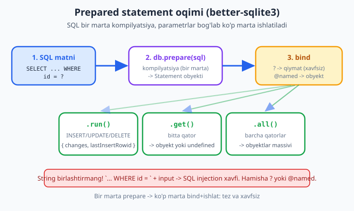
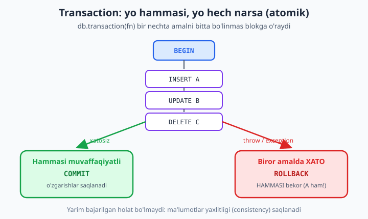

# 16 — SQLite bilan ishlash (better-sqlite3)

[⬅️ Oldingi: 15 — Validatsiya va xato boshqaruvi](./15-validatsiya-xato.md) · [🏠 README](./README.md) · [Keyingi: 17 — MySQL: mysql2, pool, tranzaksiya ➡️](./17-mysql.md)

> **Bu bobda:** Nihoyat ma'lumotlarni **haqiqatan saqlaymiz**. Avval nega in-memory massiv yetarli emasligini (server qayta ishga tushganda hamma narsa yo'qoladi) tushunamiz. So'ng **SQLite** bilan tanishamiz — fayl-asosli, server talab qilmaydigan, ilovaga "ichiga o'rnatilgan" (embedded) ma'lumotlar bazasi: kichik-o'rta loyiha va prototip uchun ideal. **better-sqlite3** drayverini o'rnatamiz va uning **sinxron** API si nega bu yerda aynan to'g'ri tanlov ekanini ko'ramiz. `new Database`, `CREATE TABLE` (schema, turlar, `PRIMARY KEY AUTOINCREMENT`, `NOT NULL`), **prepared statements** (`db.prepare` -> `run`/`get`/`all`), parametr bog'lash (`?` pozitsion va `@named`) va u **SQL injection** dan qanday himoya qilishini o'rganamiz. To'liq **CRUD** (insert -> `lastInsertRowid`, select, update -> `changes`, delete), **tranzaksiya** (`db.transaction(fn)` — atomik, yo hammasi yo hech narsa), indeks haqida qisqacha. REAL KEYS: oldingi boblardagi vazifa (tasks) API ni in-memory massivdan **haqiqiy SQLite saqlash** ga ko'chiramiz — **repository qatlami** bilan. Hamma kod Node 24.12 + better-sqlite3 12.10 da ishga tushirib tasdiqlangan.

---

## Nega ma'lumotlar bazasi kerak?

Oldingi boblarda — REST API (14-bob) va validatsiya (15-bob) da — biz vazifalarni oddiy massivda saqladik:

```js
// 14-15 boblardagi yondashuv: ma'lumot xotirada (RAM) yashaydi
let tasks = [];
let nextId = 1;

function createTask(title) {
  const task = { id: nextId++, title, done: false };
  tasks.push(task);
  return task;
}
```

Bu o'rganish uchun yaxshi edi, lekin unda **bitta o'ldiruvchi kamchilik** bor: bu ma'lumotlar faqat jarayon (process) **xotirasida** yashaydi. Serverni `Ctrl+C` bilan to'xtatsangiz yoki u qulab tushsa, deploy paytida qayta ishga tushsa — `tasks` massivi yana `[]` ga aylanadi. Foydalanuvchi kiritgan hamma narsa **g'oyib bo'ladi**.

Buni bir tajriba bilan ko'rib chiqaylik:

```js
// xotira-yo'qolish.mjs
let tasks = [];
tasks.push({ id: 1, title: "Muhim vazifa" });

console.log("Hozir massivda:", tasks.length, "ta vazifa");
// node ni to'xtatib, qaytadan ishga tushiring -> yana 0 ta
```

Har safar `node xotira-yo'qolish.mjs` ni ishga tushirsangiz, natija **doim "1 ta"** bo'ladi — chunki oldingi safargi qator hech qaerda saqlanmagan. Real ilovada bu falokat: bank tranzaksiyasi, foydalanuvchi profili yoki buyurtma serverni qayta yuklash bilan yo'qolib ketsa, hech kim bunday ilovaga ishonmaydi.

Bizga **persistent** (doimiy) saqlash kerak — jarayon o'lsa ham omon qoladigan joy. Bu odatda **ma'lumotlar bazasi** (database) bo'ladi. Ma'lumotlar bazasi bizga shularni beradi:

- **Doimiylik (persistence)** — ma'lumot diskda, qayta ishga tushishdan keyin ham turadi.
- **So'rovlar (queries)** — "barcha bajarilmagan vazifalar"ni filtrlash, saralash, sanash — SQL bilan.
- **Yaxlitlik (integrity)** — `NOT NULL`, `UNIQUE`, tiplar orqali noto'g'ri ma'lumotni rad etish.
- **Bir vaqtdalik (concurrency)** — bir nechta so'rov bir vaqtda xavfsiz ishlashi.

Endi savol — **qaysi** ma'lumotlar bazasi? Birinchi qadamda eng sodda va kuchli tanlovni olamiz: **SQLite**.

---

## SQLite nima?

Ko'pchilik ma'lumotlar bazasi deganda alohida **server** dasturni tasavvur qiladi: PostgreSQL yoki MySQL ni o'rnatasiz, u doimo ishlab turadi, ilovangiz unga tarmoq orqali (TCP, port) ulanadi. Bu kuchli, lekin og'ir: server o'rnatish, sozlash, ishga tushirib turish kerak.

**SQLite** — butunlay boshqa falsafa. U **server emas**. U — bitta **fayl** va shu fayl bilan ishlaydigan **kutubxona**. Sizning butun ma'lumotlar bazangiz — jadvallar, indekslar, hamma narsa — diskdagi `mydata.db` degan **bitta faylda** turadi. Ilovangiz shu faylni to'g'ridan-to'g'ri o'qiydi va yozadi, hech qanday tarmoq, port, alohida jarayon yo'q.

Asosiy xususiyatlari:

- **Fayl-asosli** — butun baza bitta `.db` faylda. Nusxa olish = faylni ko'chirish.
- **Server kerakmas (serverless)** — o'rnatib, ishga tushirib turadigan alohida dastur yo'q. Drayver ilovangizning bir qismi.
- **Embedded (o'rnatilgan)** — kutubxona to'g'ridan-to'g'ri jarayoningiz ichida ishlaydi. Ulanish — funksiya chaqiruvi, tarmoq so'rovi emas.
- **Nol konfiguratsiya** — login, parol, port sozlash yo'q. Fayl yo'lini berasiz, tamom.
- **Juda keng tarqalgan** — telefoningizda, brauzeringizda, samolyot bortida — dunyodagi eng ko'p ishlatiladigan DB. Standartlashtirilgan, ishonchli.

SQLite **qachon ideal**:

- Kichik va o'rta loyihalar, ichki asboblar, CLI ilovalar.
- Prototip va MVP — tezda ishga tushirish kerak, server sozlashga vaqt yo'q.
- Desktop/mobil ilovalar (lokal saqlash).
- Testlar — `:memory:` baza har test uchun toza, juda tez.

SQLite **qachon yetarli emas**: bir vaqtning o'zida **ko'p yozuvchi** (yuzlab parallel `INSERT`) bo'lgan, bir nechta serverga tarqatilgan (distributed) yuqori yuklamali tizimlar. Bunday holatda MySQL/PostgreSQL ga o'tasiz — keyingi bob (17 — MySQL) aynan shu haqida. Lekin bu bobni o'zlashtirsangiz, SQL va CRUD tushunchalari **bir xil** bo'lgani uchun MySQL ga o'tish oson bo'ladi.

> **Eslatma:** SQL tilining o'zini — `SELECT`, `JOIN`, `GROUP BY`, indekslar, normalizatsiya — chuqurroq o'rganmoqchi bo'lsangiz, alohida [SQL kitobimizga](../sql/README.md) qarang. Bu bobda biz SQL ni **Node ichidan** ishlatishga e'tibor qaratamiz.

---

## better-sqlite3: nega sinxron API?

Node uchun SQLite ni ishlatishning bir nechta yo'li bor (`node:sqlite` o'rnatilgan modul, `sqlite3` paketi va h.k.), lekin amaliyotda eng mashhur va eng tez tanlov — **better-sqlite3**. Uning eng diqqatga sazovor jihati: API si **sinxron** (synchronous).

To'xtang — oldingi boblarda biz "fayl/tarmoq operatsiyalarini hech qachon bloklamaslik kerak, `async/await` ishlating" deb o'rgandik ([6-bob, asinxron](./06-asinxron.md))! Endi nega birdan sinxron?

Sabab — **kontekst**. Node'da asinxronlik nima uchun kerak edi? Chunki diskdan o'qish yoki tarmoqqa so'rov yuborish **sekin** (millisekundlar) va bu vaqtda yagona thread (event loop) bloklanib qolsa, butun server muzlaydi. Lekin SQLite holatida:

- Baza — **bir xil mashinadagi lokal fayl**, tarmoq yo'q. O'qish/yozish **mikrosekundlar** ichida bo'ladi.
- better-sqlite3 SQLite ni jarayon ichida (in-process) ishlatadi. So'rov — bu shunchaki C funksiyasini chaqirish, "kutish" deyarli yo'q.

Bunday tez operatsiyalar uchun asinxronlik **foyda emas, zarar** keltiradi: har `await` qo'shimcha Promise, mikrotask navbati, kontekst almashinuvi degani. Bu lokal SQLite chaqiruvini **sekinlashtiradi**. better-sqlite3 mualliflari o'lchovlar bilan ko'rsatishgan: sinxron API real holatlarda asinxron drayverlardan **tezroq**.

Sinxron API ning yana bir ulkan ustunligi — **kod soddaligi**:

```js
// Sinxron (better-sqlite3) — toza, oson o'qiladigan
const user = db.prepare("SELECT * FROM users WHERE id = ?").get(5);
console.log(user.name);

// Asinxron bo'lganda (taqqoslash uchun) — har joyda await
// const user = await db.get("SELECT * FROM users WHERE id = ?", 5);
```

`try/catch` ham oddiy ishlaydi, `await` zanjirlari yo'q, tranzaksiyalar tabiiy yoziladi. Qisqasi: **lokal, juda tez fayl bazasi** uchun sinxron API to'g'ri muhandislik tanlovi.

> **Diqqat:** Sinxron API event loop ni operatsiya davomida **bloklaydi**. SQLite chaqiruvi mikrosekund bo'lgani uchun bu odatda muammo emas. Lekin **juda katta** so'rov (millionlab qator) ustida ishlasangiz, uni bo'laklab yoki worker thread'da bajaring. Oddiy CRUD uchun esa hech qanday muammo yo'q.

### O'rnatish

better-sqlite3 — **native** (C++) modul, lekin u tayyor (prebuilt) binarlarni yuklab oladi, shuning uchun odatda kompilyator kerak bo'lmaydi:

```bash
npm install better-sqlite3
```

Loyihamiz ESM ekanini `package.json` da belgilaymiz (kitob bo'yi shunday qilamiz):

```json
{
  "name": "tasks-sqlite",
  "type": "module",
  "version": "1.0.0"
}
```

Bu kitobni yozishda `better-sqlite3@12.10.0` Node v24.12 da muammosiz o'rnatildi va ishladi (`added 38 packages`, kompilyatsiya talab qilinmadi).

---

## Bazani ochish va birinchi jadval

Drayverni import qilib, bazani ochamiz. `new Database(yo'l)` — fayl mavjud bo'lsa ochadi, bo'lmasa **yaratadi**:

```js
import Database from "better-sqlite3";

// Faylga bog'lab ochish — fayl yo'q bo'lsa avtomatik yaratiladi
const db = new Database("tasks.db");

// Yoki: testlar uchun butunlay xotirada (diskda fayl yo'q, juda tez)
// const db = new Database(":memory:");

// Tavsiya etilgan ikkita pragma:
db.pragma("journal_mode = WAL");  // tezroq, parallel o'qish/yozishga yaxshi
db.pragma("foreign_keys = ON");   // tashqi kalitlarni tekshir (default o'chiq)
```

Ikkita `pragma` haqida qisqacha:

- **`journal_mode = WAL`** (Write-Ahead Logging) — yozishni tezlashtiradi va o'qish bilan yozishni bir vaqtda yaxshiroq qiladi. Ishlab chiqarish (production) uchun deyarli har doim yoqiladi.
- **`foreign_keys = ON`** — SQLite tarixiy sabablarga ko'ra tashqi kalit cheklovlarini **default o'chiq** holda qoldiradi. Yoqmasangiz, `REFERENCES` yozsangiz ham tekshirilmaydi. Shuning uchun har ulanishda yoqing.

Endi **jadval yaratamiz**. `db.exec(...)` — natija qaytarmaydigan SQL (DDL — `CREATE`, `DROP` va h.k.) uchun:

```js
db.exec(`
  CREATE TABLE IF NOT EXISTS tasks (
    id         INTEGER PRIMARY KEY AUTOINCREMENT,
    title      TEXT    NOT NULL,
    done       INTEGER NOT NULL DEFAULT 0,
    priority   INTEGER NOT NULL DEFAULT 1,
    created_at TEXT    NOT NULL DEFAULT (datetime('now'))
  );
`);
```

Bu yerda nimalar bor — qatorma-qator:

- **`IF NOT EXISTS`** — jadval allaqachon bo'lsa, xato bermaydi (server qayta ishga tushganda muhim).
- **`id INTEGER PRIMARY KEY AUTOINCREMENT`** — har qator uchun avtomatik o'suvchi noyob raqam. `PRIMARY KEY` — birlamchi kalit (qatorni noyob aniqlaydi). `AUTOINCREMENT` — yangi qatorga avtomatik keyingi raqam beriladi.
- **`title TEXT NOT NULL`** — matn, **bo'sh bo'lishi mumkin emas**. `NULL` kiritsangiz, baza rad etadi.
- **`done INTEGER NOT NULL DEFAULT 0`** — SQLite'da alohida `BOOLEAN` tip yo'q; `0`/`1` (false/true) sifatida `INTEGER` ishlatiladi. `DEFAULT 0` — bermasangiz, `0` qo'yiladi.
- **`created_at TEXT DEFAULT (datetime('now'))`** — yaratilgan vaqt; SQLite sanani matn (ISO) sifatida saqlaydi.

**SQLite tiplari** haqida ikki og'iz so'z. SQLite "dinamik tip"li: asosiy **storage class** lar — `INTEGER`, `REAL` (kasr son), `TEXT`, `BLOB` (ikkilik ma'lumot) va `NULL`. `VARCHAR(255)`, `BOOLEAN`, `DATETIME` kabi nomlarni yozsangiz ham bo'ladi, lekin SQLite ularni shu beshta sinfdan biriga moslaydi. Boshlovchi sifatida `INTEGER`, `TEXT`, `REAL` ni eslab qolsangiz yetarli.

---

## Prepared statements: prepare -> run/get/all

Endi eng muhim tushuncha — **prepared statement** (tayyorlangan ifoda). Ma'lumot o'qish va yozishni biz aynan shu orqali qilamiz.

`db.prepare(sql)` SQL matnini **bir marta kompilyatsiya** qiladi va qayta ishlatish mumkin bo'lgan `Statement` obyektini qaytaradi. So'ng shu obyektda uchta metoddan birini chaqiramiz:

| Metod | Qachon | Qaytaradi |
|-------|--------|-----------|
| `.run(...)` | `INSERT`, `UPDATE`, `DELETE` | `{ changes, lastInsertRowid }` |
| `.get(...)` | **bitta** qator kerak (`SELECT ... WHERE id=?`) | qator obyekti yoki `undefined` |
| `.all(...)` | **barcha** qatorlar kerak | obyektlar massivi |



Diagrammada ko'rinib turibdi: SQL matni `prepare` bilan bir marta kompilyatsiya qilinadi, keyin parametrlar **bog'lanib** (bind), `run`/`get`/`all` bilan **ko'p marta** ishlatiladi. Bu ikki ustunlik beradi: **tezlik** (qayta kompilyatsiya yo'q) va **xavfsizlik** (parametrlar SQL matnidan ajratiladi — quyida).

Oddiy misol — bitta qatorni o'qish:

```js
const getById = db.prepare("SELECT * FROM tasks WHERE id = ?");
const task = getById.get(1);   // ? o'rniga 1 bog'lanadi
console.log(task);  // { id: 1, title: '...', done: 0, ... } yoki undefined
```

### Parametr bog'lash: `?` pozitsion va `@named`

Parametrlarni SQL ga **ikki xil** usulda bog'lash mumkin:

**1) Pozitsion `?`** — argumentlar tartib bo'yicha mos keladi:

```js
const insert = db.prepare("INSERT INTO tasks (title, priority) VALUES (?, ?)");
insert.run("Sutni sotib olish", 2);   // ?1 = title, ?2 = priority
```

**2) Nomli `@name`** (yoki `:name`, `$name`) — argument sifatida **obyekt** beriladi, kalitlar nomlarga mos:

```js
const insertNamed = db.prepare(
  "INSERT INTO tasks (title, priority) VALUES (@title, @priority)"
);
insertNamed.run({ title: "Kitob o'qish", priority: 3 });
```

Nomli parametrlar — ayniqsa ko'p ustunli `INSERT`/`UPDATE` da — **ancha o'qiluvchan**, chunki qaysi qiymat qayerga borishini ko'rasiz, tartibni hisoblab o'tirmaysiz. Ikkalasi bir xil tez, tanlov sizniki.

### Nega string birlashtirmaslik kerak: SQL injection

Endi eng muhim **xavfsizlik** darsi. Ko'p yangi dasturchi instinktiv ravishda SQL ni **string birlashtirib** yozadi — bu **xavfli xato**:

```js
// XATO — HECH QACHON BUNDAY YOZMANG!
const userInput = "5";
const bad = db.prepare("SELECT * FROM tasks WHERE id = " + userInput).get();
```

Nega xato? Foydalanuvchi `userInput` o'rniga oddiy raqam emas, **zararli SQL** kiritsa-chi? Masalan:

```js
// Tasavvur qiling, userInput tashqaridan keldi:
const userInput = "0; DROP TABLE tasks; --";
// Birlashtirilgan SQL: SELECT * FROM tasks WHERE id = 0; DROP TABLE tasks; --
// Natija: butun jadval o'chib ketishi mumkin!
```

Bu **SQL injection** hujumi — tarixdagi eng keng tarqalgan veb-zaifliklardan biri. Foydalanuvchi kiritgan matn SQL **kodga** aralashib ketadi.

**Yechim — har doim parametr bog'lash.** Prepared statement'da `?` yoki `@name` ishlatganingizda, drayver kiritilgan qiymatni **sof ma'lumot** sifatida, hech qachon bajariladigan kod sifatida ko'rmaydi. Hatto eng yovuz matnni bog'lasangiz ham, u shunchaki bitta `title` qiymati bo'lib qoladi:

```js
const insert = db.prepare("INSERT INTO tasks (title, priority) VALUES (?, ?)");

// Bu "yovuz" matn shunchaki oddiy title bo'lib saqlanadi — hech narsa buzilmaydi
const evil = "x'; DROP TABLE tasks; --";
insert.run(evil, 1);

// Jadval omon — DROP bajarilmadi, bu shunchaki matn qiymati
const count = db.prepare("SELECT COUNT(*) AS c FROM tasks").get();
console.log("Jadval omon, qatorlar soni =", count.c);
```

Biz buni haqiqatan ishga tushirdik — chiqishda `Jadval omon, qatorlar soni = 3` — ya'ni `DROP TABLE` **bajarilmadi**, yovuz matn shunchaki bir qatorning `title` qiymati bo'lib qoldi. Qoidani temirdek eslang: **foydalanuvchi ma'lumotini hech qachon SQL stringiga birlashtirmang — har doim `?` yoki `@name` orqali bog'lang.**

---

## To'liq CRUD

Endi to'rtta asosiy operatsiyani — **C**reate, **R**ead, **U**pdate, **D**elete — birma-bir ko'ramiz. Quyidagi kodning hammasi ishga tushirib tasdiqlangan.

### Create (INSERT) -> `lastInsertRowid`

```js
const insert = db.prepare("INSERT INTO tasks (title, priority) VALUES (?, ?)");

const info = insert.run("Sutni sotib olish", 2);
console.log(info.lastInsertRowid);  // 1  — yangi qator id si
console.log(info.changes);          // 1  — nechta qator o'zgardi
```

`.run()` ikkita foydali maydonli obyekt qaytaradi:

- **`lastInsertRowid`** — yangi qo'shilgan qatorning `id` si (`AUTOINCREMENT` bergan raqam). Buni saqlab, darhol yangi obyektni qaytarish uchun ishlatamiz.
- **`changes`** — ta'sirlangan qatorlar soni.

### Read (SELECT): `get` va `all`

```js
// Bitta qator — get
const getById = db.prepare("SELECT * FROM tasks WHERE id = ?");
console.log(getById.get(1));
// { id: 1, title: 'Sutni sotib olish', done: 0, priority: 2, created_at: '...' }

// Barcha qatorlar — all (saralash bilan)
const listAll = db.prepare("SELECT id, title, priority FROM tasks ORDER BY priority DESC");
console.log(listAll.all());
// [ { id: 2, title: "Kitob o'qish", priority: 3 }, { id: 1, ... }, ... ]
```

`.get()` topilmasa `undefined` qaytaradi (massiv emas) — bu "topilmadi" ni tekshirishni osonlashtiradi:

```js
const task = getById.get(999);
if (!task) {
  console.log("Bunday vazifa yo'q");
}
```

### Update -> `changes`

```js
const update = db.prepare("UPDATE tasks SET done = 1 WHERE id = @id");
const info = update.run({ id: 1 });

console.log(info.changes);   // 1 — bitta qator yangilandi
// Agar bunday id bo'lmasa, changes = 0 bo'ladi (xato emas!)
```

`changes` bu yerda juda muhim: u **0** bo'lsa — hech narsa yangilanmadi (ehtimol bunday `id` yo'q). API'da buni "404 Not Found" ga aylantirish uchun ishlatamiz.

### Delete

```js
const remove = db.prepare("DELETE FROM tasks WHERE id = ?");
const info = remove.run(3);

console.log(info.changes);   // 1 o'chirildi (yoki 0 — topilmadi)
```

Mana shu to'rt operatsiya — har qanday ma'lumotlar bazasi ilovasining poydevori. Quyida bularni ishga tushirganimizda olingan **haqiqiy chiqish**:

```text
INSERT lastInsertRowid = 1 changes = 1
INSERT named rowid = 2
GET id=1 => { id: 1, title: 'Sutni sotib olish', done: 0, priority: 2, created_at: '2026-06-12 08:01:04' }
ALL => [ { id: 2, title: "Kitob o'qish", priority: 3 }, { id: 1, title: 'Sutni sotib olish', priority: 2 }, { id: 3, title: 'Mashq qilish', priority: 1 } ]
UPDATE changes = 1
DELETE changes = 1
```

---

## Tranzaksiya: atomiklik

Ba'zan bir nechta operatsiya **bir butun** bo'lishi kerak. Klassik misol — pul o'tkazmasi: bir hisobdan ayirish va boshqasiga qo'shish. Agar ayirish bo'lib, qo'shish (masalan, xato tufayli) bo'lmasa — pul **yo'qoladi**. Bizga kafolat kerak: **yo hammasi, yo hech narsa**.

Bu — **tranzaksiya** (transaction). U bir nechta SQL amalini bo'linmas (atomik) blokga o'raydi:

- Hammasi muvaffaqiyatli bo'lsa -> **COMMIT** (o'zgarishlar saqlanadi).
- Biror joyda xato bo'lsa -> **ROLLBACK** (hammasi bekor qilinadi, hatto allaqachon bajarilganlari ham).



better-sqlite3'da bu juda nafis ishlaydi: `db.transaction(fn)` funksiyangizni o'rab, **yangi funksiya** qaytaradi. Shu yangi funksiyani chaqirsangiz, ichidagi hamma narsa avtomatik `BEGIN ... COMMIT` orasida bajariladi; ichida xato (`throw`) bo'lsa — avtomatik `ROLLBACK`:

```js
const insert = db.prepare("INSERT INTO tasks (title, priority) VALUES (?, ?)");

// fn ni tranzaksiyaga o'raymiz
const insertMany = db.transaction((items) => {
  for (const it of items) {
    insert.run(it.title, it.priority);
  }
  return items.length;
});

// Endi chaqiramiz — hammasi BITTA atomik blokda
const n = insertMany([
  { title: "A", priority: 1 },
  { title: "B", priority: 2 },
  { title: "C", priority: 3 },
]);
console.log("Qo'shildi:", n, "ta");   // Qo'shildi: 3 ta
```

Bu nafaqat xavfsiz, balki **tez** ham: SQLite ko'p `INSERT` ni bitta tranzaksiyaga jamlaganda, har bittasini alohida diskka yozish o'rniga, hammasini birga yozadi — bu ko'plab qator qo'shishda **o'nlab marta tezroq**.

**Rollback ni amalda** ko'raylik. Quyidagi tranzaksiyada ataylab `NOT NULL` ni buzamiz:

```js
const before = db.prepare("SELECT COUNT(*) AS c FROM tasks").get().c;

const failTx = db.transaction(() => {
  insert.run("yaxshi-qator", 1);   // bu muvaffaqiyatli bo'ladi...
  insert.run(null, 1);             // XATO: title NOT NULL — throw qiladi
});

try {
  failTx();
} catch (e) {
  console.log("Xato ushlandi:", e.message);
  // "yaxshi-qator" ham BEKOR qilinadi — chunki butun tranzaksiya rollback
}

const after = db.prepare("SELECT COUNT(*) AS c FROM tasks").get().c;
console.log("before:", before, "after:", after);  // teng — hech narsa qo'shilmadi
```

Bizning haqiqiy chiqishimiz:

```text
TRANSACTION qo'shildi = 3 ta
Transaction xatosi ushlandi: NOT NULL constraint failed: tasks.title
Rollback ishladi = true (before 6 after 6 )
```

Diqqat qiling: birinchi `insert.run("yaxshi-qator", 1)` **muvaffaqiyatli** bajarilgan edi, lekin keyingi qator xato bergani uchun **u ham bekor qilindi** — qatorlar soni o'zgarmadi (`before === after`). Aynan shuni xohlaymiz: yarim bajarilgan, buzuq holat **bo'lmaydi**.

---

## Indeks haqida qisqacha

Jadval kattalashganda (minglab, millionlab qator) `WHERE` bilan qidirish sekinlashishi mumkin — chunki SQLite har bir qatorni ketma-ket tekshirishga majbur (full scan). **Indeks** — bu ustun(lar) uchun saralangan ko'rsatkich; u qidiruvni keskin tezlashtiradi (telefon kitobidagi alifbo tartibi kabi):

```js
// Tez-tez done bo'yicha filtrlaymiz -> shu ustunga indeks
db.exec("CREATE INDEX IF NOT EXISTS idx_tasks_done ON tasks(done)");
```

Endi `SELECT * FROM tasks WHERE done = 0` ancha tezroq bo'ladi. Lekin indeks bepul emas: u disk joy egallaydi va har `INSERT`/`UPDATE`da yangilanishi kerak. Shuning uchun **faqat tez-tez qidiriladigan** ustunlarga indeks qo'ying, hammasiga emas.

`PRIMARY KEY` ustun (`id`) avtomatik indekslangan, shuning uchun `WHERE id = ?` doim tez. Indekslar, `EXPLAIN QUERY PLAN` va so'rovlarni optimallashtirish — chuqur mavzu; [SQL kitobida](../sql/README.md) batafsil ko'rsatilgan.

---

## REAL KEYS: vazifa API ni SQLite ga ko'chirish (repository qatlami)

Endi eng qiziq qism — 14-15 boblardagi **vazifa API** sini in-memory massivdan **haqiqiy SQLite saqlash** ga ko'chiramiz. To'g'ridan-to'g'ri route handler ichida `db.prepare(...)` yozishimiz mumkin edi, lekin yaxshiroq dizayn bor: **repository qatlami**.

**Repository** — bu ma'lumotlar bazasi bilan ishlashni bitta joyga jamlaydigan modul. Route handler'lar SQL ni umuman bilmaydi; ular faqat `repo.create(...)`, `repo.list()` kabi **ma'noli** metodlarni chaqiradi. Foydasi:

- **Ajratish** — agar ertaga SQLite'dan MySQL'ga (17-bob) o'tsangiz, faqat repository'ni o'zgartirasiz, route'lar tegmaydi.
- **Tezlik** — prepared statement'larni **bir marta** tayyorlab, qayta ishlatamiz.
- **Testlash** — repository'ni `:memory:` baza bilan alohida sinash oson.

### 1-fayl: `db.js` — bazani ochish va schema

```js
// db.js
import Database from "better-sqlite3";

export function openDb(file = "tasks.db") {
  const db = new Database(file);
  db.pragma("journal_mode = WAL");
  db.pragma("foreign_keys = ON");

  // Schema (idempotent — IF NOT EXISTS)
  db.exec(`
    CREATE TABLE IF NOT EXISTS tasks (
      id         INTEGER PRIMARY KEY AUTOINCREMENT,
      title      TEXT    NOT NULL,
      done       INTEGER NOT NULL DEFAULT 0,
      created_at TEXT    NOT NULL DEFAULT (datetime('now'))
    );
  `);
  return db;
}
```

### 2-fayl: `task-repo.js` — repository qatlami

```js
// task-repo.js
export function createTaskRepository(db) {
  // Statement larni BIR MARTA tayyorlaymiz — qayta ishlatamiz
  const stmts = {
    insert: db.prepare("INSERT INTO tasks (title) VALUES (@title)"),
    byId:   db.prepare("SELECT * FROM tasks WHERE id = ?"),
    all:    db.prepare("SELECT * FROM tasks ORDER BY id DESC"),
    toggle: db.prepare("UPDATE tasks SET done = NOT done WHERE id = ?"),
    remove: db.prepare("DELETE FROM tasks WHERE id = ?"),
  };

  return {
    create(title) {
      const info = stmts.insert.run({ title });
      // Yangi qo'shilgan qatorni to'liq qaytaramiz
      return stmts.byId.get(info.lastInsertRowid);
    },
    list() {
      return stmts.all.all();
    },
    find(id) {
      return stmts.byId.get(id);     // topilmasa undefined
    },
    toggle(id) {
      return stmts.toggle.run(id).changes > 0;   // o'zgardi-yo'qmi
    },
    remove(id) {
      return stmts.remove.run(id).changes > 0;
    },
    // Ko'p vazifani atomik qo'shish (seed)
    seed: db.transaction((titles) => {
      for (const t of titles) stmts.insert.run({ title: t });
    }),
  };
}
```

E'tibor bering: `find` topilmasa `undefined`, `toggle`/`remove` esa o'zgargan-o'zgarmaganini `boolean` qaytaradi — bu route qatlamida 404 ni aniqlashda asqotadi.

### 3-fayl: `server.js` — Express bilan ulash

Endi repository'ni [Express](./12-express-asoslari.md) bilan bog'laymiz. Route'larda **bironta ham SQL yo'q** — faqat repository chaqiruvi:

```js
// server.js
import express from "express";
import { openDb } from "./db.js";
import { createTaskRepository } from "./task-repo.js";

const db = openDb("tasks.db");
const repo = createTaskRepository(db);

const app = express();
app.use(express.json());

// Hammasini ko'rish
app.get("/tasks", (req, res) => {
  res.json(repo.list());
});

// Bittasini ko'rish — topilmasa 404
app.get("/tasks/:id", (req, res) => {
  const task = repo.find(Number(req.params.id));
  if (!task) return res.status(404).json({ error: "Topilmadi" });
  res.json(task);
});

// Yangi yaratish — minimal validatsiya (15-bob to'liqrog'i)
app.post("/tasks", (req, res) => {
  const { title } = req.body ?? {};
  if (!title || typeof title !== "string") {
    return res.status(400).json({ error: "title (matn) majburiy" });
  }
  const created = repo.create(title);
  res.status(201).json(created);
});

// done holatini almashtirish
app.patch("/tasks/:id/toggle", (req, res) => {
  const ok = repo.toggle(Number(req.params.id));
  if (!ok) return res.status(404).json({ error: "Topilmadi" });
  res.json(repo.find(Number(req.params.id)));
});

// O'chirish
app.delete("/tasks/:id", (req, res) => {
  const ok = repo.remove(Number(req.params.id));
  if (!ok) return res.status(404).json({ error: "Topilmadi" });
  res.status(204).end();
});

app.listen(3000, () => console.log("Server: http://localhost:3000"));
```

Endi serverni `Ctrl+C` bilan to'xtatib, qayta ishga tushirsangiz ham — vazifalar **omon qoladi**, chunki ular `tasks.db` faylida saqlangan. Mana shu — in-memory massivdan haqiqiy bazaga o'tishning butun ma'nosi.

### Repository'ni tekshirish (`:memory:` baza bilan)

Repository'ni serversiz, toza xotira bazasida sinab ko'rdik — natija aynan kutilganidek:

```js
import Database from "better-sqlite3";
import { createTaskRepository } from "./task-repo.js";
// (test uchun schema'ni xotira bazaga qo'shamiz)

const db = new Database(":memory:");
db.exec(`CREATE TABLE tasks (
  id INTEGER PRIMARY KEY AUTOINCREMENT,
  title TEXT NOT NULL, done INTEGER NOT NULL DEFAULT 0,
  created_at TEXT NOT NULL DEFAULT (datetime('now')))`);
const repo = createTaskRepository(db);

const t = repo.create("Birinchi vazifa");
repo.seed(["A vazifa", "B vazifa", "C vazifa"]);  // tranzaksiya bilan
console.log("list count:", repo.list().length);    // 4
console.log("toggle:", repo.toggle(t.id), "done:", repo.find(t.id).done); // true, 1
console.log("remove:", repo.remove(t.id), "qoldi:", repo.list().length);  // true, 3
```

Haqiqiy chiqish:

```text
create => { id: 1, title: 'Birinchi vazifa', done: 0, created_at: '2026-06-12 08:01:22' }
list count => 4
toggle => true endi done = 1
remove => true qoldi = 3
OK: repository qatlami ishladi
```

In-memory `:memory:` baza har test ishga tushganda **toza** boshlanadi va diskka tegmaydi — shuning uchun avtomat testlar (vitest/supertest) uchun ideal. Test va integratsiya mavzusiga keyingi boblar va [TypeScript kitobida](../typescript/README.md) qaytamiz.

---

## SQL ni chuqurroq o'rganish

Bu bobda biz SQL ni **Node ichidan ishlatishga** e'tibor qaratdik: drayver, prepared statement, CRUD, tranzaksiya. Lekin SQL tilining o'zi — `JOIN` bilan jadvallarni bog'lash, `GROUP BY` va agregat funksiyalar (`COUNT`, `SUM`, `AVG`), pastki so'rovlar (subquery), `LIKE` qidiruv, normalizatsiya, tranzaksiya izolyatsiya darajalari — alohida, katta mavzu.

Bularning hammasi [SQL kitobimizda](../sql/README.md) bosqichma-bosqich yoritilgan. U yerda o'rgangan har bir SQL so'rovni shu bobdagi `db.prepare(...)` ga to'g'ridan-to'g'ri qo'yib ishlatishingiz mumkin — sintaksis bir xil. Keyingi bobda esa ([17 — MySQL](./17-mysql.md)) xuddi shu CRUD tushunchalarini **server-asosli** bazaga — ulanish pool va asinxron API bilan — ko'chiramiz.

---

## Mashqlar

### Oson

**1.** `:memory:` baza oching, `notes(id INTEGER PRIMARY KEY AUTOINCREMENT, body TEXT NOT NULL)` jadvalini yarating, uchta eslatma qo'shing va `.all()` bilan hammasini chop eting.

**2.** Bitta prepared statement bilan bitta eslatmani `id` bo'yicha oling (`.get(id)`). Mavjud bo'lmagan `id` so'rasangiz, qaytgan qiymat nima bo'ladi? Tekshiring.

**3.** Quyidagi xato kodni tuzating: `db.prepare("SELECT * FROM notes WHERE id = " + userId)`. Nega bu xavfli va to'g'ri varianti qanday?

### O'rta

**4.** `notes` jadvaliga `created_at TEXT NOT NULL DEFAULT (datetime('now'))` ustunini qo'shib qayta yarating. Eslatma qo'shgandan keyin `.run()` qaytargan `lastInsertRowid` ni ishlatib, **yangi qo'shilgan qatorni** to'liq qaytaring (`byId.get(...)`).

**5.** `UPDATE notes SET body = @body WHERE id = @id` statement yozing. Mavjud va mavjud bo'lmagan `id` uchun `.run(...).changes` qiymatini solishtiring.

**6.** Bitta tranzaksiya yozing: u 5 ta eslatma qo'shsin. Keyin tranzaksiya **vaqtida** ataylab xato (`NOT NULL` buzilishi) keltirib chiqaring va keyin jadvaldagi qatorlar soni o'zgarmaganini (rollback) tasdiqlang.

### Qiyin

**7.** REAL KEYS dagi `createTaskRepository` ni kengaytiring: `done` bo'yicha filtrlaydigan `listByStatus(done)` metodi qo'shing (`SELECT * FROM tasks WHERE done = ?`). `done` ustuniga indeks yarating. Keyin Express'ga `GET /tasks?done=true` query parametrini qo'shing.

**8.** `task-repo.js` ni `:memory:` baza bilan to'liq sinaydigan kichik test skript yozing (vitest siz, oddiy `assert` bilan): `create` -> `find` -> `toggle` -> `remove` zanjirini tekshiring, har bosqichda kutilgan natijani `node:assert` bilan tasdiqlang.

<details>
<summary><b>Yechimlar</b></summary>

**1-2.**

```js
import Database from "better-sqlite3";
const db = new Database(":memory:");
db.exec("CREATE TABLE notes (id INTEGER PRIMARY KEY AUTOINCREMENT, body TEXT NOT NULL)");

const insert = db.prepare("INSERT INTO notes (body) VALUES (?)");
insert.run("Birinchi");
insert.run("Ikkinchi");
insert.run("Uchinchi");

console.log(db.prepare("SELECT * FROM notes").all());

// 2:
const byId = db.prepare("SELECT * FROM notes WHERE id = ?");
console.log(byId.get(2));    // { id: 2, body: 'Ikkinchi' }
console.log(byId.get(999));  // undefined  <- topilmaganda massiv emas, undefined
```

**3.** String birlashtirish SQL injection ga ochiq — `userId` ichida `"1; DROP TABLE notes; --"` bo'lsa, jadval o'chishi mumkin. To'g'ri variant — parametr bog'lash:

```js
// XATO: const q = db.prepare("SELECT * FROM notes WHERE id = " + userId);
// TO'G'RI:
const q = db.prepare("SELECT * FROM notes WHERE id = ?");
const note = q.get(userId);   // userId xavfsiz bog'lanadi
```

**4.**

```js
db.exec(`CREATE TABLE notes (
  id INTEGER PRIMARY KEY AUTOINCREMENT,
  body TEXT NOT NULL,
  created_at TEXT NOT NULL DEFAULT (datetime('now')))`);

const insert = db.prepare("INSERT INTO notes (body) VALUES (@body)");
const byId   = db.prepare("SELECT * FROM notes WHERE id = ?");

function addNote(body) {
  const info = insert.run({ body });
  return byId.get(info.lastInsertRowid);   // to'liq yangi qator
}
console.log(addNote("Salom"));
// { id: 1, body: 'Salom', created_at: '2026-...' }
```

**5.**

```js
const upd = db.prepare("UPDATE notes SET body = @body WHERE id = @id");
console.log(upd.run({ id: 1, body: "Yangilangan" }).changes);  // 1
console.log(upd.run({ id: 999, body: "Yo'q" }).changes);       // 0 (xato emas!)
```

`changes === 0` — "bunday qator yo'q" degani; API'da buni 404 ga aylantirasiz.

**6.**

```js
const insert = db.prepare("INSERT INTO notes (body) VALUES (?)");

const tx = db.transaction(() => {
  for (let i = 1; i <= 4; i++) insert.run("note " + i);  // 4 ta yaxshi
  insert.run(null);   // XATO: body NOT NULL -> throw -> rollback
});

const before = db.prepare("SELECT COUNT(*) AS c FROM notes").get().c;
try { tx(); } catch (e) { console.log("Rollback:", e.message); }
const after = db.prepare("SELECT COUNT(*) AS c FROM notes").get().c;
console.log("before:", before, "after:", after);  // teng — hech narsa qo'shilmadi
```

**7.**

```js
// task-repo.js ichida stmts ga qo'shing:
//   byStatus: db.prepare("SELECT * FROM tasks WHERE done = ? ORDER BY id DESC"),
// va metod:
listByStatus(done) {
  return stmts.byStatus.all(done ? 1 : 0);
}

// db.js schema'sidan keyin:
db.exec("CREATE INDEX IF NOT EXISTS idx_tasks_done ON tasks(done)");

// server.js — GET /tasks query parametri bilan:
app.get("/tasks", (req, res) => {
  if (req.query.done !== undefined) {
    const done = req.query.done === "true";
    return res.json(repo.listByStatus(done));
  }
  res.json(repo.list());
});
```

**8.**

```js
// repo.test.mjs
import assert from "node:assert/strict";
import Database from "better-sqlite3";
import { createTaskRepository } from "./task-repo.js";

const db = new Database(":memory:");
db.exec(`CREATE TABLE tasks (
  id INTEGER PRIMARY KEY AUTOINCREMENT,
  title TEXT NOT NULL, done INTEGER NOT NULL DEFAULT 0,
  created_at TEXT NOT NULL DEFAULT (datetime('now')))`);
const repo = createTaskRepository(db);

const t = repo.create("Test vazifa");
assert.equal(t.title, "Test vazifa");
assert.equal(t.done, 0);

assert.deepEqual(repo.find(t.id), t);          // find topadi
assert.equal(repo.find(999), undefined);       // yo'q -> undefined

assert.equal(repo.toggle(t.id), true);         // o'zgardi
assert.equal(repo.find(t.id).done, 1);         // endi bajarilgan

assert.equal(repo.remove(t.id), true);         // o'chdi
assert.equal(repo.remove(t.id), false);        // ikkinchi marta -> yo'q
assert.equal(repo.list().length, 0);

console.log("Hamma testlar o'tdi");
```

</details>

---

[⬅️ Oldingi: 15 — Validatsiya va xato boshqaruvi](./15-validatsiya-xato.md) · [🏠 README](./README.md) · [Keyingi: 17 — MySQL: mysql2, pool, tranzaksiya ➡️](./17-mysql.md)
