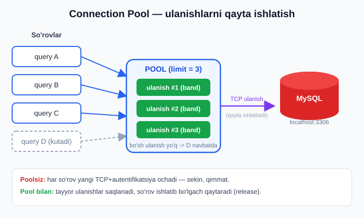
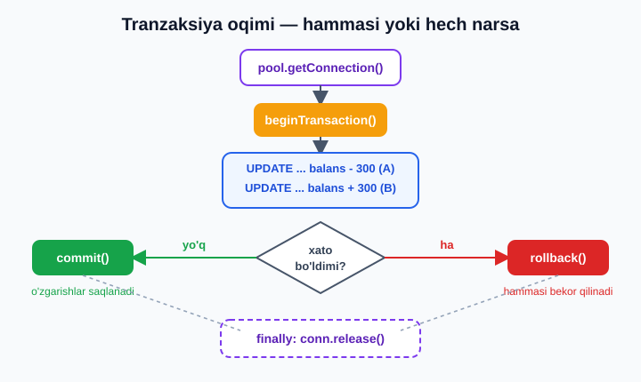

# 17 — MySQL: mysql2, pool, tranzaksiya

[⬅️ Oldingi: 16 — SQLite bilan ishlash](./16-sqlite.md) · [🏠 README](./README.md) · [Keyingi: 18 — Prisma ORM ➡️](./18-prisma.md)

> **Bu bobda:** SQLite'dan haqiqiy **server bazasiga** — MySQL'ga o'tamiz. Avval *nega* server-DB kerakligini (ko'p mijoz, tarmoq, masshtab) tushunamiz, so'ng **mysql2** drayverini (zamonaviy **promise** API'si bilan) o'rnatamiz. `createConnection` va `createPool` farqini, **connection pool** nega muhimligini (har so'rovga yangi TCP ulanish — qimmat) ko'ramiz. `query` va `execute` o'rtasidagi farqni — **prepared statement** va `?` parametr orqali **SQL injection** dan himoyani — chuqur o'rganamiz. CRUD'ni (`insertId`, `affectedRows`), **tranzaksiyalarni** (`beginTransaction`/`commit`/`rollback`, `finally` da `release`) pul o'tkazma misolida, `.env` bilan konfiguratsiyani va `ER_*` xato kodlarini ko'rib chiqamiz. **REAL KEYS:** vazifa API'sini MySQL'ga ko'chiramiz — pool + prepared statement + tranzaksiya bilan. Hamma kod bu mashinada **MySQL 8.0.43 da haqiqatan ishga tushirib** tasdiqlangan (yaratish -> CRUD -> tranzaksiya -> tozalash).

---

## SQLite yetarli emas bo'lganda

[16-bobda](./16-sqlite.md) SQLite bilan ishladik: butun baza bitta `.db` faylida yashaydi, server kerak emas, drayver Node'ning o'zida ishlaydi. Bu — mukammal **boshlanish**. Lekin ilovangiz o'sganda SQLite ikkita asosiy chegaraga uriladi.

**Birinchi muammo — bir nechta ilova bitta bazaga ulanishi.** SQLite — bu *fayl*. U yagona kompyuterdagi bitta jarayon uchun ideal. Ammo zamonaviy backend odatda bir nechta nusxada (instance) ishlaydi: ikki-uch server, har biri so'rovlarni qayta ishlaydi, lekin **bitta umumiy baza** bilan. SQLite faylini tarmoq orqali bir nechta serverga bo'lishishga urinish — buzilishlar va qulflanish (lock) muammolari demak. SQLite yozish paytida butun faylni qulflaydi: ko'p yozuvchi bo'lsa, ular navbatda kutadi.

**Ikkinchi muammo — tarmoq va masshtab.** Haqiqiy ilovada baza ko'pincha **alohida mashinada** turadi: ilova serverlari bir tomonda, ma'lumotlar bazasi serveri boshqa tomonda, ular tarmoq orqali gaplashadi. Bu sizga bazani mustaqil masshtablash, zaxiralash (backup), nusxalash (replication) imkonini beradi. SQLite buni qila olmaydi — u faylga bog'langan.

Aynan shu yerda **server-DB** (server ma'lumotlar bazasi) kerak bo'ladi. MySQL, PostgreSQL, MariaDB — bularning hammasi mustaqil **server jarayoni**: ular doimo ishlab turadi, tarmoq porti (MySQL uchun standart `3306`) orqali ulanishlarni qabul qiladi, bir vaqtning o'zida **minglab mijoz** bilan ishlaydi, har bir mijozning ruxsatini (login/parol) tekshiradi.

| | SQLite | MySQL (server-DB) |
|---|---|---|
| Joylashuvi | Bitta `.db` fayl | Alohida server jarayoni |
| Ulanish | To'g'ridan-to'g'ri faylga | Tarmoq orqali (TCP, port 3306) |
| Ko'p mijoz | Cheklangan (fayl qulfi) | Minglab parallel ulanish |
| Konkurent yozuv | Bittadan (lock) | Yuqori (qator-darajali lock) |
| Login/parol | Yo'q | Bor (foydalanuvchi boshqaruvi) |
| Masshtab/replikatsiya | Yo'q | Bor |
| Qachon | Lokal, kichik, ichki asbob, test | Ko'p foydalanuvchili, ishlab chiqarish |

> **Qachon server-DB?** Qoida sodda: agar bazaga **bir nechta ilova nusxasi** ulanadigan bo'lsa, yoki baza **alohida mashinada** turishi kerak bo'lsa, yoki **ko'p parallel yozuv** kutilsa — server-DB tanlang. Aks holda (CLI asbob, ish stoli ilovasi, prototip) SQLite ko'pincha yetarli va soddaroq.

Bu bobda **MySQL** — dunyodagi eng keng tarqalgan ochiq server-DB'lardan biri — bilan ishlaymiz. SQL tilining o'zini (JOIN, indeks, normalizatsiya, murakkab so'rovlar) bu yerda qayta o'rgatmaymiz; u alohida chuqur mavzu. SQL'ni mustahkamlash uchun [`../sql/README.md`](../sql/README.md) kitobiga murojaat qiling. Bu bobning markazida — **Node'dan MySQL'ga qanday ulanish va u bilan to'g'ri, xavfsiz ishlash**.

---

## mysql2 drayverini o'rnatish

Node'dan MySQL bilan gaplashish uchun **drayver** kerak — bu MySQL tarmoq protokolini biladigan kutubxona. Eng mashhur va tavsiya etiladigani — **mysql2**. Nomida "2" bor, chunki u eski `mysql` paketining tezroq, zamonaviyroq vorisi. mysql2 ning eng muhim afzalligi — u **prepared statement** ni qo'llab-quvvatlaydi (buni keyinroq ko'ramiz) va **promise** API'si bor.

Yangi loyiha ochib, o'rnatamiz:

```bash
mkdir mysql-app && cd mysql-app
npm init -y
npm install mysql2 dotenv
```

`package.json` ga ESM yoqamiz (butun kitob bo'yicha biz zamonaviy `import`/`export` ishlatamiz):

```json
{
  "name": "mysql-app",
  "type": "module",
  "dependencies": {
    "dotenv": "^16.4.0",
    "mysql2": "^3.11.0"
  }
}
```

**Promise API.** mysql2 ikki uslubni taklif qiladi: eski **callback** uslubi (`mysql2`) va zamonaviy **promise** uslubi (`mysql2/promise`). Biz har doim ikkinchisini ishlatamiz — u `async/await` bilan tabiiy ishlaydi va ([6-bobda](./06-asinxron.md) ko'rganimizdek) callback do'zaxiga tushmaymiz. Import shunday:

```js
import mysql from "mysql2/promise"; // DIQQAT: /promise qo'shimchasi muhim
```

`/promise` ni unutmang — `import mysql from "mysql2"` callback uslubini beradi va `await` ishlamaydi.

---

## Birinchi ulanish: createConnection

Eng oddiy holatdan boshlaymiz — bitta ulanish ochib, bitta so'rov yuboramiz. `mysql.createConnection()` MySQL serveriga **bitta** TCP ulanish ochadi:

```js
// ulanish-test.js
import mysql from "mysql2/promise";

const connection = await mysql.createConnection({
  host: "localhost",   // MySQL server qayerda
  port: 3306,          // standart MySQL porti
  user: "root",        // foydalanuvchi nomi
  password: "",        // bu mashinada root parolsiz
  // database: "...",  // ixtiyoriy: qaysi bazani ishlatish
});

const [rows] = await connection.query("SELECT VERSION() AS version");
console.log("MySQL versiyasi:", rows[0].version);

await connection.end(); // ulanishni yopamiz
```

```bash
node ulanish-test.js
# MySQL versiyasi: 8.0.43
```

Bir nechta narsaga e'tibor bering:

- **`await mysql.createConnection(...)`** — ulanish ochish ham asinxron amal (tarmoq ishi), shuning uchun `await`.
- **`const [rows] = ...`** — bu massiv destrukturizatsiyasi. mysql2 har bir so'rovga **ikki elementli massiv** qaytaradi: `[rows, fields]`. Bizga deyarli har doim faqat `rows` (natija qatorlari) kerak, shuning uchun `[rows]` deb birinchisini olamiz. (`fields` — ustunlar haqidagi meta-ma'lumot, kamdan-kam kerak.)
- **`await connection.end()`** — ishingiz tugagach ulanishni yoping, aks holda jarayon "osilib" qoladi.

> ℹ️ **"connection refused" (ECONNREFUSED) chiqsa?** Demak MySQL server `host`/`port` da javob bermayapti. Tekshiring: server ishlayaptimi (`mysqld` jarayoni), porti to'g'rimi (`3306`), va `host` to'g'rimi. Ba'zi o'rnatishlar MySQL'ni `localhost` o'rniga aniq IP'ga (masalan `127.0.0.1` yoki boshqa lokal manzilga) bog'laydi — bunday holda `host` ni o'sha manzilga moslang. `localhost` odatda `127.0.0.1` ga ishora qiladi.

### config'ni ajratib olish

Ulanish sozlamalarini har joyda takrorlamaslik uchun ularni alohida obyektga chiqaramiz:

```js
// db-config.js
export const dbConfig = {
  host: "localhost",
  port: 3306,
  user: "root",
  password: "",
  database: "nodejs_test",
};
```

Lekin **parolni kodda yozish — yomon odat**. Buni `.env` orqali to'g'rilashni quyiroqda ko'ramiz. Avval poolni tushunaylik.

---

## Nega connection pool kerak?

`createConnection` bitta ulanish ochadi. Endi savol: veb-serverda har bir so'rovga (HTTP request) yangi ulanish ochsak-chi?

```js
// XATO yondashuv — har so'rovga yangi ulanish
app.get("/users", async (req, res) => {
  const conn = await mysql.createConnection(dbConfig); // qimmat!
  const [rows] = await conn.query("SELECT * FROM users");
  await conn.end();
  res.json(rows);
});
```

Bu **ishlaydi**, lekin **dahshatli sekin**. Sababi: yangi MySQL ulanishi ochish — qimmat amal. Har safar quyidagilar bo'ladi: TCP ulanish o'rnatiladi (tarmoq "qo'l berishi"), MySQL bilan autentifikatsiya (login/parol tekshiruvi), ulanish sozlamalari kelishiladi. Bu bir necha millisekundlar oladi — har so'rovga. Sekundiga yuzlab so'rov kelsa, vaqtning katta qismi *ulanish ochishga* sarflanadi, *foydali ishga* emas.

**Yechim — connection pool** (ulanishlar havzasi). Pool — oldindan ochilgan ulanishlar to'plamini saqlaydigan menejer. So'rov kelganda, pool **bo'sh** ulanishni beradi; so'rov tugagach, ulanish **yopilmaydi, balki poolga qaytariladi** (release) va keyingi so'rov uni qayta ishlatadi. Shunday qilib, qimmat "ochish" amali faqat bir marta bajariladi, keyin ulanish minglab so'rovga xizmat qiladi.



Pool yaratish `createConnection` ga juda o'xshaydi, lekin `createPool`:

```js
// db.js — butun ilova uchun BITTA pool
import mysql from "mysql2/promise";

export const pool = mysql.createPool({
  host: "localhost",
  port: 3306,
  user: "root",
  password: "",
  database: "nodejs_test",
  waitForConnections: true, // bo'sh ulanish yo'q bo'lsa kutsinmi (true) yoki xato bersinmi (false)
  connectionLimit: 10,      // bir vaqtda eng ko'pi bilan 10 ulanish
  queueLimit: 0,            // kutish navbati cheksiz (0)
});
```

`connectionLimit` — eng muhim sozlama: pool ko'pi bilan nechta parallel ulanish ochishi mumkin. 10 — yaxshi standart boshlanish. Agar 11-so'rov kelsa va 10 ulanishning hammasi band bo'lsa, `waitForConnections: true` tufayli u **navbatda kutadi**, kimdir ulanishni qaytarguncha.

**Poolning go'zalligi shundaki, ishlatish jihatidan u oddiy ulanishdek ko'rinadi:**

```js
// Pool to'g'ridan-to'g'ri query/execute ni qo'llab-quvvatlaydi —
// u o'zi bo'sh ulanishni oladi, so'rovni bajaradi va ulanishni qaytaradi.
const [rows] = await pool.query("SELECT * FROM users");
```

`pool.query(...)` chaqirganingizda pool sahna ortida: bo'sh ulanish oladi -> so'rovni bajaradi -> ulanishni avtomatik poolga qaytaradi. Siz `getConnection`/`release` haqida o'ylashingiz shart emas — *tranzaksiyadan tashqari* (uni keyinroq ko'ramiz).

> **Qoida:** Butun ilovangizda **bitta** pool yarating (masalan `db.js` da) va uni hamma joyda import qiling. Har modulda yangi pool ochish — poollarning ma'nosini yo'qotadi.

---

## query vs execute: prepared statement va xavfsizlik

Endi eng muhim mavzulardan biriga keldik. mysql2'da so'rov yuborishning ikki usuli bor: `query` va `execute`. Ular o'xshash ko'rinadi, lekin orasidagi farq — **xavfsizlik** masalasi.

### Xavfli yo'l: qatorlarni yopishtirish

Tasavvur qiling, foydalanuvchi nomi bo'yicha qidirmoqchimiz. Birinchi (sodda, lekin **xavfli**) urinish:

```js
const ism = req.query.ism; // foydalanuvchidan keladi!

// XATO — SQL injection xavfi!
const [rows] = await pool.query(
  `SELECT * FROM users WHERE ism = '${ism}'`
);
```

Agar `ism` oddiy bo'lsa (`Alisher`), bu ishlaydi. Ammo zararli foydalanuvchi `ism` ga shunday qiymat yuborsa:

```
' OR '1'='1
```

So'rov shunga aylanadi:

```sql
SELECT * FROM users WHERE ism = '' OR '1'='1'
```

`'1'='1'` har doim rost — natijada **butun jadval** qaytadi. Yana xavfliroq: `'; DROP TABLE users; --` — bu jadvalni **o'chirib yuborishi** mumkin. Bu — **SQL injection**, veb-xavfsizlikdagi eng mashhur va xavfli hujumlardan biri. Sababi: biz foydalanuvchi *ma'lumotini* SQL *kodi* bilan aralashtirdik.

### Xavfsiz yo'l: prepared statement va `?`

To'g'ri yechim — **parametrlangan so'rov** (prepared statement). SQL'ni va ma'lumotni **alohida** yuboramiz: SQL'da `?` belgisi qoldiramiz, qiymatni esa ikkinchi argumentda massiv sifatida beramiz:

```js
const ism = req.query.ism;

// TO'G'RI — ? parametr, qiymat alohida massiv bilan
const [rows] = await pool.execute(
  "SELECT * FROM users WHERE ism = ?",
  [ism]
);
```

Endi `ism` qiymati nima bo'lishidan qat'i nazar — u **doimo oddiy qiymat** sifatida qabul qilinadi, hech qachon kod sifatida emas. `' OR '1'='1` yuborilsa, MySQL aynan shu matnli ismni qidiradi (va hech nima topmaydi). SQL injection mumkin emas.

**`?` qanday ishlaydi.** `execute` so'rovni MySQL'ga ikki bosqichda yuboradi: avval SQL "shabloni" (`SELECT * FROM users WHERE ism = ?`) — MySQL uni **tahlil qilib, "tayyorlab"** qo'yadi (shuning uchun "prepared statement"). Keyin qiymatlar (`[ism]`) alohida yuboriladi. MySQL ularni shablonning bo'sh joyiga **ma'lumot** sifatida qo'yadi. Kod va ma'lumot hech qachon aralashmaydi.

### query va execute — qisqacha farq

| | `query` | `execute` |
|---|---|---|
| Prepared statement | Yo'q (yoki emulatsiya) | Ha (haqiqiy) |
| `?` parametr | Qo'llab-quvvatlaydi | Qo'llab-quvvatlaydi |
| SQL injection himoyasi | `?` bilan ha | Ha |
| Takroriy so'rovda | Har safar tahlil | Tayyorlangan plan kesh |
| Qachon | DDL (CREATE/DROP), parametrsiz | Foydalanuvchi ma'lumoti bo'lgan har so'rov |

> **Oltin qoida:** Agar so'rovda **foydalanuvchidan kelgan biror qiymat** bo'lsa — **`execute` va `?`** ishlating, hech qachon qatorni yopishtirmang. `query` ni faqat parametrsiz, statik so'rovlar uchun ishlating (masalan `CREATE TABLE`, `TRUNCATE`, `SELECT VERSION()`). `execute` takroriy so'rovlarda tezroq ham, chunki MySQL tayyorlangan planni qayta ishlatadi.

> ⚠️ **Diqqat:** `?` faqat **qiymatlar** uchun ishlaydi — jadval yoki ustun nomlari uchun emas. `SELECT * FROM ?` ishlamaydi. Ustun/jadval nomini dinamik qilish kerak bo'lsa, uni oldindan **ruxsat etilgan ro'yxat** (allow-list) bilan tekshiring, `?` ga ishonib bo'lmaydi.

---

## CRUD: insertId va affectedRows

Endi to'liq bir tsikl — yaratish, o'qish, yangilash, o'chirish (CRUD) — ni ko'ramiz. Avval test bazasini va jadvalni tayyorlaymiz. Quyidagi kodning **hammasini bu mashinada haqiqiy MySQL'da ishga tushirdim** — natijalarni o'sha joyda ko'rsataman.

```js
// crud.js
import mysql from "mysql2/promise";

const base = { host: "localhost", port: 3306, user: "root", password: "" };

// 1) Bazani yaratish (database ko'rsatmasdan ulanamiz)
const admin = await mysql.createConnection(base);
await admin.query("CREATE DATABASE IF NOT EXISTS nodejs_test");
await admin.end();

// 2) Endi nodejs_test bazasi bilan pool ochamiz
const pool = mysql.createPool({ ...base, database: "nodejs_test", connectionLimit: 10 });

// 3) Jadval (DDL — parametrsiz, shuning uchun query)
await pool.query(`
  CREATE TABLE IF NOT EXISTS hisoblar (
    id INT AUTO_INCREMENT PRIMARY KEY,
    egasi VARCHAR(100) NOT NULL,
    balans DECIMAL(12,2) NOT NULL DEFAULT 0,
    email VARCHAR(150) UNIQUE
  )
`);
```

`CREATE DATABASE IF NOT EXISTS` — bazani faqat mavjud bo'lmasa yaratadi (xavfsiz, qayta ishga tushirsa xato bermaydi). E'tibor bering: bazani yaratish uchun avval **database ko'rsatmasdan** ulandik (chunki baza hali yo'q), keyin pool'ni `database: "nodejs_test"` bilan ochdik.

### CREATE — insertId

`INSERT` qilganda mysql2 sizga natija obyektini qaytaradi, undagi eng muhim maydon — **`insertId`** (yangi qatorning `AUTO_INCREMENT` id'si):

```js
const [ins] = await pool.execute(
  "INSERT INTO hisoblar (egasi, balans, email) VALUES (?, ?, ?)",
  ["Alisher", 1000, "alisher@mail.uz"]
);
console.log("Yangi id:", ins.insertId);        // 1
console.log("O'zgargan qator:", ins.affectedRows); // 1
```

`INSERT` natijasida `[rows]` o'rniga **natija obyekti** keladi (`ResultSetHeader`). Uning maydonlari: `insertId` (yangi id), `affectedRows` (nechta qator ta'sirlandi). Yana bittasini qo'shamiz:

```js
const [ins2] = await pool.execute(
  "INSERT INTO hisoblar (egasi, balans, email) VALUES (?, ?, ?)",
  ["Dilnoza", 50, "dilnoza@mail.uz"]
);
console.log("Dilnoza id:", ins2.insertId); // 2
```

**Haqiqiy chiqish:**
```
Yangi id: 1
O'zgargan qator: 1
Dilnoza id: 2
```

### READ — rows

`SELECT` esa qatorlar massivini (`rows`) qaytaradi:

```js
const [rows] = await pool.execute(
  "SELECT id, egasi, balans FROM hisoblar WHERE balans >= ?",
  [100]
);
console.log(rows);
// [ { id: 1, egasi: 'Alisher', balans: '1000.00' } ]
```

E'tibor bering: `balans` qiymati `'1000.00'` — **qator (string)** sifatida keldi, raqam emas. Bu `DECIMAL` tipining xususiyati: mysql2 aniqlikni yo'qotmaslik uchun `DECIMAL` ni qator sifatida qaytaradi (katta pul summalarida `Number` ning suzuvchi-nuqta xatosidan saqlash uchun). Pul bilan ishlaganda buni yodda tuting — hisob-kitobni `Number()` yoki maxsus kutubxona bilan ehtiyotkorona qiling.

### UPDATE — affectedRows

`UPDATE` da eng muhim maydon — **`affectedRows`** (nechta qator yangilandi):

```js
const [upd] = await pool.execute(
  "UPDATE hisoblar SET balans = balans + ? WHERE id = ?",
  [250, ins.insertId]
);
console.log("Yangilandi:", upd.affectedRows); // 1
```

`affectedRows` — juda foydali: agar u `0` bo'lsa, demak `WHERE` shartiga **hech qaysi qator mos kelmadi** (masalan, mavjud bo'lmagan id'ni yangilamoqchi bo'ldingiz). Bu bilan "topilmadi" holatini aniqlay olasiz (REST API'da `404` qaytarish uchun ayni muddao).

### DELETE

`DELETE` ham `affectedRows` qaytaradi:

```js
const [del] = await pool.execute("DELETE FROM hisoblar WHERE id = ?", [999]);
console.log("O'chirildi:", del.affectedRows); // 0 — 999 id yo'q edi
```

| Amal | Natija obyektidagi muhim maydon |
|---|---|
| INSERT | `insertId`, `affectedRows` |
| SELECT | `rows` massivi (`[rows]`) |
| UPDATE | `affectedRows`, `changedRows` |
| DELETE | `affectedRows` |

---

## Tranzaksiya: hammasi yoki hech narsa

Tasavvur qiling: Alisher Dilnozaga 300 so'm o'tkazmoqchi. Bu ikki amal: Alisher balansidan 300 ayirish **va** Dilnozaga 300 qo'shish. Endi tasavvur qiling, birinchi amal bajarildi (Alisherdan ayrildi), lekin ikkinchisidan oldin server qulab tushdi (yoki xato chiqdi). Natija: **pul yo'qoldi** — Alisherdan ayrildi, lekin Dilnozaga yetib bormadi. Bu — falokat.

**Tranzaksiya** aynan shu muammoni hal qiladi. Tranzaksiya — bir nechta amalni **bitta bo'linmas birlikka** birlashtiradi: yo **hammasi** muvaffaqiyatli bajariladi (`commit`), yo **hech qaysisi** bajarilmaydi (`rollback` — hammasi bekorga chiqadi). O'rtada qolish mumkin emas. Bu "hammasi yoki hech narsa" prinsipi.



### Tranzaksiya uchun bitta ulanish kerak

Tranzaksiyaning muhim qoidasi: `beginTransaction`, amallar va `commit`/`rollback` — **bir xil ulanish** ustida bajarilishi shart. Agar `pool.query` ishlatsangiz, pool har safar boshqa ulanish berishi mumkin — tranzaksiya buziladi.

Shuning uchun tranzaksiyada **`pool.getConnection()`** bilan poolda bitta ulanishni "ijaraga olamiz", hamma ishni o'sha ulanishda qilamiz, oxirida **`release()`** bilan poolga qaytaramiz. Naqsh doimo bir xil:

```js
async function pulOtkaz(pool, fromId, toId, summa) {
  const conn = await pool.getConnection(); // pooldan BITTA ulanish ijaraga olamiz
  try {
    await conn.beginTransaction(); // tranzaksiya boshlandi

    // 1) Yuboruvchidan ayiramiz — FAQAT mablag' yetarli bo'lsa (balans >= summa)
    const [w] = await conn.execute(
      "UPDATE hisoblar SET balans = balans - ? WHERE id = ? AND balans >= ?",
      [summa, fromId, summa]
    );
    if (w.affectedRows === 0) {
      // hech qator yangilanmadi -> mablag' yetmadi -> butun amalni bekor qilamiz
      throw new Error("Mablag' yetarli emas");
    }

    // 2) Qabul qiluvchiga qo'shamiz
    await conn.execute(
      "UPDATE hisoblar SET balans = balans + ? WHERE id = ?",
      [summa, toId]
    );

    await conn.commit(); // ikkala amal ham OK -> saqlaymiz
  } catch (e) {
    await conn.rollback(); // biror joyda xato -> HAMMASINI bekor qilamiz
    throw e;               // xatoni yuqoriga uzatamiz
  } finally {
    conn.release(); // har holda ulanishni poolga QAYTARAMIZ (juda muhim!)
  }
}
```

Bu naqshning to'rt ustuni:

1. **`getConnection()`** — pooldan bitta maxsus ulanish olamiz.
2. **`beginTransaction()` -> amallar -> `commit()`** — baxtli yo'l: hammasi saqlanadi.
3. **`catch` da `rollback()`** — biror amal qulasa, qilingan o'zgarishlarning **hammasi** bekorga chiqadi.
4. **`finally` da `release()`** — muvaffaqiyat bo'ldimi yoki xato — ulanish **doimo** poolga qaytariladi. Buni unutsangiz, ulanish "tashlanib" qoladi va vaqt o'tib pool tugaydi (ulanish "oqishi").

> **Nega `balans >= ?` shart `WHERE` da?** Buni JavaScript'da emas, SQL'da tekshiramiz — chunki bu **atomar**. Ikki tranzaksiya bir vaqtda ishlasa ham, MySQL qatorni qulflab, balansni xavfsiz tekshiradi va ayiradi. JavaScript'da "avval o'qib, keyin yozish" qilsangiz, race condition yuzaga kelishi mumkin.

### Sinab ko'ramiz — commit va rollback

```js
// Muvaffaqiyatli o'tkazma: Alisher (id 1) -> Dilnoza (id 2), 300
await pulOtkaz(pool, 1, 2, 300);
const [a] = await pool.query("SELECT egasi, balans FROM hisoblar ORDER BY id");
console.log("O'tkazmadan keyin:", a);

// Mablag' yetmaydigan o'tkazma: Dilnoza -> Alisher, 999999 (rollback bo'ladi)
try {
  await pulOtkaz(pool, 2, 1, 999999);
} catch (e) {
  console.log("Kutilgan xato:", e.message);
}
const [b] = await pool.query("SELECT egasi, balans FROM hisoblar ORDER BY id");
console.log("Rollbackdan keyin (o'zgarmaydi):", b);
```

**Haqiqiy chiqish** (oldin Alisher 1000, +250 yangilangan = 1250 edi, Dilnoza 50):

```
O'tkazmadan keyin: [
  { egasi: 'Alisher', balans: '950.00' },
  { egasi: 'Dilnoza', balans: '350.00' }
]
Kutilgan xato: Mablag' yetarli emas
Rollbackdan keyin (o'zgarmaydi): [
  { egasi: 'Alisher', balans: '950.00' },
  { egasi: 'Dilnoza', balans: '350.00' }
]
```

E'tibor bering: ikkinchi o'tkazma rad etilgandan keyin balanslar **o'zgarmadi** — `rollback` ishladi. Agar tranzaksiyasiz yozganimizda, Dilnozadan 999999 ayirilib (manfiy balans!) keyin xato chiqishi mumkin edi. Tranzaksiya bizni qutqardi.

> **Ombor (inventar) misoli ham xuddi shunday:** buyurtma berishda omborda mahsulot sonini kamaytirish **va** buyurtma yozuvini yaratish — bitta tranzaksiyada. Agar mahsulot yetmasa (`affectedRows === 0`), butun buyurtma bekor qilinadi. Pul, ombor, ko'p-jadvalli yangilanishlar — bularning hammasi tranzaksiya talab qiladi.

---

## .env bilan konfiguratsiya

Yuqorida parolni kodda yozdik (`password: ""`). Haqiqiy loyihada parol **hech qachon** kodda bo'lmasligi kerak — u sirli (secret), va kod git'ga tushadi. To'g'ri yo'l — sozlamalarni **`.env`** fayliga chiqarish.

`.env` faylini yaratamiz (bu fayl `.gitignore` ga qo'shilib, git'ga **tushmasligi** kerak):

```bash
# .env
DB_HOST=localhost
DB_PORT=3306
DB_USER=root
DB_PASSWORD=
DB_NAME=nodejs_test
```

`dotenv` paketi (avval `npm install` qilgandik) `.env` faylini o'qib, qiymatlarni `process.env` ga yuklaydi:

```js
// db.js
import "dotenv/config"; // .env ni avtomatik o'qiydi (eng yuqorida turishi kerak)
import mysql from "mysql2/promise";

export const pool = mysql.createPool({
  host: process.env.DB_HOST,
  port: Number(process.env.DB_PORT),     // env qiymatlari DOIM string -> Number bilan o'giramiz
  user: process.env.DB_USER,
  password: process.env.DB_PASSWORD,
  database: process.env.DB_NAME,
  connectionLimit: 10,
});
```

`import "dotenv/config"` — bu maxsus import faylni yuklaydi va `.env` ni darhol o'qiydi. Endi `db.js` ni import qilgan har modul tayyor poolni oladi, parol esa kodda emas — `.env` da.

> **Muhim:** `.env` ni **albatta** `.gitignore` ga qo'shing. Uning o'rniga `.env.example` (qiymatlarsiz, faqat kalit nomlari bilan) ni git'ga qo'ying — bu boshqa dasturchilarga qaysi o'zgaruvchilar kerakligini ko'rsatadi. (`process` va `env` haqida [10-bobda](./10-process-cli.md) batafsil gaplashgandik.)

---

## Xato boshqaruvi: ER_* kodlari

MySQL bilan ishlaganda xatolar muqarrar: dublikat qiymat, mavjud bo'lmagan jadval, ulanish uzilishi. mysql2 har xatoga **mashina o'qiy oladigan kod** beradi — `error.code` (masalan `ER_DUP_ENTRY`) va raqamli `error.errno` (masalan `1062`). Bu kodlar bo'yicha xatoni aniq aniqlab, foydalanuvchiga tushunarli javob berasiz.

```js
try {
  // alisher@mail.uz allaqachon bor, email ustuni UNIQUE
  await pool.execute(
    "INSERT INTO hisoblar (egasi, email) VALUES (?, ?)",
    ["Boshqa", "alisher@mail.uz"]
  );
} catch (e) {
  console.log("Xato kodi:", e.code);   // ER_DUP_ENTRY
  console.log("Raqamli:", e.errno);    // 1062
  console.log("Xabar:", e.message);    // Duplicate entry '...'
}
```

**Haqiqiy chiqish:**
```
Xato kodi: ER_DUP_ENTRY
Raqamli: 1062
Xabar: Duplicate entry 'alisher@mail.uz' for key 'hisoblar.email'
```

Eng ko'p uchraydigan `ER_*` kodlari:

| `error.code` | `errno` | Ma'nosi | Odatda nima qilamiz |
|---|---|---|---|
| `ER_DUP_ENTRY` | 1062 | UNIQUE/PRIMARY ustun takrorlandi | `409 Conflict` — "allaqachon mavjud" |
| `ER_NO_SUCH_TABLE` | 1146 | Jadval yo'q | Migratsiya/jadval yaratishni unutdingiz |
| `ER_BAD_FIELD_ERROR` | 1054 | Bunday ustun yo'q | SQL'da ustun nomida xato |
| `ER_PARSE_ERROR` | 1064 | SQL sintaksisida xato | So'rovni tekshiring |
| `ER_ACCESS_DENIED_ERROR` | 1045 | Login/parol noto'g'ri | `.env` ni tekshiring |
| `ECONNREFUSED` | — | Server javob bermayapti | host/port/server ishlashini tekshiring |
| `ER_ROW_IS_REFERENCED_2` | 1451 | Tashqi kalit bog'lanishi | Bog'liq qatorlarni avval o'chiring |

REST API'da bu kodlarni HTTP statusiga aylantirish — toza yondashuv:

```js
function mysqlXatoToHttp(e) {
  if (e.code === "ER_DUP_ENTRY") return { status: 409, xato: "Bunday yozuv allaqachon mavjud" };
  if (e.code === "ER_NO_SUCH_TABLE") return { status: 500, xato: "Server bazasi sozlanmagan" };
  return { status: 500, xato: "Server xatosi" };
}
```

---

## REAL KEYS — Vazifa API'sini MySQL'ga ko'chirish

Endi hammasini birlashtiramiz. Oldingi boblardagi **vazifa API**'sini ([12](./12-express-asoslari.md)–[13-boblar](./13-middleware.md)) endi MySQL bilan, pool + prepared statement + tranzaksiya bilan yozamiz. Bu — bu mashinada haqiqiy MySQL'da ishga tushirib tasdiqlangan **to'liq, ishlaydigan** ilova.

Loyiha tuzilishi:

```
vazifa-api/
  .env
  db.js          <- pool
  schema.js      <- jadvalni yaratish
  server.js      <- Express API
```

**`.env`:**
```bash
DB_HOST=localhost
DB_PORT=3306
DB_USER=root
DB_PASSWORD=
DB_NAME=nodejs_test
```

**`db.js` — bitta umumiy pool:**
```js
import "dotenv/config";
import mysql from "mysql2/promise";

export const pool = mysql.createPool({
  host: process.env.DB_HOST,
  port: Number(process.env.DB_PORT),
  user: process.env.DB_USER,
  password: process.env.DB_PASSWORD,
  database: process.env.DB_NAME,
  connectionLimit: 10,
});
```

**`schema.js` — baza va jadvalni tayyorlash (bir marta ishga tushiriladi):**
```js
import "dotenv/config";
import mysql from "mysql2/promise";

const admin = await mysql.createConnection({
  host: process.env.DB_HOST,
  port: Number(process.env.DB_PORT),
  user: process.env.DB_USER,
  password: process.env.DB_PASSWORD,
});
await admin.query(`CREATE DATABASE IF NOT EXISTS ${process.env.DB_NAME}`);
await admin.query(`USE ${process.env.DB_NAME}`);
await admin.query(`
  CREATE TABLE IF NOT EXISTS vazifalar (
    id INT AUTO_INCREMENT PRIMARY KEY,
    matn VARCHAR(255) NOT NULL,
    bajarildi BOOLEAN NOT NULL DEFAULT FALSE,
    yaratilgan TIMESTAMP DEFAULT CURRENT_TIMESTAMP
  )
`);
console.log("Baza va jadval tayyor.");
await admin.end();
```

**`server.js` — to'liq REST API:**
```js
import express from "express";
import { pool } from "./db.js";

const app = express();
app.use(express.json());

// HAMMA vazifani olish
app.get("/vazifalar", async (req, res, next) => {
  try {
    const [rows] = await pool.execute("SELECT * FROM vazifalar ORDER BY id");
    res.json(rows);
  } catch (e) { next(e); }
});

// Yangi vazifa qo'shish -> insertId bilan yaratilgan qatorni qaytaramiz
app.post("/vazifalar", async (req, res, next) => {
  try {
    const { matn } = req.body;
    if (!matn) return res.status(400).json({ xato: "matn maydoni shart" });
    const [r] = await pool.execute(
      "INSERT INTO vazifalar (matn) VALUES (?)",
      [matn]
    );
    const [rows] = await pool.execute(
      "SELECT * FROM vazifalar WHERE id = ?",
      [r.insertId]
    );
    res.status(201).json(rows[0]);
  } catch (e) { next(e); }
});

// Vazifani bajarildi/bajarilmadi qilish -> affectedRows bilan 404 ni aniqlaymiz
app.patch("/vazifalar/:id", async (req, res, next) => {
  try {
    const [r] = await pool.execute(
      "UPDATE vazifalar SET bajarildi = ? WHERE id = ?",
      [Boolean(req.body.bajarildi), req.params.id]
    );
    if (r.affectedRows === 0) return res.status(404).json({ xato: "vazifa topilmadi" });
    res.json({ ok: true });
  } catch (e) { next(e); }
});

// Vazifani o'chirish
app.delete("/vazifalar/:id", async (req, res, next) => {
  try {
    const [r] = await pool.execute("DELETE FROM vazifalar WHERE id = ?", [req.params.id]);
    if (r.affectedRows === 0) return res.status(404).json({ xato: "vazifa topilmadi" });
    res.status(204).end();
  } catch (e) { next(e); }
});

// Markaziy error handler (13-bobdan) — MySQL xatosini HTTP'ga aylantiradi
app.use((err, req, res, next) => {
  if (err.code === "ER_DUP_ENTRY") return res.status(409).json({ xato: "allaqachon mavjud" });
  console.error(err);
  res.status(500).json({ xato: "server xatosi" });
});

app.listen(3000, () => console.log("API ishlamoqda: http://localhost:3000"));
```

Ishga tushirish:

```bash
node schema.js   # bir marta: baza va jadval
node server.js   # serverni ishga tushiramiz
```

Boshqa terminalda sinab ko'ramiz:

```bash
# Yangi vazifa
curl -X POST http://localhost:3000/vazifalar \
  -H "Content-Type: application/json" \
  -d "{\"matn\":\"MySQL o'rganish\"}"
# -> 201 { "id": 1, "matn": "MySQL o'rganish", "bajarildi": 0, "yaratilgan": "..." }

# Bajarildi qilish
curl -X PATCH http://localhost:3000/vazifalar/1 \
  -H "Content-Type: application/json" -d "{\"bajarildi\":true}"
# -> 200 { "ok": true }

# Ro'yxat
curl http://localhost:3000/vazifalar
# -> 200 [ { "id": 1, "matn": "MySQL o'rganish", "bajarildi": 1, ... } ]
```

Men bu API'ni bu mashinada **MySQL 8.0.43 da `fetch` bilan haqiqatan sinab ko'rdim** — POST `201` (id 1) qaytardi, PATCH `200` (`{ok:true}`), GET esa `bajarildi: 1` bo'lgan vazifani qaytardi. Hammasi pool va prepared statement orqali ishladi.

### Bonus: tranzaksiyali endpoint

Vazifani **boshqa foydalanuvchiga o'tkazish** kabi ikki-amalli operatsiyada tranzaksiya kerak bo'ladi (vazifani belgilash + tarix yozuvi qo'shish). Naqsh — yuqoridagi `pulOtkaz` bilan bir xil:

```js
app.post("/vazifalar/:id/yakunla", async (req, res, next) => {
  const conn = await pool.getConnection();
  try {
    await conn.beginTransaction();
    const [u] = await conn.execute(
      "UPDATE vazifalar SET bajarildi = TRUE WHERE id = ? AND bajarildi = FALSE",
      [req.params.id]
    );
    if (u.affectedRows === 0) {
      throw new Error("vazifa topilmadi yoki allaqachon bajarilgan");
    }
    // (misol uchun) tarix jadvaliga yozuv — ikkala amal bitta tranzaksiyada
    // await conn.execute("INSERT INTO tarix (vazifa_id, amal) VALUES (?, 'yakunlandi')", [req.params.id]);
    await conn.commit();
    res.json({ ok: true });
  } catch (e) {
    await conn.rollback();
    next(e);
  } finally {
    conn.release();
  }
});
```

> **SQL'ni chuqurroq.** Bu yerda biz Node tomonidan ulanish va xavfsizlikka e'tibor berdik. JOIN, indeks, normalizatsiya, agregatsiya (`GROUP BY`), murakkab so'rovlar — bularning hammasi alohida, chuqur mavzu. SQL ustasiga aylanish uchun [`../sql/README.md`](../sql/README.md) kitobini o'qing. Bazani migratsiyalar bilan boshqarish va ORM (so'rovlarni JS obyektlari bilan yozish) ni keyingi bobda — [Prisma](./18-prisma.md) da ko'ramiz, u MySQL bilan ham ajoyib ishlaydi.

---

## Yakuniy tozalash

Test bazasini ortda qoldirmaslik uchun, eksperiment tugagach uni o'chiramiz:

```js
import mysql from "mysql2/promise";
const conn = await mysql.createConnection({
  host: "localhost", port: 3306, user: "root", password: "",
});
await conn.query("DROP DATABASE IF EXISTS nodejs_test");
await conn.end();
console.log("Test bazasi tozalandi.");
```

Men bu bobning hamma kodini shu tartibda ishga tushirdim: `CREATE DATABASE` -> jadval -> CRUD -> tranzaksiya (commit va rollback) -> `ER_DUP_ENTRY` xatosi -> va oxirida `DROP DATABASE` bilan **tozaladim**. Hech qanday qoldiq qolmadi.

---

## Xulosa

- **Server-DB** (MySQL) kerak bo'ladi: ko'p mijoz, alohida mashina, masshtab, ko'p parallel yozuv. SQLite — lokal, kichik holatlar uchun.
- **mysql2/promise** — zamonaviy drayver; `async/await` bilan ishlaydi. Import: `import mysql from "mysql2/promise"`.
- **`createPool`** ishlating, `createConnection` emas: pool ulanishlarni qayta ishlatadi (yangi TCP+autentifikatsiya qimmat). Butun ilovada **bitta** pool. `connectionLimit` — eng muhim sozlama.
- **`execute` + `?`** har doim foydalanuvchi ma'lumoti bo'lgan so'rovlarda — bu **SQL injection** dan himoya qiladi. `query` ni faqat statik DDL uchun.
- Natija: `[rows, fields]`. INSERT -> `insertId`; UPDATE/DELETE -> `affectedRows`.
- **Tranzaksiya:** `getConnection` -> `beginTransaction` -> amallar -> `commit`/`rollback`, `finally` da `release`. "Hammasi yoki hech narsa" — pul, ombor, ko'p-jadvalli yangilanishlar uchun.
- Konfiguratsiyani **`.env`** ga chiqaring (`dotenv`), parolni kodda yozmang.
- Xatolarni **`error.code`** (`ER_DUP_ENTRY` va h.k.) bo'yicha aniqlab, HTTP statusiga aylantiring.

Keyingi bobda **Prisma ORM** bilan tanishamiz: SQL'ni qo'lda yozish o'rniga, ma'lumotlarni JavaScript obyektlari sifatida boshqaramiz, migratsiyalarni avtomatlashtiramiz va to'liq tip-xavfsizlikka erishamiz.

---

## Mashqlar

### Oson

**1.** mysql2'ni o'rnatib, `createConnection` bilan MySQL'ga ulaning va `SELECT NOW() AS hozir` so'rovi bilan server vaqtini chiqaring. Natijani `[rows]` dan to'g'ri o'qing.

**2.** `nodejs_test` bazasida `kitoblar` jadvalini yarating (`id`, `nom VARCHAR`, `narx DECIMAL`). `execute` va `?` bilan ikkita kitob qo'shing, har birining `insertId` ini chop eting.

**3.** Quyidagi kod **xavfli** — nega? Uni `execute` va `?` bilan xavfsiz qiling:
```js
const id = req.params.id;
await pool.query(`SELECT * FROM kitoblar WHERE id = ${id}`);
```

### O'rta

**4.** Bitta umumiy `pool` ni `db.js` da yarating (`connectionLimit: 5`), uni boshqa fayldan import qiling va u bilan `kitoblar` dan hamma qatorni o'qing. `narx` ustuni nega `string` bo'lib kelishini tushuntiring.

**5.** `narxniYangila(id, yangiNarx)` funksiyasini yozing: u `execute` bilan narxni yangilasin va `affectedRows` `0` bo'lsa `"Kitob topilmadi"` qaytarsin (mavjud bo'lmagan id bilan sinab ko'ring).

**6.** `.env` fayli yarating (`DB_HOST`, `DB_USER`, `DB_PASSWORD`, `DB_NAME`) va `dotenv` bilan poolni undan sozlang. `DB_PORT` ni `Number()` bilan o'girishni unutmang — nega kerakligini izohlang.

### Qiyin

**7.** **Tranzaksiya:** `ombor` jadvalini yarating (`mahsulot`, `soni`). `sotuv(mahsulotId, miqdor)` funksiyasini yozing — u tranzaksiyada `soni` ni kamaytirsin, lekin **faqat yetarli bo'lsa** (`WHERE soni >= ?`). Yetmasa `rollback` qilib xato tashlasin. `getConnection`/`commit`/`rollback`/`release` naqshini to'liq qo'llang. Yetarli va yetarsiz holatlar bilan sinang.

**8.** REAL KEYS API'sini kengaytiring: `DELETE /vazifalar/:id` ga `404` (topilmasa) va `204` (o'chsa) javoblarini to'g'ri qo'shing. Markaziy error handler'da `ER_DUP_ENTRY` ni `409` ga aylantiring. `fetch` yoki `curl` bilan to'rt holatni ham sinang.

**9.** Xato kodlarini "tarjima qiluvchi" `mysqlXatoToHttp(err)` funksiyasini yozing: u kamida `ER_DUP_ENTRY` (409), `ER_NO_SUCH_TABLE` (500), `ECONNREFUSED` (503) ni qo'llab-quvvatlasin va `{ status, xato }` qaytarsin. Uni Express error handler'iga ulang.

---

<details>
<summary>Yechimlar</summary>

**1.**
```js
import mysql from "mysql2/promise";
const conn = await mysql.createConnection({
  host: "localhost", port: 3306, user: "root", password: "",
});
const [rows] = await conn.query("SELECT NOW() AS hozir");
console.log("Server vaqti:", rows[0].hozir);
await conn.end();
```

**2.**
```js
import mysql from "mysql2/promise";
const base = { host: "localhost", port: 3306, user: "root", password: "" };
const admin = await mysql.createConnection(base);
await admin.query("CREATE DATABASE IF NOT EXISTS nodejs_test");
await admin.end();

const pool = mysql.createPool({ ...base, database: "nodejs_test" });
await pool.query(`CREATE TABLE IF NOT EXISTS kitoblar (
  id INT AUTO_INCREMENT PRIMARY KEY,
  nom VARCHAR(150) NOT NULL,
  narx DECIMAL(10,2) NOT NULL
)`);

for (const k of [["O'tkan kunlar", 45000], ["Mehrobdan chayon", 38000]]) {
  const [r] = await pool.execute("INSERT INTO kitoblar (nom, narx) VALUES (?, ?)", k);
  console.log("insertId:", r.insertId);
}
await pool.end();
```

**3.** Kod xavfli, chunki `id` to'g'ridan-to'g'ri SQL qatoriga yopishtirilgan — **SQL injection** mumkin (masalan `id` = `1 OR 1=1` butun jadvalni qaytaradi, yoki `1; DROP TABLE kitoblar; --` jadvalni o'chiradi). To'g'ri yo'l:
```js
const id = req.params.id;
const [rows] = await pool.execute("SELECT * FROM kitoblar WHERE id = ?", [id]);
```
Endi `id` doimo qiymat sifatida qabul qilinadi, hech qachon kod sifatida emas.

**4.**
```js
// db.js
import mysql from "mysql2/promise";
export const pool = mysql.createPool({
  host: "localhost", port: 3306, user: "root", password: "",
  database: "nodejs_test", connectionLimit: 5,
});

// boshqa fayl
import { pool } from "./db.js";
const [rows] = await pool.execute("SELECT * FROM kitoblar");
console.log(rows);
```
`narx` `string` bo'lib keladi, chunki ustun tipi **`DECIMAL`** — mysql2 uni qator sifatida qaytaradi, JavaScript `Number` ning suzuvchi-nuqta xatosidan saqlanish va pul aniqligini yo'qotmaslik uchun. Hisob-kitobda `Number(narx)` yoki maxsus kutubxona ishlating.

**5.**
```js
async function narxniYangila(id, yangiNarx) {
  const [r] = await pool.execute(
    "UPDATE kitoblar SET narx = ? WHERE id = ?",
    [yangiNarx, id]
  );
  if (r.affectedRows === 0) return "Kitob topilmadi";
  return `Yangilandi (${r.affectedRows} qator)`;
}
console.log(await narxniYangila(1, 50000));   // Yangilandi (1 qator)
console.log(await narxniYangila(9999, 1000)); // Kitob topilmadi
```

**6.**
```bash
# .env
DB_HOST=localhost
DB_PORT=3306
DB_USER=root
DB_PASSWORD=
DB_NAME=nodejs_test
```
```js
import "dotenv/config";
import mysql from "mysql2/promise";
export const pool = mysql.createPool({
  host: process.env.DB_HOST,
  port: Number(process.env.DB_PORT), // .env qiymatlari DOIM string
  user: process.env.DB_USER,
  password: process.env.DB_PASSWORD,
  database: process.env.DB_NAME,
  connectionLimit: 5,
});
```
`Number()` kerak, chunki `process.env` dagi har qiymat **string**. `port: "3306"` (string) ba'zi holatlarda noto'g'ri ishlashi mumkin; mysql2 raqamli portni kutadi.

**7.**
```js
import { pool } from "./db.js";

await pool.query(`CREATE TABLE IF NOT EXISTS ombor (
  id INT AUTO_INCREMENT PRIMARY KEY,
  mahsulot VARCHAR(100) NOT NULL,
  soni INT NOT NULL DEFAULT 0
)`);

async function sotuv(mahsulotId, miqdor) {
  const conn = await pool.getConnection();
  try {
    await conn.beginTransaction();
    const [r] = await conn.execute(
      "UPDATE ombor SET soni = soni - ? WHERE id = ? AND soni >= ?",
      [miqdor, mahsulotId, miqdor]
    );
    if (r.affectedRows === 0) throw new Error("Omborda yetarli mahsulot yo'q");
    await conn.commit();
    return "Sotildi";
  } catch (e) {
    await conn.rollback();
    throw e;
  } finally {
    conn.release();
  }
}

// Sinov: omborda 5 ta bor deylik
try { console.log(await sotuv(1, 3)); } catch (e) { console.log(e.message); } // Sotildi
try { console.log(await sotuv(1, 99)); } catch (e) { console.log(e.message); } // Omborda yetarli mahsulot yo'q
```
`WHERE soni >= ?` shartini SQL'da qo'yish atomar tekshiruvni kafolatlaydi — race condition bo'lmaydi.

**8.**
```js
app.delete("/vazifalar/:id", async (req, res, next) => {
  try {
    const [r] = await pool.execute("DELETE FROM vazifalar WHERE id = ?", [req.params.id]);
    if (r.affectedRows === 0) return res.status(404).json({ xato: "vazifa topilmadi" });
    res.status(204).end(); // o'chdi, tana yo'q
  } catch (e) { next(e); }
});

app.use((err, req, res, next) => {
  if (err.code === "ER_DUP_ENTRY") return res.status(409).json({ xato: "allaqachon mavjud" });
  res.status(500).json({ xato: "server xatosi" });
});
```
To'rt holat: mavjud id'ni o'chirish -> `204`; mavjud bo'lmagan id -> `404`; noto'g'ri so'rov -> error handler; dublikat -> `409`.

**9.**
```js
export function mysqlXatoToHttp(err) {
  switch (err.code) {
    case "ER_DUP_ENTRY":     return { status: 409, xato: "Bunday yozuv allaqachon mavjud" };
    case "ER_NO_SUCH_TABLE": return { status: 500, xato: "Server bazasi sozlanmagan" };
    case "ECONNREFUSED":     return { status: 503, xato: "Baza serveriga ulanib bo'lmadi" };
    default:                 return { status: 500, xato: "Server xatosi" };
  }
}

// Express'da:
app.use((err, req, res, next) => {
  const { status, xato } = mysqlXatoToHttp(err);
  if (status === 500) console.error(err); // kutilmagan xatoni loglaymiz
  res.status(status).json({ xato });
});
```

</details>

---

[⬅️ Oldingi: 16 — SQLite bilan ishlash](./16-sqlite.md) · [🏠 README](./README.md) · [Keyingi: 18 — Prisma ORM ➡️](./18-prisma.md)
