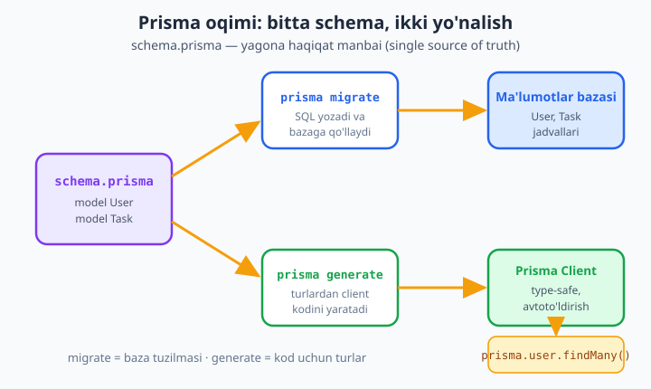
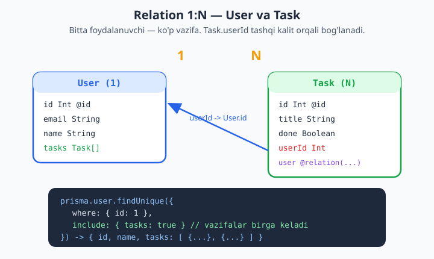

# 18 — Prisma ORM

[⬅️ Oldingi: 17 — MySQL: mysql2, pool, tranzaksiya](./17-mysql.md) · [🏠 README](./README.md) · [Keyingi: 19 — MongoDB va Mongoose ➡️](./19-mongodb.md)

> **Bu bobda:** Oldingi ikki bobda biz SQL ni qo'lda yozdik — `better-sqlite3` va `mysql2` bilan `INSERT`, `SELECT`, `JOIN` larni o'z barmoqlarimiz bilan terib chiqdik. Bu bobda boshqa yo'lni — **ORM** ni o'rganamiz. Avval ORM nima ekanini (obyekt bilan jadval orasidagi ko'prik) va uning narxini tushunamiz. So'ng zamonaviy, **type-safe** ORM — **Prisma** bilan tanishamiz: o'rnatish (`prisma init`), `schema.prisma` faylining tuzilishi (`datasource`, `generator`, `model`, maydon turlari va atributlar `@id @default @unique @relation @updatedAt`), `migrate dev` orqali schema'dan **haqiqiy DB jadvallari** yasash va migration tarixi, `generate` orqali type-safe client. Keyin to'liq **CRUD** ni — `create`, `findMany`, `findUnique`, `findFirst`, `update`, `delete` va ularning `where`/`select`/`orderBy`/`take`/`skip` opsiyalarini — ko'ramiz. **Relation** (1:N va N:M), `include`, **nested create**, `$transaction`, **seed**, **Prisma Studio** va `$queryRaw` ni o'rganamiz. REAL KEYS: **foydalanuvchi + vazifa** (1:N) tizimini Prisma bilan to'liq quramiz. Hamma kod Node 24.12 + Prisma 6.19 + SQLite da haqiqatan `migrate`/`generate`/`CRUD` qilib **ishga tushirib tekshirilgan**.

---

## ORM nima va nega kerak?

Oldingi boblarda baza bilan ishlash shunday ko'rinardi:

```js
const row = db.prepare("SELECT * FROM users WHERE id = ?").get(5);
console.log(row.name); // row — oddiy obyekt, lekin SQL ni biz yozdik
```

Bu yondashuvda **SQL tilini** biz boshqaramiz: har bir so'rovni qo'lda yozamiz, ustun nomlarini matn ichida teramiz, natijani obyektga o'zimiz moslaymiz. Kichik loyihada bu joyida. Lekin loyiha o'sganda muammolar boshlanadi:

- Ustun nomini matn ichida adashtirsangiz (`naem` o'rniga `name`), xato **ishga tushgancha** bilinmaydi — runtime'da `undefined` chiqadi.
- Bir nechta jadvalni `JOIN` qilib, natijani ichma-ich obyektga aylantirish (`user.tasks`) — qo'lda zerikarli va xatoga moyil.
- Baza tuzilmasi o'zgarsa (yangi ustun qo'shildi), uni qidirib hamma SQL ni qo'lda yangilash kerak.

**ORM (Object-Relational Mapping)** — aynan shu muammoni hal qiladi. Bu — **obyekt** dunyosi (JavaScript klasslari/obyektlari) bilan **relyatsion baza** dunyosi (jadvallar, qatorlar, ustunlar) o'rtasidagi **ko'prik**. ORM bilan siz SQL emas, **obyekt va metodlar** tilida gaplashasiz:

```js
const user = await prisma.user.findUnique({ where: { id: 5 } });
// SQL ni Prisma yozib beradi; user — turi aniq obyekt
```

ORM ning foydasi:

- **Qo'lda SQL kamayadi** — `INSERT`/`SELECT`/`JOIN` larni metodlar bilan ifodalaysiz.
- **Xavfsizlik** — parametrlar avtomatik bog'lanadi, SQL injection xavfi yo'qoladi (oldingi bobdagi `?` o'rinbosarlari kabi, lekin avtomatik).
- **Tuzilma bir joyda** — baza modeli kod bilan bir manbada tasvirlanadi.

Lekin ORM **tekin emas** — narxi bor:

- **Abstraksiya qatlami** — siz baza bilan to'g'ridan-to'g'ri emas, ORM orqali gaplashasiz. Ba'zan u yaratgan SQL **eng tez** variant bo'lmaydi.
- **Murakkab so'rovlar** — chuqur analitik so'rovlar (oyna funksiyalari, murakkab agregatsiya) ORM tili bilan noqulay bo'lishi mumkin. Bunday holatda **raw SQL** ga qaytasiz (quyida `$queryRaw` ni ko'ramiz).
- **N+1 muammosi** — relation larni e'tiborsiz yuklasangiz, bitta so'rov o'rniga yuzta so'rov ketishi mumkin (Prisma `include` bu xavfni kamaytiradi).

> **Xulosa:** ORM sehrli kaltakcha emas — bu **vosita**. SQL ni bilish baribir muhim (chuqurroq uchun [`../sql/README.md`](../sql/README.md)). ORM esa kundalik CRUD ni tezlashtiradi va kodni xavfsiz, o'qishli qiladi.

---

## Prisma nima?

Node ekotizimida bir nechta ORM bor (Sequelize, TypeORM, Drizzle, ...). Bu kitobda biz **Prisma** ni tanlaymiz — chunki u zamonaviy, **type-safe** va o'rganish uchun eng aniq modelga ega.

Prisma boshqa ORM lardan farqli o'laroq **schema-asosli**. Ya'ni siz modellaringizni JavaScript klasslari yoki dekoratorlar bilan emas, alohida **`schema.prisma`** faylida — o'qish uchun qulay, deklarativ tilda — tasvirlaysiz. Bu fayl **yagona haqiqat manbai** (single source of truth) bo'ladi. Undan Prisma ikki narsa yasaydi:

1. **Migration** — schema'dan **haqiqiy DB jadvallari** (`CREATE TABLE ...`).
2. **Type-safe client** — kodingiz uchun avtoto'ldirishli, turlari aniq JavaScript/TypeScript kutubxonasi.



Prisma ning ustun tomonlari:

- **Type-safety** — `prisma.user.findMany()` qaytaradigan obyektning maydonlari oldindan ma'lum. TypeScript da xato yozsangiz, **kod yozayotganda** (compile vaqtida) qizil chiziq chiqadi, runtime'da emas. JavaScript da ham muharrir avtoto'ldirishni ko'rsatadi.
- **Migration tizimi** — schema'ni o'zgartirsangiz, Prisma farqni hisoblab, yangi migration SQL faylini yozadi va tarixini saqlaydi (xuddi git kabi).
- **Zamonaviy DX** — `prisma studio` (vizual baza brauzeri), aniq xato xabarlari, `include`/`select` bilan o'qishli so'rovlar.
- **Ko'p baza** — bitta API bilan SQLite, PostgreSQL, MySQL, SQL Server, MongoDB bilan ishlaydi (datasource'ni almashtirasiz).

Bu bobda biz **SQLite** ni ishlatamiz — server o'rnatish shart emas, baza shunchaki bitta `.db` fayl. Bu Prisma'ni o'rganishni maksimal soddalashtiradi. Keyin MySQL'ga o'tish faqat `datasource` ni o'zgartirishdan iborat.

---

## O'rnatish va `prisma init`

Yangi loyiha yaratamiz. ESM ishlatamiz, shuning uchun `package.json` da `"type": "module"`:

```bash
mkdir prisma-vazifa && cd prisma-vazifa
npm init -y
npm pkg set type=module
```

Endi Prisma ni o'rnatamiz. Ikki paket bor va ularning roli **har xil**:

```bash
# prisma — CLI asbobi (migrate, generate, studio). Faqat ishlab chiqishda kerak.
npm install -D prisma@6

# @prisma/client — ilovangiz ishlatadigan kutubxona (CRUD). Productionda ham kerak.
npm install @prisma/client@6
```

> **Nega ikkita?** `prisma` — bu **terminal asbobi** (siz buyruq berasiz). `@prisma/client` — bu **kodingiz import qiladigan** kutubxona. Birinchisi `devDependencies` ga, ikkinchisi oddiy `dependencies` ga tushadi.

> **Nega `@6` deb yozdik?** Versiyani **ataylab qadab qo'ydik**. Oddiy `npm install prisma` bugun eng yangi **Prisma 7** ni o'rnatadi — unda esa schema sintaksisi o'zgargan (`url` schema'dan `prisma.config.ts` ga ko'chgan, provider `prisma-client` bo'lgan). Agar 7-versiyada bu bobdagi **aynan shu** schema'ni ishlatsangiz, birinchi `migrate dev` da xato chiqadi: `P1012 — The datasource property url is no longer supported in schema files`. Shu bois biz butun bobni **Prisma 6** (eng keng tarqalgan, soddaroq oqim) ga moslab, versiyani `@6` bilan qadadik. Bu bilan siz quyidagi har bir buyruq va chiqishni xuddi shu ko'rinishda takrorlay olasiz.

Endi loyihani ishga tayyorlaymiz:

```bash
npx prisma init --datasource-provider sqlite
```

Bu buyruq quyidagilarni yaratadi:

- **`prisma/schema.prisma`** — asosiy schema fayli (datasource SQLite ga moslangan).
- **`.env`** — maxfiy sozlamalar uchun (masalan, DB ulanish manzili).
- `.gitignore` ga `node_modules` va `.env` qo'shiladi.

Versiyani tekshiramiz:

```bash
npx prisma --version
# prisma : 6.19.3
# @prisma/client : 6.19.3
```

> **Eslatma (Prisma 7+):** Eng yangi Prisma 7 da sozlash biroz boshqacha (`url` `prisma.config.ts` ga ko'chgan, provider `prisma-client`, driver adapter ishlatiladi). Bu bobda biz keng tarqalgan, soddaroq **Prisma 6** oqimidan foydalanamiz — u eng ko'p qo'llanmalar va loyihalarga mos keladi, shu sababli yuqorida versiyani `@6` bilan qadadik. Agar `npx prisma --version` sizda `6.x` o'rniga `7.x` ko'rsatsa, qaytadan qadab o'rnating: `npm install -D prisma@6 @prisma/client@6`. Asoslar (schema, migrate, generate, CRUD) ikkala versiyada ham bir xil.

---

## `schema.prisma` — yurak fayli

`prisma/schema.prisma` faylini ochamiz. U uch qismdan iborat: `datasource`, `generator` va `model` lar.

```prisma
datasource db {
  provider = "sqlite"
  url      = "file:./dev.db"
}

generator client {
  provider = "prisma-client-js"
}

model User {
  id        Int      @id @default(autoincrement())
  email     String   @unique
  name      String
  createdAt DateTime @default(now())
  tasks     Task[]
}

model Task {
  id        Int      @id @default(autoincrement())
  title     String
  done      Boolean  @default(false)
  createdAt DateTime @default(now())
  updatedAt DateTime @updatedAt
  user      User     @relation(fields: [userId], references: [id])
  userId    Int
}
```

Har bir qismni ajratib tushunamiz.

### `datasource` — qaysi baza?

```prisma
datasource db {
  provider = "sqlite"        // baza turi: sqlite | postgresql | mysql | ...
  url      = "file:./dev.db" // ulanish manzili (SQLite uchun — fayl yo'li)
}
```

`provider` — qaysi bazani ishlatishimizni aytadi. SQLite uchun `url` — bu `prisma/` papkasiga nisbatan fayl yo'li. MySQL ga o'tish kerak bo'lsa, bu blok shunday bo'lardi:

```prisma
datasource db {
  provider = "mysql"
  url      = env("DATABASE_URL")   // .env dan: mysql://root@localhost:3306/nodejs_test
}
```

Maxfiy ma'lumotni `.env` faylida saqlash yaxshi amaliyot (`env("DATABASE_URL")`). SQLite uchun esa biz qulaylik uchun to'g'ridan-to'g'ri fayl yo'lini yozdik.

### `generator` — nimani yasaymiz?

```prisma
generator client {
  provider = "prisma-client-js"   // JavaScript/TypeScript client yasaydi
}
```

`generator` — `prisma generate` buyrug'i **nima** yasashini aytadi. Bizga `prisma-client-js` kerak: u `@prisma/client` ichiga type-safe CRUD kutubxonasini joylaydi.

### `model` — jadvallar

Har bir `model` — bazadagi bitta **jadval** (va kodda bitta **tur**). Maydonlar `nom Tur atributlar` shaklida yoziladi.

**Skalyar turlar** (asosiylari): `Int`, `String`, `Boolean`, `DateTime`, `Float`, `Decimal`, `Bytes`, `Json` (baza qo'llasa). `?` qo'shsangiz — maydon **ixtiyoriy** bo'ladi (`String?` — null bo'lishi mumkin).

**Atributlar** (`@` bilan boshlanadi) — maydonga qoidalar qo'shadi:

| Atribut | Ma'nosi |
|---|---|
| `@id` | Birlamchi kalit (primary key) |
| `@default(autoincrement())` | Avtomatik o'suvchi raqam (1, 2, 3, ...) |
| `@default(now())` | Yaratilgan paytdagi vaqt |
| `@default(false)` | Boshlang'ich qiymat |
| `@unique` | Takrorlanmas (masalan, email) |
| `@updatedAt` | Har `update` da avtomatik yangilanadigan vaqt |
| `@relation(...)` | Modellar orasidagi bog'lanish (relation) |

`tasks Task[]` qatori — bu **relation maydoni** (bazada ustun emas). U "bitta User ko'p Task ga ega" degan 1:N bog'lanishni bildiradi. Relation larni keyingi bo'limda chuqur ko'ramiz.

---

## `migrate dev` — schema'dan baza yasash

Schema tayyor — endi undan **haqiqiy baza jadvallarini** yasaymiz. Buni **migration** qiladi:

```bash
npx prisma migrate dev --name init
```

`--name init` — bu migration'ga nom beradi (xuddi git commit xabari kabi). Buyruq nima qiladi:

1. Schema'ni hozirgi baza holati bilan **solishtiradi**.
2. Farqni amalga oshiradigan **SQL faylini** yozadi (`prisma/migrations/.../migration.sql`).
3. Bu SQL ni **bazaga qo'llaydi** (jadvallarni yaratadi).
4. So'ng avtomatik `prisma generate` ni chaqirib, client'ni yangilaydi.

Haqiqiy chiqishi (biz ishga tushirdik):

```text
SQLite database dev.db created at file:./dev.db
Applying migration `20260612080302_init`
The following migration(s) have been created and applied from new schema changes:
prisma/migrations/
  └─ 20260612080302_init/
    └─ migration.sql
Your database is now in sync with your schema.
✔ Generated Prisma Client (v6.19.3) to ./node_modules/@prisma/client
```

Prisma yozgan `migration.sql` faylini ochib ko'rsak — bu oddiy, tanish SQL (oldingi boblardan):

```sql
-- CreateTable
CREATE TABLE "User" (
    "id" INTEGER NOT NULL PRIMARY KEY AUTOINCREMENT,
    "email" TEXT NOT NULL,
    "name" TEXT NOT NULL,
    "createdAt" DATETIME NOT NULL DEFAULT CURRENT_TIMESTAMP
);

-- CreateTable
CREATE TABLE "Task" (
    "id" INTEGER NOT NULL PRIMARY KEY AUTOINCREMENT,
    "title" TEXT NOT NULL,
    "done" BOOLEAN NOT NULL DEFAULT false,
    "createdAt" DATETIME NOT NULL DEFAULT CURRENT_TIMESTAMP,
    "updatedAt" DATETIME NOT NULL,
    "userId" INTEGER NOT NULL,
    CONSTRAINT "Task_userId_fkey" FOREIGN KEY ("userId") REFERENCES "User" ("id") ON DELETE RESTRICT ON UPDATE CASCADE
);

-- CreateIndex
CREATE UNIQUE INDEX "User_email_key" ON "User"("email");
```

Diqqat qiling: `@id @default(autoincrement())` -> `PRIMARY KEY AUTOINCREMENT`, `@unique` -> `UNIQUE INDEX`, `@relation` -> `FOREIGN KEY`. Schema'dagi har bir atribut SQL ga aylandi. Endi siz Prisma "sehrini" emas, uning ostidagi haqiqiy SQL ni ko'rdingiz.

### Migration tarixi — nega muhim?

Har bir `migrate dev` yangi papka yaratadi (`20260612080302_init`). Bu **tarix** — bazaning qanday rivojlanganini ko'rsatadi. Schema'ni o'zgartirsangiz (masalan, `Task` ga `priority Int` ustun qo'shsangiz), yana `npx prisma migrate dev --name add_priority` chaqirasiz — Prisma faqat **farqni** (`ALTER TABLE`) yozadi. Bu migration fayllari git ga **commit qilinadi**: jamoangiz va production server bir xil ketma-ketlikda bazani qurib oladi (`prisma migrate deploy`).

> **`migrate dev` vs `migrate deploy`:** `migrate dev` — ishlab chiqish uchun (yangi migration yaratadi). Production'da esa `prisma migrate deploy` ishlatiladi — u faqat mavjud migration'larni qo'llaydi, yangi yaratmaydi. CI/deploy haqida [`../git-github/README.md`](../git-github/README.md) ga qarang.

### `generate` — type-safe client

`migrate dev` `generate` ni o'zi chaqirdi. Lekin schema'ni o'zgartirib, migration yaratmasdan faqat client'ni yangilamoqchi bo'lsangiz (yoki `node_modules` ni qaytadan o'rnatgandan keyin):

```bash
npx prisma generate
```

Bu `@prisma/client` ichiga sizning modellaringizga moslangan kodni yozadi. Endi `import { PrismaClient } from "@prisma/client"` qilganda, `prisma.user` va `prisma.task` mavjud bo'ladi — turlari, maydonlari va metodlari bilan.

---

## CRUD — to'liq amaliyot

Endi qiziqarli qismga keldik. Birinchi faylimizni yozamiz. Prisma client'ni bir marta yaratamiz va uni qayta ishlatamiz:

```js
// db.js — bitta umumiy PrismaClient nusxa
import { PrismaClient } from "@prisma/client";

export const prisma = new PrismaClient();
```

> **Muhim:** Butun ilovada **bitta** `PrismaClient` nusxasini yarating. Har so'rovda yangi `new PrismaClient()` qilsangiz, ulanishlar tugab qoladi. Express ilovasida uni bir marta yaratib, hamma joyda import qilasiz.

### CREATE — `create`

```js
import { prisma } from "./db.js";

const ali = await prisma.user.create({
  data: { email: "ali@example.com", name: "Ali" },
});
console.log(ali); // { id: 1, email: 'ali@example.com', name: 'Ali', createdAt: ... }
```

`data` — yaratiladigan qatorning maydonlari. `id`, `createdAt` ni yozmaymiz — ular `@default` orqali avtomatik to'ladi. Qaytadigan qiymat — to'liq yaratilgan obyekt (id bilan birga).

### READ — `findMany`, `findUnique`, `findFirst`

```js
// Hammasini olish
const hamma = await prisma.user.findMany();

// Unique maydon (id yoki @unique) bo'yicha bitta qator
const u = await prisma.user.findUnique({ where: { email: "ali@example.com" } });

// Birinchi mos kelgan (har qanday shart bo'yicha)
const birinchi = await prisma.task.findFirst({ where: { done: false } });
```

`findUnique` faqat **unique** maydon bo'yicha qidiradi (id yoki `@unique` belgilangan). `findFirst` — har qanday shart bo'yicha **birinchi** mos kelganni qaytaradi. Topilmasa ikkalasi ham `null` qaytaradi.

### So'rov opsiyalari: `where`, `select`, `orderBy`, `take`, `skip`

```js
const vazifalar = await prisma.task.findMany({
  where: { done: false },                 // filtr: faqat bajarilmaganlar
  select: { id: true, title: true },      // faqat shu maydonlar (boshqasi olinmaydi)
  orderBy: { id: "asc" },                 // tartiblash (asc | desc)
  take: 10,                               // ko'pi bilan 10 ta (LIMIT)
  skip: 0,                                // boshidan necha tani tashlab ketish (OFFSET)
});
```

Bu — sahifalash (pagination) ning asosi: `take` (sahifa hajmi) va `skip` (`(sahifa - 1) * hajm`). `select` — faqat kerakli ustunlarni olib, tarmoqni tejaydi. `where` esa boy filtrlarni qo'llaydi:

```js
// Murakkab filtr: nomida "Prisma" bor VA bajarilmagan
await prisma.task.findMany({
  where: {
    done: false,
    title: { contains: "Prisma" },   // qisman moslik
    // boshqa operatorlar: gt, gte, lt, lte, in, notIn, startsWith, endsWith
  },
});
```

### UPDATE — `update`

```js
const yangilangan = await prisma.task.update({
  where: { id: 1 },             // qaysi qatorni (unique bo'yicha)
  data: { done: true },         // nimani o'zgartirish
});
```

`@updatedAt` belgilagan `updatedAt` maydoni bu yerda **avtomatik** yangilanadi. Bir nechta qatorni birdan yangilash uchun `updateMany({ where, data })` bor.

### DELETE — `delete`

```js
const ochirilgan = await prisma.task.delete({ where: { id: 1 } });
// bir nechta: prisma.task.deleteMany({ where: { done: true } })
```

> **Diqqat — relation tartibi:** `Task.userId` `User` ga ishora qiladi (foreign key). Shuning uchun User ni o'chirishdan **oldin** uning Task larini o'chirish kerak (yoki schema'da `onDelete: Cascade` qo'yish). Aks holda baza "RESTRICT" cheklovi bilan xato beradi.

---

## Relations — modellar orasidagi bog'lanish

Haqiqiy ilovalar bir nechta bog'langan jadvaldan iborat. Prisma relation larni juda qulay boshqaradi.



### 1:N — bitta User, ko'p Task

Schema'da bu shunday tasvirlangan edi:

```prisma
model User {
  id    Int    @id @default(autoincrement())
  tasks Task[]                                  // "User ko'p Task ga ega" tomoni
}

model Task {
  id     Int  @id @default(autoincrement())
  user   User @relation(fields: [userId], references: [id])  // bog'lanish
  userId Int                                                  // tashqi kalit (FK)
}
```

Ikki maydonni ajratish muhim:

- **`userId Int`** — bu **haqiqiy ustun** bazada (foreign key). U qaysi User ga tegishliligini saqlaydi.
- **`user User @relation(...)`** va **`tasks Task[]`** — bular **virtual relation maydonlari**. Bazada ustun emas — Prisma ularni so'rovda bog'lash uchun ishlatadi.

`@relation(fields: [userId], references: [id])` — Prisma ga "`Task.userId` ustuni `User.id` ga ishora qiladi" deb aytadi.

### `include` — relation ni birga yuklash

Foydalanuvchini **uning vazifalari bilan** birga olish uchun `include` ishlatamiz:

```js
const u = await prisma.user.findUnique({
  where: { id: 1 },
  include: { tasks: true },     // vazifalarni ham yukla
});
console.log(u.name, u.tasks);   // u.tasks — massiv
```

`include` siz `u.tasks` bo'lmaydi (faqat User maydonlari keladi). `include` bilan esa Prisma kerakli `JOIN`/so'rovni o'zi qiladi va natijani **ichma-ich obyekt** ko'rinishida beradi — qo'lda JOIN ni unutdik.

`include` ichida yana filtr/tartib qo'shsa bo'ladi:

```js
const u = await prisma.user.findUnique({
  where: { id: 1 },
  include: {
    tasks: { where: { done: true }, orderBy: { createdAt: "desc" } },
  },
});
// u.tasks — faqat bajarilgan vazifalar, eng yangisi birinchi
```

### Nested create — bog'langan yozuvni birga yaratish

Eng kuchli xususiyatlardan biri: User va uning Task larini **bitta** `create` da yaratish:

```js
const ali = await prisma.user.create({
  data: {
    email: "ali@example.com",
    name: "Ali",
    tasks: {
      create: [
        { title: "Prisma o'rganish" },
        { title: "Loyiha yozish" },
      ],
    },
  },
  include: { tasks: true },   // natijada vazifalarni ham qaytar
});
console.log(ali.tasks.length); // 2
```

Diqqat: ichki `create` da biz `userId` ni **yozmadik** — Prisma uni avtomatik bog'laydi. Bu — relation bilan ishlashni ajoyib soddalashtiradi.

### N:M — ko'pdan-ko'pga (qisqacha)

N:M (masalan, Post va Tag — bitta post ko'p tag, bitta tag ko'p postda) ham oson. Prisma **implicit** (yashirin) bog'lovchi jadval yaratadi:

```prisma
model Post {
  id   Int   @id @default(autoincrement())
  tags Tag[]
}

model Tag {
  id    Int    @id @default(autoincrement())
  posts Post[]
}
```

Ikkala tomonda `[]` yozish kifoya — Prisma o'rtadagi `_PostToTag` jadvalini o'zi boshqaradi. `connect` bilan mavjud yozuvlarni bog'laysiz:

```js
await prisma.post.create({
  data: {
    title: "Salom",
    tags: { connect: [{ id: 1 }, { id: 2 }] },  // mavjud taglarga bog'la
  },
});
```

---

## `$transaction` — hammasi yoki hech narsa

Oldingi MySQL bobidan tranzaksiyani eslang: bir nechta amal **birga** muvaffaqiyatli bo'lishi yoki birga bekor bo'lishi kerak. Prisma da ikki shakli bor.

**1. Massiv shakli** — mustaqil amallarni atomik bajarish:

```js
const [userlar, tasklar] = await prisma.$transaction([
  prisma.user.count(),
  prisma.task.count(),
]);
```

**2. Interaktiv (callback) shakli** — bir amal natijasi ikkinchisiga kerak bo'lganda:

```js
const natija = await prisma.$transaction(async (tx) => {
  const t = await tx.task.create({ data: { title: "Transfer", userId: 1 } });
  await tx.task.update({ where: { id: t.id }, data: { done: true } });
  return tx.task.findUnique({ where: { id: t.id } });
});
```

Callback ichida `prisma` o'rniga **`tx`** ni ishlatasiz. Agar callback xato tashlasa, hamma amallar **rollback** qilinadi (bekor bo'ladi). Bu — pul o'tkazmasi, buyurtma yaratish kabi "yarim bajarilmasligi kerak" amallar uchun.

---

## Seed — bazani boshlang'ich ma'lumot bilan to'ldirish

Ishlab chiqishda bazaga test ma'lumotini tez to'ldirish kerak bo'ladi — bu **seed**. Oddiy seed skripti:

```js
// prisma/seed.js
import { prisma } from "../db.js";

async function seed() {
  await prisma.task.deleteMany();   // toza boshlash
  await prisma.user.deleteMany();

  await prisma.user.create({
    data: {
      email: "admin@example.com",
      name: "Admin",
      tasks: { create: [{ title: "Sozlamalar" }, { title: "Hisobot" }] },
    },
  });
  console.log("Seed tugadi");
}

seed().finally(() => prisma.$disconnect());
```

`package.json` ga seed buyrug'ini sozlab qo'yasiz:

```json
{
  "prisma": { "seed": "node prisma/seed.js" }
}
```

Endi `npx prisma db seed` yoki har `migrate reset` da seed avtomatik ishlaydi. Bu jamoa uchun "bir buyruq bilan to'la baza" qulayligini beradi.

---

## Prisma Studio — vizual baza brauzeri

Prisma'ning eng yoqimli sovg'asi — **Studio**. Bitta buyruq:

```bash
npx prisma studio
```

Bu brauzerda (odatda `http://localhost:5555`) baza jadvallarini **vizual** ochadi: qatorlarni ko'rasiz, tahrirlaysiz, qo'shasiz, o'chirasiz — SQL yozmasdan. Ishlab chiqishda baza holatini tekshirish uchun ajoyib (productionda ishlatilmaydi). Bu — phpMyAdmin yoki DBeaver ga o'xshash, lekin to'g'ridan-to'g'ri schemangizga moslangan.

---

## Raw query — qachon SQL ga qaytamiz?

ORM kuchli, lekin **hamma narsa** uchun emas. Murakkab analitik so'rov, baza-maxsus funksiya yoki Prisma API ifodalay olmaydigan optimizatsiya kerak bo'lsa — **raw SQL** ga qaytasiz. Prisma buni xavfsiz qiladi:

```js
// Natija qaytaradigan so'rov ($queryRaw)
const stat = await prisma.$queryRaw`SELECT COUNT(*) AS soni FROM Task`;
console.log(stat); // [ { soni: 1n } ]   (n — BigInt)

// Natija qaytarmaydigan amal ($executeRaw — UPDATE/DELETE)
await prisma.$executeRaw`UPDATE Task SET done = true WHERE done = false`;
```

> **Xavfsizlik:** Doim **tagged template** (`` $queryRaw`...` ``) ishlating — Prisma `${qiymat}` larni avtomatik parametr sifatida bog'laydi (SQL injection'dan himoya). **Hech qachon** foydalanuvchi kiritmasini matn sifatida ulamang. Agar dinamik so'rov kerak bo'lsa, `$queryRawUnsafe` bor — lekin nomidan ko'rinib turibdiki, undan ehtiyot bo'ling.

Qoida: **95% holatda** Prisma API yetadi. `$queryRaw` — oxirgi chora, "tashqi eshik".

---

## REAL KEYS: Vazifa boshqaruvi (User 1:N Task) — to'liq

Endi hamma narsani birlashtiramiz. SQLite bilan to'liq **foydalanuvchi + vazifa** tizimini quramiz — bu bobdagi kodning hammasi haqiqatan ishga tushirilib tekshirilgan (Node 24.12 + Prisma 6.19).

**1-qadam — schema** (`prisma/schema.prisma`, yuqorida ko'rganimiz):

```prisma
datasource db {
  provider = "sqlite"
  url      = "file:./dev.db"
}

generator client {
  provider = "prisma-client-js"
}

model User {
  id        Int      @id @default(autoincrement())
  email     String   @unique
  name      String
  createdAt DateTime @default(now())
  tasks     Task[]
}

model Task {
  id        Int      @id @default(autoincrement())
  title     String
  done      Boolean  @default(false)
  createdAt DateTime @default(now())
  updatedAt DateTime @updatedAt
  user      User     @relation(fields: [userId], references: [id])
  userId    Int
}
```

**2-qadam — migrate + generate:**

```bash
npx prisma migrate dev --name init
```

**3-qadam — CRUD + relation skripti** (`crud.js`):

```js
import { PrismaClient } from "@prisma/client";

const prisma = new PrismaClient();

async function main() {
  // toza boshlash (tartib: avval Task, keyin User — FK sababli)
  await prisma.task.deleteMany();
  await prisma.user.deleteMany();

  // CREATE: foydalanuvchi + ichma-ich (nested) vazifalar
  const ali = await prisma.user.create({
    data: {
      email: "ali@example.com",
      name: "Ali",
      tasks: {
        create: [
          { title: "Prisma o'rganish" },
          { title: "Loyiha yozish" },
        ],
      },
    },
    include: { tasks: true },
  });
  console.log("CREATE (nested):", ali.name, "->", ali.tasks.map((t) => t.title));

  // CREATE: yana bir foydalanuvchi
  const vali = await prisma.user.create({
    data: { email: "vali@example.com", name: "Vali" },
  });
  console.log("CREATE:", vali.email, "id =", vali.id);

  // READ: findMany + include (relation)
  const hammasi = await prisma.user.findMany({
    include: { tasks: true },
    orderBy: { id: "asc" },
  });
  console.log("findMany:", hammasi.map((u) => `${u.name}(${u.tasks.length})`).join(", "));

  // READ: findUnique (unique maydon bo'yicha)
  const topildi = await prisma.user.findUnique({ where: { email: "ali@example.com" } });
  console.log("findUnique:", topildi.name);

  // READ: where + select + take/skip
  const vazifalar = await prisma.task.findMany({
    where: { done: false },
    select: { id: true, title: true },
    orderBy: { id: "asc" },
    take: 1,
    skip: 0,
  });
  console.log("findMany(where/select/take):", vazifalar);

  // UPDATE
  const yangilangan = await prisma.task.update({
    where: { id: ali.tasks[0].id },
    data: { done: true },
  });
  console.log("UPDATE:", yangilangan.title, "done =", yangilangan.done);

  // RELATION query: foydalanuvchini bajarilgan vazifalari bilan
  const aliTula = await prisma.user.findUnique({
    where: { id: ali.id },
    include: { tasks: { where: { done: true } } },
  });
  console.log("include(filtered):", aliTula.name, "bajarilgan:", aliTula.tasks.map((t) => t.title));

  // TRANSACTION: ikkala sanoq birga
  const [u2, t2] = await prisma.$transaction([
    prisma.user.count(),
    prisma.task.count(),
  ]);
  console.log("$transaction count:", { users: u2, tasks: t2 });

  // DELETE
  const ochirilgan = await prisma.task.delete({ where: { id: ali.tasks[1].id } });
  console.log("DELETE:", ochirilgan.title);

  // raw query
  const raw = await prisma.$queryRaw`SELECT COUNT(*) as soni FROM Task`;
  console.log("$queryRaw:", raw);

  console.log("HAMMA AMAL MUVAFFAQIYATLI");
}

main()
  .catch((e) => {
    console.error(e);
    process.exit(1);
  })
  .finally(async () => {
    await prisma.$disconnect();
  });
```

**Ishga tushiramiz:**

```bash
node crud.js
```

**Haqiqiy chiqishi** (biz ishga tushirdik):

```text
CREATE (nested): Ali -> [ "Prisma o'rganish", 'Loyiha yozish' ]
CREATE: vali@example.com id = 2
findMany: Ali(2), Vali(0)
findUnique: Ali
findMany(where/select/take): [ { id: 1, title: "Prisma o'rganish" } ]
UPDATE: Prisma o'rganish done = true
include(filtered): Ali bajarilgan: [ "Prisma o'rganish" ]
$transaction count: { users: 2, tasks: 2 }
DELETE: Loyiha yozish
$queryRaw: [ { soni: 1n } ]
HAMMA AMAL MUVAFFAQIYATLI
```

Hammasi ishladi: nested create, include (oddiy va filtrli), findUnique, where/select/take, update (`@updatedAt` avtomatik), transaction, delete va raw query. Bu — bitta to'liq ORM oqimi.

> **Express bilan bog'lash:** Bu Prisma kodini [12-bobdagi Express](./12-express-asoslari.md) route'lari ichiga qo'ysangiz, to'liq REST API tayyor: `GET /users` -> `prisma.user.findMany({ include: { tasks: true } })`, `POST /users` -> `prisma.user.create(...)`, va hokazo. [13-bobdagi middleware](./13-middleware.md) bilan auth/validatsiya qo'shasiz. Prisma — backend API ning ma'lumotlar qatlami.

---

## Xulosa

Bu bobda biz qo'lda SQL dan **ORM** ga o'tdik:

- **ORM** — obyekt bilan jadval orasidagi ko'prik; qo'lda SQL ni kamaytiradi, lekin abstraksiya narxi bilan keladi (murakkab so'rovda raw SQL ga qaytamiz).
- **Prisma** — schema-asosli, type-safe ORM. `schema.prisma` — yagona haqiqat manbai.
- **`migrate dev`** — schema'dan haqiqiy DB jadvallari va migration tarixi; **`generate`** — type-safe client.
- **CRUD** — `create`/`findMany`/`findUnique`/`findFirst`/`update`/`delete`, `where`/`select`/`orderBy`/`take`/`skip` bilan.
- **Relation** — 1:N va N:M, `@relation`, `include` va nested create relation larni qulay qiladi.
- **`$transaction`** (ikki shakl), **seed**, **Prisma Studio**, **`$queryRaw`** — kundalik amaliyot quroli.

Keyingi bobda boshqa dunyoga — **NoSQL** ga o'tamiz: hujjat-asosli MongoDB va uning Node ORM/ODM si Mongoose bilan tanishamiz.

---

## Mashqlar

### Oson

1. `schema.prisma` ga yangi `Note` modeli qo'shing: `id` (autoincrement), `text` (String), `pinned` (Boolean, default false). `npx prisma migrate dev --name add_note` bilan migration yarating va `prisma/migrations` papkasida yangi papka paydo bo'lganini ko'ring.
2. `prisma.user.create` bilan ikkita foydalanuvchi yarating, so'ng `findMany({ orderBy: { name: "asc" } })` bilan ularni alifbo tartibida chiqaring.
3. Bitta vazifa yaratib, uni `update` bilan `done: true` qiling. So'ng `findUnique` bilan qayta o'qib, `updatedAt` ning `createdAt` dan kechroq ekanini tekshiring.

### O'rta

4. Bitta foydalanuvchiga **nested create** bilan uchta vazifa yarating. So'ng `include: { tasks: { where: { done: false } } }` bilan faqat bajarilmagan vazifalarini chiqaring.
5. `take` va `skip` bilan **sahifalash** yozing: 5 ta vazifa yaratib, ikkinchi "sahifani" (har sahifada 2 ta) `take: 2, skip: 2` bilan oling. To'g'ri ikkita kelganini tekshiring.
6. `prisma.task.count({ where: { done: true } })` va `prisma.task.count({ where: { done: false } })` bilan bajarilgan/bajarilmagan vazifalar sonini hisoblang va `{ done, todo }` obyekti sifatida chiqaring.

### Qiyin

7. **Interaktiv `$transaction`** yozing: callback ichida yangi User yaratsin, unga ikkita Task qo'shsin, so'ng birinchi Task ni `done: true` qilsin. Callback ichida ataylab xato tashlab (`throw new Error(...)`), tranzaksiya **rollback** bo'lganini — ya'ni User ham, Task ham bazaga yozilmaganini — `count` bilan tasdiqlang.
8. `$queryRaw` bilan analitik so'rov yozing: har bir foydalanuvchi uchun **vazifalar sonini** qaytaring (`SELECT u.name, COUNT(t.id) ...` `GROUP BY`). Avval Prisma API ham bu ma'lumotni bera olishini (`include: { _count: { select: { tasks: true } } }`) ko'rib chiqing va ikki yondashuvni solishtiring.

<details markdown="1"><summary>Yechim — 1</summary>

`schema.prisma` ga qo'shing:

```prisma
model Note {
  id     Int     @id @default(autoincrement())
  text   String
  pinned Boolean @default(false)
}
```

```bash
npx prisma migrate dev --name add_note
```

Prisma faqat **farqni** hisoblaydi va `prisma/migrations/<vaqt>_add_note/migration.sql` ichida `CREATE TABLE "Note" (...)` ni yozadi. Eski `init` migration'i o'z joyida qoladi — tarix shu tarzda saqlanadi.
</details>

<details markdown="1"><summary>Yechim — 4</summary>

```js
import { PrismaClient } from "@prisma/client";
const prisma = new PrismaClient();

async function main() {
  await prisma.task.deleteMany();
  await prisma.user.deleteMany();

  const u = await prisma.user.create({
    data: {
      email: "n@x.uz",
      name: "Nodir",
      tasks: {
        create: [
          { title: "A", done: true },
          { title: "B" },
          { title: "C" },
        ],
      },
    },
  });

  const natija = await prisma.user.findUnique({
    where: { id: u.id },
    include: { tasks: { where: { done: false } } },
  });
  console.log(natija.tasks.map((t) => t.title)); // [ 'B', 'C' ]
}
main().finally(() => prisma.$disconnect());
```

Nested create bog'langan yozuvlarni birga yaratadi; `include` ichidagi `where` esa faqat bajarilmaganlarni filtrlaydi.
</details>

<details markdown="1"><summary>Yechim — 5</summary>

```js
import { PrismaClient } from "@prisma/client";
const prisma = new PrismaClient();

async function main() {
  await prisma.task.deleteMany();
  await prisma.user.deleteMany();
  const u = await prisma.user.create({ data: { email: "p@x.uz", name: "Pagina" } });

  // 5 ta vazifa
  await prisma.task.createMany({
    data: [1, 2, 3, 4, 5].map((n) => ({ title: `Vazifa ${n}`, userId: u.id })),
  });

  // 2-sahifa (har sahifada 2 ta): skip = (2-1)*2 = 2
  const ikkinchiSahifa = await prisma.task.findMany({
    orderBy: { id: "asc" },
    take: 2,
    skip: 2,
  });
  console.log(ikkinchiSahifa.map((t) => t.title)); // [ 'Vazifa 3', 'Vazifa 4' ]
}
main().finally(() => prisma.$disconnect());
```

`take` = sahifa hajmi (LIMIT), `skip` = `(sahifa - 1) * hajm` (OFFSET). Pagination shu ikki opsiyaga tayanadi.
</details>

<details markdown="1"><summary>Yechim — 7</summary>

```js
import { PrismaClient } from "@prisma/client";
const prisma = new PrismaClient();

async function main() {
  await prisma.task.deleteMany();
  await prisma.user.deleteMany();

  try {
    await prisma.$transaction(async (tx) => {
      const u = await tx.user.create({ data: { email: "t@x.uz", name: "Test" } });
      await tx.task.create({ data: { title: "A", userId: u.id } });
      const t2 = await tx.task.create({ data: { title: "B", userId: u.id } });
      await tx.task.update({ where: { id: t2.id }, data: { done: true } });
      throw new Error("ataylab xato — rollback bo'lsin"); // XATO (sinov uchun)
    });
  } catch (e) {
    console.log("tranzaksiya bekor bo'ldi:", e.message);
  }

  // rollback tasdiqi: hech narsa yozilmagan bo'lishi kerak
  console.log("users:", await prisma.user.count()); // 0
  console.log("tasks:", await prisma.task.count()); // 0
}
main().finally(() => prisma.$disconnect());
```

Callback xato tashlasa, Prisma **butun** tranzaksiyani bekor qiladi — User ham, Task lar ham bazaga tushmaydi. `count` ikkalasi ham `0` ekanini ko'rsatadi. Bu — atomiklikning isboti.
</details>

<details markdown="1"><summary>Yechim — 8</summary>

```js
import { PrismaClient } from "@prisma/client";
const prisma = new PrismaClient();

async function main() {
  // 1-usul: Prisma API — _count
  const apiYol = await prisma.user.findMany({
    select: { name: true, _count: { select: { tasks: true } } },
  });
  console.log("API:", apiYol.map((u) => `${u.name}: ${u._count.tasks}`));

  // 2-usul: raw SQL — GROUP BY
  const rawYol = await prisma.$queryRaw`
    SELECT u.name, COUNT(t.id) AS soni
    FROM User u
    LEFT JOIN Task t ON t.userId = u.id
    GROUP BY u.id
  `;
  console.log("RAW:", rawYol);
}
main().finally(() => prisma.$disconnect());
```

Ikkala usul ham bir xil natija beradi. Oddiy hisoblar uchun Prisma `_count` — toza va type-safe. Murakkab agregatsiya (bir nechta `JOIN`, oyna funksiyalari) kerak bo'lganda `$queryRaw` qulayroq. Tanlov — o'qishlilik bilan kuch o'rtasidagi muvozanat. **Eslatma:** raw natijadagi `COUNT` qiymati ba'zi bazalarda `BigInt` (`1n`) bo'lib qaytishi mumkin — JSON ga aylantirishdan oldin `Number(...)` qiling.
</details>

---

[⬅️ Oldingi: 17 — MySQL: mysql2, pool, tranzaksiya](./17-mysql.md) · [🏠 README](./README.md) · [Keyingi: 19 — MongoDB va Mongoose ➡️](./19-mongodb.md)
