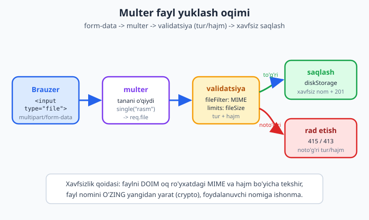
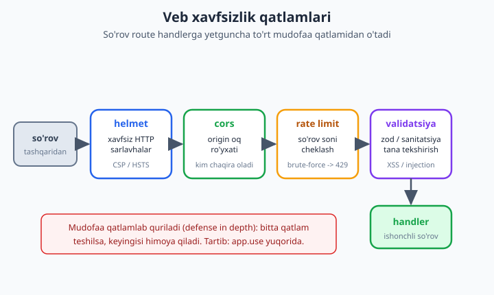

# 21 — Fayl yuklash, config va xavfsizlik

[⬅️ Oldingi: 20 — Autentifikatsiya va avtorizatsiya](./20-auth.md) · [🏠 README](./README.md) · [Keyingi: 22 — Real-time: WebSocket va Socket.io ➡️](./22-realtime.md)

> **Bu bobda:** API ni "ishlaydigan" holatdan "ishlab chiqarishga tayyor" holatga olib chiqamiz. Avval **fayl yuklash** ni o'rganamiz: `multipart/form-data` nima ekani, **multer** bilan diskka yoki xotiraga saqlash (`diskStorage` / `memoryStorage`), bitta yoki bir nechta fayl (`single` / `array`), `fileFilter` bilan MIME turini tekshirish, `limits` bilan hajmni cheklash, fayl nomini **xavfsiz** yangilash va yuklangan faylni xizmat qilish. So'ng **konfiguratsiya** ga o'tamiz: `.env`, `dotenv` va `node --env-file`, `NODE_ENV`, env'ni **zod** bilan validatsiya qilish (yo'q bo'lsa server darrov yiqilsin), 12-faktor tamoyili va sirlarni kodga yozmaslik. Oxirida **veb xavfsizlik**: `helmet` (xavfsiz HTTP sarlavhalar), `cors` (origin oq ro'yxati), `express-rate-limit` (brute-force/DDoS dan himoya, `429`), input sanitatsiya, SQL/NoSQL injection va XSS, OWASP va HTTPS. REAL KEYS: blog API'siga rasm yuklash endpointini va to'liq xavfsizlik qatlamini qo'shamiz. Hamma kod Node 24.12 + Express 5 da `npm install` qilinib, `fetch` bilan ishga tushirib tasdiqlangan (upload `201`, noto'g'ri tur `415`, rate-limit `429`).

---

## Nega bu bob muhim?

Oldingi boblarda API yozishni, marshrutlash, middleware (`./13-middleware.md`), ma'lumotlar bazasi va autentifikatsiyani (`./20-auth.md`) o'rgandik. API "ishlaydi". Lekin **ishlaydi** va **internetga chiqarsa bo'ladi** — bu ikki boshqa narsa.

Haqiqiy internetda sizning serveringizga faqat halol foydalanuvchilar emas, **botlar, skanerlar va hujumchilar** ham kiradi. Ular: parolni minglab marta taxminlaydi (brute-force), `.php` o'rniga zararli skript yuklamoqchi bo'ladi, so'rov tanasiga `'; DROP TABLE--` yozadi, boshqa saytdan sizning API'ngizga ruxsatsiz murojaat qiladi. Bu bob — aynan shu real dunyoga tayyorgarlik.

Uchta mavzu bir-biriga bog'liq:

1. **Fayl yuklash** — eng ko'p hujum qilinadigan nuqtalardan biri. Noto'g'ri yozsangiz, hujumchi serveringizga skript yuklab, uni ishga tushira oladi.
2. **Config** — parol, API kalit, bazaga ulanish — bularni qayerda saqlash kerak? **Hech qachon kodda emas.**
3. **Xavfsizlik qatlamlari** — `helmet`, `cors`, `rate-limit` — har biri bir hujum turidan himoya qiladigan, qator-ikki qatorda ulanadigan, lekin juda kuchli vositalar.

Boshlaymiz.

---

## 1-qism: Fayl yuklash

### `multipart/form-data` nima?

Odatiy API so'rovida tana JSON bo'ladi:

```
Content-Type: application/json

{"sarlavha":"Salom","matn":"..."}
```

Lekin JSON — bu **matn**. Rasm yoki PDF esa **binar** ma'lumot: uni JSON ichiga to'g'ridan-to'g'ri joylashtirib bo'lmaydi. Shu sababli brauzer fayl yuborganda boshqa format ishlatadi — **`multipart/form-data`**.

"Multipart" — "ko'p qismli" degani. So'rov tanasi bir nechta qismga (part) bo'linadi, har bir qism alohida maydon: biri matn maydoni, biri fayl. Qismlar maxsus chegara satri (`boundary`) bilan ajraladi:

```
Content-Type: multipart/form-data; boundary=----xYz123

------xYz123
Content-Disposition: form-data; name="sarlavha"

Mening maqolam
------xYz123
Content-Disposition: form-data; name="rasm"; filename="mushuk.png"
Content-Type: image/png

<...rasm baytlari...>
------xYz123--
```

Eng muhim narsa: **`express.json()` bu formatni o'qiy olmaydi.** 12-bobdagi `express.json` faqat JSON uchun. `multipart/form-data` ni o'qish uchun maxsus kutubxona kerak — eng mashhuri **multer**.

HTML tomonda fayl yuborish shunday ko'rinadi (kontekst uchun — biz backendga qaratamiz):

```html
<form method="POST" action="/api/upload" enctype="multipart/form-data">
  <input type="file" name="rasm" />
  <button>Yuklash</button>
</form>
```

Bu yerda `enctype="multipart/form-data"` — kalit. Usiz brauzer faylni emas, faqat nomini yuboradi.



### Multer bilan tanishish

Multer — Express uchun `multipart/form-data` ni o'qiydigan middleware. U so'rov tanasidagi fayllarni ajratib, `req.file` (bitta fayl) yoki `req.files` (bir nechta) ga, matn maydonlarini esa `req.body` ga joylaydi.

O'rnatamiz:

```bash
npm install express multer
```

Eng oddiy misol — faylni diskka saqlash:

```js
import express from "express";
import multer from "multer";

const app = express();

// fayllar "uploads/" papkasiga saqlanadi
const upload = multer({ dest: "uploads/" });

// upload.single("rasm") — "rasm" nomli BITTA fayl kutadi
app.post("/yukla", upload.single("rasm"), (req, res) => {
  // req.file — yuklangan fayl haqidagi ma'lumot
  res.json({ saqlandi: req.file.filename, hajm: req.file.size });
});

app.listen(3000);
```

`upload.single("rasm")` — bu middleware. U `"rasm"` nomli maydondan bitta faylni o'qib, diskka saqlaydi, so'ng `req.file` ni to'ldiradi va `next()` chaqiradi. `req.file` obyekti shunday bo'ladi:

```js
{
  fieldname: "rasm",
  originalname: "mushuk.png",   // foydalanuvchi qo'ygan nom (ISHONMANG!)
  encoding: "7bit",
  mimetype: "image/png",         // tur (buni ham TEKSHIRING)
  destination: "uploads/",
  filename: "a1b2c3d4...",        // diskdagi nom
  path: "uploads/a1b2c3d4...",
  size: 20453                     // baytlarda
}
```

`{ dest: "uploads/" }` — eng tez boshlash usuli, lekin u tasodifiy nom beradi va kengaytmani saqlamaydi. Haqiqiy loyihada **`storage`** ni o'zimiz boshqaramiz.

### `diskStorage` va `memoryStorage`

Multerda ikkita asosiy saqlash strategiyasi bor:

| | `diskStorage` | `memoryStorage` |
|---|---|---|
| Qayerga | Diskka (fayl tizimiga) | RAM ga (`Buffer` sifatida) |
| Qachon | Faylni saqlab qolmoqchi bo'lsangiz (avatar, hujjat) | Faylni qayta ishlab darrov boshqa joyga yuborsangiz (S3, rasm o'lchamini o'zgartirish) |
| Xavf | Disk to'lib qolishi | Katta fayl xotirani yeb qo'yishi |
| `req.file` | `path`, `filename` bor | `buffer` bor, `path` yo'q |

**`diskStorage`** — faylni diskka yozadi va nomini biz nazorat qilamiz. Bu eng ko'p ishlatiladigani:

```js
import path from "node:path";
import crypto from "node:crypto";

const storage = multer.diskStorage({
  // qaysi papkaga
  destination: (req, file, cb) => cb(null, "uploads/"),

  // qanday nom bilan — XAVFSIZ nom yasaymiz
  filename: (req, file, cb) => {
    const ext = path.extname(file.originalname).toLowerCase(); // .png
    const nom = crypto.randomBytes(16).toString("hex") + ext;  // tasodifiy
    cb(null, nom);
  },
});

const upload = multer({ storage });
```

Bu yerda `cb(null, qiymat)` — Node uslubidagi callback: birinchi argument xato (yo'q bo'lsa `null`), ikkinchisi natija.

**`memoryStorage`** — fayl diskka yozilmaydi, `req.file.buffer` da `Buffer` bo'lib turadi. Buni masalan bulutga (S3) yuborish yoki `sharp` bilan rasm o'lchamini o'zgartirish uchun ishlatasiz:

```js
const upload = multer({ storage: multer.memoryStorage() });

app.post("/yukla", upload.single("rasm"), async (req, res) => {
  // req.file.buffer — faylning baytlari, RAM da
  console.log("baytlar:", req.file.buffer.length);
  // bu yerda buffer'ni S3 ga yoki sharp'ga uzatishingiz mumkin
  res.json({ ok: true });
});
```

> **Diqqat:** `memoryStorage` da har bir fayl to'liq RAM ga sig'adi. Shu sababli `limits` bilan hajmni cheklash bu yerda yanada muhim — aks holda bir nechta katta fayl serverni yiqitishi mumkin.

### `single`, `array`, `fields` — nechta fayl?

| Metod | Nima qiladi | Natija |
|---|---|---|
| `upload.single("rasm")` | Bitta fayl, `"rasm"` maydoni | `req.file` |
| `upload.array("rasmlar", 5)` | `"rasmlar"` maydonidan ko'pi 5 ta | `req.files` (massiv) |
| `upload.fields([...])` | Har xil maydonlardan fayllar | `req.files` (obyekt) |
| `upload.none()` | Faqat matn, fayl yo'q | `req.body` |

Bir nechta fayl uchun `array`:

```js
// "rasmlar" maydonidan ko'pi bilan 3 ta fayl
app.post("/galereya", upload.array("rasmlar", 3), (req, res) => {
  const nomlar = req.files.map((f) => f.filename);
  res.json({ yuklandi: nomlar.length, nomlar });
});
```

### `fileFilter` — turni tekshirish

Eng muhim xavfsizlik nuqtasi: **har qanday fayl turini qabul qilmang.** Agar avatar yuklash endpointi `.php`, `.exe` yoki `.html` faylni qabul qilsa — bu jiddiy xavf. `fileFilter` faylni saqlashdan **oldin** tekshiradi:

```js
// faqat shu MIME turlariga ruxsat
const RUXSAT = new Set(["image/png", "image/jpeg", "image/webp"]);

const upload = multer({
  storage,
  fileFilter: (req, file, cb) => {
    if (RUXSAT.has(file.mimetype)) {
      cb(null, true);              // qabul qilamiz
    } else {
      cb(new Error("INVALID_TYPE")); // rad etamiz
    }
  },
});
```

`cb(null, true)` — faylni qabul qil. `cb(null, false)` — jimgina rad et. `cb(new Error(...))` — xato bilan rad et (biz error handlerda tutib olamiz).

> **Muhim ogohlantirish:** `file.mimetype` ni brauzer yuboradi, demak uni **soxtalashtirsa bo'ladi**. `fileFilter` — birinchi to'siq, lekin yagona emas. Yuqori darajadagi xavfsizlik uchun fayl baytlarining boshini ("magic bytes") tekshirish kerak: masalan PNG har doim `89 50 4E 47` bilan boshlanadi. Buni `file-type` kabi kutubxona qiladi. Bu bobda MIME + kengaytma tekshiruvi bilan cheklanamiz, lekin yodda tuting: foydalanuvchi yuborgan har qanday metama'lumotga ishonmaslik kerak.

### `limits` — hajmni cheklash

Cheksiz katta fayl — diskni to'ldirish yoki xotirani tugatish orqali DoS hujumi. `limits` buni oldini oladi:

```js
const upload = multer({
  storage,
  fileFilter,
  limits: {
    fileSize: 2 * 1024 * 1024, // 2 MB — bitta fayl chegarasi
    files: 1,                  // ko'pi bilan 1 ta fayl
    fields: 10,                // ko'pi bilan 10 ta matn maydoni
  },
});
```

Fayl chegaradan oshsa, multer `LIMIT_FILE_SIZE` kodli xato beradi — uni error handlerda tutib, `413 Payload Too Large` qaytaramiz.

### Multer xatolarini to'g'ri ushlash

Multer middleware'i ichida xato bo'lsa, u Express'ning error oqimiga tushadi. Buni ikki usulda ushlash mumkin. Aniqroq xabar berish uchun `upload.single(...)` ni qo'lda chaqirib, callback'da xatoni ko'ramiz:

```js
import multer, { MulterError } from "multer";

app.post("/api/upload", (req, res) => {
  upload.single("rasm")(req, res, (err) => {
    if (err instanceof MulterError) {
      // multerning o'z xatolari (hajm, fayllar soni, ...)
      if (err.code === "LIMIT_FILE_SIZE") {
        return res.status(413).json({ xato: "Fayl 2MB dan katta" });
      }
      return res.status(400).json({ xato: "Yuklash xatosi: " + err.code });
    }
    if (err) {
      // bizning fileFilter dagi xato
      if (err.message === "INVALID_TYPE") {
        return res.status(415).json({ xato: "Faqat png/jpeg/webp ruxsat" });
      }
      return res.status(400).json({ xato: "Noma'lum xato" });
    }
    if (!req.file) {
      return res.status(400).json({ xato: "Fayl yuborilmadi" });
    }
    // hammasi joyida
    res.status(201).json({ ok: true, nom: req.file.filename });
  });
});
```

HTTP statuslar mantig'i:

- **`413 Payload Too Large`** — fayl juda katta.
- **`415 Unsupported Media Type`** — turi ruxsat etilmagan.
- **`400 Bad Request`** — fayl umuman yuborilmadi yoki boshqa xato.
- **`201 Created`** — fayl muvaffaqiyatli saqlandi.

### Yuklangan faylni xizmat qilish

Saqlangan faylni foydalanuvchiga qaytarish uchun `express.static` ishlatamiz (13-bobdan tanish):

```js
// /files/abc.png -> uploads/abc.png ni qaytaradi
app.use("/files", express.static("uploads"));
```

Endi `http://localhost:3000/files/abc.png` orqali fayl ko'rinadi.

> **Xavfsizlik eslatmasi:** maxfiy fayllarni (foydalanuvchi hujjatlari) shunchaki `static` bilan ochiq qo'ymang — kim havolani bilsa, ko'ra oladi. Bunday holatlarda faylni qaytarishdan oldin avtorizatsiyani tekshirib, `res.sendFile()` bilan qo'lda yuboring.

### Fayl yuklashning xavfsizlik xulosasi

Yuklash endpointini yozganda doim shu beshlikni eslang:

1. **Tur** — `fileFilter` + oq ro'yxat (faqat ruxsat etilganlar). Magic bytes bilan ikki marta tekshirish ideal.
2. **Hajm** — `limits.fileSize` bilan chegara.
3. **Nom** — fayl nomini O'ZINGIZ yangidan yarating (`crypto.randomBytes`). Foydalanuvchi nomida `../../../etc/passwd` kabi "path traversal" bo'lishi mumkin.
4. **Papka** — yuklash papkasi kodlar papkasidan ajralgan bo'lsin; iloji bo'lsa veb-server uni skript sifatida ishga tushira olmasin.
5. **Soni** — `limits.files` bilan bir so'rovdagi fayllar sonini cheklang.

---

## 2-qism: Konfiguratsiya

### Muammo: kodga yozilgan sirlar

Quyidagi kodning nimasi yomon?

```js
// XATO — sirlar kodga yozilgan
const db = mysql.createPool({
  host: "db.kompaniya.uz",
  user: "admin",
  password: "P@rol123!",          // XAVFLI
});
const JWT_SECRET = "mening-maxfiy-kalitim"; // XAVFLI
```

Ko'p muammo bor:

- **Git tarixiga tushadi.** Bir marta commit qilsangiz, parol abadiy git tarixida qoladi (`git push` qilingach — GitHub'da). Keyin uni o'zgartirsangiz ham, eski commitda turaveradi.
- **Har muhit uchun bir xil.** Lokal mashinangiz, test serveri va ishlab chiqarish — bularning hammasi har xil baza, har xil kalit ishlatishi kerak. Kodda qattiq yozilsa, buni qila olmaysiz.
- **Sir hamma ko'radi.** Repo'ga kirgan har bir dasturchi (yoki uni o'g'irlagan har kim) parolni ko'radi.

**Yechim — 12-faktor tamoyili:** *config kodda emas, atrof-muhitda (environment) saqlanadi.* Kod bir xil qoladi, config muhitdan o'qiladi.

### `.env` va `dotenv`

Atrof-muhit o'zgaruvchilari (environment variables) — operatsion tizim darajasidagi `KALIT=qiymat` juftliklari. Node ularni `process.env` orqali o'qiydi (10-bobdan tanish):

```js
console.log(process.env.PORT); // muhitdagi PORT qiymati
```

Lokal ishlashda har safar `set PORT=3000` deb yozish noqulay. Shuning uchun ularni **`.env`** fayliga yozamiz:

```bash
# .env
NODE_ENV=development
PORT=3000
DATABASE_URL=mysql://root@localhost:3306/blog
JWT_SECRET=super-maxfiy-kalit-uzunligi-yetarli
```

Bu faylni `process.env` ga yuklashning ikki zamonaviy usuli bor.

**Usul 1 — `dotenv` paketi** (eng keng tarqalgan):

```bash
npm install dotenv
```

```js
import "dotenv/config"; // .env ni o'qib process.env ga yuklaydi
// endi process.env.PORT mavjud
console.log(process.env.PORT);
```

**Usul 2 — Node'ning o'rnatilgan `--env-file` bayrog'i** (Node 20.6+ dan, paket kerak emas):

```bash
node --env-file=.env server.mjs
```

Node 24'da bu to'liq barqaror — yangi loyihalarda `dotenv` o'rniga shuni ishlatish mumkin. `package.json` skriptida:

```json
{
  "scripts": {
    "dev": "node --env-file=.env --watch server.mjs",
    "start": "node server.mjs"
  }
}
```

> **Eng muhim qoida:** `.env` ni **hech qachon git'ga qo'shmang.** `.gitignore` ga yozing:
> ```
> # .gitignore
> .env
> node_modules/
> uploads/
> ```
> Buning o'rniga `.env.example` yarating — qiymatsiz, faqat kalitlar ro'yxati. U git'ga tushadi va boshqalarga qaysi o'zgaruvchilar kerakligini ko'rsatadi:
> ```
> # .env.example (git'ga tushadi)
> PORT=
> DATABASE_URL=
> JWT_SECRET=
> ```

### `NODE_ENV` — qaysi muhitdamiz?

`NODE_ENV` — alohida ahamiyatga ega o'zgaruvchi. U ilova qaysi muhitda ishlayotganini bildiradi: odatda `development`, `production` yoki `test`.

```js
const ishlabChiqarish = process.env.NODE_ENV === "production";

if (ishlabChiqarish) {
  app.use(helmet());              // qattiqroq xavfsizlik
  // batafsil xato xabarlarini YASHIRAMIZ
} else {
  app.use(morgan("dev"));         // batafsil log
  // xatoni to'liq stack bilan ko'rsatamiz
}
```

Express, React va ko'p kutubxonalar `NODE_ENV=production` da o'zlarini optimallashtiradi (kamroq tekshiruv, tezroq). Shuning uchun ishlab chiqarishda uni `production` ga qo'yish — bepul tezlik.

### Env'ni validatsiya qilish (zod bilan)

Eng ko'p uchraydigan "tushunarsiz" xato: server ishga tushadi, lekin `DATABASE_URL` `undefined` bo'lib, allaqachon ishlayotgan serverning yarmida noaniq joyda qulab tushadi. Sababini topish — soatlar.

Yechim: **server ko'tarilishi bilanoq** konfiguratsiyani tekshiramiz va biror narsa yetishmasa, **darrov, tushunarli xato bilan yiqitamiz** ("fail fast"). Buning eng yaxshi vositasi — `zod` (TypeScript boblarida ham uchraydi — `../typescript/README.md`):

```bash
npm install zod
```

```js
// config.mjs
import { z } from "zod";

const envSchema = z.object({
  NODE_ENV: z.enum(["development", "production", "test"]).default("development"),
  PORT: z.coerce.number().int().positive().default(3000),
  DATABASE_URL: z.string().min(1, "DATABASE_URL majburiy"),
  JWT_SECRET: z.string().min(16, "JWT_SECRET kamida 16 belgi bo'lsin"),
});

const natija = envSchema.safeParse(process.env);

if (!natija.success) {
  console.error("❌ Konfiguratsiya xato — server ishga tushmaydi:");
  for (const issue of natija.error.issues) {
    console.error(`  - ${issue.path.join(".")}: ${issue.message}`);
  }
  process.exit(1); // DARROV yiqilamiz
}

// validatsiyadan o'tgan, TURI to'g'ri config
export const config = natija.data;
```

Bu nima beradi?

- **`z.coerce.number()`** — env har doim **string** bo'ladi (`"3000"`). `coerce` uni songa aylantiradi. Endi `config.PORT` haqiqiy son.
- **`.default(...)`** — qiymat berilmasa, oqilona standart.
- **`min(16)`** — `JWT_SECRET` juda qisqa bo'lsa, bu ham xato. Kuchsiz sir — kuchsiz xavfsizlik.
- **`process.exit(1)`** — yetishmasa, server umuman ko'tarilmaydi. Bu yaxshi: yarim ishlaydigan serverdan ko'ra, darrov yiqilgan va sababini aytgan server afzal.

Endi butun ilovada `process.env.PORT` o'rniga `config.PORT` ishlatasiz — turi to'g'ri, validatsiyadan o'tgan, ishonchli.

---

## 3-qism: Veb xavfsizlik

API endi fayl qabul qiladi va config'i tartibli. Endi uni internetga chiqarishdan oldin **mudofaa qatlamlarini** quramiz. Tamoyil — *defense in depth* (qatlamlab mudofaa): bitta qatlam teshilsa, keyingisi himoya qiladi.



### `helmet` — xavfsiz HTTP sarlavhalar

Brauzer xavfsizligining katta qismi HTTP javob **sarlavhalari** orqali boshqariladi. Masalan, "bu sahifa faqat shu manbalardan skript yuklasin" yoki "doim HTTPS ishlat" kabi qoidalar sarlavhalarda beriladi. Bularni qo'lda to'g'ri sozlash murakkab — **helmet** buni bir qator bilan qiladi:

```bash
npm install helmet
```

```js
import helmet from "helmet";
app.use(helmet()); // hammasidan oldin
```

`helmet()` o'nlab himoya sarlavhasini o'rnatadi. Eng muhimlari:

- **`Content-Security-Policy` (CSP)** — sahifa qaysi manbalardan skript, rasm, stil yuklashi mumkinligini cheklaydi. Bu — **XSS** ga qarshi eng kuchli himoya: hujumchi skript kiritsa ham, brauzer uni ishga tushirmaydi (manba ro'yxatda yo'q).
- **`Strict-Transport-Security` (HSTS)** — brauzerga "bu saytni doim HTTPS orqali och" deydi. Bir marta ko'rgach, brauzer `http://` ga umuman murojaat qilmaydi.
- **`X-Content-Type-Options: nosniff`** — brauzer faylning turini "taxmin qilishini" o'chiradi (MIME sniffing hujumi oldini oladi).
- **`X-Frame-Options`** — saytingizni boshqa saytning `<iframe>` ichiga joylab, foydalanuvchini aldash (clickjacking) ni bloklaydi.

API uchun (HTML qaytarmaydigan) odatda standart `helmet()` yetarli. CSP'ni saytingizga moslab sozlash mumkin, lekin bu — alohida mavzu; boshlash uchun standarti yaxshi.

### `cors` — kim chaqira oladi?

Brauzerda **Same-Origin Policy** bor: `https://blog.uz` dagi sahifa standart holda `https://api.boshqa.uz` ga so'rov yubora olmaydi. **CORS** (Cross-Origin Resource Sharing) — bu cheklovni **ataylab** yumshatish mexanizmi: "menga shu manbalardan murojaat qilsa bo'ladi" deb ruxsat berasiz.

Bu **brauzer** mexanizmi — `curl` yoki boshqa server CORS'ga bo'ysunmaydi. Lekin frontend (React/Vue) API'ngizga boshqa portdan/domendan murojaat qilsa, CORS sozlash shart.

```bash
npm install cors
```

Eng oddiy — hamma uchun ochish (faqat development uchun!):

```js
import cors from "cors";
app.use(cors()); // HAMMA origin'ga ruxsat — ehtiyot bo'ling
```

Ishlab chiqarishda **oq ro'yxat** beriladi — faqat ishonchli frontendlar:

```js
app.use(
  cors({
    origin: ["https://blog.uz", "http://localhost:5173"], // faqat shular
    credentials: true,        // cookie/Authorization yuborishga ruxsat
    methods: ["GET", "POST", "PUT", "DELETE"],
  })
);
```

`credentials: true` — agar frontend cookie yoki `Authorization` sarlavhasi yuborsa kerak. Diqqat: `credentials: true` bilan `origin: "*"` (hammaga) **ishlamaydi** — aniq manzil ko'rsatish shart. Bu — brauzerning ataylab qo'ygan xavfsizlik cheklovi.

### `express-rate-limit` — so'rov sonini cheklash

Hujumchi login endpointiga soniyada minglab parol yuborib, to'g'risini topmoqchi bo'ladi (**brute-force**). Yoki botlar serverni so'rovlar bilan ko'mib tashlaydi (**DDoS**). Yechim — bir IP'dan ma'lum vaqtda nechta so'rovga ruxsat berishni cheklash:

```bash
npm install express-rate-limit
```

```js
import rateLimit from "express-rate-limit";

const limiter = rateLimit({
  windowMs: 15 * 60 * 1000,  // 15 daqiqa oynasi
  limit: 100,                // har IP'dan 15 daqiqada 100 so'rov
  standardHeaders: "draft-7", // RateLimit-* sarlavhalarini qo'shadi
  legacyHeaders: false,
  message: { xato: "Juda ko'p so'rov. Birozdan keyin urinib ko'ring." },
});

app.use("/api/", limiter); // faqat /api/ ostida
```

Limit oshganda kutubxona avtomatik **`429 Too Many Requests`** qaytaradi. Login va parol tiklash kabi nozik endpointlarga alohida, qattiqroq limiter qo'yish odatiy amaliyot:

```js
// login uchun: 15 daqiqada faqat 5 urinish
const loginLimiter = rateLimit({ windowMs: 15 * 60 * 1000, limit: 5 });
app.post("/api/login", loginLimiter, loginHandler);
```

> **Eslatma:** ishlab chiqarishda ilova reverse-proxy (Nginx) ortida bo'lsa, `app.set("trust proxy", 1)` qo'yish kerak — aks holda hamma so'rov bir IP (proxy IP) dan kelgandek ko'rinib, limit noto'g'ri ishlaydi.

### Input validatsiya va sanitatsiya

Oltin qoida: **foydalanuvchidan kelgan hech narsaga ishonmang.** So'rov tanasi, query, header — hammasini tekshiring. Buni 14-bobda boshlagandik; bu yerda xavfsizlik nuqtai nazaridan ko'ramiz. `zod` bu yerda ham asosiy quroldir:

```js
import { z } from "zod";

const maqolaSchema = z.object({
  sarlavha: z.string().min(3).max(200).trim(),
  matn: z.string().min(1).max(10000),
});

app.post("/api/maqola", (req, res) => {
  const natija = maqolaSchema.safeParse(req.body);
  if (!natija.success) {
    return res.status(400).json({ xato: natija.error.issues });
  }
  const maqola = natija.data; // tozalangan, ishonchli ma'lumot
  // ... saqlash
});
```

**Validatsiya** — "ma'lumot to'g'ri shaklda emasmi?" (uzunlik, tur, format). **Sanitatsiya** — "ma'lumotdan xavfli qismni olib tashlash yoki zararsizlantirish" (masalan, foydalanuvchi kiritgan HTML'ni qochirish). Ikkalasi ham kerak.

### SQL / NoSQL injection

**SQL injection** — hujumchi so'rov tanasiga SQL kodi kiritib, sizning so'rovingizni o'zgartirishi. Mana xavfli kod:

```js
// XATO — SQL injection ochiq
const q = "SELECT * FROM users WHERE email = '" + req.body.email + "'";
// hujumchi email sifatida:  ' OR '1'='1
// natija:  SELECT * FROM users WHERE email = '' OR '1'='1'  -> HAMMA user!
```

Yechim — **parametrlangan so'rov** (prepared statement): qiymatni so'rov matniga yopishtirmang, alohida uzating. Drayver uni xavfsiz qochiradi:

```js
// TO'G'RI — parametrlangan so'rov (mysql2, 16-19 boblardan)
const [rows] = await pool.execute(
  "SELECT * FROM users WHERE email = ?",
  [req.body.email]   // qiymat alohida, injection mumkin emas
);
```

`?` o'rniga qanday qiymat kelsa ham, u **ma'lumot** sifatida ishlatiladi, hech qachon SQL **kodi** sifatida emas. Bu — SQL injection'ga qarshi yagona ishonchli himoya. SQL haqida chuqurroq: `../sql/README.md`.

Prisma kabi ORM ishlatsangiz, u barcha so'rovlarni avtomatik parametrlaydi — qo'lda string yopishtirmaguningizcha xavfsizsiz. **NoSQL injection** (MongoDB) ham xuddi shunga o'xshaydi: foydalanuvchidan kelgan obyektni to'g'ridan-to'g'ri so'rovga bermang, validatsiyadan o'tkazing (`{ $gt: "" }` kabi operatorlarni filtrlang).

### XSS — Cross-Site Scripting

**XSS** — hujumchi sahifaga zararli `<script>` kiritib, boshqa foydalanuvchilarning brauzerida ishga tushirishi. Masalan, izoh sifatida `<script>cookie'ni o'g'irla</script>` yozadi, va boshqa kim izohni ko'rsa, skript ularning brauzerida ishlaydi.

Backend tomonidan himoya:

- **Hech qachon foydalanuvchi matnini ishonchli deb hisoblamang.** Saqlanganida — tekshiring, ko'rsatilganida — qochiring (escape).
- **CSP** (helmet'dagi) — eng kuchli himoya: ruxsatsiz skript brauzerda umuman ishlamaydi.
- Frontend freymvorklari (React) standart holda matnni qochiradi — `dangerouslySetInnerHTML` dan qochish kerak.

### OWASP Top 10 — qisqacha

OWASP Top 10 — eng keng tarqalgan veb-zaifliklarning xalqaro ro'yxati. Backend dasturchi sifatida hech bo'lmaganda shularni bilish kerak:

| Zaiflik | Bizning himoya |
|---|---|
| Broken Access Control | Avtorizatsiya tekshiruvi (`./20-auth.md`) |
| Cryptographic Failures | Parolni `bcrypt` bilan hesh, HTTPS, sirlar config'da |
| Injection (SQL/NoSQL/XSS) | Parametrlangan so'rov, validatsiya, CSP |
| Insecure Design | Rate limit, fail-fast config |
| Security Misconfiguration | `helmet`, `NODE_ENV=production`, batafsil xatoni yashirish |
| Vulnerable Components | `npm audit`, paketlarni yangilab turish |

`npm audit` ni muntazam ishlatib turing — u bog'liqliklardagi ma'lum zaifliklarni ko'rsatadi:

```bash
npm audit
npm audit fix
```

### HTTPS — qisqa eslatma

Bu bobdagi hamma narsa HTTP'da yozildi, lekin **ishlab chiqarishda doim HTTPS** bo'lishi shart. HTTPS'siz: parol, token, ma'lumot — hammasi ochiq matnda tarmoq orqali uchadi, va o'rtadagi kim xohlasa o'qiy oladi.

Amaliyotda HTTPS'ni odatda Node emas, **reverse-proxy** (Nginx, Caddy) yoki platforma (Render, Railway, Fly.io) hal qiladi — sertifikatni ular boshqaradi (Let's Encrypt bilan bepul). Node ilovangiz oddiy HTTP'da ishlaydi, proxy tashqi dunyo bilan HTTPS orqali gaplashadi. Deploy va CI haqida: `../git-github/README.md`.

---

## REAL KEYS: blog API'siga to'liq mudofaa qatlami

Endi hammasini birlashtiramiz. Blog API'siga **rasm yuklash endpointi** va **to'liq xavfsizlik qatlamini** (helmet + cors + rate-limit) qo'shamiz. Bu kod haqiqatda ishga tushirildi.

Avval o'rnatamiz:

```bash
npm install express multer helmet cors express-rate-limit dotenv
```

`server.mjs`:

```js
import express from "express";
import helmet from "helmet";
import cors from "cors";
import rateLimit from "express-rate-limit";
import multer, { MulterError } from "multer";
import crypto from "node:crypto";
import path from "node:path";
import fs from "node:fs";
import { fileURLToPath } from "node:url";

const __dirname = path.dirname(fileURLToPath(import.meta.url));
const UPLOAD_DIR = path.join(__dirname, "uploads");
fs.mkdirSync(UPLOAD_DIR, { recursive: true });

const app = express();

// ===== XAVFSIZLIK QATLAMLARI (tartib muhim — hammasidan oldin) =====
app.use(helmet());                                    // 1) xavfsiz sarlavhalar
app.use(cors({ origin: ["http://localhost:5173"], credentials: true })); // 2) CORS oq ro'yxat
app.use(express.json());                              // JSON tanani o'qish

// 3) rate limit — faqat /api/ ostida
const limiter = rateLimit({
  windowMs: 60_000,
  limit: 3,                 // namoyish uchun kichik; realda 100+
  standardHeaders: "draft-7",
  legacyHeaders: false,
  message: { xato: "Juda ko'p so'rov. Birozdan keyin urinib ko'ring." },
});
app.use("/api/", limiter);

// ===== MULTER: rasm yuklash sozlamasi =====
const RUXSAT = new Set(["image/png", "image/jpeg", "image/webp"]);
const storage = multer.diskStorage({
  destination: (req, file, cb) => cb(null, UPLOAD_DIR),
  filename: (req, file, cb) => {
    const ext = path.extname(file.originalname).toLowerCase();
    cb(null, crypto.randomBytes(16).toString("hex") + ext); // xavfsiz nom
  },
});
const upload = multer({
  storage,
  limits: { fileSize: 2 * 1024 * 1024, files: 1 }, // 2MB, 1 fayl
  fileFilter: (req, file, cb) => {
    if (RUXSAT.has(file.mimetype)) cb(null, true);
    else cb(new Error("INVALID_TYPE"));
  },
});

// ===== ENDPOINT: rasm yuklash =====
app.post("/api/upload", (req, res) => {
  upload.single("rasm")(req, res, (err) => {
    if (err instanceof MulterError) {
      if (err.code === "LIMIT_FILE_SIZE")
        return res.status(413).json({ xato: "Fayl 2MB dan katta" });
      return res.status(400).json({ xato: "Yuklash xatosi: " + err.code });
    }
    if (err) {
      if (err.message === "INVALID_TYPE")
        return res.status(415).json({ xato: "Faqat png/jpeg/webp ruxsat" });
      return res.status(400).json({ xato: "Noma'lum xato" });
    }
    if (!req.file) return res.status(400).json({ xato: "Fayl topilmadi" });

    res.status(201).json({
      ok: true,
      nom: req.file.filename,
      hajm: req.file.size,
      url: `/files/${req.file.filename}`,
    });
  });
});

// yuklangan fayllarni xizmat qilish
app.use("/files", express.static(UPLOAD_DIR));

app.listen(3000, () => console.log("Server: http://localhost:3000"));
```

Endi uni `fetch` bilan sinaymiz — yaroqli rasm, yaroqsiz tur va rate-limit. Sinov skripti (yuqoridagi server bilan birga ishladi):

```js
const baza = "http://localhost:3000";

// 1) helmet sarlavhasi bormi?
const h = await fetch(baza + "/files/yoq.png");
console.log("helmet nosniff:", h.headers.get("x-content-type-options"));

// 2) yaroqli PNG yuklash
const png = Buffer.from(
  "89504e470d0a1a0a0000000d4948445200000001000000010806000000" +
  "1f15c4890000000d4944415478da6360000002000100ffff03000006000557bfabd40000000049454e44ae426082",
  "hex"
);
const fd1 = new FormData();
fd1.append("rasm", new Blob([png], { type: "image/png" }), "test.png");
const r1 = await fetch(baza + "/api/upload", { method: "POST", body: fd1 });
console.log("PNG yuklash:", r1.status, await r1.json());

// 3) yaroqsiz tur (.txt)
const fd2 = new FormData();
fd2.append("rasm", new Blob([Buffer.from("salom")], { type: "text/plain" }), "hack.txt");
const r2 = await fetch(baza + "/api/upload", { method: "POST", body: fd2 });
console.log("TXT yuklash:", r2.status, await r2.json());

// 4) rate-limit: limit=3 dan oshiramiz -> 429
//    (yuqorida 2 ta /api/upload ketdi; yana 2 tasi)
const yangiFd = () => {
  const f = new FormData();
  f.append("rasm", new Blob([png], { type: "image/png" }), "t.png");
  return f;
};
const r3 = await fetch(baza + "/api/upload", { method: "POST", body: yangiFd() });
const r4 = await fetch(baza + "/api/upload", { method: "POST", body: yangiFd() });
console.log("3-so'rov:", r3.status);
console.log("4-so'rov:", r4.status, await r4.json());
```

**Haqiqiy chiqish (Node 24.12 da ishga tushirilgan):**

```
helmet nosniff: nosniff
PNG yuklash: 201 {
  ok: true,
  nom: '5836e09ea5a707ee5790df18fa04136b.png',
  hajm: 75,
  url: '/files/5836e09ea5a707ee5790df18fa04136b.png'
}
TXT yuklash: 415 { xato: 'Faqat png/jpeg/webp ruxsat' }
3-so'rov: 201
4-so'rov: 429 { xato: "Juda ko'p so'rov. Birozdan keyin urinib ko'ring." }
```

Diqqat bering, hamma qatlam ishladi:

- **helmet** — `x-content-type-options: nosniff` sarlavhasi javobda bor.
- **multer + fileFilter** — PNG qabul qilindi (`201`), matn fayli rad etildi (`415`).
- **xavfsiz nom** — saqlangan nom foydalanuvchi qo'ygan `test.png` emas, tasodifiy `5836e0...png`.
- **rate-limit** — 3-so'rov hali o'tdi, 4-so'rov `429` bilan bloklandi.

Bir necha qator middleware bilan API'mizni eng keng tarqalgan hujumlardan himoyaladik. Mana **production-ready** API'ning poydevori.

---

## Mashqlar

### Oson

**1.** `upload.single("avatar")` o'rniga `upload.array("rasmlar", 4)` ishlatadigan endpoint yozing. Yuklangan fayllar sonini va nomlarini JSON'da qaytaring.

**2.** `fileFilter` ga PDF (`application/pdf`) ni ham qo'shing, lekin hajm chegarasini PDF uchun 5MB qiling (ishora: `limits` umumiy, lekin shartni endpoint ichida qo'shimcha tekshirsangiz bo'ladi).

**3.** `.env` faylida `PORT` va `APP_NAME` o'zgaruvchilarini yarating va serverni `node --env-file=.env` bilan ishga tushiring. Server ishga tushganda `APP_NAME` va `PORT` ni konsolga chiqaring.

### O'rta

**4.** `zod` bilan env validatsiyasini yozing: `PORT` (son, 1-65535), `NODE_ENV` (enum), `JWT_SECRET` (min 16). Birorta yetishmasa, tushunarli xato bilan `process.exit(1)` qiling. `JWT_SECRET` ni o'chirib, server yiqilishini tekshiring.

**5.** Login endpointiga alohida qattiq rate-limiter qo'ying: 10 daqiqada 5 urinish. 6-urinishda `429` qaytishini `fetch` bilan tasdiqlang.

**6.** `cors` ni shunday sozlangki, faqat `http://localhost:5173` va `https://blog.uz` ruxsat olsin, `credentials: true` bo'lsin. Boshqa origin'dan kelgan so'rov bloklanishini tushuntiring.

### Qiyin

**7.** Rasm yuklash endpointini "magic bytes" bilan mustahkamlang: faylning birinchi baytlarini o'qib, PNG (`89 50 4E 47`) yoki JPEG (`FF D8 FF`) ekanini tasdiqlang. MIME soxta bo'lsa ham (`.exe` ni `image/png` deb yuborsa), bayt tekshiruvi uni tutsin. (`memoryStorage` + `req.file.buffer` ishlating.)

**8.** Blog maqola yaratish endpointini to'liq himoyalang: `zod` validatsiya (`sarlavha`, `matn`), parametrlangan SQL `INSERT` (mysql2, `nodejs_test` bazasi), va `helmet`/`rate-limit`. SQL injection urinishini (`'; DROP TABLE--`) yuborib, hech narsa buzilmasligini tasdiqlang.

<details>
<summary>Yechimlar</summary>

**1.** Bir nechta fayl `upload.array` bilan `req.files` ga tushadi:

```js
app.post("/galereya", upload.array("rasmlar", 4), (req, res) => {
  if (!req.files?.length) return res.status(400).json({ xato: "Fayl yo'q" });
  res.status(201).json({
    soni: req.files.length,
    nomlar: req.files.map((f) => f.filename),
  });
});
```

**2.** `fileFilter` ga PDF qo'shib, hajmni endpoint ichida tur bo'yicha tekshiramiz:

```js
const RUXSAT = new Set(["image/png", "image/jpeg", "application/pdf"]);
const upload = multer({
  storage,
  limits: { fileSize: 5 * 1024 * 1024 }, // umumiy yuqori chegara: 5MB
  fileFilter: (req, file, cb) =>
    cb(RUXSAT.has(file.mimetype) ? null : new Error("INVALID_TYPE"), RUXSAT.has(file.mimetype)),
});

app.post("/api/upload", (req, res) => {
  upload.single("fayl")(req, res, (err) => {
    if (err) return res.status(415).json({ xato: "Tur yoki hajm xato" });
    // rasm uchun qo'shimcha qattiqroq chegara: 2MB
    if (req.file.mimetype !== "application/pdf" && req.file.size > 2 * 1024 * 1024) {
      fs.unlinkSync(req.file.path); // saqlangani o'chirib tashlaymiz
      return res.status(413).json({ xato: "Rasm 2MB dan oshmasin" });
    }
    res.status(201).json({ ok: true, nom: req.file.filename });
  });
});
```

**3.** `.env`:

```
PORT=4000
APP_NAME=BlogAPI
```

`server.mjs`:

```js
const PORT = process.env.PORT ?? 3000;
console.log(`${process.env.APP_NAME} ${PORT}-portda ishlamoqda`);
app.listen(PORT);
```

Ishga tushirish: `node --env-file=.env server.mjs` → `BlogAPI 4000-portda ishlamoqda`.

**4.** Fail-fast env validatsiya:

```js
import { z } from "zod";

const schema = z.object({
  PORT: z.coerce.number().int().min(1).max(65535).default(3000),
  NODE_ENV: z.enum(["development", "production", "test"]).default("development"),
  JWT_SECRET: z.string().min(16, "JWT_SECRET kamida 16 belgi"),
});

const r = schema.safeParse(process.env);
if (!r.success) {
  console.error("Config xato:");
  r.error.issues.forEach((i) => console.error(`  - ${i.path.join(".")}: ${i.message}`));
  process.exit(1);
}
export const config = r.data;
```

`JWT_SECRET` ni `.env` dan o'chirib `node --env-file=.env server.mjs` qilsangiz:

```
Config xato:
  - JWT_SECRET: JWT_SECRET kamida 16 belgi
```

va server `exit code 1` bilan yiqiladi — aynan biz xohlagan xatti-harakat.

**5.** Login uchun alohida limiter:

```js
const loginLimiter = rateLimit({
  windowMs: 10 * 60 * 1000,
  limit: 5,
  standardHeaders: "draft-7",
  legacyHeaders: false,
  message: { xato: "Juda ko'p urinish, keyinroq urinib ko'ring" },
});

app.post("/api/login", loginLimiter, (req, res) => res.json({ ok: true }));

// test:
const server = app.listen(3000, async () => {
  let oxirgi;
  for (let i = 1; i <= 6; i++) {
    const r = await fetch("http://localhost:3000/api/login", { method: "POST" });
    oxirgi = r.status;
    console.log(`${i}-urinish:`, r.status);
  }
  console.log("6-urinish 429 mi:", oxirgi === 429);
  server.close();
});
// 1..5 -> 200, 6 -> 429
```

**6.** CORS oq ro'yxat:

```js
const ruxsatOrigin = ["http://localhost:5173", "https://blog.uz"];
app.use(
  cors({
    origin: (origin, cb) => {
      // origin yo'q (Postman, server-server) yoki ro'yxatda bo'lsa ruxsat
      if (!origin || ruxsatOrigin.includes(origin)) cb(null, true);
      else cb(new Error("CORS: bu origin ga ruxsat yo'q"));
    },
    credentials: true,
  })
);
```

Boshqa origin'dan (masalan `https://yomon.uz`) **brauzer** so'rov yuborganda, server `Access-Control-Allow-Origin` sarlavhasini qaytarmaydi, va brauzer javobni JS'ga **bermaydi** (bloklaydi). E'tibor bering: bu faqat brauzerda ishlaydi — CORS server-server so'rovlarni himoya qilmaydi (buning uchun auth/rate-limit kerak).

**7.** Magic bytes tekshiruvi (`memoryStorage`):

```js
const upload = multer({
  storage: multer.memoryStorage(),
  limits: { fileSize: 2 * 1024 * 1024 },
});

// faylning birinchi baytlarini tekshiruvchi yordamchi
function haqiqiyRasmmi(buf) {
  // PNG: 89 50 4E 47
  if (buf[0] === 0x89 && buf[1] === 0x50 && buf[2] === 0x4e && buf[3] === 0x47)
    return "png";
  // JPEG: FF D8 FF
  if (buf[0] === 0xff && buf[1] === 0xd8 && buf[2] === 0xff) return "jpeg";
  return null;
}

app.post("/api/upload", upload.single("rasm"), (req, res) => {
  if (!req.file) return res.status(400).json({ xato: "Fayl yo'q" });
  const tur = haqiqiyRasmmi(req.file.buffer);
  if (!tur) {
    // MIME "image/png" desa ham, baytlar yolg'on bo'lsa — rad
    return res.status(415).json({ xato: "Bu haqiqiy rasm emas" });
  }
  // endi xavfsiz: diskka yozamiz
  const nom = crypto.randomBytes(16).toString("hex") + "." + tur;
  fs.writeFileSync(path.join(UPLOAD_DIR, nom), req.file.buffer);
  res.status(201).json({ ok: true, nom, tur });
});
```

Bu yondashuv MIME'ga ishonmaydi — faylning **haqiqiy** mazmunini tekshiradi. `.exe` ni `image/png` deb yuborgan hujumchi shu yerda to'xtaydi.

**8.** To'liq himoyalangan maqola endpointi (mysql2, parametrlangan):

```js
import mysql from "mysql2/promise";
import { z } from "zod";

const pool = mysql.createPool({
  host: "localhost", user: "root", password: "", database: "nodejs_test",
});

const maqolaSchema = z.object({
  sarlavha: z.string().min(3).max(200).trim(),
  matn: z.string().min(1).max(10000),
});

app.post("/api/maqola", limiter, async (req, res) => {
  const r = maqolaSchema.safeParse(req.body);
  if (!r.success) return res.status(400).json({ xato: r.error.issues });

  // parametrlangan so'rov — ? injection'ni to'liq oldini oladi
  const [natija] = await pool.execute(
    "INSERT INTO maqolalar (sarlavha, matn) VALUES (?, ?)",
    [r.data.sarlavha, r.data.matn]
  );
  res.status(201).json({ id: natija.insertId });
});
```

`sarlavha` sifatida `'; DROP TABLE maqolalar; --` yuborilsa — bu shunchaki oddiy **matn** bo'lib saqlanadi, hech qanday SQL bajarilmaydi, chunki `?` qiymati hech qachon kod sifatida talqin qilinmaydi. Jadval o'rnida turaveradi. Bu — parametrlangan so'rovning butun mohiyati.

</details>

---

[⬅️ Oldingi: 20 — Autentifikatsiya va avtorizatsiya](./20-auth.md) · [🏠 README](./README.md) · [Keyingi: 22 — Real-time: WebSocket va Socket.io ➡️](./22-realtime.md)
