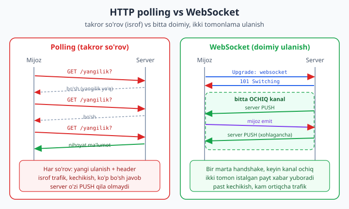
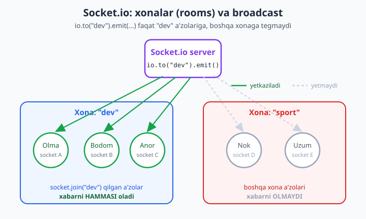

# 22 — Real-time: WebSocket va Socket.io

[⬅️ Oldingi: 21 — Fayl yuklash, config va xavfsizlik](./21-xavfsizlik-config.md) · [🏠 README](./README.md) · [Keyingi: 23 — Testlash (Vitest + supertest) ➡️](./23-testlash.md)

> **Bu bobda:** Endi ilovamizga **jonli** (real-time) qalb beramiz. Avval HTTP so'rov-javob modeli nega real-time uchun yaramasligini va **polling** ning isrofini ko'ramiz. So'ng **WebSocket** protokolini — HTTP `Upgrade` handshake, `ws://`/`wss://`, bitta **doimiy ikki tomonlama** ulanish — tushunamiz va past darajali `ws` paketi bilan birinchi serverni yozamiz. Asosiy qism — **Socket.io**: `io.on("connection")`, `socket.on`/`emit`, **broadcast** (`io.emit` hammaga, `socket.broadcast.emit` o'zidan boshqaga), **rooms** (`socket.join`, `io.to(room).emit`), **acknowledgement** (`emitWithAck`), va **namespace**. Buni Express HTTP server bilan **bitta** serverda birlashtiramiz (`http.createServer` + Socket.io), `io.use(...)` bilan **auth middleware** qo'shamiz (20-bobga ko'prik) va masshtab uchun **Redis adapter** ni eslab o'tamiz. REAL KEYS: to'liq **real-time chat** — xonalar, foydalanuvchi qo'shilishi, xabar broadcast. Hamma kod Node 24.12 + Socket.io 4.8.3 da `socket.io-client` bilan **ishga tushirib tasdiqlangan**.

---

## Real-time nima va nega kerak?

Shu paytgacha qurgan har bir serverimiz **so'rov-javob** (request-response) modelida ishladi: mijoz so'raydi, server javob beradi, ulanish yopiladi. Bu model bloglar, do'konlar, API'lar uchun mukammal. Lekin u bitta narsani **qila olmaydi**: server o'zidan tashabbus bilan mijozga xabar **yubora olmaydi**.

Tasavvur qiling: chat ilovasi. Olma sizga xabar yozdi. Sizning brauzeringiz bu haqida qanday biladi? HTTP'da server "Olma yozdi!" deb o'zi qo'ng'iroq qila olmaydi — chunki mijoz so'ramaguncha gaplashish kanali yo'q. Xuddi shu muammo: jonli bildirishnomalar, birja narxlari, o'yin holatlari, hamkorlikdagi tahrir (Google Docs), jonli sport hisobi — bularning hammasida **server -> mijoz PUSH** kerak.

Real-time aloqaning mohiyati shu: **server ma'lumot tayyor bo'lishi bilan, mijoz so'ramasdan, uni o'zi yetkazadi**. Mijoz "kutib o'tirmaydi"; ulanish doimo ochiq turadi va xabar har ikki tomondan istalgan paytda oqadi.

### "Hiyla" yechim: polling

WebSocket'gacha dasturchilar bu muammoni **polling** bilan hal qilishardi: mijoz har necha soniyada server'dan "yangilik bormi?" deb **takror so'raydi**.

```js
// Polling: har 3 soniyada serverdan so'raymiz (qadimiy usul, isrof)
setInterval(async () => {
  const res = await fetch("/api/yangiliklar");
  const yangi = await res.json();
  if (yangi.length) korsat(yangi);
}, 3000);
```

Bu "ishlaydi", lekin uchta jiddiy kamchiligi bor:

1. **Kechikish.** Agar xabar so'rovlar orasida kelsa, mijoz uni 3 soniyagacha ko'rmaydi. Intervalni qisqartirsangiz...
2. **Isrof.** ...har so'rovda yangi TCP/TLS ulanish, HTTP header'lar (ko'pincha ma'lumotdan kattaroq) jo'natiladi. 1000 foydalanuvchi sekundiga bir martadan so'rasa — bu sekundiga 1000 ta bo'sh "yangilik yo'q" javobi. Server bo'g'iladi.
3. **Bir tomonlama mentalitet.** Server hamon **passiv** — u faqat so'rovga javob beradi, hech qachon tashabbus ko'rsatmaydi.



Diagrammaning chap tomoni aynan shu og'riqni ko'rsatadi: ko'p so'rov, ko'p bo'sh javob, kechikish. O'ng tomon — WebSocket — bitta marta "qo'l berib ko'rishadi" (handshake) va keyin kanal ochiq qoladi. Server xohlagancha PUSH qiladi, header takrorlanmaydi. Mana shu yo'lga o'tamiz.

> **Eslatma.** "Long polling" degan oraliq usul ham bor (server javobni yangilik kelmaguncha ushlab turadi). U pollingdan yaxshiroq, lekin baribir har xabardan keyin ulanish yangilanadi. Socket.io aslida WebSocket bo'lmaganda zaxira sifatida aynan long polling'ga **tushib** ishlaydi — buni keyinroq ko'ramiz.

---

## WebSocket protokoli

**WebSocket** — bu HTTP'ning ustiga qurilgan alohida protokol. U bitta TCP ulanishi orqali **to'liq ikki tomonlama** (full-duplex), **doimiy** kanal beradi: ulanish bir marta ochiladi va yopilmaguncha ikkala tomon ham istalgan paytda xabar yuborishi mumkin.

### Handshake: HTTP'dan WebSocket'ga "ko'tarilish"

Qiziq jihati — WebSocket ulanishi oddiy HTTP so'rov sifatida **boshlanadi**. Mijoz maxsus header bilan so'rov yuboradi:

```http
GET /chat HTTP/1.1
Host: example.com
Upgrade: websocket
Connection: Upgrade
Sec-WebSocket-Key: dGhlIHNhbXBsZSBub25jZQ==
Sec-WebSocket-Version: 13
```

`Upgrade: websocket` — bu mijozning "keling, bu ulanishni HTTP'dan WebSocket'ga **ko'taraylik**" degan iltimosi. Server rozi bo'lsa, oddiy `200` emas, balki maxsus **`101 Switching Protocols`** javobini qaytaradi:

```http
HTTP/1.1 101 Switching Protocols
Upgrade: websocket
Connection: Upgrade
Sec-WebSocket-Accept: s3pPLMBiTxaQ9kYGzzhZRbK+xOo=
```

Shu ondan boshlab bu TCP ulanishi endi HTTP gapirmaydi — u WebSocket "frame"lar bilan ma'lumot almashadi. So'rov-javob tsikli yo'q; ikkala tomon ham xabar **PUSH** qila oladi. Bu jarayonni biz 11-bobda HTTP modulini o'rgangan paytimiz ko'rgan `Upgrade` hodisasining amaliy ko'rinishi sifatida tushunishingiz mumkin.

### `ws://` va `wss://`

Manzil sxemasi ham boshqacha:

- **`ws://`** — shifrlanmagan WebSocket (HTTP'ga o'xshash). Faqat lokal ishlab chiqishda.
- **`wss://`** — TLS bilan shifrlangan (HTTPS'ga o'xshash). **Production'da har doim shu.** `wss://` ko'pincha proxy/firewall'lardan ham yaxshiroq o'tadi.

Qoida 20-bobdagi HTTPS qoidasi bilan bir xil: real foydalanuvchilarga xizmat qilayotgan bo'lsangiz — `wss://`, boshqa gap yo'q.

---

## Past daraja: `ws` paketi

Socket.io'ga o'tishdan oldin "metalldan" bir qadam yuqorida turgan `ws` paketini ko'rib chiqamiz. Bu Node ekotizimida WebSocket'ning eng mashhur, eng tez, eng minimal amalga oshirilishi — Socket.io ham ichida aynan shuni ishlatadi. `ws` ni tushunsangiz, "sehr" yo'qoladi.

```bash
npm install ws
```

Past darajali server — `WebSocketServer` yaratamiz, har **`connection`** da soket olamiz, undagi **`message`** va **`close`** hodisalarini tinglaymiz:

```js
// ws-server.js — past darajali WebSocket echo server
import { WebSocketServer } from "ws";

const wss = new WebSocketServer({ port: 3001 });

wss.on("connection", (socket) => {
  console.log("[server] yangi ulanish");
  socket.send("Salom! Siz WebSocket serverga ulandingiz"); // server PUSH

  socket.on("message", (data) => {
    const text = data.toString(); // data — Buffer, matnga aylantiramiz
    console.log("[server] xabar:", text);
    socket.send(`echo: ${text}`); // javobni qaytaramiz
  });

  socket.on("close", () => console.log("[server] ulanish yopildi"));
});
```

Diqqat qiling: `socket.send(...)` ni mijoz **hech narsa so'ramasdan** chaqirdik — bu aynan PUSH. `ws` ning API'si EventEmitter (7-bob) uslubida: `connection`, `message`, `close`, `error` — barchasi hodisa.

Endi shu serverni **haqiqatan ishga tushirib**, in-process mijoz bilan sinaymiz. Bitta faylda server ham, mijoz ham:

```js
// ws-test.js — server + in-process client (haqiqatan ishladi)
import { WebSocketServer, WebSocket } from "ws";

const wss = new WebSocketServer({ port: 3001 });
wss.on("connection", (socket) => {
  socket.send("Salom! Siz WebSocket serverga ulandingiz");
  socket.on("message", (data) => socket.send(`echo: ${data.toString()}`));
});

// Mijoz — xuddi brauzerdagidek WebSocket
const client = new WebSocket("ws://localhost:3001");
let received = 0;
client.on("open", () => client.send("test xabar"));
client.on("message", (data) => {
  received++;
  console.log("[client] keldi:", data.toString());
  if (received === 2) {
    client.close();
    wss.close(() => console.log("OK: jami", received, "xabar"));
  }
});
```

`node ws-test.js` natijasi (haqiqiy chiqish):

```text
[client] keldi: Salom! Siz WebSocket serverga ulandingiz
[client] keldi: echo: test xabar
OK: jami 2 xabar
```

Ikkala xabar ham yetdi: biri server PUSH qilgan salom, ikkinchisi echo. Past daraja shu — sof, tez, lekin **yalang'och**. `ws` sizga quyidagilarni **bermaydi**:

- Ulanish uzilsa **avtomatik qayta ulanish** yo'q.
- **Xonalar** (rooms), broadcast yo'q — har soketni o'zingiz ro'yxatda saqlab, qo'lda aylanib chiqasiz.
- Brauzer/proksi WebSocket'ni bloklasa **zaxira transport** yo'q.
- Xabarlarni JSON'ga o'rash, "event nomi" tushunchasi yo'q — hammasi xom matn/bayt.

Real ilova qurganda bularning har biri kerak bo'ladi. Aynan shu bo'shliqni **Socket.io** to'ldiradi.

---

## Yuqori daraja: Socket.io

**Socket.io** — `ws` ustiga qurilgan to'liq real-time kutubxona. U WebSocket'dan transport sifatida foydalanadi, lekin yuqorisida juda ko'p qulaylik beradi:

- **Avto-reconnect** — ulanish uzilsa, mijoz o'zi qayta ulanadi (eksponensial kechikish bilan).
- **Rooms va broadcast** — soketlarni guruhlab, bittagina chaqiruv bilan ko'pchilikka xabar.
- **Namespace** — bitta server ichida mantiqiy ajratilgan kanallar (`/chat`, `/admin`).
- **Transport fallback** — WebSocket ishlamasa (eski proksi, korporativ firewall), avtomatik **HTTP long polling**'ga tushadi. Mijoz buni sezmaydi ham.
- **Event modeli + ack** — nomli hodisalar va "xabar yetib bordi" tasdig'i (callback).
- **Avtomatik JSON** — obyektlarni to'g'ridan-to'g'ri yuborasiz, Socket.io o'zi serializatsiya qiladi.

```bash
npm install socket.io socket.io-client
```

> **Muhim.** Socket.io o'z protokolini WebSocket ustiga qo'shadi. Shuning uchun Socket.io mijozi sof `ws` serverga **ulanmaydi** va aksincha. Server `socket.io` bo'lsa, mijoz ham `socket.io-client` bo'lishi shart. Bu kelishuv evaziga siz yuqoridagi hamma qulaylikni olasiz.

### Eng kichik Socket.io server

```js
// io-mini.js
import { Server } from "socket.io";

const io = new Server(3000); // o'z HTTP serverini ichida yaratadi

io.on("connection", (socket) => {
  console.log("ulandi:", socket.id); // har soketda noyob id

  socket.on("salom", (ism) => {
    console.log("salom keldi:", ism);
    socket.emit("javob", `Xush kelibsiz, ${ism}!`); // shu mijozga
  });

  socket.on("disconnect", () => console.log("uzildi:", socket.id));
});
```

Asosiy ikki metod:

- **`socket.on("hodisa", (data) => ...)`** — mijozdan kelgan nomli hodisani tinglaydi.
- **`socket.emit("hodisa", data)`** — shu **bitta** mijozga nomli hodisa yuboradi.

`socket.id` — har ulanish uchun noyob identifikator. Hodisa nomlarini (`"salom"`, `"javob"`) siz o'zingiz tanlaysiz — bu sizning ilovangiz "tili".

---

## Broadcast: kimga yuborilsin?

Real ilovada xabarni ko'pincha **bitta** mijozga emas, **ko'pchilikka** yuborasiz. Socket.io buning uchun aniq, o'qiladigan API beradi. Eng muhim uchta variantni eslab qoling:

| Chaqiruv | Kimga yetadi |
|---|---|
| `socket.emit("x", d)` | Faqat **shu** mijozga (jo'natuvchiga) |
| `io.emit("x", d)` | **HAMMAGA** (jo'natuvchi ham) |
| `socket.broadcast.emit("x", d)` | Jo'natuvchidan **boshqa hammaga** (o'zi olmaydi) |

Bu farq amaliyotda juda muhim. Masalan, "Olma yozyapti..." indikatorini boshqa hamma ko'rishi kerak, lekin Olma o'zi emas — bu yerda `socket.broadcast.emit` to'g'ri keladi. "Yangi foydalanuvchi qo'shildi" e'lonini esa hamma ko'rishi mumkin — `io.emit`.

Buni **haqiqatan tekshirdim** — ikkita mijoz, har biri sanagichli:

```js
// broadcast-test.js (haqiqatan ishladi)
import { createServer } from "node:http";
import { Server } from "socket.io";
import { io as ioClient } from "socket.io-client";

const httpServer = createServer();
const io = new Server(httpServer);

io.on("connection", (socket) => {
  socket.on("hammaga", (t) => io.emit("hammaga", t));               // hammaga
  socket.on("boshqaga", (t) => socket.broadcast.emit("boshqaga", t)); // o'zidan boshqaga
});

await new Promise((r) => httpServer.listen(3010, r));
const a = ioClient("http://localhost:3010");
const b = ioClient("http://localhost:3010");
const log = { aHammaga: 0, bHammaga: 0, aBoshqaga: 0, bBoshqaga: 0 };
a.on("hammaga", () => log.aHammaga++);
b.on("hammaga", () => log.bHammaga++);
a.on("boshqaga", () => log.aBoshqaga++);
b.on("boshqaga", () => log.bBoshqaga++);

await Promise.all([
  new Promise((r) => a.on("connect", r)),
  new Promise((r) => b.on("connect", r)),
]);

a.emit("hammaga", "1");  // a HAM, b HAM oladi
a.emit("boshqaga", "2"); // faqat b oladi, a o'zi olmaydi

await new Promise((r) => setTimeout(r, 200));
console.log(log);
```

Haqiqiy chiqish:

```text
{ aHammaga: 1, bHammaga: 1, aBoshqaga: 0, bBoshqaga: 1 }
```

Raqamlar jadvalni isbotlaydi: `io.emit` da `a` ham, `b` ham oldi (1 va 1); `socket.broadcast.emit` da jo'natuvchi `a` **olmadi** (0), faqat `b` oldi (1). Mana shu kichik farqni chalkashtirsangiz, foydalanuvchi o'zi yozgan xabarni ikki marta ko'radi — klassik xato.

---

## Rooms: xonalar bilan guruhlash

Chatda hamma xabar **hammaga** borishini xohlamaysiz — har suhbat o'z xonasida bo'lishi kerak. Socket.io buning uchun **room** (xona) tushunchasini beradi. Room — shunchaki nom (string); soketni unga **qo'shasiz** va keyin shu nom bo'yicha xabar yuborasiz.

```js
io.on("connection", (socket) => {
  socket.join("dev");                       // soketni "dev" xonasiga qo'shamiz
  io.to("dev").emit("xabar", "dev xonasiga"); // faqat "dev" a'zolariga
  socket.leave("dev");                      // xonadan chiqarish
});
```



Diagrammada server `io.to("dev").emit(...)` chaqirsa, xabar faqat "dev" xonasidagi uch a'zoga (Olma, Bodom, Anor) yetadi; "sport" xonasidagilarga **tegmaydi**. Bitta chaqiruv — aniq manzilli ko'p qabul qiluvchi.

Asosiy room API'lari:

- **`socket.join(room)`** / **`socket.leave(room)`** — qo'shilish/chiqish.
- **`io.to(room).emit(...)`** — xonadagi **hamma**ga (jo'natuvchi ham, agar o'zi shu xonada bo'lsa).
- **`socket.to(room).emit(...)`** — xonadagi **boshqalarga** (jo'natuvchidan tashqari). Chatda "men yuborgan xabarni o'zimga qaytarmang" uchun aynan shu.
- Har soket avtomatik o'zining `socket.id` nomli **shaxsiy xonasida** turadi — shu sabab `io.to(socketId).emit(...)` bilan aniq bir mijozga "shaxsiy xabar" yuborsa bo'ladi.

Xona a'zolari sonini ham olsa bo'ladi:

```js
const azolar = io.sockets.adapter.rooms.get("dev")?.size ?? 0;
```

---

## Acknowledgement: "yetib bordimi?"

Ba'zan xabar yuborib, qabul qiluvchidan **javob** kutasiz — masalan "xona topildimi, qancha a'zo bor?". Buni alohida hodisalar bilan qilish noqulay. Socket.io **callback** (acknowledgement) beradi: `emit` ning oxirgi argumenti funksiya bo'lsa, qabul qiluvchi uni **chaqirib**, qiymat qaytaradi.

Server tomoni — handler oxirgi argument sifatida `ack` callback oladi:

```js
socket.on("xonaga_qoshil", (room, ack) => {
  socket.join(room);
  const azolar = io.sockets.adapter.rooms.get(room)?.size ?? 0;
  ack({ ok: true, room, azolar }); // mijozga "tasdiq" qaytaramiz
});
```

Mijoz tomoni — zamonaviy, `Promise` asosidagi `emitWithAck`:

```js
const javob = await socket.emitWithAck("xonaga_qoshil", "dev");
console.log(javob); // { ok: true, room: "dev", azolar: 1 }
```

Bu xuddi RPC (remote procedure call) kabi: "buni bajar va menga natijani qaytar". Forma to'ldirish, "xabar saqlandimi?" tasdig'i, "ovoz berish qabul qilindimi?" — barchasida foydali.

---

## Express bilan integratsiya: bitta server

Hozirgacha Socket.io o'z HTTP serverini ichida yaratdi. Lekin real ilovada sizda allaqachon **Express** ilovasi bor (12-13-boblar) — REST API, statik fayllar, sahifalar. Ularni **ikki xil portda** ishlatish noqulay. To'g'ri yo'l: **bitta** HTTP server yaratib, uni **ham Express, ham Socket.io** bilan ulashtirish.

Kalit — `node:http` ning `createServer(app)` funksiyasi. Express ilovasi aslida `(req, res)` funksiyasi, shuning uchun uni HTTP serverga "ishlov beruvchi" qilib berib, **o'sha** serverni Socket.io'ga ulaymiz:

```js
import express from "express";
import { createServer } from "node:http";
import { Server } from "socket.io";

const app = express();
app.get("/health", (req, res) => res.json({ ok: true })); // oddiy HTTP marshrut

const httpServer = createServer(app);    // Express'ni HTTP serverga ulaymiz
const io = new Server(httpServer, {      // O'SHA serverga Socket.io
  cors: { origin: "*" },                 // brauzer mijoz boshqa domendan ulansa
});

io.on("connection", (socket) => { /* ... */ });

httpServer.listen(3000); // bitta port: HTTP ham, WebSocket ham
```

Endi `http://localhost:3000/health` oddiy REST javob beradi, `http://localhost:3000` esa Socket.io ulanishini qabul qiladi — bitta portda yonma-yon. Bu eng keng tarqalgan production tuzilishi.

> **CORS eslatmasi.** Brauzerdagi Socket.io mijozi sahifadan **boshqa** domendagi serverga ulansa, server `cors` sozlamasi kerak (xuddi 13-bobdagi `cors` middleware kabi). Production'da `origin: "*"` o'rniga aniq domenlar ro'yxatini yozing.

---

## REAL KEYS: real-time chat (xonalar, qo'shilish, broadcast)

Endi hammasini birlashtirib **to'liq chat serveri** quramiz — bizning kitobimizning real-time kapstoni. Talablar:

1. Express bilan **bitta** serverda ishlaydi (`/health` REST endpoint ham bor).
2. Ulanishda **auth** tekshiriladi — token bo'lmasa, rad etiladi.
3. Foydalanuvchi xonaga **qo'shiladi**, qolganlarga "qo'shildi" e'loni boradi, o'ziga a'zo soni qaytariladi (**ack**).
4. Xabar **butun xonaga** broadcast qilinadi.
5. Chiqib ketsa, xonadagilarga xabar beriladi.

Serverni **funksiya** ko'rinishida yozamiz, shunda uni testdan ham, alohida ham ishga tushira olamiz:

```js
// chat-server.js
import express from "express";
import { createServer } from "node:http";
import { Server } from "socket.io";
import { pathToFileURL } from "node:url";

export function buildServer() {
  const app = express();
  app.get("/health", (req, res) => res.json({ ok: true }));

  const httpServer = createServer(app);
  const io = new Server(httpServer, { cors: { origin: "*" } });

  // 1) AUTH middleware: handshake'da ishlaydi (20-bobga ko'prik)
  io.use((socket, next) => {
    const { token, username } = socket.handshake.auth;
    if (!token) return next(new Error("auth: token yo'q")); // ulanishni rad etadi
    // Haqiqiy ilovada: const payload = jwt.verify(token, SECRET);
    socket.data.username = username || "anonim"; // soketga ma'lumot biriktiramiz
    next();
  });

  io.on("connection", (socket) => {
    const { username } = socket.data;
    console.log(`[io] ${username} ulandi (${socket.id})`);

    // 2) Xonaga qo'shilish + ACK
    socket.on("xonaga_qoshil", (room, ack) => {
      socket.join(room);
      socket.data.room = room;
      // O'zidan boshqalarga e'lon (xonadagilarga)
      socket.to(room).emit("tizim", `${username} "${room}" xonasiga qo'shildi`);
      const azolar = io.sockets.adapter.rooms.get(room)?.size ?? 0;
      ack?.({ ok: true, room, azolar }); // faqat shu mijozga tasdiq
    });

    // 3) Xabarni butun xonaga broadcast
    socket.on("xabar", (text) => {
      const room = socket.data.room;
      io.to(room).emit("xabar", { kim: username, text, vaqt: Date.now() });
    });

    // 4) Chiqib ketganda xonadagilarga xabar
    socket.on("disconnect", () => {
      const room = socket.data.room;
      if (room) socket.to(room).emit("tizim", `${username} chiqib ketdi`);
    });
  });

  return { app, httpServer, io };
}

// To'g'ridan-to'g'ri ishga tushirilsa, tinglashni boshlaymiz.
// Diqqat: `import.meta.url` ESM'da fayl manzilini to'liq URL ko'rinishida beradi
// (Windows'da `file:///C:/...` — disk harfidan oldin UCHTA "/"). Shuning uchun
// `process.argv[1]` (oddiy yo'l) ni qo'lda "file://" bilan yopishtirmaymiz —
// platformaga mos URL ni `pathToFileURL` quradi. Aks holda Windows'da bu
// taqqoslash hech qachon to'g'ri chiqmaydi va server jim qoladi.
const ishgaTushdi = import.meta.url === pathToFileURL(process.argv[1]).href;
if (ishgaTushdi) {
  const { httpServer } = buildServer();
  httpServer.listen(3000, () => console.log("Chat: http://localhost:3000"));
}
```

Diqqat qiling: **`io.use(...)`** — bu Express'dagi `app.use(...)` middleware'ning (13-bob) aynan Socket.io versiyasi. U har **ulanishdan oldin** bir marta ishlaydi va `next(error)` chaqirsa, ulanish boshlanmasdan rad etiladi. `socket.handshake.auth` — mijoz ulanish paytida bergan ma'lumot (token shu yerda keladi). `socket.data` — soketga biz biriktirgan ixtiyoriy ma'lumot ombori (xuddi Express'dagi `req.user` kabi).

### To'liq oqimni `socket.io-client` bilan sinaymiz

Endi ikkita "haqiqiy" mijoz (Olma va Bodom) yaratib, butun stsenariyni — auth, xonaga qo'shilish, ack, broadcast, va auth'siz rad — **haqiqatan** o'tkazamiz:

```js
// chat-client-test.js (haqiqatan ishladi)
import { buildServer } from "./chat-server.js";
import { io as ioClient } from "socket.io-client";

const { httpServer } = buildServer();
await new Promise((r) => httpServer.listen(3000, r));

const URL = "http://localhost:3000";
const olma = ioClient(URL, { auth: { token: "t1", username: "Olma" } });
const bodom = ioClient(URL, { auth: { token: "t2", username: "Bodom" } });

let bodomKordi = 0;
bodom.on("xabar", (m) => { bodomKordi++; console.log("[Bodom oldi]", m.kim, ":", m.text); });
bodom.on("tizim", (s) => console.log("[Bodom tizim]", s));

await Promise.all([
  new Promise((r) => olma.on("connect", r)),
  new Promise((r) => bodom.on("connect", r)),
]);

// Ikkalasi "dev" xonasiga (ack bilan)
const ack = await olma.emitWithAck("xonaga_qoshil", "dev");
console.log("[Olma ack]", ack);
await bodom.emitWithAck("xonaga_qoshil", "dev");

// Olma xabar yuboradi -> butun xonaga (Bodom ham oladi)
olma.emit("xabar", "Salom dev xona!");

// Auth'siz mijoz RAD etilishini tekshiramiz
const yomon = ioClient(URL, { auth: {} });
const xato = await new Promise((r) => yomon.on("connect_error", (e) => r(e.message)));
console.log("[Auth rad]", xato);

await new Promise((r) => setTimeout(r, 200));
console.log(bodomKordi >= 1 ? "OK: broadcast ishladi" : "XATO");
olma.close(); bodom.close();
httpServer.close();
```

`node chat-client-test.js` haqiqiy chiqishi:

```text
[io] Olma ulandi (O4mhjlz0GWrvIaObAAAC)
[io] Bodom ulandi (v6e2fCdvdHDrVUuPAAAD)
[Olma ack] { ok: true, room: 'dev', azolar: 1 }
[Bodom oldi] Olma : Salom dev xona!
[Auth rad] auth: token yo'q
OK: broadcast ishladi
```

Har bir talab tasdiqlandi: ikki mijoz ulandi (auth o'tdi), Olma ack oldi (`azolar: 1` — chunki u qo'shilgan paytda yolg'iz edi), Olmaning xabari `io.to("dev")` orqali Bodom'ga yetdi (broadcast), va token'siz `yomon` mijoz `connect_error` bilan **rad etildi**. Mana shu — to'liq ishlaydigan real-time chat yadrosi.

> **Brauzer mijozi.** Real ilovada mijoz brauzerda bo'ladi. HTML'da `<script src="/socket.io/socket.io.js"></script>` (Socket.io serverga o'zi ulaydi) yoki bundler bilan `import { io } from "socket.io-client"`. Keyin: `const socket = io({ auth: { token } }); socket.on("xabar", korsat); socket.emit("xabar", matn);` — server tomoni aynan biz yozgancha qoladi.

---

## Xavfsizlik: auth middleware (20-bobga ko'prik)

Yuqorida `io.use(...)` bilan auth qo'shdik, lekin token'ni soxta tekshirdik. **Production'da** bu yerda 20-bobdagi haqiqiy JWT mantig'i turadi:

```js
import jwt from "jsonwebtoken";

io.use((socket, next) => {
  try {
    const { token } = socket.handshake.auth;
    if (!token) return next(new Error("token yo'q"));
    const payload = jwt.verify(token, process.env.JWT_SECRET); // 20-bobdagi kabi
    socket.data.user = payload; // endi har emit'da socket.data.user ishonchli
    next();
  } catch {
    next(new Error("yaroqsiz token")); // ulanish rad etiladi
  }
});
```

Bir necha muhim qoida:

- **Handshake'da bir marta** tekshiring (ulanishda), keyin `socket.data`ga ishoning. Har xabarda qayta `verify` qilish shart emas — ulanish allaqachon autentifikatsiya qilingan.
- **Ruxsatni (authorization) har emit'da tekshiring.** Foydalanuvchi `"dev"` xonasiga yozishga haqliligini `xabar`/`xonaga_qoshil` handlerida tekshiring — kimligini bilish (auth) bilan nimaga ruxsati borligini (authz) aralashtirmang.
- **Mijoz ma'lumotiga hech qachon ishonmang.** `text`, `room` — bularning hammasi foydalanuvchidan keladi; uzunligini cheklang, tozalang (sanitize), kerak bo'lsa **zod** (21-bob) bilan validatsiya qiling.
- `wss://` (TLS) — chunki token ochiq kanalda ketmasligi kerak.

Ko'prik: autentifikatsiya, JWT, parol heshlash bo'yicha to'liq mantiq — **[20-bobda](./20-auth.md)**; kiruvchi ma'lumotni validatsiya va xavfsizlik sozlamalari — **[21-bobda](./21-xavfsizlik-config.md)**.

---

## Masshtab: bitta server yetmasa (Redis adapter)

Hozircha hammasi **bitta** Node jarayonida. Lekin foydalanuvchilar ko'paysa, siz serverni **bir nechta nusxada** (cluster, bir necha mashina) ishlatasiz. Shu yerda muammo tug'iladi: `io.to("dev").emit(...)` faqat **shu** jarayonga ulangan soketlarni ko'radi. Agar Olma 1-serverga, Bodom 2-serverga ulangan bo'lsa, Olmaning xabari Bodom'ga **yetmaydi** — ular boshqa-boshqa xotira.

Yechim — **adapter**. Standart adapter xotirada ishlaydi (bitta jarayon). Ko'p jarayon uchun **Redis adapter** o'rnatasiz: u broadcast'larni Redis pub/sub orqali hamma jarayonga tarqatadi.

```bash
npm install @socket.io/redis-adapter redis
```

```js
import { createAdapter } from "@socket.io/redis-adapter";
import { createClient } from "redis";

const pub = createClient({ url: "redis://localhost:6379" });
const sub = pub.duplicate();
await Promise.all([pub.connect(), sub.connect()]);

io.adapter(createAdapter(pub, sub)); // endi broadcast HAMMA jarayonga tarqaladi
```

Shu bitta qator bilan `io.emit`, `io.to(room).emit` butun klaster bo'ylab ishlaydi — kodingizning qolgan qismi **o'zgarmaydi**. (Bu kitobda Redis serverini o'rnatmaganimiz uchun bu qism **illustrativ** — Redis ishga tushgan muhitda yuqoridagi to'rt qator yetarli. Redis va deploy bo'yicha CI/infra uchun **[git-github/README.md](../git-github/README.md)** ga qarang.) Asosiy g'oya: real-time'ni masshtablash = **umumiy holatni** (kim qaysi xonada) jarayonlar orasida ulashish, va Redis adapter buni siz uchun qiladi.

---

## Yana bir tushuncha: namespace

**Namespace** — bitta server ichidagi mantiqiy ajratilgan kanal. Rooms xonalar ichidagi guruh bo'lsa, namespace butunlay alohida "olam" — o'z `connection` hodisasi, o'z middleware'i bilan. Masalan, oddiy foydalanuvchilar `/chat`'da, adminlar `/admin`'da:

```js
const chat = io.of("/chat");
chat.on("connection", (socket) => { /* faqat /chat mijozlari */ });

const admin = io.of("/admin");
admin.use(adminAuth); // alohida, qattiqroq auth
admin.on("connection", (socket) => { /* faqat adminlar */ });
```

Mijoz tomoni: `const chat = io("/chat")`. Amalda ko'pchilik ilovaga standart namespace (`/`) va **rooms** yetadi; namespace kerak bo'ladigan joy — turli ruxsat darajalari yoki butunlay boshqa mantiqni ajratishda.

---

## Xulosa

- HTTP so'rov-javob modeli server -> mijoz **PUSH** qila olmaydi; polling — isrofli vaqtinchalik chora.
- **WebSocket** — HTTP `Upgrade` handshake (`101 Switching Protocols`) orqali ochiladigan **doimiy, ikki tomonlama** kanal; production'da **`wss://`**.
- **`ws`** paketi — past darajali, tez, lekin yalang'och (reconnect/rooms/fallback yo'q).
- **Socket.io** — `ws` ustida avto-reconnect, **rooms**, **broadcast**, namespace, transport fallback, ack beradi.
- Broadcast: `socket.emit` (o'ziga), `io.emit` (hammaga), `socket.broadcast.emit` (o'zidan boshqaga), `io.to(room).emit` (xonaga).
- **`io.use(...)`** — Socket.io auth middleware (20-bobga ko'prik); handshake'da bir marta tekshiring.
- Express bilan **bitta** serverda: `createServer(app)` + `new Server(httpServer)`.
- Masshtab uchun **Redis adapter** — broadcast'larni jarayonlar orasida tarqatadi.

Keyingi bobda ilovamizni **avtomatik testlar** bilan himoyalaymiz: **Vitest** va **supertest** bilan REST endpoint'larni va mantiqni sinaymiz.

---

## Mashqlar

**Oson**

1. `ws` paketi bilan shunday echo server yozing-ki, mijoz yuborgan matnni **teskari** qilib qaytarsin (`"salom"` -> `"molas"`). In-process mijoz bilan sinab ko'ring.
2. Socket.io serverida `io.on("connection")` ichida hozir ulangan jami mijozlar sonini (`io.engine.clientsCount`) `console.log` qiling. Ikki mijoz ulanganda 2 chiqishini tasdiqlang.
3. `io.emit` va `socket.broadcast.emit` farqini o'z so'zlaringiz bilan tushuntiring: qaysi birida jo'natuvchi o'z xabarini oladi?

**O'rta**

4. Chat serveriga **"yozyapti..."** indikatorini qo'shing: mijoz `"yozmoqda"` hodisasini yuborsa, server uni `socket.to(room).emit("yozmoqda", username)` bilan xonadagi **boshqalarga** uzatsin (o'ziga emas). Nega `io.to` emas, `socket.to` ishlatilishini izohlang.
5. `xabar` handleriga **validatsiya** qo'shing: `text` bo'sh yoki 500 belgidan uzun bo'lsa, broadcast qilmang, balki jo'natuvchining o'ziga `socket.emit("xato", "...")` qaytaring.
6. `xonaga_qoshil` ack'iga xona a'zolari **ro'yxatini** (username'lar) qo'shing, faqat sonini emas. (Maslahat: `io.sockets.adapter.rooms.get(room)` soket id'lar to'plamini beradi; har biridan `io.sockets.sockets.get(id).data.username` ni oling.)

**Qiyin**

7. Foydalanuvchiga **bir vaqtda bir nechta xonada** bo'lish imkonini bering. `socket.data.room` (bitta) o'rniga qo'shilgan xonalar ro'yxatini saqlang; `xabar` hodisasi qaysi xonaga ekanini argument sifatida olsin: `socket.on("xabar", (room, text) => ...)`. Mijoz faqat **o'zi a'zo bo'lgan** xonaga yoza olishini tekshiring (authz).
8. JWT auth'ni to'liq ulang (20-bob): alohida `/login` Express endpoint token bersin, mijoz `auth: { token }` bilan ulansin, `io.use` da `jwt.verify` qilsin. Yaroqsiz token bilan ulanish `connect_error` qaytarishini test bilan tasdiqlang.

<details>
<summary>Yechimlar</summary>

**1. Teskari echo:**

```js
import { WebSocketServer, WebSocket } from "ws";
const wss = new WebSocketServer({ port: 3001 });
wss.on("connection", (s) => {
  s.on("message", (d) => s.send([...d.toString()].reverse().join("")));
});
const c = new WebSocket("ws://localhost:3001");
c.on("open", () => c.send("salom"));
c.on("message", (d) => { console.log(d.toString()); c.close(); wss.close(); }); // "molas"
```

**2. Mijozlar soni:**

```js
io.on("connection", (socket) => {
  console.log("jami ulangan:", io.engine.clientsCount);
});
```

`io.engine.clientsCount` — hozir ulangan mijozlar soni. Ikki mijoz ketma-ket ulanganda 1, keyin 2 chiqadi.

**3.** `io.emit` — **hammaga**, jo'natuvchi **ham** o'z xabarini oladi. `socket.broadcast.emit` — **o'zidan boshqa** hammaga; jo'natuvchi o'z xabarini **olmaydi**. Chatda foydalanuvchi o'z xabarini interfeysga darhol qo'shadi (optimistik), shuning uchun serverdan qaytishini xohlamaydi — `broadcast` mos keladi.

**4. "Yozyapti" indikatori:**

```js
socket.on("yozmoqda", () => {
  const room = socket.data.room;
  socket.to(room).emit("yozmoqda", socket.data.username);
});
```

`socket.to` ishlatdik, chunki foydalanuvchiga **o'zi yozayotgani** haqida xabar berish ortiqcha — bu indikator faqat **boshqalar** uchun. `io.to` bo'lsa, jo'natuvchi ham "siz yozyapsiz" degan keraksiz signalni olardi.

**5. Validatsiya:**

```js
socket.on("xabar", (text) => {
  if (typeof text !== "string" || !text.trim() || text.length > 500) {
    return socket.emit("xato", "Xabar bo'sh yoki juda uzun"); // faqat jo'natuvchiga
  }
  const room = socket.data.room;
  io.to(room).emit("xabar", { kim: socket.data.username, text: text.trim(), vaqt: Date.now() });
});
```

**6. Ack'da a'zolar ro'yxati:**

```js
socket.on("xonaga_qoshil", (room, ack) => {
  socket.join(room);
  socket.data.room = room;
  const idlar = io.sockets.adapter.rooms.get(room) ?? new Set();
  const azolar = [...idlar].map((id) => io.sockets.sockets.get(id)?.data.username);
  ack?.({ ok: true, room, azolar }); // masalan: { ok:true, room:"dev", azolar:["Olma","Bodom"] }
});
```

**7. Bir nechta xona + authz:**

```js
io.on("connection", (socket) => {
  socket.data.rooms = new Set();
  socket.on("xonaga_qoshil", (room, ack) => {
    socket.join(room);
    socket.data.rooms.add(room);
    ack?.({ ok: true, room });
  });
  socket.on("xabar", (room, text) => {
    if (!socket.data.rooms.has(room)) {            // authz: a'zomi?
      return socket.emit("xato", `Siz "${room}" xonasida emassiz`);
    }
    io.to(room).emit("xabar", { kim: socket.data.username, room, text });
  });
});
```

`socket.rooms` (Socket.io o'zi yuritadigan Set) ham bor, lekin u soketning shaxsiy `id` xonasini ham o'z ichiga oladi; biz mantiqiy xonalarni alohida `socket.data.rooms` da yuritsak, authz aniqroq bo'ladi.

**8. To'liq JWT auth:**

```js
import express from "express";
import jwt from "jsonwebtoken";
import { createServer } from "node:http";
import { Server } from "socket.io";

const SECRET = "test-secret"; // production'da process.env.JWT_SECRET
const app = express();
app.use(express.json());
app.post("/login", (req, res) => {
  const token = jwt.sign({ username: req.body.username }, SECRET, { expiresIn: "1h" });
  res.json({ token });
});

const httpServer = createServer(app);
const io = new Server(httpServer);
io.use((socket, next) => {
  try {
    const payload = jwt.verify(socket.handshake.auth.token, SECRET);
    socket.data.user = payload;
    next();
  } catch {
    next(new Error("yaroqsiz token")); // mijozda connect_error
  }
});
io.on("connection", (s) => console.log("ulandi:", s.data.user.username));
```

Mijoz: avval `POST /login` bilan token oladi, keyin `io(URL, { auth: { token } })`. Yaroqsiz token bersa, mijozda `socket.on("connect_error", (e) => ...)` ishlaydi va `e.message === "yaroqsiz token"` bo'ladi.

</details>

---

[⬅️ Oldingi: 21 — Fayl yuklash, config va xavfsizlik](./21-xavfsizlik-config.md) · [🏠 README](./README.md) · [Keyingi: 23 — Testlash (Vitest + supertest) ➡️](./23-testlash.md)
