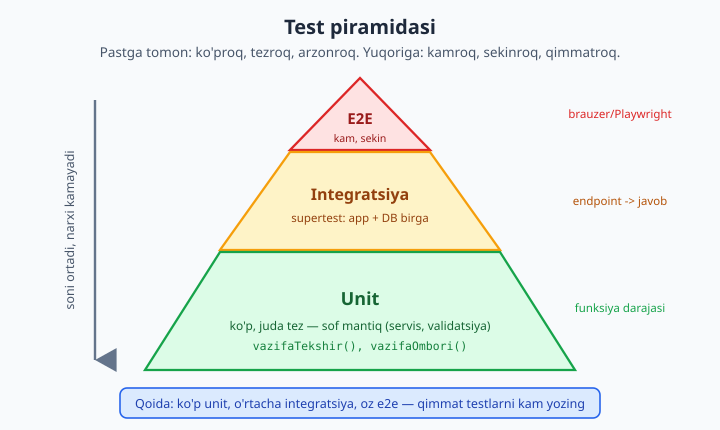
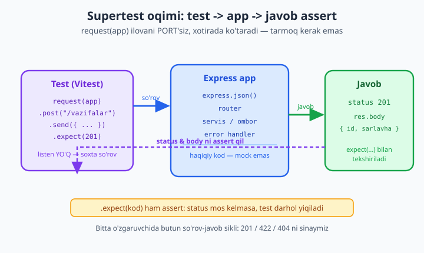

# 23 — Testlash (Vitest + supertest)

[⬅️ Oldingi: 22 — Real-time: WebSocket va Socket.io](./22-realtime.md) · [🏠 README](./README.md) · [Keyingi: 24 — Production: logging, performance, deploy ➡️](./24-production.md)

> **Bu bobda:** ilovangizni **testlash** san'atini o'rganamiz — kodga ishonchni qaytaradigan eng kuchli odat. Avval **nega** test yozish kerakligini (regressiyani ushlash, refaktoringda erkinlik, kodga dizayn bosimi) tushunamiz; test **turlari** (unit / integratsiya / e2e) va **test piramidasi** bilan tanishamiz. So'ng zamonaviy, tez va Jest-mos **Vitest** ni o'rnatamiz: `describe/it/test`, `expect` va matcher'lar (`toBe`, `toEqual`, `toThrow`), async testlar (`async/await`, `resolves`/`rejects`). **Mocking** ni — `vi.fn()`, `vi.mock()`, spy va tashqi xizmatni soxtalashtirish — ko'ramiz. Eng muhimi: **supertest** bilan Express ilovasini **PORT'siz** sinab, `201/422/404` larni tekshiramiz; test bazasi (sqlite `:memory:`) bilan ishlash; **coverage** (`--coverage`) hisoboti; Node'ning o'rnatilgan `node:test` runner'i va **TDD** (red-green-refactor) haqida qisqacha. REAL KEYS: vazifa API ni UNIT (servis mantiqi) + INTEGRATSIYA (supertest endpoint) testlari bilan to'liq qoplaymiz. Hamma kod Node 24.12 + Vitest 4 da **haqiqatan ishga tushirib** (yashil natija bilan) tasdiqlangan.

---

## Nega test yozamiz?

Tasavvur qiling: siz uch oy davom etgan loyihada ishlayapsiz. Bir kuni kichik bir o'zgarish kiritasiz — masalan, validatsiya qoidasini "yaxshilaysiz". Deploy qilasiz. Ertasiga foydalanuvchi yozadi: "ro'yxatdan o'tolmayapman". Sizning kichik o'zgarishingiz boshqa joyni — siz hatto eslamaydigan joyni — sindirib qo'ygan. Bu **regressiya** deyiladi: ilgari ishlagan narsa keyinroq buzilishi.

Test — bu shu dahshatga qarshi sug'urta. Yaxshi test to'plami bilan siz kodni o'zgartirasiz, `npm test` deysiz, va terminal yashil bo'lsa — **ishonch bilan** deploy qilasiz. Qizil bo'lsa — muammoni foydalanuvchidan oldin, sekundlar ichida ko'rasiz.

Test yozishning uchta asosiy foydasini ajratamiz:

1. **Regressiyani ushlash.** Test — bu "bu narsa ishlashi kerak" degan yozma va'da. Kelajakda kimdir (ehtimol siz) uni buzsa, test darhol qizil bo'ladi. Bu ayniqsa katta jamoada va eski kodda hayotiy.

2. **Refaktoring ishonchi.** Kodni qayta yozish — yaxshilash, tezlashtirish, soddalashtirish — testsiz qo'rqinchli: "tegmagan ma'qul, sinishi mumkin". Testlar bo'lsa, ichini butunlay o'zgartirib, **xatti-harakat** o'zgarmaganini bir komanda bilan tekshirasiz. Test — refaktoringning xavfsizlik to'ri.

3. **Dizayn bosimi.** Testlash qiyin kod — odatda **yomon** kod. Agar funksiyani test qilish uchun yarim dunyoni sozlash kerak bo'lsa, demak u juda ko'p narsaga bog'langan. Test yozish sizni mantiqni mustaqil, sof bo'laklarga ajratishga **majburlaydi** — bu esa o'z-o'zidan yaxshiroq arxitektura beradi. Test — birinchi "foydalanuvchi" sifatida API'ngizni sinab ko'radi.

Test "qo'shimcha ish" emas — u **vaqtni tejaydigan investitsiya**. Qo'lda har safar brauzerni ochib, formani to'ldirib, javobni ko'z bilan tekshirish o'rniga, mashina buni siz uchun millisekundlarda, ming marta qiladi.

---

## Test turlari va piramidasi

Hamma testlar bir xil emas. Ularni qamrovi va narxiga ko'ra uch toifaga ajratamiz:

- **Unit test** — eng kichik bo'lak (bitta funksiya yoki klass) ni **alohida** sinaydi. Tashqi dunyo (DB, tarmoq, fayl) yo'q. Juda **tez** (millisekund) va aniq: yiqilsa, qaysi funksiya aybdorligi darhol ma'lum. Misol: `vazifaTekshir()` validatsiya mantiqi.

- **Integratsiya testi** — bir nechta bo'lak **birgalikda** ishlashini sinaydi. Masalan, HTTP route + middleware + servis + DB birga. Sekinroq, lekin haqiqiy "bog'lanishlar" ni tekshiradi. Bu bobda **supertest** bilan aynan shuni yozamiz: so'rov yuborib, butun zanjir orqali o'tgan javobni tekshiramiz.

- **E2E (end-to-end) test** — butun tizimni **foydalanuvchi ko'zi bilan** sinaydi: haqiqiy brauzer ochiladi, tugmalar bosiladi (masalan, Playwright/Cypress bilan). Eng ishonchli, lekin eng **sekin** va **mo'rt** (tez sinadi, sozlash qiyin).

Bu uchtasini qancha yozish kerak? Javob — **test piramidasi**:



Piramida qoidasi sodda: **ko'p unit, o'rtacha integratsiya, oz e2e**. Pastdagi unit testlar arzon va tez — ularni yuzlab yozing. Tepadagi e2e testlar qimmat va sekin — faqat eng muhim "oqim" lar (ro'yxatdan o'tish, to'lov) uchun bir nechta yozing. Agar piramida teskari bo'lsa (ko'p e2e, oz unit), test to'plamingiz sekin, mo'rt va og'riqli bo'ladi.

Bu bobda biz piramidaning pastki ikki qatlamiga — **unit** va **integratsiya** ga — to'liq e'tibor beramiz, chunki backend uchun aynan shular kunlik nonimiz.

---

## Vitest — zamonaviy test runner

Test yozish uchun **test runner** kerak: u test fayllarni topadi, ishga tushiradi, natijani chiroyli ko'rsatadi. Tarixan Node dunyosida **Jest** hukmron edi. Biz esa **Vitest** ni tanlaymiz, chunki u:

- **Tez** — Vite asosida, parallel ishlaydi, "watch" rejimi chaqqon.
- **ESM-tabiiy** — bizning `import/export` (`type: "module"`) loyihalarimizda hech qanday sozlashsiz ishlaydi.
- **Jest-mos API** — `describe/it/expect/vi.fn()` — Jest bilgan har kim darhol foydalana oladi.
- **TypeScript va coverage** qutidan tashqari (faqat coverage provayderini qo'shamiz).

Yangi loyiha boshlaymiz:

```bash
mkdir vazifa-api && cd vazifa-api
npm init -y
npm pkg set type=module          # ESM ni yoqamiz
npm install express
npm install -D vitest supertest
```

`package.json` ga test skriptlarini qo'shamiz:

```json
{
  "name": "vazifa-api",
  "type": "module",
  "scripts": {
    "test": "vitest run",
    "test:watch": "vitest",
    "coverage": "vitest run --coverage"
  }
}
```

- `vitest run` — bir marta ishga tushirib chiqadi (CI uchun).
- `vitest` (watch rejimi) — fayl o'zgarganda tegishli testlarni avtomatik qayta ishga tushiradi (ishlab chiqishda).

> Eslatma: bu bobdagi hamma kod **haqiqatan** Node 24.12 + Vitest 4.1 da ishga tushirilib, yashil natija olingan. Quyidagi chiqishlar — soxta emas, real terminal natijasi.

---

## Birinchi test: `describe / it / expect`

Test fayllar odatda `*.test.js` yoki `*.spec.js` nomi bilan tugaydi — Vitest ularni avtomatik topadi. Eng oddiy misol bilan boshlaylik. `matematik.js`:

```js
// matematik.js
export function qoshish(a, b) {
  return a + b;
}
export function bolish(a, b) {
  if (b === 0) throw new Error("Nolga bo'lib bo'lmaydi");
  return a / b;
}
```

Test fayli — `matematik.test.js`:

```js
import { describe, it, expect } from "vitest";
import { qoshish, bolish } from "./matematik.js";

describe("qoshish", () => {           // bog'liq testlar guruhi
  it("ikki musbat sonni qo'shadi", () => {
    expect(qoshish(2, 3)).toBe(5);    // assertion: natija 5 bo'lishi kerak
  });

  it("manfiy sonlar bilan ham", () => {
    expect(qoshish(-1, -4)).toBe(-5);
  });
});

describe("bolish", () => {
  it("ikki sonni bo'ladi", () => {
    expect(bolish(10, 2)).toBe(5);
  });

  it("nolga bo'lganda xato tashlaydi", () => {
    expect(() => bolish(1, 0)).toThrow("Nolga");
  });
});
```

Diqqat qiling:

- **`describe(nom, fn)`** — bog'liq testlarni mantiqiy guruhga jamlaydi. Ichida boshqa `describe` lar ham bo'lishi mumkin (ichma-ich guruhlash).
- **`it(nom, fn)`** — bitta test holati. `it` "it should..." (u shunday qilishi kerak) jumlasidan kelib chiqqan — nomni xuddi gap kabi yozing: `it("nolga bo'lganda xato tashlaydi")`. `test()` — `it` ning aynan sinonimi, ikkisi bir xil.
- **`expect(qiymat)`** — assertion zanjirini boshlaydi. Keyin **matcher** keladi.

Ishga tushiramiz:

```bash
npx vitest run
```

```
 ✓ matematik.test.js (4 tests) 5ms
   ✓ qoshish > ikki musbat sonni qo'shadi
   ✓ qoshish > manfiy sonlar bilan ham
   ✓ bolish > ikki sonni bo'ladi
   ✓ bolish > nolga bo'lganda xato tashlaydi

 Test Files  1 passed (1)
      Tests  4 passed (4)
```

Yashil — hammasi o'tdi. Yaxshi test nomi **hujjat** vazifasini ham bajaradi: chiqishni o'qib, kod nima qilishini tushunasiz.

---

## `expect` matcher'lari

`expect()` dan keyingi matcher — aynan **nimani** tekshirayotganingizni belgilaydi. Eng ko'p ishlatiladiganlari:

```js
import { describe, it, expect } from "vitest";

describe("matcher'lar shpargalkasi", () => {
  it("toBe — primitiv tenglik (===)", () => {
    expect(2 + 2).toBe(4);
    expect("salom").toBe("salom");
  });

  it("toEqual — chuqur (deep) tenglik — obyekt/massiv uchun", () => {
    // toBe bu yerda YIQILADI: ikki obyekt har xil havola (reference)
    expect({ id: 1, ism: "Ali" }).toEqual({ id: 1, ism: "Ali" });
    expect([1, 2, 3]).toEqual([1, 2, 3]);
  });

  it("toThrow — funksiya xato tashlashini tekshiradi", () => {
    // DIQQAT: funksiyani () => ... ichida bering, darhol chaqirmang!
    expect(() => { throw new Error("buzildi"); }).toThrow("buzildi");
    expect(() => { throw new TypeError(); }).toThrow(TypeError);
  });

  it("boshqa foydali matcher'lar", () => {
    expect(5).toBeGreaterThan(3);
    expect(null).toBeNull();
    expect(undefined).toBeUndefined();
    expect("alisher@mail.uz").toContain("@");
    expect([1, 2, 3]).toHaveLength(3);
    expect({ a: 1, b: 2 }).toHaveProperty("a", 1);
    expect({ id: 1, ism: "Ali", yosh: 20 }).toMatchObject({ ism: "Ali" }); // qisman moslik
    expect(false).toBeFalsy();
    expect("matn").toBeTruthy();
  });
});
```

Eng muhim ikki tushuncha:

- **`toBe` vs `toEqual`.** `toBe` `===` bilan solishtiradi — primitivlar (raqam, satr, boolean) uchun to'g'ri. Lekin `{ id: 1 }` `toBe` `{ id: 1 }` **yiqiladi**, chunki ikki alohida obyekt — har xil havola. Obyekt va massivlar uchun **`toEqual`** ishlating: u ichidagi qiymatlarni chuqur (rekursiv) solishtiradi.

- **`toThrow` da funksiya bering.** `expect(bolish(1, 0)).toThrow()` **noto'g'ri** — `bolish(1, 0)` `expect` ga yetib bormasdan xato tashlaydi. To'g'risi: `expect(() => bolish(1, 0)).toThrow()` — funksiyani o'rab bering, Vitest uni o'zi chaqirib, xatoni ushlaydi.

Har bir matcher oldiga **`.not`** qo'yib, teskarisini tekshirasiz: `expect(2).not.toBe(3)`.

---

## Async testlar

Backend kodi to'la `async/await`. Vitest async testlarni tabiiy qo'llab-quvvatlaydi — shunchaki test funksiyasini `async` qiling va `await` ishlating:

```js
import { describe, it, expect } from "vitest";

async function foydalanuvchiOl(id) {
  if (id < 1) throw new Error("Noto'g'ri id");
  // haqiqatda: DB so'rovi yoki fetch
  return { id, ism: "Ali" };
}

describe("async test", () => {
  it("await bilan natijani kutadi", async () => {
    const u = await foydalanuvchiOl(7);
    expect(u).toEqual({ id: 7, ism: "Ali" });
  });

  // resolves/rejects — Promise ni to'g'ridan-to'g'ri tekshirish
  it("resolves — Promise muvaffaqiyatli yakunlanishini", async () => {
    await expect(foydalanuvchiOl(3)).resolves.toMatchObject({ id: 3 });
  });

  it("rejects — Promise xato bilan tugashini", async () => {
    await expect(foydalanuvchiOl(0)).rejects.toThrow("Noto'g'ri id");
  });
});
```

Ikki muhim qoida:

- **`async` testda doim `await` qiling.** Agar `await` ni unutsangiz, Vitest test funksiyasi tugadi deb hisoblaydi va assertion ishlamay qolishi mumkin — test "o'tgan" ko'rinadi, aslida tekshirilmagan. Bu eng ko'p uchraydigan async test xatosi.
- **`resolves`/`rejects` — qulay yorliq.** `await expect(promise).resolves.toBe(x)` — promise muvaffaqiyatli yakunlanib, qiymati `x` bo'lishini bir qatorda tekshiradi. `rejects` esa Promise rad etilishini (xato tashlashini) kutadi. Bu `try/catch` yozishdan ko'ra toza.

---

## Mocking — tashqi dunyoni soxtalashtirish

Unit test **alohida** sinashi kerak edi. Lekin haqiqiy funksiya ko'pincha tashqi narsalarga bog'liq: email yuboradi, DB ga yozadi, tashqi API ga so'rov qiladi. Test paytida biz buni **haqiqatan** qilishni xohlamaymiz — sekin, qimmat va nazoratdan tashqari. Yechim — **mock** (soxta) bilan almashtirish.

Vitest'da mocking `vi` obyekti orqali:

- **`vi.fn()`** — soxta funksiya yaratadi. U chaqiruvlarni **eslab qoladi** (necha marta, qanday argument bilan), va xohlagan qiymatni qaytarishi mumkin.
- **`vi.mock("yol")`** — butun modulni soxta versiya bilan almashtiradi.
- **`vi.spyOn(obj, "metod")`** — haqiqiy metodni saqlab, ustidan "josuslik" qiladi (chaqirilganini kuzatadi).

Avval tashqi xizmatni ifodalovchi modul — `xabarchi.js`:

```js
// xabarchi.js — haqiqiy hayotda email/SMS jo'natadi (sekin, pulli)
export function xabarYubor(kimga, matn) {
  console.log("YUBORILDI:", kimga, matn);
}
```

Uni ishlatadigan mantiq — `royxat.js`:

```js
// royxat.js
import { xabarYubor } from "./xabarchi.js";

export function royxatdanOtkaz(email) {
  // ... DB ga saqlash ...
  xabarYubor(email, "Xush kelibsiz platformamizga!");
  return { email, holat: "faol" };
}
```

Endi `mock.test.js` — `xabarYubor` ni mock qilib, **chaqirilganini** tekshiramiz, lekin haqiqiy email **yubormaymiz**:

```js
import { describe, it, expect, vi, beforeEach } from "vitest";

// Butun modulni mock qilamiz — xabarYubor endi vi.fn()
import { xabarYubor } from "./xabarchi.js";
vi.mock("./xabarchi.js", () => ({ xabarYubor: vi.fn() }));

import { royxatdanOtkaz } from "./royxat.js";

describe("mocking", () => {
  beforeEach(() => vi.clearAllMocks()); // har testdan oldin chaqiruvlar tarixini tozala

  it("vi.fn() — chaqiruvni kuzatadi", () => {
    const qaytaruvchi = vi.fn().mockReturnValue(7);
    expect(qaytaruvchi(1, 2)).toBe(7);
    expect(qaytaruvchi).toHaveBeenCalledTimes(1);
    expect(qaytaruvchi).toHaveBeenCalledWith(1, 2); // aynan shu argument bilan
  });

  it("vi.mock() — tashqi xizmat chaqirilganini tekshiradi", () => {
    royxatdanOtkaz("ali@example.com");
    // Haqiqiy email YUBORILMADI, lekin chaqirilganini bilamiz:
    expect(xabarYubor).toHaveBeenCalledWith(
      "ali@example.com",
      expect.stringContaining("Xush kelibsiz")
    );
  });

  it("vi.spyOn() — haqiqiy obyektni kuzatadi", () => {
    const obj = { salom: (n) => `Salom, ${n}` };
    const josus = vi.spyOn(obj, "salom");  // asl metod ishlayveradi, biz kuzatamiz
    obj.salom("Olim");
    expect(josus).toHaveBeenCalledWith("Olim");
    josus.mockRestore();                    // asl holiga qaytar
  });
});
```

Natija:

```
 ✓ mock.test.js (3 tests) 8ms
 Test Files  1 passed (1)
      Tests  3 passed (3)
```

Asosiy g'oyalar:

- **`vi.fn()`** — chaqiruvlarni yozib boradi: `toHaveBeenCalledTimes(n)`, `toHaveBeenCalledWith(...)`. `.mockReturnValue(x)` bilan qaytaruvchi qiymatni, `.mockResolvedValue(x)` bilan Promise qaytaruvchini belgilaysiz.
- **`vi.mock("yol")`** — fayl yuqorisida turishi kerak (Vitest uni import'lardan oldinga "ko'taradi"). Endi shu moduldan import qilingan har bir narsa soxta.
- **`expect.stringContaining(...)`**, `expect.any(Number)` kabi **asimmetrik matcher**'lar argumentni qisman tekshirishga yordam beradi.
- **`mock` vs `spy` farqi:** mock asl kodni **butunlay** almashtiradi (asl funksiya ishlamaydi); spy asl kodni **saqlab** qolib, faqat ustidan kuzatadi. Tashqi xizmat (email, to'lov) uchun mock; ichki mantiqning chaqirilganini tekshirish uchun spy.

---

## REAL KEYS: vazifa API ni unit + integratsiya bilan qoplash

Endi nazariyani haqiqiy loyihaga qo'llaymiz. Biz **vazifa (to-do) API** ni quramiz va uni ikki qatlam test bilan to'liq qoplaymiz: pastda **unit** (sof servis mantiqi), ustida **integratsiya** (supertest bilan HTTP endpoint).

Yaxshi arxitekturaning kaliti — **mantiqni HTTP'dan ajratish**. Servis qatlami DB/Express'ni bilmaydi, faqat ma'lumot bilan ishlaydi — shuning uchun uni unit test qilish oson.

### Servis qatlami — `vazifa-servis.js`

```js
// vazifa-servis.js — sof mantiq, HTTP/DB dan mustaqil (unit test uchun ideal)
export class ValidatsiyaXatosi extends Error {
  constructor(maydonlar) {
    super("Validatsiya xatosi");
    this.name = "ValidatsiyaXatosi";
    this.maydonlar = maydonlar; // { sarlavha: "...", ... }
  }
}
export class TopilmadiXatosi extends Error {
  constructor(id) {
    super(`Vazifa topilmadi: ${id}`);
    this.name = "TopilmadiXatosi";
    this.id = id;
  }
}

export function vazifaTekshir(kirish) {
  const xatolar = {};
  if (!kirish || typeof kirish.sarlavha !== "string" || kirish.sarlavha.trim() === "") {
    xatolar.sarlavha = "Sarlavha bo'sh bo'lmasligi kerak";
  } else if (kirish.sarlavha.length > 100) {
    xatolar.sarlavha = "Sarlavha 100 belgidan oshmasligi kerak";
  }
  if (kirish && kirish.muhimlik !== undefined &&
      !["past", "orta", "yuqori"].includes(kirish.muhimlik)) {
    xatolar.muhimlik = "muhimlik past|orta|yuqori bo'lishi kerak";
  }
  if (Object.keys(xatolar).length > 0) throw new ValidatsiyaXatosi(xatolar);
  return { sarlavha: kirish.sarlavha.trim(), muhimlik: kirish.muhimlik ?? "orta" };
}

// In-memory ombor (DB o'rnini bosadi — testda har safar yangi yaratamiz)
export function vazifaOmbori() {
  const xotira = new Map();
  let keyingiId = 1;
  return {
    yarat(kirish) {
      const toza = vazifaTekshir(kirish);
      const vazifa = { id: keyingiId++, ...toza, bajarildi: false };
      xotira.set(vazifa.id, vazifa);
      return vazifa;
    },
    royxat() { return [...xotira.values()]; },
    top(id) {
      const v = xotira.get(Number(id));
      if (!v) throw new TopilmadiXatosi(id);
      return v;
    },
    ochir(id) {
      if (!xotira.has(Number(id))) throw new TopilmadiXatosi(id);
      xotira.delete(Number(id));
    },
    tozala() { xotira.clear(); keyingiId = 1; },
  };
}
```

Diqqat: `vazifaOmbori()` — **factory** (har chaqirilganda yangi, mustaqil ombor qaytaradi). Bu testlash uchun oltin: har test o'z toza omborini oladi, testlar bir-biriga ta'sir qilmaydi.

### Express ilovasi — `app.js`

Eng muhim hiyla: ilova faylida **`app.listen()` YO'Q**. Faqat `app` obyektini yasab, `export` qilamiz. Bu supertest'ga ilovani PORT ochmasdan, xotirada sinash imkonini beradi (`server.js` da `listen` qilamiz — pastda).

```js
// app.js — Express ilovasi (listen YO'Q — supertest port'siz sinaydi)
import express from "express";
import { vazifaOmbori, ValidatsiyaXatosi, TopilmadiXatosi } from "./vazifa-servis.js";

export function appYasa(ombor = vazifaOmbori()) {
  const app = express();
  app.use(express.json());

  app.post("/vazifalar", (req, res, next) => {
    try {
      const v = ombor.yarat(req.body);
      res.status(201).json(v);
    } catch (e) { next(e); }
  });

  app.get("/vazifalar", (req, res) => res.json(ombor.royxat()));

  app.get("/vazifalar/:id", (req, res, next) => {
    try { res.json(ombor.top(req.params.id)); }
    catch (e) { next(e); }
  });

  app.delete("/vazifalar/:id", (req, res, next) => {
    try { ombor.ochir(req.params.id); res.status(204).end(); }
    catch (e) { next(e); }
  });

  // Markaziy error handler — servis xatolarini HTTP status'ga aylantiradi
  app.use((err, req, res, next) => {
    if (err instanceof ValidatsiyaXatosi)
      return res.status(422).json({ xato: err.message, maydonlar: err.maydonlar });
    if (err instanceof TopilmadiXatosi)
      return res.status(404).json({ xato: err.message });
    res.status(500).json({ xato: "Server xatosi" });
  });

  return app;
}
```

`appYasa(ombor)` — omborni **parametr** sifatida qabul qiladi. Testda o'z toza omborimizni uzatamiz; haqiqiy serverda standartini. Bu — **bog'liqlik injeksiyasi** (dependency injection), testlashning eng kuchli qolipi.

Haqiqiy server — alohida `server.js`:

```js
// server.js — faqat shu yerda listen
import { appYasa } from "./app.js";
appYasa().listen(3000, () => console.log("Server: http://localhost:3000"));
```

### Unit testlar — `vazifa.test.js`

```js
import { describe, it, expect, beforeEach } from "vitest";
import {
  vazifaOmbori, vazifaTekshir, ValidatsiyaXatosi, TopilmadiXatosi,
} from "./vazifa-servis.js";

// ---- UNIT: sof mantiq, hech qanday HTTP ----
describe("vazifaTekshir (unit)", () => {
  it("to'g'ri kirishni normallashtiradi (trim + standart muhimlik)", () => {
    expect(vazifaTekshir({ sarlavha: "  Sut olish " }))
      .toEqual({ sarlavha: "Sut olish", muhimlik: "orta" });
  });

  it("bo'sh sarlavhada xato tashlaydi", () => {
    expect(() => vazifaTekshir({ sarlavha: "" })).toThrow(ValidatsiyaXatosi);
  });

  it("noto'g'ri muhimlikni rad etadi", () => {
    // DIQQAT: toThrow(regex) error.message ga moslanadi; bizning batafsil
    // ma'lumot esa error.maydonlar ichida — shuning uchun obyektni tekshiramiz
    let tutilgan;
    try { vazifaTekshir({ sarlavha: "Ish", muhimlik: "katta" }); }
    catch (e) { tutilgan = e; }
    expect(tutilgan).toBeInstanceOf(ValidatsiyaXatosi);
    expect(tutilgan.maydonlar).toHaveProperty("muhimlik");
  });
});

describe("vazifaOmbori (unit)", () => {
  let ombor;
  beforeEach(() => { ombor = vazifaOmbori(); }); // har testga toza ombor

  it("yaratadi va o'sib boruvchi id beradi", () => {
    const a = ombor.yarat({ sarlavha: "A" });
    const b = ombor.yarat({ sarlavha: "B" });
    expect(a.id).toBe(1);
    expect(b.id).toBe(2);
    expect(ombor.royxat()).toHaveLength(2);
  });

  it("topilmaganda TopilmadiXatosi", () => {
    expect(() => ombor.top(999)).toThrow(TopilmadiXatosi);
  });
});
```

> **Hayotiy saboq (haqiqiy bug):** bu testni birinchi yozganimda `expect(() => vazifaTekshir(...)).toThrow(/muhimlik/)` deb yozdim — va test **qizil** bo'ldi. Sababi: `toThrow(regex)` xatoning **`message`** ga moslanadi, lekin bizning `ValidatsiyaXatosi` ning message'i umumiy "Validatsiya xatosi" — batafsil ma'lumot esa `maydonlar` obyektida. Test bizning kutilmagan taxminimizni **ushlab oldi** va to'g'ri tekshiruvga yo'naltirdi. Aynan shuning uchun test yozamiz: u faqat kodni emas, bizning **noto'g'ri tushunchamizni** ham tuzatadi.

`beforeEach` — Vitest **hook**'i: har bir `it` dan **oldin** ishlaydi. Biz unda toza ombor yaratamiz, shunda har test mustaqil — boshqasi qoldirgan ma'lumotdan ta'sirlanmaydi. Boshqa hook'lar: `afterEach` (har testdan keyin — tozalash uchun), `beforeAll`/`afterAll` (butun blok uchun bir marta).

### Integratsiya testlari — `app.test.js` (supertest)

Endi eng qiziq qism. **Supertest** — Express ilovasini PORT ochmasdan sinaydigan kutubxona. U `request(app)` ga ilovani beradi, ilovani xotirada vaqtincha ko'taradi, soxta so'rov yuboradi va javobni qaytaradi. Tarmoq, `listen`, port band bo'lishi — hech biri kerak emas.



```js
import { describe, it, expect, beforeEach } from "vitest";
import request from "supertest";
import { appYasa } from "./app.js";
import { vazifaOmbori } from "./vazifa-servis.js";

describe("Vazifa API (integratsiya, supertest)", () => {
  let app;
  beforeEach(() => { app = appYasa(vazifaOmbori()); }); // har testga toza ilova+ombor

  it("POST /vazifalar -> 201 va body qaytaradi", async () => {
    const res = await request(app)
      .post("/vazifalar")
      .send({ sarlavha: "O'qish" })   // JSON tana
      .expect(201);                    // status assertion — mos kelmasa test yiqiladi
    expect(res.body).toMatchObject({ id: 1, sarlavha: "O'qish", bajarildi: false });
  });

  it("POST bo'sh sarlavha -> 422 validatsiya xatosi", async () => {
    const res = await request(app)
      .post("/vazifalar")
      .send({ sarlavha: "" })
      .expect(422);
    expect(res.body.maydonlar).toHaveProperty("sarlavha");
  });

  it("GET /vazifalar/:id topilmadi -> 404", async () => {
    await request(app).get("/vazifalar/777").expect(404);
  });

  it("to'liq sikl: yarat -> o'qi -> ochir -> 404", async () => {
    const yaratildi = await request(app)
      .post("/vazifalar").send({ sarlavha: "Test" }).expect(201);
    const id = yaratildi.body.id;

    await request(app).get(`/vazifalar/${id}`).expect(200);   // mavjud
    await request(app).delete(`/vazifalar/${id}`).expect(204); // o'chirildi
    await request(app).get(`/vazifalar/${id}`).expect(404);    // endi yo'q
  });
});
```

Supertest API zanjiri sodda va o'qiladi:

- **`request(app)`** — ilovani o'rab oladi (PORT'siz).
- **`.post(yo'l)` / `.get(...)` / `.delete(...)`** — HTTP metodi va yo'li.
- **`.send(obyekt)`** — JSON tanasini yuboradi (`Content-Type: application/json` avtomatik).
- **`.set("Header", "qiymat")`** — header qo'shadi (masalan, `Authorization`).
- **`.expect(201)`** — **status assertion**: javob 201 bo'lmasa, test darhol yiqiladi.
- **`res.body`** — parse qilingan JSON javob — uni `expect` bilan tekshiramiz.

Hammasini birga ishga tushiramiz:

```bash
npx vitest run
```

```
 ✓ vazifa.test.js (5 tests) 13ms
 ✓ app.test.js (4 tests) 24ms

 Test Files  2 passed (2)
      Tests  9 passed (9)
   Duration  493ms
```

Bu — to'liq, ikki qatlamli qamrov: servis mantiqi unit bilan, HTTP yuzasi supertest bilan. `201` (yaratildi), `422` (validatsiya), `404` (topilmadi), `204` (o'chirildi) — eng muhim status kodlarining hammasi sinaldi. Va hech qachon haqiqiy port ochmadik — testlar sekundlardan kam vaqtda yashil bo'ldi.

---

## Test bazasi bilan ishlash (sqlite :memory:)

Yuqorida ombor in-memory `Map` edi. Haqiqiy loyihada DB bo'ladi. DB bilan integratsiya testini qanday yozamiz? Asosiy qoida: **test bazasi haqiqiy ishlab chiqarish bazasidan alohida bo'lsin** va **har test toza holatdan boshlasin**.

Eng qulay yechim — **SQLite `:memory:`** rejimi: butun baza RAM'da yashaydi, hech qanday server kerak emas, juda tez, va process tugashi bilan yo'qoladi. Bu integratsiya testlari uchun ideal. `better-sqlite3` paketi bilan:

```bash
npm install better-sqlite3
```

```js
// db.js — har chaqirilganda toza in-memory baza qaytaradi
import Database from "better-sqlite3";

export function bazaYarat() {
  const db = new Database(":memory:"); // RAM'da — server kerak emas
  db.exec(`
    CREATE TABLE vazifalar (
      id INTEGER PRIMARY KEY AUTOINCREMENT,
      sarlavha TEXT NOT NULL,
      bajarildi INTEGER NOT NULL DEFAULT 0
    );
  `);
  return db;
}
```

Test fayli — har testdan oldin yangi toza baza, keyin yopamiz:

```js
import { describe, it, expect, beforeEach, afterEach } from "vitest";
import { bazaYarat } from "./db.js";

describe("DB integratsiya (sqlite :memory:)", () => {
  let db;
  beforeEach(() => { db = bazaYarat(); });   // SEED: toza sxema
  afterEach(() => { db.close(); });          // TOZALASH: bazani yopamiz

  it("vazifa qo'shadi va o'qiydi", () => {
    const info = db.prepare("INSERT INTO vazifalar (sarlavha) VALUES (?)").run("O'qish");
    const v = db.prepare("SELECT * FROM vazifalar WHERE id = ?").get(info.lastInsertRowid);
    expect(v.sarlavha).toBe("O'qish");
    expect(v.bajarildi).toBe(0);
  });

  it("har test toza bazadan boshlaydi", () => {
    const son = db.prepare("SELECT COUNT(*) AS n FROM vazifalar").get();
    expect(son.n).toBe(0); // oldingi test qo'shgani bu yerda YO'Q
  });
});
```

Tozalash strategiyalari (eng yaxshidan oddiygacha):

- **Har test uchun yangi `:memory:` baza** (yuqoridagi) — eng toza, eng izolyatsiyalangan. SQLite uchun ideal.
- **Har testdan keyin jadvallarni tozalash** — `afterEach(() => db.exec("DELETE FROM vazifalar"))`. MySQL/Postgres kabi serverli bazalar uchun (qayta yaratish qimmat bo'lganda).
- **Tranzaksiya ichida ishlash va orqaga qaytarish (rollback)** — har test tranzaksiyada boshlanadi, oxirida `ROLLBACK` — o'zgarishlar saqlanmaydi. Eng tez, lekin biroz murakkab.

> **MySQL bilan eslatma:** bu kitobda MySQL boblari (`mysql2`/Prisma) ham bor. MySQL test bazasini `CREATE DATABASE IF NOT EXISTS nodejs_test` bilan yaratib, ulanishni shu bazaga yo'naltiring, `afterEach` da jadvallarni `TRUNCATE` qiling, oxirida `DROP DATABASE` bilan tozalang. Lekin **CI** (avtomatik test serveri) da MySQL ko'tarish qiyin — shuning uchun integratsiya testlarida ko'pchilik SQLite `:memory:` ni afzal ko'radi: nol sozlash, nol kutish.

SQL ni chuqurroq o'rganish uchun: [`../sql/README.md`](../sql/README.md).

---

## Coverage — test qancha kodni qopladi?

Testlaringiz kodning **qancha qismini** ishga tushiryapti? Buni **coverage** (qamrov) o'lchaydi. Vitest uchun provayder o'rnatamiz:

```bash
npm install -D @vitest/coverage-v8
npx vitest run --coverage
```

Vazifa API'mizda haqiqiy natija:

```
 Test Files  2 passed (2)
      Tests  9 passed (9)

 % Coverage report from v8
------------------|---------|----------|---------|---------|-------------------
File              | % Stmts | % Branch | % Funcs | % Lines | Uncovered Line #s
------------------|---------|----------|---------|---------|-------------------
All files         |   87.93 |       88 |   86.66 |   92.45 |
 app.js           |      88 |       80 |   83.33 |   91.66 | 28,39
 vazifa-servis.js |   87.87 |       90 |   88.88 |    93.1 | 22,52
------------------|---------|----------|---------|---------|-------------------
```

Ustunlarni o'qiymiz:

- **% Stmts** (statements) — bajarilgan iboralar ulushi.
- **% Branch** — `if/else`, `? :`, `||` kabi **shoxlanishlar**ning qancha tarmog'i sinalgan. Bu eng muhim ko'rsatkich: 100% line, lekin 60% branch bo'lishi mumkin — ya'ni `if` ning faqat bir yo'li sinalgan.
- **% Funcs** — chaqirilgan funksiyalar ulushi.
- **% Lines** — bajarilgan qatorlar.
- **Uncovered Line #s** — qaysi qatorlar **umuman** ishga tushmagan. Yuqorida `app.js:28,39` — bular `GET /vazifalar` (ro'yxat) va 500-xato yo'li; biz ularni sinamadik. Demak qo'shimcha test kerakligi ko'rinib turibdi.

> **Coverage — maqsad emas, asbob.** 100% coverage kodingiz **xatosiz** degani emas — shunchaki har qator ishga tushgan, lekin to'g'ri **assertion** qilingani boshqa masala. Aksincha, 70% coverage'da eng muhim mantiq qoplangan bo'lsa, bu yaxshi. Coverage'ni **qoplanmagan muhim joylarni topish** uchun ishlating, raqamni quvib emas. Ko'p jamoa 80% atrofini maqsad qiladi.

Coverage hisobotini HTML formatda ham olish mumkin (`vitest.config.js` da `coverage: { reporter: ["text", "html"] }`) — brauzerda har qatorni rangli ko'rasiz.

---

## node:test — Node'ning o'rnatilgan runner'i (qisqacha)

Node 24 o'z ichida **test runner**ga ega — hech narsa o'rnatmasdan test yozish mumkin. `node:test` va `node:assert` modullari:

```js
// native.test.mjs
import { test } from "node:test";
import assert from "node:assert/strict";
import { vazifaTekshir } from "./vazifa-servis.js";

test("node:test bilan unit", () => {
  const r = vazifaTekshir({ sarlavha: "  Ish " });
  assert.equal(r.sarlavha, "Ish");
  assert.equal(r.muhimlik, "orta");
});
```

```bash
node --test native.test.mjs
```

```
ℹ tests 1
ℹ pass 1
ℹ fail 0
```

Ishlaydi va nol bog'liqlik talab qiladi. Lekin Vitest'ga nisbatan: watch rejimi, mocking, snapshot, coverage integratsiyasi, IDE qo'llab-quvvatlash — Vitest'da boyroq. **Qachon nima?** Kichik kutubxona yoki nol-bog'liqlik muhim bo'lsa — `node:test`. To'liq backend ilovasi — **Vitest** (yoki Jest). Asosiysi: ikkisining ham asosiy g'oyalari (`test`, assertion, hook) bir xil — birini bilsangiz, ikkinchisi oson.

---

## TDD: red-green-refactor (qisqacha)

**Test-Driven Development (TDD)** — testni kod**dan oldin** yozish uslubi. Sikl uch qadamli:

1. **Red (qizil)** — hali mavjud bo'lmagan xatti-harakat uchun test yozasiz. Ishga tushirasiz — **yiqiladi** (kod yo'q-ku). Bu yaxshi: test haqiqatan biror narsani tekshirayotganini isbotlaydi.
2. **Green (yashil)** — testni o'tkazadigan **eng oddiy** kodni yozasiz. Chiroyli emas, faqat yashil bo'lsin.
3. **Refactor (tozalash)** — endi testlar himoyasida kodni tartibga solasiz, takrorlanishni olib tashlaysiz. Testlar yashil qolsa — xatti-harakat o'zgarmagan.

So'ng yana qaytadan. Misol — `vazifaTekshir` ga "muhimlik" qoidasini qo'shish:

```js
// 1) RED: avval test yozamiz (hali qoida yo'q — yiqiladi)
it("noto'g'ri muhimlikni rad etadi", () => {
  let xato;
  try { vazifaTekshir({ sarlavha: "Ish", muhimlik: "katta" }); } catch (e) { xato = e; }
  expect(xato).toBeInstanceOf(ValidatsiyaXatosi);
});

// 2) GREEN: vazifaTekshir ichiga muhimlik tekshiruvini qo'shamiz -> yashil
// 3) REFACTOR: ruxsat etilgan qiymatlarni massivga chiqaramiz, takrorni kamaytiramiz
```

TDD'ning kuchi — u sizni **avval interfeysni o'ylashga** majburlaydi ("bu funksiya nimani qabul qiladi, nima qaytaradi?"), implementatsiyaga emas. Boshida sekin tuyuladi, lekin murakkab mantiqda u eng tez yo'l — chunki debug qilishga vaqt ketmaydi. TDD majburiy emas, lekin uni bilish — kuchli ko'nikma.

---

## Yaxshi test yozish tamoyillari

- **Tez bo'lsin.** Sekin test to'plamini hech kim ishlatmaydi. Tashqi dunyoni (tarmoq, haqiqiy DB) mock qiling yoki `:memory:` ishlating.
- **Izolyatsiyalangan bo'lsin.** Har test mustaqil — tartibi muhim bo'lmasin. `beforeEach` da toza holat yarating.
- **Bitta narsani sinasin.** Bitta `it` — bitta g'oya. Yiqilsa, sababini darhol bilasiz.
- **Xulq-atvorni sinang, ichki tuzilmani emas.** "natija to'g'rimi?" — ha; "u qaysi xususiy o'zgaruvchini ishlatdi?" — yo'q. Aks holda har refaktoringda test sinadi.
- **Nomi gap bo'lsin.** `it("bo'sh sarlavhada 422 qaytaradi")` — bir qarashda tushunarli.
- **Chegaralarni sinang.** Bo'sh satr, `0`, `null`, juda uzun matn, manfiy son — bug'lar shu chetlarda yashiringan.
- **AAA tuzilmasi:** Arrange (tayyorla) — Act (bajar) — Assert (tekshir). Har testni shu uch qismga ajrating.

Bu boblar bilan bog'liq: Express asoslari [`./12-express-asoslari.md`](./12-express-asoslari.md), middleware [`./13-middleware.md`](./13-middleware.md), async [`./06-asinxron.md`](./06-asinxron.md). Testlarni CI'da avtomatik ishga tushirish (har push'da `npm test`) uchun: [`../git-github/README.md`](../git-github/README.md). TypeScript bilan test yozish (Vitest TS'ni qutidan qo'llaydi): [`../typescript/README.md`](../typescript/README.md).

---

## Mashqlar

### Oson

1. **Matcher mashqi.** `narxBilanQqs(narx)` funksiyasi narxga 12% QQS qo'shib qaytarsin. Unga uchta test yozing: musbat narx, nol narx, va manfiy narxda xato tashlashini (`toThrow`) tekshiring.

2. **`describe` guruhlash.** Yuqoridagi `matematik.js` ga `kopaytirish` funksiyasini qo'shing va uni alohida `describe` blokida `toBe` bilan sinang.

3. **Async matcher.** `kechikibQaytar(qiymat, ms)` — `ms` dan keyin `qiymat` ni `resolve` qiladigan funksiya yozing va uni `await expect(...).resolves.toBe(...)` bilan sinang.

### O'rta

4. **Supertest GET ro'yxat.** Vazifa API'ga `GET /vazifalar` (hamma vazifalar ro'yxati) uchun integratsiya testi yozing: avval ikkita POST qiling, keyin GET qilib, javob massivi uzunligi 2 ekanini (`toHaveLength(2)`) tekshiring.

5. **Mock bilan.** `xabarYubor` ni mock qilib, `royxatdanOtkaz("x@y.uz")` chaqirilganda **roppa-rosa bir marta** chaqirilganini (`toHaveBeenCalledTimes(1)`) va to'g'ri email bilan chaqirilganini tekshiring.

6. **`beforeEach` izolyatsiyasi.** `vazifaOmbori` ga ikki test yozing: birinchisi vazifa qo'shsin, ikkinchisi ombor **bo'sh** ekanini tekshirsin. `beforeEach`siz — ikkinchisi yiqiladi; `beforeEach` qo'shib, ikkalasi ham o'tishini ko'rsating.

### Qiyin

7. **422 maydon tekshiruvi.** Vazifa API'ga 101 belgili sarlavha bilan POST qiling. Test `422` qaytishini va `res.body.maydonlar.sarlavha` mavjudligini tekshirsin. (Eslatma: servisda `length > 100` qoidasi bor.)

8. **DB integratsiya + tozalash.** `better-sqlite3` `:memory:` bilan `vazifalar` jadvali yarating. Uchta test yozing: (a) qo'shish va o'qish, (b) o'chirish, (c) har test toza bazadan boshlanishini (`beforeEach`/`afterEach`) isbotlash. Coverage ham oling.

<details markdown="1"><summary>Yechimlar</summary>

**1 — Matcher mashqi:**

```js
// qqs.js
export function narxBilanQqs(narx) {
  if (narx < 0) throw new Error("Narx manfiy bo'lolmaydi");
  return narx * 1.12;
}
```

```js
import { describe, it, expect } from "vitest";
import { narxBilanQqs } from "./qqs.js";

describe("narxBilanQqs", () => {
  it("12% qo'shadi", () => {
    expect(narxBilanQqs(100)).toBeCloseTo(112); // suzuvchi nuqta uchun toBeCloseTo
  });
  it("nol narx nol qaytaradi", () => {
    expect(narxBilanQqs(0)).toBe(0);
  });
  it("manfiy narxda xato tashlaydi", () => {
    expect(() => narxBilanQqs(-5)).toThrow("manfiy");
  });
});
```

Eslatma: suzuvchi nuqta hisoblari (`100 * 1.12 = 112.00000000000001`) uchun `toBe` o'rniga **`toBeCloseTo`** ishlating.

**2 — `describe` guruhlash:**

```js
// matematik.js ga qo'shing:
export function kopaytirish(a, b) { return a * b; }
```

```js
import { describe, it, expect } from "vitest";
import { kopaytirish } from "./matematik.js";

describe("kopaytirish", () => {
  it("ikki sonni ko'paytiradi", () => expect(kopaytirish(3, 4)).toBe(12));
  it("nolga ko'paytirish nol", () => expect(kopaytirish(5, 0)).toBe(0));
});
```

**3 — Async matcher:**

```js
function kechikibQaytar(qiymat, ms) {
  return new Promise((resolve) => setTimeout(() => resolve(qiymat), ms));
}

it("kechikib resolve qiladi", async () => {
  await expect(kechikibQaytar("tayyor", 20)).resolves.toBe("tayyor");
});
```

**4 — Supertest GET ro'yxat:**

```js
import { describe, it, expect, beforeEach } from "vitest";
import request from "supertest";
import { appYasa } from "./app.js";
import { vazifaOmbori } from "./vazifa-servis.js";

describe("GET /vazifalar", () => {
  let app;
  beforeEach(() => { app = appYasa(vazifaOmbori()); });

  it("hamma vazifalarni qaytaradi", async () => {
    await request(app).post("/vazifalar").send({ sarlavha: "Bir" }).expect(201);
    await request(app).post("/vazifalar").send({ sarlavha: "Ikki" }).expect(201);

    const res = await request(app).get("/vazifalar").expect(200);
    expect(res.body).toHaveLength(2);
    expect(res.body[0]).toMatchObject({ sarlavha: "Bir" });
  });
});
```

**5 — Mock bilan:**

```js
import { describe, it, expect, vi, beforeEach } from "vitest";
import { xabarYubor } from "./xabarchi.js";
vi.mock("./xabarchi.js", () => ({ xabarYubor: vi.fn() }));
import { royxatdanOtkaz } from "./royxat.js";

describe("royxatdanOtkaz", () => {
  beforeEach(() => vi.clearAllMocks());

  it("xush kelibsiz xabarini bir marta yuboradi", () => {
    royxatdanOtkaz("x@y.uz");
    expect(xabarYubor).toHaveBeenCalledTimes(1);
    expect(xabarYubor).toHaveBeenCalledWith("x@y.uz", expect.stringContaining("Xush kelibsiz"));
  });
});
```

**6 — `beforeEach` izolyatsiyasi:**

```js
import { describe, it, expect, beforeEach } from "vitest";
import { vazifaOmbori } from "./vazifa-servis.js";

describe("izolyatsiya", () => {
  let ombor;
  beforeEach(() => { ombor = vazifaOmbori(); }); // BU SATR — kalit

  it("vazifa qo'shadi", () => {
    ombor.yarat({ sarlavha: "X" });
    expect(ombor.royxat()).toHaveLength(1);
  });

  it("ombor bo'sh boshlanadi", () => {
    // beforeEach tufayli bu YANGI ombor — oldingi test ta'sir qilmaydi
    expect(ombor.royxat()).toHaveLength(0);
  });
});
```

`beforeEach`siz ikkala test bitta omborni ulashardi va ikkinchisi `toHaveLength(1)` ko'rib yiqilardi. `beforeEach` har testga toza ombor beradi — bu izolyatsiyaning mohiyati.

**7 — 422 maydon tekshiruvi:**

```js
it("juda uzun sarlavha -> 422", async () => {
  const uzun = "a".repeat(101); // 101 belgi — limit 100
  const res = await request(app)
    .post("/vazifalar")
    .send({ sarlavha: uzun })
    .expect(422);
  expect(res.body.maydonlar).toHaveProperty("sarlavha");
  expect(res.body.maydonlar.sarlavha).toMatch(/100/);
});
```

**8 — DB integratsiya + tozalash:**

```js
// db.js
import Database from "better-sqlite3";
export function bazaYarat() {
  const db = new Database(":memory:");
  db.exec(`CREATE TABLE vazifalar (
    id INTEGER PRIMARY KEY AUTOINCREMENT,
    sarlavha TEXT NOT NULL,
    bajarildi INTEGER NOT NULL DEFAULT 0
  );`);
  return db;
}
```

```js
import { describe, it, expect, beforeEach, afterEach } from "vitest";
import { bazaYarat } from "./db.js";

describe("vazifalar DB", () => {
  let db;
  beforeEach(() => { db = bazaYarat(); });
  afterEach(() => { db.close(); });

  it("(a) qo'shadi va o'qiydi", () => {
    const info = db.prepare("INSERT INTO vazifalar (sarlavha) VALUES (?)").run("O'qish");
    const v = db.prepare("SELECT * FROM vazifalar WHERE id = ?").get(info.lastInsertRowid);
    expect(v).toMatchObject({ sarlavha: "O'qish", bajarildi: 0 });
  });

  it("(b) o'chiradi", () => {
    db.prepare("INSERT INTO vazifalar (sarlavha) VALUES (?)").run("X");
    db.prepare("DELETE FROM vazifalar WHERE id = 1").run();
    expect(db.prepare("SELECT COUNT(*) AS n FROM vazifalar").get().n).toBe(0);
  });

  it("(c) har test toza bazadan boshlaydi", () => {
    expect(db.prepare("SELECT COUNT(*) AS n FROM vazifalar").get().n).toBe(0);
  });
});
```

`beforeEach` har testga yangi `:memory:` baza beradi, `afterEach` esa uni yopib, xotirani bo'shatadi. Shu sxema tufayli (c) testi (a)/(b) qo'shgan ma'lumotni **ko'rmaydi** — to'liq izolyatsiya. Coverage uchun: `npx vitest run --coverage`.

</details>

---

[⬅️ Oldingi: 22 — Real-time: WebSocket va Socket.io](./22-realtime.md) · [🏠 README](./README.md) · [Keyingi: 24 — Production: logging, performance, deploy ➡️](./24-production.md)
