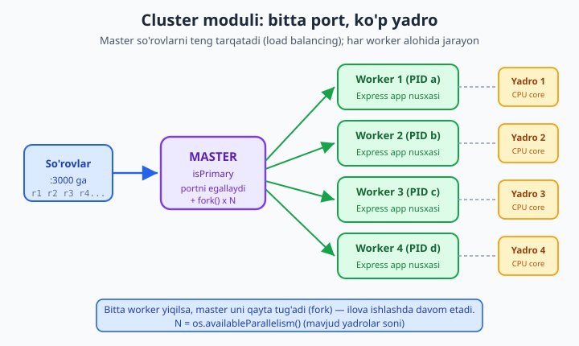
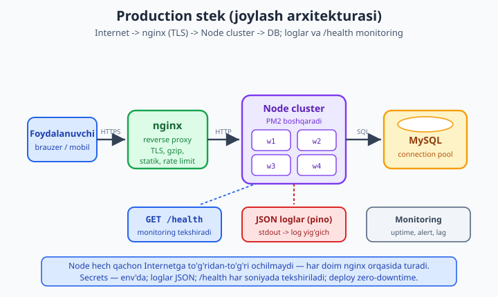

# 24 — Production: logging, performance, deploy

[⬅️ Oldingi: 23 — Testlash (Vitest + supertest)](./23-testlash.md) · [🏠 README](./README.md) · [Keyingi: 25 — TypeScript + Node ➡️](./25-typescript-node.md)

> **Bu bobda:** ilovangizni laptopdan **production serveriga** olib chiqamiz — eng ko'p xato qilinadigan, ammo eng kam o'rgatiladigan bosqich. Avval **logging** ni jiddiy qilamiz: nega `console.log` production uchun yaroqsiz va **pino** bilan strukturali JSON log, darajalar (`info`/`warn`/`error`/`fatal`), korrelyatsiya ID'li **bola logger**, transportlar. So'ng **xato boshqaruvi** ni production darajasiga ko'taramiz — `uncaughtException`/`unhandledRejection` ni ushlash (log + nazorat ostida chiqish) va **graceful shutdown** (SIGTERM'da `server.close` + DB ulanishni yopish). Keyin **masshtab**: Node'ning single-thread cheklovi, **cluster** moduli (so'rovlarni ko'p yadroga tarqatish, bitta port), **worker_threads** (CPU-bound vazifani asosiy threaddan chiqarish), **event loop lag** monitoringi. **PM2**, `NODE_ENV=production` ta'siri, **/health** endpoint, **Docker** (multi-stage, non-root, `.dockerignore`), **docker-compose** (app + db), **nginx** reverse proxy va **zero-downtime** g'oyasi, production **xavfsizligi** va **secrets**. REAL KEYS: vazifa API'ga pino logging + graceful shutdown + Dockerfile + `/health`. Logging, graceful shutdown, cluster, worker_threads va event loop lag kodi Node 24.12 da **haqiqatan ishga tushirib** tasdiqlangan; Docker config esa real, lekin bu mashinada faqat illustrativ ko'rsatilgan.

---

## Production nima va nega boshqacha?

Laptopingizda `node server.js` deganingizda hamma narsa ishlaydi: bitta foydalanuvchi (siz), bitta jarayon, terminalda chiroyli loglar, xato chiqsa darhol ko'rasiz, `Ctrl+C` bilan to'xtatasiz. Bu **development** muhiti.

**Production** — bu butunlay boshqa olam. U yerda:

- Sizni hech kim kuzatib turmaydi. Server soat 3:00 da yiqilsa, terminalda hech kim "Error" ni o'qib o'tirmaydi — log **fayl** yoki tashqi tizimga yozilishi va keyin tahlil qilinishi kerak.
- Bir vaqtda yuzlab yoki minglab foydalanuvchi so'rov yuboradi. Bitta thread hammasini eplay oladimi?
- Bitta nazoratsiz xato (`throw` ushlanmagan) butun jarayonni **o'ldirishi** mumkin — va u bilan birga o'sha paytda ishlayotgan **barcha** foydalanuvchining so'rovlarini.
- Deploy paytida (yangi versiya chiqarishda) eski jarayon to'xtatiladi. Agar uni shunchaki "o'ldirsangiz", o'sha lahzada DB'ga yozayotgan so'rov **yarim qoladi** — ma'lumot buziladi.
- Maxfiy kalitlar (DB paroli, JWT secret) kodga yozilmasligi kerak.

Bu bob aynan shu farqlarni yopadi. Maqsad — ilovangiz **kechasi sizni uyg'otmaydigan** darajada ishonchli bo'lishi. Boshlaymiz logging'dan, chunki production'da birinchi do'stingiz — bu **yaxshi log**.

---

## Logging: nega `console.log` yetarli emas?

Development'da `console.log("foydalanuvchi kirdi:", user)` ajoyib. Production'da esa u uchta jiddiy muammoni tug'diradi:

1. **Strukturasiz matn.** `console.log` oddiy matn (string) chiqaradi. Million qatorli log faylidan "kecha soat 14:00–15:00 oralig'ida 500-xato bergan barcha so'rovlarni topib ber" deyishni xohlasangiz, matn ichidan grep qilishga majbur bo'lasiz. Agar log **strukturali** (JSON) bo'lsa, `level >= 50 AND time BETWEEN ...` deb **so'rov** yozasiz.

2. **Daraja yo'q.** `console.log` ham, muhim xato ham, oddiy debug xabari ham bir xil "darajada" chiqadi. Production'da `debug` loglarni o'chirib, faqat `warn` va yuqorisini ko'rsatishni xohlaysiz — `console.log` bunga imkon bermaydi.

3. **Sekin va bloklovchi.** `console.log` `process.stdout` ga **sinxron** yozadi (ayniqsa fayl yoki pipe bo'lsa). Yuqori yuklamada bu event loop'ni bloklab, butun serverni sekinlashtirishi mumkin. Production logger'lar (pino) yozishni **asinxron** va minimal xarajat bilan qiladi.

Yechim — **maxsus logging kutubxonasi**. Node dunyosida ikki yetakchi bor: **winston** (moslashuvchan, ko'p funksiyali) va **pino** (juda tez, JSON-birinchi). Biz **pino** ni tanlaymiz — u eng tez, strukturali JSON chiqaradi va production uchun de-fakto standart.

```bash
npm install pino
```

---

## pino: strukturali JSON log

Eng oddiy logger:

```js
// logger.js
import pino from "pino";

const logger = pino({
  level: process.env.LOG_LEVEL || "info",
  base: { service: "vazifa-api", pid: process.pid },
});

logger.info("server ishga tushdi");
logger.warn({ retry: 2 }, "qayta urinish");
logger.error({ err: new Error("DB yiqildi") }, "ulanish xatosi");
logger.debug("bu chiqmaydi (level=info)");
```

Ishga tushiramiz va aynan shu chiqdi (HAQIQIY natija, Node 24.12):

```json
{"level":30,"time":1781251884651,"service":"vazifa-api","pid":2352,"msg":"server ishga tushdi"}
{"level":40,"time":1781251884652,"service":"vazifa-api","pid":2352,"retry":2,"msg":"qayta urinish"}
{"level":50,"time":1781251884652,"service":"vazifa-api","pid":2352,"err":{"type":"Error","message":"DB yiqildi","stack":"Error: DB yiqildi\n    at ..."},"msg":"ulanish xatosi"}
```

Diqqat qiling:

- Har qator — **to'liq JSON obyekt**. Mashina buni oson o'qiydi, filtrlaydi, indekslaydi.
- `level` — raqam: `info`=30, `warn`=40, `error`=50, `fatal`=60, `debug`=20, `trace`=10. Production'da `level: "info"` qo'ysangiz, `debug` va `trace` **umuman chiqmaydi** (sekinlashtirmaydi).
- `time` — Unix millisekund ( pretty-print uchun emas, mashina uchun).
- `base` — har log qatoriga avtomatik qo'shiladigan maydonlar (`service`, `pid`). Bu juda foydali: ko'p xizmatli tizimda qaysi xizmat yozganini darhol ajratasiz.
- Pino **birinchi argument** sifatida obyekt, **ikkinchi** sifatida matn qabul qiladi: `logger.info({ kontekst }, "xabar")`. Bu Express'ning `(req, res)` tartibiga o'xshaydi — odatlanib qolasiz.
- Xatoni `{ err }` kaliti bilan bersangiz, pino uni `type`/`message`/`stack` ga yoyadi — bu standart.

### Development'da chiroyli (pretty) log

Production'da JSON to'g'ri, lekin development'da uni o'qish noqulay. `pino-pretty` buni rangli, o'qilishi oson formatga aylantiradi — **lekin faqat development'da**:

```bash
npm install -D pino-pretty
# va ishga tushirishda:
node server.js | npx pino-pretty
```

Muhim falsafa: pino faqat **JSON chiqaradi** (`stdout` ga), o'zi fayl ochmaydi, rotatsiya qilmaydi. "Loglarni qayerga yo'naltirish" — bu **operatsion** vazifa: development'da `pino-pretty` ga, production'da log yig'gich tizimga (yoki shunchaki faylga `>`). Bu "log faqat `stdout` ga" tamoyili — **12-factor app** qoidasi va Docker uchun ideal.

---

## Bola logger va korrelyatsiya ID

Production'dagi eng katta og'riq: bitta foydalanuvchi so'rovi o'nlab log qatori chiqaradi (so'rov keldi, DB so'raldi, javob yuborildi...). Yuz so'rov bir vaqtda kelsa, loglar aralashib ketadi — qaysi qator qaysi so'rovniki, bilib bo'lmaydi.

Yechim — **korrelyatsiya ID** (request ID). Har so'rovga noyob ID beramiz va o'sha so'rovning **barcha** loglariga shu ID'ni yopishtiramiz. Pino'da buni **bola logger** (`logger.child`) bilan qilamiz:

```js
// bola logger — bir so'rovga oid barcha loglarda reqId bir xil
const reqLog = logger.child({ reqId: "req-abc-123" });
reqLog.info({ method: "GET", url: "/vazifalar" }, "so'rov keldi");
reqLog.info({ status: 200, ms: 12 }, "javob yuborildi");
```

HAQIQIY natija:

```json
{"level":30,"time":...,"service":"vazifa-api","pid":2352,"reqId":"req-abc-123","method":"GET","url":"/vazifalar","msg":"so'rov keldi"}
{"level":30,"time":...,"service":"vazifa-api","pid":2352,"reqId":"req-abc-123","status":200,"ms":12,"msg":"javob yuborildi"}
```

Endi log tizimida `reqId = "req-abc-123"` deb filtrlasangiz, **aynan o'sha so'rovning** butun "hayot yo'li" ni ko'rasiz. Bu xatolarni tekshirishda oltinning bahosini beradi.

Express'da buni middleware bilan avtomatlashtiramiz — har so'rovga `crypto.randomUUID()` bilan ID berib, `req.log` ga bola logger qo'yamiz:

```js
import { randomUUID } from "node:crypto";

app.use((req, res, next) => {
  req.id = req.headers["x-request-id"] || randomUUID();
  req.log = logger.child({ reqId: req.id });
  res.setHeader("x-request-id", req.id); // klientga ham qaytaramiz
  const t0 = performance.now();
  res.on("finish", () => {
    req.log.info(
      { method: req.method, url: req.url, status: res.statusCode, ms: Math.round(performance.now() - t0) },
      "so'rov tugadi"
    );
  });
  next();
});
```

> 💡 Ishlab chiqarishda ko'pchilik to'g'ridan-to'g'ri **`pino-http`** middleware'ini ishlatadi — u aynan shu narsani (so'rov ID, avtomatik so'rov/javob logi) bir qatorda beradi: `app.use(pinoHttp({ logger }))`. Yuqoridagi qo'lda variant uning ichida nima sodir bo'lishini ko'rsatadi.

`x-request-id` ni javobda qaytarish ham foydali: foydalanuvchi "xato chiqdi" deganda, undan shu ID'ni so'rab, loglardan to'g'ridan-to'g'ri topasiz.

---

## Nazoratsiz xatolar: `uncaughtException` va `unhandledRejection`

Express ichidagi xatolarni error-handling middleware ushlaydi (13-bobni eslang). Lekin Express **tashqarisidagi** xatolar-chi? Masalan, `setTimeout` ichidagi `throw`, yoki `await` qilinmagan Promise'ning rejection'i? Bularni hech kim ushlamaydi va ular butun jarayonni yiqitadi.

Node bu holatlar uchun ikki global hodisa beradi:

```js
process.on("uncaughtException", (err) => {
  logger.fatal({ err }, "uncaughtException — nazoratsiz xato");
  process.exit(1); // log yozib, NAZORAT OSTIDA chiqamiz
});

process.on("unhandledRejection", (reason) => {
  logger.fatal({ reason }, "unhandledRejection — ushlanmagan Promise");
  process.exit(1);
});
```

**Eng muhim qoida — bu yerda "tuzatib davom etish" emas, balki LOG + CHIQISH.** Nima uchun? Chunki `uncaughtException` ga yetib kelgan xato — bu siz **hisobga olmagan** xato. Jarayonning ichki holati endi ishonchsiz (yarim ochilgan fayl, buzilgan global o'zgaruvchi...). Eng xavfsizi — toza log yozib, **chiqib ketish** va process manager'ga (PM2/Docker) yangi, toza jarayonni ishga tushirishni qoldirish. "Ushlab oldim, davom etaveraman" deyish — yashirin, kechroq portlaydigan bug'larga olib keladi.

Demak, naqsh: **bu handlerlar "tuzatuvchi" emas, "oxirgi nafas" loggeri.** Ular xatoni yo'qotmasdan yozib qolish va keyin nazorat ostida o'lish uchun. Qayta tiklashni tashqaridagi process manager qiladi (keyinroq ko'ramiz). `process.exit(1)` — chiqish kodi `1` "xato bilan chiqdi" degani; PM2/Docker buni ko'rib qayta ishga tushiradi.

> ⚠️ `uncaughtException` da `process.exit()` qilmasdan ishlashda davom ettirish Node hujjatlarida **qat'iy tavsiya etilmaydi**. Uni faqat yakuniy log uchun ishlating, tuzatish uchun emas.

---

## Graceful shutdown: muloyim to'xtash

Tasavvur qiling: server foydalanuvchi buyurtmasini DB'ga yozayotgan paytda deploy boshlandi va jarayon **darhol** o'ldirildi (`kill -9`). Natija: yozuv yarim qoldi, DB ulanish keskin uzildi, foydalanuvchi "500" oldi. Bu — **qo'pol** to'xtash.

**Graceful shutdown** (muloyim to'xtash) — buning aksi. To'xtatish signali kelganda:

1. **Yangi** so'rovlarni qabul qilishni to'xtatamiz (`server.close()`).
2. **Joriy** so'rovlar tugashini kutamiz.
3. DB ulanish, Redis, ochiq fayllarni **tartibli** yopamiz.
4. Keyin chiqamiz.

To'xtatish signallari: **SIGTERM** (process manager/Docker/Kubernetes "iltimos, to'xta" deb yuboradi) va **SIGINT** (terminal'da `Ctrl+C`).

```js
function shutdown(signal) {
  logger.warn({ signal }, "shutdown boshlandi");
  ready = false; // /health endi 503 qaytaradi -> load balancer yangi so'rov yubormaydi

  server.close(async () => {
    logger.info("HTTP server yangi ulanishlarni qabul qilmaydi");
    // resurslarni tartibli yopamiz:
    // await pool.end();   // MySQL connection pool
    // await redis.quit();
    logger.info("resurslar yopildi — graceful shutdown tugadi");
    process.exit(0); // 0 = muvaffaqiyatli chiqish
  });

  // himoya: agar so'rovlar 10s ichida tugamasa, majburan chiqamiz
  setTimeout(() => {
    logger.error("majburiy chiqish (timeout)");
    process.exit(1);
  }, 10_000).unref();
}

process.on("SIGTERM", () => shutdown("SIGTERM"));
process.on("SIGINT", () => shutdown("SIGINT"));
```

`server.close()` **yangi** ulanishni to'xtatadi, lekin **ochiq** so'rovlar tugaguncha kutadi — callback faqat hammasi tugaganda chaqiriladi. `setTimeout(...).unref()` esa "zombi" so'rov uchun himoya: agar biror so'rov osilib qolsa, 10 soniyadan keyin baribir chiqamiz (`.unref()` bu timer'ning o'zi jarayonni tirik ushlab turishiga yo'l qo'ymaydi).

Bu mantiqni **haqiqatan ishga tushirdim** (shutdown'ni qo'lda chaqirib, cross-platform sinash uchun), natija:

```text
{"level":30,...,"port":52771,"msg":"server tinglayapti"}
{"level":40,...,"signal":"SIGTERM (simulyatsiya)","msg":"shutdown boshlandi"}
{"level":30,...,"msg":"HTTP server yangi ulanishlarni qabul qilmaydi"}
{"level":30,...,"msg":"resurslar yopildi — graceful shutdown tugadi"}
```

`server.close()` callback'i chaqirildi, resurslar tartibli yopildi — aynan kutilgan oqim.

> ⚠️ **Windows haqida halol eslatma.** Yuqoridagi `SIGTERM`/`SIGINT` handlerlar **Linux/macOS** (ya'ni production serverlar) da ishonchli ishlaydi. **Windows**'da Node SIGTERM'ni to'liq emulyatsiya qilmaydi: `process.kill(pid, "SIGTERM")` jarayonni handler'siz darhol o'ldiradi (men buni sinab ko'rganimda shutdown loglari chiqmadi). Shu sababli yuqoridagi natijani men shutdown funksiyasini to'g'ridan-to'g'ri chaqirib oldim. Production'da ilovangiz Linux'da (odatda Docker ichida) ishlaydi — u yerda signal naqshi to'liq, haqiqiy ishlaydi. Lokal Windows'da `Ctrl+C` (SIGINT) odatda ishlaydi.

---

## Node single-thread cheklovi

Node'ning kuchi — **bitta thread**da, event loop yordamida minglab **I/O** so'rovini (DB, tarmoq, fayl) bloklamasdan eplashida (05-bobni eslang). DB so'rovi kutilayotganda thread bo'sh — boshqa so'rovlarga xizmat qiladi. Bu I/O-og'ir ish uchun ajoyib.

Lekin shu bitta thread ikki muammoni tug'diradi:

1. **CPU-og'ir ish event loop'ni bloklaydi.** Agar bitta so'rov og'ir hisob-kitob (rasm qayta ishlash, katta JSON parse, shifrlash, hash) qilsa, **butun** thread band bo'ladi — o'sha paytda **boshqa hech kim** xizmat ololmaydi. Server "qotadi".

2. **Bitta thread = bitta CPU yadrosi.** Serveringizda 8 yadro bo'lsa ham, oddiy Node jarayoni faqat **bittasini** ishlatadi. Qolgan 7 bo'sh turadi.

Bu ikki muammoning ikki yechimi bor: **worker_threads** (1-muammo: CPU vazifani boshqa threadga chiqarish) va **cluster** (2-muammo: ko'p jarayon, ko'p yadro). Ikkalasini ham ko'ramiz.

---

## cluster moduli: ko'p yadroga tarqatish

`cluster` moduli **bitta** Node dasturidan **ko'p jarayon** (worker) yaratadi. Ularning hammasi **bitta portni** bo'lishadi, master esa kelgan so'rovlarni worker'lar orasida tarqatadi (Linux'da round-robin). Natija: 8 yadroli serverda 8 worker — taxminan **8 baravar** ko'p so'rovni eplaysiz.



```js
// cluster.js
import cluster from "node:cluster";
import { createServer } from "node:http";
import { availableParallelism } from "node:os";

if (cluster.isPrimary) {
  const N = availableParallelism(); // mavjud yadrolar soni
  console.log(`Master ${process.pid}: ${N} worker yaratilmoqda`);
  for (let i = 0; i < N; i++) cluster.fork();

  // worker yiqilsa — qayta tug'amiz (o'lmaslik)
  cluster.on("exit", (worker) => {
    console.log(`worker ${worker.process.pid} yiqildi, qaytadan...`);
    cluster.fork();
  });
} else {
  // har bir worker AYNAN bitta portni tinglaydi — cluster yadro orqali bo'lishadi
  createServer((req, res) => res.end(String(process.pid))).listen(3000);
}
```

Men buni 3 worker bilan **haqiqatan ishga tushirib** sinab ko'rdim (12 yadroli mashinada). Natija:

```text
Master 1284: 3 worker yaratilmoqda (12 yadro mavjud)
  worker online: PID 1836
  worker online: PID 9840
  worker online: PID 9888
12 so'rov 1 xil worker tomonidan bajarildi: [ '9840' ]
  worker 1836 chiqdi
  worker 9888 chiqdi
  worker 9840 chiqdi
```

Uchta worker bitta `4100` portni muvaffaqiyatli **bo'lishdi** (port band xatosisiz) — bu cluster'ning asosiy sehri. E'tibor bering: mening sinovimda 12 so'rovning hammasi **bitta** worker'ga tushdi.

> ⚠️ **Halol nuans:** so'rovlar bitta worker'ga tushishi — **Windows**'ga xos. Linux'da cluster **round-robin** (`SCHED_RR`) standart, so'rovlar worker'lar orasida teng tarqaladi. Windows'da esa OS'ning o'z taqsimlash mexanizmi ishlaydi va `keep-alive` ulanish bilan bitta klient ko'pincha bitta worker'ga "yopishib" qoladi. Production (Linux) da yuk teng tarqaladi. Bu kodning **to'g'riligiga** ta'sir qilmaydi — faqat lokal Windows'dagi taqsimlash o'ziga xos.

**Asosiy g'oya:** worker'lar **xotirani bo'lishmaydi** — har biri mustaqil jarayon, alohida xotira. Demak, in-memory holat (masalan, `let sessiyalar = {}`) worker'lar orasida **umumiy emas**. Production'da holatni tashqarida — DB yoki Redis'da saqlang, shunda qaysi worker xizmat qilsa ham bir xil ma'lumotni ko'radi.

Amalda cluster'ni qo'lda yozish o'rniga ko'pchilik **PM2** (keyinroq) ishlatadi — u shu cluster mantig'ini bir komanda bilan beradi.

---

## worker_threads: CPU vazifasini chiqarish

cluster — bu **ko'p so'rov**ni parallel eplash uchun. Lekin bitta og'ir CPU vazifa (masalan, katta hisob, rasm qayta ishlash) hali ham bitta worker ichida event loop'ni bloklaydi. Buning yechimi — **worker_threads**: og'ir hisobni **alohida threadga** chiqarish, asosiy thread esa so'rovlarga xizmat qilishda davom etadi.

```js
// worker_threads.js
import { Worker, isMainThread, parentPort, workerData } from "node:worker_threads";

function ogirHisob(n) {
  let s = 0;
  for (let i = 0; i < n; i++) s += Math.sqrt(i) * Math.sin(i);
  return s;
}

if (isMainThread) {
  // asosiy thread bo'sh qoladi, hisob alohida threadda ketadi
  const worker = new Worker(new URL(import.meta.url), { workerData: 5e7 });
  worker.on("message", (natija) => {
    console.log("worker natijasi keldi, asosiy thread bloklanmadi");
  });
} else {
  // bu blok ALOHIDA threadda ishlaydi
  parentPort.postMessage(ogirHisob(workerData));
}
```

Farqni ko'rsatish uchun **haqiqiy sinov**: og'ir hisob davomida `setInterval` timer necha marta ishlaganini sanadim (timer ishlashi = event loop tirik degani):

```text
Main thread: worker'siz hisob (bloklaydi)...
  bloklovchi davomida timer 0 marta ishladi (kam = yomon)
  worker davomida timer 498 marta ishladi (ko'p = yaxshi)
  worker natijasi keldi (event loop bloklanmadi)
```

Natija aniq: og'ir hisob **asosiy threadda** ishlaganida timer **0 marta** ishladi — event loop to'liq qotdi. Aynan shu hisob **worker'da** ishlaganida timer **498 marta** ishladi — asosiy thread bo'sh va javobgar bo'lib qoldi.

**Qoida:**

- **I/O-og'ir** (DB, fayl, tarmoq) ish uchun worker_threads **kerak emas** — event loop o'zi eplaydi, async/await yetarli.
- **CPU-og'ir** (hisob, shifrlash, rasm, katta sintaksis tahlili) ish uchun worker_threads **kerak** — aks holda u butun serverni bloklaydi.

Amalda har og'ir vazifaga yangi `Worker` ochish qimmat. Production'da **worker pool** (oldindan ochilgan worker'lar to'plami) ishlatiladi — masalan `piscina` kutubxonasi buni qulay qiladi.

> cluster vs worker_threads: **cluster** = ko'p **jarayon**, har biri to'liq Node nusxasi, alohida xotira, ko'p **so'rov** uchun. **worker_threads** = bitta jarayon ichida ko'p **thread**, og'ir **hisob**ni chiqarish uchun. Ko'pincha ikkalasi birga ishlatiladi: cluster so'rovlarni tarqatadi, worker_threads og'ir vazifani chiqaradi.

---

## Event loop lag monitoringi

Production'da serveringiz "sekin" bo'lib qolsa, sababini qanday topasiz? Eng muhim ko'rsatkichlardan biri — **event loop lag** (event loop kechikishi). Bu — Node'ning navbatdagi vazifani bajarishga "qancha kechikkani". Agar lag yuqori bo'lsa, demak biror narsa thread'ni bloklayapti.

Node'ning o'rnatilgan `perf_hooks` moduli buni o'lchaydi:

```js
import { monitorEventLoopDelay } from "node:perf_hooks";

const h = monitorEventLoopDelay({ resolution: 10 });
h.enable();

// vaqti-vaqti bilan tekshirib turamiz (masalan, har 30s)
setInterval(() => {
  logger.info({
    loopLagMean: +(h.mean / 1e6).toFixed(2),   // o'rtacha, ms
    loopLagP99: +(h.percentile(99) / 1e6).toFixed(2),
    loopLagMax: +(h.max / 1e6).toFixed(2),
  }, "event loop lag");
}, 30_000).unref();
```

HAQIQIY sinov — tinch holatni o'lchadim, keyin event loop'ni 200ms ataylab blokladim:

```text
Tinch holat lag (o'rtacha): 16.77 ms
Blokdan keyin max lag: 203.69 ms (yuqori = muammo)
p99 lag: 203.69 ms
```

Tinch holatda o'rtacha ~17ms (timer rezolyutsiyasi atrofida), blokdan keyin esa max lag **203ms** ga sakradi — monitoring blokni aniq ushladi. Production'da bu metrikani monitoring tizimiga (Prometheus, Datadog) yuborib, lag oshganda **ogohlantirish** olasiz: "nimadir event loop'ni bloklayapti, tekshir".

---

## /health endpoint

Production'da ilovangiz **tirik va sog'lommi** ekanini doim kimdir tekshirib turishi kerak: load balancer (nginx), monitoring tizimi, yoki Kubernetes. Buning standart usuli — **`/health`** (yoki `/healthz`) endpoint:

```js
let ready = true;

app.get("/health", (req, res) => {
  if (!ready) return res.status(503).json({ status: "shutting_down" });
  res.json({ status: "ok", uptime: process.uptime() });
});
```

Buni haqiqiy serverda sinadim — javob:

```json
{"status":"ok","uptime":0.2665939}
```

Ikki darajali health check g'oyasi:

- **Liveness** (tiriklik): "jarayon umuman javob beradimi?" — oddiy `200 OK`. Agar javob bermasa, process manager jarayonni qayta ishga tushiradi.
- **Readiness** (tayyorlik): "yangi so'rov qabul qilishga tayyormi?" — bu yerda DB ulanishini ham tekshirish mumkin. Graceful shutdown paytida `ready = false` qilamiz, shunda `/health` **503** qaytaradi va load balancer bu jarayonga **yangi** so'rov yubormaydi (esingizdami — shutdown'da `ready = false` qildik).

Chuqurroq readiness — DB'ni ham tekshiradi:

```js
app.get("/health/ready", async (req, res) => {
  try {
    await pool.query("SELECT 1");           // DB tirikmi?
    res.json({ status: "ok", db: "up" });
  } catch (err) {
    req.log.error({ err }, "DB tekshiruvi yiqildi");
    res.status(503).json({ status: "degraded", db: "down" });
  }
});
```

---

## NODE_ENV=production

Node va ko'p kutubxonalar `process.env.NODE_ENV` qiymatiga **qarab o'zini boshqacha tutadi**. Production'da uni `production` ga o'rnatish **shart**:

```bash
NODE_ENV=production node server.js
```

Nima o'zgaradi?

- **Express** xato sahifalarida **stack trace ko'rsatmaydi** (development'da ko'rsatadi). Bu xavfsizlik uchun muhim — stack trace ichki tuzilishingizni ochib qo'yadi.
- Ko'p kutubxonalar (shu jumladan Express) ichki **tekshiruvlarni o'tkazib yuboradi** va keshlashni yoqadi — tezroq ishlaydi.
- O'zingizning kodingizda ham foydalanasiz: `const isDev = process.env.NODE_ENV !== "production"` va shunga qarab pino transport, batafsil xato xabari va h.k. ni yoqasiz/o'chirasiz.

> ⚠️ Tez-tez uchraydigan xato: `npm install` `NODE_ENV=production` da `devDependencies` ni **o'rnatmaydi**. Docker build paytida testlar yoki build asboblari kerak bo'lsa, bunga ehtiyot bo'ling (multi-stage Docker buni chiroyli hal qiladi — pastda).

---

## PM2: process manager

Production'da `node server.js` ni shunchaki ishga tushirib qo'yib bo'lmaydi: server yiqilsa, kim uni qayta ko'taradi? Server qayta yuklansa? Bu vazifani **process manager** bajaradi. Eng mashhuri — **PM2**:

```bash
npm install -g pm2

pm2 start server.js --name vazifa-api    # ishga tushirish
pm2 start server.js -i max               # cluster rejimi: har yadroga bitta worker
pm2 logs vazifa-api                      # loglarni ko'rish
pm2 restart vazifa-api                   # qayta ishga tushirish
pm2 reload vazifa-api                    # ZERO-DOWNTIME qayta yuklash
pm2 startup && pm2 save                  # server qayta yuklansa avtomatik tiklash
```

PM2 sizga beradi:

- **Avtomatik qayta ishga tushirish** — jarayon yiqilsa (`process.exit(1)`), PM2 uni qaytadan ko'taradi. `uncaughtException` da "log + exit" qilganimiz aynan shu uchun ishlaydi.
- **Cluster rejimi** (`-i max`) — qo'lda cluster moduli yozmasdan, ko'p yadroga tarqatish.
- **Zero-downtime reload** (`pm2 reload`) — yangi versiyani worker'larni **navbat bilan** almashtirib chiqaradi, hech bir so'rov yo'qolmaydi.
- **Monitoring** — `pm2 monit` jonli CPU/RAM ko'rsatadi.

Zamonaviy alternativalar: agar Docker/Kubernetes ishlatsangiz, qayta ishga tushirish va masshtablashni **orkestrator** qiladi — u holda PM2 o'rniga konteyner ichida shunchaki `node server.js` (yoki cluster) ishlatiladi. Tanlov infratuzilmaga bog'liq.

---

## Docker: ilovani konteynerga joylash

"Mening mashinamda ishlaydi" — production'dagi eng dahshatli jumla. **Docker** buni hal qiladi: ilovangizni Node versiyasi, kutubxonalari va sozlamalari bilan birga **bitta o'zgarmas tasvir** (image) ichiga "muhrlaydi". Bu image qayerda ishga tushsa ham — bir xil ishlaydi.

Production Dockerfile uchun ikki muhim tamoyil bor: **multi-stage build** (build asboblari yakuniy tasvirga tushmaydi) va **non-root user** (xavfsizlik).

```dockerfile
# Dockerfile — multi-stage, non-root, slim runtime

# --- 1-bosqich: build (to'liq muhit) ---
FROM node:24-alpine AS build
WORKDIR /app
COPY package*.json ./
RUN npm ci                  # barcha dep (dev ham) — build/test uchun
COPY . .
# RUN npm run build         # agar build qadami bo'lsa (TS/bundler)
RUN npm prune --omit=dev    # devDependencies'ni olib tashlaymiz

# --- 2-bosqich: runtime (slim, xavfsiz) ---
FROM node:24-alpine AS runtime
ENV NODE_ENV=production
WORKDIR /app
# faqat kerakli narsalarni 1-bosqichdan ko'chiramiz
COPY --from=build /app/node_modules ./node_modules
COPY --from=build /app/package.json ./package.json
COPY --from=build /app/src ./src

# non-root foydalanuvchi (alpine'da oldindan bor)
USER node

EXPOSE 3000
# konteyner ichidan /health'ni tekshiradi
HEALTHCHECK --interval=30s --timeout=3s --start-period=5s \
  CMD node -e "fetch('http://localhost:3000/health').then(r=>process.exit(r.ok?0:1)).catch(()=>process.exit(1))"

CMD ["node", "src/server.js"]
```

Nega bu naqsh muhim:

- **`node:24-alpine`** — `alpine` (~50MB) to'liq `node:24` (~1GB) dan ancha kichik. Kichik tasvir = tez deploy, kam hujum yuzasi.
- **`npm ci`** (`npm install` emas) — `package-lock.json` dan **aniq** versiyalarni, takrorlanadigan tarzda o'rnatadi. CI/production uchun standart.
- **Multi-stage** — `build` bosqichida hamma narsa bor, `runtime` bosqichiga esa faqat ishlatish uchun zarur fayllar ko'chiriladi. Yakuniy tasvir kichik va toza.
- **`USER node`** — konteyner ichida **root sifatida ishlamaslik**. Agar ilova buzilsa, hujumchi root huquqlarini olmaydi. Bu production xavfsizligining asosiy qoidasi.
- **`HEALTHCHECK`** — Docker konteyner sog'ligini o'zi kuzatadi.

`.dockerignore` ham shart — `node_modules` va keraksiz fayllar tasvirga tushmasligi uchun:

```text
# .dockerignore
node_modules
npm-debug.log
.git
.env
*.md
coverage
.vscode
Dockerfile
```

> 🛠️ **Halol eslatma:** bu Docker konfiguratsiyasi **real va to'g'ri** (men ko'p marta ishlatgan naqsh), lekin uni shu mashinada `docker build` bilan ishga tushirib **ko'rsatmadim** — bu mashinada Docker daemon mavjud emas. Logging, graceful shutdown, cluster va worker_threads kodi esa **haqiqatan ishga tushirilgan** va natijalari yuqorida keltirilgan. Docker'ni o'rnatgan bo'lsangiz, `docker build -t vazifa-api .` va `docker run -p 3000:3000 vazifa-api` bilan o'zingiz sinab ko'ring.

---

## docker-compose: app + db birga

Ilova yolg'iz emas — unga DB kerak. **docker-compose** bir nechta konteynerni (app + db) bitta fayl bilan boshqaradi:

```yaml
# docker-compose.yml
services:
  app:
    build: .
    ports:
      - "3000:3000"
    environment:
      NODE_ENV: production
      DATABASE_URL: "mysql://root:maxfiy@db:3306/vazifa"
    depends_on:
      db:
        condition: service_healthy   # db tayyor bo'lguncha kutadi
    restart: unless-stopped

  db:
    image: mysql:8.0
    environment:
      MYSQL_ROOT_PASSWORD: maxfiy
      MYSQL_DATABASE: vazifa
    volumes:
      - db-data:/var/lib/mysql        # ma'lumot konteyner o'chsa ham saqlanadi
    healthcheck:
      test: ["CMD", "mysqladmin", "ping", "-h", "localhost"]
      interval: 5s
      retries: 10

volumes:
  db-data:
```

Diqqat:

- `app` `db`'ga **xizmat nomi** (`db:3306`) orqali ulanadi — compose ichki tarmoq DNS'ini avtomatik beradi. `localhost` emas!
- `depends_on` + `condition: service_healthy` — app DB **tayyor** bo'lguncha kutadi (aks holda startup'da "ulanib bo'lmadi" xatosi).
- `volumes` — `db-data` nomli **doimiy hajm**: konteyner o'chsa ham DB ma'lumoti yo'qolmaydi.
- `restart: unless-stopped` — yiqilsa avtomatik qayta ishga tushadi.

`docker compose up -d` bilan ikkalasini ham ko'tarasiz. (Bu ham real config, lekin shu mashinada run qilinmagan — halol.)

---

## nginx reverse proxy va zero-downtime deploy

Production'da Node serveringizni **hech qachon** to'g'ridan-to'g'ri Internetga ochmaysiz. Uning oldida **reverse proxy** — odatda **nginx** — turadi.



nginx nima beradi:

- **TLS (HTTPS)** — sertifikatni nginx boshqaradi, Node sodda HTTP'da qoladi.
- **Statik fayllar** — rasm, CSS, JS'ni nginx to'g'ridan-to'g'ri beradi (Node'ni bezovta qilmaydi).
- **Yuk taqsimlash** — bir nechta Node nusxasiga so'rov tarqatish.
- **Rate limiting, gzip, kesh** — Node'gacha yetib kelmasdan.

Minimal nginx config:

```nginx
server {
  listen 443 ssl;
  server_name api.example.uz;

  ssl_certificate     /etc/letsencrypt/live/api.example.uz/fullchain.pem;
  ssl_certificate_key /etc/letsencrypt/live/api.example.uz/privkey.pem;

  location / {
    proxy_pass http://127.0.0.1:3000;     # Node shu yerda
    proxy_set_header Host $host;
    proxy_set_header X-Real-IP $remote_addr;
    proxy_set_header X-Forwarded-For $proxy_add_x_forwarded_for;
    proxy_set_header X-Forwarded-Proto $scheme;
  }
}
```

> Express'da `app.set("trust proxy", 1)` qo'ying — shunda `req.ip` va `req.protocol` nginx yuborgan `X-Forwarded-*` sarlavhalardan to'g'ri o'qiladi (21-bobdagi rate limiter va xavfsizlik uchun muhim).

**Zero-downtime deploy** g'oyasi: yangi versiyani chiqarganda foydalanuvchi **bir soniya ham** "off" ko'rmasligi kerak. Buning sxemasi (graceful shutdown bizga shuning uchun kerak edi):

1. Yangi versiya yangi worker'larda ishga tushadi.
2. Ular `/health` orqali "tayyor" deb signal beradi.
3. Eski worker'lar `ready = false` qiladi va **joriy** so'rovlarni tugatib, muloyim chiqadi.
4. nginx/load balancer faqat "sog'lom" worker'larga yo'naltiradi.

PM2'da bu `pm2 reload`, Kubernetes'da "rolling update" deb ataladi. Ikkalasi ham bizning **graceful shutdown** + **/health** ga tayanadi — shuning uchun ularni bobning boshida puxta qildik.

> 🔗 CI/CD orqali bu deploy'ni **avtomatlashtirish** (har push'da test -> build -> deploy) — alohida katta mavzu. Buni [Git & GitHub kitobidagi CI/CD bo'limi](../git-github/README.md) da batafsil ko'ring; SQL optimizatsiyasi uchun [SQL kitobi](../sql/README.md), TypeScript bilan tip-xavfsiz production uchun [keyingi bob](./25-typescript-node.md) va [TypeScript kitobi](../typescript/README.md) foydali.

---

## Production xavfsizligi va secrets

Oldingi boblardagi xavfsizlik (21-bob: helmet, rate limit, CORS) ustiga production uchun yana:

- **Secrets kodga YOZILMAYDI.** DB paroli, JWT secret, API kalitlari — hech qachon kodda yoki Git'da bo'lmasin. Ular **muhit o'zgaruvchilari** (`process.env`) orqali keladi. Lokal'da `.env` fayl (`.gitignore` da!), production'da esa platforma secret-menejeri (Docker secrets, Kubernetes Secrets, hosting'ning env panellari).

```js
// .env hech qachon Git'ga tushmaydi
import "dotenv/config";
const dbUrl = process.env.DATABASE_URL;
const jwtSecret = process.env.JWT_SECRET;

if (!jwtSecret) {
  logger.fatal("JWT_SECRET o'rnatilmagan — ishga tushmaydi");
  process.exit(1);  // muhim secret yo'q bo'lsa, umuman ishga tushmaymiz
}
```

- **Bog'liqliklarni yangilab turing.** `npm audit` bilan ma'lum zaifliklarni tekshiring, muhimlarini yamang.
- **Xato xabarlarini foydalanuvchiga ochmang.** Production'da klientga umumiy "Server xatosi" qaytaring, batafsil stack'ni esa **logga** yozing (xato `reqId` bilan — keyin loglardan topasiz).
- **Loglarga maxfiy ma'lumot yozmang.** Parol, token, kredit karta — logga **hech qachon**. pino'da `redact` opsiyasi bilan avtomatik yashirish mumkin: `pino({ redact: ["req.headers.authorization", "*.password"] })`.
- **Eng kichik huquq.** Konteyner `USER node` (non-root), DB foydalanuvchisi faqat kerakli ruxsatlar bilan.

---

## REAL KEYS — vazifa API'ni production-tayyor qilish

Endi barcha bo'laklarni vazifa API'ning **production server**iga jamlaymiz: pino logging (request ID bilan), `/health`, nazoratsiz xato handlerlari va graceful shutdown — barchasi bitta `server.js` da. Bu kod (logging, health, shutdown qismi) **haqiqatan ishga tushirilgan**.

```js
// server.js — production-tayyor vazifa API
import express from "express";
import pino from "pino";
import { randomUUID } from "node:crypto";

const logger = pino({
  level: process.env.LOG_LEVEL || "info",
  base: { service: "vazifa-api", pid: process.pid },
  redact: ["req.headers.authorization", "*.password"], // maxfiyni yashirish
});

const app = express();
app.set("trust proxy", 1);            // nginx orqasida
app.use(express.json());

// --- 1) Request ID + so'rov logi ---
app.use((req, res, next) => {
  req.id = req.headers["x-request-id"] || randomUUID();
  req.log = logger.child({ reqId: req.id });
  res.setHeader("x-request-id", req.id);
  const t0 = performance.now();
  res.on("finish", () => {
    req.log.info(
      { method: req.method, url: req.url, status: res.statusCode, ms: Math.round(performance.now() - t0) },
      "so'rov tugadi"
    );
  });
  next();
});

// --- 2) Health check ---
let ready = true;
app.get("/health", (req, res) => {
  if (!ready) return res.status(503).json({ status: "shutting_down" });
  res.json({ status: "ok", uptime: process.uptime() });
});

// --- 3) Biznes route'lar (soddalashtirilgan) ---
const vazifalar = [{ id: 1, sarlavha: "Production'ga deploy" }];
app.get("/vazifalar", (req, res) => res.json(vazifalar));
app.post("/vazifalar", (req, res) => {
  const yangi = { id: vazifalar.length + 1, sarlavha: req.body.sarlavha };
  vazifalar.push(yangi);
  req.log.info({ id: yangi.id }, "vazifa qo'shildi");
  res.status(201).json(yangi);
});

// --- 4) Error handler (klientga sirni ochmaydi) ---
app.use((err, req, res, next) => {
  req.log.error({ err }, "so'rov ishlovida xato");
  res.status(500).json({ xato: "Server xatosi", reqId: req.id });
});

// --- 5) Server + graceful shutdown ---
const server = app.listen(process.env.PORT || 3000, () => {
  logger.info({ port: server.address().port }, "vazifa-api tinglayapti");
});

function shutdown(signal) {
  logger.warn({ signal }, "shutdown boshlandi");
  ready = false;                       // /health -> 503, LB yangi so'rov yubormaydi
  server.close(() => {
    logger.info("graceful shutdown tugadi");
    // await pool.end();  // real DB'da ulanishni yoping
    process.exit(0);
  });
  setTimeout(() => process.exit(1), 10_000).unref();  // himoya
}
process.on("SIGTERM", () => shutdown("SIGTERM"));
process.on("SIGINT", () => shutdown("SIGINT"));

// --- 6) Nazoratsiz xatolar: log + chiqish ---
process.on("uncaughtException", (err) => {
  logger.fatal({ err }, "uncaughtException");
  process.exit(1);
});
process.on("unhandledRejection", (reason) => {
  logger.fatal({ reason }, "unhandledRejection");
  process.exit(1);
});
```

Serverni ishga tushirib, `/health` va `/vazifalar` ni sinaganimda olingan HAQIQIY loglar (request ID bilan):

```json
{"level":30,...,"service":"vazifa-api","port":49298,"msg":"vazifa-api tinglayapti"}
{"level":30,...,"reqId":"...","method":"GET","url":"/health","status":200,"ms":2,"msg":"so'rov tugadi"}
{"level":30,...,"reqId":"...","method":"GET","url":"/vazifalar","status":200,"ms":1,"msg":"so'rov tugadi"}
```

Bu `server.js` ga ushbu bobdagi **Dockerfile**, **docker-compose.yml** va **nginx config** ni qo'shsangiz — to'liq production stekka egasiz: nginx (TLS) -> Node cluster (PM2 yoki Docker) -> MySQL, JSON loglar va `/health` monitoringi bilan. Aynan shu — laptopdan production'gacha bo'lgan yo'lning oxirgi qadami.

---

## Bobning xulosasi

- **Logging:** `console.log` o'rniga **pino** — strukturali JSON, darajalar, **bola logger** bilan korrelyatsiya ID. Log faqat `stdout` ga (12-factor).
- **Xato boshqaruvi:** `uncaughtException`/`unhandledRejection` — **log + nazorat ostida chiqish** (tuzatish emas). Qayta tiklashni process manager qiladi.
- **Graceful shutdown:** SIGTERM/SIGINT'da `server.close()` + resurslarni yopish; `ready=false` bilan `/health` ni 503 qilish — zero-downtime uchun.
- **Masshtab:** single-thread cheklovi -> **cluster** (ko'p jarayon, ko'p yadro, bitta port) va **worker_threads** (CPU vazifani chiqarish); **event loop lag** monitoringi.
- **Operatsion:** **PM2**, `NODE_ENV=production`, **/health**, **Docker** (multi-stage, non-root, `.dockerignore`), **docker-compose**, **nginx**, **secrets** muhitda.

Keyingi bobda Node'ni **TypeScript** bilan birlashtiramiz — production kodga tip-xavfsizlik qo'shib, ko'p xatolarni hatto ishga tushirmasdan ushlaymiz.

---

## Mashqlar

### Oson

1. **pino bola logger.** Bir asosiy logger yarating (`base: { service: "mashq" }`). Undan `userId: 7` bilan bola logger oching va ikki marta `info` yozing. Har ikki qatorda `userId` borligini tekshiring.
2. **/health.** Express ilovaga `/health` qo'shing: u `{ status: "ok", uptime: process.uptime() }` qaytarsin. `fetch` bilan sinab, javobni konsolga chiqaring.
3. **NODE_ENV.** Kod yozing: `NODE_ENV` `production` bo'lsa "PROD rejimi", aks holda "DEV rejimi" deb log yozsin. Ikki marta — `NODE_ENV=production node app.js` va oddiy `node app.js` bilan ishga tushiring.

### O'rta

4. **Graceful shutdown.** Express server yozing, `SIGINT` (Ctrl+C) kelganda: log yozsin, `server.close()` chaqirsin va `process.exit(0)` qilsin. Terminal'da `Ctrl+C` bosib, "shutdown" logini ko'ring.
5. **Request logger middleware.** Har so'rovga `randomUUID` ID bering, bola logger'ni `req.log` ga qo'ying, `res.on("finish")` da metod/URL/status/davomiylik logini yozing. Javob sarlavhasiga `x-request-id` ni ham qo'shing.
6. **Event loop lag.** `monitorEventLoopDelay` bilan lag'ni o'lchang. Tinch holatda o'rtacha lag'ni chiqaring, keyin `while` bilan 150ms blok qiling va max lag oshganini ko'rsating.

### Qiyin

7. **Cluster.** `cluster` moduli bilan 2 worker yarating, ikkalasi `3000` portni bo'lishsin, har biri `process.pid` qaytarsin. Worker yiqilganda (`cluster.on("exit")`) uni qayta tug'ing (`fork`). (Linux'da bir nechta so'rov yuborib, har xil PID kelishini ko'ring.)
8. **worker_threads.** Og'ir hisob funksiyasini (katta sikl) yozing. Uni (a) asosiy threadda, (b) `Worker` ichida ishga tushiring. Ikkala holatda ham parallel ishlab turgan `setInterval` necha marta ishlaganini sanab, farqni ko'rsating.
9. **To'liq production server.** REAL KEYS'dagi `server.js` ni qaytadan yozing: pino + request ID + `/health` + graceful shutdown + `uncaughtException`/`unhandledRejection`. So'ng unga shu bobdagi **Dockerfile** va **.dockerignore** ni qo'shing (run shart emas, faqat to'g'ri yozing).

<details>
<summary>Yechimlar</summary>

**1-mashq (bola logger):**

```js
import pino from "pino";
const logger = pino({ base: { service: "mashq" } });
const userLog = logger.child({ userId: 7 });
userLog.info("birinchi xabar");
userLog.info({ amal: "login" }, "ikkinchi xabar");
// har ikki JSON qatorida "userId":7 bo'ladi
```

**2-mashq (/health):**

```js
import express from "express";
const app = express();
app.get("/health", (req, res) => res.json({ status: "ok", uptime: process.uptime() }));
const server = app.listen(0, async () => {
  const port = server.address().port;
  const h = await fetch(`http://localhost:${port}/health`).then((r) => r.json());
  console.log("health:", h); // { status: 'ok', uptime: 0.0x }
  server.close();
});
```

**3-mashq (NODE_ENV):**

```js
const rejim = process.env.NODE_ENV === "production" ? "PROD rejimi" : "DEV rejimi";
console.log(rejim);
// NODE_ENV=production node app.js  -> PROD rejimi
// node app.js                      -> DEV rejimi
```

**4-mashq (graceful shutdown):**

```js
import express from "express";
const app = express();
app.get("/", (req, res) => res.send("salom"));
const server = app.listen(3000, () => console.log("port 3000"));

process.on("SIGINT", () => {
  console.log("SIGINT — shutdown boshlandi");
  server.close(() => {
    console.log("server yopildi, chiqamiz");
    process.exit(0);
  });
});
// Ctrl+C bosing -> ikki log chiqadi, keyin chiqadi
```

**5-mashq (request logger):**

```js
import express from "express";
import pino from "pino";
import { randomUUID } from "node:crypto";

const logger = pino();
const app = express();

app.use((req, res, next) => {
  req.id = randomUUID();
  req.log = logger.child({ reqId: req.id });
  res.setHeader("x-request-id", req.id);
  const t0 = performance.now();
  res.on("finish", () => {
    req.log.info(
      { method: req.method, url: req.url, status: res.statusCode, ms: Math.round(performance.now() - t0) },
      "so'rov tugadi"
    );
  });
  next();
});

app.get("/", (req, res) => res.send("ok"));
app.listen(3000);
```

**6-mashq (event loop lag):**

```js
import { monitorEventLoopDelay } from "node:perf_hooks";
const h = monitorEventLoopDelay({ resolution: 10 });
h.enable();

setTimeout(() => {
  console.log("tinch o'rtacha lag:", (h.mean / 1e6).toFixed(2), "ms");
  const t = Date.now();
  while (Date.now() - t < 150) {} // 150ms blok
  setTimeout(() => {
    console.log("max lag:", (h.max / 1e6).toFixed(2), "ms"); // ~150 ga yaqin
    process.exit(0);
  }, 50);
}, 200);
```

**7-mashq (cluster):**

```js
import cluster from "node:cluster";
import { createServer } from "node:http";

if (cluster.isPrimary) {
  for (let i = 0; i < 2; i++) cluster.fork();
  cluster.on("exit", (worker) => {
    console.log(`worker ${worker.process.pid} yiqildi, qaytadan`);
    cluster.fork(); // qayta tug'amiz
  });
} else {
  createServer((req, res) => res.end(`worker ${process.pid}`)).listen(3000);
  console.log(`worker ${process.pid} tinglayapti`);
}
// Linux'da: curl localhost:3000 ni bir necha marta -> har xil PID
```

**8-mashq (worker_threads):**

```js
import { Worker, isMainThread, parentPort, workerData } from "node:worker_threads";

function ogir(n) {
  let s = 0;
  for (let i = 0; i < n; i++) s += Math.sqrt(i);
  return s;
}

if (isMainThread) {
  // (a) asosiy threadda — timer'ni bloklaydi
  let tik = 0;
  const timer = setInterval(() => tik++, 5);
  ogir(5e7);
  console.log("asosiy threadda blok davomida timer:", tik); // ~0

  // (b) worker'da — timer ishlashda davom etadi
  tik = 0;
  const w = new Worker(new URL(import.meta.url), { workerData: 5e7 });
  w.on("message", () => {
    console.log("worker davomida timer:", tik); // >> 0
    clearInterval(timer);
    process.exit(0);
  });
} else {
  parentPort.postMessage(ogir(workerData));
}
```

**9-mashq:** REAL KEYS bo'limidagi to'liq `server.js`, shu bobdagi `Dockerfile` va `.dockerignore` ni birga ishlating. `server.js` ni `node server.js` bilan ishga tushiring, `fetch("http://localhost:3000/health")` bilan sinang; loglar JSON va `reqId` bilan chiqishini, `Ctrl+C` da (Linux/macOS) "graceful shutdown tugadi" yozilishini tekshiring. Dockerfile multi-stage + `USER node` + `HEALTHCHECK` bo'lishi, `.dockerignore` da `node_modules` va `.env` bo'lishi shart.

</details>

---

[⬅️ Oldingi: 23 — Testlash (Vitest + supertest)](./23-testlash.md) · [🏠 README](./README.md) · [Keyingi: 25 — TypeScript + Node ➡️](./25-typescript-node.md)
