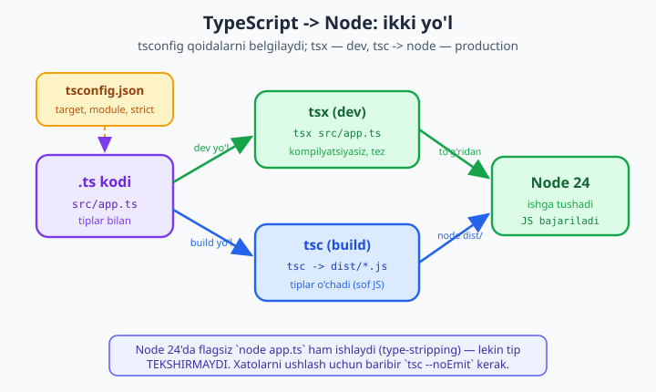
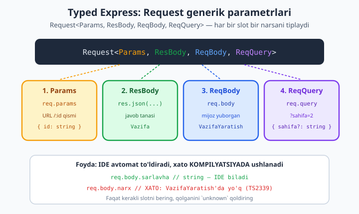

# 25 — TypeScript va Node

[⬅️ Oldingi: 24 — Production: logging, performance, deploy](./24-production.md) · [🏠 README](./README.md) · [Keyingi: 26 — Yakuniy kapston: to'liq REST API ➡️](./26-kapston.md)

> **Bu bobda:** Node.js loyihangizga **TypeScript** ni qo'shamiz — bu zamonaviy backend ishlab chiqishning de-fakto standarti. Avval **nega** TS kerakligini (type-safety, katta loyihada xotirjamlik, IDE yordami va xavfsiz refaktoring, runtime xatolarining keskin kamayishi) chuqur tushunamiz. So'ng **o'rnatish** (`typescript`, `@types/node`, `@types/express`, `tsx`) va eng muhim fayl — **`tsconfig.json`** ni (`target`, `module: NodeNext`, `strict`, `outDir`, `esModuleInterop`) bo'g'in-bo'g'in tahlil qilamiz. TS ni **ishga tushirishning** uch yo'lini ko'ramiz: `tsx` bilan kompilyatsiyasiz dev, `tsc` bilan build qilib `node`, va Node 24'ning **o'rnatilgan** TS qo'llab-quvvatlashi (`--experimental-strip-types` / flagsiz). `@types/*` paketlari (DefinitelyTyped) qanday ishlashini, **Express** ni TS bilan (typed `Request`/`Response`/`NextFunction`, generik `req.body`/`req.params`, `req.user` ni kengaytirish), **typed ENV** ni va **Prisma** nega TS bilan eng yaxshi juftlikni tashkil qilishini ko'ramiz. REAL KEYS: vazifa API'mizning kichik **CRUD endpoint**ini to'liq tiplangan TS'da yozamiz. Bu bob TS **tiliga** o'rgatmaydi (uning uchun [TypeScript kitobi](../typescript/README.md) bor) — bu yerda Node bilan **sozlash va amaliyot**ga e'tibor beramiz. Hamma kod Node 24.12 + TypeScript 6 da **haqiqatan ishga tushirib** (`tsc --noEmit` toza, `tsx` server `201/422/404` qaytarib) tasdiqlangan.

---

## Nega TypeScript? Node uchun asoslar

JavaScript — moslashuvchan til, lekin shu moslashuvchanlik katta loyihada dushmanga aylanadi. `user.firstName` deb yozasiz, holbuki obyektda `firstname` (kichik harf) bor — JS jim turadi, `undefined` qaytaradi, va xato ishlab chiqarishda, foydalanuvchi oldida portlaydi. TypeScript shu xatoni siz **terish** payti, qizil to'lqinli chiziq bilan ushlaydi.

TypeScript — bu JavaScript ustiga qurilgan **tiplar qatlami**. Kod yozayotganda TS kompilyatori har bir o'zgaruvchi, parametr va qaytariladigan qiymat **qanday turdaligi**ni biladi va mos kelmasligini darhol ayoplaydi. Ishga tushishdan oldin. Backend uchun bu to'rt sababga ko'ra hayotiy:

1. **Type-safety — runtime xatolarni kamaytirish.** `null`/`undefined`ga murojaat, noto'g'ri argument tartibi, mavjud bo'lmagan maydon — bularning aksariyati JS'da faqat ishga tushganda bilinadi. TS ularni kompilyatsiyada ushlaydi. Tadqiqotlarga ko'ra, hammasi bo'lgan backend xatolarining sezilarli qismi shunchaki tip xatolari — TS ularni nolga yaqinlashtiradi.

2. **Katta loyiha va jamoa.** 5 ta fayl bilan JS ham yetadi. 200 ta fayl, 6 kishilik jamoa, yarmi yangi — bu yerda TS hujjatga aylanadi. Funksiya nima qabul qilishini va nima qaytarishini **tiplar** aytadi: hech kim kodni o'qib chiqib taxmin qilmaydi.

3. **IDE yordami va refaktoring.** TS bilan IDE (VS Code) sizga avto-to'ldirish, "go to definition", va eng muhimi — **xavfsiz qayta nomlash** beradi. Maydonni `sarlavha`dan `nom`ga o'zgartirsangiz, IDE uni butun loyihada, ishonch bilan almashtiradi. JS'da bu "topib-almashtir" qimorbozligi.

4. **O'zini hujjatlovchi kod.** `function yarat(data: VazifaYaratish): Vazifa` — bu signaturaning o'zi nima kirib nima chiqishini aytadi. Komment eskiradi, tip eskirmaydi: u kompilyatordan o'tishi shart.

> **Muhim tushuncha:** TS — bu faqat **ishlab chiqish vaqti** (dev-time) vositasi. Node TS'ni "tushunmaydi"; biz TS'ni JS'ga aylantiramiz (yoki tiplarni olib tashlaymiz), va Node sof JS'ni bajaradi. Tiplar ishga tushgan kodda **yo'q** — ular faqat siz yozayotganda ishlaydi. Shuning uchun TS hech qanday runtime sekinlashuvi keltirmaydi.

Bu bob TS **sintaksisini** (interface, type, generic, union) o'rgatmaydi. Agar `interface` va `: string` notanish bo'lsa, avval [TypeScript kitobi](../typescript/README.md)ni o'qing — u tilni noldan ekspertgacha yoritadi. Bu yerda biz tilni **bilasiz** deb faraz qilib, uni Node bilan qanday **sozlash va birga ishlatish**ni ko'ramiz.

---

## O'rnatish

TS loyihasining minimal to'plami to'rt paket. Avval ESM loyiha tashkil qilamiz (`type: module`), keyin dev-bog'liqliklarni o'rnatamiz:

```bash
mkdir vazifa-api-ts && cd vazifa-api-ts
npm init -y
npm pkg set type=module

# TS toolchain — barchasi dev-only (-D), chunki ishga tushgan JS'ga kerak emas
npm install -D typescript @types/node @types/express tsx

# Ishlatish bog'liqliklari
npm install express
```

Har birining vazifasi:

| Paket | Vazifa |
|-------|--------|
| `typescript` | `tsc` kompilyatorini beradi — type-check va JS'ga build |
| `@types/node` | `process`, `fs`, `Buffer` kabi **Node API**larining tiplari |
| `@types/express` | Express'ning tiplari (`Request`, `Response`, ...) |
| `tsx` | TS'ni **kompilyatsiyasiz** to'g'ridan-to'g'ri ishga tushiradi (dev uchun) |

`@types/*` paketlari **dev-bog'liqlik** (`-D`): ular faqat yozish va build paytida kerak; ishga tushgan JS'da tiplar yo'qoladi, demak ular `dependencies`da bo'lishi shart emas. Xuddi shunday `typescript` va `tsx` ham dev-only — production serverida siz oldindan build qilingan JS'ni ishlatasiz.

> Mualliflashtirilgan muhitda (bu kitob yozilganda) o'rnatilgan versiyalar: `typescript` 6.x, `@types/node` 25.x, `@types/express` 5.x, `express` 5.x, `tsx` 4.x. Sizdagi raqamlar yangiroq bo'lishi mumkin — bu normal.

---

## tsconfig.json — eng muhim fayl

`tsconfig.json` — TS loyihaning yuragi. U `tsc`ga **qanday** kompilyatsiya qilishni, qaysi fayllarni qamrash va qanchalik qattiq tekshirishni aytadi. Loyiha ildizida shu faylni yarating:

```json
{
  "compilerOptions": {
    "target": "ES2022",
    "module": "NodeNext",
    "moduleResolution": "NodeNext",
    "strict": true,
    "esModuleInterop": true,
    "skipLibCheck": true,
    "forceConsistentCasingInFileNames": true,
    "outDir": "./dist",
    "rootDir": "./src",
    "sourceMap": true
  },
  "include": ["src/**/*"],
  "exclude": ["node_modules", "dist"]
}
```

Har bir kalitni tushunamiz — bu yerda har bir tanlov ahamiyatli:

- **`target: "ES2022"`** — TS qaysi JS versiyasiga aylantirishi. Node 24 zamonaviy JS'ni to'liq qo'llaydi, shuning uchun `ES2022` (yoki `ES2023`) — top-level `await`, `Array.at()`, klass maydonlari hammasi mavjud. Eski `ES5`ga tushirish kerak emas: bu brauzer emas, Node.

- **`module: "NodeNext"`** va **`moduleResolution: "NodeNext"`** — bular birga ishlaydi va ESM uchun **eng muhim** sozlama. `NodeNext` TS'ga "modul tizimini `package.json`'dagi `type`dan ol" deydi. `type: module` bo'lgani uchun bu ESM (`import`/`export`) degani. `moduleResolution: NodeNext` esa import yo'llarini Node'ning haqiqiy qoidalari bilan hal qiladi — shu jumladan ESM'da **`.js` kengaytma majburiyligi** (pastda batafsil).

- **`strict: true`** — eng qimmatli bir qator. Bu o'nlab qattiq tekshiruvlarni (`noImplicitAny`, `strictNullChecks`, ...) bir vaqtda yoqadi. Aynan shu TS'dan to'liq foyda oladigan rejim: `null` xavfini, tipsiz parametrlarni va boshqa o'nlab kamchiliklarni ushlaydi. **Hech qachon `false` qilmang** — TS'siz JS'dan farqi qolmaydi.

- **`esModuleInterop: true`** — CommonJS paketlarini ESM'da silliq import qilishga imkon beradi. `import express from 'express'` shu sozlamasiz xato beradi (chunki Express CJS default eksportga ega emas). Deyarli har doim `true` qilinadi.

- **`outDir: "./dist"`** va **`rootDir: "./src"`** — `tsc` build qilganda `.js` fayllar `dist/`ga, manba esa `src/`da. Bu ikkilanmas tartib: manba va natija aralashmaydi.

- **`skipLibCheck: true`** — `node_modules`dagi `.d.ts` tip fayllarini tekshirmaydi (sizning aybingiz emas, build'ni tezlashtiradi). Amaliyotda deyarli har doim yoqiladi.

- **`sourceMap: true`** — `.js.map` fayllar yaratadi. Production'da xato stek-trace'i kompilyatsiya qilingan JS o'rniga **asl TS qatoriga** ishora qiladi — debug paytida bebaho.

> **ESM va `.js` kengaytma tuzog'i.** `NodeNext` bilan, TS faylda boshqa **lokal** faylni import qilganda kengaytmani `.js` deb yozasiz — `.ts` emas:
> ```ts
> import { app } from './app.js';   // To'g'ri (garchi fayl app.ts bo'lsa ham)
> import { app } from './app';      // XATO: NodeNext relative importda kengaytma talab qiladi
> ```
> Sababi: TS sizning kodingizni **o'zgartirmaydi** — `import './app.js'` build'dan keyin ham `import './app.js'` bo'lib qoladi, va ishga tushganda haqiqatda `app.js` mavjud bo'ladi. Ko'pchilik shu yerda qoqiladi. `tsx` va `node` ikkalasi ham `.js`ni to'g'ri topadi.

---

## TS ni ishga tushirishning uch yo'li

TS faylni Node bevosita bajara olmaydi (an'anaviy ma'noda) — kod JS'ga aylanishi yoki tiplari olib tashlanishi kerak. Buning uch yo'li bor, har biri o'z o'rniga ega.



### 1-yo'l: `tsx` bilan dev (kompilyatsiyasiz, tez)

Ishlab chiqish paytida har bir o'zgarishdan keyin qo'lda build qilish — uqubatdir. `tsx` TS'ni **xotirada** zudlik bilan JS'ga aylantirib, to'g'ridan-to'g'ri ishga tushiradi. Hech qanday `dist/` papka, hech qanday kutish:

```bash
npx tsx src/server.ts          # bir marta ishga tushir
npx tsx watch src/server.ts    # o'zgarishda avto-restart (dev uchun ideal)
```

`tsx` — bu eng qulay dev workflow. Lekin diqqat: **`tsx` tiplarni tekshirmaydi** — u shunchaki tiplarni olib tashlab ishga tushiradi. Tip xatolari bo'lsa ham kod **ishlayveradi**. Shuning uchun u faqat ishga tushirish uchun; tekshirish uchun alohida `tsc --noEmit` kerak (pastda).

### 2-yo'l: `tsc` bilan build, keyin `node` (production)

Production'ga deploy qilishda TS'ni haqiqiy JS'ga aylantirib, sof `node` bilan ishlatamiz. Bu eng barqaror va tez ishga tushadigan variant (xotirada aylantirish yo'q):

```bash
npx tsc               # src/*.ts -> dist/*.js (tsconfig'dagi outDir)
node dist/server.js   # sof JS, eng tez start
```

`tsc` — bu **ham** kompilyator, **ham** tip-tekshirgich. Build paytida bironta tip xatosi bo'lsa, u to'xtaydi (sukut bo'yicha baribir JS chiqaradi, lekin chiqishni `noEmitOnError` bilan bloklash mumkin).

### 3-yo'l: faqat tekshiruv — `tsc --noEmit`

Ko'pincha sizga JS fayl kerak emas — faqat "kodimda tip xatosi bormi?" degan javob kerak. `--noEmit` hech narsa yozmasdan, faqat tekshiradi. CI'da va commit'dan oldin shu ishlatiladi:

```bash
npx tsc --noEmit      # faqat tip-tekshiruv, fayl yaratmaydi
```

### Node 24 eslatma: o'rnatilgan TS qo'llab-quvvatlash

Node 24'ga muhim yangilik keldi: u TS fayllarni **flagsiz** ham bevosita ishga tushira oladi (`--experimental-strip-types` endi sukut bo'yicha yoqilgan):

```bash
node --experimental-strip-types app.ts   # aniqroq, eski Node'da
node app.ts                               # Node 24'da flagsiz ham ishlaydi
```

Bu chiroyli, lekin **muhim ogohlantirish** bilan: Node faqat **tiplarni olib tashlaydi** (type-stripping) — u tiplarni **tekshirmaydi**. `tsx` kabi, bu ham xatoni ushlamaydi. Bundan tashqari, `enum` va `namespace` kabi ba'zi TS xususiyatlarini Node'ning o'rnatilgan stripperi hozircha qo'llamaydi. Demak, Node 24 TS qo'llovi tezkor skript va kichik vositalar uchun ajoyib, lekin jiddiy loyihada baribir `tsc --noEmit` orqali tekshirasiz.

> **Oltin qoida:** `tsx`/`node app.ts` — **ishga tushiradi**, tekshirmaydi. `tsc`/`tsc --noEmit` — **tekshiradi**. Ikkalasini birga ishlating: dev'da `tsx watch` bilan tez yuguring, lekin `npm run typecheck` (`tsc --noEmit`) ni CI'da har commit'da yoqing.

Bu workflow'ni `package.json` skriptlariga muhrlaymiz:

```json
{
  "type": "module",
  "scripts": {
    "dev": "tsx watch src/server.ts",
    "build": "tsc",
    "start": "node dist/server.js",
    "typecheck": "tsc --noEmit"
  }
}
```

Endi `npm run dev` — dev, `npm run build && npm start` — production, `npm run typecheck` — tekshiruv.

---

## @types paketlari (DefinitelyTyped)

TypeScript Express, Lodash yoki boshqa JS kutubxonaning tiplarini qayerdan biladi? Ikki manbadan:

1. **Paket o'zi tip beradi.** Zamonaviy paketlar (`zod`, `prisma`, `pino`) tiplarni o'z ichida olib yuradi (`.d.ts` fayllar). Hech narsa qo'shmaysiz — `import` qilasiz va tiplar tayyor.

2. **`@types/*` — alohida tip paketi.** Eski yoki sof-JS paketlar (Express klassik misol) tiplarni o'z ichiga olmaydi. Ular uchun jamoa **DefinitelyTyped** loyihasida tiplarni alohida yozadi va `@types/<paket>` nomi bilan e'lon qiladi. Shuning uchun `@types/express`, `@types/node` o'rnatdik.

Qoida sodda: `import express from 'express'` qilganda IDE "Could not find a declaration file" desa — `npm i -D @types/express` qiling. Paket o'z tipi bilan kelsa, hech narsa kerak emas.

```bash
npm install express          # kutubxona
npm install -D @types/express  # uning tiplari (DefinitelyTyped'dan)
```

> `@types/node` — har bir Node TS loyihasida shart, chunki u `process`, `Buffer`, `fs`, `__dirname` kabi Node-ga xos global va modullarning tiplarini beradi. Usiz `process.env` ham qizil chiziq bilan belgilanadi.

---

## Express ni TypeScript bilan

Endi amaliyotga o'tamiz. Express'ning eng kuchli tomoni — `Request` tipi **generik**: u to'rt parametr oladi va ularning har biri so'rov-javobning bir qismini tiplaydi.



```ts
Request<Params, ResBody, ReqBody, ReqQuery>
```

- **`Params`** — `req.params` (URL'dagi `/:id`)
- **`ResBody`** — `res.json(...)`ga beriladigan javob tanasi
- **`ReqBody`** — `req.body` (mijoz yuborgan ma'lumot)
- **`ReqQuery`** — `req.query` (`?sahifa=2`)

Kerakli slotni tiplaysiz, qolganini `unknown` qoldirasiz. Mana eng oddiy typed handler:

```ts
import express, { type Request, type Response } from 'express';

const app = express();
app.use(express.json());

interface Vazifa {
  id: number;
  sarlavha: string;
  bajarildi: boolean;
}

// req.body endi { sarlavha: string } deb tiplangan; res.json esa Vazifa kutadi
app.post(
  '/vazifalar',
  (req: Request<unknown, Vazifa, { sarlavha: string }>, res: Response<Vazifa>) => {
    const yangi: Vazifa = {
      id: 1,
      sarlavha: req.body.sarlavha, // IDE: bu string ekanini biladi
      bajarildi: false,
    };
    res.json(yangi); // res.json(123) bo'lsa -> kompilyatsiya XATOSI
  },
);
```

E'tibor bering: `req.body.sarlavha` yozganda IDE uni `string` deb biladi va avto-to'ldiradi. Agar `req.body.narx` deb yozsangiz — bunday maydon `{ sarlavha: string }`'da yo'q — TS darhol `TS2339` xatosini beradi. Bu sof JS'da imkonsiz: u shunchaki `undefined` qaytarib, jim turardi.

> **`import { type Request }` — nega `type`?** `Request` faqat tip (runtime'da mavjud emas). `type` modifikatori TS'ga "buni faqat tip sifatida import qil, JS'ga o'tkazma" deydi. Bu **`verbatimModuleSyntax`** va ESM'da chiqishni tozaroq qiladi. Odat sifatida tiplar uchun `import type` ishlating.

### Custom Request kengaytirish — `req.user`

Auth middleware'i (20-bobni eslang: [auth](./20-auth.md)) tokendan foydalanuvchini olib `req.user`ga yozadi. Lekin standart Express tipida `req.user` yo'q — uni o'zimiz **kengaytiramiz** (declaration merging):

```ts
// types.ts — global Express.Request'ni kengaytiramiz
export interface Foydalanuvchi {
  id: number;
  rol: 'admin' | 'user';
}

declare global {
  namespace Express {
    interface Request {
      user?: Foydalanuvchi; // endi req.user butun loyihada tiplangan
    }
  }
}
```

Endi istalgan handler yoki middleware'da `req.user?.rol` yozsangiz — IDE `'admin' | 'user'` ekanini biladi, va `req.user.foo` xato beradi. `?` (ixtiyoriy) qo'yganimiz muhim: auth middleware'idan **oldin** `req.user` mavjud emas, shuning uchun uni hech qachon "albatta bor" deb da'vo qilmaymiz.

### Typed ENV

`process.env` — TS'da hammasi `string | undefined`. Bu xavfli: `process.env.PORT`ni to'g'ridan-to'g'ri `app.listen()`ga bersangiz, u `undefined` bo'lishi mumkin. Yaxshi naqsh — ENV'ni bir joyda o'qib, **tiplangan obyekt** qaytarish:

```ts
// env.ts
interface Env {
  PORT: number;
  NODE_ENV: 'development' | 'production' | 'test';
}

function readEnv(): Env {
  const port = Number(process.env.PORT ?? 3000);
  if (Number.isNaN(port)) {
    throw new Error("PORT raqam bo'lishi kerak");
  }
  const nodeEnv = (process.env.NODE_ENV ?? 'development') as Env['NODE_ENV'];
  return { PORT: port, NODE_ENV: nodeEnv };
}

export const env: Env = readEnv();
```

Endi loyihaning hamma joyida `process.env.PORT` (string, xavfli) o'rniga `env.PORT` (number, tekshirilgan) ishlatasiz. Bu naqsh ENV'ni bir joyda **validatsiya** qiladi — noto'g'ri qiymatda dastur darhol, aniq xabar bilan to'xtaydi. (Production'da bu yerda `zod` bilan to'liq sxema validatsiyasi qilinadi — [21-bob](./21-xavfsizlik-config.md)ni eslang.)

### async/Promise turlari

Async handler'larning qaytariladigan tipi `Promise<void>` (yoki `Promise<Response>`). TS buni odatda o'zi aniqlaydi, lekin ataylab yozsangiz aniqlik beradi. Asosiy qoida: `await` qilingan qiymatning tipi `Promise<T>`'dan `T` bo'lib chiqadi — masalan Prisma `findMany()` `Promise<Vazifa[]>` qaytaradi, `await` esa `Vazifa[]` beradi. Tip oqimini Prisma to'liq saqlaydi, biz buni keyingi bo'limda ko'ramiz.

---

## REAL KEYS — typed CRUD endpoint (vazifa API)

Endi hamma narsani birlashtirib, vazifa API'mizning **to'liq tiplangan CRUD** bo'lagini yozamiz. Bu kod **haqiqatan ishga tushirildi**: `tsc --noEmit` toza o'tdi, `tsx` bilan server ko'tarildi va endpoint'lar `201`/`200`/`422`/`404` qaytardi.

Loyiha tuzilishi:

```
vazifa-api-ts/
├── tsconfig.json
├── package.json
└── src/
    ├── types.ts    # domen tiplari + Request kengaytmasi
    ├── env.ts      # typed ENV
    ├── app.ts      # Express ilova (listen YO'Q)
    └── server.ts   # faqat shu yer listen qiladi
```

**`src/types.ts`** — domen tiplari bir joyda:

```ts
export interface Vazifa {
  id: number;
  sarlavha: string;
  bajarildi: boolean;
}

// Mijoz YUBORADIGAN ma'lumot (id va bajarildi serverda hosil bo'ladi)
export interface VazifaYaratish {
  sarlavha: string;
}

export interface Foydalanuvchi {
  id: number;
  rol: 'admin' | 'user';
}

// req.user uchun — auth middleware to'ldiradi
declare global {
  namespace Express {
    interface Request {
      user?: Foydalanuvchi;
    }
  }
}
```

`Vazifa` va `VazifaYaratish`ni **ajratganimiz** muhim pedagogik nuqta: mijoz faqat `sarlavha` yuboradi; `id` va `bajarildi`ni server hosil qiladi. Agar bitta tipni ishlatsak, mijoz `id` ham yuborishi mumkin bo'lib qolardi. Ikki tip — ikki shartnoma.

**`src/app.ts`** — typed Express CRUD (`listen` yo'q, shuning uchun test ham, server ham qayta ishlatadi):

```ts
import express, {
  type Request,
  type Response,
  type NextFunction,
} from 'express';
import type { Vazifa, VazifaYaratish } from './types.js';

export const app = express();
app.use(express.json());

// Xotiradagi soxta ombor (DB o'rniga, namuna uchun)
const vazifalar: Vazifa[] = [];
let keyingiId = 1;

interface IdParams {
  id: string; // URL'dan har doim string keladi
}

// GET /vazifalar — Response<Vazifa[]> javob tanasini tiplaydi
app.get('/vazifalar', (_req: Request, res: Response<Vazifa[]>) => {
  res.json(vazifalar);
});

// POST /vazifalar — Request generikasi req.body ni VazifaYaratish deb tiplaydi
app.post(
  '/vazifalar',
  (
    req: Request<unknown, Vazifa | { xato: string }, VazifaYaratish>,
    res: Response<Vazifa | { xato: string }>,
  ) => {
    const { sarlavha } = req.body;
    // TS sarlavha: string ekanini biladi, AMMO runtime tekshiruv baribir kerak
    if (typeof sarlavha !== 'string' || sarlavha.trim() === '') {
      return res.status(422).json({ xato: "sarlavha matn bo'lishi shart" });
    }
    const yangi: Vazifa = {
      id: keyingiId++,
      sarlavha: sarlavha.trim(),
      bajarildi: false,
    };
    vazifalar.push(yangi);
    res.status(201).json(yangi);
  },
);

// GET /vazifalar/:id — params tiplangan
app.get('/vazifalar/:id', (req: Request<IdParams>, res: Response) => {
  const id = Number(req.params.id);
  const topildi = vazifalar.find((v) => v.id === id);
  if (!topildi) {
    return res.status(404).json({ xato: 'topilmadi' });
  }
  res.json(topildi);
});

// Markaziy xato ushlagich — 4 argumentli, NextFunction tipi bilan
app.use((err: Error, _req: Request, res: Response, _next: NextFunction) => {
  console.error(err.message);
  res.status(500).json({ xato: 'server xatosi' });
});
```

**Eng muhim dars** shu kommentda: `typeof sarlavha !== 'string'` tekshiruvi. "TS allaqachon `sarlavha: string` deb tipladi-ku, nega yana tekshiramiz?" — chunki **tiplar runtime'da yo'q**. Mijoz tashqaridan istalgan JSON yuborishi mumkin (`{}`, `{ sarlavha: 123 }`); TS faqat sizning **ichki** kodingizga ishonadi, tashqi ma'lumotga emas. Demak: TS — ichki shartnomalar uchun; **`req.body`, `req.params`, `req.query` har doim runtime'da validatsiya qilinadi** (eng yaxshisi `zod` bilan, [15-bob](./15-validatsiya-xato.md)). TS validatsiyani **almashtirmaydi**, to'ldiradi.

**`src/env.ts`** — yuqorida ko'rsatilgan typed ENV (o'zgarmaydi).

**`src/server.ts`** — faqat shu yer port ochadi:

```ts
import { app } from './app.js';
import { env } from './env.js';

app.listen(env.PORT, () => {
  console.log(`Server tayyor: http://localhost:${env.PORT} (${env.NODE_ENV})`);
});
```

### Ishga tushirish va tekshirish (haqiqatan bajarildi)

```bash
# 1) Avval tip-tekshiruv — toza o'tishi kerak
npx tsc --noEmit
# (chiqish yo'q = xato yo'q)

# 2) Dev'da ishga tushir
PORT=3199 npx tsx src/server.ts
# Server tayyor: http://localhost:3199 (development)
```

Boshqa terminalda so'rovlar (haqiqiy natijalar):

```bash
# POST yangi vazifa -> 201
curl -X POST http://localhost:3199/vazifalar \
  -H "Content-Type: application/json" -d '{"sarlavha":"TS o'\''rganish"}'
# {"id":1,"sarlavha":"TS o'rganish","bajarildi":false}

# GET hammasi -> 200
curl http://localhost:3199/vazifalar
# [{"id":1,"sarlavha":"TS o'rganish","bajarildi":false}]

# GET bittasi -> 200
curl http://localhost:3199/vazifalar/1
# {"id":1,"sarlavha":"TS o'rganish","bajarildi":false}

# POST bo'sh tana -> 422 (validatsiya)
curl -X POST http://localhost:3199/vazifalar \
  -H "Content-Type: application/json" -d '{}'
# {"xato":"sarlavha matn bo'lishi shart"}

# GET mavjud bo'lmagan id -> 404
curl http://localhost:3199/vazifalar/999
# {"xato":"topilmadi"}
```

Bu beshta holat (`201`, `200`, `200`, `422`, `404`) bu kitobda yozilganda Node 24.12 + tsx 4 + Express 5 da **haqiqatan tekshirildi** va aynan shu natijalarni berdi.

Production build:

```bash
npx tsc                  # src/*.ts -> dist/*.js
node dist/server.js      # sof JS, eng tez start
# Server tayyor: http://localhost:3000 (development)
```

`dist/` papkada toza JS fayllar paydo bo'ladi (`app.js`, `server.js`, ...) — tiplar olib tashlangan, lekin barcha mantiq saqlangan. Bu ham haqiqatan build qilindi va `node dist/server.js` bilan ishga tushib, `201` qaytardi.

---

## Prisma + TypeScript — eng kuchli juftlik

Eslang, [18-bobda](./18-prisma.md) Prisma'ni ko'rdik. Prisma'ning **TS bilan birga eng katta foydasi** shu: u sxemangizdan (`schema.prisma`) **avtomatik, to'liq type-safe** mijoz generatsiya qiladi. Hech qanday qo'lda tip yozmaysiz:

```prisma
model Vazifa {
  id        Int      @id @default(autoincrement())
  sarlavha  String
  bajarildi Boolean  @default(false)
}
```

`npx prisma generate`'dan keyin TS'da:

```ts
import { PrismaClient } from '@prisma/client';
const prisma = new PrismaClient();

// vazifa: { id: number; sarlavha: string; bajarildi: boolean } — AVTOMATIK tiplangan
const vazifa = await prisma.vazifa.create({
  data: { sarlavha: 'TS bilan Prisma' },
  // data: { narx: 100 } yozsangiz -> XATO: 'narx' Vazifa'da yo'q
});

// findMany() -> Promise<Vazifa[]>; await -> Vazifa[]
const hammasi = await prisma.vazifa.findMany();
```

Bu yerda hech qanday `interface` qo'lda yozmadik — Prisma sxemadan **bitta haqiqat manbasi** sifatida tiplarni chiqaradi. `data`ga mavjud bo'lmagan maydon bersangiz yoki noto'g'ri tur kiritsangiz, kompilyatsiyada qizil bo'ladi. So'rov natijasi, relation'lar, hatto `select`/`include` ham aniq tiplanadi. Aynan shuning uchun "**TypeScript + Prisma**" zamonaviy Node backend'ining eng mashhur tanlovi: sxemadan DB'gacha bitta tiplangan zanjir, runtime SQL xatosi o'rniga kompilyatsiya xatosi.

---

## Umumiy tuzoqlar va eng yaxshi amaliyotlar

**1. `any`dan qoching.** `any` — TS'ni "o'chirish" tugmasi. `const data: any = ...` qilsangiz, o'sha o'zgaruvchi ustidagi barcha tekshiruvlar yo'qoladi — JS'ga qaytdingiz. Nima ekanligini bilmasangiz, `any` o'rniga **`unknown`** ishlating: u sizni ishlatishdan oldin **tekshirishga** majbur qiladi.

```ts
function ishla(x: any) { x.toUpperCase(); }       // XATO emas, lekin runtime'da portlashi mumkin
function ishla2(x: unknown) {
  if (typeof x === 'string') x.toUpperCase();      // tekshirgandan keyin xavfsiz
}
```

**2. `strict`ni hech qachon o'chirmang.** Yangi loyihada `strict: true` darhol yoqing. Eski JS'dan ko'chirayotgan bo'lsangiz ham, xatolar bilan kurashish — investitsiya. `strict`'siz TS — bezakdan boshqa narsa emas.

**3. Tashqi ma'lumotni runtime'da validatsiya qiling.** Yuqorida ko'rdik: `req.body` tipi — bu sizning **va'dangiz**, mijozning kafolati emas. `zod` bilan tekshiring, keyin natijaning tipi avtomat to'g'ri bo'ladi.

**4. `import type` ishlating.** Faqat tip kerak bo'lganda `import type { X }` — bu chiqishni tozalaydi va aylanma bog'liqlik (circular import) muammolarini kamaytiradi.

**5. Type assertion (`as`) bilan ehtiyot bo'ling.** `x as Vazifa` — "menga ishon, bu Vazifa" deyish. Ba'zan kerak, lekin ko'p ishlatish — `any`ning yashirin shakli. Iloji bo'lsa tekshiruv (type guard) bilan isbotlang.

Mana TS qattiqligini **ko'rsatuvchi** uchta ataylab-xato — `strict` bularning hammasini ushlaydi (bu kitob yozilganda `tsc --noEmit` aynan shu uchta xatoni qaytardi):

```ts
import type { Vazifa } from './types.js';

const v: Vazifa = { id: 1, sarlavha: 123, bajarildi: false }; // XATO TS2322: number string'ga sig'maydi
function salom(ism) { return 'Salom ' + ism; }                // XATO TS7006: ism implicit any
console.log(v.mavjudEmas);                                     // XATO TS2339: bunday xususiyat yo'q
```

Bu uch xato sof JS'da **mutlaqo jim** o'tib ketardi va ishlab chiqarishda portlardi. TS ularni siz terish payti, qizil chiziq bilan ushlaydi — bu butun bobning mohiyati.

---

## Mashqlar

### Oson

1. Bo'sh papkada yangi TS loyiha tashkil qiling: `npm init -y`, `npm pkg set type=module`, `npm i -D typescript @types/node tsx`. So'ng yuqoridagi `tsconfig.json`ni yarating va `src/salom.ts` faylida `const ism: string = 'Oqil'; console.log('Salom', ism);` yozib, `npx tsx src/salom.ts` bilan ishga tushiring.

2. `package.json`ga `dev`, `build`, `start`, `typecheck` skriptlarini qo'shing (bobdagidek). Keyin `npm run typecheck` ishlashini tasdiqlang.

### O'rta

3. `src/env.ts` modulini yozing: `PORT` (number) va `NODE_ENV` (`'development' | 'production'`) maydonli `Env` interfeysini eksport qiling, ENV'dan o'qing va `PORT` raqam emasligini tekshirib xato tashlang. So'ng kichik Express server'da `env.PORT`dan foydalaning.

4. `Vazifa` va `VazifaYaratish` tiplarini ajratib, `POST /vazifalar` handler'ini `Request<unknown, Vazifa, VazifaYaratish>` generikasi bilan yozing. So'ng `req.body.narx` deb yozib ko'ring va `tsc --noEmit` qanday xato berishini kuzating.

### Qiyin

5. `declare global { namespace Express { interface Request { user?: ... } } }` bilan `req.user`ni kengaytiring. So'ng oddiy `talabAuth` middleware yozing: u `req.user`ni `{ id: 1, rol: 'admin' }` deb to'ldirsin, va himoyalangan `GET /admin` route faqat `req.user?.rol === 'admin'` bo'lganda `200`, aks holda `403` qaytarsin. `tsx` bilan ishga tushirib, `req.user.foo` (mavjud bo'lmagan maydon) kompilyatsiyada xato berishini ko'rsating.

<details>
<summary>Yechimlar</summary>

**1-mashq.**
```jsonc
// tsconfig.json — bobdagi nusxa
{ "compilerOptions": { "target": "ES2022", "module": "NodeNext",
  "moduleResolution": "NodeNext", "strict": true, "esModuleInterop": true,
  "outDir": "./dist", "rootDir": "./src" },
  "include": ["src/**/*"] }
```
```ts
// src/salom.ts
const ism: string = 'Oqil';
console.log('Salom', ism);
```
```bash
npx tsx src/salom.ts   # -> Salom Oqil
```

**2-mashq.**
```bash
npm pkg set scripts.dev="tsx watch src/server.ts"
npm pkg set scripts.build="tsc"
npm pkg set scripts.start="node dist/server.js"
npm pkg set scripts.typecheck="tsc --noEmit"
npm run typecheck   # toza o'tsa -> xato yo'q
```

**3-mashq.**
```ts
// src/env.ts
interface Env { PORT: number; NODE_ENV: 'development' | 'production'; }

function readEnv(): Env {
  const port = Number(process.env.PORT ?? 3000);
  if (Number.isNaN(port)) throw new Error("PORT raqam bo'lishi kerak");
  const nodeEnv = (process.env.NODE_ENV ?? 'development') as Env['NODE_ENV'];
  return { PORT: port, NODE_ENV: nodeEnv };
}
export const env: Env = readEnv();
```
```ts
// src/server.ts
import express from 'express';
import { env } from './env.js';
const app = express();
app.get('/', (_req, res) => res.json({ env: env.NODE_ENV }));
app.listen(env.PORT, () => console.log(`Port ${env.PORT}`));
```

**4-mashq.**
```ts
interface Vazifa { id: number; sarlavha: string; bajarildi: boolean; }
interface VazifaYaratish { sarlavha: string; }

app.post('/vazifalar',
  (req: Request<unknown, Vazifa, VazifaYaratish>, res: Response<Vazifa>) => {
    const yangi: Vazifa = { id: 1, sarlavha: req.body.sarlavha, bajarildi: false };
    // req.body.narx;  // <- buni yozsangiz: error TS2339: Property 'narx'
    //                 //    does not exist on type 'VazifaYaratish'
    res.status(201).json(yangi);
  });
```
`tsc --noEmit` `req.body.narx` uchun `TS2339` beradi — chunki `VazifaYaratish`da `narx` yo'q.

**5-mashq.**
```ts
// types.ts
export interface Foydalanuvchi { id: number; rol: 'admin' | 'user'; }
declare global {
  namespace Express { interface Request { user?: Foydalanuvchi; } }
}

// app.ts
import express, { type Request, type Response, type NextFunction } from 'express';
import './types.js'; // kengaytmani yuklash uchun
export const app = express();

// soxta auth — odatda token'dan keladi (20-bob)
function talabAuth(req: Request, _res: Response, next: NextFunction) {
  req.user = { id: 1, rol: 'admin' }; // IDE: rol 'admin'|'user'
  next();
}

app.get('/admin', talabAuth, (req: Request, res: Response) => {
  if (req.user?.rol !== 'admin') {
    return res.status(403).json({ xato: 'ruxsat yo\'q' });
  }
  // req.user.foo;  // <- XATO TS2339: 'foo' Foydalanuvchi'da yo'q
  res.json({ xush: 'kelibsiz, admin' });
});
```
`req.user.foo` kompilyatsiyada `TS2339` beradi — kengaytirilgan tip mavjud bo'lmagan maydonni rad etadi. `rol === 'admin'` bo'lganda `200`, aks holda `403`.

</details>

---

## Xulosa

TypeScript — Node backend'ini "ishlaydi shekilli"dan "kompilyator kafolatladi"ga ko'taradigan qatlam. Bu bobda biz **tilni emas, sozlash va amaliyotni** o'rgandik: `typescript`/`@types/*`/`tsx` o'rnatish; `tsconfig.json`'ni har bir kalit bilan (`NodeNext`, `strict`, `esModuleInterop`); ishga tushirishning uch yo'li (`tsx` dev, `tsc` build → `node`, Node 24 o'rnatilgan TS) va ularning **tekshirmaslik** ogohlantirishi; typed Express (`Request` generikasi, `req.user` kengaytmasi, typed ENV); va nega Prisma TS bilan eng kuchli juftlik. Eng muhim ikki dars: **tiplar runtime'da yo'q — tashqi ma'lumotni baribir validatsiya qiling**, va **`tsx`/`node app.ts` ishga tushiradi, `tsc --noEmit` tekshiradi — ikkalasini birga ishlating**.

TS chuqurroq sintaksis ([TypeScript kitobi](../typescript/README.md)), SQL chuqurroq ([SQL kitobi](../sql/README.md)), CI/deploy ([Git & GitHub kitobi](../git-github/README.md)) — boshqa qo'llanmalarda. Keyingi bobda butun bilimni bir joyga jamlaymiz: noldan, productionga tayyor **to'liq REST API** kapston loyihasi.

---

[⬅️ Oldingi: 24 — Production: logging, performance, deploy](./24-production.md) · [🏠 README](./README.md) · [Keyingi: 26 — Yakuniy kapston: to'liq REST API ➡️](./26-kapston.md)
